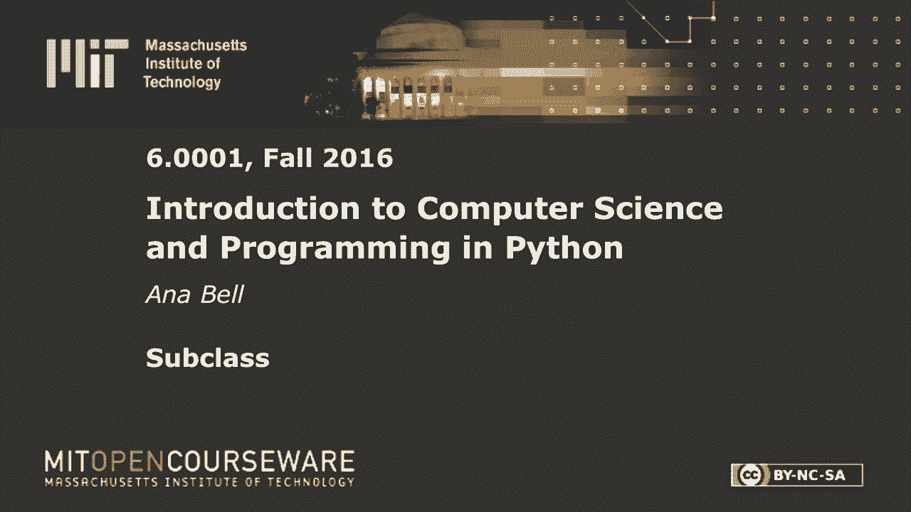
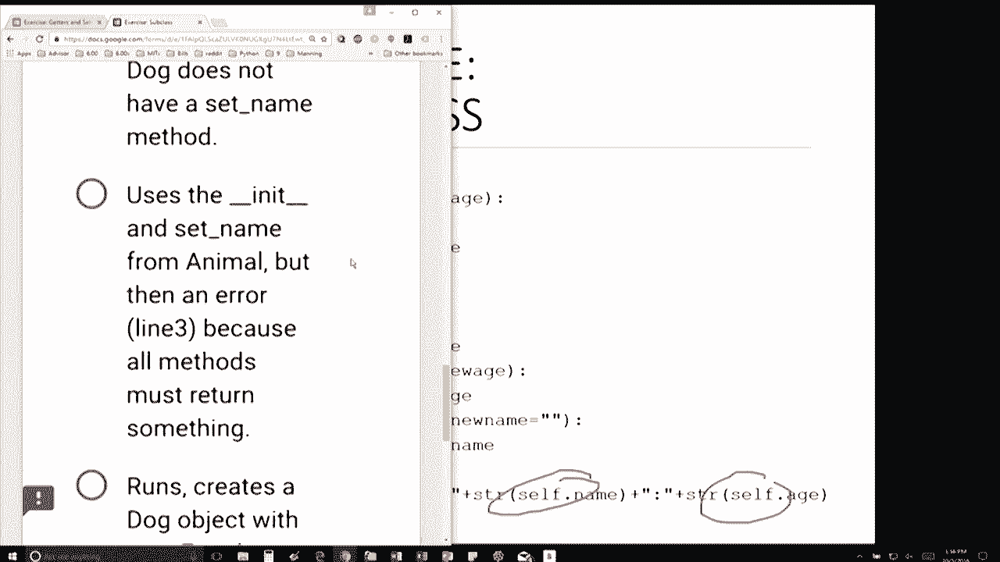
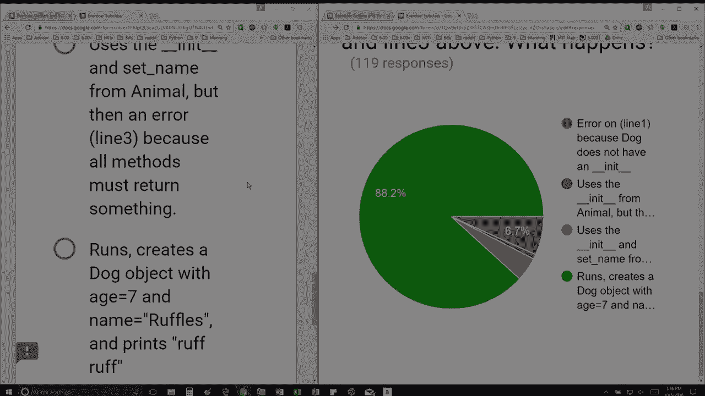

# P35：L9.3- 子类 - ShowMeAI - BV1Dw411f7KK

the following content is provided under，a Creative Commons license your support。

will help MIT OpenCourseWare continue to，offer high quality educational resources，for free。

to make a donation or view additional，materials from hundreds of MIT courses。

so I have here first part is just the，top part so I have some blank line and。

then I'm defining a method named speak，so write a line to replace blank that。

creates a class for a dog that inherits，from animal ok so the first thing I。

notice is that I need to write a，so my choices are these so I can I can。

tell it's either the first or the third，one and then I want to inherit from。

animal so I don't want to inherit from，object but I want to inherit from animal。

right so that's perfect next question，says with this definition of dog you run。

a program with those three lines what，happens okay so this is my definition。

and I have these three lines let's go，down here nice okay so with these three。

lines it says this first line says D is，equal to dog 7 so I'm creating a dog。

object with age 7 is this is a line，going to throw an error well this line。

actually looks for an init method this，particular class definition doesn't have。

a init method but hey I'm inheriting，from someone I'm inheriting from animal。

does animal have an init method and it，does as we saw in the slides okay so。

we're creating a new dog with age 7 and，name none next so that line doesn't。

throw an error the next line sets the，name to ruffles and again I don't have a。

set name method inside this particular，class but does my animal class my parent。

class have a setname method and yes it，does right here so I call that one so。

that line does not throw an error and，the third line says d dot speak which。

which is going to cause python to look，in this current class definition and it。

says hey I have a method here named，speak so I'm gonna use this one and it's。

going to print ruff ruff because it's a。

yeah so you can just it's like a，function you can just print things you。

