# 【双语字幕+资料下载】MIT 6.0001 ｜ 计算机科学与Python编程导论(2016·完整版) - P36：L10- 程序效率分析 1 - ShowMeAI - BV1Dw411f7KK

the following content is provided under，a Creative Commons license your support。

will help MIT OpenCourseWare continue to，offer high quality educational resources，for free。

to make a donation or view additional，materials from hundreds of MIT courses。

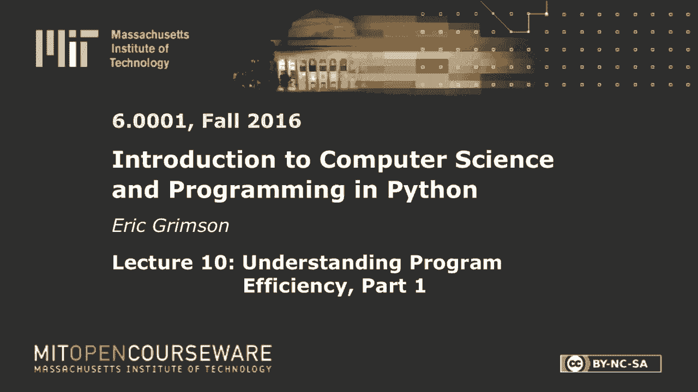

okay folks welcome back hope you had a。

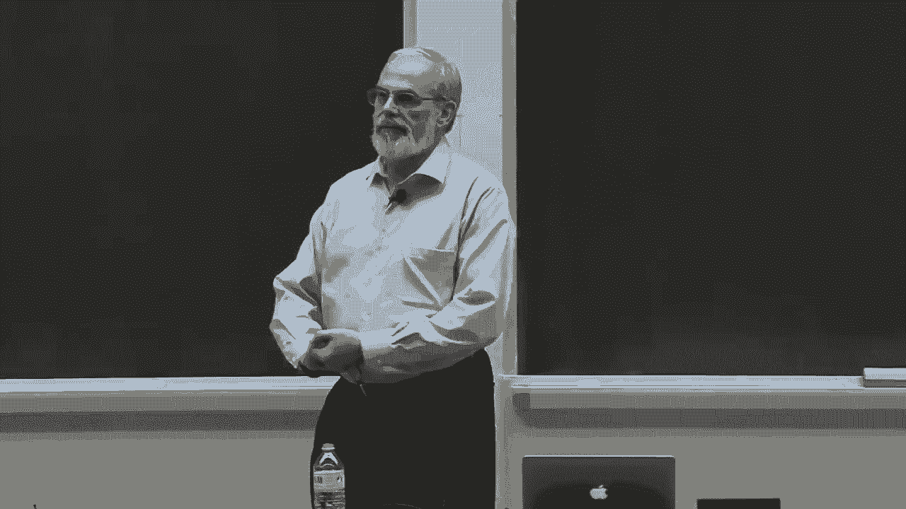

nice long weekend with no classes you，got caught up on all those problem sets。

that have been sneaking up on you。

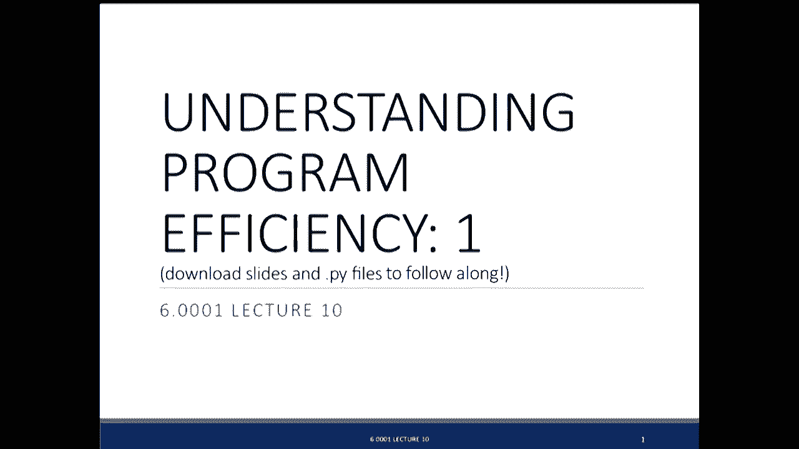

you enjoyed watching the Patriots and，Tom Brady come back up sorry I'm showing。

my local bias before we talk about，today's topic I want to take a second to。

set the stage and I want you to stop and，think about what you've seen so far in。

this course we're coming up on the end，of the first section of the course and。

you've already seen a lot starting to，learn about fundamentals of computation。

you've seen different kinds of data，structures both mutable and immutable so。

tuples and lists dictionaries different，ways of pulling things together seen a。

range of algorithms from simple linear，code to loops fours and Wiles you've。

seen iterative algorithms you've seen，recursive algorithms you've seen classes。

of algorithms divide and conquer greedy，algorithms bisection search a range of。

things and then most recently you saw，pulling things together with classes a。

way to group together data that belongs，together along with methods or。

procedures that are signed to manipulate，that data so you've had actually a。

fairly good coverage already of a lot of，the fundamentals of computation and。

you're starting to get geared up to be，able to tackle a pretty interesting。

range of problems today and Monday we're，going to take a little bit of a。

different look at computation because，now that you've got the tools to start。

building up your own personal，armamentarium of tools we'd like to ask。

a couple of important questions the，primary one of which is how efficient。

are my algorithms and by efficiency，we'll see it refers both to space and。

time but primarily to time and we like，to know both how faster my algorithm is。

going to run and how could I reason，about that's performance and that's what。

we're going to do with today's topics，we're going to talk about orders of。

growth we'll define what that means in a，few minutes we're going to talk about。

what's called the Big O notation and，we're going to begin to explore，different classes of algorithms。

before we do that though let's talk。

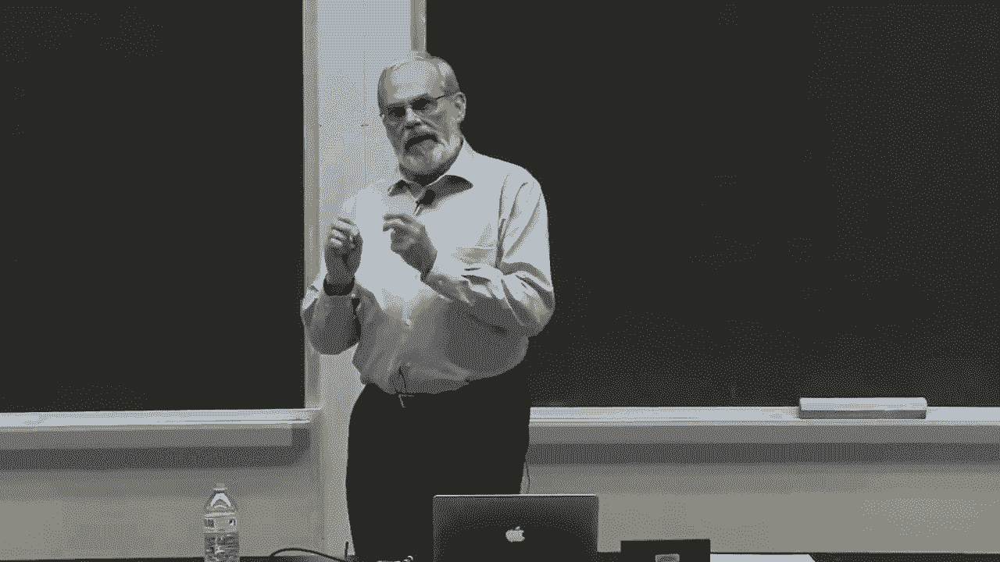

about why and I want to suggest to you，there are two reasons this is important。

to be considering first question is how，could we reason about an algorithm。

something you write in order to predict，how much time is it going to need to。

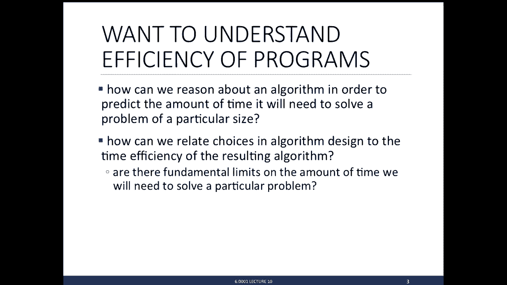

solve a problem of a particular size I，might be testing my code on small scale。

examples and I want to know if I run it，on a really big one how long is it going。

to take can I predict that can I make，guests about how much time I'm going to。

need to solve this problem especially if，it's in a real-world circumstance where。

time is going to be crucial equally，important is going the other direction。

we want you to begin to reason about the，algorithms you write to be able to say。

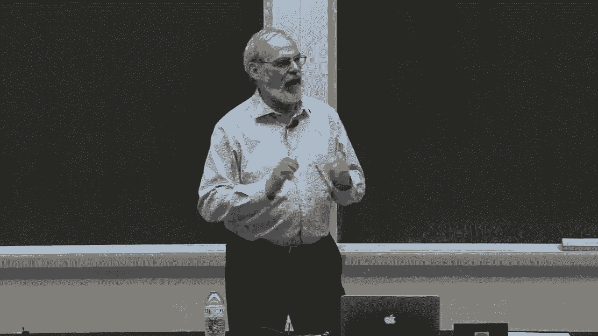

how does certain choices in a design of。

an algorithm influence how much time，it's going to take if I choose to do。

this recursively is that going to be，different than iteratively if I choose。

to do this with a particular kind of。

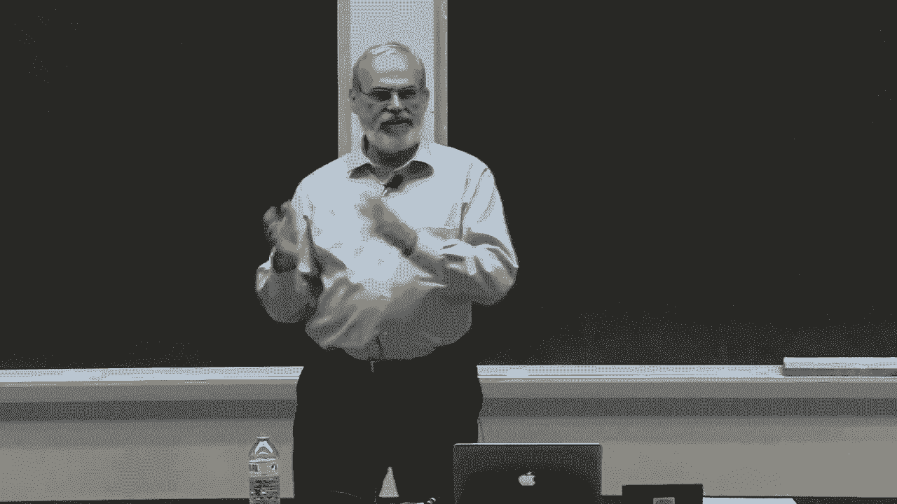

structure in my algorithm what does that，say about the amount of time I'm going。

to need and you're going to see there's，a nice association between classes of。

algorithms and the interior structure of，them and in particular we want to ask。

some fundamental questions are there，fundamental limits to how much time it's。

going to take to solve a particular。

problem no matter what kind of algorithm，I design around this and we'll see that。

there's some nice challenges about that，so that's what we're going to do over。

the next two days before we do though。

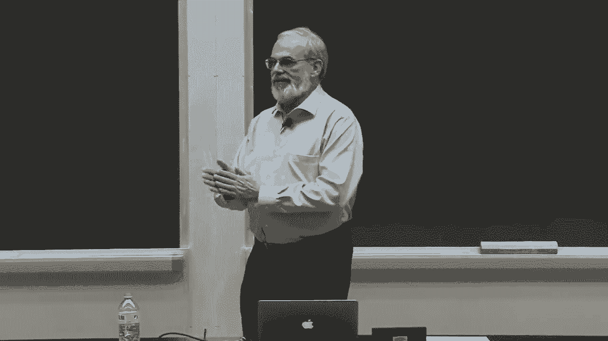

let's maybe ask the obvious question why，should we care could be on a quiz might。

matter to you better choice is because。

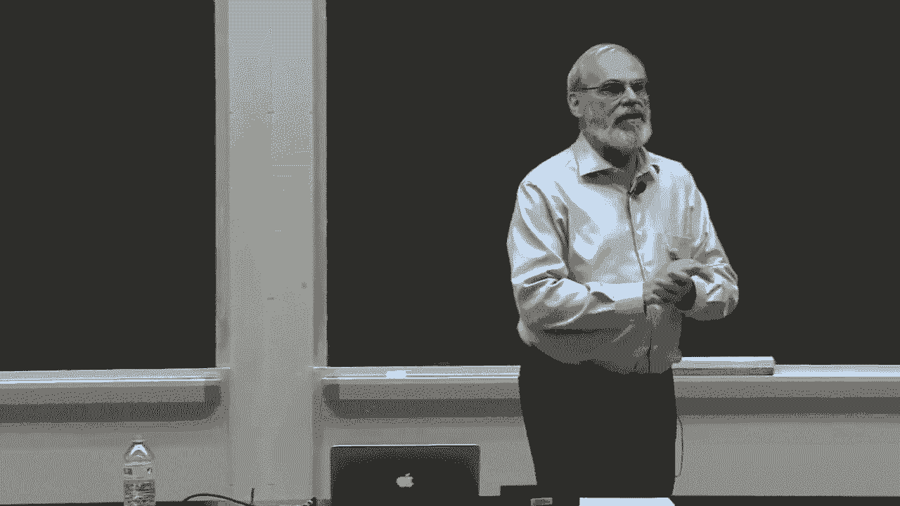

it actually makes a difference and I say，that because it may not be as obvious to。

you as it was in an earlier generation，so people with my gray hair or what's。

left of my gray hair like to tell，stories I'll make it short but I started，programming 41 years ago。

no sorry 45 years ago on punch cards you，don't know what those are unless you've。

been to a museum on a machine that，filled a half a room and that took about，in a frack。

of a second on your phone right this is，to tell you're living in a great time。

not independent of what's going to，happen on November 8th all right we'll。

stay away from those topics as well，won't we my point is yeah I tell old。

stories I'm an old guy but you might，argue look computers are getting so much。

faster does it really matter and I want，to say to you maybe it's obvious to you。

yes absolutely it does because in，conjunction with us getting faster。

computers we're increasing the sizes of，the problems the data sets we want to。

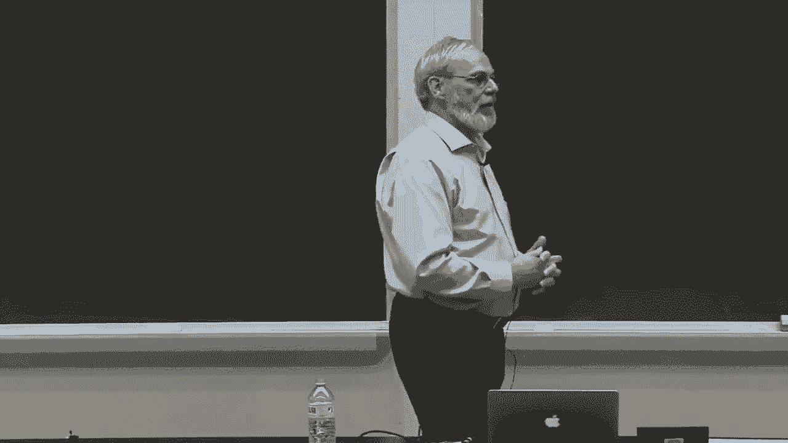

analyze are getting massive and I'll，give you an example I just pull this off。

of Google of course in 2014 I don't have，more recent numbers Google's served I。

think I have that number right 30，trillion pages on the web see the 30。

trillion or 30 quadrillion of you I，can't count that many zeros there it。

covered a hundred million gigabytes of。

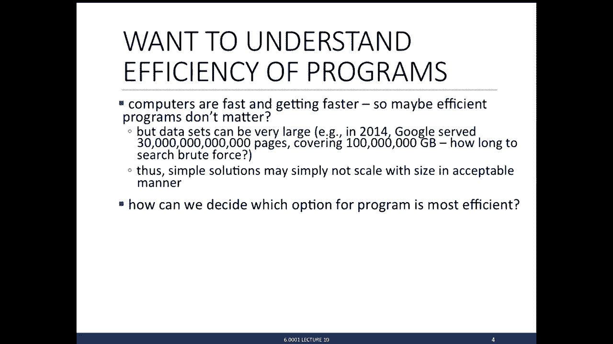

data and I suggest to you if you want to，find a piece of information on the web。

can you write a simple little search，algorithm that's going to sequentially。

go through all the pages and find，anything in any reasonable amount of。

time probably not right it's just，growing away too fast this by the way is。

of course why Google makes a lot of，money off of their their MapReduce。

algorithm for searching the web written，by the way or co-written by an MIT grad。

and the parent of a current MIT student，so there's a nice hook in there not that。

Google pays MIT royalties for that，wonderful thing by the way all right bad。

jokes aside searching Google ton of time，searching a genomics data set ton of。

time the data sets are growing so fast，you're working for the US government you。

want to track terrorists using image，surveillance from around the world。

growing incredibly rapidly pick a，problem the datasets grow so quickly。

that even if the computer speed up you，still need to think about how do I come。

up with efficient ways to solve those，problems so I want to suggest you while。

sometimes simple solutions are great，they're the easy ones to rate to right。

sorry at times you need to be more，sophisticated therefore we want to，reason about how do we measure。

efficiency and how do we relate al，design choices to the cost that's going，to be associated with it。

okay even when we do that we've got a，choice to make because we could talk。

about both efficiency in terms of time，or in terms of space meaning how much。

storage do I have inside the computer，and the reason that's relevant is。

there's actually in many cases a，trade-off between those two and you've。

actually seen an example which you may，or may not remember you may recall when。

we introduced dictionaries I showed you，a variation where you could compute。

Fibonacci using the dictionary to keep，track of intermediate values and we'll。

see you next week that it actually，tremendously reduces the time complexity。

that's called a trade-off in the sense，that sometimes I can pre-compute。

portions of the answer store them away，so that when I'm trying to a bigger。

version of the answer I can just look up，those portions so there's going to be a。

trade-off here we're going to focus for，purposes of this lecture in the next one。

on time efficiency how much time is it，going to take our algorithms to solve a。

problem okay what are the challenges in，doing that before we look at the actual。

tools and in fact this is going to lead，into the tools the first one is even if。

I've decided on an algorithm there are，lots of ways to implement that a while。

loop and a for loop might have slightly，different behavior I could choose to do。

it with temporary variables or using，direct substitution lots of little。

choices so an algorithm could be，implemented many different ways how do I。

measure the actual efficiency of the，algorithm second one is I might forgive。

them problem have different choices of，algorithm a recursive solution versus an。

iterative one using a dividing conquer'd，versus straightforward search we're。

going to see some examples of that so，I've got to somehow separate those。

pieces out and in particular I'd like to，separate out the choice of。

implementation from the choice of，algorithm I want to measure how hard is。

the algorithm not can I come up with a，slightly more efficient way of coming up。

with an implementation so here are three，ways I might do it I'm going to look at。

each one of them very briefly the，obvious one is we could be scientists。

time it write the code run a bunch of，test case run a timer use that to try。

and come up with a way of estimating，efficiency we'll see some challenges at。

that slightly more abstractly we could，count operations we could say here are。

the set of fundamental operations，mathematical operations comparisons。

setting values retrieving values and，simply say how many of those operations。

do I use in my algorithm as a function，of the size of the input and that could。

be used to give us a sense of efficiency，we're going to see both of those are。

flawed somewhat more in the first case，than the second one and so we're going。

to abstract that second one to a more，abstract notion of something we call an。

order of growth and we'll come back to。

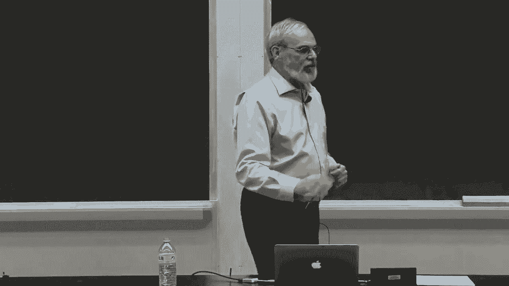

that in a couple of minutes this is the，one we're going to focus on so one the。

computer scientists use it leads to what，we call complexity classes so order。

growth or Big O notation is a way of，abstractly describing the behavior of an。

algorithm and especially the。

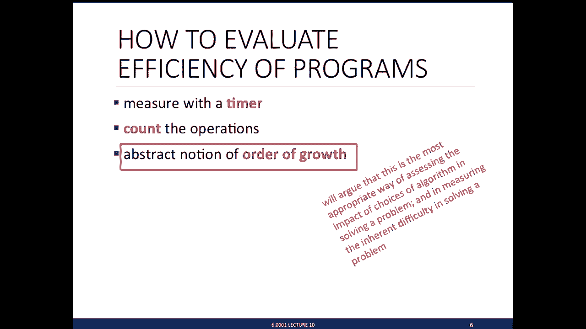

equivalences of different algorithms but。

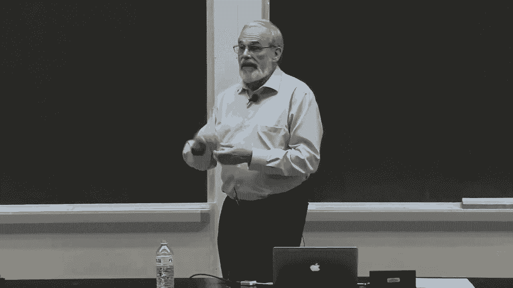

let's look at those timing Python，provides a time before you could import。

the time module and then you can call as，you can see right down here I might have。

defined a really simple little function，converts Celsius to Fahrenheit and in。

particular I could invoke the clock，method from the time module and what。

that does is it gives me a number as the，the number of some fractions of a second，currently there。

having done that I could call the，function and then I could call the clock。

again and take the difference to tell me，how much time it took to execute this。

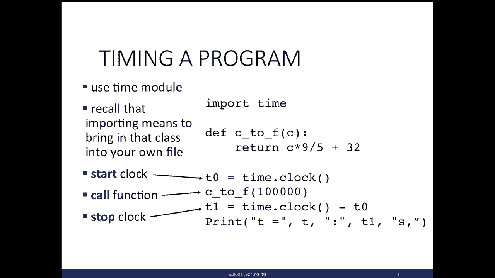

it's going to be a tiny amount of time，and then I could certainly print out。

some statistics I could do that over a，large number of runs different sizes of。

the input and come up with a sense of，how much time does it take here's the。

problem with that not a bad idea，again my goal is to evaluate algorithms。

do different algorithms have different，amounts of time associated with them the。

good news is that if I measure running，time it will certainly vary as the。

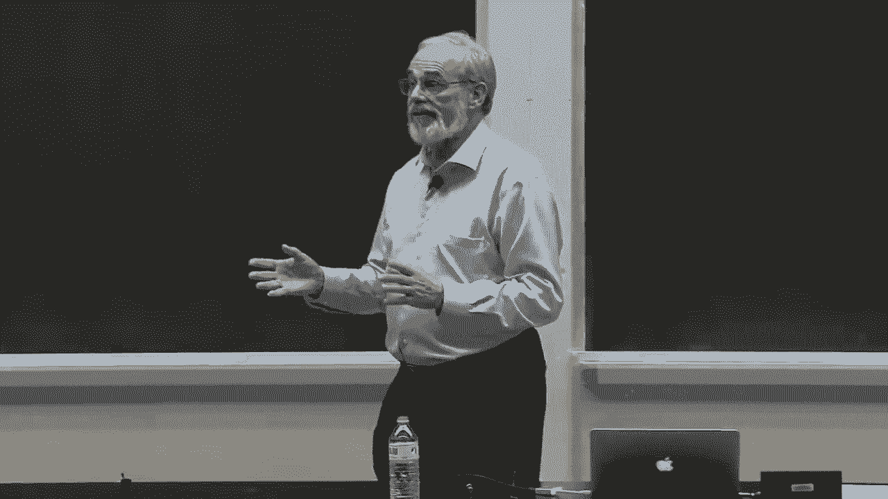

algorithm changes just what I want to，measure measure sorry，but one of the。

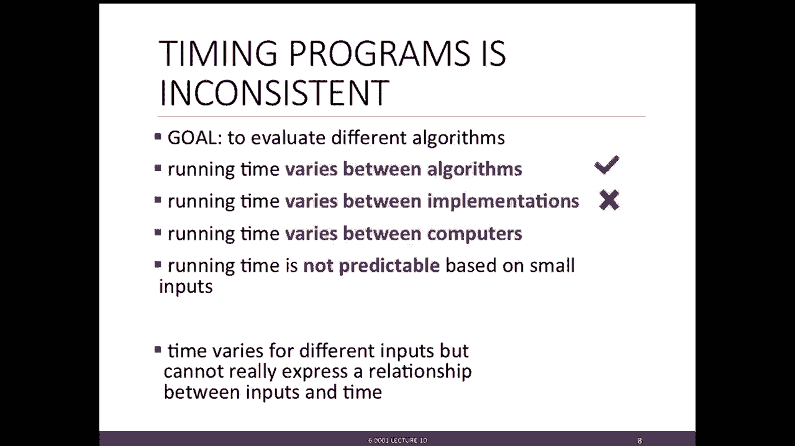

is that it will also vary as a function，of the implementation right if I use a。

loop that's got a couple of more steps，inside of it in one algorithm than。

another it's going to change the time，and I don't really care about that。

difference so I'm confounding or。

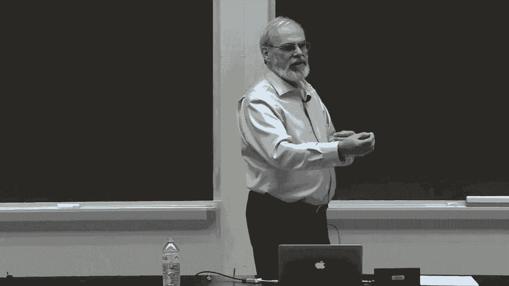

conflating implementation influence on，time with algorithm influence on time，not so good。

worse timing will depend on the computer，my Mac here is pretty old while these。

four computer versions is about five，years old I'm sure some of you have much。

more reason Mac's or other kinds of，machines your speeds may different from。

mine that's not going to help me in，trying to measure this and even if I。

could measure it on small size problems，that doesn't necessarily predict what。

happens when I go to really large size，problems because of issues like the time。

it takes to get things out of memory and，bring them back into the computer so。

what it says is that timing does vary，based on what I'd like to measure but it。

varies on a lot of other factors and，it's really not all that valuable。

okay got rid of the first one let's，abstract that abstract I'm going to make。

the following assumption I'm going to，identify a set of primitive operations I。

kind of get to say what they are but the，obvious one is I say what does the。

machine do for me automatically that，would be things like arithmetic or。

mathematical operations multiplication，division subtraction comparisons。

something equal to another thing，something greater than something less。

than assignments set a name to a value，and retrieval from memory I'm going to。

assume that all of these operations take，about the same amount of time inside my。

machine nice thing here is then it，doesn't matter which machine I'm using。

I'm measuring how long does the，algorithm take by counting how many。

operations of this type are done inside，of the algorithm and I'm going to use。

that count to come up with a number of，operations execute it as a function of。

the size of the input and if I'm lucky，that'll give me a sense of what's the。

efficiency of the algorithm so this，one's pretty boring it's got three steps，write a multiplication。

a division and in addition for if you，count the return but if I had a little。

thing here that added up the integers，from 0 up to X I've got a little loop。

inside here and I could count operations，so in this case it's just as I said。

three operations here I've got one，operation I'm going to doing an。

assignment and then inside here in，essence there's one operation to set I。

to a value from that iterator initially，it's going to be 0 and then it's going。

to be 1 and you get the idea and here，that's actually two operations。

it's nice Python shorthand but what is，that operation it says take the value of。

total and the value of I add them，together it's one operation and then set。

that value or rather set the name total，to that new value so second operation so。

you can see in here I've got three，operations and what else do I have well。

I'm going to go through this loop x，times all right I do it for I equals 0。

then for I equal 1 and so on so I'm，going to run through that loop x times。

and if I put that together I get a nice。

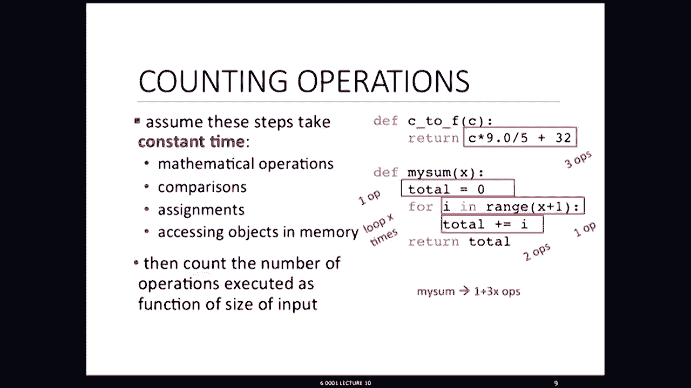

little expression 1 plus 3 X，actually I've probably cheated Eurasians。

they cheated I probably should have，counted the return as one more operation。

so that would be 1 plus 3 X plus 1 or 3，X plus 2 operations why should you care。

it's a little closer to what I'd like，because now I've got an expression that。

tells me something about how much time，is this going to take as I change the，size of the problem。

if X is equal to 10 it's going to take，me 32 operations if X is equal to 100。

302 operations if X is equal to a，thousand three thousand and two。

operations and if I wanted the actual，time I just multiplied that by whatever。

that a constant amount of time is for。

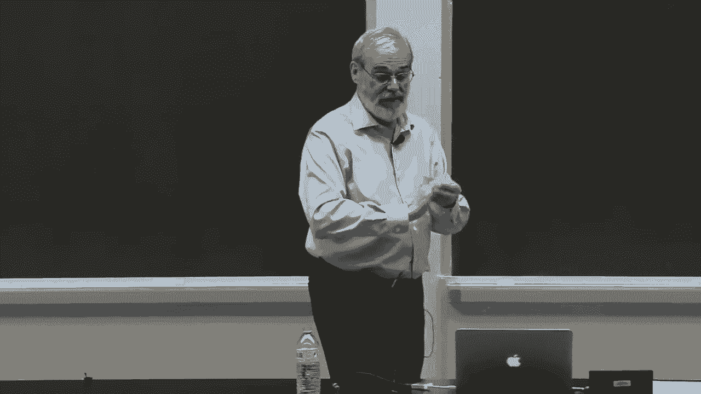

each operation I've got a good estimate，of that sounds pretty good not quite。

what we want but it's close so if I was，counting operations what can I say about。

it first of all it certainly depends on，the algorithm that's great number of。

operations is going to directly relate，to the algorithm I'm trying to measure。

which is what I'm after，unfortunately it still depends a little。

bit on the implementation let me show，you what I mean by that by backing up，for a second。

suppose I were to change this for loop，to a while loop，I'll set I equal to zero outside of the。

loop and then while I is less than X，plus one I'll do the things inside of。

that that would actually add one more，operation inside the loop because I both。

have to set the value of I and I have to，test the value of I as well as doing the。

other operations down here and so rather。

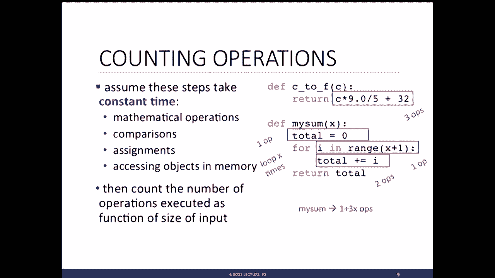

than getting three X plus one I would，get four X plus one yeah as the。

government says what's the difference，between three and four you know when。

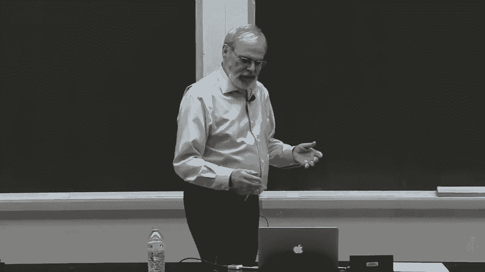

you're talking about really big numbers，problem is in terms of counting it does。

depend and I want to get rid of that in，a second so it still depends a little。

bit on the implementation I remind you I，wanted to measure impact of the。

algorithm the other good news is the，count is independent of which computer I。

run on as long as all my computers come，with the same set of basic operations I。

don't care what the time of my computer。

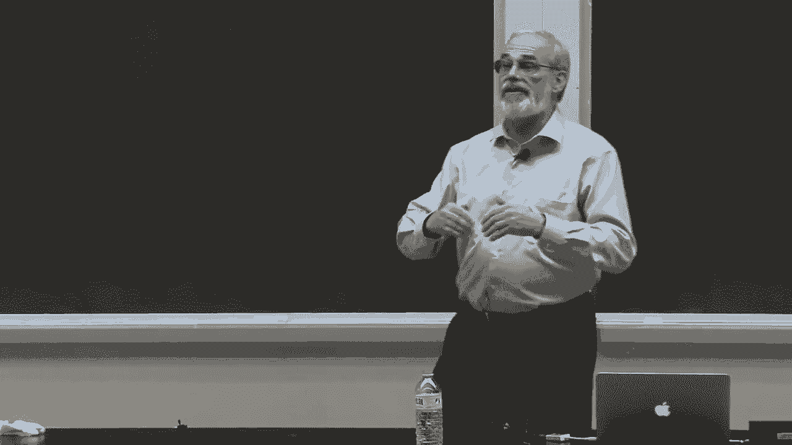

is versus yours to do those operations，I'm measuring how much time it would。

take and I should say by the way one of，the reasons I want to do it is less to。

know is there going to take 37。4 to，femtoseconds or not but rather to say if。

this algorithm has a particular behavior，if I double the size of the input does。

that double the amount of time I need，does that quadruple the amount of time I。

need does it increase it by a factor of。

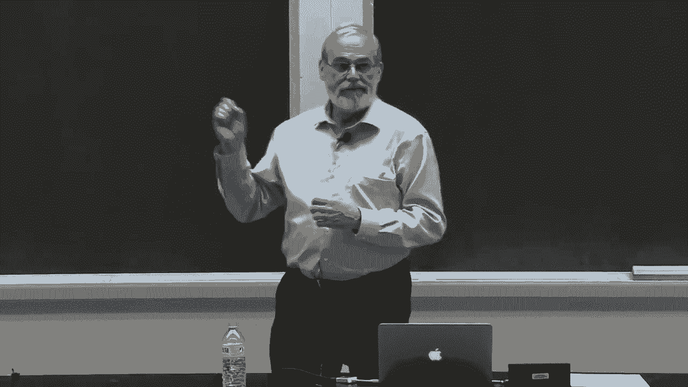

ten and here what matters isn't the，speed of the computer it's the number of。

operations the last one I'm not going to，really worry about but we'd have to。

really think about what are the，operations we want to count I made an。

assumption that the amount of time it，takes to retrieve something from memory。

is the same as the amount of time it，takes to do a numerical computation that。

may not be accurate but this one could，probably be dealt with by just agreeing。

on what are the common operations and，then doing the measurement so this is。

closer excuse me it's certainly not，count varies for different inputs and we。

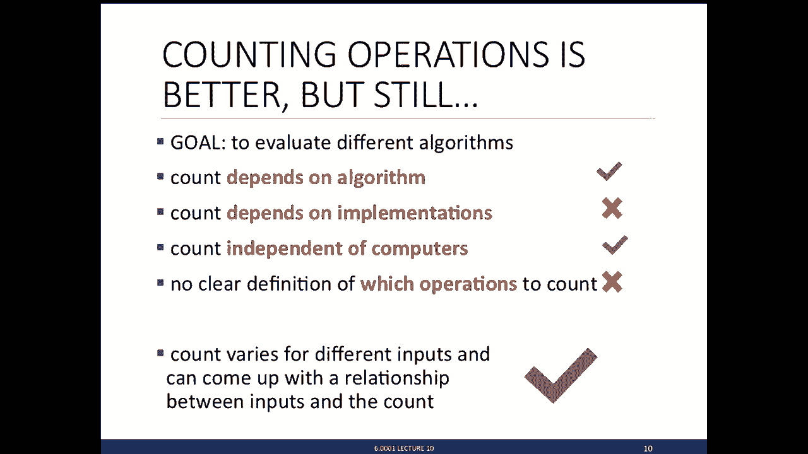

can use it to come up with，a relationship between the inputs and，the count and for the most part it。

reflects the algorithm not the，implementation but it still got that。

last piece left there so I need to get，rid of the last piece so what can we say。

here timing and counting do evaluate or，reflect implementations I don't want。

that timing also evaluates the machines，what I want to do is just evaluate the。

algorithm and especially I want to，understand how does it scale I'm going。

to say what I said a few minutes ago，game if I were to take an algorithm and。

I say I know what its complexity is my，question is if I double the size of the。

input what does that say to the speed，because that's going to tell me。

something about the algorithm I want to，say what happens when I scale it and in。

particular I want to relate that to the，size of the input so here's what we're。

going to do we're going to introduce，orders of growth some wonderful tool in。

computer science and what we're going to，focus on is that idea of counting。

operations but we're not going to worry，about small variations whether it's。

three or four steps inside of the loop，I'm going to show that that doesn't。

matter and if you think about my，statement of does it double in terms of。

size or speed or not sorry time or not，whether it goes from 3 to 6 or 4 to 8。

it's still a doubling so I don't care，about those pieces inside I'm going to。

focus on what happens when the size of，the problem gets arbitrarily large I。

don't care about counting things from 0，up to X when X is 10 or 20 what happens。

when it's a million a hundred million，what's the asymptotic behavior of this。

and I want to relate that time needed，against the size of the input so I can。

make that comparison I suggested ok so，to do that we got to do a couple of。

things we have to decide what are we，going to measure and then we have to。

think about how do we count without，worrying about implementation details so。

we're going to express efficiency in，terms of size of input and usually this。

is going to be obvious if I've got a，procedure it takes one argument that's。

an integer the size of the integer is，the thing I'm going to measure things in。

if I double the size of that integer，what happens to the computation if I'm。

computing something over a list，typically the length of the list。

is going to be the thing I'm going to，use to characterize the size of the。

problem if I've got and we'll see this，in a second a function that takes more。

than one argument I get to decide what's，the parameter I want to use if I'm。

searching to see is this element in that，list typically I want to worry about。

what's the size of the list not what's，the size of the element but we have to。

specify what is it we're measuring and，we're going to see examples of that in。

just a second okay so now we start，thinking about that sounds great。

certainly find computing something，numeric sum of integers from 0 up to ax。

it's kind of obvious X is the size of my，problem how many steps does it take I。

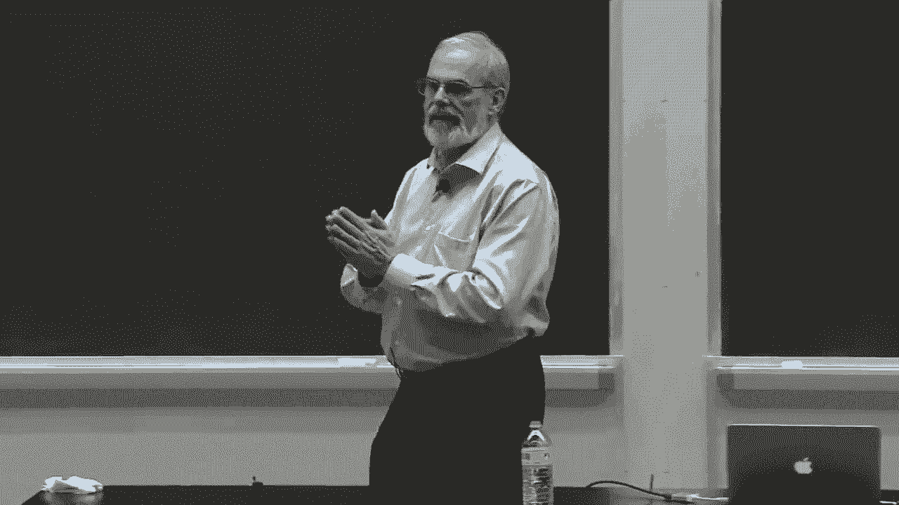

can count that but in some cases the，amount of time the code takes is going。

to depend on the input so let's take，this little piece of code here and I do。

hope by now even though we flash up code，you're already beginning to recognize。

what does it do not the least of which，by the clever name that we chose but。

this is obviously just a little function，it runs through a loop running like I。

sorry let a for loop that takes I for，each element in the list l and it's。

checking to see is i equal to the，element I've provided and what it is I'm。

going to return true if I get all the，way through the loop and I didn't find。

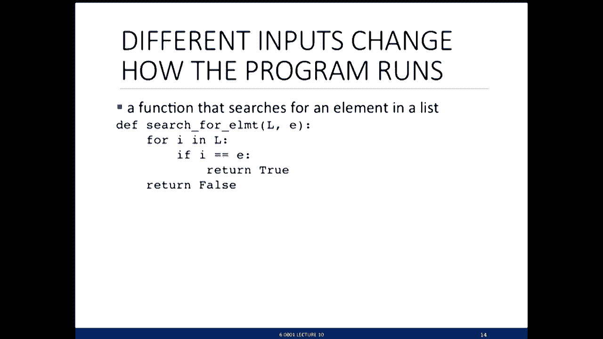

it I'm going to return false it's just，saying is e in my input list L how many。

steps is this going to take，well we can certainly count the number。

steps in the loop right we've got a set，I we got to compare I and potentially we。

got to return so there's at most three，steps inside the loop but depends on how。

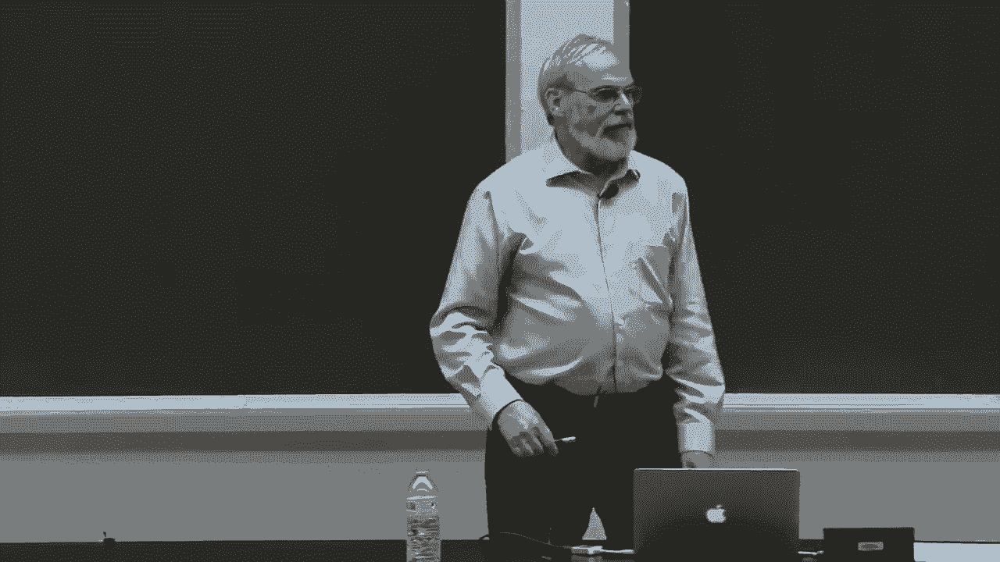

lucky I'm feeling right if he happens to，be the first element in the list it goes。

through the loop once I'm done great I'm，not always that lucky if E is not in the。

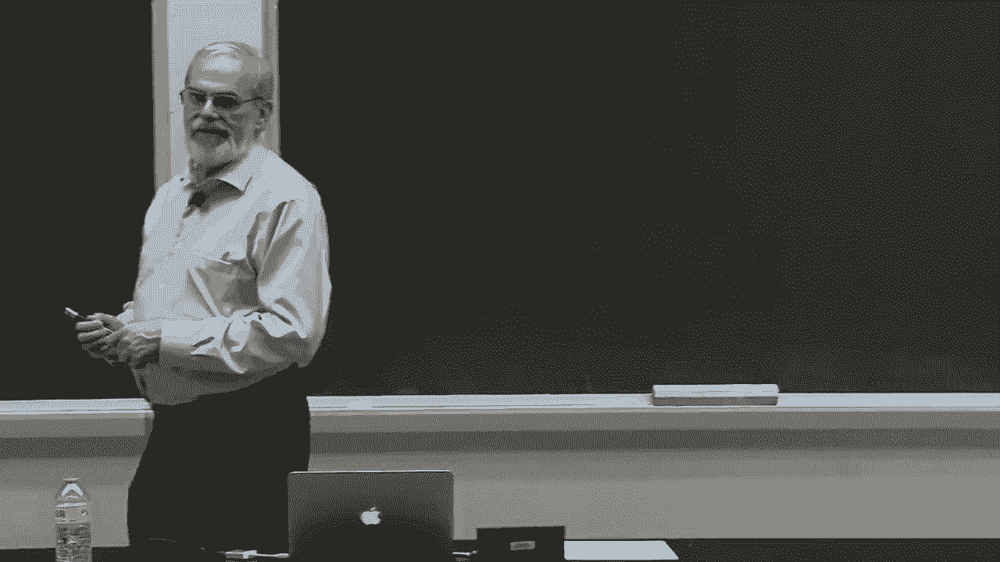

list then it will go through this entire，loop until it gets all the way through。

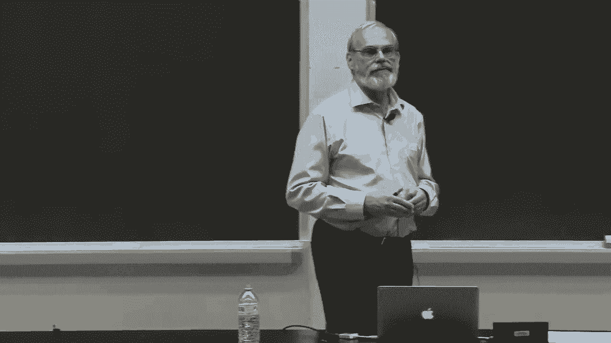

the elements of L before saying false so，this sort of a best-case scenario this。

is the worst case scenario gain if I'm，assigned and say well let's run some。

trials let's do a bunch of examples and，see how many steps does it go through。

and that would be the average case on，average I'm，likely to look at half the elements in。

the list before I find it right I'm，lucky it's early on if I'm not so lucky。

it's later on which one do I use well，we're going to focus on this one because。

that gives you an upper bound on the。

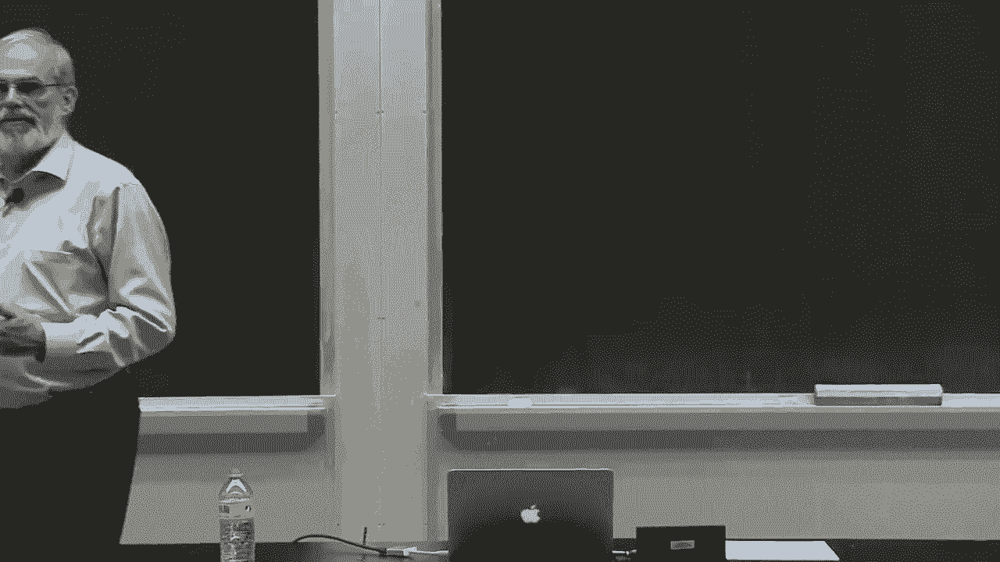

amount of time it's going to take what，happens in the worst case scenario we。

will find at times that's valuable to，look at the average case to give us a。

rough sense of what's going to happen on，average but usually when we talk about。

complexity we're going to focus on the。

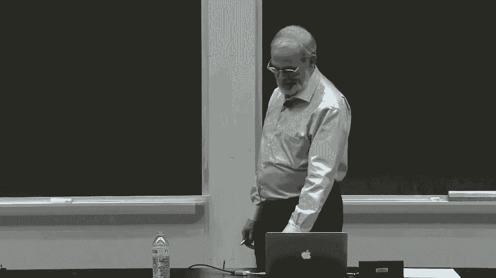

worst case behavior so to say it a，little bit different way let's go back。

to my example suppose you gave it a list，L of some length length of L would call。

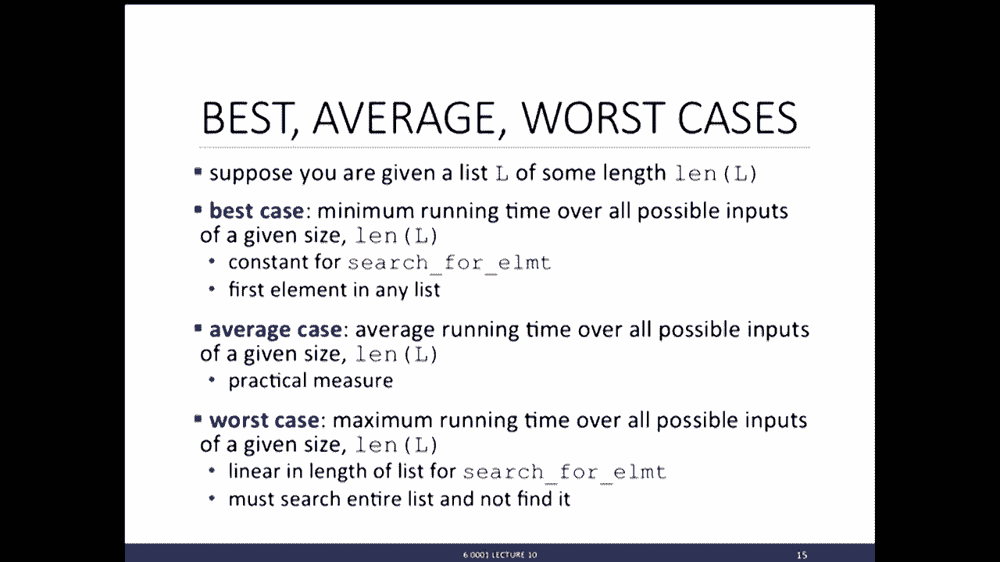

that and if you like then my best case，would be the minimum running time and in。

this case it would be for the first，element in the list and notice in that。

case the number of steps I take would be，independent of the length of L that's。

great doesn't matter how long the list。

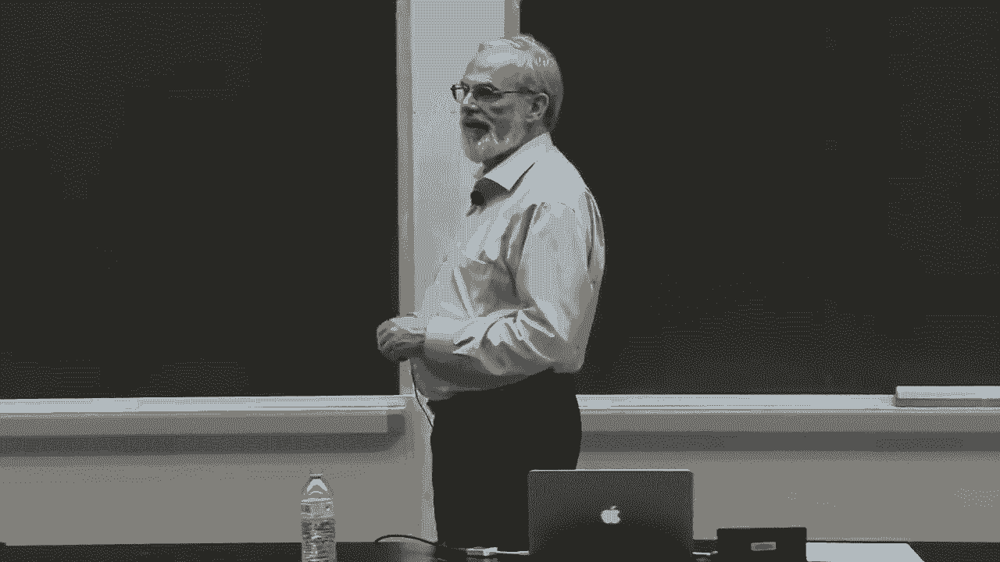

is if I'm always going to find that the，first element I'm done the average case。

would be the average over the number of，steps I take depending on the length of。

the list is going to grow linearly with，the length of the list it's a good。

practical measure but the one I want to，focus on will be the worst case and here。

the amount of time as we're going to see。

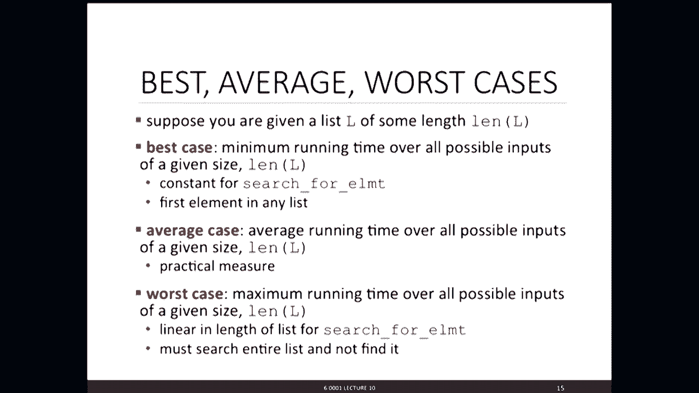

in a couple of slides is linear in the，size of the problem meaning if I double。

the length of the list in the worst case，it's going to take me twice as much time。

to find that it's not there if I，increase the length of list by factor of。

ten in the worst case is going to take，me ten times as much time as it did in。

the earlier case to find out that the，problems not there and that linear。

relationship is what I want to capture，so we're going to focus on that what's。

the worst case behavior and we're about，ready to start talking about orders or。

growth but here then it's what orders or，growth are going to provide for me I。

want to evaluate efficiency particularly，when the input is very large what。

happens when I really scale this up I，want to express the growth of the。

programs run time as that input grows，not the exact run time but that notion，it take。

what's the relationship between，increasing the size of the input and the。

increase in the amount of time it takes，to solve it we're going to put an upper。

bound on that growth and if you haven't，seen this a math that basically says I。

want to come up with a description that，is at least as big as sorry as big as or。

bigger than the actual amount of time it，goes it's going to take and I'm going to。

not worry about being precise talk about。

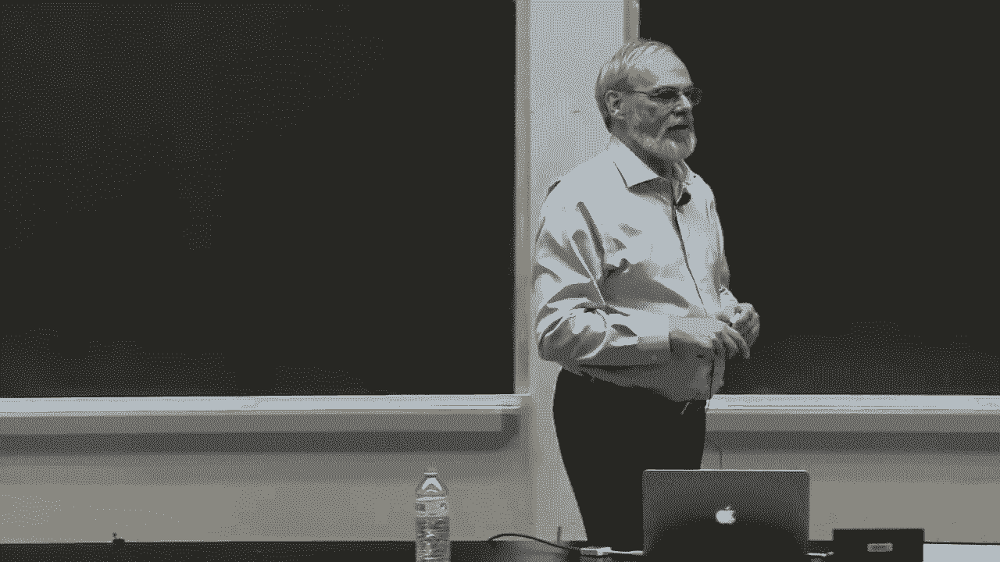

being order of rather than excite，exactly I don't need to know to the。

femtosecond how long this is going to。

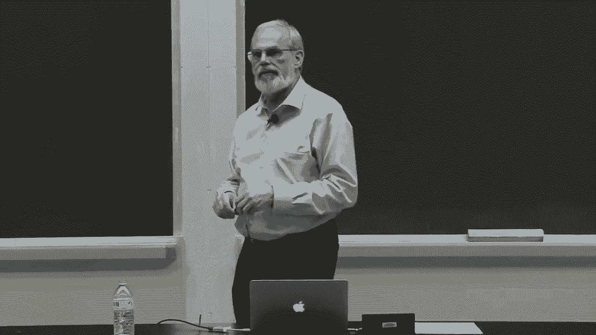

take or to exactly one operation how，long it's going to take but I want to。

say things like this is going to grow，linearly I double the size of the input。

it doubles the amount of time or this is，going to grow quadratically I double the。

size of the input it's going to take，four times as much time to solve it or。

if I'm really lucky this is going to，have constant growth no matter how I。

change the input it's not going to take，any more time to do that we're going to。

look at the largest factors in the run，time which piece of the program takes。

the most time and so in orders of growth，we are going to look for a as tight as。

possible an upper bound on the growth as，a function of the size of the input in。

almost ready to look at some examples so，here's the notation we're going to use。

it's called Big O notation I have to，admit and John's not here today to。

remind me the history I think it comes，because we used Omicron god knows why。

sounds like something from Futurama but，we used Omicron as our symbol to define。

this I'm having such good luck with bad，jokes today you're not even wincing when。

I throw those things out but that's okay，it's called Big O notation we'll you're。

going to use it we're going to describe，it，it describes the worst case because it's。

often the bottleneck we're after and as，we've said it's going to express the。

growth of the program relative to the，input size okay let's see how we go from。

counting operations to getting to orders，the growth then we're going to define。

some examples of order growth and we're。

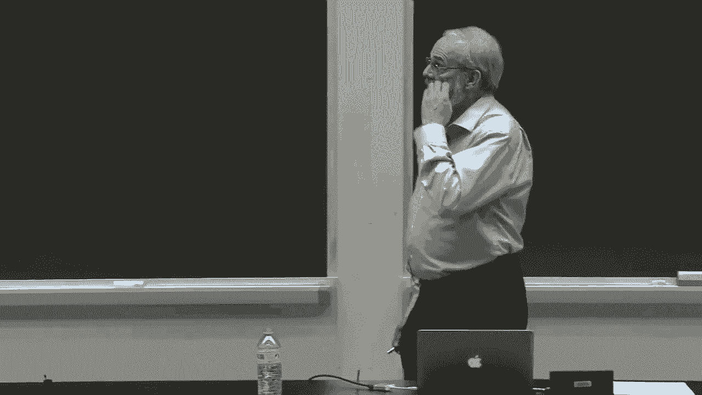

gonna start looking at algorithms here's，a piece of code you've seen before again。

hopefully you recognize or can see，fairly quickly what it's doing computing。

factorial the iterative way basically，remember in fact，oil is n times n minus 1 times n minus 2。

all the way down to 1，hopefully assuming in is a non-negative，integer here we're going to set up an。

internal variable called answer and then，we're just going to run over a loop as。

long as n is bigger than 1 we're going，to multiply answer by n store it back in。

to answer decrease them by 1 we'll keep，doing that until we get out of the loop。

and we're going to return answer I'm，going to start by counting steps that's。

why the way just to remind you that in，fact there are two steps here so what do。

I have I've got one step up there to set，answer to one I'm setting up n sorry I'm。

not setting up in I'm going to test N，and then I'm going to do two steps here。

because I got to multiply answer by N，and then set it to answer and I。

similarly got two steps there because，I'm subtracting one from N and then。

setting it to n so I've got two plus，four plus the test which is 5 I've got。

one outside here I got one outside there。

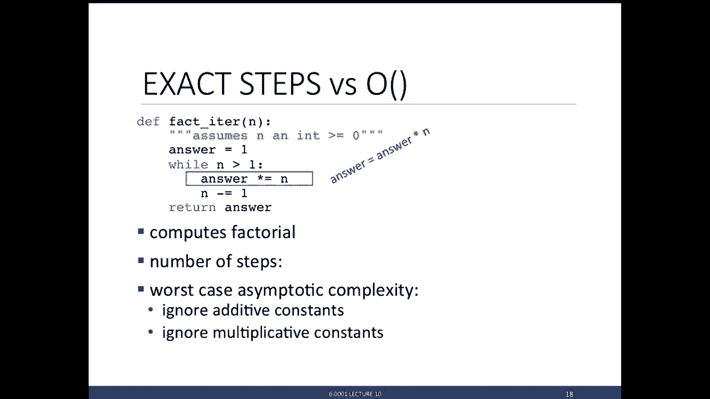

and I'm going to go through this loop n，times so I would suggest it if I count。

number of steps it's 1 plus 5n plus 1，okay sort of what we did before 5n plus。

2 is the total number of steps that I，use here but now I'm interested in。

what's the worst-case behavior well in，this case it is the worst case behavior。

because it doesn't have decisions，anywhere in here but I just want to know。

what's the asymptotic complexity you。

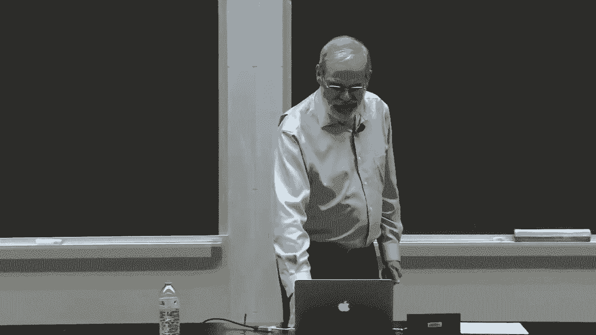

know I'm going to say oh sorry that is，to say I could do this different ways I。

could have done this with two steps like，that that would have made it not just。

one plus five n plus one would have made，it one plus six n plus one because I've。

got an extra step I put that up because，I want to remind you I don't care about。

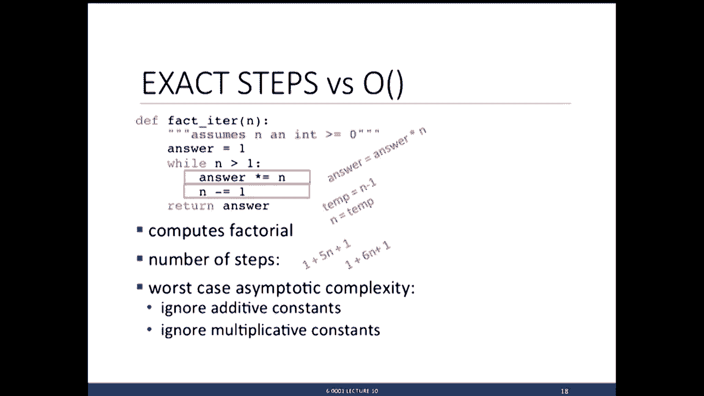

implementation differences and so I want，to know what captures both of those。

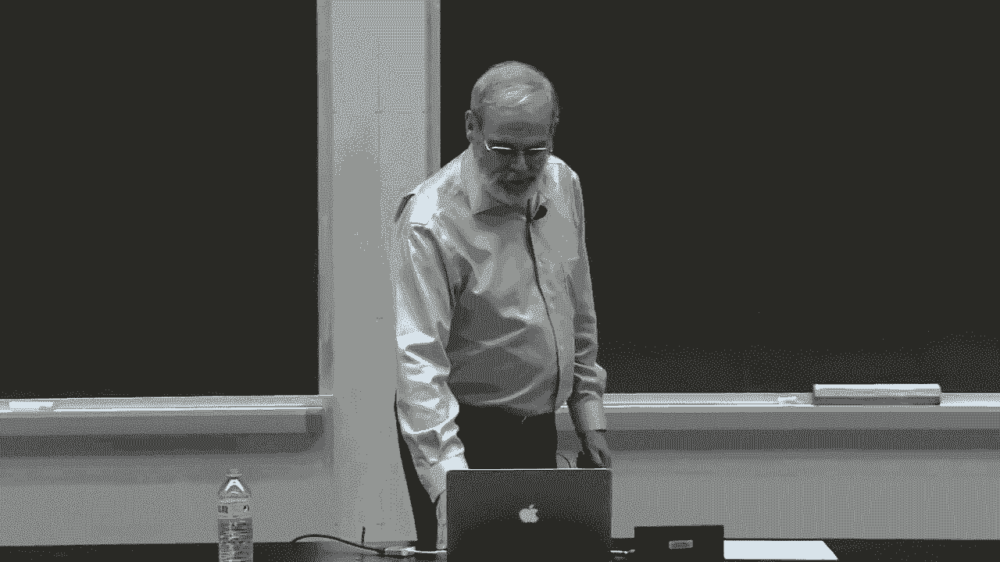

behaviors and in Big O notation I say，that's order M grows linearly I'm going。

to keep doing this to you until you，really do wince at me if I were to。

double the size of M whether I use this，version or that version the amount of。

time the number of steps is basically，going to double，now you say wait a minute you know five。

n plus two you know if I n is is ten，that's fifty two is if n is 20 that's。

102 that's not quite doubling and you're，right but remember we really care about。

this in the asymptotic case when n gets。

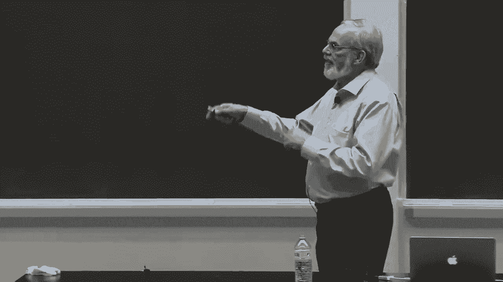

really big those extra little pieces，don't matter and so what we're going to。

do is we're going to ignore the additive，constants and we're going to ignore the。

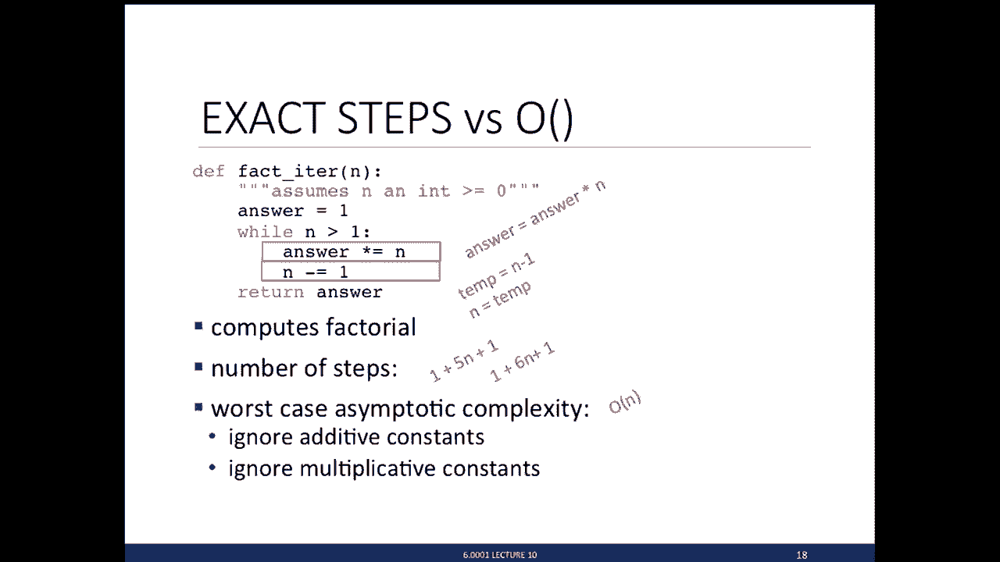

multiplicative constants when we talk，about orders of growth so what does Oh。

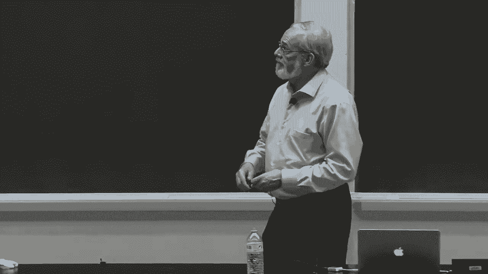

Levin measure now I'm just summarizing，here we want to describe how much time。

is needed to compute or how does the，amount of time rather needed to compute。

a problem grow as the size of the，problem itself grows so we want an。

expression that counts that asymptotic，behavior and we're going to focus as a。

consequence on the term that grows most，rapidly so here are some examples and I。

know if you're following along you can，already see the answers here but we're。

going to do this to simply give you a，sense of that if I'm counting operations。

and I come up with an expression that，has N squared plus two n plus two。

operations that expression I say is，order N squared the two and the two n。

don't matter and think about what，happens if you make end really big right。

N squared is much more dominant than the，other terms we see that's order N，squared。

even this expression we say is order N，squared now in this case for lower。

values of n this term is going to be the，big one in terms of number of steps I。

have no idea how I wrote such an，inefficient inefficient algorithm that。

it took a hundred thousand steps to do，something but if I had that expression。

for smaller values of n this matters a，lot this is a really big number but when。

I'm interested in the growth and that's，the term that dominates and you see the。

idea or begin to see the idea here when，I have sorry before I go back there when。

I have expressions if it's a polynomial，expression it's the highest order term。

that's the term that captures the，complexity both of these are quadratic。

this term is order n because n grows，faster than log of N，this funky-looking term even though that。

looks like the big number there and it，is a big number that expression we say。

is order n log in because again if I，plot out as how this changes as I make n。

really large this term eventually takes，over as the dominant term what about。

that one what's the big term there how，many people think it's n to the。

thirtieth show of hands how many people，think it's 3 to the N。

show of hands thank you you're following，along you're also paying attention how。

many people think I should stop asking，questions no show of hands alright but。

you're right Exponential's are much，worse than powers even something like。

this again it's going to take a big，value of n before Gesser but it does get。

there and that by the way is important，because we're going to see later on in。

the term that there are some problems，where it's believed that all of the。

solutions are exponential and that's a，pain because it says it's always going。

to be expensive to compute so that's how，we're going to reason about these things。

and to see it visually here are the，difference between difference is between。

those different classes something that's，constant the amount of time doesn't。

change as I change the size of the input，something that linear grows as a。

straight line as you would expect nice，behavior quadratic starts to grow more。

quickly log is always better than linear，because it slows down as we increase the。

size n log n log in our log linear is a，funky term but we're going to see it's a。

very common complexity for really，valuable algorithms and computer science。

and it has a nice behavior sort of，between the linear and the quadratic an。

exponential blows up just to remind you，of that all right let me show you how。

we're going to do the reasoning about，this so here's how we're going to reason。

about it we've already seen some code，where I started working through this。

process of counting operations here are，the tools I want you to use given a。

piece of code you're going to reason，about each chunk of code separately if。

you've got sequential pieces of code，then the rules are called the law of。

addition for for order of growth is，that the order of growth of the。

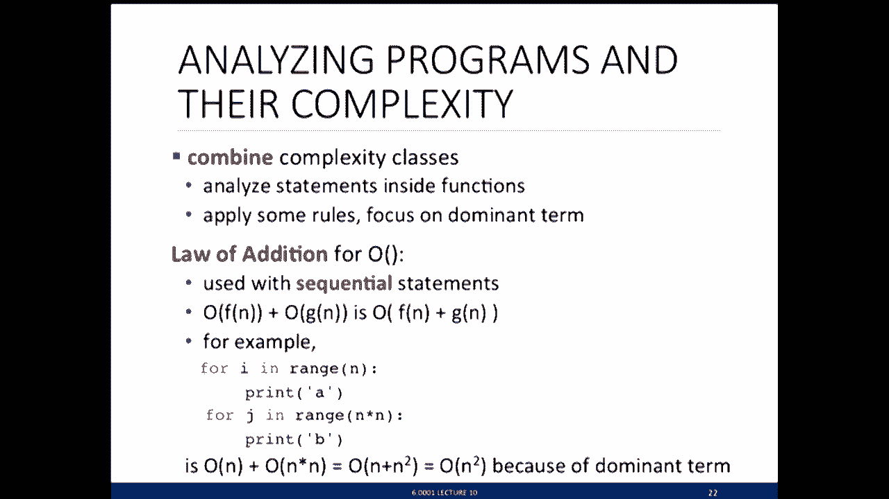

combination is the combination of the，order of the growth say that quickly ten。

times but let's look at an example of，that here are two loops you've already。

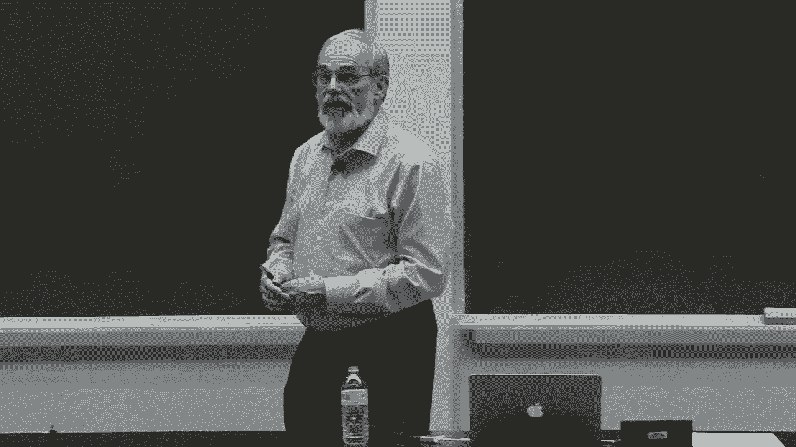

seen examples of how to reason about，those loops for this one it's linear in。

the size of M I'm going to go through，the loop end times doing a constant。

amount of things each time around by，what I just showed that's order n this。

one again I'm doing a just a constant，number of things inside the loop but。

notice that it's N squared so that's，order N squared n times n the。

combination is I have to do this work，and then that works so I write that as。

saying that is order of n plus order of，N squared but by this up here that is。

the same as saying what's the order of，growth of n plus n squared oh yeah we。

just saw that says it's n squared so。

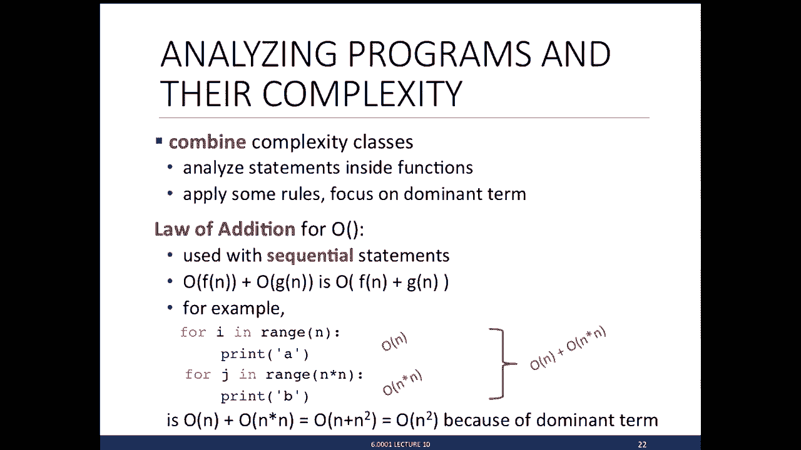

audition or the law of addition lets me，reason about the fact that this will be。

an order N squared algorithm，second we're going to use it's called。

the law of multiplication and this says，when I have nested statements or nested。

loops I need to reason about those and，in that case what I'm going to argue or。

not argue state is that the order of，growth here is a multiplication ideas。

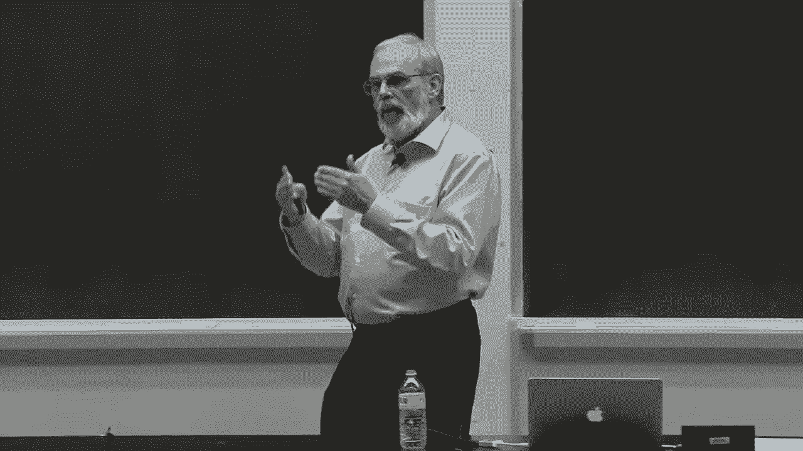

when I have nested things I figure out，what's the order of growth of the inner。

part what's the order of growth of the，outer part and I'm going to multiply。

that try game I'm going to multiply，together those orders of growth to get。

the overall order of growth if you think，about it it makes sense look at my。

little example here it's a trivial，little example but I'm looping for I。

from 0 up to n for every value of I I'm。

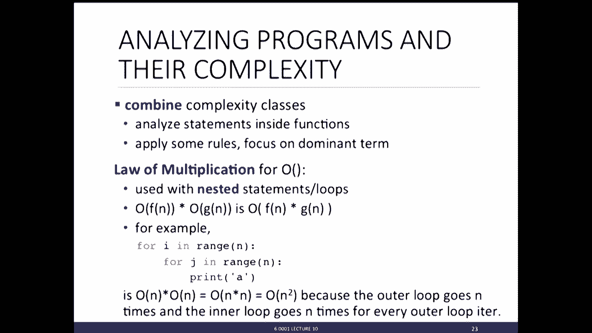

looping for J from 0 up to n and I'm，printing out a on the phones I'm saying。

a along oh come on at least throw，something at me when it's that bad right。

want to make sure you're still awake ok，you get the idea but what I want to show。

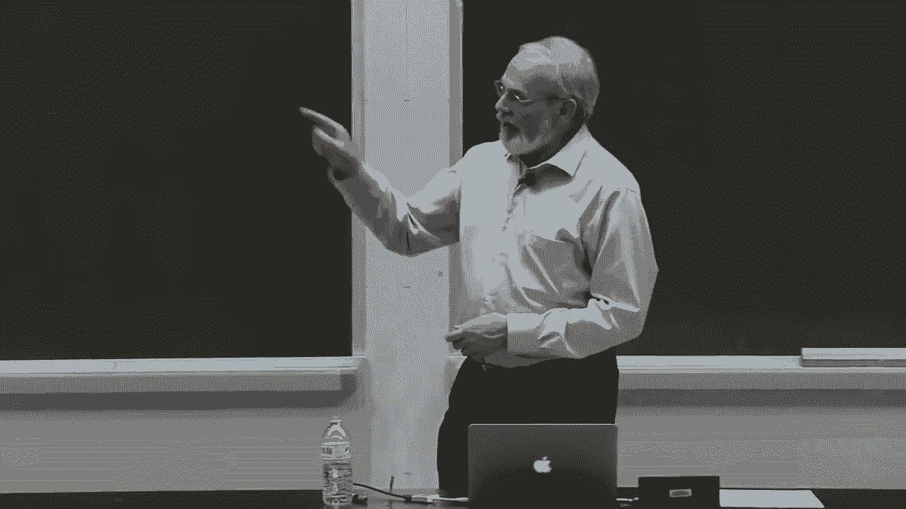

you here is notice the order of growth，that's order in right I'm doing that n。

times but I'm doing that for each value，by the outer piece here loops also end。

times for each value of I I'm doing，order and things so I'm doing order of n。

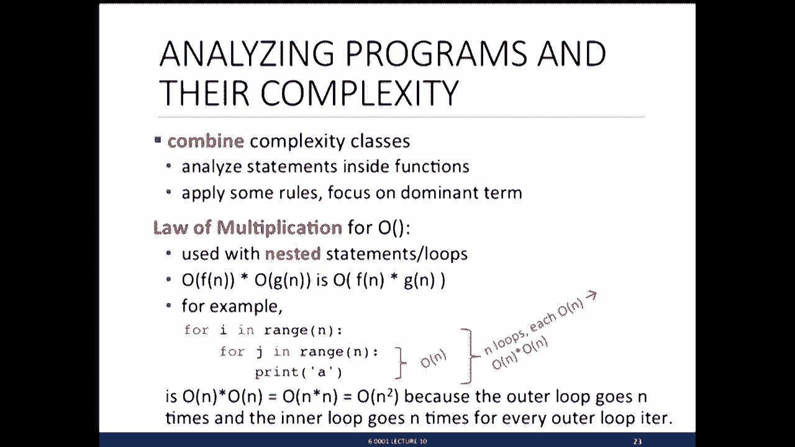

times order of n steps and by that law，that is the same order of n times N or N。

squared so this is a quadratic，expression you're going to see that a。

lot nested loops typically typically，have that kind of behavior not always we。

typically have that kind of behavior so，what you're going to see is there's a。

set of complexity classes and we're，about to start filling these in order。

one is constant says amount of time it，takes doesn't depend on the size of the。

problem these are really rare that you。

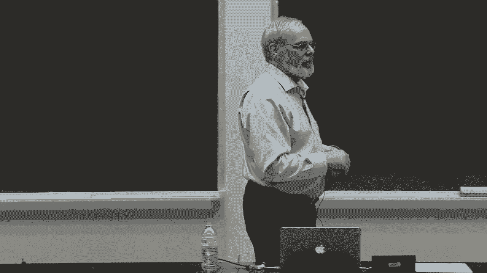

get they tend to be trivial pieces of，code but they're valuable log n reflects。

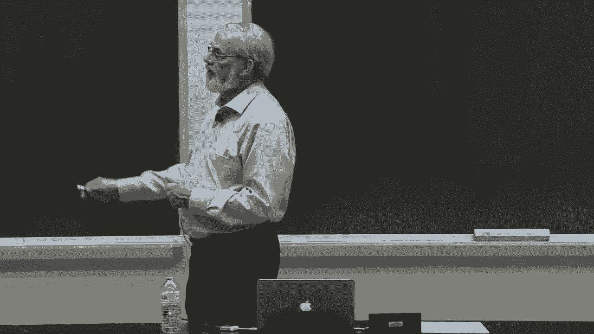

logarithmic runtime you can sort of read，the rest of them these are the kinds of。

things we're going to deal with we are，going to see examples here here and here。

and later on we're come back and see，these which are really nice examples to。

have just to remind you why these orders，of growth matter sorry that's just。

reminding you what they look like we've，already done that here's the difference。

between constant log linear log linear，squared and exponential when n is equal。

to ten a hundred a thousand or a million，I know you know this but I want to drive。

home the difference something that's，constant is wonderful no matter how big，time。

something that law that is log is pretty，nice increases the size of the problem。

by ten it increases by a factor of two，from another ten it only increases by a。

factor of another fifty percent it only，increases a little bit that's a gorgeous。

kind of problem to have linear not so，bad I go from ten to a hundred to a。

thousand to a million you can see log，linear is not bad either right a factor。

of ten increase here is only a factor of，twenty increase there a factor of ten。

increase there is only a factor of，thirty increase there so log linear。

doesn't grow that badly but look at the，difference between N squared and two to。

the N I actually did think of print，this out by the way Python will compute。

this but it was taking pages and pages，and pages I didn't want to do it you get。

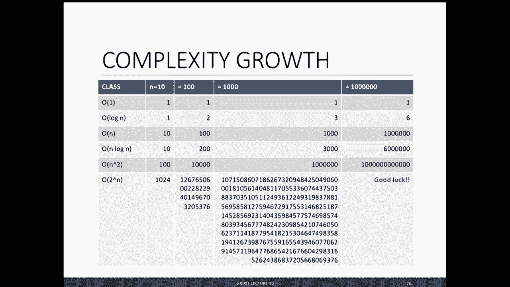

the point，exponential always much worse always，much worse than then then a quadratic。

order or a power expression and you。

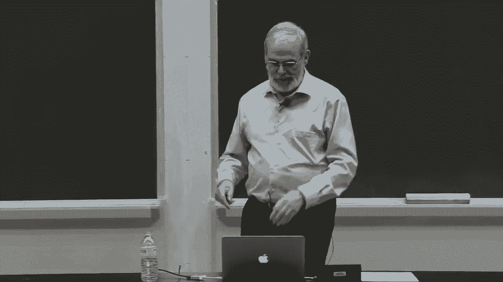

really see the difference here okay，alright the reason I put this up is as。

you design algorithms your goal is to be。

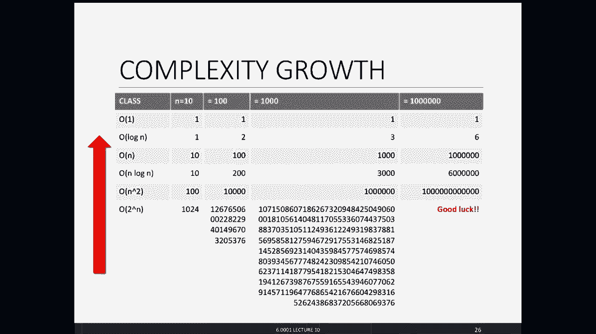

as high up in this listing as you can，closer you are to the top of this list。

the better off you are if you have a，solution that's down here bring a。

sleeping bag and some coffee you're，going to be there for a while right you。

really want to try and avoid that if you。

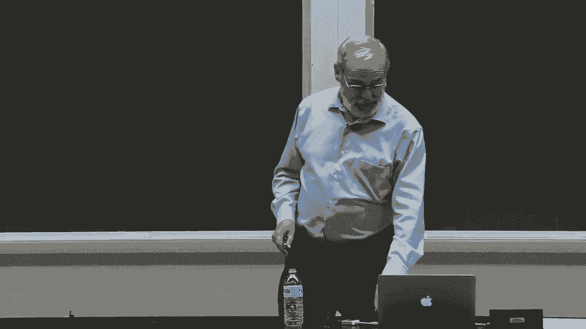

can so now what we want to do both for，the rest of today last 15 minutes and。

then next week you start identifying，common algorithms and what is their。

complexity and as I said to you way back，at the beginning of this lecture which。

I'm sure you remember it's not just to，be able to identify the complexity I。

want you to see how choices in algorithm，design are going to lead to particular。

kinds of consequences in terms of what，this is going to cost you that's your。

goal here all right you've already seen，some examples I'm going to do one more。

here but simple iterative loop，algorithms are typically linear here's。

another version of searching imagine，I'll have an unsorted list arbitrary。

order here's another way of doing the，linear search looks a little bit faster。

I'm going to set a flag initially，defaults and then I got a loop for i。

from 0 up to the length of L I'm going，to use that to index into the list pull。

out each element of the list in turn and，check to see is it the thing I'm looking。

for as soon as I find it I'm going to，send sorry set the flag to true ok so。

that when I return out of the loop I can，just return found and if I found it'll。

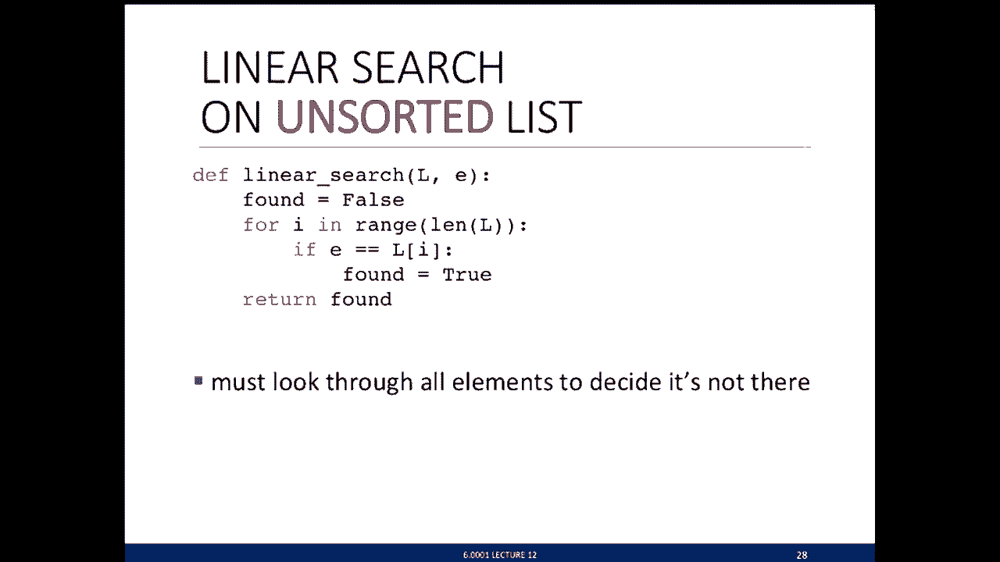

be true if I'd never found it found will，still be false and I'll return it we。

could count the operations here but，you've already seen examples of doing。

that this is linear because I'm blooping，n times if n is the length of the list，over there。

the number of things I do inside the，loop is constant now you might say wait。

a minute this is really brain-damaged or。

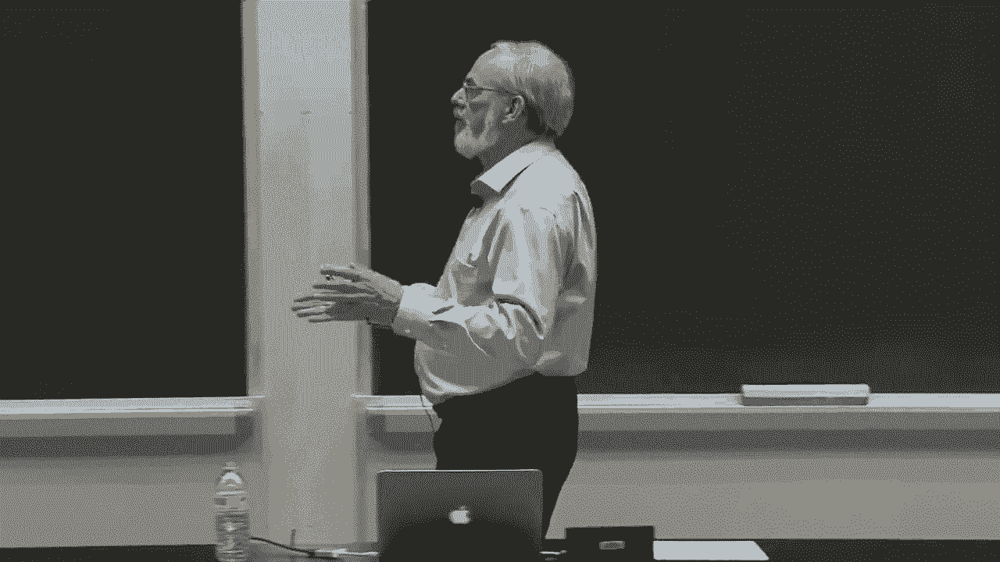

if you're being more politically correct，computationally challenged okay in the。

sense of once I found it why bother，looking at the rest of the list so in。

fact I could just return true right here。

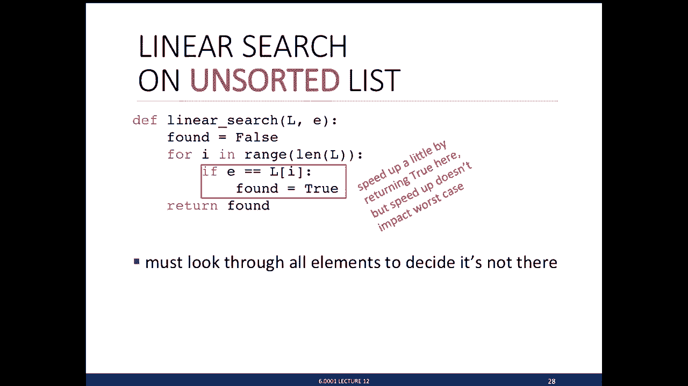

does that change the order of growth of，this algorithm no changes the average。

time I'm going to stop faster but，remember the order of growth captures。

what's the worst-case behavior in the，worst case behavior is the elements not。

in the list I got to look at everything，so this will be an example of a linear。

algorithm and you can see I'm looping，length of L times over the loop inside。

of there it's taking the order one to。

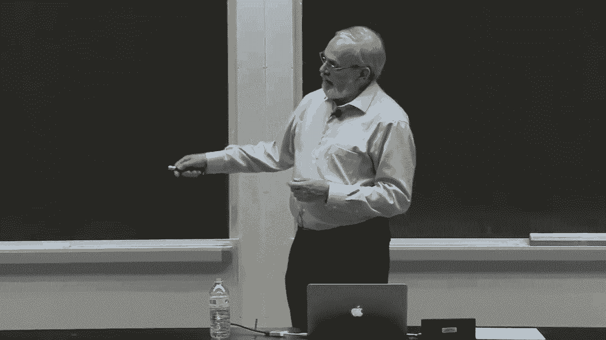

test it so it's order n and if I were to，actually count it there's the expression。

it's one plus four n plus 1 which is 4 n，plus 2 which by my rule says I don't。

care about the additive constant I only。

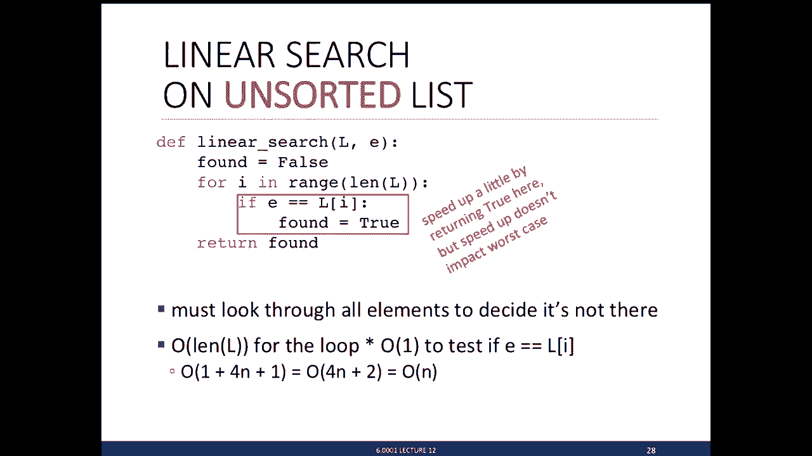

care about the dominant term and I don't，care about that multiple multiplicative。

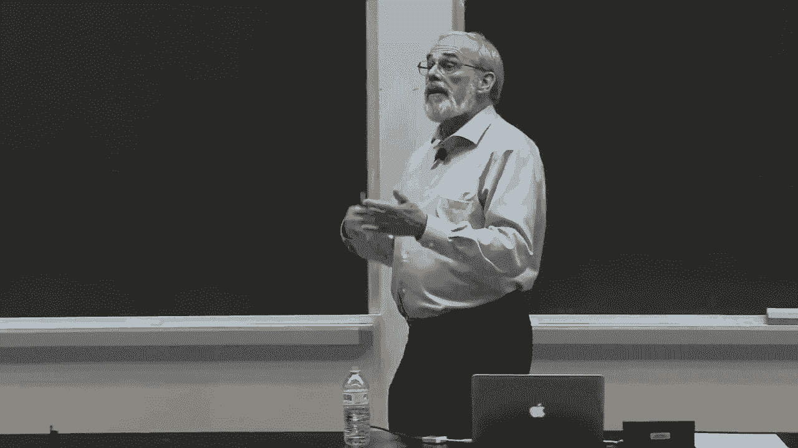

constant its order in an example of a，template you're going to see a lot now。

okay order n where n is the length of，the list and I need to specify that。

that's the thing I'm after if you think，about it I cheated sorry I never cheat。

I'm tenured I never cheat I just mislead，you badly not a chance how do I know。

that accessing an element of the list，takes constant time I made an assumption。

about that and this is a reasonable，thing to ask about both what am i。

assuming about the constant operations，and how do I know that's actually true。

well it gives me a chance to point out，something that Python does very。

effectively not all out languages do but，think about a lift suppose I've got a。

list that's all integers I'm going to，need some amount of memory to represent。

each integer so if a byte is eight bits，I might reserve four bytes or 32 bits to。

cover any reasonable sized integer when，I represent a list I could simply have。

each of them in turn so what do I need，to know I'm going to allocate。

out on particular length say four bytes，32 bits 32 sequential elements of memory。

to represent each integer and then I，just need to know where is the first。

part of the list what's the address in，memory of the first part of the list and。

to get to the eye element I take that。

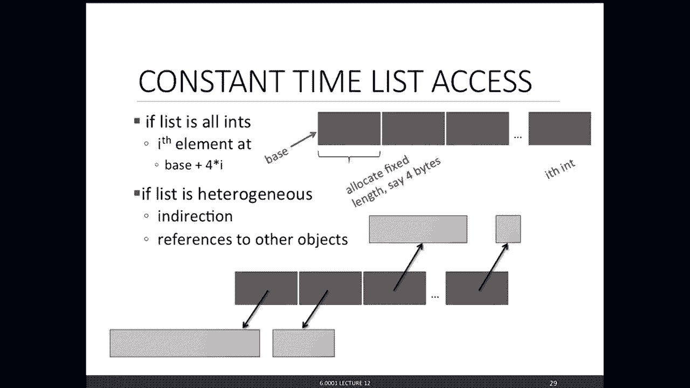

base plus 4 bytes times I and I can go，straight to this point without having to。

walk down the list that's nice，ok it says in fact I can get to any，element of memory I don't try any。

element of the list in constant time ok，now what if the things I'm representing。

art integers they're arbitrary things，and they take up a big chunk of space。

well if the list is heterogeneous we use。

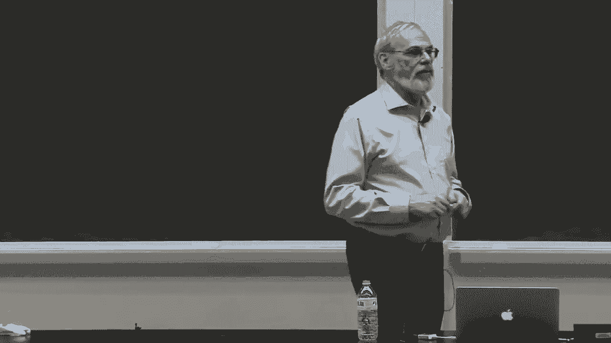

a nice technique called indirection，and that simply says we again have a。

list we know the address of this point，we know the address therefore the。

element of this list but inside of here，we don't store the actual value we store。

a pointer to where it is in memory just，what these things are indicating so they。

can be arbitrary size but again I can，get to any element in constant time。

which is exactly what I want so that's，great，ok now suppose I tell you that the list。

is sorted it's an increasing order I can，be more clever about my algorithm。

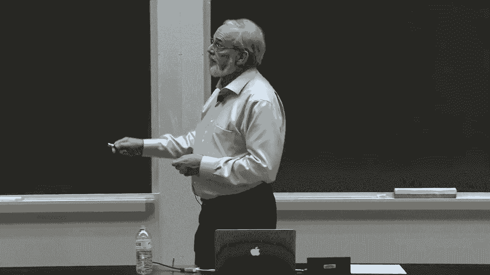

because now as I loop through it I can，say if it's the thing I'm looking for。

just return true if the element of the，list is bigger than the thing I'm。

looking for I'm done I don't need to，look at the rest of the list because I。

know it can't be there because it's，ordered or sorted I can just return。

false if I get all the way through the。

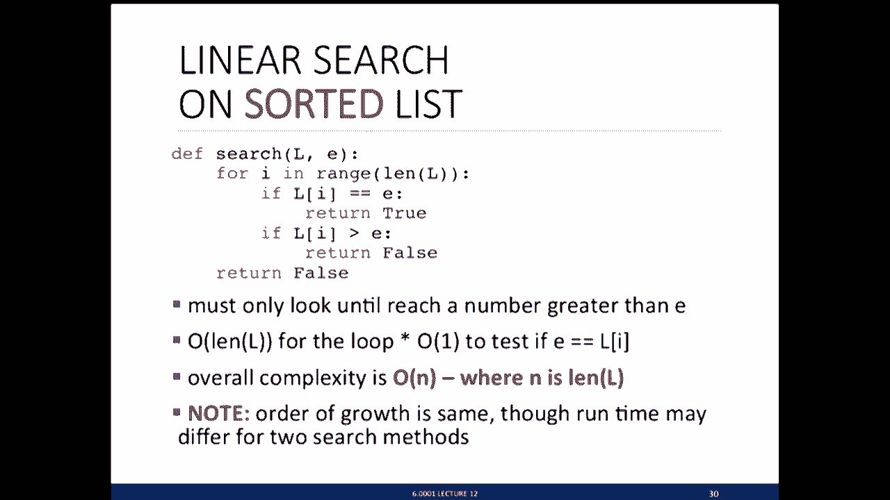

loop I can return false so I only have，to look until I get to a point where the。

thing in the list is bigger than what，I'm looking for，it's the order of growth here gain the。

average time behavior will be faster but，the order of growth is I've got to do。

order of length of the list to go，through the loop order of 1 to do the。

test and in the worst case again I still，have to go through the entire list so。

the order of growth here is the same it，is a gain linear in the length of the。

list even though the runtime will be，different depending on whether it's，sorted or not。

I want you to hold onto that idea，because we're going to come back to the。

sorted list next week to see that there，actually are much more efficient ways to。

use the fact that a list is sorted to do，the search but both of these versions。

same order growth order n okay okay so，lurch it now，lurching through a list right sorry。

searching through a list in sequence is，linear because of that loop there are。

other things that have a similar flavor，and I'm going to do these quickly to get。

to the last example imagine I give you a，string of characters that are all。

assumed to be composed of decimal digits，I just want to add them all up this is。

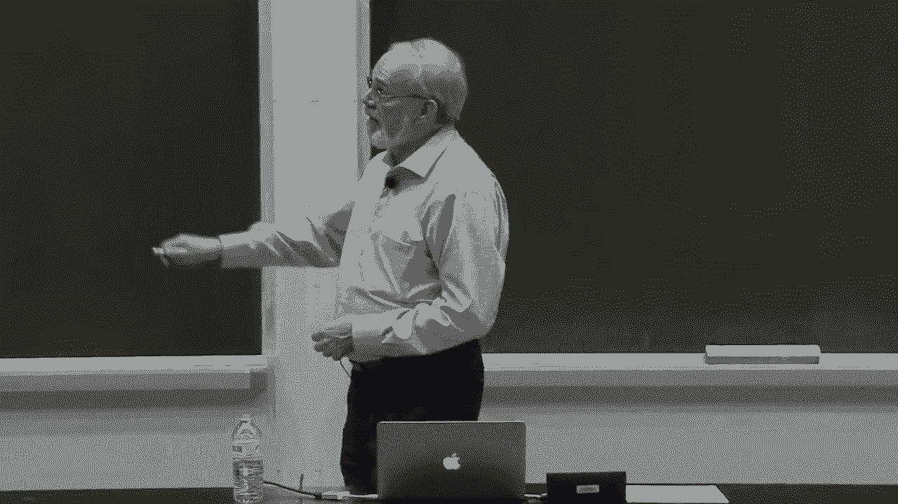

also linear because there's the loop I'm，going to loop over the characters in the。

string I'm going to cast them into，integers add them in and return the。

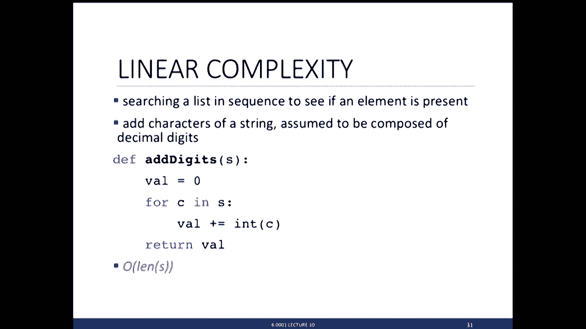

value this is linear in the length of，the input s notice the pattern that loop。

that in iterative loop it's got that，linear behavior because inside of the。

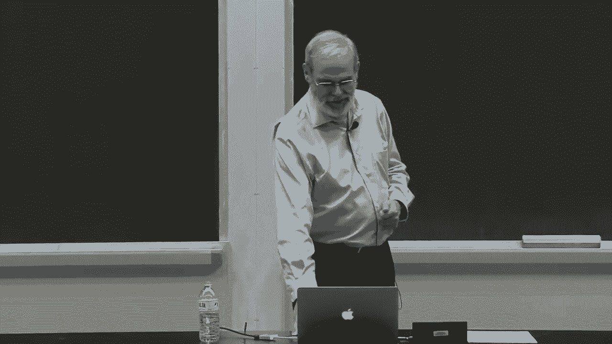

loop constant number of things that I'm，executing we already looked at fact ador。

same idea there's the loop I'm going to，do that end times inside the loop a。

constant amount of things so we're，looping around at is order n there's the。

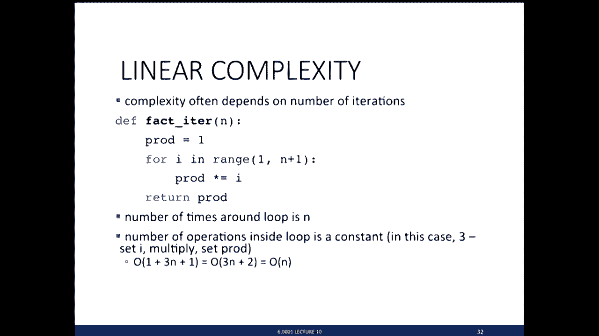

actual expression but again the pattern，I want you to see here is that this is。

order n okay last example for today I，know you're all secretly looking at your。

watches standard loops typically linear，what about nested loops what about loops。

that have loops inside of them how long，do they take and I want to show you a。

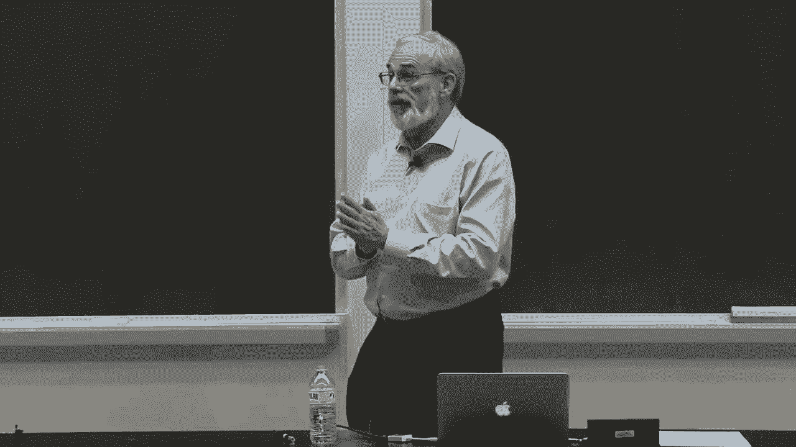

couple of examples and mostly I want to，show you how to reason about them。

suppose I gave you two lists composed of，integers and I want to know is the first。

list a subset of the second list codes，in the hand oh by the way if you want to。

go run it but basically the simple idea，would be I'm going to loop over every。

element in the first list and for each，one of those I want to say is it in the。

second list so I'll use the same kind of，trick I'll set up a flag that's。

initially false and then I'm going to，loop over everything in the second list。

and if that thing is equal to the thing，I'm looking for，we'll set match to true and break out of。

the loop the inner loop，if I get all the way through the second。

list and I haven't found the thing I'm，looking for when I break out or come out。

of this loop matched in that case we'll，still be false and I'll return false。

but if up here I found something that，matched match will be true I break out。

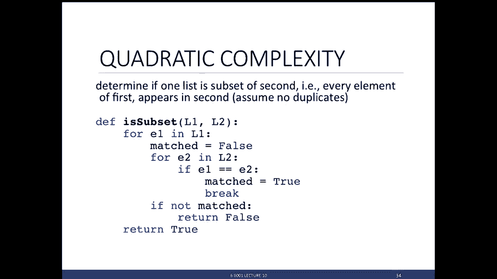

of it it's not false therefore a return，true I want you to look at the code you。

should be able to look at this and，realize what it's doing for each element。

in the first list I walk through the，second list to say is that element there。

if it is I return true if that's true，for all of the elements in the first。

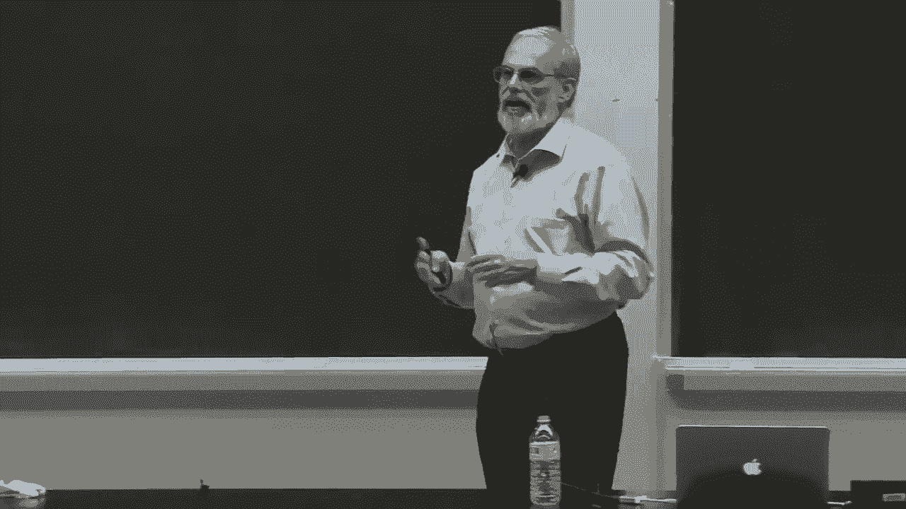

list I return true overall okay order of，growth outer loop this loop I'm going to。

execute the length of l1 times all right，I've got to walk down that first list if。

I call that end it's going to take that，end times over the over loop outer loop。

but what about in here all of the，earlier examples we had a constant。

number of operations inside of the loop，here we don't we've got another loop。

that's looping over and put it in put in，principle all the elements of the second。

list so in each iteration is going to，execute the inner loop up to length of。

l2 times we're inside of this inner loop。

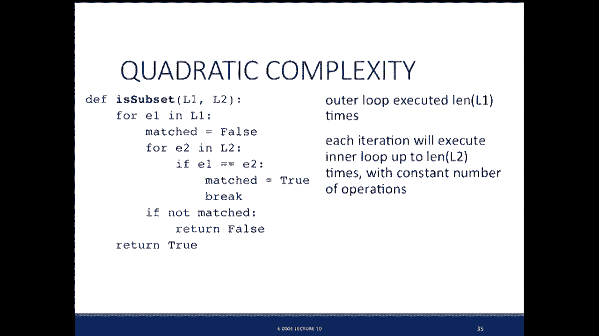

there is a constant number of operations，ah nice that's the multiplicative law of，orders of growth。

it says if this is order length l1 and，we're going to do that then order length。

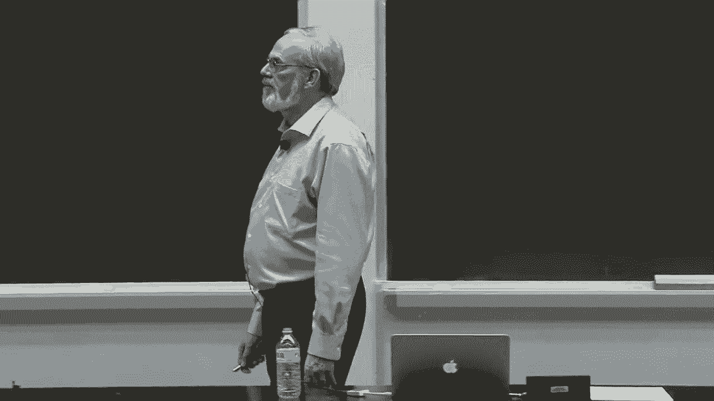

of L 2 times the order growth is a，product in the most common or the worst。

case behavior is going to be when the，lists are of the same length and none of。

the elements of l1 or in l2 and in that，case we're going to get something that's，order N squared。

quadratic where n is the length of the，list in terms of number of operations I。

don't really care about subsets I got，one more example we could similarly do。

intersection I want to say what is the，intersection of two lists what elements。

are in both list one and list two same，basic idea here I've got a pair of。

nested loops I'm looping over everything，everything，in l2 and if they are the same I want to。

put that into my temporary variable once，I've done that I need to clean things up。

so I'm going to write another loop that，sets up an internal variable and then。

runs through everything in the list I，accumulated making sure that it's not。

already there and as long as it is and，I'm going to put it into the result and。

return it I did it quickly you can look，through it you'll see it does the right。

thing what I want you to see is what's，the order of growth I need to look at。

this piece then I need to look at that，piece this piece well its order length。

l1 to do the or outer loop for each，version of e1 I've got to do order of。

length l2 things inside to accumulate，them so that's quadratic what about the。

second loop well this one is a little，more subtle，I'm only looping over temp which is at。

most going to be length l1 long but I'm。

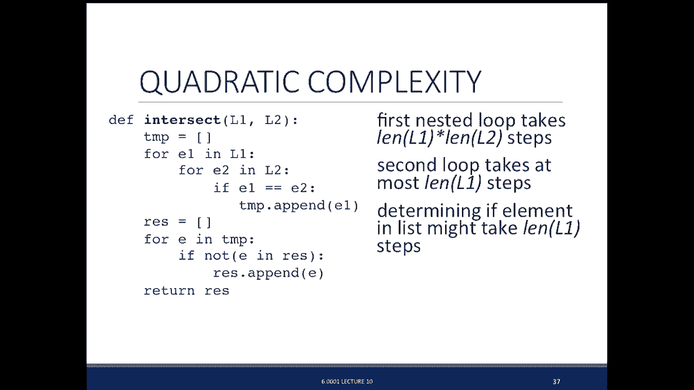

checking to see is that element in a，list and it depends on the，implementation but typically that's。

going to take up to the length of the，list to do it I got a look to see is it。

there or not and so that inner loop if，we assume the lists are the same size is。

also going to take potentially up to，length l1 steps and so this is again。

quadratic it's actually two quadratics，one for the first nested loop one for。

the second one because there's an，implicit second loop right there but。

overall it's quadratic so what you see，in general this is a really dumb way to。

compute N squared when you have nested，loops typically it's going to be。

quadratic behavior and so what we've，done then is we started to build up。

examples now seen simple looping，mechanism simple iterative mechanisms。

nested loops they tend to naturally give，rise to linear and quadratic complexity。

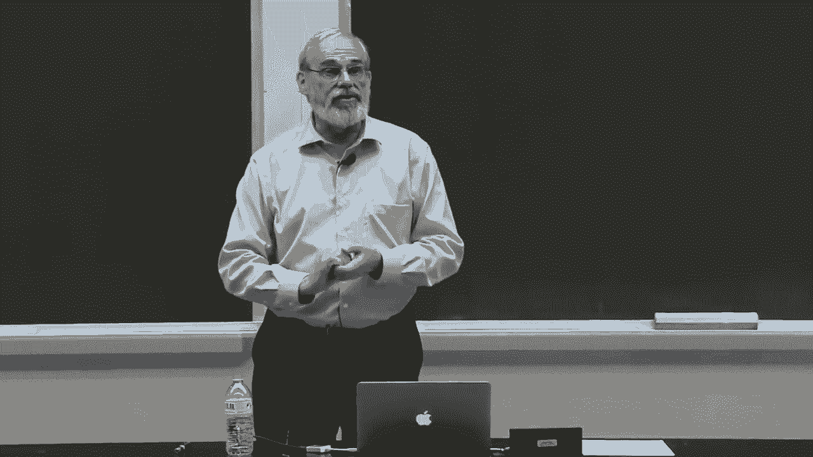

and next time we're going to start。

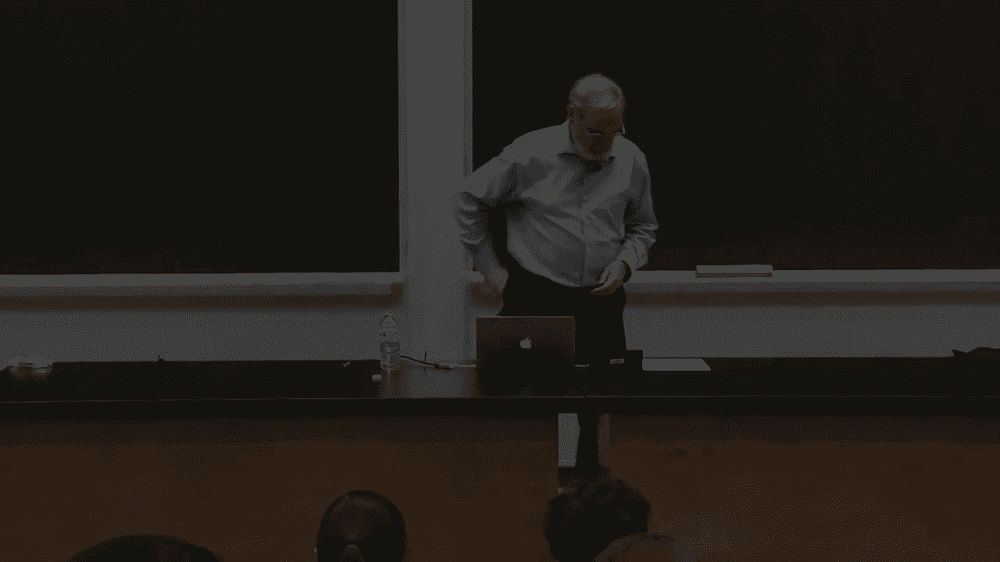