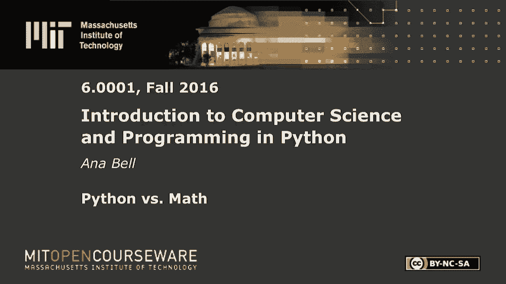
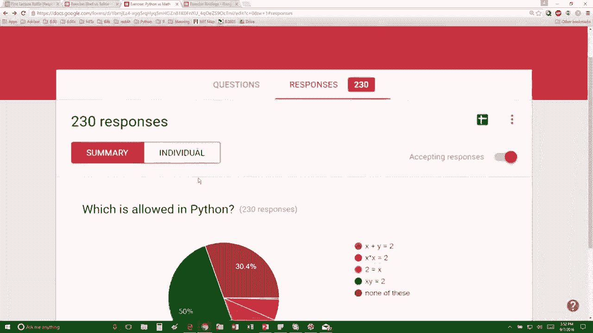

# 【双语字幕+资料下载】MIT 6.0001 ｜ 计算机科学与Python编程导论(2016·完整版) - P3：L1.3- Python与数学 - ShowMeAI - BV1Dw411f7KK

the following content is provided under，a Creative Commons license your support。

will help MIT OpenCourseWare continue to，offer high quality educational resources，for free。

to make a donation or view additional，materials from hundreds of MIT courses。

so this next exercise is which of the，following is allowed in Python so X plus。

y is equal to two and again these are，all things that you can just type in to。

put into anaconda which is our IDE for，the class and see whether whether it。

works or not so this the first one is，probably not right increase it a little。

bit it's not right because the left side，needs to be a variable this is not right。

because it's an expression this is not，right because 2 is not a proper variable。

name and XY that one's actually going to，be okay because it's not multiplication。

said XY is equal to 2 and that's right，ok so none of these yeah so just to make。

sure that you guys understand X X Y this，last one here is the right one because。

XY is not x times y like in math it's。