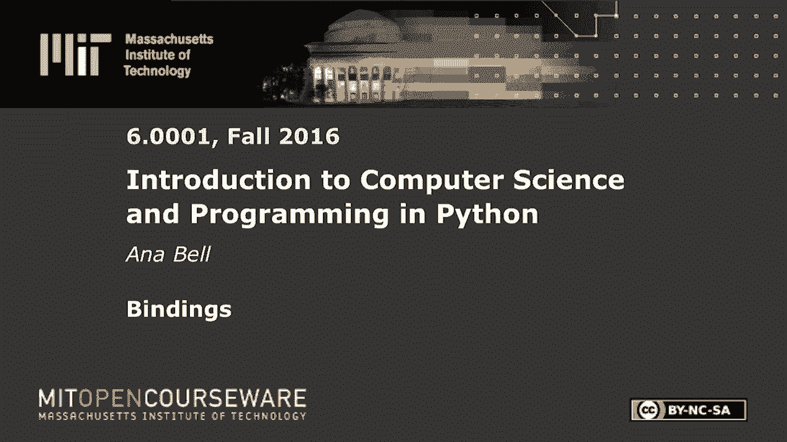
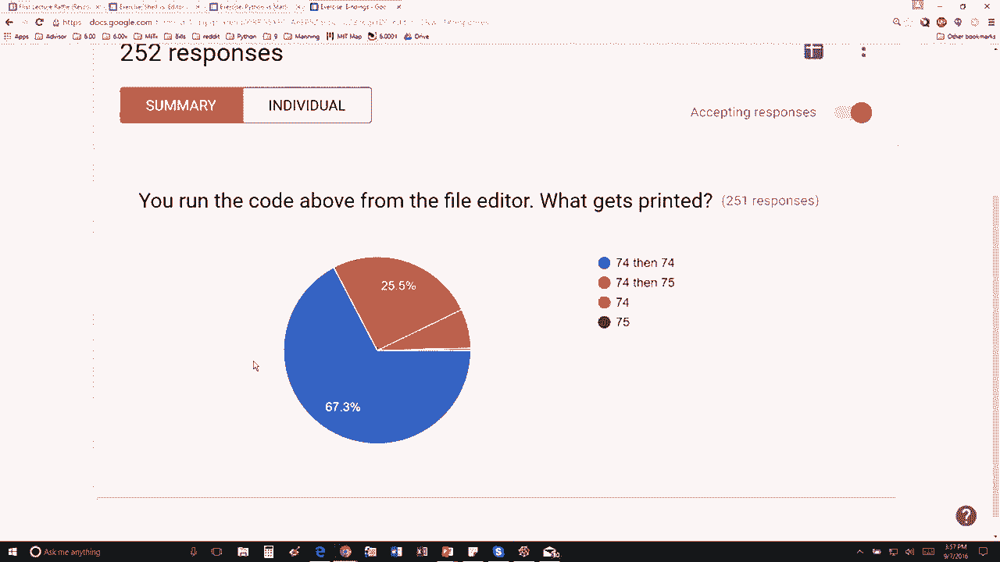

# P4：L1.4- 连接(bindings) - ShowMeAI - BV1Dw411f7KK

the following content is provided under，a Creative Commons license your support。

will help MIT OpenCourseWare continue to，offer high quality educational resources，for free。

to make a donation or view additional，materials from hundreds of MIT courses。

so for this particulate so for this last，class exercise we have this following。

code so we have 46 for USA Gold 427 for，UK gold one for Romania gold we make。

this variable here total gold to be the，sum of those three which I believe is。

seventy four then we're going to print，total gold okay then we're going to。

increase the value for Romania golden，we're going to print it again so as。

always you can just copy this pop it，into python and run it to test yourself。

but you should you should you should do，it just in your mind first so notice。

that print 74 and 74 and that's because，we never told the program to calculate。

the new total right so we only，calculated the total way up here on line。

5 if we calculated the total again down，here then it would be 74 75 so let's。

look at the answers hopefully you guys，got that perfect majority are are good。

to go if you didn't get that please try。