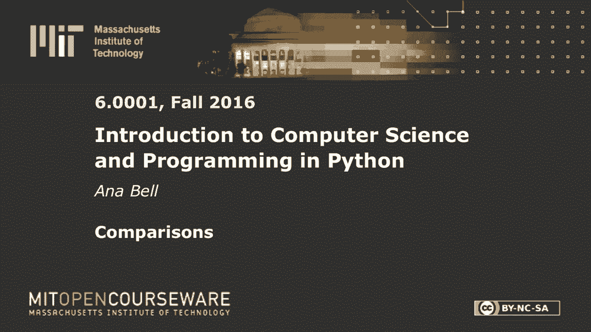
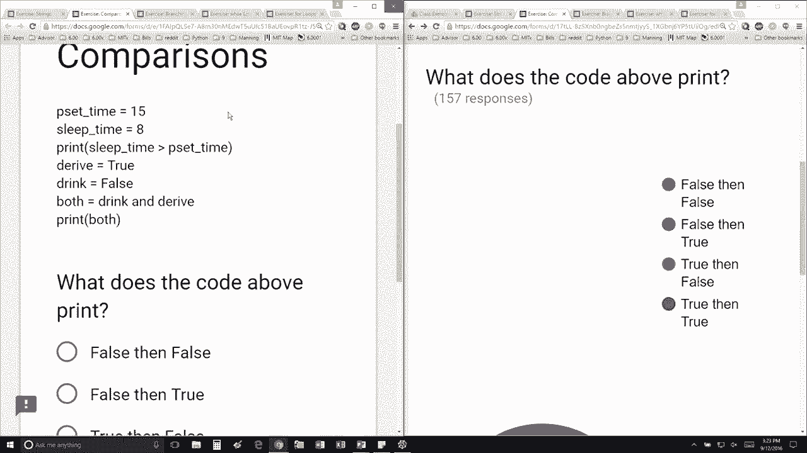

# 【双语字幕+资料下载】MIT 6.0001 ｜ 计算机科学与Python编程导论(2016·完整版) - P7：L2.3- 程序中的「比较」逻辑 - ShowMeAI - BV1Dw411f7KK

the following content is provided under，a Creative Commons license your support。

will help MIT OpenCourseWare continue to，offer high quality educational resources，for free。

to make a donation or view additional，materials from hundreds of MIT courses。

so I'm creating a variable called pset，time and I'm assigning it to be the。

value 15 I'm creating a variable named，sleep time I'm assigning it to be the。

value 8 I'm going to print the value of，this expression here and the expressions。

a conditional that says is sleep time，greater than pset time so in Python。

you're just going to replace these，values these variables with their values。

so is 8 greater than 15 and that's false，so perfect and then a couple of。

operations on or one operation on a，boolean is derive is true drink is false。

I'm using the and operator to figure out，if I should drink and derive and I'm。

