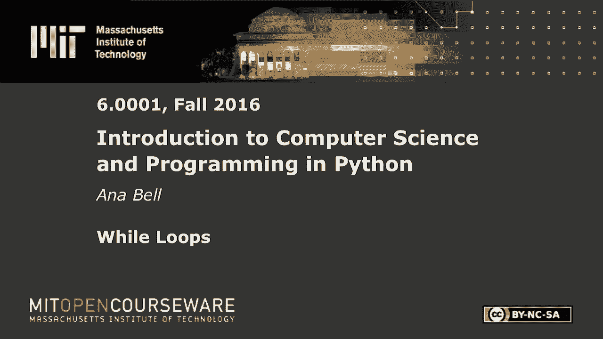
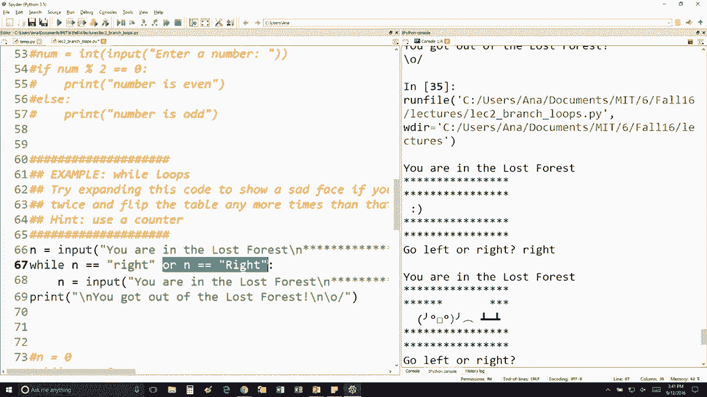

# 【双语字幕+资料下载】MIT 6.0001 ｜ 计算机科学与Python编程导论(2016·完整版) - P9：L2.5- while循环 - ShowMeAI - BV1Dw411f7KK

the following content is provided under，a Creative Commons license your support。

will help MIT OpenCourseWare continue to，offer high quality educational resources，for free。

to make a donation or view additional，materials from hundreds of MIT courses。

so let's look at the example or the，in-class exercise with while loops oh。

good we got got some varying responses，here perfect so the code is you're in。

the lost forest go left or right okay so，here the while loop is checking if the。

input is equal to this particular string，okay and if it is type the same thing。

again and ask them for more input so my，question was what happens when you type。

in capital r h HT and i think the，majority of the class is getting it。

right and maybe the people who got，answered this are maybe changing their。

answer to something else but you're，right so you ask the question again go。

left or right and that's because python，again is very very particular right。

we're telling it that the user input，must match this string exactly so。

capital righ T is going to be is going，to even though it says right it's it。

doesn't match up so if you wanted I'll，just show you in this example here if。

you wanted to to take care of that case，then you'd add this little is the loop。

this little you'll expand on this line，right here which says while n is equal。

equal to right or n is equal equal to。

