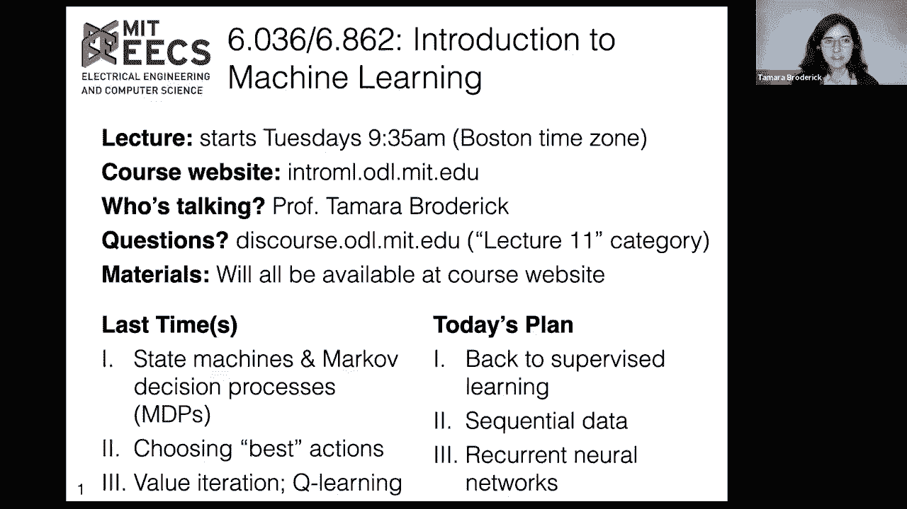

# P11：L11- 循环神经网络 - ShowMeAI - BV1y44y187wN

okay good morning it's about that time，so let's just recall what we've been。

doing in the past couple of lectures，so first we develop these ideas of state。

machines and markup decision processes，to see，and sort of model how we interact with。

the world and how that can change the，world，um and how in particular having。

different inputs can change states in，the world，um and really in the past two lectures。

we've been focusing on using that，information to choose，a best set of actions in the world so on。

one hand，we said if we know everything about how，the world operates um。

you know we think it's an mdp and we，know it's transition，model and we know its reward function。

then we can just use value iteration to，find the best set of steps that we would。

take in this world the best policy，and if we don't know those things and we，have to sort of you know。

muddle around and figure out what's，going on we can use q learning。

we learned about that last time and。

today we're going to see that we can use，these ideas of state machines。

um and states changing in ways that，aren't just，what we've done in the past few lectures。

which is basically reinforcement，learning we'll talk about this on。

the next slide a little bit more but we，can actually use it in supervised，learning as well。

um and so we'll see how that can arise，with sequential data we'll look at an，example with uh。

text prediction and uh we'll basically，define our current neural net。

okay so first though let's let's again，just spend a little time situating what，we've done。

um in the past couple of lectures um so，in particular，we didn't explicitly get to saying it。

but now let's explicitly say it in the，last lecture，we did some reinforcement learning um。

and the idea of reinforcement learning，is that we're。

learning um to maximize rewards，uh by interacting with the world and so，this is different。

from what we saw in supervised learning，which is basically what we've been。

looking at the whole time beforehand，um there are some similarities you can，think of a negative loss。

as being a reward so it's not like the，concept of reward，is totally you know not there in。

supervised learning，but in reinforcement learning our，actions affect both the reward but also。

even our ability to observe the，environment，only by taking certain actions might we。

even be able to see certain parts of you，know what's going on，um our action this round can affect。

future rewards via the state。

we're，doing the learning is very different and，reinforcement learning。

instead of unsupervised learning just as，a few examples too，let's just talk about like when would。

you use reinforcement learning，the idea is that we would learn by doing。

and so we had this extended example，um in the past couple of lectures if we。

have a farm and by working on the farm。

we learn about，you know the soil qualities how we，change them and what the words we get。

in the beginning we make a lot of，mistakes but over time we become farm。

experts and then we get really good at，it，and this is the sort of um thing that。

you see in a lot of other，you know applications this kind of theme，um a really really。

big one and reinforcement learning is，gameplay you know you start playing a，new game。

like chess or go or world of warcraft or，you know whatever is your favorite。

game or game you'd like to try out and，in the beginning you're going to。

flounder about you're not going to be，very good at it you're going to make a，lot of mistakes but you。

learn by playing it and then you get。

really good at the game over time，and so the idea here is to automate that。

process um you could also see this in，digital marketing for better or for。

worse depending on how you feel about，digital marketing，um so multiple interactions with a。

potential customer online you know，perhaps using cookies or something like。

that you might ask is there a best，policy to get them to do what you want，if you're a marketer。

to get them to sign up for an email list，or buy a product or something else。

um there's a lot of excitement about，using these ideas for other things like，automating robot。

tasks in industrial settings or，manufacturing setting manufacturing，settings self-driving cars etc。

um and you can see a little bit why，there would be a lot of research in this。

area because as soon as we start，thinking about these other applications。

maybe even medical applications，you know you don't want to make a lot of。

mistakes in the beginning uh you don't，want to like，learn about what happens when you crash。

your car by crashing your car，um or you know what happens when you，know you。

nose dive your plane by nose diving your，plane um and so，there are issues of safety you know how。

do we adapt this to have a lot of safety，on their issues of making sure that you。

don't need so so many，training data points or like you know。

rounds of learning，um to get somewhere so those are some，challenges that arise there。

um but i just wanted to take that time，to contrast with supervised learning。

um something we also saw in the last，lecture was model based。

reinforcement learning versus model free。

me enforcement learning so in model，based reinforcement learning。

that's where we use an explicit explicit。

conception of the next state，and the reward given the current state。

in the action and so in particular，um we we explicitly say we have this。

function，and we are estimating them whereas in，model free reinforcement learning um。

we are not uh doing that we are um。

we're just saying hey you know we'll，just do this q learning thing for，instance that we saw。

that did not explicitly put together a t，or an r but was still。

able to learn a good policy now i want，to emphasize something here this is not。

the usage of the word model that we，would use probably in the rest of。

machine learning certainly in supervised，learning。

um so it this usage of the word model is，representing the transition。

model and the reward function is pretty，specific to reinforcement learning。

and so i'll just just point that out，okay so model-based reinforcement。

learning and model-free reinforcement，learning are examples of reinforcement，learning。

and in turn learning was an example of，model 3，reinforcement learning so we didn't。

instantiate t we didn't instantiate r，you you could consider estimating them。

but that's not what happens in q，learning you you don't，explicitly do that and you are able to。

get this，um estimate of the q star function，so so contrast q learning where we're。

trying to get an estimate q，with the actual q star function so what，the actual q。

star function would be would be if we，knew the transition model if we knew the，reward。

then we could say what is the expected，reward of starting at a state。

us making an action a and then making，the best action ever after and we saw，that we could get。

this sort of optimal policy by having，this and so what we're doing with q。

learning is we're doing this estimate q，instead so that we can。

estimate or like come up with an idea of，a best policy but it isn't necessarily。

going to be the best one so long as q is，not exactly equal to q。

star and in some sense what we're trying，to do is get as close to q star as，possible。

and again you want to contrast this also，with value iteration which we had。

discussed in the previous class，there we assumed we knew the transition，model t。

we assumed that we knew the reward，function r and we just wanted to find。

the best plan the best policy going，forward and so we didn't have to muck。

around we didn't have to sort of like，try out different things and see how。

they worked we could just start from the，very beginning by doing the best thing，possible。

um and that was value iteration and then，separately，from that so that was just getting the。

exact q star，even before that we talked about how to，get v the value of a policy。

and that could be still really useful so，q star。

can let us get the value of the optimal，policy but what if your friend comes，along and says hey。

i've got another policy and you know，it's just an easier policy and so if。

it's almost as good maybe we should just，use my policy you know。

maybe i've already got the equipment for，it or something like that。

and she'd still like to evaluate what is，the value of that policy and if。

there's a big difference then maybe，you're going to keep going with the the。

exact optimal policy and maybe if，there's a small difference there might。

be other reasons that you prefer a，different policy，okay so this sort of situates what we've。

been doing the last couple of classes，and this class now we're going to see，learning。

from supervised learning is not just，having a state transition，model one of these uh state machines。

it's not having an mdp，it's that you're actually doing this，learning by interacting with the world。

and so we're going to see an example，today，of supervised learning where you do in。

fact have a state space model，um and so we are going to see that you，can have。

sort of you know these these recursive。

properties you can have，sequences um and and not be exactly。

doing reinforcement，okay so our motivating example today。

will be in text predictions so you see，this all the time，in your lives um if i go to compose an。

email um in gmail these days it will，help me by suggesting some additional。

characters that i could append after，what i've written so far and i could。

just accept those and that will save me，seconds of my time if you go into some，kind of search engine。

um you know many search engines this，will be true here's just an example from。

wikipedia if i start typing out what i，want to look up。

then it will make some suggestions about，what i might be looking up um and some。

of those are literally just completions，of what i've written so far。

interestingly some of them are or other，things but。

um but clearly the first one here is an，autocomplete of the word autocomplete。

okay now for us this is you know it's a，convenience it's nice to save a couple。

of seconds it's actually a big deal，in some other individuals lives so um。

famously stephen hawking especially。

towards the end of his life，communicated by pressing a button and。

then eventually just moving a cheek，muscle。

and so for him word prediction was a，huge deal um，you know if you could only type a few。

words at a time，um。

just sort of automate a few words in，advance can can be，huge um and of course it's not just。

stephen hawking uh，you know there are a number of people，who face uh severe motor impairments。

uh don faizi webster pictured here uh，sort of amazingly。

uh completed much more recently um both，undergraduate and graduate degrees with。

assistive technology and and merely by，blinking um，so i think this is a super cool and。

interesting area we actually do some，research in my group，on uh assistive technology for。

individuals who have these sort of，extreme motor impairments，um but in general this is a reason to。

really care，about text prediction uh and getting it，right。

okay so we're gonna look at text，prediction or at least a simplified，version of it today。

um and here this is essentially，supervised learning what we'd like to do。

is we'd like to say hey i've seen some，text that a person has written so far。

and i want to predict the next text that，they would write，um and we're going to do a very。

simplified version of that we're going，to say let's just，for the moment predict the next。

character and you'll see in in the lab，and other places，how you might be get beyond just that。

next character，okay so how do we get trading data well，luckily nowadays there's just a huge。

amount of text，online uh you could just take all the，text from wikipedia you can take all the。

text from，you know your favorite source let's。

let's say we took some poetry text，um and so here's an example of some text。

that we might use in our training data，and how would this help us train。

well we can take each set of texts that，we might have seen，and try to predict the next character so。

in this training data，one bit that we would have seen if，somebody was typing this in order would。

be w and then we'd have to predict the，next character and the answer。

the exact answer the true label would be，h。

we also see at some point in the course，of writing this that somebody has。

written wh，and then the next character which we，would like to predict would be a。

also in the course of writing this，somebody would have written w-h-a。

and then the next character that we，would like to predict would be t so we，actually get quite a lot。

of um training data in some sense from，this one sentence from this one。

uh you know uh string of characters，and now we have to think a little bit。

harder you know sort of the devil's，always in the details of these things we。

have to think a little bit harder about，how does this exactly fit。

into our frameworks you know that we've，developed for。

um for supervised learning okay well，it looks like a classification problem。

i'm trying to predict a character and，here i have uh 26，different possible uh english language。

letters，and maybe an underscore for the space so，i'm i'm，in some sense trying to do。

classification with 27 classes at least，as described here，okay but now how do i featurize this。

this is a little bit。

tricky so you know we had this nice，lecture way back in lecture three of oh。

yeah i get my data and i have to turn it。

into features that i feed to my，algorithm，and so this is essentially the question。

that we're asking here here's here's my，data how do i turn it into。

you know the features that i really feed，to my algorithm well one idea is why。

don't i just use the things that are in，this column labeled features i mean that。

sounds so convenient，um you know are am i done um so just use，all the previous characters you could。

call this the context for the next，character that comes along。

okay well let's think about you know，what are the what are the algorithms。

that we've developed so far take well，they take，real values but that's not so bad we。

know how to turn，you know uh characters into one hot，encoding and then that's gonna be a set。

of real numbers so that's okay，um maybe a little bit different though，is that they take a。

fixed collection of real values a fixed，dimension collection of real values so。

you know so far we've said that if i，have some some features to my algorithm。

whether it's logistic regression，or you know neural nets or whatever is，my favorite classifier。

that each of my feature vectors has to，be in r to the d，so we said r isn't so bad because i can。

turn these，into you know real values with one hot，encoding or you know whatever my。

favorite encoding is，um but the fixed dimension d is，challenging here because you can。

see that you know we change dimension，quite a bit we have one character in the。

beginning then we have two characters，and we have three characters and。

and so it seems like we're not really，keeping that fixed and so we'll have to。

okay so here's another idea and i just，use the last character。

so i predict an h from a w i predict the，a from the h i predict the t from the a。

and you kind of see that i'm probably，know，predicting uh what is the next character，after h-a-p-p。

you probably have a good idea that it's，pretty likely to be e，somebody's probably spelling happen or。

happening or something like that，um but if i just predict after p i might。

have some pretty different predictions，um it might not be quite the same so you。

can see that having more characters，um potentially helps you out okay so。

you know but we can't have all the，characters uh you know that's。

well one that's gonna be really hard to，learn you're not gonna have every。

possible sequence of characters，but you have this issue of fixed。

dimension as well and so let's，going to。

trade this off by looking at m，characters where m，you know is one or greater um but we're。

not quite sure what it is just yet，and then then we'll see if there's，anything else we can do um。

that might help us with this this fact，that we don't know quite how much，information we need to have。

okay so we're gonna use the last m，characters as our features。

um and we're still gonna have to keep，digging a little bit deeper because，there's still some。

details that we haven't quite ironed out。

now something that'll maybe help us，think about you know how to do these，things。

is that we can express what we're doing，as a state machine，and so what i mean by that is there's。

something sort of inherently，recursive about the choices that we're，making so in our state machine。

suppose that we're trying to predict the，next，letter here given that we've so far seen，wha。

so this context these last three letters，so let's just say that our context here。

will be the last three letters，um that could be our state so at some，point we have our state。

at this point it's wha now，you know maybe the person on their phone。

or with their assistive technology or，whatever，um types another letter maybe it，happened to be t。

and so what happens is we're going to，want to update the state now the last。

three letters aren't wha now the last，three letters are h18，and so we can think of that as the input。

t coming in，this is the letter t not the index t in，this particular case。

um and then we're updating the state to，be hat，you can imagine this keeps going so now。

the person types，a space and we want to update the last，three letters to be a t。

space and so here our input is the space，and we update our state to be a t space。

and you can imagine that this just keeps，going and you can keep doing this。

you know as you go along as you sort of，read，this sentence okay so let's just double。

check that this fits everything that we，know about state machines um it's been a。

couple of lectures now，so let's just review um what was a state。

machine well in a state machine we had，to say what was the set of possible，states。

so in here the set of possible states，should be，all m characters in a particular order。

so here m is three，so any state that is three characters in，a row is an acceptable state。

that is a possible what are the，set of possible inputs well my inputs，character。

so any character is an acceptable input，among my my vocabulary of characters。

okay initial state this one's a little，bit tricky um how do i initialize my。

state well one option is i could just，initialize from，the first three letters in this case um。

another option is you know you can。

imagine somebody starts up their，assistive technology program or they。

start their phone and you might want to，also，already start predicting things for them。

maybe they just want to type the um and，that's a pretty easy prediction to make。

and so you'd like to start from the very，beginning，and so for that reason sometimes people。

like to incr，include something called a start，character so it's a special character。

that just sort of indicates somebody's，about to be typing，um and and you would see this in general。

that somebody opens up a texting app，or something like that that's your。

indication on that they're about to be，typing，and so if we did include this start。

character in our sentence in this case，i'm just using a carrot it could be any。

character that's not what i'm already。

using，then a natural thing that we might do is，we might have our initial state just be。

m start characters，and so what would this look like well we，could start with our initial state。

being in this case three star characters。

we're gonna update with the first，character we see that's a start。

character and so at this point we're，gonna make our first prediction。

and that's fine because we want to，predict you know what is somebody gonna。

type without having seen anything yet，and this is what this represents。

okay next we see a w and now we're，saying hey we want to predict，given that we have sort of you know。

nothing typed so far。

now we have our h that we've seen and，now we want to predict given that we've。

seen nothing so far except，wh and then going forward from here，we're going to start having。

actually three characters in the context，that are not just the start character。

okay so the next part so let's just fill，in our，um now this t is the time step hopefully。

it's clear the difference between the，uses of the character t，and the time step t um now we're going。

to talk about our transition function，so suppose that we have a particular，state that we're in。

and we make a new observation we'll make，a new input we have a new input how do，we update the state。

um well hopefully it's straightforward，to see at this point that basically what。

we're doing is we're saying what were，the last m characters，and we're updating to the new last time。

characters so we're taking。

whatever the x t value was and sort of，or the back i guess depending on how。

you're you're thinking about this，ordering，um but we're appending it and then we're。

getting rid of the older character that，we don't need anymore。

so we can clearly get this as a function，from our existing state。

and the new character that we've gotten，okay now we have to talk about what are，our outputs。

so one output that we could have is just，a pure prediction，of what is the next letter like i see a。

w and i think，the next letter is going to be an e but，you can see that you know if you have a。

w，you know maybe the next letter is an e，maybe it's an h maybe it's an a。

um and so a really useful thing here，would be to have a probability，distribution。

over the different letters and this is，something we're familiar with from。

classification you know think about，soft maps for multi-class logistic。

regression that gives you a probability，distribution，over the different classes that you're。

we，we know how to do and so instead of just。

a single letter something we might，output is a vector，and now i'm using i'm sort of using。

abbreviations to fit everything in here，but what i mean is a vector of character，probabilities。

so for each possible character for a for，b for d，for e for f for the space。

um etc we're going to say what's the，probability that that is the next，character。

so again this is something that we'd，really naturally do with our multi-class。

logistic regression um using the soft，max function instead of just。

the sort of usual uh logistic sigmoid um，and so so at least in theory we know how。

to do this and we'll nail it down in。

just a second。

okay and so our output function g of s，will then be exactly a multi-class，linear classifier。

so s you can think of the state as being，the features，to that linear classifier so what's been。

useful about expressing this as a state，machine is now we have a fixed，dimensional。

set of features that are going into our，classifier，and those are exactly the elements of s。

and so we can take those in as features。

and then we can output，again this probability over all of our，classes all the potential classes。

this vector of character probabilities，um and so。

this is our state machine this is a，almost totally well-defined state。

machine i mean we're still talking at a，sort of high level，we're gonna get to some equations in a。

moment um but this is how we can fit，things into a state machine and how。

state machine can let us come up，with a nice notion or um a nice。

particular way of getting our features，for this problem for specifying what are。

our features in each sort of，you know classification case that we，have。

now um just a little note here it's a，little bit different from how we've，talked about。

x when we were talking about，classification problems before，is okay um well we have we have this。

input x，um but then we have x1 and x2 and x3 and，x4，as subscripts as we go along within a，single。

sentence within a single string and so，we might want to collect。

everything in that string as sort of，one you know string that we're feeding，into this state machine。

and so we can say that this is our x，super one，so the superscript is denoting that we。

have this full string and then if we do，a subscript，we're indexing individual characters。

within this string，and so of course you know if we were，doing some kind of。

uh supervised learning you know some，kind of training on this and we were，trying to learn。

predictions of these next characters we，wouldn't have just a single string we'd，have lots of strings。

um and so here's just an example of，three of them that we might have and of。

course we'd have so many more，um and we'd probably look at look at。

okay so this is still a high level，description of this state machine。

let's let's do one more sort of high，level description before we get into the，exact。

equations that we might use to encode，this in particular，let's let's go back to our function。

graph representations，so can we do a function graph to express。

what's going on with this state machine，so it's going to be a little bit，different。

from how we've looked at state machines。

before before we were sort of looking at，states and going in between states。

now we're going to say the function，graph for how we apply f and g。

okay so what is this function graph，going to look like well first i have my。

input，sorry first i have my starting state the，initial state。

you know this is in this case you know a，bunch of starting characters before i've。

gotten anything else。

and now i have my first input this is，the first character i see in this case。

it's a starting character it says，somebody opened up their text，application。

and they're about to start writing，something，okay so i'm going to put those in。

incidentally what i'm describing here in，some sense is just a state machine like。

i'm illustrating it with this particular，application，in predicting um uh。

you know text like the next character，but in some sense this。

uh this illustration this function graph，is a pretty generic state machine。

okay so once i have these once i have，the input and my old state。

this transition function updates me to，and then that new state i can use in my，now。

previously when we talked about state，machines we called this output。

y but here we're going to call it p for，prediction because we want to reserve。

y for the actual ground truth label，which is what we had done。

you know back when we were talking about，um classification，and before we had gotten into all this。

state machine stuff and now we have this，unfortunate，um you know overloading of the。

terminology so let's use p for，prediction。

um but it's the output of our state，machine and then y will reserve for what。

is the true label here which is the，thing the person actually wrote next。

okay so once i have this new state um，i can put it again into my state machine。

with my next input those together will。

go into my transition function。

which will output the next state and，then that will have，some um prediction for the。

you know for the letters i've seen so，far what is the what is the letter that。

i want to say is next so if the，character that i want to say is next。

and then this goes on and on as you can，imagine this just going on。

off the page hence the dot dot dot that，just means that we recurse again and。

okay and so here a couple of，numbers that are going to come up in our，examples here um so we said。

m is going to be the number of，characters in our context。

now，um it's sort of the number of characters，we're looking at when we want to predict。

the next character，and let's say v is the number of，characters in our alphabet so for the。

moment it's 28 because we have the，starting character and we have our 26。

english language um characters and we，have the the underscore first space。

now in order to write down exact，equations for what's going on here。

we're going to choose a particularly。

have，basically the simplest alphabet you，could have it's just zero and one。

so the number of characters in this，alphabet is just two um it's gonna make。

our lives really easy in particular one，alphabet，is that it takes exactly um one。

character or one element to one hot，encoding i can either say it's zero or，it's one。

um once we go beyond that we have to be。

a little bit more careful and let's keep，m equals three let's say we're still。

trying to predict the next character。

okay so in this case our state，is going to have size m by 1，because we're predicting from the last。

time characters and each character we，can one hot encode。

with just a single vector element，so for the moment it's just n by one but。

question about notation please yes。

yes is x um subscript n，questions。

yes so no they're not so so um，let me just go back for a second to。

illustrate this，so x superscript so the superscript，denotes which string we're reading in。

so our x1 here is what happens to a，dream deferred，x2 is if you can keep your head when all。

about you x3 is you may write me down in，history。

now x subscript，would tell us which character we were on，in this string。

so if i had x super one subscript，one that would be the start character。

if i had subscript two that would be w，if i had subscript three that would be h。

so probably a better way to write this，um and maybe i can，update this uh in in the uh。

the offline um lecture notes is to put a，superscript。

one on this xt in the table because we，really are taking from exactly。

yeah and in some sense you can think of，this state machine as just going through，a particular string。

and then we're just going to do it again，with another string and again with。

so let's see where we were okay so the，state here，in this case is the number of previous。

characters because we can encode each，character with just a single vector，entry。

our x is also just it's a single，character and here we can code a，character。

with a single entry so it's one by one，our p here，again is going to be a set of。

probabilities over the characters in our，alphabet，so we're going to say what's the。

probability of a what's probably b，was probably c here we're going to say。

what's the probability of zero what's。

so in general it'll be b by one because，we're going to have a probability for。

okay so now what we're gonna do is we're，gonna write an actual equation。

for f and for g so remember we said f，was the transition function that sort of。

pushes out the last character，and brings in the new character from。

x from our observation x and g，is the thing that takes our states in as。

features and then outputs our。

classification，our probabilistic classification for the，next character。

okay so now that we're thinking of s as，m by one，i want you to think of it as the latest。

character comes first，so if i had just written you know w-h-a。

so a is the latest thing and so that'll，be on top，so if that's the case let's see how。

we're going to construct that from our，x and from our s t minus 1。

well it would be nice if we could do it，linearly that's about the simplest。

type of update that we can do so we're，going to try to do it linearly。

so remember we just said，s has size m by one，so here that's three by one because。

we're saying that we're just using the，last three characters。

xt has size one by one because it's just，the next character that comes along。

and so my first question for you and。

this is for the chat is um，what is this we're going to be，pre-multiplying something，this big um。

darn well so i was going to ask you and，maybe maybe you can still think about it。

um we're going to be pre-multiplying，this x t，by something by a matrix。

um and we want to think what would be，the size of that matrix if we。

pre-multiplied it to get st um i sort of，just revealed it，but i think you can still say in chat。

what is going to be the size of that。

matrix what is that going to look like，great yeah okay you guys have got it，it's fantastic。

it's three by one um because you have to，get a three by one at the end so。

multiply it through by one by one by one，okay so now，and i see some of you are already。

thinking about this let's ask，what is this question mark going to be，it，moment，let's assume that the。

latest character is on top，um so in particular you know i basically，want to move。

xt into the top position，in my st vector and then i'm going to，have。

the second latest character below it and。

the second latest character below it so，then my question for you is，three by one。

matrix that we're going to pre-multiply。

great looking good。

okay so got some nice answers here，one zero zero so now originally some。

folks were thinking zero zero one。

that would be potentially totally fine，it's just how you define your state and。

so if in this particular case we're，defining our state，as the latest character and then the。

second latest character，and then the third latest character so，if i had written wha。

we would have an a and then an h and，then a w then this is what we would get。

if you define your state some other way，that's totally fine um it's just this is。

the particular way we're doing it right，now。

okay and of course here our alphabet is，zero one but um。

but that's why we would do this okay so，so what we're doing here so let's just。

recap so what we've done so far is we've，said our state，is going to have xt。

the last character that we just observed，put up at the top that's going to be its。

value，in the top position。

and now what we'd like to do is we'd，like to have，its next value be the first value in st，minus one。

and its third value be the second value。

in s t minus one，so now we have to think about how to，accomplish that with this remaining。

big question mark and i'm just gonna，show you and then you want to think。

great and we actually had some people，putting in the chat which is awesome。

um okay but but the most important thing，is just to think through what's going on，here。

so in the first row here we're，multiplying this，by st minus one and we're getting zero。

so this has no effect，on the first element of st we're just，adding zero。

in the second row we're picking out the，first element of s t minus one。

but this is the second row so we're，in the third row we're picking out the。

second element of st minus one，but this is the third row of st so we're。

and so the thing to observe here is that，we're just，shifting the elements of st minus one。

again you could choose your state to be，represented in a different order here。

this is just a particular order that，we've chosen for the moment。

but we're gonna get this shift and then，what we're gonna get，is that we're just putting x into that。

first element we're putting，the first two elements of s t minus one。

st，and then we're throwing away the last，element of s t minus one s t minus one，at all。

and that makes sense because that is you。

know sort of too far outside the context，now that's that's like the fourth。

character so we don't need it anymore，so we're throwing it away this is just a。

way of saying exactly what we，said on the previous slide um but with，an equation。

you know so we're just expressing that，same idea with an equation that we're。

just shifting the context we're shifting，what are the last。

okay and then we also want to specify g。

with an equation now remember the idea，of g，is that now we have our features our st。

we have sort of specified here's the set，of features that we're going to use for，this problem。

our features are going to be st it's，going to be what are the last characters。

if we want to do a classification，with those last characters we want to。

ask ourselves how would we do a，classification，where we return we have a linear。

classifier and we return the，probabilities，of the different characters in the，alphabet。

this should just be applying things from，previously in the course but let's。

briefly review them okay so we're going，to call，the o，stands for observation because this is。

sort of the output or the observation，model，now we're going to have some function。

let's call it f2 we haven't defined an，f1 yet um but this is kind of。

anticipating that we will define an f1，shortly so um so let's just go with it。

for now let's call it f2。

and hopefully this looks mostly familiar，with a few small differences。

like so for instance if we were doing，two class logistic regression。

we could just have regular logistic，regression we have the probability of，one class pop。

we could have this be one by three，and this be one by one that's what we。

did when we first introduced logistic。

but in general if we。

don't only have two options we can't，specify。

all those options with just a single，probability，and so in general we might have instead。

f2 describing not just two-class，logistic regression not just a logistic，sigmoid。

and so now if we did something like a，soft max we might have v。

different outputs now notably um here we，have an alphabet of size two。

um and so two is sort of an awkward，stage where you could do either you。

could either do vanilla logistic，regression，where you have the probability of one。

outcome and the other outcome is one，minus p，or you could do the more general soft。

max function and then you would have，sort of the probability，of one class and the other and it just。

so happens they add to one，um and so it's just worth noting that。

that's why we're seeing that even in v，class logistic regression you might have。

v by one that's when we're naming we're。

writing out explicitly all the，okay now in general so so in this case。

f2 is going to be this general soft max，function，we're going to be taking this v by 1。

vector that we get out，here from this whole thing we're going，to be putting into soft max and we're。

and now in general st doesn't have to，just be three long it could be。

okay so what uh i guess what i want to，emphasize at this point is that this。

this in some sense isn't too much that's，new，we're just combining a lot of ideas that。

we've seen elsewhere in the class so the，way that we came up，with our features was by running our。

state machine forward，so that's a review of state machines an，application of state machines to this。

problem，um once we had our features the last。

three characters we just。

ran vanilla logistic regression or soft，max，v class logistic regression so。

these are ideas that we've encountered，previously in the class，there's there's something new in that。

we're combining them but we haven't，really defined something totally new at，this point。

well oh and actually before i go on，i do want to point out one thing that。

actually is different here not，substantively，but it looks different so something that。

you're used to from。

our logistic regression lecture our，neural nets lecture every lecture where，we've done some form of。

um logistic regression or softmax or，some kind of classification，we've always had a transpose。

after our first parameter the parameter，that we're multiplying by the feature，vector。

and here you'll notice that there's no，transpose so that is different。

it's not substantively different you，could always just have described。

your other vector you know whatever you。

were using，um as you could call the vector the，transpose or，we are ch。

it's just a convention but the reason，that we're changing the convention here。

is that this is the convention for，recurrent neural nets and that is what。

we're building up to and so it's just a，convention，it's not meaningful but it's worth。

looking out for that this is a change，that has happened，um and in particular it sort of。

highlights too that you know in reality，um you know we're going through all。

these topics pretty quickly in the class。

but there's a whole set of people in，whole communities that work on。

reinforcement learning there's a whole，set of people and communities that work。

on recurrent neural nets there's a whole，on，you know um uh convolutional neural nets。

and things like that，um and they develop sort of these these，ways of talking about things。

and these standards and this is just one，thing that is different across them。

also it's just worth noting that in，general when you actually read papers，about these things，wish。

but you can't just assume that the，notational choices that we've made。

are going to be the ones in those papers，um it may well be different。

and it's just worth keeping an eye out，for what may change so this is。

i'm just highlighting one of the things，that has changed here，okay so here i want to um point out。

that you know there's a familiar pattern，here，um and and this is no different where。

we start by choosing how to predict a，label，given a set of features and parameters。

this is like literally i'm just copying，the things that i said in lecture eight。

again because it was a familiar pattern，then it's a familiar pattern now。

so here we've chosen how to predict a。

label given a set of features and，parameters we said hey，given these inputs you know people。

writing text we have a way to，predict um a label which here is you，know what is going to be the next。

character that we see and we've set our，parameters our parameters are these on w，w uh os okay。

now we have to choose a loss between our，guess and the actual label。

and then the way that we actually learn，anything，is we have to try to find some。

parameters typically we might do that by，trying to minimize the training loss。

so we did this for logistic regression，we did this for linear regression we did，this for。

vanilla neural nets for classification，and regression we did this for。

convolutional neural nets basically，everything we've done，in supervised learning has fit into this。

familiar pattern and so now we have，another example of that familiar pattern，we have。

um a way to predict a label，so that's our pt for every single label，we have this pt。

um we need to choose a loss between our，guess and our actual，label and then finally we would do。

something like gradient descent or you，know stochastic gradient descent or，something on that。

loss so long as everything were，differentiable and if they weren't。

differentiable then we'd have to think，about something else，okay so what can we do here so we have。

to choose the laws，now if i look at a particular，superscript eye。

so that's you know again one string of。

text like a line from a poem。

and a particular subscript t so that's，just a particular input letter。

i can say i made some prediction for，this letter，and there was some actual letter that。

somebody typed how do those compare and，again because our predictions are，probabilistic。

a really natural loss here for this，comparison would be something，like um negative log likelihood in。

particular the version of negative log，likelihood where you can have，multi-class classification。

okay so that's for one particular，character。

in one particular string。

um and here p i is the output，just to emphasize the dependence on the。

parameters w is this output for a，particular，input x i so that was the thing we were，reading in。

and these parameters w so we only get pi，okay so that's a particular character in，the string。

but of course we want to say well，remember。

we can predict this first character we，can predict the second character we can。

take the third character and so we want。

to talk about what's our，you know how do we do over the whole。

string and so for that we can sum up the，losses，over the whole string and so here n。

super i is just going to be the length，of this i string so like the length of。

what happens to a dream deferred。

you know what's the number of characters，there and so we're going to go over each。

of those characters，um say how do we do predicting them um，and then report that loss。

and so we can say that l sub else is。

like the element，l sub c，was like for the whole sequence what's，the loss of the entire sequence。

and then finally we want to say okay，well that's one particular sequence，that's one particular。

line in a poetry book or you know what，have you，i want to know what's the loss over all。

the sequences you know typically i'll，read a lot。

of different um different text strings，and i want to train on a lot of text。

strings and so let's say we have q of，those text strings。

and then finally that gives us an，objective that depends，okay so these are slightly different。

than our usages in the past，um so here we're saying that i ranges，from one to q。

q is the number of sequences um we're。

saying that the number of characters per，sequence can change i mean certainly。

that's true if you look at。

you know even just the english text，but，in general like sentences change length。

so we want to let them have different，lengths and so we'll call。

the length of that sequence ni there's，some there's something that's a little。

bit awkward here there's nothing that，exactly corresponds to our notion of。

number of data points from before，because we sort of have multiple，observations within a sequence。

and we have multiple sequences and so，like the，n that we had from before um these both。

okay so now we've chosen how to predict，our label，we did that with this basically。

multi-class logistic regression，we chose a loss between our guess and。

our actual label and then finally we，would choose parameters by trying to。

minimize the training loss and so if we，made all the choices that we've talked，about here。

we could totally just use gradient，descent or stochastic gradient descent。

or anything like that because everything。

is differentiable，and so we could go ahead with that um，and this would be just a。

typical problem like the ones we've seen。

now an observation，that we can make is well this is how we，built up to neural nets we started with。

a typical，logistic regression problem or a typical，you know regression problem but。

basically you know just a linear，classifier and then we said hey wouldn't。

it be nice if we took the features，and we actually learned the features，instead of just putting in。

you know different pre-composed features，and so we might ask ourselves could we。

do the same thing here so here，we decided we sort of said you know how。

do we construct features well we take in，our inputs we take in our existing。

features and we combine them in this way，but maybe we don't have to combine them。

in just this way maybe we could combine，so something that we did you know again，way back in。

in neural nets is that we said hey let's，let，the weights in those combinations be。

learned，something that we did in convolutional，neural nets was we said hey here are，filters。

here are some useful filters that you，might be interested in you know with，zeros and ones in them。

and then what happens if we learn the，filters what happens if we put in，different weights。

in those filters and then we learn again，essentially learn the features。

that we're going to be using and so this，say。

okay we've defined a particular，linear classification problem you have a。

bunch of features those are just the，last few letters，and you have an output which is the。

linear classification based on those。

features，but maybe i want to learn these features，i mean in particular one of the things。

we said was well。

gosh you know i don't know if i want，exactly。

m of the last few letters or a different，number，um i'm not sure exactly how much。

information that i want to keep for my，problem，um what's the right thing to do there。

also maybe this isn't the best way to。

keep that information maybe i don't want，to just keep it as，you know here's just an enumeration of。

the last three features um you know，maybe i want to do something more with，that。

um maybe maybe i could get better，performance if i combine them。

in a different way i won't know without，trying，so let's do it and so in particular what。

we're going to do now，again just like we did for neural nets，just like we did for convolutional。

neural nets，is we will instead of having this strict，set of zeros and ones。

will allow these to be parameters，yes in your j formula w o。

w o not what's the meaning of q here，yeah so so again the um the。

the thing that's a little tricky here is，that we have nothing exactly like。

number of data points from before so，in some sense you know if you're reading。

a sentence on what happened to a dream，deferred，you kind of get a lot of data points for。

training from that because you want to。

predict after w，you want to predict after wh you want to，predict after wha and so on。

so each one of those is kind of like a，data point so those are going to be，indexed by t。

now each time you have a sentence or a，string，that's going to have a bunch of these。

t's within it so we'll index those by i，so each string is like an i。

here now the number of strings that you，have that you're using for learning。

has to you know there has to be some，number let's call it q，and the number of characters within the。

string has to have some number and that，could change from string to string so。

let's call it n super i，and the reason you might think of。

neither of these as being exactly the，same as n，is because they're both determining the。

here，um and so previously we called the，number of training data points and。

here you know like they're both，contributing to the total number of。

trading data points um so you could，think of q，as being like the n that we had from。

before it's kind of like the number of，data points but it's really the number，of strings。

it's really the number of sequences um，and then ni is sort of the number of。

points within the number of time steps，within a particular。

sequence indexed by i great，okay cool so what we've just done，is again hopefully somewhat familiar。

this idea that we had these，predetermined features，and then we decided instead of just。

saying we're going to have this，particular，you know thing that we do with these。

features that we can actually learn the，features，what's different about it is how we're。

doing that we're not just taking our x's，and then putting a bunch of weights in。

front of them and then using that to，sort of，um vanilla neural net that we've seen，from before。

here what we're doing is we're learning。

the features from the new axe，and the old set of features so this is，much more sequential than。

anything we've done before we're sort of，keeping those old features around and。

doing something with them，also something that's interesting here。

is that um，in some sense the inputs to our feature，construction the x t and s t minus one。

together all kind of add up to the same，size，as our features um our s t。

um and that's because we kind of have to，keep this going that the s t minus one。

has to be the same dimension as st has，to be the same dimension as s t plus one。

and so on and so forth um x t doesn't，technically have to，you know exactly combine in this way but。

the s t minus one certainly have to have，the same dimension，over and over again the st's so it's a。

little bit different than things we've，done before too，but essentially here what we're doing is。

we're saying hey there was a useful，it。

um you know it told us the context but，maybe it's not the most useful setting，maybe we could find。

another um useful setting by setting，these to be w's，by setting these to be parameters and。

then learning them together with，everything else and this is，again this is the story that we had for。

neural nets we thought about learning，our features and so we introduced，basically parameters there。

um we talked about this with，convolutional neural net so now we're，just doing it for a different。

type of data a different sort of type of，thing now this sort of sequential data，um with。

recurrent neural nets which is what。

okay so this，superscript sx here is just to denote，that these are the weights，telling you。

which set of weights because we've sort，of introduced two sets of weights at，this point。

so likewise this ss is telling you that，these are the weights that go from st，minus one，to st now。

if you think back to you know what we。

did before when we were doing neural，nets，um there are a couple things that are a。

little bit different here we didn't just，combine the inputs to get features we。

can linearly combine them together with，a potential，offset same thing with our filters and。

convolutional neural nets we said that，there could be，these weights but there could also be an。

offset so let's just introduce the，offset，and so it's going to have this ss。

superscript in this case again and then，just a zero a subscript。

zero to indicate that it's the offset，that's just notation it could really be。

anything it's just a different it's a，new set of parameters that are the，offset。

now the other thing that we did in all，these cases that we haven't yet done，here。

is we had an activation function so in，particular we would take。

our inputs we do this linear combination，so here we have a linear combination。

this is a particular linear combination，what we might have called a unit before。

for instance and then we applied an，activation function，and so now let's do the same thing let's。

apply an activation function，this will let us get interesting，non-linear things going on。

um and so that we can really you know，learn what's going on in our data we saw。

the power of that back when we talked in，about neural nets we saw how when you。

have these non-linearities you can get，these really，you know interesting um classification。

boundaries，and and useful classification boundaries，and so we'll do the same thing here。

now it's worth noting that the way we，apply this is component wise。

these are exactly the same as activation。

functions essentially that we had before，so you have this three by one vector，that's coming in。

you apply the f1 at each of those，elements and you get a three by one，vector coming out。

um i think it's not always obvious how，these are being applied so it's always。

worth asking you know if you have a。

particular function，is it being applied component-wise or，not and so in this particular case when。

that sort of，being applied to each of you might think。

okay now um this of course，is this set up here is specific to our，choice of。

m equals three as the um sort of size of，the state。

um it'll help us to write this in more，general notation for the cases where，write these。

as matrices um rather than you know sort，of all the elements in those particular。

matrices let's just write the matrix，matrix of matrices um and so here we，have uh。

just our capital wsx now that's just，exactly，the matrix that we had before here the。

wss is the matrix we had before wss0 is，now this offset，that we have so this is just exactly the。

same thing we had on the previous，um you know right before i changed it so。

this becomes this um but again，two things so one now we're just writing。

it with a single symbol but two this。

will be more general because this will，hold for things where we're not just。

okay so in particular we can expand our，alphabet now to say have l characters。

our state could be the last c characters，um we have to be a little bit careful。

like what is the size of the state，vector well it's，x，t if we have an alphabet of l characters。

we might，be able to encode a single character in，one hot encoding with maybe。

let's say l elements that's one option，so if we did that then our x t would，become l by one。

and our s t should be the c previous，characters，and so in particular if we say that we。

encode each one of those with one hand，coding，then it might be that m is equal to c。

times l here sort of depends how you，encode it but，but that would be true now of course。

this was before，we learned our w's once we，once we incorporate these w's and we。

don't just set them to be zeros and ones，we allow them to be learned it could be。

that the state is not just the last c，characters it could be that the state is。

really something much more general，um it could be that you know you choose。

m to be something that isn't just m。

equals c times l，um it's just a general m that encodes，basically you know sort of how many。

features you want，um and so you know this is a useful way，to think about how we arrived at the。

state just the same way we thought about，filters we looked at some examples of。

useful filters but the reality is you，actually learn，the filters because you're learning the。

parameters it's the same thing here this，is a useful way to think about the state。

but once you put in those w's you're，actually going to learn a statement it's。

not going to have this interpretation。

so that's again just a pure example of，okay so now the set of parameters that。

we said are our familiar pattern we，choose how to predict a label given。

features and parameters so now we've，chosen how to predict a label。

given features and parameters we have a，a new updated version。

of how we're going to make a prediction，and what's changed from the previous。

time we talked about this familiar，pattern，mere minutes ago is that now these。

aren't our only parameters we have these，parameters as well we have the。

parameters that are part of the state，construction，as well and so now we can just。

update this this little sidebar about，loss over here，and we'll note that the prediction。

depends not just on the w，os but in fact all the w's so maybe we，could write it in this way。

but the the thing that we're trying to，emphasize here is that it depends on all。

the parameters and we have to learn，all the parameters we have to encode all。

the parameters here so the loss，our objective depends on all of the。

parameters and so now when we try to，minimize the training loss we're going。

and so here what we have described now，so when we just had the state machine。

and we had our our logistic regression，that's sort of，you know we're getting there but here。

now where we're learning these w's as，well，we have a recurrent neural network so。

it's it's like the neural networks we，saw before but there is this recurrence。

because we have this sort of iterative，procedure。

of going back to the state，okay so let's draw this，in a way that is reminiscent at least a。

of the way we've drawn some of our，neural networks before um，so again the example that we saw just。

sort of a motivating example was that we。

have this alphabet of l characters，um we might hope that the state could。

represent something like the last c，characters but we might learn something，else we'll see um。

we do in general have these updates for，the state and for the prediction。

and now we have both an f1 and f2 so it，makes more sense why we called。

and this is what we're calling or when，our output is from a recurrent neural。

network it's that it came from these，equations these recursive equations on，st and pt。

okay so let's make this drawing so，before we add the sort of general。

um uh very general uh state space model，now let's let's look specifically at。

this recurrent neural network model，so here now we have our our starting，state or x1。

and they go into some kind of summation，this kind of linear combination and get。

out what you might call a pre-activation。

so here we're defining this input to f1，so this is what we used to do in neural。

networks with the hidden unit，and the inputs we would take all the，inputs。

we would do some kind of summations，although we had we had more um，units depicted in the picture。

but that's still going on here it's just，that z is a vector。

a vector of the same size as s，okay and so we can do the same thing，over here。

this can be also，an activation this is zt2 so here the，superscript。

1 just means that we're sort of in，the first layer we're gonna see that。

there's a conception of layers，and the superscript two just means we're。

in sort of the second layer um you can，think of them as being like the f sub，one and f sub two。

um so the z gets a superscript from the。

okay so once we have these activations，we put them into our activation or。

pre-activations we put them into our，activation function，get our activations those are exactly。

the states，then those themselves go into a linear，combination，to get the pre-activations for f2。

we put them through the activation，function and finally we get our output。

for our final activation p1。

and then just like before we recurse on，this so just like we saw in the state，space model before。

you know our old or sorry our new state，becomes our。

or the state that we just got becomes，our new input it becomes the new state。

that's going into the next round，and so we started all over again except，now we've incremented。

the um the subscripts so we're sort of，one step forward in time。

we get our outputs we get our new state，we get our outputs and we just keep。

okay now i want to highlight how this is，very similar，and just a slightly different drawing to。

the regular vanilla neural nets。

that we described in lecture six so this，is like the hidden layer。

in our regular vanilla v4 neural nets，we have some inputs，before there were our x's now there are。

s naught and x one or in general our，state，we have some kind of sum that we're，doing。

um when we drew this for neural nets we，separated into a bunch of units。

you could still think of there being a，bunch of units here it's just that we've。

sort of put them all in a vector，now each of those units is going to give，us a pre-activation。

so it's worth noting this z11 has the，size，and now what we're going to do with。

these preactivations is we're going to。

turn them through an activation function，could be any of our。

you know familiar sigmoids that would be。

a typical choice，okay so this bit behaves，like our hidden layer in our two-layer。

and this bit behaves like our output，layer。

so now we take our hidden units，these s1s we do some kind of summation，thing。

we get our pre-activations we put them，through an activation function and we，get out our p1。

it depends what you're doing whether f2，is applied，um component wise in the example that we。

gave where we're interested in doing，this multi-class classification。

it would not be it would be a soft max，and so it would be across all of the，components。

um so it depends what you're doing um，but that's just like for regular neural，nets that's not some。

you know new thing here um it's actually。

just like you do for even，you know a straight linear classifier um。

so here it's here it's a similar deal，okay but what's different is that now，the state keeps changing。

so instead of just having that bit there，we keep going we have this this thing。

okay so let's make another way that we，could represent this so something that's，a little bit。

annoying potentially about this，representation that we have right here，it's。

it's going off on the slide off to the，left and it's just you know it's ad，infinitum。

um is there a way that we could draw，this in sort of a finite way。

well yeah we could just wrap it in on，itself so here what was happening was we，were taking。

all of these subscripts and incrementing，by them by one each time and we would go。

forward and forward and we just you know，other，every time so we increment this to two。

to time step three to time step four，um and that's how we would sort of build。

this long piece of tape，that's describing our recurrent neural，network。

and so what we can instead do is have a，loop to represent this，so this is exactly the same thing。

that we see on the left here，but on the right we've gotten rid of all，the subscripts。

they're just going to naturally。

increment each time we go through this。

and then the other big thing is that，we're seeing explicitly that。

the state that we come up with becomes，sort of the input to the next round。

so this is just another way of，representing the exact same recurrent。

neural network but in sort of this，instead of imagining that it goes on。

forever but just off the slides，and again um oh and we will call this，the folded or。

rolled version because if you think，about you know maybe you wrote the，really really long one。

on like a long piece of tape and if you，folded it up then that would be a way。

that you could see it going back into，itself every time，and so this is the folded or the world。

version and this is the unfolded or the，unrolled version，where we where we just repeat it again。

okay so let's just again briefly compare，to other things we've seen in this class。

feed forward neural networks especially，this folded rolled version looks。

very very similar to our field for，feedforward neural networks we have。

essentially something like the hidden，layer，we have something like the output layer。

and of course the big difference，is that we are not feeding forward。

anymore so if you recall from our。

lecture on f4 neural networks back in，lecture six，um we said that the nature of a fifora。

neural network is everything always goes，to the inputs to the outputs，but here we have this um。

this arrow that's sort of going against，this this this time ordering that you。

can actually sort of go back you can，now put that back in as an input again。

and so this isn't strictly feeding，this is also different from。

convolutional neural nets although the，you can think of the reason for us doing。

it as being quite similar，so they're both designed essentially for，a very particular type of data。

um you know they're all just examples of，doing，this you know the similar deal with with。

building up units on top of units um，but they're constrained in particular，ways。

um convolutional neural nets from our，current neural nets um so，with convolutional neural nets we。

mind，um we said hey would we have uh pictures，and these pictures are composed of。

pixels then there are，natural things that we're interested in，there you know we as we said。

uh we want sort of shift in variants um，we want these like spatiotemporal。

properties that we can encode with，things like filters，um and that was really natural for。

vision type data，and here what's really natural about，text data，but also other types of data is that。

it's sequential um you know you have it，sort of building up an。

order the way that you type is that you，type the first letters and then you type。

more letters and then eventually you get，to the end，um it is unusual for people to type from。

that outside of the sentence in，type，from the beginning to the end and so。

this is representing and respecting that，kind of um structure，in the data and then trying to learn。

these，that they're，you know designed for a certain type of，structure in data。

um just like feed forward neural，networks just like convolutional neural。

networks they can be optimized，um so long as you choose all of your。

activation functions appropriately you，know that everything。

is uh is basically differentiable you，can optimize with gradient descent。

stochastic radiant descent and all these。

ideas and，just like convolutional neural networks，presented a bit of a pain for actually。

doing that optimization，um and actually really you know this is。

all chapter seven with the with the feed。

equally，like some pains to actually using these，in practice so it's a nice idea that。

you know you're just gonna specify this，you're you're gonna go and choose your。

loss and you're gonna optimize it and，then in practice you have to do some。

tricks to really get that to。

work well um but but that's the the，overarching，idea um here it's also worth noting in。

all these things that essentially what，we did was we said hey we have。

this existing idea of how to make a，prediction and we noticed something that，wasn't。

ideal about it for a certain type of，data like maybe we could make some。

extension that would make it better you，know in convolutional neural networks。

maybe we could use these filter ideas um，and that would，data，maybe in recurrent neural networks we。

could take advantage of the fact that we，have this sequential nature to our data。

and so if you come along with some new，data um this is not the end of the story。

i mean certainly for both convolutional，networks and，and uh and the current neural networks。

we see a lot of developments beyond，these very basic architectures that，we've covered in class。

um that help deal with other things that，we know about the data。

um and that's very much something that，that you can do，um and and hopefully you know you feel。

that that is uh，something that that is within your power，um that that you could make。

further improvements on these like these。

are really just the start，okay and then i also want to just again，say um。

this is a contrast with reinforcement，learning so。

here the data is just sequential we're，not treating our own decisions。

as changing the state of the system not，that you couldn't but for the moment。

that's not what we're doing we're just，saying hey we trained on a bunch of data。

and then we can predict on some other，data，um the text and the training data was。

written before we got here we just，scraped a bunch of poems from the。

internet or scripting some text from the，internet，and we're just going to predict the next。

character a few on the phone this is，very typical supervised learning。

again it's not to say that you can't。

combine these ideas people combine，things like convolutional neural nets。

and recurrent neural nets they combine，reinforcement，layering with you know various neural。

nets but as we've been showing them here。

um that's not what we've been doing，we've just been saying here's a。

okay so，finally we have to decide how to，actually do，that stochastic radiant descent or that。

gradient descent。

um and just as we did for cnn's we're，just going to get the various。

taste um hopefully just to illustrate，what is challenging here，um and the real reason any of this is。

challenging i mean to some extent，all of these problems are are solved by。

the fact that we have modern automatic，differentiation tools，um and you can use them but it's worth。

keeping in mind，um here you know why can't we just sort，of immediately。

use what we used in neural nets why，can't we just use exactly vanilla back，propagation。

in all of these cases in the case of。

convolutional neural networks it's，because we had a lot of weights。

that were set to be the same right so we，have this weight sharing。

here，and when you apply the filter here you，were using the same set of weights and。

so that's what created sort of，this slightly different look to the back。

propagation and it's the same thing here，that every time you sort of increment。

one as you go forward in time you're，applying the same set of weights。

and so again there's a form of weight，sharing that's going on，and that's going to make the back。

propagation just a little bit more，you know involved basically um and so。

that's you know if you get anything from，this that's really just the key point um。

it's easy to get sort of like lost in，the math and i i just don't think that's。

as important what's really important is，to understand this high level idea。

that you form a way to make predictions，it depends on some parameters you form a。

loss and then you try to。

you know optimize that loss um we're，doing that，here with something like gradient。

descent or static gradient descent and，that will just involve taking，derivatives。

and it could get get messy just because，of these dependencies。

that's the main idea and then everything，beyond this is like icing on the cake。

and just getting into the details，okay so let's say we chose to do，stochastic gradient descent here。

so we would choose our index i uniformly，at random，from the data indices um and in，particular here。

that's the sequence we might choose a，okay so once we have a sequence we can。

look at the loss in that sequence，pass，that is to say you just you know run the。

the recurrent neural net as we've，described it and you can get the loss。

um in particular you can get the，prediction which will give you the loss，together with the label。

and now of course what we'd like to do，is we'd like to use the usual。

sgd story we'd like to optimize with，respect to our parameters now of course。

we'd like to do that with all the，parameters i'm just going to choose。

almost arbitrarily a particular，parameter here but you would do this，with the course。

you know each of your parameters that，you're trying to learn this is just one。

okay so wsx we're interested in learning，this parameter just like the other ones。

and so we take these derivatives，as part of sgd or gd but here in sgd。

we'll do this for each of these，sequences we'll take these derivatives。

um and we'll use our usual sgd updates，and so in some sense we've reduced this。

problem too we need to get these，derivatives，if we know everything about sgd already。

stochastic gradient descent then we just，need to get these derivatives。

okay well remember the sequence loss，is the sum over the element losses you，know for each of the t's。

so each each of the characters in our，example，and so well we can just take that。

derivative out over each of the element，wise losses，and so now we've reduced the problem too。

we need to get the derivative，of the element wise classes with respect。

to w we're just going to keep reducing。

okay well now if i look at these element，wise losses there's two inputs to them。

there's the prediction and there's the。

actual label，only one of those depends on the，parameters that's that's the prediction。

and so yes we need these element-wise，losses but what we really need。

is the derivatives of the predictions，okay why is it challenging to get the，derivatives。

of the predictions with respect to the，so let's focus on getting the derivative，parameters。

well where does this where does this wsx。

come in，well it comes in here it's what we，multiply x1 by，before we do the summation to get the。

pre-activations，but it also comes in here it's what we，multiply x2 by。

in order to put in the summation to get，the pre-activations。

and it also comes in here it's what we，multiply x3 by，to get the summation to get the。

pre-activations and it you know it just，keeps going，on and on and on and so the challenge。

is that p1 is a function，of this wsx but then p2，is a function of it in two different。

places and p3 is a function of it in，three different places and p4 is a。

function of it in four different places，and so you have to be careful to make，sure that you're doing。

that derivative with respect to all of，those different places，and so since we're running out of time。

i'll just say this essentially involves，making sure you do partial derivatives，correctly。

um it's the idea，is a relatively straightforward idea and，just in practice it can get a little。

messy like a lot of things，this is why we love automatic，differentiation these days um。

to help out with these things make sure，we don't make mistakes um。

but but this is essentially the problem，or you know not the problem but the。

thing that makes this a little bit，tricky，is that it's not like when we had。

previous parameters there was only this，one dependence，um and so what we could do is if we had。

something was a function of a function，of a function of the thing we cared。

about we could just use the chain rule，automatically，now we have to be more careful with。

partial derivatives because there are，these multiple places。

that the same weights come in um and so，that's what just makes，back propagation a little bit more。

tricky here okay so to recap，we were doing a lot of reinforcement。

learning we saw these cool reinforcement，learning things before。

and now we've seen that we can actually，use these ideas of state machines。

um and sequences in in fact，supervised learning as well um so so you，know if you have your。

classifier in your mind of whether or，not you're doing reinforcement learning。

it's just not it's not just a matter of。

you know are you doing state machines，are using mdps，you really want to know are you learning。

as you go along，you know in in the world and are you，changing the states and is that you know。

something that you're trying to decide，how to do and to learn more from。

now we've seen recurrent neural nets，that gives us a sense，of how we can learn with sequence data。

how we can do this in this neural net，type framework。

um and uh and so we're back in some，sense to um supervised learning but it's。

a different type of supervised learning，for a different type of data。

than we've seen before okay i'll catch。

