# P12：L12- 决策树与随机森林 - ShowMeAI - BV1y44y187wN

okay it's about that time uh let's go，ahead and get started，um so in the past many lectures now。

like not even just the last lecture uh，we've been building up a lot of neural，nets uh so。

first um i think around lecture six we，introduced neural nets we'd sort of，built on。

um you know linear regression and，logistic regression we built up to。

neural nets where we transformed the，features um and then we developed。

convolutional neural nets not too long，after that，um as a way to deal with vision style。

problems then we developed recurrent，neural nets not too long after that as a，way to deal。

with um things with sort of an inherent，uh you know maybe，um time structure or recursion structure。

you know something that you might see in，language for instance where you're，building up words。

um and so i think at this point you，could really reasonably think based on。

the structure of the course，um that the whole course is building up。

to neural nets and neural nets are like，the epitome of machine learning um and。

that's all you should ever use for every，machine learning problem。

and part of that sentence is correct so，there's a very real sense in which。

it's natural to build neural nets from，things like logistic regression，features。

it's natural to build convolutional，neural nets and recurrent neural nets，from。

when we've learned about neural nets and，you know these are certainly super，important methods um。

you know they've really revolutionized a，lot of，applications especially in things like，vision um。

you know we might use a lot of these，ideas in maybe natural language，processing。

but what's incorrect about my previous，statement is that you should use these。

on every machine learning problem，it's more realistic to think that what。

we're doing is we're building a toolbox，and these are part of that toolbox。

they're very you know useful and，important part，um but there are other aspects that。

toolbox um so just because we did linear，regression and logistic regression first，them。

absolutely people use them all the time，to this day，and to create effect and we're going to。

see today some more elements，some more machine learning tools that。

should probably be in your toolbox as，you go forward，in particular if you care about。

interpretability decision trees are a，really important part of your toolbox。

and if you care purely about predictive，performance then ensembles and random，forests。

are really important part of your，toolbox so we'll spend some time。

talking about each of each of these。

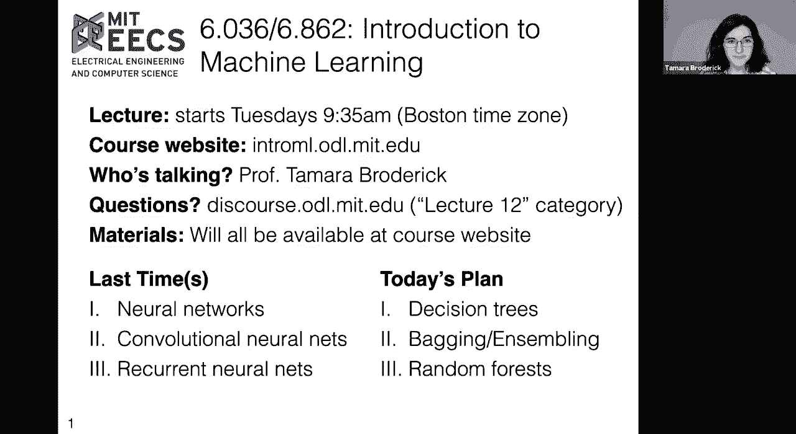

methods today，okay so first let me just spend a little，time um，hopefully convincing you that uh。

predictive performance isn't everything，um that there are things that we really。

do care about beyond pure predictive，performance um or perhaps you know we。

just need to rethink what we mean by。

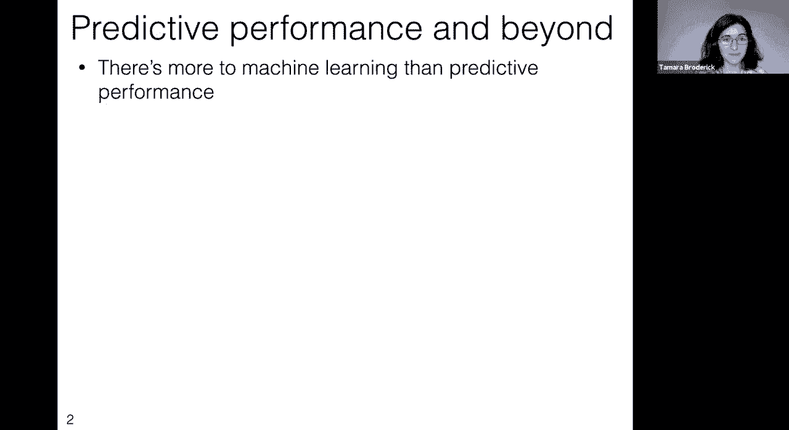

predictive performance um，but an example of this i think is is。

very timely it's uh election audits um，so if you looked in the news uh very，from。

back in october even before the election，um election audits are。

are a very important you know item that，people are talking about。

um 46 states at least according to this，article in october have some sort of。

auditing regime in place，to just double check if there is some。

kind of user error or some kind of like，technical glitch or whatever。

um but this isn't a new idea of auditing，elections so here's a paper from 2008。

that's been very influential actually，left，um was using was talking to philip stark。

who wrote this article in 2008 and has，been doing a lot of work in election。

auditing and i'll also mention，ron rivest in our department here at，work。

in election auditing it's a pretty cool，area and gets into some。

math but here's a here's a quote that i，really want to excerpt from。

this um 2008 article which is the，made，he made them to simplify the exposition，and implementation。

his methods need to be transparent to be。

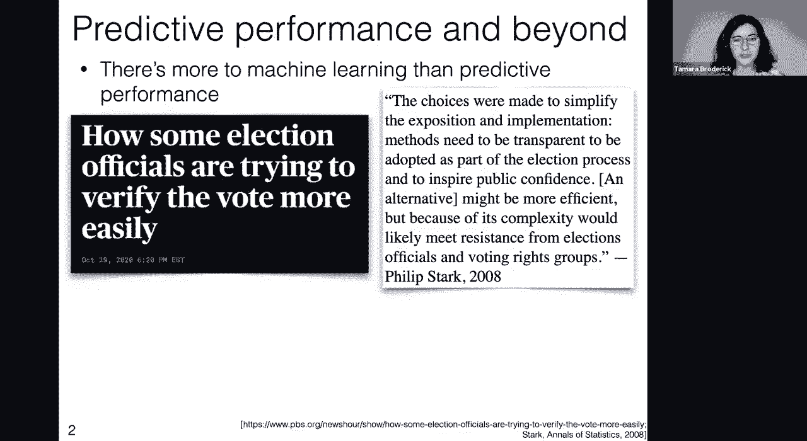

adopted as part of the election process，and to inspire public confidence。

he thought about using sort of methods。

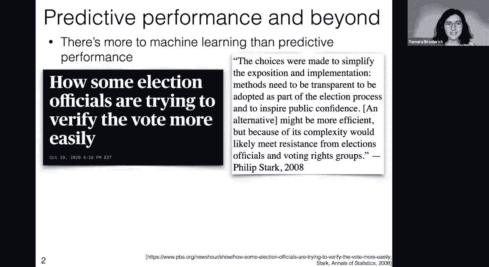

that are more familiar to data analysts，and they might be more efficient in fact，they probably are。

but because of their complexity they'd，likely meet resistance from elections。

officials and voting rights，voting rights groups and so i think this。

is a nice explanation of you know why，do we sometimes need methods that maybe。

don't reach the absolute peak of，something like predictive performance or，some other notion。

of goodness well it might be that we，just need to explain them to people and。

i think it's not just that，you know everybody's being silly and we。

should all accept neural nets as our new，overlords，um there are plenty of reasons that we。

should want these good explanations i，mean one，is that there are reasons to be。

skepticals of that skeptical of methods，you don't understand so lots of folks。

right now seem to say they have machine，learning solutions and maybe they're。

selling snake oil sometimes，um and so you know if you're not a，machine learning expert being able to。

distinguish them，between those um items might require，some kind of interpretability。

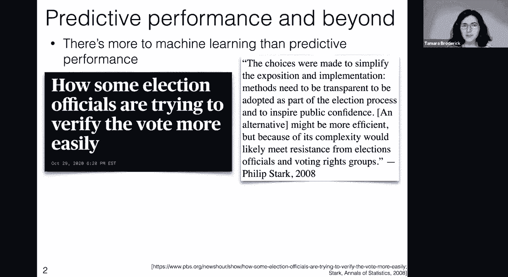

but it's not just about you know whether，you have expertise or not。

even if you're a machine learning expert。

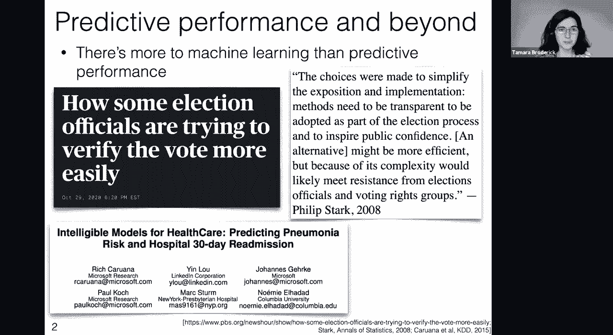

you probably actually care about，interpretability so here，um here's an example you can read in。

this paper of a case where，machine learning experts ran neural nets。

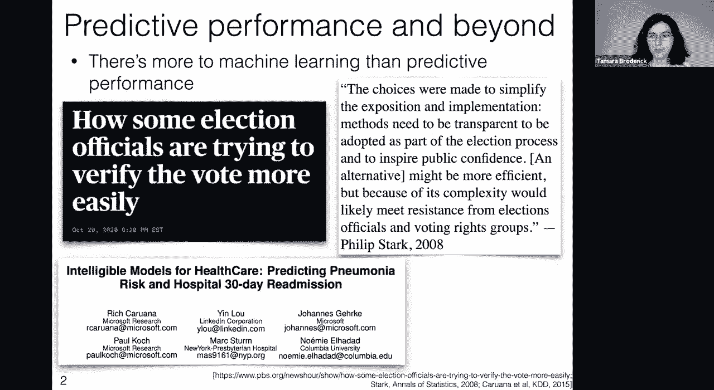

and also more interpretable models，on this problem where they were kind of，interested in。

uh what is the risk of death from，pneumonia，from patients so this was in a medical。

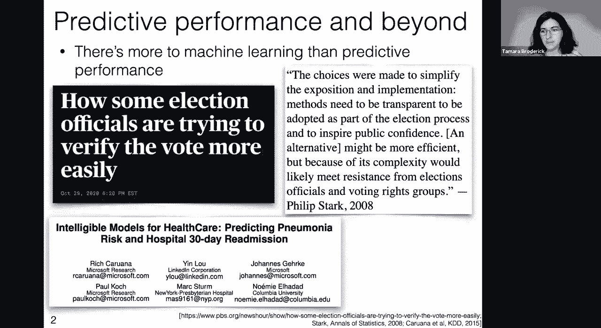

context and the interpretable model had，a very clear step if the patient。

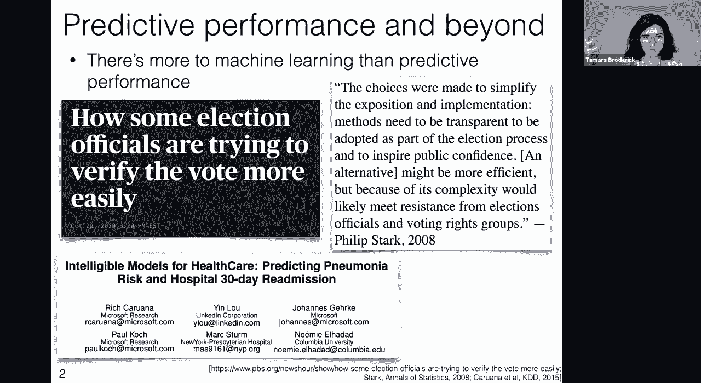

you know once once they got all of their，methods out they have the neural net and。

it's like okay here i have a neural net，what do i do with this but the，interpretable model，hey。

if somebody is a patient with an asthma，with asthma and pneumonia at the same，time then。

they have lower risk of death from，pneumonia and so that's the sort of，thing that you know。

even if you don't have a lot of medical，expertise but certainly if you do have，seems。

pretty silly that somebody who has，asthma would probably，the higher be at higher risk for。

pneumonia and because they have this，something，is going on here that's a little bit。

weird let's dig into it more and in fact，it turned out the reason that was this。

was happening was that the patients with，asthma pneumonia，were being admitted to the icu because。

they were deemed to be such high risk，they got aggressive care that decreased。

their risk of dying and so this is an，example，of something that you've seen earlier in。

the semester simpsons paradox，um so you might want to you know check。

when that sort of thing is going on，and now you are aware already from the。

semester of simpson's paradox but now，you have an ability maybe。

you know if you have an interpretable，model to see that that might be，happening。

another nice thing about interpretable，models is that there's less room for，human。

error so if you look at malcolm，gladwell's blink book，there's an example of dr brendan reilly。

medicine，at cook county hospital in chicago he，was facing resource shortfalls。

they have lots of poor patients that，they're they're treating and they needed。

a way to diagnose heart attacks，and patients that were presenting with，pains。

it was quick and accurate and so they，end up using exactly the method we're。

about to talk about a decision tree，um but here you could say they care。

about predictive performance like they，care about accurately diagnosing each，person who comes in。

but the problem is that the machine，learning method isn't exactly the method。

that they're using they're using，a person using the machine learning，method。

and so you know that's not the kind of，thing that you're testing when you're。

testing cross validation when you're，looking at test set error，you know that's actually an extra。

element of the system，beyond the pure method and so that's a。

reason at least on the face of it if you，can't do more that you might care about。

something that's very simple to use so，humans don't，you know mess it up when they're using。

it okay so a lot of reasons to care，about um interpretability about。

things beyond predictive performance it。

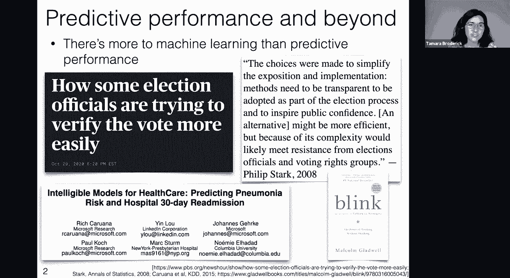

doesn't even just have to be，interpretability um，although that's what i've been focusing。

on here but even if you，only care about predictive performance，you should care about today's lecture。

you should care about trees，the，things that have the best predictive。

performance in many cases um so if you，look at this。

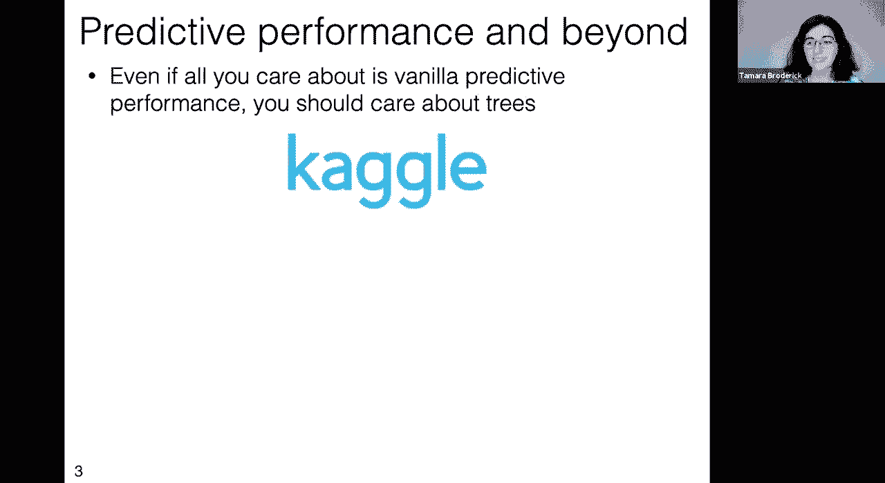

kaggle uh i mean kaggle is a subsidiary，of google llc but it also runs machine。

learning competitions among other things，um and there was this magazine that。

recently in march did an interview with，a kaggle master，ranked 19th in the global kaggle。

competitions leaderboard，um and what's interesting is uh they say，sort of like what's his toolkit。

and if you look at these algorithms in，his toolkit light gbm，xg boost cat boost these are all。

ensembles of trees，um and so while neural nets can be，really useful again for things like，vision。

and nlp and so on um the reality is for，a lot of the data，that you're going to encounter ensembles。

of trees are basically uh the thing that，really does the best in terms of，predictive performance。

okay so at this point hopefully you're，motivated to hear about what is a tree。

and what is an ensemble of trees um and，so that's what we're gonna do today。

okay so let's start with what is the，decision tree well decision tree is，basically just a。

presentation of a series of decisions in，a tree so let's let's start with that。

and then we'll nail down，exactly what it is so let's say that i，have some encoding coming in。

um you know maybe they came in with a，heart attack um and we know after first。

24 hours whether they've had a heart，attack they've been in the hospital over。

24 hours and now we want to assess their，risk in order to，decide on their follow-up treatment um。

and so，here is a tree that um people actually，you know in sort of the early days of。

decision trees presented，um which is the following series of，decisions so first we asked let's look。

at a particular type of blood pressure，systolic blood pressure。

over the last 24 hours and asked was it，you know did it really dip down very low。

was it always greater than or equal to，91。so we have two choices either yes or no，so if。

no if it was if it did dip down below 91，then this patient is considered high，risk。

if yes then we're going to ask another，question the question is。

is there patient age greater than equal，older，might be riskier so if this patient has。

an age less than 65，then we might just consider them low，risk at this point um they're probably。

going to be okay，but if they're greater than 65 we have，yet another question we're going to ask。

is sinus tachycardia present for the，purposes of this lecture let's just say，can measure。

and you can check um and you can check，if it's present it either is or it isn't。

um if it is not then this patient is low，risk if it is this patient is high risk。

and so here is just a series of，decisions a series of yes or no，questions。

um that even if you don't have medical，expertise you know if you're provided，with the。

appropriate data you can just go through，these and answer them。

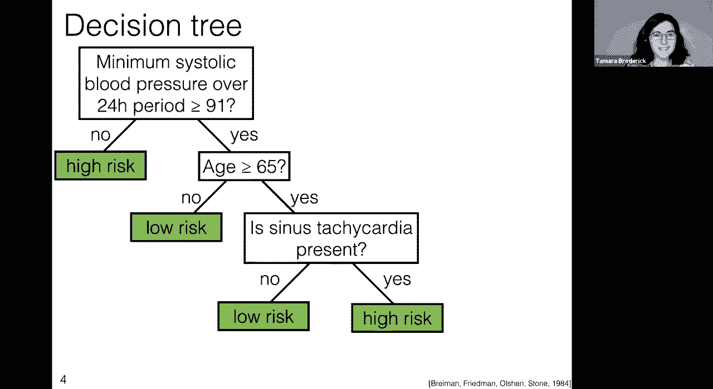

okay so this this is like a nice little，flowchart um but it's maybe not clear in。

this form how it relates to everything，we've talked about in the class so let's。

you know turn this into，um something that we can actually talk。

about in the words and the the phrasing，and the terminology of this class。

okay so let's imagine in real life you，know we have a bunch of data。

um you can imagine each individual who，walks in，and is around for 24 hours after a heart。

attack is a data point，and we have various features associated，with those individuals like。

the date that they were admitted um，their age their height，their weight was sinus tachycardia。

present on the minimum systolic blood，pressure over 24 hours and maybe their。

latest diastolic blood pressure and you，know maybe even there were some other，features。

okay so actually we can see each of，these internal nodes，in this tree as being some kind of cut。

or split on one of these features so in，particular minimum systolic blood。

pressure over 24 hours that's actually。

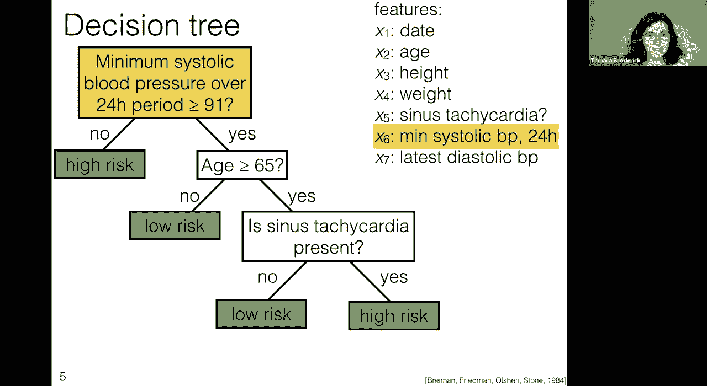

our sixth，feature in this case so we can write，this as x6，greater than equal to 91。 is this true。

we'll go to the right hand leaf if it's，or the the right-hand child。

if it's false we'll go to the left-hand，child okay we can do the same thing with。

age age is our second feature，so we can actually rewrite this as x2，greater than equal to 65。

if it's true then we'll go to the right，hand child if it's false we'll go to the，left-hand child。

is sinus tachycardia present well this，sort of depends on how we。

um encode this a typical way that we，might encode as we've seen。

a um binary variable um you know binary，classes is either 0，1 or negative 1 1。 either case 1。

is probably going to be the the yes and，so we'll ask，is x 5 greater than equal to 1。 and so。

here now we have our decision tree，in terms of our features now。

typically what we do here is we we do，some kind of classification or，regression。

hopefully it's clear that this looks，like classification that we're trying to，classify。

into two classes high or low risk and so，we might give them labels。

a typical thing we've done in this class，is give them labels like zero one。

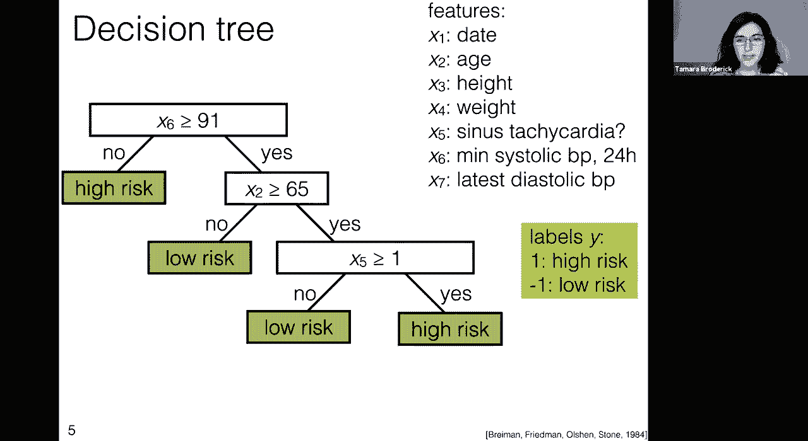

or negative one one um and so here we're，doing that we're having。

one be high risk and negative one be low，risk and so here we are。

so we can change this into our labels，and so at this point，basically we have created a classifier。

or in general a predictor um and so，let's just double check that that's true。

that in fact this is a classifier oh and，before we do that let's let's finish up。

saying like what exactly is the decision，tree um what counts as a decision tree，well it's going to。

be a binary tree with internal nodes and，leaves，the internal nodes each one of them is。

going to be defined by a dimension index，j，and a split value s so for instance if i。

look at this node so this is one of the，internal nodes i've，i've color coded the internal nodes here。

as being white and the leaves as being，green，so this is an internal node it has a。

dimension index that we're splitting on，that's j in this case j is six。

it has a split value s that we're，splitting on in this case that split。

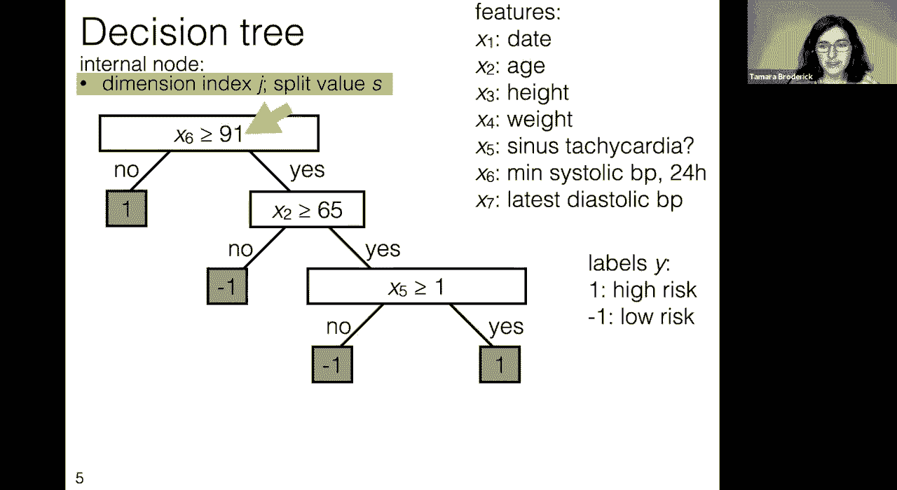

value is 91，and then it has two child notes and each，one of them can either be。

internal or leave node and then the leaf，nodes，so this one's leaf node this one's an，internal node。

now the leaf nodes are defined just by，their label，so we get to a leaf node that's the end。

it's not going to have any children，but it does have some kind of label and。

that's what we're going to predict at，okay so as we said this is a，classification tree this is doing。

classification，um as its form of decision and now we，can say that we have defined a，past。

for for logistic regression for neural，nets for you know any of the things that。

and let's just check that that's true so，here let's suppose we have a data point。

that comes in so a person comes into the，hospital，that person has a bunch of features。

associated with them，again the date the age the height the，weight is sinus tachycardia present。

men's systolic blood pressure latest，diastolic blood pressure，and now we're going to ask ourselves。

well how would we classify this data，point，so in order to check what does this，predictor。

look like on our particular data point，we're basically going to run through the，decision tree，sixth。

feature for this data point greater than，equal to 91。so here's the sixth feature in this case。

it's 115 so it's greater than equal to，91，so we say yes so now we go to the next，decision。

is x2 greater than or equal to 65 as the，person，older than 65 and we check this person's。

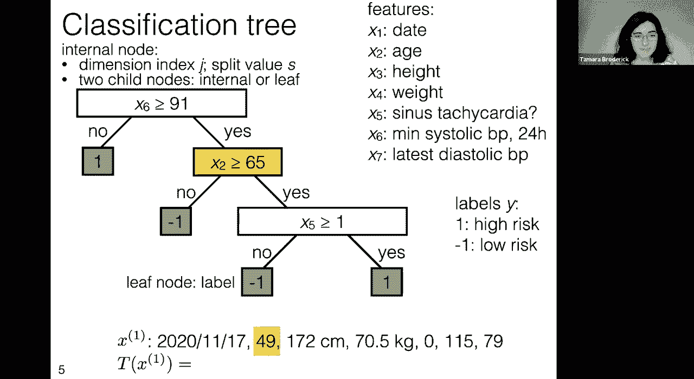

age it's 49，they're not older than 65 so we go to no，and now we're to leave。

and so as soon as we get to a leaf that，is our prediction in this case it's。

negative one we say this person，okay so this is a classification tree。

we can use it to make classifications um，you'll notice that it does not have to。

use absolutely every feature，we're going to see later that actually。

features can repeat too we can have，things like that，but it is a binary tree of decisions a。

finite binary tree of decisions that，eventually gives us some kind of。

classifier and of course we can do the，same thing for regression it doesn't，have to just be。

classification so let's take a look at a，regression tree，um so here instead of a medical example。

let's have an example that we actually，visited uh sort of way back when we were。

talking about neural nets um，so here our example could be you know，when am i going to run。

where and how much am i going to go for，a run and maybe my，my two features that i use to decide。

this are temperature and precipitation，so how how cold is it，and you know is it raining how much how。

and my label could be kilometers run，okay so what are we gonna do here so。

we're gonna again start with the，decision，say in this case x2 is great or equal to，0。3 basically。

is there a lot of precipitation in which，case we'll go to yes。

or is there not so much precipitation in。

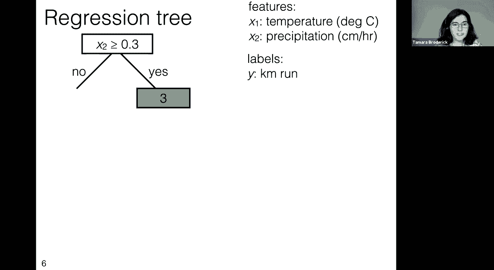

okay well if there's a lot of，precipitation maybe it turns out that um。

i just go inside and i go on the，much，and so i run let's say three kilometers。

if there's not so much precipitation i'm，gonna ask is it coal，so we'll have x1 greater equal to。

negative five，um and maybe i say you know if it's，cold so if there's a no here then again，gonna。

run maybe as long maybe it'll be two，kilometers if it's yes maybe i'll ask is，it warm is it。

way too warm is x1 greater equal to 33，so if it's very warm um or if first if。

it's in sort of intermediate temperature，so it's not too cold and it's not too。

hot maybe i'll go outside and i'll run，and i'll run a good five kilometers。

um but if it's very warm i don't feel，like doing anything and so maybe i'll，just run。

zero so in this case what's what's，different between a regression and a，the。

regression all the decisions and the，as before，the only difference is the labels are，real valued now。

so this is like the difference between，regression and classification in general。

um that you have a predictor that's real，just，you know one class or the other or。

multiple classes is also fine，okay so something to note here and this，is not specific to regression。

or classification this is generally true，for these decision trees that the tree。

itself defines an axis-aligned partition，of the feature space so let's dig into。

what all of those words mean by first，seeing，okay so first when we before we get to，the root node。

first we have all of the feature space，so in this case，that's x1 greater than zero sorry it's x。

um one any value because we can have，sort of any value in degrees celsius i。

mean technically speaking there's a，lower limit to that，but um you know basically all the。

allowable degrees celsius，then x2 has to be greater than zero，because it's precipitation。

can't usually have negative，precipitation，okay so now we're going to look at the。

first split here so the first split is，saying，let's look at x2 greater than or equal，to 0。3。

and so what we're doing with this，feature space is we're saying hey we're。

going to split it into two parts，with a line so this is x2 equals 0。3。

the line there's a part where x2，is greater than or equal to 0。3 in which。

to the right child and there's a part，where x2 is less than 0。3。

in which case we go to the left child，okay now in this case when we go to the。

left child there's actually another，decision，another split and so when we're。

splitting you can really think of the，split as being applied，to this feature space we're actually。

making a split in this feature space，so in particular here now what we're。

going to do is we're going to take only。

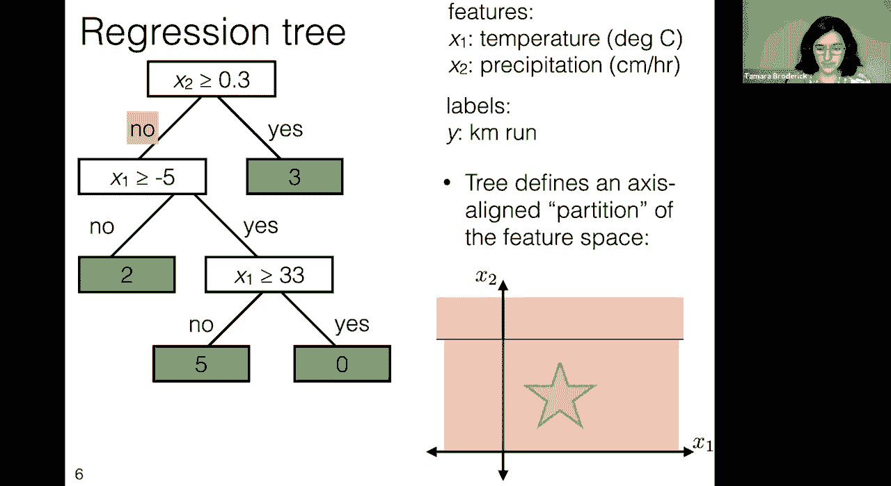

the space where x2 is less than 0。3，and we're going to split it with x1，equals negative 5。

 so you'll notice this，line only applies when x2 is less than，0。3 it's like we've already restricted。

ourselves to the x2 is less than 0。3，space，and on one side we have x1 less than，x1。

okay so now again we say where are we in，the space right now，moving down this regression tree。

and then i'm going to finish this up and，then i'll do the question，um so then we have our x1。

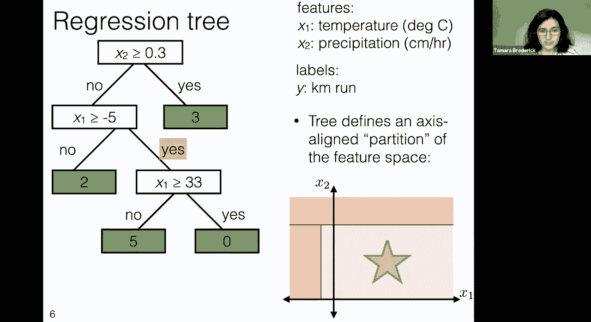

greater or equal to 33 split so again，we're going to split up，our space so we have x1 equals 33。

on one side we'll have x1，less than 33 but it also conforms to all。

of the other constraints we've imposed，so far so this is the set right here，where x2 is less than 0。

3 x1 is greater，than negative 5，and x1 is less than 33 and on this side，we have the same two。

first set of constraints and then x1 is，greater than 33。 okay so the question is。

how could regression trees generate，labels with a continuous number when we，have a binary split node。

and so what's happening is that the，binary split node is just partitioning，the space。

as we're seeing here but the continuous，value that you actually say is your，regressor。

that you actually say is my prediction，at a particular point。

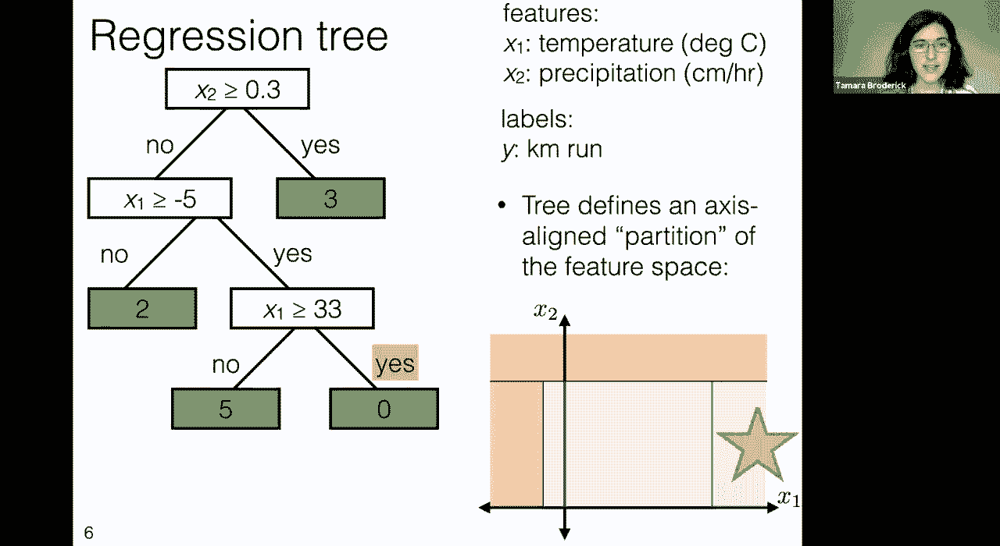

know here，i've got kind of lazy and i put those，values as three two five。

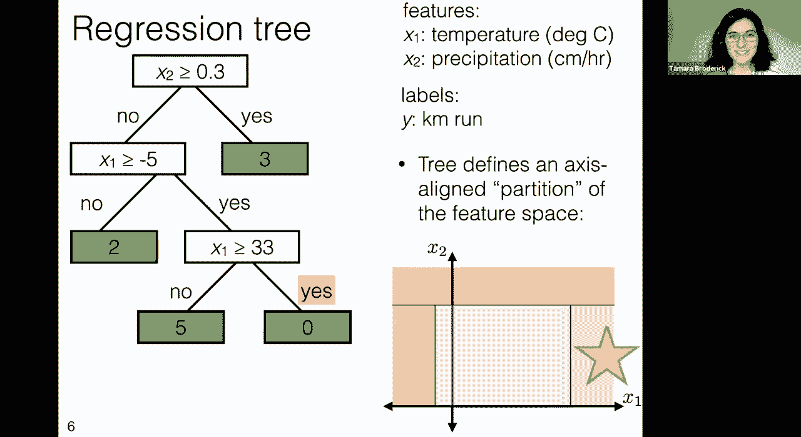

and zero if i had been slightly less，lazy i could make them more obviously。

real valued like you know maybe，sometimes i run 3。2 kilometers and，sometimes i run 5。1 kilometers。

um but the idea of regression is just，that you，are predicting a continuous value and so，as long。

as you are allowing you know a，continuous value in your leaf nodes you，are doing regression。

another way to think about that is，what's happening in regression。

is that for every value in your feature，space you are，predicting a continuous value and so，um。

little plot that i put in the lower，right hand corner，this，as being a three-dimensional plot where。

sort of the y label is coming out，of the um the slides at you。

then this would actually be um you know，you could have that y label and then you。

would have your regression values which，case，of red is two in the case of blue is。

five and in the case of，purple is zero and so if we could，imagine rotating that and then you would。

actually see this sort of step function，um that we're predicting and so the。

difference with classification is just，that you're only allowing，in in the case of two value。

classification those two values but if，you were doing three value of，classification。

you know multi-class classification you，wouldn't be putting that on a y-axis you。

would be saying it's like a b，and c is what you're predicting and you。

wouldn't just plot those on the same，thing because as we saw before having。

you know this is back in lecture three，with our features，we saw that having um multi-classes。

isn't the same as having an ordering，like one two three because there's no，ordering on those classes。

and see that's where i think you can，really see that there's a difference，um in what you do with the。

now that being said i think this，observation about the binary split node。

is key because it tells you that we're，really doing a。

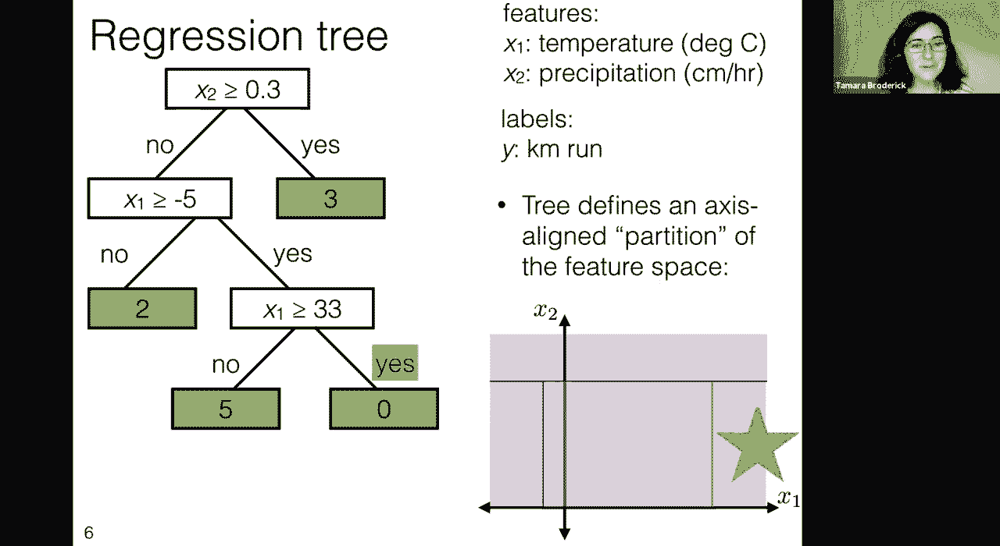

a sort of simple type of regression you，know we're not getting a really，different。

um prediction from one point to the next，we're really doing a。

step function as our regression now um i，said in the beginning。

of this slide or you know earlier in the，slide i would say what is an axis。

aligned partition so let me just say，that now，so a partition is when you have a bunch。

of mutually exclusive and exhausted sets，that is to say，the sets are all separate they don't。

overlap and when you take their union，they all become the whole space。

and so that's what we're seeing here is，that we've taken up the space of x1 and，x2。

our feature space and we divided it up，that's that's all you're doing the，little。

you know subspaces and so we have um，basically four here，is what we've done and each one of those。

we're going to predict something，different，now two things that are worth noting。

about this one this is why we end up，just，in this case predicting a constant value。

now you don't have to do that in，regression trees you could do something，else at the nodes。

but here we're just going to do a，constant value um the other thing to，notice is that these are。

axis aligned by our choice of splits our，splits are we take one dimension。

and we split it a particular value and，so we're always going to get these lines，as our dividers。

that are parallel to one of our axes，like x1 or x2，in this case um again that's something，one's。

a lot harder to go beyond in a，reasonable way that actually，gives you useful predictions but it is。

great okay，so now we've talked about two different，types of decision trees we've talked。

about classification trees，we've talked about regression trees and。

in a way you can think of what we've，done so far，mode，of these you know we we talked when we。

were talking about neural nets，about sort of the forward run of the。

model um and then going backwards，through it and so here what we're doing。

is we're saying hey if i have，a decision tree and i have a data point。

i can tell you the prediction i know how，to do that and we've talked through that。

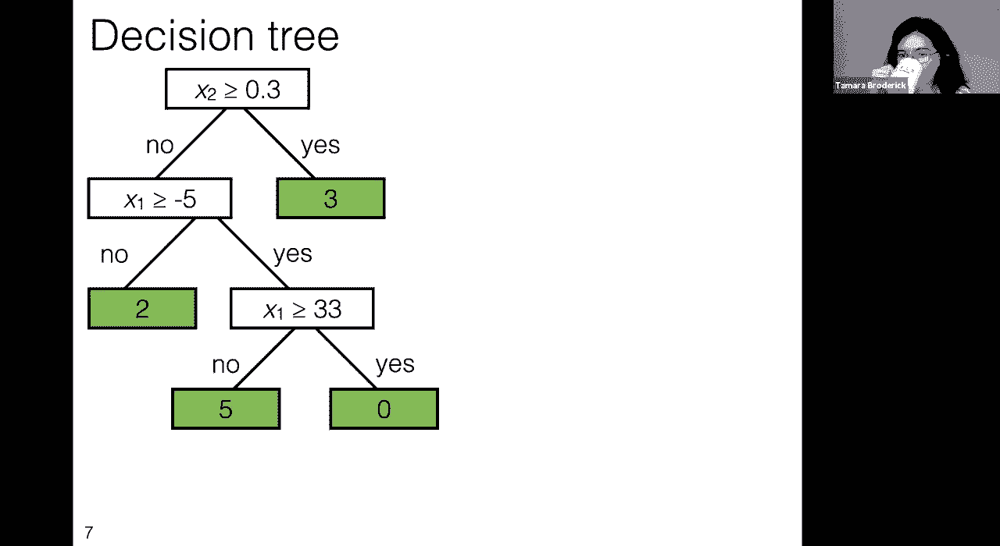

okay and that's step one of our familiar，pattern，so at this point hopefully this is，becoming so old。

as to be boring you totally know the，familiar pattern and you're really。

familiar with it um so step one，we have to choose how to predict a label，so if we're getting。

given a set of features and a predictor，which is defined by parameters and we'll。

say in a moment you know what is a。

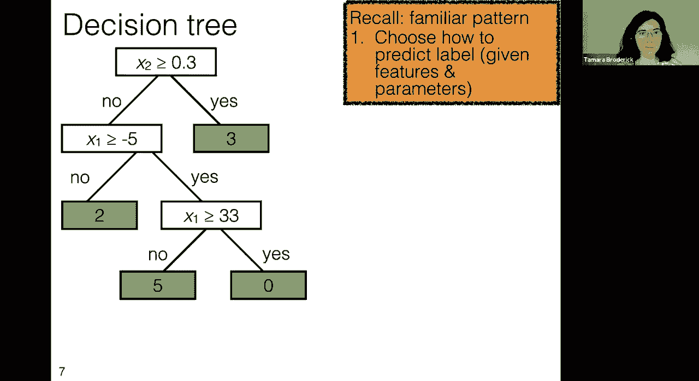

natural way to think about parameters，here，um but um but given features and，parameters。

we know how to predict a label so we，just saw that with decision trees we。

looked through an example and the，medical example of，suppose i have a data point you know。

what'll i do。

to predict whether this person is high，risk or low risk we could do the same，thing here。

you know if i have a day that is 20，degrees celsius，and there's zero precipitation i can go。

to the top i say there's zero，precipitation so i go to no，it's 20 degrees celsius so i'll go all。

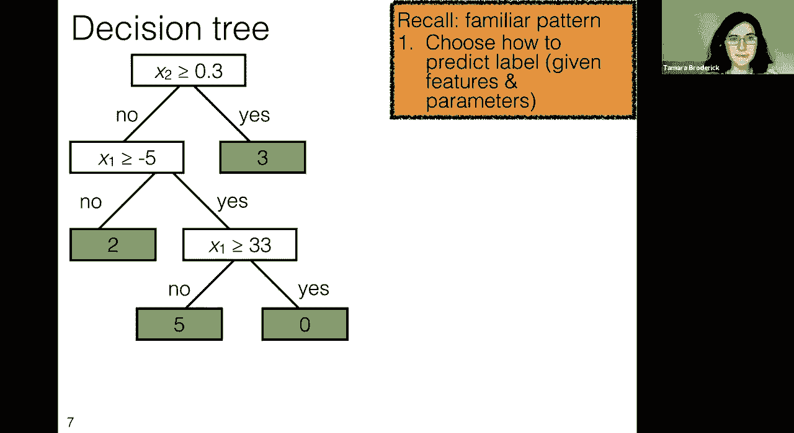

i'm gonna run，five kilometers okay so we know how to，predict a label given a set of features。

and parameters，the next thing that we do is we choose a，loss a loss between our guess and our。

actual label so we'll just do that in a，moment of course that will depend on。

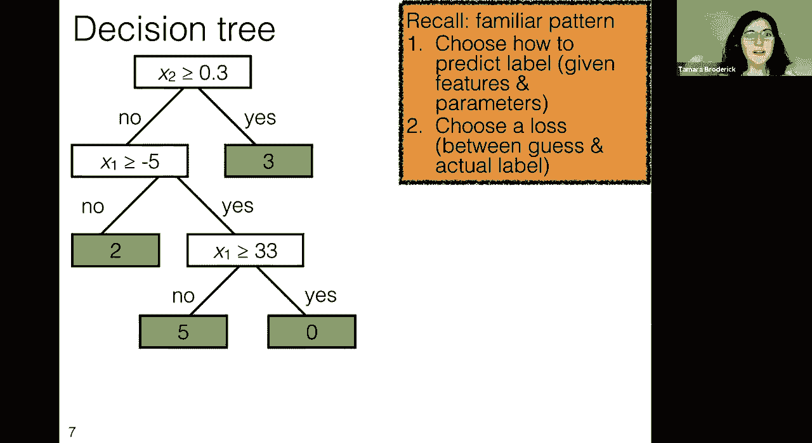

whether we're doing，regression or classification that will，depend on what type of thing we're doing。

with regression and classification。

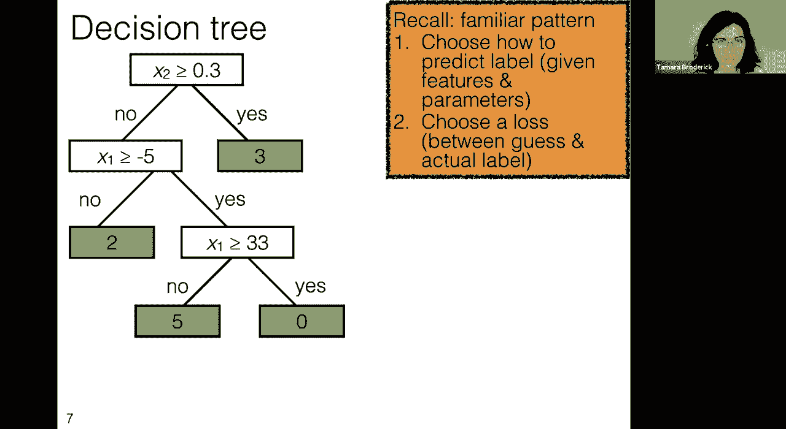

but it's something that we'll choose and，then finally we somehow choose，parameters。

okay so so what are the parameters here，well the parameters are typically the。

thing that you know describes what is，our。

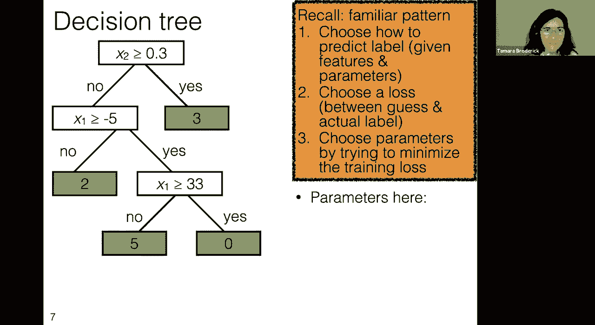

um what is our predictor and so in this，case we have a bunch of unknowns。

we want to say for each internal node，what is the split dimension。

we want to say for each internal node，what is the split value。

so again for x2 greater than or equal to，0。3 the split dimension is 2，the split value is 0。

3 so those together，will define，what's going on at that internal node。

what's my you know what am i going to，what am i going to do how am i going to，make my decision。

but i also need to say what are the two，children notes，is there one leaf and one internal node。

is there one internal node and one leaf，in the other direction are there two，leafs。

are there two internal nodes these are，all possibilities and we need to say，which it is。

and then for each leaf node we have to，say the label so what we're gonna do in，a moment。

is we're going to come up with a way，once we've chosen a loss，to choose all of these parameters by。

trying to minimize the training laws，now something that's worth noting here。

that's a bit different from things we've，done in the past，hopefully sort of immediately different。

if you think back to like linear。

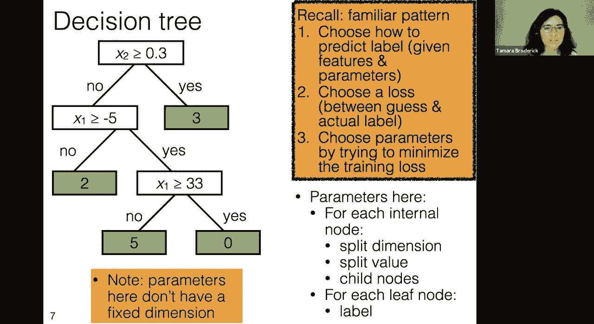

regression or logistic regression，but actually really different from most。

of the things we've done is that the，parameters here don't have a fixed，dimension。

um so as soon as i make an internal node，if that has two children that are。

internal nodes now i suddenly have a，bunch more parameters，and if they have internal nodes as。

children now i have a bunch more，parameters，in fact you can get more and more，parameters this way。

so that's a bit different than what，okay so let's suppose that i'm going to。

do regression i'm going to choose to do，regression，and i'm going to choose squared error。

loss because that's a really natural，thing that i might do for regression。

well hey squared error loss we've talked。

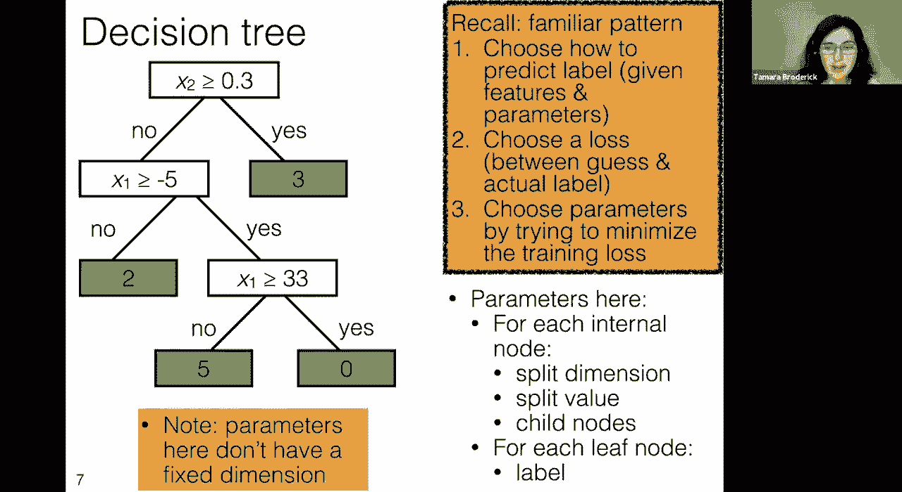

before about how，um you know if i were doing um，you know something with screwdriver loss。

i might i might uh in general try to set，up everything in my problem so that's。

all differentiable and run gradient，descent or stochastic gradient doesn't。

and that's just not going to happen here，so a couple of things to note。

one we certainly haven't talked about，how you would do gradient descent or。

stochastic gradient descent，if you don't have a fixed dimension。

parameter that sounds like it might be，hard，two this is definitely a super not。

differentiable structure so if i'm，trying to decide whether to add an，internal node or not。

that's at least on the face of it not，differentiable that's just a very。

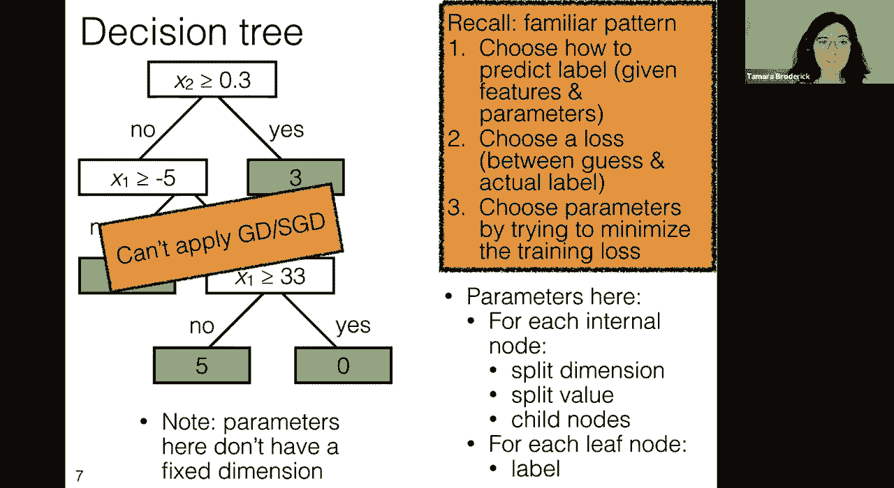

discreet decision and so it's really not，clear that i could apply something like。

gradient to center stochastic gradient，descent which really relies on。

there being differentiability in all of，my parameters that my loss my overall，objective。

is differentiable in all my parameters，and so we're going to have to think，about what could we do。

well we could go back to our roots you，know way back um，at the sort of very beginning of this。

class we used a heuristic the perceptron。

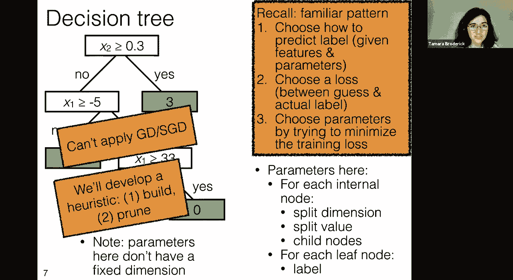

um we don't always have to use uh，gradient descent and stochastic radiant。

descent i mean even when they're，available we don't always have to use，them。

um and so in this case we're going to，look at a heuristic，it's going to have two parts we're going。

to build up a tree，we're going to think of it as growing，the tree and then we're going to prune。

it back，so take away parts of the tree this is，a particular way it's a very classical。

way to build the decision tree i kind of，want to emphasize。

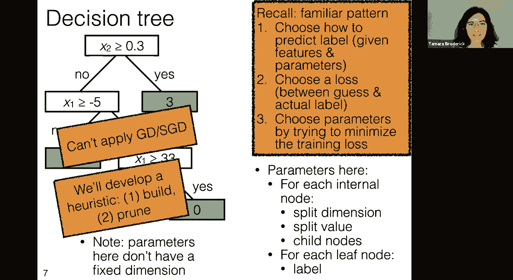

that just like many things we've talked，about in this class this is not the only，way to make one。

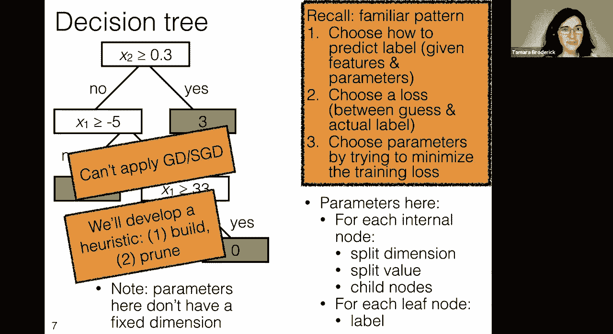

um there are definitely other ways you，can make a decision tree。

and i think in some ways what's really，important to understand is the。

simplicity of the ultimate decision tree，that you get，is very useful you know it's very。

understandable it's the kind of thing，that you could present，to somebody who's an expert in another。

area who，isn't an expert in machine learning you，know you could have an extremely smart。

medical practitioner，um and that doesn't mean that they know，about neural nets um so this is。

something you can easily talk about with，them if you're serving on a jury。

and you're participating in your civic，duty on a jury a tree is something that。

you could explain to your fellow jury，members，um and so that simplicity is separate。

from what we choose to learn it，and now we're going to talk about here's，it。

um but again not the only thing you，could do okay so again we're going to。

talk about these two steps building it，up。

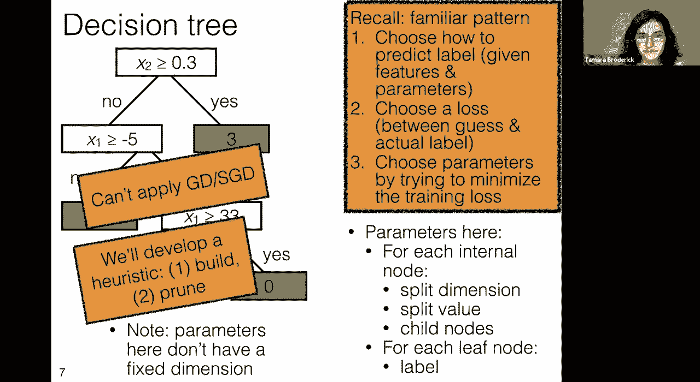

and putting it back，okay so let's first start first start by，and。

let's imagine that we have some toy data，over here um，and it is running times uh based。

on the again you know temperature and，precipitation so x1，is the temperature you know it's very，cold。

maybe i'm not running when it's very，warm i'm not running and then x2 is the。

precipitation one it's precipitating a，lot i'm not running，but when you get that nice temperature。

and there's not a lot of precipitation，then i'm running and maybe it's。

something like five kilometers and we're，problem，again um you know if i put a little more，like。

you know realistically i might run like，5。2 kilometers or 4。9 kilometers。

um so you can think of these as being，you know values that really do vary。

continuously and we're trying to learn a，regression tree，okay so if we're trying to learn a。

regression again a really，natural loss is squared error loss so。

let's let's just go ahead with scared，error loss for the moment。

um it depends on what you're trying to，do in general um，and it's not always the right choice for。

regression but for here it's certainly，convenient and we might just go ahead，with it。

so let's suppose we're building a，regression tree with scared air loss。

okay so we're going to build our tree，and it's going to take two inputs one。

it's going to take a collection of data，indices what do i mean by that。

well the first thing that we're always，going to do when we run build tree。

is we're going to run it on our training，data and so here，i the collection of indices that we put。

in will be the indices of our training，data，training data point one two up to n。

assuming we have n training data points，now why would we bother making that an。

input to build tree well the problem is，we're going to be doing it recursively。

later with just a subset of the data，and so that's why we want to make that。

an input we'll see that that's important，okay next we have k so k is going to be。

sort of a hyper parameter of this，algorithm，it's going to be the minimum。

number of points that we allow，in um a tree branch，so or in a leaf so basically as soon as。

we get down to two points we're gonna，stop we're gonna say we're done。

um we're not gonna go down to allowing a，leaf with just say you know。

i usually start saying this is according，to the algorithm we're about to build up。

i think it's actually the maximum number，that we're gonna allow。

i take that back yeah okay the point is，we're not going beyond two。

okay so our first question because we're，not going beyond two points we're not。

letting ourselves have um more than two，points in a branch we're going to ask，ourselves。

okay is the number of data points that，we're looking at right now。

okay well let's start asking that um i，this is a real question for the the chat。

i'm looking at the number of data points，when i run this i'm gonna i'm gonna run。

exactly build tree one to n on the data，set that i have right here，so this is a data set that i'm。

illustrating with the zeros and fives，the number of data indices so that that。

absolute value i means the number of，things in the set，so i'm asking um for the chat。

what is the absolute value of i here，what are the number of things。

okay i'm getting great answers from both，directions so，some people are answering in full。

generality which is great，in that case the answer is n there are，clearly n。

things in this index set and if you did，answer in full generality i'll ask you，to also think about。

what is the number n for this particular，data set that we're illustrating here。

great so so just to recap in this data，set just to be really clear about how，i'm labeling things。

so i'm at a particular x1 and x2 point，if there's a point i'll put a number。

and that number is the regression number，so it's like oh，at this data point i ran it's the label。

i ran zero，kilometers at this data point i ran five，kilometers and so the answer which many。

of you are getting correctly，is 11 because there are 11 data points，that i'm plotting here。

and so i'm going to check in this case，is 11 greater than or equal less than or，equal to 2。

and it is not um and so i would skip，this if statement and the first time i，but let's ask。

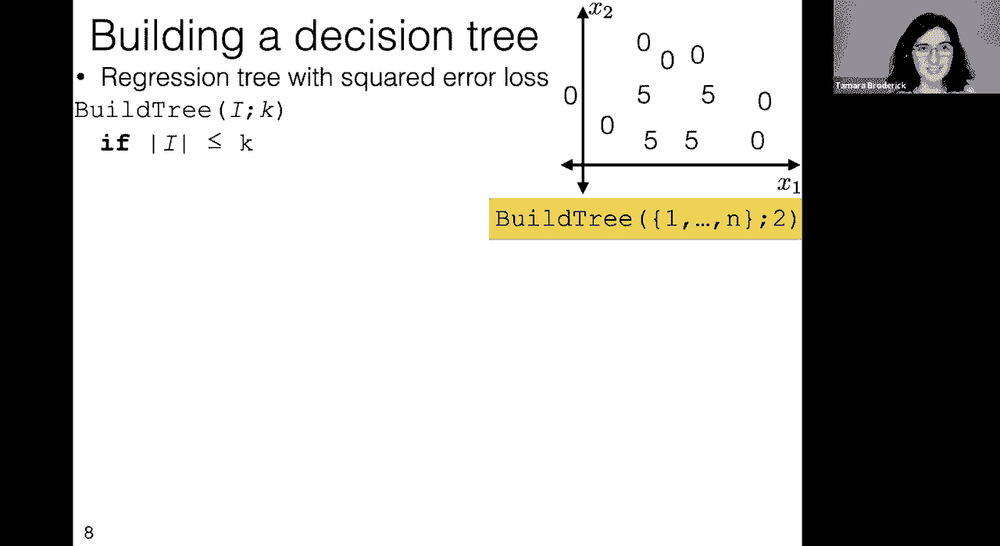

what would happen if i if i did happen，to have actually only two points and。

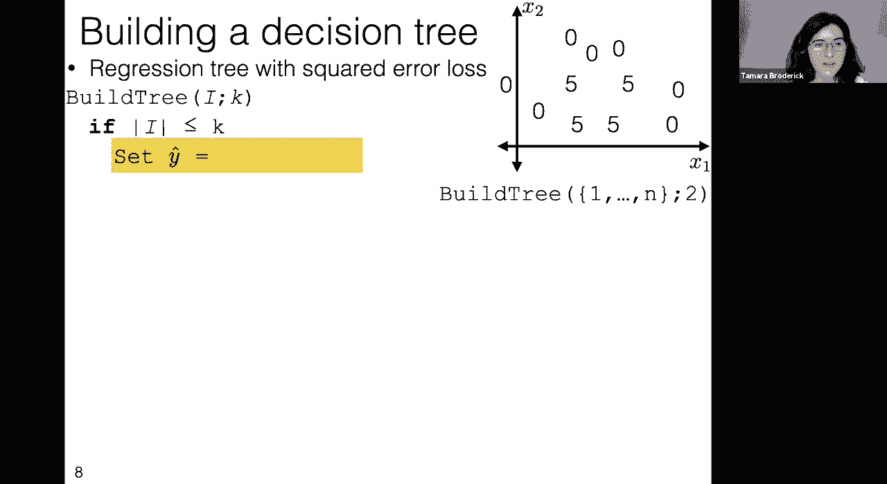

we'll fill it in，okay so if i only had two points if i，were making myself a leaf。

well what happens at a leaf at a leaf we，just make a label we just say what's the，label。

that i'm going to have what's the，predictor that i'm going to return。

for this little area it'll turn out to，be like that little，partition element that we saw before。

this little block of space in our，feature set，okay so we're going to have to set y hat。

somehow how are we going to set y hat，where y hat is our label it is what we。

predict in this little area，well remember our goal here i mean this。

is going to be sort of a heuristic，method but our goal is to minimize，the loss and in particular。

the loss or the error the thing that we，want to minimize here，is going to be the sum of the losses。

over the data points in this little set，so we have a sum over data indices in。

the tiny little set that we're looking，at right now，i mean by construction it's tiny because。

it had fewer data points than k，and then we're going to have the loss，for that data point。

and so something that you should do is，either，immediately think that you have already。

solved this problem earlier in the，course，or even better solve it again right now。

and by right now i mean if you don't，immediately think of the solution do。

this later on your own time，but you should convince yourself that，the y hat that minimizes this loss。

is the average of the y's of the of the，training data here，so this is a great exercise if you know。

this，um from earlier in the course but make，sure you convince yourself that。

i'm trying to minimize the squared error，loss on this，sort of subset of data then i'm going to。

take the average of that subset，and that'll be if i have to do a。

constant prediction that that'll be the，okay so now i know what i'm going to use。

for my label in this leaf，it's going to be the average of the data。

okay so now let's think about what，happens if i didn't get down to say two。

data points or if i didn't get down to，in general，k data points which is certainly what。

happens the first time i start building，okay in that case i'm gonna have to make。

some kind of split you know that's what，happens in our internal nodes。

i've decided i'm not making a leap so，i'm gonna have to make an internal node。

and that internal node does a split，and so that split remember has a，dimension。

and it has a value and so for instance，the dimension in this case in this。

in this toy example we have here could，either be one or it could be two。

there's the only dimensions that i have，i'm basically go through all my feature，dimensions。

and consider each one of them in turn，okay well let's suppose that i choose x1。

and i choose a split value that's maybe，slightly negative this is what my split，would look like。

or maybe i could choose a different，split value or maybe i could choose one，over here。

um you know any of these would be，totally fine，um okay so here's an issue if i have a，for loop。

over every data dimension that's fine，because there are you know usually d。

data dimensions that's a finite number，we're all good，if i have a for loop over every possible。

split value，and these are continuous dimensions i，have an，uncountable for loop um and that's bad。

that's not something that i could do，on my computer and so that seems like a。

problem that we're going to have to，resolve，and basically i'm just going to come。

back to in a moment but hopefully you，can，think to yourself why is this bad we。

couldn't have a for loop，over an uncountable infinity or any，infinity really。

okay so let's suppose for the moment，that somebody just gave us our split，dimension j。

and our split value s and go forward，with that and then we'll we'll come back。

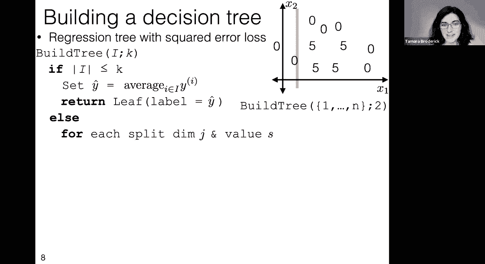

and resolve this issue of you know how，could we deal，with the fact that we have seemingly an。

uncountable infinity of split values，okay so somebody just gave us they said。

hey we're going to take x1，and we're going to split on a particular。

okay what does that do well divides my，data into two parts，so for instance if this were my so if i。

chose x1 so if my j was one，and my split value s was where this line，intersects the x1 axis。

then i would have two sides i have the，side，where xj is greater than or equal to s。

so i'm going to call all the data，indices on that side i plus and i have。

the side where xj is less than，x and so i'm going to call all the data，indices on that side。

i minus okay so here's a here's a，question for you again for the chat。

suppose i do this absolute value around，i minus that is to say i say how many，data indices。

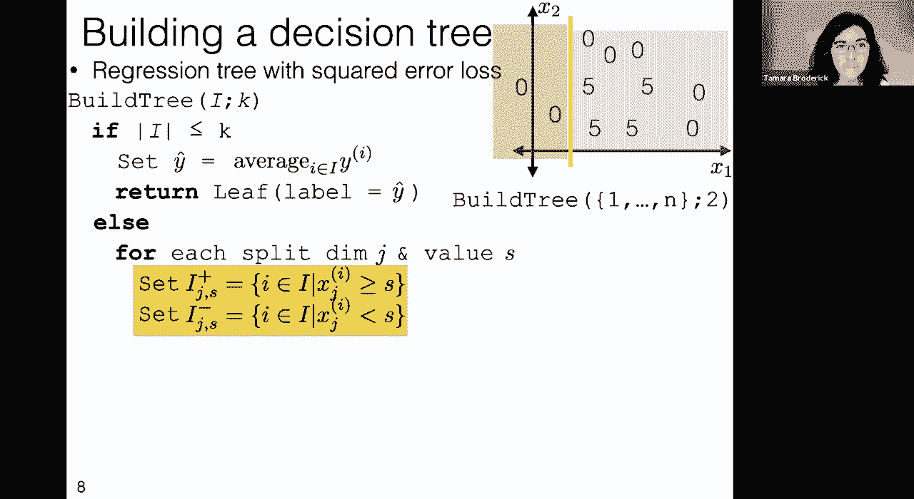

are in i minus for this split，okay it's looking mostly pretty good。

let's just walk through what we do here，so remember i minus is the collection of。

data indices for data points，where xj is less than s so that's what，we're seeing on the left。

side of the split here in that orange，rectangle，and if we look at the number of data。

points in that orange rectangle，it's two and so we're gonna have two，data indices in i minus。

if we look at i plus we're gonna say how，many data indices are。

and i plus and you can count them up in，this case it'll be the things where x j。

is greater or equal to s。

in this case it's nine data points and，as should be the case，nine plus two equals eleven our total。

number of data points，okay so that's what i plus and i minus，they're doing they're just saying what。

are the data indices on one，side or the other and now what we're，going to do。

is we're going to consider instead of，just having，one constant value that we predict for。

this entire space，breaking into a prediction on one side，which we'll call y plus and a prediction。

on the other side which we'll call y，minus，so on the i minus data we'll predict y。

minus on the i plus data we'll predict y，plus，and then what we want to do is we want。

to minimize the error so this，looks i think complicated at first but。

it is literally just the error that we，point，in i we take the squared error loss and。

we add it up it just so happens that，every data point and i，either is in i plus or it's in i minus。

it's only one or the other and so we can，break that sum over everything and i。

into a sum over i plus and a sum over i，minus，and then we just have the squared error，loss in h。

okay again just like we did above you。

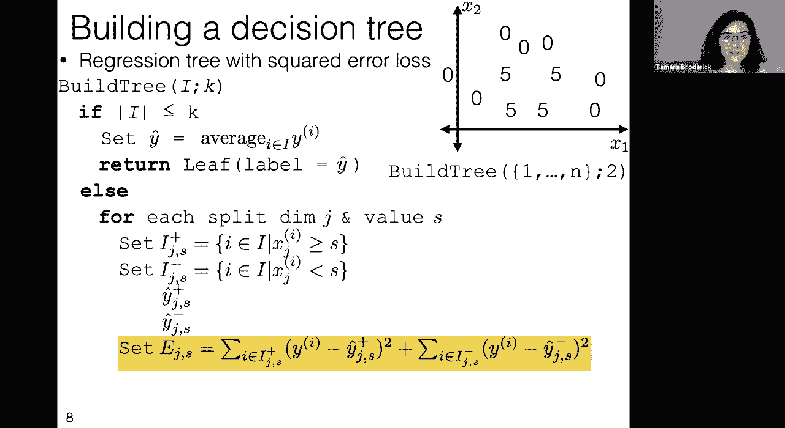

can actually convince yourself that we，don't need，to do anything fancy to solve for y plus。

and y minus to minimize this error，because remember we want to minimize the。

loss we want to minimize the error，and once we have j and once we have f's。

we can just solve for the y plus and the，y minus that minimize them。

you can convince yourself that again，those will just be the averages。

so this is much like what we saw in the，part above now we're just saying what。

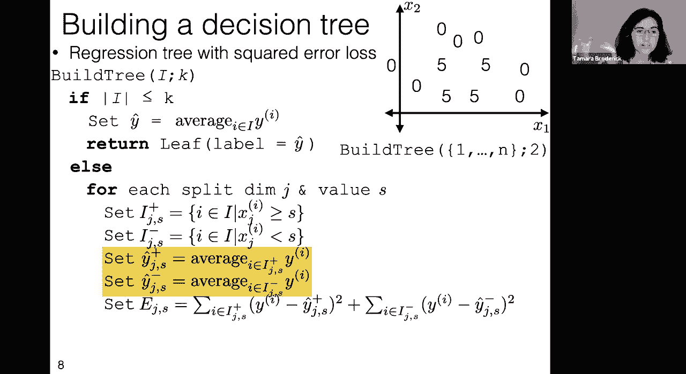

we're going to do，is over i plus we're going to predict，the average of the training data in i。

predict，the average of the training data and i，okay so that means if we have a split j。

so if we have a split dimension j，and we have a value s then we know how，to get the best predictions。

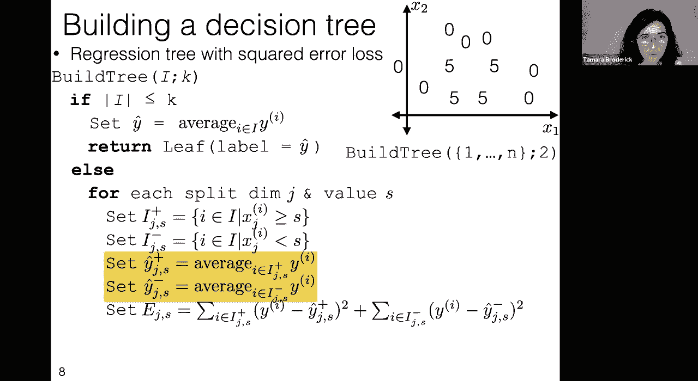

now we have to choose the split，dimension j and the value s，and so what we can do is we can say hey。

for this split dimension j，and this split value s what's the error，what's the loss。

and then we'll choose over all the，different j's and s's what is the error。

or what is the minimizing error how do，we how do we get the smallest laws。

and we can do that by just calculating，ejs for each j and s and then looking at。

which one is minimizing，now remember we had this issue though，where we said ah there's。

technically you know an infinity of，values in fact an uncountable infinity，of values。

where we could split and so what are we，going to do okay，so let's look up at their our our plot。

again，up here and remember this line this，yellow line is a possible split so。

here's a different possible split here's，a possible split，and with this possible split we're。

saying hey we're going to put everything，on the left-hand side。

into one prediction bin and and predict，the average of those things we're going。

to put everything on the right-hand side，into another prediction bin and predict。

the average of those things，so if i change my split from this，to this between these two options so。

here oops here's even three options，if i change my split between these two，options。

do my predictions change on the two，sides this is a question for the chat，yes or no。

if i change between these two splits，or even these three splits do my，predictions change。

great everybody's saying no fantastic，we're all on the same page，the observation here is that while。

technically，my predictions that a new data point，might change with these splits。

my predictions that the training data do，not they don't change at all。

because these splits are between two，training data points um and so。

you know i'm not changing anything about，how the training data，gets categorized and i might think to。

myself well，in that sense those splits are，completely equivalent to me because all。

i know about is the training data，i'm just going to say hey those don't，have any real difference。

now there's a whole bunch of splits that，are between two data points in fact，again an。

uncountable infinity of things so all of，these splits are between two data points。

so i might ask myself，well i gotta choose something how do i，choose between them。

one option is to choose the most central，of them，say i'm gonna average the two x one。

values of the two data points and just，allow a split straight between them。

that's one choice but the basic，observation that we want to make is that。

because all these splits are somehow，equivalent on the training data。

i don't really have a way to choose，between them so i'm just going to try，one of them。

i'm not going to try every single one of，them and try to compute the error every。

time because i know i'm going to get the。

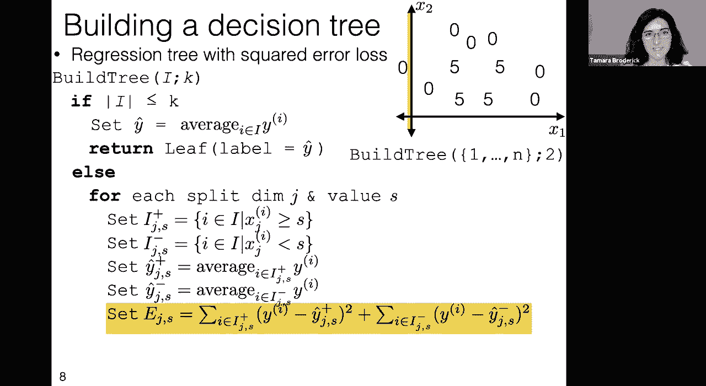

same error the same training error in，this case。

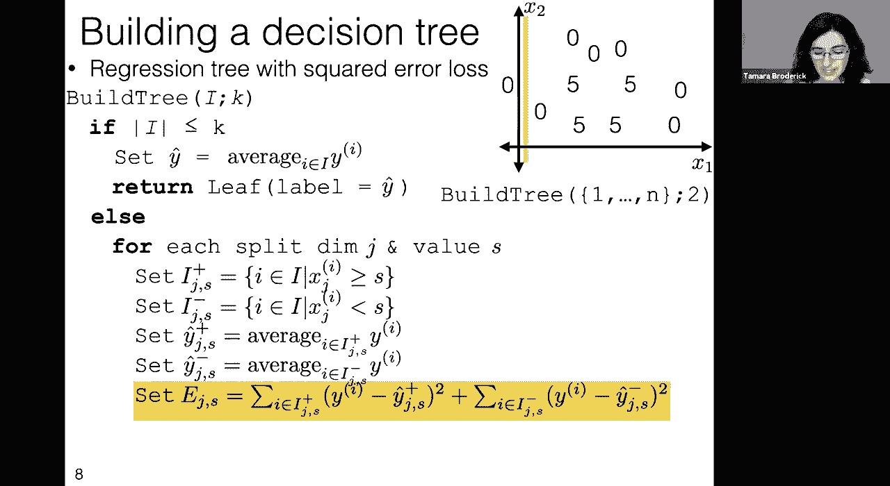

and so instead of going over，every split dimension and every split，value s which would be literally。

impossible to do，what we're going to do is we're going to，go over every split dimension j。

and then maybe something like one split，value，roughly per data point so we might say，maybe we'll do。

you know a split value everywhere that，it could make a difference，everywhere that there is a unique。

training data loss and that'll be about。

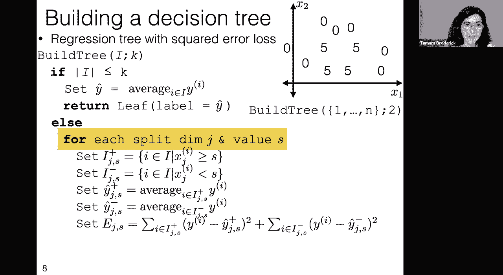

on the order of the number of data，you might do，different things at the edges you might。

have two data points that have exactly，the same x1 value，but roughly this is you know you only。

have to do something roughly on the，order of the data，okay so now we've reduced this to a。

problem that you can actually solve，we're going to try maybe something like。

the central values between every two，data points，so finally we have a finite number。

of split dimension values j，and split values s that we're going to，try。

and because we have a finite number of，them we can look at the error，can say。

which choice minimized that error or，that loss，okay so finally so what we did up top。

was we said if we had a small enough，number of data points，then we were going to make ourselves a。

node it happened to be a leaf node，and that leaf node's going to have a，label here we said。

okay we didn't have a very small number，of points so we're going to make，ourselves an internal node。

not a leaf node but an internal node and，so let's think back。

what defines an internal node we've said，this a couple of times already but now，we're going to start。

getting really precise one internal node，is defined，by a split dimension。

a split value and it's two children，and so here what we're going to do once。

we found sort of the bless，best split dimension and the best split。

value is we're going to return that best，split dimension，we're going to return that best split，value。

and then we're going to build the，children so the left child，let's think how would you how would you。

build a left child where you're，basically going to recursively do the，same thing。

on the data points in the left side of，the split，so in particular we're going to build，tree。

on a set of indices that are now smaller，than the original indices we put。

in we put in our indices i and then what，we did was we found a split。

described by j star and star we're gonna，take all the indices on the left side of，that split。

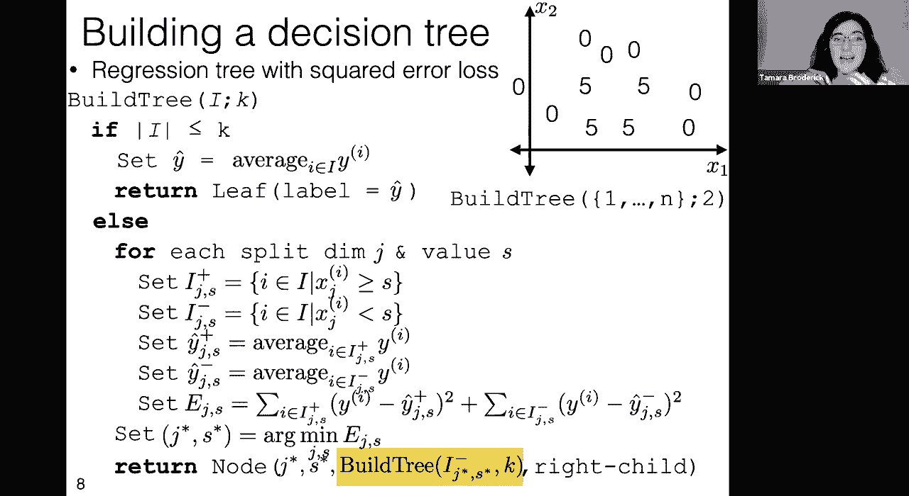

and build a tree with them and then，we're gonna，on the other side take all the indices。

on the right side of the split and we're，gonna build the tree with them。

and the reason now that this is i sub j，star s star is because we chose a，particular split。

this j star s described by j star and s，star and so we technically in some sense。

computed these eyes for，every single j and s but now we're，saying ah you know this is the。

particular j star and s star that we，chose it's the particular，um split dimension and the particular。

value and so that's what we're going to，use to split going forward。

and so you can see in this sense this is，a greedy algorithm，because it only uses the information。

that we have right now and it tries to，you know minimize the loss immediately。

even if that might not be the best thing，you know in sort of a long-term sense。

and by long term i mean over you know，okay so let's run through an example of，doing this，have。

on the slide so we start by saying we're，going to build tree with all the data，indices 1 to n。

as you observed earlier n in fact here，is 11。 and so this will be。

we're going to build over the indices 1，2 3 4 5 up to 11。and let's suppose we chose our k to be 2。

that's that's how many data points that，we're going to allow。

okay so first thing we're going to do is，we're going to walk into this build tree。

algorithm and we're going to start，making ourselves，we first decide whether it's going to be。

a leaf node if we finally made it to a，leaf node or if this is an internal node。

as we observed 11 is less than or equal，to is not less than or equal to 2。

and so in this case we will not be，building a leaf node we'll be building，an internal node。

so we'll go to the internal node，building center，okay so over here we're going to look at。

every possible dimension，again that's every dimension of our，feature space in this case x one and x。

two and we're gonna look at every，possible split value，every possible split value that could。

even give us，a different um loss a different error，and so really we're just going to look。

at you know something like maybe between，each two data points。

okay so we do that we find maybe the you，know the split value that is。

particularly good here and we're going，to start building our node。

so what makes our node well the first，thing is what was，the split dimension and value that we。

found maybe it was this one，so here maybe we found x2，greater than or equal to 0。28 is a good。

split and so on one hand we have x2 less，than 0。28，so when it's you know not too much。

precipitation and on the other hand，we have x2 greater than，0。28 when greater than or equal to 0。28。

when there is a lot of precipitation so，that's the split that we've done and if。

you kind of look at it this seems like，probably a reasonable first split to。

have done for this data it sort of chops，off the most，things that you can that are unique in。

okay so we made this internal node and，so it's going to have two children。

it's going to have a left tree and it's，and the thing to notice here is we're。

going to start by making the left tree，just in the way that this this sort of，pseudo code runs。

okay so let's talk about how how would，we build this well we，build tree on the indices。

that fell in to that region，so in this case hopefully you can see，there are going to be eight。

indices that fell into that region there，are eight data points that are in that，region。

and so we're going to ask is 8 less than，or equal to 2，it is not so we're going to build。

ourselves an internal node，and it's going to have a cut off maybe，in this case it happens to be 7。2。

and so that might look like the。

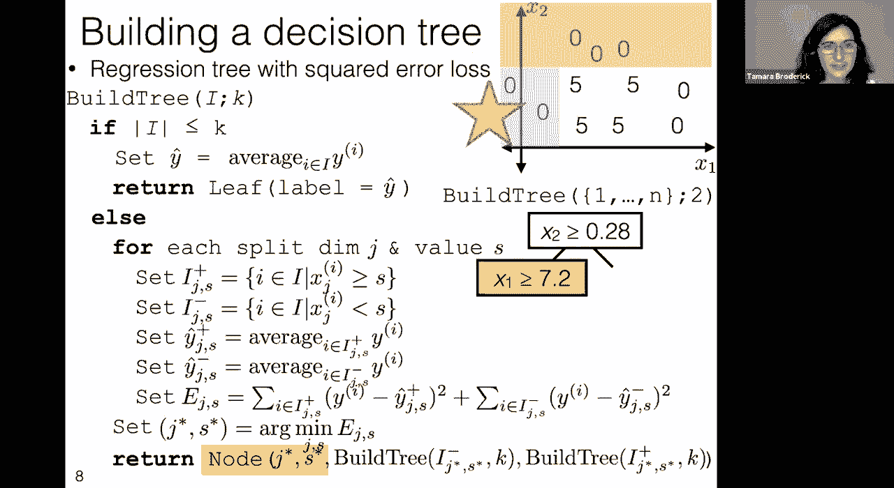

following so we have our left hand side，and our right hand side from that split。

and now what we have to do again is，start by building tree，okay what is that going to look like。

well again，we go up to build tree and we ask is the，number of indices。

less than or equal to two this is a，question for you in the chat。

is the number of indices less than or，awesome a lot of a lot of great things。

here um yes exclamation point，um uh it equals two and so technically。

you know that is two is less than or。

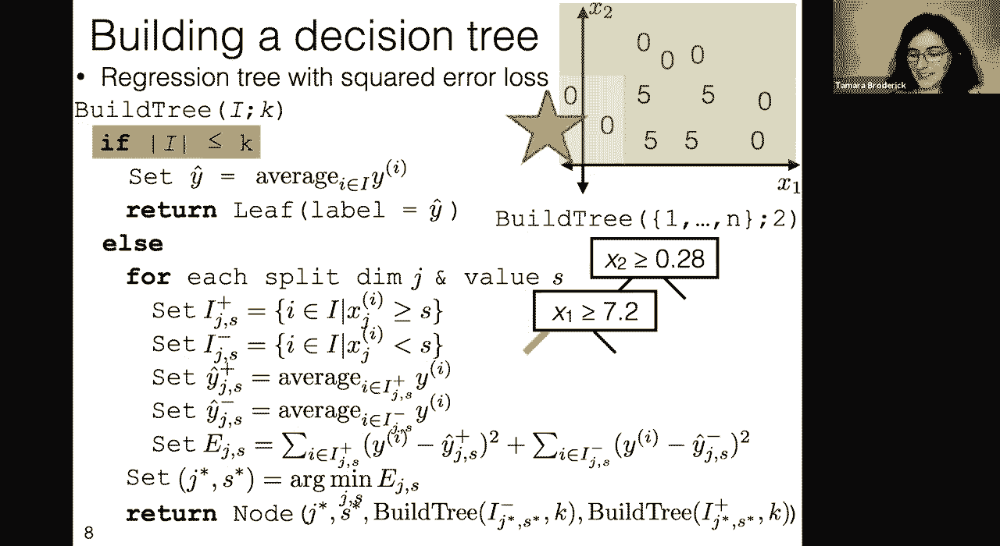

equal to two um and that's sort of like，the relevant，thing that we're interested in here um。

and so in fact we will make a leaf node，do that，what does our leaf node look like well。

we're going to take the average，of the data points at this point that's，going to be our prediction。

what is the，average of the data points in this，great yes as you've observed this should。

average because，both data points are zero the answer is，zero um in reality probably they would。

be you know，very slightly different from zero but uh，but this is one that's easier to do some。

math with and so，the answer is zero so we'll make that，the label，at this leaf okay。

so now we go to our right hand build，tree，and maybe we find that a particularly。

good split is between all these fives，and all these zeros，so on the right hand side we have the。

fives on the left-hand side we have，these zeros，um again this looks like sort of our you。

know we don't run when it's too hot we，run when it's a reasonable temperature。

kind of split okay so now we're going to，build，our left hand tree。

and something you'll notice is that even，though everything is five even though，we've perfectly。

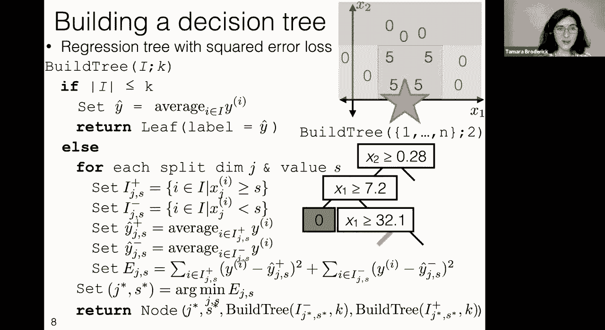

you know we have this great regressor，for everything that's not our decision。

about whether to make uh，a set of leaves the set of leaves is our，to whether to make a leaf。

our decision is is the number of things，in this，um partition element or is the number of。

indices less than or equal to two and it，is not。

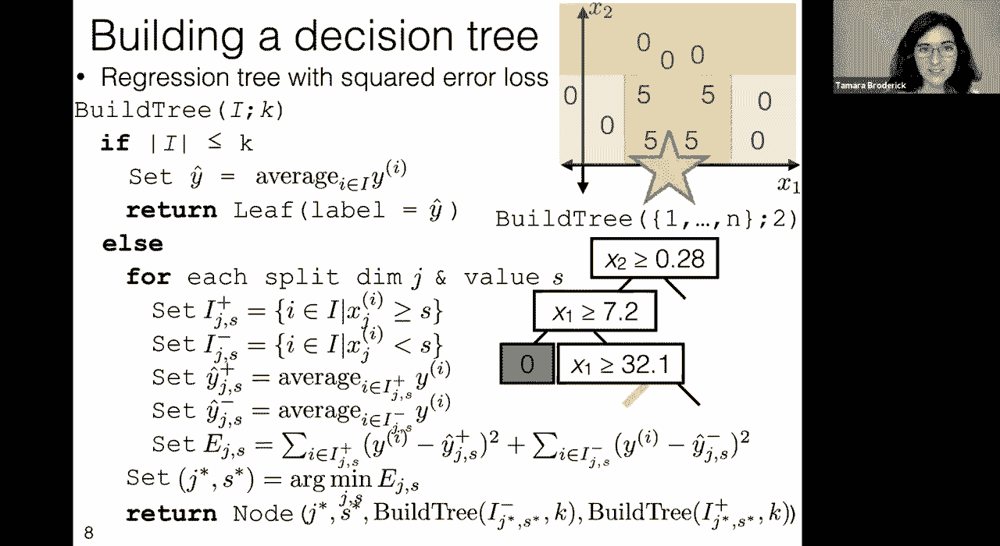

and so we're gonna we're gonna do，another split，okay so maybe we happen to split here。

into some fives on one side and fives on，the other side，in this case all the splits are。

equivalent there's nothing that's better，and so you have to have some kind of tie。

breaker and maybe this is just where the，tie breaker fell。

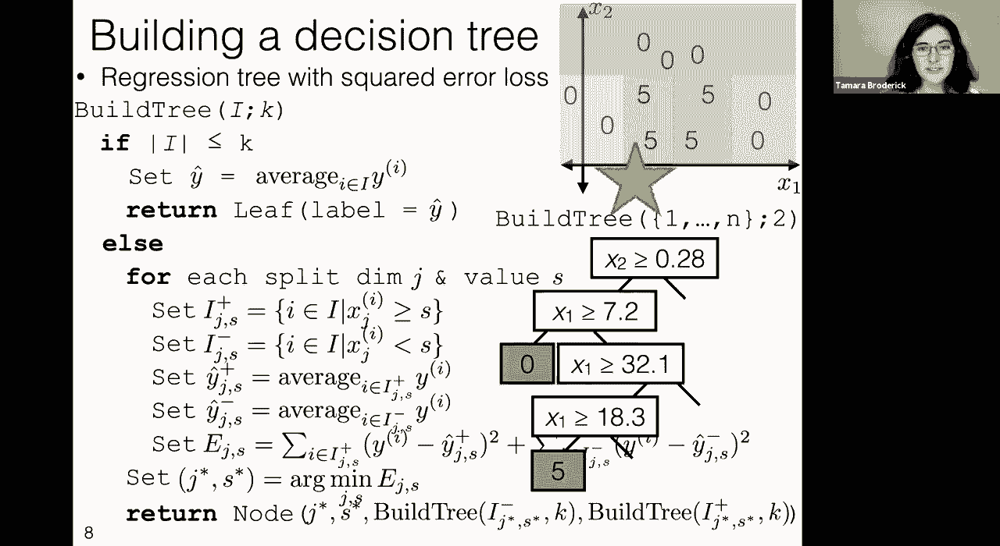

and so we'll predict five on this side，we'll predict five on this side。

because that's going to be the average，and then we'll go back up to making our，left hand。

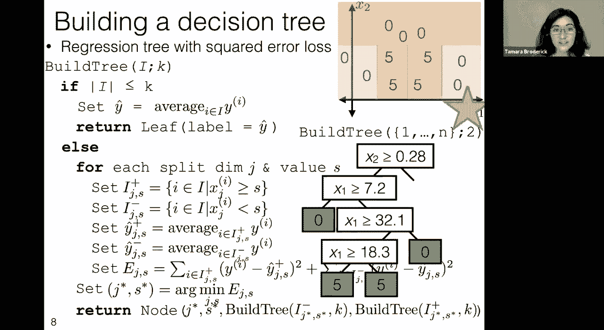

predict，zero over here and then we finally get，to our original，left hand leaf you can see that we're。

doing sort of a depth first kind of，thing here，um and in this case again we're going to。

have to divide because there were three，data points，and so maybe we'll have one side with。

one data point in one side with two，okay so we have created a tree we have。

built a decision tree by doing this we，kept going until we got down to a very。

small number of uh of data points in，okay so now let's let's take a look at，this decision tree。

you know again what it's doing is it's，creating，a predictor it's creating a function of，the um。

of the features and you can sort of see，that you can imagine that it's popping。

out of the slide at you and the y-axis。

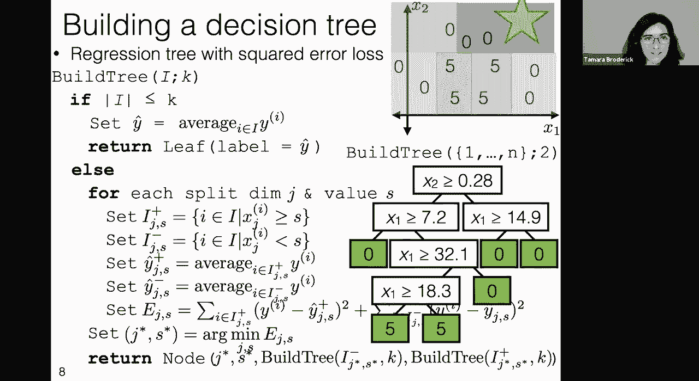

and it's zero over a lot of this area，and then it's five in certain areas and。

it's basically a step function it's a。

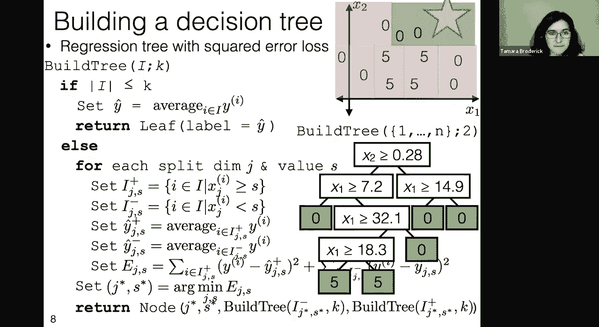

now an observation that we could make，here is well we didn't have to keep。

splitting i mean at some point we，actually had like，zero error um and so why would we keep。

splitting you know maybe we should keep，stop splitting at zero error maybe even。

better ideas for regularization purposes，um we could do something like stop。

splitting after our error gets quite low，you know maybe we should just check if。

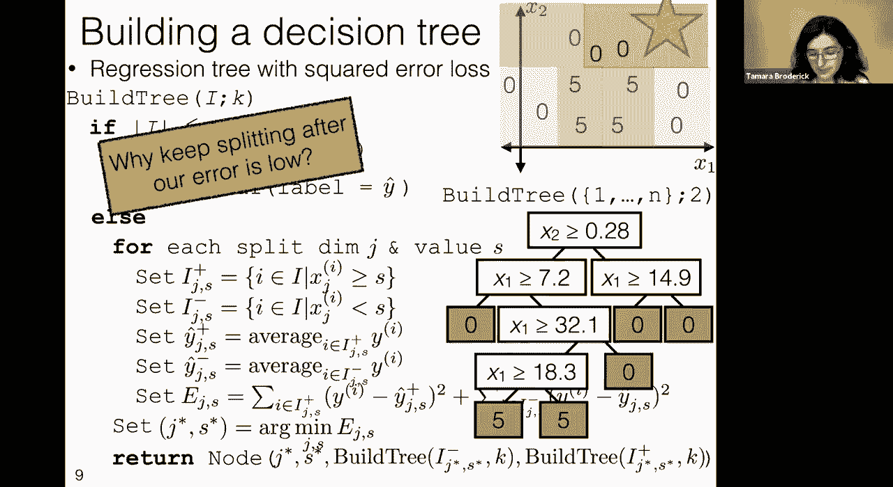

our error is is too high or not，a related question here is is。

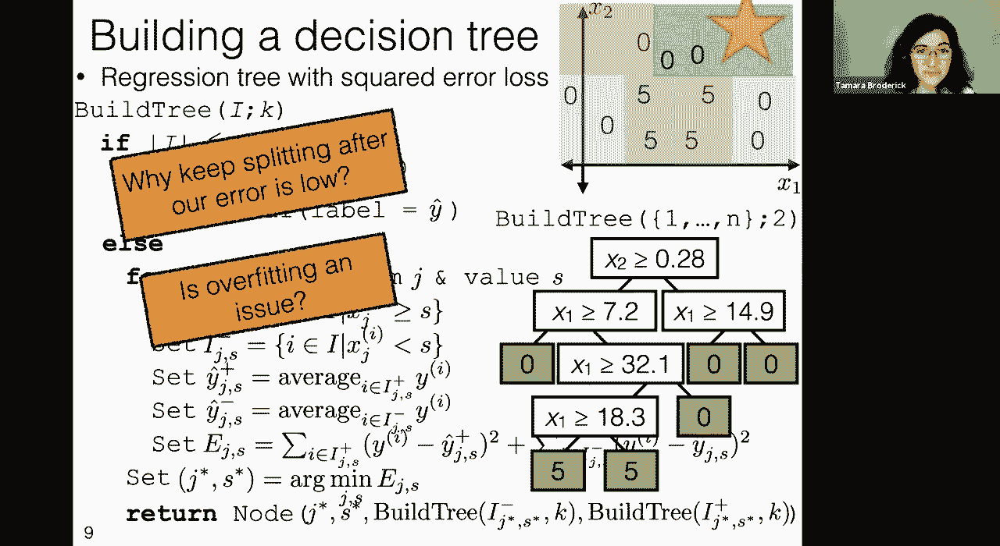

overfitting an issue，and if you think about it what we're，we have。

two data points and then we're fitting，them as perfectly as possible。

you can imagine if k is one then you get，down until you have one data point and。

then you just predict exactly that data，points value，because that's the average the average。

of one data point is one um and so it，certainly seems，like it would be easy to over fit in，this case。

um and so again how about we regularize。

by um stopping splitting after our error。

gets low what if what if we do that，well just an observation about what，could go wrong there。

so this we're going to pursue this idea，of stopping um，splitting when there's no or a small。

change in loss，just an observation of what could go，wrong is let's look at this example。

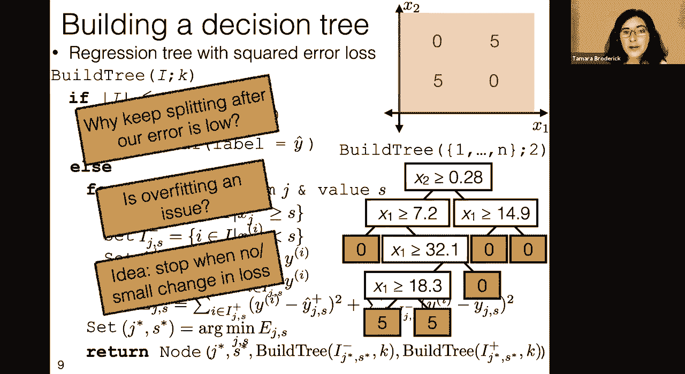

suppose，instead that i run when it's really warm。

and there's rain or i run when it's，really cold and there's no rain this。

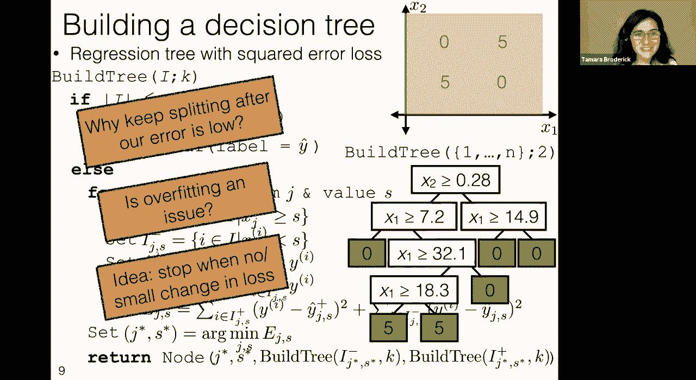

doesn't seem entirely implausible，um you know this could be a way that，somebody decides to run。

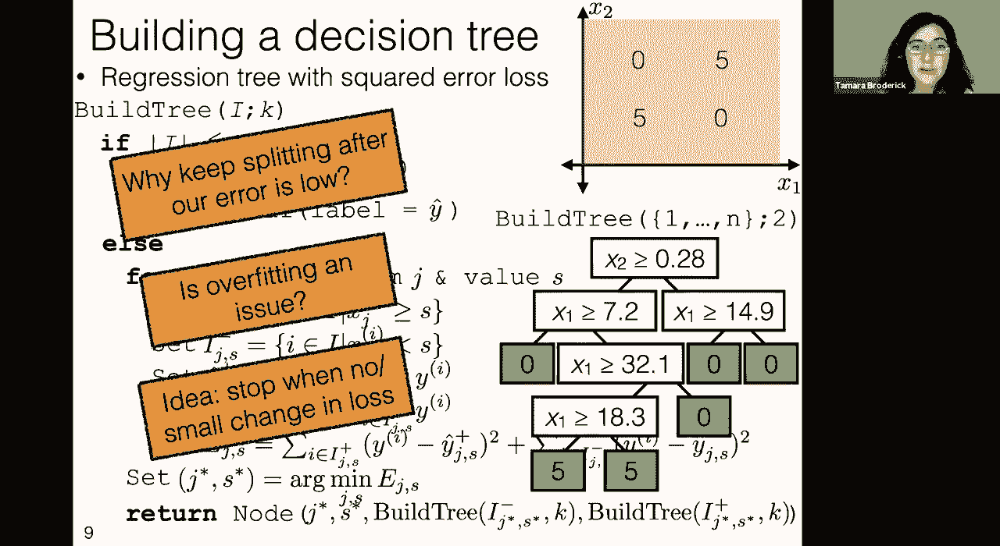

and suppose that i wanted to use a，decision tree a regression tree to learn，that。

well at least if my data were perfectly，arranged like this and actually we did。

see some data back in the features，um lecture back in lecture three that。

actually could be arranged like this，just due to the way that we encode。

features um you're going to see that，let's try a first split with this，suppose we're building a tree。

we go to our first split we say hey，i you know we have our set of indices，there are four indices。

and we're going to try every possible，split and there is literally no split，that improves the error。

in this case everything is just as good，as if you had，you know just this whole region and you，were。

you were looking at that and so if we，stopped when there was no。

change in loss or a small change in loss，we'd stop right here，and yet if we made a split pretty much。

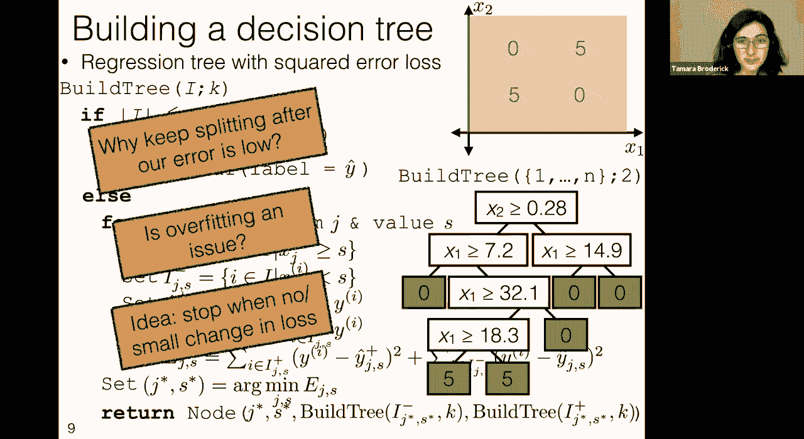

any split you know that was between data，split，we'd get a perfect predictor and it。

would be fantastic and it would do，really well，now if these things are sort of moved。

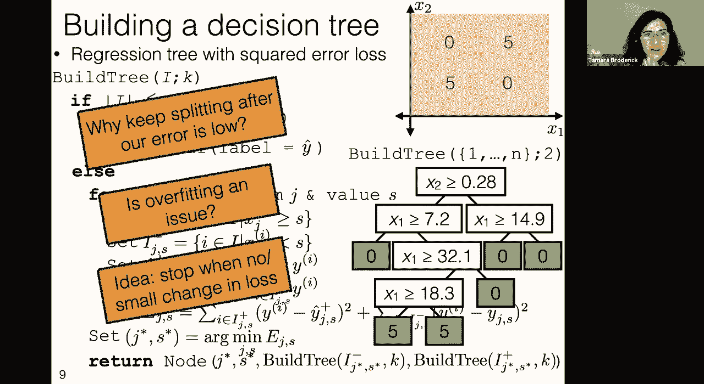

around a little bit it，the idea changes slightly but the idea，is still there that somehow。

there's this issue of if you stop，splitting when your error is very low it，can be very short-sighted。

kind of the issue is that we're doing，these axis align splits and so it might。

take a few to actually get to a good，point，rather than just a single one like a，single one might not。

so from that perspective you know we，tree，but maybe we don't want to be greedy in。

stopping building the tree which is what，would happen if we stopped when there。

was sort of no change in loss or small，change in laws，um and instead an idea um that was that。

was pretty influential when it was，introduced，um and continues to be used to this day。

is to build the tree to grow the tree，with this algorithm，but then print it back and so。

i'm just going to briefly go over what，that might look like，again i wouldn't get too obsessed with。

any particular way of，building or learning a tree but i think，there are some general ideas here that。

are important to keep in mind，um about you know what can you get from。

a tree what kinds of structures can you。

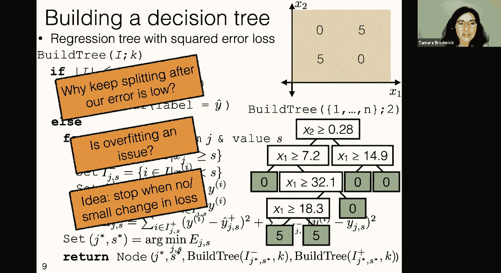

look at and how you have to be sort of，okay so let's talk about how to，regularize now。

um you can think about this you know as，being encased in some kind of objective。

certainly this is something that we've，talked about，in other cases uh you know sort of。

throughout our course，that we have some objective that we're，interested in optimizing。

and typically it looks like the，following it looks like a loss over the，training data。

plus some kind of constant times a，regularizer and usually，the regularizer is like a penalty it。

penalizes having um，some more complicated model it it makes，you pay for that more complicated model。

it makes you say that you know，the loss was really worth it and so。

we've seen this before for logistic，regression for linear regression。

a lot of times our regularizer has been，this squared error loss，or just。

sort of square sorry i should say just，sort of um a squared size thing like if，we have a theta。

you know we're taking this um this，squared penalty on the theta，and here we're going to look at。

something a little bit different so here，we want to think what what are our。

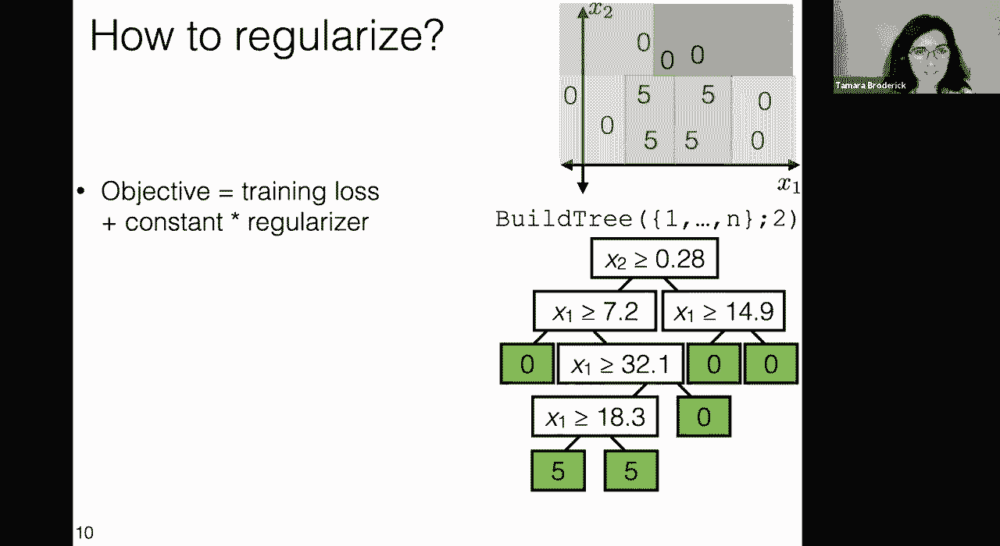

choices，for our tree well training loss，that's that's pretty straightforward we。

already said that we cared about squared，error loss，for training loss and so we can just。

rate squared error loss um for the，training loss，so that that'll be straightforward um。

the constant's easy to put in，um but what do we want to penalize um。

and i think you know at least based on，our discussions that we've had so far。

just now a natural thing to penalize is，bigger trees bigger more complex。

trees and so we might say our penalty is，going to be on trees that have more，leaves。

you know if you have more leaves you，have to pay for that somehow with。

training loss you have to have a better，training loss，okay so here's a way to express that。

let's just walk through the elements of。

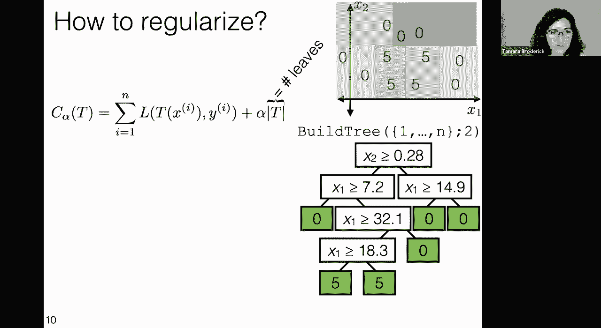

this formula，so first we're just going to say what is，the name。

of our objective in this case we'll call，it c it'll be a function of t。

so t is the tree that we learn it's the，predictor that we learn。

and alpha will be the the constant that，trades off，the penalty and the training laws uh。

okay so first we have the training loss，so there's nothing new here we're just。

summing over all the data points that we，have，we're looking at the loss between our，guess。

which is the predictor t applied to，the features for this data point the i，features。

and our actual which is the actual label。

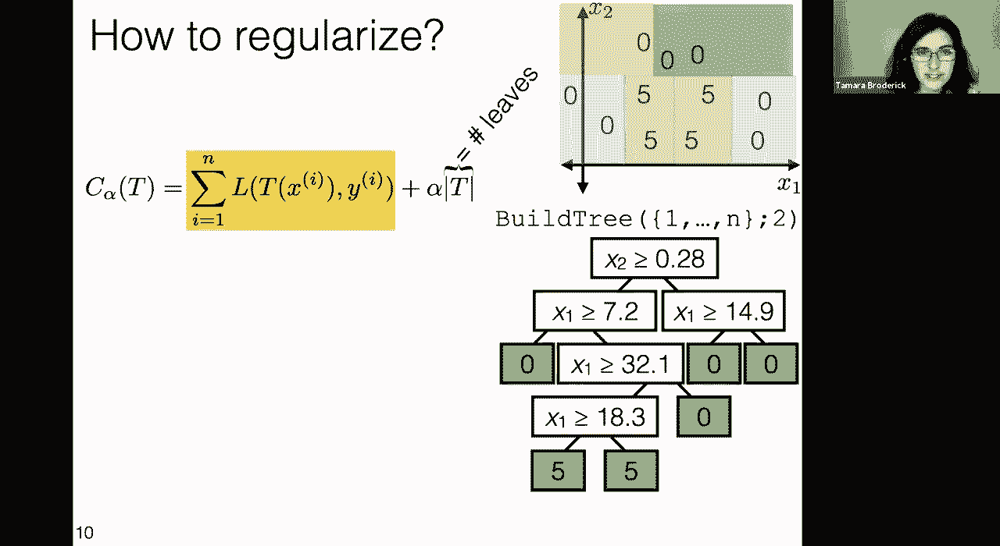

for these data points the yi，and we have our alpha that trades off，our penalty and our training loss。

and here we're saying the thing that，we're penalizing is the number of leaves。

so we're preferring we're trying to，express our preference，for trees that have fewer a fewer number。

of leaves，okay so what would happen if we looked，at our tree over here。

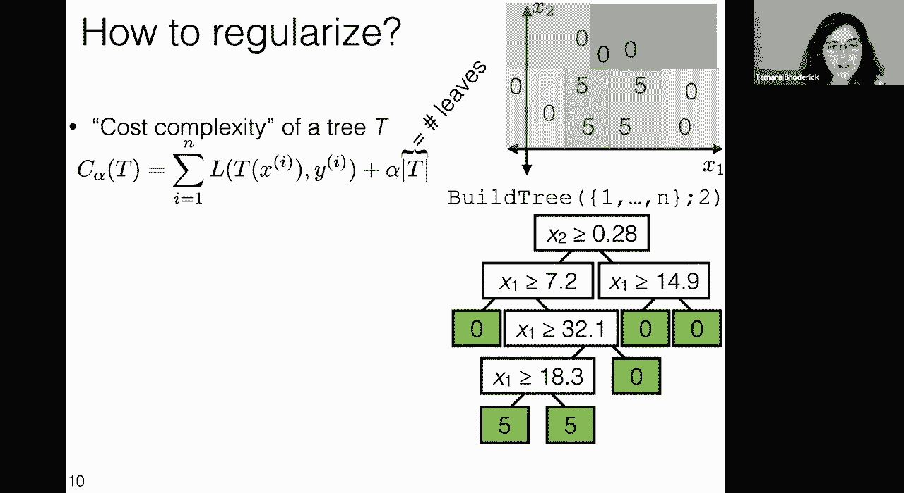

and we did this trade off let's start oh，and let's let's call this the cost。

complexity of a tree t so this is often。

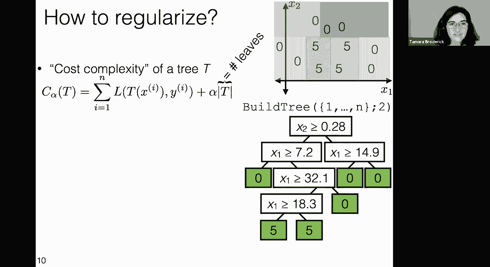

what it's called it's it's again very，similar to the objectives we've seen，before。

okay so let's look at our tree over here，in particular you know if we had our。

whole tree it describes，this whole space with a bunch of，partitions in it but let's look。

specifically at，this little sub tree down here at the，bottom。

so the sub tree that's defined by the x1，greater than equal to 18。3 split and its。

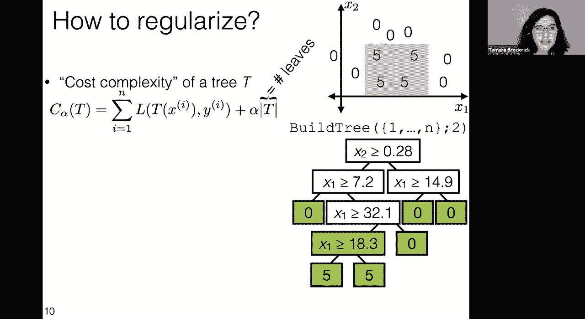

two children the fives，this seems like a useless subtree it's，not doing anything。

you know if we didn't have this subtree，if we just had a single leaf that。

predicted five it would do exactly as，well，and so if you look at this cost，complexity。

and you look at alpha equals zero then，there's no way to decide between this，full tree。

and the tree where this subtree is，replaced by a single leaf。

but as soon as you increase alpha just a，tiny bit it could literally be any。

slightly positive value of alpha，anything whatsoever that is slightly，positive。

suddenly it's not worth it to have this，tree because，you are taking a hit of an extra leaf。

and you could reduce that by getting rid，of this sub tree，and so as soon as you have this very。

slightly positive alpha it is better to，replace this subtree，with just a single node with just a。

single leaf because that'll be one fewer，leaves，and so you'll reduce the cost complexity。

at no hit to the training loss，and you'll notice that this is the same，over here so here we have。

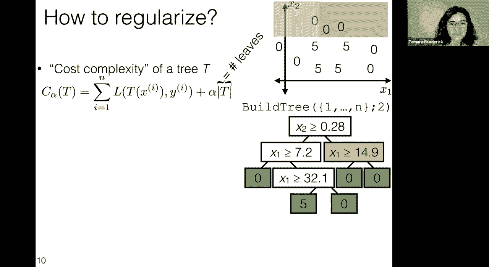

a case where there's a subtree this，internal node and it's two，it's two children where there's no。

change in the loss，the training loss if we reduce this to，just a single node。

and so if all we cared about was，training loss then these would be，completely equivalent trees。

but as soon as we have this penalty and，as soon as we have a tiny little bit of，alpha。

then it's better to just get rid of that。

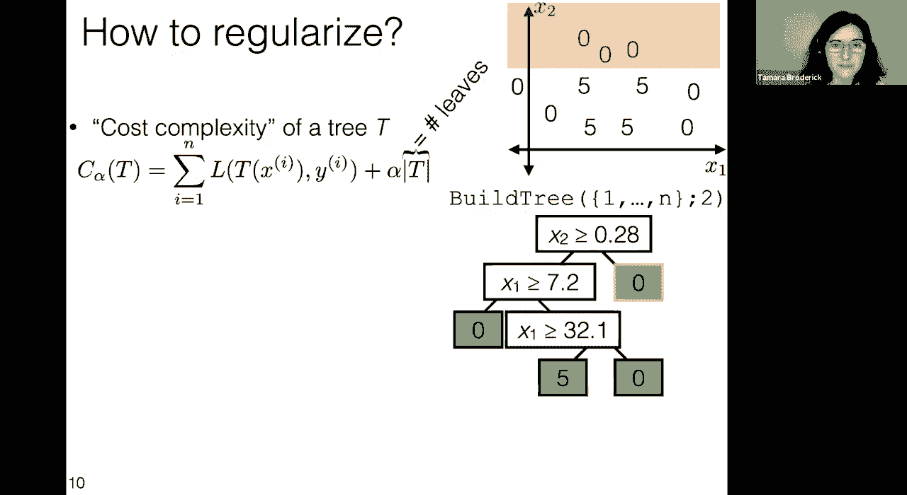

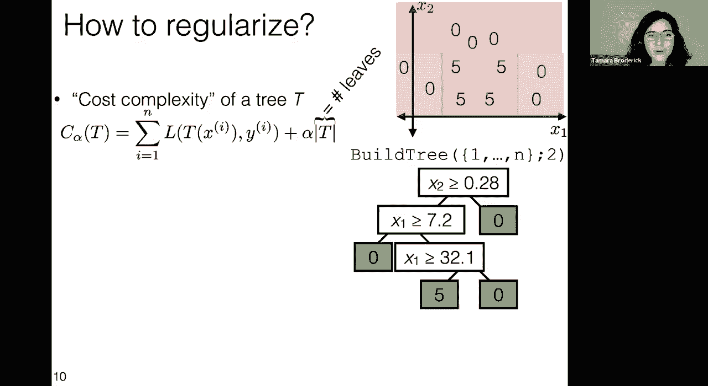

okay so the idea of pruning is basically，to just keep doing this。

so with pruning what we do is that we，sort of you can imagine sort of slowly，increasing alpha。

so here we increase it a little bit，beyond zero we can slowly increase it。

and as you increase it eventually，certain sub trees are not worth it。

and you can get rid of those subtrees，one at a time as they become not worth。

it and you'll end up having a finite，sequence of trees until you get to the。

root eventually nothing will be worth it，and it would be better to just have。

a single constant thing that you predict，and once you have this sequence of trees。

you can run cross-validation on it to，okay but the idea here i think the，really key idea to get。

being，having the ability to have a little bit，of a longer，less greedy procedure um to create these。

trees can perform a lot better，than if you just stop making the tree。

when it seems like you're not getting。

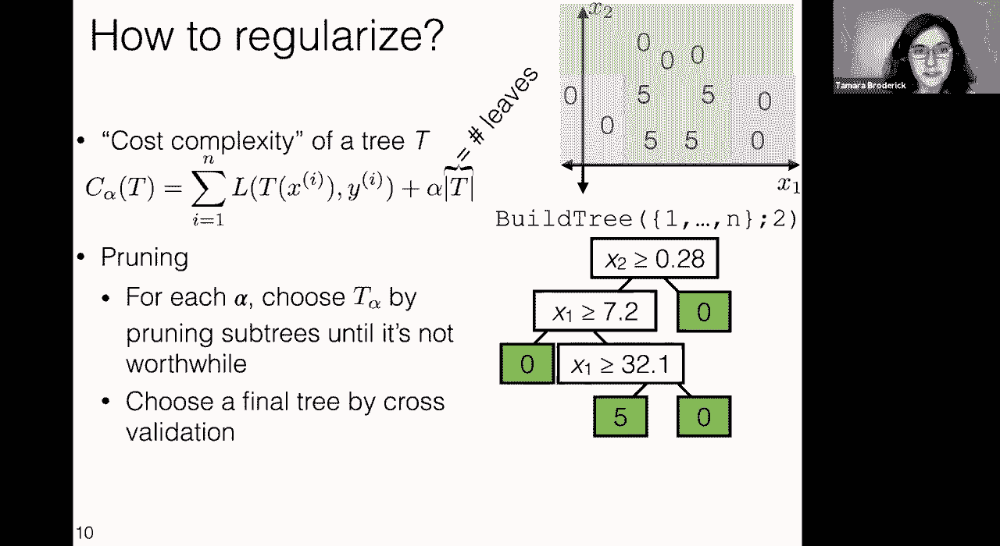

okay so at this point we know a way，to create a decision tree again i want。

to emphasize that's not the only way in，fact i think there's some really，interesting work going on。

in terms of trying to have the，interpretability of decision trees with。

the flexibility of other methods so you，could try to have your very。

powerful you know method that performs，really great um，in terms of predictive performance um。

and then what you can do，is you can like try to have a tree that。

represents the information in that even，if it takes a little bit of a hit in，terms of。

um in terms of understanding and so，there are lots of things that we can do。

here trees are really interesting，nonetheless，oh before i move on i'll just get this。

question from discourse，how do we choose the value k or should，we just make it pretty small to get a。

large tree and then prune，um basically these are both great ideas，might do。

is that they might get their very large，tree and then prune and then the pruning。

you know aspect you don't have to care，too much about kay you might still care，about k。

just from a computational perspective so，if you think about your k as being。

one um you're gonna have to make a ton，of splits in a very large data set to。

put everything into its own，you know little bucket and so it might。

be just easier and faster to use a，larger case so that's a consideration as，well。

um so so basically there are multiple，considerations even beyond our usual。

ones like like prediction error but also，just sort of speed and。

ease of use but absolutely yeah you can，just make a relatively small k and then。

prune back to do the regularization，okay another thing that you can do。

to you can think about this as，regularization，you can think about this as just doing。

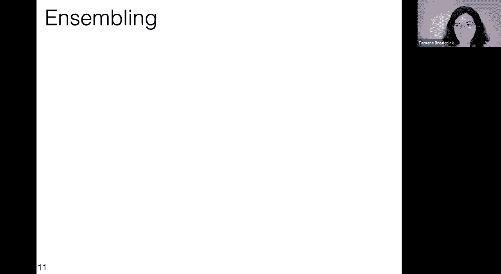

better，is you can ensemble um so just as we，just talked about maybe we could choose，a really small k。

and then we could make this you know，really big tree and then prune back you。

could also truly choose a really small k，and then ensemble and that'll do some。

regularization for you it also just will，turn out，that this is a good idea period to，increase。

the performance of your method，okay so we in particular again just when。

we started off we said we're going to，talk about decision trees，in terms of interpretation now we're。

going to talk about ensembling in terms，of predictive performance。

um the general idea here is that using，multiple machine learning predictors。

even if they don't seem individually，really great，will make typically a much better，predictor。

so you see this everywhere um so if you，look at like the netflix prize back in。

the day not only did all the top teams，use ensembles but literally one of the，team names was。

the ensemble um so good advertising for，ensembles there，um if you look at basically any other。

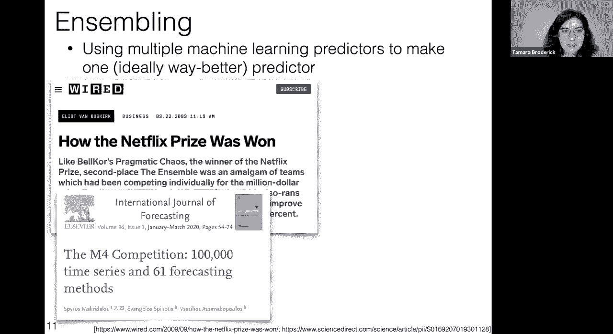

competition this tends to be the case so，the macrodocus um competition is a。

competition that happens regularly on，time series data，they looked at 100 000 time series in。

their competition。

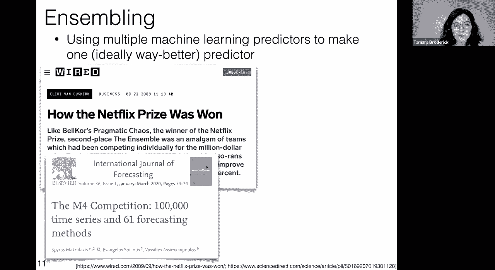

and no individual method ever did that，well but when you have these big，ensembles of lots of methods。

some of which included neural nets but，that wasn't the only method，course。

it's not all just about competitions i，mean in some sense the point of。

competitions is to prepare us to do，world，and if you look at the forecast that。

people are using for both cases and，deaths in cobit 19 right now。

um the cdc for instance is reporting an，ensemble forecast，and so there's just this generally you。

know sense that，ensembles are giving us really the best，predictive performance when we care。

about predictive performance。

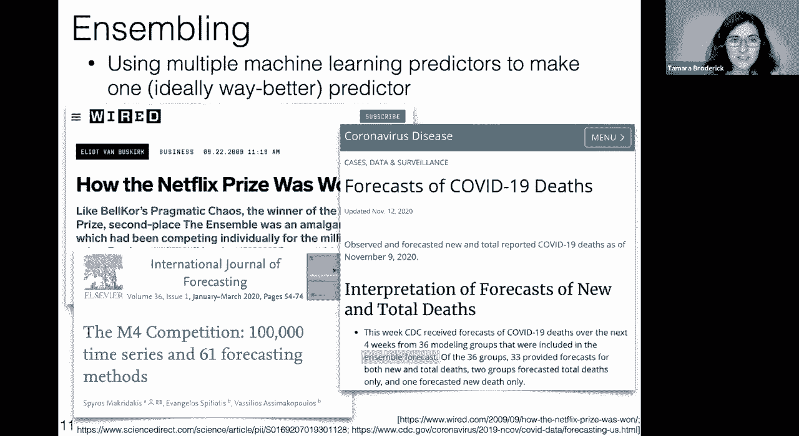

okay so there are a lot of ways to do，ensembling，in fact，uh you know i mentioned in the beginning。

these kaggle competitions and the things，that people are doing there it turns out。

that's actually a different type of，ensembling boosting and i encourage you。

to check that out if you're interested，in that direction，we're going to talk about bagging um and。

from this we're going to get a sense of，what an ensemble does，okay so this is just one of multiple。

ways to make and use an ensemble，bagging stands for bootstrap aggregating。

which doesn't really make much sense，right now but hopefully we'll make a bit。

more sense at the end of this slide，because then i'll say what that means。

okay so what we're going to do is we're，going to take our training data。

and we don't have to be doing trees，right now we could be doing you know，just about anything。

and we're going to create a bunch of，fake data sets from our original。

data set in particular in particular，capital b fake data sets and the way。

that we're going to make these fake data，sets，is for every little b we're going to。

draw a new data set，by sampling with replacement from our，original data set so what does this look。

like，so in our original data set you think of，our original data set as a bunch of。

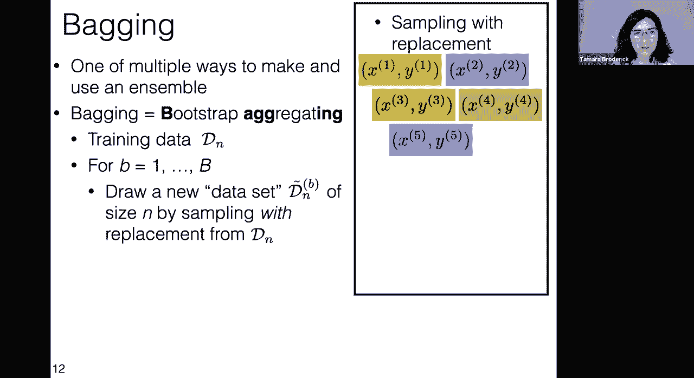

color billiard balls in a bowl，so there's a yellow ball there's a green。

ball there's an orange ball there's a，blue ball and there's a purple ball。

and then what we're going to do is we're，going to stick our hand into the ball。

pull out a billiard ball，and that'll be the first data point in，our new data set。

so we choose each one of these five data，points in this case with equal，probability。

now the width replacement part is where。

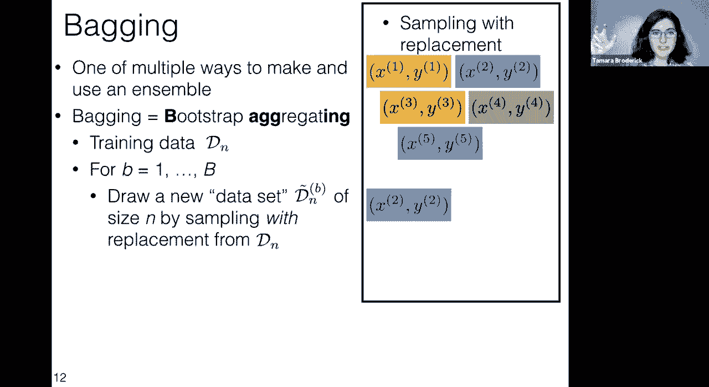

we take the ball that we're holding and，we put it back in，and then we shuffle it up again we。

choose from every，possible point again with equal，probability，if we were doing without replacement。

out，we would put it over here outside of the，ball and then we would draw a new ball，time。

in this case there's the same number of，billiard balls and so we can keep doing，this。

we can draw our third data point in our，new data set our fourth data point of，course we're gonna get。

some probably uh you know it's very，likely that we're gonna get some repeats。

because we're just putting it back in，and we're drawing from the same。

distribution in this case it turns out，we got three repeats。

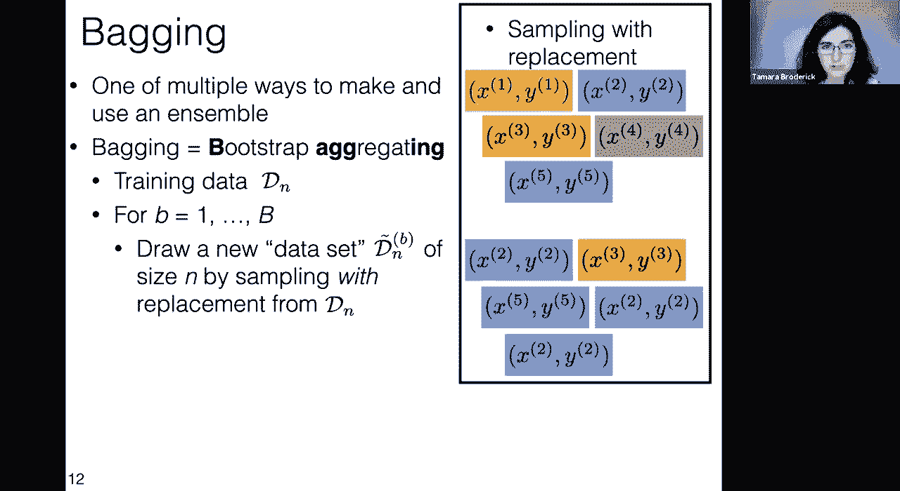

and so we'll say that this is our new，data set and it has its own indexing。

it just so happens that a lot of its，one，and so here what i'm going to do is i'm。

going to change this to be our new data，set，and indicated by x tilde 1 y tilde 1 so。

we have the first data point our new，data set the second data point our new，data set。

the third data point our new data set，and so far but you'll notice the first。

fourth and fifth data points are the，same，and two and three are different okay and。

so what we're gonna do，is we're gonna make this new data set b，and the trade-off with b is that the。

more b you get sort of better in some，sense but eventually it's just，computationally difficult。

and you stop getting as many uh uh，benefits so so，that's the trade-off for capital b we're。

going to make all these different data，sets and for every one of these data。

sets we're going to train a new，predictor，and because the data sets are random。

because they're different every time，we imagine that our predictor is going，to be slightly different。

and what do i mean by predictor this is，like you know we're going to make some，some regressor。

maybe in regression we'll have a，different you know set of predictions，for new。

um this is a function of the features，you know what is the prediction we make。

it a new feature so that's what that，okay and then finally what we do is we，combine。

the wisdom of all of these different，predictors we imagine each of these，different predictors。

is pretty good at something and we're，going to return，some combination of all of their。

information so for regression a typical，thing that we might do is we might，average。

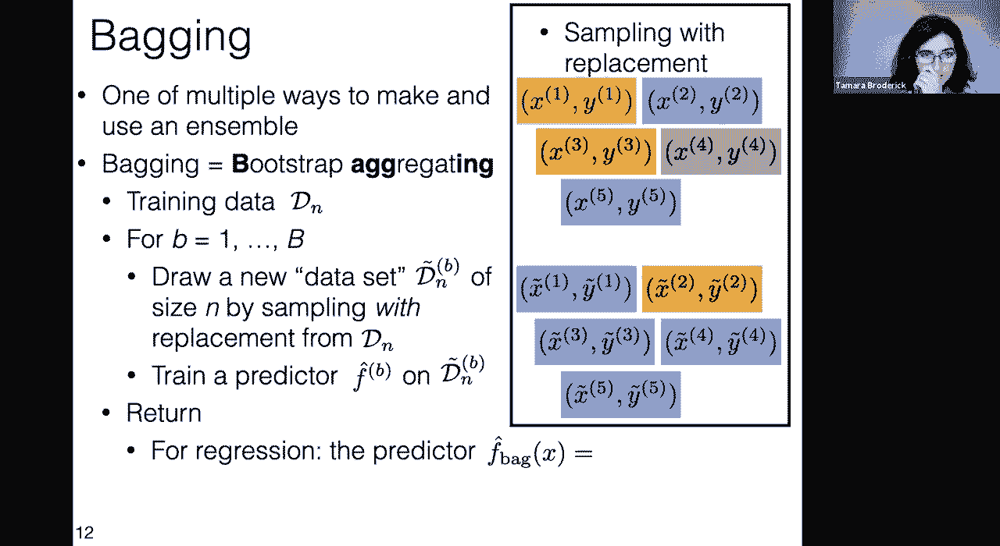

over all of them so we're going to，return a final predictor，says this f-hat bag is like what we。

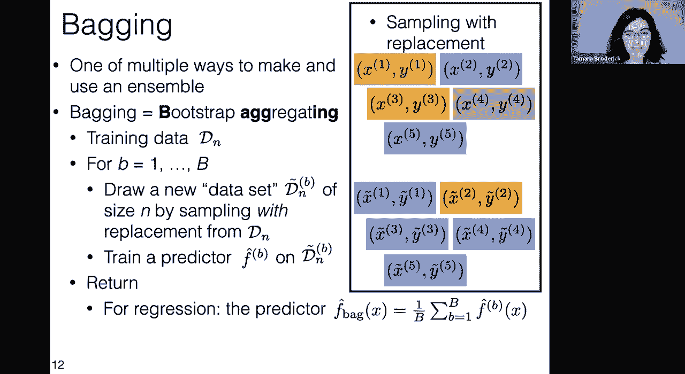

actually return at the end of the day，and it's the average of all those。

individual predictors on the little，for classification you can do something。

similar you can take the predictor um at，a point as being the class with the。

highest vote count with some way to。

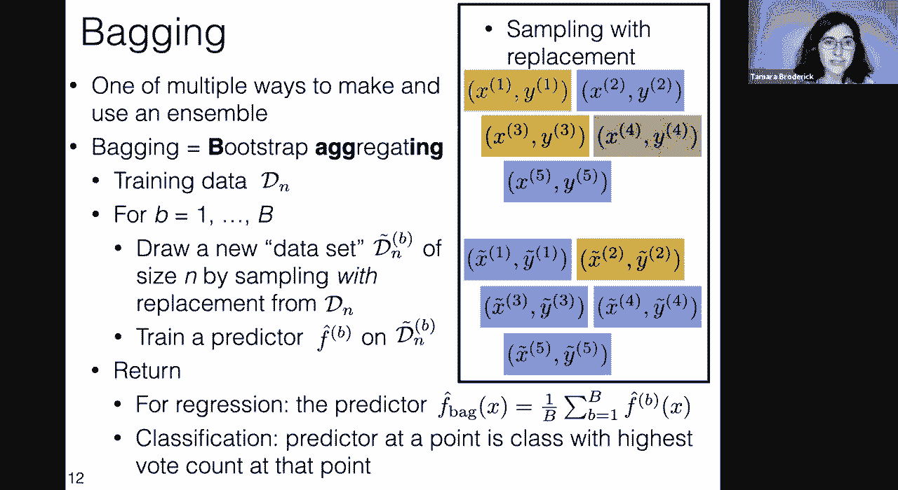

deal with ties um but basically you know，at every point，for every one of your b classifiers。

capital b classifiers you're going to，have some，classification it's going to say what。

class it thinks it is and so you can do，a voting across them and say you know。

okay this is a super simple idea all we，did was we randomized our data slightly。

and then we got this way better，predictor almost for free i mean you。

have to run some extra things but you，just have，you know a bunch of these predictors and。

you already had some way to make，predictors and so now you're just。

running at a bunch of these fake data，sets，and so this is bootstrap aggregating and。

it is surprisingly effective，um you can have some pretty bad，predictors as long as they're just。

slightly good you know they're better，than chance this can be。

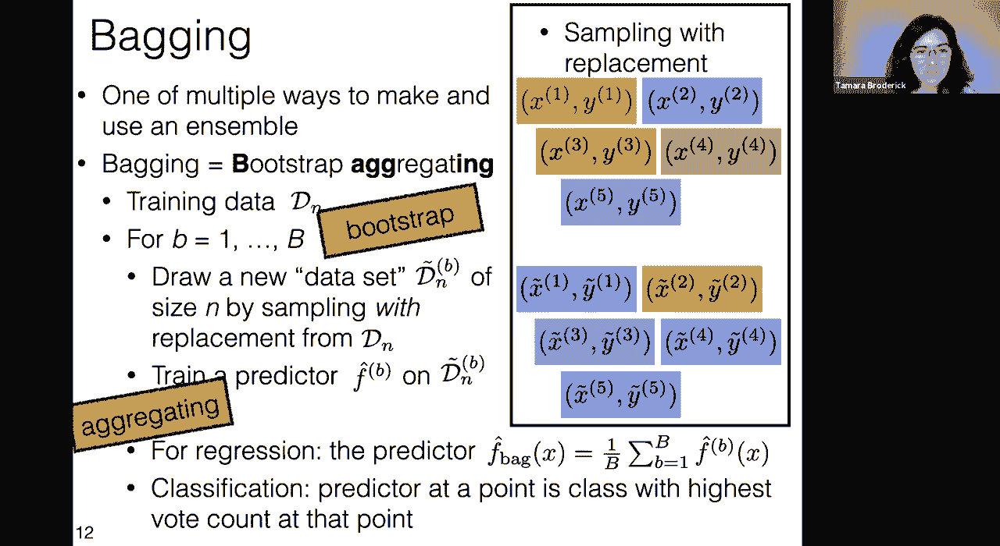

really really effective okay so why is，it called bootstrap aggregating。

the bootstrap part is making all these，little fake data sets，by sampling with replacement capital b。

times，this is an idea that is not at all。

specific to trees it's not even specific，to bagging，it's actually an extremely general and。

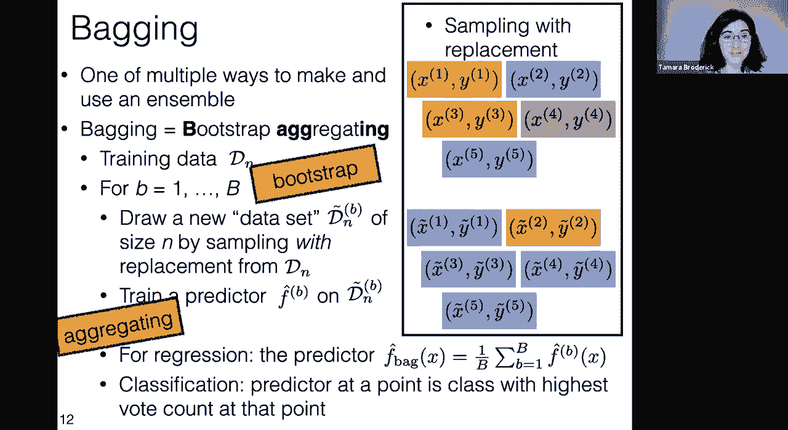

surprisingly powerful idea for how，simple it is，i mean maybe i shouldn't say。

surprisingly some of the simplest ideas，are some of the most powerful。

um but that's the bootstrap part and，then the aggregating part is when we。

aggregate it all together at the end，and we take all of these different。

predictors and we make them into one，super predictor，it's like you know if you took the power。

rangers together and you made them into，megazord this is，there's。

nothing that is specific about trees，here，you could do this with any favorite。

predictor in fact there's reason to，think that neural nets，actually individually are kind of um。

unstable like you can get really，different results if you just change。

things slightly about your setup or，change things slightly about the data。

and so you could put them all together，if you wanted to in this you could do a。

lot of things with bagging，but of course one of the things you can。

do with bagging um or wouldn't fit quite，so well into this lecture。

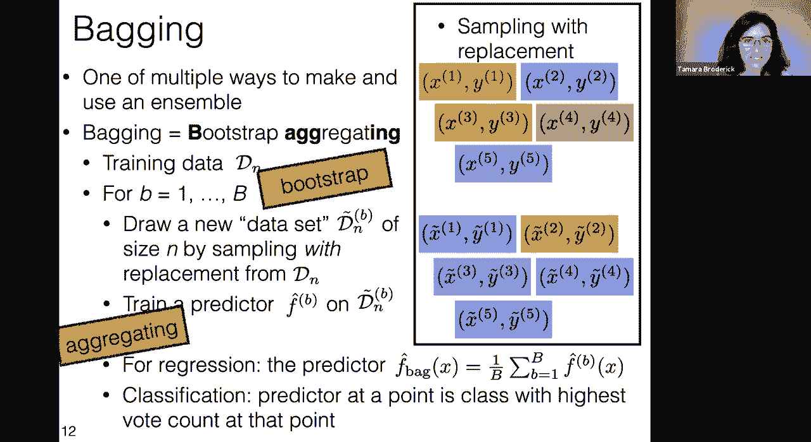

is bag trees bag decision trees and so，that is so popular that it's given a，special name。

a name that you are likely to encounter，in life which is random for us at least。

if your life is full of machine learning，you're likely to encounter this。

okay so random forest is basically，bagging with decision trees with a，little bit of extra randomness。

it's not exactly bagging decision trees，and i'll point out where the。

okay so let's just briefly talk through，so random forest you do the same thing。

we're it's just bagging，and so what we're going to do is we're。

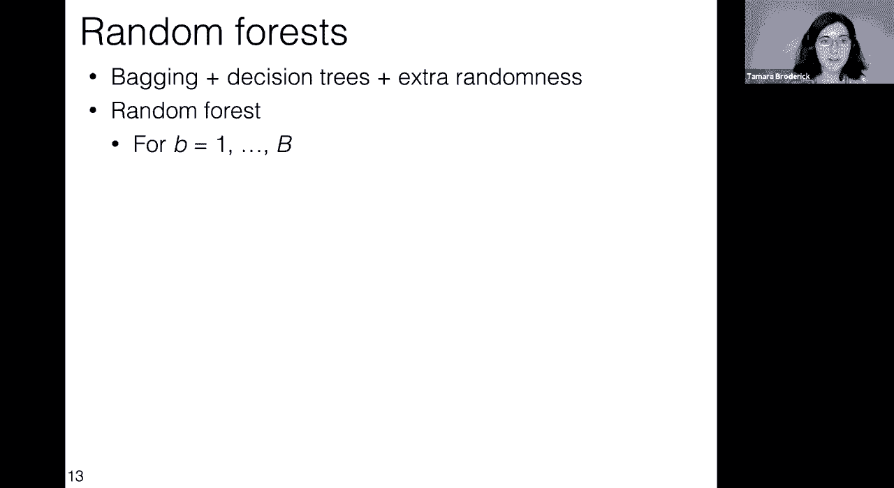

going to go through all these be，different bags，basically in each one of them we draw a，new data set。

with with replacement from our original，data，so that's just like bagging nothing has。

changed from bagging，okay here's the part where we make this，about trees instead of a general。

regressor so when we're doing general，we're just，speaking specifically about trees we're。

going to build a tree，on the random data set by recursively，repeating a number of steps until the。

node size k is reached，okay so first now here's the part that's。

different from both bagging and decision，trees，we're going to select m features，uniformly at random。

without replacement from the d features，so we didn't do this when we were doing。

random forest before if this were，just or if when we were doing decision。

trees before if this were just bag，part，this is like extra randomness and turns。

out to be useful to decrease correlation，between the different trees you're，learning from。

okay but you're going to select these m。

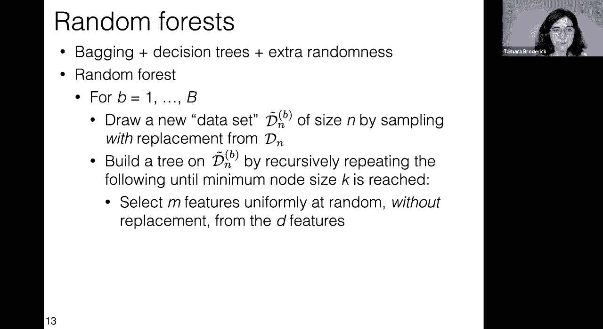

random features the subset of your d，features，and now you're going to do the usual。

decision tree thing so instead of going，over all the features like we did when。

we were making decision trees before you，just go over the subset，but you still pick the best split。

dimension and the best split value，among the m features instead of the。

and then you build two children so，everything here is basically。

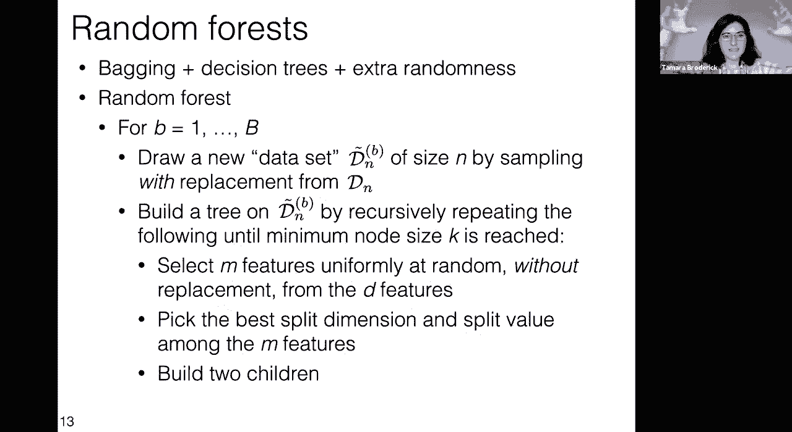

bagging and then we do trees and there's，just this little extra randomness here。

okay and finally just as in bagging we，return the average for regression。

or uh you know some kind of you know top，so why is it called random forest well，it's clearly random。

because we have multiple sources of，randomness so there's the randomness in。

making the different data sets，there's also the randomness in choosing，the feature subsets。

it's a forest because you make capital b，different trees and so you have a whole。

bunch of trees capital b of them，each tree defines a predictor and then。

you average over all of those predictors，to get your final predictor your final。

regressor that you're going to return，and so the forest is just because it's。

okay and so to recap the bagging part，data，sets and then we averaged them over for。

regression or voted for classification，at the end，the trees part was that we chose trees。

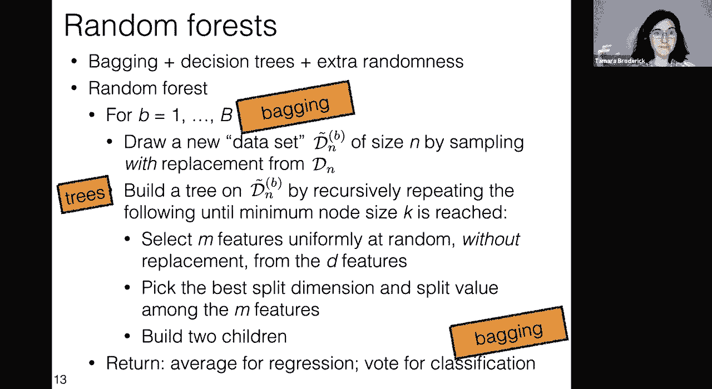

as our predictor，so we could have chosen something else，with bagging it's not specific to trees。

but here we chose to use trees，and then the extra randomness was that，we didn't just。

use any features as we would normally，for trees where we consider all the，these。

m uniformly at random features，okay so at this point，we we have accomplished some of our。

goals our goals were to try out to see，you know could we come up with methods。

that were useful for interpretability，um that weren't purely focused on。

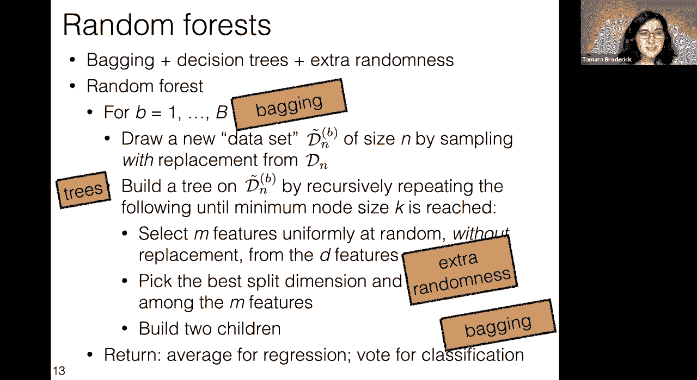

predictive performance and decision，trees i think are certainly that you，know if we go back to。

um our tree that we saw at the beginning，again，you know the hardest part i think in。

some sense about this tree is，understanding the medical terminology。

it's not understanding you know how to，use this machine learning predictor this，is。

something that i think you could tell，family members who don't have machine。

learning background about this is，something you can tell juries about this。

is something you can tell medical，experts about，this is something that you can talk to。

people about whereas i think it's a lot，harder to explain what's the output of。

neural nets for instance，conversely with decision trees we're not。

going to have as much predictive power i，mean they're just not as flexible。

as some of the models that we've seen，elsewhere with random forest we can get，that predictive power。

even though it's built from these tiny，decision tree blocks，you actually get a huge amount of。

flexibility by having this ability to，average over a lot of decision trees。

but you lose basically the，interpretability of decision trees。

because you're not just making this you，know simple series of decisions anymore。

you're making tons of them and what does，it mean to average over tons of these，decisions。

it's not as clear and so you get a real，trade-off and it depends on what you're，trying to do。

okay great then i hope you all have a，great break i think we're。

we won't see each other for a couple of，weeks um but i hope you enjoy the the，thanksgiving break。

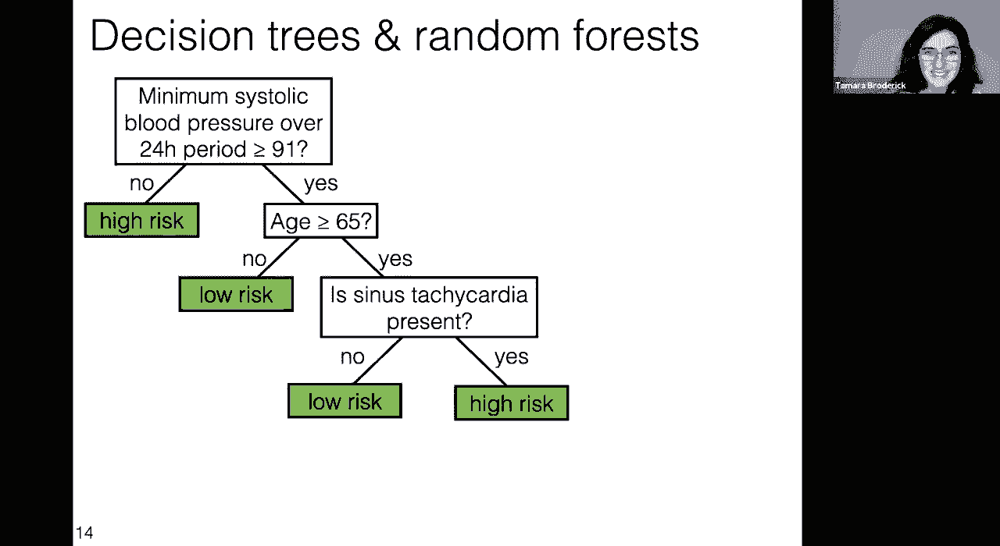