# P13：L13- 聚类算法 - ShowMeAI - BV1y44y187wN

okay it's about that time let's go ahead，and get started，um so so far in this class we've spent a。

lot of time talking about supervised，learning um，we've seen a couple of examples of this。

things like classification regression，i've seen them a lot of times and so。

today we're actually gonna，you know explore this other part of，machine learning that we've mentioned。

before but not really，dug deeply into unsupervised learning，and we're gonna focus in particular on。

probably the most popular form of，unsupervised learning clustering。

um and we're probably going to focus on，the most popular form of clustering，which is。

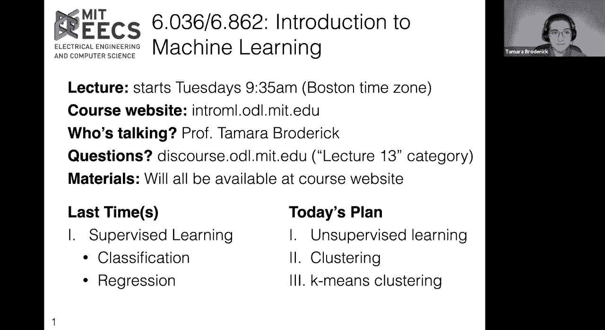

k-means clustering okay so let's let's，dive in，as usual we'll start with a motivating。

example um so it happens，that today is giving tuesday i think，that's an international phenomenon now。

but i'm going to talk about，just a couple of charities um in america。

um feeding america and meals on wheels，america i think，are both charities that distribute food。

to people who have in food insecurity，moment。

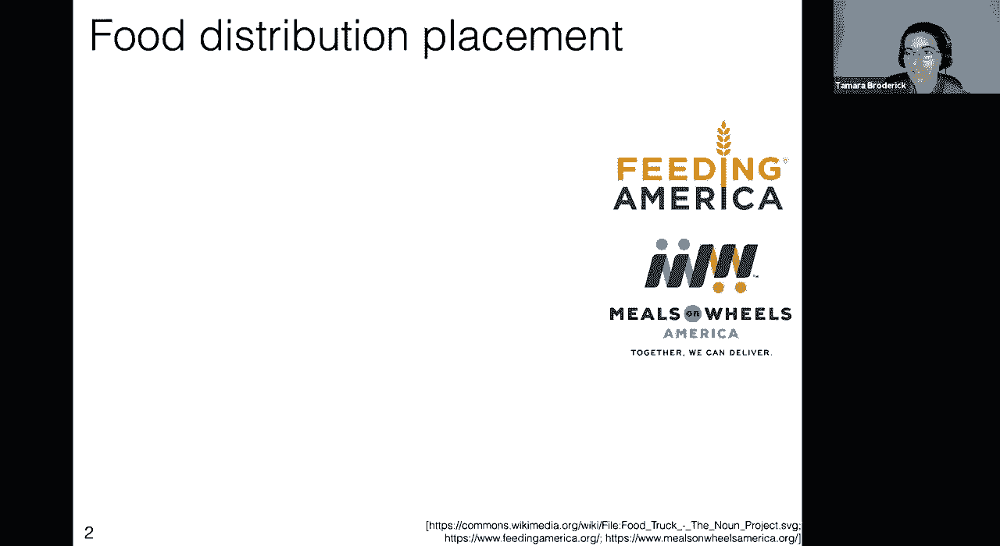

that a new charity has approached us um，this new charity is called yes free，lunch。

um and they are interested in also，distributing food to people with food，insecurity。

and in particular their model is that，they have these food trucks that they're。

going to place in various places，around america and they want to place。

them in such a way that people can walk，to the truck pick up some food。

and head back home um and so they've，approached us，machine learning experts uh to help them。

place their trucks，in some optimal way um for this food。

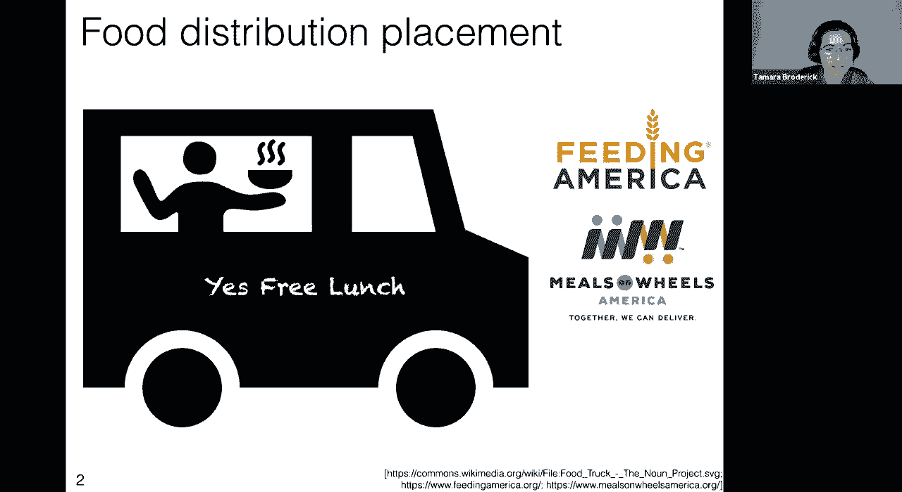

distribution so we're gonna think about，uh that problem today okay，so they have let's say um a very。

fantastic existing model and existing，trucks but now they have a new。

area of the us and they're interested in，placing，their cave food trucks um and asking。

where should they park，and so what we're looking at here um is。

perhaps the area that they're thinking，each，dot here represents an individual that。

they think might use their service that，might pick up，some food from their place and so from。

one of their trucks and so in particular，of as，longitude uh the vertical axis we can。

think of as latitude so this is really，like we're just looking at some。

you know dots of where people live on a，map，and we want to ask how can we minimize，the loss，serving。

um so we have to think about well you，here，on what are they losing you know it。

might be some aspect of like you know，how much of their，time do they have to give up or you know。

what do they get by walking to these，trucks，okay so let's establish a little，notation um。

to just you know be able to write this，kind of thing down，um so first of all let's say that there。

are little n，different people that were interested in，serving here。

um and we'll say that the i person is at，location，x i so this is this is where the i，person lives。

um so for instance this little dot is，where a particular person lives。

um and this will be described by a，feature vector that feature vector。

is the longitude and then the latitude，of that person's location。

um similarly we can talk about our j，food trucks so our food trucks will be。

you know um taking values from one to k，or b indexed by values from one decay。

and they'll be at some location too so，here let's suppose i have five。

food trucks so k equals five um and，i am interested in locating them in an。

optimal way so i want to write down，their location so let's say that you，know for the。

you know j food truck its location again，is going to be given by a feature vector，longitude。

and a latitude okay，so now i want to say let's assume，that each person walks to a single food。

truck and you know maybe we communicate，with them beforehand on the phone and we。

say hey here's your food truck，you can expect your meal is going to be，at this particular food truck。

um and that food truck we need to you，know identify to them and so let's call。

the food truck for the eighth person，why super eye and so for instance。

for if this person if we call them up，and we say hey you should go to this，food truck。

then we're going to want to denote that，okay so finally we have the notation to。

be able to say something like what's the，loss，of the i person walking to the jth。

truck now it could be anything i mean，really you could choose whatever loss is。

most appropriate to you i'm going to，make a choice because we have to make a，choice to proceed。

um but you know you could always make a，different choice and so we're thinking。

about you know what the choices you make，imply，so one choice that we could use you know，about。

um some kind of squared error and so，here we have a，a notion of a squared error loss we're，point。

from wherever this person lives to the，food truck we're taking the euclidean，distance。

and then we're squaring it so one reason，that we might consider。

squaring the euclidean distance and a，loss here is that，you know people really really don't like。

to walk，very long distances you know walking，having 10 people walk 0。5 miles。

um is not the same as one person walking，five miles five miles is prohibitive you。

know they might just not even bother to，go to the food truck at that point。

um and so the squared loss sort of，penalizes far away，food trucks even more um than we might。

expect from just uh you know maybe a，street，um distance or or some other type of，loss。

it's a choice um but it's a choice we're，gonna make here we're going to use this，squared。

euclidean distance um as as this loss，okay so now we can ask well what's the。

loss across all of the people，that this charity is serving based on。

this choice you know what what is the，loss for a particular arrangement of the，people。

to food trucks okay let's let's，think about what's going on in this。

equation here so first we're saying，for every person there's a component of。

the loss so that's the sum from i equals，one to n，and now for all of those people we're。

going to say hey this is the loss that，we assign to them，i，because that is the food truck that this。

person is going to go to，now what i'm going to do is i'm going to，write this exact same。

formula in a slightly different way，so exactly the same thing just adding up。

the loss over all the people，we're going to write it in a slightly。

different way so here's a slightly，different way，let me just talk through this so again。

we're just summing up，the loss for every individual that this，charity is serving。

so you know i equals 1 up to n，now what we're doing is we're saying one，way that we can represent。

this loss that we said the squared，euclidean distance between，an individual and the food truck that。

they're going to is let's consider，every possible food truck that they，could have gone to。

from j equals 1 to k only one of these，values will be non-zero so remember。

this indicator notation that we've used，in a few lectures before。

since indicator notation is 1 if what's，inside of it is true and。

zero if what's inside of it is false and，so，all but one of the food trucks are going。

to have zero here，the one that the person is assigned to，is going to have one and in that case。

we're going to say what's the square，hopefully，you can convince yourself that this is。

just exactly the same formula as summing，up over all the individuals and saying。

what is sort of the the loss between，them and the food truck that they're，going to，what we've done。

in the past in this class whenever we've，had a loss is we've said hey let's。

let's try to use that to optimize some，parameters that we're interested some。

you know some values that we're，interested in and so we can think about。

you know what are we interested，in in doing here well we're interested，in placing the food trucks。

and assigning people to the food trucks，and so we can do that here。

we can say okay oh by the way and i'll，just mention really briefly before。

before i do that um this this summation，order actually doesn't matter。

um and hopefully you can convince，yourself that i could just switch them i。

could have the sum of the k，before the n and that wouldn't change。

anything so totally the same doesn't，matter which one i use，here's here's just a different one um。

okay so now that's the loss，and i want to minimize it so here mu is，going to be the collection of。

all the food truck locations，y is going to be the collection of all，the assignments of individuals。

two food trucks and i want to find the，mu and the y，that are going to minimize this loss。

that are going to make it so people，don't have to walk，very far to get their food trucks food。

from these food trucks，so that's going to be it's going to be，my goal。

and this is often called you know trying，to satisfy the school is called k-means，clustering。

and this thing that we're minimizing，here is called the k-means。

objective why is it called the k-means，objective well one，we've seen before that the thing that。

we're optimizing when we have an，optimization problem we typically call，that an objective。

so that's why this is called an，objective why is it called k，means well we have these k food trucks。

the k，and k means that we you know we have，these k sort of centers that we're，trying to place。

and the means are going to make a little，isn't，yet fully explained but we'll get there。

okay so i have my food truck problem，here i know what i want to do。

i want to try to place these food trucks，optimally and i want to assign people。

to food trucks optimally and now i have，to think about how am i going to do that，and again。

this has somewhat of a similar flavor to，what we've done in the past in this，course that we start by。

saying here's an optimization problem，that represents，some values that we want to learn some。

values that we want to optimize，on these parameters of our problem and，then we think about。

how can we actually do that how can we，actually optimize that problem what's an，algorithm。

that might help us do that now as with，any optimization，problem there are a lot of different。

ways that we could approach this it，doesn't have to be one particular way。

but it turns out that there's a really，venerable algorithm that just about。

everybody uses if you ever do any，clustering in your life there's a really。

good chance that you'll be doing it with，this algorithm，um and it is called the k-means。

algorithm so we're going to walk through，what that does okay so our k-means。

algorithm is going to take，two inputs in this particular case it's，going to be。

k essentially the number of food trucks，from what we just discussed and tau。

which is basically a maximum number of，iterations um，you know something we've seen in the。

past a lot is that it's always good to，know，if nothing else has a fail-safe so that，and。

you know run your algorithm forever if，there's a bug or something like that or。

even if there's not a bug you know some，of these might just keep going。

okay now we've kind of vacillated on，whether the data，is an input to this algorithm um and so。

like implicitly it certainly is here and，you can make it explicit too and in fact，the notes do that。

um so let me just say you will be，inputting the data into this problem and。

let's say what is the data，the data is the collection of feature，vectors。

of these individuals all the individuals，that we're thinking about saying you，know where where。

should they get um their meal from a，food truck，and so in particular it's a bunch of。

feature vectors and i want to emphasize，that it is just feature vectors so in。

the past when we were doing regression，when we were doing classification。

the input to our algorithm was always a，set of pairs，a feature vector together with a label。

you know maybe it was um a feature，vector together with a class label。

if it was classification if i was doing，regression would be a feature vector，together with。

um you know some kind of real value，label，and now we're totally changing that we。

just have feature vectors，there is no label on those feature，vectors we just have these。

in this case x1 x2 in general it could，okay so the first thing that we're going。

to do is we're going to drive our trucks，into town，um，you know essentially that's you know。

bringing bringing them into the picture，um so you know here's here's our trucks，they're appearing。

um they're now initialized um it's worth，asking how would we do this in general。

how would we initialize the food truck，locations um we could say randomly。

i feel like random is one of those words，that like always really sounds good。

until you actually have to code it up，and then you have to think to yourself。

what does random actually mean，um and so here are two examples of what，you might mean。

by random in this problem that would be，very concrete and that you could，actually code up。

one you could choose randomly from the，data points you have，so one thing that's really important if。

you do that，is to initialize without replacement um，it's worth asking yourself once you've。

gone through this algorithm once you've，algorithm，what would go wrong if you initialize。

two food trucks at the same location，um it's like a good exercise to go，through later。

another option is you could find the，span of the data in every dimension and。

you could say uniformly at random，from that span um you could initialize，another。

perfectly fine option and that seems to，be what i've done here because these，trucks are not。

okay so now what we're going to do is，we're going to do our iterations。

for t equals 1 to tau tau again is the，maximum number of iterations we're going，to take a few steps。

what are those steps well the first，thing we're going to do，is we're going to go to every person and。

we're going to say what's the best food，truck for you，what's the best choice of food truck。

given the current locations of the food，structure one way you can think about，the k-means algorithm。

is that it's essentially a sort of，greedy algorithm we're going to say and。

it's a sort of coordinate ascent，algorithm，or coordinate descent if we're，minimizing um so。

what we're going to do is we're going to，say for all the people what's the best，option for them。

given the current location of the food，trucks and then for all the food trucks，what's the best。

option for them given the current，assignments of the people and we'll go。

back and forth and back and forth，doing that okay so first let's go to all。

the people and let's say what's the best，food truck for them to go to。

so how can we write that we can say that，remember why super i，is the assignment of the i person to a。

food truck，so that food truck ranges over the，indices j j equals 1 decay。

and so we want to say what's the closest，food truck essentially and so that's，what is。

and so if these are our food trucks，which i've now colored to hope。

you know to hopefully encode them a，little bit um we can color。

all of the points that are closest to a，particular food truck with the same，color。

that's us assigning them to the same，food truck now sometimes it's a little。

bit hard to distinguish different colors，and so i'm also going to draw。

some lines to hopefully just help with，the visuals，so all the points that are sort of near。

a particular truck again are being，assigned to that truck，you don't explicitly get lines like this。

technically what we're constructing here，is a voronoi diagram you don't。

explicitly get them from k-means but you，can construct them as soon as you have。

the food truck locations but again i'm，just using that as sort of an extra，visual aspect here。

okay so now we have an assignment of，every person，to a food truck that's the colors or。

it's distinguished by the lines，and we're going to take the next step in。

our algorithm so the next step in our，algorithms we're going to say okay for，every food truck now。

so we just assigned every person to a，food truck now given those assignments。

we're going to say what's the best place，okay let's think about what what is the。

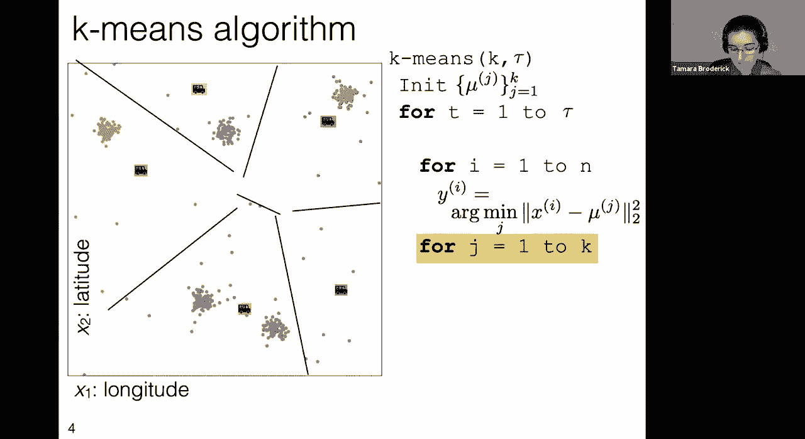

i propose that it is the mean，of the individuals assigned to that food，truck。

you can actually work this out for，yourself to show that that's true but，let me just。

convince you that what i have written，here is in fact the mean，so what are we seeing here so we're。

saying mu super j，is the location of the j food truck，so this should be you know some vector。

of size equal to our feature vector，because this food truck exists in the，same space that our x's。

exist what am i going to do here，i'm going to sum over every person。

but i'm only going to count the people，who are assigned to this food truck。

so another way you can think of this，some is it's actually just a sum over。

people who are assigned to the food，truck because that we're zeroing out，everything else。

and then for everybody who is assigned，to this food truck we're summing up。

and then finally in the denominator，we're summing up the number of people。

assigned to this food truck we make a，one for every person who is assigned to。

this food truck and a zero，for every person who is not so，essentially this is the number of people。

assigned to the food truck，and so this is the sum of locations of，people assigned to the food truck。

divided by the number of people assigned，to the food truck and so that's just。

gonna be an average and in particular，it's gonna be an average in every，dimension。

of the featured vector because the x's，okay so let's see what that would look。

like so here's my current location to，the food trucks，now i'm going to take this formula and。

update the location of the food trucks，with the average of the people who are，assigned to them。

and so i'll have the food trucks move，and now what we're going to do is we're。

going to keep iterating in this，so we have our tau or sorry our t our。

iteration t and again it goes from one，oh there's a um a question i see is the，jdk loop within。

the one to end loop and it is not and，this is an important point。

that we have our overarching t equals，one to tau，and so within that we have two separate。

steps the first step is assigning people，to food trucks，conditional on knowing the food truck。

locations，then we assign food trucks to people，conditional on knowing the people。

assignments um and those are just two，separate steps um and they're。

they're not within each other great，okay so now we're gonna go。

back to that first step the assignment，of people to food trucks，because now we have new food truck。

locations um and so we want to see you，know what are what are the new。

assignments of people to food trucks，and so i'll just update that you know a。

lot of these food truck locations were，somewhat similar，we're really seeing that the blue and。

the green moved quite a bit，um and so we see a lot of change in，those assignments down at the bottom。

okay so the next thing that we're going，to do again is we're going to with these，updated assignments。

of people to food trucks we're going to，move the food trucks again。

so we'll go down here we'll move the，food trucks to the mean，of their currently assigned people。

and we just keep doing this so now you，know we're on the next iteration of t。

go back to the assignments of people to，now we update the food truck locations。

you can see that it was really just the，blue and the green that really moved，this time。

down there at the bottom and now we，update the assignments again，and now we update the food truck。

locations，and we update the assignments and we，update the food truck locations。

um and it turns out that nothing changed，this iteration of the assignments。

so i propose that they will never change，again now that they have to not change，once。

they won't change again do you agree，with that，how can how can i know this is a。

question for the chat does anybody have，okay great so first of all people are，observing in the chat。

that once these assignments have not，changed on one iteration。

they will never change in the future no，matter how many iterations i run。

the second observation that people are，making is that remember we're choosing，the assignments。

based on the means and so，once the assignments are fixed the means。

are fixed the mu js are fixed and if the，mu js don't change the assignments won't，change。

because we're just changing them based，on those means，and so you want to convince yourself。

that this is true but it，hopefully you'll at least go along with，me for the moment that once we have。

no new assignments it's not going to，happen again you know，we're not going to get a change again。

okay and so for that reason，maybe you know maybe we set tao to be a。

hundred thousand just to be super safe，but maybe that's a big waste of our time。

and so we might want to cut out early，if we're not making any more changes and。

so let's change this algorithm，to reflect that and to take advantage of，that。

okay so the first thing that we're going，to do is we're going to record。

what were the old assignments so just，before we go into changing the，assignments。

let's say what were the assignments that，we had before we made any changes。

so we're going to say why old is the set，of assignments，of people to food trucks before we make。

any changes um before we do that for，loop over the y's，and then we'll ask ourselves did we make。

any changes，here all we're saying is that if y，didn't change in any way。

when we had our chance to update，assignments then let's not bother，keeping going。

let's just break out and be done okay，now technically speaking，there's something missing from this。

right now which is uh there is no，why to assign to y old at the beginning。

of that for loop and so we need to，initialize y，somehow now since in this。

particular instantiation the literal，only reason that you have an。

initialization of y in the beginning，is to check if anything has changed your。

first initialization of why should be，something that，you know would detect that there's a。

change so you might for instance assign，all the data points to like the same。

truck or something like that，um you you wouldn't want to sort of，accidentally not have a change。

in this case okay and then finally what，we're going to do，after we've done all of this is we're。

going to return，our food truck locations the mu super j，and our assignments of individuals to。

food truck the why super app，because that was the point we went into，this algorithm trying to。

optimize arcadian's objective in，particular what we wanted to do is we。

wanted to figure out where to put our，food trucks，and where to tell people to go you know。

which food truck should they get food，from，and so we want to make sure that we。

okay so this is the k-means algorithm，let's think about what it's doing in。

relation to things that we've talked，so in particular there are a lot of。

things i think that sound pretty similar，between k-means and classification let's。

ask ourselves was this classification，did we did we need a new algorithm could。

we have just called this classification，and，and you know used one of our existing，algorithms。

certainly something that is true，is that we assigned a label y i。

y i takes k different values as the k，food trucks，to each feature feature vector x i。

okay so my questions for you for the，chat are one，is this classification and two。

okay great so we're getting some great，observations，is that we didn't have any labeled。

data that we were learning from，if you look at this picture it looks。

like there are labels on all of our data，but remember we came up with them。

we came up with not only the assignments，of data points to labels but the labels，themselves。

you know where were these trucks even，located this is the data。

that we got in to begin with this data，has no labels and that。

is the difference between clustering and，classification，in classification you start。

with labeled data and you learn how to，label new data，based on the old labeled data you start。

with labeled training data，and then you consider for new test data。

what are you going to do with it how are，you going to come up with labels and you。

use that label training data，in clustering you start with no label，data there are no labels。

and you just find a pattern in that data，you just find，okay so big difference here between what。

we did and classification is that we，didn't use any labeled data and there's。

a more subtle difference，too which is that the labels here don't，have，meaning so if i were doing。

like saying，hey i'm trying to decide whether i，should run outside，don't run。

when it's really cold if you told me to，run when it's really cold and not run。

when it's really warm i would have a bad，time you know my life would be really。

annoying um i would be very，uncomfortable，like my life would fundamentally change，in this case。

if i took my labels my trucks and i just，permuted them like i moved them around。

like here i've just put different，colored trucks in the same location，nothing has changed i still。

am feeding everybody just as well as i，was with the previous locations of the，trucks。

i could totally change all the labels i，could permute them and i'd have the same，result。

and that's because what we're doing in，this problem is fundamentally very。

different than classification，classification again we're trying to。

provide labels based on our old labels，here we're kind of just partitioning the，data。

now a partition is a grouping，into mutually exclusive and exhaustive，sets that is to say。

every person is assigned to one truck，and only one truck，and so all we're trying to do here is。

group the data together we're just，trying to say here are data points that。

go together here are data points that go，together here are data points that go，together。

and the label is sort of beside the，point，so this is a more subtle point but the。

you know if you're ever trying to decide，am i doing clustering or classification。

it's helpful to think did i have labeled，okay now that all being said。

um i've kind of said a few times now，what we're doing let's make that formal。

what are we actually doing here because，it's not classification hopefully，hopefully we agree。

so what did we do well it's going to be，something that needs a new name because，we didn't do before。

we clustered the data we did what's，known as clustering，okay what is clustering it's grouping。

data by similarity，so that is to say the data we start with，a bunch of unlabeled data just a bunch。

of feature vectors，in this particular case it was latitude，and longitude of particular individuals。

but in general it could be any feature，vectors，it doesn't have to be two-dimensional it。

doesn't have to be latitude and，longitude it doesn't have to have this。

particular interpretation it could be as，high dimensional as you want。

but it's a bunch of feature vectors and，now we have some notion of similarity in。

this particular case we use something，like euclidean distance in other cases。

we can use other notions of similarity，it doesn't have to be，euclidean distance on the feature。

vectors or it could be euclidean，distance on different feature vectors。

but we have some notion of similarity，and we use that to group the data again。

to form a partition of the data where，each，we have a bunch of groups of data points。

where all the data points belong，together when they're in a group，together。

and this is what we got these are the，clusters that we got out。

now it's worth noting um again we don't，have to have this food truck。

interpretation when we do clustering，you know in general we could use the。

k-means algorithm or we could do k-means，clustering and come up with a set of，cluster centers。

for more general feature vectors so if i，have a general set of feature vectors，that are my data。

then i'm doing this clustering on them i，can use this k-means algorithm or some。

other form of k-means clustering to come，up with a bunch of cluster centers and。

the assignments of data points to，clusters，and in fact i don't have to have cluster。

centers to do clustering，all i have to have to do clustering is，grouping data points together。

in this particular case i use cluster，centers to help me do that。

but i don't have to to do clustering i，just have to say here's the way that i'm。

okay now let's talk a little bit about，you know why bother with k-means。

clustering or the k-means algorithm，um why don't i just plot the data and。

sort of see that there are these clumps，i mean in this case you know。

um it seems really natural in our uh in，our example，that you know we're looking at where。

people live they probably tend to live，in cities if i looked a map i could。

probably find out where those cities are，like why can't i just plot the data。

well my first point to you is you should，always plot your data you absolutely，should plot your data。

you should plot your data before you，start doing any kind of machine learning。

algorithm and then when you're done with，your machine learning algorithm and your。

analysis you should plot it again to，make sure it makes any sense。

um you always plot your data never don't，plot your data man if there's。

almost one thing that you get from this，class it should be plot your data。

um it's just such a useful useful thing，to do to understand what's going on。

it'll help you you know understand so，many bugs，the point that i'm making now is not。

that you should not plot your data you，should definitely plot your game。

it's that sometimes plotting the data，isn't enough on its own，of，algorithm okay so why would that be。

one is precision i mean we wanted to，park these cars these trucks in a。

particular location that really you know，helped people，i don't know that you could eyeball this，to。

park your trucks um you could probably，get a reasonable，approximation but you know if we。

actually care about exactly parking them，and really saving people's time then we。

probably want to run an algorithm that，something that's worth thinking about is，that if you have。

10 million data points and you try to，plot them on one plot，you will fail it will just be a big blob。

you know it'll be a，big blob that means nothing now that's，not insurmountable。

you could do a heat map you could do a，density map there are things you can do，to get around that，a。

bigger issue in terms of just plotting，your data，is high dimensions so remember we've。

talked about this before in this class，as soon as you get above two dimensions。

i mean we as humans can only see in two，dimensions it's an unfortunate。

limitation that we have but we have to，deal with it，you should still try to plot aspects of。

your data but when you get into high，dimensions it'll be helpful to have ways。

to deal with high dimensions，to be able to use them and you can still，do that with an algorithm。

in particular with the algorithm we just，covered，another big reason that we care about。

having these algorithms，is high volume let's say that you're，google。

and you want to do some clustering on，every one of the search pages that。

appears to individuals who are using，your search，there is no way that you're going to。

have an individual like an actual person，look at every one of those and say。

something about it you want an algorithm，that's going to be quick，and automated and fast um and and。

actually get your results，okay so even when you know we're not。

trying to exactly place our trucks we're，just trying to find these clusters in。

our data it might be useful，to have an algorithm like k-means。

okay so what we saw here was an example，of what is known as unsupervised。

learning so unsupervised learning is any，case where we don't have labeled data。

and we're trying to find patterns and，this this is really distinct from again。

the types of supervised learning cases，that we've seen before。

where we do have labels and we're trying，to do something with those labels we're，trying to predict。

those labels on future data like，so before i go on i'm just going to make，a little venn diagram。

to emphasize these relationships，so in particular something that we just，covered。

was using the k-means algorithm i might，have a problem where i use the k-means，algorithm。

but that is not the only way to do，k-means clustering，anytime i have the k-means clustering。

objective and i'm trying to optimize it，and i can optimize it in other ways it。

doesn't have to be with the k-means，algorithm i would still be doing k-means。

now likewise i can do clustering，without using k-means clustering so for。

instance maybe i have different forms of，the loss，you know maybe it's not exactly what i。

talked about before like for instance um，the reality is that people lock along。

blocks and that's actually the manhattan，distance that's not the euclidean。

distance maybe i want to encode that，somehow，you know if i do some other type of loss。

or if i do something totally different，it doesn't even have to be exactly this。

optimization objective that we talked，about but if it's some way that brings。

my data points together in groups，that's still clustering but it's not。

k-means cluster and it's worth noting，that if i do，change the loss a little bit it's not。

clear that you can use something like，the k-means algorithm to optimize that，still。

finally you can have forms of，unsupervised learning，that are not clustering for instance。

suppose i have a bunch of data points，and my data points represent。

documents you know maybe they're all the，documents in wikipedia。

maybe they're all the documents on the，web and i want to cluster them to find。

the topics or the themes，in those documents so i could do，clustering。

but maybe i think that some of my，documents，have multiple topics in them you know。

like maybe if i look at，an article from the new york times and，about。

arts because it's about a movie it's，about sports because it's about baseball。

but it's also about economics because，it's about trading players and making，money。

and so in that case i might not want，clustering where each data point is。

assigned to one and only one group i，might want something else where i can。

belong to multiple groups and so again，there are many forms of unsupervised。

okay so this gives us a little bit of a，hierarchy you know how is this all，related。

um what's the the bigger picture but now，let's delve deeper into understanding。

the k-means algorithm and what's it，what's it doing because it is a。

particular clustering algorithm that's，very popular it's a particular k-means，clustering algorithm。

a quick，question please do yeah there's a super，um，is there a version of k-means that。

doesn't take in k as a parameter but，rather learns it instead，yes we will talk about choosing k。

very shortly um but it's a very natural，question，you know how do you learn the number of，clusters。

um and unfortunately there is not a pat，answer to it it turns out it really。

depends on what you're trying to do but，we'll add a little nuance to that，shortly。

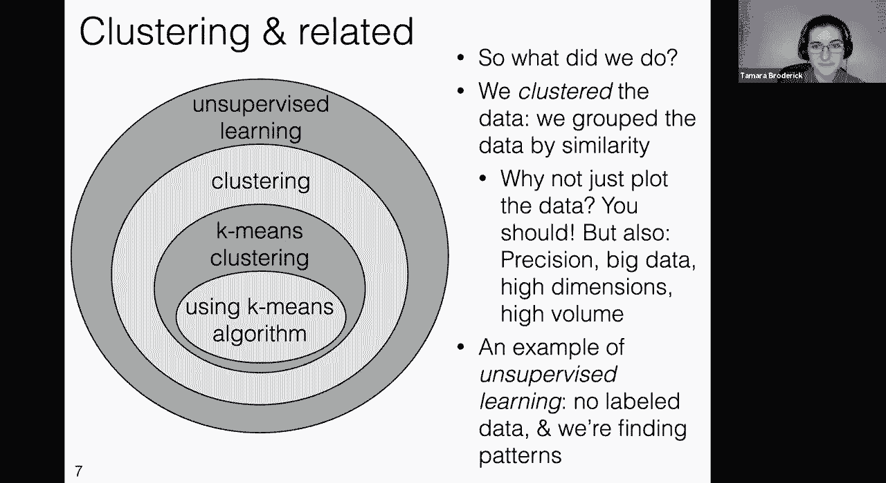

okay before we get to that let's talk，about initialization，okay so first of all why are we doing。

the k-means algorithm at all does it，even work you know does it does it do。

anything useful um so here，is a result um that actually you can。

prove for yourself if you think about it，for a bit，if we run the k-means algorithm for。

enough outer iterations so i'm talking，about that big，t iteration that's on the outside the。

biggest for loop，then this k-means algorithm will，converge，to a local minimum of the k-means。

objective，um so what i mean here in this，particular case by converge。

is just that it will stop changing，and what i mean by local minimum is that。

if i change you know the mu or the y a，little bit i'm not going to get。

something that's better okay so let's，think about this，um that sounds really good you know we。

get to this，this this local optimum and in fact，that's what we saw if we initialized，like this。

then we get to this optimum and in fact，um this is，a global optimum it turns out it looks，trucks。

is in the middle of one of what seems to，be a small town or city。

um and so that feels like a you know a，good assignment of，trucks to individuals now the。

the um horrible truth that i want to，tell you here is that this is not the。

first random initialization that i ran，um i actually ran two other ones first。

before getting this one，and so maybe we should take a look at，um it will turn out that the local。

minimum can be bad，okay so let's let's look at the first，random initialization。

of trucks that i tried so this was our，original one，this is the actual first one that i ran。

just a random initialization，what happens if we run k-means from。

these trucks from this initialization，question is is this is this good is this。

bad um what do you what do you think，about um this alternative clustering，of our data of our people。

is it better is it worse than the one，for，the chat，okay there are a lot of really good。

responses here okay so，the first one that i'm going to，highlight the first type of response is。

people saying it's worse，and so let's let's notice a couple of，things here so one。

there's sort of not really a like a，truck，per cluster and so if we really think。

that like you know hey i can kind of，identify visually that there are。

roughly five clusters here i think that，so，you know it seems intuitively that we're。

not picking that up，but even more than that and i think，really to the point people are observing。

to do，which is always a good observation in，machine learning，and two what we're trying to do here is。

we're trying to optimize the k-means，objective we really care about。

minimizing this loss to the people who，are using our food pantry service。

in this case and so what we really care，is did the loss go up or down did that。

total k-means objective go up or down，and i can tell you，and you can sort of you know think to。

yourself why you might find this，intuitive then in fact the k-means，objective is worse。

in this case it is not as good as in the，previous case that we saw overall。

the trucks are farther from the people，who are using the service。

and so in that sense and that's a very，specific sense，this is a local optimum not a global。

optimum and it is bad because it's not，okay let's try the second random。

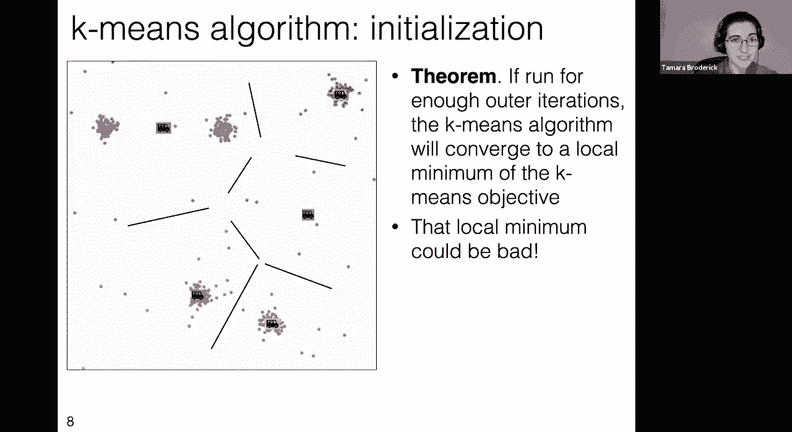

initialization，that i actually tried so we we just，answered this question。

um let's try the second initialization，that i randomly tried，so here it is there's another random。

initialization，now we're going to run k-means，clustering on this random initialization。

again i'll just tell you but you might，want to convince yourself that this。

seems intuitive that this is a，worse value of the objective function。

this is a higher value of the objective，function，than the first example that we saw the。

one that we saw when we were first，introducing the k-means algorithm。

okay so the first observation here is，the initialization can make a big，difference。

if i have different initializations i'm，getting really different clusterings out。

um and remember that's that's all i can，do with one run of the k-means。

algorithm you know once i start running，it，i run it um it stops moving eventually。

and then that's just it，it's never going to change again and，that's how i'm getting to these points。

i'm getting to the point where it just，isn't changing anymore，and it's going to get stuck in that。

local optimum it's not going to move to，a global optimum，and so we have to think about okay well。

is there any way that we can deal with，this is there any way that we can。

you know maybe maybe get out of this，local optimum，now there's a venerable idea in machine。

learning that comes up anytime that you，might get stuck in a local optimum。

um and that is random restarts so the，idea of random restarts and it's。

essentially what i've done here，is i randomly initialize i，run my algorithm in this case the。

k-means algorithm i get out my output，and then i do it again i randomly，initialize。

i run my algorithm i get my output and，then i do it again，i do this for some number of times in。

this particular case it was three，i have three different random。

initializations i run my output i get，my final output and this is something。

that's inherently massively，parallelizable you could just do this on。

a bunch of different computers in，parallel，um and so you can take advantage of that。

and now let's let's be concrete，suppose that i randomly initialized，three separate times i ran。

from every one of those initializations，i got out for every one of those。

initializations an assignment of，trucks of where the trucks are，and an assignment of individuals to。

trucks what do i do with that so this is，another question for the chat suppose i，did those three。

random restarts and i got the output of，the k-means algorithm every time。

what do i do with that what do i do with，okay great so lots of people are，observing。

i should calculate the loss，or the objective for every one of those，random restarts。

and then i should take the one with the，our goal，is minimizing this objective or at least。

that's our stated goal，and so if that is our goal then what we，want to do。

is we want to take all of these，different outputs these different random，restarts，is。

really minimizing the objective at least，across those random restarts，and keep them。

and at the very least we'll know that we，have the minimized objective across。

all of the different assignments of mu，and y that we had explored。

that's not a guarantee that we'll get，the global optimum，we can still only guarantee a local。

optimum but at least it should be better，than any particular run or at least。

not any worse than any particular run to，be very precise，now it turns out that there are other。

things that you can do that are beyond，the scope of our lecture today。

i'll just mention um one of them oh okay，so we just did this three random。

research um what do i return that's what，we just talked about we're going to，return。

the one with the lowest objective i mean，it turns out there's this other。

you know there's lots of work in this，initialization area，one particularly cool idea is what's。

known as k-means plus plus it's an，initialization scheme for k-means and so。

if you're looking for something，cool to read up on i'll definitely，okay so we've talked about，can。

really matter can really change things，and you need to be aware of that。

and potentially you know try to cope，with that in some way one idea is random，restarts。

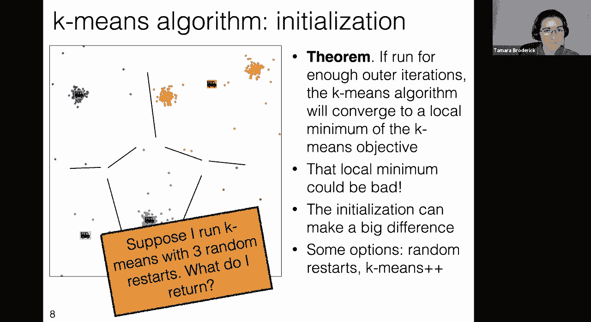

one idea is k-means plus plus，let's notice um as in fact our question，asker has already noticed that。

k has an effect as well so we just saw，that the initialization really has an，effect。

um and of course intuitively um the，choice of k must have an effect，you know if we have five trucks。

at our disposal we have five trucks that，are available to us，um then we can get them you know this。

close，to the people who are you know getting，the food from the trucks。

um but of course if i have a different k，that will get different results and so。

for instance if i had four trucks，i just can't possibly get the same，clustering that i did with。

five trucks in this case um i in fact if，you think about it we'll just not be，able to get。

the trucks as close to the individuals，who need the food，and in general this is what we can。

expect i mean hopefully again this is，intuitive that if i have fewer trucks。

i can't get the trucks as close to，individuals，if i have more trucks i can get them。

closer to the individuals who need the，food，this is why we would like to if you know。

if we were this agency if we had more，money we'd like to spend it on more。

trucks so that we can you know reach out，so we see that the larger k more having。

more trucks gets them closer to people，or in general you know if we're not。

thinking specifically about，trucks and food service you know that，having。

more k having more cluster centers，having more clusters，allows the clusters to be smaller to be。

more compact，okay so here's a question for you can，you identify can you describe in words。

in the chat the optimal clustering if，the number，of clusters is n the num oh sorry this。

should be we've been using little n，and little n the number of data points。

i'll correct that in the slides，afterwards，um but if we have k equal to little m。

the number of data points so in，particular，in this particular case you know if i。

had the number of trucks equal to number，of people，great so the observation is every person。

gets a truck there is a food truck that，is right outside your home。

you just pop outside get your food and，head back in um it's the best possible，clustering。

everything is zero feet or，zero you know degrees of latitude and，longitude away from your house。

um so everybody gets their own cluster，everybody's in their own cluster。

um and the objective you know we'll have，every，truck is just going to be zero it's hard。

okay so now that we've observed that we，get，these different clusterings when we when。

we have different k，let's think about choosing k now the，first thing to notice。

is that sometimes we just know k we're，given k by somebody else um and so we。

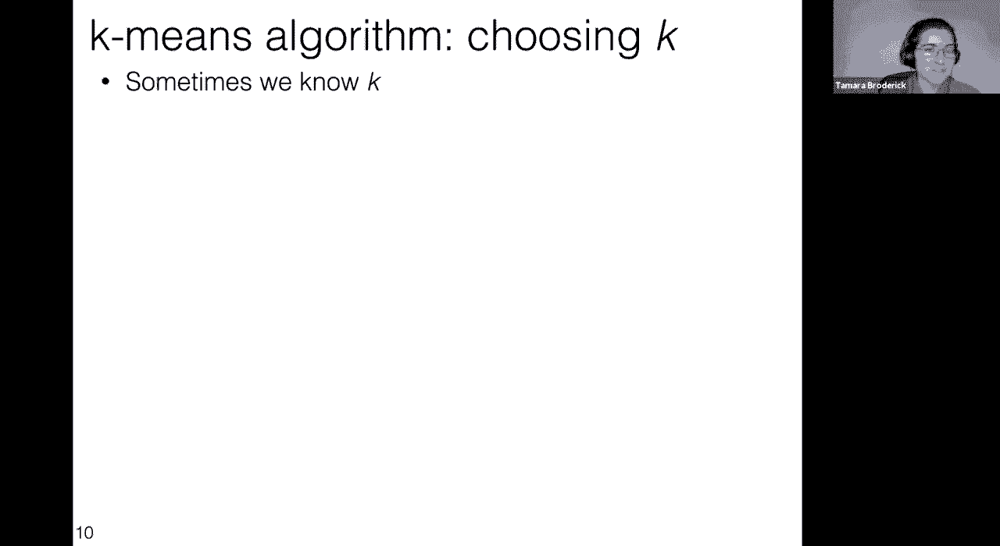

don't need to worry about choosing it in，the sense that somebody told it to us so。

an example was if uh we are working，with our food truck friends you know。

with this charity and the charity tells，us i have five trucks，they have five trucks um so k is five。

and that's the optimization problem that，we're solving and there's sort of no，more work to do。

in that sense but this could happen in a，lot of other cases so suppose that i am。

working for a web search engine，and that search engine is interested in，clustering。

search results to display just a few，similar results and maybe，they only have space for four results。

to be displayed on their page and so，they tell me hey you gotta come up with。

four clusters so for instance，suppose that i search for the word drink，did i mean drake the musician。

did i mean drake the male duck，did i mean sir francis drake did i mean，drake university。

who knows and so the search engine might，display，a cluster for each of these types of。

articles there would be a cluster for，are all，you know somewhat similar on the order。

of articles about drake，there is a cluster of articles about sir，francis drake a cluster of articles。

about draco male duck，and a cluster of articles about drake，university and because they only have。

four spaces to display something on a，page i mean there's only a limited，amount of screen space。

that you have i know that k is four，similarly i might be clustering。

customers into groups and i'm going to，assign a staff member，in my business to each one of my。

clusters and so maybe i have k staff，members or the budget for k staff，members。

maybe i'm clustering books on k，bookshelves and so i know that i have k。

okay but the observation um that the，previous question made，which is that sometimes we'd like to。

choose for learn k and so you know maybe，looking，at um a bunch of uh topics you know。

again a bunch of documents that are on，the internet and i want to know how many，topics。

are in those documents maybe i'm looking，at a bunch of animals and i want to know。

you know i have a bunch of，observations of animals and i want to。

know you know how many little groupings，of those animals are there maybe i'm。

working with this food truck service and，they want to know how many trucks they，should buy。

you know how many trucks that they，should deploy and so in all those cases。

there's some sense that we'd like，to choose or learn k but it's worth。

noting that those are actually pretty，different use cases，so the first observation is that in none。

of these cases can we just，minimize the k-means objective over k so。

let me first be explicit about what i，mean by that，so here is our k-means objective from。

before again it's just the sum over all，the individuals，of their laws um so it you know。

in general it's this sum of squared，euclidean distances，um in our truck example it's the sum of。

the squared uh euclidean distances of，individuals to，their nearest truck or 2a truck in this。

case but we want to find the nearest，what we had previously done is we tried。

to minimize this over the assignments，of individuals to trucks or in general。

the assignments of data points to，clusters，and the cluster centers or you know in。

our particular example the truck，locations，don't we，also just minimize over k and this is a。

real question for you，in the chat again why don't i just，minimize over k why don't i just add，that。

as a parameter in my optimization，or should i should i add that as a。

okay great so lots of people are，observing，that if i do this i can already tell you。

the k that's going to optimize this，objective it's k equal n，because remember on the previous slide。

we observed that when we choose，k equal n where n is the number of data，points。

we can set y and mu such this is object，that this objective is zero。

notice that this objective is always，non-negative and so zero，is a global optimum and so this is。

optimized at k equals n，but cables n is not interesting like。

that's not why we did clustering right i，mean all，that does is it says hey look here are。

my data points um but we want to find，actual structure in the data。

we want to find something that's useful，um that you know could tell people。

where to put their trucks nobody's gonna，buy one truck for every single person。

um and so we're gonna need to rethink，this we're gonna need to think of a，better way to approach。

and of course as is true for everything，in machine learning it really depends，what you want to do。

so let me at least name two different，types of problems that we've talked，about here。

so one type of problem there's a，cost-benefit trade-off let's say i'm，working。

for again this charity that distributes，food trucks and i want to decide how，many food trucks。

should we have well in some sense，there's a cost to having fewer food，farther。

it's harder for them to get food but，there's also cost to having more food。

trucks there is literally a cost for the，truck and for maintaining it and so on。

and so very roughly something that we，could do in this case is if we could，quantify。

the cost of having more food trucks we，could actually put that。

into our objectives so that's what i've，done here i've said hey there's a cost。

to not having enough food trucks and，there's a cost to having more food，trucks。

maybe we can trade that off explicitly，an objective or something like this。

similarly with the web search example，presumably there's a cost to having a。

larger page of search results and that，you know people tend to not want to，scroll too far。

and so maybe we could trade that off，explicitly if i'm a bookstore owner。

there's a cost to having more space in，my bookstore and more，bookshelves if i'm a customer service。

representative，and i want to group my customers in，order to you know assign staff to them。

there's a cost to having more staff，so in this case if we can we'd like to。

explicitly represent that cost benefit，benefit trade-off，now in other cases like we're trying to。

find the topics，in a set of documents or we're trying to，find a grouping of animals。

that's not a case where there's a clear，cost-benefit trade-off but it's also。

worth noting that there isn't，necessarily a single right answer。

to the number of clusters like let's say，that i made a bunch of observations of。

animals in some environment，and i want to cluster them well if i，cluster on one level。

i might get the species if i cluster on，another level i might get the genuses。

my cluster on another level i might get，the kingdoms you know and so it's not，clear。

that there's this one right answer to，that we should，expect that an algorithm would find that，to。

how do we choose k in part because there，choose k，really depends on what you're trying to。

do and at least this gives you a little，bit of a flavor of the pitfalls that you，could encounter。

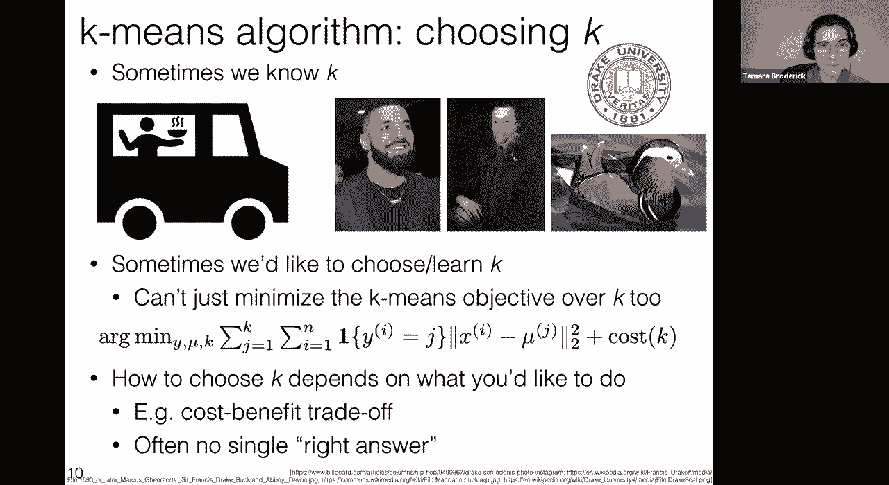

in trying to choose k，okay speaking of pitfalls，let's talk about some other ones that。

so k-means i'm going to observe and then，i'm going to show to you，k-means works well if i have。

well-separated，circular clusters of the same size and，so i'm going to break down each of the。

elements，so first let's just notice that these，are well separated。

clusters so i'm just sort of using our，visual intuition here that like we can。

kind of identify the clusters，in cases like this um and so here we，think that there are probably two。

clusters，it's unlabeled data but i think you can，kind of identify what they would be。

just intuitively they're well separated，they're you know they're，not right on top of each other um。

they're circular，roughly you know the data is roughly，within some kind of radius in each case。

and they're roughly the same size both，in terms of radius，and i'll tell you right now they have。

the exact same number of data points in，each cluster，it，you know maybe with multiple random。

restarts and i do all this stuff this is，the optimum，assignment of the cluster centers。

and the assignments of data points to，clusters，this is what i'm going to get that seems。

pretty much in line with what we were，talking about earlier with our truck，example。

with our food trucks where we were，trying to sign the food trucks we're。

trying to assign people to food trucks，we ended up seeing that we got you know。

our cluster centers we're in the center，of the clusters，and the groupings that we got sort of。

made sense you know when we，looked at that picture with all the data。

you know maybe maybe it was you know a，bunch of where people live and in some。

square shaped state like colorado or，wyoming，um and we saw that roughly we picked up。

the cities or you know or the towns the，groupings of people，and it seems like we have an intuition。

that that's what we'd like to do，but let's notice that our intuition。

about what clustering should do is not，necessarily what k-means is going to do。

and it's worth separating those two，things out k-means，is always gonna assign your cluster。

centers as though they were trucks，and trying to find the optimal placement。

of trucks for serving individuals who，need food，that is not necessarily the same as。

something that kind of looks like a，cluster to us and so that's what we're。

going to spend just a moment on now，okay first let's talk about same size。

now there are two different ways at，least two different ways that clusters。

might not be the same size so the first，so here again i have two。

what i might intuitively call clusters，you know maybe，before we were thinking about our two。

features that we were plotting as，latitude and longitude，maybe now let's think about them as we。

gathered a bunch of animals from the，environment，and these are height and weight so maybe。

you know maybe the，the horizontal axis is height and the，vertical axis is weight and if i gather。

this information you might think hey，maybe there are two species here。

you know there's one that has a lot of，variety within the species it's pretty，spread out。

um and then there's one that's that's，pretty concentrated and maybe i would，like to pick up。

those two species so we can ask，ourselves that's maybe what i would like。

to do but what does k-means do，so i want to i want you to think for a，second to yourself。

you don't have to write it in the chat，but i want i want you to to think to，yourself。

okay now what i'm going to do is i'm，going to show you the results of running，k-means。

probably the best thing that you could，later，try it out see what happens um try out。

some examples that you're not sure，what's going to happen，and run them so there are a lot of。

k-means is is basically programmed，just about everywhere it's very easy to。

get code it's very easy to write your，own code i mean we basically just wrote，the pseudocode before。

um and so like you know just like，everything it's probably best to just，try it out。

but here's what we're gonna get okay so，the observation here first of all。

is that there's a lot of data in each，cluster and so the centers are roughly。

in the center of each cluster as，we sort of expect um they are the means，the k means。

now remember we assign data points to，clusters，based on which is the closest cluster。

so there's basically going to be a line，down the center here between the two，cluster means。

everything on the left goes to the left，cluster everything on the right goes to。

a right cluster and so because，this right what we might think of as a，cluster sort of overlaps。

with that dividing line some of it gets，a sign，to the left cluster again。

whether this is good or bad and i think，you know people have rightly observed，this in some of our。

q a throughout this lecture it depends，on what you're trying to do。

if you're trying to assign trucks so，that they are as close as possible。

according to the objective we described，earlier to the people that they are，giving food to。

this really is the optimal thing to do，it optimizes the objective。

if you're trying to discover that there，were sort of two species here and。

you wanted everything in the one clump，to go together and everything in the。

other clump to go together this is not，doing that，and it's worth being aware that that's。

okay now this was one notion of same，size let's talk about another。

notion of same size so here the two，clusters were not the same size。

because they had different radiuses you。

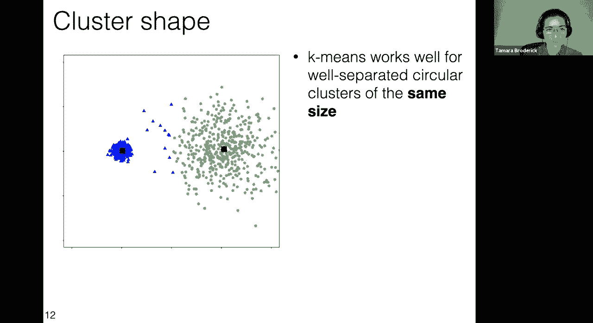

know one was was bigger than the other，here i've made two clusters where one。

has way more data points than the other，so it turns out i generated these both。

from what's known as a gaussian，distribution so they have the same sort。

of generation scheme it just turns out，when you have so many more data points。

in one it also gets a little bit bigger，but hopefully you'll see that the point。

that i'm about to make really depends on，the number of data points more so than。

than the exact shape okay，so again i want you to just take a，moment。

and think to yourself again you don't，have to tell me，but you should tell yourself commit to。

yourself what do，you think might happen when we run，k-means here，okay now i'm going to tell you。

incidentally this is a great exercise to，do on your own later when you're running，k-means。

ask yourself beforehand what do you，think is going to happen and then run。

here's what we get now again if what i'm，trying to do，is optimize my food trucks so that they。

serve people in the best way possible，and i minimize the loss of people this。

is the optimal thing to do，i reach more people more closely by，having two food trucks。

in the absolutely giant cluster by，putting two food trucks in the big city。

rather than one in the very small town，if what i was trying to do though。

was to observe that there are sort of，two different species here。

and i massively over sampled one of the，species maybe without knowing it i mean。

because i didn't have the labels to，begin with but maybe one of them is just。

really really easy to find in the，environment and one's relatively rare。

i'm not going to find those clusters，with k-means，i'm going to find this instead so again。

is this good or bad depends on what，okay so that's two different notions of，same size。

let's talk about circular okay so now，something that we talked about。

way back in lecture three when we were，talking about features is that feature，encoding matters。

and in particular the scale of your，features matters so one way that you，could create。

the plot that i have right here is that，i could take the original height and。

weight measurements from way back when i，had those two perfect round clusters。

that were the same size with the same，radius and the same number of data，points。

and i could just change the scale of the，vertical axis，like maybe i measure you know length in。

feet instead of meters or maybe i，measure，weight if it's weight i measure it in，kilograms instead of。

you know grams or kilograms instead of，pounds，you know this is a very easy thing to。

change the scale without thinking about，it and this is what i would get i mean，these are。

clusters that would be circular if i had，a different scale，but here they don't look circular。

they're very spread out because i have，okay again it's worth thinking，what might k-means do here。

just take a second for that again just，to yourself no need to。

to tell me but think about it for just a，i'll tell you that this one is worth。

playing around with yourself because it，really depends how stretched out the。

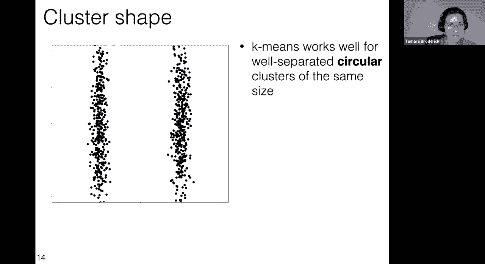

clusters are in the vertical direction，what you're going to get but in this，particular case。

these are the means returned by k-means，again if i'm trying to optimize my food，trucks this is great。

this is it turns out to be the best，thing to do but if i was trying to。

discover that these were these two，totally separated different species i。

would not be discovering that here，now an interesting metapoint remember。

one of the things that we talked about，to deal with different scales and。

different features is to do some kind of，standardization and that might help you。

quite a bit here but it also might not，totally solve this problem。

you know if you're just saying hey i，should standardize my features in such a。

way that you know maybe i，i have a particular um range of my data。

and i always want to make that between，zero and one i could actually end up。

getting something like this，um and so it's just worth something，keeping in mind。

something to keep in mind okay，so this is a case where we get away from，circular。

clusters what about well separated，so here i'm not just showing you the。

data to begin with i'm showing you，what if we had secret knowledge that in。

fact there are two species，that we're about to observe it just so。

happens that if we only look at their，height and weight they actually have。

you know pretty similar values and so，they're really going to overlap quite a，lot。

and so if we were to run k-means what we，would see is not our secret information。

about having two species we would see，this data，this data where there's a lot of overlap。

and then of course if we run k-means，it can't distinguish that overlap this。

this one you know some of the things，we've talked about，these examples with the circular。

clusters and the same size，are somewhat specific to k-means you，know we're making this specific。

assumption about what，objective we care about we're making a，specific assumption about how we're。

going to optimize that objective but，really these are specific to the，objective。

this one is more a sort of point about，clustering in general，that sometimes what you would like to。

distinguish maybe isn't distinguishable，in your data，if there is no separation in your data。

you can't expect that an algorithm is，going to get around that that an。

algorithm is going to find that you know，it's sort of similar to。

what we talked about previously with，classification if you try a linear，classifier。

and there's just no good linear，classifier there's no way to distinguish。

classes in your data you can't expect，that an algorithm is going to solve that。

for you it may be that you just need to，go and you need to get better data you。

need to go back to the drawing board you，need to think about，you know what information you have at。

okay so at this point we've talked about，k-means clustering and some depth we've。

seen that there are things that can do，really well，there are definitely limitations and i。

think that this is not，specific to k-means clustering it's not。

specific clustering it's not specific in，supervised learning it's sort of a very，general。

set of observations about machine，learning，that this is true and you know hopefully。

it's something that we've really，conveyed in this class，that these can be very useful and。

powerful tools，but they also have limitations and it's，worth knowing those limitations。

okay so i'd like to revisit my very，first slide in this class was machine，learning。

why and what so remember way back in，lecture one。

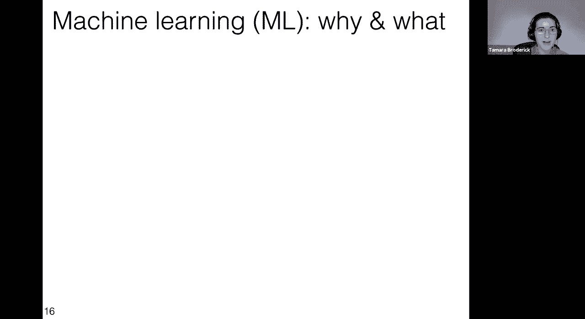

you know we talked about machine，learning is in the news，all the time you know at the time i just。

looked up some of recent articles，um and i found a bunch i'm sure that if。

we just did this exercise again if we，looked in google news we would find。

all kinds of new machine learning，articles um i happen to know there are。

some you know big advances on the，biological side that happened recently。

um there's just all kinds of things in，the news，and so my hope is that。

in taking this class and going over，everything that we've done in this class，news。

to engage with this and also to make the，news yourself，by using machine learning tools you know。

we talked about，in this class what is machine learning，sort of，big idea that it was a set of methods。

for making decisions from data，we said see the rest of the course。

hopefully you have a better sense of，what that means now that we've gone into。

so much more detail than we had in the，first lecture，we've covered so much in some sense in。

this course remember we talked about，classification，with a ton of different models logistic。

regression was one of them but there，were many others，we talked about regression we talked。

about linear regression and again many，other models，for both classification and regression。

we talked about neural network style，models we talked about convolutional，neural nets。

or current neural nets also totally，different models that are also very。

useful like decision trees of random，forests and now，on top of all of that supervised。

learning work we've added in，unsupervised learning we've seen，clustering as an example。

we've gotten a sense that there's a lot，more beyond that beyond just clustering。

we've talked about not just all these，different models and things that we can。

do but also how to learn，within them what kinds of algorithms can。

we use we talked about greedy algorithms，like perceptron way back in the，beginning。

we didn't stop we didn't say you know，hey we'll never touch a greedy algorithm。

again we use them to build trees，um in in some sense we've even done。

k-means clustering now that has a greedy，type flavor，we also talked about gradient descent。

stochastic gradient descent，um we talked about local optima in all。

of these cases being an issue in general，this is a real challenge in optimization。

um and how sometimes we have these nice，convex problems，but sometimes we don't and that's a。

challenge and you know how can we，overcome that we've even talked about，that today but we've also。

talked about that in other contexts，before today you know even beyond all。

this we've also talked about interacting，with the world we've talked about state。

machines markov decision processes，reinforcement learning and we've also。

talked about and i think this is really，important that machine learning isn't，it's。

really a whole pipeline that you need to，be really careful about。

um we've talked about choosing features，we had a lecture on choosing features。

and hopefully emphasizing that it's a，it's pretty non-trivial in practice like。

those pre-processing steps before you，run your algorithm，really really can matter we've talked。

about initializing a lot you know here，we talked about it today but we've also。

talked about it in other，cases in this class um and plotting your，data we've done。

a lot of plotting your data but i want，to call that out as something that is。

really useful for you to do in practice，you can catch so many issues that way。

you can catch uh not only so many issues，beforehand but also after the fact to，try to understand。

what are you getting out from your，output what does it mean what's going on，there it's really worth。

asking you know the tough questions，about what you're doing，we've seen um other aspects of the。

pipeline like，ensembling methods to help you know，predictive performance。

um to to get gains in that way things，that you might want to do that aren't。

purely predictive performance like，interpret what's going on，with your machine learning algorithm。

we've talked about evaluation，uh cross validation is a big example you。

know we talked about cross validation，versus using pure test or validation。

data and even though we spent so much，topics，there's a very real sense in which。

they're all the tip of the iceberg，you know there's so much to machine。

learning that we've covered and there's，so much that we haven't covered there's。

so much else to learn，and i think there are various ways that，you can go about doing that you can。

go and take more machine learning，courses you can go and take courses that。

use machine learning and apply them，to different ideas to different，application areas it's really。

interesting the things that people do in，different application areas。

certain methods tend to be relevant to，different applications and it really。

depends what area you're working on，which which methods you know might be。

particularly relevant to you，but also you can learn so much just by，using these methods。

by you know carefully interrogating them，by plotting what's going on by trying，them out。

you know it's it's not all necessarily，just about taking classes but actually。

getting some real world feel，by working on problems um by getting a。

sense of what happens i mean you really，learn by doing and i think that's just a，great idea。

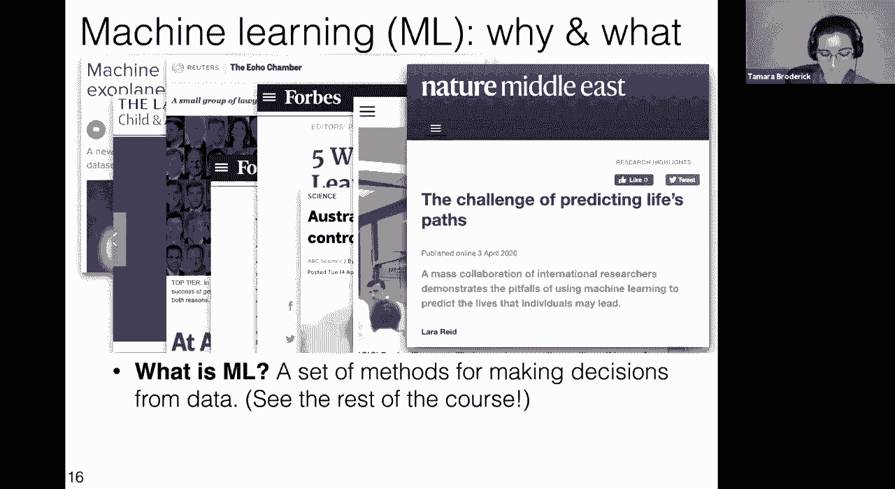

to engage in that kind of thing，so remember we said in the beginning why，study machine learning。

um this is like just the exact same，slide that i had when i started。

um to apply it you know of course that's，going to be a big issue。

is that you want to apply it and you，want to apply it carefully you know i。

think a really important thing that，is，not just what machine learning can do。

but what it can't do what are the，limitations where are the places where。

it might be inappropriate where you，might you know come up against some kind，of barrier。

or maybe machine learning just isn't the，right tool for your problem you know or。

maybe there are things that you have to，do before you can apply machine learning。

successfully and so i hope，that you have a better sense of all of，those things。

but i also think it's really important，to understand machine learning。

for the purposes of understanding it，because again it's influencing so much，of our lives these days。

it's used increasingly in ways that，affect all of our lives，in cyber security and personal finance。

and health and all these different，areas and so it's really important to be。

able to engage in a way that，has a deep understanding of what it can。

and can't do because i think if you，don't have that it's easy to exaggerate。

in both directions to think that it can，be magic that it can do everything。

or to think that it's horrible and，doesn't do anything well and it's evil。

and so you want to have that nuanced，understanding to know when is it doing。

something good and when is it doing，something bad，and to evaluate you know to to。

understand when people have a discourse，about machine learning you know。

what are they talking about what does it，really mean um it is，entirely plausible that some of you。

could be applying this not just in your，regular lives but that it could come up。

maybe in a jury trial or in your own，medical，you know um that you were you're。

interfacing with the medical，up，somehow and you want to be able to。

engage with that and to be able to say，something about it i think that matters。

and hopefully at this point it's much，more clear you know not just because。

we're telling you that because you've，experienced，it yourself that machine learning is not。

magic it's not going to find signal，where you can't find signal it's not，going to。

solve all of your problems but it might，solve some of your problems。

and hopefully you have a sense of how，you can do that also it is very much。

built on math hopefully you've gotten，the taste of the math behind it and i，think you know。

if you're mathematically inclined，there's a lot of really great。

math courses that you can take to get to，a point where you can understand。

even more machine learning and maybe，innovate in different ways yourself。

and machine learning so before we wrap，up on，my part of the lectures i just want to。

give a huge shout out to the amazing，staff in this course，it's just been a huge pleasure working。

with our absolutely fantastic，instructors tas and la's um i think，hopefully all of you have had this。

experience as well they're，they're just so wonderful um and i've，them。

and i want to give a huge shout out to，you i think it's just been。

you know really fantastic working with，you all this semester i've so much，enjoyed。

how much um all of you have participated，in the q a how much you've been very。

engaged and your questions，on discourse um and then your questions。

in general in the class have been just，fantastic i'm so glad that you're asking，them um i i。

hope that you realize that this lecture，and the questions on discourse and all，these things。

there there is no penalty to asking，to asking about anything you know to。

trying questions and trying answers that，maybe aren't just right，um but we learn by doing that and i。

think it's wonderful that you've engaged，in that way，um and then finally i want to plug next。

week we're going to have a guest lecture，by the fantastic，professor david sontag he's one of the。

instructors in this course and he's，going to be talking about。

machine learning for healthcare which i，think is just absolutely fascinating and。

ties into all the things that we've been，talking about and so i i hope that you，will。

be there next week thank you very much。

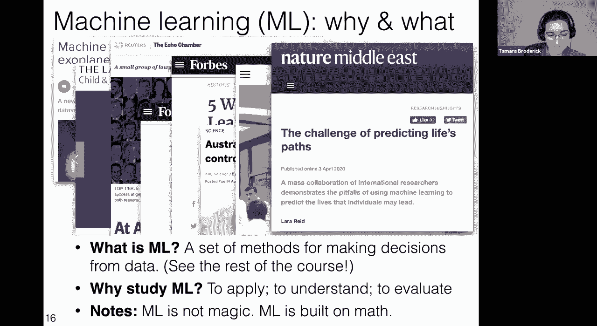