# P14：L14- 客座讲座（David Sontag） - ShowMeAI - BV1y44y187wN

Great okay。So welcome to lecture 14。I am David Sontag。I am one of the faculty instructors for this。

I'll be the one who will be presenting and，in healthcare。As in previous lectures。

 you may ask questions，We highly recommend Discourse because I myself。

at a couple of choice moments when I ask you，the chat at those instances to see what your，Otherwise。

 please ask in Discourse and one，ask me those questions。Before I kick off the actual material for。

of a couple of announcements。First， the subject evaluations are now open，on the course website。

Please complete them by December 14th and，format next semester and given that this is。

is going to be extremely valuable for the，Secondly， we'd like to emphasize that all，the 9th。

That's less than one week from the normal，rules do not allow us to have anything later。

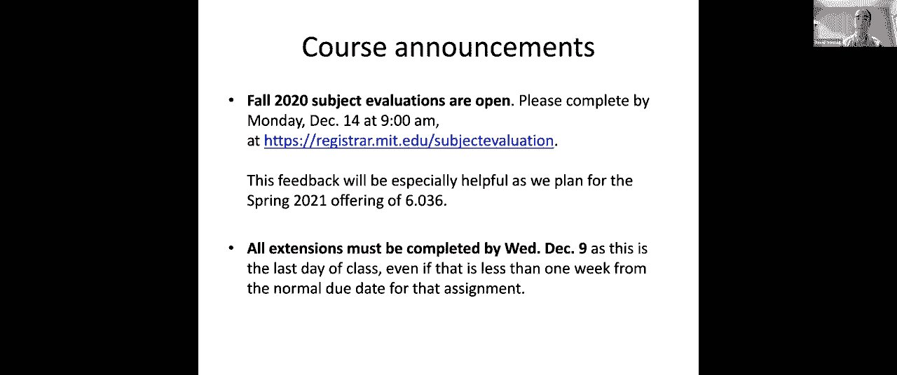

So I'm a computer scientist and over the last，pure machine learning research to machine。

motivated by healthcare。And the reason why it's so exciting to be。

space now is that there's a wealth of digital，That data ranges from unstructured clinical，signs。

 more recently， includes data like proteomics，traditionally think about as health data but。

data like mobile activity information or data，this data is now in digital form means that。

learning algorithms both to learn from the，such as clinical decision support on top of。

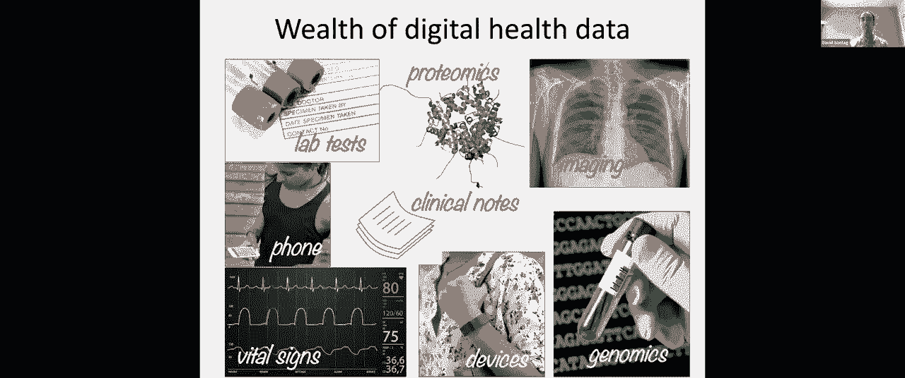

Health data lives in a variety of different，about how we're going to tackle a few different，today：

 where that data might come from。For example， one major source of health data，So for example。

 many of you students go to，MIT Medical has an electronic medical record。

of electronic medical records has increased，over 85% today。That data consists of some of the aspects。

notes and imaging data。Another major source of health data consists。

companies and you can see in this diagram，in healthcare infrastructure (providers， payers。

them data passes back and forth。So for example， your doctor， when they want，patient。

 they send a bill to the health insurance，So for example， if you're a MIT student， your。

Cross Blue Shield if you're covered by the，your parent's plan is。

Now that bill actually has a lot of valuable，that visit。So for example， here I'm showing a concrete。

that。I'm trying to see how I can get my mouse to，I need to change the settings。One moment。

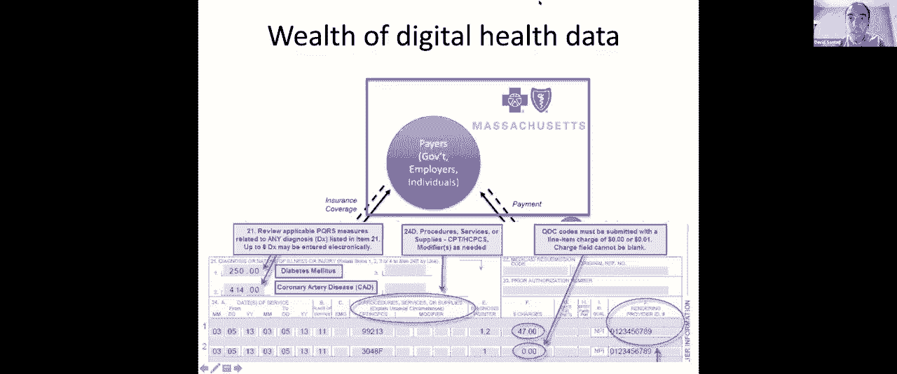

[TA]： You can click on the pencil icon in，It's the gray icon。[DS]： Thank you。

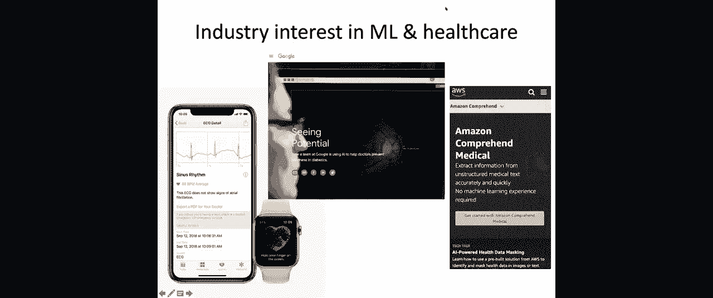

Can folks see my mouse now？[TA]： Yes we can see your mouse。If you use the laser pointer。

 it's a bright，but the mouse is fine。

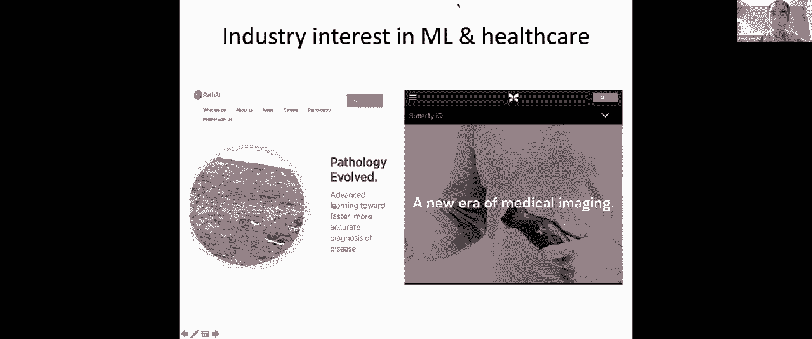

[DS]： I can't find the laser pointer option，Oh I see it now。[TA]： A laser up there， not that one。

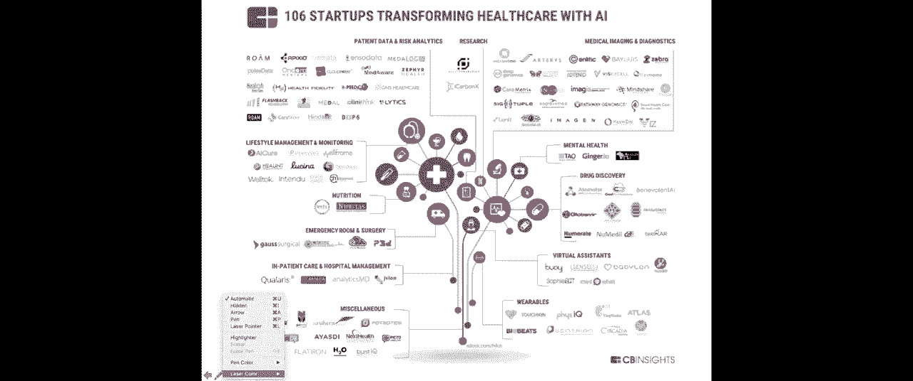

[DS]： Yes， great， thank you very much。

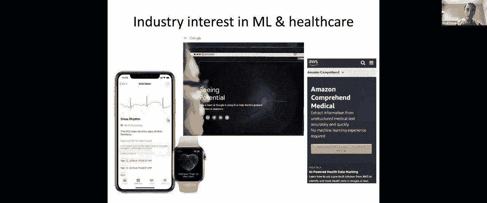

All right so over here， this is an example，your health insurance company to get paid。

You see that there are what are called diagnosis，procedures。For example。

 here there's a code that denotes，condition called coronary artery disease。In addition。

 there are several different lines，were performed。Each procedure has a number associated to。

a cost and on the right hand side here， you。

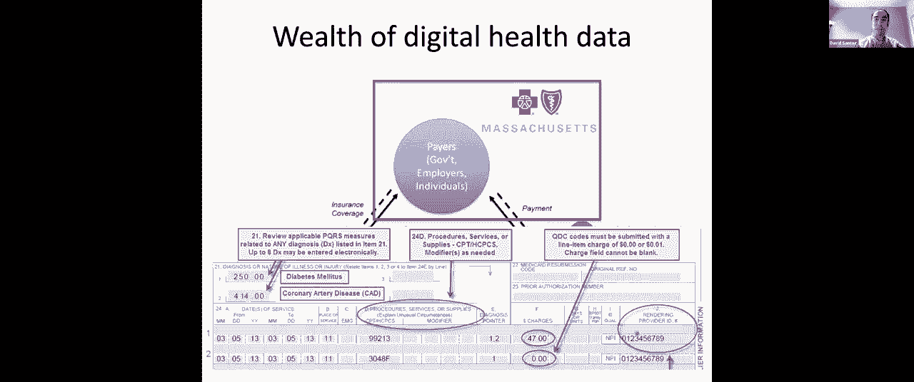

that service。The fact that there's been such a wealth of，note of by industry and we see all of the。

Google， Amazon) all getting involved in the，So for example， Apple recently launched， as。

based product which can read a patient's EKG。So it's measuring a patient's heart through。

of heart conditions。Google has launched a number of products that，So for example。

 they have one which can help，caused by diabetes and which goes undiagnosed。

sufficient number of doctors who can read，Amazon has released products on their cloud。

upload their clinical notes and it'll perform，top of those clinical notes to help with，you earlier：

 which diagnosis codes to submit，There are also a number of startups working。

So for example， a couple of my favorite startups，or medical imaging by developing devices that。

example， nurses instead of trained technicians)，this is going to be very impactful for starting。

and closer to patients and furthermore， so，places in the world where there simply aren't。

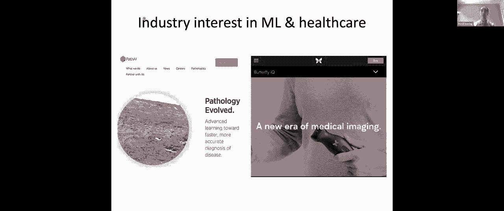

And these startups are ranging from a number，fields that I mentioned but also areas like。

between patients and providers and improving，So in today's lecture， I'm going to be doing。

going to dive into a few of these application，the lens of the material that you learned。

I'll start out with an example of supervised，Then， and that'll be the vast majority of。

unsupervised learning， in particular k-means，and I'll show how one can use that to discover。

was one of the optional questions in the lab，Finally， I'll give an example of reinforcement。

use that to better manage patients with septic，with a couple of comments about what makes。

areas of machine learning and also some suggestions，learn about machine learning here at MIT。

So let's start with the following scenario：we have been getting very close to having。

coronavirus and over the next couple of months，get our population vaccinated。

But in the first couple of months， there won't，and so a number of ongoing efforts are trying。

vaccinate。Questions about： should one vaccinate first，Frontline workers？Elderly？And so on。

And I'm not going to focus on the question，us to be thinking about： once that decision，that goal？

So in particular， let's think about an elderly，Almost all of the current guidelines are going。

65 very soon。In the next couple of months， they will be，But not all of them will know or prioritize。

fact that they're eligible to get it。So we can imagine that the government might。

a team of call workers that are going to be，who are most at risk of having complications。

to try to get them to a local clinic where，You could also imagine having nurses sent。

in some cases but one of the major challenges。Give me one moment。

One of the main major challenges in doing，one might only have funding in order to， for。

individuals homes or facilities and that leads，one prioritize those resources？So for example。

 one question， one way of trying，be able to provide some light is that we could。

likely to have poor outcomes were they to，Now it's very difficult to try to think through。

outcomes from a machine learning perspective，who actually was infected。However。

 we do have very good data on who，of this question in order to try to tackle。

who has poor outcomes of those infected but，a small fraction of them end up having poor。

outcomes such as admission to intensive care，And this， one can start to try to tackle with。

records of who's been hospitalized and who，hospitalized。

So this question has been studied by a number，recent work from New York City， from Korea，such as。

 of patients who've been hospitalized，or factors that patients present with when。

And a number of different factors were surfaced。For example， older age， and that's one of。

65 are being prioritized， past conditions，pressure， obesity， diabetes， and so on。

So one approach that one might take is we're，try to predict these poor outcomes from electronic。

based on those predictions。But the challenge with using that approach。

siloed and so such a machine learning algorithm，single institution which is going to be very。

rolled out in a short period of time and so，one of the most important machine learning。

do you have available and how can you make，might be very imperfect？

And so what I'm going to do is I'm going to，we think through what data to use， how we。

the result or try to tackle this problem。So I'm going to propose that what we should。

at a national scale。In particular， health insurance claims。

Remember I told you that providers have to，in order to get paid and I'll show you an。

Well the biggest health insurer in the United，relevant to elderly individuals) is the Center。

has data on most individuals， most Americans，Whether you're poor， whether you're rich。

are covered by Medicare once they reach a，how one could very quickly both train and。

stratify at a national scale that data is，So here's the hypothetical study design which。

Let's take all data from patients hospitalized，States， data that's available from Center。

We're going to extract features from the data，to predict whether our patients have poor。

In particular， we'll design a binary classification，the individual is admitted to the intensive。

and 0 if they are discharged alive without，care unit。And again， as an important disclaimer， I have。

This is just a thought exercise for us thinking，problem today using machine learning。

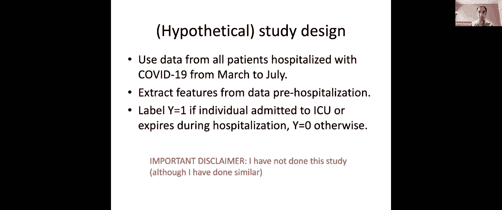

So let's now start thinking about how one，set。Now I just said that the labels are going。

we're going to be focusing on just patients，That should say 19 not 10。

Well we could go back in time to pre-hospitalization，be available to the health insurance company。

In particular， as I mentioned， every single，some records to it。

So if the patient has gone to their primary，noted as a diagnosis code， we will have a。

If the patient goes to CVS pharmacy and fills，will have a record of that。

If the patient has a telemedicine visit with，of that。So the first question that I want us to be。

time series data and try to construct a feature，And notably， you can see here that some of。

earlier work in， for example， using electronic，We mentioned how hypertension is a factor。

and we see that hypertension which is high，visits so that's something that we might be。

But if you dig deeper into the literature，having hypertension which is predictive。In fact。

 it's having complicated or uncontrolled，well managed for their hypertension。

If their blood pressure is high despite the，not taking the right medications， those are。

you have that information here。So you have records of whether medical patients。

often they're seeing physicians， and although，the patient's hypertension is being controlled。

try to pull that out of this data via a algorithm，dimensional data such as a machine learning。

So to dig a little bit more into the data，I'm showing you is a patient timeline and。

a data element is observed in the data for，So I told you that we have medical claims，codes。

Diagnosis codes are encoded in an ontology，the top-level hierarchy denotes， for example。

There are another set of codes corresponding，corresponding to endocrine disorders like。

to mental health issues and if you dive deep，extremely detailed： we're getting really rich。

diagnosis of patients。For example， there's even a diagnosis code，by a sea lion”， “struck by a macaw”。

These are some of the more rare codes but，data that could be encoded in these health。

We also know for every visit what specialist，doctor？Was it an endocrinologist？A dermatologist？

And we know where the visit was。Now I talked about data being derived from。

have records of a code for the specific medication，code)。

If you take a medication off of your medication，that NDC code listed in the box and so every。

us to think about how to construct features，medical record。

We know the number of days supplied and we。

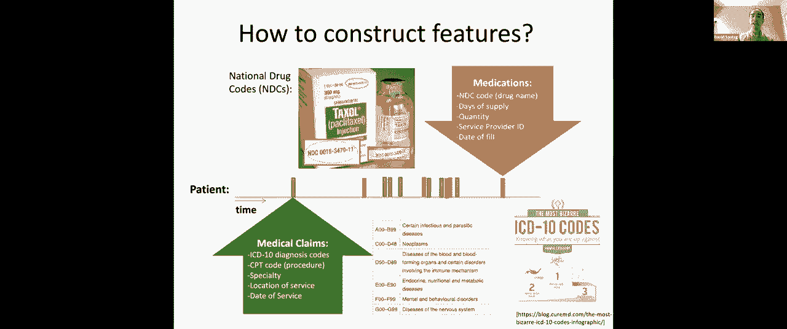

So a traditional approach to feature construction，work using electronic medical records had。

You might take the patient's age， their gender，that I showed you whether the patient has。

of hypertensive codes， looking at medications，if any of this set of codes or any of the。

has hypertension， yes or no， 1 or 0。You could do the same for other conditions。

a feature vector of 20 or 30 or 40 different，conjectured to be predictive of patients having。

So this would be a traditional approach to，challenges with these types of traditional。

consuming to create。So that notion of coming up with the list。

whether a patient actually has hypertension，to look at”， “what is the set of medications。

That takes a lot of time from a data scientist，The second challenge with these more traditional。

subtle detail around the patient's condition。So I spoke about how it's not just whether。

pressure that's predictive， but whether it's，something which is really， really hard to。

There's simply no good characterization that，So the approach that we're going to take in。

more of a black box machine learning approach。And although this is a hypothetical example。

approaches on exactly the same sort of data，and so I know that this type of approach works。

So the analogy that we're going to be drawing，the course so far when we've talked about，We said。

 “how would we take a text document，learn a classifier to label an email as spam。

And we said that a very simple approach to，for every word in the vocabulary with an indicator。

us “did that word appear in the email or，Now for this type of data， I'm going to recommend。

from the patient's longitudinal health records：just from some basic demographics like the。

Then we're going to look at a number of other，coverage and I'll come back to why that’s。

Those two are are sort of the more standard，to now are what I'll call as the bag of words。

So for example， we'll create one feature for，So， have they been to a primary care doctor？

Have they been to an urgent care clinic？Have they been to a hospital？

Have they been to a regular doctor's office？And for each of these service place categories。

indicator for “has the patient been to that，One or zero。Now we'll do the same thing for these other。

For example， of all of the medications， we，We're going to create a single binary feature，Yes or no。

We’re then going to look at all possible，or let's say the top 1，000 most common procedures。

performed for the patient？”，Yes or no。And we'll do the same for the diagnosis codes，say top 10。

000 ICD-10 diagnosis codes， and，been recorded for a patient？”，Yes or no。

Now you might be wondering whether the code，of the story。For example。

 whether you fill this medication，from whether you fill the medication three。

to bring in the temporal information here，this whole procedure I just mentioned， now。

So we will create one set of features by performing，patients past medical history。

We'll then repeat the process now restricted，repeat the process using data from just the。

We will then concatenate each of those feature，of features that we'll use to predict the。

Overall we might have tens or hundreds of，need a machine learning approach that can。

dimensional setting and can prevent us from，I'll just pause briefly to see if we have，[TA]：

 I'm done so far yeah。[DS]： And I saw a comment about disabling，[TA]： I think that's for you。

So if you go to view options on the top， you，screen just get rid of the annotate option。[DS]： Great。

Okay hopefully that's done。[TA]： I can still see the option to annotate，[DS]：

 On the bottom or the top because I don't，[TA]： On the top。

It should say like you're sharing your screen，and then if you click down it should just，[DS]：

 Hide names of annotators。Did that work？[TA]： I don't think so。

I think you're okay without that option。Okay。

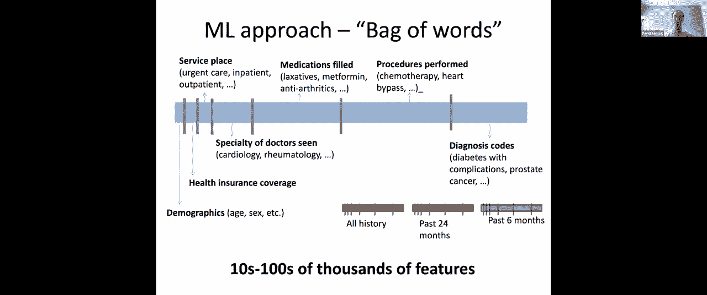

[DS]： Okay so the technique that we're going，already seen in a recent laboratory where。

different scenarios of machine learning and，that lab was doing logistic regression with。

So I'll briefly walk you through what I mean，So as Tamara presented in the lecture on logistic。

by the following objective function： we're，function is going to be a negative log likelihood。

We're going to use as our predictor， which，having a poor outcome from COVID-19， we're。

by a weight vector theta。That linear model is going to feed into a，of 1。

 which is going to be a number between，using that probability of the true label。

when hospitalized with COVID-19 or not， and，i-th patient。

So that is the unregularized logistic regression，is that one way to try to prevent ourselves。

where we add on to the objective function，factor theta。And just to remind you， by the squared norm。

dimensions of the weight vector of that weight，Instead of that L2 regularization， what we。

and L1 regularization has the property that，and the reason why that makes a lot of sense。

number of high-dimensional features is because，the feature vector， most of the features are。

that they're only going to be a small number，this poor outcome。

So by encouraging the learning algorithm to，prior knowledge we have that the hypothesis。

is one of sparse weight vectors and as a result，from overfitting to the large weight vector。

data points。So this L1 regularization， if we look on the，the features of the absolute value of the。

this absolute value to the theta squared term，We can then use one of a number of different。

of stochastic gradient descent， in order to，Now intuitively， the reason why using this。

is because when you're minimizing that objective，in the objective function over here， this，function：

 it's a convex function when we're，could think about what are the solutions that，weight vector to。

 for example， have any constant，value according to the L1 norm。Intuitively。

 you could think about trading，If you were to trade off this value being。

do that enable you to find in terms of the，So on the squared norms case， the picture，two weights。

 theta_1 and theta_2， would be，were equal to 10， then the weights would have，On the other hand。

 if the L1 norm were equal，along this diamond shape。So again， this first axis we'll call theta_1。

Now if you look at the left hand side， the，that lives along the circle is sort of this，side。

 the solution which minimizes this objective，at this corner point and that's one of the。

tends to result in sparse weight vectors as，Now once one has learned the model， the next。

at the model and trying to introspect： does，And the reason why this is so important is。

problem appropriately。Often we will find by inspecting the weight，For example。

 we might we might easily detect，that some weight which really doesn't make。

of introspection by looking at what features，in the setting where you use a L1 regularization。

are many fewer weights than features that，at all of them。Now the second thing which is important in。

results for solving the original problem that，outreach to patients who are eligible for。

We want to figure out who we should be contacting，them to their local clinic。We need to understand。

 well， as a function，outreach to， how many of them might actually，made by this algorithm？

And to character that， we use what's known，You'll see this often in the machine learning。

Now the roc curve takes your predictive model。Remember， here we use logistic regression。

to look at if we were to threshold that probability，positive and false positive rates are achievable。

Here I'm showing you just two hypothetical，For example， a model which is trained using。

showed you originally and then the second，going to include this bag of words feature。

So the roc curve will plot， for every possible，see， okay， if we were to make those predictions。

So let's say if we put a threshold at 0。5，than 0。5， we're going to predict to be 1。

we're going to be going to predict to be 0，of the ones who were truly 1， what fraction，be 1。

 what fraction of them truly went on，That's what's known as the true positive rate，to be 0。

 what fraction of them went on to，rate， and that gives you one point along this，from 0。5 to 0。6。

 you get another point along，Now one could try to summarize how good one。

these two different curves and one statistic，one curve versus another is the area under。

literature as the area under the ROC curve，So for example， a random predictor would be。

have an AUC of 0。5 whereas this one that I'm，to， let's say， 0。7。

Now a different way of interpreting the area，this for you here， is that it's the probability。

who had a label of 1 and one who had a label，who have a label of 1 and patient who has，correctly？

Does the patient who has a label of one， is，of your logistic regression higher than the。

has a label of 0？”，If you look at the fraction of times that。

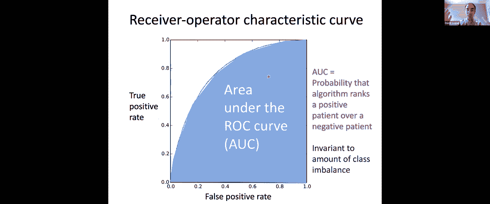

be the area under the ROC curve。And where you want to be is up here in the。

So you would like to have zero false positives，an area under the ROC curve of 1。

Now you can see that a random model has an，model has an area under the ROC curve of 1。

Now if we think about the actual application，going to have resources to reach out to a，Sorry。

 we may not have resources to reach，might not be budget for that。Instead。

 we might only have resources to do，million or 1 million individuals， and so we。

hand side of the curve， we care about what's，and there's a different statistic which is。

it's known as the positive predicted value。So the positive predictive value is a measure。

so we're now going to take the model that，data from December 2020， and we're going to。

who is most likely to have poor outcomes，we have money to perform outreach to a certain。

them get vaccinated。”，For example， we might have enough， we might，might be able to reach out to 1。

000 individuals，And so what's relevant is， of those 100 individuals。

fraction of them actually went on to have，COVID-19？And that's what the positive predictive value。

of a predicted set that actually have the，of course， to be as high as possible。

When you then go to a decision maker (for，for more budget)， you might describe your，some sense。

 of how many more people you will。

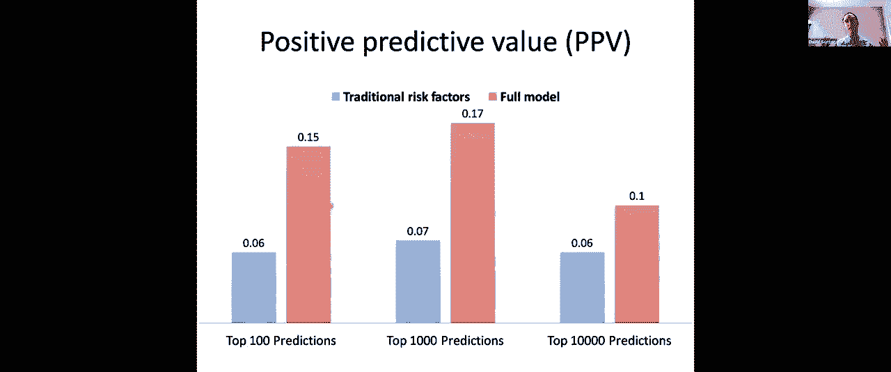

this much more budget。Now I've given you a very hypothetical example。

there are number of subtleties to how one，and the real world really is messy and imperfect。

So for example， I'd like to hear from your，July be useful in December？Has anything changed？

So if you could take out your chat and send，thoughts about whether there are any concerns。

data from March to July to learn who is likely，and then taking that model and deploying it，now。

Where might using that approach go wrong？I'd like to hear some responses。

You can send me private chats too and I'll，couple but I'll wait for a few more responses。

I'm getting some really interesting responses。I'll wait one more minute to see what else，All right。

 so some of the responses we heard，of all， the state of the world might be different。

If you apply the model in December， for example，might look different。For example。

 patients visits to doctors might，the summer。Also very importantly， the COVID-19 strain。

there may have been mutations and so， as a，people might be at highest risk of having。

Another very important problem，as well that have been discovered from July。

who is likely to have poor outcomes。So I'll just mention a couple of these here。

all really good points。So these are things that we're going to have，an algorithm。So for example。

 you might think that the data，let's say， weather changes。So we might say， “okay， well one way to。

data up until， let's say， March 2019。”，So we're going to take only the patient's。

even if that prediction we're making in January，I meant to say up to 2020 instead of 2019。

And so there you might be using less information，recent data from patients)， but the upside。

of features that don't change much as we go，Now the second problem that you mentioned，and that is。

 of course， also a big problem，take the model that was trained using data。

it doing at various points in the future。For example， you could look at what is the，model。

 that same model， and you apply it to，December， and you can look to see， well， despite，time。

 is the relative ranking among patients，So if the area under the ROC curve is relatively。

patients' risks go down。It could be that the overall probability of，to the treatments。

 but so long as the relative，model might still be useful。

But that's an example of a sanity check that，into the model can also help with that。

Okay so that's all I want to say about that，about clustering and a use of unsupervised。

So recall back to lecture 13， last lecture，She gave this example where there are two。

there are a number of data points， n data，there are no labels： our goal is to discover。

The first step of the k-means algorithm was，Here we chose 1， 2， 3， 4， 5 different means。

Then the second step of the k-means algorithm，mean and so that's what you're seeing here。

We're then going to average the data points，mean for that cluster and then we're going。

until it converges and you get a final clustering，So what I'm going to present next is an application。

that had been presented to me， actually， originally，that was really interested in studying asthma。

of you might have noticed was the last optional，So the problem is that 5% to 10% of people。

despite using the best therapy that's currently，can we better understand asthma and can we。

new treatments for asthma？In this paper published in a medical journal。

targets for drug development in asthma，”，the processes， genetic or environmental， that。

What are markers of disease progression or，And why is it that some patients are less，others？

So we're going to try to answer these questions，clustering algorithm on data from asthmatic。

going to be a new set of clusters which。You don't have to understand this slide， we're。

is just a slide， a picture from this paper，different families of new subtypes of asthma。

through this analysis。So they're going to be three data sets used。

All three are from a non-smoking population，recruited from primary care practices in the。

The second data set is 187 patients who were，patients who potentially have more severe。

by their primary care doctor but by a specialist。And then finally， we're going to have a third。

a randomized control trial comparing two different，That third data set we're not going to use。

We're going to start by using those first，can we discover any interesting structure。

across different asthma conditions。Here's just a very quick analysis of those。

So each column here is describing one of those，Focus on the first two columns。

In the primary care cohort， there were 184，is patients who are managed at an asthma clinic。

There were a little bit more female patients，in the asthma clinic cohort。

The age distributions were relatively similar：care cohort， an average of 43 years old in。

And so this gives us some intuition about，clustering yet。The first thing we're going to do is we're。

184 patients， we’re going to run a k-means。

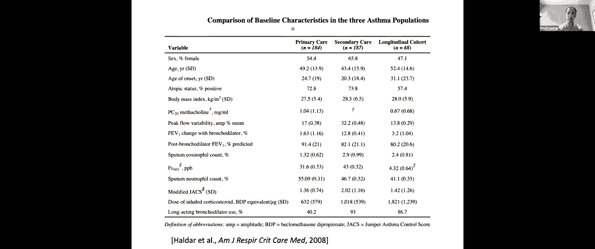

choose the number of clusters， but just believe，So we initialize with k = 3 means， we run。

to analyze the results。Now the first thing we're going to do here。

using a relatively small feature vector。In particular， every row here corresponds，k-means algorithm。

We have the gender of the individual， we have，of asthma， their body mass index， a measure。

this biomarker called FEV_1 change)， how much，typical therapy， how often they were admitted。

severe asthma exasperations they had in the，So each one of those is one of the features。

in the primary care cohort and in this first，of the feature values across the whole entire。

Now the way that we're going to understand，algorithm is by looking at the mu_1， mu_2，means。

 of the three different clusters。We're also going to look at the variation。

the data points assigned to that cluster and，parentheses here。So， we get three clusters out：

 the first cluster，patients， and third cluster has 96 patients。

Let's start to try to analyze these clusters，The first thing that is immediately apparent。

asthma is substantially smaller than in other，In cluster 1， patients tended to develop asthma。

of 15 years compared to clusters 2 in clusters，their 30s。We also notice that in cluster 1， that on。

admission and almost two severe asthma exasperations，to the averages in the whole cohort shown。

And so we're going to call cluster 1， the，onset asthma， and these patients actually。

You can see that by their large number of，These names you see in the very top here are。

by analyzing these means and comparing it，Cluster 2， we see， is overwhelmingly female。

So 81 of individuals in cluster 2 are female，mass index， so this is a bit more of an obese。

And cluster three is generally healthy。These are patients who have asthma but if。

on average they've basically not been to the，asthma exasperations。

So these are three clusters that we found，set and the next thing we're going to do is。

So we're going to take the second data set，care clinics and we're going to repeat that。

initialize means randomly from scratch and，The set of features are very similar but not。

why we don't attempt to， for example， throw，it's because we have a slightly different。

So we run clustering here。For this data set， the authors chose to use。

I'm not going to comment on that but we saw，how there are a number of different methods，as。

 for example， looking at k-means objective，So here， despite the fact that we redid the。

found is that very similar clusters seem to，So when they analyzed these four different。

( what they're labeling as cluster 1， 2， and，clusters that were found in the previous cohort。

they're calling information predominant， which，asthma and that makes sense as well because。

the previous population： these patients are，in asthma and so there tend to be sicker patients。

set of patients。Okay， so now we're starting to see something。

first three clusters were pretty robustly，sets。So that starts to give us some confidence。

but now we're going to try to take that the，clusters are actually meaningful in changing。

different treatment might be for patients，And that's what we're going to start to use。

Now the third data set only has 68 patients。So it's substantially smaller than the first。

we'll do on these patients， we should really，results because of the small number of patients。

two results is going to end up being important。I'll come back to that in a moment。

Now for these 68 patients， these patients，patients received standard clinical care。

a new type of treatment。In particular， what we're going to call the。

involves regular monitoring of the airway，changing the amount of steroid therapy in。

white blood cell count from the patients as，So that's a new treatment strategy and the，works。

Now the original study， the original randomized，found no statistically significant difference。

if you look at outcomes such as hospitalizations，a statistically significant difference across。

one treatment versus the other。However， what you ought to wonder about is：response。Maybe。

 some patients perform， do best， under，do best under that second treatment strategy。

going to re-analyze these results， trying，three different clusters。

So the first thing that was done is taking，and assigning patients to these three different。

definition for what these three different，the clustering done on the first two data。

So we're going to categorize every patient，we're going to look at what happened according。

So what you see here is that along the three，of patients (what the authors called obese，for example。

 severe exaspirations and number，storage which is which is a measure of severity。

So these are patients who were not really，there's no statistically significant difference。

The other two clusters is where the interesting，So in particular， if you look at that third，clusters。

 the inflammation predominant cluster，clinical practice， you see that under the。

typical clinical practice but on the second，practice and you see the exact opposite in。

So if you were to average these two numbers，too much of a difference。

Right if you compare the sum of 9 + 0 to the，look very different。On the other hand now。

 if you break down the，you see that for one of these subpopulations。

does much better than sputum because we want，Sorry I think it's the opposite： we want it，arm。

 does much better for this cohort whereas，does much better as a treatment and so this。

this new treatment strategy， one should approve，for whom it looks like they respond the best。

of how one can use k-means clustering to try，best from treatment。

So now I'm going to move on to the second，reinforcement learning of treatment policies。

So think back now to lecture nine where Tamara，then lecture 10 where she introduced reinforcement。

So Markov processes involved， first， a specification，that she gave in lecture nine， the state space。

This is a farming example and the state space，and so every farm is in one of these two states。Then。

 one has to specify a transition distribution。So according to what action is taken， there's。

staying in the same state， which is denoted，new state。So for example， the transition distribution。

action of planting。Then if you started out in a rich soil state，from the rich soil state。

 with probability，state。On the other hand， if you take the plant action。

extremely high (so probably 0。99 now) of staying，planting you turn a poor soil into a rich。

And one can talk about the transition distribution。

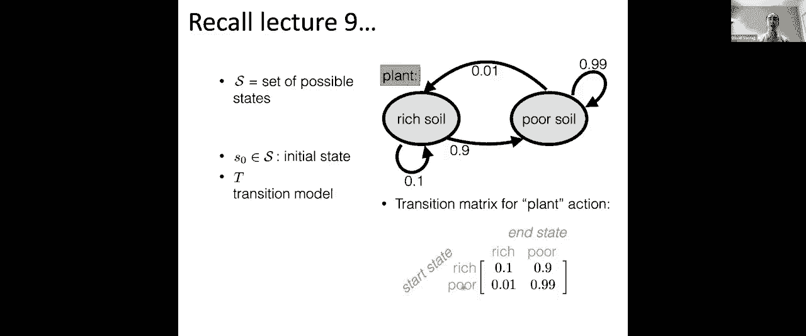

action。So that's the state space， that's the action，We talked about the transition distribution。

The transition distribution is given to you，about the probability of ending up in a new。

number between 0 and 1 for every cross product，Now a Markov decision process also has a reward。

every state that you end up in and every action，up in that state having taken some action？

So for example， in lecture， Tamara hypothesized，taking the plant action of 100 whereas the。

taking the action of plant was 10。She also specified a discount factor but for。

which is used to discount the effect of rewards，In some sense we care about the full set of。

think about the discount factor as just being，So I won't be talking about discount factor。

Okay so this is just a quick reminder of Markov，Now let's think about how we might use Markov。

provide decision support to clinicians as，try to manage patients who have a very critical。

And the goal， what we'll be describing， is，pie which takes a state and proposes an action，setting。

 you think about this as taking data，policies to provide decision support for clinicians。

So if our policies says， “we think that，would be an action would result in the best，to the clinician：

 maybe you should be prescribing，will respond best in the long term to this。

So that's an example of what a policy might。

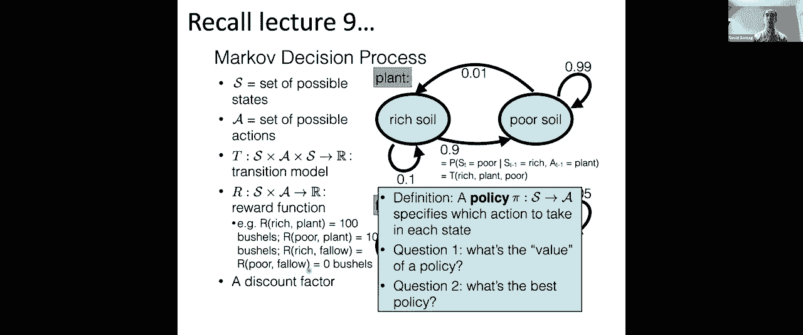

So the case study that I'll be giving to you，as septic shock。Septic shock is a condition。

 it’s the second，caused by infection and that infection the。

the infection but at the same time as the，often \ the immune system also ends up affecting。

That can lead to organ failure and ultimately，sepsis， of course the first thing to do because。

an antibiotic。Then， however， antibiotics alone tend to not。

a number of other things that one has to try，they get into this state。So for example。

 a patient might be put on，their breathing， patients might need sedation。

to the mechanical ventilation which they were，reduced the patient's blood pressure and as。

pressures which is the machine you hook them，their blood pressure and so on。

And so if one thinks about these series of，to optimally manage a patient with sepsis。

across time and for any one patient， you only，So for this patient that I'm showing in the。

ventilation， let's say at time three hours，at， let's say， four hours they received vasopressors。

And had something else happened to them， had，this path of decisions， then they would have，course。

 observe one actual patient trajectory，of actions to them。

Had doctors done a different series of actions，of outcomes。

And one of the challenges in trying to learn，there are a large number of possible actions，data。

I'll get back to that in just a minute。So in order to try to tackle this， the first，the state space。

 the set of actions， and the，part of the lecture I was giving you a hypothetical。

here is a paper that had been published two，I have the reference in the very bottom here。

So for the state vectors， what they did is，in time which looks at both： what are the，(so for example。

 path medications)， looks，what is their current heart rate？What is the current blood pressure？

What's the current oxygen saturation？And so on)。And you get this one high dimensional feature。

point in time。Now， in order to apply the algorithms that，Markov decision processes， we want to get。

authors did is they took that feature vector，the state of the patient at every point in。

different feature vectors from a single patient，So now， one data point might correspond to。

and we're going to do now k means clustering，future vectors and what we would get out are。

now going to define a set of states corresponding，Every patient at their point in time is assigned。

data point went to in k-means clustering and，states that we'll use in defining this Markov。

Now the actions were the actions that I described，So for example： do you put the patient on。

Yes or no。Do you give the patient fluids？If so， what amount of fluids？

So you might imagine three different levels，of these two different types of actions， that。

So one action corresponds to a few of these，I can't remember the exact number of actions，actions。

Each action， again， tells you “start or，plus a level of amount of fluids to give the。

Now for the reward function， one wants to，“how does one characterize healthy？” is，up。

And different choices of reward functions，are learned。So for example， one might just use a very。

at every intermediate state and just looks，in this case， a termination state corresponds。

the hospital or then being discharged and，30 days。Each one of those will correspond to some。

to put a very high negative reward on the，Now one might also be interested in having。

this is one thing that you saw could be very，type of reward shaping and so one example，control。

So we might know that if we keep the patient's，good thing and so if you ever see a patient's。

have a negative reward associated to that。So that's how you define the reward function。

Again the reward function is a function of，Here we're going to ignore the actions when。

So we have the states， we have the actions，need to define a Markov decision process and。

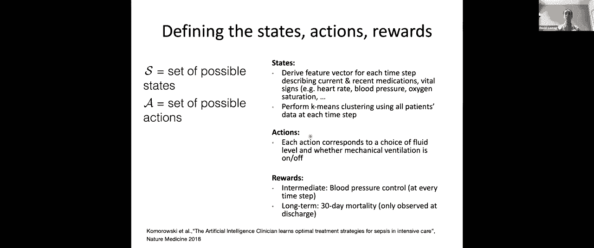

So in lecture 10， Tamara spoke about exploration，is： you start from no data and you start exploring。

what happens， what rewards you get， what states，you get more and more data and you use that。

and better over time。And there's this question of： do you exploit。

have for all future individuals or do you，types of treatments？

And the exploration strategy that we spoke，greedy strategy where， with probability epsilon。

Now do you think that strategy would make，Any concerns with that？

You can enter your response in the chat。Any concerns with using an explore and exploit。

So one concern that I see people are entering，There might be really big ethical issues with。

on and these are all really good points and，in the healthcare setting and that's what。

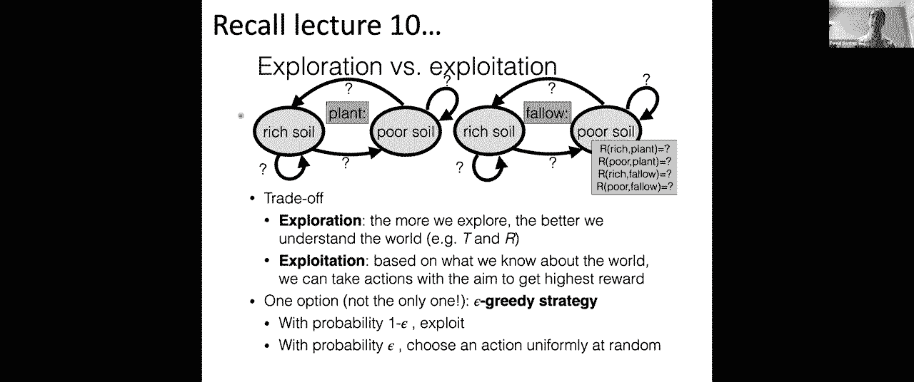

learning techniques that we saw in class in，And so I'll get back to what we do in just。

are a couple of different algorithms that，The first approach was， let's say， just explore。

and then once you've learned your transition，then you just do infinite horizon value iteration。

The second approach that was suggested was。

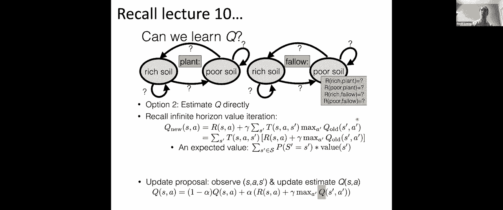

data that one has。So as we just discussed， one can't typically。

what one does is called offline reinforcement，It turns out that the two algorithms I just。

an offline setting where all one has are those，pairs for patients in the retrospective data。

So for example， you could use that retrospective，and then run value iteration or you could，s’。

 and r)， keep presenting them to your，pairs， instead of from doing epsilon greedy。

and you update your Q values based on those，So this is what's known as offline reinforcement。

healthcare context。

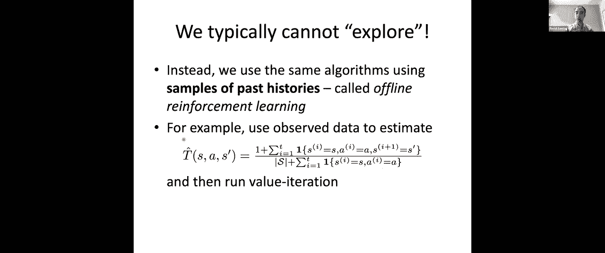

Now recent reinforcement learning successes，which had succeeded at beating the world's。

to be really excited about using reinforcement，the one I just mentioned but it turns out。

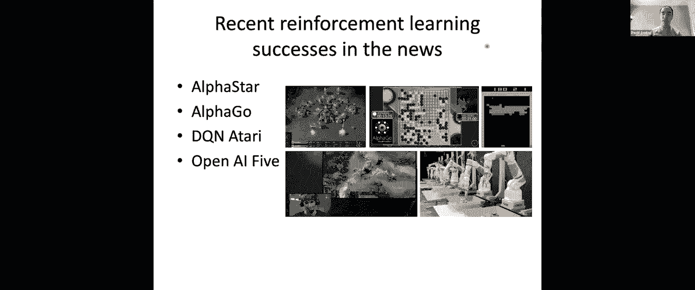

those settings I just described， those game，So for example， one key design choice is：

I showed you one way to try to derive the，based on features like the patient's blood。

if we had accidentally left out important，we get out could be really biased and similarly。

greedy algorithms to learn here， instead one，available， and so thus we might have very。

scenario they had simulators so they could，that policy and see how well it does and so。

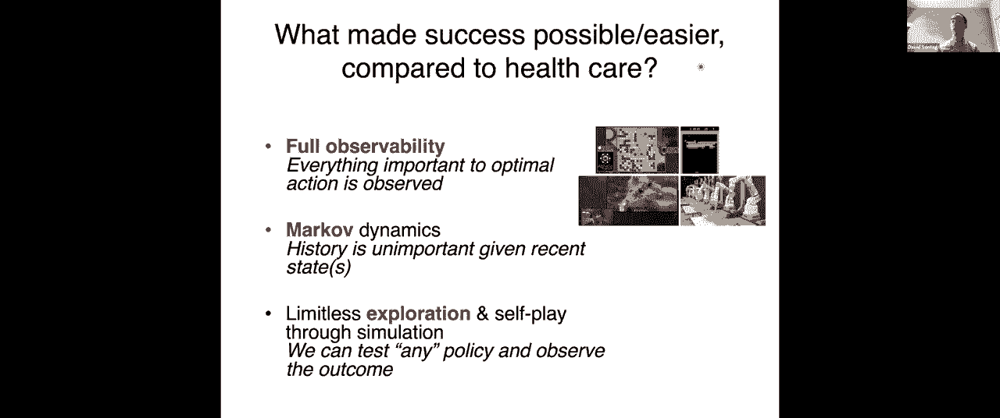

as a result。Okay so I already just gave some hints about。

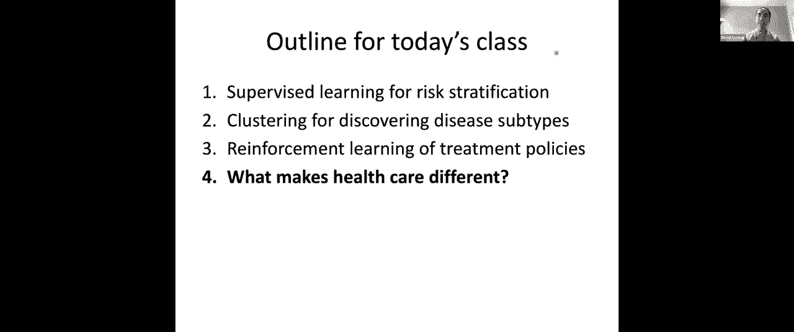

to skip these last few slides and I'm going，Congratulations， this is the end of 6。036！

You've had 13 lectures that walked you through，learning to unsupervised learning with the。

hinted at how we're really just at the tip，We hope that you now have some of the skills。

in an industry position， an internship， and，deeper to learn much more about machine learning。

So in terms of where to go to next， I'd like，consider taking subsequent semesters here。

These first two courses， 6。401 and 6。419，more data science aspects of machine learning。

The next set of four courses， 6。806 up to，level but many of these courses have both。

look at applications of machine learning in，So for example， 6。871 is (of course， I'm teaching。

which goes into much， much more depth on some，and it requires 6。036 as a prerequisite。

Then there are two more courses I'd like to，semester： 6。867 which is the graduate machine。

graduate course in machine learning which，cognitive sciences department。

Both of those courses would be very appropriate，into the algorithms that you learned about。

properties。All right， with that， we're out of time and，this semester and wish you a very good winter。

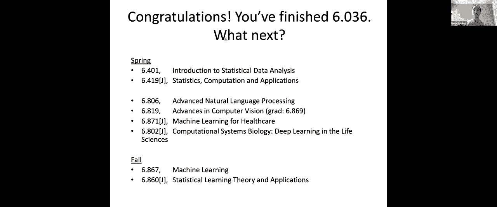