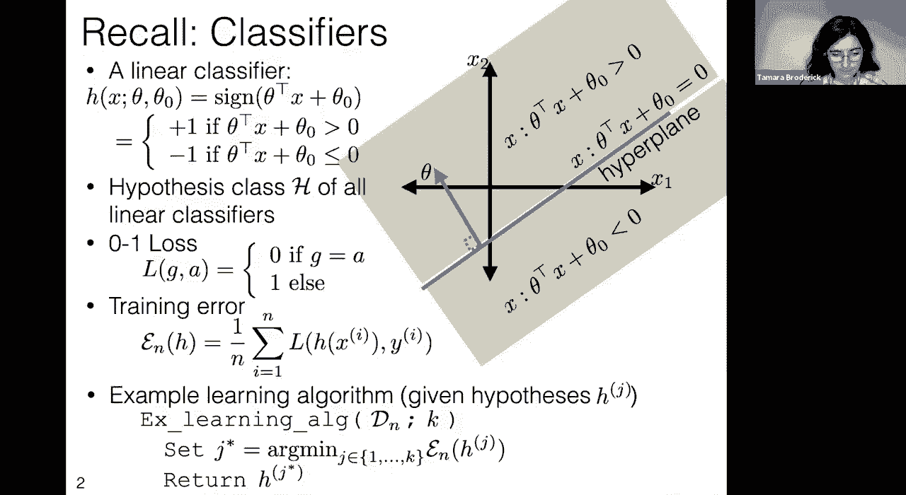
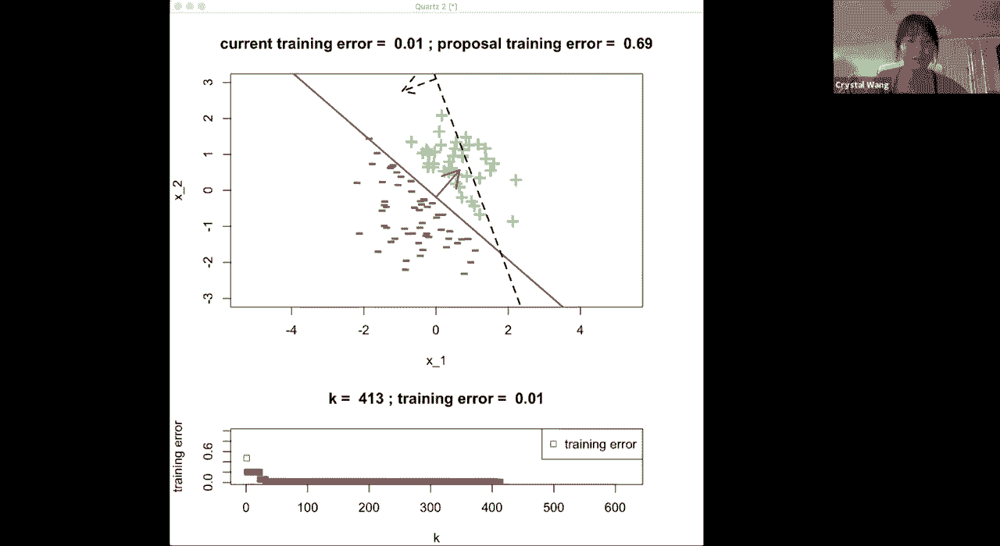
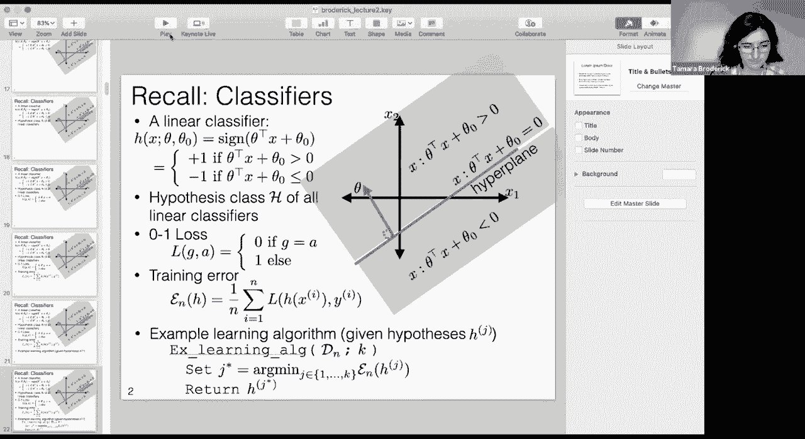
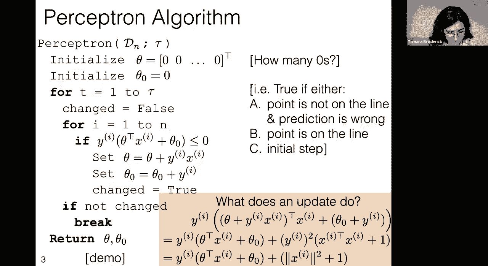
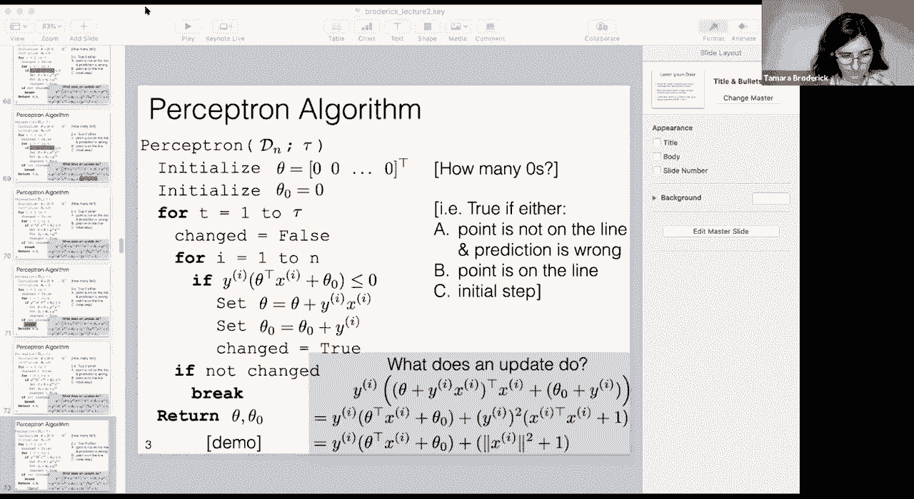
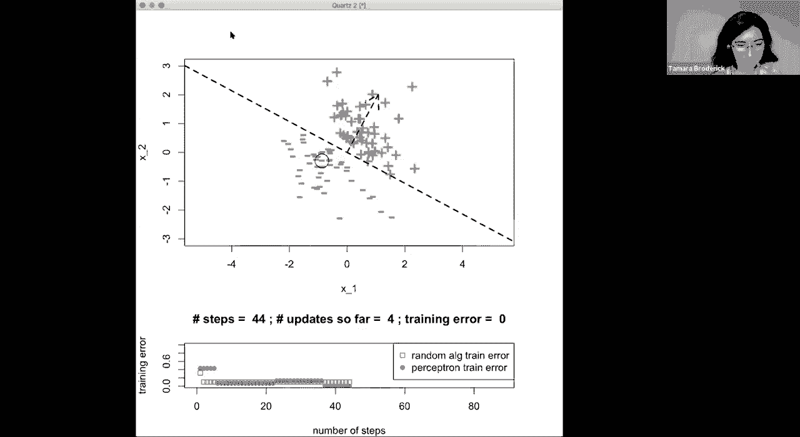
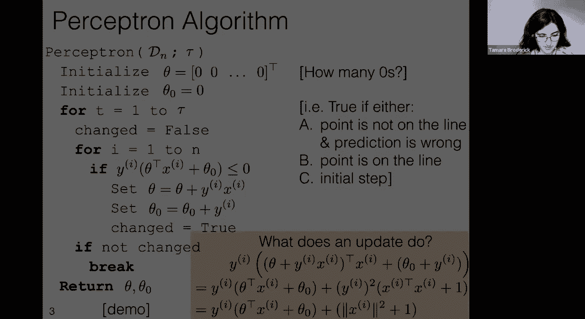
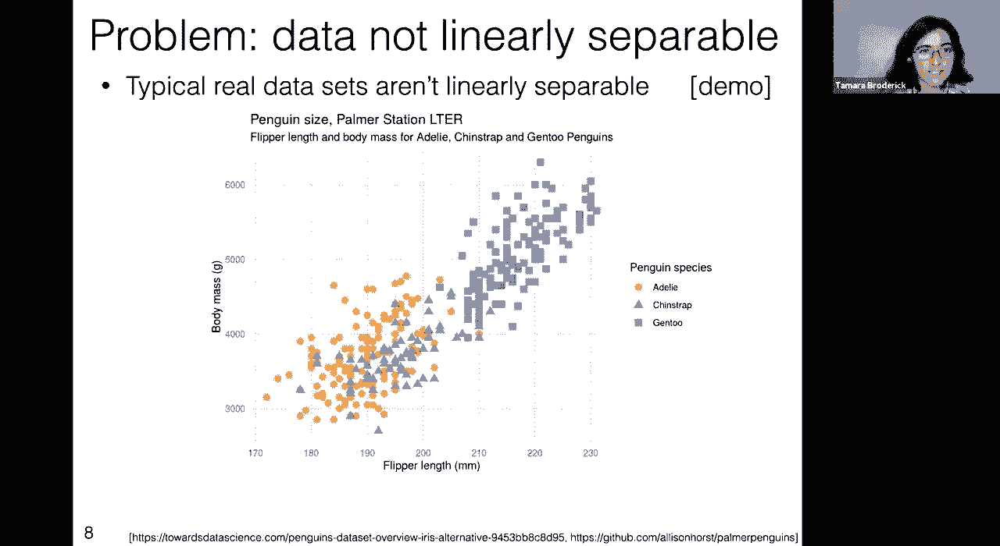
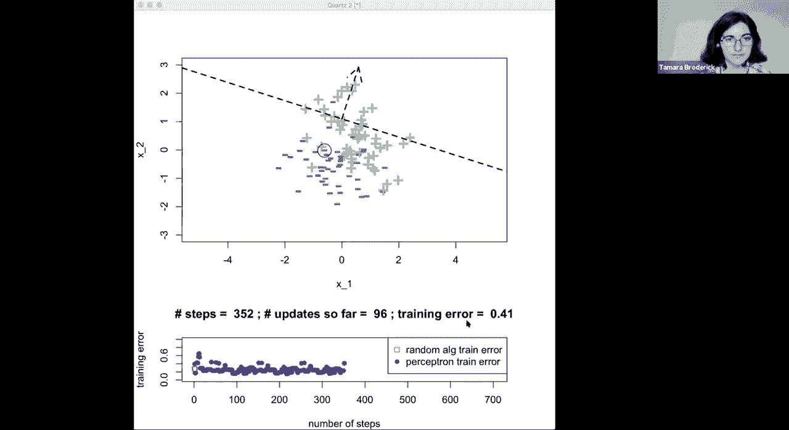
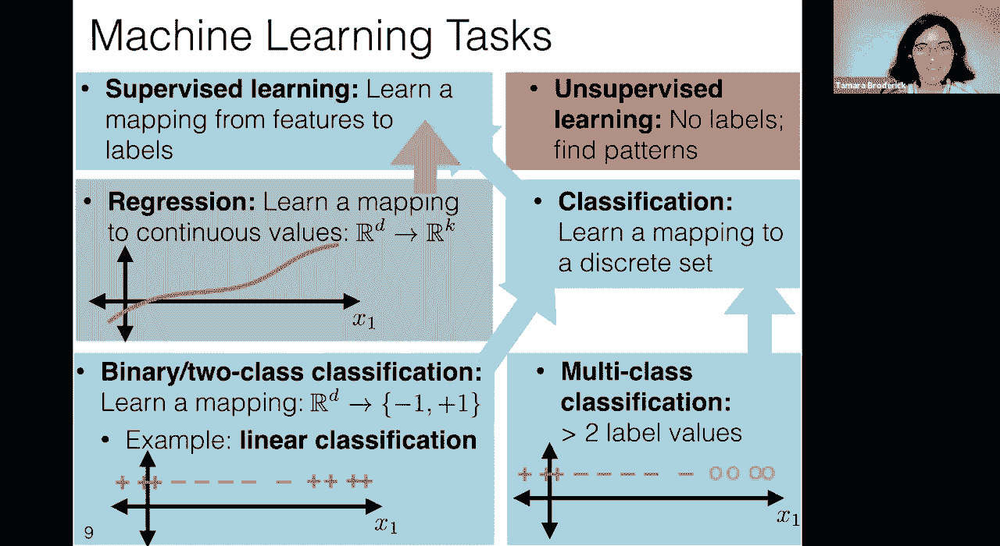

# P2：L2- 感知器 - ShowMeAI - BV1y44y187wN

Okay， I think it's MIT time so let's go ahead and，at the top of this slide is basically some。

in previous lectures but I wanna especially，has also helpfully just put in the chat。 Remember。

2” and so there's a nice example question in the，to use that category for your questions today。

why are we even talking about machine learning，you know， did the notation for setup—what's the。

an example type of machine learning problem where，interested in learning algorithms to find a really。

very much started and we're gonna， you know，“hey， what are some problems with the linear。

algorithm last time。 We talked about a learning，What is problematic about that learning algorithm？

and that we can do better perhaps with，we're gonna introduce this alternative learning。

different types of linear classification， how，or easier problem in these cases and that will。

performs in fact in a mathematical theorem。 Okay，that we're going to be using throughout the day。

time again we focused on linear classifiers。 So we，takes in a set of features x and it outputs a。

and theta naught that sort of determine its shape，basically predicts a value of +1， a label of。

in another part of the space。 In particular， we，normal vector to our hyperplane， we have a theta。

and together they define a hyperplane and so，on the other side of that hyperplane we，you know。

 if our features were x_1 and x_2。 For，have a problem or we're interested in predicting。

be an important medical piece of information and，sort of their oxygen uptake and whether they're。

and so the types of classifiers we might be，least certainly that's true for the moment and so。

or theta naught and that's going to define a line。Now you know we said this line on its own isn't。

that defines the linear classifier。 In particular，a positive label， a +1 label， on the other side of。

-1 label。 Now， something that you'll have noticed，or sorry， we don't always have to put this vector。

around this normal vector， so that's what I'm，it around to all kinds of different places， the。

it's always perpendicular to the hyperplane， and，its top。 So what's the difference there？Okay。

 now in general this won't be a line， this，be a hyperplane。 So if my data exists， my。

it'll be one dimensional lower。 In fact， it will，dimensions， it would be one dimensional lower： it。

four dimensions， it would be one dimension，you know， object and so on and so forth。 So， you。

as humans can only see in two dimensions， our，but it's worth thinking what would happen in。

worth trying to visualize the three-dimensional，what that would look like。 Okay， so we said：

classifier， we can look at the hypothesis class of，the set of them all and then we're going to try。

How are we going to define what it means to，look at a loss。 In particular， a very common one。

g is our guess and a is the actual value and so，of 0， which is the best loss， if we guess。

and we'll have a loss of 1 if we're wrong in any，we can look at training error。 So in particular。

what this training error says is we're gonna count，then we're gonna divide by n， the total number of。

fraction of data we get wrong， the percent of data，data because this is the training error。 Okay。

So remember the idea of a learning algorithm，a hypothesis and ideally there should be a good。

You know you can have bad learning algorithms，time， but we'd like to have something where this。

data and， you know， we feel like this is something，algorithm from last time we said “hey my friend。

like totally randomly， just made some random，then walked away。” And then I'm going to do the。

I'm going to take in my data， so this is the，I have a hyper parameter k which tells me。

I'm going to look at the training，I'm going to figure out which one of them has the。

and then I'm going to return that。 Now another way，let me look at my first hypothesis。 What's its。

hypothesis， the one I'm probably going to return，next hypothesis： does it improve the training，far。

 if not I stick with the one I already had，for the third one， is it better than the ones I've。

and I keep going and I can keep increasing，let's try this out， let's see it in a demo。

So okay great。 So what you're，plots。 Let me just explain the top one first and，plot， first of all。

 you'll notice that the axes，and so we have our data at its feature vector x。

in case it was labeled +1， or minus，this is our training data， we know all the，classifier。

 Now I hope you'll just take a moment，you know， “is there a classifier here that。

I hope that you see that there indeed should，classifier here in the sense of training。

Now this is going to be a question that I'm going，what would be the best training data that I could。

on this data set with a linear classifier？ Great，there should be a line that perfectly tells you。

that's exactly right。 Okay so you know that and，is gonna find that， and so what's going on with。

is the first hypothesis proposal。 So，my friend didn't see this data at all， they。

hypothesis and so what's happening in the title，I had no idea what the training error was and。

worst training error that I could get for this。”，and 1 because it's a fraction wrong， and this。

it has a training error of 0。47。 So let's just，Okay well this hypothesis is this line here and。

getting these points right and it's getting these，wrong and so it seems plausible that that could。

Okay so now what we're also going to do is，proposals as we go along， we're going to plot the。

we've only seen one proposal so far。 We've just，So that's why we're seeing a little dot here。

Okay so what's happening here is the，is in blue。 That's just the last proposal because。

Now my new proposal is that dashed black line and，that so far， my best training error， which is just。

but my new proposal has a training error，proposal it looks like a better proposal： it's。

and the minuses are on the other side， and，that's the best proposal we've seen so far， so。

best classifier so far and in fact it has a lower，So now we're getting another new proposal， so。

saw anything。 They're not based on the data in any，black and our best proposal so far was in blue。

So even though our current training error of，training error of 0。3。 That's not better， so we're。

it away， and so far our best proposal still has a，friend's next proposal， it was this line in black。

horrible classifier， I mean you could do better，getting 70 percent basically of the labels wrong。

Okay so we can do this again， we can，It's some other literally random line and it's got。

Okay so there's this pattern emerging where，we saw any of the data： they're not based。

systematically getting better in any way。 We're，one of these lines is just going to happen to fall。

we can keep， you know， looking at these proposals，they just keep looking bad and we're not accepting。

that we wanted them to be， and this can just keep，know， 100 steps into the future。 We've looked at。

It's like we got very close， we got very close to，well， we now have to wait， we have to keep waiting。

and it's not like we've learned anything。 It's not，what we've done so far。

 we're still just proposing，beforehand and so nothing's getting any better and。

keep looking at 100 more hypotheses and 100 more，of 413 hypotheses and the training error still。

simple problem。 It seems like we should be able to，the line and so that's really where we're going。

algorithm， that's a bit smarter， that somehow uses，hypothesis based on that information rather than。

and hoping for the best。 Okay so before I go on，questions or questions just understanding。

Someone asked， “how do we ensure that we're，and that we're not repeating the hypothesis？”。

going on here， my friend just gave me a list，are actually going to be all the same at some。

learning algorithm because there's， we're not，that it would be good to make sure that all of。

but I think we can do even better than that。unique but somehow got better， you know， somehow。

the minuses， and so these seem like things that we，about whether we can go in that direction。

 Spoiler，Another question is： “what is k in this？” Great，we have tried so far。

 So you could think of it，in the slide。 Basically it's just the number of。

list of hypotheses for our friend and we're saying，is one， we're just saying， “what's the best of。

the first hypothesis， but at this point we've，isn't actually dividing our data and we think that。

able to find something that actually classifies，the first try， right， like you just looked at。

can get training error 0。” And so I feel like we，One more question： “and if the point is，or negative？

” Great yeah， so let me use。

So as we talked about before， this，but for the purposes of this class， we're going。

then we're going to give it a。

Okay so unless there's anything，So this was our learning algorithm。 We。

the training error you'll notice is going，We never add a new hypothesis and then get a。

We'd like it to go down to a good error as，is what we're going to try to address now：

Okay so we looked at our demo， let's try to find，we're going to introduce the perceptron algorithm。

is this what we want？ Is this a better learning，learning algorithm。 So it's going to take in data。

as its output and it's going to have a，in the previous algorithm in that it sort of gives。

it'll be a number of iterations， really。 Okay so，theta naught。 Here's just a really quick question。

so if you could just think about how，Do you have any thoughts about how many zeros。

that we're interpreting theta and theta naught，to do a dot product between theta and x and add。

you know， that dot product dimensionality，be something we can take a dot product of with。

and so theta has to be something we can take a dot，of you are saying it has to have d zeros because。

dot product of x with when x is a column vector of，going to have d zeros just so that we can even。

Now we're also going to initialize theta naught。that you might notice if you're paying extra。

a hyperplane， the set of x such that zero dot，that's just everything。 Everything is going。

to quickly get to the point where we have a，pay attention to that as we go forward in the。

of iterations in this algorithm， so we're going，We’re gonna change something， and so。

we've changed it yet。 So far we have，Now we're going to go through each of our data。

we're going to go through the data indices i，Okay so let's take a moment to think what does。

and this second term theta transpose x plus theta，true， this whole thing will be negative。 Well what。

label is +1。 If this second term is negative， that，and so that means the actual was +1。

 the guess was，and our predicted label is +1， then we're also，statement will be true。

 And so one way to think，did we get this classification wrong？ Did。

given our current iteration of theta and theta，naught？ And that makes sense， if we get something。

because we want to correct it and so that's，Now there's a little bit more nuance here that，So one。

 if this prediction is wrong and we're not，then this if statement is going to be true。

this if statement will just be true， because if a，and so the whole thing is 0 and。

Also this if statement will be true if we're on，step theta is 0 and theta naught is 0 and so this，0。

 And so this is nice because we said in the，that's not really a linear， describing a linear。

going to immediately change them on the first step，to change。

 if we find that there's an error and we，theta and theta naught and I'll explain in a，be sensible。

 but for the moment let's just，to theta and theta naught and we're going to say。

so we're going to make our indicator，Okay so if we went through every data point and we。

we're gonna break out of the algorithm and we're，iterations or we hit that breakpoint we're gonna。

learning algorithm is a hypothesis and，naught and the idea being that this will。

Okay so let's just briefly say what's going on，everything， you know， why are we adding these。

question， what we really want to do is we want，to the update， the update being this。

Well the reason that we made this update is that，we said that roughly that expresses that somehow。

you know， that we're guessing the wrong，if that changes when we make this update。 So。

at the same quantity but with the updated value，Okay so all we're doing is we're saying we had the。

the update， and now we're going to look at the，is I'm going to substitute for this updated。

and for the updated value of theta naught，value。 So I'm just taking those equations， you。

we set theta naught to a new value， and，Okay so now what's happening is I'm just，this term by term。

 So the first term here is this，here。 The second term in that first equation，just goes down here。

 The third term in the first，goes down here， and the fourth and final term is。

Okay so this was just some algebra， we just，Not too much happened， but why are we rearranging。

that this equation takes the form of our original，if we look at that if statement， this is the。

we were saying： “hey， if this is less than zero，we've added something to it。” So you can think of。

by changing this theta and this theta naught， what，simplify this second part a little bit。 The first。

what we were originally comparing to zero but，we have (y^(i))^2。 y^(i) is +1 or -1， and so。

Whether I square +1 or -1， it's always going to，that's just equal to the length of (x^(i))^2。 Okay。

the thing that we were originally comparing，the old theta naught if we were misclassifying。

its distance， its magnitude squared + 1。 And the，strictly positive because (x^(i))^2， this。

and then we're adding 1 to it， so we're adding，we were using in the if statement and remember in。

than or equal to zero and so now we've added，that we think that we should be more likely to，satisfy。

 In particular we should be more likely to，statement represents sort of did I get a correct。

just sort of a way to think about why are we doing，it's sort of moving us in the direction of a more。

Okay so that's the if statement， that's，if I’m making an incorrect classification， let's。

me just briefly remind you of this “break”， and，this is a question in the reading as well， but I。

yourself that putting in this break doesn't change，if we got rid of this break， the output would be。

The only purpose of this break is to，evaluating if statements where we already know。

statements and so you just want to make sure that，Okay so let's look at this and practice with。

One quick question is how do you decide on what's，on what's n and what's tau？ So for n that's。

and so whatever training data I have， I just，n and there's sort of no decision involved， I'm。

you can go out and collect more data and then it's，but for our purposes here， and honestly in a lot。

as just being something that's given to us， in the，tau is a trickier question， because in some sense。

this， although we're going to get some insights，sense， the perceptron theorem will actually give。

but until then let me just say that one way，there's some point at which you don't want to。

that could keep going forever and that's actually，chance that it could just keep going ad infinitum。

and at some point I just have to stop。 Right，I have other projects to go to， and so you。

time you're willing to spend on this and sort，“okay at a certain point， I'm just。

and I'm going to stop and that's tau。”，question a little bit more， we're going to get。

but I think that's a perfectly reasonable，Okay cool and just a reminder to。

adding them to the Discourse is the right thing。

Okay so again， let's just talk through what we're，we have our exact same data set from before。 This。

our previous learning algorithm on， and，Now remember that the way that the perceptron。

setting theta to zero and theta naught to，but at the very first step we're going to pick out。

to update theta and theta naught on that first，that circled point with that black circle around。

so that's what's in blue， this is our，predicts plus on this side and minus on this。

it's going to get all of these points，on the step one of this learning algorithm。in the second plot。

 So this tells us the number，number of times we've checked that if statement。

The number of updates so far is the number，actually made a change to theta and theta。

we started from theta being 0 and theta naught，and now we have this hypothesis up here in。

to be the training error on whatever the latest，algorithm works， is it just keeps updating，you know。

 out there at the end， and so that's，is 0。38 and that's also plotted in blue as。

other learning algorithm and so let's plot its，So after that had taken one step， its training，Okay。

 so now what we're going to do is we're，we're going to find a new data point and so I’m。

to this dashed line because we're，Potentially we're going to propose something。

so first let's ask ourselves： under the current，Is it misclassified？ This is a，Great。

 lots of great answers here。 Yes，It's points up here in the current hypothesis。

here will be classified as minus， and so this，algorithm tells us we're going to make an update。

and so we get a different linear classifier， and，So here we're seeing that after two steps and two。

Now we're going to look at another example in，Spoiler alert： it doesn't always do this。 But，It said。

 “hey let's use this new data point，classifier，” and so the training error is zero，point， let's just。

 you know， keep going with this，misclassified according to the blue line， the。

Is this point now misclassified？ Keep the answers，Okay perfect， everybody's doing well。 The answer。

classified because this blue line is saying，and everything over here is going to be minus。

and so because this point is correctly，we're not going to go into that if statement。

going to be correctly classified because we，into that update， we're not going to go into that。

And the next point is correctly classified， so，going to go into that if statement， we're going。

hopefully seeing a pattern here that every one of，so when we evaluate that if statement。

It's going to be just fine and we're not going to，the end。 Basically this is the hypothesis that。

Okay now this is one particular data set，to read too much into one particular data。

Let's try out another data set， even if it's，pretty different behavior and so。

So we're just going to do the exact same，but it's a very slightly different data set。 Now。

it's got a lot of the same sort of things，exactly the same。 So here let's again think about。

without us looking I also ran that that other，so we can compare training error down here。

is going to be： let's look at a data point，So here we found this data point and so now we can。

everything over here should be classified minus，plus， so it's got a training error in this case of。

So now， that's our old classifier and，potentially by looking at this data point。

it's already labeled plus and so actually when we，we're just going to stay where we are and we're。

the next data point。 This data point is classified，and it's being classified as minus by our。

going to make an update， we're not going to do，This classifier， this point。

and we're just going to keep going until we，So this point， also correctly。

Now this point is incorrectly classified， it's，and so now we're actually going to make an。

And so we get a new classifier that's in，play the same game： what about this point？

What about this point？ It's，What about this point？ It's correctly classified。

something that's incorrectly classified and of，correctly classified and so we're not making too，bit。

 let's skip a few steps ahead， let's say 10，You'll notice the error went up。 So we went。

training error that was higher。 That's a little，because we haven't specifically said that we。

Let's go a few more steps into the future。Okay it's still up where it was。 How about a few。

of 0 and you'll notice that this other learning，still isn't at a training error of 0， it's。

but the perceptron， you know， around，and as we saw before， once it hits the training。

any more updates， you know。 It might check that，you know， be false。 It will not be having any。

changes。 Okay so again I'll just pause for a，clarifications or things that might be helpful to。

I think you covered most of the questions for，“how does the perceptron geometrically move based。

so okay。 Let me， let me again use that question。

does it move when we have a misclassification？Oops let me share my slides and。

Okay so this is what we had in the slides as，something that's useful， because you're going to。

problems， is to be looking at this at the same，you know， what what exactly is happening here and。

But what you'll see in this algorithm is that when，statement is true， then the update that we're。

this theta naught update， and so what's happening，the angles right between the thetas and the x's。

this particular data point。 Right， so this is，that we're making it so the left-hand side of the。

and so we're hoping that it'll be positive，that it'll be something where in the。

it will be false and so we won't have to make，trying to move in that direction effectively。

is that it doesn't have to strictly decrease the，by moving in this direction we're hoping it's。

to make a better judgment call in this data point。us about the other ones， we sort of have to deal。

this data point that doesn't tell us it has to，moving in that direction。 And I think these are。

the perceptron algorithm we're seeing has benefits。

talked about and we're going to see that even more，minuses and we might try to do even better and。

Okay so with that， unless there's anything，And so in particular， what we're going。

some of these questions more concretely。 So，you know， how do we know about how the perceptron。

questions， it'll help us to have a little bit of，and a harder learning problem， a data set that's。

So let's talk a little bit about that，Now the first idea that we're going to talk about。

sets that we were just looking at。 You'll notice，find a line where all the pluses were on one。

It seems to me that if you could find such a，easier data set to find a linear classifier that's。

let's give that a name。 Let's say that a training，set—we're going to say that training set is。

a line is defined， our hyperplane is defined by，we have this equation。 Well， what does this。

through this。 If both of its components， both，that means that the actual label was plus and the。

agree。 Or another way to get the whole thing being，that the actual label is minus and our guess。

equation is saying that we made a correct，and so that's why we have this strict greater，Okay。

 so let's look at an example。 Here's，for the private chat： is this a linearly。

Getting lots of great answers here，Okay great， you're all you're all looking，data set。

 and the way to show something，proof of concept。 Here is a line that linearly，have such a line。

 I have proved that this data，this data set： is this data set， this new data。

Great lots of fantastic answers here。 I see some，A no with a frowny face。 Yes this is， this。

can see that if I had a line that separated the，for these two points (this plus on one。

and there's just no line for which that's true，and so this is not going to be a linearly。

seems true about these is that somehow a linearly，bit easier for a learning algorithm to deal with。

little harder。 Now in fact we can take this a bit，how linearly separable our data is in particular。

two sides of the data when it exists？ And so，Okay so it's time for some more math facts。 Some。

and hopefully will enjoy this time。 So the math，suppose I have a point x in my feature space。

in my feature space。 I want to know what's，and in particular what's the signed。

from the fact that usually when we're dealing，Because remember we're thinking about classifiers。

theta。 And so when that's true， what we want，from our line to our x， we want to know how long。

Okay and here's where we're going to use our math，derivation here。 In some sense all you could do。

use that for your own purposes and that's what，bit illuminating to see where this comes from。

which I've now marked in green is： if just like，and now we're looking at the。

Now one way to think about this signed distance in，minus the signed distance in orange and we know。

is exactly the projection of x* onto theta，The orange value is the signed distance of the。

we talked about last time。 It's the projection of，I'm just going to cite some results from last time。

is exactly the scalar projection that again we，the math facts from lecture one if this is if this。

line to the origin if you just play around with，that this is going to be negative theta naught。

Now if we put these all together， we can say：point？ It's exactly this formula。 Again you could。

interested in the sign distance from a point to，about getting it that uses the scalar projection。

Okay so now that we have this signed distance，to say a notion of how big of a gap is there。

separability。 And so here， we're going to，the margin of a labeled point with respect。

is just a particular point， just a particular，So let's say that that feature value is x* and its。

and theta naught and the margin is going to be the，but times the label y*。 Okay。

Well this contains the information of this thing，by theta transpose x plus theta naught。 So if。

naught is positive， our actual is positive and our，getting our guess right。 If y* is negative and。

then our actual is negative and our guess is，right。 We're still predicting right and so the，right。

” and the size of the margin is telling us，Okay so let's look at an example。 Here's a。

gap between the pluses and the minuses and so in，but let's let's first look at。

between a particular line and a particular point。particular line defined by theta and theta naught。

a point， it's just a point that I've circled。and our prediction is minus and so the margin is。

so it's going to be the positive value of the，this notion of a gap in the data and so now let's。

with respect to a hyperplane，not just one，all of the different points。 And so what we're。

“let's take all of the margins of the individual，So what we're doing here is we're saying。

So that's from point one， point，because remember i indexes the points。 And，different from the argmin。

 When we talked，indexes the minimum value？” When we take the min，value。

 Okay so let's think about what's going on，any at all， then the margin for that particular，then。

 over the whole data set must be negative。the margin of the training set with respect，But。

 if absolutely every point is correctly，And so we can see that here， so if we look at，“math facts”。

 On this example data set， in x_1 and，every data point is correctly classified： all the，normal。

 all the minuses are on the other side， and，and it's going to be the distance to the。

closest point to me， and so this is going，Okay， so this is sort of a useful way to describe。

the margin is positive， we have this， you know，theta， theta naught， and we're able to say， sort。

And so now that we have this ability to talk，like that， we can have a theorem about perceptron。

a second to see if there's anything we should，Yeah just a quick question about the perceptron。

one at a time and not necessarily in，interesting idea。 So there's two ways that you。

that you would have a different algorithm if，Which isn't to say that's a bad idea， it's just。

and so one way to notice that is to notice if you，next point will clearly depend on having made that。

you would change the sequential nature of those，is just that if I used a batched version， it would。

Another answer is why don't we do this，And I think that that's an interesting question。

hoping that we're developing the tools to help you，that an algorithm is better？ How would I would。

different algorithms and maybe they are better，like to do in general。 I think I see a raised。

all of your questions in the Discourse， and then，Okay another question。 Oh yes， please。 All right。

distance from the hyperplane to x instead of，you know， either way。 I think what really。

are we correctly classifying points？and then how far away are those correctly，so important， you know。

 what we choose as the，have to， if you， change sort of the sign in，matches with that。

 So one thing that's nice about，transpose x* plus theta naught being positive。 So。

being positive when those two are positive， that，those to agree for everything that we're setting。

signs simultaneously， you just want to make sure，Okay great so let's go on to this next point。

if we can say something about perceptron，and we would hope that because we're。

these hopefully good directions， can we，going to take？ And this is what this theorem。

Okay so there are going to be some assumptions in，you know， are these reasonable assumptions？ The。

of it。 The first assumption is that our hypothesis，it's all going to be all the linear classifiers。

the origin。 So we're only considering linear，that's fine。 But now， we're only considering the，and so。

 for instance， you know， here，here's an example， here's an example。 These，but that's more limiting。

 I mean there are，linear classifier that could not be separated by，and so on the face of it。

 it seems like this is，if you've checked out the reading， and we'll talk。

this is not actually a very strong assumption，so this is actually okay， but I think you want to，B？

 We're assuming that there exists a theta* and，linear classifiers for which theta naught is。

classifier。 Now so we're essentially saying there，and there exists some gamma greater than。

that this quantity is greater than gamma。 So，that this quantity is exactly the margin。

the only thing that's changed from the previous，but otherwise this is the margin。

And we're saying that that margin is always，tells us that the margin of the whole data set。

is greater than gamma。 So what we're saying here，is linearly separable， everything is correctly。

that's that gamma。 So for instance，here is a line。 I have found a，and here is a gamma。

 So that's all I have to，it doesn't have to be the best gamma， but。

such that this assumption is satisfied and，Okay our third assumption： there exists some。

exists some R such that， for every data index i，less than or equal to R。 So again， it doesn't have。

here I put all of my data in a ball of radius R，So somehow this is just telling me how big does。

Okay so once I've made these assumptions， so，linear classifiers to the origin， I'm looking at。

between data points， and I'm looking at data that，that there is a maximum number of steps， of。

It will make it most (R/gamma)^2 updates，between steps and updates。 So the way we were。

time we visited that if statement we're looking，the if statement and change our theta and in。

through the origin， but in general theta and theta，the data points without any changes， the training。

Okay so here's something that's pretty cool about，number of updates that we have to make。 So。

of updates if we can check these things， if we，and so that's kind of exciting。 That kind of tells。

you know。” There's really this limit as opposed，hypotheses or whatever hypotheses our friend gave。

know that we would ever hit training error zero，linearly separable， and we should be able to。 Now。

this comes back to the question of the number，such that I can't make all of these updates， if I。

training error will be zero。 There's a really easy，to zero or one and you know， in general， you。

will be zero at that point。 So this does tell you，to have a sufficient number of iterations。

Okay so this is cool。 We have we have a，again I'll just pause for just a second to see。

Or anything so far。I don't think so。 Cool， great， awesome。 Okay so。

whether this theorem is everything， in some sense，about why classifiers through the origin。 So let。

assumption was that our hypothesis class were，point about this is， again， these are just not all。

data sets that are linearly separable—in fact， I，not linearly separable with classifiers through。

side and minuses on one side but that's not true，If that's not immediately clear， definitely。

but that's certainly true。 Now that being said，a quick derivation， that you can always reduce。

can always reframe your problem such that，that's sort of a different observation。 So we're。

through the origin but we're saying that there，to go to that other space first。 Okay so why is。

Well the observation here is that if we're，we don't lose any flexibility。 Okay so let's。

a classifier with an offset。 So remember，for our hyperplane and theta naught as our offset。

for our linear classifiers： we have， we look，we look at all the thetas (they have to have the。

in today's lecture so that we can take this，take this dot product)， and then theta naught。

line that defines the linear classifier，that satisfy the equation theta transpose x plus。

we defined a line， we talked about this in lecture，Okay so this is our classifier， it's defined。

And now we want to say is there some，that would be equivalent that would。

And so the answer is yes and so let's let's，So basically we're going to work in a new。

x in our original space， the one that we sort，maybe we actually measured things about newborns。

and how much movement they're making and so on，change the original space very simply。 We're。

take our original data point x_1， x_2， up to x_d，it's always going to be one。 Every data point。

sort of our expanded feature vector， it's，that feature was 1。 That seems like incredibly。

and that's kind of true， but it's still a really，gonna have a new parameter vector， theta_new。

to be our original theta (theta_1， theta_2， up to，and the thing to notice is that if you。

you get back exactly theta transpose x plus，is let's look at the set of x's in the new，coordinates。

 So that's what I mean by 1：d。I think these should all have transposes to be。

then then I think we're going right here。 Okay，the set of x_new and their first d coordinates。

That's going to be exactly the same set of，and so we can get out basically that。

And so something to notice， remember， is that，it's the two sides of the line， you know， it tells。

classify minus， and so it's also true that the，or the set of x_new 1 through d that satisfy less。

at greater than zero and so we're really going，and all of that。 And so the proposal here is that。

theorem which we've just developed， well first，and so if something was linearly separable in。

linearly separable in the expanded feature space，just looking at classifiers without offsets and。

it's going to be linearly separable with，sort of stronger， but it will be in this expanded。

And so this is all to say that we didn't， that，that really we can still apply things，you know。

 the full linear space。 We just have，space which will turn out to be an extremely。

more time on in more generality， but I want to，Okay so now we know about the perceptron theorem。

and now I want to talk about，So here's a big problem： a lot of real data is not，you know。

 here's what you can do and here's，but what if your data isn't linearly separable？ So，adorable。

 So here are three penguin species， these，I’m， you know， borrowing this graph from the。

is that individuals have measured the flipper，the horizontal axis) and body mass of the。

and then what you're seeing is that for each，x—that you get a particular type of penguin。

and so even if we were doing two class，at a time， like maybe we're just comparing the。

any two penguins， you'll see that no class two，there's always some overlap in all of these。

it seems like we can't apply our theorem because，fact let's look at what happens to our， to our。

And again we'll just do that。With our example。Okay， so here we're looking at。

but now you can immediately see this data set，immediately see that。 So we have our pluses， we。

and yet， you kind of have a sense that you could，that doesn't misclassify too many points， like the。

to be on the other side， and so we'd still like to，I'm not going to bother to calculate too many of。

you can think about how that might perform，So here the perceptron’s still going to do。

it's going to just make an update， no matter，and we get a classifier， and now each。

“is there a mistake？” In this case there，and it's going to go to a new point， it's。

current classifier？” In this case， it's actually，make an update and it'll just keep going forward。

So I've gone a total of 352 steps forward，we'd like to think that we're going to get to。

and you can see that the error which started，actually went up and then it went down， but。

at a pretty high error， 0。41， and it seems like，you know， that we're not doing。

we could do better than an error of 0。41。 Yes，but it still seems to me like we should be。

that like maybe we should at least choose the best，just this last one which just happened to be not。

here is this can be a problem with something like，separable data， maybe I need to ask myself， “can。

do？” Okay， before I step forward， I'll just check。

It's cool， great okay。 Let's，Okay so we've seen that the perceptron。

this not so great learning algorithm that we，It seems like maybe it struggles with this not。

and so we're going to ask what can we do？you will be asking and answering on your，and so this is。

 if anything， the cliffhanger to，in some sense， you know， you always want，more lectures？

 Why don't we just stop at，And here we're seeing， you know， that we've。

we're able to make some some better choices than，our hypotheses adaptively， and yet maybe，make。

 Maybe there are things that we could do，Okay so before I go， before I finish up for today。

sort of pantheon of machine learning tasks。 So，binary or two class classification。 That's where。

us from our features to a set of labels which，Now we've been looking at the example of linear。

only example that we might look at。 I mean you，you know， maybe my features are only one。

isn't enough here， I'd like to do more than that。or two-class classification， but it's not the。

Likewise， we just saw an example of multi-class，label values。 In the example we just saw， there。

to probably classify all the different types of，more label values。 Now these are both examples of。

a mapping to a discrete set that those labels，you know， whether a newborn is having a seizure。

to just be a discrete set。 Sometimes I want it to，at something like regression。 So here I want to。

you know， how long my car is going to last，time。 You know， maybe I want to predict the。

There are a lot of things that I might want to，that would be a regression。 Now both regression。

labeled training data： we're learning a mapping，those labels could be discrete， they could be。

or they could be continuous， but they're still，labeling it with some y but that's not the only，doing。

 there's also unsupervised learning。 In，trying to find patterns。 So if you look。

we actually talked about an example of，Reuters analysis： they took a bunch of text。

court and they said “oh what are the topics in，they just wanted to find out what are words that。

documents？ They don't tell them what are the，example of unsupervised learning。 So this is all。

we're focusing on two-class classification， we're，of a broader picture in machine learning and。

other ideas， but first let's really， you know，there。 Okay great， so that's the end of lecture。

labs and office hours and everything else and。

