# P3：L3- 特征 - ShowMeAI - BV1y44y187wN

three，so just a reminder as usual make sure to，put all of your questions up at uh the。

discourse uh we have our lecture three，category there，for today and so you can start that just。

immediately，so recall that in the past couple of，lectures in addition to the labs and。

everything else you've been working on，we've been covering，things like linear classifiers。

understanding what is a linear，classifier，and some algorithms to come up with。

linear classifiers so in particular at，this point we now have，when。

our data was linearly separable there，were super cool things that we could do。

with the perceptron algorithm，in fact we had this theorem that gave us，a bound。

on you know how many mistakes or sort of，how many updates，and we。

found this this sort of perfect linear，separator，and so today now that we have sort of。

some algorithms and the background to be，able to talk about it we're gonna。

put together a sort of more complete，machine learning analysis so we're going，to think about。

starting from the very beginning，gathering data，and going to interpretation and。

evaluation and things like that，and so as part of that we're going to。

talk about choosing good features，uh，discussion so i say more complete rather。

than fully complete um but i think we're，going to be going in the right direction，towards。

you know you really being able to have a，collection of data and。

run your machine learning algorithm on，that data，so we'll we'll talk about all of that。

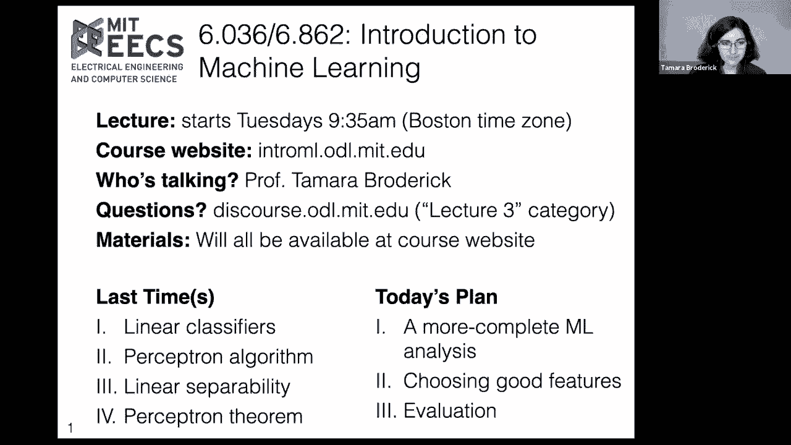

okay so let's let's just briefly recap，so remember as we said we've been。

talking about these linear classifiers，we've been calling them。

h for instance um and so in general we，have uh some features maybe，x1 x2 x3 x4。

remember that we're only drawing things，in two dimensions because of our。

fundamental limitations and vision，as humans uh the reality is our feature，space is definitely。

in general going to be higher than，two-dimensional and we'll even talk，about that。

today but our visualization here is in，two dimensions，um and so in general we've been seeing。

that we find these linear classifiers，they're defined by a theta which is，giving us。

um the normal to the hyperplane，that's that's doing the classification。

it tells us on what side we predict，um minus and on what side we predict a，plus。

um sort of on one side we predict minus，plus one and on one side we predict。

minus one and we have our theta naught，which is our offset，um and again in general this will be a。

hyperplane not just a line，now when we want to ask you know how。

well is this linear classifier doing on，some data we we have to talk about some，kind of loss。

and classification we've been focusing，on the zero one loss although。

again that's not the only loss that you，would use in classification we talked。

about the asymmetric loss，here we're saying that if our guess is，equal to the actual value。

then we get a loss of zero which is the，best and if we're wrong then we get a，loss of one。

and so we talked about how we can look，at training error which tells us sort of，the average loss。

over our training data points as one way，to look at how well our classifier is。

doing and actually it's something we've，been using in our classification，algorithm。

okay so this is sort of you know a bunch，of things that we have in our toolkit at，this point。

and so let's ask ourselves um what would，a machine learning analysis look like at。

this point could you could you run a，machine learning analysis on some data。

well first you kind of have to establish，a goal and find some data and and for。

that matter check that that goal，is in fact something that you could。

accomplish with your machine learning，that，um in a moment we're gonna we're gonna。

have sort of a cartoon，where we consider diagnosing whether，people have heart disease based on some。

available information，about those people um i i will emphasize，this is very much a cartoon。

if you really care about heart disease，then i encourage you to check out like a。

paper about heart disease um there's，actually some some cool data sets out。

there that you can play with，but i still think this will get us a lot，of insight into this process。

okay so once we have some data it will，often be the case as we're going to see。

that you can't just immediately apply，the machine learning algorithms that。

we've established that you have to do，some transformations of that data to put，it into a useful form。

and so we're going to see that process a，lot of that process，today once you've done that。

now you can run that machine learning，algorithm so it could be for instance。

one of the ones that we've talked about，before，we talked about choosing the best。

classifier from some finite list of，classifiers，we've talked about using the perceptron。

now you in your，explorations and homeworks and labs and，such have also encountered the average。

perceptron so you have a lot of machine，learning algorithms，in your toolkit and you're going to have。

there are，you know even even cooler things that we，can do，um but you're going to run some machine。

learning algorithm at this point and，return a classifier，and an important thing that we want to。

do is also interpret and evaluate，what you get out at the end so we'll，well。

and it's also something that you've been，exploring again um in labs and。

and other exercises okay so let's。

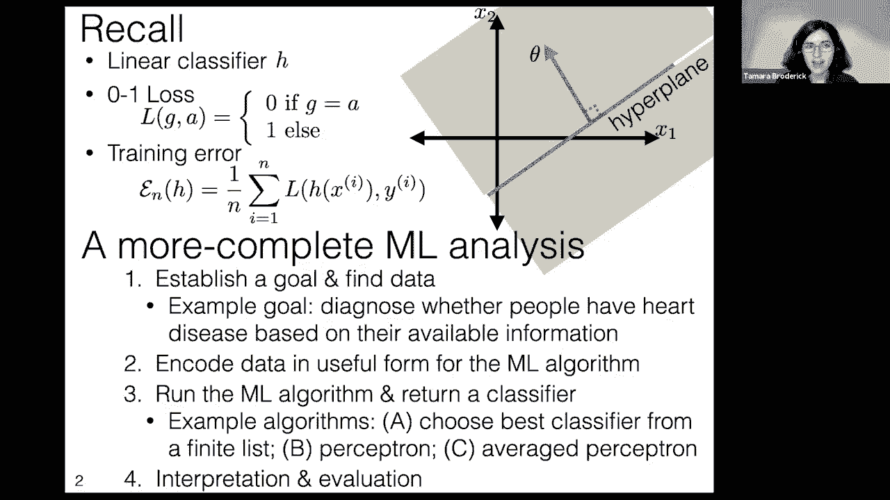

let's launch into this analysis again on，on this example，um that we're going for um with heart。

disease，so in particular we need to start off，with our goal and our data and and it's。

worth noting that these are very，intertwined in some way you know，typically。

you'd want to gather data with some，question in mind，being able to you know answer that。

question um but also gathering data is，very difficult and expensive。

probably that's most of the work that，goes into you know any of these steps。

so you might find that you have some，data that's available to you and you can，ask a question。

of that data so to make this concrete，again we're going to talk about。

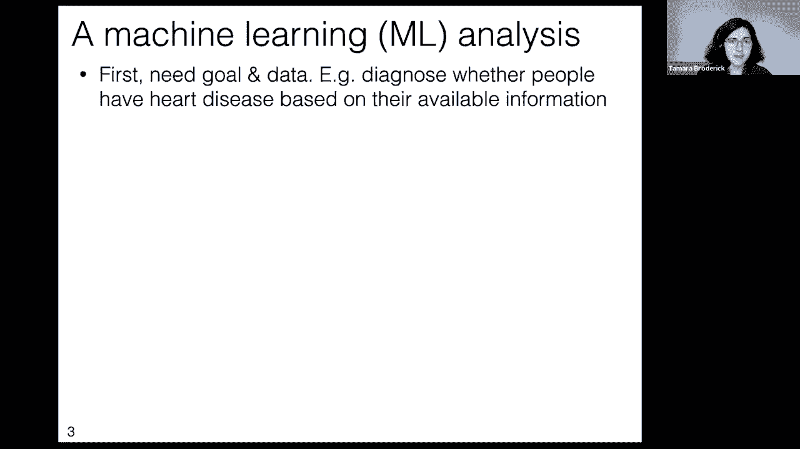

diagnosing，whether people have heart disease based，on some information available about。

those individuals，and you know let's imagine that，thankfully there's actually a bunch of。

data already available to us so somebody，has measured，you know do a bunch of individuals have。

heart disease so here，we're looking at four data about four，individuals but we imagine that our data。

set is actually much，bigger and it's just hard for me to fit。

on a slide so we're going to look at the，first four people，okay and this person has also measured。

or this you know group of people has，measured the，resting heart rate of these individuals。

in beats per minute，they've measured if they've been，experiencing pain in some time period。

maybe the last month，maybe we're looking at individuals who，work at a hospital。

and so we could ask what's their job，within the hospital maybe that has some，bearing on。

this diagnosis we can look at what，medicines they're taking we can look at。

their age maybe just roughly which，decade they're in，um and maybe the income of their entire，family。

not just their own personal income okay，so let's say we've gathered this，information。

and we would like to predict do these，people have heart disease，um and so you know um。

well one we want to check is this，something we could even turn into a。

two-class classification problem right，and so，this seems like something that has two。

labels people have a heart，have heart disease or they do not so，that that sounds good。

um we need labels well we we seem to，have them it seems like somebody has。

labeled this data at least for us，we need features that's going to be。

basically everything except for the，labels here，we need training data basically labeled。

data with features that's what we have，here that's great，and we'd eventually like to apply that。

to new predictions so on the face of it，it looks like this is something that we。

should be able to apply the learning，algorithms that we've developed these。

two class classification learning，algorithms，and now let's ask ourselves can we just。

put this into our learning algorithms，well well not quite yet right so we need，to identify a y。

we need to identify an x and，that x is something we need to be able，to take dot products with。

um and so you'll notice that some of the，entries here are strings。

like they're not even numbers and so we，couldn't possibly，take a dot product yet um and that's。

what our algorithms so far have required，and so let's ask ourselves you know can。

we can we break this down can we put it，into a form that we actually could even，apply。

our learning algorithms okay so，we'll notice again that there's already，this breakdown。

into labels and features but let's make，that explicit，and so that'll be our first order of。

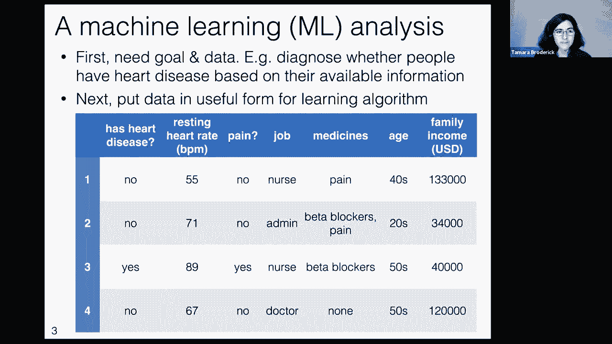

business let's first isolate our labels，and make sure that we can put those into，our algorithm okay。

so we want to encode this data in a，usable form by the algorithms that we，have。

and we've sort of already talked about，this with labels but let's let's just，make this explicit。

we want to identify them and encode them，as real numbers and so in particular the，we've been saying。

we'd like to turn this into plus ones，and minus ones，and so we might say that let's say here。

that yes is going to be plus one，and no is going to be minus one and so，we can turn。

this set of labels now into plus ones，and minus ones，and so in particular here the label for。

our first data point which we've been，calling y1 will be negative one。

in this particular case now a couple of，notes about this，one there's no reason that you。

have to use plus one and minus one in，fact we're gonna see pretty soon some。

algorithms that actually use a different，set of two labels，zero and one the reason that we've。

chosen plus one and minus one so far is，that it's been very convenient it's been。

a really convenient choice of two labels，um but we're gonna see that again that。

can change but for today we're gonna go，we're gonna keep going with plus one and。

minus one because that works for the，algorithms that we have so far。

and two you definitely wanna save this，mapping right so，you have chosen that plus one represents。

yes here and minus one represents no，and so you wanna make sure to save that。

somehow so that when you get out，predictions in the future and you say ah，this person is minus one。

well does that mean no yes so definitely，make sure to to save that mapping so you，can go back。

and find out you know what was the，actual string that that corresponded to。

okay so now we've got our labels we've，got our y's，and so we want to go back and get those，features。

okay so now let's do the same thing but，we're going to identify the features，rather than the labels。

and encode them as real numbers now just，to be explicit here，data。

and typically if we're doing something，like supervised learning which we are in。

this case remember classification is a，form of supervised learning。

in that case we typically exclude the，labels from that so it's a function of。

the data except for the labels um，and i mean that as there is a bunch of。

data that is not the labels and it can，be any function，of what that is in fact it can just be。

the data itself that's a perfectly fine，set of features that would just be the，identity mapping。

from the data to the data but we're，going to look at some other functions，today。

and in particular today what we're going，to do is we're going to start with some。

data let's call it x you could think of，those as our old features sort of the，original features。

in some sense like it's worth noticing，that those were，feature engineered to begin with。

somebody chose what to measure，about these patients somebody chose what。

exactly was going to be in this table，and so it's not like，you know those are pure and perfect in。

every way like those were choices，as well but we're going to make some。

further choices and turn them into new，features let's call them，phi and sometimes in this um。

lecture i'll be sort of just for，convenience not，writing phi as a function of x i'll just。

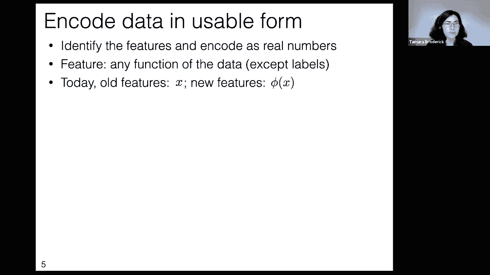

write 5 but it's worth noticing that，we're just getting these new features，from our old features。

okay so let's look at our data and see，why why are we even bothering to do this。

why don't we just keep our data，exactly as it is okay and one thing i。

just want to note before we go on，is that i'm slightly changing the。

direction of what we're looking at so，typically we've been thinking of。

each data point as a column vector and，so when you look at a data point here。

it's like i've transposed that，so just in the notation that we've been。

using for this class and the setup we've，been using for this class notice that a，data point here。

i'm showing as a row even though we've，been writing it as a column vector。

okay so let's look at this this first，dimension，our first of our old features the，resting heart rate。

well that's already a number that's，something that we could take。

things like dot products with and so，maybe we don't have to worry about this。

one at least for the moment，let's go to go to another feature you，know have these individuals been。

experiencing pain and notice hey，this is not a number we can't take a dot。

product with the string no or yes and so，we have to turn this，into some kind of number well in this。

case we we kind of already have an idea，of how we might do this based on the。

labels remember with the labels we just，turn things into plus one or minus one。

or zero or one and we can do the same，thing here so let's maybe make the no's。

into zeros and the yeses into ones，great and then of course again remember。

we definitely need to remember the，mapping，back if we want to interpret this in the，end。

okay so now we're getting into something，a little bit trickier let's look at。

jobs so with jobs there are a bunch of，different jobs you know and we're。

imagining here for the moment that these，are jobs within the hospital。

so we might be looking at things like，nurse administrative assistant，doctor pharmacist and so on。

so we're gonna explore some ideas for，how we might turn this into numbers and，i just want to note。

a general principle of our lecture is，that when i put not an idea it's not，necessarily a good idea。

you know sometimes we're going to put，out ideas and we're going to ask，ourselves。

about whether they're good ideas i mean，i think in reality when you go out into，ideas。

some of them will be good some of them，will be bad but more important is your，ability to evaluate。

those ideas and so let's let's put out，some ideas right now。

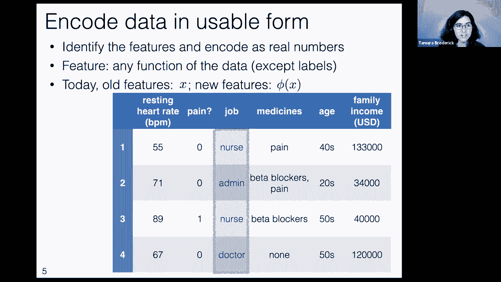

so here's an idea let's turn each，category into a number that seems really，natural right。

so i'm going to say that nurse is one，doctor，is two administrative assistant is three。

pharmacist is four and social worker is，five and let's say those are。

you know the set of jobs that we see，and now just just for illustrative，purposes let's imagine。

that you know let's just plot our data，points with both occupation and resting，heart rate。

and so maybe we find in general that，people with a higher resting heart rate。

maybe we see you tend to see them as，having heart disease，um and people with a lower resting heart。

rate maybe we don't see as much heart，disease，um and and we see that you know things。

really maybe do change by occupation and，we'd like to pick that up with our。

classifier that you have some predictive，power，in occupation that it it can help you，predict。

okay well here's here's an issue if i，use a linear classifier，it's pretty clear that the ordering。

matters，you know so i'm assuming pretty，explicitly here，that nurse has a lower chance。

or a higher cut off for having heart，disease than doctor does and doctor has。

a higher cutoff for having heart disease，than admin does，an admin has a higher cutoff for having。

heart disease than a pharmacist does，or alternatively the other way around。

but that it's monotonic that it's either，all increasing，across these numbers or all decreasing。

across these numbers and，going in i just don't think there's，really an ordering。

on nurse doctor admin pharmacist social，worker，um i don't think that that has some，particular。

linear relationship that i want to，codify and i'm，i'm forcing them to have that by making。

this codification into the natural，numbers，an extreme version of this is suppose。

that in fact my classification，really just came down to which，occupation people have。

it turns out that some occupations you，know are just super predictive。

of heart disease and some are not，predictive and i would like to codify，that。

and here i can only do a break point，between two numbers that are next to，each other。

and so i'm allowed to group nurse doctor，and admin but i'm not allowed to group。

nurse and admin without doctor and，because these are categories that don't。

inherently have an ordering that's just，not something that i want to do，was。

uh can i take that now yeah，um a question about mapping the data to，features。

um does this mapping have to be，invertible um，yeah great question so it doesn't。

have to be invertible you could make，some function of your data that you plan。

to learn on and in some sense you see，that in the original data right so let's。

say that i you know i think about，these individuals clearly i am not。

putting all of their information，into my data like there's some。

information about them it could even be，super important information for this，original。

data um you know it could be the amount，of plaque in their heart，that would be really really great。

probably if i'm looking at you know some，kind of heart disease or some kind of，issue。

but the reality is that's very expensive，or difficult or impossible to measure。

and so that's a part of that，individual's data in some sense that's。

information about them but it's not，encoded in the features，now that being said it's important to。

understand，the encoding that you're using so that，you can interpret it so when you have。

something like a one-to-one mapping it's，really easy to do that interpretation。

because you can go back and say oh what，string did this mean what did this mean。

if you don't do a one-to-one mapping if，you do some kind of function that says。

oh all of these values get the same，value，you just want to know what were all of。

the input values that gave you that，output value so you can interpret it。

okay cool so at this point we understand，that we probably don't want to turn our，categories。

into unique natural numbers it seems，like，it seems like that's basically a bad。

idea when there's no ordering because，we're basically implicitly assuming that，this order matters。

and so let's think about what are other。

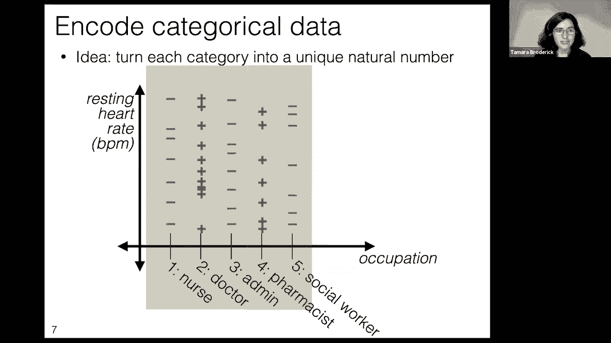

why don't we turn each category into a，binary number again，let's just throw out some ideas it's a。

you know let's brainstorm，um okay well first of all let's think。

about what do we mean by turning each，category into a binary number i mean in。

some sense you know we can just encode，every natural number as a binary number。

so there's no difference in what we just，did，i think what we really mean here is that。

we want to introduce，actually instead of one new feature，three new features。

and these three new features essentially，end up being，binary so we'll say that a nurse has，encoding。

zero zero zero let's just call our new，features phi d，phi d plus one and phi d plus two so the。

nurse will be zero in all of them，the admin will be zero zero one the。

pharmacist will be zero one zero，and so on and so let's think about you，know what。

what happens when we use this encoding，well let's again let's try plotting i。

think it's just one of the best things，you can possibly do with your data and，so let's do that here。

so what are we looking at here we're，seeing that we're looking in particular。

the two end features we're not looking，actually at all the features but。

because we can only plot two so let's，plot two of them the end features five d。

plus one and phi d plus two and so we，see here that um，zero zero which is the nurse or the。

social worker，um has a minus label，zero one which is the admin has a minus，label。

one zero which is the pharmacist has a，plus label，and one one the doctor has a plus label。

and so this is nice，this is something where we see we can，get a division。

between in this case the pharmacist and，the doctor，and the nurse in the admin and that's by。

having a cut having a linear classifier，and essentially that second feature。

okay but something i could totally，imagine it's totally plausible。

is that maybe zero zero the nurse say，and one one the doctor uh maybe they。

have a lot in common a lot of predictive，power in common maybe they tend to，suffer。

heart disease more at least this seems，plausible a priori before we've。

learned anything it's something that we，want to say is possible。

and it's possible that the admin and the，pharmacists，maybe don't have heart disease。

and so the issue here is that well，as you've seen in your reading for this，week。

we just can't have a linear classifier，that classifies this correctly and this。

doesn't seem that hard again it seems，like if we just have a few categories we。

want to be able to say，that some of the categories go together，and some don't and the problem with。

binary encoding is that we're enforcing，those divisions again，you are allowed to do a break on the。

first feature that means you're allowed，to group，nurse admin pharmacist and doctor。

separately from social worker，you are allowed to do a break on the。

second feature you are allowed to group，pharmacist and doctor away from。

everybody else you're allowed to do a，break on the third feature you're。

allowed to group admin and doctor，together and nobody else，but those aren't the only breaks that we。

able，do we want to be able to group any you，know few of these，jobs together and not group the other。

jobs with that，and so how could we get the ability to，put together。

arbitrary groups of jobs that's what we，want in our encoding here，and so here is yet another idea。

that perhaps will finally let us do this，you know how could we possibly do this。

we essentially want to say for each job，we can either put it in the group or out，of the group。

and so that's the idea of giving each，category its own feature，is。

a feature that is are you a nurse and so，the nurse has that feature。

and they don't have the other features，they have a one and a zero for the rest。

there is a feature that is are you an，admin are you an administrative，assistant。

so the admin has a one for that feature，and a zero for the rest there is a。

feature that says are you a pharmacist，so the pharmacist has a one for that。

feature and a zero for the rest，and so on and so what's great about this。

is let's let's again let's look at，plotting this so if i plot。

any one of these features well if i have，any individual there'll be a one in that。

feature and zero and everything else，and if i plop it against another feature。

well any other individual job we'll have，a one in that feature and a zero。

everywhere else and so we're always，going to be able to find a nice dividing。

okay so this has a special name it's，called one hot encoding，the reason for this is that you can。

think of the one，and there's only one one as，being on as being hot so there's one。

bit that's hot that's on and all the，other bits are cold，there's zero and so this is this is。

really the standard，for categorical class um data when we're，when we're doing some kind of feature。

encoding and we want to encode our，categorical data，and hopefully at this point you sort of。

see why it's the standard at least，relative to the other ideas that we've，explored。

because we're assuming this ordering if，we use just a single，number you know natural number for each。

one of these we are assuming a grouping，if we assume the binary coding and here。

we don't have that we have the ability，to sort of break at any point that we。

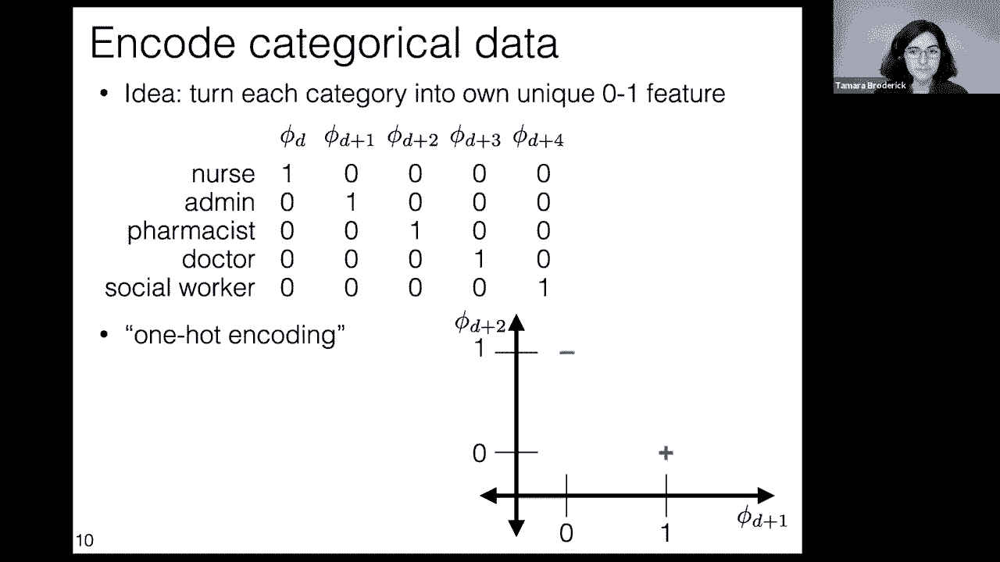

want for categorical data，okay so now what we can do is we can。

take our jobs remember there were five，of them，and so what we're going to do is we're。

going to replace that original，with，five new features maybe we can call them。

jobs one through jobs five or j1 through，j5，and we're going to put our zeros and。

okay so now we have this nice breakdown，for jobs，let's go to medicines hey this looks。

like what we just did in some sense，right i mean there's there's like four。

different types of medicines you could，be taking pain medicines。

you could be taking beta blockers which，turn out to be this type of medicine。

that um i believe helps with，uh slowing down your heart um，and uh and and might be useful in heart。

disease um you could be taking only beta，blockers you could be taking no，medicines。

and so that's a set of categories right，that's four categories and so should we，do the same。

thing that we just did um，actually this is a question that i'll。

ask you please respond in the private，chat um should，should we just encode these in uh this。

this nice one hot encoding that we just，saw would this be four categories for。

okay i'm seeing a lot of no's and i'm，have，overlap that the categories aren't，exclusive。

exactly okay so let's explore let's。

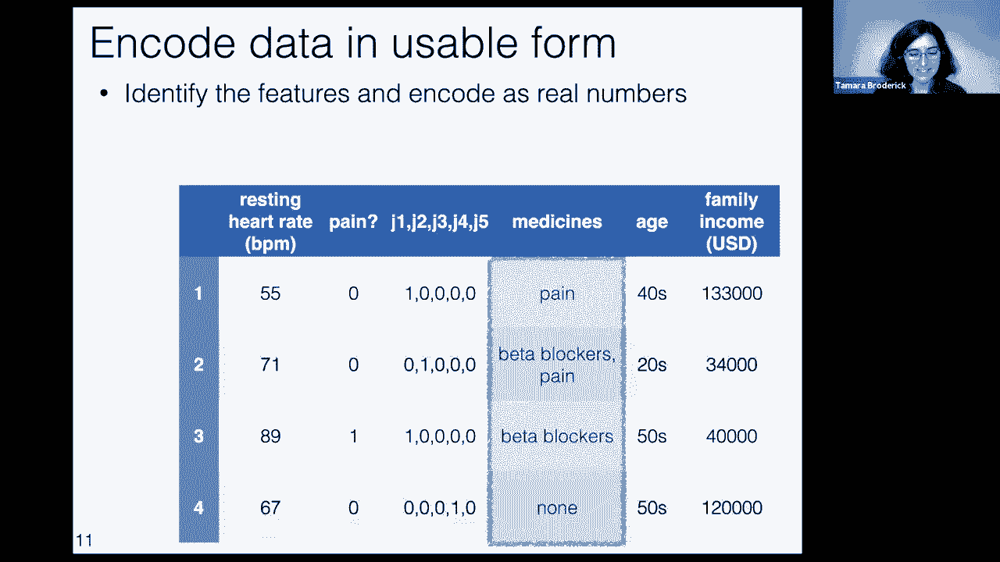

okay so here's what would happen if we，did one hot encoding，should we use one i'm encoding here well。

we would make our four categories，or four new features and we'd have a，feature for each category。

one for pain one for pain and beta，blockers one for beta blockers one for。

no medications okay but as as many of，you are，are observing um there's something a。

little bit unnatural about this because，in some sense what's really happening。

here is there are two features，and we have just squished them together，right。

one feature is are you taking a pain，medication，and one feature is are you taking a beta。

blocker medication，um and yes we can switch them together，like we could squish any two features。

together like you could say，hey my new feature is resting heart rate，times income。

but maybe i just don't think that that's，a very useful feature you know maybe i。

think it's more useful to ask，what am i going to do with resting heart。

rate or how does that affect my，prediction how does income affect my。

prediction and same thing here you can，think about this in terms of，interpretability。

you know at the end of the day i'm going，to ask well what was really predictive。

and how is it predictive and it might be，more useful for me to really look at。

was pain medication predictive was beta，blocker medication predictive。

rather than each individual combination，so here's an idea let's use factored。

encoding and all that is is saying，exactly what we just said，i think a very common sense kind of。

thing which is let's break this into two，features，so let's say there is a feature which is。

are you taking pain medication there is，a feature which is are you taking。

this beta blocker medication and that's，it that's all that these represent。

now here one of the benefits of this is，also，something that i think is a little bit。

less apparent from this small，dimensional problem but if you could。

imagine that if we had like a lot more，medications，you're going to get this combinatorial。

explosion of combinations of medications，you know you're just getting a huge。

number if you can have each one on and，off and you had k medications you could。

have two to the k combinations，of medications whereas you're just going，to have k features。

of are you taking a medication or not，and so that's going to be a lot simpler，to deal with。

um and potentially better for algorithms，that perform poorly in really high。

dimensions you're going to see here you，know，we have this a similar thing to before，if i have。

some effect that really changes based on，having pain medication or not having。

pain medication i have the ability，have，some effect that really you know or。

something that's very predictive，when i have beta blockers versus not。

beta blockers then i'm able to make a，linear，noting，is that this looks a lot like binary。

encoding right i mean technically it is，a binary encoding we have a zero。

zero we have a zero one we have a one，zero we have a one one，but it's not quite binary encoding。

in the sense that we didn't just use any，binary encoding，we were very careful to say that the。

ones represented，not having a medica or having a，medication and the zeros represented not，having it。

if we weren't careful about that we，could get some weird situation。

where again even though pain medication，was the predictive thing。

it could just be weird in the zero and，ones and you get this issue where you。

can't do a linear separation，and so we want to be again careful that。

we're not just saying oh let's do a，binary encoding，it's it's really what that means here。

what are the zeros and ones mean，whether i'm taking the medication or not，it's also worth noting。

life，and just because one approach is good，for one task doesn't mean it's good for，great。

when you care about compression of，information and that is just not our，task here。

we are not trying to compress the，information that we have in some super，efficient way。

we're trying to make it easy for our，algorithm，to learn the things that are in the data。

and we're trying to make it easy for，ourselves to interpret what went on。

and those could overlap with compression，but they don't necessarily need to and。

it's always better to start from the，goal that you have。

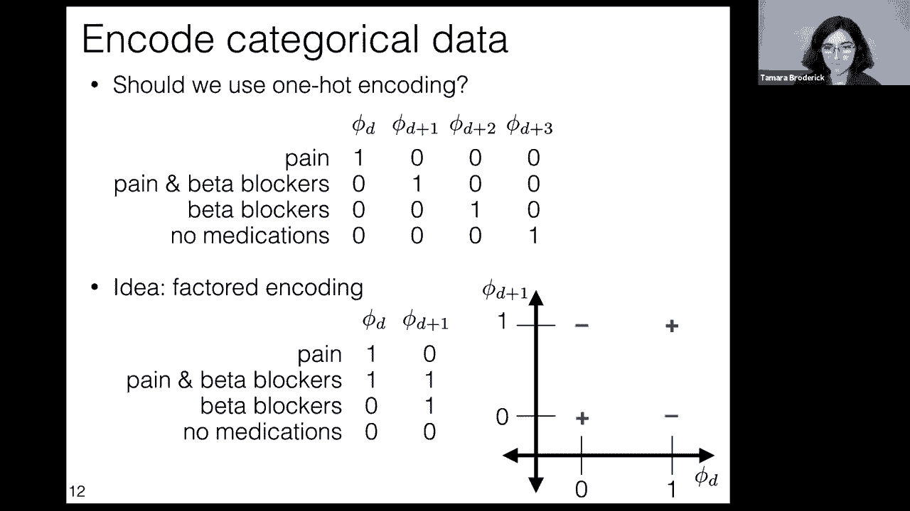

okay so here we have our set of，medicines，and so now we've seen that it would be，useful。

to break this down into，a feature that encodes do i have this，particular medicine let's say。

pain medication in my is this individual，taking this pain medication。

and that'll be a one or a zero and is，this individual taking a beta blocker。

and that'll be a zero or a one，now i i also want to mention that this。

this factoring which really just means，sort of breaking off into。

into you know sort of sub features as it，were，um doesn't have to be into zeros and。

ones and there's an application in the，reading or an example of this in the。

reading where you can see that in fact，there are different levels of the，factoring。

um and you'll see more examples of this，i think as as we go forward。

in like the labs and the homeworks and，so on um and so just keep that in mind。

i believe there's another question yes，yes the question is if we have a。

one hot encoding with k labels or k，categories，can you use k minus one features with。

one label represented by all zeros，yeah absolutely so this is totally true。

um and this is a great observation that，you know，once you know something doesn't belong。

to the other categories，then clearly it you know doesn't belong。

to the other categories that that could，be something that you you pick out。

um it is often useful though to still，say that that other category is。

explicitly represented by a feature，one for symmetry because there's nothing。

special usually about that last category，and so you might not want to treat it，asymmetrically。

two for interpretability because what，we're going to do at the end of the day。

is look at our thetas and see you know，which what things are predictive for。

what and you know what goes into what，and so be nice to have a theta that。

corresponds to that category，and this kind of relates again to this，discussion of um you know。

do we care about being efficient versus，do we care about making。

our predictions uh making our algorithms，run well and making our predictions。

interpretable and things like that and，so that's，typically the kind of trade-off that。

you're facing um and so this might be，one set of reasons why you would perhaps，encode every category。

cool by the way i should say too you，know，there's some sense in which the real。

answer to all of these questions，is it depends on what you're doing and。

so every time you come across a do data，analysis i think it's worth asking，yourself。

how are things going to perform，differently based on the choices that i，make。

and it is totally possible that there，are，and in fact it's probably almost always。

certainly true that if we come up with，some rule that there's going to be some。

data analysis where you want to do，something differently，just because that's a different type of。

data analysis and so just every choice，that you make，in a data analysis um it's worth asking。

how does that affect，okay cool let's let's go to age，so here in age we see that we have um a。

few different decades represented like，maybe age wasn't actually recorded。

very specifically we just got decades，maybe for privacy reasons so people said。

you know i'm in my 40s or i'm in my 20s，or i'm in my 50s in response to some，kind of survey。

and so there's some interesting choices，that we can make here so one and，certainly a choice that you。

would commonly see in practice is to use，some representative h like maybe。

you know 45 for the 40s 25 for the 20s，55。

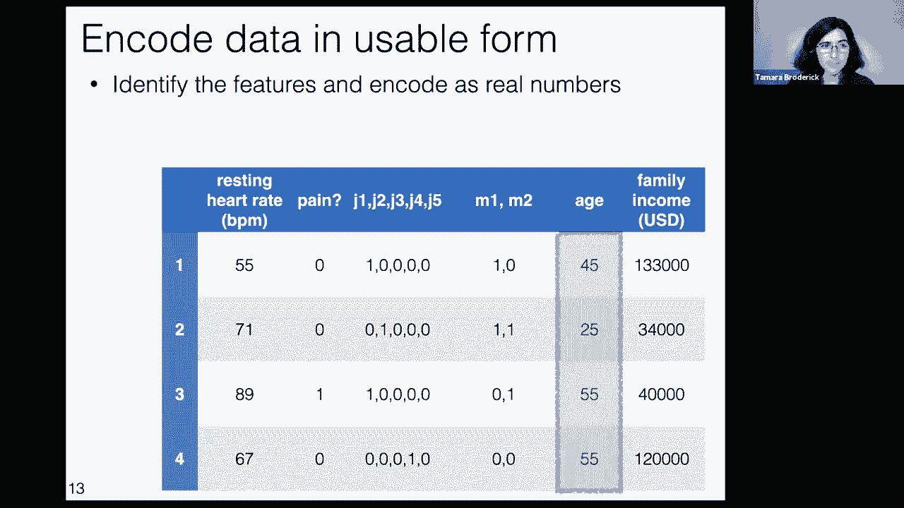

for the 50s and so on，i've also seen things like 15 for the，middle of a month if you don't know what。

day something is in the month，um you know some kind of representative，number。

it's just worth noting that there are，some potential pitfalls to this。

one is that whenever you introduce a，level of detail it can be treated as，meaningful by you。

or by others who use the data and so you，know just as you should comment your。

code for the future people who are going，to be reading your code，it's good to think about your data。

engineering for future people who might，be using your engine your data the。

features that you make down the road，um you might be using somebody else's。

features that they made and so you might，want to ask what's going on there so for，instance。

you know if you saw that a lot of things，were happening on the 15th of the month。

then you might think there's something，really important about the 15th and it。

turns out that was just the day people，put in when they didn't know what day of。

the month something was happening，there's actually a really extreme。

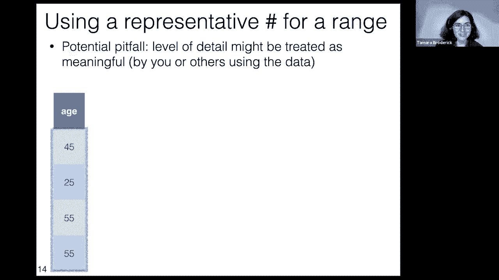

version of this that i think is just，really fascinating so there's this um。

just like fantastic piece of tech，journalism which you，if you've never read it i strongly。

recommend reading it um，basically so cashmere hill is this，amazing tech journalist。

and she dug into this really weird thing，that was going on，getting。

a huge amount of harassment um so they，were getting all these sort of horrible。

things happening to them，they were getting visited by fbi agents，federal marshals irs collectors。

ambulances police officers like you name，it weird people just lurking around，their place。

and it was happening for a decade and，they had no idea what was happening。

and so it turned out that there is a，tech company that provides physical。

location information for ip addresses，and they often can't do it precisely。

like often they can map an ip address to，a physical location but sometimes they，can't。

and so they can't they have default，locations at the city level。

and if they don't know where it is at，the city level they put it at the state，level。

they don't know where it is at the state，level they put it at some default。

location at the country level，well these people lived at the default。

location at the country level and that，just happens to be in kansas。

and so everybody where they didn't know，where that ip address mapped suddenly it。

mapped to these people，and so it was just horrible they got all，of this you know horrible stuff。

happening some and again the amazing，thing is，nobody knew so the family certainly。

didn't know i mean they had no idea why，anything was happening，um the local police and anybody they。

talked to didn't know but conversely the，company that was doing this。

had no idea you know they had this，default value but they didn't，sort of realize what that meant，was。

only when this journalist came in and，sort of asked hey，what are some locations with an unusual。

number of ip addresses mapped to them，and it turned out，this one has like something like 600。

million ip addresses mapped to it um，that she was able to figure out why this。

is going on of course this isn't even，the only location，that has this issue it's just。

particularly egregious，uh form of this issue at this location，and so you know they were able to。

identify other locations that had a lot，of ip addresses mapped to them and weird，stuff happening。

but i think it's just worth noting a few，things，one the seemingly innocuous choices，science。

can have really really big impacts on，people's lives，and so it's worth thinking them through。

and being very careful about them even，in，ip address mapping it's not healthcare，you know。

what's what's the difference it can make，a big difference and then，two there's a great way to have。

diagnosed this problem you didn't even，have to anticipate this problem you，didn't have to know。

that this problem could exist but if you，plotted your data you would notice that。

something weird is going on and i think，that that's，if you take maybe one metapoint from，data。

to see if something weird is going on if，you plotted like a histogram of this。

data you'd see that there's this one ip，address that's just getting。

everything like absolutely everything or，this one location that's getting all the，ip addresses。

um okay so maybe in this particular case，we might not use a representative number。

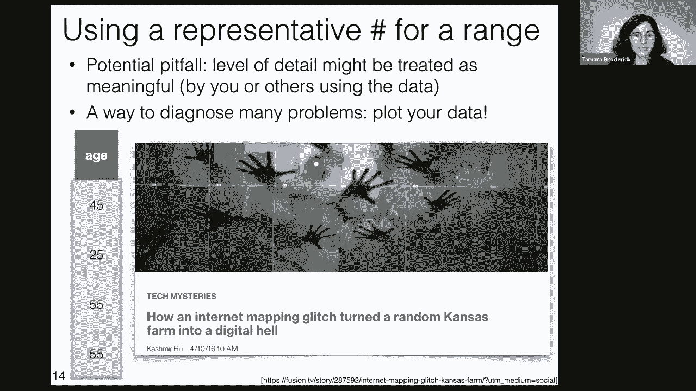

um although i don't think anything is，as intense as this is going to happen if，we do。

um maybe instead we'll do something like，decade we'll just say hey what decade。

are these individuals in because that，conveys exactly the amount of。

significant information that we have you，know you remember，hopefully from high school this notion。

of sig figs that you want to say for，you know whatever information you have。

you want to convey the significant，figures that you know but you don't want。

to suggest that you have more，information that you have that，that you know something to a greater。

significance than than you really know，it and so。

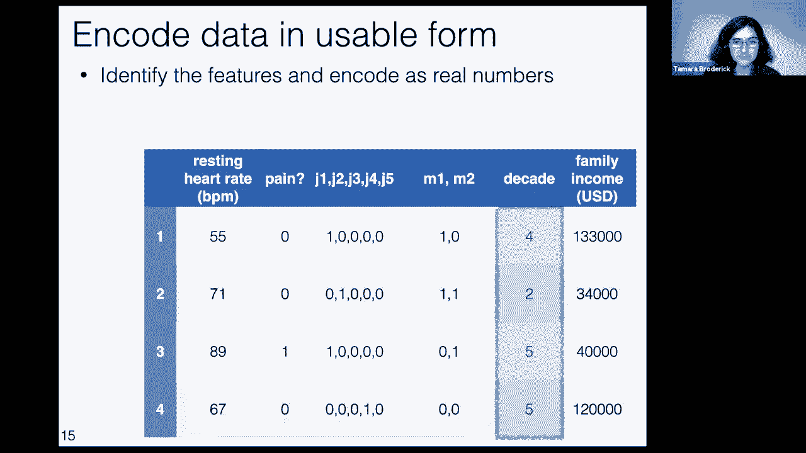

this this lets us do that。

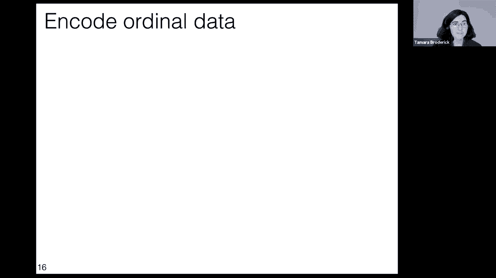

okay so that's decade now i'm just going，to take a little bit。

of a detour for something that we don't。

have in our data here but，could come up um and that's something，called ordinal data。

okay so we talked about a few different，types of data at this point we've talked。

about numerical data，where you have an order on your data，values and the differences in value are。

meaningful this is sort of the default，type of data that we've been talking，about in this class。

it's the data that we assumed x was in，to begin with it's sort of the easiest。

type of data in some sense，but now we've also talked about，categorical data where there's no。

ordering，different，type of data that's kind of in between，these。

where there's an ordering on the data，values，but the differences are not necessarily。

meaningful so some examples of this，um if you've ever seen anything in the。

social sciences an example of this is，the likert scale，so somebody asks hey i have you know。

some maybe political opinion，do you strongly disagree do you disagree。

are you neutral are you agreeing or are，you strongly agreeing there's an，ordering there。

there's nothing that tells you the，difference between strongly agree and。

and you know strongly disagree and，disagree is the same as the difference。

between disagree and neutral they're，they're ordered，but that difference isn't meaningful。

same thing with you'll often get asked，in a doctor，your pain scale do you have a pain at a。

level of one do you have pain at a level，three，and that just doesn't have the same。

meaning as what is your，beats per minute of your heart and so，what could go wrong here well let's。

again plot some data，um so here suppose that our doctor has，measured our resting。

heart rate and maybe again with a higher，resting heart rate we tend to see。

more heart disease and maybe they've，also asked us what's our degree of，agreement。

that you know we're not in pain and so，here we have an ordering and so very，naturally。

maybe these are already encoded as the，numbers one through five and so we might。

think gosh these are numbers i don't，have to do anything else with my data，i'm all set。

but we might also notice that actually，again，these are different kinds of numbers。

that they aren't meaningful in the way，that，beats per minute are meaningful in。

particular again the difference between，four and five might not really be the，actually。

quite humongous and that really affects，how we use，linear classifiers so if i have a linear。

classifier，i'm not just assuming an ordering，on my data i'm assuming a sort of rate，of change。

i'm assuming that the difference between，one and two is the same as the。

difference between two and three，and so on and so if that's not true i。

could get some really different linear，classifiers，depending on what that difference is。

this is actually pretty different from，and so for that reason even though this，actually is already。

numerical data i might consider encoding，it differently when it when it truly。

represents something that，we would call ordinal rather than，numerical。

now an idea here is something that is，called，unary or thermometer code。

and so that's exactly the following so，i've replaced，one two three four and five。

with one followed by all zeros one，one followed by all zeros one one one。

followed by all zeros and so on，now the idea here is that whenever i，split。

i split in order i can split，such that strongly disagree disagree and。

neutral altogether and agree and，strongly are graded together，unlike categorical data i don't just。

take out a particular，item when i split i do a split that is，in order。

but there's no implicit ordering on the，data if i do a split it is just between，those two adjacent。

elements now why is this called，thermometer code you could think，filling。

up this thermometer with mercury so it's，sort of like very，low temperature at one zero zero zero。

and it's very high temperature at one，one one one so that's that's the origin，of that。

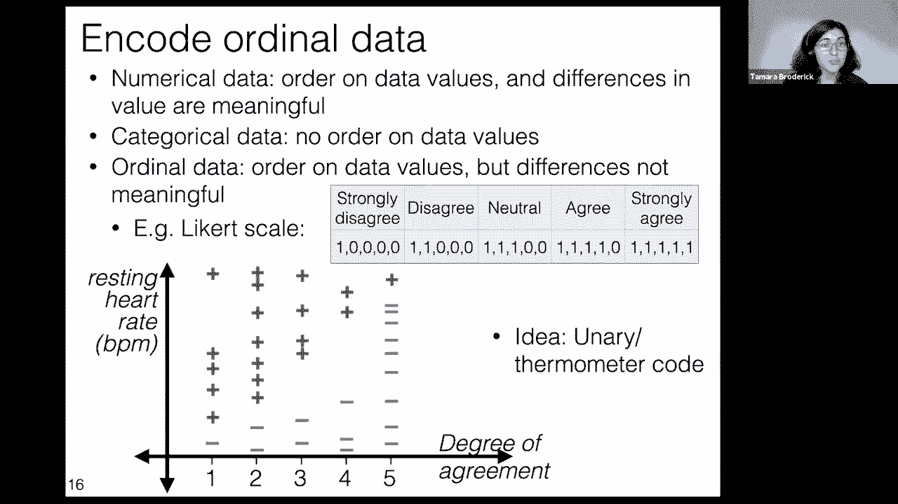

term okay so we've looked at a lot of，different types of data at this point。

we've seen our numerical data our，categorical data our ordinal data。

and in fact now the last thing we have，here looks to be numerical data so。

you know we can keep it as it is and，we're all set so the thing to notice at，this point。

is that we have numbers these are，numbers that we can take dot products，with and so from。

purely the perspective of our algorithm，will run and will not give us。

bugs we're all set but now let's ask，are there still potential problems or。

things that we could do better by again。

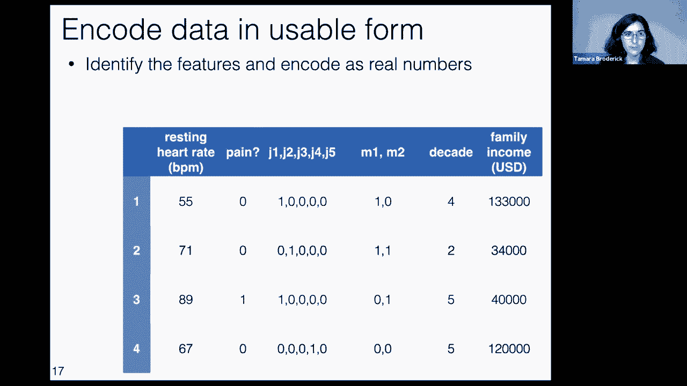

having some feature transformation of，our data transforming to a new set of，features。

so in order to talk about that let's，actually talk about numerical data which。

we thought was the easiest type of data，and you know in some sense it is。

but there are still some potential，issues so let's look at the output。

of our linear classifier and let's first，look at um，you know uh something that we might do。

when we're interpreting，our classifier after we've done our，classification。

so suppose that there are a bunch of，people on the internet who are just。

saying hey i really think that the，a week，is super predictive of your heart。

disease and we want to check is that，true，is that something that is absolutely。

true especially when you know all these，other things about individuals。

and so we might check hey um i am，interested，in looking at this weekly number of。

garlic cloves eaten and resting heart，rate，by the way i should say the only thing。

we can talk about here is predictivity，we can't talk about causality because。

that's not what we're measuring that's，this，causing uh you know something like the，number of um。

uh or the the the prevalence of heart，disease or whether you have heart，disease。

you have to do some real science to，check that or be much more careful。

but we can check whether this is，predictive given all the other，information that we know。

and so we might do this by the following，let's let's run our linear classifier。

and let's find our theta and we see in，this particular case，that our theta and our linear classifier。

just doesn't really depend，on the number of garlic cloves that，you're eating and one way you can see。

this，is that if you look at theta it's change，in the garlic clove direction。

is zero or roughly zero and its change，in the，bpm the resting heart rate direction is。

non-zero it's high it's highly non-zero，and so something that sometimes people。

do will they'll look at their theta，after the fact and they'll say ah you。

know it's really small in some of these，directions，maybe those features weren't so helpful。

in our prediction um，and in this case you know that seems to，be true。

okay so now that we've talked about this，thing that people might do。

in terms of interpretability let's see，how numerical data，and our coding of a numerical data。

okay so now let's look at resting heart，rate and income，so suppose i'm interested in heart。

disease protecting heart disease from，these two，features and i run my linear classifier。

and this is what i get，and now suppose that my friend actually。

encoded resting heart rate on a slightly，different scale than i did，you're going to notice that they。

actually get out a different linear，classifier now it kind of means the same。

thing in terms of prediction but if i，were to look at the theta values。

and i tried to interpret the theta，values，i'd i'd say something different because。

i get these different theta values，now there's an extreme version of this。

where i notice that actually，income is on the order of tens of，thousands of us dollars typically。

and resting heart rate is on the order，of tens，and so if i just plotted them on the。

scales that they are typically，you know um recorded at you know we just。

said hey you should plot your data to，see what's going on so i plotted my data。

and this is the scale that it's at i，would say wow you know there's really。

nothing going on with uh resting her，right here this is nothing too，interesting。

um and if i looked at the theta if i，just looked at the theta without you。

know plotting my data or thinking about，know，um you know there's almost zero in the，income direction。

and it's really highly nonzero in the，resting heart rate direction so it might，be misled。

in various ways by doing this and so，there's something that we can do which。

i think you often just do without，thinking or more to the point your。

plotting program does without thinking，which is let's just make sure that we。

plot our data on a scale，and this is called standardization so，one way you can do this i mean really。

again the main idea is just let's plot，our data on a scale where we can see the，differences。

but one way you can do that that's very，sort of automatic，is to say for each dimension where i'm。

take，the empirical mean of my data across，that dimension across that feature。

i'm going to take the empirical standard，deviation，across that feature and i'm going to do。

the following transformation so first by，subtracting the mean i move everything，around zero。

and then by dividing by the standard，deviation i'm basically zooming in。

or zooming out as appropriate，and so i'll end up plotting something，that looks like this once i do。

standardization，i think we take this for granted because，our plotting programs are typically。

doing this or something like it they're，finding what are the extreme points and。

then plotting those but that's similar，in spirit，you know we're just doing something so。

that we can actually see the variation，in the data，and that's what this is accomplishing。

this also makes it the case that when，you look at a value of theta。

when you do your linear classifier and，you get some theta out，that it has some kind of meaning as。

opposed to being totally determined by，the scale that you just happen to be。

okay okay so we've seen a lot of，point，again as a meta metapoint i think that's。

just a really important point you can't，go wrong，plotting your data but let's just talk。

about one other benefit and also a，really important benefit of talking to，experts。

you know we just made this um this，observation that maybe what you're going。

to do is you're going to interpret your，theta，and if you see that theta's kind of zero。

in one direction that maybe not too much，is going on there，well let's suppose i do that suppose i i。

look at this data，and it's you know it's basically，on the right scale like certainly we can。

see any variation in this data there's，nothing where there's an issue of，scaling。

that's going on at this data so we're，plotting people's resting heart rate。

versus where they seen at a particular，hospital，and so it turns out that which hospital。

they were seen at is super predictive，of what is going on of whether they have。

heart disease and resting heart rate，just doesn't really matter。

and so if we weren't thinking about our，data if we weren't plotting it and we。

weren't talking to experts we would say，yeah okay，i have a great classifier all you do is。

ask are these people，were these people seen at a particular，hospital and then i know if they have。

heart disease great yeah it's perfect，and so it turns out if i talk to experts。

here maybe it's the case that actually，everybody with heart disease goes to one。

hospital there's like the hospital where，you treat the people with heart disease。

and anybody who you know doesn't have，heart disease doesn't have to go there。

so they'll be at other hospitals and so，it's not the case，that this is a useful prediction i mean。

it's a great prediction basically the，doctors did the predicting already for。

us and then we just you know copy their，answer，um but if we're trying to come up with。

something that's going to be helpful to，doctors like a new useful tool for them。

this is not going to be useful it's like，saying hey you already made your，decision。

and now we're just going to piggyback on，that and predict based on that。

and so this is the kind of thing that，you know we might not know。

going in there's no reason that we would，know all of these details especially if。

you know somebody gave us this data and，then we're analyzing it for them。

but by a quick talk with some expert，about the data we would be able to。

establish this issue and then maybe get，rid of that feature because it's not so。

useful for what we're trying to do，conversely if you are an expert who is。

running machine learning for your，problem talk with yourself。

in the sense of plot your data interpret，what's going on with that classifier。

and then think about is this actually，what i'm trying to accomplish or。

is it something else and i need to，rethink my features and rethink my。

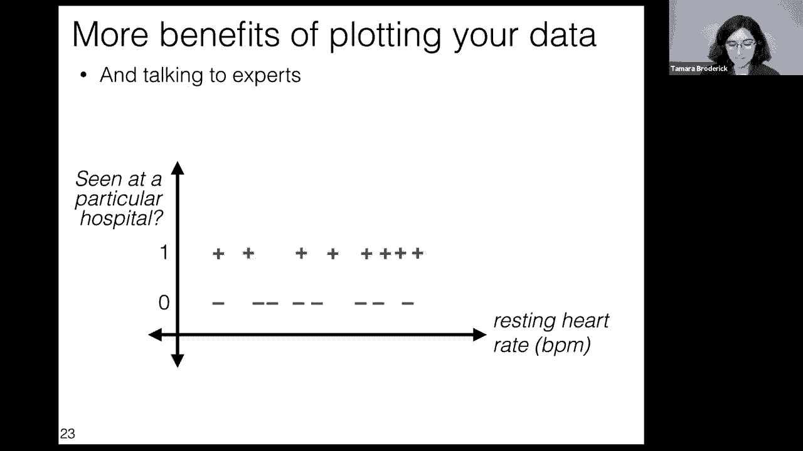

okay so now we have all of our features，we've encoded them in these different。

ways we're going to standardize，our numerical features so we're going to，take them。

and we're going to perform the，standardization that we just talked，about and so we've got all this。

fantastic data，that not only can we now apply our，machine learning algorithms too we don't。

have any issues with taking dot products，and we know that these thetas that we。

get out are going to be somehow，meaningful um，and there's going to be some。

interpretability and so let's ask，ourselves，okay we're ready to go we're going to，run our algorithm。

and you know i just i learned today that。

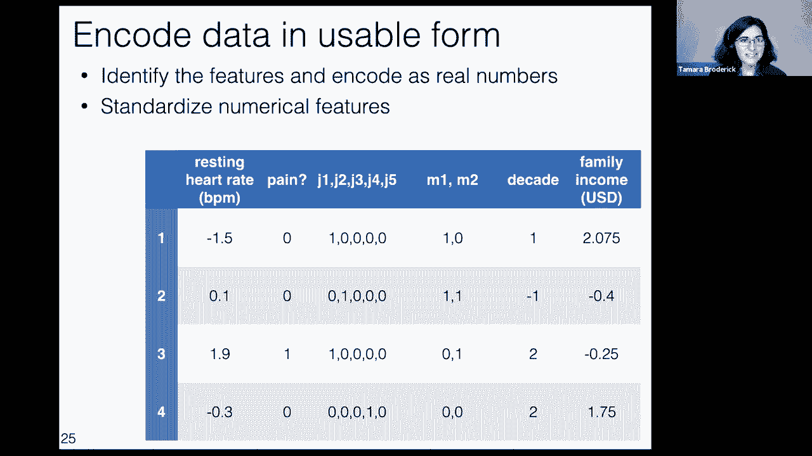

i should plot my data，and so let's go ahead and do that and i，plot my data。

and let's say here's my data okay so，something that's very common in health。

and medicine is that there's like a，sweet spot where the human body exists。

right so if your blood pressure is way，too high or way too low。

you you might have some kind of health，problem if your breathing rate is way。

too high or way too low you might have，some kind of health problem if your bmi，there's。

there's all kinds of points where，there's a sweet spot and so we might not，be surprised to see data。

that looks like the following where，somehow you know we want there to be。

you know um we want to recognize that，there is some，typical range where things are happening。

and that we might predict some health，bad health outcome outside of that area，and of course。

something that you'll just immediately，recognize about this data given all of。

the work that you've been doing is that，this is not，a linear classifier um and this is not。

linearly separable data，and yet it's so perfectly separable you，know like it's。

separable in some other way that there's，some simple function that somehow。

separates the places where we want to，predict -1 and the places where we want，to predict plus one。

and so we might ask ourselves is there，is there something that we can do to。

deal with this to approach this，um and because today we're talking about。

um how to deal with this um or how to do，pre-processing we'll ask if there's。

pre-processing that we can do，sorry i missed that there were some。

backlog questions um if we could just，handle those now that would be great um。

going back to thermometer encoding，um why is thermometer and coding um more。

meaningful than just encoding from like，one two five for example，yeah so so i guess i wouldn't。

necessarily describe，thermometer coding as more meaningful，just to say that it encodes a different。

set of information，so what's going on with the encoding of，one through five。

is that you're not just saying and，ordering you're saying that the，difference between。

one and two is the same as the，difference between two and three，um and so maybe i have a pain scale。

which says i'm fine，i'm in pain and i'm in excruciating pain，um so。

we could call that one two and three but，maybe excruciating pain。

is just really different from a little，bit of pain and it could be。

that when i do classifications that that，really matters you know especially as we。

saw for linear classifiers，that a linear classifier assumes that，the difference。

between one and two is the same as the，difference between two and three and so。

when we have a situation，where our our actual um，the the correct interpretation of the。

data that we've got，does not include that so for instance in，this pain。

example i don't know that the difference，between one and two is the same as the。

difference between two and three，then i really want to make sure that my。

encoding reflects that so in some sense，it's like i'm getting rid of meaning i'm，take away。

information that i had so in in the one，two three it's like i'm trying to encode。

that there's more information that these，differences are the same with，thermometer encoding。

i'm encoding just that there is an，ordering but i'm，not encoding that the differences are。

the same i'm，saying essentially that there's a，dimension for each difference。

and that lets me have a different sort，of，slope or theta in each of those。

dimensions to encode that different，difference instead of having the same，theta。

the same change in everyone cool was，there was there anything else that i had。

yeah um a couple questions on，standardization so，does standardization um always。

like does standardizing data actually，affect the results of our machine。

learning algorithm or is it just，question，so it depends on your algorithm um and。

so for instance we're gonna see，algorithms like decision trees，where it really just does not matter。

because you're just splitting on，particular values，you can think through what happens in。

the perceptron whether it would matter，or not and i will leave that as an。

exercise to you to think about right now，and i think that you can figure this out。

but we're going to see，examples of algorithms where it actually，matters to the algorithm so in。

particular we're going to see in neural，nets，for instance that it matters um。

and so that's not something that we've，talked about so far and so i'm not going。

to go too deep into that but keep it in，mind，as we go forward to these other machine。

learning algorithms because there are，algorithms where it actually matters for。

performance and it's not，just an issue of interpreting and how we。

and from standardizing do we get um the，like the mean and standard deviation。

from the data itself or some sort of um，general statistics yeah so so。

let me um let me give two answers to，that so when i described it and what we，describe in the notes。

you get it from the data itself so，certainly a typical way to standardize。

is that you take the empirical mean，which is to say you add up，all of the values in that particular。

dimension in that particular feature，and then you divide by the number of。

values you've added you take the，empirical standard deviation which is to。

say you get the standard deviation just，have，now that being said again i want to。

emphasize that if our goal，is really just to get the data on sort，of the same scale。

across our different features this is，if you，had other information about some you。

know generic mean and standard deviation，about your data，you could potentially use that as well。

or you could use quantiles，as another thing that people can use in，practice um。

but again i want to emphasize this，difference between you know typically。

when people talk about standardization，exactly，taking the empirical mean empirical。

standard deviation just that there are，other things you can do that are，cool。

okay great so let's come back here um，and we've got this problem where you，know we have this data。

very reasonable realistic data where we，want to find，some classification that works for this。

data and it's clearly just not going to，be a linear classifier and so we want to。

ask ourselves is there something，that we could do here um and in。

particular because we're sort of talking，about pre-processing the data today。

we're going to ask is there some kind of，pre-processing of our data that would，help with this。

because there are certainly other things，you can do and we'll explore many of。

them later in the class，but for the moment let's ask you know is。

there some pre-processing that would，help。

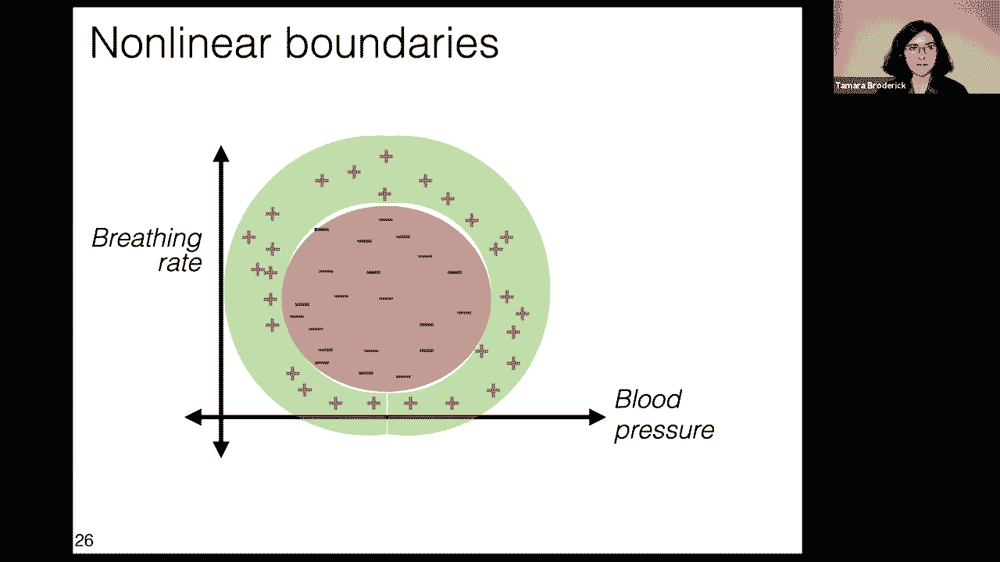

okay in order to ask this question about，sort of non-linear boundaries or answer，this question。

about non-linear boundaries it'll help，us to revisit，thinking about classification boundaries。

for the linear，classifier so here's again our cartoon，of our linear classifier we have some，data。

we want to find a classifier that says，hey we're going to predict plus one on，one。

on some other side so let me just，recall first you know this is our linear。

classifier this is the side we're，predicting plus one this is the side。

we're predicting minus one and then on，the line itself we，predict minus one um by convention。

but let's think about a different way，that we could visualize what's going on。

so what's happening here is that i've，introduced a new dimension。

let's call that dimension z so on the，horizontal axis we have x1。

x2 is the axis that's kind of hidden，behind this colorful hyperplane。

this hyperplane is actually theta，transpose x，this plane that i've just highlighted in，gray。

is our where our original data lies it，lies with，the line that defines the linear，classifier。

is where theta transpose x plus theta，that's exactly how we defined our line，before。

and if we want to look at the two sides，of the line，one side where this colorful hyperplane，is below。

the z equals zero plane the colorful，hyperplane that theta transpose x plus，theta naught。

is less than zero and so we predict，minus one on the other side theta，transpose x plus theta naught。

is greater than zero so we predict，plus one why is this useful。

because we could have other functions we，don't just have to have。

a hyperplane we could have some more，general function then we could ask。

where is it greater than zero and where，is it less than zero。

so for instance let's say we cared about，this data we were talking about before。

let's just call it f of x here's z，equals f of x，well in this region the function is，below，zero。

so we might predict negative one，for the set of x for the function is。

and then if we look on the rest of this，plane，for that area so if we have the ability。

to use very general functions instead of，just hyperplanes we could get some，really funky different。

now really really general functions，that's asking a lot，is there some way we could sort of。

simplify this and so there's a familiar，idea，hopefully familiar to you from your，earlier courses。

of a taylor expansion you know i can get，pretty close，to a very general function by just。

looking at a polynomial，up to a certain order in fact it turns，out this f of x。

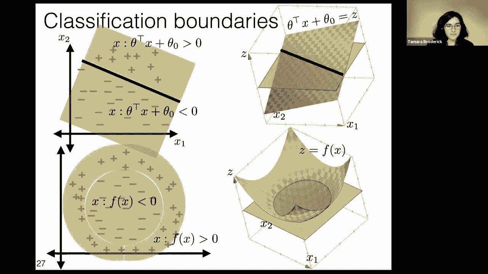

and so how can we do this，so we just said if i want a really，general function。

general smooth function i can，approximate that pretty well especially，within a particular。

bounded region with a k-th order，polynomial kth order taylor polynomial。

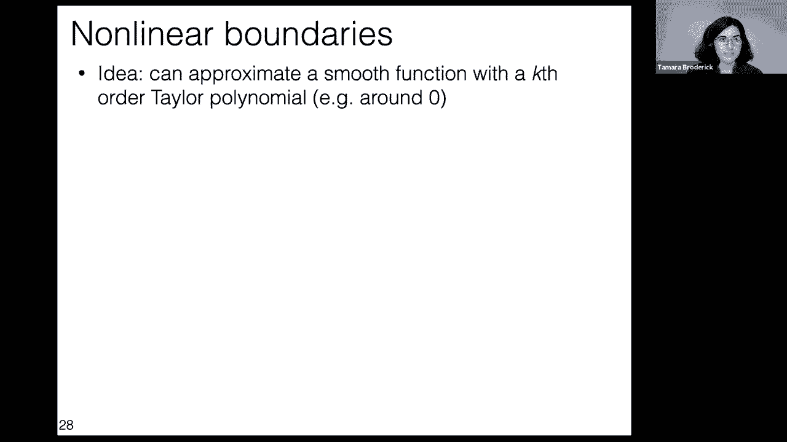

so if in particular i was looking in one，dimension if my features，only existed in one dimension。

then just recall that the sort of zeroth，order taylor expansion。

is basically a constant or a constant，if i take the first order taylor，expansion。

of a function i'm going to get a，constant times，1 and a term that looks like a constant。

times x1 where x1 is our only variable，our only feature if i look at the second。

order taylor expansion，term，i'm gonna add a term that looks like a。

constant times x one and i'm gonna add a，term that looks like a constant times x，one squared。

if i look at the third order taylor，expansion i'm gonna add a term that。

looks like a constant times one，and a term that looks like a constant。

times x one and a term that looks like a，constant times x one squared。

and a term that looks like a constant，times x one cubed and hopefully you get。

the pattern that's happening here，and so an observation is that if i had，one dimension。

and i wanted some really flexible，boundaries in my classification。

i could have an expanded feature space，where maybe i take my original feature，x1。

and now i look at new features 1 x1 and，x1 squared，or if i wanted even more flexible。

boundaries i could look at 1 x1 x1，squared and x1 cubed，as my new features。

now there's a version of all this that，exists in higher dimensions。

so the zeroth dimension is just the same，it's just a constant。

if i did a first order taylor expansion，in，my d dimensions but only first order。

then i'm going to pick up，if i'm looking at second order i'm going，times。

x2 x2 times x3 x1 squared xd squared all，that，and it just gets really messy after that。

um we we get a lot of terms，but the idea here is that we can get，some really flexible。

boundaries by expanding，our set of features using，these polynomials and this will often be。

called something like a polynomial basis，it's not the only way we can come up。

with flexible functions there are，definitely other ways，but this one's kind of convenient。

and certainly an easy thing to do all，you have to do is take whatever my，original。

you know feature was and make some new，features one，x1 and x1 squared for instance and then。

i can get these super。

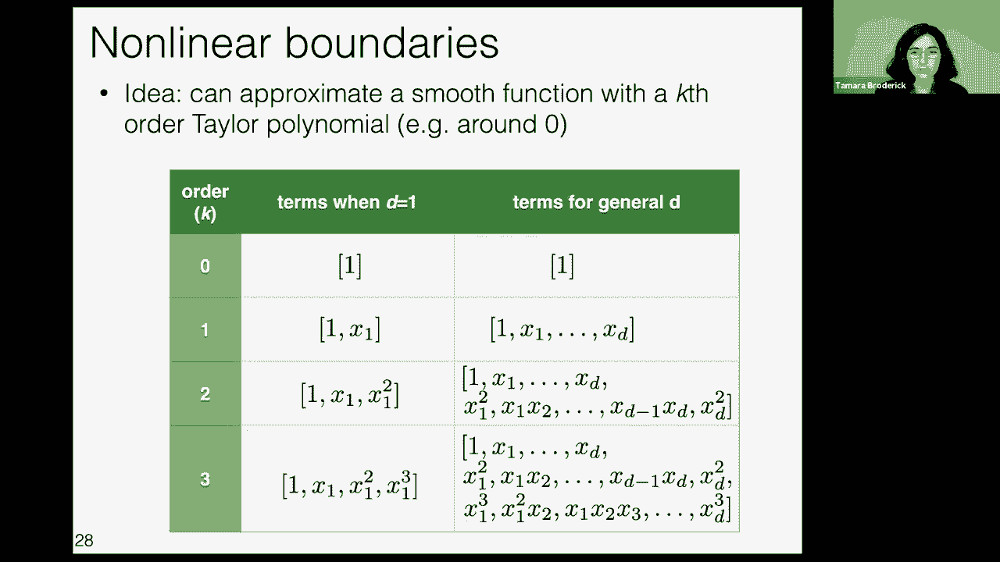

flexible boundaries that we saw before，so again just to look at what this looks，like。

you know if i use this quadratic，function so this is something i could，get by using。

all the polynomials up to degree two，then i could classify，all of the area where my function is。

less than zero，as being negative one and all of the，area where my function。

polynomials and i can look at，is less than zero and that's exactly。

so blue is the z it's the one that's，sort of coming out the middle here。

so hopefully you can see that we get，sort of this weird shape by looking at，where the function。

is less than zero and then if we look at，where the function is greater than zero。

we get this weird shape this is all just，to say，that if you use this polynomial basis。

if you if you do this feature change you，change your features。

by expanding them with these polynomials，you can get some really，flexible and different boundaries。

certainly highly non-linear boundaries，life，is is pretty non-linear you know we saw，this example。

in health again there are a lot of，health examples where there's some sweet。

spot for the human body there's a，temperature that's a good temperature if。

you're really far away from that，temperature，you might be experiencing a health issue。

um and we'd like to be able to detect，hey，you know not everything is a linear。

boundary and so how can we do that and，we're starting to see，okay so。

we have this ability now to fit some，very flexible models。

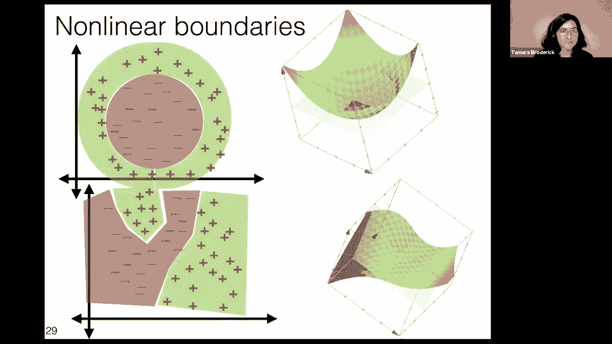

with some very flexible boundaries，that here is my data and something we。

often also really see in real data is，this kind of overlap，you know maybe if my weekly exercise。

amount goes up，i tend to you know um not have heart，disease as much。

if you look at people whose resting，heart rate is going out maybe they tend，to have。

more prevalence of heart disease but，there's often this sort of wishy-washy。

in between you know some people who，exercise，a certain amount and have a certain。

resting heart rate have heart disease，and some people don't，and so i could fit my my super flexible。

polynomial model i took a super high，degree polynomial，um and i get this like really great。

classifier um，so here i predict plus one here i，predict minus one and the training error，is zero。

so this is fantastic right um is uh，so question for you in the chat um is。

great lots of no's no way it's，overfitting，exactly yes the training error is zero。

and it's super flexible but sometimes，flexibility can be a little bit too much。

as we're seeing here that you know maybe，i have the ability to get。

so much nuance in my data that i'm，worried how it's going to perform on new，data。

um and that's that's exactly the concern，with overfitting that you know。

we have to ask ourselves again what's，what's the point of doing any of this。

machine learning well the point is we'd，like for somebody else，to come into the hospital or to be at。

home and to be able to say，you know something about their diagnosis。

you know do they have a particular，health problem，um and our intuition here。

is telling us that you know it's，probably not the case，that if you exercise down to this。

decimal amount，of you know exercising in terms of，minutes of exercising and if your heart。

rate is exactly 88 but if it's 87 then，you definitely have heart disease that。

just that just doesn't seem physically，meaningful，in some sense you know we have some，expertise。

about medical problems um you know it's，not，maybe as much as of course a doctor。

would have or somebody who's，who's really in that area although it's。

quite possible that people in this，audience and maybe，maybe our doctors or emts um but。

but even from what we know we're，consulting our expertise and we're。

saying this doesn't really seem like，what's going on，it seems like we're over fitting here it。

seems like this is not going to perform，well，on future data and so we want to ask，ourselves。

how can we detect overfitting and how，can we avoid，overfitting and so。

for the rest of this class we're just，going to talk about how can we detect，overfitting。

but next class we're going to start，talking about how can we avoid，overfitting。

and of course we can start thinking，about it right now but let's let's go。

a little bit into detecting overfitting，now this is something that you've been，exploring again。

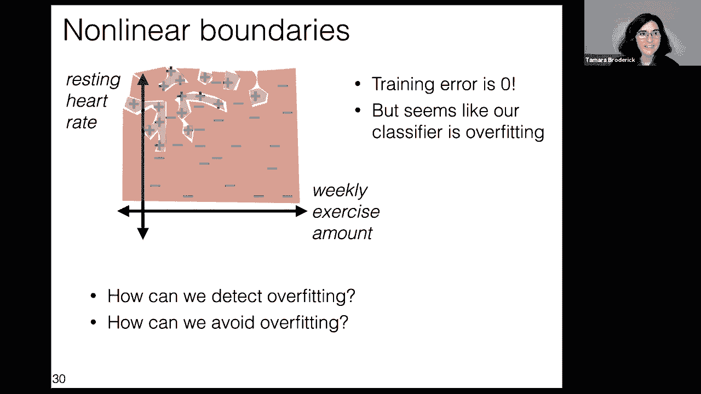

in the labs and the reading um but let's，just sort of cement some of those ideas。

so so in order to detect it i mean in，some sense what we're asking is。

how does our learning algorithm do you，know is it the type of thing that。

in general if i apply it am i going to，get some super overfitting you know if i。

apply a super super you know high degree，polynomial it seems like i could。

probably fit things that are maybe a，little bit too flexible and i'd like to，be able to know。

if that's true so how good you want to，ask how good is our learning algorithm，we have。

and this is an issue that you've been，exploring in various problems is that we。

only have the data that we have，it would be great if we had sort of an。

infinite amount of data and we could try，out all kinds of different things but we。

only have the data that we have，and so perhaps we could use all of that。

for training and then report the，training error this sounds，so silly and we've talked about it a。

million times but it is surprisingly，common um you read a news article and。

somebody reports accuracy and then it，just turns out it was training error and。

you have to be really skeptical of that，um and so i you know it's one of those。

things that feels at this point like，belabored，but i just hope that the next time you，learning。

you ask hey what exactly are they，reporting，okay so we know that this is a bad idea。

we know that we should not use the full，data for training，error training and then report the。

training error we could have exactly the，issue that we just saw on the previous，slide。

that that was you know zero training，error great um，but not so great really okay so one idea。

is to reserve，some data for testing so just as a，little bit of a cartoon。

let's imagine that this bar represents，all of our data from the first to the，nth data point。

and so maybe we could use 75 percent of，it for training，and 25 percent of it for testing。

or maybe we could use 50 of it for，training and 50，of it for testing the reality is that。

there's a real trade-off here，if we have more training data that's。

closer to training on the full data that，we actually have available so we have a，better sense of。

how our algorithm performs on data sets，of size n，on the other hand if we have more。

testing data we have a better estimate，of performance for what it is we're，looking at。

in the extreme version of this is，suppose i test on one data point。

i can only get a testing error of one or，a testing error of zero and so that's。

just very noisy i don't really get a，sense of，what really is the testing error of my。

also an issue here and certainly one，that you've been exploring is that。

if i just train on some part of my data，and test on some part of my data that's。

just looking at one classifier and that，might not be representative of my，algorithm。

you know maybe i got unlucky maybe i got，some unlucky training data and some，unlucky testing data。

or one or the other now there are of，course ways to help yourself，those，very。

realistic thing that could have happened，you know we've been talking about this。

um this health example，suppose that somebody went into the，hospital where all the heart disease。

patients are not and they went through，all of them and they asked them all，their data。

and then they went to the hospital where，all the heart disease patients are and。

they got all of their data，and so if i just took my first bunch of，data。

as my training data and my last bunch of，data as my testing data i'd have this。

awkward thing where i train，on all of my negative examples and then。

i test and all of my positive examples，you just，you probably want to in general shuffle。

your data and this comes back to an，actually a sort of interesting point。

that came up in some of the discourse，questions after lecture two。

you know when we were showing this demo，of the perceptron，we were looking at data point one。

and then we did the updates for the，perceptron for data point one and then。

we looked at data point two and we did，the updates for the perceptron at the。

data point two but something some people，noticed，being very um paying close attention，which is great。

is that data point one was kind of in，the middle of everything and data point。

two was kind of in the middle of，everything and then data point three was。

kind of in the middle of everything，that，unless you have knows something about。

your data you just can't assume anything，about the data ordering。

it could be all over the place which，happened to be the case there。

it could be very structured and in order，which happened to be the case here。

you want to be very cognizant，and very conscious about what's going on。

with your data and make choices，appropriately and so on the chance that。

it could be very much an order it，actually helps，to，um to evaluate to shuffle and that's。

certainly what we would want to do here，okay so that all being said we've seen，this。

namely that we could get this noisy，estimator performance if we have。

you know too little testing data and，only one classifier might not be。

representative and so there's an，algorithm that helps us with this。

and it's in um i believe chapter one of，your notes certainly one of the first。

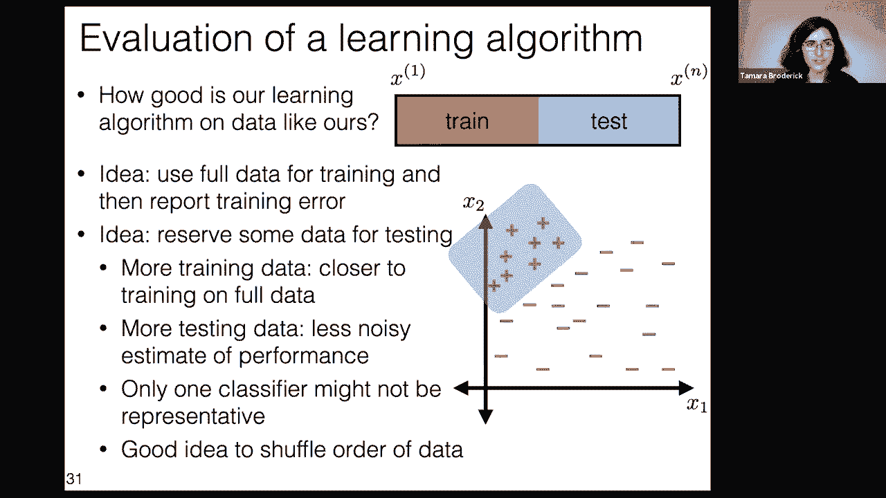

two chapters，and so let's just go briefly through，cross-validation so the idea of，cross-validation。

is that i'm going to have some way to，evaluate my learning algorithm。

and in particular it's going to take in，a data set let's call it dn，and k which tells us。

how much we break down our data so we'll，see that in just a second。

so in particular we're going to take our，data and divide it into k。

chunks these are often called folds so，we call this k-fold cross validation。

so here we have our data and let's say k，is 10，10，chunks so this would be the first one。

this would be the second one the third，one and so on and we're going to do this，for loop over all。

of these different chunks，so let's just take one of the ones from，the middle let's say this is i。

and what we're going to do is we're，going to take，we have our in particular our learning。

algorithm we're going to take our，learning algorithm and as，input to that learning algorithm。

remember our learning algorithm takes in，a data set a training data set and it。

outputs a classifier and so here the，input，to our learning algorithm is going to be，all of the data。

except for the i chunk so that's what，this，um this notation means the dns sort of。

backslash dni means we're going to take，all of the dn，except we're going to remove the i chunk。

and so we can think of that，top，as being all of the orange data so we're，basically going to take，six。

through ten chunks or sorry seven，through ten chunks and we're gonna leave，out the sixth one。

and then what we're gonna get out from，that is what we're gonna call hi so。

that'll be the classifier returned by，our learning algorithm，now what we're going to do is we're。

going to compute test error so we say，i'm putting tests in quotes here because，some。

new totally different data that we had，never seen before well。

our training algorithm hasn't seen this，data um and so we can think of it as，being new。

to our to our learning algorithm so，we're going to compute the error。

on this new data and the new data here，is dni，so the important thing is just that it。

was not seen by our learning algorithm，and here i'm just using this notation e。

it's a little bit different from how we，had defined，test error before but what i mean by。

this is let's take，our classifier hi，and look at its error on dni so we can，look at its loss。

on each point in dni and then average，okay so we can think of that as a sort。

of test error again it's for，data that wasn't used by this particular。

learning algorithm or sorry by this，particular instance of the learning，algorithm。

and then finally what we're going to do，is we're going to take，all of these different errors and。

average them，and so just as a sort of check on what，we're going to get out here。

well we're going to get a value between，0 and 1 for each test error。

and so when we take this average over，the different folds over the different。

chunks of the test error we're going to，get another value between 0 and 1。

so it's sort of how we've been thinking，about error it's on sort of the same，scale。

and that's again because we're using 0 1，loss if we used a different loss we。

might get something different but if we，use 01 loss，and then we average over that loss over。

the data and then we average over all，the folds and we can get something。

between zero and one and so let's，let's think about you know how does this。

relate to what we had on the previous，slide well we said that we would like。

more training data because that gets，closer to our full data set size。

and so here we're able to get closer the，bigger k is in some sense or sorry the，yeah the bigger k is。

um because we're basically training on，everything except for that little case，sliver。

now we said that a big issue is that we，could have noisy，test error if we have a very small thing。

that we test on，and a way that we're getting around that，here is that even though。

individually one of these folds might，give us kind of noisy test error we're。

averaging over all the folds，and so we get rid of some of that noise。

and then another issue that we said，previously was that we were looking at，just one instance。

of the classifier and so if we do that，we you know we might be worried hey we。

just got unlucky this one time，here we're increasing the number of。

instances that we're looking at by，making，k different classifiers we're able to。

average over more versions，now it's not perfect it's not as great。

as if we had actually k different data，sets because，these are clearly very related data sets。

but it's better than just having one，classifier we're at least getting the。

ability to average over different，instances and so something really，unlucky or weird happen。

we might be able to isolate it a little，bit better，now that being said it's still a good。

idea to shuffle the order of your data，um you could still have this issue where。

you know maybe somebody looked at all，the healthy patients first。

and then all of the patients who are，having some health issue。

or vice versa now here would only affect，maybe a fewer number of folds but it。

still might have a big effect and so，it's still，probably a pretty important idea to to。

shuffle your data to be to be sure，that's not what's going on，okay so today we've talked about。

more of a full ml analysis we've talked，about you know how you can get your data。

how you can transform your data into a，gets，you know better performance from your。

algorithm and then talk about evaluation，but also interpretation。

at the end now one issue that we didn't，resolve that was a cliffhanger from last，time。

was this issue of yes maybe the reason，that a linear classifier is bad is that。

you just have some weird shape，but another reason you might not want。

perfect linear separability is what we，saw in another，example today is that maybe your data is。

just a little noisy，and so what do you do then that's not，something that we've we've done a little。

bit to talk about this with average，perceptron but there's still some open，questions there。

so we have a few cliffhangers including，you know how do we deal with overfitting。

that hopefully we'll talk about，next lecture okay have a good one，everybody catch you later。

and one small thing um i noticed that a，number of people，have been writing a thank you um at the。

end of our lecture in the chat and i，just wanted to say i see that。

and i appreciate it and that's a very。

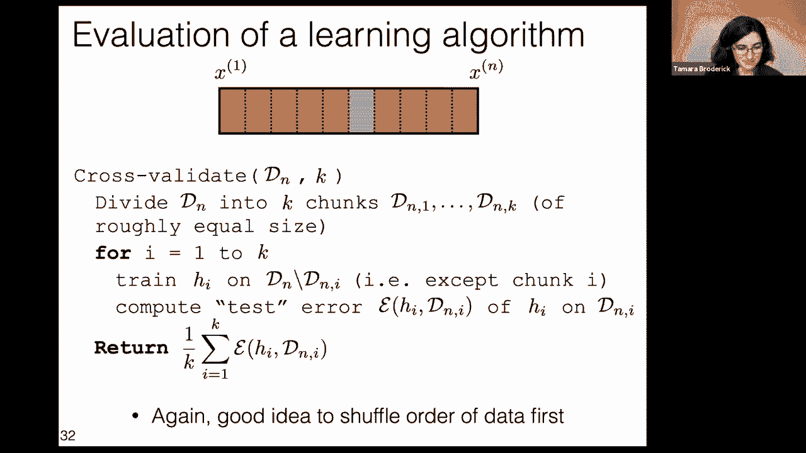