# P5：L5- 回归建模 - ShowMeAI - BV1y44y187wN

okay，it's mit time so let's go ahead and get，started，um so let's just recall uh previously。

we've been talking really about，classification，in this class you know we had a little。

moment where we were talking about how，this fits，into broader machine learning how。

classification is a particular type of，supervised learning and regression。

is a different type of supervised，learning but today we're actually going。

to really get into the details and，actually do something，with regression which is which is new at。

this point so，um again we've been talking about，classification in particular last time。

we really started talking about logistic，regression which despite the name。

is a form of classifier um it's an，algorithm for classification so we also。

called it linear logistic classification，um and we talked about how we can get。

good parameters with this using，gradient descent which is a much more。

general algorithm it can be applied to，optimization in general it doesn't just。

have to be classification and in fact，hopefully we'll，we'll spend some time seeing that today。

so today we're going to focus on，regression，um just as in classification within。

classification we did a lot with linear，classification here we're going to do a。

lot with linear regression，we're going to see that we can add a。

penalty or a regularizer just as we did，in classification，in particular in logistic regression。

called，ridge regression um and then we're going，to talk about how。

even though it looks like we can solve，these problems exactly。

we still actually care about things like，gradient descent，and hopefully we'll have some time to。

talk about stochastic gradient descent。

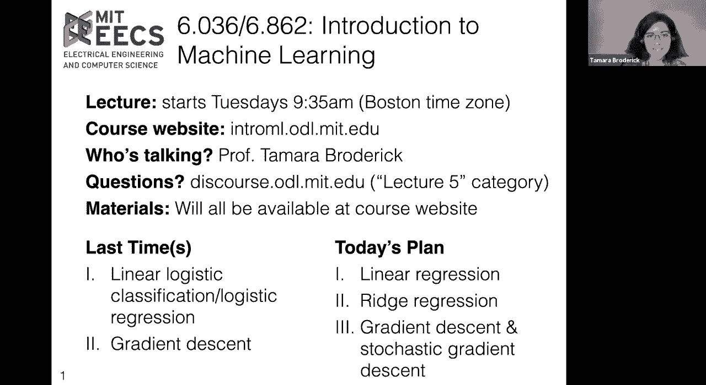

okay so that's the plan for today so，let's just start，by um recalling some of the nomenclature。

and uh notation that we had around，find，sort of the analogs in regression so in。

classification we had a bunch of data，so we could think of data as being。

plural and one particular data point you，might call a datum，um and so let's look at our data um as。

just an example，you know last time we were talking about，um you know when would i wear a coat。

um and i might decide that based on the，temperature，um you know here maybe it's the other。

way when when will i wear，um you know uh a coat，or no sorry here we have yes when will i。

wear a coat as i get to a higher，temperature i'm not wearing a coat as。

i'm in a lower temperature i am wearing，a coat，um and so we can think of each of these。

data points as having，sort of two parts there's the feature，vector um the set of x's in this。

particular case，it's a really simple feature vector it's，it's just one dimensional d。

is one dimension but in general i could，have a lot more features。

as part of my x and then each feature，for for my particular data point has a。

label um and in this case it's minus one，or it's plus one so minus one i'm not，wearing a coat。

plus one i am wearing a coat um and so，now uh we want to find a hypothesis。

a hypothesis ideally that's a good，hypothesis um，that we can use to predict uh。

you know when i'm going to wear a coat，in the future um and so right now。

there's no hypothesis in this plot，there's nothing that tells me for。

every possible x value um what might i，predict what my why might i predict here，um。

but i can add one here's a hypothesis，again a hypothesis is just a function。

that tells me for every possible x value，what's a prediction it doesn't have to。

be a good function it's just any，function although of course i'd like to。

find a good one one that will perform，well um when i get tests。

you know data in the future when i get，new data，um now we talked about a lot of，different losses。

actually that you could use for，classification so one is zero one loss。

um i i incur a loss if i'm wrong i don't，incur a loss if i'm right。

i might care about asymmetric loss i，might be wrong in different ways and，that might matter to me。

i might look at negative log likelihood，uh loss which is something that we，looked at last time，us a。

a way to deal with um data points that，sort of overlap that aren't perfectly。

linearly separable and this notion of，uncertainty，that we talked about and now an example。

of classification because classification，you know could be pretty general but an。

example of classification，is linear classification so in linear，classification we have our set of。

features，and we find a a hyperplane，so that's a pretty simple concept in。

just one dimension it'll just be sort of，a point and a direction。

um but so here we're looking now at a，linear classifier that says on one side，of my hyperplane。

i predict plus one on the other side of，my hyperplane i predict，minus one now something that we've。

certainly seen，is that i could actually have a much，higher dimensional complex feature space。

and so that when i，plot things in a lower dimension maybe，it doesn't look linear。

but if i'm doing linear classification，there is some，high dimensional space with all of my。

features where i'm ultimately going to，have this linear classifier。

okay so now let's let's start developing，regression and linear regression sort of，in comparison。

uh to this classification development，that we've had so here let's let's think，about regression。

so in regression you know a lot of，things are actually pretty similar。

um i'm still going to have a bunch of，data points so here let's look at a，regression problem now。

where i have a single feature um and and，i have my my label，y um and the big difference here is that。

my label can take more values it doesn't，have to be，just minus one or plus one or just a。

discrete set of values which is usually，what we're assuming in classification。

um or in particular it doesn't have to，be sort of this unordered discrete set，of values。

um it can be more general so here our，feature vectors are really kind of，unchanged。

you know we still have a d-dimensional，feature vector um in this cartoon。

it's just one-dimensional um d is one，but our label is the thing that's really。

different again we're letting it，take more values essentially um and。

really be sort of continuously valued so，as an example of this。

suppose i am looking at the temperature，so again let's assume x1 is the，temperature。

but now i'm looking at my air，conditioning bill um and so maybe。

if it gets really really really hot i，expect that，if i have air conditioning my bill will。

go up um and so i might expect this kind，of um sort of relationship between those。

and that's not something where it's just，not，um i actually might be spending more for。

air conditioning as the，average temperature goes up okay，so again i'm going to want a hypothesis。

to express，how do i predict on new data and just as，in classification i can have good。

hypotheses and i can have bad hypotheses，so a hypothesis，is really just going to be some。

function from my features to my new set，of labels my labels here again being，anything。

in the reals um but of course again i'd，like a good one i'd like one that helps，me predict。

on new data points in a good way so，here's an example of a hypothesis。

it is a function that goes from my，features，to my labels okay but again as we said。

we want it to be good，um and just as in classification we came，up with this notion of loss。

to help us decide you know what's good，and what's bad，we're gonna have notions of loss here。

now just as in classification，there can be actually many losses that，we might use。

um it's going to be the case here in，regression that there are many losses。

that we can use um but the loss that，we're going to focus on，is what's known as squared error。

loss so remember the idea of a loss as，we've discussed it before。

is that we have a guess let's call it g，and an actual value let's call it a and。

we want to compare those two，in some way so for instance let's look。

at this particular data point here，in our graph so there is an actual value。

for that data point um we can just look，at its y value in particular so here。

when we say actual value we're really，focusing in on the labels。

now we can also compare to our guess and，our guess，is where that regret regression line is。

at this particular set of x's，our，our guest to our actual here it might。

look like this this little red line，so it goes from our guess which is in。

blue to our actual which is in，um black and then of course to actually，get the loss。

we're gonna square the length of that，little line，and then we could do this at all the。

other data points，to get something like our training error，that we've talked about and just sum up。

over all of that，and so again the loss is just a way to，ask about you know。

how well are we doing how good is this，hypothesis，um what does it mean to to do well in。

this problem and it's worth，reflecting you know why did we have to，just use。

all of these losses that we had already，developed for classification well let's。

look at them so zero one loss，um well one version of this says that i，i have to predict。

one or minus one and that's definitely，not going to be true in regression but，even if i think。

my i'm asking is my prediction exactly，the same as my actual that's just not。

generally going to be true in regression，if i look at any of these points in the。

graph on the right hand side and the，figure on the right hand side。

none of the actuals are the same as，the guesses um but i could still。

actually have a really good hypothesis，even if that's not exactly right like if。

i'm predicting my air conditioning bill，and i'm off by one cent i。

you know i don't think that's so bad and，this squared error loss is expressing。

that if i'm off by one cent that's not，so bad but if i'm off by a hundred，dollars。

that actually might be pretty bad and i，might not be too happy about that。

so i wanna i wanna express that um i，also don't want asymmetric loss for the。

same reason that's gonna have the same，problems as zero one loss。

and negative log likelihood assumes that，my guesses are between zero and one。

which again doesn't sort of make sense，for this regression problem。

um there are plenty of times that my air，conditioning bill will not be between。

zero and one i wouldn't generally expect，it to，okay and again just as we had this。

notion of a linear classifier，we will have a notion of a linear，regressor。

and so in particular in linear，classification we said hey there's this，hyperplane。

so that's sort of just one dimension，lower than this full space of the x's，and y's。

and what we did with the hyperplane and，classification was we used it to，divide to say on one side。

we're going to have our our minus ones，on the other side we're gonna have our，plus ones。

and then we actually used it in a，slightly more involved way，when we were talking about um。

uh logistic regression because actually，sort of just even the，magnitude of the theta could tell us。

something about our uncertainty，and so here though what we're going to，be doing with our hyperplane。

is we're going to be saying hey we can，use this hyperplane to actually make our，predictions。

and so here if we have a hyperplane for，linear regression，that's actually our hypothesis and now。

we're going to say our guesses，are along that hyperplane also a big。

difference here is that um at least for，for this type of，loss we're not really specifying a。

direction we're just looking at that，hyperplane itself，okay and we can also do this in higher。

dimensions so we you know we've，certainly talked about this with。

classification and classification we，could have，you know two-dimensional features higher。

dimensional features and now our，hyperplane is just dividing things in，that higher dimensional space。

and same thing with regression so in，regression we can have two-dimensional。

features or higher dimensional features，so here's x1 and x2，and then what's gonna happen is we're。

going to have a hyperplane prediction，over this um and that will give us our。

y predictions and something that's sort，of worth pointing out here and we'll，come back to this too。

is that um the nature even even though，we're calling it linear regression we。

called it linear classification，um there's not what we might think of as。

a line going on here like always a，one-dimensional thing，like this is definitely a hyperplane。

that we're using，um for our function for our predictions，um and not just you know always one。

dimension，okay so that's classification that's the，general idea of regression。

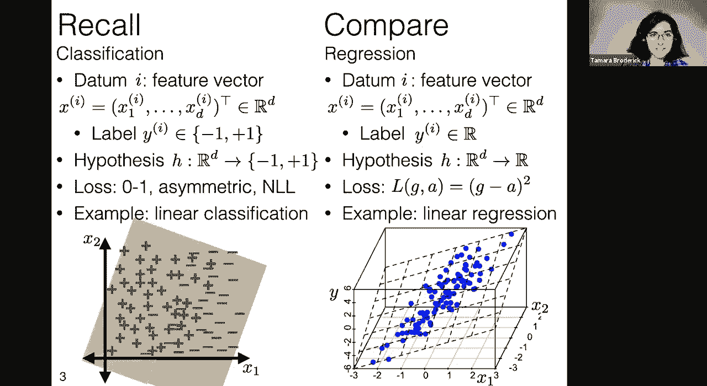

and this example of linear regression，and so let's dive deeper into this so in，is。

what are the hypotheses that we're，thinking of so we have these hypotheses。

for linear classification and now we're，talking about hypotheses for linear，regression and。

hopefully this looks somewhat familiar，you know like we're still talking about。

hyper planes we still have the same，geometries that we've been working on。

this whole time that we've developed，that hopefully，you've gotten more and more intuition on。

um as you've gone along in this course，and the big difference here is that，sign。

on one side or the other here we're，actually just looking at the values，know。

that's very different from，classification，okay so again we want to talk about。

training error just as we talked about，training error for classification and。

actually if you look back，in your notes um from either this，lecture or just from the readings you'll。

see that，we actually defined training error very，generally in the beginning of this。

course we said that it was just this，notion of sort of average loss。

over the training data points um and，that's not specific to any particular。

thing that we might be doing，classification or regression or whatever。

we're just saying for some supervised，learning problem so we have a bunch of，features and a label。

what's the loss between our guess，which comes from the hypothesis and our，actual。

which comes from the label and so this，is very general this is exactly what we，saw before。

and what's going to be different here is，the choice of loss，and the choice of the hypothesis and so。

if we put in，exactly the hypothesis above this linear，regression hypothesis。

and we put in this squared error loss，that we just described，we're going to get out a new training。

error something you might call mean，squared error，or average mean a root mean squared。

error sometimes you might take the root，um but basically what's happening is，average。

that's the 1 over n times the sum and，then there's this squared difference。

okay so this is this is really going to，be the the loss that we're focusing on a，lot today。

um the thing that we're trying to do，something with and in particular you，know just as。

in the past we basically wanted to try，to get this as low as possible，loss。

um and then choose some parameters that，make it as low as possible we're going。

to be doing that again，today now，we're going to do some sort of，this is。

one of those points and this is a，mathematical trick that you have already。

seen in the context of classification，but we're going to do it again，here if we augment our features。

with a feature that is just one like the，the last x we're just going to make。

the value one then that's equivalent，to having had both our theta。

and our offset theta naught so basically，it's a way to get rid of theta not while。

still having the same expressive power，um so you can look back to what we did。

with classification we're going to be，doing the same thing here。

but effectively what's what this lets us，do is it lets us get rid of that theta，naught。

term while still expressing all of the，same，um linear regressors as before。

so this is just sort of convenient for，for math but it doesn't really change。

so we're just doing exactly the same，thing we did in the line above um but，making this。

this little trick where we have，okay and let's we're going to be dealing，with a lot of。

matrices and vectors that are all，multiplying each other and i just think。

a really great unit test as you go along，whenever you're doing this when you're。

coding when you're writing an equation，whatever，is to check the dimensions you know。

check that this makes sense and so let's，just start doing that let's notice。

that theta we've always said is a column，vector it's d by one so theta transpose，is one by d。

same thing with x it's a column vector，it's d by one and so these are two。

things that we can multiply，by each other we're going to get out a，one by one a scalar。

now y i itself is also a scalar it's，just a label it's some number。

and so together when we we we can take，you know we could subtract one of these。

from the other and we'll get a scalar，and that's something we can take the，square of。

so this is all legit this is all things，that you know we can do，within the realms of sort of matrix。

vector multiplication and so we're good，now it's worth noting that this whole。

time we never had to write theta，transpose x i we could have just written。

x i transposed theta um you should，are just，exactly the same thing they're two ways。

of writing the dot product um，certainly the the uh dimensions work out。

x i transpose is going to be 1 by d，theta is d by 1，y i is still one by one and so this。

whole thing gives you a scalar you take，the square and you're good。

okay so now we're going to make this，observation，that what we're doing here is we're。

adding up a bunch of things，squared in fact n different things。

little n those are the the things in the，sum，and so for adding up n different things。

and each one we're squaring them，that's basically the norm of some vector。

the square norm of some vector，and so we can ask ourselves what is that。

vector what is the vector that we're，taking the norm of here，and in order to establish that we're。

going to add in a little bit of new，notation，namely we're going to collect all of our。

x's in a matrix，so let's call so this is this is the，vector we're interested in the one whose。

i component，is this thing i'm highlighting here so，let's call，our our new matrix x tilde。

so you can see that x tilde collects all，of the information that we have on x。

so it has the n data points，as its rows and the d dimensions as its，an，n by d matrix。

why are we calling it x tilde with a，tilde on top，and not just x well to sort of emphasize。

that we've slightly changed things you，know this whole time we've been talking，about a data point。

you know，x1 to xd and here we're slightly，changing things by making it a row。

vector so this is a really typical thing，to do in linear regression。

um this is going to help us get out，formulas that will look familiar。

if you look at for instance wikipedia or，you know another textbook。

um and so this is just a way to write，all the x's together in a matrix。

and we can do the same thing with y so，just as we collected，the，each data point as essentially a row。

that's what we're doing with y here too，so y tilde，has each data point as a row each label，as a row。

and so now the observation that you want，to make，is that you know we said we were，by one。

we said we were interested in the vector，whose elements whose i。

element was this guy was this thing that，we're highlighting，that's exactly this vector if that's not。

immediately obvious to you that's，totally fine，but you should check it you should check。

i mean everything we do with a matrix，vector multiplication，is just something you can write down。

it's just effectively a quick way of，writing a sum，and so you can just double check that on。

your own now that is something that you，can and should do，i'm just going to do a unit test on our。

understanding to make sure that this，even seems plausible so i'm not going to，prove it right here。

but i'm going to just make sure it seems，plausible and in particular what i mean。

by that is i'm going to check the，dimensions，so we just said that x told us n by d。

we know that theta is d by one and so，when i multiply them together i'm going，to get an n by one。

vector y we just said y tilde is n by，one so i can take an n by one vector and。

subtract another n by one vector that's，allowable，and i'm going to get out an n by one。

vector and that's exactly what we said，we wanted we wanted，an n long vector whose elements we were。

going to square and add up，and so finally again，you should definitely check that you。

agree with this as if this isn't，immediately obvious and，and i don't mean you have to do it right，it。

um this thing that we're trying to，minimize this function of theta that。

we're trying to minimize can be，expressed as the norm，of this vector squared times 1 over n。

and something that we've already seen，and used in this class is that another。

way that you can write the norm of a，vector，is as a dot product with itself。

okay so here's here's a question for you，so，here's here's a couple of vectors and i。

want to take their dot product so i'm，going to have to put a transpose on，something。

do i put it on the left term or do i put，it on the right term where do i put the。

transpose this is a question for the the，lots of great answers coming in i'm just。

going to give time for a few more，okay great so totally nailing it。

it's the first term or the left term，and this actually is really important，and let's see why。

so first of all let's notice that，this remember we just said that this x，tilde theta。

minus y tilde is an n by 1，vector it's a column vector and so。

x tilde theta minus y tilde transpose is，1 by n，and so when i take that whole thing。

together i get a dot product and i get a，scalar，if i did it in the other direction if i。

put the transpose on the second term，you should check for yourself just do。

this kind of dimensionality analysis，you're going to get an n by n matrix。

that's that's not a scalar that's not a，value that we can minimize。

that's just something that's totally，different and here what we're looking，for is a single value。

something that's a function of theta，that returns a real value，that we interpret as a loss that we。

interpret as sort of how poorly we're，doing，and then we want to minimize that value。

and so the direction here really matters，it's really important that that，transpose be。

on the first term here now i also want，to note that，that's because each of these is an n by。

one vector，if we were working with row vectors，instead of column vectors the answer。

okay so basically what we did on the，slide was just，a bunch of math to write this loss in a。

fancy way，um but really it's it's really just the，loss of the start this training error。

the squared error loss across our data，and what we want to do with it is we。

want to find some really good choices of，theta，that will make this as low as possible。

that will give us a really，good loss aka a really low loss，and that you know hopefully the the goal。

is that will perform，okay so our goal is to minimize this，loss so all i'm doing here is writing，loss。

on the previous slide so this is just，exactly，this this linear regression loss from。

the previous slide，and we want to find a theta that's going，to minimize this。

that's going to make a really nice low，value of this loss because this tells us。

how poorly we're doing，now here's something that's really cool，and really different from everything。

we've done so far，so everything we've done so far we've，kind of had to beat around the bush。

because we couldn't actually minimize，our losses so when we talked about zero。

one loss when we talked about perceptron，when we talked about that random，algorithm from the very。

first lecture we were sort of thinking，about oh here are some ways that we can。

try to get the loss low，um but you know they have pluses and。

minuses and we certainly can't guarantee，that we'll get the lowest loss even when。

we talked about logistic regression，and gradient descent we come，close to the lowest possible loss。

in fact we could get guarantees we saw，that we might get arbitrarily close as，close as we want。

the lowest possible loss and here's，what's different in this case，in many cases we can just find the。

lowest possible loss we don't have to do，any of these sort of，iterative procedures we can just write。

it down，and that's pretty exciting so let's，let's do that now，why can we do that why why is this。

special，in a way that those other cases weren't，and the reason is that this is a，quadratic。

functions are really nice if i gave you，this quadratic function。

um you can just sort of find as we're，going to see in a moment，um the the point that minimizes that。

function，now the caveat is，just because i have a quadratic function。

doesn't mean that i can find a unique，global minimum，so let's just see some quick examples of。

why that won't always be the case，here is a quadratic function there is no，global minimum。

you can just always get lower no matter，where you are，by just going farther out so this would。

be a case where there would not be a，unique global minimum，and i would not be able to to minimize。

this，here's a here's a slightly more nuanced，case，there are global minima but there's just。

a lot of them and they're all，equally good from the perspective of，minimizing this function。

and but there's just not a unique one，and this is going to turn out to have，some really。

practical and important consequences in，linear regression，and so it's just important to keep in。

mind that just because i have a，there，definitely is always a unique global，minimum but when there is。

things are good and life is good as，okay so what we'd like is this first。

picture we'd like to say hey when there，is a unique global minimum can we just。

find it can we just write it down and，okay so i'm going to get rid of these，pictures。

and in a moment we're going to find this，unique minimizing point，and the thing i want to notice with。

these pictures before we do get rid of，them，is that how will this happen。

well the function will be uniquely，minimized at a point if the gradient at，that point is zero。

and if the function sort of curves up，everywhere，there's a precise way to talk about this。

if you take a linear algebra course，basically the idea is that the matrix of。

second derivatives is positive definite，but for the moment let's just say it。

curves up that's basically the intuition，anyway that this function curves up，everywhere。

then there will be this unique global，minimum and we can sort of see that from。

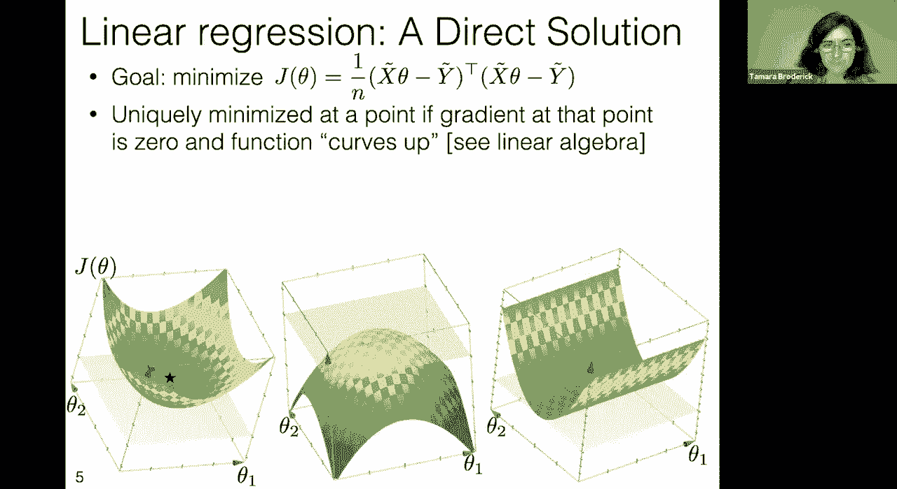

okay so now let's do this let's let's，take the gradient，and let's set it to zero um this is。

something that you're probably familiar，with from your calculus courses。

and the big difference here is that we，might be doing it in higher dimensions。

perhaps than you have worked on in the，past，okay so we're going to take the gradient。

my first question to you and again this，is one for the chat，um oh before i asked my question i。

missed that there was a question sorry，um how can change if the labels are，multi-dimensional or a。

complex number oops sorry could you just，say that again，and let me turn my volume up a little。

change if the labels are or，if y are like common，i'm i am sorry i am just not hearing。

super well i'm not sure if that's just，are the other staff able to hear that，well or is it。

okay other people can't hear as well，either um maybe maybe just typing the。

question would be okay feel free to like，copy and paste or something sorry about。

okay great how will the loss function，change，if the labels are multi-dimensional or。

if the y are complex numbers okay so，the first one the labels being。

multi-dimensional let's just first think，for a moment like how would this arise。

um basically i would be trying to，predict multiple things，right so i would be trying to predict。

you know what is my air conditioning，bill，what is my gas bill and maybe a few，other things um。

and so if in fact everything that i am，trying to predict，is like a bill then what i might do is i。

might add up my losses because that'll，be saying hey these are all literally。

numerical losses they are money that is，out of my pocket，and so i want to add them up and i want。

to say across all of them，the total loss is the amount that i，spent this month or you know something。

like that，now sometimes though what i'm predicting，might be，pretty different you know i'm predicting。

my air conditioning bill but i'm also，predicting，this is，more difficult because it's not。

immediately obvious how these compare，right when i want to say what is my loss。

well these both seem like losses i don't，want to get sick too many days of the。

week and i also don't want to spend too，much on my air conditioning bill。

but i'm going to have to do some real，thought to think about how do i add them，together。

and how do i put them on the same scale，and so i'll have to think about。

you know maybe there should be some，factor that tells me how many days a，week converts。

into units of dollars um，but it won't be as obvious how i make，that loss comparison but i。

but i can and it's something that i can，do for instance by making that，comparison。

in terms of why being complex numbers i，guess it would again depend and i think，this is the real。

underlying answer here on what am i，losses，at the end of the day is saying hey i。

have this practical problem，how much do i lose by getting things，wrong and that doesn't have to be。

squared error loss it doesn't have to be，purely additive it could be something。

else but it's really how much do i lose，and so you really want to ask yourself，for any particular。

practical problem that comes along，what's a natural way to express。

how much i lose by getting things wrong，and then once you've done that that just。

tells you your loss and so this is sort，of an example of how you might do that。

but the real answer is ask yourself for，the problem that you have，how to do that great。

okay so now let's come back to my，question here，gradients we've done them before in。

theory we know something about them，what is the dimension of this gradient。

if i remember our theta is d dimensional，it's a d by 1 vector，and so if i'm going to take this。

gradient what is its dimension，getting some good answers here keep them。

i see some people putting question marks，but you're getting it right so。

okay so the answer that many of you are，getting here，is d by one so remember the idea of the。

gradient，is that i'm in the theta space and it's，a vector that tells me。

where to point in that theta space，and so it's got to be the same dimension。

as theta so this is going to be a d，by 1 vector and in general i think this。

is a good way to think about these，things don't feel like，you're just going in and you have all。

these you know quantities you're just，memorizing like their dimensions i think。

a better way to think about it is what，is it doing，what's what's the point what are we。

trying to accomplish with these，quantities，um and then hopefully that will point。

you to what is the appropriate dimension，okay so we should get a d by one vector，out of doing this。

and so here is another case where what i，have done，is i have taken the gradient。

you could interpret that in the way that，we talked about last time it's the。

you know for each element of theta theta，1 theta 2 theta 3 et cetera，those。

elements but it turns out there's a nice，neat matrix form that i can write this，in。

again i'm going to ask you you know in，your own time later on，if this is not immediately obvious to。

you to work this out and i think there，are at least two things that will be，really helpful to do。

one check the case where n is one，and d is one that's the case where，everything here is a scalar。

we're totally forgetting about all this，matrix vector stuff that's going on。

just you just have an x times x theta，minus y，everything is a scalar and you should。

find that this basically reduces to，familiar concepts from calculus um。

you're just taking a regular derivative，you're just taking you know a regular，square of a value。

um and so you should find that this is，something where you can just。

do the usual derivative calculations，that you would do and this should look。

familiar once you've done that，the second piece of advice is you can，check the vector elements。

again all that this is expressing all，that these，you know matrix vector multiplications。

vector vector multiplications are，expressing，is this sort of fast and easy way to，express these。

sums and derivatives that are happening，and so you can just，check from first principles you know。

what are all of the elements the，gradient，how can you express that in terms of。

sums and then check that it's exactly，what these vectors are expressing and so。

again if this is this is unclear to you，i think the first exercise checking the。

end equals one will give you intuition，about why are we getting。

these values you know and help help them，want to，convince yourself that these are the。

rate matrix vector operations，okay again let's just do our own little。

unit testing to make sure that this even，makes sense，so again when we do this this sort of。

dimensionality analysis we're not，proving that these two things are equal。

you know there are plenty of things that，we could multiply that would satisfy，these dimensions。

but would not be equal but we're，this is，always a great idea again in your code，kind of double。

check okay so we know that x tilde，is n by d we know that theta is d by one。

and we know that y total is n by one and，actually technically speaking we've。

already sort of gone through this and we，know that x tilde theta minus y tilde。

is an n by one vector and here this is，just，x tilde transpose is d by n because it's。

just the transpose of x tilde，so we take a d by n matrix times an n by，one vector。

those ns agree so these are two things，we can multiply，the outer values are d by one and so we。

get exactly a d by one vector out and so，that looks good that looks appropriate。

that's a nice little check that this，looks okay，okay now the point here though wasn't。

just to find the gradient so if we were，doing gradient descent we would just you。

know find this gradient and then sort of，move in the direction of this gradient。

we're trying to find the point where the，gradient is equal to zero。

and solve for that directly so that's a，little bit different，so here what we're gonna do is we're。

gonna set this equal to zero，okay so let's let's go ahead and do that。

so all we're doing in this line is，noticing that that，two over n is just a constant and so we。

can multiply both sides by n over two，and the zero is not affected and that，goes away。

and then we're taking that x tilde，transpose，and just putting it into both terms。

okay so now once we have this，equation well，we can just take one of the terms and。

put it on the other side，so all we did was he said we we have，minus something equals zero so we can。

just bring that something over to the，other side，it's like we added x tilde transpose y，tilde。

to both sides and that's basically all，we're doing in any of these，manipulations is multiplying by。

one and you know adding zero，now let's notice that if we multiply，both sides by the same。

constant this equality would not change，if we multiply both sides by the same。

matrix this equality will not change，and so let's choose a particularly good。

choice of a matrix to multiply by，here we've multiplied both sides by x，tilde transpose x tilde。

all of that inverted so we just took the，equation that we already had。

and pre-multiplied it by the same thing，on both sides and so that's not going to，change。

now why was this a good choice of matrix，to multiply by well we ultimately want。

something of the form theta equals，because something trying to solve for。

theta the whole idea here was to find，where is the gradient what what choice，of theta is there。

at which the gradient is equal to zero，and so we're hoping to end up with an。

equation that looks like theta equals，something，and so we notice that now we have。

something of the form a matrix inverse，times a matrix，and the way that matrix inverses work is。

that when you multiply a matrix inverse，times a matrix，or a matrix times its matrix inverse。

either direction those are just going to，cancel out，and so those cancel out on the left-hand。

side we're just left with theta，and we're left with a formula on the。

right-hand side and crucially it doesn't，have theta in it so we've solved for。

okay now we said that this is a unique，minimizer，if the gradient is equal to zero so we。

it's only a unique minimizer if the，now again this is beyond the linear。

algebra we're going to get into in this，class，um so i'll just tell you you can check。

this kind of thing that it curves up，with what's known as the matrix of，second derivatives。

do not feel that you have to derive this，just don't worry about this。

the thing that i want to tell you though，is is that if the function。

curves up this matrix is invertible，you'll notice this matrix up to a，constant。

is exactly what we need to invert to get，theta，and so if there is a unique minimizer。

then that formula for theta we just，talked about will be fine，because you can take that inverse if。

there's not，and so this is how you see it in the，formula is what happens with that。

inverse and we're going to talk in just，a moment about，like what's actually going on why would。

this ever not，be invertible from a more intuitive，okay let's before we do that though。

let's just back up for a second and，assume for the moment that we have a。

problem where we actually can't invert，that and we can solve for theta so what。

is this going to look like，what it's going to look like is you're，going to start off with some data。

so we said that for our data we have a，bunch of features and a bunch of labels。

so here's an example of a，one-dimensional feature space with a，bunch of labels。

once i have this this defines，a loss function j，and it's a quadratic in theta now。

here remember we played this trick where，we made the offset be actually the last。

element of the theta vector so here we，really do have a theta one and an offset。

we're just calling it theta two which is，a little bit confusing but again it's。

just because we did this trick，where we said that our last feature is。

one and so our offset goes to the end，it's annoying but that's what's，happening here so really。

theta is two dimensional it's we've got，our you know sort of。

slope effectively i mean you know we saw，it's not exactly the slope but the thing，that's defining it。

and the offset and so that defines a j，and now what's really cool is that we。

don't have to do gradient descent or，anything in this we can just go。

straight to the optimum with our formula，that we just came up with。

this function of theta that defines，theta that defines a particular line。

because it defines a particular theta，and so now we can draw that line and in。

particular this is actually the line，that we get，by doing this minimization here so。

in this particular case i just randomly，generated some data，i plugged in exactly this matrix。

and this is the line i got out and it，looks pretty good right it looks like it。

minimizes the loss in the sense that the，predictions，okay so that's what this formula is。

doing it's letting us pick out just a，particular value of the theta which is。

effectively giving us a line，let me just show，the same thing but in a two-dimensional。

so in a two-dimensional feature space，it's going to be much the same we're，going to start off。

with a bunch of data but now that data，has x1 values and x2 values，now that gives us a j of theta。

but in this case because we have to say，what's the direction。

in the x1 space and the x2 space and the，offset that's a three-dimensional，this。

i mean we could get clever and sort of，try to find ways to look at it but i。

can't really draw this function so i'm，not going to but i'm going to。

note that it exists and still whether i，can draw it or not this formula is going，to give us。

the formula for for the particular theta，that's going to optimize it。

and so now once i have that theta that，corresponds to a hyperplane。

this is the hyperplane it corresponds to，and so again i just want to emphasize，that despite the name。

linear regression just as in，classification，linear here really means hyperplane。

so if we look at what does this，prediction look like，in when we have this two-dimensional。

feature space it's it's not，a one-dimensional line it's this higher。

okay so this is what everything looks，like when in fact，we have a nice function that curves up。

and this unique minimizer but now let's，talk about what can go wrong。

why would i not have a nice function，that curves up，and a unique minimizer and it turns out。

this is stuff that really happens in，practice and so it's definitely worth。

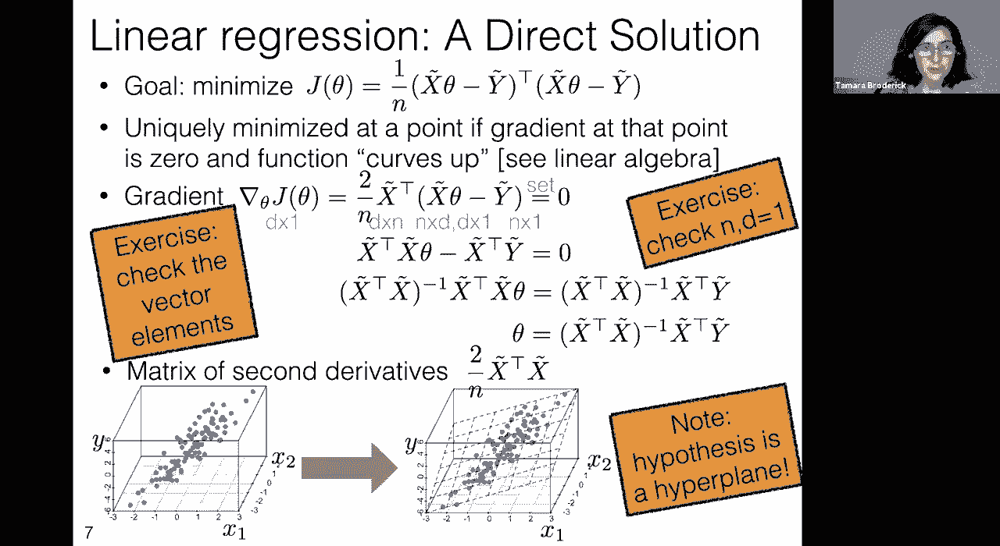

okay so before we say what goes wrong，let's just recap we just said hey what。

what we want to happen and what often，happens is that i have a bunch of data。

you know it spans some nice values in x1，and x2，um or whatever my feature space is and。

it has some nice labels and then i can，use that theta，formula that we just came up with on the。

previous page to find，this best hyperplane that's one that，okay when would that go wrong what would。

go wrong if there wasn't a best，hyperplane，so here's an example suppose i want to，predict。

my air conditioning bill and so what i，did was i measured，the temperature outside。

for my first feature so let's call that，x1 and then for my second feature i。

decided to also express the temperature，outside but in celsius instead of，fahrenheit。

so x1 is the temperature in fahrenheit，x2，is the temperature in celsius they。

encode basically exactly the same，information，and so no matter what my y's are this is。

the x1 and x2 are going to be on this，perfect line with each other，and so now if i go in to fit a。

hyperplane which we just said was，sort of the whole thing that we're doing。

in this case and the whole thing that，this this theta solution is solving for。

well this is a hyperplane that fits this，but this is a hyper plane that fits it。

just as well and in fact you can just，imagine，if you just take this hyperplane and。

sort of rotate it around，this data you're just going to keep，getting。

hyper planes that all fit this data，and so there isn't a unique best。

hyperplane in fact there are infinity，best hyper planes that are all equally，good from the。

perspective of squared error laws when，this happens，that inverse that matrix inverse will。

not exist okay i think there's a，question，yeah，yeah okay um so does theta have the same。

geometrical interpretation here as it，has before，so is it still perpendicular to the。

hyper yes exactly，that's exactly right and you're thinking，about it absolutely perfectly so theta。

is still perpendicular to the hyperplane，it's that is how it describes the。

hyperplane so we've got our theta，that is sort of again the exactly the，normal vector。

to the hyperplane and our theta naught，is still the offset，just as before the only difference。

is what we do with the hyperplane so the，geometric intuition，um that this question has is absolutely。

perfect and absolutely worth enforcing，um and the only key difference is that。

before once we had the hyperplane we，said oh，we'll predict plus one on one side and。

minus one on the other side，in this case we're using the hyperplane。

directly to do our predictions we're，saying hey if i have a new x。

value i'm going to look at what is the，exact value of the hyperplane at that x，value。

and then i'm going to say that's my，prediction but yes all of the geometric，intuition。

is exactly the same and it's just what，we do with the hyperplane，so perfect great。

okay so and that's true of all these，hyperplanes too，the only issue is just that all of these。

hyperplanes from the perspective of our，squared error loss are equally good。

and because of that that matrix won't be，invertible，and we won't have this unique sort of。

best hyperplane and so，you know you couldn't just use this，because。

you would get some sort of error you，know you would say your，your linear algebra system or whatever。

you're using and python would say you，know hey there's an error this isn't。

invertible now there are ways to get，around that but essentially what we're。

going to have to do is we're going to，have to decide，okay between these infinity of。

hyperplanes how do we decide which was，the one that we're going to report which。

is the one that we want，and that's the question that we'll be，answering very shortly。

before we before we do that before we，find the answer before we discuss an。

answer let's also talk about more，problems，that can arise now related problem is。

yes sometimes you might have a unique，best hyper plane but on a technicality。

in particular imagine that you had this，exact situation i just set up。

but my data was a little bit noisier so，here's an example，suppose that i'm interested in my air。

conditioning bill and so i have a，thermometer，that measures the temperature right，outside。

my apartment and it says hey here's the，temperature，you know say in fahrenheit and then i。

have another thermometer，that's like one door down from that，you know and it also measures the。

temperature，now in this case technically speaking，there just is going to be a little bit，of noise。

because no two thermometers are，absolutely perfect they're gonna you。

know have a little bit of noise and，it'll be a little bit off，and i think that you will find that。

actually you can invert this matrix you，will not get an error from your program。

that says hey matrix not invertible，know，yes technically your program will let，you do it。

it will let you find this best theta，um but should it，uh you know it you still have。

so many of these planes that yes，technically one of them is very slightly。

better than the other one but they're，all sort of effectively。

very very close in how well they perform，and we should think a little bit more。

about which one really is the one that，we want to report not，just put it into the formula and go and。

not think，um in general i think that's a great，meta point for machine learning and，probably for life。

never just put stuff in the formula and，go and not think about it always think。

about it always think about what's going，on and this is a case where i think you。

will benefit by doing that，okay so we still have this question even。

if we could invert this matrix we still，kind of want to ask ourselves uh。

which which which hyperplane should we，really report um maybe we should think，so。

so no worries we will we will address，this problem shortly，um before i do that again i want to。

emphasize how much this can come up very，easily，um so back when we talked about features。

this actually even came up i think in a，student question um，we had redundant features if you think。

about one hot encoding，one of our features is exactly a，function of our other features。

and so this just immediately will come，up then right you have，that one of your features is exactly a。

function of your other features and so，there won't be a unique，hyper plane because of that another。

issue is that when you measure a lot of，things in real life，they they often tend to be correlated so。

they often tend to have this problem，just because if you measure enough。

things and they're all sort of around，each other，and you're thinking about the same。

problem it's just very common，that this would come up another way that，this can arise。

is that if you just have a lot of，feature dimensions，now unfortunately again we can't really。

plot things above，two dimensions so this is hard for me to，plot but i will give you a plot。

and then you're going to explore this so，much more in the lab and so basically。

let me start with a very simple plot，suppose that i have a one-dimensional，feature。

and i have a single data point i think，you will all agree that there are many。

hyperplanes that go through this data，point here are some of them。

again there's an infinity of hyperplanes，that all go through this data point。

if i had a two-dimensional feature and i，had two data points there would be an。

infinity of hyperplanes that would go，through those two data points if i had a，thousand。

dimensions of features and a thousand，data points there would still be an，infinity of hyperplanes。

that go through those data points so why，would i have a thousand features why。

would i have more than a thousand，features，well this can often arise in biology in，genetics。

um it can also often arise you know if，you think about the the sort of tricks。

that we've been playing right，like think back to polynomial features。

we just made a whole ton of features out，of nowhere by using polynomial features。

so that's an easy way to get into a，really high dimensional，space and you're going to have exactly。

this problem that we just discussed that，there's this infinity of hyperplanes and，therefore。

no matrix inverse if you get too high，dimensional，so again you're going to be exploring。

that so much more in the lab and you're，gonna get to see you know。

sort of what are the consequences but，it's really coming back down to this。

okay so fundamentally for all of these，reasons we need to think。

how do we choose among the hyperplanes，well we've already developed a little。

intuition about this so you actually had，a problem，um and i believe it was homework three，most。

influential of your features and those，are the ones with sort of the biggest，magnitude，is well。

if we don't really know what's going on，if there's not really a good way to。

distinguish between different，hyperplanes maybe we should choose or we，should prefer。

the theta values that are near zero，unless there's a strong reason not to。

from our data we shouldn't we shouldn't，go and say yes，this feature really matters when we just。

don't have the evidence，to support that this is very much like，what we did。

with logistic regression right with，logistic regression we said hey。

you know it left to our own devices if，we didn't change anything，we make our thetas have humongous。

magnitudes and that doesn't express the，uncertainty that we really have。

we wanted to instead choose thetas that，were near zero unless we had a strong，reason to believe。

that that shouldn't be the case and so，we're going to do exactly the same thing。

here we're going to express a preference，for the theta as being near zero unless。

we have a strong reason not to，and we're actually going to do it in。

exactly the same way that we did for，okay so we have all of these problems we。

think that all of them are fundamentally，about choosing a particular hyperplane。

among many that seem roughly equivalent，we're going to express a preference for。

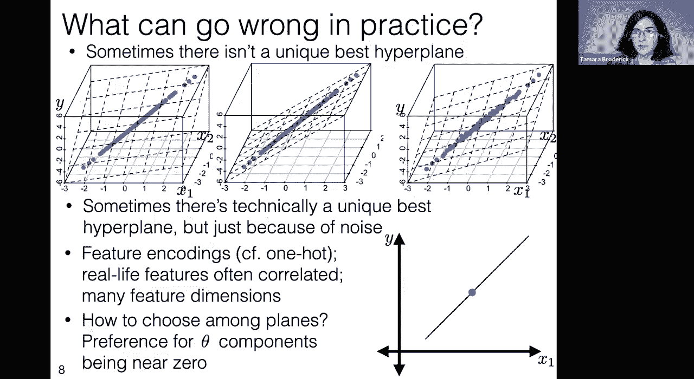

our theta components being near zero，how can we do that well we can。

so we're going to take linear regression，everything we just did，and we're going to add a penalty a。

penalty to big thetas，just like we did with logistic，regression。

when we do that we get something that is，called ridge regression。

if we do it in the exact same way so，here this is，this was our existing linear regression。

training loss so i'm just rewriting it，it was something that we had on the，previous slides。

this is one of the many forms that we，wrote it in，and now we're going to form ridge the。

ridge regression，optimization objective so right now what，we have is just our regular。

linear regression optimization objective，by adding this，square penalty。

okay so a few points about this one this，is not the only penalty that one could。

add that would penalize very large theta，this is a particular choice of a penalty。

that penalizes large theta，it's the same one that we had before but。

actually there are people who absolutely，use other versions，this is just going to be the one that we。

focus on，two notice that when lambda is equal to，zero，the original optimization objective for。

linear regression，here we're going to set lambda greater，than equal to zero or sorry in。

particular greater than zero，to make sure that there is some penalty。

associated with having a large lambda，so we're sorry with having a large theta。

so basically when we have a large theta，bad，we we have things that we add on that，make that bad。

incidentally and this is a question from，the chat，for the chat what happens if lambda is。

less than zero why，you know should should we sometimes set，lambda less than zero would that be a。

great okay so everybody notices one，that if i have lambda less than zero。

then i can decrease my optimization，objective，by choosing thetas that are larger and，larger。

and so in fact i could get the，optimization objective，arbitrarily small just by choosing。

larger and larger theta，and it doesn't even matter what，direction just any direction。

and so this is sort of useless because，all it is is telling me here is。

um a penalty for really large theta it，doesn't matter how small lambda is in。

magnitude as long as it's negative i'm，just preferring an extremely large and。

arbitrarily large theta，one that sort of goes off without bound。

and so that's not really useful to us，what we really want to suggest is that。

there's really a trade-off here，that we get some loss from not being，near the data。

that's what's happening with the first，part of this optimization objective。

and we get some loss from just having a，really large theta，and so that lambda is just controlling。

the trade-off and again because we don't，really know exactly how to make that。

trade-off we'll often use something like，okay so now what's going to happen is。

just as we just solved for the，theta that is the unique global，minimizer。

when that unique global minimizer exists，we're now going to do it here。

for the special case with no offset，the reason for that is entirely because，it's easy to write down。

you can absolutely do this for the case，with an offset um，that could be a fun exercise but i just。

want to say we're only going to do it，yeah a couple questions about the，regularization。

term yeah so why would we want the theta，magnitude to be，near zero since if you have a greater。

magnitude that means the future is more，impactful in the prediction yeah exactly。

so let's let's let's go back，to the previous slide so the question。

you know why do we want that theta。

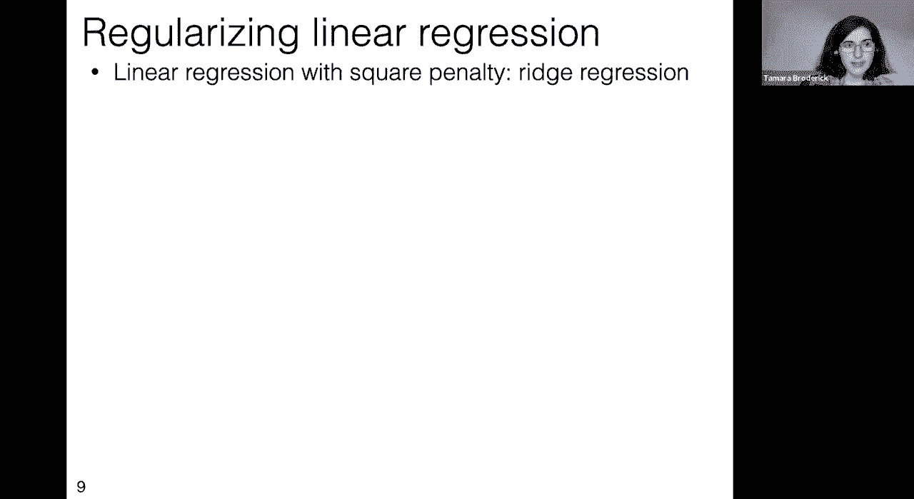

magnitude near zero so on the previous，slide we said，hey if in fact i have a super impactful，feature。

and my data can really pick it up then，linear regression，forget about regularizers is going to。

pick that up，but here are some cases where i run，linear regression，and there are a bunch of totally。

equivalent things，there are a bunch of totally equivalent，settings of theta。

that all give me the exact same results，that all give me the exact same loss or。

in the noisy case they give me almost，exactly the same loss like it's not。

exactly the same but it's so，small as to be you know not really，tell。

you know i can't really tell and so what，we're saying is that in these cases，where there is。

literally basically nothing in the data，to distinguish between different thetas。

then i should probably set the thetas as，close to zero as possible。

because i don't want to erroneously say，yeah these were super impactful features。

because i totally agree with this，question that if，i had a really large theta i would。

probably think to myself those are，really impactful features those really，matter。

but if i don't have evidence to support，that then i don't want to say it。

and so when i don't have evidence to，support that i would prefer。

to choose the theta that is near zero，and so that's what we're doing here。

we're saying hey when there isn't，evidence in my data，to support choosing a really big theta。

one that，demonstrates that this future has a，really big impact then i would prefer。

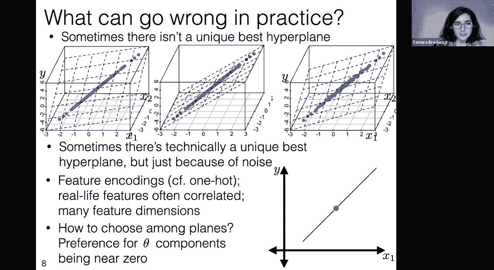

to choose that theta near zero and so，that's what's happening now。

in this penalty is we're saying there's，a trade-off，you know if there's a lot of evidence in。

my data to support there being a really，impactful feature，then that should come out in the first。

part，of this optimization objective but if，there's not，a lot and everything's kind of the same。

then the second part of this，optimization objective kicks in and it。

says hey let's prefer that theta is，there near zero，great another question is。

so how does the rig regression prevent，the coefficients from essentially being，noise。

into theta uh it's like very very small，but not zero，oh so it doesn't yeah so this is this is。

an interesting question um so，let's say um that i ran this all it's，gonna do is it's going to。

ask my theta values to move towards，zero in general and it's going to prefer。

ones that are near zero when everything，is equivalent，but it's not necessarily going to take。

them all the way to zero and so actually，if that's something you're interested in。

and people absolutely are so there are，some people who want to say，hey i want to pick a subset of my。

features that are the ones that matter，and i would like something to very。

clearly tell me which ones are included，and which ones aren't，people often use what's known as an l1。

something called，lasso instead of the ridge regression，there are other ways to do it too。

and this will make some of the theta，values just exactly，equal to zero and then you can just look。

at the non-zero ones and do something，with those，so absolutely this is something that。

people do and ridge regression does not，do it it just tends to move things，smaller，cool okay。

so now we have this regularizer，we said that we're gonna take lambda。

greater than zero or equal to zero if，we're not using the regularizer but。

we're gonna use the regularizer here and，we're not gonna take lambda less than。

zero because we saw some things that，could go really wrong，there and now we're just going to solve。

for theta in the same way that we did，before we're going to find the optimal，theta。

and we're going to ignore the offset，purely for mathematical convenience。

okay so if we do that this is，our ridge regression this is i'm。

literally just rewriting the same thing，but without the offset，so this is this is our whole。

optimization objective we also saw that，it could be written this way。

completely equivalent this is just sort，of the manipulations we did on that。

and now we're going to optimize this so，in particular we're going to say let's，take the gradient。

and set it to zero now something that i，did on the previous slide。

something that notes do and something，that i'm doing here is a little bit。

i'm pulling a fast one on you um so when，of，good stuff okay great，yes you're all you're all totally。

nailing it it's d by one it's got to be，couldn't，put this equality here but it's it's a。

little bit of a fast one right i mean，usually when we say set to zero we think，is something。

that happened in the notes that happened，when we set it to zero，on the other side and it's happening。

here what we really mean is that we're，setting it to the vector zero。

that is to say we're saying each element，of this gradient we're setting to zero，separately。

um and so that's worth keeping in mind，that this might not be the zero that，you're familiar with。

this is actually the vector zero that，has it's a column vector，that's a d by one column vector so。

that's a little bit of a fast one，make sure you go back in the notes and，really。

going on there okay so we're going to，we're not going to go through the。

derivation again this time it's in the，notes and also you can just redo。

everything that we did on the previous，slide，and you're going to get out the。

following but i do want to talk through，this，so the first thing to notice is if，lambda is equal to 0。

this is exactly the solution we got last，time so that's a good，check to begin with。

there's this new matrix called i，let's just briefly say what is i i is，known as the identity matrix。

it's one on the diagonal and zero，everywhere else，okay another quick question for the chat。

okay we're getting a few different，answers on this one so i'm glad that we，talked about it。

um so let's first do some unit tests，on our thinking about this one i。

is always a square matrix but you might，not have known that，here's how you could know we're taking。

that，for square matrices um so it should be，something of dimension by dimension。

okay let's figure out what is its，dimension，well it's got to be something that we，could add。

to this x tilde transpose x tilde so，let's remember what are those dimensions。

sorry x tilde is m by d so x tilde，transpose，is d by n and so we're adding。

i now n and lambda are just scalars so，they're not changing anything。

about the dimensions here we're adding i，to what seems to be a d by d matrix and。

so i is going to have to be，d by d in this case now here's a tricky，thing this i is much like。

zero whenever i appears it doesn't have，to be a d by d，i it doesn't have to be an m by ni it。

could be anything，and you always have to figure it out，to be，careful about just like the zero you。

have to ask yourself okay what are the，things that i'm doing with this what am。

i adding and multiplying and therefore，i'll know，what the dimension is and so in this，okay now again。

something that we're not getting into，but i'm just going to tell you is that。

the matrix of derivatives，we can calculate it and it tells you。

whether this curve's up and here's a fun，fact，this particular matrix matrix derivative。

this matrix of second derivative tells，us that this，always curves up and it is always。

invertible when lambda is greater than，zero so that's very different。

from what we just did when we were just，doing，this um least squares this you know。

without the penalty，sometimes it's not invertible or，sometimes something goes wrong there。

in this case we're safe it's always，invertible as long as lambda。

is greater than zero there have been a，few questions now i'm not sure if that's。

a new question or not is it，uh yeah should there be like sub from i，equals one to end。

in the matrix form oh no that's totally，so，i will correct this in the notes we post。

online i like to think that these typos，are just keeping you on your toes。

um so well done um but yes so so，once we've taken the norm there is no。

more sum from i equals one to n，um and so that should just not be there，great okay。

cool so this all sounds really good，i'll just again mention that you can。

also solve for the minimizing parameters，in the case with an offset it's just a，bit more math。

we're just not doing that math but it's，not like a deep thing that's happening，here。

okay so you can do this you can solve，for this you can get out you know again。

the whole idea is you solve this you get，your theta you get out your hyperplane。

you can plot your hyperplane，um and that's great so。

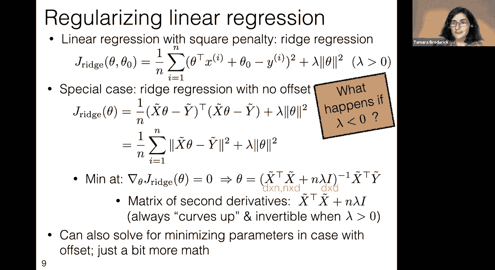

are we all done you know have we solved，everything in linear regression，okay well let's。

make a couple notes on this and，particularly let's make a couple of，notes on features。

um you know we talked previously about，in classification，how it's not just a matter of you know。

somebody gives you some data，and then you just immediately run a，classification algorithm on it that。

often somebody gives you some data and，you have to be really careful。

you have to be really conscious about，the features，and turning them into useful features。

for your algorithm，and that's absolutely the case here as，well and so here i'm just showing again。

the linear regression with the squared，penalty this is exactly from the，previous slide。

we're going to take some notes on the，now a big important point and this is。

this is true for the last time we used a，square penalty as well。

for logistic regression is that we are，implicitly assuming that the features，are on the same scale。

by using this penalty if you，use this penalty you're saying，that lambda times theta 1 squared is。

penalized just as much as lambda times，theta 2 squared，is penalized just as much as lambda。

times theta 3 squared，if you go back to our features lecture，so this is lecture 3。

we saw that if you change the scale of，the data，you change the scale of the theta。

that was not a conscious rhyme but it，turned out to rhyme，but if you change the scale of the。

features you know if you just happen to，put them in different units。

you know or something like that you're，thetas，are on and in particular i mean the，normal vector。

theta not the offset and so here，and that's what we're looking at here，anyway and so here。

you have to notice that if you don't do，something to make sure that your。

x's your features are on the same scale，then implicitly your thetas will be on。

the same scale and they'll be sort of，penalized differently，and so if you want to make sure that。

these penalizations really make sense，you've got to do something like，standardization。

and you know these general techniques to，make sure that all of your features are。

now related note is features still，matter you know，we went through this whole lecture on。

featurization on turning your data into，true，you could you could equally apply。

basically everything in that lecture，to the regression case and i will just，point out。

that this matters and，it's extremely important in so many，aspects of life。

just as one example among many，featurization for regression was，actually a big。

news item this summer so i don't know if，anybody followed the bolivian。

election um there was an extremely，contentious and bitter election in，bolivia。

there was an analysis of whether vote，rigging had happened，there is a huge amount of nuance around。

this issue and i'm just not going to get，into the whole issue，um i encourage you to read up on it if。

you're interested，issues，in this analysis so somebody did this，analysis it was a regression style。

analysis，to decide whether vote rigging had，occurred and it turned out。

that they did not featurize correctly，the time stamps were sorted，alphanumerically。

instead of chronologically and this made，a huge difference，so in particular something like you know。

um 101 pm，was listed before 1am because of the，alphanumeric，rather than chronologically and what。

they were trying to detect was if a big，change had happened，and so this might make it look like a。

change had happened，so this is all just to say futurization，really matters。

and it comes up in very real life um，this had huge consequences again i don't。

want to suggest this was the only thing，that was happening that everything。

hinged on this one element，but this one element was very important。

um and it did matter now a couple of，notes about how，this could come up in your life first of，all。

i think that there is sometimes this，idea this fantasy that what happens。

is that somebody who has applied gives，you a data set and then you as the。

machine learning researcher，do your machine learning magic and then，you give it back with some。

machine learning magic output to that，person and you can just see from a lot。

of the things we've looked at here，including this，that that's just not the case that you。

can't just not look at your features，you can't just not think about your。

features and about your data and what，your goal is，you have to give that thought you have。

to be very careful and very conscious，about it，and you have to really engage with it。

and probably talk to people，now a second meta point that i just want。

to make while we're on here is that，this is not the end of the world to make，a mistake。

you're going to make mistakes in your，analyses literally anybody who's done。

any kind of meaningful analysis has made，a mistake，but what's really important is that it。

be detectable，and so a real issue that arose in this，particular case was that people did not。

share their code in their data，and so the mistake was not known for a。

very long time and people couldn't，correct it，and you know the analysis wasn't。

replicable if you share your code in，your data and you communicate with other，people。

then together you can find any bugs or，mistakes，um and it's just not the end of the。

world to make a mistake um，but by working with other people you can，avoid that。

okay so those are just some sort of，general machine learning，life lessons um but they very much。

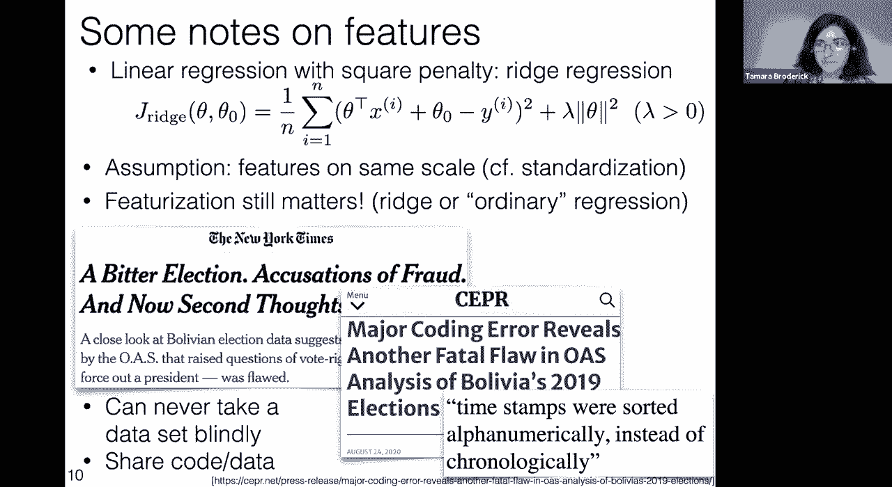

okay so great we have this awesome way，to optimize linear regression um。

you know we don't have to have to worry，about gradient descent right we talked。

about in the past how you know if we had，an optimization objective like the one。

that we have here we could use gradient，descent，we could start from a point and we could。

progressively try to get，closer and closer to the optimum um but，here we don't have to do that。

you know we have this um what you might，call a direct solution，a closed form solution analytical。

solution basically what we mean by that，is you can just write it down you don't。

have to do this iterative procedure，um you can just say here's the solution，boom there it is。

that's the optimum um and yet，some people actually use gradient，descent。

for linear regression for ridge，regression for all of these things that。

we've been talking about so let's ask，ourselves why is that，why would you use gradient descent here。

when we have this，awesome you know analytical closed form，direct solution。

why not just go straight to the answer，the reason is that，even though you have a closed form。

solution that doesn't mean that you can，get it，in zero time so we can't。

talk about accuracy about saying hey，this is such a better solution we go，is great。

you know there's actually a few answers，to this question but this is one of them，that you know。

we can go straight to the optimum we，have to talk about running time。

and we have to say well what are the，actual running times that we see in，practice here。

and it's going to turn out that this，going straight to the optimum solution。

sometimes is very costly it might not，seem like that it might seem like an。

iterative solution would always be less，costly，but that's not really the case so you，have to talk。

whenever you talk about accuracy you，have to talk about running time。

at the same time so if i have a solution，that i can go and get the perfect，solution。

and it just takes me six months to run i，effectively don't have a solution for。

many problems because i，if i don't have six months then i'm just。

not going to get that solution right，um there are some problems in machine。

learning that turn out to effectively，take the age of the universe，i'm not going to run them so i。

effectively don't have the answer to，that problem，this happens to go the other way this is。

again just like machine learning life，lesson，running time doesn't mean anything。

without accuracy so if somebody tells，you they have this cool new machine。

learning algorithm and it takes constant，time or it's super duper fast。

they have to also tell you about，accuracy it's very easy to come up with，methods。

that have a fast running time it's much，harder to come up with methods that have。

a fast running time and give you a good，result，especially a provably good result。

okay so we need to measure accuracy for，the running time that we have。

what is the issue with running time that，arises here，well let's look at our formula again so。

this is the formula that we're saying is，a nice closed form formula it takes us。

straight to the optimum，why would this take a long time to run。

the issue is the matrix inverse if you，are ever working on very large data sets。

um you should always be skeptical of，matrix inverses and you should always，ask yourself。

you know what's the size of the matrix，inverse in particular we just said。

on a previous slide that this is a d by，d matrix，within the inverse and a。

fact of life is that matrix inversion is，somewhere between，quadratic and cubic in d。

nearer to cubic and that's just，extremely expensive if d，is large and actually there are some。

very practical very real-life d's you，can get easily into the millions and，billions。

and then this just can become，prohibitive and it's not really，something that you're going to run in。

practice and so，if gradient descent can get super close，to your optimum。

in a reasonable amount of time and this，exact solution，you，any kind of answer in a reasonable。

amount of time you actually will prefer，descent，so it turns out we have this nice convex。

problem again just as logistic，regression was convex linear regression，is convex。

and then once you add that penalty you，get an even nicer，convex problem that's really going to。

have you know sort of a nice unique，optimum，as we saw and so we can apply gradient。

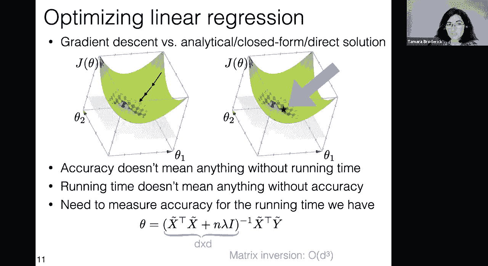

so i'm not going to spend too much time，on this it's really in some sense。

formulaic at this point you want to take，your gradient descent algorithm。

and just apply it to our objective，either our linear regression objective。

or our um ridge regression objective，and and as usual it's going to take some，initialization。

it's going to take some step size，parameter it's going to take some kind，of ending parameter，steps。

t and so we initialize，we go through all of our steps，we update according to the gradient and。

just like logistic regression，there's a lot that's being written here。

but i wouldn't worry about it this is，like you just apply，linear regression you know you apply。

gradient to 7th linear regression and，this is what you get out。

and hopefully that's actually true this，time unlike logistic regression where we，had a typo，checking。

uh and this is i think a good thing to，you know go through an exercise and，check yourself。

um and then we should sort of finish up，and return and so here remember we。

talked about there are a lot of ways，that we could um decide when to stop。

here we're just stopping based on，number of iterations but an emphasis。

that i want to make which is an emphasis，that i made with，logistic regression is that this depends。

again on stepping through all of your，data，before you make any change in theta so。

we just talked about how if you do this，exact，solution you have this problem that you，have a really。

slow algorithm in the dimension here you，have a really slow algorithm the number。

of data points which can also be，extremely large and，is very large in a number of important。

machine learning problems，and so that might be something that you，don't want。

and so there is an alternative so again，i'm going pretty quickly through this。

slide because we're already familiar，with gradient descent。

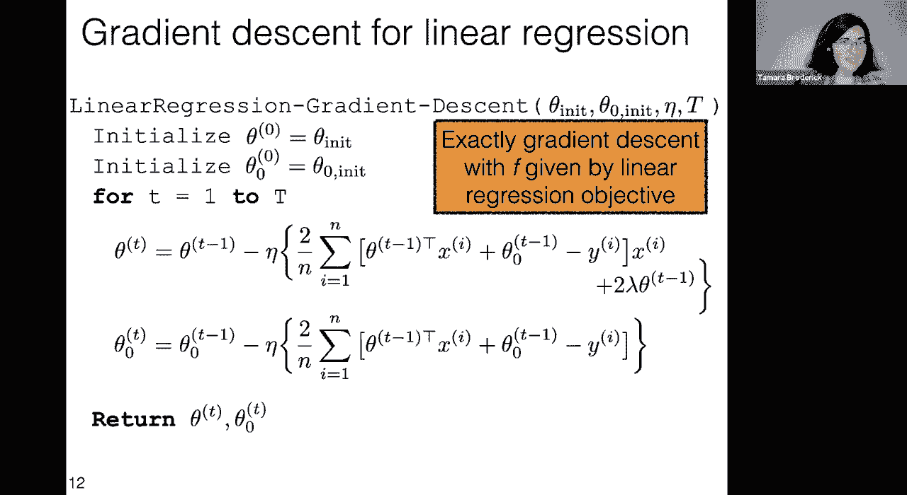

and most of this is is really just，applying linear regression to gradient，descent。

just so that i can talk about stochastic，gradient descent very briefly。

so with gradient descent we had our，objective，and we would just find the gradient for，it。

with stochastic gradient descent what we，do，is instead we notice that this objective。

has a particular form that's just the，sum of these，individual terms these fis。

so this is something that is true for，linear regression but it's also true for。

so basically there's some lost term per，data point in fact，general training error loss as we've set。

and so the idea of stochastic gradient，descent is to look at one of these at a。

time rather than the entire data set，it's going to be noisier，it's going to be you know not as good。

over a particular iteration but because，the iterations are so，fast and so cheap it can be better for。

and so with stochastic gradient descent，we again have initialization we can have。

a step size parameter，and we again have some kind of stopping，we initialize our parameter。

we stop after in this case just some，now again instead of going over a whole，time。

so we randomly select with equal，probability among all of our data points。

and we step in the gradient direction，for one，and so there are two things that are。

different here ada depends on t it will，get smaller，as t gets larger we actually could have。

done this for gradient descent but we，can do that here too，and it's important to do that here and。

now instead of doing a gradient in the，whole data set we do it with just。

one data point and then we return，okay i'll i'll encourage you to read。

more about stochastic gradient descent，in the notes it's going to come up again。

and again this is an extremely，widely used algorithm and it's very。

important because we deal with these，very large data sets and it has a number。

of other nice properties，so today we've talked about linear，regression we've talked about regression。

in general but linear regression in，particular about rage regression with，this penalty。

and about various ways to optimize that，and it's not always clear that you want，to just do the。

this immediate optimum sometimes you，want to do gradient descent or。

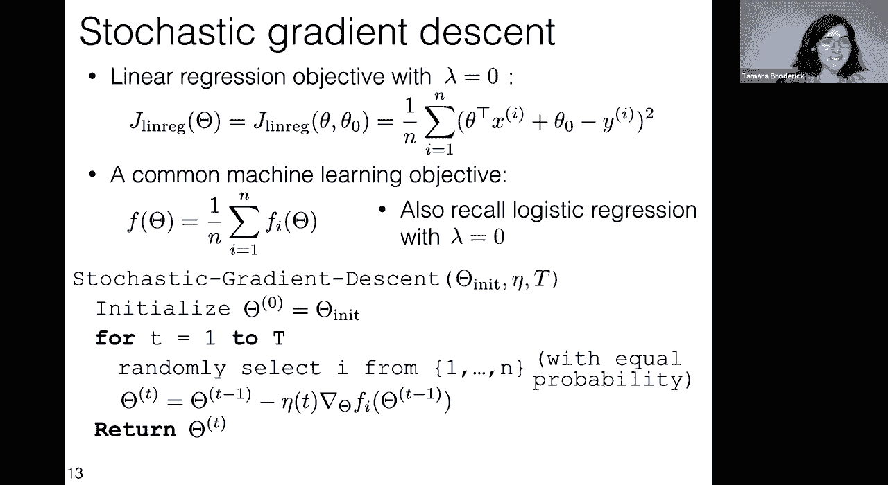

