# P9：L9- 状态机与马尔可夫决策过程 - ShowMeAI - BV1y44y187wN

okay it's that time，so before we get started today i just，want to remind everybody。

that next tuesday november 3rd is，election day in the us，u。s，um you know hopefully many of you have。

already voted um but if you haven't uh，now is a great time to make a plan。

and stick to it uh this is a real life，picture of my pointer finger。

i have voted already in massachusetts，um and uh i'm excited for that there's a。

lot of interesting things on the ballot，in massachusetts including ranked choice。

voting um and it might be the case that，uh wherever you are voting。

that's true as well um also there's this，cool website it's a student group at mit。

um that's all about get out the vote uh，so you might check it out vote。mit。edu。

cool so first of all let's just recall，what have we been doing。

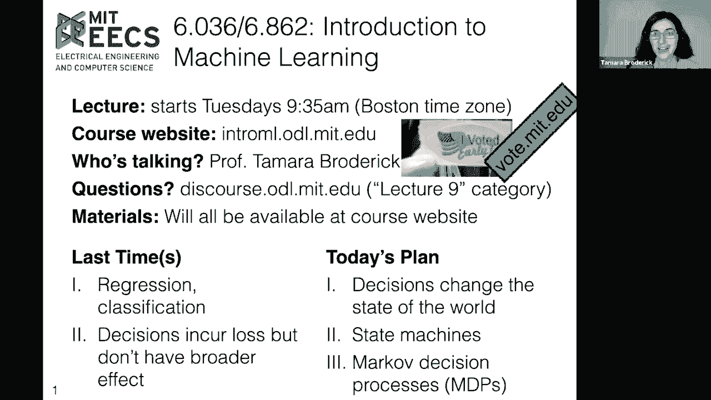

sort of this whole class we've really，been talking a lot about supervised，learning about regression。

about classification about these，particular instances of supervised，learning。

and in those cases we've been interested，in making decisions。

remember back in lecture one you know we，said that machine learning was a set of。

methods for making decisions from data，like。

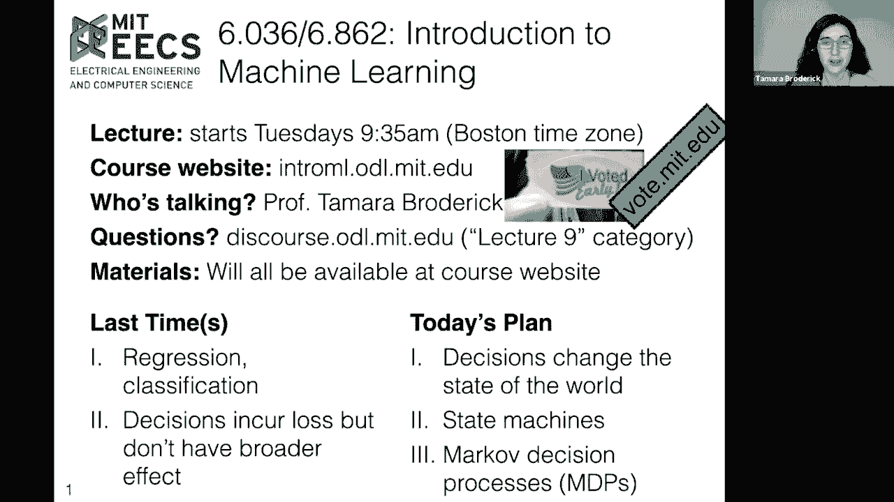

whether i put on a code today or not and，so far our decisions are sort of。

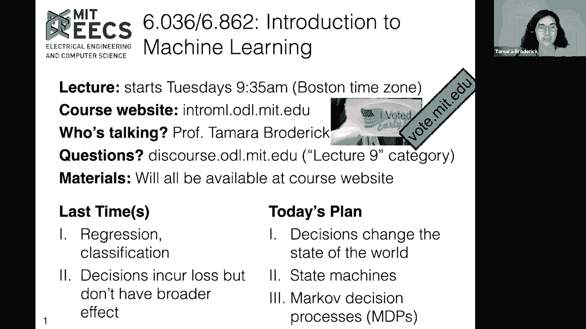

separate um every time a data point，comes along i make a decision and that's。

sort of the end of the story like i，decide whether or not to wear a coat，today。

um and now i'm done and of course，sometimes that's just really not the，case when i make a decision。

it could change the state of the world，um and in ways big and small right so。

like suppose i own a fish farm，and i'm breeding some fish and i make a，decision to not feed my fish。

then my fish will die and now i have to，make a totally different set of。

decisions like how to get a new job，and so i have changed the state of the。

world by making that decision and i，can't sort of，you know make the same set of decisions。

with the same，losses and gains that i did before and，so that's what we're going to talk about。

today we're going to talk about，decisions that can change the state of，the world。

and are going to change what you do and，so in particular first we'll talk about。

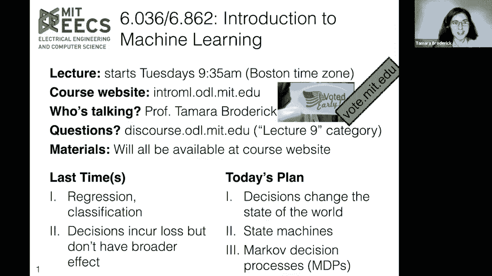

changing the state of the world，with aptly named state machines，and then we'll talk about making。

decisions with the aptly named，markov decision processes。

okay so first let me just note that i'm，going to be having an extended farming。

example in today's lecture so let's just，have a little bit of background。

on farming definitely not a lot i'm not，a farming expert，um but for centuries farmers have known。

that planting，certain crops depletes the soil so you，might go from a rich soil to a poor soil。

after you plant a certain type of crop，and so there are various ways that，people deal with this so。

one is you might rotate crops so some，years you plant a crop，and some years you let the field life。

fallow that is to say you don't put，anything in it，um you don't plant that crop again and。

so that gives time for the soil to。

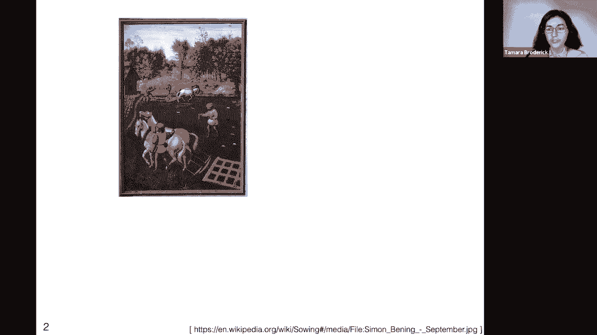

regenerate，have heard，of basically our most famous，agricultural scientist。

george washington carver he's extremely，famous he developed techniques to。

improve soil between plantings，he tended to focus more on different，crops that you could have。

in between planting cotton because，cotton would deplete the soil。

and so he would promote for instance。

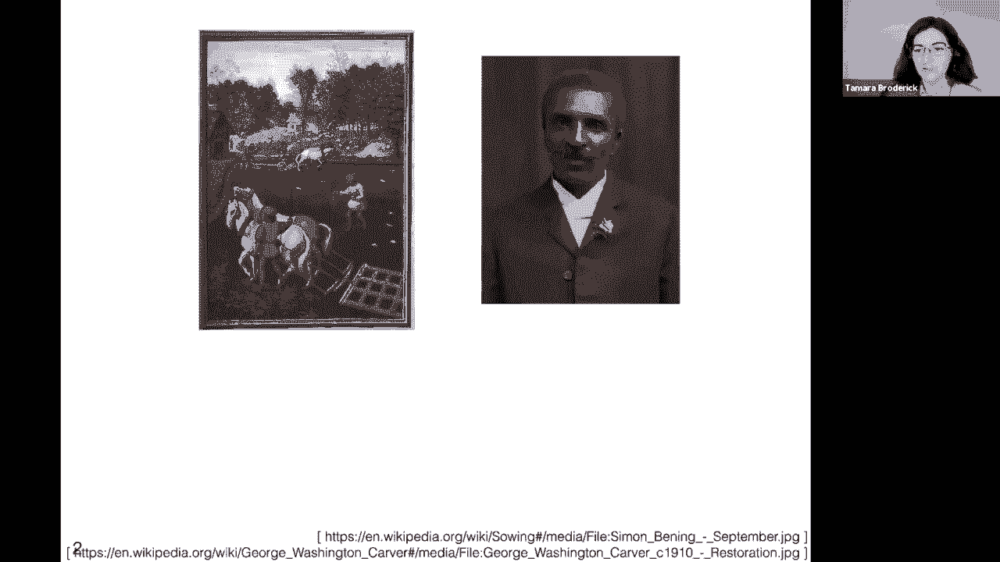

peanut planting in between the cotton，plants today we're going to focus more。

on whether to plant or to fallow and，this happens to be，the subject of a bunch of research。

papers so here's a research paper that's，more recent than，the sort of very old painting and even。

george washington carver's time，but actually you can find research。

papers on these sort of farming problems，to the present day and in fact this。

research paper and those research papers，use exactly the things that we're，decision。

processes and so they are a bit more，complex in the models that they use。

we're going to use a simplifies model，people。

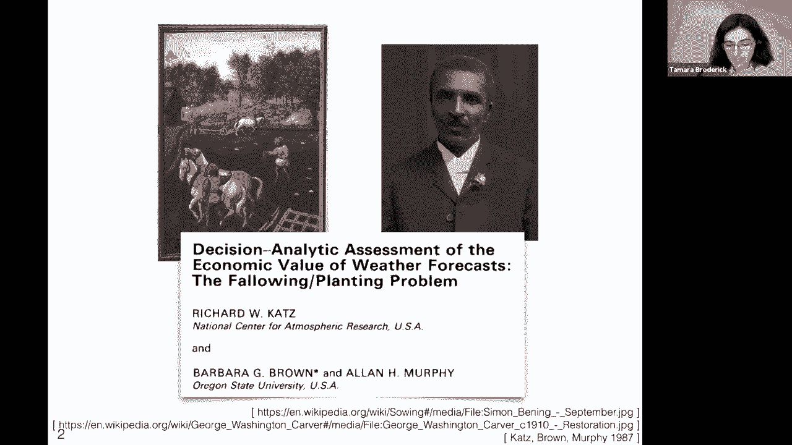

are using in practice okay，so the first thing that we're going to。

do is we're going to develop this model，for the state of the world and for，changing。

the state of the world and that's going，to be again this aptly named，state machine so。

in this case if we're talking about a。

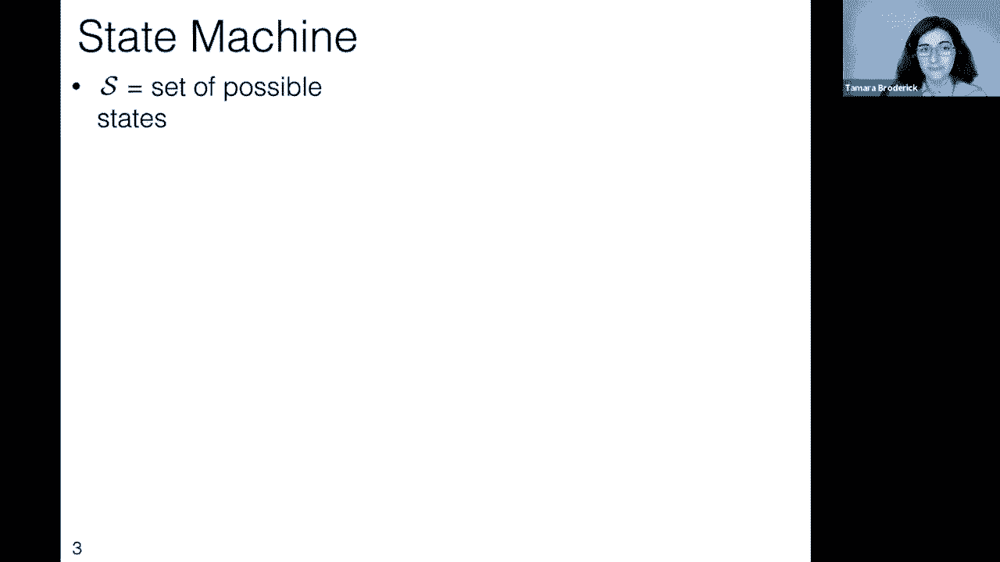

field like maybe i've decided to rent a，field，and farm in this field then。

here i might have uh as possible states，for my field it might have rich soil or。

it might have poor soil so here are two，possible states in this particular。

now i also need a set of possible inputs，these are the things that i can input，into the system。

and in this case sort of the the，possible inputs that we've discussed so。

far are planting the field or letting it，live valid，so those are my possible inputs into。

okay now i'm going to think about sort，of a sequence，of you know inputs and how they change。

the state and in order to think about，that it'll help me to think about well。

where did i start what was my initial，state and so，if i imagine that i'm renting this field。

you know from somebody else and i。

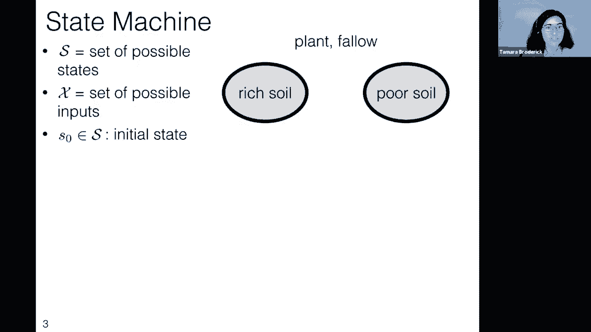

started off，uh maybe you know afresh and nobody else，was using the field before。

in in my example it might be that my，initial state is that it is rich soil。

you know it's great soil it hasn't been，being planted for nothing's planted on。

it for a while and so it's ready to go，it's ready for us to，now i'm going to need a way to。

understand，how i go between different states and，that's what the transition。

function is going to do for me it's，going to say it's going to be a function。

that takes in first a state and then an，input，and then outputs another state and so in，particular。

here is an example of a transition i，might make if i have my input state。

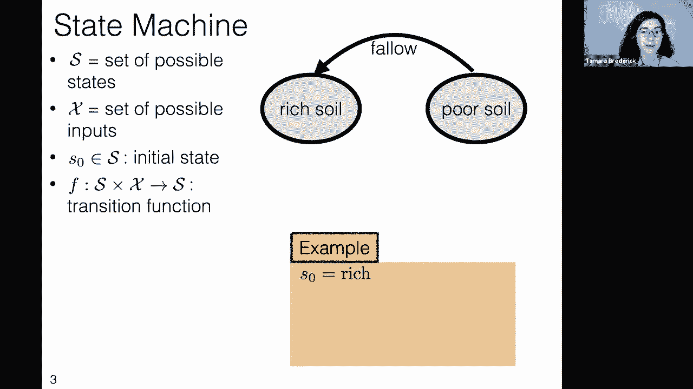

or sorry my first state be poor soil。

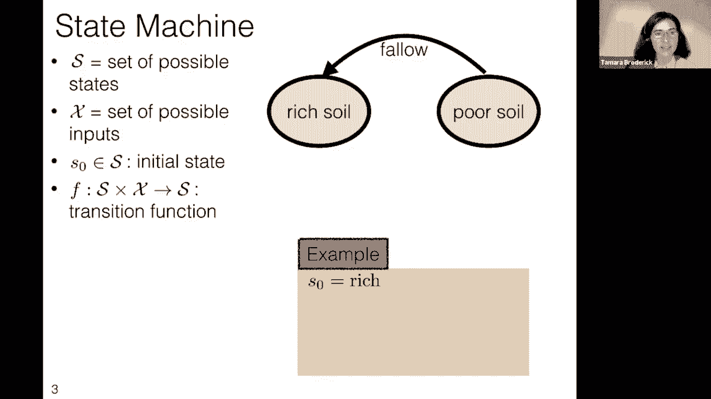

fuel，stay fallow this season，then after i do that i'm going to get，rich soil。

so i start with poor soil i let it lie，fallow i get rich soil，now of course i need to specify what's。

going to happen over all the different，inputs that i might have and so another。

input i might have is i might plant my，field，in which case i expect that maybe my。

poor soil is going to stay poor，now i also have to say for every，possible state that i start with。

for every possible action what's going，to happen and so i would also need to。

specify what happens if i start from，rich soil，and i expect that if i plant on top of。

rich soil next season my，soil will be poor if i plant on top of。

rich soil and i fat or sorry if i just，lie fallow on top of rich soil。

i'm gonna get rich soil again now，implicitly what i'm talking about。

there's a notion of time and so when we，think about this transition function。

we're thinking about going forward one，unit in time here it might be a growing，season or a year。

but the idea is i have my starting state，right now，i have the the input that i put in and，then。

at the next time step i have this output，this new s，and so for instance um i might say okay，you know。

season zero before i even rented this，field the soil was rich，then i took my rich soil i planted now。

i'm gonna make a transition to find out，what happens，you know in season one what do i get out。

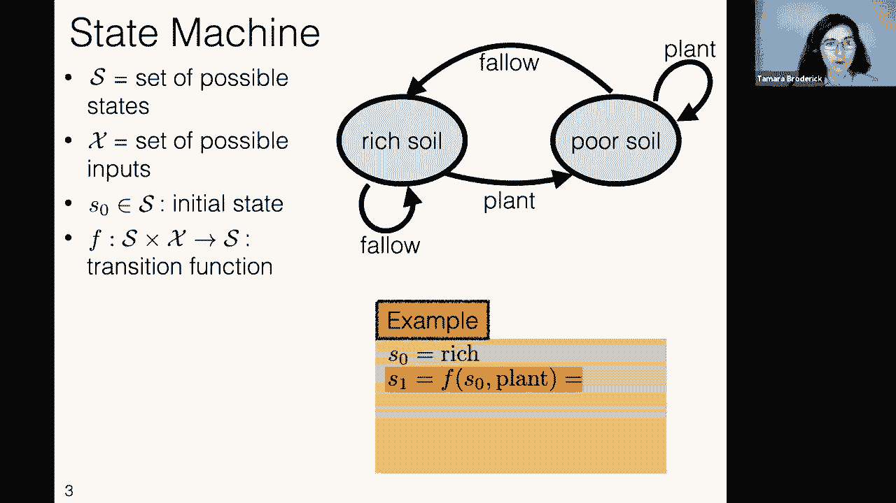

what type of soil，and so here's a my first question for，this，based on our specification of the。

transition function in the diagram above，so we've actually fully specified the，transition function。

with this diagram and so my question。

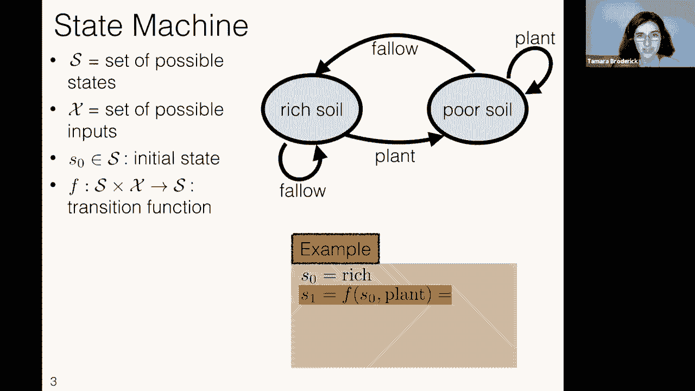

again for，for the chat is what type of soil or，what state，am i going to get out here for s1。

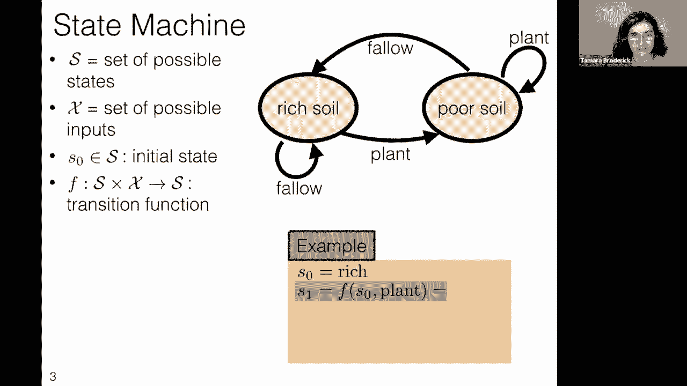

okay great everybody gets it we're，getting poor。

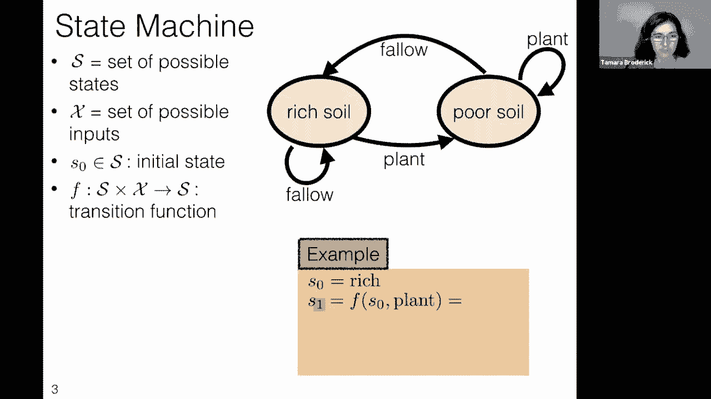

soil and again we just see that from the，transition，this is this next time step one and。

we're gonna see that we start from our，rich soil，that's s naught and we've just specified，that。

we decided to plant that's just a，particular action we could choose。

and then we just see on this diagram，where that goes that goes to the poor，okay now something that。

can often happen although we're not，going to get into it too much。

in this lecture is that you might not，observe the states directly and so。

certainly that seems very plausible in，this farming example like you don't。

necessarily know directly if you have，richer，poor soil you'll probably have some kind。

of measurement apparatus，that will measure something about the，soil for it so for instance at least。

according to this research paper i，linked in the beginning，um the amount of moisture in soil the。

amount of water content is really，important to whether it's rich or poor。

and so you might have some sort of like。

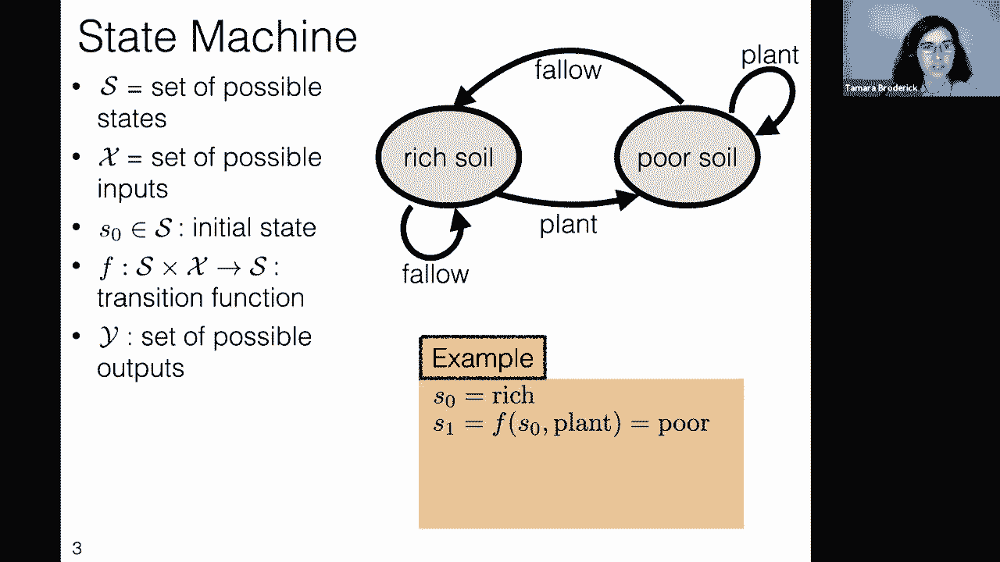

soil water measurement or soil water，sensor that you use，is，what sort of measurements are you。

actually taking what are the outputs，that you're actually，observing so。

of course in order to do that we have to，have some way to go from our state。

to an observed output again throughout，most of this lecture，and in the notes we're typically going。

to be assuming that this is the identity。

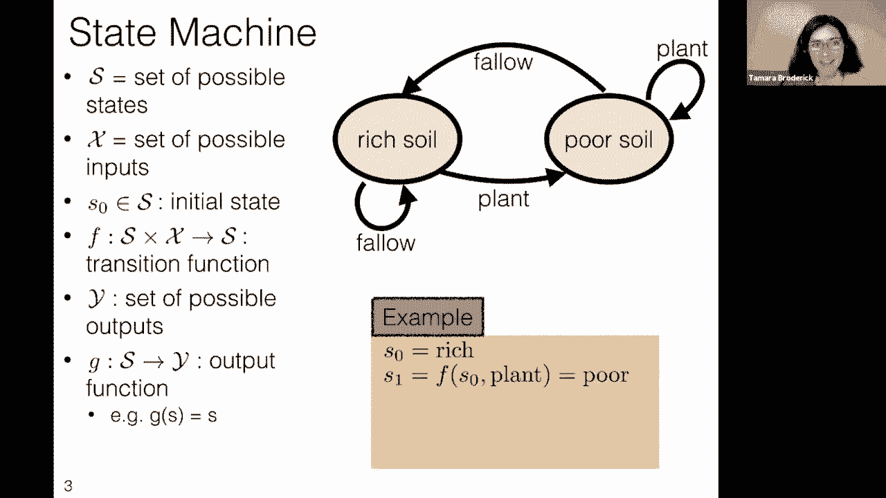

function that we actually can，observe the state directly but that，doesn't have to be the case。

so again i could have something like a，soil moisture sensor，or some other type of you know。

measurement that i take on the soil and，then i would just observe that i。

wouldn't observe directly whether it was，okay so in this particular case as i。

said we're just going to assume，the identity output function here，we're just going to assume that we。

exactly observe the state and so then，this becomes sort of an easy thing we。

know that our set of possible outputs，are exactly the state values rich and，poor。

and in this particular case when we know，that our state is poor。

then in fact we will observe that it is，okay and then we can do this again we。

can say let's take another step you know，maybe last time we planted。

and we got this poor soil so we might，think hey how do i get back to rich soil，maybe i'll。

i'll let my field like fallow this，season and so i can ask you know what it。

what is going to be the output of my，soil the next season after i've let it。

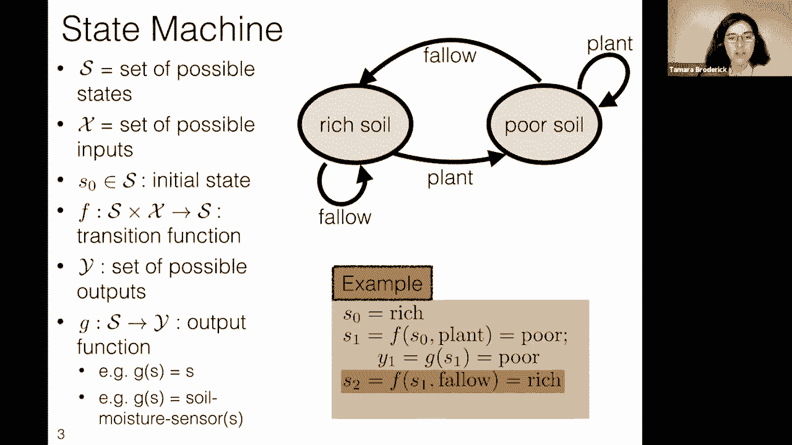

live fallow，well in this case you can again read off，from the state diagram up at the top。

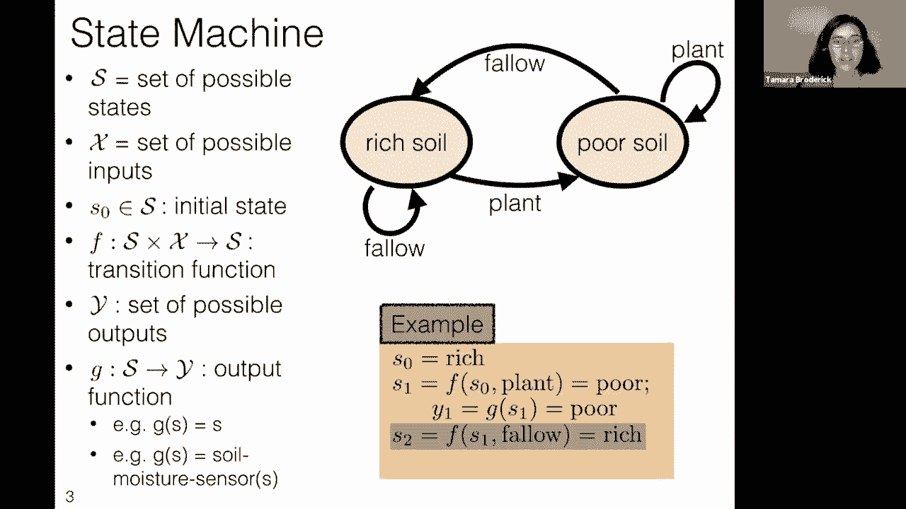

that we're going to end up with rich，soil and again just because this is the，identity function。

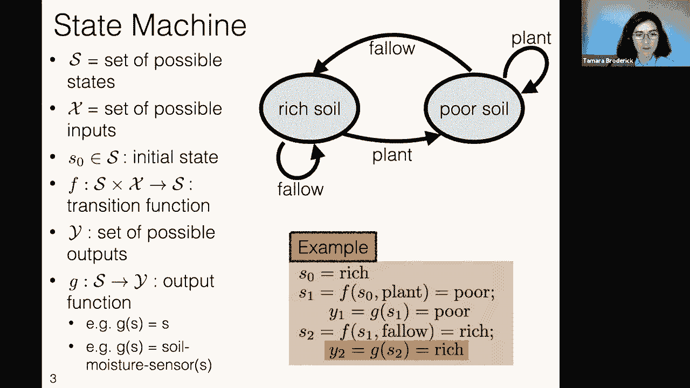

for the output we're just going to get，the exact same state output we're going，to get this rich soil。

okay so this is a state machine，it is described by exactly these six，quantities。

that we've just talked about we have to，say what are the possible states that we，can move between。

what are the ways we can move between。

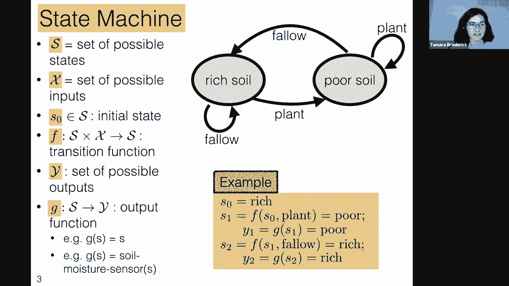

states so first of all what are the，inputs that we can put in。

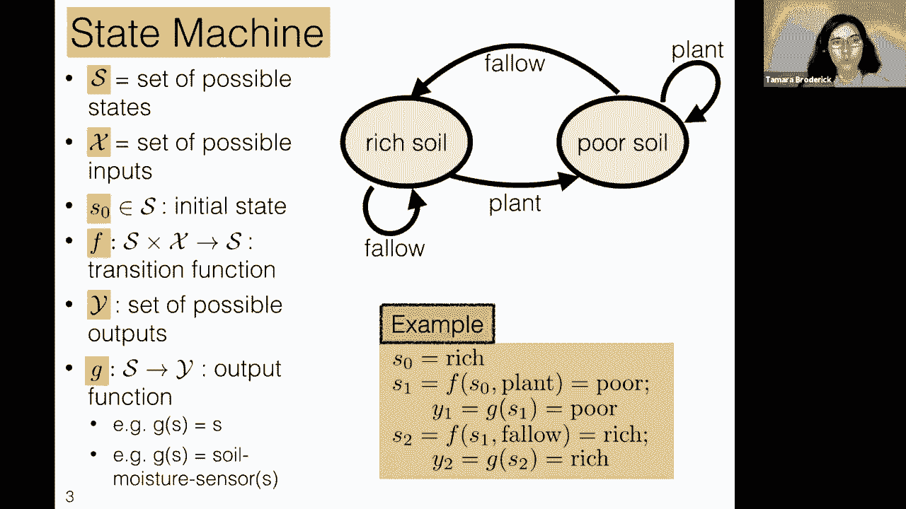

to make a movement happen what is the，initial state that we，start with how do we move that's the。

transition function，it tells us you know when i make some，action on a state what's the new state。

that i get when i，take this input what's the new state，that i get。

and then there's these aspects related，to observation so i have a set of。

possible observations i can make these，outputs，and i have some output function that。

says hey if this state is hidden，if it's latent you know what are you，actually going to observe。

and that's this g okay so this is all，well and good now we have this notion of。

a state machine a way to，to move between states but what we're。

going to do next is we're going to ask，ourselves okay，well like this is nice to be able to。

move between states but we said we，wanted to make decisions，right again you know again just from。

lecture one we said machine learning is，a set of methods for making decisions。

from data and so here we don't really，have a way to make decisions。

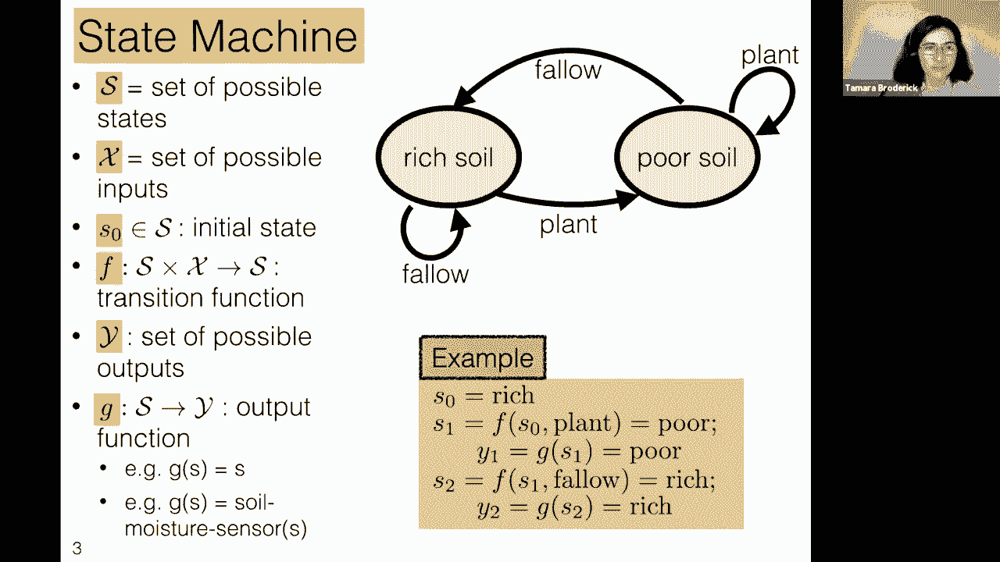

um you know we could move to rich to，poor um but the way that we've made，decisions so far。

in this class is we've had some notion，of what things are better to do。

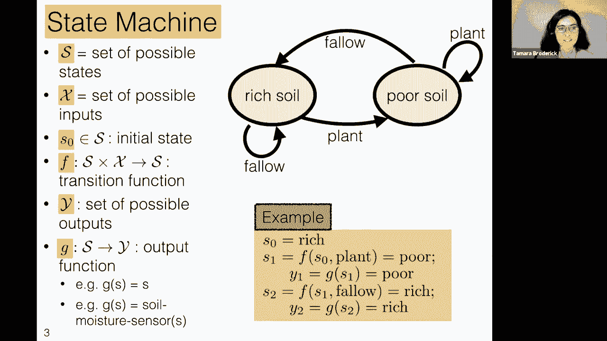

that's the loss the loss tells us，what's better because you make less loss。

like you want to minimize your loss，and so we have to have some notion of a，loss or a gain。

of how well we're doing in order to make，decisions you probably have it。

implicitly in your mind for this example，so far and we're about to make that，explicit。

but it so far doesn't exist on the slide，we haven't said what makes a good，decision。

and so from that perspective we can't，really make decisions yet so we're going，to have to come up。

with a way to have a concept of loss or，actually sort of the inverse of loss，which is reward。

so that's what we're going to come up，and do in a moment just before we do。

that i'll also just note you know here，we have a particularly simple state。

machine which is rich soil and poor soil，of course you could have so many more。

states you could have maybe a bunch of，different variants on you know every。

time you plant you get even，poorer soil and you know there's a，gradation from rich to poor you could。

have more states from something else。

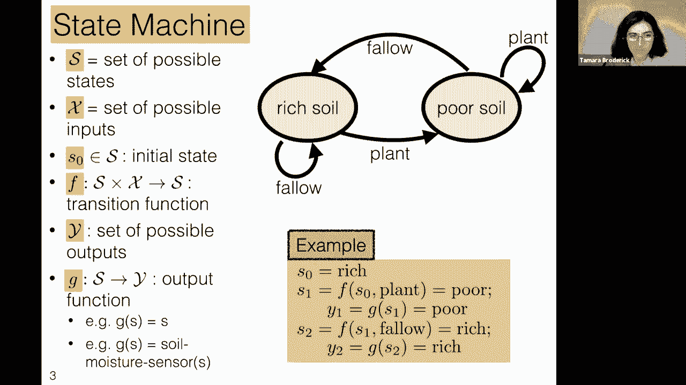

but this is our simple example here，okay but we want to be able to make，decisions so again。

the thing we're going to focus on right，now is coming up with a notion of of。

a loss or again a very equivalent，conception，just sort of the reverse of reward okay。

so let's get rid of this example，now in general for everything we do，going forward。

in the lecture you actually could have，this output function and it could be。

non-trivial like you don't have to ever，observe the states but that's an extra。

layer of complexity that we're，not covering right now and so for。

everything we do going forward we're，going to assume that we observe the。

state directly you can think of that as，an identity output function。

so i'm going to get rid of this part too，the part about the output on the。

assumption that we observe the state。

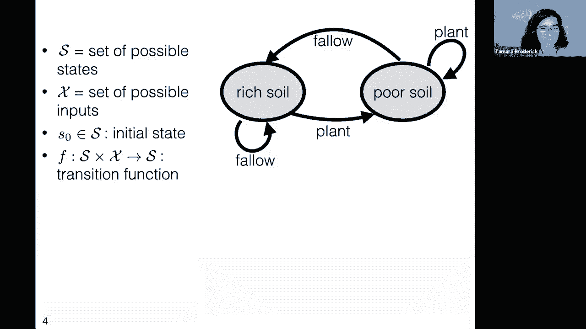

okay okay so now we're ready to start，building up this notion，of a reward and only once we have a。

notion of again，like what makes a set of inputs better，or worse，can we make a decision about those。

inputs and so that's what we're going to，be focusing on here，okay so what what is the reward in。

farming well it's probably your harvest，um that seems like the a pretty natural。

notion of reward and heart farming and，in particular you want your harvest to，be bigger。

when you're farming the assumption is，you have you have a bigger harvest you。

can sell it for more you can make money，or you can eat that harvest you know。

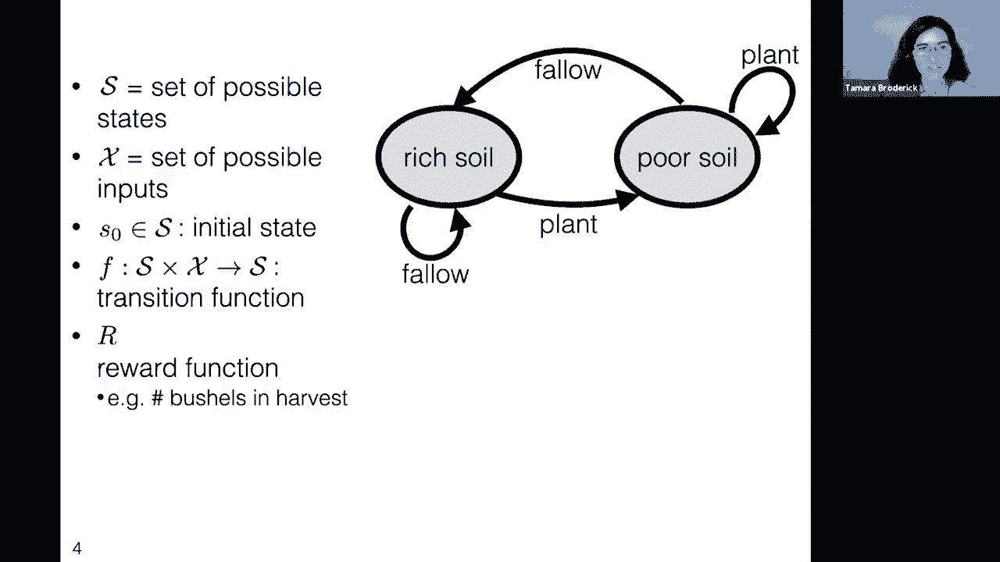

it's just generally a good thing，and so we're going to say that our。

reward function here is the number of，bushels，and a harvest um bushel for the purposes。

that we have here is just，some notion of how much say wheat that，we have harvested from our farm。

according to some kansas wheat website，that i looked up which you know。

who knows how accurate it is but it says，for wheat one bushel equals 60 pounds of。

wheat or approximately 1 million wheat，kernels，anyway it's a bunch of wheat so we're。

going to say we want more，bushels in our herbs that's going to be，our reward function。

and so in particular something that's，going to be generally true about this，reward function。

is that it's going to output a real，number so in this case it happens to be。

you know how many bushels，we harvest and we could even have，fractional bushels um。

and so this could be any real number，really any positive real number。

um but in general we could have other，types of rewards，but we're always going to be thinking of。

them as real numbers you know it could，be dollars it could be something else。

okay so now we have to think of what's，the input to this reward function。

well certainly some part of this input，has got to be our action。

right i mean somehow you know if i plant，i should get some bushels out and if i，fallow。

i should not get any bushels out and so，it makes sense that my input。

is going to be the input to my reward，function um and i'm going to get some，reward based on。

that input now in the past，when we talked about having a loss，we have some input like you know i。

decide to wear a code or not and then i，get my reward，and that's again just the end of the。

story and so what's really different，about how we're approaching things today。

is that it's not just my input that，determines the reward but it's also the，state。

that determines the reward and if you，think about that for a second in this。

application it's pretty clear that's，going to be true if i plant in rich soil。

i expect to get a big harvest a really，good harvest if i plant in poor soil i。

expect to get a worse harvest，not as good of a harvest i don't expect，to get as many good bushels。

at least okay and so let's make that，concrete let's just specify just as we。

have an example of a set of states a set，of inputs and the transitions。

let's make this specific and say what's，a reward function that we might have。

this is just an example reward function，so our example reward function might say。

if i have a rich soil and i plant，then my harvest is going to be say 100，bushels on this field。

if i have poor soil and i plant i，generally expect fewer bushels and so in，this particular example。

let's say we'll get 10 bushels out of，the field，and then of course if i let the field。

lie fallow i really shouldn't get any，harvest，and so in that case i'm going to say。

that my harvest is zero，bushels，okay so this is an example reward，function it's the example reward。

function that we're going to be using，going forward，just as we're sort of using this example。

set of states and inputs and transitions，okay great so now we have a reward we're，all set to go。

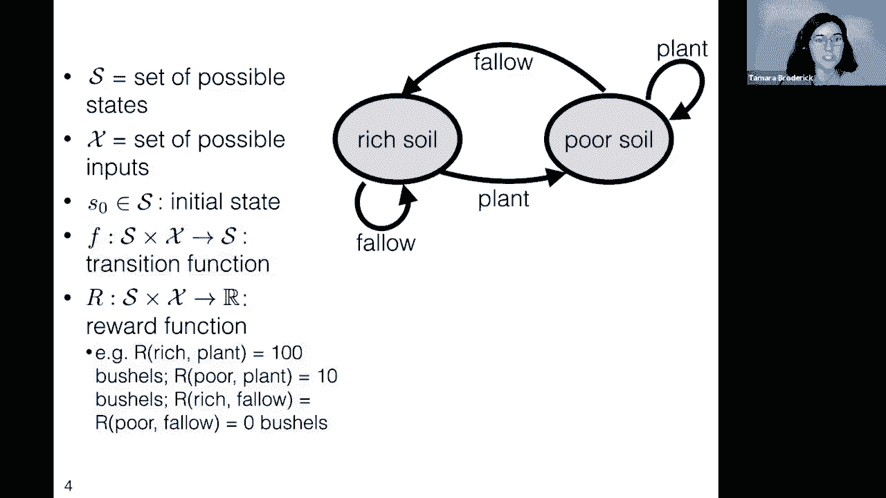

we you know this is what we talked about，a way to make decisions um。

but while we're here let's just notice。

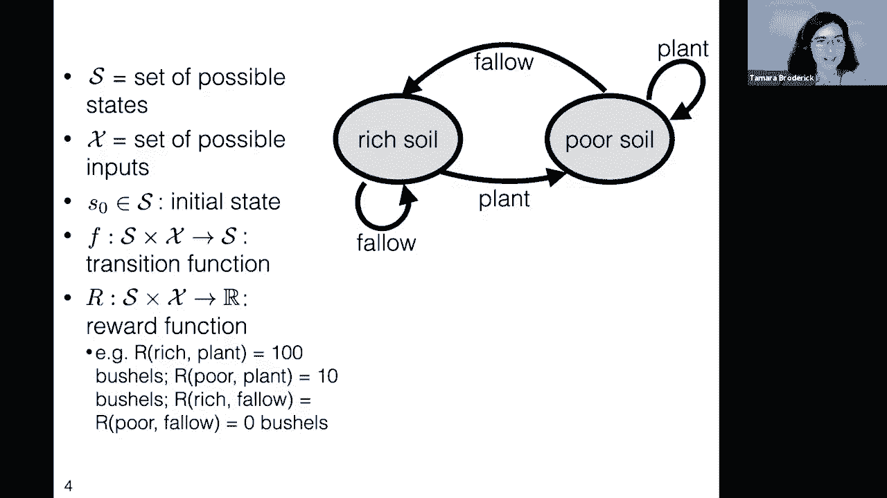

that there's something else that we'd，like to change，about this setup and that's this。

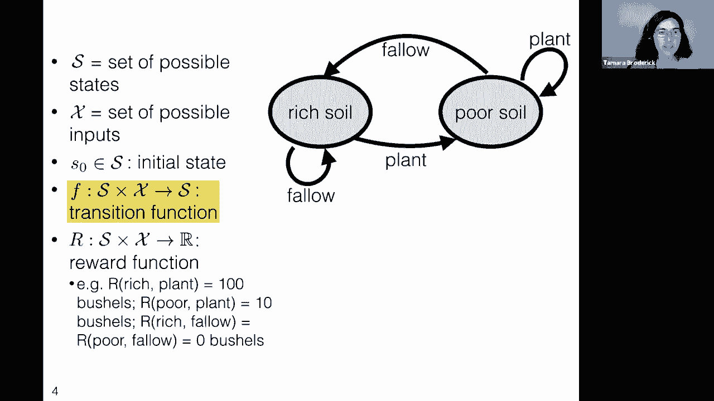

transition function，namely right now this transition，function is totally deterministic。

if i plant i get poor soil，if i let my field lie fallow i get rich，this is。

not totally deterministic it's，stochastic，there's randomness in this so for，with。

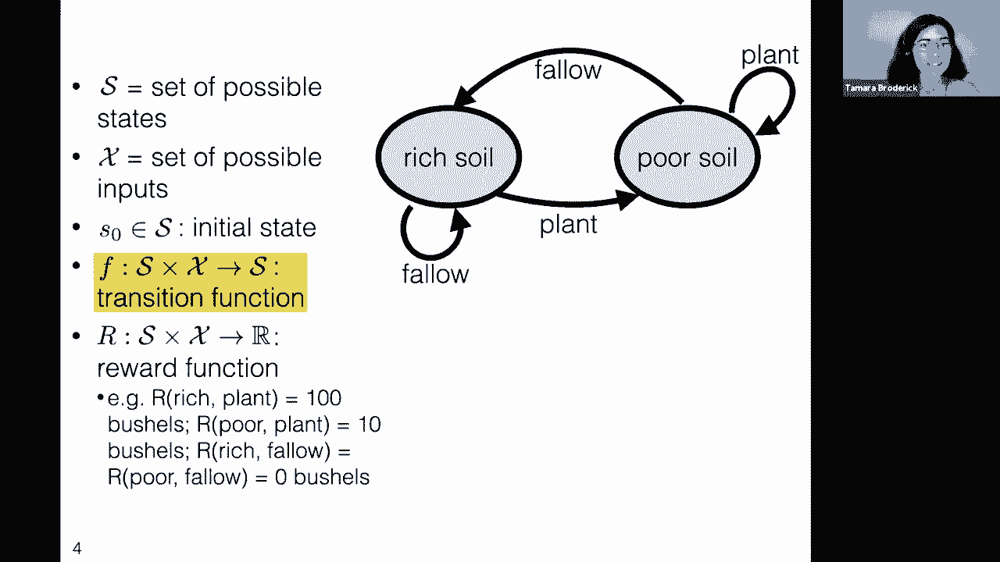

lots of rain the soil might be very very，full of moisture。

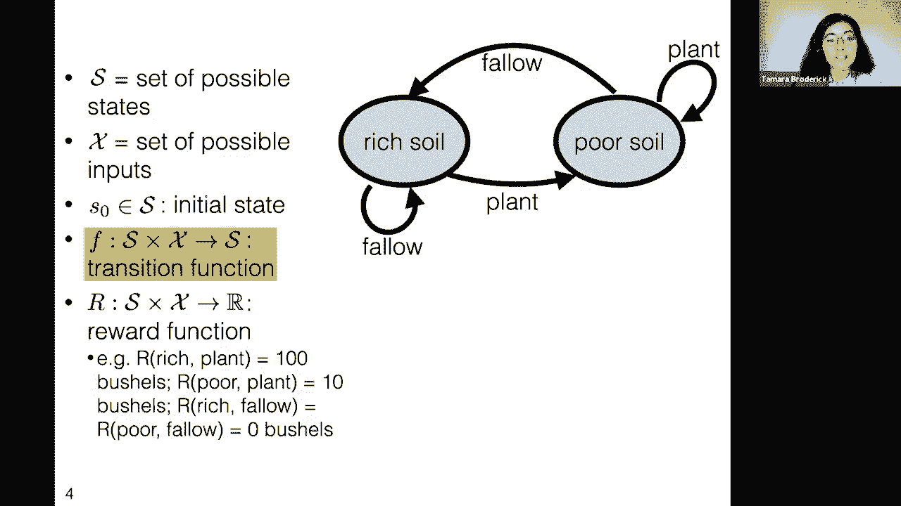

and i may get rich soil even though i，planted that year，so there's some randomness for instance。

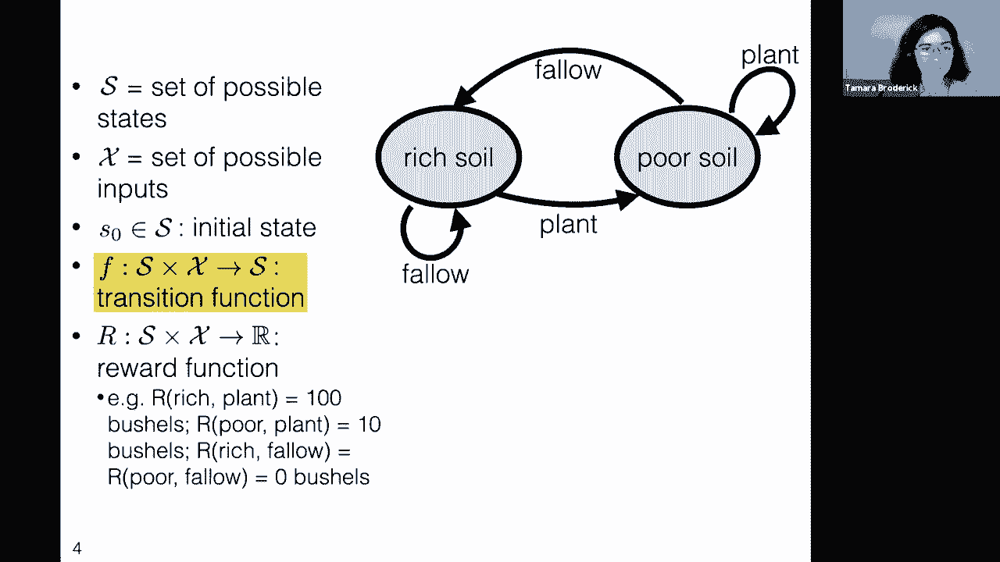

due to weather，and you know other forces as well and so，we'd like to include that。

in our transition we'd like to account，for that and so we're going to have to。

change something because right now this，transition function is totally。

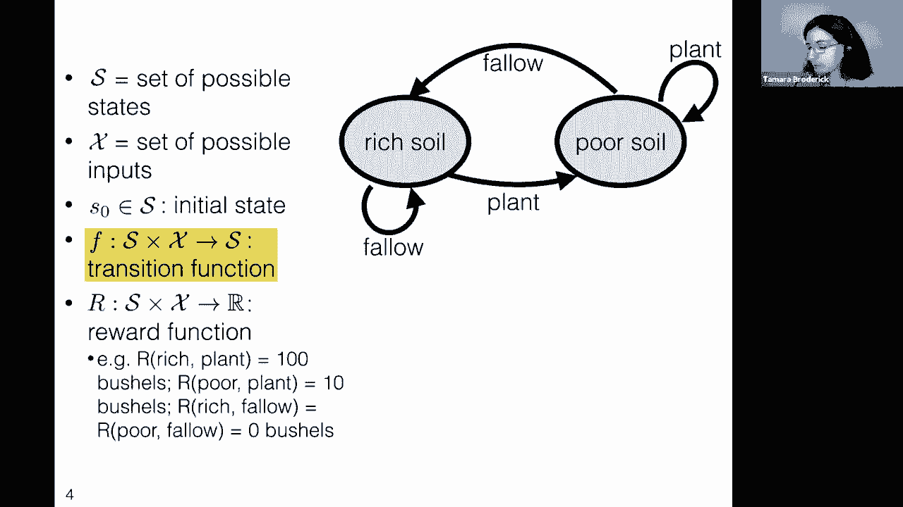

okay so in order to see how we can，change this，let's take our existing。

um plot here our existing diagram of how，we move between rich and poor soil and。

let's focus on the plant，action the plant input so right now。

we have two inputs that we could have we，can have phallo or we can have plant。

we're just going to focus on the plant，and we're going to do this to make our。

so-called transition model and so this，this language you know going from。

transition function to transition model，different，notation t will indicate that we're。

talking about something stochastic and，we'll nail this down in just a second。

okay so we're focusing in over here on，just the plant action，now another way that i could describe。

what's going on in this particular part，of this diagram this plant action。

is i could say what what's happening is，that if i plant，i'm going to pour soil with probability，one。

so here i'm going to say we're looking。

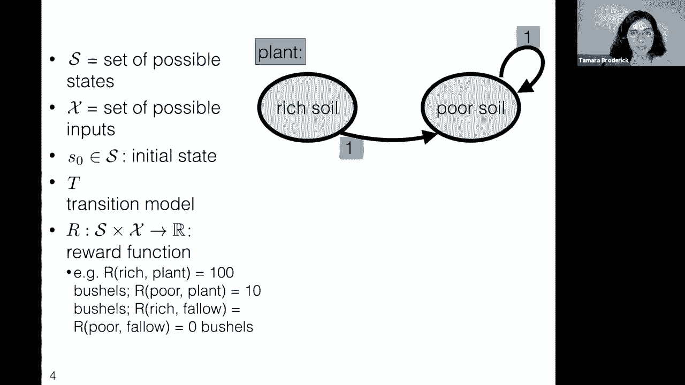

at this plant action，and on each of these arrows i'm going to，put the probability。

of this transition so i go to rich soil，from rich soil to poor cell with，probability one。

and implicitly then i go from poor soil，to rich soil with probability zero。

when i plant so these probabilities have，to add up to one，i have to add up to a hundred percent。

that's what they do here um，but in general they don't have to be。

just one and zero i could have different，probabilities like for instance let's。

think about starting from rich soil，then i have two options either。

i go from rich soil to rich soil or go，from rich soil to poor soil。

now here i'm saying with probability one，if i plant i'll go to porcelain with。

probability zero i'll stay at rich soil，but in general i could have you know any，two numbers。

that add up to one and are non-negative，so it might be the case that if i plant。

with high probability i go to poor soil，but maybe i stay in the rich soil if you。

know the weather was particularly good，likewise if i start from poor soil it。

might be that yeah the vast majority of，the time，but，every now and then with some small。

probability the weather is fantastic and，i i'm actually able to get rich soil。

and so especially in something like，agriculture where you really do have，this you know。

um randomness this stochasticity，um due to the weather you would like to。

account for something like this，okay now of course in order to fully。

specify this we need to say what happens，under each of our actions。

our plant to action and our fallow，action before we do that i just want to。

say that there's another way that we can，represent the information in this，diagram in fact。

by the end we're going to have seen，we're，representing this information is in the。

diagram itself this is a diagram that，fully specifies the plant action in this，transition model。

but a perfectly equivalent way to，specify the plant action，is with something called a transition。

matrix so here we're going to write out，the transition matrix for the plant，action。

this is going to be a matrix that tells，us how to go from basically a starting，state。

to an ending state and so from that，perspective，the size of this matrix is going to be。

number of states by number of states to，specify the matrix you。

have to specify the order of the states，that you're talking about。

so in this case i've specified that i'm，putting the rich state before the poor，state。

i would get a totally different matrix，if i put the poor state before the rich。

state and so it's very important to say，which one you're going to use。

so here i'm using this particular，ordering，now we're going to take the convention。

that the rows are the starting state，and the columns are the ending state so。

that is on whatever growing season i'm，at right now that's going to be on the，rose。

and whatever growing season i'm at next，season that's going to be，the columns okay so my question。

this，entry in the matrix so this entry in the，matrix，should represent what's the probability。

of starting with rich soil，and transitioning to poor soil，under the plant action because again。

this this matrix is just for，the plant action，okay cool folks are recognizing that you。

know we can look at the diagram above，we can see hey what's the probability of，action，it is 0。

9 and similarly you can get all，the other information for this matrix，from that diagram you can。

notice that going from rich to rich the，probability of that is point one。

probably going from quarter rich is 0。01，the probability of going from poor to，poor is 0。99。

again all of this is specifically for，the plant，action you would have another one of。

these for the fallow action which we'll，see in a moment，okay now a couple of things to note。

about this matrix，first note that every one of its rows，adds up to one。

because no matter where you start with a，hundred percent you got to go somewhere。

and so that's what we're saying here，that there's 100 probability that you'll，end up somewhere。

and then the individual choices are the。

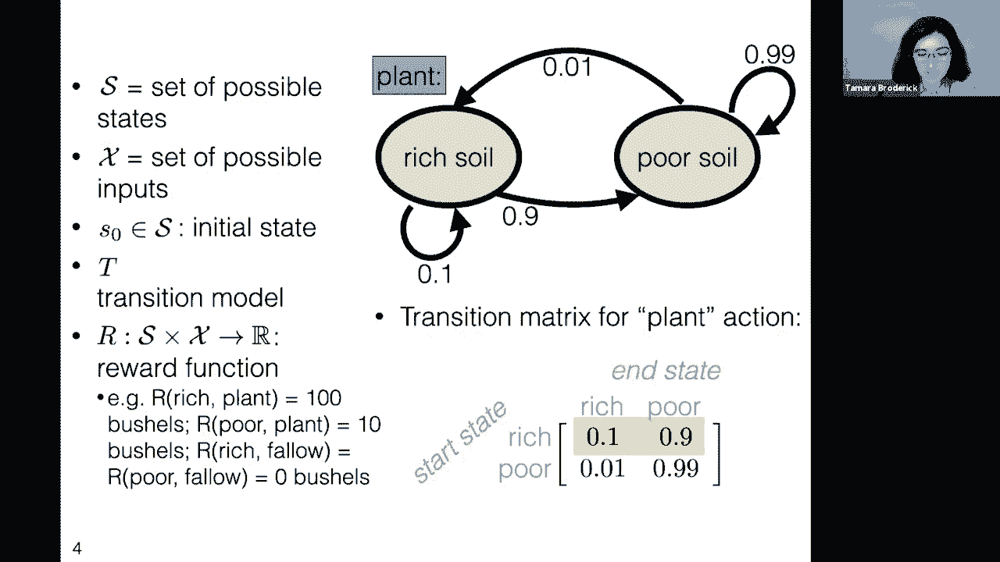

different states，there is no such constraint on the，columns we don't have to have them add。

up to one we certainly see that that's，okay so this is a transition matrix it。

has exactly the information in the，diagram above it，so if you knew this diagram you could。

make this transition matrix if you knew，this transition matrix you could make。

now as i said we also want to specify，what happens under the fallow，action because we haven't fully。

specified our transition model if we，don't see what happens under each action。

and so the next thing we're going to do，is we're going to say what happens under，the fallow action。

well fallow has to have exactly the same，set of states，because they're just the set of states。

that we're using but it might have，different probabilities，for going between those states and。

certainly we expect that we expect that，it lie，fallow or if i have rich soil and i let。

it life out if i let soil lie fallow，then i'll end up with rich soil。

and if i let soil lie fallow i'm，unlikely to end up with porcelain。

although it could happen you know there，could be some，you know drought maybe um and then i。

might end up with personal，and so we want to represent that in this。

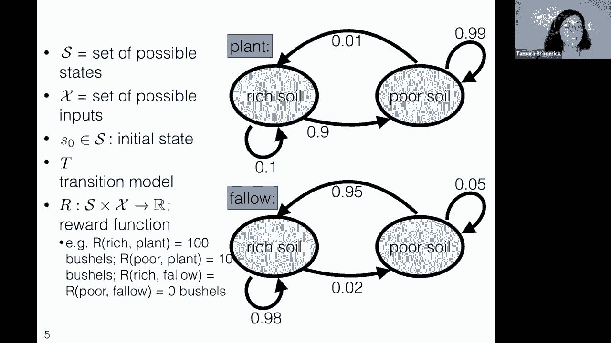

sort of random this the stochastic。

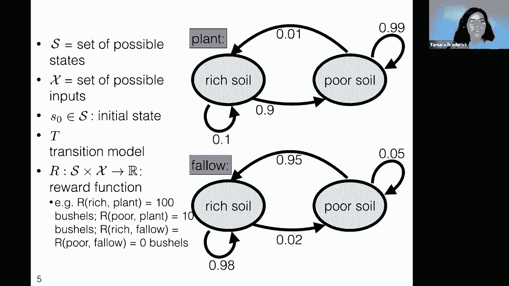

okay so i said that there were going to，be three ways that we could represent。

the transition model so now we have，one as the diagram two is we would have。

a transition matrix for each one of our，set of possible inputs。

and the third is going to be a function，and so that function at this point we。

can kind of anticipate what that，function is going to look like。

it's going to take our starting state，it's going to take the input that we，make。

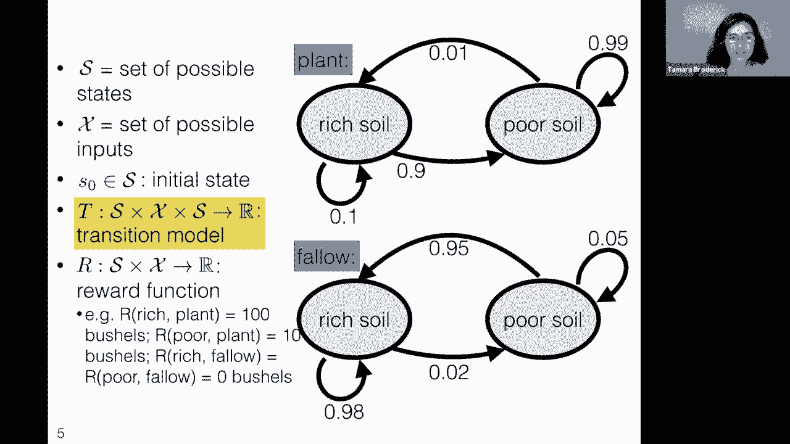

and it's going to say for any ending，state what's the probability of ending，up there。

so that's why we have a state an。

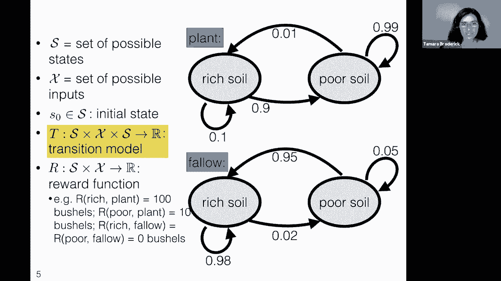

input and another state，okay so let's do an example like for，instance let's look at this，0。

9 here well this point nine represents，the probability，that on the next round on the。

next step at time t the teeth growing，time we have poor soil given that。

on the previous time time t minus one we，now let me just make a little note about，notation here this。

capital s of t represents what's called，a random variable，and so the idea is if we were just sort。

of running through this model，we don't know what the state of that，soil is going to be。

at time t because it's stochastic and so，we can represent that with st and say。

hey that's stochastic we don't know what，it's going to be，but if we refer to any particular state。

like poor soil is a particular state，we could refer to that with a little s。

we could say hey this is a particular，possible state it's one of our set of。

possible states and we'll refer to it，with a little s，okay so here is this again the。

probability of going from pour，starting from ranch if i decide to plant。

and so we're going to call this，t the function t of rich plant poor，so the first argument in t is my。

starting state，the second argument in t is my。

input and the third argument in t。

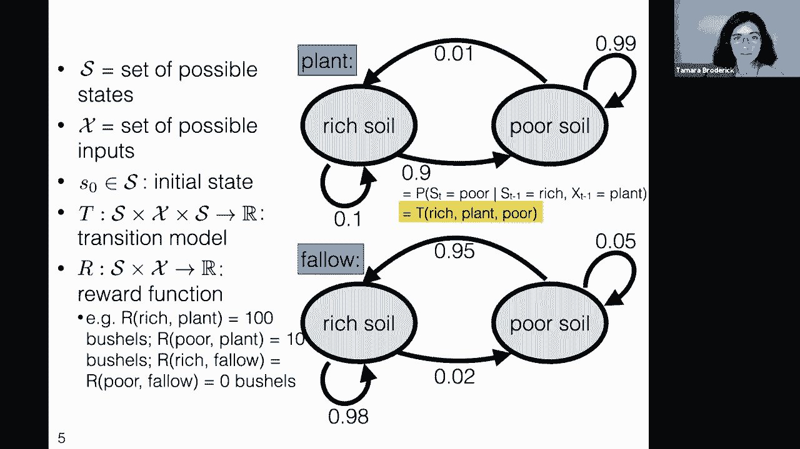

is my ending state and so that's，again a third way to specify the，transition model and it's sort of。

formally what you will typically see in，a description of a markov decision，process。

which it turns out we've been defining，okay so there's two things that we've，done at this point。

we noticed that we were missing when we，had this state machine that just told us。

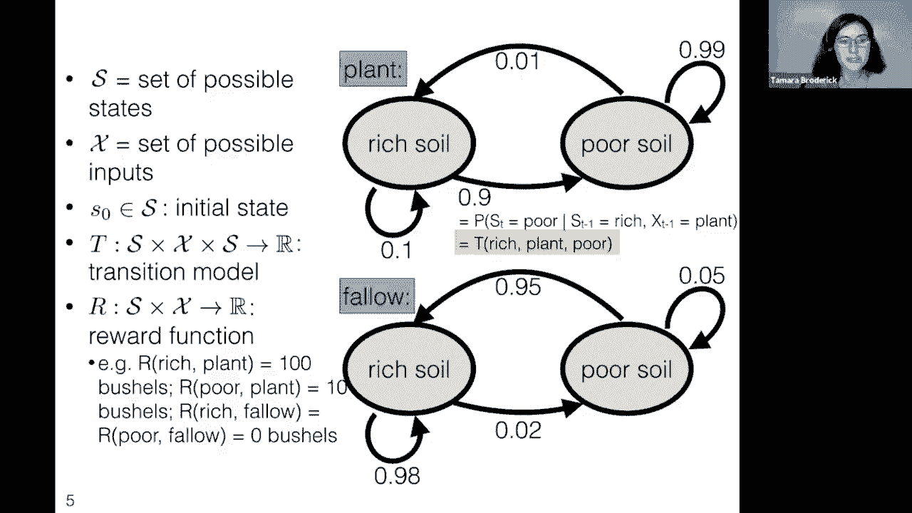

a，ability to talk about what's what's a，good set of decisions what's a good set。

of inputs，and we also noticed that we were missing，this ability to talk about。

randomness about stochasticity and so，once we include，both of those two changes。

we essentially basically，have a markup decision process i say。

basically because i'm going to make some，cosmetic changes，to this in a second but these are the。

two really big changes。

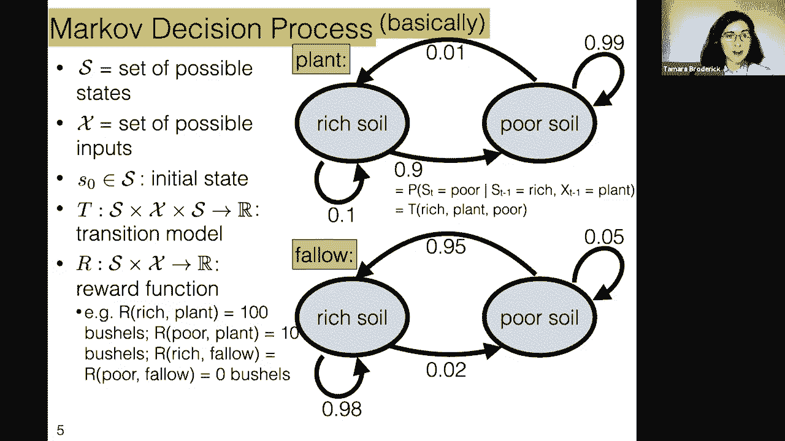

the big changes are we now have a way，to talk about rewards about what makes a。

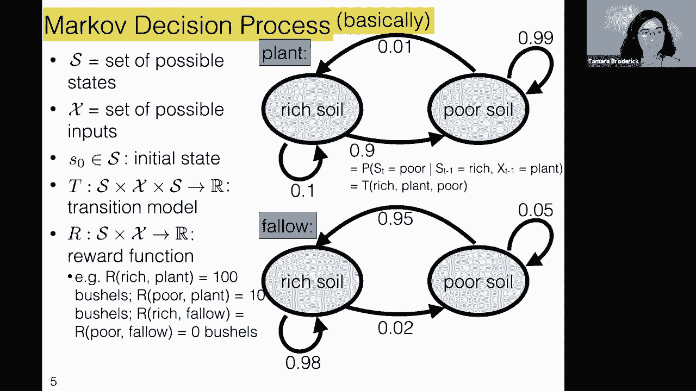

set of inputs good，what makes it desirable to us and we，have a way to talk about。

sort of stochasticity in the process，randomness in the process，again。

are going to be some cosmetic changes so，the next thing we're going to do is。

we're going to make those cosmetic，okay so the first thing that's sort of a。

cosmetic change is we were calling these。

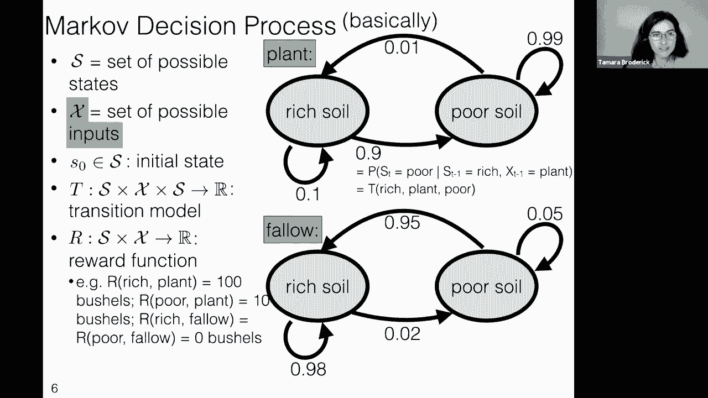

inputs when we were talking about a，state machine。

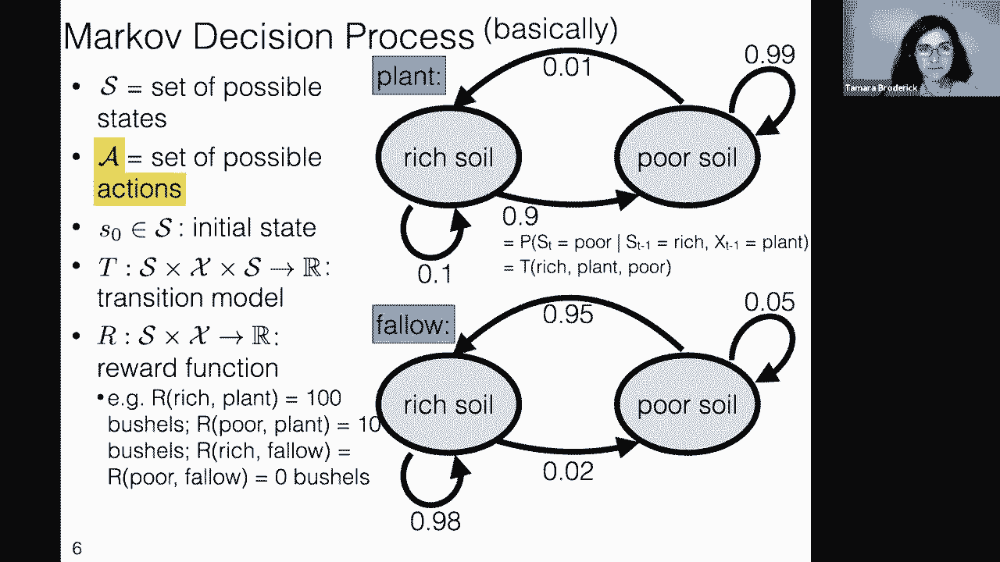

now we're going to call these actions i，was kind of calling them both。

all along um but they're basically the，thing that we're doing，that changes the state and so let me。

just figure out，okay where all in this slide was i using，this x notation for inputs。

and i'm just going to change it to the a，notation，for actions we haven't really changed。

anything here，this one's just sort of a nomenclature。

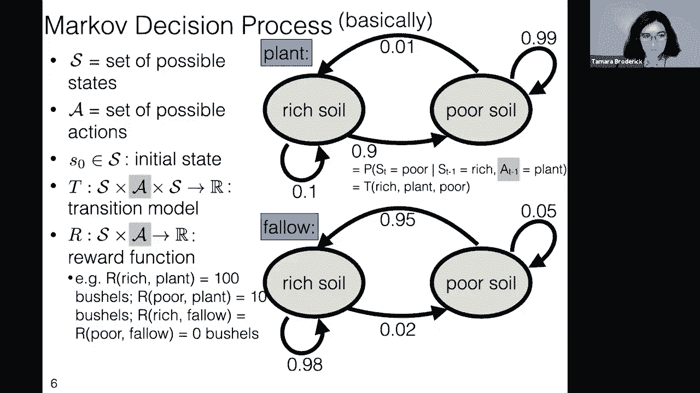

thing，okay the next cosmetic change is that。

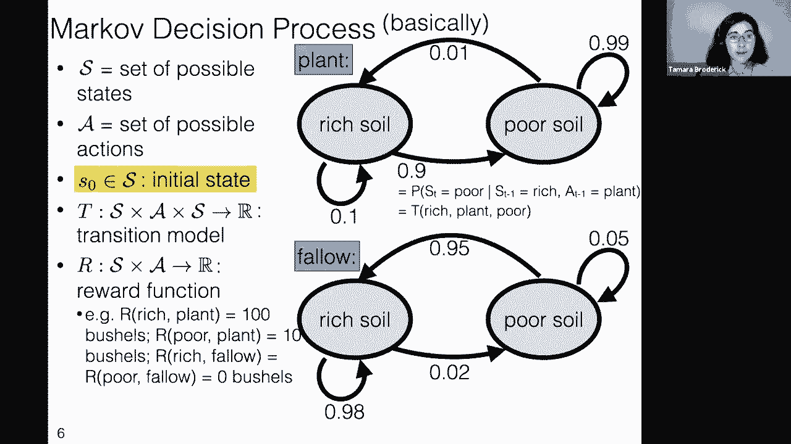

when we were talking about our state，machine we referred to an initial state。

in this case we're kind of going to，think about all the possible initial，states。

as we go forward and so we won't，specifically say，that an initial state is part of our。

markov decision process so i'm just，going to get rid of this initial state。

again it's sort of cosmetic you know，whenever we actually run this we're。

going to have to start from somewhere，but we're not going to formally say that。

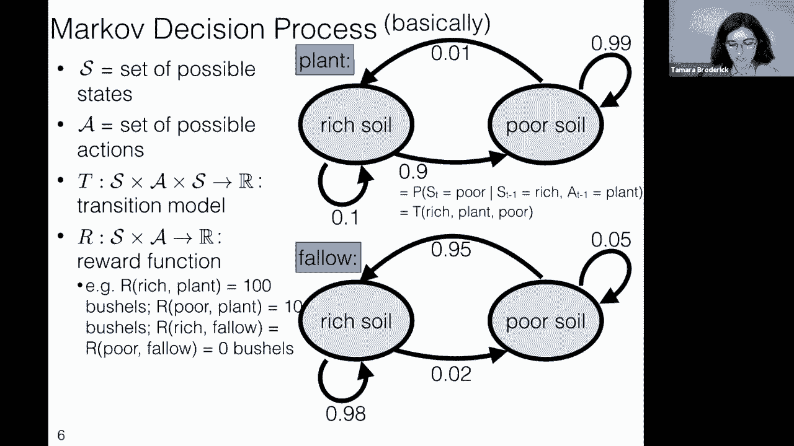

that's part of our markov decision，process，okay and our final thing this might not。

be quite as cosmetic，is we have what's known as a discount，factor so basically i'm just going to。

push that off to later in the lecture，we'll talk about it later in the lecture。

but it is part of our markup decision，process，okay and so now we can get rid of this。

basically and say what is，actually a markup decision process okay，so that's gone。

we have our markup decision process it's，got a set of possible states。

in our example they're rich soil and，poor soil，we have a set of possible actions that。

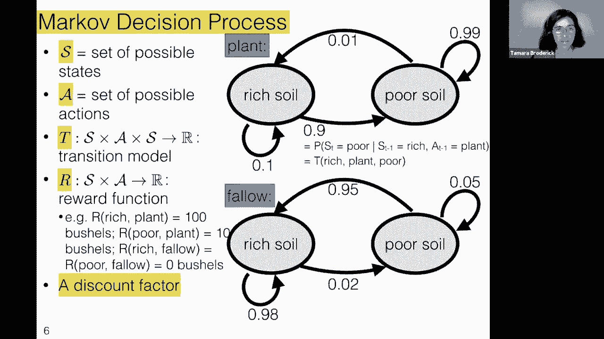

can change our states，in our case they are plant and fallow in，our example。

we have a transition model it tells us，when we make an action。

how likely we are to end up in different，states and it depends on where we。

started to it depends what state we，started in，we have a reward function that tells us。

what do we get from taking certain，actions，and what we get the benefit the gain we。

get from taking certain actions depends，on the state that we're in as well。

and then finally we have a mysterious，discount factor that remains to be just。

you know described but basically this is。


a markov decision process and again the，things that really distinguish it from a，state machine。

are one a reward function，you know understanding what's actually，good about our actions。

and this idea of a transition that can，be stochastic，okay so we said that the reason that we。

set up this markov decision process was，in order to make decisions。


so now let's start thinking about making，decisions what，what how are we going to make decisions。

what are those decisions going to look，like，and what types of questions can we。

answer what types of decisions can we，okay，so the types of decisions that we're。

going to tend to make here，are are called policies so a policy is，going to tell us。

you know what's our plan you know i've，rented，this field um you know for a few years。

and i want to know each year uh how how，am i going to treat it am i going to。

plant it am i going to let it lie fallow，what am i going to do and the policy is。

going to tell me it's going to say hey，look at the state that you're in right，now。

again on this assumption that i can't，observe my state，that that's a totally reasonable output。

and then，i'm going to ask what action will i take，this is my plan of action。

essentially based on the states i have，and so now。


you know these are the types of，decisions we're going to make and we're，going to ask。

various things about these so one，question i might ask is what's the value，of a policy。

policy you know for instance how many，bushels am i going to get from my policy。

how much um how much profit perhaps，revenue can i expect to make and this。

could be really important because maybe，i'm deciding whether or not to even rent，the field。

you know i'm not sure that i want to，rent this，field um and do some farming and so this。

would help me make a cost benefit，analysis and understand，you know is this worth it to me also if。

i have two different ideas，of what i should do with the field um。

we're gonna see this in a moment you，know if i have two different。

plans that i'm considering if i knew the，value of each of the plans i could。

decide between them i could say oh this，one's a better plan this one's a better，policy。

now of course in general once i'm，comparing policies why don't i just，choose the best policy。

i should just go straight to the thing，that's going to get me the the biggest，harvest。

you know the most reward um and so we're，going to we're going to talk about that。

as our second question how do i choose，okay so what we're going to do next is。

talk about these questions oh but there，is a question from the audience first。

yeah the question is what if we have a，situation where the reward isn't always。

the same for a given input，and state um could you also have a，sarcastic reward。

oh yeah absolutely i mean i think i，think this is a really interesting，question you know。

once you understand these things these，are just a bunch of choices that are。

modeling reality and essentially what，we're trying to do，is get close enough to reality to have a。

useful model that we can use to make，good choices，um but also typically what we do is we。

somehow come up short of reality just，because a simpler model is often easier。

so i might choose a non-stochastic，reward function，just because it's easier to work with。

but the reality is absolutely，in reality a reward function would very。

easily be stochastic as well you can，imagine you know，if i have the same moisture of soil or。

whatever that i could get a different，harvest in different years and so i。

would absolutely want to include that，you know something you know while i'm on。

the subject i'll just note something，else that，is a limitation of this is is what's。

known as you know，mercavity so we have this markovian-ness，we have this markov decision process。

we're doing，only depends on the previous state but，you can imagine in a world in which it，fact。

probably that's you know more realistic，in a lot of cases，but sometimes the simplifying assumption。

is worth making anyway because it's，simpler，um we can solve the equations for it we。

can do the calculations that we're going，to do later in this，um but absolutely i mean there's some。

sense in which you know，everything that we're doing can be，improved and sometimes those。

improvements are totally worth doing，um and you can come up with an even。

better set of decisions based on them，and i think this reward function。

stochasticity is a great example of that，okay but for the moment we're going to。

start with the simpler version um i，think a good life lesson is always start。

with the simpler version and then，compare it to the more complex version，so let's start with our。

word function as describe and see what。


so first we're going to start by asking，what's the value of a policy that was。


our first question from the previous，slide，have，almost exactly the same transition model。


and markov decision process that i have，on the previous slide except just for。

the purposes of making the calculations。


easier i've simplified everything to be，probabilities of 0。9 and 0。1 sometimes，they were like 0。99。

and 0。01 on the previous slide um this，is just for ease of use you could，absolutely have all of the。

interesting probabilities on the，previous slide but here i just，simplified it a little bit。

and we'll assume that our reward，function is the same from the previous。

slide so this is basically the same as，the previous slide the numbers are just。

okay let's ask what's the value of a，policy，well it depends how much time i'm gonna，enact the policy。

you know if i'm renting my field for one。


year i expect to get a lot less harvest，than if i'm renting my field and。

harvesting crops for ten years，and so we need to specify how long we're。

going to be running this policy and，we're going to call that h。

h is the horizon it's just basically how，many time steps we have left。


in this case how many growing seasons do，we have left，so in particular i imagine that i'm。

renting for the purposes of this example，a field for each growing season and then。

it's going to be totally destroyed and，they're going to make a strip mall and。

so there's just no consequences，and that last season whatever i do is a，total free-for-all。

um and the field will just not exist at。


that point so this is the example that，we're going to be imagining here this is。

the back story of my field，okay so i have this field i have it for，eight growing seasons。

and i want to ask myself well what's the，value of that you know again maybe i'm。

even thinking about maybe i should run，this field i don't really know i want to。

okay so we're going to say let's define，something that tells me the expected。


reward，if i enact a certain policy。


starting at a certain state so clearly，v this value has to depend on the state，i start。

has to depend on my decisions that's，encapsulated in the policy and it has。

depend on the horizon as we just said，you know sort of how long am i running。

okay so we're gonna imagine also that，there could be some dueling farmers。

farmer a has an idea of what's the best，thing to do，farmer a says let's always plant that is，and。

that seems like a potentially reasonable，policy i mean it's it's a greedy policy。

it says every time let's，let's get as much reward as we possibly，can。

on this route farmer b says hey let's，let's be careful here，i think that we should plant if the soil。

is rich and let it lie fallow if it's，not and let it regenerate，and so we have these two farmers and。

basically in some sense we want to，resolve this conflict between them。

you know which of these is a good policy，which of these policies should i use and。

so in order to do that we're going to。


calculate，expected reward of each of their，policies，okay so let's start with a horizon of，zero。

now here i'm putting a horizon of zero，i'm putting in，any state and i'm putting in any policy。

it could be policy a，for firmer a or it could be policy b it，doesn't matter because if you have a。

horizon of zero you can't do anything，you can't grow you can't plant you can't。

fallow you can't do anything and so，you're，it's boring your your reward is zero。

there's just nothing you can do，okay so things start to get interesting，on when you have。

one growing season when you have a，horizon of one，so if you have one growing season what's。

your expected reward，of a policy starting at s well you just。


enact the policy，for that season and that's all you can，do and so your expected reward is the。

actual reward，so here for one growing season we can。


write out what's the reward starting at，us of enacting our policy that would be。

pi of s okay so let's start by talking，about farmer a's，policy so here we're talking about。

farmer a so that's why we have v，sub pi a we're talking about horizon of。

one that's why we have the superscript，of one，and we're going to talk about both。


possible states so let's start，by assuming we start from rich soil and。


you can ask ourselves what's this going，to be well we can just plug in the，formula。

it's r applied it rich that's the，starting state，and then we take farmer a's policy。

if we start from rich soil and so my，question for you is what is this value。

it is a number in this particular，example what is that number，this is a question for the chat。

okay let's talk about how we get this，this is great um，many of you have said 100。 now how do we。

get to that，well we first notice that we have to，evaluate。


pi，a says i always plan farmer a tells me，to always plant so farmer a's policy is，to plant。

so if i evaluate pi a i know that i'm。


evaluating r，of rich plant now i'll go over to my，reward function it's in that little gray，box。

and the r the reward for being in rich，soil and planting，is 100。 so in this case，a。

and starting in rich soil is 100 for a，horizon of one，okay so i'm just gonna put that over。

here we've got a hundred，now let me ask you the same question，what is this value so if i take。

farmer a's advice i use farmer a's，policy，i have a horizon of one and i start from，poor soil。

what is the value of that policy。


okay great we're getting a lot of tens，so let's just walk through this again，one more time。

so we're going to say okay what's the，value of starting at poor soil。

well that's the reward function where，the first input is poor soil。

and the second input is farmer a's，action，for poor soil well farmer a's action for。


poor soil is plant because farmers，action is always plant，so now we're going to ask what's the。

reward for poor soil and planting，i go again up to my little reward box in，the corner and it's temp。

okay you can do the same thing for，farmer b，in fact i'm going to show you many。

calculations on this slide，and the following slides i kind of came。

up with some numbers and tried things，check，all of these numbers um if you find any。

uh typos i would love to hear that i，will update the slides later。

um but uh this is the reality of life，unfortunately there there is no。

um checker for my calculations like we，have in homework and，exercises and everything um you are the。


check，so hopefully you will do that and just，um report back，that you agree with these numbers um but。

basically the idea is we think that，farmer b is going to plant if there's。

rich soil so we think that there should，be a reward of 100 in that case and，poor。

soil so we think there should be a word，of zero in that case，okay so that's horizon of zero horizon。

of one things get tricky when we get to，a horizon of two or above。

and there we're going to start defining，a recursive formula，so instead of this formula we can。

replace it with more general formula，that also includes this formula。

which is the following so let's step，this through，so this is saying now let's look at a。

more general horizon h，so for instance imagine i have five，years left on my lease with my form。

then what's going to happen is starting，from the state i'm in。

i'm going to use my policy to make some，decision，plant，or i'm going to let the field life out。

everything else in this is saying what，happens when i have four years left on，my lease。

so i started from five years left on my，lease now i have four years left on my。

lease so i have to consider，based on the decision that i made this，year what's going to be the state。

of my farm next year is it going to be，poor soil or rich soil i have to sum。

over all those possibilities，now each of those possibilities has a，probability so that's the t。

here and each of those possibilities，itself has a reward，recursively so if i had already done。

all the calculations for four years when，i have a farm for four years。

now i can use this formula to calculate，what's the reward if i have a farm with，five years。

so we already did the calculations for。


what happens if i have a farm for zero，years，you can apply this formula in fact we，implicitly did。

to figure out then what will happen if i，have what are the rewards for having a，farm for。

one year and now we're going to apply，this formula again。


it'll be a little bit more interesting，to understand the value of having a farm。

okay so let's do that so we're going to，say hey suppose，i'm renting my farm for two years and。

then it will get paved over by a strip，mall，so i'm renting my farm for two years now。

and the soil was rich，when i got it if i follow farmer a's，advice。

what's going to happen so that's what，we're about to work through together。

okay well the first term so i'm just，applying the general h formula from，above。

and i'm bringing it down here with h，equals two the first term is what，happens this year。

well the soil started out rich and i'm，gonna use farmer a's advice to always，plant。

enriched soil and then i'm gonna get，and then i'm gonna have some terms that。

represent basically what happens，so here there are two possibilities when，i get down to one year。

after this year i'll either have rich，soil or i'll have poor soil。

it was the only two possibilities i，either have rich or poor cell basically。

i'm going over all the states，if i have rich soil i'm going to say。

well what's the probability of having。


rich oil that's t，times what's the value of having ritual。


starting from here，for that remaining year which we've，already calculated。


here i'll say what's the probability of，having poor soil that's t。

and then i'll say what's the value of my，farm starting from poor soil which we've，already calculated。

this is the the beauty of recursion is，that you do it for the zero case。

then you can do it for the one case then，you can do it for the two case then you。

can do it for the three case and so on，okay so let's now start solving this。

so we're going to take this formula。


we've we've applied the general formula，so that h equals 2ks and now we're going。

okay so the first number we want to put，in，is this reward for this year's farming。

so we started from some rich soil we，followed farmer's a advice。

to plant and so our reward should be 100，based on the logic that we went through。


before，what's the probability of going from，rich soil to rich soil if we plant it。


what is the value with a horizon one of，starting from rich soil this isn't，something you would know。

off the top of your head it's something，we calculated already。

so we're just going to input that number，now we do the same thing but for poor。

soil we say what's the probability of，going from rich soil and planting and，ending up in poor soil。

that's probability 0。9，what's the value with one，season left starting from poor soil。

where again you don't expect to know，that off the top of your head you，already calculated it。

and so now we put this all together and，we say that this value，is 119。 now this is。

larger than any value we saw for a，horizon of one but that's not。

necessarily too surprising because you，expect sort of roughly in general that。


as you get more seasons to grow，you get more harvest and that's what the。

value is just saying how much do。


do we expect to sort of harvest how much，reward do we expect to get over all the。

now of course depending on the starting。


soil it doesn't have to be the case that，we get more，but sort of in general we expect it to，increase。

okay so starting，from rich soil taking policy a，and having a horizon of two this is the。

value the expected value that we get。


so i'm going to just put that there and，you can do the similar thing and this is。

again the part where i say check my math，to calculate the value of having a farm，for two years。

starting from poor soil and following。


farmer a's advice。


b2 pi a with the poor input then these，next two，the final two values that we're seeing。


here are following farmer b's advice，starting from rich soil starting from。


and you can do this again you know you，could just keep recursively applying。

this once we know the values for two，years we can find the values for three，again。

a great idea would be to check them it's，also a good exercise，and so we can just keep getting these。

values，and remember we started off with some，dueling farmers so yes we have these。


values we could ask you know is it worth，renting the farm but here we really need，to address this。


this burning question of which farmer，was right you know which which。

farmer's advice should we follow，and something i think we're going to see。


in a moment is that it really depends on，so let's start by asking we're going。

gonna start by asking horizon。


one and what do i mean by who wins，i mean that farmer's output that。

expected reward the value for the farmer，has to be at least as good。

at all the states and strictly better，for at least one state that will be our，notion of winning。

for the farmers and so，so if i only rent for one season，and then my farm gets paved over by a。

strip mall，is one farmer's advice better than the，winning，at the bottom of this slide which。

farmer's advice is better with a horizon，great i'm seeing a lot of people saying，that farmer a's。

advice is better farmer a's policy is，better so it's very important that we be。

focusing just on a horizon of one we'll，talk about other horizons in a second。


but if you look at a horizon of one we，can look at the rich state if we start，from a rich state。

farmer a has a value of 100 and farmer b，has a value of 100 so farmer a is at。


least as good，if we start from the poor state farmer a，has a value of 10 and farmer b has a。

value of zero，so farmer a is strictly better and so a，way that we can write this。

is to say that policy a，is better than we'll use the greater。

than sign we'll use a subscript h equals，1 to indicate that this。

is for a verizon of one which is really，okay what about horizon，of three does anything change her。

horizon of three whose policy is better，at a horizon of three。


awesome people are noticing that it's，different here，farmer b's policy is better so again we。

say hey what happens in the rich state，at a horizon of three the value of。


farmer b's policy is 192 that's strictly，better than farmer a's value which is，138。

if we look at the poor state farmer b's，value is 118 which is strictly better。

than starting from a poor state with，farmer 8 is 48。so it looks like in this case farmer b。

is beating out farmer a，what about a horizon of two who wins at，a horizon of two。

great there's a lot of people who are，saying not sure，there there is no clear winner by our。

definition of winning，here now you could come up with a，our，definition of winning here there is not。

one policy that is strictly better than，the other policy，if we look at the rich case the rich。

state at a horizon of two，then we see that primary a's policy has，a better expected value。

but if we look the poor state farmer b's，policy has a better expected value。

so no policy wins for each equals two，okay and let's just think about this for，love。

only one season before everything gets，paved over by a parking lot。

then i should just be as greedy as，possible i should just eat out whatever。

i can from the land and run away because，nobody's ever gonna use this land again。

and that's farmer a winning with a，horizon of one if i have，multiple seasons like three seasons or。

win，because farmer b is delaying，gratification for a better reward。

so really seeing this sort of um value，of delayed gratification but only if i。

have enough time to take advantage，of it only if i have enough seasons that。

lying fallow actually does something you，know if i let something lie fallow and。

it gets paved over by a parking lot i，don't get a reward from that。

i only get that if i have enough time to，seeing，here we're seeing you know that it，really depends。

cool again if you have a different，definition of winning which i see some。

people are proposing in the chat you。


might get a different，notion of who wins um but here this is，our definition of winning。


um and uh so for just for this，definition this is the，the um conclusion that we might draw but。

absolutely you might consider something。

okay now something i want to note here，is that in everything that we've done。

we've assumed the policy is exactly what，we define，state。


and you put out an action but something，that you might be starting to think。

based on the discussion we just have is，maybe the policy should also depend on，the horizon。

you know if i only have one year left i，should just go free for all。

and farm anything that i can but i have，if i have many years left。

then maybe i should do this you know，fallow plant cycle，and so you can actually adapt this。


formula，to allow dependence on the horizon you。


can adapt the policy to allow dependence，on the horizon，so let's just see what would change here。


here are all the places that the policy，and now if i allow dependence on the，horizon。

we might call this non-stationary so，it's stationary if it's the same for，every horizon。

but non-stationary if it could depend on，the horizon，then i'll introduce some subscripts h，perhaps。

now let me make a little point here，what's happening here is when i apply，this formula。

i now use the policy at time h to decide，what action i'm going to take。

when my horizon is h so that's why i，have this pi h here，i did not add the h subscript here。

because here i'm just referring to the，full policy across all the h's。

i'm just using it as a subscript so i，only applied the h subscript when i'm，applying it for。

time h and then here i just say oh i，have my whole policy across，all of the h's um and it still can。

change with the h is but here i'm just，notation，okay so now we have the ability。

to evaluate a policy to say what's the，value of the policy，for some horizon we can see that it。

really can vary by the horizon，um that the reward can really change and。

it might even change you know which is a，now let's think about well what if i。

don't want to just talk about two，dueling farmers what if i just want to，say what's the best。

policy what's the best thing that i，should be doing，in that case i might think well i could，consider。

every possible policy with every，possible variation，over horizon that's a lot of policies to。

evaluate，and maybe there's a way to more quickly，get at the best possible。

policy now this can still be really，useful evaluating the，value of a policy we still want to say。

for instance you know let's say that we，know we have some plan and maybe there's。

some other decisions out there it，doesn't have to be the best one。

we just want to know what's the value，and that will help us decide whether to，rent the farm or not。

separately of course we're interested in，the best policy because if we can change。

that plan it would be nice to，so that's what we're going to look at。

okay so in our discussion of what's the。


best policy，we're gonna again just have the same，running markov decision process that。

we've had this whole time，so we're keeping that we're still going。

to have h representing our horizon how，many planning seasons are left and as we。

saw we kind of expect that to affect，our policy or at least what the choice。


we're making at each horizon，now we're going to introduce a new，notation q。


so q is the expected reward，of starting at state s，making action a so that's what we do on。

this round，and then for the rest of the future we，if i had this you want to convince。

yourself that i could find，an optimal policy if i knew。


this if i knew what would happen for，each of my actions。

in this case there's two possible，actions planning and following but in，general for all my actions。

i could say well i already know what's，the best，for all the h minus one steps that are。

left by recursion，now i'm going to find the best step，right now by just saying well which of。

the actions i'm making right now is the，best，so that's what the arg max here means it。

says okay which possible action。


is the argument to queue that maximizes。


so if we already know what the best，possible policy is in all the future，rounds。

all the all the lower horizons then this，is how we can find the best policy on，this round。

we're going to go through an example of，this but i just want to point out。

the difference with the v that we were，just looking at so some things are kind，of similar here。

you know we we have this dependence on h，we have this dependence on state。

but with v we were evaluating a，particular policy so the policy pi，appears in queue we're not。


evaluating a particular policy we're，evaluating actions we're saying hey here。

all the possible actions on this round。


that i could use，and i'm already assuming i'm using the，best possible actions。

in future rounds and so now i'm asking，what happens with these actions。

and so v we use for evaluating a，coming up，with the best policy but it's also。

because of that doesn't explicitly have，a policy as an argument，we're just trying to find the best。

okay i think it'll be helpful to walk，through an example so let's do that。

a couple of things before i do that just，a couple of notes so one，there doesn't have to be a single。

optimal policy it's possible that，multiple policies could give you the，same reward。

so we're just saying we're gonna find an，optimal policy，one the optimal policy here。

doesn't have to be stationary it could，depend on horizon h and we kind of。

expect that in this example as we，already said i think our intuition tells。

us in this planting example。


that probably we're going to do，something like farmer b's idea，of following you know as we have a。


higher horizon and we're going to，eventually switch to farmer a's idea。


okay so now let's actually calculate q，for the example that we have so in，particular。

if we start with any state and we take，any action and we have absolutely no。

time to plant anything then our reward，is zero，because we didn't have time to plant。

okay so now we want to find the expected，reward of starting at s。

making action a and then making the best，action for all the steps that are left。

so if we're at a horizon of one there，are no steps that are left after this。

step there is only this step and so q，is just going to be the reward of being，at state s。

and so that's sort of easy to fill in so，what what for instance and this is a，question for the chat。


is q1 by verizon of one with a state，s and an action of plant their state of。

okay so awesome everybody's observing i，can just say well what is the reward of，richard plant。

it is 100。 i can just read it off for my，reward chart，and so we can do the same thing with。

every other state in action this is。


basically just recreating the reward，chart we're saying hey what's the reward。

of rich and fallow what's the reward of。


corn plant etc，and so this should align perfectly with，our reward chart。

okay things get interesting when we get，to again an h，now before we do that let's just recall。

the whole point in some sense of q is，that we're trying to come up with the，best policy，for。

a horizon of one what's the best policy，for a horizon of one can you write that。

in the chat what would you how would you，describe the best policy。

for horizon of one based on this cue。


great always plant so no matter，what your state is you just plant this。

is what farmer a was suggesting last，time as some people have said。

um at this point there's no time left。


you gain nothing by following because，there's going to be a parking lot here。

and so you're just not going to it's not。

going to help you to have better soil，you just need to plant okay now let's go。

to the interesting case which is，again h greater than one so again。

i'm going to replace this equation with，a slightly more general equation。

of which this is the special case of h，equals one，so here we have the more general。

equation so the more general equation，says，suppose i have five years left so h is，five。

i have five years left of my farm。


i want to say what's the expected reward，of starting at s making action and then。

making the best action for all the，remaining steps，well on this step i already said i'm。

starting at s and making action a and so，this is my reward，for this step now。

i consider what happens in the remaining，steps when i have four years left。

well there are all the possible states i，could have i could either。

have rich soil or poor soil so this is a，different s prime，i consider the probability of each of。

and i say what's the best thing to do in，the future，and so this is quite different than what。

we saw before i'm maximizing over all，the actions。


from the recursion so if i do this on，round zero，well that's boring if i do this on round。


one i find the best set of actions that，i could do for，for one horizon left then i apply this。


to h equals two to find the best set of，actions i do，with a two horizon and then i find the。


best set of actions for three horizon，so let's work this out for a two horizon。

so suppose i have two years left on my，farm two years left on my lease。

two years until the parking lot comes，i'm starting from a state of rich。


well this season i already said i'm，starting from a state of rich soil and i，decided to plant so。

i'm just going to reap the reward from。


next season there's some probability，that i get to rich soil depending on my，action。


there's some probability that i get to，poor soil depending on my action。

if i get to rich soil then i want to ask，what's the best action，when i only have one。

round left when i only have a horizon of，one。


because i'm trying to maximize overall，here，and if i have poor soil i can similarly。


there，okay so what is this going to look like，in our particular case well，our oh there's a question。

yes could you just clarify again what，does it mean when an optimal policy can，be non-stationary。


oh yes so what i mean by that is that，the policy can change with horizon。


so this is exactly the idea that if i，have，only one season left i'm probably just，gonna plant。

and i'm not gonna worry about what's my，state whether it's rich or poor。

but if i have 10 seasons left i probably，want to take poor soil and let it lie。

fallow so that i can get the most from，it next time，and so those are different policies and。

if i restricted myself，to have a policy that was the same at，every horizon i would get a different。

policy than i would if i could allow it，to change over different horizons。


in fact we're going to see in a moment，that our。


optimal policy here will change with，horizon，um so we set our optimal policy at h。

equals one was to always plant，um you may not be surprised to find out。

that at h equals two it may not be to，okay so let's look here，at this equation and let's just start。

filling it out，so reward for starting it rich and，planting，we already said was a hundred we just。

got that from our chart，now let's say what's the probability of。

starting rich at rich soil planting and，then ending up in rich soil。

we can read that off of our transition，now we wanna say what is the best，possible thing。

the best possible action that we could，have done with the horizon of one。


so i'm going to ask you what is the max。


value that we're going to get here what，is what is what is this thing in yellow。

great so what we want to do to figure，this out is we want to look at the two，different values。

of q1 rich some action，there's either q1 rich plant which is，100 or q1 rich fallow which is zero。

q1 rich plant is bigger and so that's，what we put in，we put in 100。 okay so now we go down，here。

the probability of saying we're in a，state，that's 0。9 we read that off of our，transition diagram。

and here we compare q1 poor plant which，is 10，to q1 poor fallow which is zero。

10 is bigger than zero and so we put in，10。


okay and so we can keep doing this again，you should check my map。

but we do this for all of the other q2s，for each basically for each state and，each action。

and now once you see these numbers even，if you didn't derive them you can just，look at them。

and say what's the best policy，at a horizon of two that is what action，should we take。

at a horizon of two and so this is again。


a question for the chat what action。


i see some people saying either plant or，fallow，at a horizon of two might the policy。

remember in general policy isn't going，so in this case it might depend on the。

state if it does what is the dependence，what should i do if i if i find rich。

soil what should i do if i，so the observation is first of all。

that the optimal policy is not the same，as a horizon of one，and in fact it really will depend on the。


the soil status this time，and we can see that by looking at q2 you。


know if i look at the rich state，and i plant my my total reward by doing。

the best thing all the time is 119，if i look at the rich state and i follow。

my total reward overall is 91。 and so it，seems like i should plan。

but look at the poor state and i plan my，total reward you know the whole time is，29。

whereas if i look at the poor state and，i fallow my total reward over all the，steps is 91。


and so this is basically telling you，that we want to delay gratification in。

the second state we want to，let it lie fallow this year so that we。

can reap all of that awesome harvest，next year whereas if it's。

already rich this year well it's going。


to be you know，we don't want to just throw away a，perfectly good rich harvest and so we're。

okay and so in fact we do see now that，the optimal policy here。

or at least an optimal policy depends on，the horizon that in fact it does change。

this algorithm that we basically just，went through where you first calculate。

q naught and then q1 and then q2 across，all the states and actions。

and then you can finally get an optimal，policy out of that that is finite，horizon。

value iteration we have a finite horizon，the number of times the number of years。

that i have rented this farm where i'm，going to rent this farm is finite。

that's h and i'm iterating i'm doing。


this iterative procedure，to calculate these best values and so we。


can call this finite horizon，value iteration to contrast with。

something that we may not get to in this，lecture but is in the notes um。

infinite horizon value iteration which，is doing this in the infinite case。

now that being said we will start，talking about infinite horizon next。

so at least get a little bit of。


background on there basically，the issue that arises here，is what if i don't stop farming so i。

just got some good news，in the middle of this lecture while we。

were doing all of those q calculations，that in fact，there is no plan to replace my firm with。

the strip mall anymore，they're actually just going to give me，the farm and i get to keep it forever。

awesome so now i have a different，kind of set of calculations um i don't，just go up to a certain age。

a certain horizon and then assume that，the farm doesn't exist anymore。

i i keep my farm it keeps going and so，use，the same tools that we just used in this，case well。


okay so what hasn't changed what hasn't，changed is the way that farms operate。

just because i'm farming for a longer，time doesn't mean that rich soil，magically all。

you know becomes poor or something like，that like it's still the case that from。

season to season i have the same，dynamics，and i have the same you know amount that。

i harvest and so all of that is the same，the markov decision process，of it。


have not changed an issue that really，arises when we。


look at really long time scales is that，the value，of money and goods today is not the。

value of the same amount of money and，goods in the future，and so this is the one thing that we're。

going to change if i don't stop farming，and if i have，basically no finite horizon so for。

instance if i have a thousand bushels of，wheat today that's different from me。

having a thousand bushels of wheat in 10，years，if i were hungry and i needed to eat。

today i couldn't eat。


bushels of wheat in 10 years i could，today，or i could sell the bushels of wheat to。


get pizza and then i could eat the pizza，today i could not eat that pizza。

if i had the bushels of wheat in 10，years even if i was doing perfectly fine。

and able to eat i could sell the bushels，of wheat today invest money and have。

lots of money in 10 years whereas if i，have the bushels of wheat in 10 years i。

and so for this reason we can't，just really add up bushels of wheat。

across long time spans which is kind of，what we were doing before we were saying。

hey let's add up all these rewards，across all the different years and treat。


them like they're all the same and，as we see from this example that's just。

not true if somebody offers you either a，thousand bushels a week today or a。

thousand bushels in ten years，you should always accept a thousand。


bushels of wheat today，and so somehow we want to adjust，for this in our calculations and a very。

typical way to do this，is what's known as a discount factor the。

idea of the discount factor is that some，value between 0 and 1。

that tells you how the value of a bushel，of wheat changes or the value of，anything。


changes over time periods so for，instance we could say what is the value。

of one bushel of wheat after ten time，steps，by construction here this is the idea of。

the discount factor we will say that a。


value of a bushel of wheat now，is one one one bushel the value of a，bushel of wheat next time step。

is gamma the value of bushel of wheat in，two time steps is gamma squared。

the value of a bushel of wheat in three，time steps is gamma。


and so something that's kind of cool，that you can do once you have this，conception。

is you could ask what would i trade，weight。


every year forever you know sometimes，you hear about those contests where。

people are like i'll give you，a year's supply of diet coke every year，forever。

um and so if we were in such a situation，and somebody was saying i'm gonna give。

you a bushel of wheat every year forever，there is some number of bushels of wheat。

this year that i would trade for that，so let's figure out what that is what is，the value。


of this idea of getting a bushel of，wheat every year，is that a new question or that was the。


old one，okay okay so let's call this value v，and by construction it is the value of a。

bushel of wheat，this year which is one plus the value of，a bushel of wheat next year which is，gamma。

plus the value of a bushel of wheat in，two years which is gamma squared。

dot dot you just keep adding things up，like this，okay well here's a clever way to write。


thing as，one plus gamma times。


quantity one plus gamma plus gamma，squared plus dot dot，the amazing thing about infinity is that。

infinity looks the same，today as it does next year and that's，kind of what we're taking。

advantage of here okay well that thing，in the parentheses is just b。

that was our definition of v from right，here，and now we have an equation in v it's a。


linear equation in v and so we can solve，it。


and says v is one over one minus gamma，and as we said gamma's between zero and。

one and so this will be a perfectly well，defined equation we can。

we can figure out what is this value，so let's look at an example suppose i，take gamma to be 0。99。

so i'm saying that a bushel of wheat，next year is almost the same value as a。

bushel of wheat this year，it's only 0。99 the value of a bushel of。

wheat this year that's pretty close to。


well in that case the value。


of bushels of wheat forever one bushel，of wheat per year forever。

by our formula is one over one minus，0。99，so it's 100 bushels so if my discount，factor here，is 0。

99 it doesn't even change that much，i should be willing to trade。

somebody who's offering me a bushel of，wheat forever 100 bushels right now。


or vice versa now something that you，about，i'm not asking this in the chat i'm just。

asking you to meditate on it later，is if i change this gamma if i make it。

higher or lower how does that change the，value，of a bushel of wheat forever so。

definitely think through that later give，that a little thought if you have any。

trouble with it ask on discourse，that's something that you want to make。

okay so now now that we've talked about，the discounted value of money in the。

future and the discounted value of，bushels of wheat in the future。

we can talk about the expected reward。


of a policy pie starting at s when we，keep our farm forever，so now there's no h on this v there's no。

horizon we're imagining an infinite，horizon that we you know we're just。


okay well we can write a recursive，formula like before。


this also looks very similar to the，formula that i just wrote for this other，v。

basically what's happening is we're，of having this policy starting at state，s and going forward。

well it's you know what is the reward i，get on this time step。

then i look at all the future time steps，but remember，infinity next year looks the same as。

infinity this year so it's still just v，pi s prime we actually haven't changed a。

horizon because there is no horizon，and we just discount everything next。


so you definitely want to just compare，this in your mind to sort of what we。

just did a few lines above。


because it's a very similar idea and，this is also very similar to what we，were doing。

back when we had a finite horizon now we，just have this discounting term and also。

now we're not going to go through an。


example right now although i'm sure，you'll be working through this。

um at some point um but this is a set，of number of states linear equation and。

number of states unknowns，and so you can solve that that's that's，the kind of thing that we have。

linear algebra to solve so this is，something that you can totally do。

now we haven't had time to get to it but，basically there's going to be a very，analogous。

idea for the cues so here we've been，able to say what's the value。

of farming forever just like we were，going to say what's the value of。

getting one bushel of wheat forever now，we can say what's the value of farming，forever。

and now of course you want to ask well，what's the best thing i should do to。

farm forever what's the optimal policy，to farm forever and so，that's the remaining piece but again。


it's going to be very analogous to what，we did in the finite horizon case just。

with this extra sort of discount factor，stuff in，so now we have the the magical final bit。

of the markov process the discount，factor，um that's telling us you know how does。

this change over time and i'll just，mention，you don't have to only use this in the。

infinite horizon case you could have a，discount factor in finite horizon too。

because really this is just the value，changing over time，um and so it will change in 20 years um。

you know we just talked about how in 10，years the value of a thousand bushel of，wheats will。

change to you um and so that's something，you can do as well，okay great so we're gonna be using these。

ideas going forward these ideas of。


changing state and so on。