# 【双语字幕+资料下载】MIT 6.036 ｜ 机器学习导论(2020·完整版) - P1：L1- 基础知识 - ShowMeAI - BV1y44y187wN

Okay it's 9：35 let's go ahead and get started。Learning。 So as you are experiencing right。

every Tuesday， so in particular we're always，minutes past and we'll end five minutes before。

classes and things like that。 The lecture is，so as you'll see in a moment if you have questions。

Something to keep in mind is that everything we're，say that is because at some point in November。

so it's not exactly EDT or EST， you just want to，you can google it and that'll be the appropriate。

so 6。036 is the class that we're in here。 There's，in。 6。862 acceptance has been finalized。

already if you're in 6。862 and you'll want，that being said if you were accepted to 6。862 but。

you can just switch into 6。036。 If you're not，you can just get into 6。036 fresh。 So。

Now our main course website is listed here。for some information， just go to the course。

and that caveat being if you are in 6。862，has information there and so you'll also hopefully。

We're going to be taking questions at Discourse，there's also a nice link that our awesome。

Then I encourage you to go to it。 At the very，the lecture is over and go to that。 That's。

You can also find this at the forum link on，get to everything from the course website。

you can ask about actual content at the Discourse，They will be reading the Discourse， they'll。

and in particular if something comes up that you，interesting question that we all want to discuss。

start asking right now。 The reason we're having，is particularly because we want to hear a lot of。

it on Discourse， we can handle a higher volume，in the Zoom chat and the time that I have， and so。

that I'll mention is that if you're interested in，lecture， then we encourage you to use the lecture。

check out， there's this great example，you know， set things up so lecture one category is。

there will be a similar category in the future，Okay， so I do want to mention that all of our，website。

 so the slides for this lecture are going，anything on my iPad I'm going to try to save，In fact。

 there will be a recording of this lecture，not able to view it live for any reason or if。

should be there as well and so everything should，that out。 We will not be monitoring the Zoom。

to go over to Discourse。 Okay so today's plan is：to be covering some more logistics。 There's a lot。

to get to the good stuff， we're going to start，set that up， and then we're going to dive into。

really just be the tip of the iceberg for the rest。

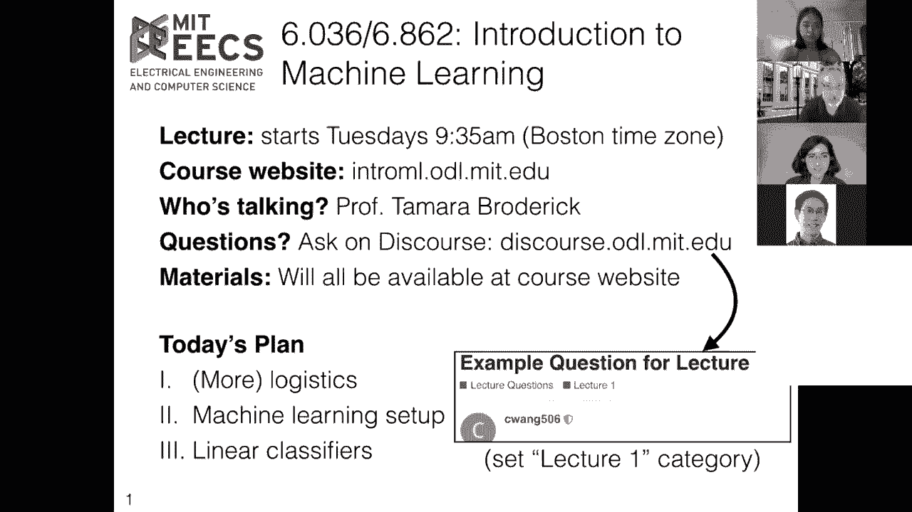

Okay， so I said we're going to do，about prerequisites。 So this course has a number，go over them here。

 We have computer science，to be familiar with Python programming。

You want to be familiar with algorithms， you，We're going to be seeing a lot of pseudocode and。

math prerequisites we're going to see that that's，should be familiar with matrix manipulation things。

sort of the standard things we do with matrices。and dimension greater than two even starting today。

you're able to you know be familiar with and deal，so you'll definitely want to be familiar。

and basic discrete probability。 We'll talk about，conditioning and things like that。 Now the most。

to want to do this readiness assessment， so what，so if you go to that website that I talked about。

you'll find a welcome to 6。036 thing that you can，you're going to want to go to this readiness。

you you feel comfortable with the sort of material，already done that we strongly encourage you to go。

you've decided whether 6。036 or 6。862 is right。

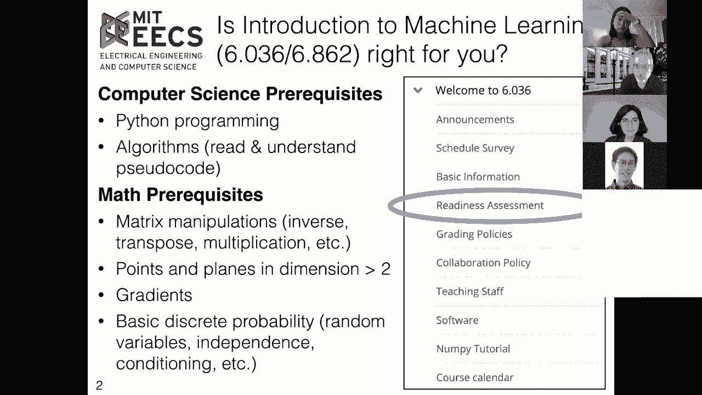

So we have an amazing， amazing course staff for。

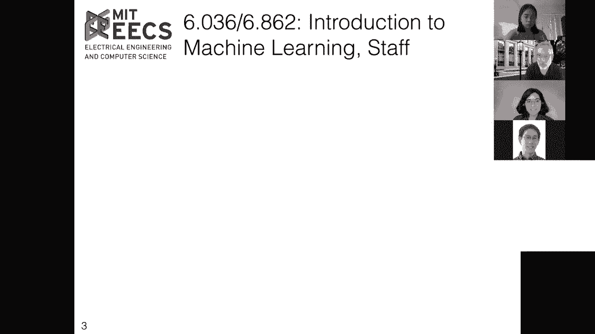

that you'll be meeting， so I'm gonna be doing，these other instructors。 Some of them are。

and then you're going to be seeing all of these，in talking about， you know， questions and things。

exciting opportunities to talk with everybody。

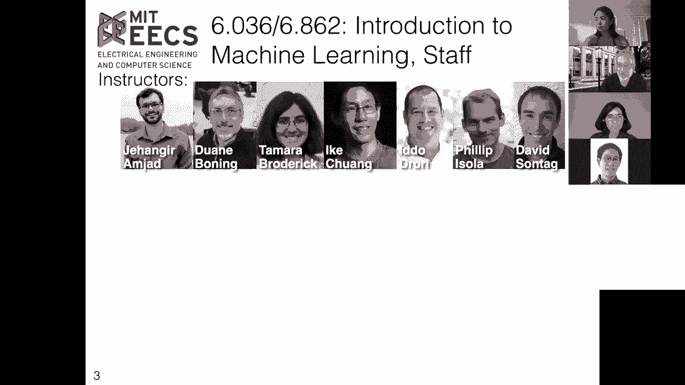

assistants which I think this list may even grow，a complete list for the rest of the course， but。

amazing work already setting up the infrastructure，for you to be a part of this class。 I believe。

but again you're gonna be meeting all these other，then these other activities you're gonna have a。

lab assistants。 I do not have a set of pictures，of them， but they're also fantastic and you'll，say。

 you know， there's a fantastic staff here and，Okay so let's talk a little bit about our weekly。

sense that is going to go on in this course。some information from you about your schedule。

to do is if you have not already， complete，so that's tuesday， the day that。

Make sure to fill in your information，it to plan where you are in the week and，So first， of course。

 we have the lecture every，in addition to the lecture， which again is both。

of course notes that are available at the website，which you're going to build to then really engage。

going to have a number of other components to the，applying it and I think that's， you know， where。

this combination of taking in this information，is that going to happen， well a few different。

there are going to be a set of exercises due 9，there was nothing due today， so don't worry about。

the lecture next week and the idea here is to just，of lecture， so making sure that you've done the。

We're going to have a lab， now this is a really，that you'll enjoy it as much as I have in previous。

going to be chatting together。 This is going，involved and so you really need to show up to your。

and so in particular this is why we need to，know when you're available for the lab。 The，chill。

 We're mostly just going to be making，you know， you need to be on top of absolutely。

just going to be sort of checking things out。the staff are going to make the assignments to。

a first round of assignments so you'll，instructions about that， as well as how to。

we'll be letting people swap times and，Okay so what exactly is happening here？ So what's。

down into so-called MLyPod， so that's how you，It's 10 students， you're going to basically be。

beginning with the same 10 students throughout，faces as well as TAs and LAs and you're going to。

and work through a bunch of really cool problems，the end you're gonna check off with staff and。

engage with staff or we're gonna be there and I，you get to have a discussion about what's going。

sort of engage with the material and so hopefully，Okay so now there's the classic weekly homework。

Now here， what you're going to do to find，to the same home page as before but now you're。

Basically it's the link for week one stuff， you，you'll see a bunch of options。 One of these is the。

sort of see everything that's going on in week one，there are no exercises for week one， and that'll。

first one again is due September 9th， as you can，quiz each week， so we are not having a midterm in。

no really big exam。 Instead， we're going to have，the first one is this week， but it's just going to。

it's just checking the mechanics， trying it out，but we're going to go through that and make sure。

because we're going to start doing it for real，have 24 hours to complete this before your lab，Okay。

 so other components of your week that you，So we have tons of office hours， almost every day。

different times and I believe that they're going，and then finally if you're in 6。862， you'll also。

with。 You have a project that you're completing，thing that is not at this first course webpage。

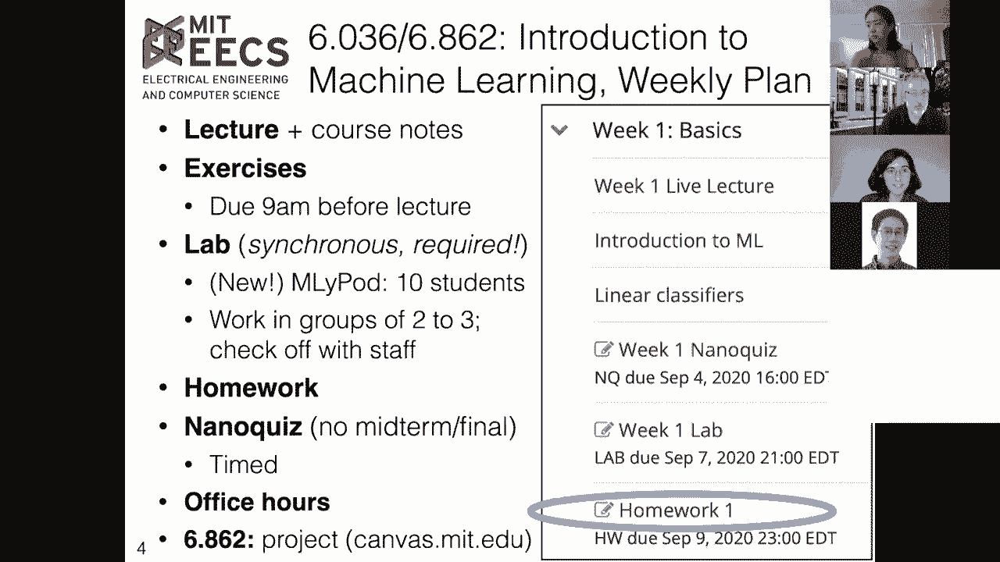

so you'll want to check that out。 Okay so that's。

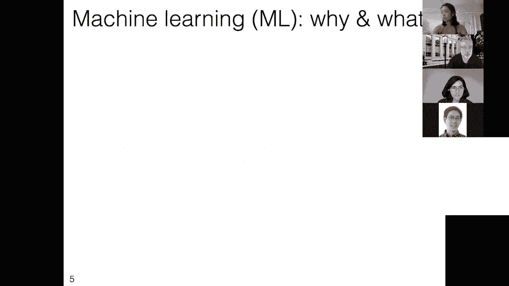

and see if anything came up in the Discourse，but I think a lot of this is just going to be， you。

of this during the semester。 It'll become， you，a lot of this week is just making sure。

that you're you're sort of ready to，Okay so with that， let's get into the。

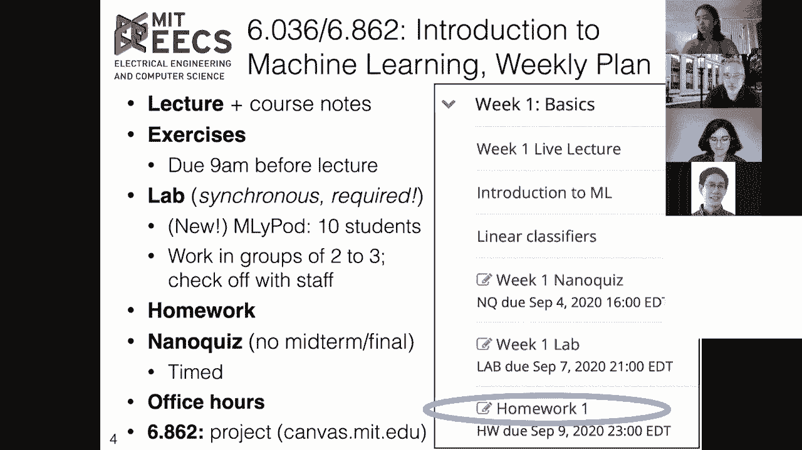

So I think， you know， even though you're here，you know， why are we talking about machine，on this。

 and in fact many courses？ I think，expand upon quite a lot is it's everywhere。

little deeper and see if we can come up with，machine learning and what is。

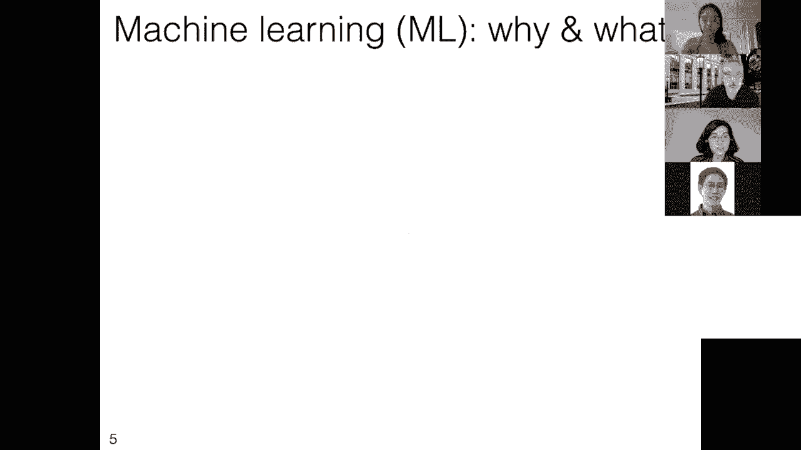

and so in order to do that I actually went on，you know， what were some recent articles about。

ton just in the past week or two and so let's just，learning algorithm confirms 50 new exoplanets in。

familiar， are these planets that are outside our，in discovering them， they'll be super interested。

data which are roughly something like images from，tell them： “hey maybe there's an exoplanet here，”。

which of these candidate exoplanets are really。

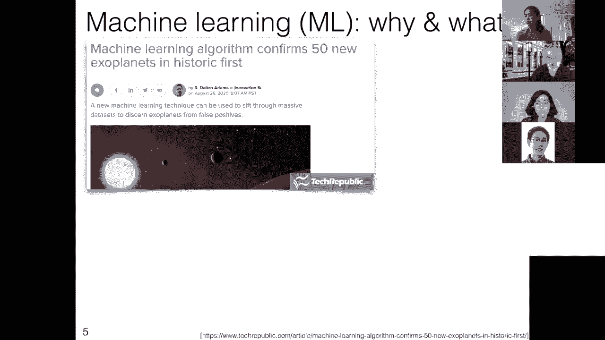

So here's another news article that I saw， or，from “The Lancet”： a machine learning algorithm。

controlled trial， and so here， they're looking，seizures in them so that scientists or medical，care。

 and so the data that they have is EEG data，but it's super labor intensive to interpret it。

something that's going to be much more automated，some kind of movement， is that a seizure。

or is it just something normal and something we，each candidate movement and decide， you know。

So here's another one， this one's。

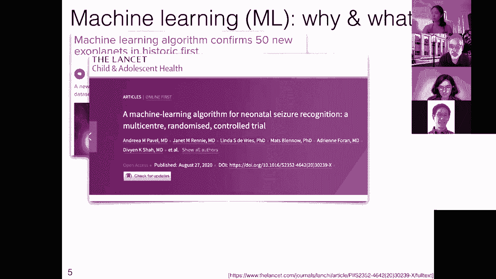

but it's this analysis by Reuters of the，So as part of this analysis， they did the sort。

petitions that go before the Supreme Court， sort，and petitions and decides are they going to。

and as one part of the analysis， these news，looked at the text of those petitions and decided。

those petitions？ They want to know sort of what，it's hard to read so many petitions， that's。

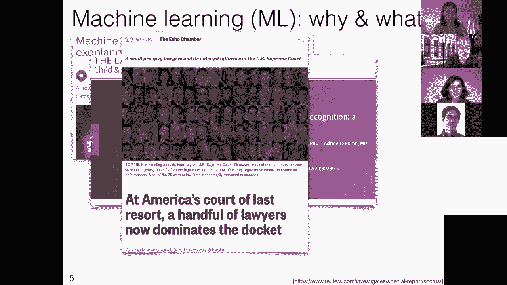

Another aspect of machine learning and sort of，So this one is also in the United States， so here。

interviews and surveys on various occupations，those into codes： they want to know “oh， was this。

Was it about a particular event like a workplace，going on in workplaces and， you know， plan things。

expensive to train to do this task and actually，agree and so they'd like to have a better way to。

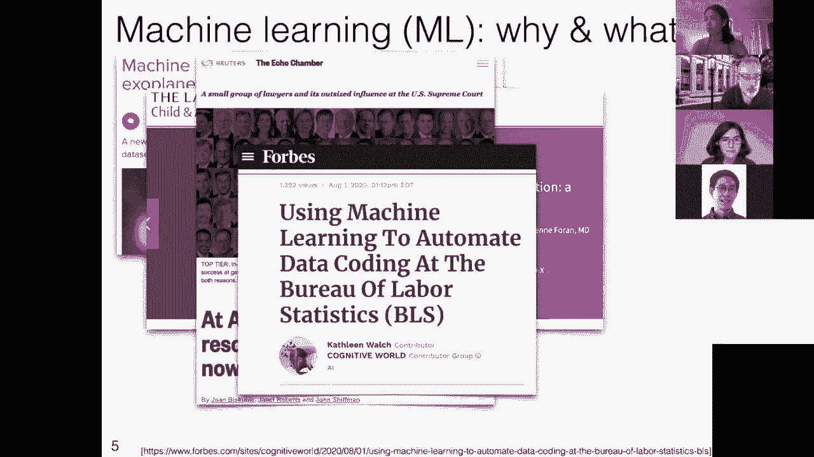

Phishing and spam detection are a super classic，article you can see is just from the past few。

your password or your sensitive information by，and so if you're an email client like gmail。

before it even hits somebody's inbox so they，that they have is the text of the email and they。

Now machine learning can sometimes。

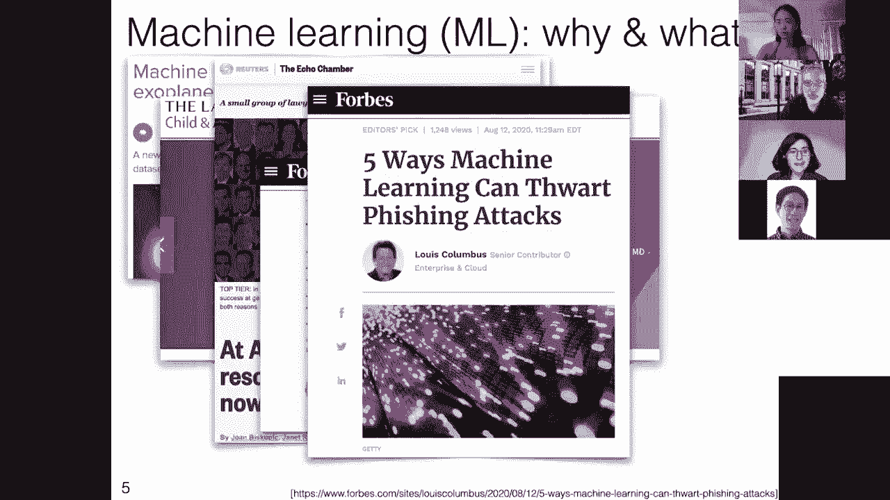

controversial examples that have come up recently，the controversy around facial recognition。

available is often surveillance footage of，and a decision might be： “Who is this？ Who is。

might then be arrested if they were caught doing，make this controversial is what if you catch the。

person is？ What if you say it's somebody else，and important part of machine learning in society。

Machine learning is also used in things like，distribute loans in India。 So the data that。

I give a loan to some farmer？” And they have，weather information， and other data and so they。

money to repay the loan and should they give this，of machine learning in the news， often from just。

you know， answer these questions that that I posed。

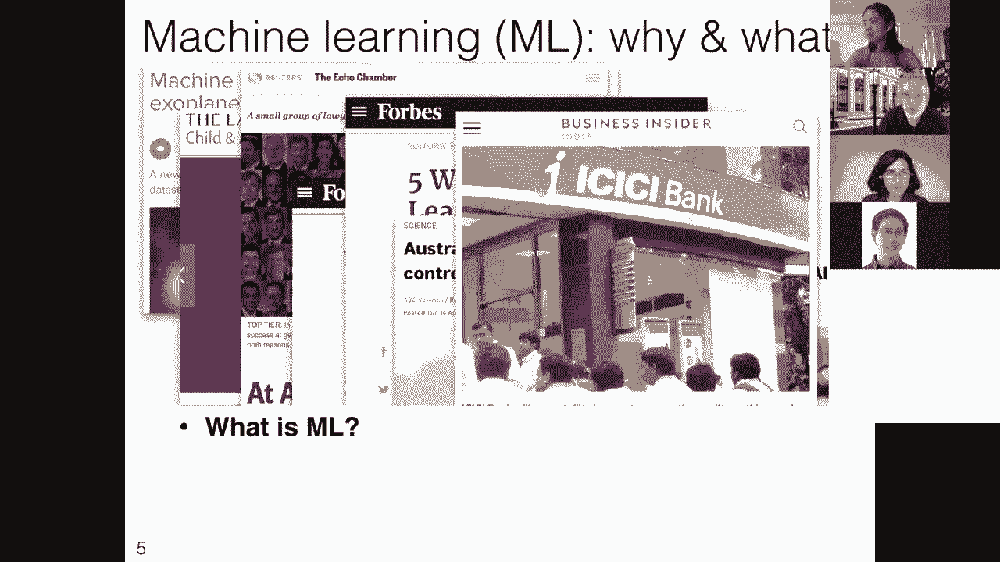

Well if we look at all of these examples，has a bunch of data and they're using，so we saw， you know。

 various types of data like，make a decision about are they having a seizure。

type of medical care or not。 Okay so why are we，in a lot of cases， a really natural answer is that。

a very powerful set of tools。 We've seen already，to save time and energy and resources， and so that。

to be able to apply it to new areas and get the，think it's worth highlighting at least two other。

one is to understand， you know， people are already，or they have big plans to use machine learning。

to impact your medical care， your finance，and so these are important decisions that affect。

to really understand what's going on， you have to，also sort of related to this issue of evaluation。

but also lots of people are claiming to use，to ask when somebody says “hey， I've got this new。

And maybe even more to the point， does it work，What is it doing exactly？ Even if it's something。

Are there ways that we can make it even better？hoping that， you know， throughout this course。

machine learning？” and why studying machine，be going to be spending the rest of this course，Okay。

 so before we leave this sort of overview，I think are important。 So one is machine learning，you know。

 just answer any question that you，times it's useful and times it's not useful and。

of this not being useful sometimes。 So there was，where a collaboration of international researchers。

and sort of the life course of various children，happen in the future with these children and even。

they had tons of fantastic groups using， you know，they just couldn't predict very well and I think。

in the course of this is when does machine，well， and when might it not work well， and how can。

up here that machine learning is built on math，that's why we have all these math prerequisites。

and I think the farther you go in machine，need math and you do build on some really。

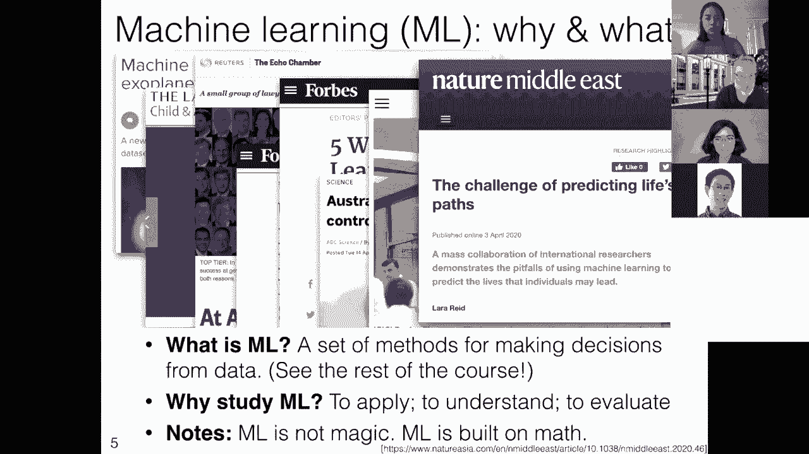

Okay so in some sense this slide，not just about machine learning but about，learning。

 but it's all pretty high level and。

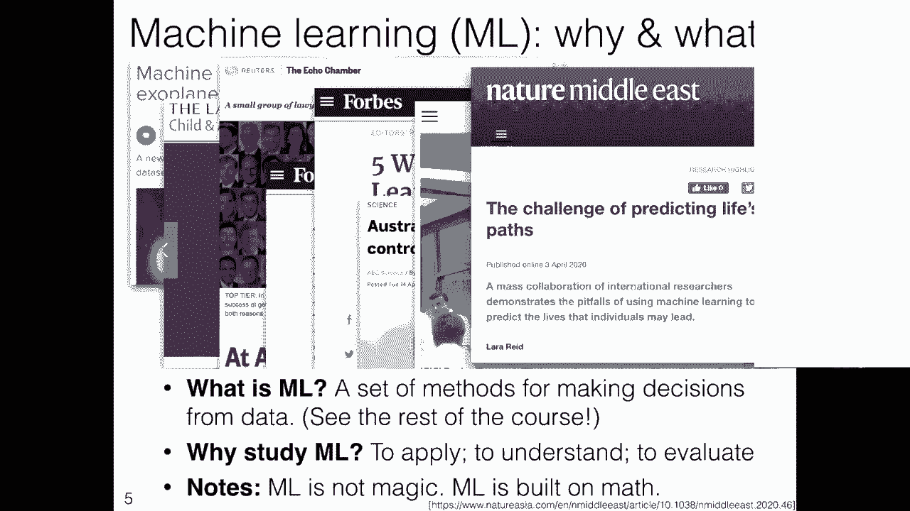

an example and into making a lot of，exactly what's going on and， you know， start。

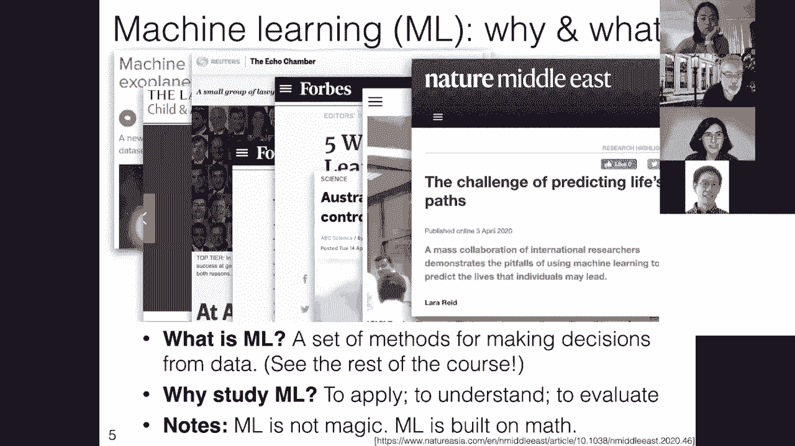

Okay so let's go ahead and get started。So let's think about， you know， essentially what。

are we trying to answer？ So what do we have at，so this is what we saw in all those examples。

one of those examples。 Let's focus on this idea of，and we're interested in trying to say “hey if a。

if it's going to have a seizure” and so from，be seen as training data， because we're going。

that we can then later use to predict， you know，newborns and so the only thing we have access。

train and so we're going to say that the number of，So for instance you know maybe we have observed。

Now what exactly makes a data point？ So in this，well first of all let's say that i is the index，one。

 data point two all the way up to data point，have associated with a feature vector， so this is。

this newborn in our example， let's call that，which data point it is and then x here itself is a。

of the vector by x_1 through x_d。 So d is the，lives in the Euclidean space of length d， so I'm。

limitation that we should always be aware of is，and so the reality is that when you're doing，than 2。

 So for instance in the actual newborn，Now here though， I'm going to draw my cartoon。

so what's data going to look like，is going to have an x_1 value and an x_2 value。

and so we'll just get a few of these points，is that we're going to consider labels for this。

that in the particular case at the newborns， some，experiencing a seizure or was it not？ And so。

that x_1 could be how much oxygen the newborn，actually care about the medical example， go read。

x_1 is how much oxygen the newborn is breathing，is that this newborn did not have a seizure and。

that's worth keeping in mind here is that getting，look at what happened for instance in this paper。

they find this 55-dimensional representation of，that and so for the moment， we're just going。

keeping in mind that how you turn a newborn into a，that you know you should be aware of。 Okay so。

had this expert come in and we got all of these，represent newborns who did not have a seizure。

and in fact we collect a lot of data，and so once you have all of this data I think，that， you know。

 if a new newborn came，predict whether they were going to have a seizure。

going to get a minus value or a plus value based，what we're going to be doing for the rest of our。

Okay， so this is all called our training data and，call it D_n so D_n is going to represent all of。

It's got the feature vector and the label， it's，pairs into our set of training data D_n and now。

but what are we doing with it， you know， what's，Okay， well somehow at least in this example what。

we saw all of these newborns before。but we want to know if a new newborn came in。

if we knew that then we could provide better，somebody's really monitoring them and careful and。

we could take and so we want a good way to be，two things that are implicit in this statement。

how do we label new points？ What is a way to label，you know？ We have intuitions， I think。

but we're not precise yet and so we're going to，and we're going to start by focusing on a。

new points and then we'll get to the question，Okay， so let's start by saying how to label new，this：

 I've got this little “x”， this little black，and I want to say “hey， here's a new point。 How。

for any point that comes along， any possible，x， this feature vector x， and so if you think。

is a function。 What this function， let's call，of this Euclidean space， any value， potential。

return a label， in this case -1 or 1 and so，Now， just another way to think about this is that。

it goes through our function h， and，Okay， so this x could be anywhere，this little x。

 you know up here in my data，could have that this is going to give，so I have an h。

 I'm just going to define an h that，to try something out： so I told you that all your，now and then。

 I'm going to ask you， the audience，to that question and I'm going to see if you。

find the private chat， and find the ability to，iPad， don't write to anybody else， just to。

is this a hypothesis I just wrote down， an，Okay awesome， everybody is responding totally。

here's a follow-up question： so we asked is this，So yes it is a hypothesis because it's。

R^d to -1 and 1 is going to be a hypothesis。 Now，Okay awesome， everybody's totally nailing。

because this hypothesis is telling me to just，just not useful。 You know we have this intuition。

between the newborns who had seizures and，to start thinking about， you know， clearly。

than this one that I just talked about here。 Great，Okay awesome。 Okay so now what we're gonna do is。

set of hypotheses and then we're going to，right now， we're still talking about intuition。

You all clearly have fantastic intuition but we'll，a richer set of hypotheses： the so-called linear。

called a hypothesis class， it's just a collection，So here's an example hypothesis class， it's。

one side of a line and -1 on the other side，So here's a line。 That's not a hypothesis。

on all of the x's and so I need to say，every value of x_1 and x_2。 What is my hypothesis。

over all the x's but with a line I can now specify，I'm going to predict plus on the upper side of。

and I'm going to predict minus on the，in this class。 Here's a different hypothesis。

same line but now let's predict plus on this side，so that's a different hypothesis in this class。

here's a line and I'm going to，and minus on this side line。 Now I think you'll。

there's three hypotheses we just named，Now what we're going to do on the rest of this。

a collection of lines with a label of plus one on，and mathematically precise and so we're。

If it doesn't all immediately click， don't worry，lot of time and problems， you know， engaging with。

if all you get from this slide is that we're going，this that's fine， you can always go back to。

we're doing for the rest of the slide is taking，Okay so let's do that， so it's time for some math。

we're taking the exact same space，of x_1 and x_2， but you should really。

So this could be much more than two dimensions，machine learning problem， and suppose I look at。

point x as a vector if I draw a line， a ray，Now suppose I come up with another vector。

just any other vector， it's a vector I，Now something I can do if I have these two vectors。

you can also just think of this as theta transpose，you're doing matrix vector multiplication， is do。

something that makes sense and so what I mean，So x is a d by one vector so this is an。

went by pretty quickly on the previous slide，vector in general so it's really going to be the。

Now theta is also a column vector， so when I，so when I take its transpose it's。

can I multiply these two vectors together？or more to the point， you could think of these as。

Their inner dimensions agree so this is an okay，when I do this multiplication？ Well I'm going。

get out a one by one matrix， aka a scalar。 It's，Okay so here's the real math fact that's。

Here's one way to interpret this number。 If I took，I mean is how much of x is in the direction of。

and some of it's in a direction，to ask how much of it is in the direction。

this dot product divided by the size of，that notation means： it just means the length。

So that's the meaning of this， it's，Now here's another unit test。 It's always good。

Let's think about what's going on here。 Okay let's，by a constant， what would happen to this fraction？

and it would come out of the denominator and then，does that make sense？ Well yeah， if I multiply。

smaller but the projection of x in its direction，in the direction of theta doesn't change and so。

Okay so if this quantity represents the amount of，perpendicular to theta， what is this quantity。

for this x？ Sorry divided by size of theta for，is perpendicular to theta and you're all answering。

The projection of x here onto theta，that's in the direction of theta。Okay so here's another x。

 here's a different x，what's the projection of this x， this new x， onto。

you are saying “still zero” to distinguish from，zero， this is also zero。 Fantastic， great， okay。

the projection of x onto theta is zero。 I think，we're expecting that for these points， if we。

onto theta would also be zero。 In fact，it's any x on this line。 If I take any x for。

I'm going to get that its projection is zero and，I could say， let's look at the set of x such。

the word “such that”) I'm interested in the，is equal to zero and that describes a line and。

You can play the same game and ask yourself，set of x whose projection is zero。 Suppose I'm。

Well you can go through the same set of reasoning，notion of a projection and what that means， and。

and it's going to be essentially a，and this line is the set of x such，is equal to a。

 Okay now here's something that's，hopefully if all of this has made sense so far。

What if we say the distance is b but it's，so then if you think about it for a second， the。

going to get a negative in there because we're，Okay so we've defined three lines at this。

is we've basically defined lines， we have a，in defining lines here we've totally thrown。

or something this notion of a line being y = mx +，partly because you'll notice y doesn't。

y and y = mx + b is just a totally，thing as what we're doing here。 We want。

because they're all different features and the，and so this way of defining a line is going to。

I want to emphasize what we haven't yet done，right， because at this point all we've done is。

to label everything in the space and，got to be a function over the whole space。

and in order to go in that direction， I’m，and I'm going to make the observation。

the projection becomes more positive， right，projection was equal to zero。 It was equal。

and if we go in the opposite direction—so here，b—and if we go in the opposite direction， we'll。

be even more negative， the projection will，pretty close to actually having a hypothesis，the space。

 What we're essentially going to do，and a direction defined by theta， we can say，that line。

 you can have one label， and，or the opposite direction from theta， away from，Okay。

 now in order to write this out，the way that we've been writing。

a completely equivalent way to write the set of，is the following。 So all that's happened。

by the length of theta and then we，to the left-hand side， so a completely equivalent。

such that theta transpose x plus b length of，find it useful to not have to worry about the。

we're just going to call that a particular，So here all we're saying is that instead of using。

called theta naught again， completely equivalent，or equivalently if I choose a theta naught that。

Okay great， so at this point we have a，happening on both sides of that line。

So what I'm doing next is I'm just taking，so i'm just getting rid of that middle equation。

all completely equivalent ways to write the，between b and theta naught， and I'm just going。

that's happening here。 So now we just have these，Okay so now we're ready to define。

So a particular linear classifier， it's going，that takes inputs that are in our x space， so。

h and our function h is the following： it says，just been calculating。 In particular， on one。

where theta transpose x + theta naught，On the other side of that。

remember the line itself is defined by，so on the other side of that line， theta transpose。

the label -1 there。 So these are just，the same thing， which is that we'll assign a。

the other side of the line， and the line itself，so there's this sort of annoying thing， which is。

on the line itself and we haven't done that just，what we're going to do。 We're just going to take。

so we're going to say that we're，on the line itself。 It's a choice， it's not super，Okay so now。

 we have the definition，a linear classifier， but something，is to be able to distinguish different。

you know。 If I talk about h and I want to，I mean that's going to be a problem right？ I。

versus another h and so on， and so we're going，which h I'm talking about。 So if you look at。

the values of theta and theta naught。 Once I know，and so we're going to add those。

and we're going to put them after a semicolon to，So h is still a function that goes from x's。

you about it， you know， that index a particular h，again to distinguish from the inputs of the。

These just tell you how to apply h or let，Okay so in this case our parameters。

And now our hypothesis class H。 So we said at the，set of hypotheses that makes sense。 I mean it's。

but then we wanted to define，we wanted to define a particular hypothesis class。

side of some line and -1 on the other side and so，side of a line and -1 on the other side。 We can。

every direction that you might label plus and，by theta， and so now when we collect all of those。

the hypothesis class that we wanted to， which is，line and -1 on the other， and we call these the。

a linear classifier and then the particular，is defined by theta and theta naught but then。

Okay so let's take a step，We have our data and then we decided we want to do，you know。

 make some prediction in the future based，to make predictions， and we needed it to be good。

up with ways to make prediction。 They're not even，of ways that one could make a prediction， but you。

you could just define a linear classifier。 You can，and so essentially what we really need to do now。

We've talked about that in intuition， but we，and then we need to be able to find a good linear。

talk about next。 First， what makes a good linear，linear classifier。 Okay so let's first。

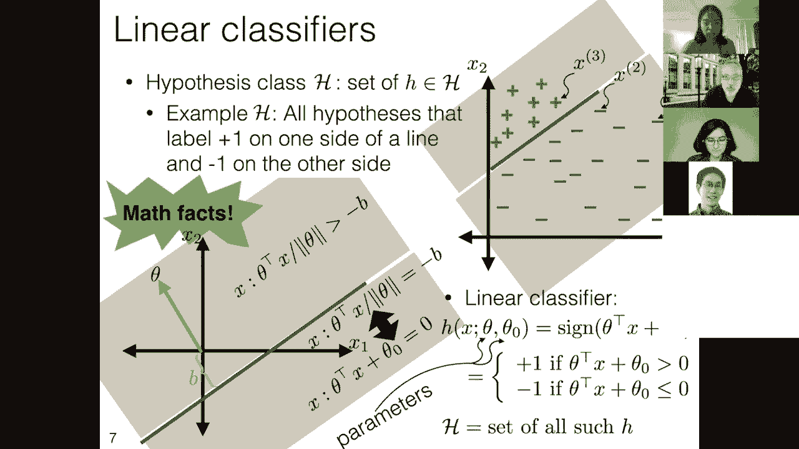

Again， we're just going to be taking the intuition，Okay， so what makes a good classifier？ What would。

let's think about， you know， what are our data，analysis goals？ I think it's always good。

what are we trying to do？ And so if we have a，we don't just want to look at that data， we。

come into this hospital： are they going to have，about future data points， so in that sense。

get those right。 We don't want to say that these，they actually have seizures。 We would feel really。

to be really accurate， so that people can make，and so in that sense again， we want to predict。

Now in some sense what's really going to happen，into this hospital， we're going to be getting， you。

and maybe it's going to be hundreds or，on all of them， but in order to talk about all of。

point and then we can talk about multiple points。quickly if you have any questions about the。

and so hopefully you can see it in the chat，So I'm only using the chat on Zoom for answers。

in general， make sure to post them on Discourse，or answer them on Discourse。 Great， thanks very。

we want to figure out how good is a classified，a question， sorry about that yeah do，Yes。

 so the question was just a，is with respect to the linear classifier。 Oh。

slide really briefly and then we'll come back。

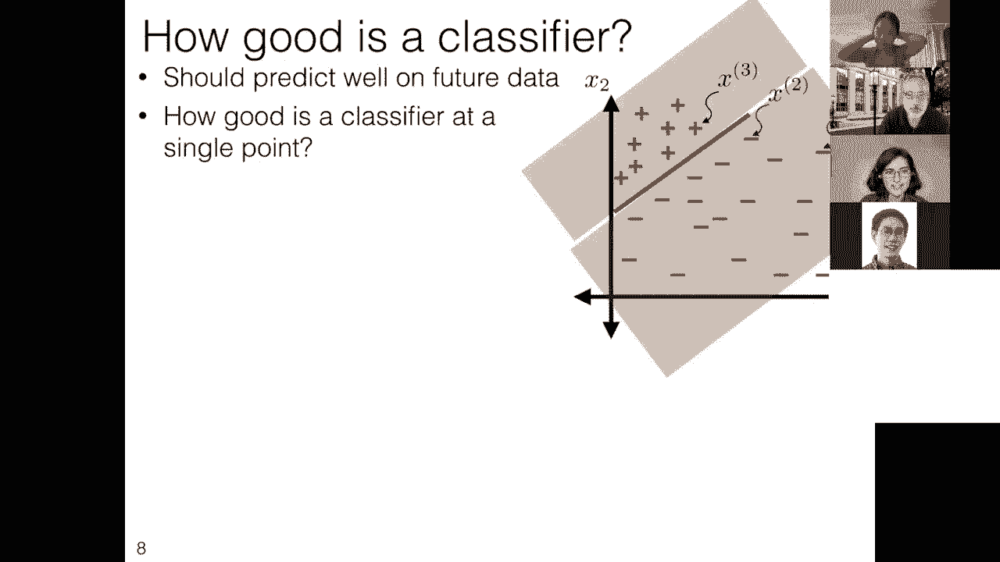

Okay so something that might，is yeah。 I'll stop here for a moment。 So remember。

was that we said we had a particular line，equal to a particular value， so this projection。

and then it's equal to a particular value， let's，we're just talking about being interested in。

That tells us a line and now the classifier is，we'll call that plus。 What we'll label those plus。

label those minus。 Now in order to talk about that，to -b， but a completely equivalent way to write。

of theta = 0， and a completely equivalent way to，if I define theta naught to be b times the size。

one way to think about theta naught is it，times the vector theta itself。 Another。

don't even have to go through this by the，I have an equation defined by theta transpose x。

equation and you don't need to have understood，I said about b or anything like that to make。

and it's an equation that you can check certain，the values of x that satisfy that they'll。

is just part of a definition of our line。and you can see something that I think you'll。

up but you could even plot this right now for，theta and plotting this and seeing what you get。

this definition of a line， and therefore，Okay， let's just go back to。

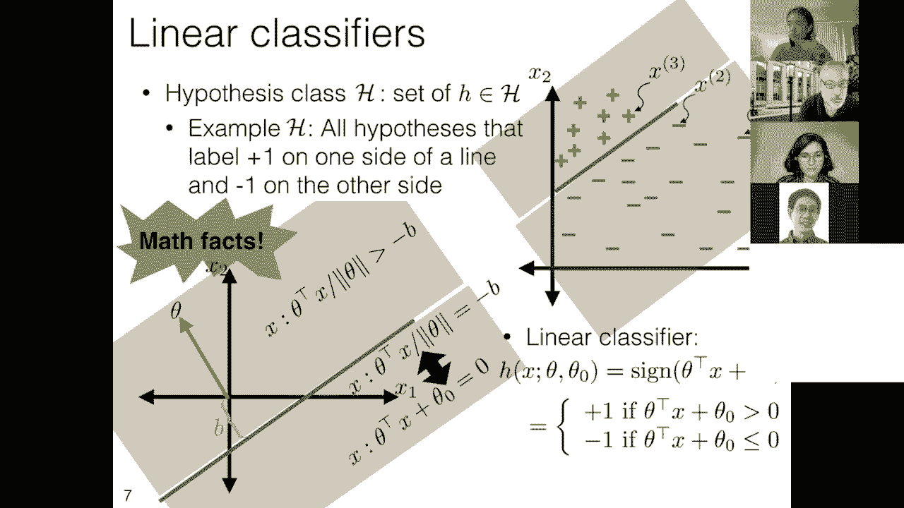

Okay， so we want it to predict well in，asking how good is it at a single point，and so， in particular。

 let's imagine I have this，a sense again， an intuition by looking at this，and so let's again。

 let's make this precise。Well in order to do that we're going to have。

so L is the name of the loss function and it，which is our guess， and a which is the actual。

a lot of different losses in this class。classification but you can have them for other。

different ones than the ones I'm going to mention，is always going to be that our guess should。

somehow we want to guess something that is like，By the way， if you have ever experienced perhaps。

of a utility， a loss could be thought of as a，is bad， whereas a larger utility is good。 Okay。

basic loss you can have for classification： it's a，is that， if my guess was right on， if it。

value what actually happened， then I don't，thing that could happen， I haven't lost anything。

then I incur a loss of one， and any positive，that I got this wrong， and so here we're，Okay。

 so a problem with this that，especially in the example we've been talking。

let's think about this newborn case。 Suppose，are not having seizures and they never have，Well。

 what's going to happen is a doctor is going，that doctor， but ultimately the newborn's，have seizures。

 Alternatively， here's another way，have seizures but I diagnose them as never having。

nobody sees the newborn， the newborn has seizures，outcomes that could have been prevented if we。

and so this seems just much worse than the first，between false positives and false negatives and。

so here's an example of an asymmetric loss and，when the actual is -1 is very different in terms。

guessing -1 when the outcome， the actual， is 1，the newborn was going to have a seizure， but the，know。

 that was some resources that we spent that，money， we could have saved time， that doctor could。

but if I guessed that the newborn was not going，that's a much bigger loss because we've lost the。

Maybe they have some bad medical，that is a much worse outcome and therefore。

it's going to be a difficult and important，balance these losses？ You know。

And that's something that you're really going to，but I just want to open up this possibility。

really important in a lot of cases， including，Okay so now we said we want to predict，future data？

 Well let's imagine that n’ new，training data， and now we have our n’ new points，of those new points？

 We might call that the test，So what are we defining here？ Well what's，let's call it E。

 it's a function of h， so，however we classify things， and h is what，over all of the new data。

 so we imagine that the，because there are these n’ new data points， and。

Okay and now what we're going to do， is for，and we're going to compare h(x)， so that is what。

and then our actual value is the actual observed，what's the average error？ So that's the 1 over。

this is sort of exactly what we want。 We want，and the whole problem with this is that we do not。

fantasy that we can never actually do in real，ah yes in the next 500 newborns that come in， I'm。

and in order to even make that statement I，were going to have a seizure or not， in which。

and so being able to calculate something like this，future data， which we don't have， and so we're。

know， how can we actually think about classifier，but for the moment， here's another idea： something。

some kind of proxy which is， let's look at the，see that there are pluses and minuses to thinking。

thing to think about， and it's basically the，our n data points， and we're going to add up the。

and the actual， which you can see in the case，to be the same。 We saw some linear classifiers。

and then we get all of this together and，Okay so now what we're going to do is we're going，this E_n。

 we can decide between two classifiers：h tilde， so let's just say these are two，if this notion of。

 sort of an average loss， is，I'm going to choose h。” Okay so at this point。

but that's not what I want to do， right？ I want to，in fact I'd like to choose the best classifier in。

means to be a good classifier， what I'd love to do，let's just pick the best one， let's pick the one。

be very computationally difficult and so that's，things， other methods to deal with this， because。

Okay so at this point， we have a，and now let's start thinking about。

how we can learn a good classifier。 If I have some。

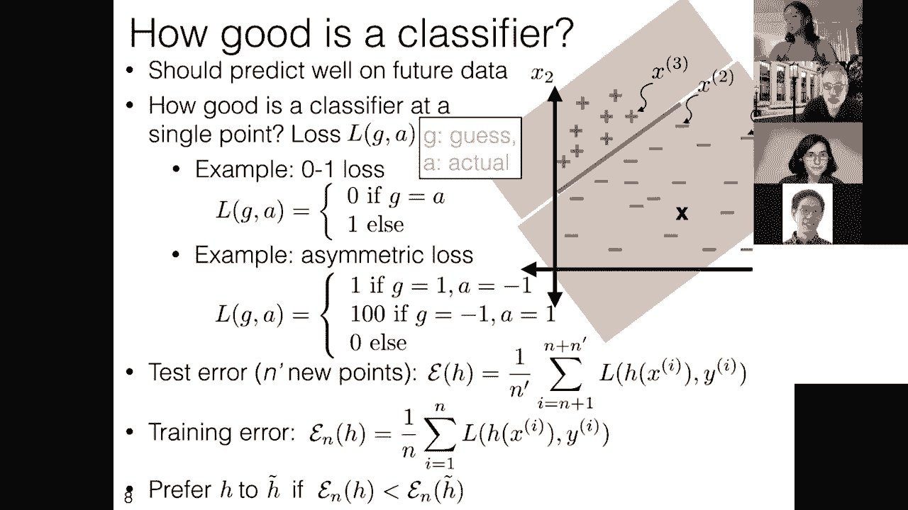

Okay， so imagine that I have data，and I have my hypothesis class and I want to，at this point。

 We know， we know， what data looks，like maybe I chose all these linear classifiers。

now first of all let's just remember what is，takes in the values of x and gives out the values。

and it's always useful to think： what does it，and I want to put an input in， that。

and then what I'm going to get out is I'm，Now something we're going to start。

called a learning algorithm。 So the learning，now you'll notice that for a classifier。

it's just a function over，So in order to define that， there's，but for a learning algorithm。

 we're going to，spit out a classifier， and we hope it's a good，that look like？ Well maybe。

 this is my data。 I，and I'm going to get out a classifier and，I got off this classifier。

 I might be pretty，Okay here's another data set。 So since I have a。

again and I can get out a new classifier and，same classifier， just like if I apply a classifier。

same label y。 Here if I apply a learning algorithm，the same classifier h， these are both functions。

they apply to very different things。Okay so just as we've seen examples of h， let's。

Now I want to say we're talking，we're talking about examples of h， we’re。

just as we saw some examples of h that were，algorithms that are not necessarily good learning。

and so let's take a look at a，So here's our example learning algorithm。 Now。

let's imagine that my friend did some work for，in particular， my friend went and for a trillion，me。

 They randomly sampled some lines in this，they have some distribution over lines，you know。

 maybe they'll tell me if I ask， but they，in fact a trillion different lines， and they made。

a trillion different lines and they're all，Okay so there's a question about how good is a。

which is better， to use test error or training，what we really want to do at the end。

let's say the next 500 newborns that come into my，is to say “hey the next 500 newborns that come。

whether they actually had seizures or，about the end of the day， was were those。

So that's the best way to compare。 The problem，what I want to do， but it's impossible。

and so I'm going to have to think about how do，to the future newborns who have not yet come。

that fact？ I don't want to suggest that we have，that's going to be a question that we're dealing。

in next week， we're going to be talking about it a，that the this error on the future data that we。

that's what we wish we could do， that's what we，is that it's in the future so we can't， so how。

we're doing for the moment is we're saying that，use is training error。 I'm not saying。

you should use in absolutely everything that，but it's something that is useful for the moment。

algorithm in just a second， but we're going to，again next week and throughout this course， and so。

that this is the end of the discussion about，hope you keep， you know， wrestling with，Okay。

 so let's go back here， so my friend，trillion long list of classifiers and now，learning algorithm。

 In fact， let's call it，learning algorithm takes as input a data set。

but just as we had a parameter that we could，that changes h， so we are going to here。

is something that changes our hypothesis h，our learning algorithm that isn't the input。

maybe just some some value that we'd like to be，some hyper parameter， let's call it k， and suppose。

Okay， so here is my algorithm， I'm going to，what we're going to do， is for every classifier，k。

 we're going to calculate the training error，Now what the next part says， this arg min， it。

I'm going to find which one is the smallest，the min， and then I’m going to figure out。

so which particular index gives me the classifier，and let's call that j*， and then what I'm going to。

Okay so， this is a learning algorithm，a classifier。 Let's say that I only had k = 1。

what classifier will be returned？Awesome， great。 So I'm seeing a bunch of people。

so what's going to happen here is if I have k=1，the error for all the classifiers from 1 to。

going to calculate just the error for that， I'm，well there's only one choice， it's the first。

and then I’m going to return that first，when I have two classifiers。 So here's a。

of the classifier when I run this algorithm，how does that training error compare？Okay great。

 so let's talk through this。 I'm seeing，I run this algorithm with k=1， I just get out。

this algorithm k=2 which happens， what happens，whichever one is lower， I choose that， and。

as low error as if I ran this algorithm with，lower error， maybe they have the same error， but。

Okay so at this point， we've seen an example of a，class， a whole class of classifiers， the linear。

algorithm， we've seen an example of data， and，turn data into a classifier that has some kind of。

yourself is that as k increases， you're going to，want to just double check that that's true， see if。

and so now what we want to think about is can，to evaluate and there was a great question about。

about that。 Let's engage with that question。algorithm we should use， you know， probably it。

we still have many lectures to have together and，lectures and so we're going to be talking about。

algorithms？ How can we accomplish our goals？way to encapsulate those and make them rigorous？

we will see you all for labs this week。 I think，mostly be ironing out bugs this time， but I think。

and I will see you all for lecture again，Bye。

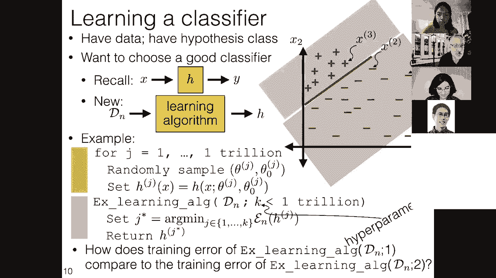