# 【双语字幕+资料下载】MIT 6.036 ｜ 机器学习导论(2020·完整版) - P4：L4- 逻辑回归(对数几率回归) - ShowMeAI - BV1y44y187wN

okay，good morning it's uh mit time so let's，go ahead and get started。

uh so today we are in lecture four um，there have been，so many great questions at discourse uh。

during all the previous lectures，hopefully we'll keep that up，with this lecture we've got a lot of。

great staff um answering those and of，course uh you can answer them，as well um so last time。

um and last times we've been talking，about linear classifiers。

for a bit now we have developed various，algorithms，um one of the big ones that we've been。

focusing on is this perceptron algorithm，and uh last time the very last time we。

talked about the sort of more complete，machine learning analysis really going a。

little bit more from the start，you know you have some data um thinking。

about what are good sets of features to，be using，running your uh algorithm you know be it。

perceptron or something else，um and then doing something with that uh。

with what you get out interpreting it，using it for prediction，or something else and so today we're。

gonna we're gonna step back into，thinking about algorithms um so focusing，on that algorithm piece。

and learn about what is really just an，absolute workhorse algorithm if you。

analyze data in real life at some point，in your life there's just，um。

logistic regression at some point now um，this is a classification algorithm and。

we talked about how regression is，different from classification and it，just so happens that。

you know for historical reasons um and，sort of subtle nuanced reasons it。

happens to be called logistic regression，but we're going to be learning about。

um basically this really fantastic，classification algorithm today。

and we're going to see that uh gradient，descent，is a more general algorithm that lets us。

minimize or come close to minimizing a，general function，that we can sort of slot in and use for。

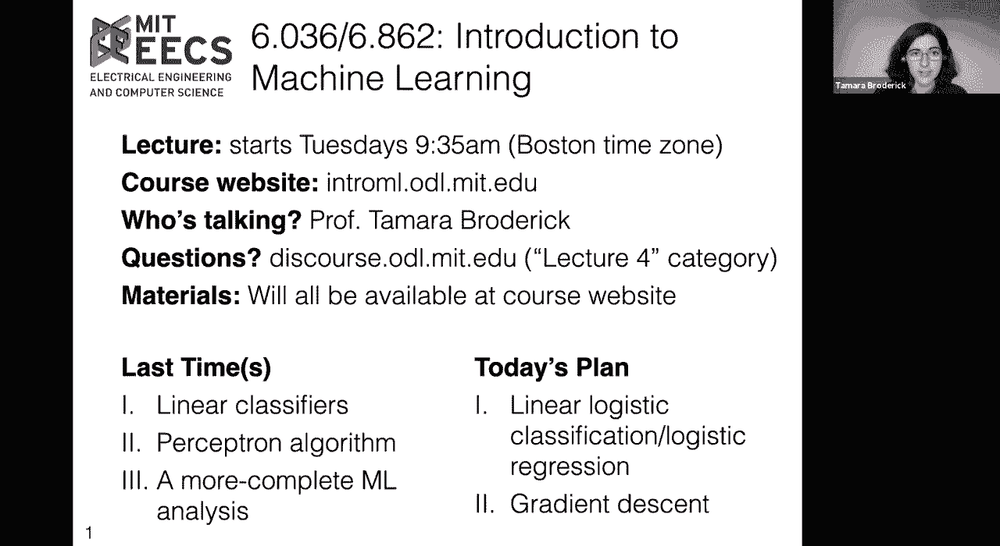

the purposes of logistic regression，so first before we before we get started，let's。

let's recall why are we doing this you，know why don't we just use the，perceptron for。

everything because we have an algorithm，now and something that we saw in lecture。

two is that the perceptron struggles，with data that's not linearly separable。

and the reality of life is that probably，most data that you're interested in is。

not linearly separable，um so for instance we saw this example，of some penguin data。

maybe we've collected data on the，flipper length and body mass of penguins。

and we'd like to classify the penguins，into their different species。

and we can just immediately see that，that's not linearly separable and we saw，some examples in the。

in the health data that we were thinking，about the medical data that we were。

thinking about last time，as well um and you know technically，speaking you can use something like。

average perceptron to get around this，but it's very ad hoc and，there's there's no sort of nice。

guarantee about how that's going to，perform and in fact it can perform。

pretty poorly with data that's not，linearly separable，so we'd like to have something to deal。

with that now let's notice，another issue with perceptron，um that may or may not have come up in。

your discussions already which is that，it sort of doesn't have a notion。

of uncertainty like not just what's our，best guess right now but。

how good is that guess or what do we，actually know in this problem。

um and that can be a real issue and this，is actually pretty related to the linear，separability。

so for instance um it is fall and i'm，going to have to start thinking about，um。

and especially if you're in a big，building with a lot of apartments you。

really want to make the right call，before you get outside and you know you。

want to you want to decide whether you，have a coat，and in general i might think as the as。

the temperature increases i'm less，likely to wear a coat，and maybe as the wind speed picks up i'm。

more likely to wear one，and so i imagine that perhaps i've，collected a bunch of data on whether。

i've worn a coat or not in the past and，i'd like to，make a nice little classifier for myself。

so i can decide whether to wear a coat，as the fall approaches in the future and。

perhaps it just so happens that i did，not collect a lot of data at these。

really key fall temperatures um which，are sort of in between，um and so i might run perceptron um but。

an issue with the perceptron，is that sort of any classifier that，separates this data。

is equally good in its eyes so this，seems fine，it would stop here this is fine but this。

is just as fine，and somehow that seems a little bit off，i think if we think about this you know。

the reality is we don't have，any data in this area and we'd like to，express that that as a result。

we're not so certain about how we should，make a decision，um in this area now let's suppose that。

we've gone，and collected more data so this is just，the same set of data but now。

we've actually collected some data um in，that intermediate area and so maybe it，turns out that this。

is a good classifier uh maybe i like to，wear a coat when it's a little bit，warmer out。

um just to you know maybe i run a little，bit cold，um and so that's well and good but the，reality is。

i definitely don't wear a coat at some，perfect temperature wind speed boundary，i think if you。

if you took actual data of when i'm，wearing a coat the reality is sometimes。

i'd be wearing a coat at slightly higher，temperatures and sometimes i wouldn't。

sometimes i'd be wearing a coat at，slightly higher wind speeds and，sometimes i wouldn't。

and this is the way that a lot of things，work you know in the medical example，that we saw。

last week um you know it's not like，there's this perfect division。

on any medical indicator of whether，somebody has heart disease or not。

uh the reality is there's so much that，we don't know about this person or that，we're not measuring。

um or that might just be a little random，and so，we don't capture that uh with the。

perceptron we just say，well，actually some of this data there's a。

region where i'm just not really certain，exactly what's going on and i'd like to，be able，ask。

um you know how can we do that how can，we capture these these different forms。

of uncertainty and deal with this。

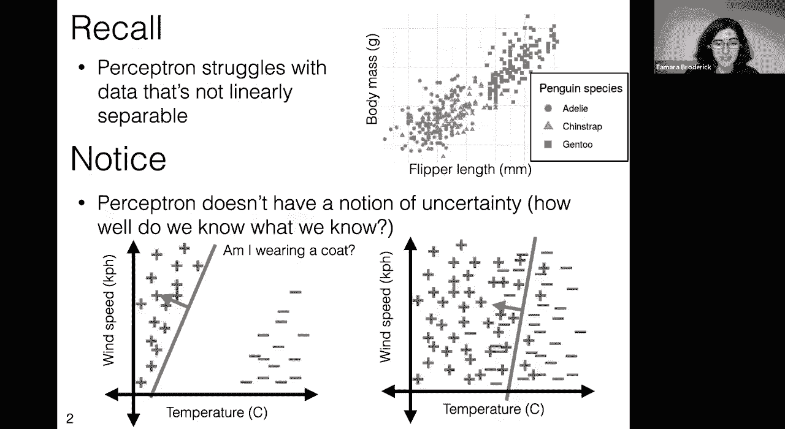

not linearly separable data，okay so let's think about how we could。

capture uncertainty well let's start by，thinking about how we can't。

capture uncertainty um so let's imagine，that i might plot，my probability of wearing a coat at。

different temperatures，and so if i were absolutely you know 100。

certain that i would wear a coat below a，certain temperature and。

absolutely 100 certain certain that i，would not wear a coat above a certain。

temperature i might i might put this so，the one probability represents，coat。

in some range of temperatures and the，zero probability represents that i'm。

certain that i won't wear a coat，and now i could imagine if this is，actually how i behaved。

that i could generate some data about，you know how what i'm going to do on a，given day。

so particularly you know if it's a warm，day let's get a label of am i wearing a，coat。

if it's a really warm day i'm not going，to wear a coat，because i have zero percent probability。

of wearing a coat um，any warm day there's zero percent，probability of wearing a coat。

and now i could go to a colder day and，now there's 100 probability that i'm。

wearing a coat and so it's very easy to，generate these labels um。

it's just i look am i wearing a coat or，am i not，the probability is either zero or one，and。

when we look at this we realize at least，for me this is not an accurate，representation。

of of how i wear a coat a slightly more，accurate representation would be sort of。

a smoother version of this，um it would be to say something like oh，you know actually。

um yes there are some temperatures where，100，i'm wearing a coat you know if it's like。

uh you know well below zero celsius，i'm i'm definitely going to be wearing a。

coat but there's some range of，temperatures you know maybe，maybe um somewhere around 15 degrees。

celsius or so where，it's a little bit of a toss-up and i'd，like to say that my probability of。

wearing a coat is really between，zero and one sometimes i will and，sometimes i won't。

and that that sort of very smoothly um，across the temperatures that as the。

temperature increase my probability of，wearing a coat goes down until，eventually。

you know it gets to be super hot and i'm，definitely not wearing a coat。

now if we had this as the model of me，this，exactly i were to generate whether i，wear a coat。

based on on these probabilities i'm，going to get something a little，different，i'm。

basically definitely wearing not wearing，exactly，into，fall it starts to be the case that，sometimes i。

i will wear a coat and that probability，is increasing，as it gets even colder until we get to a。

point where，it's basically one and i'm always，wearing a coat。

okay so this seems like a sort of better，representation，of whether i'm wearing a coat or not and。

so it'd be nice to see，you know how do we make this shape the，shape of going from。

you know a 100 probability probability，one，of of wearing a coat you know down to。

zero but in sort of a smooth way，okay so um it turns out this has a name，uh this is called the。

sigmoid or logistic function sigmoid，because it looks sort of like an。

s um so let's let's just draw out，um the canonical sigmoid function so。

sigma here is a function it takes as an，input z it is 1 over 1 plus。

the exponential function of negative z，so let's just draw that。

so we're going to draw it as a function，of z we're going to draw sigma z。

and let's just check that we agree with，this drawing，so in particular as z gets very very。

very low like it gets very negative，we notice that negative z gets really，big，z，gets。

really big and so we're you know taking，one over a really big number that's，going to be like zero。

now on the other end we're gonna have，um our z getting really really really，big。

so negative z gets really really really，negative，so exponential of negative z gets really。

close to zero and so we're dividing one，over one plus something really close to。

zero so that will be near one，so we see that all of this function is。

always going to be basically between，zero and one and we can ask what happens，at the origin。

so the origin we'll have z equals zero，exponential of zero is one。

and so we're gonna have one over one，plus one that'll be 0。5，okay so this this seems to check out。

this is this is a function，um but uh oh it's it's not quite the。

function that we drew at the top there's，a few things that are a little bit，at。

this original s curve that we made that，describes you know how i behave in。

different temperatures in terms of，wearing a coat，it's a little bit different than the s。

curve that we just made this sigmoid，logistic function and so we want to ask，how can we go。

from this canonical sigmoid logistic，function to this one that describes。

um you know the probability of wearing a，coat in different temperatures。

and we can do that basically by just，stretching and pulling and moving around。

this bottom function so in particular，something that we can do with this。

bottom function here is we can say，just，scale that input like if i had slightly，different you know。

um units for z or you know i just，multiply it by some number some constant，let's call that theta。

then i can sort of squish it or pull it，out，and so here what we've done is we've。

just said by multiplying by this，constant we sort of squished it but you。

could also pull it out so that it has，sort of a bigger width，now another thing that we could do is。

you know and certainly that we want to，do here is flip it，but we can include that in theta as well。

we could just have a negative theta，and so then we would get something，that's that's flipped。

now similarly uh we actually might want，to move this around we might want the，point where it's 0。

5 or sort of the area，where we're a little uncertain about，what's going on to to be at a different。

point along the z-axis，and so in order to accomplish that we，can just add a constant to z。

and so we can move this around there and，so in general，we can start from this canonical sigmoid。

and again，just by stretching it with theta，and moving around its offset with theta，naught we can get。

um basically these different sigmoid uh，functions，in different spaces that behave you know。

in these ways that we want，and so just going back up to our，temperature example up here here we're。

thinking of，x as a feature so earlier i was just，using z as some generic。

input so that we didn't confuse it with，our our data but here we're thinking of。

acts as our actual feature，you know it's our feature that we，observe and perhaps some classification。

problem，of，of probabilities as as g of x，and so then let's ask what would be the。

formula for g of x based on what we just，said，well g of x would be some application of。

the sigma function，but to this sort of stretched and offset，version of x。

so we'll take sigma and apply it to，theta x plus theta naught，to get this g of x and then all i'm。

going to do here，is write exactly that formula so i've，just taken，sigma of z which we defined below。

and i put in this new input theta x plus，theta naught，so this is just exactly the sigma。

function that we see at the bottom of，the slide but with this input。

theta x plus theta naught and so that's，the g of x that we're considering here。

that'll let us have this sort of，smooth change instead of having this，abrupt sort of one。

zero function we're having a smooth，change between you know always doing。

something and always not doing something，like always wearing a coat and always，not wearing a coat。

okay so at this point we've sort of，described，how you could take uh you know some。

smooth notion of probabilities and，turning it into sort of simulated data。

um now what we really want to do is the，other way around what we really want to。

do is have our real data，and then learn this smooth function of。

probabilities and we're going to do that，in a moment，but first i just want to look at what。

this simulation looks like，in two dimensions so we have a sense of，what higher dimensions。

look like not just one dimension because，in general of course our features aren't。

just one dimensional they could be，higher dimensional in fact。

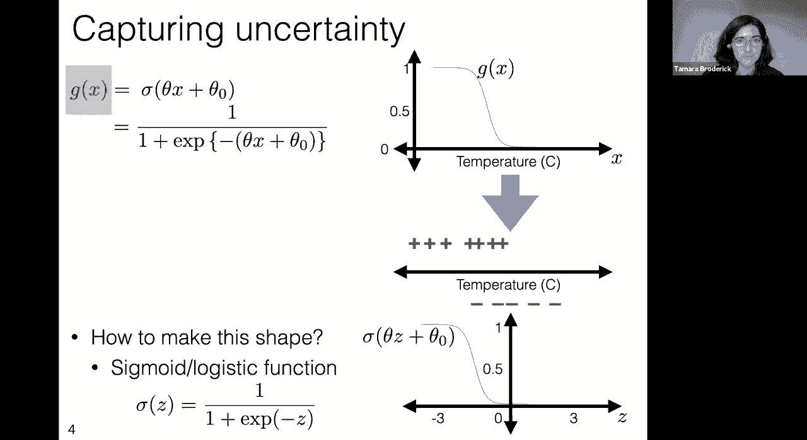

they typically are higher dimension okay，so let's let's take a look at that so。

first recall we just looked at one，dimensions with one feature。

so in that case our g of x this is just，the g of x that i just wrote on the，previous slide。

we saw that it looks like this nice sort，of s curve and that i could generate。

sort of my simulated data，by drawing uh you know am i wearing a。

code or not wearing a coat according to，the appropriate probability so let's。

look at two features now，okay so what what's going to go on with，two features。

well i'm going to propose that we do a g，of x much like we did last time that we，have a sigma。

function and we apply it now to instead，of theta x，plus theta naught theta transpose x plus。

theta naught which is starting to look，pretty familiar if it wasn't already。

um definitely this is a that theta，transpose x plus theta，is very familiar from linear classifiers。

at this point，now first of all let's just do a，dimensionality analysis to make sure，this makes sense。

so remember theta transpose x is going，to give us a scalar，theta naught's a scalar so the whole。

input to sigma is still a scalar which，is good because that is what we assume。

that sigma takes as input，just a one-dimensional scalar so even。

though x is high dimensional the input，to sigma，is just one dimensional okay so that，checks out。

now let's think about what this actually，looks like，as a function so remember um in two，dimensions。

our feature set is going to be x1 and x2，and now we're going to draw。

our g of x that's going to be some，function of both x1，and x2 and to figure out why this shape。

is appropriate let's start sort of，looking at this function a little bit，more。

so first of all this looks very familiar，again theta transpose x plus theta，naught what do we know。

about this function well theta transpose，x plus theta naught when that's equal to，zero。

that's a line now at the same time when，that's equal to zero。

we just said that g of x equals one half，so theta transpose x plus theta naught，describes the line。

where g of x is equal to one half and in，fact in general，theta transpose x plus theta naught。

equals to a constant，describes a line where g of x has the，same value，across that line okay。

so this is sort of this dividing line，this is you know this this。

one half line and in general this will，be a hyperplane and in this case it's a，line。

okay so now let's ask ourselves well，what happens，in this direction as we go away from the。

line in the direction of，theta so remember theta was sort of our，normal vector it still is here。

as x increases or gets more in the theta，direction，than this line well as we do that。

this dot product is going to increase，so this whole quantity is going to，increase。

so the negative of that quantity is，going to become very negative。

so the exponential is going to become，very small，and so we're going to get something like。

1 over 1 plus a very small number and，that'll be near 1。and so as we move x in the direction of。

theta we're getting numbers that are，increasingly near 1 and that's what we，see in the plot。

if we move x in the direction，of negative theta then we're going to。

have the opposite thing occurring we're，going to get that exponential。

input being very small we're gonna get，something，uh sorry that being very um negative and。

so the negative of that input is going，to be very large，and so we're gonna get a very large。

value we're gonna get one divided by a，very large value，and we'll get something near zero and so。

it's still that that，s sort of function but now you can see，that in higher dimensions it's like it's。

spread out along this theta transpose x，plus theta not equals zero line。

and then what does it look like to，generate data according to these。

probabilities you know suppose again，that uh x1 was temperature and x2 was，wind speed。

and so what i could do is i could say，okay here's a particular day and it has。

maybe a low temperature and a high wind，speed，and then i could draw you know according。

to this probability that's extremely，near one am i going to wear a coat so，i'm going to probably。

wear a coat i can make some draws along，that boundary，where the probability is really closer。

to something between zero and one i mean，it's always between zero and one but。

it'll be closer to you know maybe point，five or so，and then sometimes i'll wear a coat and。

sometimes i won't，and then we can look at that sort of，lower corner where the temperature is。

very high，and the wind speed is very low and there，i see my probability of wearing a code。

is near zero and so in general when i，sort of draw i flip a coin that has you。

know probability or you know roll a dice，or something that has probability near，zero。

of wearing a code i'm not going to be，wearing a coat most of the time。

okay so again what we've done here is，we've said hey let's imagine。

a world in which i decide whether or not，to wear a coat，by you know randomly choosing whether to。

wear a coat according to this sort of，sigmoid function，here's how it can generate data but。

again of course the world that we live，in is，one where we're given the data and then。

we want to learn what's a good sigmoid，function that fits that what's a good。

you know smooth set of probabilities，that describes，that data that we're seeing and so。

that's what we're going to do next we're。

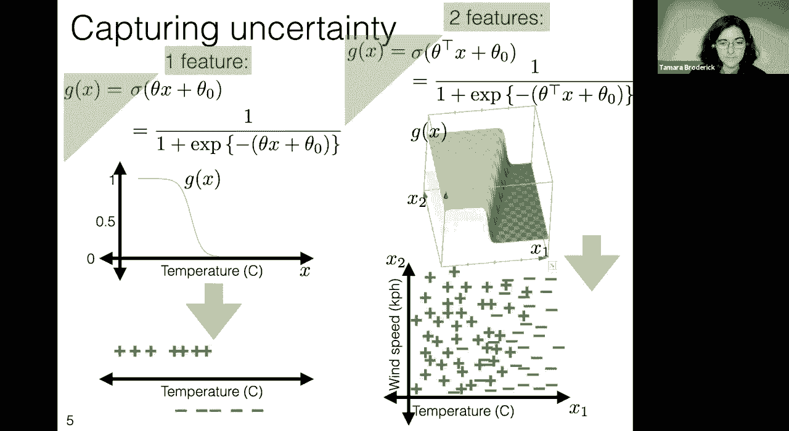

okay so when we do that，that is called one of two things，one way we might call it is linear。

logistic classification，because it's classification we're trying。

to decide whether i wear a code or not，that's a classification problem that's a。

binary classification problem，we used a logistic function also known，as a sigmoid function。

and we saw that there was that linear，component that theta transpose x。

plus theta naught now the reality is，when you go out into the world。

and you use the method that we're going，to be describing it's called logistic，regression。

we're going to cover regression in a lot，more detail um in，i think next week um and we've already。

talked about how regression is a little，bit different from classification。

um so don't get too hung up on this it's，just a name，but this is definitely a classification。

algorithm，okay so we have two big questions at，this point one how do we learn a。

classifier suppose we have a bunch of，data how do we learn these parameters。

theta and theta naught and so the idea，there will be we'll have a bunch of data。

you know somebody will give us data，we'll have collected data and then we're，going to want to learn。

theta and theta naught and we've already，seen here that theta and theta naught。

actually describe this sort of curve of，probabilities，this sigmoid function okay but that's。

not quite what we've done in the past，right what we've done in the past is。

we've said we've come up with some data，and then we come up with a way to，predict on future data。

and so what we'd like to do too is to，say well once we have，this theta and theta naught how do we。

make predictions with it you know how do，we say hey on this part of the space。

i'm going to predict that i'm going to，wear a coat and in this part of the。

space i'm going to predict that i'm not，going to wear a coat，okay so we need to answer both of these。

questions but i'm going to start by，answering the prediction。

question and then i'm going to come back，to the how do we learn a classifier，question。

so let's start by saying hey suppose，that i have a theta and theta naught，what predictions。

does that imply so that's the question，we're focusing on on this slide。

okay so we need to decide whether we're，going to predict plus one。

and here's a way to think about it well，you know，if we if we lose just as much by being。

wrong in either direction we might say，hey i'm going to predict plus one if，it's more likely。

that i'm wearing a coat so if the，probability of me wearing a coat is。

okay well what is that well we just said，that the probability of me wearing a。

coat the probability of a plus one label，is sigma applied to theta transpose x，plus theta naught。

and so just another way to write，probability of me wearing coat being，greater than 0。5 is exactly。

okay well just to see what this means，let's write this out so just as we said。

on the previous slides that a different，way you could just write this out。

mainly you just use the definition of，the sigma function，the sigmoid function is we'll just write。

it it's 1 over 1 plus，exponential of negative the argument so，this is another completely equivalent。

way to write that the probability，is greater than 0。5 and now we can sort，of solve。

for this we can say hey this is，completely equivalent，to the exponential here being less than。

that's how i can get this quantity to be，greater than point five。

and then you can recall facts about the，exponential function to see that。

this is completely equivalent to theta，transpose x plus theta naught being，greater than zero。

so we're going to predict that i'm going，to wear a code we're going to predict a。

label of plus 1 if theta transpose x，plus theta naught is greater than zero。

and we're going to predict the other，label in this case minus one if theta。

transpose x plus theta naught is less，than or equal to zero，that should sound super familiar this is。

like exactly the hypothesis class of，linear classifiers that we have studied。

throughout this course so far，um we are looking at the classifiers，that predict。

plus one if you're greater than the，theta transpose x plus theta naught。

equals zero line and minus one on the，other side and minus one online that's。

something that's just exactly what we've，looked at，extensively and so what's new here you。

know if that's just the same hypothesis，class that we've looked at this whole，time。

what what are we changing well there's，two super key things that we're changing，here，the。

past and certainly you don't get for，free from this hypothesis class is，uncertainties。

so we're going to come up with a method，that learns this theta and theta naught。

but crucially when we have our theta and，theta naught we can put them into the。

sigmoid function and get this whole，function so not just am i a prediction。

of am i wearing a coat or am i not，wearing a coat but a sense of。

well am i wearing a coat most of the，time or am i definitely wearing a coat。

these are the types of questions that we，can ask and answer，once we have this sigmoid。

but also just because our hypothesis，class is the same，doesn't mean that we're learning it in。

the same way in fact we're going to be，learning it in a very different way。

we're going to be using a totally new，learning algorithm that we haven't seen。

before and that learning algorithm，unlike our previous ones，is going to have nicer guarantees for。

and so we're going to see that going，forward what are those guarantees what。

is the performance when the data is not，linearly separable which is something。

that again we just really care about in，practice and so，this is just it is a new algorithm it。

will have new performance guarantees，it's just that it's operating on the，same class the same。

class of classifiers that we had before，okay so at this point，we have this sigmoid。

we have this hypothesis class we have，the ability to predict but what we，haven't yet done，do we。

learn this sigmoid how do we how do we，get that out，and so that's what we're going to look。

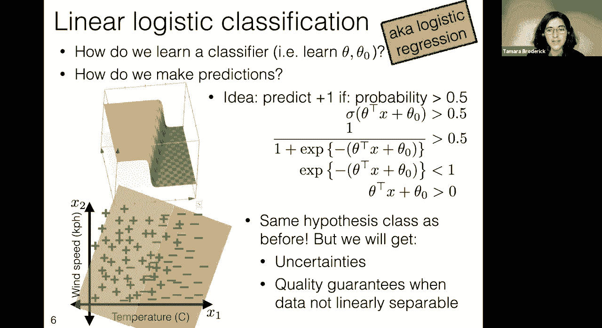

at next how do we actually，okay so let's look at that now now let's。

let's start by just getting a little，know，what's in some sense you know the the。

way that we've been approaching，learning a classifier throughout this。

class is going to be the way that we，approach it here which is that。

we kind of want to make a classifier，that fits with the data we want to。

choose a classifier that kind of fits，with the data and so let's ask ourselves。

what does it mean to fit with the data，so here in particular you know if we。

were looking at this wearing a coat，example，over different temperatures this looks。

like a pretty good，description of this data a pretty good，fit to this data this curve。

because it says the probability of，wearing a coat is high，and it says that the probability of。

wearing a coat is low，almost zero where i'm not wearing a coat，and it also says the probability of。

wearing a coat is somewhere in between，where i'm sometimes wearing a coat and。

sometimes not wearing a coat so there's，a lot that sounds pretty good about that，conversely。

if i was looking at this sigmoid，this one seems pretty bad because it。

says the probability of wearing code is，really high，where i'm not wearing a coat and it says。

that the probability of wearing a coat，is really low，where i am wearing a coat so somehow。

this curve needs to align with the data，and in particular somehow the。

probability of the data should be high，for the curve，this is a way to describe this kind of。

alignment，so what we're going to do is we're going，to look at what's the probability of the，data。

under a particular curve so for a，particular theta and theta naught which。

describes one of these curves we're，going to ask what's the probability of，the data。

and then one way to go about doing，things is to say well how can we。

okay so in order to to accomplish this，goal first we need to write out。

what's the probability of the data so，okay now here，i'm just going to make a point about，point。

if you haven't taken probability i'll，just sort of say where this comes from。

but it's not something that we'll in，general be expecting you to be on top of。

um but this idea that if each of these，data points，you know given this curve is independent。

you know we're just making a draw and it，doesn't depend on the other data points。

um if that's true then the probability，of a bunch of independent events。

is the product of their probability so，that's the only thing that's happening，here。

now i do want to describe this notation，this big，um you know product symbol is what's，happening here。

so you're probably familiar hopefully，you're familiar because we've already。

done it a lot with the summation，symbol so the summation symbol tells us。

hey there's there's a bunch of you know，things that we're summing over。

and in particular we're going to say，let's take you know the the thing。

after the summation symbol with i equals，1 and add it to the thing after the。

summation symbol with i equals 2 and the，thing after the summation symbol with i，equals 3 and so on。

and it's just the same thing with this，product symbol we're going to take the。

thing after the product symbol for i，equals 1 and multiply it by the thing。

after the product symbol for i equals 2，and multiply it by the thing after the。

product symbol for i equals 3 all the，way up to n，so we're just saying that the。

probability of all the data is the，product over the probability of the data。

points for each data point，so we go from data point 1 up to data，point n。

okay well what is the probability of a，data point we said，that the probability of。

wearing a code of having a plus one，label，is this g function applied at x so let's，call，g super i。

exactly that function applied at x super，i at the ith data point。

so this is the probability of the i data，point，having a positive label of me wearing a，coat。

now that's not quite the same thing as，the probability of data point i because。

some of them have negative labels，and so what we want to say is that if，data point i。

has a positive label its probability is，g super i，if it has a negative label well that's。

the the only other thing that can happen，so that probability is one minus。

so those are the only two options and so，point i，is to say it's got gi probability。

if y i is plus one and one is gi in the，other case，because there's there's only one other。

okay and now all we're gonna do is just，so let me explain what's happening here，so first of all。

this notation where there's a one，and then these brackets you should，evaluate that to be。

one if the thing inside the brackets is，true and zero，otherwise so this quantity is one。

if y i is plus one and it's zero，and so what's happening here well if y i。

is plus one then this evaluates to one，and so effectively we have a factor of，gi。

if y i is not plus one，then that exponent evaluates to zero，and anything to zero is just going to be。

one and so we don't have a factor of gi，similarly if y i is not plus one。

then this evaluates to one and we get a，factor of one minus gi，if y i is not plus one。

sorry if y i yeah if y is not plus one，then we get a factor of one minus gi if。

y i is plus one then that's false，so the exponent is zero and so that term，goes away。

and so you just wanna convince yourself，that this is literally，just a fancy way of writing the line。

feel free to to take some time later and，and think about that if it's not。

immediately obvious but it's it's really，just a fancy way of writing this line。

okay so one observation here，is that every one of these probabilities，is between zero and one。

and as soon as you take a product of a，bunch of things that are between zero。

and one they get really small really，fast，um and that's fine if you were working。

with all of the exact numbers and the，reality of our lives is that we work，with computers。

and so computer precision is a real，thing that can，trick us up and so taking these products。

can actually，be a real issue in terms of running into，computer precision。

and running into sort of numerical，instabilities，and so purely purely because this will。

run better on our computers it helps to，look at the log of the probability。

instead of the probability so whereas，the probabilities between 0 and 1。

the log of the probability will take，these real values that can be much more，spread out。

and that we can actually get sort of a，handle on and it's worth noting that if。

we were just trying to find，the theta and theta naught that maximize，the probability。

that'll be the exact same theta and，theta naught that maximize the log，probability。

because log is a monotonic function and，it doesn't change the ordering。

of these different theta and theta，naughts，okay one more observation in the past。

we haven't talked about things being，better than other things we've talked。

about things being worse than other，things that's the idea of loss right。

that we sort of don't want the worst，thing instead of we do want the best，thing。

and so if we want to turn this into our，loss framework if we want to change this。

so it's in our loss framework，we can just take the negative so instead，of looking at。

something that we want to be more，positive we're now looking at something。

that we want to minimize we want to，minimize the loss whereas we wanted to。

maximize the probability or the log，okay now let's write this out now in。

order to write out the log probability，i'm just going to take a log。

so it feels like there's a lot going on，here but i really just took the log of。

the thing at the end and put a minus in，front because we're looking at the minus，log probability。

so let's just go through briefly how，this happened so we started off with a，product。

when we take the log of a product we get，when we take the log of something with，an exponent。

and so finally we have this whole，quantity which we got by saying。

hey this is the negative log probability，of the data，it depends on theta and theta naught。

through the gi，and so we can think of this as our loss，now this also if you think about it。

looks very familiar so in particular，when we define，training loss in the beginning we said。

that it was，basically the sum of losses on，individual data points and that's what，we have here。

now that's not quite the definition we，use though we actually said it was the。

average um so it was 1 over n times the，sum，and so we can just add that here too so。

here we have a sum，but from the perspective of you know how，do different theta and theta knots。

compare it would be completely，equivalent，to minimize the loss which is one over n。

times that sum and so i'm just going to，go back here and say hey our loss can，actually be negative。

it's sort of like the same trick we，played with taking the log。

that it didn't change the orderings of，things and it was convenient。

and so that's all that's happening here，it's just something that doesn't change。

and now once we've done this we have a，loss that really fits into the framework。

that we talked about from the beginning，it's 1 over n，times the sum of losses on individual。

data points so we look at the loss，i realized that some of these eyes，should be。

superscripts i will correct that in the，uh slides before we share them。

but um but apologies for that they，should be superscripts，okay so now let's just finally identify。

what is the loss on an individual data，point so we did all this work we said。

hey we have something that looks like，one over n times the sum of losses on，individual data points。

so that would be exactly this term for，any particular i is the loss on an，individual data point。

and so let's give that a name a really，natural name，is negative log likelihood loss it's a，loss。

likelihood's basically another name for，probability we're looking at，probabilities。

we took the log of the probabilities，thinking of g，as a probability and we took the，negative。

so this is literally just describing，negative log likelihood loss。

and again we we have this sort of thing，where we think of g as being our guess。

and a as being our actual value and so，so we're taking this negative log，likelihood loss。

so l sub nll，our guess is a little bit different than，in the past in the past our guess was。

something that was really binary it，could just take two values here we're。

really letting it actually be a，probability something between zero and。

but our actual what we actually observe，is we never actually observe a，probability。

what you actually observe is did i wear，a code or not i just did or did not。

that's you know that's life i'm not，wearing like half a coat，um and so the actual is something that。

really is，okay so what have we done here well，we're trying to learn a classifier we're。

trying to learn a theta，and theta naught from this，data we have classification data and we。

want to learn this sigmoid，and what we've here defined is a loss a。

totally new loss that we hadn't seen，before，and just as before we kind of you know。

tried to find a value if theta and theta，naught，that got as close to the lowest loss as。

we could on our training data，we're basically going to do the same，thing here only a bit more。

systematically，particular here we have this function of，theta and theta naught。

and because it's actually pretty nice，it's continuous it's differentiable。

we're going to be able to use really，powerful optimization tools。

to actually try to minimize that and，theta and theta naught，so let's just make this a little bit。

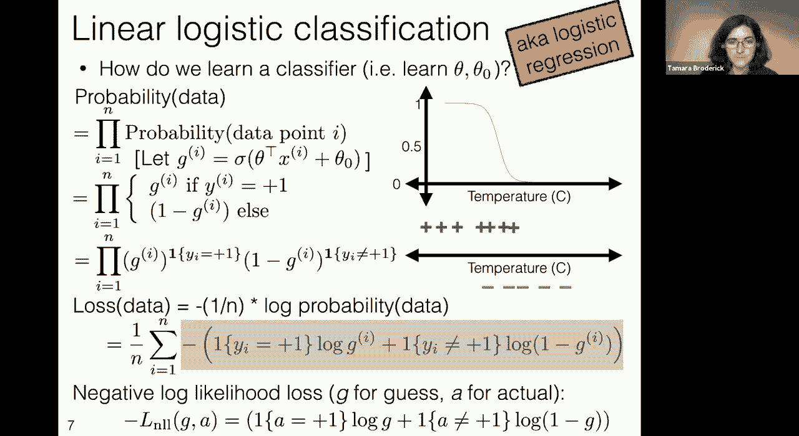

okay so how are we learning this，classifier we're going to try to find。

parameter values that theta and theta，naught，to minimize this sort of training error。

loss that we've talked about this，average loss，specifically looking at negative log。

okay so this is exactly what we defined，on the previous slide so we defined what。

it was to have a negative log likelihood，loss，we said it took a guess and an actual。

where in this case the guess，is actually a probability it's between 0，and 1。

 and the way that we get that，is this sigma function that gives us the，probability of a particular x。

our actual is our actually observed y，that's the y i，and then we take this average this one。

over n sum i equals 1 to n，okay so let's give this a name because。

we're going to be looking with working，with it，the sub lr，subscript lr we can that can stand for。

logistic regression，because again we're doing this，classification you might call linear。

logistic classification if you wanted to，that，are pretty clear um but in general it's。

called logistic regression，um and so let's call it logistic，regression and so we can say hey。

this is the loss that we want to try to，minimize，um this this j sub l r。

now because we're going to be trying to，minimize it and we're going to be taking。

sort of an optimization approach how can，we optimize this how can we minimize。

this over theta and theta not another，word that you might use to describe this，is an objective。

an optimization objective it's sort of，your objective，now um one last notational thing here。

because we're going to be talking pretty，quickly about general optimization，approaches。

that don't have to be for classification，that don't have to be for this。

particular loss that could be for really，any function，it'll help us to have a way to talk。

about really general inputs and so we're，going to say this capital theta。

is the input to our objective in this，particular case it's equal to。

theta and theta not together it's all of，our parameters，but in general it's just you know it's。

some collection of inputs to an，okay oh there's a question，yes um going back on to the last slide。

when we were looking at the。

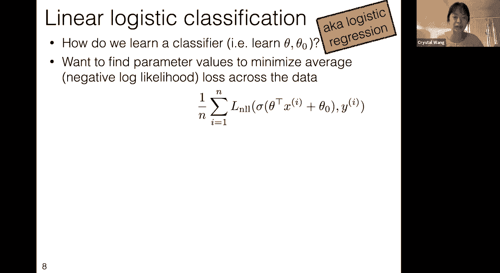

objective why do we um multiply all of，the data points together to learn the，classifier。

the probability yeah so great um so if i，if i understand the question correctly i。

think i think it's about，the first line here which is in some，sense why is the probability of data。

equal to the product of the probability，of the individual data points。

this is a fact of probability that is，really outside the scope of this course。

um but you will find if you take a，probability course，that the probability of a bunch of。

independent events，so events that essentially don't depend，on each other。

is the product of the probabilities of，those events，um and so here the events are am i，wearing。

a coat on the day that is described by，eye，with the features that are described by。

eye am i wearing a coat on the day that，is described by i plus one etc。

and even if those features were exactly，the same we could still think of those，be。

55 degrees and tomorrow might be 55，degrees but i actually might you know。

just forget my coat one of those days um，or you know something else random might，happen um and so。

here we're just using this definition of，the probability of the data as。

being the product of the probabilities，of the data points it turns out。

that that's the same as having the sum，of the log probabilities of the data。

points so if you just really like sums，then that's a really natural thing to do。

um but there's no similar um，similarly nice way of thinking about uh，the sum of the probabilities uh。

it just turns out that multiplication is，is the more natural thing。

when we're talking about probabilities，here。

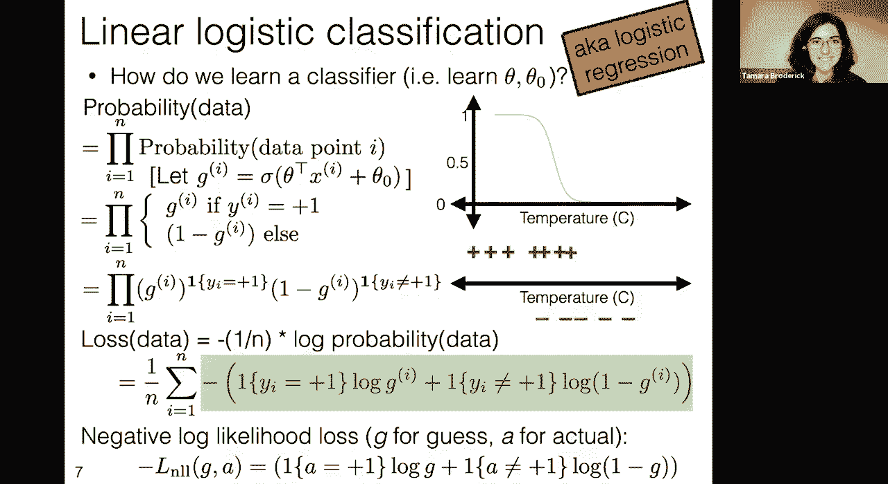

hopefully that answers the question，it's a function of the parameters that's。

the thing we're trying to learn，we're going to try to find the，and so again let's ask ourselves well。

sort of what is this going to look like，we're going to imagine that much like in，start。

from some values theta theta naught that，probably aren't that good because in。

general we don't know what we're doing，when we start our algorithm。

and then we're going to look at them and，we're going to say hey for this。

particular for this particular curve，it's saying that there's a really low。

probability for these times i wear my，code so it's not really good。

so we should move it to make those a，higher probability，hey we can make them an even higher。

probability hey we could make them an，even higher probability and we just keep，doing this。

until we get to a point where，the minuses the the times i'm not。

wearing my coat have a low probability，of wearing my coat the times where i am。

wearing my code have a high probability，of wearing my coat，and the times where we're not sure are。

somewhere in between，now what's really cool about this，objective function。

and this loss instead of the previous，losses we were working with like zero，one loss and so on。

is that it has so much more information，about how do we do this about how do we。

move in that direction，what what is the best direction to be，moving。

and in particular the reason for that is，that it is smooth，and in particular it has a gradient it's。

differentiable，and the derivative tells us basically a，good direction to be moving。

and so what we're going to do on the，next slide is we're going to make that。

idea a bit more precise but we're going，to talk about more，general functions and then we're going。

to come back to logistic regression，so basically we have this linear。

logistic classification this logistic，regression set up this thing that we，want to minimize。

and now we're going to talk about a tool，for minimizing functions that we can。

apply to this but it's going to be a，much more general tool。

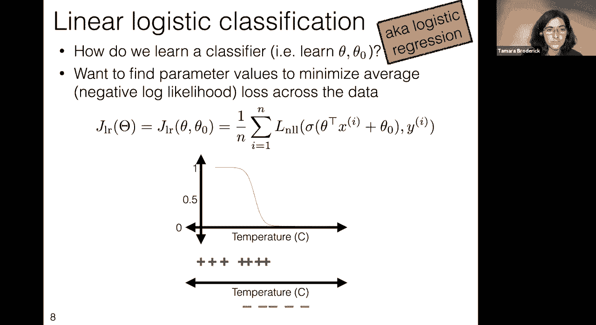

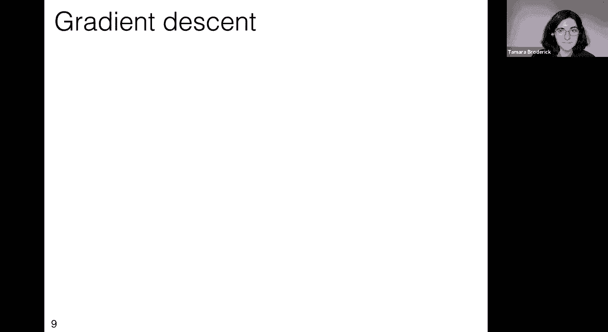

okay so to talk about gradient descent，let's start by talking about a function。

so here we have inputs，theta one and theta two and this is just，totally general inputs and a totally。

general function f you know forget about，just have，some function and we would like to。

minimize it and it seems like we should，i feel like i see a minimum on this。

and i would like my algorithm to see，that minimum too，now another useful way to draw a。

function like this，is with with what's known as a contour，plot if you have ever looked at a。

topographic map，you have looked at a contour plot so the，idea of a contour plot。

is just to say let's draw lines at，points that have the same height。

in the original plot and so this is a，contour plot，for exactly the f that's just above it，um。

is in that sort of valley there are，little contours and then they get bigger，and bigger and bigger。

as we go out for things that have the，okay now how does a gradient。

help us if we're trying to minimize this，well，we look，at the line that is tangent to the，contour。

that tells us where to go to stay at the，same height，the whole idea of the contours if we。

keep walking on it we stayed exactly the，same height，but we don't want to stay at the same。

height we want to drastically change our，height，the gradient tells us the direction to。

increase our height the most，where could we go where we from where we，are right now。

to most increase our height that's the，gradient，now the gradient has a precise。

mathematical description，suppose our theta is in，rm so here our theta is in r2 but in。

general it could be m-dimensional，the gradient is the vector of partial，derivatives。

so the partial derivative of f with，respect to the first variable。

the partial derivative of f with respect，to the second variable up to the partial。

derivative of f with respect to the nth，okay so that all sounds really good but。

actually we didn't want to go in the，direction of increasing height。

we want it to go in the direction of，decreasing height we want to get to the，lowest point。

now in order to do that we won't go in，the direction of the gradient。

we'll go in the direction of the，negative gradient，so we just have to go in the exact。

opposite direction to decrease，the height as much as possible from，where we are right now。

this is the idea of gradient descent，we're just going to keep doing it。

okay so let's define gradient descent，this will be an algorithm it takes a。

bunch of inputs but let's talk about，those inputs as we go along，theta。

super something is going to tell us，where we are in a particular step so。

0 is where we start and we have to tell，the algorithm where we're going to start。

that's a tough problem initialization is，a tough problem you want to have a good。

initialization it helps the more that，you have it，um and and that is just a really you。

know difficult thing to do in general，although we're going to see that for，some types of problems。

um at least it doesn't matter in terms，of whether you get to the right answer。

it might matter in terms of how quickly，okay then we're just gonna have a。

counter for what round we're on，so this just says t equals zero we。

haven't yet started we're we're about to，start，we're going to repeat these steps of。

so now we're going to start our first，round so t equals t，plus 1。 and then here's the meat of it。

so what this is saying is let's take the，gradient，that's the last thing in this line。

that's the thing that tells us what's，the direction to go for steepest descent。

or let's take the steepest ascent which，is the gradient，and then when we take the negative we're。

now looking at steepest descent，let's multiply it by eta so eta tells us，how far we're walking，size。

parameter because it tells us how far，we're going in this direction of，steepest descent。

and so what we do is we take our，previous spot where we were before。

and we walk that far to a new spot theta，okay so in this plot we've done that。

once we started from our big red dot we，followed this arrow，to a new spot but we can do it again we。

can say okay now we're at，our theta one let's calculate the，gradient there。

let's go in the direction of the，negative gradient let's do that by some，step size eta。

and let's end up at a new spot theta two，okay at theta two we'll calculate the，gradient。

we'll go in the direction of the，negative gradient we'll do that by some，step size eta。

and we'll get a theta three and so on，and so forth，and so then the question just becomes。

when do we stop，and there are a few different ways to，stop one is to say well you know think。

about what happens when we get to this，valley，at the bottom eventually the valley you。

know we hope that we're going to be，making smaller and smaller and smaller。

step sizes as we get closer to this，minimum，and so eventually we'll stop just when。

the change in step sizes is sufficiently，small so epsilon is an input to this。

algorithm it just says you know when is，too small to keep going，it could be something like machine。

precision because what's the point of，going beyond machine precision。

even easier would be if you're only，going to report two decimal places。

why bother keep going after that so you，epsilon，that way but basically it'll tell you，when to stop。

now there are a few other ways that you，could stop and return theta t。

one really important one is to have a，max number of iterations i actually。

highly recommend that no matter what you，do no matter what algorithm you make。

you always incorporate a max number of，iterations if something goes horribly。

wrong in that algorithm if you run out，of time，you just want to have stopped um and so。

a really good idea here would be to say，if，i reach some other stopping criterion。

like the change becomes really small i，can stop，or if i run out of time because i'm。

running out of time in lab or homework，or you know i'm just running out of time。

in my analysis i will also stop，now there are other things that you。

could do to stop besides the change in f，another one is to just say i'm not。

moving really much that much in theta，so that would be a way to stop also。

at this optimum we expect the gradient，to be zero，you know that's basically saying there's。

nowhere else to move to you know descend，further，and so that would be a way to stop when。

the gradient is very small，okay so this is a very general algorithm，this is not。

specific to logistic regression this is，not specific to loss minimization this，is just a way。

to minimize or come very close to，minimizing a general function f。

but what's really cool about it is that，it has guarantees on quality and so。

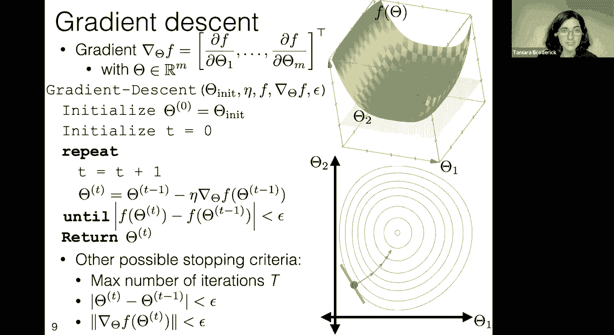

now before we describe those guarantees，it'll be helpful for us to have。

a particular definition which is what is，convexity，so we're going to say that a function is，convex。

if we can look at its graph pick out two，points on this graph，on that graph make a line segment。

between those points and if that lies，above or on the graph，so i say that a function on r to the m。

is convex what i mean by that is a，function with inputs in r to the m。

so here we're looking at a function the，hor the horizontal axis is the input，is。

m in this function what is m could you，great so i'm seeing a few different，answers so。

the if you're writing one you are，correct so，one so m here is the input to the。

function so we're saying what is the，dimensionality of the，input so that's what we mean by on r to。

the m，so in this particular case this function，has dimension one for input that's the。

horizontal axis，so that would be like z and then f of z，or theta and f of theta f of theta is。

the vertical axis，so here we're looking at a function on，one dimension but then the function。

value is what's providing the second，dimension that we're seeing，great okay so now to ask if this。

convex we're gonna take，any two points we're gonna draw the line。

segment between them and we're gonna ask，is that line segment，above the graph and here it is。

and it turns out that because this is，quadratic，you can show that for any two points，that you take。

the line segment will always be above，the graph，okay now here's another question for you。

here's a new function，is this function convex，this is one for the chat again is this a。

okay lots of great answers including a，no with tons of o's，and a bunch of exclamation points um so。

well done it is it is not convex and so，here's the thing，yes you can find two points。

for which the line is above the function，but it's not convex because there exists。

any two points for which the line is，sometimes below the function。

and so just because i could find these，two points，and you see in the middle that the black。

line is below，the blue line that's why it is not，convex and somebody said but not overall。

indeed there's some，locally convex looking things but the，whole function。

is not convex okay but we can do this in，higher dimensions too，so this happens to be a fourth degree。

polynomial that is convex no matter，which lines i find，it's always going to be above the，function。

and again here's a question for the chat，is this function，you're all totally right no it is not。

convex，frowny face um indeed again it's just a，proof of concept could you find。

an example of a line that goes below it，has，and put a line between those dips that。

would go below the function so this is，not convex，okay so why are we talking about。

convexity because convex functions are，easier to minimize so in particular。

here's a theorem of theorem about，gradient descent performance，if now in my assumptions i'm going to。

choose some epsilon tilde this is，basically going to ask me how good am i。

we'll see that again in the end i'm，going to assume f is sufficiently。

smooth and convex i can differentiate it，it's continuous in the right ways。

there's a little bit more advanced math，than we're going to get into here。

but it's a nice enough function and it's，kind of x，if it has at least one global optimum。

so what do i mean by global optimum，let's look at this example up here，a global optimum is a point。

as，a local optimum which is the the diamond，here，is a point that locally that's true that。

if i just look at a small area around it，it's at least as low as everything else。

but it doesn't have to be the case that，it's at least as low as absolutely，everything else。

so global optimum is an example of a，local optimum but not every local。

optimum has to be a global optimum，an f has to have at least one global，optimum for。

now eta has to be sufficiently small，you're going to explore in your lab how，a big ada。

can have big problems but if it's，sufficiently small，then this theorem will hold that doesn't。

mean it'll hold quickly but it means it，then if we run long enough so if we，don't cut off。

with our criteria too soon because we do，have this termination criteria so we。

have to make sure that we run long，enough，um you know that we don't cut off with。

that too soon then gradient descent will，return a value，as close as we want to the global。

optimum so that's what this epsilon，tilde is saying，i can choose however close i want to be。

and i can get that close again by，so this is pretty cool this is telling。

us that you know under some conditions，that just so happen to hold for logistic。

regression so that's nice，um we can get this nice，okay so let's let's make this a little。

bit more explicit let's let's come back，to logistic regression here okay i。

normally i have the questions go to um，to uh，discourse but there is this question。

about optimum equals minimum so when we，talk about an optimum it can refer to a，minimum。

but it can also refer to a maximum um，and so here，um i am specifically thinking of a。

minimum so that's a great clarification，yes this should be um we're thinking of。

minimum because we're thinking of，gradient descent performance so yeah。

good point um i'll probably just correct，that in the slides because that's that，is a good point。

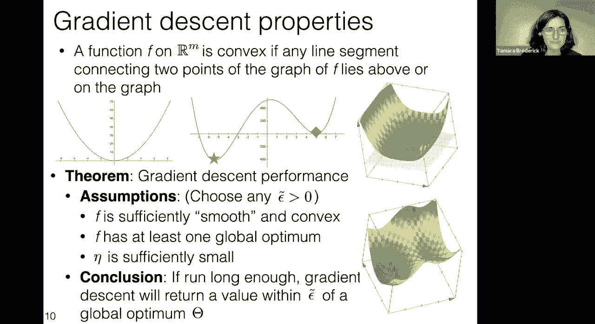

okay so now let's look at gradient，okay our loss first of all is，differentiable。

you'll notice that in gradient descent，we take the gradient we take。

the derivatives and so you can't even，apply it if you don't have derivatives。

um and so here our loss is，descent，so that's the the first big thing，which。

again is a little bit beyond the scope，here but i'll just tell you it's，comebacks。

and so that's really nice because，if all of our assumptions in the theorem。

holds hold that means the theorem will，hold now remember there were some other。

assumptions in the theorem and we'll，come back to that，um but this means we can apply gradient。

to set and we're going to get good，performance a lot of the time。

so let's take a look at this let's run，gradient descent，there，if we run gradient descent for our。

logistic regression problem instead of，just a generic f，we'll put in the loss for logistic。

regression we'll put in，its um it's derivatives it's gradient，and then everything else we have to。

choose we still have to choose an，initial value we still have to choose a。

step size we still have to choose an，epsilon，but we can run gradient descent on our。

problem and so let's ask what that's，going to look like，so in particular we had this where coat。

problem from before am i going to wear a，coat this could be the data that i get。

i run gradient descent and this is what，i would get out，in this particular case i'm going to get。

out this nice you know i'm going to get，out theta and theta naught but that，describes。

one of these um sigmoid functions that，says i have a high probability of，wearing a coat。

in one part of the the temperature，spectrum in particular the cold part。

i have a low probability of wearing a，coat in the in the hot part，and i'm not so sure in the middle。

okay suppose i have this data，so i'm deciding whether i'm going to，wear a swimsuit today。

so in this case i probably tend to wear，a swimsuit when it's hotter。

and and not wear one in the middle of，winter and maybe there are some days。

where i'm i'm willing to wear one but，it's a little bit chilly，so how is the output of our learning。

algorithm going to look different here，um this is a question for the chat。

what's going to look different，about this function that we return。

this this sigmoid relative to the one，okay so people are definitely saying。

it's going to be offset it's going to be，there's actually potentially one more。

difference so let's let's take a look at，this，so first of all we see that it's flipped。

because i'm very likely to wear swimsuit，in hot temperatures and very unlikely。

and low temperatures great and the last，all，fantastic so the first one we're seeing。

is that it's flipped，the next one we're seeing is that it's，offset so the temperature where i start。

wearing a coat，at least for me is different than the，temperature where i'm willing to wear a。

swimsuit，um it's it's much warmer where i might，be willing to wear a swimsuit。

and then we see that in this particular，case it's a little steeper because。

there's not such a large range，okay so this is after running the。

entirety of gradient descent so this is，where i've gone for a really really long。

time i've gotten to something where it's，not changing too much this is how i got。

this theta and theta naught，and i got this on this curve out let's。

let's actually look at some of the steps，okay so here's yet another problem that，is very uh，cold。

layer，um so you know wearing a layer of wool，or fleece under your pants can be，fantastic。

if you're walking outside and it's，really cold um i think it really makes a，difference。

so something i might do is i might say，when it's sufficiently cold i'm going to。

wear a base layer i'm going to wear a，sort of a second pair of trousers，essentially。

and when it's not that cold i'm not，going to bother with that。

now something you'll notice here is that，in this particular data set i don't have，data。

between the pluses and the minuses so in，the last two data sets we saw that there，was an area where。

sometimes i was wearing the coat and，sometimes i wasn't and here i just，happened to not collect data。

in that area and we said we wanted to，express that we're just uncertain。

about that so let's see what it looks，okay so i'm going to initialize my。

gradient descent with a theta and a，theta naught and maybe that theta and。

theta naught look like this，so i'm not plotting the theta and theta，naught i'm plotting。

what the sigmoid that depends on those，theta and theta naught，naught。

describes one of these functions and now，i'm going to take a step。

of gradient descent and the thing to，notice is well what's going to happen，let's think this through。

my pluses right now have high，probability and my minuses，have low probability but i could。

increase their probability even，more by making this steeper，and the whole idea of our loss is that。

we want to increase that probability and，all it's saying is that we want to，increase the probability。

and so we could do that by making this，steeper，so a step of gradient descent will make，this steeper。

okay well i could still increase，the probability of this data set even，more。

by making this steeper and so i take，another step of gradient descent and。

and it's still the case that i could，increase the probability，of this data set even more。

by making this steeper and so gradient，descent will continue to make this，steeper。

and it's still the case that i could，increase this even more，by making it steeper and i think。

question，what if it gets too steep this is，definitely too steep this doesn't，express。

what we wanted to about this data which，is that we're uncertain。

in between so let's see what went wrong，and how could we correct this and so in。

order to understand what went wrong，so now technically remember this loss is。

a function of two things it's a function，of theta and theta naught but let's just。

pretend that theta naught is always set，to zero to make this an easier thing to，draw。

so this is the loss function as a，function of theta，now what's happening here on the left。

hand side makes sense，as theta gets more and more negative our，loss goes up。

as well it should because we shouldn't，have a negative theta here that would be。

like flipping this around，but now what we really want to say is。

that as theta gets way too positive the，law should also go up because that's，making it too steep。

but instead what's happening it's a，so，small on the right there but what's。

actually happening is that the，loss continues to go down as theta gets，larger no matter how large。

theta gets and again that's for exactly，the reason we just described。

as theta gets larger and larger that's，just making all the probabilities higher。

and so absolutely that's going to make，the loss you know get lower but we don't，want that。

we don't want that to happen we kind of，want to express that somehow。

a humongous theta is just too competent，like that you would need a lot of data，and information。

to get past that level of confidence，that we're not comfortable just。

and the way to do that to assert that，there's such a thing as being too，data。

to overcome that is a regularizer，okay so let's see，what we can do to get beyond this。

there's an interesting question is this，what epsilon is for there's。

actually something called early stopping，which can also，play a form of regularization but let's。

not get into that just now，um actually we're just going to focus on，um。

what happens when we add a regularizer，to deal with this，but there are actually other forms of。

regularization than the one we're，talking about，and we'll probably talk about some of，those later on。

okay but we have one idea right here，which is，we want to say that too big theta。

is bad and our way of saying that things，are bad is our loss function。

and so how can we modify our loss，function to incorporate，this idea that a theta that's too big is。

being too confident。

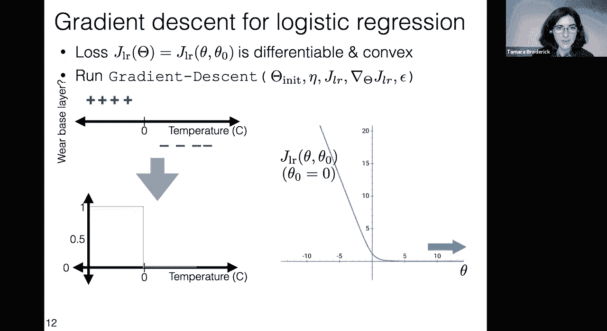

and it's bad，we can do that again by adding in，a regularizer so here was the logistic。

regression loss that i showed you so far，and here's the full logistic regression，loss with。

what's known as an l2 regularizer，it's a particular type of regularizer it，basically has。

lambda which is some constant that's，greater than equal to zero，times the size of theta。

now previously it's not like we weren't，showing logistic regression loss we。

absolutely were we just showed it for，lambda equals zero so this is like a。

general more general version，okay so this is known as a regularizer。

or sometimes a penalty it's something we，add to a loss，and it's usually to express some。

information that we have that isn't，purely expressed in the loss in this。

particular case it's to express that we，think that a really large theta。

isn't natural we shouldn't just，naturally be that confident that we need。

a lot of data to overcome that，and so here that's exactly what we're。

saying we're saying if we have a really，large and magnitude theta because。

magnitude's the relative the relevant，thing here，that we really need a lot of data to。

choose that we can't we can't just，choose that for fun，and so whenever we have a really large。

magnitude theta that's going to increase，in this particular case this exactly。

penalizes being overly certain，because if we just increase the，magnitude of theta here without doing。

anything else that's like saying we're，more certain that's increasing that，steepness，that we saw。

now something that you can check is that，the subjective is still differentiable。

so we can still run gradient descent，and it's still convex so，we're going to have nice properties of。

gradient descent，now something you might ask is why，didn't our gradient descent theorem，no。

global optimum that it was going to，because there was no global optimum。

so in particular when we looked at this，lambda equals zero，because this is always decreasing。

there is no global optimum and that was，one of the assumptions of our theorem。

but now when we include our regularizer，there is a global optimum and so now。

our theorem will actually apply and we，can say something about。

actually getting to that global optimum，now this seems preferable not only。

because the theorem applies but also，because we're going to have this optimum。

that we can get to and we're not going，to just choose this sort of arbitrarily，steep curve。

like we would have without it now，we can choose different lambdas and，we'll get different。

different losses as a result so in，particular something that you'll notice，is that as we increase。

lambda you can think of lambda sort of a，trade-off between the loss and the，penalty。

as we increase lambda eventually if，lambda's big enough the penalty is。

what's going to dominate we're just，going to have a quadratic。

but if we decrease lambda then the loss，that's what's going to dominate and you，can really see here。

that we start from this loss with lambda，equals 0 we get something that looks。

more and more quadratic as we increase，lambda in fact if we kept doing that we，would get something。

now a question that has come up，a few different times now is how do we。

choose these hyper parameters you know，now we have this lambda that we have to，choose。

how could we possibly choose it and this，certainly is not the only hyperparameter。

that we have encountered we've，encountered you know how do you choose。

the size of the polynomial basis，if you're if you're using something like，uh polynomials。

for your features um you know how do you，choose even in our random algorithm for。

the very first day how do you choose，you know how many different things that。

you look at um the the k，that was the number of things that you，general。

is an interesting question just as，parameter selection is an interesting，question um you can。

you know think of it much like that um，you know it's called a hyperparameter。

for a reason it's sort of like just the，next level up，parameter but one idea and one that's。

that's worth thinking about is to，consider a handful of possible values。

and compare them with cross-validation，you just answered it um the question was，how do you usually。

uh how big do you usually do that before，the regular life awesome great great。

yeah and something that i would，recommend too is so this is this is one，way。

um just as we are talking about many，learning algorithm it's not the only way。

but it's certainly a very popular way，um is to like maybe try out a few order，orders of magnitude。

and compare them with cross validation，um，another thing that is definitely worth。

doing is checking the values you get out，function，see if it's a reasonable loss function。

like in this case if your lambda was，such that it totally dominated。

you know if your whole loss function was，basically a big quadratic in the penalty。

and you lost all the interesting stuff，that was going on in the classification。

loss the negative log likelihood loss，you might be a little bit weirded out。

you might think hey am i really doing，classification，or is it just the penalty that's driving。

everything and so it's really worth，you know once you've chosen a lambda，thinking about it and。

really you know plotting it thinking，about what it means relative to your。

loss figuring out what it really means，okay so now we have all of the tools for。

logistic regression at our disposal we，have the loss，the full loss including penalty that。

describes logistic regression，we can do classification with it we can，run gradient descent。

applied to logistic regression um and we。

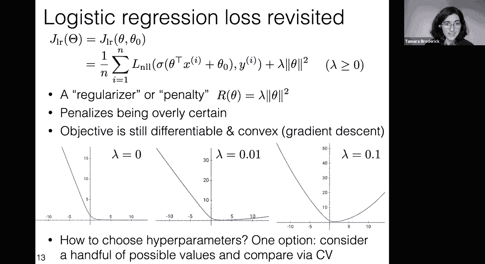

can put it all together and this is，something that we can run，on data and so。

let's just write that out i just want to，emphasize how much this is literally。

just gradient descent with f given by，the logistic regression objective and so。

if you know gradient descent，and you know the logistic regression。

objective you can just write this out，and you should you should check that you。

can derive that from just those two，things because this isn't like its own，special thing。

this is just you know applying exactly，that so here is here's a logistic。

regression learning algorithm based on，gradient descent，i do want to emphasize that gradient。

descent isn't the only optimization，algorithm that you can use。

in fact we're going to see another one，pretty shortly and have in our reading。

um and so this is logistic regression，with gradient descent it's not the only，thing you can do。

for the logistic regression objective，okay so let's look at logistic。

regression with gradient descent it's，going to take initializations。

it's going to take a step size parameter，and it's going to take a stopping，parameter。

hyperparameter epsilon and，hyperparameter eta um it doesn't take in。

the function f now because that's，so we initialize we start at particular。

values of the parameters the theta in it，and the theta naught in it so those are，just initial values。

we have our counter of what step that，and we're going to repeat the steps of。

gradient descent just applied，specifically to logistic regression。

okay so this looks pretty crazy i think，if you just saw this you'd be like whoa。

math what happened um but the reality is，this is，literally just you take the logistic。

regression objective，and you take the gradients and you just，stick them in。

and so if this looks like a lot，literally the best thing you can do。

is just go home sit for a moment and，derive what are the gradients in。

logistic regression and just make sure，that this just pops out for you that。

this is exactly what you get，um so again it looks like a lot but it。

really it really isn't it is just the，gradients for logistic regression。

and remember we apply the penalty to，theta，to make sure that we weren't being super。

overconfident which was respected by，theta which are expressed by theta and。

so we see that that penalty is showing，up in our opt，our update for theta but not for theta。

okay and then we keep going，until we're not changing that much and。

again every single one of those stopping，criteria that we considered was，basically expressing。

question，shouldn't this take lambda as an input，you could think of lambda as an input。

either way um yeah i think that's that's，a totally reasonable thing um here i。

happen to be thinking of it as part of，i'm，not bothering to put that in but yeah。

you could absolutely think of that as an，input to this algorithm as well。

as a hyper parameter specifically for，the algorithm，okay so here we have our stopping。

criteria this is a particular stopping，criteria just based on the objective。

function not changing too much，and then finally we return the theta the。

thetas that we have learned along the，way，okay so again just gradient descent。

applied to our logistic regression，objective，again，looks like a lot but it's not when you。

go in and drive it，this should be just just that，application but the reason that i've，written it out。

is that there is something that is，interesting that we want to understand，here。

and that's the following so let's look，at one of these steps，let's look at for instance the theta t。

step what's happening in the theta t，step so in the theta t step what we do。

is we take all of our data points and we，calculate something whatever's in that，sum。

and we do it for every data point and，and，once we have done that sum over。

absolutely all of the data points we，make an update to theta t。

now this is pretty different from what，we did with the perceptron for instance。

where we did something to one of the，data points and then we immediately made，an update。

and there's something to be said for，that like let's say that you have a data，set。

that's in the millions that's in the，billions，then this is just going to take a really。

long time you're going to sum up over，all of those millions or billions of，data points and then。

finally you're allowed to move，ingredient descent，and it feels like if you look at one。

data point or even like 10 or 20 or 100，you probably already have some。

information about a good direction，to move that you don't need all of the，data points。

to figure out a roughly good direction，to move，to go in the direction roughly of the。

gradient and to minimize your function，and so actually there's a different。

learning algorithm so we talked about，gradient，descent as an optimization algorithm。

there's a different optimization，algorithm called stochastic，gradient descent that's in your reading。

for this week that takes advantage of，that，that actually says we only need to look。

at a few data points before we make a，move or one data point even。

um there's a question um so for the，gradient to set step why isn't there a 2，lambda theta oh。

maybe that's that might actually just be，a typo um，um i'll check that out but yeah i i。

agree with you，good good good taking of derivatives on，the fly。

um great i i somebody was gonna find one，at some point and so i think we've we've，done well。

in uh in going this far but that's，fantastic um，okay great so these are exactly these，gradients。

even with a two in here my my point，holds about，you have to make this sum up over all of，the data。

and that's just going to take a really，long time and we might be able to be。

more efficient we might be able to take，steps before we have to do all of that。

and that's the idea of stochastic，gradient descent，to be able to start making those steps。

before we've seen the whole data okay so，just to recap，what have we done today we introduced。

logistic regression if you are going to，use a classification algorithm。

in in person in reality this is really，one that you will really use this is。

going to come up and you know，probably any data analysis that you do，in your life。

um there's a good chance that this will，be in it we saw how gradient descent。

can let us use the logistic regression，objective and optimize it and get very。

very close to an optimum，it turns out in order to have an optimum。

we have to be careful and we might have，to have a penalty，so we covered all that today and we're。

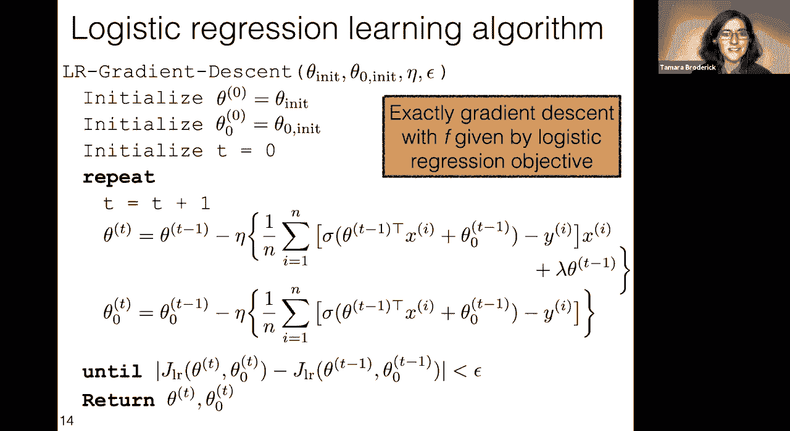