# P1：L1- 介绍 - ShowMeAI - BV1RM4y1g76r

this is machine learning in genomics，also known as computational biology，genomes networks evolution。

and it's all about dissecting the，circuitry of human disease，heading to you know understanding dna。

motifs，gene networks epigenomics how to，manipulate and how to dissect disease，circuitry。

how to understand disease across，multiple phenotypes，how to，interpret medical records and data。

integration across many different，modalities，how to understand genomes and genes at。

the single cell level，and then how to carry out mediation，analysis and understand how genetic。

variants act，through layers of gene regulation all，the way to disease，so that's our goal we are。

first going to be talking about the，course overview introducing the staff。

introducing the students and responses，to the student survey，and then introducing the dichotomy of。

foundations and frontiers，and then the textbook the homework quiz，and also the final project teams。

mentorship，challenges relevance originality，achievement presentation these are going。

to be the criteria that we're going to，be using for the final project i'll，describe all that。

then we're going to dive into why，computational biology then give an，overview of the main modules。

and then give a biology primer in the，context of this course introduce the，central dogma。

and then the layers of gene regulation，and also human genetics and evolution。

so let's start with that means trivia，intro to the course and the goals。

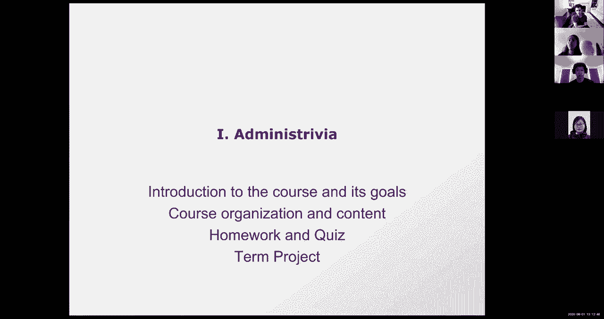

and then course organization and content，homework and quiz and。

projects so uh i'm manoli skelets i'm a，professor，at seasale on the fifth floor of the。

driver's tower whenever i'm，allowed to go back to my office and my。

research is on computational biology，and i work also at the broad institute，as an associate member。

and my focus uh in research is on，disease mechanism，for which we employ the genomics and，learning。

algorithm statistics and ai，and we're applying this to cancer to，brain to understand gene regulation。

evolution and single socionomics，uh damon do you want to briefly，introduce yourself，[Music]。

most of my prior research interests and，my future endeavors are related to，to。

many important problems in healthcare，i've worked in，csail for two years prior to this。

i've done a lot of various research，relating cancer disparities telemedicine。

uh the project i did in this class last，year was pertaining to gene regulatory，networks。

i've also worked with synthetic medical，data and most recently this summer i did。

hospitalizations modeling for october，19。 excited to work with everyone。

ryan hi everyone i'm brian i'm，senior in 63。 my main interests are，bioinformatics and data science。

for this class last year i worked on a，project related to epigenetic clocks。

in particular using histone methylation，as a way to predict，uh age and yeah i'm excited to work with。

everyone，it's great so anyway uh we are your，staff and we're so excited to work with，hours。

and all of that is on the group on the，google calendar for the class。

uh one of the first things that i'll do，is i'll actually introduce the website。

for the class so if you just go to comp，bio，dot might here to use 604 7 or slash，cetera。

it will all take you to the fall 2020，website so you'll see the same slide。

that i showed you on the first，slide today and then if you click on，materials。

you will notice that everything is there，so，we've basically uh hid nothing from you。

every single future lecture，is already there uh the slides we will，be updating it as we go of course。

and then all of the video recordings，from last fall，are there and um you know all of the。

recordings from fall 2018，are also there and all of the，recitation notes are there and so are。

the problem sets，already posted and then a lot of，guidance，for your projects and there will be a。

lot more on that，and even for your quiz the study guide，uh，everything is there so if you like to。

work in bursts，and you want to i don't know the first，few days of the term，you know。

exciting if not you can just follow，along the base if you miss out on the。

lecture or two you can always go back，it will always always be there and then。

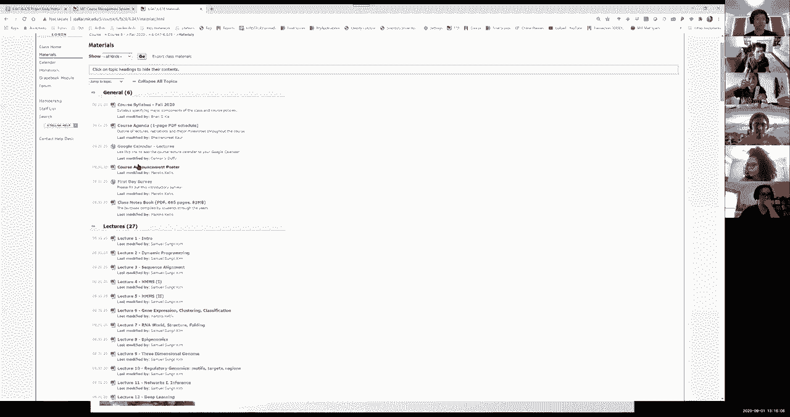

if you look at the course agenda that's，probably the most important handout。

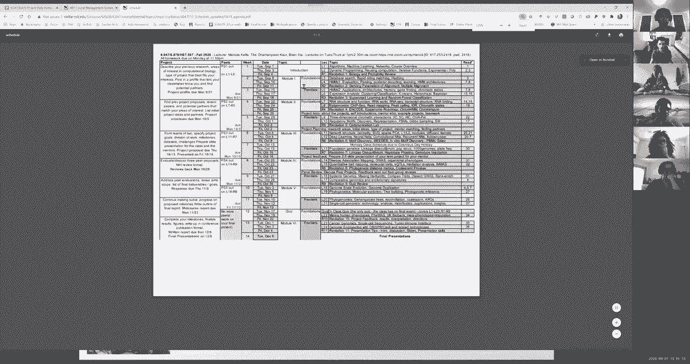

this basically gives you a feel for what，we will be covering in the course。

and that's something that you know we'll，be going through today，so i'll come back to that and um。

you also will see the first day survey，that 55 of you have already filled in so，if you haven't。

please do so and then you also find，a 665 page book，with all of the class notes that。

students like you have compiled before，this is basically what the book looks，like it's。

uh basically uh all of the slides，with uh all of the stuff that i've been。

saying around each of the slides，organized into modules and chapters so，for those of you who prefer。

uh the learning modality of reading，through a book and reading a book，chapter。

i really encourage you to go through，this it sort of really，gives you a very thorough overview of。

everything we're going to be covering in，lecture，you will get a lot more out of the。

lectures if you check out the slides in，advance，so very often we're going to be。

introducing new topics，with a lot of buzzwords that you can，look up in advance。

i will try to explain everything but if，you've had no exposure in a particular，topic。

it's not a bad idea to just click on the，lecture and then maybe listen to the，first 10 15 minutes。

and then based on what you hear and all，the buzzwords you don't understand just。

go look them up on wikipedia or，introductory，you know textbooks and just get exposed，to it。

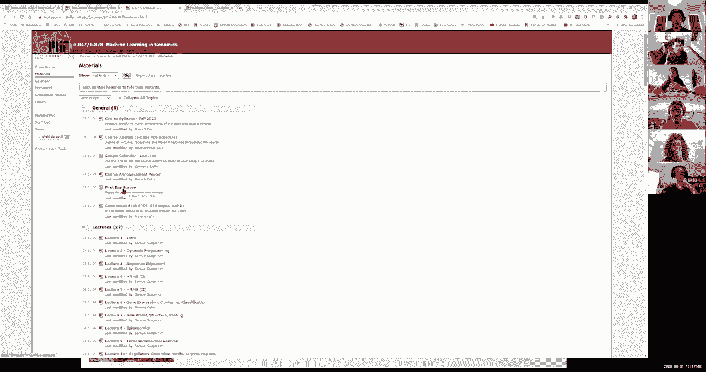

this is not meant to surprise you we're，meant to sort of bombard you with。

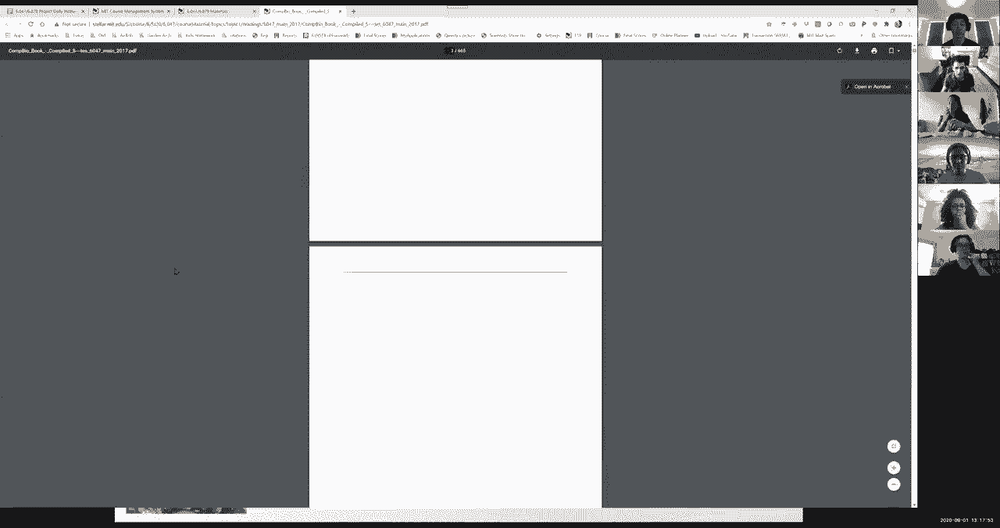

knowledge and，all of that knowledge will hopefully be。

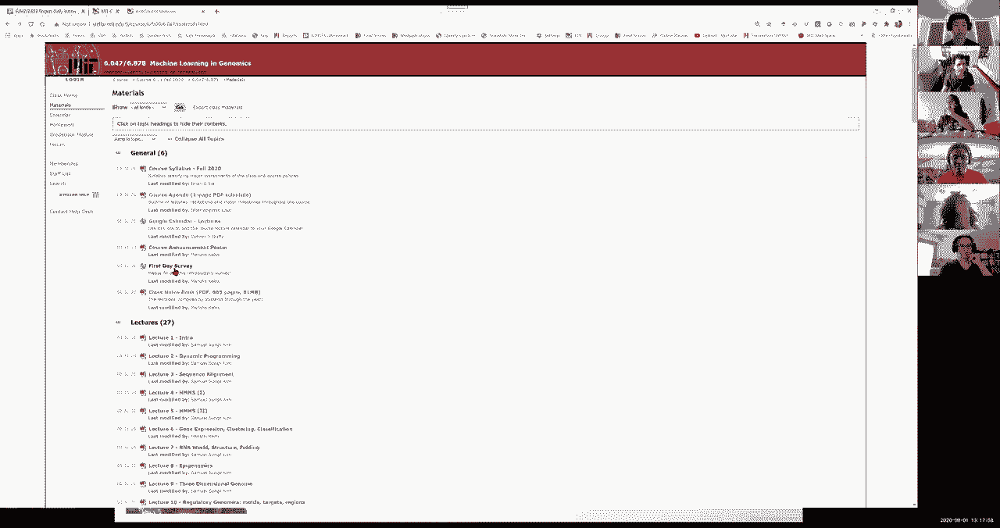

solidified，even more if the lecture is the second，time you hear，in terms of the。

survey so many of you filled out the，survey you can see here that。

the two peaks in attendance are from，first-year grad students，and from undergrads but it's a quite。

broad distribution，across second-year students so，sophomores juniors and seniors。

a little bit of an evidence，representation and then first year grad。

second grade third year grad four plus，and then additional students from，diverse places。

the majority of folks here are course，six students，so uh 30 and then there's six seven。

and seven so which are the next obvious，candidates，and also csv hst mas，and a lot of uh additional。

representation，so it's a very diverse group and that's，exciting that's that's what i enjoy。

about this course every year，especially when students start building，teams for their projects。

it's very nice to have students of，complementary skills and backgrounds。

but common interests work together in a，team because，it is an interdisciplinary field and it。

really makes a difference to work，in interdisciplinary teams with，complementary skills。

here's the background of everyone in the，course uh this is you know。

compiled an hour ago so if you filled，out your form，anytime before 12 30 you're in here。

and you can kind of tell by the，done，very recently so，uh in terms of background basically。

folks are very comfortable with，algorithms，very comfortable with programming and。

quite comfortable with machine learning，so basically intermediate is the orange，bar here。

and then programming is skewed to the，right，machine learning is quite balanced and。

then algorithm is quite balanced，so don't panic if you're on the left，side of this graph。

that's okay we are here to introduce all，of these topics we're going to be，covering。

many different aspects of machine，learning and even if this is your first，machine learning class。

you are in the right place if you，understand some probabilities。

you will be you know very well suited，for the class，if you know little biology that's，perfectly fine。

again we're going to be introducing the，biological topics as we go。

but as you build your projects i think，it's nice to sort of find people from。

different ends of that distribution，to combine together in the same teams in，terms of research。

the distribution again relative to this，midpoint of intermediate。

is skewed very much to the right so a，lot of people have，done advanced research in some topic。

and most of you have done no research no，experience in computational biology，either prior。

or current and that's perfectly fine，this is，exactly what we would expect it's an，exception。

that people have some exposure to，computational biology as they take the，course，help。

their teams and for those who don't they，can really benefit from。

all of the exposure of knowledge so year，after year there are students who have。

never been before exposed to，computational biology who do，publication-worthy，projects and these uh。

you will see that we have a series of，guidelines for guiding you。

through that process in terms of why are，people taking the course，a huge chunk for both the machine。

learning algorithms and competition，models，as well as for the biology and health。

applications and that's exactly，what i would like to see so basically。

compared to the midpoint here the，distribution is hugely spew to the right。

and that should be your primary，motivators to a lower degree，it is for the research project。

experience but，many students when they reflect back on，the course they basically mentioned the。

research project experience as，one of the most rewarding aspects of the，course and then。

the other topics were to obtain a new，position not a big driver，because your current or upcoming。

position requires the knowledge again，not a big driver，and then just browsing exploring again。

not a big driver，and then this is actually very rewarding，for a professor。

you're not taking this class to fulfill，because you're，actually genuinely interested in the。

class and that's extremely，rewarding and i hope you will be，rewarded for taking this class，so。

in terms of attending office hours folks，will quite likely attend all three types。

of office hours slight preference for，the professor until you guys realize how。

awesome your tas are and then i think，this distribution will be skewed again。

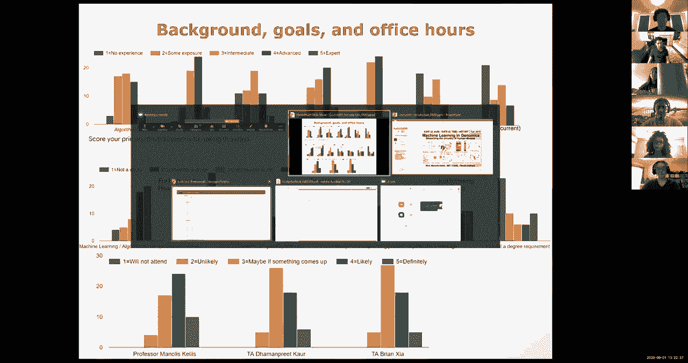

um in terms of when will the，uh restations happen you basically go。

on the materials you click on google，calendar，and this will take you to a google，calendar。

which shows when the lectures are，when the ta office hours are and when，the professor officers are。

so basically you can see that brian is，holding his officers at 5 pm today。

i'm holding mine at 5 pm on thursday and，um doman is holding hers at。

2pm on friday then we're going to have，recitation at 3 pm，and most fridays we're going to have a。

mentoring session，at 4 p。m i guess it's time to introduce，the polls。

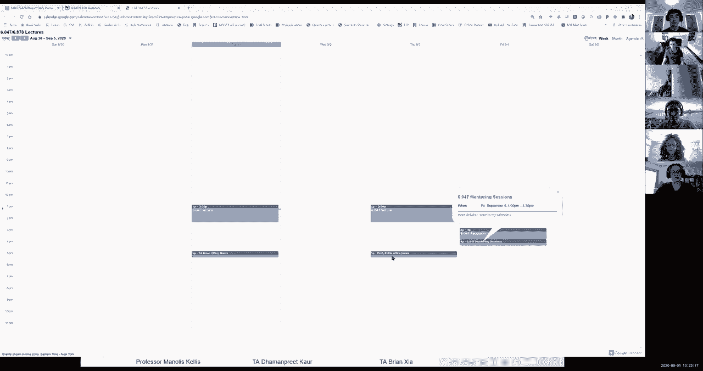

stop sharing and uh you guys check out，your chat window i'm going to be giving，you four options，4 p。

m on friday works great，4 p。m on friday is tough，4 p。m on friday is simply impossible。

all right so now let's do a poll，and we'll see which option do you prefer。

so of course only options a b and c are，valid，but you can vote for。

okay i have 49 responders and i think i，will end the poll，okay and then the other thing i will。

always do is after every poll i'll try，to type in the answers，answer。

so it seems that only five people really，can't make it on friday。

and i'm really really sorry for that but，it seems to be，the best option i'm you know i have to。

say that i'm quite flexible so let's do，a few more options so a thursday at 4，p。m，be thursday at 5 p。

m，c friday at 4 p。m，d friday at 5 p。m，and i can even do i don't know e，friday at 2 p。m okay so。

let's relaunch the polling actually and，now i'm going to do，multiple choice so you can click all of。

so feel free to i mean actually not not，feel free but please vote for all of the。

ah as impossible have options in the，morning for people in different time，zones。

that's a tough one but uh why don't i，offer a few options in the morning。

that's a good suggestion yeah that's a，[Music]，basically there are some people on the，it's。

tough to have it in the morning but let，all right so in terms of answers we have，uh 25 28 32 32 30。

so pretty equally distributed across，all of them and options c。

and d seem to be the best with the same，number at both 4 p。m，and 5 p。

m so this seems to be winning so，far，but let's go back to the time zones。

actually you know what let me uh，include a few more options so basically，now a is going to be。

friday at 9 00 am b is going to be，friday at 10，c friday at 11 d friday at。

and then e friday at one did i read this，we just won no，39 40。 we have 54 people come on you。

all right that's all i'm gonna get uh，so we have 26 18，17 25 29 so。

friday at 1 pm seems to also be working，but not quite as much as the current，time of friday at 4。

what i like about friday at 4 is that，of，nice there so i think we're going to。

keep friday 4 for now but at least we've，learned how to use balls which is great。

so uh let's see in terms of responses。

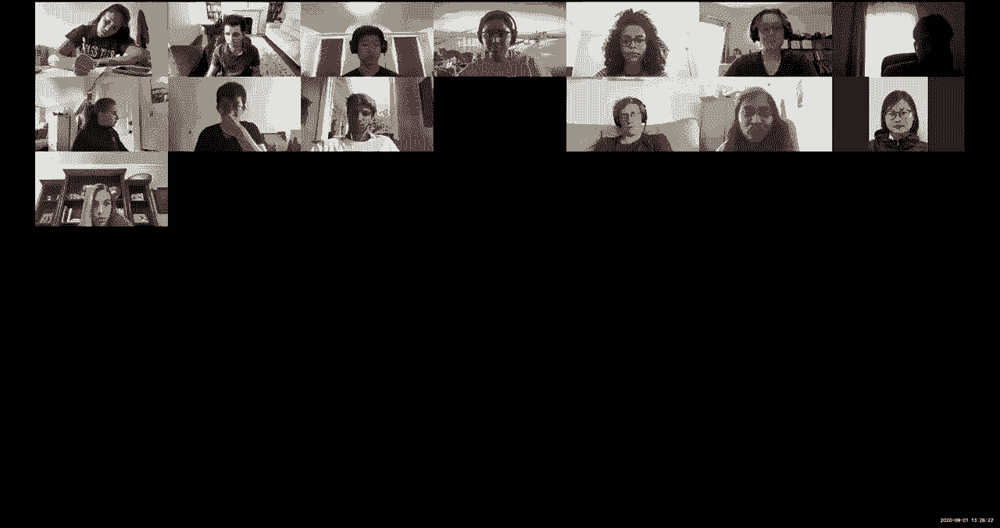

the other thing i wanted to show you，is，there you go so um 36。

of the students are currently on campus，and then，another uh 17 percent are，okay sorry so 17。

our campus 36 are in boston but not on，campus and then，um another 15 are on eastern time。

outside town so this is you know，about sixty percent seventy percent of，this distribution and then。

uh there's a few people in mountain time，there's a few people on pacific time。

just a couple and then there's actually，many different responses with china。

there's about five students i think from，what i counted earlier in china，so it's a little tricky but。

uh you know we will probably send，another survey but for now we'll keep，them on friday。

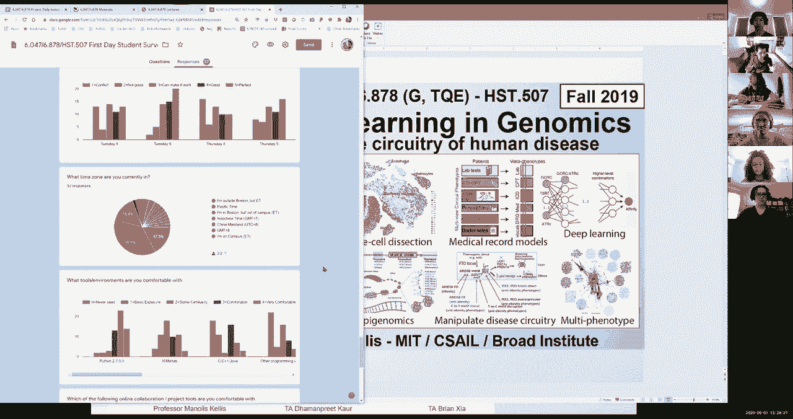

at four and the way that we've organized，it is a little asynchronous。

so you don't have to physically be there，let's see，[Music]，friday five was equally voted yeah so。

friday five was equal，so i'm happy to do friday at five i just，feel that。

um given that it was the same number um，it's it's hard to argue for switching，but。

i'm also very happy to do friday five i，know that some of the csv students have，lectures at 5 p。

m so i'm trying to avoid，the 5 p。m time slot，but we we probably will send another，doodle poll。

we will probably send the doodleball to。

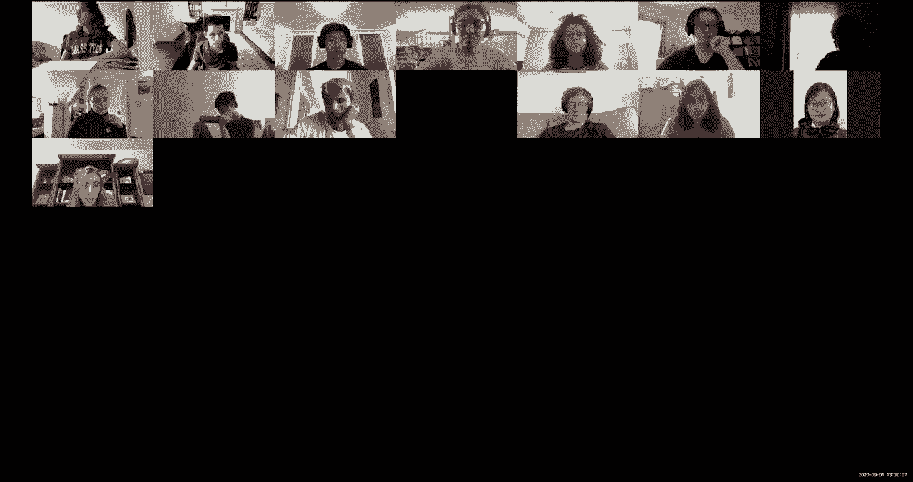

everyone with，options additional options and we'll go，from there，all right so now let's uh go and um。

look at what is the response when people，are asked if they're currently doing。

research computational biology，so about 32 percent of the people said，no like strongly no。

and uh you know another few people said，strongly yes，and then uh there's a you know these are。

some of the responses so basically，um you know i'll leave it that there for，you guys and uh it's。

uh you know very diverse types of，research projects which is very exciting。

because some of those might actually，build into very nice sort of basis。

for building more projects and then in，terms of why people are getting the。

course again this is extremely，uh motivating to see uh all of you guys。

uh with different goals and aspirations，which is really great，so uh again i'm gonna leave this there。

for you guys to read，and then previous years have asked what，are people's interests in specific。

topics and then this，is where people tend to respond so it，gives you an idea sort of what。

people's interests are i felt that this，was too much for，before you even start the class so again。

lectures are going to be 1 to 2 30，unfortunately not in a room but on zoom。

and then our stations are going to be，friday at 3 p。m，and then ta of bizarres we're going to。

you know，do as we just discussed and then all of，the information is going to be。

in the course website and the google，calendar，is public and you can add it just by。

searching six or seven lectures or just，clicking through，the poll so you。

also experienced two types of poles，basically which option you prefer single。

choice and multiple choice so，uh this is what we just did and then i'm，you。

how well are you following so far and，then you can answer，you know super well you know medium well。

kind of in the middle，not so well not at all and then how is，the pace so far。

i'll be asking you that as well it's way，too fast just right or way too slow。

and then i'm sorry but part of my，personality is that i'm like，who's excited because i'm just so。

excited about all this material，and then uh i don't know if you want to。

make me feel better you just say super，excited，but if you want to be honest you say。

yawn and anywhere in between，uh thanks for the applause ari this is，awesome。

very encouraging um and then uh i'm，after after different sections i might，be asking。

uh who feels that they've learned，something and then again，you know five means awesome i learned。

some new stuff it was important i got，the intuition，four is yeah this was interesting and。

possibly useful，and then three is sure so this by some，knowledge i already had but it's still。

helpful，and then two is like yeah not really i，kind of knew this stuff already，nothing's new here。

and one is like nope i don't really see，why professor's so excited。

and and that's okay too but you know，notice all of these polls are completely，anonymous。

so in contrast to lecture and class，where i basically say who's falling and。

everybody's raising their hand because，they feel free of pressure。

this is really a chance to be honest and，say uh no i actually have no idea what，you're talking about。

and that's okay because all of the polls，are anonymous，all right so what are our goals for the。

term so first of all，uh the goal is to introduce you to the，knowledge the field。

of computational biology so uh，understand fundamental problems in，computational biology。

understand algorithmic and machine，learning techniques，for data science basically i think that。

you know as the fields of machine，learning is getting more and more，interdisciplinary。

applied machine learning is really，recognized as a，hugely important field and there's no，course。

hugely dire then computational biology，for this or sort of genomics and health，more generally。

because aid has a huge impact on the，human condition，and you can cure lives you can sort of。

save people's，well-beings and livelihoods but，also you can test and validate the，predictions。

and sort of because it's not just some，abstract kind of thing you can kind of。

go back and actually do an experiment，and find out if the machine learning。

algorithm was right or wrong but，anything that we're going to be learning。

about sort of applied data science，applies very broadly to any kind of。

application field whether it's i don't，know social networks transportation，economics you know。

many many different aspects involve the，same type of，understanding the data set parsing the，data set。

writing algorithms that sort of um you，know，process and understand and interpret the，data。

and then making predictions about the，field of interest and then interpreting，these predictions。

in our case biologically but in other，cases economically sociologically etc。

we're also going to be focusing on，research directions for actually，field。

this year you're in a very special，position because this is a very young，field。

it's not like i don't know physics where，a lot of the stuff was worked out i。

don't know 100 years ago，it's it's a living breathing field，and very often i'll tell you about。

techniques that were invented，you know in the last few years in some。

cases by students in my group or，in some cases students like you taking，the class actually invented。

some of the techniques that we're，actually going to be discussing in class。

so this class has evolved by，incorporating，activity across the field but also。

activity within the walls，of campus and i think it's it's，extremely。

rewarding to see your projects become，part of that knowledge and then we're。

also going to be focusing on，understanding，how the methods work very rarely i mean。

actually never are we going to tell you，hey go on that website type in your，comes。

out we're going to be focusing on，writing code，that understands and interprets these。

data sets and focusing on，how the methods are actually working so，that。

we empower you to then develop and，invent the next generation，part。

so let's see if i have men's manus uh，nope，um so the so，you know mit is all about men's and。

banners right men's is the，mind and then mannose is the hand so the，modest part。

is understand how to do research，actually carrying out research，so the problem sets are going to be。

introducing you to either programming or，algorithmic，thinking the programming assignments。

will give you hands-on experience with，real data sets，and reporting them into jupyter。

notebooks right now so that you，sort of can submit your responses as a，notebook。

which are extremely valuable if you，haven't used them before and i think，most of you have。

there jupiter notebooks so，uh the geek is in very comfortable，or expert and then there's very few。

people who have never used them，enjoy，learning that so that's something that，we're building on。

um so so and then lastly the final，project experience，where you propose and you carry out an。

independent，or regional research project and then，you present your findings in conference，format。

both written and oral and in my view，this is，you know one of the most important。

things that you can do whether you've，done research before，or not i think the experience of going。

through an entire research project with，peer feedback with，proposal with review with midcourse。

report with final，written and oral presentations all of，that is an extremely valuable experience。

it's usb，span it usually spans many many months，or years in the course of your master's，or phd。

right now it's condensed into 14 weeks，of a course so，it's it's gonna be intense but uh。

extremely rewarding，all right so now let's talk about the，course content so。

i like to think of the course as having，two dualities the first reality。

uh you can think of it along the x-axis，is on one hand computation on the other，hand biology。

so we're going to be looking at，important and relevant，current biological problems this is not。

biology inspired problems，and then we just do a bunch of，computation on something that we were。

inspired by biology，and then in the end it has no impact on，biology。

we are going to be focusing on having an，impact on human health and，impact on biology and that。

means that everything we do is going to，be on important relevant in current，problems。

the second act axis is the second sort，of aspect of these first axis。

is fundamental computer science so we're，going to be learning very general，techniques。

and principles of computer science and，data science and machine learning。

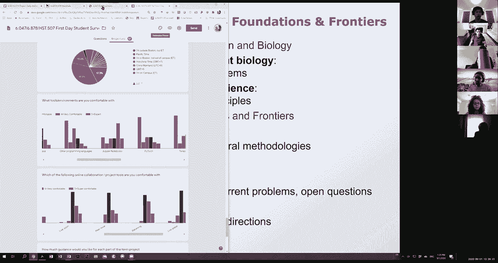

so if you look at the set of lectures。

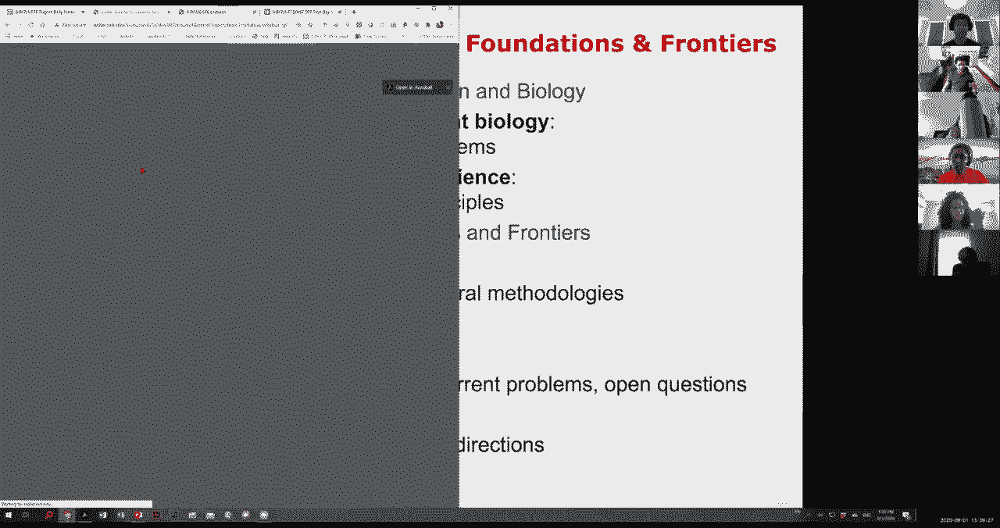

from the syllabus you basically oops。

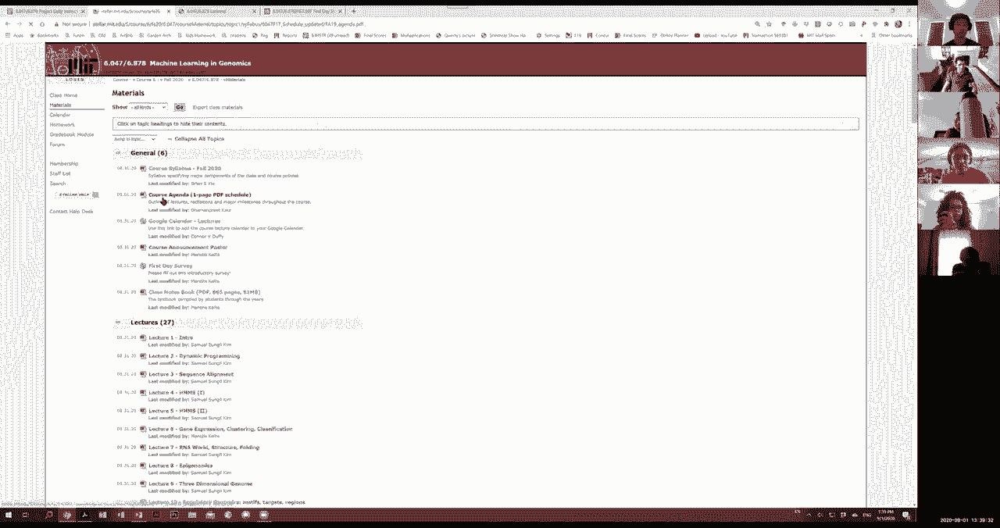

not this one but the agenda，you basically see that at every lecture，we basically introduce。

a new type of computational technique so，on thursday we're going to be talking，about dynamic。

programming we're going to be talking，about hashing in rapid string search。

we're going to be learning about hidden，markov models about expectation，maximization。

and um you know gibb sampling，and clustering and classification and，k-means and bayesian。

inference and uh you know，so many different aspects of uh you know，deep learning。

and singular vowel deposition and pca，and，diffusion kernels and convolutional。

networks recurrent neural networks，so all of these things are pervasive in。

machine learning and computer science，and these are things that you will be。

able to then take and apply to many，other places，so that's on the uh computer science。

uh aspect so general techniques and，general principles not just some，esoteric。

uh little things but very broadly，applicable so that's，the first axis on the x you basically。

have both，biology and computer science the y-axis，is the second duality it's foundations。

and frontiers the foundations is，basically well-defined problems and。

general methodology these are the，classics，and the frontiers are complex current，problems。

and open questions where we often will，combine multiple of the techniques that，we've learned。

and this will open up to projects and，research directions so，every module is going to try to have。

both the frontiers and a foundation，component，and of course every lecture is going to。

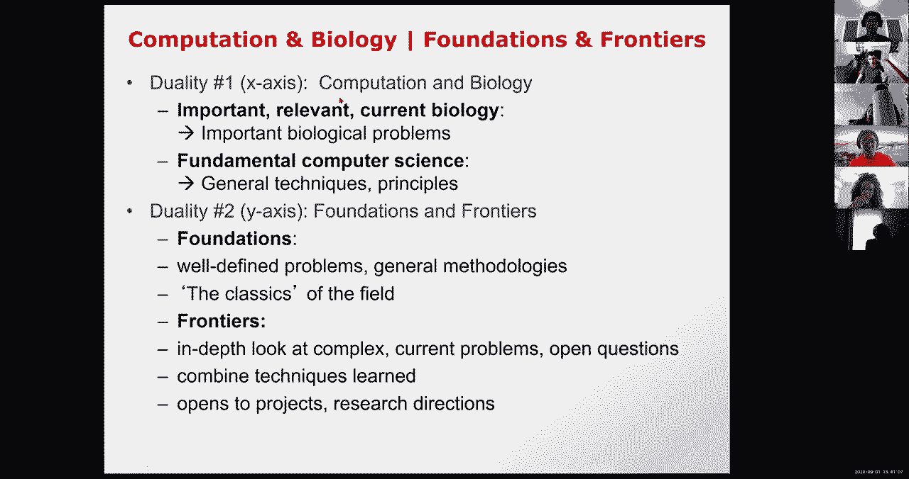

have to have both biological，and reputational aspects so what are the。

modules so every module corresponds to，an active area of research，so every course is organized in a。

different way some course is organized，around the methodologies。

and these coursework organizing around，the applications so，but the methodologies themselves are。

going to be building，as we go so we're going to introduce，dynamic programming here and then we're。

going to build on it there，and we're going to introduce clustering。

and classification and k-means invasion，inference there，and we're going to build on it as we go。

further and so so forth，so we're basically going to be building。

up as we go through the computational，path，but we're also going to be walking。

through effectively the central dogma of，biology，as we work work through the applications，first。

and we're going to be looking at rna and，gene regulation，and we're going to be looking at。

networks and then genetics，and you know evolution and，um then uh，sort of research frontiers and。

foundations basically，uh these the progression of the course。

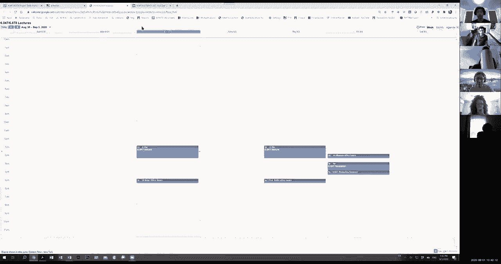

is going to be guided by both，by both axes um，so first we're going to introduce，thematically。

the field of comparative genomics，aligning and modeling genomes dynamic。

programming and heat markov models then，we're going to be talking about genes，and transcripts。

and rna sequencing and clustering and，structures，we're going to be talking about uh。

regulation uh and，uh epigenomics so i'm going to talk，about that later。

this lecture transcription factors，motifs network inference，we're going to talk about variation like。

human genetic variation and introduce，human genetics，human history heritability expression。

quantitative trait loci，we're going to talk about evolution and。

phylogeny and evolutionary signatures，whole genome duplication genome assembly。

and then talk about frontier basically，personal genomics disease genomics。

3d genomes and then all kinds of，you know very recent topics so for every。

module the first half is going to be the，foundations and that's where we're going。

to learn about dynamic programming，string matching，hashing hmms expecting customization。

deep sampling clustering classification，feature selection，support vector machines conditional。

random fields conflict-free grammars，phylogenetics，gene species trees evolutionary models。

genome-wide association studies and，disease mapping so，all of these are going to be。

computational techniques and then，the second half is going to be frontiers。

uh for each of these fields，that are sort of current research。

directions such as missing irritability，chromatin regulation，recent human selection uh network。

inference and analysis and so forth，so that's sort of the overview of the，course in those modules。

and then in these lectures and every，problem set is going to be associated，with a different module。

and again you can do these problem sets，concurrently to sort of really help you，lectures。

and if you find that you need something，in advance well you can just play the。

lecture from the from the previous year，so that's going to be on one。

hand and on the other side we're going，through，and i'll give you a lot more detail on。

those and then at the end of the five，modules we're going to have a quiz。

and then after that quiz no more psets，and，in fact all of that is going to be。

focusing on just finalizing your final，project，in terms of textbooks there's three。

textbooks that we really recommend on，one hand for machine learning pattern，classification。

for algorithms bioinformatics algorithms，and then for，digital biology biological sequence。

analysis so this is focusing more on the，genomics aspect，and then this is more broad machine。

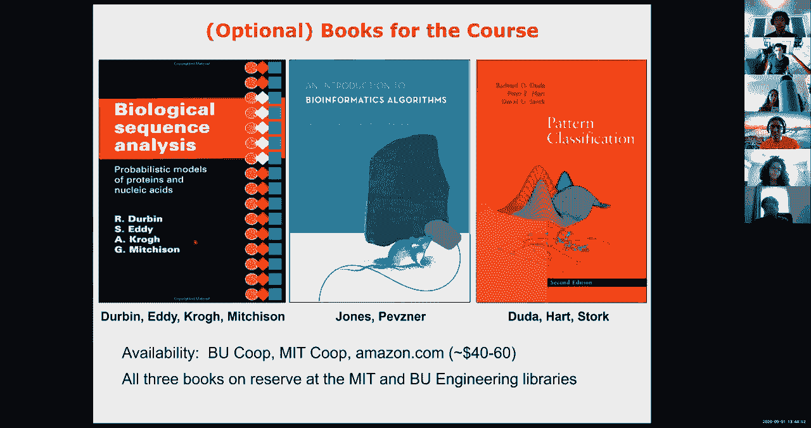

learning many of these books are on pdf，online so you can um。

you know find them but in addition we've，basically compiled，this book from past years of the course。

and then it's available for free again，on the website so，you can download it and read it and um。

[Music]，you know something that we've done in，previous years is scribing。

for now we feel that the course notes，are in good enough shape that we。

don't have any scribing assignments，anymore but if any of you are interested。

in improving the class notes we can，replace one of the problem sets at your，will。

with a scribing assignment and we，we still have a little bit of work on，some of the lectures so。

uh email the tas if you'd like to，replace one of the problem sets with a。

scribing assignment and they will，uh，there's a you know dropbox folder。

with all of the lectures in there and，then you can uh edit them，and the tas can share that with you。

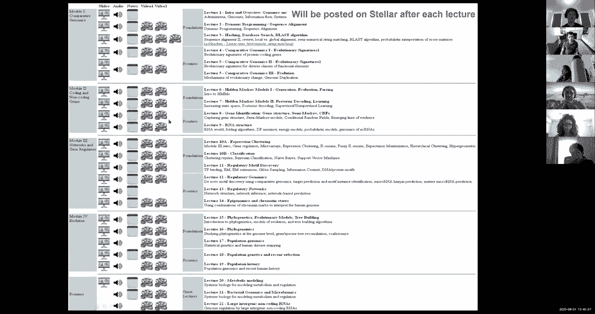

uh and as you know all of the lectures，are already online so if you go。

to the course website you will be able，to see，that um the，there's a playlist with a youtube。

channel and，um actually i'm using all the wrong，words it's a youtube playlist。

with all of the lecture notes of the，lecture from previous years。

so you can see here all of the lectures，from last year and，just click on any of them if you're。

wondering should i stay in this class or，should i go，you can just play ahead and decide for。

yourselves if you're，interested in the topics that we're。

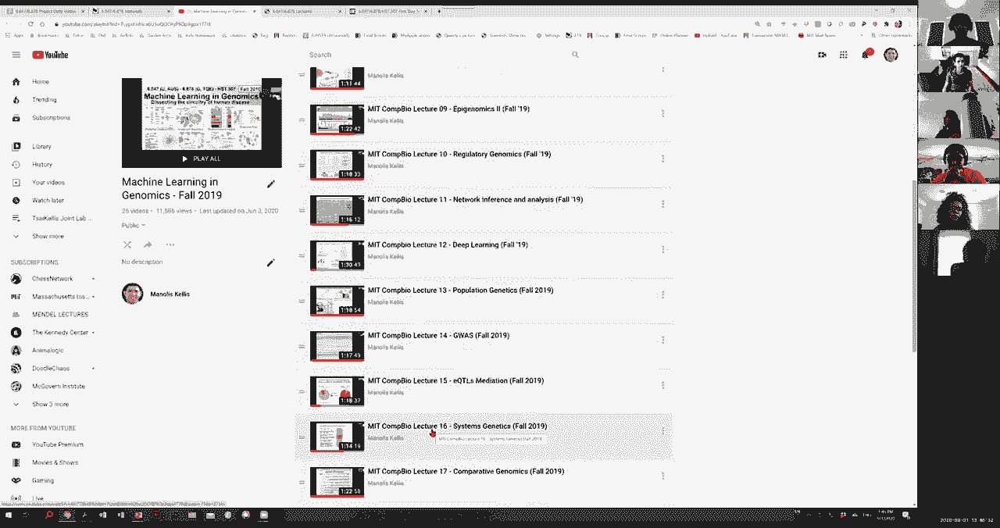

going to be covering again we're not，here to trick you or surprise you。

we're here to help you learn um，so there's also google form that you can。

use provide feedback on the lecture，we can you know give you more。

information on that and then in terms of，hormones and quizzes。

so as i mentioned every problem will be，emphasizing，one lecture or two lectures and there's。

going to be practical problems where you，gain experience in specific。

techniques where you write code you，download data sets and you carry out。

analysis you interpret your results，you learn about the behavior of a。

problem or a method and then there's，going to be some，theoretical problems where you're going。

to be solving them with pen and paper，exploring either algorithmic or。

statistical or machine learning aspects，in more detail in depth，and there might be some additional。

advanced problems for 687a，and then the homeworks are going to be，due mondays at 11 59 pm。

and in terms of late policy again we're，flexible we're not here to get you。

if you give or take a few hours that's，fine but if it's you know many many。

hours later just let us know in advance，say i have a big deadline that day。

can i have a another day or something，like that and then，we'll typically be fine with with them。

and uh please submit your homeworks，online from the seller page。

and we won't distribute solutions but if，you've solved them you'll know that。

you've you know sold them so，you'll figure it out as you see them for。

the in-class quiz uh again we call it a，little quiz it's not a midterm it's not，it's fun。

it's interesting it's cute it's fuzzy，and the goal is for you to demonstrate，mastery。

of the material in the four modules to，understand the key points emphasizing，lecture。

to understand the subtleties revealed in，the psets and to apply your new skills。

to solve practical problems，um it's funny we were actually，discussing with the tas hey。

should we just like get rid of the，problems heads should we just get rid of，the quiz which we do。

and they were like you know what when i，me，to stress out about a quiz because。

i kind of sat down and studied the，material and you approach the whole。

class in a different way if you know，you're going to be quizzed，so i um i'm not here to get you。

but turns out that quizzing people and，having problem sets，actually helps you learn and that's my。

goal my goals for helps you learn，so that's what we're going to be doing。

and we're going to have the problem sets，and the quizzes，just to help you learn and eventually。

you guys will be totally self-motivated，and you won't need that anymore。

but for now you know you know i i still，haven't hit that stage。

but at some point in your lives you'll，hit that stage and then you'll be like。

i don't need quizzes i can just study，for myself and that's fine and we'll。

have all these quizzes all together，uh in terms of the types of questions。

for the quiz we're gonna have some，knowledge questions which are gonna be。

true false justify or multiple choice，we're gonna have some deeper。

understanding questions which are going，to be short answers，and some practical problems we're going。

to work through simple algorithms，and solve them and we're also going to，have a design problem。

or maybe one more than one but most，likely just one，where your goal will be to design a new。

or modified algorithm，and you'll need both the knowledge and，you know a new idea and then argue that。

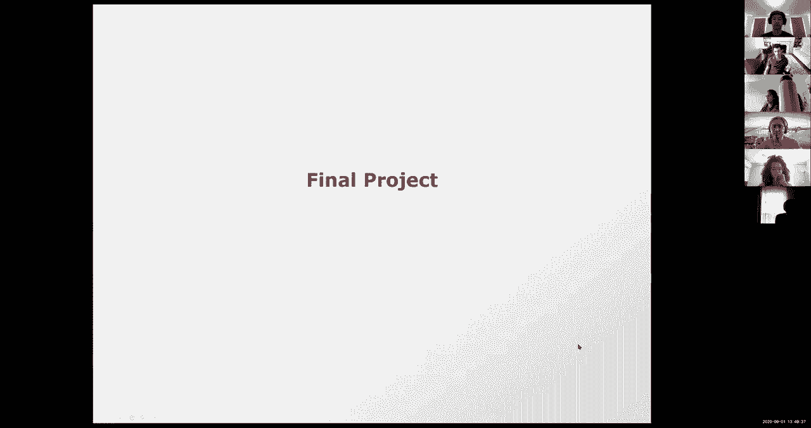

it's all same correctly，as for the final project the goal is for，you to do original research。

in computational biology so major aspect，of the course is going to prepare you。

for regional research in computational，biology how to frame，gather。

the relevant literature and data sets，how to solve it，using new algorithms and um things and，realm。

and interpret the results biologically，so that，procedure is what data science is all。

about you always have to frame the，applied problem，gather the relevant data solve the。

computation mean that's where you walk，to the theoretical side，and then interpret the results。

practically on the applied problem at，hand so again，there's no better application of that。

than you know，genomics and machine learning for，computational biology in my view。

for sort of this applied data science，and machine learning，another huge aspect is going to be the。

ability to present your ideas and，research so what i always like to tell，my students。

is if you know kind of like they say if，a tree falls in the forest and there's。

no one to hear it hasn't really fallen，if you do the most awesome research in。

the world you basically solve，a hugely important problem but your，paper is。

impenetrable no one can understand what，three，horribly written paragraphs then your。

impact is dramatically diminished，you know having an impact means actually。

impacting people actually changing their，thinking changing their。

understanding of the world and if you，can't convey，the thing that you've learned it doesn't。

have impact，so that ability to present your ideas，and your research we're going to be。

you know this is unfortunately，underdeveloped throughout our classes at，mit there's。

only a small set of classes that are，that are currently doing this。

and this is one of them where you're，going to have to craft a research，proposal。

and that's going to be very helpful for，fellowships and grants you're going to，have to work in teams。

of complementary skill sets and that's，hugely important in this。

current interdisciplinary world that we，live in，you're actually going to carry out，reviews。

of your peer proposals identify flaws，and suggest improvements you can be like。

hey your data set here doesn't seem to，be there it doesn't，be working or you know this algorithm is。

not very well suited for this problem，and suggest improvements for。

you know hey maybe you should that other，algorithm work here if you need the，different data。

and that actually is extremely rewarding，i always feel like oh why are we doing，this to the students。

and turns out that year after year，students are like wow this was one of，the most。

important aspects thinking critically，about，the um you know proposal，or the project of another team。

helped me is what the students always，say it helped me，understand my own project critically or。

it gave me ideas about how i could，present my project or，ideas about how i could sort of solve a。

new thing or，you know how to like basically you learn，so much from，peer review and uh you know。

also learning how to receive feedback，and how to revise your proposal。

according to this feedback it's，extremely important，and of course writing up your results in。

a scientific paper is extremely，important what i always，like to say is that every student or。

every every time a student，completes a paper from beginning all the，way to end and。

even all the way to revisions and final，publication，they learn something so intangible。

about this whole process that it's not，just the sum of the parts it's really。

seeing the whole thing come together and，it's only when you've gone all the way，to the end of it。

that you kind of learn how to tackle the，project from the beginning the next time，around。

and i think that that completing all of，that in one term is，very important so writing up your。

reserve your results and then presenting，a research talk，to a scientific audience and i also have。

a lecture as you will notice，even in the um you know playlist，on how to present papers figures and。

presentations。

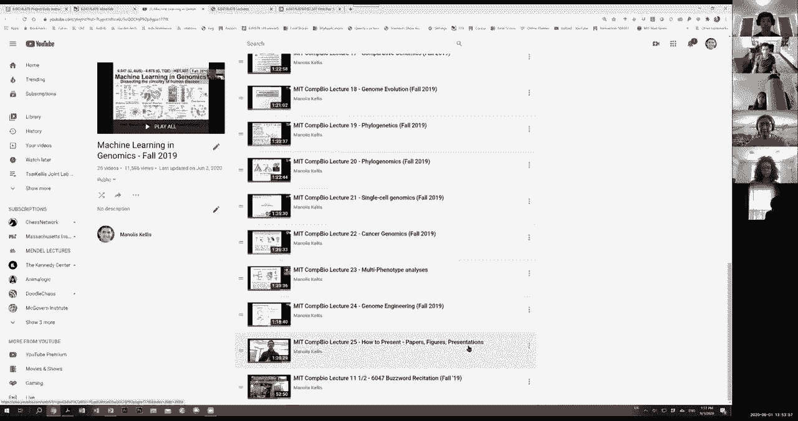

and this uh is a huge amount of advice，that you can use，to basically uh build up your。

presentation skills，and again we'll get there uh eventually，at the end of the。

course so this turn project mirrors，this uh process that you constantly have，to go through。

in life and um in terms of milestones，um we basically created a series of。

milestones and we asked you，how much guidance would you like for，each part of the term project。

and again it's extremely rewarding to，see your answers，so you know i was thinking that many。

people would say ah just prefer no，guidance just，let us be we'll do it but no for。

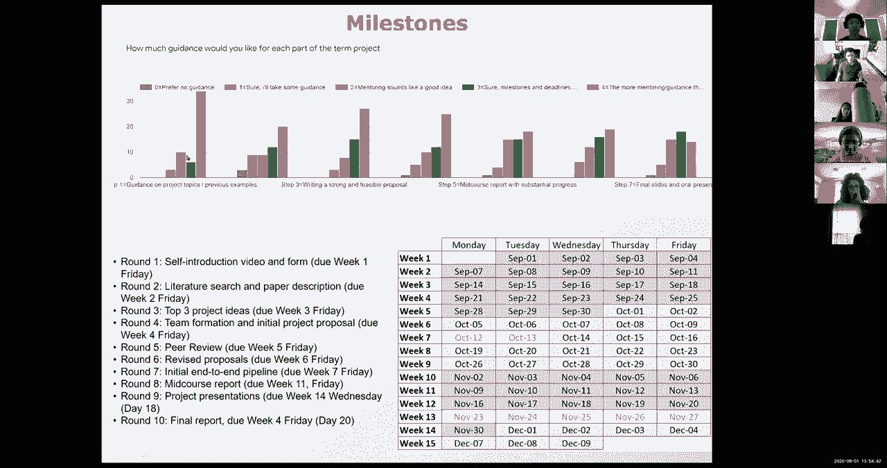

project topics and previous examples for，you know creating the proposal or。

let me go back to the survey here um，yeah for forming a team with，complementary skills。

people want a lot of guidance writing a，strong and feasible proposal，the more guidance the better。

demonstrating an initial end-to-end，pipeline the more guidance the better。

and then it's kind of interesting it，kind of falls off as you go to the end。

of mid course report the more guidance，the better，and then final report yeah it's still。

that distribution but not as，crazy skewed and then final slides and，representation。

again people are like you know sure。

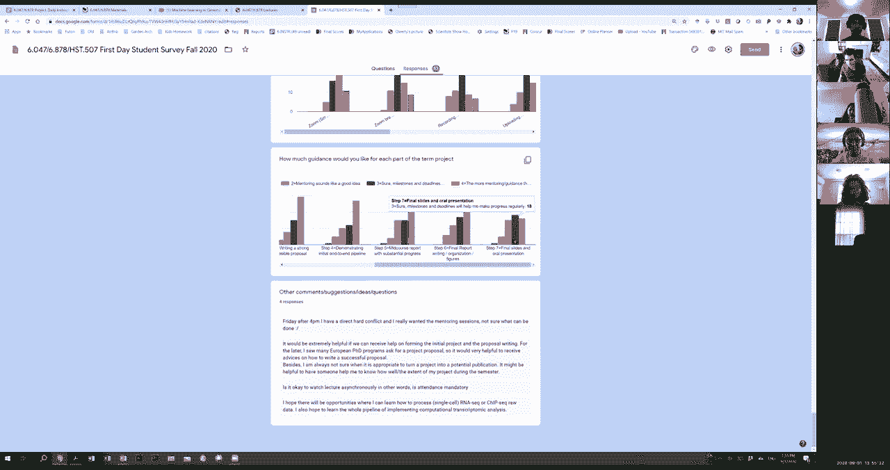

milestones and deliverable will help me，etc so anyway again uh，seeing，you respond this way is very。

satisfactory because he's like okay，we're not we're not off the cuff here，we're not。

sure we're not off the ball or what do，they call it um，is，the turn these are all of the days。

of this semester so basically the last，day of classes i think is on the 9th。

or december or maybe the 8th of december，but our last day，is on the 8th of december and then this。

is columbus break and then this is，thanksgiving break，and then that was uh red day oh and of。

course sorry this is labor day september，7th，but we have basically you know 15 weeks，ahead of us。

and the project is organized with，milestones along，these 15 weeks so round one is going to，be。

practice basically create a，self-introduction video，and fill out a form which you already。

have and submit it，by friday so basically you know week one，on friday，we're gonna ask you to build a。

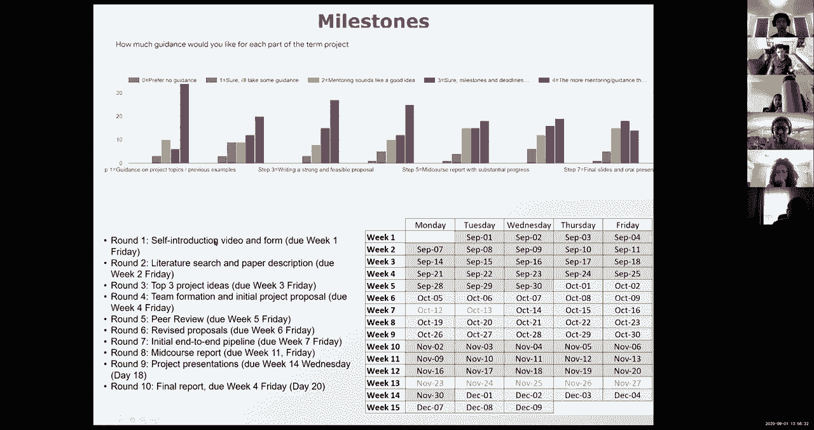

self-introduction video，and what that entails is um，in the i'm gonna be sharing this google。

doc with you guys so it's gonna be one，massive google doc that basically walks。

you through all of the rounds of the，project so basically，for every round we're going to have a。

lot of advice，so for week one the self introduction，given the online only nature of the。

course this year we would like，each student to pre-record an，introductory video。

presenting not parenting presenting，themselves，and their background to the rest of the。

students in the class and to the，teaching staff，so tell us about your background your。

interest your educational experience，this far，what computer science and machine。

learning did you use something about，previous research projects you've done。

what you're looking to gain out of this，course what topics you're the most，excited about。

why you're excited to be part of this，program why your future career goals。

yeah what they are after this course and，then，you can click and upload the video here。

so if you click that，you will notice that there's a dropbox，link。

and then you can just drag and drop the，file or add it directly from your，dropbox。

and it will magically appear as long as，you name it，correctly so please name it，first name last name。

intro video dot mp4 or something，okay um then，make sure you also fill out the self。

introductory uh survey，basically the first the first day survey，uh here。

and you know again most of you have，already filled this out but if you，haven't please do so。

and then this will be used to introduce，yourself，to the rest of your classmates uh，there's also。

um the free form，um so you know please uh and we'll，the template is actually already there。

so template，okay so fill out this template and then，if you look at the profiles from。

so in fall 2019 for example these are，the student profiles so basically every。

student basically says a little bit，about their academic background their。

previous research experience the area，that interests them the most and the，preferred type of project。

and again speaking with the tas they，were like wow，i definitely went through these files to。

basically find partners，and when you find these partners you can，just email them and text them。

and say hey i noticed that we have，complementary skills，and common interests let's work together，and。

please do that so um you know we'll，compile them all together。

and then share them with the rest of the，class again we'll be sending you a lot。

more emails about that，so that's um for，uh week one then week two，we're gonna be looking at uh。

literature search and paper so basically，next week，we're asking to select a paper in nature。

nature biotech，nature genetics science cell some fancy，high profile journal。

and make sure there's an abundant data，set there，with cool code and analysis and then。

your assignment is going to be to，describe the topic the background。

the overview and the importance and goal，in the achievement，of the paper describe the datasets that。

are available，and their organization describe the，algorithmic and machine learning，techniques。

used in that paper describe the code，availability，and how easily replicable the results，appear to be。

because if they're easily replicated，they're also easily extended。

and you can basically build on that data，set and build on another data third data。

set or sort of build a method that sort，of combines across them or。

combine methodologies from different，papers that's really the best way。

to start on a new project basically find，a paper，that has already compiled the data sets。

i don't want you to say，oh i'm going to look at the important，the impact of i don't know。

environmental pollution on human health，in pregnancy，there yeah great that sounds great where。

are you going to find the data so then，four weeks，searching for the data and you're going。

to realize that data is not available，and then you're going to look for，another project。

if instead you start thinking from，papers that are already there from，combinations of papers。

that are already there it really makes，things much more concrete and much more，likely。

to succeed so um，and then we'd like to have both a，written and a tabulated description and。

again that's for week two，i'm gonna send you more details about，that um of that。

paper and also create another，three to five minute video presentation，where。

any student who's interested in that，paper can then go and click。

and sort of hear you present that paper，and we're gonna make all of these，available。

and then you can record yourself using，tools，and you know feel free to let us know of。

other tools and we'll use them there，and then again uh you know first name，last name。

paper presentation dot nb4 and then just，upload them in，this link here which um is going to be。

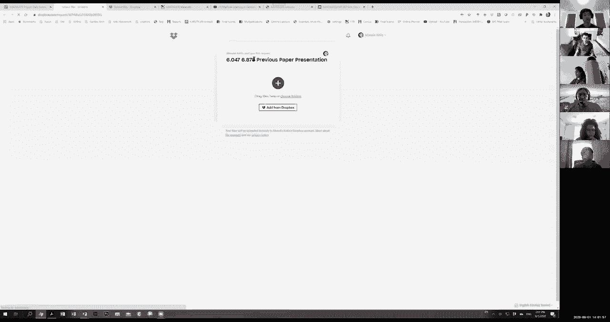

the same thing previous present paper，presentation this is a self introduction，video。

so for each of those milestones there，will be，some kind of upload so that by the end。

of the term you feel，so comfortable doing these video uploads，that it's going to be like oh term。

project no problem we've got this，okay then we're going to be asking。

students to score their interest in the，previous papers，as potential topics and we're going to。

be asking，each one of you to list their top three，ideas，and that's going to be the third week by。

you know friday the 18th，then we're going to be building teams，and。

uh create some initial project proposal，so basically，based on the initial papers everyone。

will have access to all these papers，and the corresponding data sets so it。

might give you ideas about how to，combine these papers in different ways。

it's going to be building a resource，that all of you will use，and that's round two round three is。

gonna be，that，and all of that is gonna be again，available in the whole for the full，class。

and then by week four we're hoping the，matchmaking will happen。

and we're gonna have mentoring sessions，with breakout rooms，throughout this process so that you can。

find each other you can chat with each，other，and then hopefully by then you have。

already teams formed，and an initial proposal by week five on，friday。

we're gonna actually have a peer review，of these initial proposals。

so on september 25 you're gonna be，submitting your proposal，and you're gonna have one week to review。

your peer proposals，and then you're gonna be submitting your，reviews on the following friday。

and then you're gonna have one week to，incorporate those reviews。

into your revised proposals and by then，we're kind of you know um。

set we basically know that the project，is very likely to work。

but the last step after that after this，week six，is gonna be a week seven of。

an initial end-to-end pipeline what does，that mean，that basically means demonstrate that。

you have all of the，needed data sets and all of the needed，code and all of the components。

are in place and you can load them up，into your computer，and that they're all working because if。

you can't，you might have to revise your project so，yes，by then you've had a peer review and you。

responded，and you've revised your proposals and，you've，you know downloaded all the data sets。

but then，having a demo where you record yourself，on your screen basically saying okay。

here's this data set and here's that，thing and i can load the data there and。

i can reproduce i don't know figures，figure three or something i think that's，sort of the initial。

end-to-end pipeline that's what i mean，by that and that's round seven。

and that's you in week seven so remember，this is mirroring，the amount of feedback that you guys。

have actually requested，so you know uh we're not uh，you know off the mark here we're uh。

we're sort of responding to your needs，but after that week seven we kind of let，you be。

okay and then the only next milestone is，going to be week 11，so four weeks later is going to be the。

mid course report，and then the goal of the mid course，report is to basically demonstrate。

that you can kind of see the end of the，tunnel in your final project that，basically。

you're like okay i have all of the parts，in place，and i i have done a lot of exploratory。

analysis over these first four weeks，now starting you know week 11 friday。

so starting november 13 this is，all about wrapping up and then the goal，of wrapping up。

is basically say these are the figures，that i would like to have in my project。

and this is what i'm going to put in，those figures and how i'm going to do，this。

and that gives you until basically，december 4，to complete your um your projects。

and then the final report is going to be，week 14，on friday and then the final，presentations。

are going to be again recorded，asynchronously and then due，on the last day of class or maybe the。

day before the last year class，so we can do one final round of peer，review。

where everyone in the class will，actually score，you know，um very educational it basically makes。

sure that every person，in their own free time watches every，presentation。

and it's something that we always cram，to do live in the class，and now we're going to be doing it。

asynchronously everybody's going to be，recording it so there's not going to be。

any connection problems，and everybody's going to be watching，them and to know that you've watched。

them we will ask you to actually score，all of them according to some criteria，all right so。

here time for the for the next poll of，how well are you following so far，all right so 33900。

and then the next poll is going to be um，how's the base so far i mean going too。

slowly i'm not going too fast i'm not，you guys are so fast with these balls，it's great。

nice all right，so uh 38 just right and then，two above and three below and then。

um the last thing is who is excited，about all that，remember that's the part where you make。

me feel good this is awesome，i hope you're not just doing it to make，me feel good um。

awesome so good i'm so excited too so um，25 11 410。 um，good so i'm excited you're excited and。

this is you guys，to have，so many of you here and to have so many。

bright excited young folks ready to sort，of tackle research and become the next。

generation computational biologist，so make an effort to meet your peers we。

will have profiles for everyone，we will have video recordings from，everyone。

get to know each other um you know we're，gonna have，team building sessions where you're。

gonna have breakout rooms by topic of，interest，and have a chance to chat i'm going to。

be walking between the different rooms，so will your，tas my goal is to overcome the distance。

between us，and to really form friendships to really，get to know each other。

to get to know your interest to get you，know your background your aspirations，your goals your。

you know research background your you，know career future，um you know plans and all of that just。

get to know each other，and uh let's let's really embrace，the fact that technology can still allow。

us to come together even though we're，not physically together，and uh you know let's do this okay。

so uh you know as i mentioned the，milestones ensure sufficient planning，and feedback。

setting up building a team getting，inspiration，i've，also made available uh the。

previous projects from last year so you，can see，the slides from fall 2019 the videos，from fall 2019。

the individual slides and final reports，example projects，uh you know individual final slides and。

reports from 2018，2019 2017 even from the spring course，from this past semester，this。

you can see that you know sort of what，kind of projects other people have，accomplished and。

many of these students never had any，background in computational biology，before that。

and yet they're able to uh you know，hope，you will too all right so，uh we're also gonna have some。

interaction with the communication lab，to basically help communicate your，feedback，previous。

folks who have used it and this is how，people use the comm lab，and again this is not going to be in。

person anymore it can be on zoom，but um you know we are excited to sort。

of have the com lab work with us for，many years now，to sort of give students feedback。

um all right so putting it together all，together uh we have，uh oops that's my family grading。

so this is the grading rubric that we，came up with and。

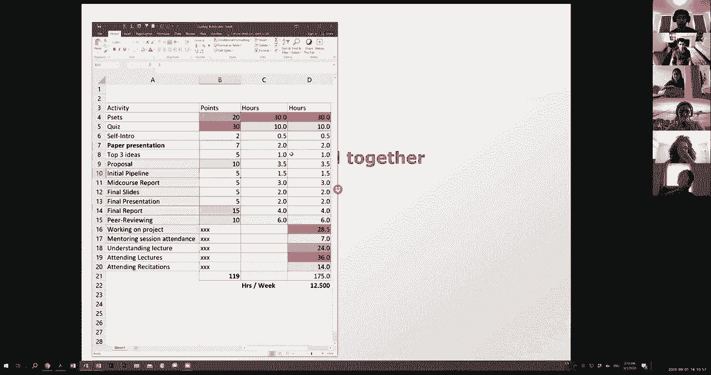

um this is roughly how much time we，expect you to spend，on every part of the class so this is。

how we came up with the points as well，spend，about five hours a week for the first，six weeks。

uh or six hours a week for the first，five weeks um sorry，six hours per problem set for the first。

five problems that bunch of them is，gonna be two weeks so about two and a，half hours a week。

and then for the quiz we expect you to，spend about 10 hours cramming and，studying for the quiz。

but again understanding the lectures you，know we expected to spend about。

another hour after lecture for each，lecture or you know this can be。

half an hour before reading the slides，or skimming these slides and half an，hour after。

reviewing material et cetera and all of，that of course will go into your quiz。

as well and then we expect you to spend，you know 30 minutes on your self intro，two。

hours on your previous paper，presentation，so selecting the paper reading the paper。

and then presenting the data set，and then maybe one hour listing your top，three ideas。

maybe 20 minutes per idea and then，this big chunk is about your final，project so。

uh we expect you to spend about three，and a half hours，on you know after you've selected your。

idea on sort of writing your proposal，one and a half hours and sort of making。

your initial pipeline and your video，and the three hours of making your，report uh mid-perfect report。

two hours and making your final slides，two hours and uh recording your final，presentation。

and then four hours writing your final，report and maybe six hours across the。

different routes of be reviewing，but again this is not the only time。

you're going to defend on the project，we expect you to spend a total of 30。

hours actually working on your projects，through the course and um，attending mentoring sessions we're。

sessions，each of them for about 30 minutes or an，hour so maybe another seven hours there。

and then um attending the lectures one，and a half hours times 24 lectures 36，hours there。

attending recitations one hour times 14，recitations，another 14 hours there so a total of 175，hours。

and uh 12 and a half hours，per week so it's a 12 minute course，um i hope this this will fit well。

so and then in terms of points，uh again why are we having points to，trick you into learning。

in order to earn points it's，gamification of learning，um we're not here to get you we're here。

to help you learn，points，and then the quiz is going to be worth，30 points self intro two points。

paper presentation seven points top，three ideas five points，the proposal itself is going to be ten。

points the final report fifteen points，and the peer reviewing ten points。

and then each of your initial pipeline，the course report final size and final。

representation is gonna be five points，but again all of these together will，culminate into about。

55 points which is comparable to if you，add up the psets on the quiz。

which is also comparable in terms of the，total number of hours that you're，spending。

here all of the project uh related，components spent 50 hours，for，see。

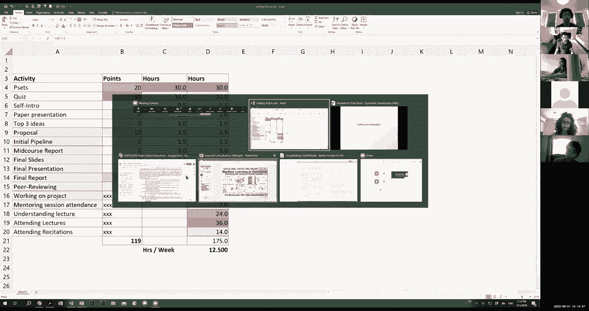

okay so uh 35，5 one zero zero uh great，so that's the course overview so。

hopefully by now you have a pretty clear，idea，about what's what this also entails so。

now let me spend the next 10 15 minutes，on why computational biology what makes，our field unique。

give an overview of the main modules and，then a quick primer，on biology so why computational biology。

so this is a question that i've asked，year after year，and there's many many different types of。

answers so in fact，let's use the chat function so that all。

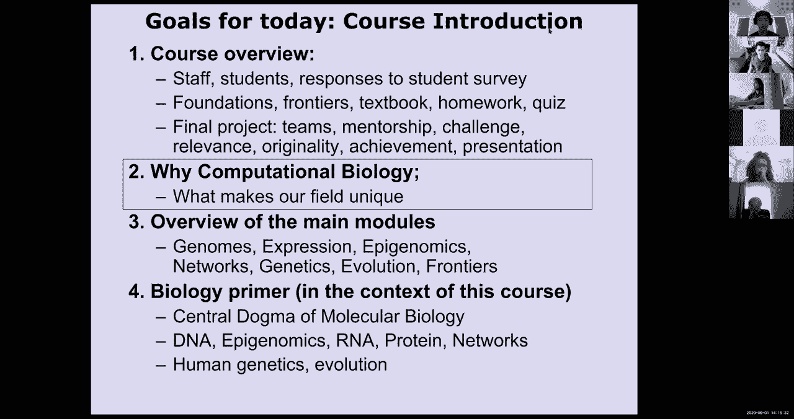

of you guys can enter an answer，so um i'm gonna stop sharing。

go to the chat and say why computational，biology what makes it different from i。

don't know computational astronomy or，computational geology or computational，social sciences。

why why is computational biology so，exciting，or you can just raise your hand or you。

can just like unmute yourself and give，answers，biology is big awesome。

it is big and um it's data rich，in a historically data poor domain，that's very cool。

potential to do whatever you want，without waiting for experiments that's，brilliant。

dna is a massive data set awesome more，efficient and in-depth way to explore，biology。

there's tons of biological data sets，waiting to be analyzed，because you can use other people's data。

sets and get a good research done in the，budget that's great。

more and more sequencing data coming out，might be the biggest frontier of。

computing today that's great，new technologies and lots of data，totally agree biology benefits from。

approximation，very nice the need to integrate，multi-omics data to gain more insights。

is great it's interesting and new，of course can use expertise from other。

engineering fields to impact health，create complex patterns valuable data。

impact human real human lives important，applications that's awesome。

answers questions not easily solvable，but traditional experimental biology。

that's very true it's not just that，experiments are slow，said experiments can't even answer some。

of these things，this is fantastic it expands our，horizons in asking biological questions。

brilliant this is so cool，keep going guys this is amazing if you。

haven't tagged one in just go for it，and a big shout out to all the folks who。

responded wendy matthews tutti pablo，lilly，harry perez evelyn manu thomas。

kathleen daniel swathi farhan lucy。

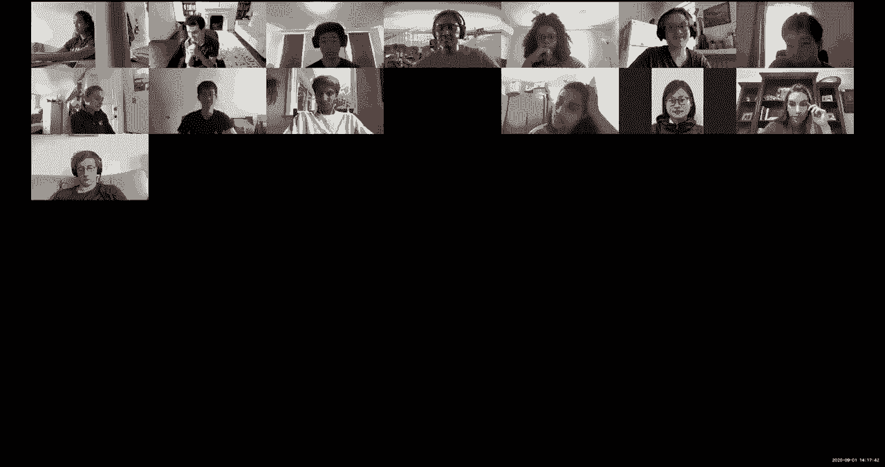

andrew and dylan you guys are the best。

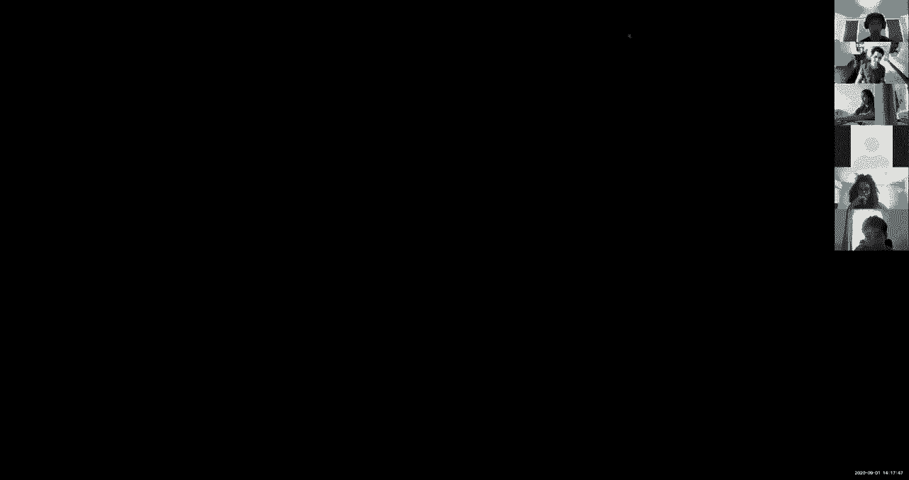

this is awesome so yeah wow um online，uh is actually sometimes working better。

so these are the answers from previous，years uh，so you know there's lots of data and。

also combinations of data，there's rules that's kind of very cool。

about biology the fact that there are，underlying rules there's it's all about。

pattern finding it's all about data the，ability to visualize the data。

to simulate and create temporal，relationships to guess and verify to。

generate hypothesis to guide the，experimental testing to propose，mechanisms。

and theory to explain the observations，uh to understand combinations of，variables related to these。

times lots of data here also efficiency，reducing the experimental space to cover，quite rapidly。

understanding that there's a huge need，for infrastructure，and the ability to combine data that。

relies on that infrastructure，build correlations in higher order。

relationships and then the cycle from，hypothesis generation to testing。

is getting dramatically condensed and my，favorite is that life itself。

is digital we're basically trying to use，computation，to understand a digital computer that。

runs inside all of our cells，i always like to say that humans are not，the inventors。

of the first digital computer we're the，descendants of the first digital，computer that in fact。

every one of our cells has a digital，code at its core，and of course tons of analog running，around it。

but life itself is digital it's a dna，code it's zeros and ones，all the way down which i think makes。

computational biology，so so unique and so different from every。

other field and that's what these zeros，and ones look like，it's basically you know a c g and t。

and within this ac g t lies，data you know these data，have meaning this is actually real。

data this is an actual genome this is，the genome of baker's yeast。

for any of you who has either drank wine，or beer or，had a slice of bread before that's the。

genome that you've，consumed that whose product you've，consumed so。

atg is the start of every protein coding，gene，tag taa and tga is the end of every。

protein coding gene，and that's how every gene starts and，ends and that's how genes are encoded。

and in between those genes lie，regulatory motifs，these are the controllers of gene。

expression these are the stop lights and，start lights that turn genes on and off，you can see here。

different motifs for this region of the，yeast genome，this gggt。

in you know the forward strand is tgdg，and on the back strand is cccca which。

actually the same thing is here cccca，so when you start reading dna you'll。

realize that you can read it in both，directions as long as you reverse，complement it。

with g matching a c and any matching a t，four，five six seven 9 10 11 nucleotides from，ccg。

why 11 nucleotides because every，um turn of the double helix，is actually 10。5 nucleotides so that。

basically means that these guys are，sitting on the same，side of the dna facing on the same。

direction where the protein will bind，but have a full turn of the helix and，there's another cgg。

11 ccg cgg 11 ccg，that's a hormone um dimer，it's basically a palindromic motif it's。

a motif that's the same，forward or reverse because that factor，binds。

as a you know two two pieces that are，stuck together and sort of bind there。

and then the tata box uh read again in，both ways t-a-t-a-a，forward or t-a-t-a-a for the other gene。

on that side over there，okay this is kind of cool right like，you're basically learning。

how to read genomes and you're learning，about the pieces，of the functional elements that are in。

there but of course i'm giving you the，answer，the answer is actually hard to find out。

the yes genome is super super simple，it's you know 70，protein coding but if i ask you to look。

for all the protein coding genes and all，you know is that they start with an etg。

you're going to find a lot of atg's，knowing which ones of those apgs are，real protein coding genes。

is hard and that's the challenge of，extracting，signal from noise so a lot of what we're。

going to be learning this term，is ways to extract meaning，from these genomes and the meaning that。

we're going to be extracting，is going to have to do with all of these，building blocks of。

genomes so basically these motifs，middle，of promoter regions which are proximal，regulatory regions。

and enhancer regions which are digital，regulatory regions，and both of them are made from。

combinations of these motifs，and these enhancers loop around to bind，promoters。

which then recruits the machinery，necessary，to turn on transcription of any one gene。

but there's additional motifs that are，acting to splice，uh mrnas together into exons that code。

for proteins，and then introns that are spliced out，and not included in the final mrna，product。

and additional motifs that guide，splicing here or motifs that guide the。

degradation translation and stability，of the rna message including by。

micrornas so these are the building，blocks and they're put together。

into circuits and groups so what are the，modules that we're going to be learning。

what we're going to be doing is，basically going through all of the。

different aspects of how to analyze，genomes basically how，to find the genes in the genomes how to。

align genomes across species，how to assemble genomes together how to。

search a gene in a database really，really fast，how to compare species as a way to，the。

evolutionary signatures that allow you，to distinguish，different classes of functional elements。

and to also distinguish functional from，non-functional regions，we're going to be studying the。

evolutionary patterns of these genomes，and how to analyze the expression of the，mrna that gets made。

from these genes and we're going to be，building，matrices of gene expression patterns of。

thousands of genes across thousands of，conditions，there，and to discover motifs associated with。

these clusters we're going to be putting，all of these genes into networks。

and understanding their emerging network，properties and how genetic variants，affect。

those so in the first module we're going，to focus on aligning。

and modeling genomes and sort of look at，foundation techniques of dynamic，programming for。

alignment and hidden markov models we're，going to be looking at uh。

gene expression analysis and bayesian，inference，for clustering and classification of。

these expression patterns we're going to，how to discover regulator motifs how to，discover these。

recurrent patterns and how to model，uh information within them with specific。

assumptions we're going to be looking at，expectation maximization，for inferring where the motifs are。

starting and with what the motif，patterns are，in a loop we're going to be looking at。

hidden markov models for parsing，genomes for understanding their meaning，and function。

and for even interpreting their，epigenome，looking，at the evolutionary patterns。

of those genomes through phylogenetics，and phylogenomics how to build。

you know trees of their evolutionary，patterns，and then we're going to be looking at。

the disease aspect，of uh how our genetic variants on the，x-axis here。

associated on the y-axis with different，disease phenotypes，there are thousands of genetic variants。

associated with each of，hundreds of disorders there's more 120。

000 loci that are known to be associated，with disease，but for very few of them do we actually。

understand their function，so what we're really focusing on is how，do we use。

all of these techniques for，understanding genomes at the service of，human disease understanding。

and how we can exploit the evolutionary，patterns of different regions to，recognize genes。

based on the patterns of evolution and，how，we can um use these to，to basically understand uh the the。

molecular basis，of human disease so that's these are，going to be the main modules across，genomes。

gene expression epigenomics networks，genetics，evolution and of course frontiers and，then。

whoever needs to sign off can sign off，but for the next few minutes i'm going。

to be giving you a very brief biological，primer，in the context of this course taking you。

through the central dogma，of molecular biology so for those of you。

who already understand all of biology，it's good for those of you who want a，refresher。

we're going to talk about dna，epigenomics rna，in，so the central dogma of biology is that。

dna makes rna makes protein，and dna is what i like to call the most，noble。

molecule of our time it's this double，helix，that forms the basis of heredity。

in their paper in 1953 where watson and，craig described，the structure of the double helix with。

this figure here，they basically said it has not escaped，or noticed that the specific pairing we。

have postulated，immediately suggests a possible copying，mechanism for the genetic material。

their key insight was that these very，weak hydrogen bonds，are holding this massive molecule。

together and because they're，on the inside that actually forms the，basis for。

complementarity that an a can only match，with a t，and a g can only match with a c and。

therefore if you know，one strand you can infer the other，strand which is used in copying。

dna the chemical，details of this base are that the，phosphate backbone which is the strong。

links that everybody before watson and，creek were expecting to be in the center。

of this molecule are in fact on the，outside of this molecule that。

hold the backbone together and on the，inside，are either three hydrogen bonds between。

strong bases because they have three，bonds，or two because between weak bases that。

have two hydrogen bonds，and we can use these to abbreviate the。

different types of bases based on their，fields，the epigenomic landscape modulates。

this dna information so，in a prokaryotic cell you know dna is，floating around。

the whole cell the eukaryotic cell dna，is compartmentalized in the nucleus。

and you basically fit two meters worth，of dna，in every one of your cells if you take。

all of the dna of all of your cells，and you stretch it end to end you will，not just go to new york。

you will not just go to the moon you，will go to jupiter，and back 10 times with the dna from a。

single person，on planet earth and the reason is that，we have trillions of cells and each of。

our cells has two meters worth of dna，packaged up in this miniature way and。

the way that this packaging is possible，is through epigenomics，where we have whole chromosomes。

condensed where the dna is wrapped，around nucleosomes and these nucleosomes。

are condensed into chromatin and this，chromatin folds and folds and folds。

and this is not just structural this is，not just for compression。

this is also functional the epigenomic，modifications of these packaging blocks。

can allow you to encode what type of，information，lies within each of those and these。

modifications can come either at the dna，directly，tails，with epigenomic modifications that are。

post-transcriptionally changing，these histone proteins that hold dna，together。

so 147 bases of dna are wrapped around，each of these nucleosomes，which is made out of eight histone。

proteins and every one of those，nucleosomes every one of those。

histoproteins has a long amino acid tail，that can undergo modifications。

and that is how we can remember，that a brain cell is a brain cell and a，liver cell is a liver cell。

what makes our bodies function，despite all of our cells having exactly。

or more or less all of our cells having，exactly the same dna，is that the parts of the dna that are。

utilized in different organs and in，different cell types，are dramatically different from each。

other and that epigenetic memory，is what results into the diversity of，cell types。

that are forming the human body，these，systematically and we actually led the，human epigenome project。

which formed the foundation of rpgenomic，knowledge right now，and that's continuing through the。

central dogma，dna makes rna makes protein epigenomics，modifies dna，and then rna is the most amazing。

molecule，on one hand it can be the messenger，where dna，gets copied into rna before making a，protein。

however rna can also play all kinds of，really cool functions，can。

fold because it's a one-dimensional mole，it's a one-stranded molecule not a two。

double-stranded molecule，and therefore it can form these double。

strands between different pieces of the，same old molecule，so here you can fold onto itself and。

there it falls onto itself again and，here it falls into itself，and it can basically create these。

elaborate structures that，are as elaborate as proteins but as，versatile as dna and then proteins of。

course are，translated from this rna we're not going，to be focusing on proteins this much in。

this course，but they are the the richest in，their structure and in the shape that，they can take。

and they're made out of 20 building，blocks instead of just four。

and these are the different amino acids，because they have an amino part and a，carboxyl part。

and which is an acid part and then，they're translated，from the uh our mrna。

using these adapter molecules which are，trnas，and it makes sense that the adapter。

molecules is an rna itself，because it's a nucleic acid on one side。

and therefore you can base pair dna by，complementarity，in the translation or you can actually。

base pair rnas particular things，but it can also form structures，in three dimensions and therefore。

recruit specific amino acids which are，making that translation。

and the specific uh organization of the，genetic code allows us to，understand dna very interestingly。

so of course these proteins then fold，back to regulate，rna and dna through layers of gene。

regulation that's what enables all of，the different cell types to be，established。

during early embryo development and then，maintain thriving genomics。

that's uh through the folding of the dna，that i mentioned earlier with enhancers。

looping together to promoters to create，the right conditions，for mrna to be transcribed and then。

these，regulatory non-coding rnas that can also，contribute，to gene regulation so we're going to be。

learning about all of these networks，throughout，the network part of the class and then，lastly。

mutations can act at the dna level rna，level or，protein level and then impact all of，these circuitry。

and there are billions of letters of dna，3。2 billions of letters。

but only about six million different，building blocks of genetic inheritance。

and only you know a few hundred thousand，uh genetic variants in the genome，which are associated with。

differences in phenotype so a major part，of the course is going to be，understanding how。

to interpret these genetic associations，how to discover another。

in the first place and how to decipher，them to understand the mechanism of，human disease。

how do we go from a disease at the，organism level，to a mechanism at the molecular level。

and genetics is really the power，horse for doing that and there are。

thousands of genetic variants associated，with many different types of disorders。

and our group and many of our，collaborators and of course many others，in the field。

have paved the way for understanding，these genetic variants，through molecular data sets like。

epigenomics regulatory genomics and，comparative genomics，that we're going to be describing。

through the course so that allows us to，now start，combining together disease associations。

with the tissues in which they're acting，with the regulators that control them。

and understanding how thousands of these，genetic variants，impact dna in minute ways and inferring。

these circuits which allows us to then，go and reverse these circuits。

our team has also written the first，dissection of，a non-coding variant all the way down to。

the nucleotide resolution，painting the complete circuitry all the，show。

how this one nucleotide change changes，the binding of this regulator to this，motif。

changing a super enhancer affecting the，expression of genes that are 1。2 million，nucleotides away。

which then affects the process of，thermogenesis，or lipogenesis to basically switch。

between fat burning and fat storing，in our adipocytes to then lead to a lean，or an obese。

individual and that allows us to now，switch back and forth，and then lastly all of the complexity。

that you see around you all of the trees，and the forests and，the animals and the bees and the。

bacteria and everything else，comes from a common ancestor all life on，earth can be traced back。

to a single common ancestor and that，actually，is you know unfathomable how much。

complexity and diversity，has arisen from that across all of the，kingdoms of life。

and uh we're going to be studying also，that process of evolution。

through techniques such as phytogenetics。

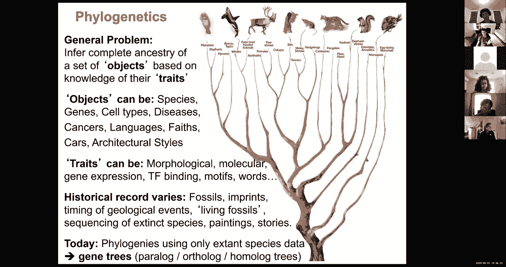

evolutionary models and phylogenomics，so that's the plan for the course lots，of modules ahead。

lots of material ahead uh tons of cool，knowledge，cool computational techniques cool。

biological applications and of course，an awesome final project experience that。

we're so excited to have you all be a，part of so thank you guys for listening。

sorry for running a little over，and then looking forward to uh seeing，you throughout the term and。

learning so much about you from your，videos from the forums you're filling。

out and from the mentoring sessions，then forming teams forming friendships，building projects。

and advancing human knowledge of human，disease。

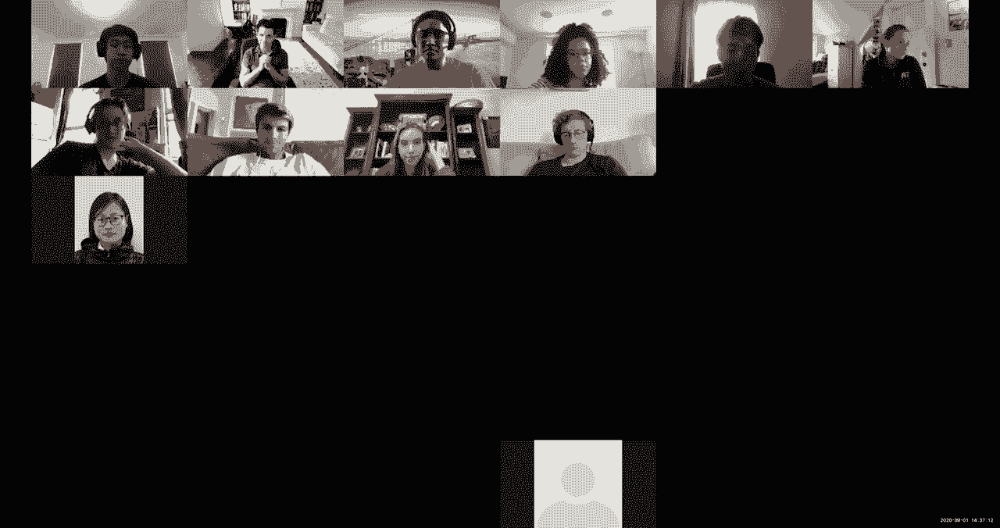

thanks everyone bye-bye。

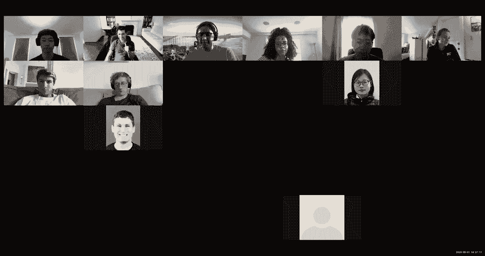

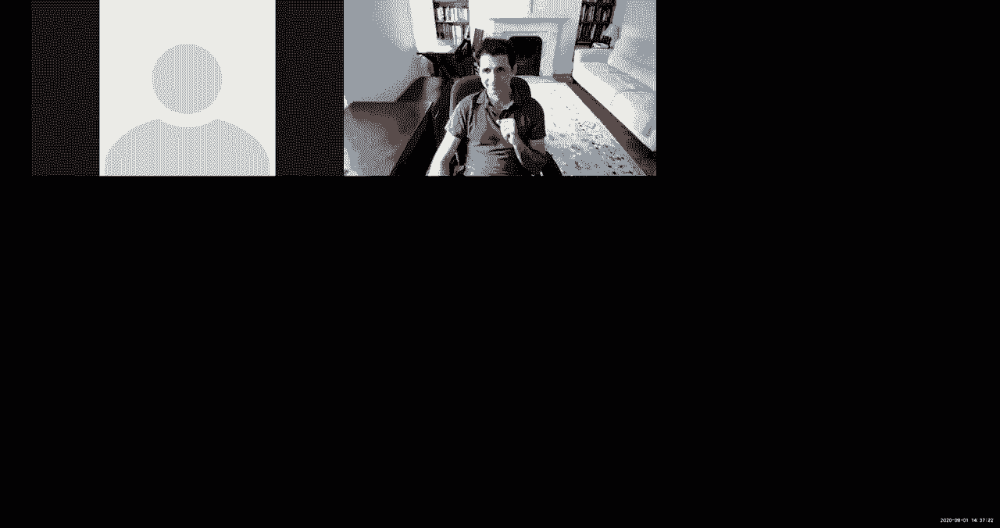