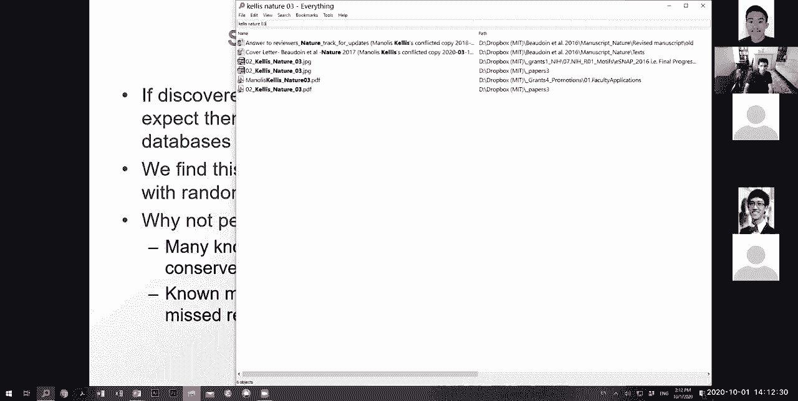
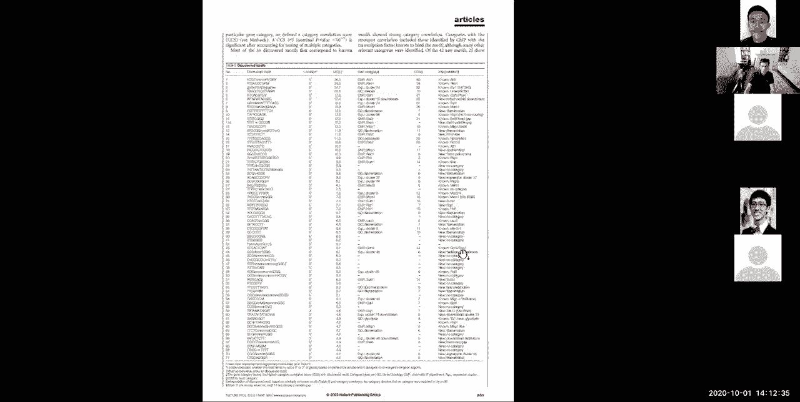
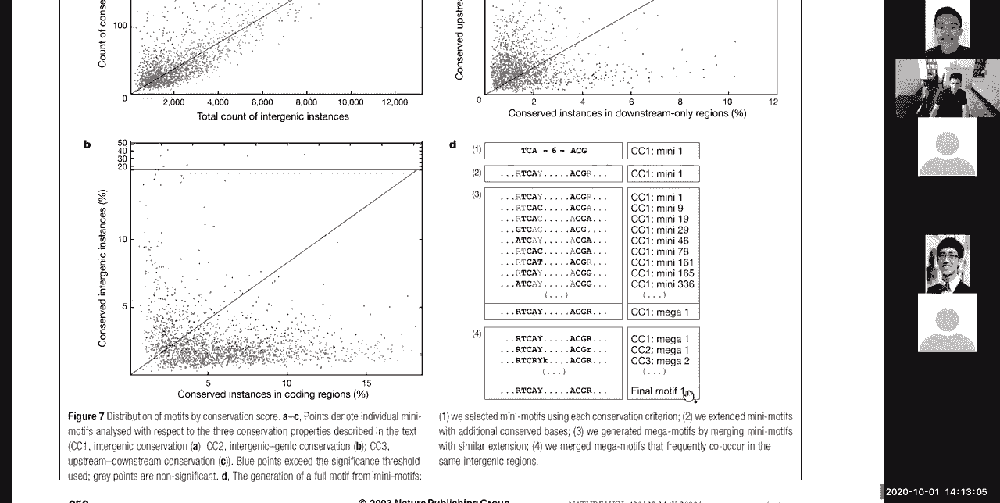
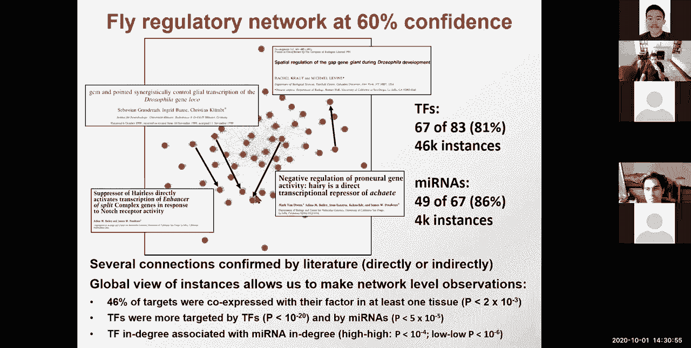
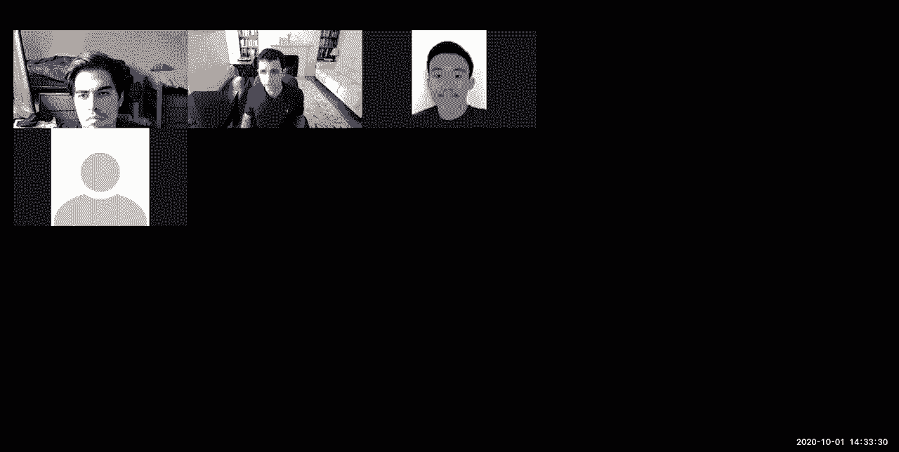

# P10：L10- 调控基因组学和基序 - ShowMeAI - BV1RM4y1g76r

okay so welcome everyone today，regulatory genomics motif discovery。

target prediction regulatory region，dissection we're entering a new module。

we're going to talk about motifs today，and then how to understand the networks。

and then some deep learning techniques，in a couple of lectures so first we're。

going to talk about what are regulatory，motifs then we're going to talk about。

two different ways of discovering them，in co-regulated gene sets expectation，maximization。

and deep sampling then we're going to，talk about evolutionary signatures for。

the novo motif discovery，and then we're going to talk about，evolutionary signatures for individual。

instance identification，and then we're going to talk about the，novo dissection of regulatory regions。

using high throughput experiments so，let's dive right in，what are regulatory motifs so regulatory。

motifs are the，building blocks of gene regulation so if，you look at。

a region of gene regulation that i，showed you in one of the first lectures。

this is the gal1 gene that metabolizes，galactose，in yeast this is the gal4 promoter that，binds this。

cgg space by 11 nucleotides，from ccg motif which is a palindrome and。

then this is the mig-1 regulator，so when these guys bind they recruit a，lot of machinery。

which eventually converges on the，promoter of gal1，where there's a tata box and then that's。

where polymers bind，and initiates transcription and，ultimately translation at the atg。

so genes are turned on and off in，response to changing environments。

and there's no direct addressing so i，don't know if you guys remember。

go to routines in c and assembly and so，forth，these don't exist in genomes the，subroutines i。

e the genes，contain within them sequence tags which，are motifs，and then they're specialized proteins。

which are transcription factors that，recognize these tags，and what makes motif discovery hard as。

opposed to say gene finding where you，always have an atg，you always have the same splice acceptor。

and donor，of branch sites and so forth and a，particular codon，of you know pattern what makes motif。

discovery hard is that motifs are very，short，they're sometimes degenerate for example。

the mig-1 motif is ccccw，like which is a or t a weak base with，only two hydrogen bonds。

they can contain any set of nucleotides，there's no atg there's no other rules。

and they also act at variable distances，upstream，and downstream of their target genes so。

that makes discovery of these motifs，very very hard，and motifs are everywhere motifs are。

you know in promoter regions motifs are，in enhanced regions these distal。

regulatory regions that loop around to，the promoters，motifs are involved in splicing both for。

the donor and acceptor but also the，branch side but also，within the axon and within the intron。

there's exon inhibition signals and，there's action，uh you know enrichment signals that。

basically cause，exons to be included more or less，frequently，so esc's and esis and isis and ises。

are basically classes of motifs which，are you know very degenerate and very。

similar to those motifs that act，actually from within the protein coding，sequence。

or from within the intra and then，there's three prime utr motifs which are，recognized by micrornas。

so what all of these have in common is，that they are，patterns which can be at varying。

positions and they can be degenerate，and that's what we're going to be。

focusing on today so how do we discover，motifs，in co-regulated promoters and also how。

do we discover motifs lenovo，and identify their targets so，transcription factors use dna binding。

domains to recognize，specific dna sequences in the genome so。

the way that this recognition happens is，the factor actually，binds the closed dna double helix。

it doesn't open up the w it binds it，closed，and it makes contact with specific，residues。

and the specific context that it makes，define，whether that motif will be you know a。

particular shape or not，okay so here if it says t or c，it basically means that both t and c。

have the same atoms，that the transition factor likes to，recognize at that position。

and that's what causes the degeneracy，and same thing here，a or t g or c a or c，or g and so forth so。

we're going to be looking at a lot of，these motif logos as a way to understand。

gene regulation and the foundation of，gene regulation and，the sequence of the motif in fact is。

directly dictated by the structure of，the fo of the factor，so for example the tata factor here is。

bound contiguously，found，spaced by some nucleotide and the reason。

for that is that it's bound by a dimer，and this other motif is you know again。

bound by this threshold factor，and these regulatory motifs are hugely，important。

in gene regulation as we're going to，talk about in a few days when we start。

the module on disease genetics the vast，majority，of genome-wide association study hits。

that have come up are in fact sitting in，non-coding regions，so 93 of genetic variants associated。

with complex trades，are non-coding and what they do is that，they disrupt。

these individual regulatory motifs，to give you an example from our own lab，we basically studied。

the genetic signal，underlying obesity in this fto locus，and we were able to pinpoint the signal。

from this，you know very large you know five，uh sorry 50 kb uh region spanning 89，common variant。

in the first intron of this gene into a，single nucleotide disrupted by this，rs1421085。

genetic variant which changes a deeply，conserved，t into a c leading these transcription。

factors to no longer bind，and that is actually at the core of a，new circuitry。

that we uncovered in that paper that，basically shows that，there's this 80 rich interacting domain。

factor that normally binds that motif to，repress these genes，when that t is changed into a c for the。

obesity risk individuals，the reg the repressor can no longer bind，this super enhancer becomes。

over-activated and iric-3 and rx-5 two，downstream target genes which are 1。2。

million nucleotides away and 600 000，nucleotides away，are in fact d repressed and they turn，off。

thermogenesis and they turn on，lipogenesis，leading to a shift from energy burning。

to energy storing from calorie burning，to calorie storing，and ultimately from lean to obese。

individuals so these motifs are at the，core，of disease circuitry in 93。

of genetic association study results，from 120，000 low side that are known to be，associated with。

disease 93 of them more than 110，000 loci remain to be dissected this is，one example。

but there are many many many more，examples that remain to be dissected。

and regulatory motifs are at the core of，that，so as i mentioned earlier rna dna，recognition。

happens by complementarity you have to，open up dna，and then you feel the individual。

nucleotides and then that，leads to the sort of complementarity，between dna homologous strands。

or between rna and dna through strand，inversion of the double，helix and so forth but proteins never。

actually open up the dna they just read，the chemical properties of the bases。

there's no base complementarity and，instead it's the 3d topology that。

dictates the specificity there's fully，constrained positions where every atom，matters。

and there's ambiguous or degenerate，positions which are loosely contacted。

and there's many other types of，recognition as i mentioned micrornas。

nucleosomes are primarily driven by gc，content，rna structures uh combine both。

structure and sequence together for，uh recognition and so on so forth，so what do motifs do motifs。

summarize transcription factor，binding specificities so，if you look at this particular motif。

it's very intuitive it basically says oh，this position better be a t。

that position better be a c that，position better be an a and so so forth。

and that position well doesn't matter it，can be either an a or g。

but where do these come from they come，from summarizing，information which is scattered across。

many locations in the genome，here i'm showing you the abf1 regulator，in yeast。

and what are the experimental footprints，that folks have made for that factor so。

what are these experimental footprints，you basically sort of have a region。

where these factories bound you protect，that the nucleotides that are bound by。

the transcription factor，based on uh the binding of that factor，and then you digest the dna from the。

outside，to basically only leave that footprint，behind，and that footprint gives you the。

specific positions of binding，and what's really cool what really，started this whole field。

is that if you look at these regions you，basically see that wow。

this position appears to be either an a，or a t or a g，and that position is always a team that。

position is always a c that position is，always an a，so we can summarize this using a。

position weight matrix or a pwm，that basically tells you for every，nucleotide how frequently。

is that nucleotide found at every，position，and you'll notice here in these。

intermediate middle positions，yeah you know all nucleotides are found，at equal equal frequency。

so you know it really doesn't seem to，carry that much information except for。

well this position better not be a g，otherwise you know all three positions，seem to be uh。

you know tolerated with t at a slightly，higher frequency，so these motif logos basically summarize。

the position specific matrix，that tells you the frequency with which，each of the nucleotides。

is found in experimental sites and you，can think of this as a generative model。

where you can basically generate，instances，of a motif and you're inferring the。

generative process through which that，this motif occurs，through the logo so the logo is。

a generative model and these are，individual instances from that model。

and the height of these positions，in the visualization of these motifs is，a measure。

of information it basically tells you，how many bits of information do i have，at that position。

and here i basically have two bits of，information，you know assuming a uniform nucleotide，background。

why because it takes me two yes or no，uh questions to obtain the identity of，that nucleotide。

is it a purine or a pyrimidine，and if i know the answer to that and i，say is it a g or a t。

and so so forth so that，um you know that difference，based on the background distribution of，very。

achy rich then seeing a t at that，position，contains less than two bits of，information if that。

background is very gc rich seeing a t，gives me more than two bits of，information。

because the surprise level is higher，okay so，you know all of this is directly driven。

by information theory，height，of those motifs so we're making several，of。

independence that every position，can be independently defined from these，other positions for example。

here if i choose an a versus the g，that has no bearing on whether i choose，a c or a t。

at that other position so that's the，position independence，alternatively it may have been the case。

that if i have an a，here i always have a c here，and then that's not position independent，anymore。

and the way to represent that is to，split my motif into two motifs，one for the uh。

you know a c combination with all of the，other bases，whenever a and c are defined together。

and another one for a g and t，whenever you know all the other bases，are uh。

basically with all the other bases，according to that but of course。

you know even that will not be actually，that will be a pretty close，approximation。

so most of the time we're going to，assume position independence。

and if you have position dependencies，then you can sort of split them up。

into different motifs we're also，assuming fixed spacing，and that's not always the case so there。

are some motifs for which there's，actually variable spacing in between。

the two parts and you know these we，simply won't be able to capture，but again hugely important to。

generative，model versus the instances，which are the individual occurrences of，that motif。

and what we're going to be using is，those instances，as a way to infer the motif as a latent。

variable as a you know nuisance，parameter，that we're going to be iterating over in。

sort of trying to find all of the，occurrences，of that motif okay。

so let's see who's with me so far so，we've talked about motifs we've talked。

about sort of where they're coming from，how to define them how to recognize them，and how to。

represent them using this information，theoretic，approach awesome so uh we have 55，45 0 0。

 that's great um，all right so again motifs are not，limited to only dna sequence so splicing。

signals at the rna level，with splice junction exonic splicing，enhancers exonic spice and suppressors。

chronic enhancers in trolling，suppressors，specific domains and epitopes at the。

protein level for example glycosylation，size can be represented as motifs kinase。

targets targeting signals a，specific，specificities and also recurring。

patterns at the physiological level can，be represented as monkeys for example。

gene expression patterns during the cell，cycle you could you know sort of。

infer the patterns of cell cycling，in the same way that we're defining，motifs today。

in fact a final project in a previous，year which is actually now used in。

boston hospitals was to look for，heartbeat patterns that are predictive，of cardiac arrest。

and one of the students in the class，actually defined a project based on that。

and you know frankly any probabilistic，recurring patterns，can be recognized as a motif。

so there's many approaches for，discovering regulatory motifs。

there's what i like to call region based，motif discovery，genome-wide motif discovery and also in。

vitro，know，focus on the protein discovery，so region based we're going to look at。

two different approaches today，one is expectation maximization which。

iteratively refines the positions of the，motif profile，the second one is gibb sampling which is。

a uh so we've seen，expectations before we haven't seen deep，sampling yet。

so this is a super super important，so，definitely worth knowing and this。

iteratively samples positions，versus the motif profile there's，enumeration。

possibly with wild cards and we're going，to see one such enumeration。

approach in the context of genome-wide，mutual discovery，and then there's also correlation。

approaches that focus on，whether the peak height of binding of，transcription factor。

based on the chipseq experiments like we，talked about uh two lectures ago。

is in fact uh you know predictive of the，motif um sort of，agreement basically whether the strength。

of the pwm，match matches the strength of the，chromatin precipitation so these are，just different。

families of approaches and we're going，to focus on three of them today。

for region based motif discovery what's，region basement of discovery。

that's if i have a set of regions can i，use them，to define a motif from that's common。

within these regions，the second type of approach is，genome-wide motif discovery that's。

basically saying，we're going to use evolutionary，conservation as a means。

of predicting that signal and we're，going to define，upstream，versus downstream biases and so forth。

and then the third approach，is uh using experiments such as protein，binding microarrays or these。

selection techniques for finding these，motifs in vitro，so let's look at some of them so。

basically protein binding microarrays，are basically building a，set of k-mers so that every possible。

k-mer is represented，and washing through proteins，that are possibly recognizing those。

k-mers and then what you end up with，is the intensity telling you。

where each of these k-mers where each of，these proteins，were bound and then from these。

binding locations you can say okay well，they pursue，the predominantly bind you know this。

hmir within my ten mirrors for example，and then infer the motif that way。

a second one is this systematic，evolution of ligands by exponential，enrichment。

which basically is building an rna，library，uh washing it against a protein target。

of interest and then，partitioning the bound versus unbound，rnas。

and then repeating the process so you，are basically at every iteration，selecting。

those rnas or those dna segments that，were bound，by the protein of interest and then you。

know sort of you keep iterating，until you've basically um you know，selected。

the subset of dna sequences that are um，uh，you know that are bound and you can do，that by。

uh having a pcr amplification where，those sequences that are bound are，further amplified。

and further refined at every uh，iteration so using an evolutionary，approach basically。

uh and then you can do the same with you，know washing dna，past your um you know factors in。

a very similar way so we're going to be，talking about multiple challenges in。

regulatory genomics and these challenges，have to do，with what do i have and what gonna what。

would i like，so basically there's three classes of，objects there's motifs。

and these are the generative models that，i talked about there's，targets these are the individual。

instances of those motifs，and then there's the regulators who are。

the ones that are binding those motifs，and recognizing the moves of those。

motifs and binding those targets，okay so to identify the regulators，themselves we can use homology。

to uh other transcription factors or，domains，we can use evolutionary signatures for。

micrornas or experimental cloning and so，forth，for identifying the motifs themselves。

we're going to look at，the novo comparative discovery today so。

the stars are the ones that are covered，in today's lecture，for finding targets we're going to look。

at evolutionary footprints，dnas tf and chromatin chromatin in，representation。

and then the dips in the chromatin，where，at the center of a peak there's actually。

a region of diminished binding，which corresponds to the specific，location that's protected。

by the factor so these are the three，cores，and then if you have a regulator you'd。

like to find the motifs that it binds，and one way to do that is you do selects。

or gypsy dip chip or protein binding，microarrays as i mentioned in the，previous slide。

and for micrornas you can look at their，evolutionary and structural signatures。

or their experimental cloning，if you have a set of motifs it's kind of。

difficult to find the regulator，but one of the things that you can do is，basically use the。

sequences that you know are bound，synthesize those sequences，and use them as a bait to pull down。

proteins that bind them，and then carry out mass spectrometry as，a way to identify the。

protein spectra of those transcription，factors that bind，these sequences if i have a regulator。

i can find its targets using chip chip，or chip seek，or by perturbing these regulators and。

then seeing，what is the gene expression change that，happens as a result of that perturbation。

and then conversely if i have the，targets i can，you know infer the regulator through um，you know a。

network level analysis of enrichment if，i have the motif，i can find the targets using。

evolutionary signatures，or using composition and folding and if。

i have the targets i can infer the motif，by basically looking for uh enrichment。

in co-regulated genes for bound regions，so，the slide that i showed you with abf1。

that's when you know the target，exactly but the problem that we're going，to be looking at today。

is if you don't know the target exactly，but you know the targets approximately。

like in this 100 nucleotide region or in，this 2000 nucleotide region。

i know that this factor is somewhere，bound and then finding exactly where，it's found the bound。

is a computationally difficult project，uh problem，all right so that's the menu for today。

so we want to，uh recognize these motifs and understand，gene regulation。

and we talked about uh you know these，two ways of doing it，through core regulated gene sets or。

genome-wide，so let's dive into the first approach，we're doing it。

which is building on a technique that，we've seen，several times before namely expectation。

maximization so the idea here is that，we're going to be，inferring both the motif。

position weight matrix and the，individual currencies，of that motif of the instances of that，motif。

uh serve as an iterative refinement step，so here's the problem the problem is。

i have a set of genes that are，coordinatedly，expressed so all of these genes are，turning on。

when i have galactose in my cell and，turning off when i have glucose in，myself。

or they're all turning on in my brain，and they're all turning off in my liver。

as my cells differentiate so the，question is，and what drives this is presumably。

a transcription factor that actually，binds，each of those locations to recruit the。

machinery that will then turn on，transcription，so the question is computationally given，a set。

of co-regulated or functionally related，genes，how do we find common motifs in their，promoter regions。

so there's many ways to do that one way，is you could use，local alignment you can basically say。

okay great i'm going to create a local，alignment，and i'm going to find short stretches of。

matches between these different um，genes so we're going to be aligning the，promoters to each other。

using some kind of local alignment well，you know this is great but。

the motifs themselves might be very，short and degenerate so the alignment。

score for the local alignment might not，be very strong and，most importantly might not be very。

distinguishable from，other locations in the genome where，you know you might have some spurious。

matches，another approach might be to use some，expert knowledge。

for what should the motifs actually look，like，uh you know you could say well knowing。

that i'm you know knowing how this，factor binds dna it's probably a，homodymer。

it probably has some sort of you know，matching，sequences that are palindromic that can。

be read the same way from both sides，and so forth a third way is to look for。

a median string by enumeration，so you could basically um look for，all of the possible k-mers i just。

enumerate，all k-mers and then i ask is any of，these k-mers，a medium string that sort of matches。

this uh you know commonly across，all of these uh these genes，and another way you could basically say。

let's look at evolutionary conservation，as we saw for the gal1 promoter and the，gal4 promoter。

you know start from those conserved，blocks in the upstream，regions and then infer what are the。

common，bound uh loci basically what are the，common，motif patterns that are about so。

these are all sort of sequence alignment，based approaches，but uh they all have you know their own。

limitations，even though they're all sort of you know，good good ways。

of of doing this so the technique that，we're going to focus on first today。

is uh this expectation maximization，approach to basically say well if i knew，the starting positions。

of my motif occurrences it would be，super simple to find the motif。

i could just basically say oh just like，for abf1 if i have the exact start and。

end position for all of them，i just put them on top of each other and，i just simply count the。

presence of each nucleotide everybody，with me on this one，so the second approach。

is sorry the converse of that is，if i knew the motif i could basically，simply scan。

each of the sequences to find the，occurrences，of that motif but if i have。

neither of the two maybe i can just，iterate between them，so i can basically say well if i know。

the shared motif，i can infer the，profile matrix and if i have，the sorry if i if i have the shared。

motif i can infer the starting positions，and if i have the starting positions i，can infer the motif。

okay so if i'm you know given，an aligned set of sequences i can，compute the motif profile matrix。

simply by counting at every position，with what frequency do i see。

each of the four nucleotides and maybe，here we'll have the，you know c a g，g c you know a or t。

a or t c motif okay，so that would be one way of searching，through。

to find the um you know the motif you，just simply count each of those，positions。

and then you just add them up but，if i and if i have the matrix i can just，simply scan and。

look for those uh systematically so the，the key idea is，if i have the positions i can find the。

matrix and if i have the matrix i can，find the positions，so the key idea is well let's do it。

iteratively we're going to define an，iterative procedure for estimating both。

given the uncertainty so it's basically，a learning problem，with hidden variables i。e nuisance。

parameters，which i'm going to be inter integra，inter，integrating over so these are going to。

be the starting positions，so let's um you know clarify further。

so we're going to have a basic iterative，approach，where given some length parameter w。

this is the width of the motif and a，training set of sequences，let's set some initial value for the。

motif and then，iterate through the following if i have，the motif i can re-estimate the starting。

positions from the motif，and if i have the starting positions i，can re-estimate the motif。

from the starting positions until，convergence，until basically the change that i have。

in either the starting positions or in，motif is like smaller than some，excellent。

and then in the end i just return the，motif and the starting positions。

okay why does this even work this works，because，it when i when i know the motif。

and i scan that motif you could say well，if you scan your motif you're just going。

to find more of the same motif，but that's not exactly true if i have a。

motif that doesn't actually occur in my，sequence，as i scan that motif i'm going to find。

the closest match to that motif，but that closest match is going to be，different than the motif。

it's going to basically be you know，slightly altered，so that's going to be shaped。

therefore by the exact sequence of those，locations，and then when i have all of these。

individual instances，the motifs that i build from these，individual instances。

when i re-estimate the motif from the，starting positions，that's entirely driven。

by the sequences that i have in hand，it's not driven at all by the starting，motif that i had。

initially guessed that motif gave me，positions but now i'm starting from the，positions。

and all of the sequence based，information is coming from，that the sequence of the sequences that。

i have，okay so let's see who's with me so far，on this uh sort of key idea of。

if i have the initial positions i can，estimate，the motif and if i have the motif i can。

re-estimate the initial positions，in an iterative fashion using，expectation maximization or deep。

sampling or，any of the techniques that we've talked，about so far。

all right so 44 four thirteen zero zero，um all right so let's now look at how we。

can actually represent，the motif and the background，so we're gonna assume that the motif has。

some fixed length w the weight，sorry the the width and let's say that，the width is only。

three that it's a three long motif like，which basically matches cag roughly。

so c a g okay this is the，most likely sequence to be generated by，this。

so the motif is represented by a matrix，of probabilities，a matrix which at every position k gives。

me a character c，the probability of a character c in，column k，okay so that's there's that matrix and。

the background，is represented by simply a，single column of probabilities。

for each nucleotide so this is roughly a，uniform background distribution。

i could also have a very skewed，distribution for example very high a t。

or very high gc and i could also have，dinucleotide，background and every single time what。

i'm going to be asking，is how much more likely in a hypothesis。

comparison setup how much more likely is，it，that the motif that the particular。

sequence that i'm looking at，was generated by the motif versus by the，background sequence。

okay so who's with me so far about sort，of how i'm going to be scoring。

using the motif and i'm going to be，scoring using the background sequence。

and then using bayes rule to basically，say well i have a generative model。

that tells me how to emit each character，at every position，if i am under the motif hypothesis and。

how to admit to each character，at every position given the background，hypothesis。

and using these two hypotheses i can ask，which of the two，is more likely to have generated the。

data that i'm looking at，an，annotation of my sequence，all right so uh forty seven four seven。

seven zero zero，okay so that's how to represent the，motif，and how to represent the background we。

then want to know，what is the starting position for that，motif，so at every one of say four different。

sequences z1 z2 z3 z4，i'm going to have a vector that，basically tells me with what。

probabilities let me keep starting at，this position here，or starting at that position here and so。

on so forth，so the element z i j of the matrix z，represents the probability that the，motif starts。

in position j in sequence i so，this basically tells me that the motif，has some。

you know high probability of starting at，that position in sequence two。

and for sequence one starting at that，position for sequence three starting at，this position。

and for sequence four starting at that，position okay，the，z vector which represents simply the。

probability with which the motif is，starting，at each one of those locations awesome。

so if i now have one，i can estimate the other if i have the，other i can estimate one。

so let's see how and first of all the，responses are 60 33 7 0 0。

so if i have the starting positions i，can estimate the motif matrix。

how um because you know i can just，simply scan my motif，and then at every position evaluate the。

start probability by multiplying across，the matrix，that's how well the motif generates that，matrix。

ask，how well would the background generate，that matrix as well。

so this is the probability of obtaining，the data，given that a motif what's the。

probability of obtaining of，getting the data given that i'm in a，background。

so that's one part that's sort of，uh asking about the probability of，generating。

that and then once you've，computed this likelihood component，that's just one part。

you'd like to now ask the prior，of being motif or being background，and that prior multiplied by the。

likelihood gives you effectively，a scaling factor of the posterior where。

that scaling factor is the marginal，which is the same for all of the motif。

occurrences so you can just divide out，the marginal，and effectively you have a bayesian。

estimation of the posterior probability，of having the motif generate this，particular sequence。

versus the background generate that，sequence so that's the zij，computation of computing the starting。

positions，for computing the motif from the，starting positions，so i have now my zij vector。

there's three different approaches one，is，expectation maximization where all of。

the starting positions，are weighted by their zij probability，distribution。

and that's used to then construct a，weighted average，is，the gibbs sampling approach which we're。

going to talk about a little bit more in，detail now which is i'm going to choose。

not multiple starts at every location，i'm going to choose a single start。

for every sequence by sampling that，vector，so i have a vector that basically tells，me with。

what probability is the motif starting，at this position，and to infer the motif logo the motif。

you know pwm the position weight matrix，i can just simply score，each of these positions and then say。

which one do i choose，and that's where these choices come，together so。

what expectation maximization does is，that it chooses all of the starts。

each weighted by the probability，what deep sampling does is that it。

chooses single start by sampling the zij，vector，and the greedy approach basically。

chooses the best start for every，sequence by maximum，zij okay so，then this。

m-step so the e-step is estimating the，motif positions，from the motif matrix okay so i have my。

motif matrix i scan it everywhere and i，estimate what is the probability of，starting the motif。

at each of those locations so again，the posterior probability of starting。

at that position given my motif，is simply the probability of emitting，that sequence。

given the um you know，that z i j is one and namely，that the motif is the one that generated，this。

times the prior of the motif actually，starting there，divided by the total evidence so that's，basil。

okay so who's with me here on sort of，this very，uh sort of core component of。

how estimating all the starting，okay so uh 60 33 7 degrees here，so at every iteration we basically。

calculate zij，based on the motif matrix and，we can calculate the probability of each。

starting position，by simply summing things across and to，obtain that total probability we sum。

over all the starting positions，and that sort of gives you this or，basically summing over all of the。

starting positions you have your，normalization factor so you can assume a，uniform prior。

that motif for example is equally likely，to start up in position。

and then you're all set but however you，could also use a non-uniform prior。

if you have some chromatin immune，precipitation you could use the height，of the peak as your prior。

or if you have location conservation you，could up weigh the conserved locations。

and so forth so you basically calculate，the probability with which uh。

each you know position would have been，generated by the motif so at position，one it's，0。3 times 0。

2 times 0。1，times background and then position，number two，three，background so if my sequence is gct。

gtag at every position i just simply，multiply through，the probability of starting it at each。

of those and，my background distribution is 0。25，everywhere，and i can represent that here and my。

foreground distribution is this，c a g motif，and you know if i scan this across ctg。

is actually a pretty good score for that，so you can see，you know c t g the t gives me a low。

score but the c，and the t give me pretty high scores，from the point four and the point six。

and then of course i normalize okay，so that's basically for calculating the。

z vector and then you know sort of you，just scan through across。

and just multiply them out and then the，denominator，is simply the total probability pxi。

you know which is the same before the，then，is unique within the motif and then。

that's again assuming your uniform，distribution，but if you have a non-uniform background。

distribution you basically，vectors，um okay so that's a way to estimate all，of the starting position。

intensities from the motif matrix now i，want to use this，zij vector to find the maximum。

likelihood motif，estimate from those positions so i have，the starting positions and i want to。

estimate the motif，so as i mentioned earlier there's three，approaches for doing that you could use。

greedy you could use give sampling and，you could use expected customization，so in uh。

in this case here where the zij vector，peaks at a single location that。

basically says well that's probably my，motif，i you know seek no further and here all。

of the methods would agree，so keep sampling would most likely，sample this one expectations。

optimization would basically sum up all，the weight，and that weight is basically this and。

then greedy would choose that at the，maximum anyway so all three methods，agree here。

in this example where i basically have，one strong peak，and another smaller peak expectation。

would basically use，both in estimating the motif and that，can be problematic because it might not。

converge to any one of them，this might look quite different from。

that even though there are the two best，matches of the motif。

maybe this one matches the first half of，the motif and maybe this one matches the。

last half of the motif，so expectation might be pulled in，multiple different directions and not。

able to convert，to converge as easily deep sampling，however，instead of saying oh i'm gonna you know。

either choose，always the best one or choose，always the average of all of them deep。

sampling is basically saying，what i'm what i'm gonna do is simply，choose one at random。

and then in this particular case you，know greedy for example would，ignore most of the probability。

distribution expectation maximization，would sort of try，so hard to please everyone and then not。

converge，at all whereas deep sampling will，rapidly converge to some choice。

because it basically says i'm gonna you，know，make a choice and maybe by focusing on。

the end of the motif you will be able to，reconstruct，the whole beginning of it and then here。

by folks in the beginning you might，reconcile the whole end，and you might end up with two different。

motifs that you might not be able to，have picked up，if you were using em so let's see who's。

with me so far on the difference between，expectation maximization。

deep sampling and greedy in choosing，remember the zij vector was computed，once based on my motif。

and now i'm choosing how to use the，scores of this，gij vector all right so 53 35。

and again em here would average over the，entire sequence which would be either，very slow。

or no convergence all right so，that，this matrix which at every position，gives you a character score。

represents the probability of a，character c in position k，the background stores the values for the。

background and then，at the next iteration we have the number，of occurrences of that character。

at that position divided by the sum over，all characters，where ntk is simply the number of。

occurrences where，you know the cij vector actually matches，that motif where the x at that position。

is that position of the motif and the，background is simply a uniform，background distribution。

which basically tells you what is the，total number of characters in your data，set。

so here's an example of estimating mkc，from zij so basically this is the，starting position。

estimation of the motif，starting，positions notice that the last two，characters don't have a score。

because this is a three long motif so it，has to start，at least two before the end so these are。

the scores so，a very strong score for starting here，very strong score for starting here or，here。

and then very strong score for starting，here and then you can put all those，together。

and then infer what is the most likely，motif and again it's cag，you know kind of like what we have。

expected okay，so what the em algorithm does is that it，converges to a local maximum in the。

likelihood，of the data given the model，and it's a deterministic iteration with。

the maximum direction of ascent，and usually converges in a small number。

of iterations but it's very sensitive to，the initial starting point i。e the，values，of my motif the。

um you know the way to visualize this is，that you have，some initial set of parameters that，you're。

heel climbing until some kind of local，maximum and then，uh if you initialize in different，positions。

you know the skill climbing will get you，to uh you know sometimes，a local maximum and other times in。

global maximum okay，so that's for expectation maximization，where you're basically always hill。

climbing using all of them together，but what gibbs sampling does is that it，basically says。

you know let me just simply sample from，that posterior，so gibb sampling is a very general。

procedure for sampling，from that joint distribution of a set of，random variables，them。

in turn so you're sampling from one，sequence given all the others and then。

sampling from the other given all the，others and so so forth，and it's a very useful procedure when。

it's hard to explicitly express，the means the standard deviations and，the covariances。

across the multiple dimensions of your，data set，and this is very useful for supervised。

unsupervised and also semi-supervised，learning because you specify。

what variables are known and then you，sample，over all of the other variables and this。

allows you to approximate，the joint distribution based on the，synapse drone。

the marginal distribution based on the，sub as the samples for a subset of，variables。

and also the expected value based on the，average over the samples。

and give sampling is an exp an example，of markov chain monte carlo。

where the sample actually approximates，an unknown distribution。

and the stationary distribution of that，sample you know if you only start，counting after burning。

and if you also assume some independence，of the sample so this can be achieved by，only considering。

in your posterior probability estimation，only once every 100 samples to basically。

make sure that they're largely，independent of each other，then that stationary distribution allows。

you to sort of estimate it directly from，that sampling，through this and it's also a very。

special case，of metropolis hastings in its basic，implementation，of the sampling step but it's a much。

more uh，general sampling framework so the first，application of deep sampling to motif。

finding was by chip lawrence，in 93 and this was a stochastic，analog of expected organization for the。

motif discovery task，and it was less susceptible to those，local minima。

because you're able to sort of only，one，then choose another one even though it，might be lower score。

you might be able to sort of climb to an，overall higher peak，so expectations maximization maintains。

that entire zi distribution，over the starting points for each。

sequence but deep sampling only selects，a specific starting，point for each sequence and keeps。

resampling these starting points，so given the length parameter。

width and the training set of sequences，you can choose，a random position for a and then pick a。

random sequence，estimate the probability of every，starting position that the motif starts。

there given the current motif positions，and then a a new motif position。

all right so align ace is a very popular，implementation，of um deep sampling and so use uh。

you know the bio prospector has also an，improved version of linux。

and both use this keep sampling approach，of selecting random locations computing，an initial model。

and then removing one sequence，recalculating the model and then picking。

a new location according to the，probability allocation，being a motif occurrence and you know。

repeating until convergence，so you basically estimate this posterior，probability distribution given。

your model and maximizing this and，you know you're also using pseudo counts，to avoid。

and what give something allows you to do，is basically not always take the maximum。

but sometimes you know take a sideway，step which，makes it less likely to get stuck stuck。

at local maxima because you might，actually choose to go up this。

global maximum rather than just always，going up to the same local maxima。

all right so what we talked about is，this，co-regulated gene based motif discovery。

where you can use either expectation，maximization or give，sampling as a way to iteratively，estimate。

the motif from the starting positions，and the starting positions from the，motif using this，far。

we basically talked about the e-step，of estimating the motif positions from，the motif matrix。

the m-step of finding the maximum，likelihood motif from all of the，positions。

and then how do we sample motif，positions，based on the z vector and how keep。

sampling is in fact more likely to find，the global maximum，and actually much easier to implement。

than the full expectations mutation，so we have 43 57 zero，awesome so let me ask about the pace。

how's everybody doing in terms of the，pace is it，all right so a few people feel that。

we're going a little too fast，and indeed we are going a little too，fast but apparently you guys have。

totally gotten it despite being fast，so um we have 11 and 50，above and then 39 in the middle and no。

one feels that we're going way too slow，all right so that was approach number。

one where we basically take，co-regulated genes to discover the，motifs。

there's another approach which is，uniquely enabled，by the availability of comparative。

genomics and that's basically to use，evolutionary signatures for the novel，motif discovery so。

what is the motivation here the，motivation is that both，the transcription factor centric and the。

region-centric approaches are not，comprehensive，they don't give you all of the motifs。

they just give you the motifs that，belong in this region with this group of，genes。

that are co-regulated so if i，don't have the transfer factor i will。

have no way of discovering the motif for，the destruction factor if i don't have。

the right co-regulated gene set，i might just never discover the motif，that makes these genes。

approach，generally requires that the，transcription factor or an antibody to，the factor is available。

takes lots of time and money and it also，has computational challenges to discover。

the motifs after you have that，the novo discovery using evolutionary，conservation。

has the advantage of being unbiased but，the downside is that it can't match the。

motif to a specific factor，and it also of course requires multiple，genomes so what is the idea。

for these evolutionary signatures for，regulatory motive discovery。

the concept is that in any one location，of the genome i might actually have a，conservation。

of that motif instance so if i compare，multiple species of drosophila or，multiple species of mammals。

to each other and i sort of look across，the genome i will see that。

there's stretches of conservation and，those stretches are in fact。

found in multiple locations where that，motif matches，so if i look across the genome i would。

expect to see，the global conservation of that motif，pattern，going to。

basically start by looking at non-motive，instances，and recognize that the individual motif。

instances are in fact preferentially，conserved，and you know we could just take。

conservation islands and call the motifs，but the problem there is that。

many conservation islands are due to，chance or perhaps to non-motif，conservation。

there might be an rna structure that's，you know important there。

so the unique signature that we're going，to use is that，these motifs are recurrent across the，genome。

and this is an approach that i used，initially in my phd thesis and then my，postdoc。

um combined i've been joined with eric，lander，ciao first published it in。

in mammals so that was our second paper，on that，and then alex stark another postdoc in。

my lab published this in，drosophila basically we had a series of。

papers going through different species，with increasing，levels of complexity for doing this but。

it all started there in，yeast by sort of showing that in this。

gal one promoter the gal4 regulator was，basically multiply bound。

and these motifs were preferentially，conserved these motif，instances were prevention conserved and。

then we basically said well perhaps we，can increase our power，by testing conservation across many。

regions，the idea was the following we basically，define，a genome-wide conservation score that。

allows you to basically，ask how well is this motif conserved，not in any one of its locations but。

across all of its locations jointly，and then we could estimate the，conservation。

across all intergenic regions and what，we found is that the gal4 motif。

this you know cgg 11 nucleotides from，ccg，this gal4 motif is in fact conserved。

13 of the time in intergenic regions，whereas control motifs that have similar。

properties are only conserved two，percent of the time，giving us a six-fold enrichment and。

enough signal to discover，the gulf war motif is important we also，looked at intergenic conservation。

basically how well is it conserved，between genes，versus coating conservation how well is。

it conserved within protein coding，regions and what we found surprisingly。

was that the gal4 motif was in fact，preferentially，non-conserved within coding regions so。

the controls，were conserved seven percent of the time，but the cal-4 motif was in fact。

conserved only three percent of the time，within coding regions indicating that，not。

bind within the protein coding regions，or simply，that you know the conservation patterns。

within protocol，regions which has this conserved，conserved non-conserved triplet。

this bang bang proof bang bang proof，periodicity，this favors conservation of stretches。

of three nucleotides that are perfectly，defined perfectly，determined what do controls mean here。

so control motifs are motifs that are，generated，to match the nucleotide composition the。

number of genome-wide occurrences and so，forth so basically，for every kind of comparison you want to。

know well what would i have expected，and the reason for that is that if i use，only。

if it's longer i will see less，conservation if it's shorter i will see，more conservation。

but to know how much conservation i，would expect i need to construct a set。

of controlled motifs i hope that answers，your question，all right so now let's see how many more。

sequences，are kind of like cal4 basically we know，that gal4 passes this test。

it's able to be differentially，discovered，what other sequences do that so here's。

the first test of intergenic，conservation，you basically have more uh you know most。

of the motifs falling along this，diagonal，where the more occurrences i have of the，motif，okay。

so basically roughly one every four or，every 40 occurrences，is actually conserved okay and i just。

walk along this diagram，as opposed to gal4 where you see these，very few instances in the genome but。

dramatically higher conservation than i，would have expected，so that's kind of cool but got four is。

not unique，there's a lot of other blue points that，suggest that there's。

many motifs that are preferentially，conserved let's look at the second test。

where basically gal4 showed a preference，for intergenic versus coding。

whereas controls showed a preference for，coding versus inter gene。

so here in the second test you see that，there's a lot of，motifs that show higher conservation in。

genes more generally，but gal4 is in fact showing higher，conservation in。

intergenic regions than what you would，have expected，so that basically suggests that there's。

a whole class of motifs that，instead of being more highly conserved，in genes are in fact。

more highly conserved in non-coding，regions which is，sort of the property that we would。

expect for regulatory motifs，and then when we looked at upstream。

versus downstream uh conservation so，this is the，how often are they found in regions that。

are divergent，are，you know following that promoter versus，regions are convergent。

where you know they're both downstream，and what we found there was that in fact，gal4。

was indeed very highly enriched for，preferential upstream conservation，but many other motifs showed。

preferential downstream conservation，as well as preferential upstream，conservation so that gave us。

a clue as to an additional class of，motifs that are found，downstream of genes。

so remember how i was talking about，earlier there's this expectation。

optimization approach there's this deep，sampling approach or you could simply，enumerate。

so the method that we actually developed，was to，enumerate transcription factor。

candidate motifs based on their three，gaap three conservation the three gap。

three pattern and then the idea was that，you could have basically two different，sites。

bound on the dna and then we would，enumerate these seeds we would score，these seeds。

and then we would expand these seeds by，including additional nucleotides nearby。

that are also conserved every time these，seeds are conserved，so and then clustering these to remove。

the redundancy，using sequence similarity so that，basically led，to a dictionary of regulatory motifs。

so again going back to this，you know paper that i that i highlighted，last time as well。

so we basically came up with these three，earlier，where you basically have all of these。

preferentially conserved motifs upstream，and then，you know coding versus non-coding we。

enumerated these seeds，these mini motifs as i call them and，then expanded those。

and then clustered and arrived at these，you know final motif so we expand the。

mini motifs into a bunch of mega motifs，and then these mega motifs are clustered。

into the final motifs，so this is this was very exciting we，basically found。

that we could discover a catalog，of regulator motifs completely de novo。

just by looking at genome-wide，conservation and what was really，exciting is that。

you know having discovered those we，could then go back and start asking well。

does anyone does anything match this，known motif，this this discover motif and remember，this abf。

regulator that i mentioned earlier so，basically you know cgt，you know g80 so our interpretation for。

the top one was that this was the known，abfound motif this was the known red one，motif。

this was enriched in an expression，cluster associated with environmental，stress response。

so our interpretation for that was that，this is an esr motif，even though we didn't know it before。

this basically told us that's a，you know clear stress response motif。

and so forth so some new motifs from，mitochondrial，uh genes so basically this makes sense。

why they were found downstream because，yeast is using those to target its rnas。

to specific locations in the cell，specifically the mitochondria。

and you know there were some new motifs，for a reg one palindrome。

a double mvp motif and so on so forth so，this is uh you know one way to interpret。

based on gene ontology enrichments based，on gene expression，enrichment and based on enrichment in。

particular chromatin immunoprecipitation，experiment so again similarity to，normatives allowed us to。

infer these matches both in mammals and，in flies similar to what i showed you。

is there were also positional biases of，the motif matches basically。

the motifs that were involved in the，initiation of transcription，were biased to be in the tss。

and depleted in the coding sequence and，also clustered，well and then this is just a matrix of。

what are these functional enrichments，that we saw for our motifs，in different tissues of the fly and。

again we found a lot of functional，clusters emerging，so this is basically telling you that we。

don't have to，only rely on a co-regulated gene set to，basically do expectation maximization。

and deep sampling，we could simply discover these motifs de，novo。

based on their evolutionary signatures，so who's with me so far for these um。

evolutionary signatures for discovering，motifs，so the key idea here is that instead of。

looking for a single occurrence of the，motif i'm going to look in i'm going to。

be looking for multiple occurrences，and i'm going to be evaluating the。

conservation for each of those，occurrences，and then clustering those motifs。

basically starting from a lot of seeds，expanding them clustering them and then。

collapsing them together，to basically arrive at a final set of，motifs which were now discovered。

de novo and after these motifs are，discovered lenovo then we're going to，have to validate them。

using all kinds of additional functional，data sets，for example are these motifs occurring，near。

coordinately active genes and so forth，so you know 24 59，12 6 0。 that's great。

all right so that's evolutionary，signatures for de novo，motif discovery that's for discovering。

the motifs themselves，what about evolutionary signatures for，discovering individual。

instances of those motifs so，the concept here is we now know the，transcription factor binding size。

what we would like to find out is what，are the individual occurrences。

of those motifs across the genome in，order to basically be able to infer。

the network the circuitry of，connectivity，so how do we determine the functional，binding sites of。

gene regulation so，the experimental approach is basically，you know you cross link these cells and。

then you do a，chipseq or a chip chip experiment i，think for the targets experimentally。

but this is limited by antibody，availability it's only restricted to。

specific stages of development specific，tissues，and the biological functionality of most。

binding sites is actually unknown，limited，basically you can't identify the，specific base pairs。

you usually only identify general，regions where those are bound，so computationally to find targets。

there's single genome approaches using，motif clustering，and these require a set of specific。

factors that act together，but they can actually miss instances of。

motifs that might actually occur alone，so you know the in order to increase the，signal。

you basically have had you know folks，focusing specifically on combinations。

but uh you know another approach is to，basically look at multiple genomes，together。

and these approaches used to usually，require either perfect conservation or a。

very strict model of evolution，but the challenge that uh，you know you need to address is that the。

motif instances are not always perfectly，conserved，sometimes they're moving sometimes。

they're sort of you know dying and being，reborn elsewhere，and so and so forth so you know the。

simple case is that an instance is fully，conserved，in the same position and that's great，but。

most of the time or at least a lot of，the time we're finding that。

there's motif turnaround and movement，but there's also very，far away instances and matches。

so to address this we need a new，approach for finding，individual motif instances and the。

approach is going to be to，search each of the genomes individually。

to basically say i'm going to search the，human genome the chimp genome the。

research genome and so forth，independently for the same ctcf motif，and then to ask from all of the。

instances that i found，what are the what is the total branch，length。

over which that motif instance appears，to be conserved，and then highlight all these branches。

notice here the rat has a missing，sequence，the cap has a missing sequence the shrew。

has a missing sequence，and part of the challenge here is that。

these genomes were actually very lightly，covered they were not fully。

deeply sequenced suggesting that many of，the locations would be。

missing just by chance so we didn't want，to be penalizing them for those。

and you can see here that you know the，tendric genome has actually lost，that motif of current so。

we basically find that for example the，ctcf motif，instance at that location is conserved，add。

the total branch length and we're，finding that you know the total branch，length score here is，2。

23 substitutions per site，okay this approach allows for mutations，that are permitted by the motif。

degeneracy，it allows for misalignments or movement，of the motifs within a particular window。

that can be up to hundreds of，nucleotides，and it also allows you to have missing。

instances of motif in a dense，species tree because you can still infer。

the branch length from the species that，are actually there，okay so we basically now have a way。

of calculating the total score，at any one motif instance so at that，instance，i find。

matches that pass my threshold i can，just call the motif，instance as appearing in each of the。

species and in the end i just sum up the，score，of all of the branch lengths that have，that motif。

there so who's with me so far on sort of，this，individual scanning of all of the，species。

all right so we basically have uh 19 44，31，6 and zero this is great most most folks。

are falling quite well，so what's the next challenge the next，challenge is now that for a very long。

motif，i should be very excited that i have a，very long branch length。

but for a very short motif i probably，shouldn't be too excited because。

short motifs can just be conserved by，chance so what i want to do is。

convert my brand's length score into a，confidence score basically evaluate。

the chance likelihood of a given score，whether that sequence could also be，conserved due to。

say overlap with an unannotated element，such as a non-coding rna，i want to be able to account for。

differences in motif composition and，length，for example a short motif might be。

likely to be conserved by chance，but at the same time a very at rich。

motif might be conserved by chance in an，at-risk genome，so what we'd like to do is。

construct a set of control motifs，just like before where we can take our，original motif。

and then produce hundreds of shuffles，of our original motif just shuffling the，positions。

and then filtering these you know motif，shuffles，and requiring that they match the genome，within。

20 of the original motif not that，they're conserved within 80 20。

but that they match the genome within，the same，rough frequency and the reason for that。

is we want to sort of，avoid the places where the shuffle had a。

very different dinucleotide composition，that was excluding it from the genome，and so forth。

so we then sort the potential control，motifs based on their similarity。

to other known motifs we cluster，these potential control motifs and take，at most one。

from each of the clusters in increasing，order of similarity，going to。

choose highly dissimilar from the，non-motifs，and then one per cluster to avoid，same。

motif over and over again so we now have，these uh you know branch length score。

and we now have a lot of control motifs，and we'd like to know，how well are these control motifs。

matching，the uh branch length score，distribution that i obtain for the real，motives。

okay and that's what gives us this curve，here，at increasing branch length scores。

i have decreasing numbers of motif，occurrences that achieve that score。

and we can use the motif specific，shuffled controls to determine the。

expected number of instances at every，branch length score，due to chance alone or due to non-motif。

conservation，so this gives us this light blue curve，here，which is the noise basically our。

actual motif ctcf occurs，at this you know level，but the shuffle ctcf occurs。

at lower levels of branch length score，so what we can do now is compute a，confidence。

score as a fraction of the instances，over the noise at a given branch length，score。

giving us one minus a false discovery，rate so that's the confidence。

which basically says that if i'm all the，way here，ninety percent of my instances are from，the signal。

and only ten percent i would have，expected from the noise，but if i'm all the way down here you。

know i would expect you know，i i observe 3 500 instances，i would have expected 2 000 instances。

that's basically suggesting that about，40 percent of them are actually real。

so my confidence is only 40，so who's with me here on sort of how we，can use confidence。

to basically obtain a much more，interpretable，signal for each of those motif。

instances so instead of having a，branchline score，which will depend on the length of the。

motif the nucleotide composition the，occurrences and so on so forth。

we now have a single confidence that，takes all of that into account。

and then corrects for that we have 38 31，31 0 0。 that's great，so that's the confidence score。

and the advantage of that is that it it，works for all motifs it doesn't matter。

if it's a long motif it's a short motif，we can just，use this metric of confidence as a，common metric。

that is applicable to all motifs，regardless of their composition。

so we can now basically ask what is the，enrichment，in say background versus foreground and。

so forth so basically what we can do，is ask if i'm increasing my，confidence for transcription factor。

motifs that i'm discovering，then where are these，instances happening so basically。

remember this is about finding，individual occurrences of this motif。

across the genome and we can use the，confidence tuning to deal with short，motifs or long motifs。

in the same way so at 80 confidence，to get 80 confidence with a long motif i，just need a few species。

to get at 80 confidence with a short，motif and in many many more species。

okay so that's where confidence comes in，but now at a given confidence。

threshold i can basically say where are，the instances that are 80 confidence，occurring in the genome。

and what you can see is that as i'm，increasing the threshold，of confidence that i'm requiring these。

motifs are，increasingly occurring in promoter，regions，and five prime etrs but to a much lower，extent。

within protein coding regions or introns，which are sort of，you know disappearing very rapidly and。

three parameter that just completely，disappears，so transcription factors appear to be。

preferentially occurring，in the 5 frame utr and in promoter，regions。

by contrast if you take the same exact，are，matching micrornas then you see that。

with increasing confidence，i'm increasingly selecting for，three prime untranslated regions where。

uh micrornas are known to be bound and，decreasing and selecting against。

promoter five primary tr cds and so，forth，okay so you can now discover a lot of，motif。

instances and now you'd like to validate，those so you can use，independent experimental evidence or。

look for functional biases and，enrichments，so one very cool uh way of doing that is。

basically ask what is the strand bias，is the motif occurring this way or that，way。

in you know with respect to the gene，start，so what we find is that transcription，factor motifs。

are you know don't have a preference as，you increase，the significance threshold the。

confidence threshold，you basically see that they're roughly，half occurring the forward strand versus。

half occur in the reverse strength，whereas microarray motifs are，non-flippable。

and the reason for that is that they，recognize that the rna level。

or the microrna will bind your target，mrna，and hybridize to it you can also see。

this increased specificity you and，sensitivity using the bls，you basically see that you know if you。

require full conservation，you you capture many fewer motif，instances。

but with branchline score you capture，dramatic，you know dramatically more motif，instances。

and you can also see that these motifs，are in fact matching very well。

with known bound sites using experiments，so basically at 50 confidence you。

basically dramatically increase your，signal，for uh your enrichment in chromine。

chromatin immune precipitation，experiments so that suggests that the。

individual motif occurrences are able to，predict where，the transcription factor will bind prior。

to actually doing，the experiment okay and then with，increasing confidence you basically have。

increasing uh conservation of those，motifs，so if you basically have both human and。

mouse then that that is dramatically，for，individual factors and individual motifs。

and what that allows us to do，is now start building regulatory，networks that allow us to connect。

transcriptional regulators to their，individual targets across the genome。

and then infer these networks infer，individual edges，and then validate those through the，literature。

but also experimentally so in the next，lecture we're going to talk about。

how we can combine these networks，to now start analyzing properties of。

the inferring the inferred electro。

networks，so we're not going to cover that grayed，out section，but what we talked about today is what。

are regulatory motifs，how do we discover these motifs in，co-regulated gene sets。

using expectation optimization and using，deep sampling，and then how do we discover motifs de，novo。

across the entire genome using this，genome-wide conservation。

signature and then motif enumeration and，motif extension，and how do we validate the discovered。

motifs，again this is the generative model that，has many instances across the genome。

and how do we use evolutionary，signatures for discovering，individual motif instances and。

using the phylogeny of the species that，are connected，to infer the branch length score and，score。

into a confidence score using these，control motifs，and what branch length score。

distribution do i expect，for those control motifs all right so，who is with me so far on the whole。

lecture who feels that，uh they are following uh you know all of，these different parts。

so we have seven percent sixty-four，percent，and so so forth so this is changing，slightly。

so 12 53 24 66，and then uh last question is who，awesome so um。

we have 65 percent of people in four and，35 percent in five，all right so uh thank you everyone。

and uh remember uh project proposals，tomorrow，and uh link the google docs directly，from the。

weekly feedback page and then make sure，that you enter your names so that the。

folks who don't have groups yet，can easily find them and uh，so if you can have them by the mentoring。

session that would be best so，if you can have them by 4 p。m that would，be great。

it doesn't need to be final final final，but make sure that it's there。

and that we can go through it and click，on it and start looking at them。

because we're going to be using that to，guide the，peer review of those proposals okay。

all right thanks everyone i'll see you。