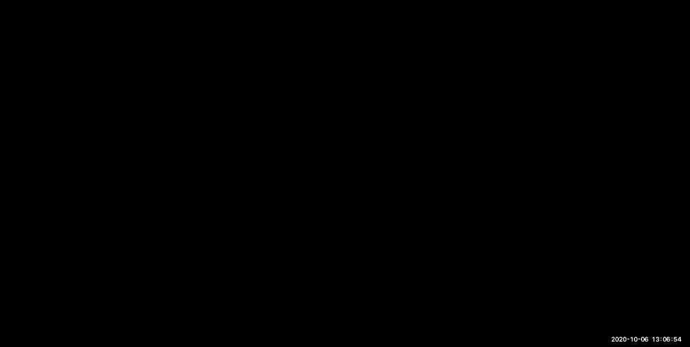
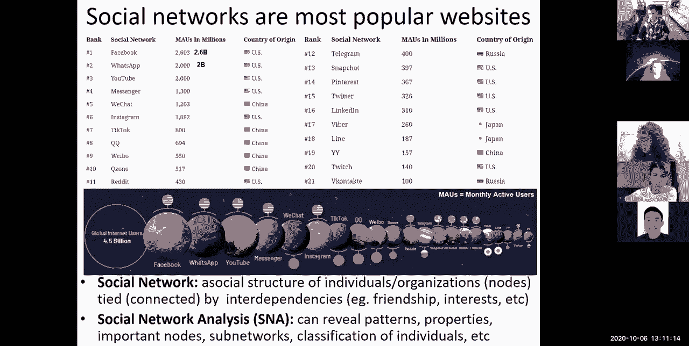
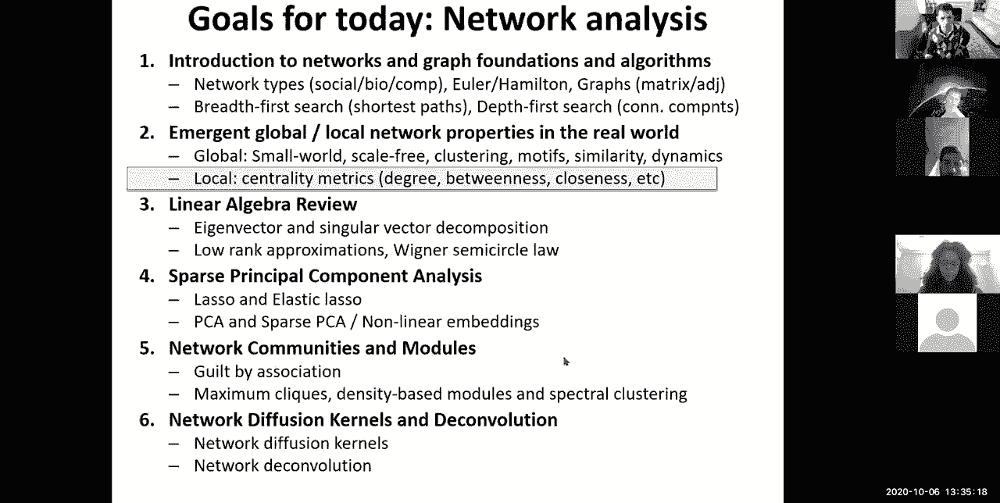
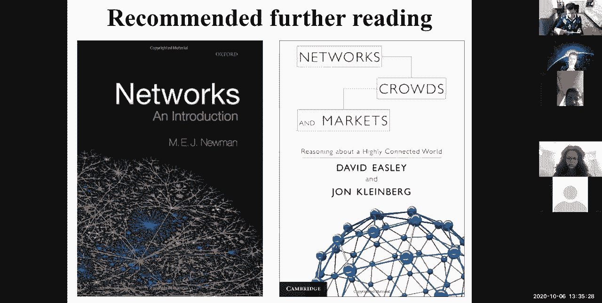
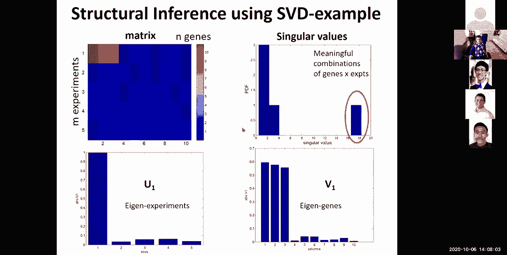
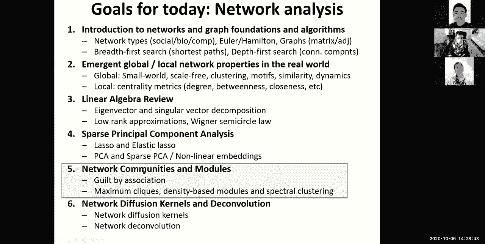
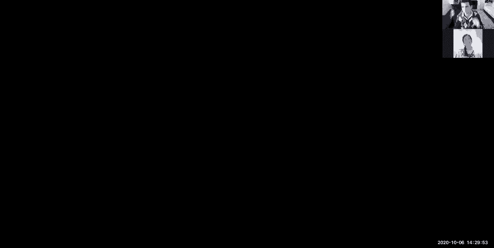
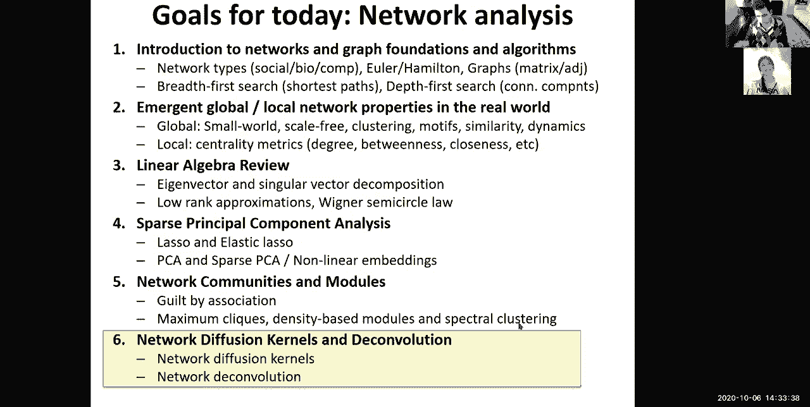
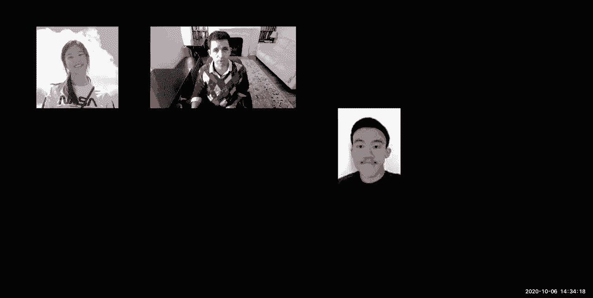
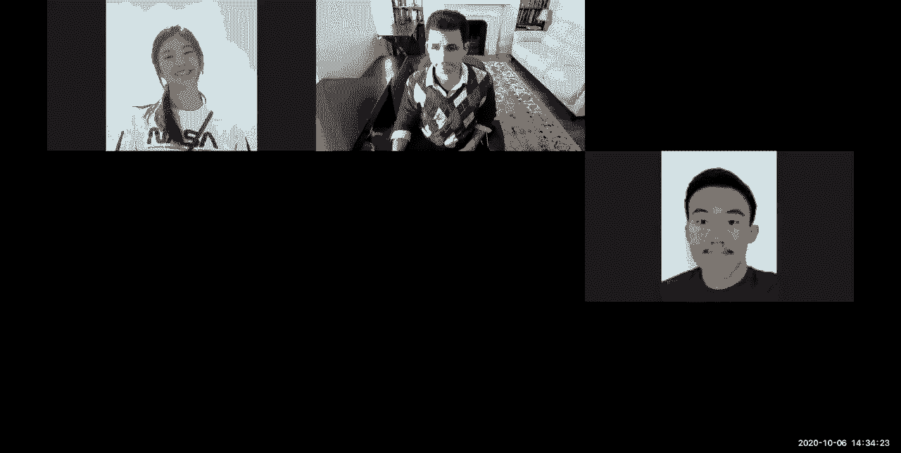

# P11：L11- 网络 - ShowMeAI - BV1RM4y1g76r

all right，welcome everyone so today we're going to，inference，network analysis and network。

applications，so we are entering a new module so we，basically talked about。

um expression and genomics in the first，sorry first genomes and then。

gene expression of genomics we are now，uh in the midst of network structure and，network motifs。

and then we're going to talk about deep，learning uh next time and then we're，gonna enter。

the uh population genetics and disease，genomics，uh module uh pretty soon so。

today's goal goals is to look at network，algorithms，uh how do we interpret networks and some。

basic linear algebra，techniques for networks so we're going，to do today。

is first look at networks and graph，foundations and algorithms，we're going to talk about different。

network types social biological，computational networks，and then some you know different types。

of networks and then how to represent，networks as graphs，and then just very basic breadth first。

search and deploy search，and then we're going to talk about，emergent。

emerging global and local network，properties，in the real world uh including global。

properties such as small worlds carefree，networks clustering motif similarity，dynamics。

as well as local measures of centrality，such as，degree centrality between centrality。

closeness centrality and，quick，review of linear algebra with，eigenvectors and singular vector。

decomposition，and low rank approximations and then，we're going to talk about sparse pcas。

and how we use pca and sparse pca to，sort of reduce the dimensionality。

of high dimensional data such as the，gene expression data that we saw。

earlier in the term but also non-linear，embeddings，for uh projecting these into lower。

dimensional data such as tsnes，and we're going to talk about network，communities and modules。

and guilt by association as well as，spectral clustering a very powerful way。

of partitioning networks based on，eigenvectors eigenvalues and laplacians。

and then we're going to talk about，network diffusion kernels and the，convolution。

so networks date back to when euler，wanted to take a walk in the morning and。

wanted to cross all seven bridges，of kenningsburg but he couldn't figure，out a way how。

and then he basically proved that there，is simply no way，to cross all bridges in a in a walk。

and this was expanded with hamiltonian，cycles，across sort of these regular platonic，graphs。

and then trees in oilers，sorry in electric circuits by kershaw，and then。

um the problem of four coloring，a map with um any kind of planar map can。

be four colored using only four colors，and again there's graph proofs，surrounding that。

and of course you know we now know that，networks are everywhere in the real，world。

we talk a lot about social networks and，collaboration networks in different。

types of fields commercial networks for，example this is all biotechs in boston。

in 1991 biological networks which we're，going to focus most of the time on。

but also transportation networks and，computer networks and the graph。

algorithms that we're going to be，talking about today，are in fact applicable pervasively。

across all of these different types of，networks，if you look at social networks in。

particular they are now some of the，biggest，you know uh sources of，uh traffic on the internet。

so facebook is dominating whatsapp，youtube messenger，and so forth and you can see that a。

large number of those，are in fact social networks so you know，in terms of the monthly active unit。

users you know we're talking the，billions of uh，active users so 2。6 billion users for。

facebook to 2 billion users for whatsapp，and so forth，so social networks are everywhere in。

social network analysis，is extremely important we can reveal，patterns properties important nodes of。

networks，classify individuals and so forth in，biology，there's a huge diversity of network。

applications so we can talk about，regulatory networks involving，transcription factors。

and their target genes so this is，usually when a transcription factor，binds。

in a location of the genome and then，turns on that gene so these are。

exactly the networks that we talked，about at the end of last lecture when we，can predict。

individual targets of an individual，edges，of a transcription factor and these are，usually directed。

and signed and weighted so directed，because a regulator controls a gene but，the gene is。

not controlling the regulator so they're，directed they're weighted because the。

strength of the regulation，can be dramatically different between，say b targeting c and a targeting。

c with different strengths and they can，also be signed，in a repressive or an activating edge。

metabolic networks are usually，connecting metabolites，with edges that are enzymes and usually。

it's a different edge，that's pointing in one direction versus。

another direction based on the specific，enzymes that，catalyze the reaction one direction or。

another direction，if you ignore the specific identity of，the enzymes these are usually undirected。

networks，or bi-directed networks and they're，usually weighted based on the。

rate of the reaction signaling networks，are kind of upstream of the transfer。

refactor network so basically when you，have a signaling protein，you have a cascade of signals that。

enters the cell and again these are，usually directed and unweighted，because it's usually just the。

phosphorylation or conformational change，of the protein，so，you don't worry about the weight that。

much protein-protein interaction，networks in biology are，undirected and unweighted it's basically。

telling you whether a particular protein，interacts with another protein and。

that's a bi-directional it's a，symmetric relationship and then。

there's also functional networks which，are basically co-expression networks，these are not physical。

these are uh more abstract it basically，tells you that this gene。

is co-expressed without gene and that，gene is coexpressed with that gene and，so on so forth。

even though there might not be a，physical reason why they're co-expressed。

it could just you know they could both，be targeted by the same regulator，or they could be you know。

some other kind of mechanism indirect，mechanism through which they're。

correlated but perhaps with the，environment maybe they both respond。

to the same signal or to signals that，tend to co-occur，and again these are undirected and。

weighted networks that basically where，the weight represents，the strength of that correlation。

so let's see who's making so far，awesome so uh 64 29，700。 um，okay so uh there's many challenges。

associated with networks，so basically on one hand you want to，identify the building blocks of the。

networks and that's what a lot of the，lecture was about，on tuesday this week so we talked about。

how to identify the regulators how to，identify the regulator motifs and to do，motif discovery。

and how to identify their target genes，we can also use networks to predict。

cellular activity so for example you，might have a particular network。

connectivity pattern and want to predict，the expression levels，or to predict the gene ontology。

functional annotation terms，of a particular gene，from，functional data we talked about these。

co-expression networks，you might want to infer the structure of。

a coexpression network or the structure，of a regulatory，network using gene expression for the。

regulators for the targets and so so，forth，or you might actually want to infer the，function。

that is being computed by the biological，network you might want to say well。

if a and b are expressed or vertically，level，then i can predict x as a function of，their levels。

and maybe that function is not just an，additive function maybe it could be some。

non-linear function and so on so forth，and beyond inference of these networks。

you might want to understand the，structure，of these networks so you might want to，infer degrees。

uh or network motifs or functional，modules in those networks so。

again network science is pervasive in，biology，and again these are mostly physical。

networks that we're talking about，but uh you know beyond these real world，networks。

where the edges actually represent some，you know，physical relationship you can basically，have。

the networks simply be about，co-expression，or they could be the nodes themselves。

might actually represent biological，variables，or abstract mathematical variables。

for examples for example you know you，could actually use，you're，modeling the joint probability。

distribution，of variables where every node is a，variable，using the graph so you can have bayesian。

networks which are directed or markov，random fields which are undirected。

and you could actually represent the，fact that information，flows through this network specifically。

through the edges，so if you have a set of variables you，can express the dependencies。

between these variables as edges and，therefore the，independencies as absence of edges。

and in this particular case you see that，the information can flow between。

subnetwork one and subnetwork three，through subnetwork two and that all of，the nodes。

of subnetwork one if they're uh，if if subnetwork 2 is observed become，conditionally。

independent from subnetwork 3。let me give you an example so suppose，that the higher。

the activity of this node or the higher，the probability of this node。

the more i will believe that this node，is also on，so observing the value of this node。

flows some information about the，posterior probability of this node which。

in turn influences the posterior，probability of that node，by contrast if i have fully observed the。

posterior probabilities，of these s2 then there's no change，there's no influence in any change in s1。

that will influence s2，and therefore s3 will be conditionally，independent，from s1 given s2。

okay everybody with me so far，awesome so let's talk about these。

networking graph foundations so how do，we even represent the networks so a。

network more concretely is a graph，which is more abstract and informally。

there's a set of nodes which are joined，by a set of edges，the nodes are objects they're。

represented as circles or endpoints or，data or variables，and the edges are basically links。

between them they're the lines that were，represented here they're the arrows or。

the relationships between these nodes，so a graph is basically a set of，vertices。

and a set of edges and the vertices is，usually some number denoted by n。

and then the number of edges is a subset，of the full，v cross v you know all pairs of vertices。

and they you know that number is，sometimes denoted by v by n，and then the number of edges is usually。

much smaller，than uh the full the fully connected，network so，um here's an undirected example and。

here's a directed example，of a graph so again the vertices are，obcd，and the edges are unordered。

so they're just sets whereas in a，directed example，the edges are actually ordered so ac。

is very different from ca so you know ac，exists in this network and ca doesn't，exist in there。

okay so we can represent these networks，as graphs we can have weighted graphs。

where the weights are associated with，every edge and these are generally，positive，where they're。

sometimes positive sometimes negative，you can have multi-graphs or，pseudographs where。

there can be multiple edges between the，same pairs of end points。

you can have digraphs where these are，directed graphs where the edges have，actually direction。

and simple graphs where there's no，multiple edges，and there's no self loops okay。

so you can represent the network using，a matrix notation so you can represent，the network as。

either a list of adjacencies so you can，basically say，you know as we saw before ac a b。

b c c b this is an adjacency list，or you can actually represent it as an，adjacency matrix。

and in a symmetric network that，adjacency matrix is symmetric，and the you know edges represent that。

from a to b and b to a it's the same，weight 1。5，and so forth so an unweighted network is，a binary。

adjacency matrix that basically tells，you is there an edge，at all between pairs of nodes whereas a。

weighted network has a real valued，matrix，that basically tells you the weight of，each of those。

and we talk about the degree of every，node，as the number of，edges that connect to it so the degree。

in an unweighted network，here would just be one the degree here。

would be three the degree three would be，three and so on so forth。

uh but in a direct in a in a weighted，network，the weight the sum of the weights of a，particular uh。

node is the，degree of that node so basically the，degree of b，is 1。5 plus 3。4，plus 2。1 and。

that's the b e edge uh that should be，2。1 here so there's a little typo on，this left，so basically 1。

5 3。4 2。1，um is the weight of b，and that's the degree of b and in a，directed network you can have。

the in degree which is the number of，nodes the edges pointing in。

and the out degree which is the number，of edges pointing out of a particular。

node so again this is the adjacency list，representation and，uh you know the matrix representation。

all right so there's very basic，algorithms on networks such as breadth。

first search and death per search，for finding shortest paths refining，connected components。

so with breadth first search you，basically start with the verdict you，list all of the neighbors。

at distance one all then all the，neighbors in distance two，all the neighbors at distance three et。

cetera and you define a frontier，that you move through as you explore，your network。

with that per search it's the opposite，it's like exploring a maze you basically。

start from the current verdict，and then you move to another one until。

you get stuck and then you backtrack，and then you move to another one until。

you get stuck and then you backtrack and，forth，okay so very different ways of exploring。

your graph and algorithmically，for breadth for search you start with。

the vertex you expand all the neighbors，you define that frontier。

and you move forward and the you know，there's algorithms that you've probably。

learned in six w6 and 6046，where the only edges non-traversed by，the breadth for search。

link vertices within the same or，adjacent，labels and you can define properties of。

that breadth first or string，which results directly from the，particular way of exploring it。

for a and a coral area of that is that，the breadth first tree results in，shortest paths。

so basically as i sort of maintain that，for tear，i know that if i explore d through x。

it's because that is the shortest path，and there's no other shorter path。

that i can get to d from you know，s for example so the，you know the correctness analysis stems。

from the fact that if there was a，shorter path，then you would have found it earlier in。

your search so，you can basically follow these pointers，and then infer all the。

shortest paths so for the，depth or search again you sort of，explore just like a maze and you。

backtrack，and you can basically，have uh you know，just a node um weight that basically，tells you。

how when did i observe each of these，um nodes and then color them as soon as，you've。

actually observed one of them and then，you basically have these，cross edges and these back edges as。

you're exploring your tree，using this depth first approach that，lower。

level or not so you can classify every，edge，based on you know whether it's a tree。

edge which is basically，part of your depth or series tree as，you're exploring all of the nodes。

or a back edge that basically leads from，a node，to someone that i've previously visited。

as an end as an ancestor to the current，exploration，or a cross edge which basically points。

to someone who's not an，ancestor but who is already explored，through another part of the tree。

and then a forward edge is when you，would actually find，a descendant of that tree that you have。

already explored，again this is not a shortest path unlike，the breadth first search and you might。

actually，you know find a longer path to get to，somewhere because you're going depth，first。

on this and then depth research is very，nice way of finding connected components，for example。

to basically infer if there's a path，between them，or an equivalence relation between them。

so if a verdict has already been reached，you don't need to search from it so you，basically have。

a set of nodes that you maintain that，have already been visited。

and i said that have not already been，visited and you sort of you know only。

explore from one that are not visible，so this is just very basics of networks。

this should hopefully be just a review，for most of you uh we can now talk a。

little bit about another topic which is，you know very common in networks which，are。

what are these emergent global and local，properties，of these networks so there's a lot of，real world。

networks out there there's basically，infrastructure networks there's social。

networks there's information networks，and of course biological networks。

so infrastructure networks could be the，internet the power grid。

transport networks distribution networks，in social you could have friends you。

could have actors and what films they，start in you can have co-authors。

of papers you can have affiliations of，institutions for information networks。

you have web pages you have citations of，papers，you have patents and file sharing and。

shopping lists and documents versus，keywords，and in biology we talked about physical。

networks metabolic networks regulatory，networks，neuronal networks and also ecological。

networks so all of these networks，despite being in such，different domains have some emergent。

properties，one of them is the small world property，so，there was this famous experiment in the。

60s of milgram who basically，coined the term of six degrees of，separation where。

any pair of vertices were in fact，connected，by short paths even though there are six。

billion people on the planet，you can find you can send a letter。

by giving it to one person and saying，don't use the post office only give it，to someone you know。

knowing that it's trying to reach this，person in china，and what's really remarkable about the。

experiment is not only that there were，only six paths，six hops for um any one person to。

connect to anyone，to any other person on the planet but，that people were actually pretty good。

about finding，these paths with no global information，so every person basically said well。

you know i obviously don't know anyone，in china but i know this person who。

travels a lot so i'm going to give it to，that person，and that person would basically say well。

yeah i haven't traveled to china myself，but i know this other person who travels，a lot to china。

and then very rapidly it would sort of，make these，very long paths by only。

sort of person to person transmission，another property that became very famous，a little bit later。

is this whole scale free and power law，80，of the connections are actually made by，20 of the vertices。

and this whole concept that there's very，few heavily connected hubs，lie。

in the fridges whereas the the hubs are，basically，you know sort of responsible for most of。

the connectivity，and related to the scale-free，uh you know parallel distribution the。

model that albert and barabasi came uh，came up with to explain the scale-free，property。

was one of preferential attachment，a rich get richer which basically will。

lead these parallel distributions，the idea is that if i'm a random node。

and i'm trying to connect to someone，if i connect preferentially to someone。

who's very heavily connected already，that will eventually lead to these，networks。

that are parallel distributed we can，also define these clustering，coefficients which is the average。

probability，that the neighbors of a node v are also，connected to。

each other and this basically measures，the density of，closed triangles versus open triangles。

and more generally it's a measure of the，frequency of all network motifs。

ie the over or under representation of，all the subgraphs of size three four，five。

is very frequently uh a consequence of，these clustering coefficients。

so these network motifs that i mentioned，in the previous slide are basically。

thought of as building blocks of，units，of these networks and also somewhat，interpretable。

circuit components you can think of，feed-forward loops and feedback loops。

and cross-regulatory loops and，amplification loops，and you can discover those based on。

their over-representation，compared to a random network you could。

basically say in a randomly connected，network，i might expect you know a small number。

of these motifs but in fact when i look，at a real world network，i see that these are very heavily。

overrepresented，and you can sort of measure that，computationally using some kind of，statistical。

measure so，you know this is an example from one of，our papers on the drosophila mod。

encode project that's basically looking，at different types of。

cross-regulating edges where two f's are，regulating each two transcription，factors are。

regulating each other and both，regulating a common micro rna。

and then here's some examples of abc for，each of those，motifs here's another example of。

cross-regulating clique of ts where all，of them are controlling each other。

here's a feed forward loop where you，know a can，repress c or you know。

b can go through a and so so forth，you can have a double feed forward loop，where a controls。

c through b or directly and a also，controls b，through c or directly and then there。

were you know biological examples，for each of those you can also study the。

hierarchical organization of these，networks and this is an example from the，same paper。

where we could basically see that there，was this concept of a set of master。

regulators which are actually very well，studied，that were controlling a subset of uh。

sort of higher order，regulators with them and then，progressively lower and lower。

and lower net regulators below that，each of whom has mostly targets down。

from them and then a set of micrornas，which were modulating that network。

and also enabling some nodes to，some some edges to actually point up the，nodes of the trees。

so there's a concept of hierarchical，organization，of these master regulators versus these。

local regulators，of degree distributions with in hubs and，out hubs。

in hubs gather a lot of information and，then might，sort of propagate it locally and then。

out hubs are basically master，controllers of，a lot of other nodes。

you can talk about the diameter of the，network basically，how far does information travel。

through the network perhaps in a breadth，first search and then you can talk about。

the modularity or the locality，of these network basically can i sort of，break up that network。

into modules but also clustering the，network into some，networks and also the direction of the。

flow whether it's downward through these，master regulators or back outwards。

through these micrornas so，there's a lot of properties that we can，compute。

for each of those nodes one of them is，the centrality，and you've probably all heard about hubs。

in the network and you can，measure the centrality of a node as the，degree centrality。

which is typically the you know original，way in which these hubs were defined。

based on their number of in edges or the，number of out edges。

basically the number of neighbors can be，used as a measure of。

importance or authority of a particular，node again vector centrality is the sum，of the centrality。

of all of the neighbors of a node where，it's high when v，has many neighbors that are central。

themselves，there's cat centrality which balances，the number of neighbors。

and the neighbor centrality using a，weighting parameter，there's a page rank which dilutes the。

centrality of the flow，out of a vertex by the number of，neighbors and this is actually what's。

used in google search results，there's closeness centrality which is。

basically what is the mean distance to，and，the between the centrality which is the。

number of shortest paths，that go through a particular node and，there's also the flow between this。

which is the amount of flow through v，not just the number of paths but in a，weighted network。

what is the total amount of flow as if，you're looking at electricity or a river。

or any kind of you know metabolic，flow or any kind of distribution network。

flow and there's also the random walk，between us，which is a measure of diffusion you can。

basically have some kind of sink，uh some kind of source and basically you，could ask how much of that。

low goes through a particular vertex，v so we can actually have specific。

uh information about node pairs about，the similarity or the closeness。

you could look at assortative mixing at，node similarity or node equivalence and。

at the clustering of particular，properties in cliques，or k plexes or k cores。

and you can also define graph，neighborhoods with particular components，you can have。

a component which is any two nodes，linked by at least one path，that's when they belong in the same。

component or a k component if there's at，least k，vertex independent paths between two。

nodes so basically，i get to go from a to b through k，different paths none of which share。

any intermediate nodes so，uh you know i encourage you to read a，lot more about these。

uh to um sort of you know uh，dive into the properties of these，networks there's several very nice。

books about those that i really，encourage you。

to learn more about so，beyond basically components and k，components you can basically think about。

these，giant connected components of these，networks，where everything is ultimately connected。

with everyone so，you don't you don't want to just simply，say oh great there's one component here。

you can basically look for，local community structure locally，densely connected components。

so you know there might be sub structure，within a particular cluster of friends。

so we can talk about graph partitioning，algorithms that can break into k。

clusters and the simplest form of that，is a graph by section。

which is basically saying you know can i，find an optimal，path an optimal cut that sort of。

maximizes the separation，and you know this is usually an，np-complete problem because the。

exhaustive search，is basically 2 to the n you know divided，by square root of n。

and there's mostly heuristics basically，or you could divide randomly and then。

reassign the members and that's sort of，a kernighan lean，method or you could use spectral。

partitioning，which uses the graph laplacian that，measures some type of diffusion and。

we're going to talk a little bit more，about the laplacian，later in this lecture there's also a lot。

of community detection algorithms for，discovering，these coherent small groups and for，maximizing。

modularity again you can use spectral，methods or betweenness-based methods。

and other types of methods，you can also use dynamic processes on，those networks。

for example percolation or network，resilience，you can basically either uniformly or。

non-uniformly remove，individual vertices or individual edges，or individual hubs。

and then see you know what happens to，the connectivity of the network。

if there's a network router failure or，if there's an attack on the network。

or for example if you vaccinate，individuals，during i don't know a hypothetical，pandemic。

you would basically like to know how do，i prioritize who i should vaccinate。

in order to maximize the resilience of，the network or the，to minimize the speed of spread in the。

community，and so forth there's a lot of models，that look at epidemics on these networks。

for the spread of diseases for，susceptible infected recovered。

individuals and that has been again all，over the news，but you can now start asking well what。

is the are not，at the start of any of a spread and what，is the rt。

at particular times during that spread，and，how fast are hubs infected in the，network。

and how is the rate of growth for，example affected，at different points on this network。

based on how fast，our hubs versus other types of nodes，affected in a sort of disease spread，model。

and these can be time dependent，properties of the disease spreading。

again we've heard a lot about are not，but the number that most people are，using is rt which is the。

number of individuals that a particular，person in effect at a given time point。

t you can have dynamical systems of，these networks to basically look at the。

rate of a particular property change，over time，so that's where a lot of metabolic。

modeling happens in the metabolic，network that we saw with steady state，analysis and fixed points。

if you know the expression of particular，enzymes you can basically infer。

what is the steady state abundance of，different metabolites，in my metabolic network using this。

information，but you can also look at information，flow through the network basically if。

you're spreading messages，or you know what is the stability and。

the synchronization of these messages as，they're spreading through the network。

and you can also look at network search，basically you can have a distributed。

database and message passing，and also search through such a network。

so who feels that they've learned some，stuff today，so let's see。

how are you guys feeling in terms of the，you know uh，number of properties that you've kind of。

heard through i mean i try to explain，each of them simply but my goal is。

mostly to give you a vocabulary，with which you can go and explore that。

awesome so uh we have 25 63 1300，um okay so now let's go back to。

centrality this whole there's this whole，hubness，of a particular node and look at。

different metrics of centrality and how，they can be，shaped by the shape of the network so。

the question is，how important is a particular node or a，particular edge。

to the structural characteristics of a，system，and the question is well great i can use。

degree by itself this is a very high，connectivity node so it's probably very，important。

but look at all those high connectivity，nodes are they，all super important to the network what。

if this particular node has，relatively lower degree but there's a，lot of information that。

goes through that node to get to these，remote nodes here，maybe this node should be thought of as。

more important than，that node so we need different measures，of，hardness different measures of。

importance，for these different nodes so，as i mentioned earlier the degree。

centrality is simply measuring the，number of，edges that are incident in。

here node that's in a undirected，unweighted graph，if you have a weighted graph then you。

can have the in degree versus the out，degree and if you have，a weighted graph then it's the sum of。

weight of all of the nodes incident，and again in the direct graph either，incident in or out。

of a particular node so，you can basically measure alternatively，beyond the degree centrality you can。

measure the betweenness centrality，which is asking how many shortest paths，in the graph pass through。

the node that i care about and then，divide that by the total number of，shortest paths。

so we talked a little bit about shortest，paths earlier and you can basically say。

well what is the total number of，shortened paths between i and j。

and how many of those shortest paths go，through node k，as long as i j and k are distinct so if。

you have nodes with high between the，centrality，they might actually be important。

controlling the information flow in a，network，and they might be worth preserving in，resilience to。

sort of worry about an attack in the，inside network and the edge between us。

is defined very similarly based on the，number of，shortest paths that go through a。

particular edge not just a particular，node，divided by the total number of short。

space so here's an example，if i have for example uh node b，if i care about the between the。

centrality of node b i can basically，look at all of the shortest paths going，from a。

to c d e that go through b and，from c to a d e that go through b。

and so forth and you can see that out of，all of the shortest paths。

that i that i see here the ones that are，underlined are in fact going through，node b。

and that's four out of 10 or actually 5，out of 10，so that gives you between the centrality，of node b。

of 5 out of 10。 okay，the closeness centrality is basically uh，the normalized。

inverse of the sum of topological，distances，in the graph so you can basically ask，just how close。

is every node to every other node so you，can basically look at what is the。

topological distance between every node，i，and you know between node i and every，other node j。

so basically what is the distance，between b and every other node，and then the inverse of that is the。

closeness centrality，so you basically have node b which is，the most central。

in spreading information from it to the，other nodes in the network and therefore。

if i'd like to broadcast a message by，shortest paths i might want to start，with b。

to reach everyone uh and then，you can see the you know between the，centrality of。

sorry the closest centrality of b is the，highest and then followed by。

a c and then further d and e just，because of that connectivity so。

a and c are connected here and therefore，a is actually closer to all of the other，nodes。

whereas e and d are not connected，therefore e and d are actually further。

from all the other nodes and again，depending on the network node b might，appear more。

you know betweenness central and more，closeness central，because it's both closer to all of these。

other nodes and you know in between all，these paths，whereas node a actually has a higher。

degree of degree five whereas，node b only has a degree three um so。

that's you know the the most central，node or the most important node，definitions。

might actually differ based on what，metric you use，so again veteran centrality is extending。

this concept of degree，by making the score proportional to the，average of the centralities of the。

neighbors，so if you have basically you know all of，the neighbors of a particular。

node then you can basically say what is，the，centrality of each of those neighbors j。

and what is the spread between i and j，in my network and notice here this aij，notation。

this is the adjacency matrix notation，which is，also a way to get the flow out of that。

uh node so if i multiply a vector，with uh a matrix i'm basically getting，the。

impact of transferring weight from all，of these nodes，to all of the descendants through the。

network so，this matrix notation of networks is，actually very powerful one。

and again lambda is some kind of，constant so in matrix vector notation，this is simply。

a x and you know one over lambda with a，scaling factor，and to make the centralized non-negative。

you can select the eigenvector，eigenvector corresponding to the，principal eigenvalue。

and which is the spheron for venus，theorem，all right so that takes us to this。

linear algebra representation of，do，saw，uh just very basic properties of。

networks very basic algorithms such a，breadth of search and depth research。

and then some very basic emerging，properties of networks both global and，local。

and some measures of centrality so now，let's dive，into the linear algebra view of。

these networks so again you can have a，matrix interpretation of graphs。

where the graph v e can be shown as a，matrix，where you can choose an ordering of the。

vertices you can，number them sequentially and then fill，in a v by v。

matrix that basically tells you what is，the，weight between every pair of。

vertices so if i have vertices one two，three four，five and then weight a between a and b。

sorry between one and two i have，basically one，uh to two here but then notice two to。

one has no weight，so this is a not not a symmetric uh，matrix because it's a。

directed graph rather than an undirected，graph so again that's the adjacency。

matrix or the incidence matrix of the，graph，and the diagonal entries are basically。

the weights of self-loops，so basically g has a self-loop here。

sorry note 5 has a self loop with weight，g and then the uh，if it's symmetric matrix that's an。

undirected graph and if it's a lower，triangular matrix then there's no edges。

from the lower number nodes the higher，number nodes，and if it's a dense matrix then you can。

have cliques i。e，edges between every pair of nodes and so，forth。

so now you can basically think about the，information flow through that graph。

by multiplying your matrix a，have，a set of weights x which are for example，the starting weights。

of my network then i can ask if i，flow these starting weights through the，network。

according to the weights of each of，these edges，then what will be the final set of，weights。

so that's y which is basically the，operation，of multiplying that vector by that，matrix。

so the graph interpretation is that，every node i has two values，labels x i and y i and every node i。

update its label 2y using the x value，from each of the neighbors，scaled by the label on edge i j。

so basically from a graph perspective，this is，you know a matrix operation that just。

flows information，through that graph so one way to think，about this。

matrix operation is a transformation，of the space of you know，this five-dimensional space of weights。

so the geometric interpretation，of these matrix operations is that i am，shearing my space of say a。

two-dimensional space here，by transforming every vector on that，space。

by the matrix m and some vectors for，example the red one here will not be，affected。

and other vectors will change their，direction as the whole space。

is getting sheared so i'm starting with，a two-dimensional space。

and i'm ending with a two-dimensional，space which is the transformation。

of the original space okay so what's，been thinking so far about these。

sort of linear algebra view of these，networks，and the sort of matrix operations。

of applying a set of transformations，to an initial set of，weights on each of these edges each of。

these nodes，okay lovely so 43 36 14 7 0，so you can basically shear，the space using a combination of。

rotation，and scaling or you could actually，transform，this operation into first a rotation。

then a scaling along these axis，and then another rotation so this。

is basically the basis of this you know，decomposition of these matrices so i can，think of my。

graph as a matrix operation，and i can think of that matrix operation。

as a transformation of the space，and i can think of the transformation of，the space as decomposed。

into a rotation a scaling，and a rotation so the way to think about，this is that。

if i apply my matrix transformation，which is my graph，on an input set of vector x。

input of weights vector x then，this is equivalent to first applying a，rotation。

v and then applying uh，scaling s and then applying another，rotation，u okay so basically m。

is the product of u sigma and v，where i first apply v star then apply，sigma and then i apply u。

because of the order of the，multiplications okay，who's with me so far on this uh，transformation。

of the space and how it can be，decomposed，into these parts and how i can actually，think of。

singular value decomposition and you，know，this type of transformation as to，breaking them up。

into these components okay，lovely so 50 33 88 here，um so this is basically what。

eigenvectors and eigenvalues，actually do to your space so，eigenvectors are basically。

those vectors for which the，transformation，by this matrix is equivalent to just。

scaling that vector by a scalar，so as you're thinking about the shearing。

and this transformation of the space，all of the points are going to be moving，except for。

some vectors for which that direction of，motion，with，their initial um you know transformation。

their initial direction in which they're，pointing，so basically the eigenvector of。

a matrix is simply a vector，such that transforming that vector by，that matrix is just a scalar。

multiplication of that vector，so if i have for example this，transformation which you can think of。

again as a graph of you know from a to b，and a to，sorry from a to a and a to b and b to a，and b to b。

that transformation of that network or，that graph or that matrix。

on these weights or this vector or the，sort of space，in these two-dimensional uh you know。

grid is effectively the same as，multiplying that same vector by a scalar。

so that basically means that you know，one two，is an eigenvector because the，transformation。

and this is an eigenvector of that，matrix because the transformation。

of one two by that matrix is equivalent，to a scalar multiplication。

of that so the question is how many，eigenvalues，are there at most so basically you're，of。

sv equals lambda v which is basically，nothing more than，s minus lambda times the identity matrix。

v equals zero，and that only has a non-zero solution if，you know，this is zero and then this is an nth。

order equation，in lambda which can have at most m，distinct solutions and these are the，roots。

of the characteristic polynomial which，can be complex even though，s might actually be real so this。

matrix of vector multiplication is，basically the same，as uh taking the eigenvectors。

and then transforming each of them，by a scalar so you can basically take。

this matrix vector multiplication as a，way of you know thinking about this，which is。

each of these vectors is a separate，dimension onto which i'm applying。

a linear transformation so in each，eigenvector，s acts as a multiple of the identity，matrix。

but as a different multiple on each of，these dimensions on each of these，vectors。

and which is these projections so any，vector say，x 2 4 6 can be viewed as a combination。

of the eigenvectors，uh which is basically you know if i，multiply this along。

it's two times the first eigenvector，four times the second vector，six times the second the third。

eigenvector，so thus a matrix vector multiplication，such as sx，can be rewritten in terms of the。

eigenvalues and the eigenvectors，acting on it so if i think of you know s。

on top of x i can basically say well x，can be simply expressed as 2v1。

4v2 and 6v3 multiplying through，the eigenvectors to sort of construct，that original matrix。

uh that original vector x so basically，you know the first dimension the second。

dimension of the third dimension of x，and then that's nothing more than the，corresponding product。

on the matrix with each of the vectors，but because these are the eigenvectors，of that matrix。

every such transformation of the，eigenvectors is just a scalar，multiplication of the eigenvectors。

which basically gives me this linear，equation here so even though x is an，arbitrary vector。

the action of s on x is determined by，the eigenvalues in the eigenvectors。

and therefore a cool observation is that，the effect of，quote-unquote small eigenvalues namely。

eigenvalues that have only，you know a small lambda for example，is actually small so it's it's a very。

nice way of decomposing the total，strength，of each of those so。

let's see who's with me so far um all of，these sort of，linear algebra review hopefully。

okay so um we are at 62 23 880，okay so basically for symmetric matrices，the eigenvectors。

for distinct eigenvalues are actually，orthogonal to each other。

so if i basically take the eigenvectors，uh there，and the lam and the eigenvalues are not。

the same then the dot product of these，vectors is actually orthogonal to each，other。

and also all eigenvalues of a real，symmetric matrix are actually real。

and for complex lambda if you know s，minus lambda i，is zero and s is st。

that's a symmetric matrix then the，lambdas must be，real and all eigenvalues of a positive。

semi definite，matrix which is defined by this are in，fact non-negative so basically lambdas。

must be positive，if this condition holds here so the you，know the。

w transpose s w is great greater than 0。so here are some examples of eigenvalues。

and eigenvectors so basically，if this is my real symmetric matrix then，s minus lambda i。

is this if i solve that for lambda，then there's two solutions one of them，is。

you know two minus one squared minus one，is zero，and the other one is two minus minus one。

actually it should be three here 2 minus，3 squared minus 1 is again 0。

so there you go the eigenvalues are 1，and 3 which are non-negative and real。

and the eigenvectors are basically the，corresponding eigenvalues for this。

so i can just plug in lambda equals 1，and i can plug in lambda equals three。

and then solve for this and the，corresponding eigenvectors，will be one one and one minus one which。

are basically pointing diagonally up，and then diagonally to the left so if，you you plug in these。

values and then solve for the，all right so then the eigen diagonal，decomposition。

is to basically carry out the same，sort of transformation of this，matrix s into three。

operations and for，a square matrix with m linearly，independent eigenvalues。

eigenvectors namely a non-defective，matrix where the actual dimensionality，of the matrix is the。

dimensionality that is proposed rather，than having some zero，eigen values then there exists an eigen。

a negative composition which has this，property where the columns of the of u。

are the eigenvectors of s and the，diagonal elements of，lambda are in fact the eigenvalues of s。

and all of the non-diagonal entries of，lambda are actually zero，so you can basically think of the。

transformation s as basically the，transformation of each of its，independent uh eigenva vectors。

each scaled by the corresponding，eigenvalue and again，transformed here as well and this is。

unique for，distinct eigenvalues ordering these，eigenvalues，by this largest to the smallest and if。

they're all distinct，then there's a unique decomposition here，so this is just a quick proof of why。

diagonal decomposition is possible，so if u has the eigenvectors as its，columns。

then s u can be written as s times each，of these，vectors which is basically the same as。

multiplying by，a lambda for each of those because of，the eigenvector property。

and then this is the same as these，diagonal，lambdas times all of the v's by。

sort of you know expanding this out and，then multiplying each of the columns。

by each of these rows which basically，gives you again the exact same thing as。

multiplying each vector by scalar，and therefore s u is the same as u，lambda。

and s u u minus 1 so basically the，inverse of u，is the same as q lambda because s u。

is u lambda uh times u minus one，okay and therefore s is that，decomposition。

okay so here's another example of，diagonal decomposition so you can，basically have。

you know this s with eigenvalues one and，three and eigenvectors，minus one one and one one which。

basically form this u，one，this is basically the matrix with which，i need to multiply that。

in order to get the identity matrix one，zero zero one，and that is uh you know sort of the。

solution to that and if i，basically multiply all these across then，this becomes。

s so if i have this 1 1，sorry 1 minus 1 1 1 which are these two，other。

the corresponding eigenvalues and then，the inverse of u，that's basically the eigenvalue。

decomposition of，s so，and then you know you can basically，divide and multiply everything by the。

square root and then you can get this，orthogonal matrix where every column has，unit length。

and is perpendicular to all the other，columns so you can basically transform，this that way。

all right so that's symmetric ideal，decomposition so if it's a symmetric。

matrix then there exists a unique，identical position，where this q is orthogonal and then。

q negative 1 is the same as transpose of，q，and then the columns are basically。

normalized eigenvectors and the columns，are orthogonal and everything is real。

singular value decomposition is very，helpful when the matrix，a is an m by n matrix。

of some rank r and you know this doesn't，need to be a complete matrix。

it doesn't it can actually have，degenerate dimensions，then there exists a factorization i。e a。

singular value decomposition which is，basically，defined as follows where for that matrix。

a i can decompose it into an，n by m matrix u and then by n，diagonal matrix sigma where the。

diagonals are the eigenvalues，or the singular values and then an n by，n matrix。

so the columns of u are orthogonal，eigenvectors，of not a but a a transpose。

and the reason for this a transpose is，that i want my dimensions of a。

to actually be matched the columns of v，are orthogonal eigenvectors of a，transpose a。

again this is an n by m by m matrix，and this is an n by n matrix to，basically take this。

not necessarily square matrix，and then you know make it uh，eigenvectorable。

and then the eigenvalues of a a，of，a transpose a and these are nothing but，the。

basically the singular values are，basically the square root of those，eigenvalues。

okay so basically the singular values，sigma are basically，the square roots of the eigenvalues。

of this a transpose a matrix and the，singular value decomposition is very，helpful。

in basically being able to decompose，matrices that are not necessarily square，and not necessarily。

symmetric so here's an example where，you're basically，looking at this matrix a that has you。

know a five by three，uh dimension and there's for example，three full eigen values here and then。

the other two dimensions are，you know not quite matching and then you，can decompose that。

into a u and a v which are five by five，and three by three，to match these five by three and then。

three eigenvalues，so singular values here which are，basically the。

uh square roots of the eigenvalues of a，a transpose，and you know conversely you can have a，you know。

uh dimensionality in the opposite，direction with the remaining ones here。

and then the remaining ones there okay，so singular value decomposition can be，done for。

such a matrix here where you can，basically find the singular values of，these three by three。

and these two by two vectors sort of，matrices and then you can arrange the，eigen the singular values。

in decreasing order of magnitude with，the most important to the least，important。

so the reason why singular value，decomposition is so awesome，for matrices and for graphs and for。

networks and for correlation matrices in，general，is that it provides a very natural。

low rank approximation so singular value，decomposition can be used to compute。

an optimal low rank approximation of，any matrix in any graph so this is an，approximation problem。

where you're trying to find the kth，order，the rank k approximation of a matrix a。

as a way to minimize the distance，between the original matrix and this。

low rank version of that original matrix，using this euclidean norm or frobenius，norm。

which is basically the square root of，the sum，of all of the square differences。

between a and x okay so i'm basically，taking the，sum of the squares across all dimensions，i and j。

and then taking the square root of the，sum of the squares and that's what i'm，trying to minimize。

so the k-th approximation the k-th，rank approximation and，x are both m by n matrices and we want。

you know k usually to be much much，smaller than the actual rank，of the original matrix a and then。

the singular value decomposition of that，is，amazingly trivial it's basically you're，taking the。

u sigma v transpose decomposition，and you're just keeping only the，set。

all of the remaining r minus k singular，values to zero，you effectively can prove that this is。

the you know specific，matrix that actually minimizes this，difference and you know in column。

notation this is basically the sum，of rank one matrices uh all of this。

okay and then the error is basically the，thing that minimizes that。

and it's basically simply the k plus one，value of sorry singular value of。

uh the original matrix a okay，so the question is also well where do i。

stop how far down the list should i go，in zeroing out these singular values。

and there's a very cool theorem about，how to choose，rank k by looking for non-random。

eigenvalues and eigenvectors so the，question is，what does the network the matrix。

look like for a random matrix and does，it have some known random structure。

and this weakness semi-circle law is，basically，telling you that the distribution of。

singular values of a random matrix，form as a semi-circle，and this this is the tracy with。

distribution the probability，distribution of the largest eigenvalue，and if you look for non-random。

eigenvalues，basically this tells you that yes the，magic values are going to be outside。

that semi-circle，so one way to choose your low rank，approximation。

is to basically see at what point do i，get，non-random eigenvalues and i'll point to。

at what point do i get all of these sort。

of semicircle，distributed uh eigenvalues okay，all right so let's see who's with me so。

so we've talked about uh eigenvectors，eigenvalues，and also singular value decomposition we。

saw how this can be used for low rank，approximation，and this weakness semi-circle law for。

actually choosing，the dimensions that i'm going to be，zeroing out on my，all right so um 45 27，18 9 0。

 all right so this is，uh you know singular value decomposition。

with uh you know we can now look at how，we can make this，even sparser so basically how do we。

carry out，principal component analysis by，basically decomposing my matrix。

in a way that sort of creates sparseness，and the reason for that。

is that if i carry out this principle，component analysis if i basically do a，decomposition。

of my m arrays and n genes，through my gene expression matrix where，i for example have。

20 000 genes that are measured across，100 different conditions。

my number of genes is much much larger，than the number of conditions。

the question now is what is this uh you，know data，telling me and for every eigen gene。

you can basically think of it as being，expressed only in the corresponding，eigen array。

with the corresponding eigen expression，level so i can basically take my。

m by n matrix or gene expression data，and i can decompose it into this，m by m uh sort of matrix of。

arrays of experiments this is basically，how experiments correlate with each，other basically，other。

and then this is how the eigen，combinations，of experiments and genes。

so what you know this looks like is if i，take for example，um data set like the。

uh national institute of standards uh，handwritten characters and i do a pca a。

principal component analysis on that，then every one of those points is a，zero character decomposed。

and projected onto a two-dimensional，space which corresponds to。

the you know principal components the，you know for the lower dimensional，projection。

of the space and you can see here just，how beautifully this separates out the。

ones all the way out there the zeros all，the way up here，the eights and the nines for example。

sort of are partly overlapping here，and then up there i have the seven and，the eight sorry the。

seven up here and um，the nine and so so forth so there's，you know there's a lot of intuitive。

notion that comes with，where are those characters in this，two-dimensional space。

but um you know you can，you can see also some drawbacks of pca，fact。

linear combinations of all of your，variables，all of your genes so every principal。

component corresponds to a loading，vector，which is the columns of v and the。

loadings are coefficients corresponding，to variables，in the linear combination and this can，have。

actually the full combination of all of，the dimensions for every one of them。

no matter how infinitesimally small they，might be，so what sparse pca does is that it seeks。

to reduce the number，of explicitly used variables ie genes，by modifying principle component。

analysis so that the principal，components，basically，zero out a lot of the smaller values。

so that's sparse pca and it basically，writes principal component analysis，as a optimization problem。

similar to a regression and it uses this，lasso approach of least absolute。

shrinkage and selection operation，operator invented by tips iran in 96。

where both the variable selection and，the regularization，are combined and it produces basically。

sparse models，so the result is a modified set of，principal components。

with sparse loadings so you don't have，have a，modified set that best capture the，sparsity。

constraint so the question is how do you，select these sparseness so basically。

this is the linear regression problem，of expressing pca using lasso。

as a sparse pca or you have basically a，set of input variables x。

a set of output variables or response，variables which are a function of x。

plus some noise and then a set of，regression coefficients，and again this is applicable not just in。

gene expression analysis，not just in networks but also in，genetics we're going to be talking a lot。

about these beta coefficients，when we start looking at heritability。

and when we start looking at genetics，and sort of multiple variables combining，together to sort of。

infer this you know output response，variable，so this is basically a multivariate。

linear model where you basically have a，function of all of these input variables。

which is a set of beta coefficients，multiplied by the input variables。

okay and we're trying to infer what is，that set of，betas so the linear regression problem。

is basically given，n observations and p predictors，the goal is to estimate these，coefficients beta。

given some error epsilon so you have a，set of training data，you have a set of labels for that。

training data，and the labels are basically the output，variables。

and then given these labeled training，data where i kind of know the answers。

for many of them the question is what，should be the coefficients that minimize，for that。

is given my training set of input，vectors and，output variables to infer the residual，sum of squares。

this rss of the betas to basically，optimize the betas that minimize this。

residual square error given some，training set d okay so you know in two。

dimensions this is basically asking what，are the squared errors the deviation。

from the output variable y that a linear，regressor，would infer versus the actual observed，variable。

y and the deltas between the two are，effectively，these differences so with sparse pca。

given a lasso penalty your you have your，same training set，d where you have your input variables。

and your output variable，you have a residual sum of squares which。

is basically you know the difference，between，the beta regression of your input，variables and the y。

variable and you have a lasso penalty，which is basically a linear cost。

of adding up all of the absolute values，of all of your coefficients beta。

uh for non-zero lambda and your，objective，is to basically find a set of beta，now。

a set of beta lassos that minimize，not just the residual squared errors。

not they're just not just the residual，sum of squared errors but，also this linear penalty on。

beta this linear sum of the absolute，values of your beta，so the advantage of this is that lasso。

is continuously shrinking，the coefficients towards zero and，produces a sparse model。

by basically minimizing the weights of，these coefficients，and you can think of it as a variable。

selection method where you're basically，selecting which of your variables are。

the most important which are your，dimensions which of your genes，course。

is that the number of selected variables，is actually limited by the number of，observations。

and the microarray expression data has，you know many many more genes。

than arrays so it selects only one，of the highly correlated variables and，it doesn't care which one。

is in the final model so that's a bit of，a problem because you might say well hi。

it only depends on this gene，but not on all these other genes which，are equally good predictors。

so there's another way of regularization，another way of sort of。

you know sparsifying this model which is，instead of this lasso regression which，is this linear。

penalty on the weights of the，coefficients to basically use this，ridge regression this l2 norm this。

quadratic penalty where you're basically，looking at the sum，of the square weights so the advantages。

of the l1 is that it's more robust where，the outliers don't matter，as much but the disadvantages of。

you know the linear regression is that，it's less stable，in uh integrating ascent and it has。

multiple solutions the advantages，of the l2 ridge regression is that，there's always。

one solution and it's a more stable，grading ascent，but it's less robust basically the。

square differences of outliers，as，i increase these weights i basically，have a stronger。

effect so one way to sort of combine the，lasso in the rich penalty。

is to have a combination of weights，between them，and just have you know this l2 and。

this l1 each weighted by some kind of，net，so it basically combines the l1 and the，l2 regression。

and the limitation of lasso is removed，by the rich constraint and all variables。

are actually included in the model，and then there's a grouping effect where。

you can select a group of highly，correlated variables，once one variable among them is selected。

and then lasso will select only one of，them and it doesn't care which one。

whereas ridge will allow you to include，multiple，so what stars pca does is that it。

constructs a regression framework，exactly，and it uses lasso ridge or elastic net。

regression to construct the modified，principal components，using these sparse loadings so。

you can basically reconstruct pca in，this regression framework，the idea is that every pc is a linear。

combination of the variables and its，loadings can be recovered by regression。

on the p variables and then you can，solve pca by regression，by using this decomposition。

this singular value decomposition of，your x，given these principal components of x，and then。

suppose that your beta ridge these are，the modified betas that follow the rich，constraint。

are basically the ridge estimate given，by this minimization over beta。

of the differences but also the lambda，weights times the beta，coefficients so。

and then this you know beta ridge，regression divided by the absolute value，of the better regression。

is basically this v hat that you can，select for，each of your vectors so you can。

basically reconstruct this，using the loadings of the pcs exactly by，linear regression problem。

and this is not an alternative to pca as，it uses the results of pca。

but then the rich penalty does not，penalize the coefficients but it ensures。

the reconstruction of the pcs，and you can add the lasso penalty the。

one dimensional penalty in addition to，the two-dimensional penalty the。

absolute values addition to the squares，to penalize the absolute values。

of the coefficients so you can basically，reconstruct spca in this framework。

using this um you know some，there's residual sum of squared errors。

this uh ridge regression and this linear，regression，and then select the i principle，components。

of each of your uh you know eigenvectors，i，component is this sparse principal，component。

rather than the original principal，components，so if you basically have you know say 10。

data points 10 variables you use this，model to generate the data with three，hidden back。

factors and then you basically have，uh you know this particular uh you know，residual。

uh error you can basically say well，i can have basically four variables，which are associated。

with v1 and another four variables that，are associated with v2，and another two variables that are。

associated with v3，weights，because i'm reusing the same sets of。

weights so rather than having a large，number of parameters，i now have a small number of parameters。

but these parameters are in fact，capturing multiple variables jointly as，opposed to。

sort of only using one of the genes at a，time，so uh you know here's one example where。

you can basically simulate，10 observations and then you can expect。

to derive two principle components with，sparse loadings one from five of these。

variables one from another，uh four of these variables and basically，if you do。

this sparse pca what you see is that，there's a single vector that captures，the first four。

variables another vector that captures，it，so you only have two parameters even。

though you're actually capturing，all of your variables as inputs using，this part pca。

right so that's all about linear，decomposition，where you're basically selecting a，linear set of。

projections for this but you can also，carry out，non-linear embeddings so you can。

basically say well i have a very，high dimensional data set，and i want to project it into a lower。

dimensional space，by preserving the local neighborhoods，so here's one example where i've。

projected it but now this red point that，used to be close to all of these blue，points is now far。

from all of these blue points so what i，would like to find，is a lower dimensional projection that。

actually maintains，all of the local neighborhoods basically，what are the closest points to the local。

proximities，so what this t，s e method allows you to do is，and then，measure the set of uh。

neighbors given some bandwidth，such that the conditional of，you know observing uh j given i。

basically this proximity measure that is，basically looking at this。

x i minus x j squared divided by some，sort of geometric fall of um。

you know minus you know divided by this，based on all of the other level points。

you can basically set your bandwidth of，how many points are you considering。

to basically make sure that your，conditional has some kind of fixed。

what is known as perplexity which is，sort of the this neighborhood that，you're looking at。

which is the effective number of，neighbors that you're looking at，such that you basically match the。

uh local proximity，uh of the points that are near you in，the original space。

back into this lower dimensional space，so you basically are choosing a，non-linear embedding and。

a non-linear sort of lower dimensional，projection that minimizes the divergence，between。

your low dimension that you're，projecting things into and your high，dimension。

so you can basically look at the，similarity of the points in this high，dimension pij。

and then you look at the similarity of，the points in this lower dimension q。

i j basically projecting every point x，i into a point x y i in this lower，dimensional space。

and then match the distance，similarity functions appropriately，between the two。

and that's where this t distribution，comes in so you're basically using a。

student t distribution to avoid，this overcrowding of having all of the，points be。

on top of each other so you can，basically use a gradient method to find。

such an embedding in this lower，dimensional space，that minimizes this kl divergence of。

this you know lower dimensional distance，versus the original。

higher dimensional distance so with very，large pij，you can basically model it with a small。

qij that's basically a large penalty，but if it's a small pij that's modeled，by a large qij。

then that's a small penalty so basically，it's okay to separate a nearby point。

but it's not okay to bring distant，points together and then you can use a，gradient function。

that looks at the difference of this uh，cost function c，on that kl divergence which is basically。

taking the derivative of that，with respect to the y i that you're sort，of optimizing now。

basically the new lower dimensional，projections and then this。

is you know minimized according to that，function of basically minimizing these，distances。

and then the original distance uh，sorry the distance of the original space。

versus the distance in the transform，space，we're trying to minimize all that for。

all i different than j，so you can basically interpret these，gradients as to a high dimensional。

distance，you know versus a lower dimensional，distance and sort of where are the。

corresponding weights the corresponding，penalties，and then this is the principal component。

analysis of these，uh handwritten digits where you can，basically see how these are actually。

you know spread across the space the，same thing now，onto this lower dimensional embedding。

that maintains these local distances，is in fact looking like this so you now，have digits six。

five three eight one two seven you know，four nine etc，each clustered with many other digits of。

the same type，and again what this did is that instead，of sort of having a linear projection。

across this，sort of lower dimensional space you now，have a non-linear bending。

where you basically take this this you，know extremely multi-dimensional space。

of say a 64 by 64 pixels，for every one of these uh characters and，you know this very very。

you know hundreds of dimensions space is，now projected，onto just a two-dimensional space that。

maintains，those distances so you can basically，look at the effect of changing the。

perplexity that's the number of，neighboring points that you're looking。

at whether you're looking at only five，points 30 points or 50 points。

and then how you're moving along these，different recommended steps。

and you can see that you know you can，with，various different levels of perplexity，maintain。

the original structure of your data and，then again here if you're looking at。

perplexity 5 you're looking at only five，neighbors at a time，and that basically creates a lot more。

additional structure that is not visible，uh if you're looking at larger numbers。

of neighbors like 30 or 50。and then as you're going through these。

iterations at step 10 step 20 60 120 and，a thousand，you basically are learning this。

two-dimensional embedding this，non-linear lower dimensional embedding。

that is sort of capturing those，distances，optimally as you're sort of searching，through that space。

again the spread of the original points，is not that meaningful。

you basically can have you know a lot of，points together or，very clumped together and then it sort。

of is a，invariant to that you still get the same，type of clustering。

and then the between cluster distance is，not necessarily preserved as you're，doing this。

basically you know you can have the，green be far away from the other ones。

or not um and you can also have some，false clusters appearing if your。

perplexity is too small because you're，sort of looking at the local。

clusters that are forming as opposed to，having a high enough perplexity that。

so this is basically the the method of，choice for a lot of the。

high dimensional data that we're using，in single-cell genomics，and we're going to come back and talk。

about those，so i'm just going to cover one more，topic and sort of how do we discover，these network。

communities and modules using this，linear algebra technique，that i was describing earlier and。

specifically how we can in fact，infer optimal cuts through，the network using this spectral。

hi everyone i lost my connection，momentarily so i apologize for that。

so this uh so so basically what we're，going to look at very briefly spectral。

clustering because it builds on all of，these linear algebra，infrastructure that we've looked at so。

we've，seen this adjacency matrix that's，basically telling you who is adjacent to，you。

in this space there's another matrix，very powerful which is the。

laplacian matrix which is basically the，degree matrix，minus the adjacency matrix so the degree。

matrix is basically a diagonal matrix，that tells you the degree，of every node and then the adjacency。

matrix is you know what we just saw，and the laplacian matrix is basically，looking at the number。

so on the diagonal you basically have，the degree of every one of those rows。

columns and then on the off diagonal，entries you basically have。

the you know minus the adjacency matrix，and notice here that every row sums to，zero。

because that sort of you know the，definition of the number of edges。

minus those edges so one way to think，about the laplacian and one one，intuition about it。

is that it gives you a set of gradient，concentrations，or a set of spring forces that are。

pushing you away，from this um you know，space of your uh of your matrix。

so you basically have uh you know some，spring loadings here，and then the forces that are pushing you。

away from each of those，does，on the network is that it learns the，network modularity。

by calculating the laplacian matrix，by taking the adjacency matrix and then。

you know subtracting it from，the degree matrix and then the，eigenvectors。

of this laplacian matrix you basically，eigen decompose，this laplacian matrix and the。

eigenvectors of the laplacian matrix are，such，that the first one is always zero and，the second one。

basically gives you a cut through the，network，with some of the nodes pointing in one。

direction and some of the nodes pointing，in the other direction。

and that allows you to find an optimal，cut through this，using this sort of spring and pulling uh。

intuition，and then you know the lower dimensional，vector basically give you。

additional cuts or you can simply repeat，the procedure，for each of those and sort to find。

these uh you know partitions，of your network all right so，we covered a lot today but i hope it。

gives you this introduction for how to，deal with graphs and how to deal with，networks。

of basically you know how and everywhere，you can find these graphs and some。

basically very basic graph algorithms，some emerging basically global and local。

properties of these graphs，in the real world with small world，scale-free。

properties and then this huge power of，eigenvector and singular vector，decomposition。

for low rank approximations and then how，to formulate，this sparsity constraint。

of not necessarily using all of your，genes，but using only a subset of your genes。

and the subset of your dimensions，using this uh sparse pca with。

uh this ridge regulation and latch lasso，regression，neck，formulation and then some non-linear。

embeddings with t-sne，and then also how to find communities，using。

this spectral clustering of taking the，laplacian，and the eigenvectors of that laplacian。

matrix as a way to partition，the networks all right so that's where，we're going to。

end today so the last question is who，feels that they've learned something。

lovely so um you basically have uh，38 uh fives and 63 fours and then，so。

thank you everyone and then uh see you，on thursday。

for uh deep learning lecture so。

