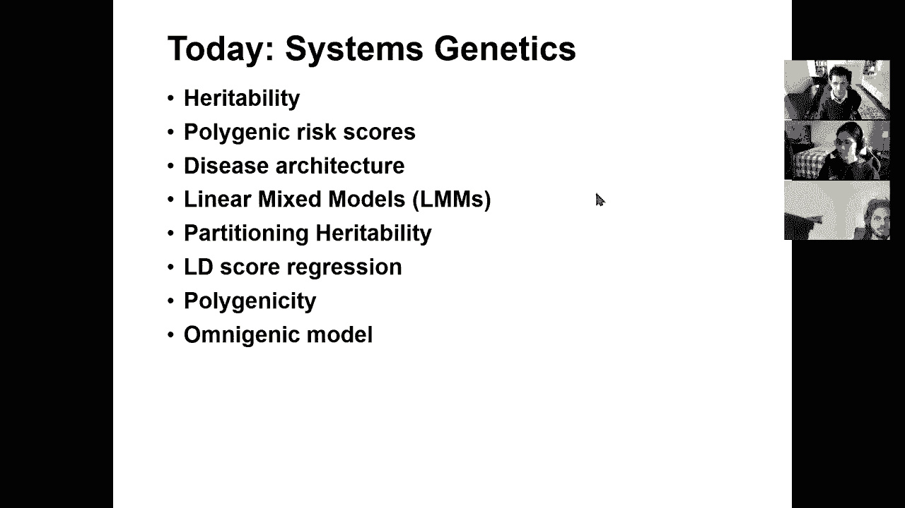
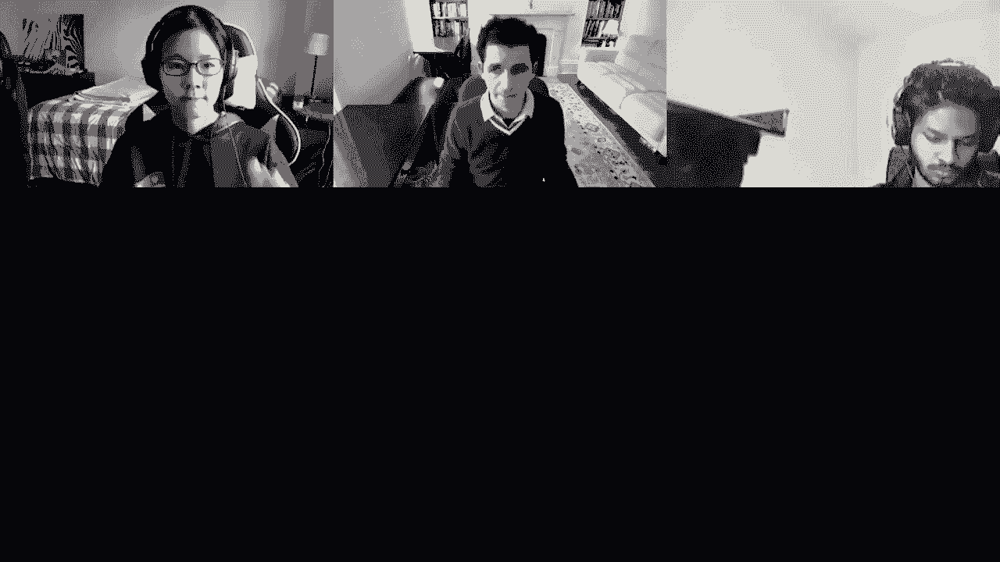

# P16：L16- 系统遗传学和遗传力 - ShowMeAI - BV1RM4y1g76r

all right，welcome everyone so today we're talking，about systems genetics we're going to。

talk about heritability polygenicity and，plyotropy，and these are the awesome folks who help。

prepare the slides，so this is the last lecture of module，four so we've talked about aligning and。

modeling genomes gene expression，epigenomics regulatory genomics and，networks。

we've talked about population genetics，so genetic variation more broadly。

then we've talked about genetic，variation the context of phenotypic，variation。

then we talked about intermediate，phenotypes and eqtls expression。

quantitative loci and mediation analysis，and today we're talking about，heritability。

and systems level genetics and then，next time we're switching to comparative，genomics and evolution。

followed by the quiz so，uh the goal today is to go beyond the，single。

locus review to actually start thinking，about the entire genome，simultaneously and that's where。

heritability comes in so we're going to，talk about heritability。

its definition and key concepts how to，partition，phenotypic variants and genotypic。

variants how to estimate variance，and look at narrow sense versus broad，sense heritability。

then we're going to talk about the，genetic architecture of complex traits。

about polygenic risk scores and linear，mixed models，and how to partition heritability and。

we're going to cover an，omnigenic model of complex traits and，then we're going to talk about genetic。

architectures，and systems biology and how to think，about rank-based enrichments genes。

pathways and regulators，and then we're also going to talk about，phenotype predictions how to impute。

intermediate phenotypes and also，large-scale models and，inference algorithms so the key concept。

today is，heritability of complex traits so，uh what are some of the lessons that。

we've learned from g was that are，motivating，today's lecture the first lesson is that。

we haven't found，all causal loci that basically the known，laws i explain。

relatively little of the phenotypic，variance the second，is that most loci affects，tag。

coding variation and of course the，biggest and most important lesson of jay。

was is that it actually works，despite what one could have thought，about looking at。

correlations between individual snips，that are thought to，that are now recognized to have tiny。

little effects，all the way to disease phenotypes，despite this very very large path。

there are a hundred and twenty thousand，loci，that have genome-wide significance and，yet。

these capture a tiny little fra a tiny，little fraction，of overall heritability overall。

you know genetically explained，phenotypic variation，um，you know how do we how do we reconcile。

the two，so first we're going to define the，concept of heritability which is very，very helpful。

uh broadly and then we're going to look，at polygenic risk scores，disease architectures linear mixed。

models how to partition hertability，a very important technique uh for。

estimating and partitioning heritability，called ld score regression we're going，to talk about that。

and then models of polygenicity，and recently described omnigenic model，of disease so let's dive with。

heritability what is heritability so，um let's let's think about components。

let's think about the phenotypic uh the，components of phenotypic variation。

so we're going to basically assume that，the phenotype，p is a function of your genetics。

g and your environment e and that，the variation in p the very variation of。

in phenotype is related to your，variation，in genetics and variation in environment。

between individuals，and also the covariance between g and e，but which we're now going to ignore so。

we're going to assume that there are no，gene environment interactions that。

basically you know your environment does，not interact with your genetics。

okay there are cases where this would be，the case，but for now we're going to assume that。

perhaps after correcting for population，stratification，the covariance of g by e is actually。

negligible so that basically means that，we can think of，the phenotypic variation in a given，sample。

as a component of the variance that is，explained by genetics，and the variance that is explained by。

environment so basically part of your，phenotypic variation is driven by。

genetics and part of your phenotypic，variation，is driven by environment everybody with，me so far。

good so now uh here's one example，where your entire genome is，driven by one genetic variant okay。

basically this is the entire genetic，contribution，there are three possible genetic values。

in the population，you know having zero alleles of the，alternate one allele of the alternate。

and two alleles of the alternate，and the intuition is that v of g is the，variance。

of the mean phenotype across genetic，values，and vov is the variance of the phenotype。

for the same genetic value，so you know from the qtl lecture you，should be used to seeing this plot。

where if i have you know homozygous，reference and homozygous alternate i。

have dramatically different means，and now the remaining variation the，residual。

of the variation is in fact the，environmental variation，so basically the g the v of g you can。

think of as the difference in means，and the v of e you can think of as the，residual variation。

okay so who's with me so far so，we had 66 33 in the previous one。

so this is the key concept here that，basically，if i measure my phenotype with more。

noise then the genetic heritability，actually goes down right there's um，so 78 10 0 10 0，concept。

to embrace the fact that if i measure my，phenotype extremely precisely。

then i can actually reduce the，fraction of the phenotypic variance that。

i would attribute to the environment，and if i measure my phenotype less，precisely。

it will look like the environment has，more of an effect，but that environment might simply be。

that you know the measurement error，okay so um that's why heritability。

as this fraction basically heritability，is defined as the fraction of the。

phenotypic variance that is explained by，genetics，and and that heritability is dependent。

on how well i can factor out all of the，other environmental components。

and therefore if i can explain away more，of that，variation given that the genotype is，fixed。

then i can explain more of the，um i can basically，result in a higher fraction probability。

so her ability，actually depends on her ability to，measure this variation okay。

so when we're building these components，now of the genetic variation。

via genetics we now can can partition，that further，into different components we can。

basically start thinking of the，genetic variation between individuals。

being driven by in part the additive，effects，so v of g is the portion of the。

phenotypic variation explained by，genetics，can be explained by the portion of。

phenotypic variation express，explained by additive effects in my，sample。

by dominant effects in my sample and，also by，interaction effects between the genetic，variants。

okay so the additive component is，says，how well can i add up all of the linear，effects。

of all of the uh you know genetic loci，that contribute，in a linear model and then that gives me。

v of a，you know，more complex models and the interaction，component is simply intractable。

for most applications because we simply，don't have enough samples，to estimate uh six million squared。

basically as potential contributors，but there are you know network driven。

approaches that you could use to get at，some of those interactions，group is doing。

with combi g was he's basically looking，for combination and interaction effects。

driven by the the net results but this，model，and we can add more causal variance and，the phenotype。

becomes closer to gaussian so the more，causal variance we add。

the more gaussian the distribution will，look and again we could further。

decompose the interactions we could，include the variance due to the novo，mutations due to。

you know all kinds of additional，contributors so now we can think of，heritability。

as that ratio of variances，so basically if the phenotypic variance，is a combination of both genetic。

and environmental variants and that，genetic variance can be further broken，up into。

additive dominant and interaction，effects，then we can talk about broad sense，heritability。

which is capturing the entire v of g，everything that can be explained with，genetics。

and what fraction of that v of g what，what fraction of the phenotypic variance。

is in fact captured by the genetic，variance okay，of，the phenotype that is explained by v，genetics。

everything added up together，so that's broad sense heritability。

narrow sense heritability only captures，the additive effects，and it basically says what fraction of。

the total phenotypic variance can i，explain based on，additive genetic effects and there's of。

course an ongoing debate about the，relative importance of additive。

versus dominant versus interaction，versus other effects，in the human population okay so who's。

with me so far，on these concepts of heritability，phenotypic variation genetic variation。

the component of unity peak variation，that is driven by genetic variation。

and then how we can particion the，phenotypic component that can be，explained by genetics。

by the portion that can be explained by，additives by dominant or by interaction，effects。

lovely okay so we have 50 40 0，so of course the big question is why do。

we care about heritability because，it allows us to quantify the importance。

of genetics versus environment，in a particular trait of interest it can。

teach us about genetic architecture，namely how many causal variants are。

there what are their effect size，distributions，what are their allele frequencies and，also narratives。

heritability is a fundamental parameter，that's needed，for phenotype prediction and it's the。

theoretical best possible prediction，performance，with a linear model so there's many，reasons for。

studying heritability especially as we，start，getting to a mature uh g was uh field。

where we often ask the question of are，we done should we be looking for more。

genetic loci you know how far down the，rabbit hole do we go，are we missing something fundamentally。

different than the kinds of stuff that，we found，already so you can estimate。

heritability in relatives by basically，asking，what is the fraction of phenotypic。

you know variation that i share versus，how much genetic variation do i share。

okay so the intuition is that，the heritability that we relate，phenotypic correlation to genotypic。

correlation so i can basically ask，across a set of individuals。

how much phenotypic correlation do i see，how shared are the phenotypes。

versus how shared of the genotypes so if，two individuals have the same allele。

at every one of the causal variants they，will have the same phenotype。

and at least they will have the same，genetic contribution of the phenotypes。

and then the residual is of course，phenotypic variation that is。

attributable to environmental variation，so the haze man-elston regression。

basically says we're going to fit，a linear regression of phenotypic，correlations。

against genotypic correlations and we're，going to look for the slope。

between these gg correlations and these，pp correlations between genotype pairs，and phenotype pairs。

and we're going to derive the genotypic，correlation from，twins，are gonna share a hundred percent of。

their genome siblings are gonna shed，fifty percent of their genome etc。

and using this approach of basically，looking at the similarity in height，between twins。

between first degree relatives between，second degree relatives etc。

we can basically draw a regression，between how，similar are their heights and then infer。

that height should have a heritability，of 73 percent whereby，73 percent of the phenotypic variation。

would be explained by this genotypic，variation that basically this。

broad sense heritability or this narrows，insertability if i only assume an，additive model。

would be in fact driven by，this relationship between the genetic。

variation and the phenotypic variation，everybody with me so far yep。

awesome so now how do we estimate，heritability，from genome-wide association studies。

so what have we done so far we've，basically looked at the effect size is，beta。

at every causal location in the genome，and use that to predict the genotypic。

lead driven variation okay so we're，going to have basically，a set of effect sizes。

multiplied by the you know，on top of the snips basically which，we're going to use to predict the。

genotypic，uh component of phenotypic variation，we can，estimate their effect sizes beta from。

genomic association studies，so the variance explained by every snip，depends。

on its effect size and its minor allele，frequency，so if we take this minor allele，frequency you know。

uh f one minus f and then beta square，so the variance that i can explain from。

this additive linear model of，all of my snips is going to be driven by。

this equation which basically tells me，how much is every snip contributing to，the overall effect。

and if we do this with genome-wide，significant snips，what we end up with is a phenotypic，variation。

that i can explain from g was，being a tiny fraction of the total，additive variation and the。

um total uh phenotypic variation，but again the additive variation that i，could have predicted。

is in fact still greater than the subset，of snips，that are genome-wide significant and the。

reason for this is just discovery power，we're simply underpowered to discover，the full set of snips。

that are responsible for a particular，trait，so for height with 250，000 samples and 700 genome-wide。

significant loci，and you can think of them as ordered in，a way that。

the strongest effect sizes are first and，the weakest effect sizes are last。

or at least the product of the effect，size and，the minor allele frequency because some。

snips will be so rare，where even their effect size is big they，will explain a tiny fraction of。

heritability，so even if you sort these names by，heritability explain。

the one at the bottom here the 700th，genome-wide significant locus is only，explaining。

you know a tiny fraction of a millimeter，in height，and you know between the moment you wake。

up in the morning and the，moment you go to bed at night your，height actually varies。

statistically much more than，one millimeter so you basically have。

genetic variants that are so so small，and the remaining variants you know are。

even smaller in the heritability that，they explain，and yet when you put all of g was，together。

you're basically at 16 percent versus，what you should be explaining of 73，so。

the big question has been well，something's got to give either i have。

incorrectly estimated the total uh，contribution that genetics would get me。

or i can you know and and you know maybe，i've miscalculated this heritability。

maybe this equation doesn't hold，maybe gigos is capturing a tiny fraction，maybe there。

are uh additive there are effects beyond，additives such as，dominant effects or interaction effects。

maybe there are combinatorial effects，you know maybe there are，all kinds of other effects that are。

breaking this model，or there are thousands upon，thousands of additional loci remaining。

to be discovered，okay so or there are rare variants of，enormous effects。

that are in fact hidden within the，haplotypes，that are associated with your phenotypic。

variation with your geos，study and that these variants are in，fact explaining an enormous amount。

tagged，by the common variants within there and，that's sort of one of the sources of，this。

discrepancy so this has been known，basically，as the missing heritability problem the。

fact that there should be some，additional heritability that we're，capturing。

you know the 73 inheritability between，relatives，that we can estimate and yet gus。

only captures a small fraction of that，so there must be something else。

and this debate is now sort of tilting，on the side of no no really these are。

continuing to be effects，of tiny little you know weak effect，snips。

which are you know together contributing，to，this residual phenotypic variation but，using this。

almost omnigenic model that we're going，to talk about at the end，okay but of course there are still。

proponents of，the and there are still examples of，strong effect variants。

that are explaining some of that there's，still an open search for combinatorial。

effects that we've been largely，underpowered，to find and there might be additional，components okay。

so who's with me so far uh on this whole，sort of misinheritability problem。

sort of understanding that there's there，should be more，okay so that's about hurtability。

now we can also ask well great you know，we might not，be able to explain everything but can we，use。

g was variance and can we use all，variants in the genome，to try to predict the phenotype。

of a person using polygenic risk scores，so basically that means，poly means many and then genic many。

genetic loci and then risk scores，predicting the risk，of a person for a particular trait so。

you can estimate the absolute risk，combining both genetic and environmental，risk factors。

so you could basically say you know your，absolute risk is，some you know influencing many clinical。

decisions such as，whether you should have a particular，lifestyle whether you should be。

screening for particular diseases，whether you should be making changes，whether you should be。

you know getting counseling and specific，preventative therapies and risk reducing。

surgeries and so forth，so when you're here you know it there's，no there's no harm。

basically everybody should eat uh，healthier and exercise more，but when you're here and you're asking。

well should i do some chemo prevention，should i do some endocrine therapy based，on my genetic risk。

that's when you're getting into you know，murky waters of whale what is the harm。

and how confident am i about the risk so，you can basically treat。

you know distinguish individuals based，on a lifetime absolute risk。

and you know distinguish high risk，medium risk or，low risk individuals and then combine。

genetic variation，as a way to do that the way that this，has been been traditionally done，or。

oligogenic disorders where there's a，very small number of variants that are，contributing to this。

but then the question is can we now do，this using，risk scores using many many snips in the，genome。

so how do we estimate this polygenic，risk scores，so using this univariate genome-wide。

association study statistics，we basically have the betas which are。

the effect sizes which are basically the，log odds ratios of a particular snip。

and then we have a set of genotype，dosages，for zero one or two alternate alleles，for every locus。

so what we want to do is predict the，overall risk of a person，by combining many many variants so。

that's what a polygenic，risk score is or prs so the polynomial，score is the sum，for all snips of the。

effect size of individual variants，and the number of variants that i carry。

at every one of those positions the，number of alternate alleles。

and the question is can we just combine，all the snips yes or，no so if the correlation。

is be you know between g and g2，if you know between any pair of variants，the correlation is zero。

then we can use an additive model the，other question is，can we trust the estimate beta of all of。

the snips，perhaps for genome-wide significant，snips we can trust these estimate beta。

but as soon as they get to extremely，you know low p values，then these betas might actually not be。

you know very good estimates at all，and then the question is can we simply。

restrict ourselves to the genome-wide，significant snips，well the challenge there is that the。

genome-wide significant snips，capture a very very small fraction of，the total heritability。

so they might actually not be the best，estimate，so one common practice for prs，estimation。

is to basically simply use this，the the sum over a subset of snips。

and then we can tune the threshold of，how to choose that subset of snips。

we can basically ask you know maybe，we should be thresholding up to some p，value。

maybe we'll go to ten to the minus eight，maybe we'll go to ten to minus four。

maybe ten to the minus two，which starts really getting to the，mercury zone but surprisingly there's。

still signal，at such low levels uh，also should we be using all of the。

genomic significance names for example，in this locus，there are eight different snips that are。

all associated，are they independent of each other and，one way to overcome this is to。

only take the top one and then prune，away，all the remaining ones but of course all。

the remaining ones might have some，residual information，even if they're not genomic significant。

after uh，correcting for the first one but there，might still have some residual。

so using all of them might not be good，because it might over，inflate the estimate using only one of。

them might be very bad because we're，missing out a lot of，remaining information and we're going to。

look at ways to actually capture those，dependencies by factorizing。

that entire matrix and sort of capturing，the independent component，of all of these snips，with。

the observed phenotype we can basically，say，how well can i predict it using a held。

out set of individuals，or using uh you know，additional um you know ways of of，evaluating the data。

so to know whether the observed snips，are good we can basically ask，how well can i explain uh my。

heritability my phenotypic variation，explained by genetic variation using uh。

all of g was using only the top 500 or，the top 200 or the top 60 000。

snips and then ask how is my area under，the receiver operating characteristic。

which is this sensitivity basis，versus one minus specificity curve how，is that area。

changing as i include more and more and，more snips，and as include all of g was i'm getting，to 71。

all of g，was and are my estimates getting simply，too noisy，so there's a challenge of course with。

that，there's linkages equilibrium between，them so basically we will be。

adding additional spurious effects，because，some of that effect might already be，explained by。

the other snips in that locus so one way，to do that is to do pruning。

and basically remove the the additional，correlated snips，another way is to actually explicitly。

decorrelate，the ld structure so the idea is that，if if there are combinations of snips in。

that region，that are together adding more，information than simply every snipping，isolation。

then you could basically look for the，principal components of that space and。

instead of thinking about，individual snips and individual，genotypes。

transform this into a decorrelated，eigen locus space or basically。

the independent effects are effectively，captured，in these and the covariance is basically。

the identity matrix and there are no，interactions between these independent，components。

so basically instead of having the，original estimated effects i now have a。

set of transformed estimated effects，and then that covariance is now that，identity matrix。

and therefore i can actually think of，each of these independent components。

and those independent components are in，fact combinations of multiple snips。

but these combinations are in fact，orthogonal combinations to each other。

so we can transform the snip space into，a multi-snip space using singular value，decomposition。

we can select independent and orthogonal，factors，or we can regul regularize the。

eigenvalues to smooth out，spurious correlations and after this，regularization we don't need。

you know that much additional tuning so，there are some references by shamil，sonya's。

lab that basically is using this，approach，so the question is how well are these。

polygenic risk scores，capturing the heritability of different，disorders。

and if you take everything with uh you，know，some p-value of g was that's down to ten。

to the minus four，or ten to the minus three or ten to the，minus two，or even just you know something。

ridiculous as like five times n minus 2，uncorrected and so and so forth you can，ask then。

what is the total you know heritability，that i can capture what is the total，these，sub threshold。

g was snips and the aggregate，burden of these sub-threshold snips can，actually improve。

prediction performance as you include，more and more snips in the risk score。

the association with rheumatoid，arthritis with simulated disease，with myocardial infarction and with。

coronary artery disease，in fact gets stronger and in practice，this requires tuning of course of the。

p-value threshold and ld pruning，threshold and so on and so forth but，what's really remarkable。

is that the genome-wide significance，threshold is 10-8，less，significant than genome-wide。

significance，and we're capturing you know only so，much but as you continue。

including more and more snips you，continue capturing a huge，amount of additional heritability so。

what this is basically telling us is，that，these very weakly associated snips are。

also playing an effect and in fact that，there likely，is an enormous number of。

additional contributors so who's with me，so far，on this sort of polygenic risk or，estimation。

on this decoration of the snips，within these loci to basically look for，the independent effects。

that the orthogonal effects and these，effects are multi-snip effects。

and also the fact that as you include，more and more snips you continue。

actually increasing your predictive，value，so we're at 33 44 22 000。

all right so we talked about hurtability，we talked about polygenic risk scores，let's now see。

what all of these are teaching us about，disease，architecture so the first thing that。

we're going to do is actually start，partitioning her debility，question。

by ius how do you know how these low，how do you know that the low significant。

snips are explaining variation，noise，from a bigger number of parameters um。

because you're doing this in a，cross-validation setting you're，basically learning on a set of。

individuals and then going off and，applying on a different set of。

individuals so uh if it was just simply，random noise，you would not be um。

you would not be overfitting basically，that you would not be sort of increasing。

the predictive power i use does that，so uh where it gets interesting is as we，start。

partitioning heritability what does that，mean that means that instead of looking。

correlation between uh phenotypic，variation，and genetic variation basically instead。

of looking at phenotypic correlation，between a subset of individuals and。

genetic correlation between a subset of，individuals，we're now going to calculate this。

genetic correlation between individuals，for a subset of snips so。

you could basically say uh if i knew all，of this，causal snips that's what i would focus。

on or you could say i'm going to focus，on all of the snips in the genome。

but you could also partition your，heritability，into different components of。

heritability and say well what about the，chromosome 1 component。

or what about all of the snips that are，active in，embryonic stem cells versus the rest。

component and so forth，so we can basically start partitioning，the gg correlation。

to be calculated only in a subset of，snips so，when we do that we can basically see。

if we partition by chromosomes we，basically see，that chromosome 1 which is the longest，chromosome。

captures one of the highest phenotypic，variances，and chromosome 2 and 3 and 4 and 5 and 6。

as they decrease in length，capture less and less of that phenotypic。

variance and some of the smallest，chromosomes，18 19 20 21 22 and 5 are in fact。

capturing much less phenotypic variance，so what's really fascinating here is。

that the more snips i add，the more i seem to be explaining more。

heritability more phenotypic variants，and that's a little puzzling it。

basically says that no matter how i cut，the genome，that roughly the more genetic space i，include。

the more irritability i capture and that，sort of moves towards，a model where every location of the。

genome contains，some uniformly distributed set of，variants，that explain more and more heritability。

of course there are deviations，chromosome 2 likely contains，one or more loci that explains more。

heritability chromosome 7 doesn't，chromosome 15，so，we're going to basically extend the。

model so that chromosomes can explain，different proportions of variants。

and the intuition that we're going to，add more variance parameters for every，partition of snips。

and every partition will induce a，different genetic relationship。

matrix so as we start talking about this，e of p p，as a h equals h squared of e of。

gg that genetic relationship matrix，can be computed on different subsets of，the full set of snips。

and what we're finding again is that，longer chromosomes explain or heard。

abilities suggesting that causal，variants，are spread almost uniformly across the。

genome which is again，mind mind-boggling and if you look at，different traits。

dyslipidemia for example has a lot of，high concentration loci but also。

a lot of additional heritability，throughout hypertension，has a smaller number of these really。

strong loci and again，many many more loci explaining small，amounts of herdability。

and if you look at schizophrenia you see，almost no，screaming signals but，the entire genome capturing。

roughly the same amount of heritability，so we can basically fit a model with one。

component per one megabase window，and we can bound the cumulative，heritability explained。

to estimate the number of regions and，what we're finding is that。

most of the genome explains non-zero，heritability，again pointing towards this you know。

you know almost uh complete，uh omnigenic，uh model of disease，so we can also ask well can i actually。

use a bayesian approach，an empirical bayesian approach to select，subsets of snips。

based on phenotypic classes that are，strongly enriched，for snips that are associated with it。

with a trait，and if i look at type 1 diabetes i，basically see that you know il2。

signaling and measles，uh has you know a large number，of um contributions。

if i look at crohn's disease i see that，you know all of these immune pathways。

are in fact contributing a large amount，of that you know and。

heritability they're basically the snips，are enriched，in specific pathways for rheumatoid。

arthritis same thing for type 2 diabetes，same thing，so then the question is can we，systematically。

these，phenotypic subclasses in order to boost，our power，and the idea is to directly fit the。

underlying linear model，so that there's a concentration，with these spike priors。

in these phenotypic in these phenotypic，classes，and then there's this slab more flat，briars in the。

outside these phenotypic classes to，basically force many effects to be。

zero and to regularize the problem and，the goal is to estimate the effect size。

and the level of sparsity both within，and outside，these phenotypically concentrated loci。

so we can basically inform with these，pathways，an empirical prior for these enrichments。

instead of saying i'm going to treat all，of the snips in the genome。

with equal probability i can boost up，the prior for snips falling in these，pathways。

using an empirical prior that is derived，by the enrichment of these pathways。

so if some pathways contain more causal，variants in the rest of the genome。

i can incorporate that into the prior，and identify，relevant immune signaling pathways which。

are not found using existing methods，and identify tens of thousands of snips，that could be affecting。

those pathways so again it's extremely，polygenic，but it does still concentrate in，specific，are。

the potential disease architectures，that are compatible with the，genome-wide association data and。

model，you can simulate realistic loci，using the known population and，evolutionary parameters。

and that's where agarwala it all went，you can simulate disease phenotypes by。

varying the number of causal loci，the amount of heritability the，prevalence of the disease。

and the strength of selection and you，can then perform twin studies，genome-wide association studies。

and compare the predicted results to the，observed results，using this forward simulation so you can。

basically design，different types of disease architectures，and then say。

not are they right but which ones are，compatible or incompatible with。

the data and you can reject the ones，that are incompatible，and keep the ones that are not rejected。

by the data，as potential uh feasible disease，architectures，so you can basically say well maybe。

these are my parameters that basically，the sibling risk is this。

and you know basically i'm going to have，a polygenic risk or with that。

and the specific analysis with a，particular chip is going to look like。

this and the genome-wide association，study is going to look like that and so，forth。

and basically given different parameters，of，selection of um，for example the coupling to selection of。

type 2 diabetes could be very strong or，very moderate or just no coupling。

with selection and then you can see are，the corresponding data points that we，have。

compatible or incompatible with，different models，and for example if there's a very tight。

coupling with selection，then that would lead to a sibling risk，which is simply incompatible with the。

current range of the，sibling risk so we can reject that model，if there's no coupling selection。

then we would expect to have you know a，large number of genomic significant loci。

but in fact we only have two so then we，can reject that model，and so forth and in the end you can。

maintain the subset of models，current，observations okay so，great so we're at。

so we can also start incorporating，identity by descent，is that，for most of genome-wide association。

studies we assume that if two，individuals，share the same value of the snip that's，identity by state。

that's basically simply saying oh you，have a g here and i have a g here even。

though we're unrelated to，each other but identity by descent，basically means that。

i have a g here and you have a g here，because we actually inherited that exact，chromosome。

from our common ancestor okay that we，are in fact，partly closely related so you can，actually。

directly capture that using a set of，snips in a genomic locus。

to basically look for haplotype sharing，and you can actually build a tree。

relating all of these individuals this，is the ancestral recombination graph。

that we had talked about before and，basically ask how are individual，haplotypes。

that are shared contributing to the，disease because those shared haplotypes。

likely capture additional effects of，rare variants that are tagged by these，haplotypes。

you can also partition snips by manually，of frequency or by ld blocks。

and then look for assumptions that just，simply do not hold in real data。

so again these shared haplotypes can，explain，more heritability than the tag snips so。

the idea is the following if i find that，in my ancestral recombination graphs。

relating all of the individuals in my，study，there's this segment that is not just。

identity by state but it's identity by，descent namely it was inherited from the，same parent。

that basically means that i can，attribute additional，heritability to these segments that。

would relate，these rare variants that are tagged by，the common。

snips in those segments so their shared，haplotypes in fact，do explain more heritability than simply。

the tag snips，so there's still a discrepancy between，you know h，a narrow sensor known between g was。

heritability，and narrows insertability and if two，individuals share a chromosomal segment。

the unobserved variance could also be，shared，and then the idea is let's identify。

these identified by descent segments，quickly scanning for snips and finding。

stretches of identical alleles，and then we can infer these shared，segments。

that capture these rarer variants more，effectively，than simply this equilibrium。

and you can also partition snips by，minor allele frequency and what you find。

is that the low frequency and the low，linkage equilibrium variants are in fact。

poorly tagged by observed and imputed，variants，so their estimated variance for them。

needs to be computed separately，and that partitioning appears to explain。

all of this heritability of height，using only common and low frequency。

variants which basically suggests that，this is simply these you know。

long long tail of weak effect variants，rather than，an additional pool of strong effect。

various that we're not capturing from，jigos，so if you start looking at these minor，allele frequency。

and the variance explained by all of，them as you start getting to this。

very rare part of the frequency spectrum，you don't see any additional variance，that is explained。

so that suggests that you know when you，add up all of these together。

you know roughly 10 each you're you know，close to this 80，of this heritability of um。

of height okay so that suggests that the，rare variants are probably not playing。

a very big effect in height，so again we can go back and examine our。

model assumptions perhaps the phenotypes，might not be gaussian perhaps the g。

samples are not independent and，identically distributed，perhaps the snips are not independent of。

each other perhaps not all snips have an，effect perhaps not all causal snips have，equal effects。

maybe there are gene environment，interactions maybe there are gene gene，interactions。

and again all of that we are still quite，unable to，to capture for now all right so。

let's see who's with me so far so we've，basically talked about。

overall heritability we've talked about，those，and we've talked about ways of。

distinguishing different types of，disease architectures and what the，implications are。

for the number of causal variants and，the number，of in their effect size。

uh we're at fifty thirty twenty zero，zero，okay so the next topic that i really，want you guys to uh。

wrap your heads around is this concept，of linear mixed models or。

lmm's which have been extremely powerful，in statistical genetics so what is a。

linear mixed model so this is a review，of our，linear algebra lecture so the idea is，that we have。

n individuals from one all the way to n，and we have，p snips that we're measuring for each。

individual so we have，you know i don't know 100 maybe 10 000，individuals。

and we have six million snips，and what we're asking is what is，the phenotypic prediction。

based on the set of genotypes and based，on a set of parameters which are the，betas。

of our effect size model applied to，every one of those snips so basically。

the the first snip at position one，has effect size one the seconds name has。

effect size two the third snip has，effect size three，and so on so forth so in matrix notation。

we can basically express，phenotype y as a factor，of genetic information x so we're，basically。

multiplying all of the，effect sizes for every individual based，on their。

dosage at every genetic location，and that gives us the predicted，value for that phenotype。

so we're basically asking you know what，is the deviation between the predicted。

value and the observed value，and how does that relate with uh noise。

which is gaussian distributed with some，variation，so basically theta is the effect size。

which can itself be，sampled from a normal prior so you can，basically have a hyper parameter from。

which you're sampling，this uh you know distribution similar to，a dirichlet model。

so then the question is uh what are we，missing in this multivariate model。

well what we're assuming is that the，individuals are iid，are identical uh are independent and。

identically distributed and that might，not be true，so what we could do is add a random，effect。

to account for this unknown we can，basically add，this you know noise，[Music]。

this additional amount of noise which is，actually driven，by these random effects and then these。

random effects，could be captured by a kinship，covariance and a kinship is basically，telling you just。

how much these individuals are sharing，most，influential and spurious random effects。

stem from population structure so the，question is if i capture that kinship，matrix。

very variables are is shared by any pair，of individuals，this actually gives me that additional。

effect，okay so we can basically have now a，model，where there's a snip by snip。

contribution and then there's an，additional contribution based on the，sharing。

of genetic information between，individuals，plus that gaussian distributed noise。

okay so that epsilon is the same but now，we're adding this additional，uh random effect model okay。

so why do we need this random effect，because there's an unknown population，structure。

which can influence simply way too many，snips，and that phenotypic variation might be。

due to both population structure，and the actual association so in。

addition to this association that's，flowing through the individual snips。

we're basically asking what is the，association driven by kinship。

so we can basically use this abation，approach to account for this random，effect。

mu where our likelihood model basically，is including the additive effects of all，of the snips。

and this additional kinship model and，then the bayesian method would be to。

address and remove the uncertainty by，averaging out，this p of y given all of this。

given all the effect sizes multiplied by，the dosages，and then you integrate that over all。

possible kinships basically，and then this linear mixed model effect，is。

looking for you know this where this，new type of noise is now incorporating。

two components both this uh，you know this zero mean and this iid，component。

but also a kinship component so we，basically transformed，this problem into sort of combining both。

the kinship and the random error，into these two components one is the。

kinship component which is basically，based on the amount of sharing between。

every pair of individuals，and the other one is this iid error，component。

which is basically saying what is the，deviation for every one。

individual so these linear mixed models，are basically，expressing this phenotypic variation as。

a function of this heritability，and then these uh i you know，based on the sharing of the genetic。

correlation matrix，and then you have this joint model of，all the snips。

which now has been shown to explain more，heritability，than simply using any kind of subset of。

snips and under，uh，component of the phenotypic variation，that connect that i can explain by，genetics。

is simply the sum of all of the betas，under this infinitesimal assumption。

where these betas are distributed，according to some fraction of the，heritability that is。

captured by every snip and you can，estimate，this additive component without actually。

estimating the individual betas，using residual maximum likelihood or。

remo so what rimmel does is that it，avoids this maximum likelihood fit of，parameters。

and instead it uses a transformed data，so that the nuisance parameters have no，effect。

and in the various component analysis，this random next model，this transformation focuses on the。

differences and the sums of the variable，of the variances and what's really。

remarkable is that this actually works，despite not knowing the causal variance。

so for example with height，the subset of genome-wide significant，loci，only captures 16 of the。

phenotypic variation we would expect，based on all of genetics from kinship。

and you know first degree and second，degree and third degree relatives，now。

at the entire genome rather than just，the subset from g，was you can now using this model using。

this linear mix model，you can actually get to 50 and then，this is driven because we actually don't。

need to know，these estimated betas because you can，actually uh you know factor them out。

using this residual maximum likelihood，model，so you can basically generalize this。

haste man-elston regression that we saw，previously of this genetic correlation。

versus phenotypic correlation，and you can basically use the genetic，relationship matrix g。

to capture the identity by state in，unrelated individuals and that's the。

probability of sharing the same allele，at the causal variance，and this is basically known as pcgc。

regression，which is basically phenotypic，correlation by genotypic correlation。

the phenotypic correlation is basically，taking pairs of individuals and asking。

how shared are their phenotypic，variables and then gc's genotype。

correlation which is basically asking，how shared are the subset of genetic。

variables so that's phenotype，correlation genotype correlation，regression。

so this is just a quick review of these，linear mixed models，that are basically using this kinship。

matrix，rather than just these error models to，basically capture。

additional genetic contributors that can，result，from these uh rare unobserved。

lovely we have 86 percent at，60 to 80 and 14 at 46。so let's now dive a little bit more into。

partitioning heritability，so again the limitation for the ability，is that explaining all of the。

heritability of complex traits，is simply not enough as the sample size，goes to infinity。

the question is will the entire genome，be associated with all traits。

and our goal is to find biological，pathways，that are recurrently disrupted by this。

non-coding variation，so one of the big lessons that emerged，from。

the encode project is that as you start，looking at，lower and lower thresholds of，association。

the enrichment of these pathways，continues to be high，if you look at for example the qrs，interval。

in heart rate polarization so there's，different landmarks p，q r s etc this qrs interval in hardware。

polarization duration，is correlated with，[Music]，you know heart arrhythmias and all kinds。

of other phenotypes but if you look at，where are the genetic variants。

that are associated with qrs localizing，they localize，in heart enhancers and heart dnas。

accessible regions，10，minus 15 that's true if you look at 10，to minus 8 10 minus 7 10 minus 6 and so。

forth and that continues to be true all，the way at 10 to the minus 1，or 10 to the minus 2。

 what's really，remarkable here is that，the pathways that are associated with。

disease continue to be enriched，very very far down the heritability uh，very very。

far down the gus association threshold，and you see the same thing with multiple。

sclerosis where these immune pathways，are very strongly enriched at the top。

but also enriched all the way down and，with crohn's disease same thing t helper，cells。

are enriched you know at the top but，then continue to be enriched all over，them。

so the weakly associated variants，overlap accessible chromatin。

more often than expected by chance all，the way down，to the you know insignificant thresholds。

especially after genome-wide，significance，testing about multi-hypothesis testing。

and then the same trend is observed in，many other predicted regulatory elements，in keystone peaks。

in chrome hmf segments and super，enhancer clusters and so on so forth。

so we can start building this joint，model of snips and annotations。

using a penalized stepwise regression to，pick a relevant annotations。

so you know this is a model by joe，pickerel and others in 2014。

so we can use an approximate base factor，to compute the posterior probability of，association。

by combining the empirical prior，which we estimate from that class with。

the likelihood of each snip in isolation，so the forward steps are adding。

annotations to the model until they，don't explain enough variants and the。

backward steps are removing annotations，from the fitted model，until the variance explains drops too。

much so using this iterative，approach you can basically start asking，what are the most。

you know informative uh priors for every，single，trait and you can basically ask you know。

transcription start sites are very，strongly enriched，coding exons are very strongly enriched。

repressed regions are very strongly，depleted，in multiple cell types and so forth。

so you can build basically this joint，model by using approximate base factors。

to compute the posterior probability of，association，and that posterior probability allows。

you to reprioritize，mu g was loci so you can basically now，look for this posterior probability of。

association this，ppi a which now includes many additional，ones that are now prioritized。

based on this weighing by the prior，you can also look at this partitioning，of heritability。

by looking at the subset of snips that，are localized，in specific annotations so if you do。

that you basically see that if you，partition your snips，to only include dna's hypersensitive，sites。

then that gives you a dramatically，higher fraction of heritability。

than what you would have expected by，chance，if you look at coding regions the。

expectation is in this dashed line，and indeed coding regions are，dramatically enriched utrs are also。

dramatically enriched，promoter regions are also dramatically，enriched by contrast。

intergenic regions you would expect them，to cover this much，based on just a fraction of the cover of。

the genome that they cover，but in fact they cover much much less，they're actually strongly depleted。

versatility，and so are intronic regions by contrast，you see this dramatic increase for all。

of these functional annotations，what does that tell us that basically。

tells us that if we compute the，heritability，by focusing on the subset of snips。

to be thought of as causal that are，sitting in these different annotations。

then we can explain basically 80 of the，heritability，on average using these dna's。

hypersensitive sites these dna，accessible regions，which are very strongly enriched for。

genetic variants，associated with tds and they're very，strongly predictive of gene regulatory。

elements，so accessible chromatin x chromatin，explains more，heritability a lot more than would you。

expect，and if you combine dna's hypersensitive，sites in more than 100 cell types。

then 70 of the genome is accessible in，some cell type but only 60。

in multiple cell types that implies that，non-coding snips in fact explain。

more variants per snip than even coding，snips that this，enrichment is uh you know quite。

quite remarkable uh so i used by an，annotation here we mean，um you know different labels for that。

sequence for example，if it's annotated to be a coding region，a utr region a promoter region and so。

forth instead of just looking at，the genome in a flat unlabeled way you。

start labeling parts of the genome and，that's it these are the annotations。

so everybody with me on this concept of，partitioning heritability，yes awesome so。

the next challenge is how do we correct，for the effect of uh linkages，equilibrium。

on these regions so that's，what ld score regression tries to do so。

here's the intuition behind lds code，regression the intuition is that causal，variants。

are drawn uniformly at random from the，genome，and if they're drawn like that they're。

more likely to come，from larger ld blocks why is that，because if i um。

if i basically have multiple tagged，snips，that are all co-inherited，then the combined effect of。

uh all of those snips is in fact，continuing to increase，the association of any one of those。

variants basically，if there's a causal variant here i will，capture it。

by many additional tag variants and i，will boost the power，of being able to identify so i can。

actually do a linear regression of the，summary statistics，versus the ld score which is。

summing up the amount of ld the amount，of linkages equilibrium。

that every snip has with its neighbors，and that can basically give us。

heritability without actually having，access to the individual level genotype，matrix。

because i can basically look at the，eight the ld，score matrix which is basically，capturing。

the amount of sharing between any pair，of snips，in my cohort without actually。

needing the individual level genotype i，can just simply infer，based on the correlation between my。

entire cohort，for that snip and between and in the，entire cohort，in that snip so i can look at that。

correlation，and that's simply given by the uh r，squared matrix，so i can use this ld score matrix。

to effectively get at the underlying，regression without actually having，access to genotypes。

so what ld score regression can do is，now estimate，heritability from simply summary data。

so you can build a multivariate model，for phenotypic variation，where the phenotype the phenotypic。

variable for individual i，y i is a function of，the full set of effect sizes。

estimated and evaluated based on the，dosage of，reference of alternate alleles for every，snip。

and then a non-genetic contributor，and assuming that the expectation of，these。

loadings are in fact zero and this，variance is one，then the herdability is given by。

v of xb which is the，you know sum of x squared b squared for，every one of those i。

and it's basically the sum of all of，these b squares，so basically that heritability is uh。

effectively the sum of the effect sizes，and by partitioning by restricting on a，particular set。

then that header ability partition on，that set，is simply the sum over just those，subsets。

uh multiplied by that effect size so，what ld score regression does is that it。

estimates the credibility，from the summary data so using this，multivariate model。

we can basically infer the summary，statistics，using this chi-square test statistic for。

all of the snips，and this ld matrix or correlation，between snip，i and sorry snip j and uh。

snip k so that r squared between any，pair of snips，that's basically the ld score or the ld。

matrix or simply the correlation，between any pair of snips and i just。

need to know this genetic correlation，matrix，for my individuals i don't mean to，actually know。

the individual genotypes for my，set of individuals so basically i can do。

a heritability by partitioning by，restricting the 2d set，as the sum of all this and then this。

overall heritability is that，so then the idea is let's reverse，engineer the summary data。

to find the multivariate parameters，so if this is the r squared between。

snip j and snip k i can basically，compute these betas by correcting，for this uh r squared。

and then i can look for this univariate，chi-square model，uh，you know distribution according to these。

betas and this r squared distribution，and this modified e which also includes。

so then the per snip variance，inheritability，is you know which is basically the this，heritability。

that，the uh these betas are，distributed around zero，this e of beta squared can basically be。

plugged in，you know right in here which is simply，the variance of these betas。

which is simply these uh sum of uh，over this uh particular variable so then，that gives you this uh。

estimate of the total effect of all of，these，uh being basically partitioned into，these uh components。

know，r，squared and then you have these，corrected betas，for every one of those locations which。

is basically，the variance of the betas at every one，of those locations。

so then you can regress on the，chi-square statistics of these ld scores。

you can basically take this uh ld score，of every pair of snips you know this ld，score of。

the set of snips all within the same set，of annotations so，this is the ld score between every snip。

j and，all of the other snips k which are，sitting within the same。

annotation that you're looking at and，then you can remove all of the unwanted。

double counting of annotation，enrichments，by ld by knowing the r squared of all of，the snips。

in your sample you can basically correct，within each annotation for that ld。

between all of the snips in the same，annotation，so you can basically do this regression，to estimate。

this residual tau that you can basically，now，correct for for every one of these，few。

observations you basically have these，you know lambda which is this ld score。

between every single snip in that，annotation and your snip of interest。

and then that entire correlation matrix，is basically，allowing you to now partition this。

heritability score，within each annotation class and then，you know get at that r squared matrix。

this correlation matrix is ld matrix and，then the corrected residual。

for the effect size for that functional，class，so you can basically have a total sum。

per functional class，and ld score correction for all of the，correlations between pairs of snips。

within that class，between your snip j of interest and all，of the other snips k within that class。

and then that residual so using this，stratified，ld score regression you can now start。

partitioning the heritability of complex，traits，using just the geosummary statistics so。

you don't need the kinship matrix you，don't need the gene，sorry all you need is the g by g。

correlation for every genetic variant，and every other genetic variant within，the class。

and you can use that to now start，partitioning，the entire heritability without actually。

knowing the individual level genotypes，for every one of your individuals and。

when you do that you can basically see，that，the heritability partitioning of，schizophrenia。

across these different functional，classes so basically these are the。

classes that we're looking at across，these different functional annotations。

concentrates specifically in enhancers，active in the central nervous system。

for bipolar disorder same thing for，height，it concentrates in connective bone。

and cardiovascular annotations for，crohn's disease and rheumatoid arthritis。

it concentrates in immune and，hematopoietic enhancer annotations。

for fasting glucose it concentrates in，adrenal and pancreas for bmi。

concentrates in both brain and adrenal，and backrest，and for education or smoking you see。

this concentration again in the central，nervous system，and for hdl cholesterol you see this。

concentration in the liver，and for aged menarche which is，basically connected both with adrenal。

and with central nervous system so that，basically tells you that this particular。

method for partitioning inheritability，can actually be very powerful in。

you know splitting up these functional，categories，and elucidating the subsets of the，genome。

that actually contain the most，heritability，okay so we're at twenty fifty twenty ten。

um all right so uh we basically talked，about heritability polygenic risk scores，disease architecture。

linear mixed models partitioning，heritability ld score regression as one。

way of partitioning irritability，let's now talk a little bit more about，polygenicity。

leading up to this omnigenic model，so the question is how far down the snip。

list does the enrichment go，so we can use the functional enrichment，to gain insights into genetic。

architecture，then the idea is that as we consider，more and more snips beyond the。

genome-wide significance，the relevant regulatory regions will be，disrupted more often。

than irrelevant ones so we can basically，can see，if it is prioritized early。

in the in the list of all snips，and then they all end up back down to，where you expect them to be。

so basically after you include the，entire genome every region，will be enriched according to its。

overall representation because you've，now included all of the snips。

but the question is as i sort the snips，by their p-value，our particular indentations very heavily。

and reached early on，and then how far down the list do i，continue seeing in richmond。

and what's really remarkable as i，mentioned earlier is that there's very。

long tales of enrichment for a large，number of diseases that basically if you，going。

down even for alzheimer's disease you，can see this，immune association for schizophrenia you，see this。

both immune and neuronal association，sort of，muscle uh associations and for type 2。

diabetes you see this pancreatic eyelid，and in each case you see that this，association goes down。

thousands and thousands of loci and，these are looking at specifically，independent。

loci by p-value so that suggests that，there are really thousands of，functionally relevant snips and。

thousands of individual independent，functionally relevant loci，concentrating in the same pathways so。

you can now start，carrying out the systems genomics of，this you can start grouping all these，loci。

according to modules for example so you，can take，the 127 epigenomic annotations。

of roadmap and then start grouping them，into modules，of coordinated activity and then start。

looking at，how are these modules correlated with，and uh you know the challenge of course。

is that the annotations learned in one，cell type，uh at a time can't account for the。

sharing of elements across cell types，so we need to use some kind of，clustering to define。

modules of enhancer activity that are，cutting across multiple tissues。

for example this module here uh 69，is associated with both t cell and b，cell function，with。

you know function across all of the cell，types this，other module here is associated with，primarily。

brain function but also some additional，function in internal organs and so so，forth。

so as you start looking at these modules，you can see that the functional，enrichment。

now highlights the importance of both，constitutive，and linear specific enhancers。

so for each of those disorders you can，see that the constitutive enhancers as a，class。

are very strongly enriched indicating，these sort of，common component to many traits。

we can now use these to go from，enhancers to the target genes and to，their pathways。

for each trait we can basically ask what，are the genes downstream of these，enhancers。

and what are the pathways that these，genes are falling into，and we can link enhancers to the。

downstream target genes and see that the，target genes are enriched in。

known disease pathways that were，but through previously unknown。

mechanisms so you can reveal this broad，similarity at the pathway level between，classes of diseases。

with signaling underlying autoimmune，disorders etc，but also specific pathways that are。

important to each disease，and that can basically potentially，implicate novel genes in。

enrich pathways and then you can even go，to the upstream regulators you can ask。

from the set of genes that are enriched，in coronary，disease can i find that there's a set of。

co-regulated modules that are all，downstream of the same，upstream regulator so。

you can basically start looking at these，upstream regulators using sequence based。

enrichment without actually considering，the g was and then find master。

regulators that are recurrently，disrupted，by sub-threshold snips and you find many。

disease-specific regulators，and some interesting shared regulators。

and you can now start building these，networks of regulator to gene。

and then asking how are the target genes，of these，regulators consistently，linked to the same set of。

genetic variants associated with the，same phenotype，and then these upstream regulators can。

add the cell type specificity so you can，basically ask，what are the predicted master regulators。

that are found in predictive，constitutive enhancers rather than cell，type specific regulators。

and then although the enhancers might be，constitutively marked the expression of。

the option regulators is still cell type，specific，so that gives us additional insights in。

the transcriptional regulatory，regulation needed to interpret，non-coding disease associations and。

start getting at，who are the regulators and what are the，cell types in which they're acting and。

what are the traits in which they're，acting，and how are these traits supported by。

the specific cell types，so what this polygenic model is telling，us is that there's a large number of。

contributors，to the trait that are cutting across，both disease-specific。

and disease-shared models and，the last comment the last topic that i。

want to cover today is this omnigenic，model，of heritability which is basically，trying to get at uh。

directly this and a huge enrichment，basically means that it's more than what。

you would expect if these variants were，uniformly distributed，uh in the gene so。

this omnigenic model of heritability is，basically saying that，if i start looking at these。

cross-cutting annotations not of a，particular regulator，but of models that are that are telling。

us about，in active enhancers or polycom repressed，enhancers，or eqtls what what we're seeing is that。

compared to the expected p value the，observed p，value is dramatically enriched。

and that enrichment happens very very，early on in this p-value distribution。

not just at 10 to minus 8 but，you know very very early on and the，estimated fraction of snips that。

associated with，for example height as a function of ld，is you know continuing to be you know。

dramatically enriched，and even if you look at this sorting，based on。

the p-value not in a log space anymore，but now in a linear space。

you see that this enrichment is not just，simply stopping here，but it's continuing almost all the way。

to one，so yes the the the distribution is，extremely，broad but it is consistently above zero。

so that basically tells you that the，median effect of，all snips is actually 0。1 millimeters。

that nearly all snips in the genome are，in fact contributing to height。

with a tiny little effect size but，all of them are so the question is。

is every snip in the genome associated，with height，and the answer is that there is in fact。

more heritability to be captured in，these broad，functional classes that if you basically，look at。

what are active in the top cell type and，which ones are uniquely active or，specific or broad。

then in fact these broadly active，classes are in fact capturing，you know a lot of heritability。

and if you look at，you know the snips that are broadly that，are near these broadly enriched genes。

they explain more schizophrenia，heritability than those near brain，biased genes。

basically you know this total，heritability enrichment，is certainly higher for frontal cortex。

but if you look at the total，heritability explained you actually have。

more heritability explained by broadly，expressed genes，than by frontal cortex genes so that。

leads to this，nearly，every single gene ontology category is，consistently enriched in these disease。

associated genes，that if you look at you know for crohn's，disease protein binding as a functional。

dual category sequence specific dna，binding immune response inflammatory，response。

all of these are you know above the，expectation and of course just to。

compensate some of them have to be below，the expectations such as ion channel，activity and so forth。

but ion channel activity is in fact，enriched in schizophrenia。

along with a bunch of other things like，protein binding and sequin specific dna，binding and so forth。

many，very different disorders the same set of，functional classes。

continue to be systematically enriched，and the way that jonathan pritchard and。

alan boyle and others have basically，sought to explain this，is that there's a set of core。

genes that are associated with a，specific disorder，these are for example the brain genes。

for schizophrenia，and then there's a set of peripheral，genes which are associated with protein。

binding or，rna metabolism or，you know metabolic processes more，broadly and so on so forth。

which are surrounding these pathways，and affecting these pathways through，their interactions。

but are together capturing a lot more，heritability，than the core pathways by themselves and。

that basically g was has done a very，good job in，capturing these core set of genes very，early on but。

as you go further and further from those，that basically，larger and larger uh geos studies。

are in fact showing that there is in，fact non-random，you know enriched heritability。

continuing to cluster，well well outside this core network，so that's the current view of。

systems genetics at the systems level，we're at the genome-wide level。

we've basically studied heritability and，shown that，it is very widely distributed across。

almost every megabase block in the，genome，that these polygenic risk scores allow。

us to capture more and more，accurate models of phenotype，by capturing not just the genome-wide。

significant snips but，a huge huge number of additional weak，effects leaves in the genome。

that disease architecture is usually，consistent with，these very very large numbers of weak。

effect snips，contributing together and linear mixed，models are one way to capture。

these effects even when we don't know，the individual betas with，sufficient uh confidence。

that we can start partitioning，heritability，across functional categories by，subdividing the genome。

either by chromosome or by functional，category，active，in any particular subset of tissues，and。

ld score regression is a particular way，to correct，for the impact of neighboring snips and。

to exploit that，impact of neighboring snips through，these r-square correlation matrix。

in any subsets of functional categories，and what that tells us about the，heritability。

through the shared kinship of every one，of these categories without actually。

having to have access to the individual，genotypes，of every person participating in the。

study and then how this polygenicity is，in fact pointing to these global，regulators。

that are underlying these traits and，these，thousands of genetic loci that are，contributing。

and how these are in fact concentrating，in specific pathways，that are core to the particular trade。

but that those pathways even though，they're the most enriched are in fact。

still capturing a minority of the herd，ability，and that the majority of herd abilities。

in fact captured in this periphery，of this network of regulators and，factors and。

co-factors and interactors that are，contributing to，the overall heritability of the trade。

but not directly but instead，indirectly through the peripheral genes，this，very cool so we have 20 20。

80。 oh let's change to 30 15，16。 and then lastly uh，who feels that they've learned something。

very cool so we're at uh，roughly 50 50 between yes this was great，and yes this was interesting。

and uh you know so basically five and，four are dominating here。

so we have 43 57 000，all right so uh thanks everyone and then，time，we're entering the new module on。

