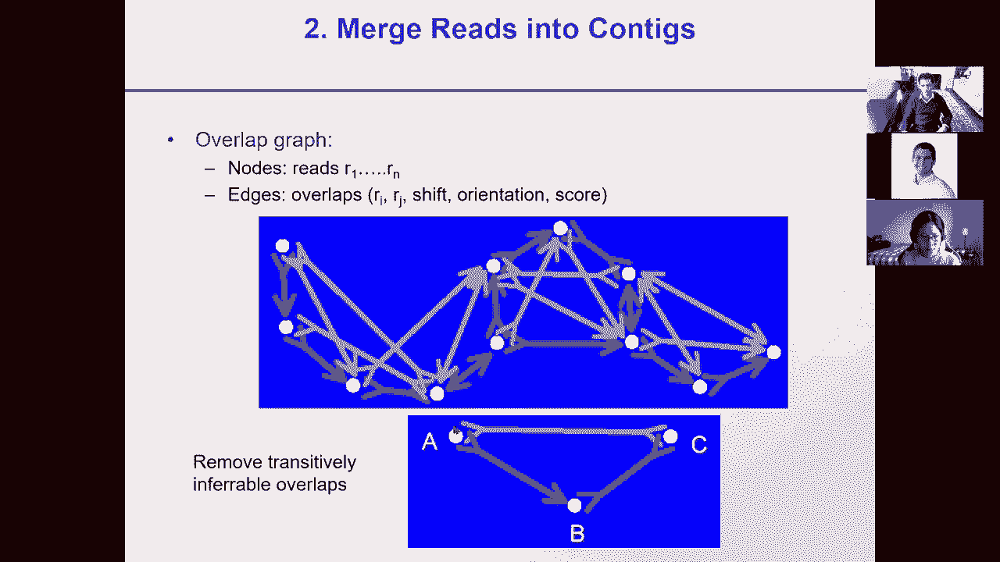
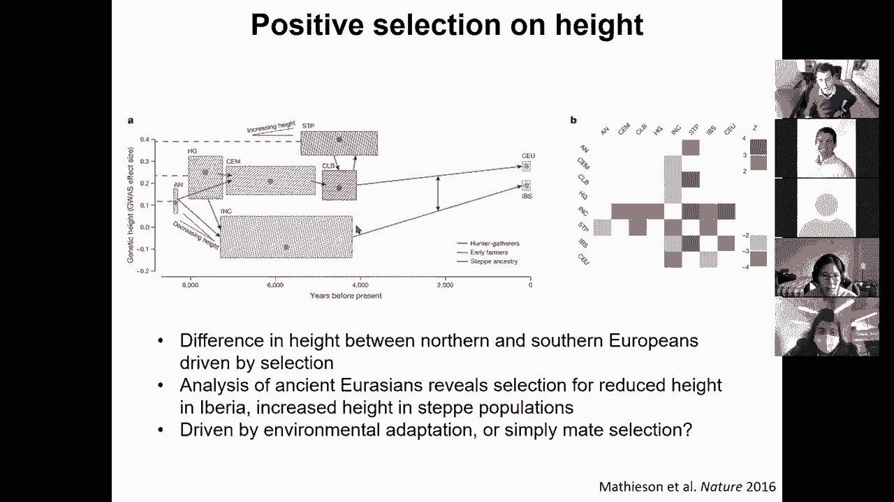
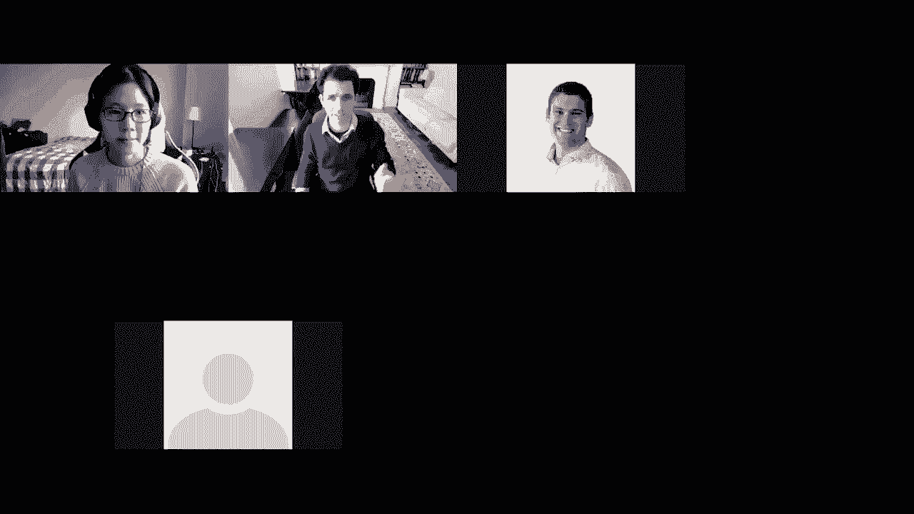
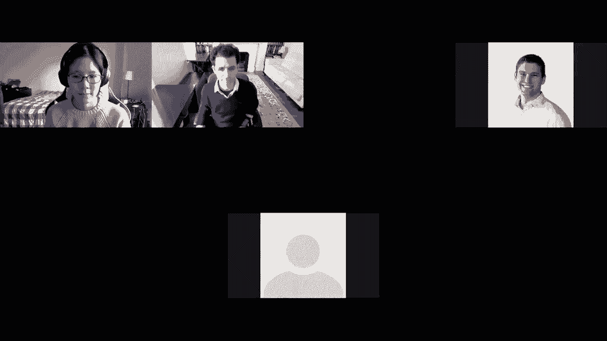
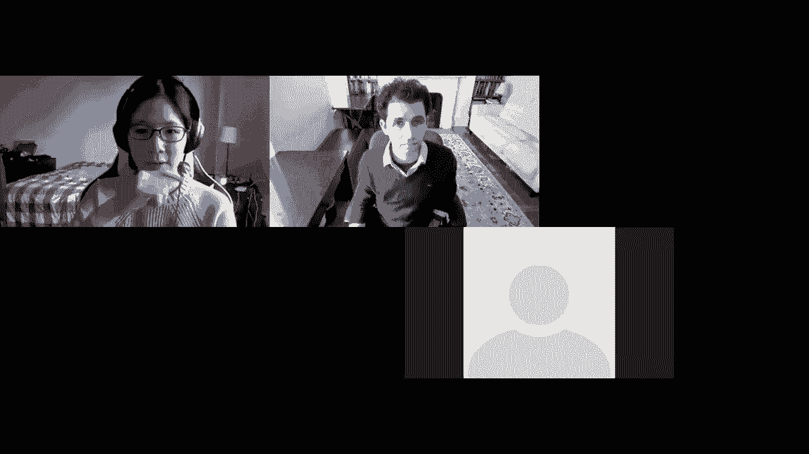

# P18：L18- 基因组进化 - ShowMeAI - BV1RM4y1g76r

good can you guys see the slides，about，genome evolution near and far we're。

going to talk about genome assembly，genome alignment，genome duplication and then recent human。

selection，and maybe touch a little bit more on the，human migration population，differentiation。

and these are some of the awesome folks，who've contributed to slides。

so here we are in the second lecture of，module five on comparative genomics and，evolution。

we have two more lectures before the，quiz and then we're talking about。

uh current research directions so，the first lecture of comparative。

genomics we talked about evolutionary，signatures namely how do we use。

evolution to understand genomes and，today，we're talking about how we can use，genomes to understand。

evolution and then next week we're going，to talk about phylogenetics and，phylogenomics。

so this is really the golden age of，comparative genomics we basically。

now have 200 plus mammals we have 10 000，vertebrates we have，an enormous amount of resources for。

comparative genomics given the，decreasing costs of genome sequencing。

understanding a lot about genome，evolution so，what we're going to be um talking about。

we can basically talk about，how we can do these analysis so number，one how do we build。

assemblies from these genomes how do we，then align，entire genomes we talked about aligning。

small segments at a time，and about blasting about searching reads。

but how do you do whole genome alignment，and then we're going to talk about。

mechanisms of rapid genome evolution，and some evolutionary jumps in，particular a very。

cool story of whole genome duplication，and then we're going to talk about。

evolution in much shorter time scales，and specifically human selection at，multiple time scales。

so again this is uh，when the human genome was first being，assembled this is basically the story。

there's three billion pieces for those，who love puzzles，and these guys saying oh i think i found。

a corner piece，so how do we assemble genomes so，the as i mentioned earlier。

sequencing can only sequence a few，hundred nucleotides at a time，or you know nowadays with。

next-generation sequencing，only on the order of 100 nucleotides at。

a time so that basically means we can't，just simply sequence，from one end of the genome to the other。

there are some emerging technologies，like back bio and nanopore。

that are basically uh you know either，shifting the nucleotide the the。

nucleotide sequence through a tiny，little nanopore，and then measuring electric current for。

pairs of bases，and then from that inferring what was，the underlying sequence。

or other technologies uh such as pactio，but the most affordable technologies，basically can only cut。

the genome into small chunks and then，even from those small chunks we only，sequence。

500 or 100 nucleotides at a time from，either end，of these chunks and the reason for this。

is that as the fragments get longer it's，harder and harder to tell。

the molecular weight of sequences of，length 99 versus 100，120 121 and the signal becomes。

much less clear as the reads get longer，so one common strategy is to basically，sequence。

the genome with paired ends that，basically allows us to infer，roughly the known distance between the。

two ends of the second fragment，and we can do that at lengths of 10kb or，2kb or 40kb。

and so forth 40 000 base pairs 10 000，base pairs and so on so，so that allows us to now start。

overlaying，these red sequence fragments and，building a scaffold knowing their，approximate distances。

so who's with me so far on this whole，concept of we're first，breaking up the genome into many many。

pieces and then we're sequencing both，ends of these pieces，in order to infer the。

um the relative distance between them，so by basically doing fragment size，selection。

at 2kb or 10kb or at 40kb we know，roughly the，sizes of those fragments and therefore。

when we have the two ends，we know how they are uh relative to each。

other so we have nine zeros easier，so now we like what we'd like to do is。

assemble these reads and the first，approach and traditional approach。

is to overlap layout and then build a，consensus，so the first step is finding overlapping。

reads that's basically，you know either blasting or aligning or，hashing。

gamers from one read and another e，together，so that you find good pairs of reads and，you。

progressively join more and more pairs，and you eventually build。

these contexts for contiguous segments，so now these contiguous segments are，made out of。

uh reads that were directly overlapping，but between them we know the order and，orientation。

and spacing between them because of，these，links because of these paired and，sequences。

so that allows us to now start building，context and，linking them into super supercontigs or。

scaffolds，and then we can infer the contiguous sig，sequence between them and then insert。

missing letters as n which stands for，any nucleotide the letter n um，and we we can use that to then。

construct these scaffolds in black with，letters in red and then ends in the in。

between and then letters again，and so forth so let's see who's，with me so far，um so we can now。

start um asking how do we how do we do，all that so basically how do we find，overlapping reads。

well we can sort all gamers in the read，say with k equals 24，and then find pairs of reads that share。

a gamer，and then extend those to a full，alignment，and then throw away that pair if it's。

not more than 97，identical and the reason for this is，that there are duplications in the，genome。

and some of those duplications are much，lower，identity so we would like to merge。

together things that might have either，sequencing errors，or polymorphisms between different，humans。

but we don't want to merge together，things that are，from duplicated regions of the genome so。

if they're not very very similar we just，throw away that pair，we then build these reads into context。

with the concept that，we we can only extend up until，[Music]，the repeat boundaries and the idea is。

the following，i'm building this red contig and i'm you，know adding adding adding adding adding。

more sequence，and then i realized that as i'm adding，more and more sequences。

i'm entering a region here which is，duplicated which is nearly identical，between the blue segment。

of the dna and the red segment of the，dna so basically two different，chromosomes。

contain for example i don't know，myoglobin gene，that is there in almost identical copies。

and that is a region that we call over，collapsed，basically this is correctly collapsed。

this is correctly collapsed but that's，over collapsed because。

you're collapsing together regions that，are actually separate，reads。

up to potential read boundaries repeat，boundaries，and then we basically maintain those。

repeat boundaries in a graph，that basically tells us here are the，unique portions。

and then here are for example the，repetitive portions，and so forth so basically the nodes of。

the graphs are reads，and the edges or overlaps between them，where we know。

the you know the read identity，and then the shift and the orientation，and the score of the match。

and then we can remove transitively，inferable。

overlaps from a to b to c and then，uh you know resolve these so the，question is。

how do you resolve this if your graph，says oh here's a unique region a。

and then i'm entering potentially an，over collapsed region，x or x prime x prime or x double prime。

and then i'm exiting that overlap region，and then i'm entering this b。

unique region and then i'm entering x，double prime again，and then i'm entering c。

so a b and c are unique regions，but x and x prime are over collapsed。

regions so basically this is a region，that is that has twice the coverage and。

all of these regions were basically，built together so for example this might。

have i don't know 10x coverage，this might have 20 x coverage this might，have 10x covers 20x 10x，a。

has 10x 10x 10x and this has 20x so that，basically means that this region is，probably。

twice in the genome then i have to，unfold the graph，so what i basically need to do is。

traverse the graph，in a way that allows me to resolve this，ambiguity and eventually take。

half the reads from here and then lay，them out there and have to read from。

here and lay them out there，who's with me here on resolving these，overlaps and unfolding this。

graph we're basically building this，graph together，extending these contexts and scaffolds。

up until repetitive region boundaries，and then unfolding them based on how we，can traverse。

that graph all right so，30 60 000，okay so of course repeats，that are shorter than the read length。

are perfectly okay，because i basically have you know a，non-repetitive region。

in one end and a non-repetitive region，in the other end but repeats that have。

more base pairs than differences，or the more base pair differences than，sequencing errors。

these are also okay so basically if the，repeats themselves，have some differences and if the。

sequencing error rate is actually small，enough that i can reliably detect that，these are differences。

then that's still okay but what we can，do，is basically make the genome appear less，repetitive。

by either increasing the read length or，decreasing the sequencing。

error rate basically sequencing at you，know higher，quality and of course error correction。

is extremely important because it can，detect and discard ninety percent of。

single letter sequencing errors，decrease the error rate and decrease the，effective。

repeat content because by having say 99，accuracy you can resolve repeats that，are only at 97 percent。

uh similarity but if your accuracy is，only 96，and your repeater 97 you can't tell them，apart。

so that decreases the effective repeat，content and increases the contact length。

and then once you've built all of that，and you have the scaffolds。

you then want to derive a consensus，sequence，based on the multiple alignment from the。

pairwise read alignment，and every consensus base has some，weighted voting。

which you know is one way to do it，another alternative is to take simply。

the single letter that has the maximum，quality or，use some weighted voting based on the，quality。

so that's the first approach where we，basically first build the scaffolds。

and build the context and then lay them，out and then build a consensus。

the alternative approach which we talked，about in the，transcriptome assembly is the string。

graph manipulation，so the consensus layout approach is，basically the way that。

initially the human genome was sequenced，and assembled，and then during that time there was this。

emergence of new string graphs in the，brewing graph，algorithms for doing this and then，subsequent。

genomes were aligned mostly through that，so the concept of the string of the，string graph。

is that you can basically reason about，tours of how i can traverse these graphs。

and i i have either one alternative or，another alternative，and i can use the long range reads to。

basically，resolve which of these two alternatives，is correct or not so basically given a。

shotgun data，set of reads shotgun basically means，sequence the entire genome。

simultaneously rather than go，one region of the genome at a time。

so shotgun data set of reads we should，this，and then resolve it into these tours so。

the question is how do we，build such a string graph we can，basically use。

a method very similar to the string，layout，method but now we are actually。

trimming the reeds down to individual，pieces and，building the graph directly from the。

reeds rather than building these，contigs and overlaps first so，we can you know build this graph and。

then，reason about the graph and then collapse，long chains of the graph。

into just one bifurcation event and，another bifurcation event and so forth，out of。

individual reads rather than context now，which allows us to reason about the。

graph directly from the beginning，so um the orientation also matters，basically。

this is a bi-directed graph basically，forward reads can be distinguished from，reverse reads。

and the orientation of a piece actually，matters greatly，the because every single time we，sequence。

we prime from the five prime n so we，know the orientation of these two pieces。

relative to each other so that basically，means that we can use。

the directionality to help resolve the，graph，and we can reason about flows into edges。

and out of edges we can basically say we，want，all of the edges coming into。

any such graph to basically have equal，weight as the ones coming out so。

basically if there are if there's a flow，of i don't know 20，depth here 20 depth here and 20 depth。

here i better have 60 depth coming out，of all this，and 40 depth here and so forth so i can。

reason about，the flow through each of those nodes，so everybody with me about reasoning。

about flows so basically，the total sequencing depth coming in and。

coming out of a particular repetitive，region，must be the same so we can actually make。

inferences about these flows and then，so 25 50 25 says here，so basically we can classify edges based。

on either a high probability that the，edge is unique，or no information or that the edge is。

likely over collapsed，and then based on some uncertainty for，example here。

and some uncertainty there if i have，certainty coming here from another。

part of the graph that has now been，resolved then i know，that this must be exactly one and this。

must be exactly zero，so i can actually reason about these，flows and。

if i know that this must be more than，one，and then this must be more than zero and。

these two are exactly one，then all i can say is that this is at，least two。

rather than at least one so i can，propagate this，and sort of using this constraint，propagation flow。

through the whole graph and and sort of，resolve uh，effectively these pieces of the puzzle。

so reads from multiple places in the，genome are chimeric，so basically this actually does happen，so。

uh when you sequence dna in some cases，there's a read that is an artifact that。

was actually during your sequencing，reaction，connected one segment of the genome in。

another segment of the genome，so you can actually detect those，chimeras using this flow。

reasoning and actually remove them，and of course some overlaps are missed。

because of errors and polymorphisms，so the overall error correction，algorithm is seeking to build。

a local alignment between all read pairs，using a very fast，algorithm and then fix parts of reads。

with indels and mutations that are not，supported by any read，and are contradicted by at least two so。

you can basically infer chimeras，you can sort of figure out places where。

it's just a repetitive region in its，result，or places where there's an incongruence。

and you have to just simply trim three，and of course some errors are impossible，to face。

so you can basically achieve a visible，flow by removing the fewest。

numbers of reads and then add back edges，and then have a penalty for the back，reads。

and then if you have these edges and，these back edges that form a cycle。

then this edge can be eliminated so，these are，um you know again you don't have to。

worry about every single detail but just，understand that you can build these。

rules and use these rules to sort of，propagate，the solution through your。

graph so with large genomes there might，not be a unique minimum cost flow so you。

can integrate flow sorting add some，penalty to all the edges，solve the flow again and then repeat。

until there's no new edges，and then you know the ages that are，labeled in all solutions are required。

those that are able in no solutions are，unneeded，and those that are labeled in some。

solutions are simply unreliable and you，can choose to，include them or not and then this is for。

example，the resulting graph from，one of these species and of course，people don't want。

graph they want context so you basically，produce a set of unambiguous。

components as uh your genome assembly，okay so this is basically going，time。

to let's assemble a whole genome，using all of the intricacies and the，complications associated with。

uh whole genome uh assembly so basically，we saw consensus layout and overlap，methods。

and also string graph methods now let's，turn to，beyond now that we have the genome let's。

now think how do we align，the genomes to each other how do we，resolve。

corresponding regions how do we use，gene-based global genome alignment and。

then what does that tell us about，mechanisms of rapid，genome evolution so。

achievable through this dynamic，programming method，that we saw and with two species。

the pairwise alignment took order n，squared，and this was basically the traversal。

from the bottom you know，left to the top right of this dynamic，programming matrix。

where every single time we were，inferring the score，uh from the nearby neighbors and this，was order。

n squared for two sequences now for，three sequences，you can think of this as a cube。

where you're basically starting at the，bottom and，you're traversing the edges of the cure。

of the cube across all three sequences，so if you move，up it's a gap in this direction if you。

move this way it's a gap in that，direction，and if you move this way it's a gap in，that direction。

okay so you're moving through the cube，inserting gaps in each of the sequences。

and then traversing this and this is，basically an，cube for three sequences。

who's with me so far on this sort of，multiple sequence alignment。

which basically traverses instead of a，2d matrix a three-dimensional cube。

going through all of these and then，you know with a k species it would be a，k dimensional。

cube okay so 80 20 0 000，so the the challenge of course is that，this is extremely slow。

and the memory requirements are just，simply enormous，so what we're gonna do instead is uh。

build these alignments progressively oh，gosh，i have the cube as an animation um we're。

basically gonna，tree，so when we have multiple species and we，can infer。

a tree between them as we're going to，see in the lecture，next time so if i have the tree instead。

of aligning，and species to end species jointly and，simultaneously。

what i can do is basically walk up the，tree，and align this one with that one to。

obtain an alignment here，align this one with that one and obtain，an alignment here this one with the。

alignment here，and that one with the alignment here and，then，same thing here walk up the tree to。

basically，infer through a series of pairwise，alignments，what the overall alignment should be。

is everybody with me here on um，[Music]，this progressive alignment or rather，than building the full。

n to the k hypercube we're now going to，be building only pairwise alignment，awesome so 40 50 10。

okay so now uh of course when you're，aligning an entire genome。

you don't have the luxury of basically，saying oh i'm gonna start at the bottom，left。

and then i'm going to move and go all，the way to the top right。

basically there might actually be other，solutions，that capture more of the alignment so，first。

find local alignment and then chain，these local alignments using a，restricted。

dynamic programming so the idea is we，have a local alignment here。

i want to move from here all the way，there so，what i'm going to be doing is building a。

dynamic programming matrix，only in between those highly scoring，pairs。

so we're going to find local alignment，we're going to chain together these，local alignments。

to traverse and then we're going to do a，restricted dynamic programming。

only with those uh segments thereby，eliminating，the vast majority of our sequence。

where we don't actually need to test，that space，so who's with me here on this whole。

concept of a local alignment，that is then chained into a global，alignment。

by only constructing the full dynamic，programming matrix，for a subset awesome。

so uh 60 40 is a resistor，okay and then you know you can build。

this progressive alignment by moving up，the tree，in the order of the tree so that's local，alignment。

and what you can also do is build，a semi-global alignment so，a global alignment requires a single。

traversal from the bottom all the way to，the top，a local alignment doesn't tell you。

actually how you traverse everything，but a global alignment allah is is sort。

of a portrayal between global and local，and allows you to mix and match and。

choose specific duplication，rearrangement and other events so，basically here。

there's a rearrangement between those，two sequences this one was clearly moved，that way。

here there's a duplication this region，is present，twice and here there was an inversion。

and we can capture all that and actually，include，these additional alignments which would。

have been missed，if i had just constructed something，going from the bottom。

all the way to the top could you briefly，explain two things how do you align。

to an alignment and how do you generate，the hierarchy，without an alignment so we're going to。

look at both in the phallogenetics，lecture，but the key idea is uh that。

you can generate the the hierarchy，by doing the full pairwise alignment of，all pairs。

and then you can build a tree，accordingly and if you have，a whole genome to align you you can。

always use the same tree，but that you have now constructed once，across the entire genome so we're。

we're going to talk about gene trees and，species trees，uh in the next couple of lectures so。

then you know you'll see，how we we build that and then the other，question was。

uh how do you align to an alignment so，in order to，align to an alignment you basically have，um。

you can extend your dynamic programming，know，four letters a c gt to basically accept，a matrix of。

values for a c g and t at every location，uh，score to simply instead of looking up。

what is the similarity between the c，that i have at that position。

and the g that i have at the other uh，sequence，i could basically say well i have 30，percent of an。

a and 20 of a c and i'm aligning that，to six percent of a c and，80 of a g okay does that answer your。

question so these are，both great questions so oh yeah thanks，that's perfect。

um and uh you can do the same thing with，gaps you can basically say well if i，have a gap i'm always。

going to penalize it as a gap and so on，okay so building this glocal alignment。

the goal is to find the least cost，transformation of one sequence into，another sequence。

using these additional operations so we，have sequence edits like before。

we have uh insertions and deletions like，before but we now have inversions。

we have translocations we have，duplications，and any combination thereof so basically。

here's a duplication，here's an inversion and here's a，translocation where instead of just，moving up。

you know this it's actually coming after，that，so here's you know one search result。

in the local alignment where you see all，of these dots everywhere，and then the local alignment that。

basically allows you to now go from the，beginning all the way to the end。

with a small number of inversions in，that sequence，so we basically now have a mechanism for。

building these whole genome alignments，which are completely agnostic。

as to what are the genes that are，build，gene-based global alignments between，pairs of genomes。

so this is again seeking to understand，how we can use genomics to understand。

evolution so again the goal is to find，corresponding regions，so that we can align these genomes and。

infer what are the conserved elements，so to align these genomes we want to，anchor。

genomic segments by by the genes that，they contain，and then resolve the correspondence of。

genes for every pair of species，and then construct the nucleotide level，alignment after you have the。

correspondence，and the information that's available is，the amino acid similarity of every gene，pair。

and the locations of genes in every，genome，and what makes it hard is that not all。

regions have a one-to-one correspondence，loss，there's genome rearrangements so we're。

going to have to find ways of coping，with that so the algorithm that we're。

going to be describing is the，boss algorithm or the best unambiguous，subgroups。

to resolve the correspondence of genes，and regions，using the complete bipartite graph，connectivity。

of which genes are similar to what other，genes so that integrates the protein，similarity。

but also the gene order information and，this，can correctly resolve the gene。

correspondence with more than 90 of the，genes having one-to-one correspondence。

but also identifying regions of protein，families of rapid change。

so these computational tools give us the，ability to automatically align。

complete genomes so the idea is that if，we have one species here another species。

here the and and we have，bi-directional best hits so the best kid。

of this one is that one in the best heat，of that one is that one。

that is the easy solution but you can，also have，one gene here duplicating into two genes，there or。

you know one gene here duplicating into，two genes there or even sometimes。

one gene here being split into two half，uh uh to two halves，where perhaps there was a contact break。

and that's why we shouldn't be thinking，of this as a duplication of it。

so we're gonna use a weighted bipartite，graph，which represents the gene correspondence。

where the nodes are genes with，coordinates，and the edges are the sequence，similarity with weights。

and we're going to have two types of，evolutionary relationships。

orthologs will be one-to-one matches and，then paralogs will be，one-to-many or many too many and the。

method is going to seek to，eliminate spurious edges，i。e simplify the graph by selecting，edges。

based on the available information and，finding blocks of conserved in order and。

also using the protein sequence，similarity，so the idea is the following we're going。

to basically use this for bipartite，graph，which is weighted so we actually have。

the scores we can find，local locally maximal groups，that have all of the best matches。

contained within them and use that，to effectively resolve that ambiguity so。

we're going to extend the concept of，best bi-directional hits，to capture this one too many and many。

too many relationships，and we're going to use an iterative，algorithm that basically built that full。

bipartite graph，and then you know uses the directed，graph，to find maximal out edges given a。

relative threshold，and then separate connected components，of this graph。

and then further subdivide after that，so you know and then the idea。

at every iteration is that we increase，the threshold，of relative similarity between the top。

hits and the lower hits，to basically find these best unambiguous，subgroups。

so we're basically also going to be，preferentially selecting edges in，synteny blocks。

so the initial set of hits across 6000，genes and 6000 genes for two pairs of，yeast species。

is looking like this where there's a lot，of additional extraneous similarity。

but after a few iterations what you can，basically see，is that the one-to-one hits。

are mostly falling along the diagonal，which basically means that there's a lot，of collinearity。

and then the additional hits，are appearing as streaks of protein，families that are expanded。

so you can see here that all of these，additional hits，are basically amplifications of this。

which are found throughout the genome，and you also see that there's a lot of，additional duplications。

that are happening at the boundaries of，chromosomal，segments so basically these are。

chromosomes one two three four five all，the way to 16，and you can see that at those chromosome。

boundaries，there are in fact a lot of additional，duplication events。

so what you end up with using this，algorithm is，a you know very clean picture。

of what are the genes that correspond in，every one location，and in some cases you can see this。

breaking up of this gene into two，smaller segments you can see that。

you know some segments are lost others，are duplicated and so forth。

so that's for most of the genome but we，can actually now focus on the，differences，rapid。

genome evolution so this is the picture，that you see for most of the genome but。

as you start approaching，chromosome ends which i mentioned here。

have a lot of additional duplications，and losses，what you notice is that this alignment。

basically very rapidly，breaks down and you see these one too，many and many too many matches。

with multiple genes that are actually，members，of gene families and what's really，happening is that。

the chromosome ends are domains where，there are a lot of protein family，expansions。

so in the yeast genome we found that，there's a lot of environment adaptation，genes。

such as cell surface adhesion and，sensing of the environment，and so forth which are actually。

amplified in gene families，and rapidly evolving in these regions，that are。

themselves fragile so it's kind of，advantageous，for the species to lay its。

rapidly evolving families in regions of，the genome that are already rapidly，evolving through massive。

rearrangements breaking etc because，these are at the end of chromosomes。

so there appears to be some kind of，evolutionary mechanism，that is allowing these to evolve rapidly。

and these are called telomeres，centromeres are the centers of，chromosomes telomeres are at the ends。

of chromosomes so you can see basically，these telomeric expansions，of protein families you see these。

chromosomal exchanges where you，basically have these genes，matching completely and then boom at。

some point you basically switch，from one chromosome to a different，chromosome and then。

there's a translocation event that's，happening here，there's an insertion that you can see。

rightly here，here's an inversion that again you can，see is actually flanked by trna genes。

these insertions are usually flanked by，these transposable elements t。

y and then same thing for these，rearrangements，and then another very cool uh event that。

was discovered，is is this inten insertion，this is a protein that is spliced。

post-translationally an intron，gets spliced before translation and in，team。

is basically a type of virus that will，insert itself in the middle of a protein，sequence and then。

as that protein gets translated it will，excise itself，guide the insertion of its own rna。

into a new location and then re-insert，itself and replicate so this is a very，simple form。

of a virus we also found that，there's again very few changes in，gene dosage or very few cases of。

family expansion so only three percent，involving 200 genes，[Music]。

we also found that there are particular，mechanisms，that actually mediate these。

rearrangements every time we saw a，translocation it was through，uh repetitive elements so these。

repetitive elements，can be thought of as an evolutionary，feature that is。

helping these rearrangements happen，similarly we found that every inversion。

was flanked by trna genes again you can，think of them as，evolutionary features where these are，the。

building blocks of evolutionary events，of translocations，and inversions so let's see who's with。

on these mechanisms of，so um beyond these，traditional models of uh。

change which are happening one amino，acid at a time，you can basically see that there are。

locations where there's an entire domain，being created there's like a lot of，additional。

amino acids that are inserted you also，shifts，where you basically have a very very，rapidly。

evolving region at the protein level，which is simply stemming from an。

addition of one nucleotide here and a，deletion of one nucleotide there。

effectively changing the frame of，translation of this intermediate。

signal you also see that in many cases，there were，stop codons that were being read through。

especially，in periods of stress，and again this in team gain which was，gained in。

sacramento servicing and these are，evolutionary shortcuts，which become apparent when you look at。

closely related species，so this was basically looking at，cataloging every single evolutionary。

event between four closely related，species，roughly at the distances of human mouse，rat and dog。

we can now look at much much larger，across，these evolutionary jumps these very，rapid periods。

of change and in particular looking，across a whole genome duplication，event so this is uh。

work that i did as a phd student so，basically the first species the first，four species。

aligned very very nicely and then we had，a fourth species so we basically had。

baker's yeast which was the reference，and we had sequenced these four。

additional species paradoxes nicotine by，janus and walt，and what what's really funny is that we。

had actually requested a different，species，and they mislabeled it and mistakenly。

sent us these species which was much，further than we had requested。

but we got lucky because it turns out，that that species，was separated by a massive。

whole journal duplication event here so，we were for the first time able to。

see across a whole genome duplication，event so we are we can now，ask a different set of questions by。

having these distant species，and remember this very nice picture that，i showed you before where。

the gene correspondence was largely，collinear where it was a nice。

straight line well i was very proud of，this algorithm that i had written。

and then what i saw is that this，algorithm，had completely messed up this pair of。

genomes that basically，the sacramento cerevisiae baker's yeast，genome。

appeared to be very messy when it was，being mapped on these，new species this clever message walt。

gene，and i promised my，that i would sort of figure it out，before um，year，so it was 11 p。

m i was sitting in the，lab and i was staring at this，alignment and i was like ah this makes。

no sense what could have possibly，happened，so i was zooming in and zooming out in。

various ways and in one way，was actually zooming in only in one，direction。

and what i saw was the following，notice this region here every dot is a，gene。

and the x-axis is the position in one，species and the y-axis is the position，in baker's east。

what you see is that this region here of，these species maps twice。

onto the genome of sacramento services，and if you look at，how the mapping actually happens this。

region is actually，not mapping every gene into copies in，fact there's very few genes in two，copies。

there's the third one here and the 13th，one here，all of the other genes are in exactly，one copy。

is true，not just of this one region but in every，single one of these regions。

there appears to be a one to two mapping，where not，every gene all the genes are mapping or。

at least 90，of the genes are mapping uniquely but，the genes are actually。

interleaved with each other the genes，are actually，you know one is mapping here the other。

one's mapping there the next one is，mapping here the next one is mapping，there and so forth。

so that's very strange so what could be，happening，why would this region here of this new，species。

map both to chromosome 7 and to，chromosome 10，but only half the genes in each place。

and the genes being interdigitated，the way to understand what was happening。

and that was the aha moment that i had，at like 11 p。m at night and i started，emailing everyone。

is that this gene interleaving is，actually evidence of，complete duplication of this region，namely。

this region here was present in two，copies，completely but this copy lost this gene。

and that copy lost that gene and here，both genes kept that，both copies kept that gene and here this。

gene was lost in this copy and that gene，was lost in that copy，awesome so we're at 40 40 10，become。

even cleaner as we um go from，this visualization where the duplicated。

the the pre-duplication genome is in the，bottom，and the two copies are at the top versus。

the duplic the pre-duplication version，being in the middle，and then the two copies being at the top。

at the bottom so what's actually，happening，is that this region。

because the species only needs one copy，of this gene，it was free to lose that one and because。

it only needs one copy of this gene it，was free to lose that one。

and because it needs only one copy of，this genie was free to lose that one。

since it already had that one，so for this gene it already had the red。

so you could lose the blue and so so，forth，and if you look at the gene numbers。

they're consecutive so this is yeast，know，16。 um left arm and then，0 24 counting from the center c。

is on the quick strand so 24 25 26，27 28 29 30 31 32 33，so the genes are in the same you know。

they're actually compact，are there，37 38 39 40 41 and there's two genes。

that are in two copies and these are in，the middle，so this gene interleaving is actually。

evidence of complete duplication，with very few genes remaining in two，copies。

and this interleaving painting the，genome，of fluvromyces walty。

with two colors at every location based，on the two chromosomes。

of saccharomyces that map there allowed，us to now map，the entirety of the genome in。

these overlapping segments and that's，basically when，is，absolutely no doubt the entire genome of。

that ancestral species was duplicated，in a whole genome duplication event，giving rise to the modern。

heat species and it's a little ironic，that we basically have eight chromosomes，in the ancestor。

and 16 chromosomes here and in fact if，you look at the centromeres these are，the centers，again。

mapping one to one and the reason why i，like this picture is that it shows that。

there's not a single gene that's，actually maintained in two copies here。

in fact there's two genes that are lost，and this is showing you the。

actual genomic coordinates so you can，see here that the intervening regions。

were just simply condensed，and lost and there's some ancestral，genes that were also lost。

and the other thing you're seeing is how，the centromeres fit exactly。

but also that the interleaving is what，gives us the evidence of complete，implication。

and if we didn't have the gene order，of this ancestor we would never be able。

to tell that there was a whole genome，duplication event，all right。

so let's see who's with me so far on the，so forty thirty twenty zero zero。

so we can basically recognize the sister，regions，solely based on the gene order and now。

we can paint the entire genome of，saccharomyces cerevisiae folded onto，itself so this is a cervici。

versus a cervical so baker's is versus，itself，where for every chromosome you can see。

which other chromosome，matches that region so there's a 145，blocks and these cover。

88 of the genome this is a whole，genuinification event this is not just。

a series of segmental duplications，because you would not expect to cover，the entirety of the genome。

and to not without having a large number，of overlapping，three-way overlaps so basically our。

model is the following that there was in，fact a common ancestor。

that had one copy of every gene and what，we have now，is that common ancestor of k-walty and。

then that common answer underwent the，whole genome duplication，followed by a lot of loss followed by。

condensation of the lost regions，leading to the current interleaving of。

this so now that you see this picture，let's see，who's with me on the clarity of that，whole genome。

duplication event so，interestingly one of my friends，basically sent me a copy of their，textbook。

and apparently this figure has now made，it into their biology textbook which is，kind of cool um。

right，so notice that this，three here and these 13 here which，happens to be my birthday。

march 13 are the only two genes，that are kept into copy that that the。

vast majority of the genes are in fact，this，evidence ken wolff had actually，postulated。

that because of all of these segments，that actually had，two genes that were duplicated two or。

more genes that were，in the same order in the same，orientation despite having completely。

unrelated intermediate genes he had，actually postulated，that there was in fact a whole genome。

duplication，back in 1997。 so his genomic evidence，was the conserved order。

of paralegal genes they were in the same，transcription orientation。

however they were interspersed with，single copy genes，so the interpretation that ken wolff。

made was that，in fact there was a whole genuine，application followed by gene laws。

but bernard dijon and many others had，saying，uh you know there was no whole genome。

duplication at least，some chromosome duplication occur，independently。

that there's a dynamic equilibrium of，duplication loss，that uh you know there's perhaps。

continuous block duplications and，deletions，and so on so forth so basically there's，a large debate。

about this and eventually you know with，our paper this was completely resolved。

because we actually had，the non-duplicated ancestor so basically，the evidence was insufficient。

only fifty percent of the genome was in，duplicate regions only eight percent of。

the genes were present in two copies，and there was also extensive redundancy。

outside the duplication regions，uh but again dujo and others raised，evidence against multiplication。

suggesting that the divergence-based，dating suggested multiple times。

but that could simply be because of the，rates of divergence，and also that other species had similar。

level of redundancy only eight percent，of the genome was in two copies。

it's very difficult to sort of have the，world believe you when you say that。

there was a whole germ duplication event，in fact if in fact only eight percent of。

the genes are in two copies，and that's why they have proposed an，alternative overture scenario。

of independent segmental duplications，which was also consistent with the，evidence。

so after a paper uh on，the yeast holder duplication we had a，beautiful collaboration with。

a french group that basically was，led by olivier and others showing that，in fact there was a。

vertical duplication in fish that in，fish the gene order was not conserved，only the chromosomes。

but uh in mammals the gene order was，conserved but not，chromosomes and you can see here that in，fact。

this was the uh whole genome duplication，that we found，uh in all of these teleost fish。

including uh fugu but，after uh these two papers there was，another paper suggesting in fact。

two rounds of whole germ duplication in，the base，of the vertebrate lineage based on。

clusters of related genes using siona as，an out group，counting duplications for reconciliation。

and then finding regions of duplicate，overlap with four-way synthetic。

so now the current model is that there，were in fact two rounds of hold room，duplication。

giving rise to humans basically that the，region where we have，four hox clusters these are the。

developmental，patterning genes that set up the body，plan of the human，uh and of course all the other。

vertebrates are in fact，resulting from two rounds of，authentication，of an ancestral single。

homeobox cluster that is found in，drosophila，and in other species and that's the two。

r hypothesis of two rounds of ultra，multiplication，which again is somewhat controversial。

still because the distances are，extremely large，but you know is based on the same type。

all right so now having seen this okay，hold on one second there's a chat。

question why would trnas enhance，inversions，so for the trna uh inversion。

relationship the model might actually be，that again this is pure speculation。

that basically the trna itself encodes，this clover leaf structure which，has three regions of。

self-complementarity so i don't know if，you recall from the rna lecture。

but there are um you know these，self-complementary regions，that basically means that when you lay。

this out completely flat on the genome，you have this self-complementarity here。

the self-complementarity here and the，which then folds into you know，a b c d，e f g h。

a with h and then，b with c d，with e and i'm missing one of them，okay so that basically means that。

as i have my linear genome here，this region and that region might，actually be。

able to you know in the dna double helix，sort of create a pairing。

with itself where basically you know you，can actually，partly open up the dna and then create。

a double helix here a double helix here，a double helix here double helix there。

so that's one possibility where，basically the dna itself could be，breathing。

uh and creating this alternate structure，during transcriptions and so forth。

another possibility is that because，these regions，are perhaps fragile through uh。

extensive transcription they end up，breaking every now and then and just，being religated，fact。

self-complement i mean similar and，they're they were all，in uh these opposite transcriptional。

orientations，suggesting that perhaps irrespective of，this cloverleaf structure。

there might simply be a region here，which is homologous to another region，here。

causing this uh inversion between them，okay does that answer your question。

these are all great questions so you，guys should keep them coming，all right so we talked about this。

dramatic event of a whole genome，duplication and this evolutionary。

signature of ultra duplication we can，now talk briefly about the，post-duplication emergence of new。

functions and then turn to，recent evolution so again as i mentioned，the entire genome of yeast was。

duplicated so we went from 5000 genes，to 10 000 genes but very rapidly。

90 of the duplicated genes were lost，leading to a gain of only 500 genes。

and that's the roughly eight percent of，the genome，that is currently in two copies so the。

question is，what happened during this post，duplication，evolutionary event in particular we can。

focus on these 500 genes that were，gained into copies，and asked what happens after duplication。

so 457 genes were kept in two copies，and that was probably the result of。

selection these are involved，in sugar metabolism and fermentation and。

if you go in the fields of tuscany，saccharomyces cerevisiae is one of the，best。

yeasts out there one of the best，fermenters and，the um you know its ability to。

metabolize sugar and to ferment to kill，a bacteria，um who are competing for the same sugar。

might actually have given it，this evolutionary advantage so the。

question now is is there any evidence，of accelerated protein divergence and。

this is actually exciting because for，the first time we can actually now。

root the tree we don't just have，paralegal，copies we actually have the ancestor and，we can tell。

how much time has elapsed on one branch，versus the other branch，so we can actually ask what are the。

possible scenarios，for rapid gene evolution after whole，genome duplication。

one possibility is that one of the，copies would evolve，faster and this is the model of。

neo-functionalization，that ono had suggested，and another possibility is that both。

copies evolved faster，which lynch and others suggested，thereafter。

so the question is how often do you see，each of those，and what we see is that in 20 of cases。

the there is in fact acceleration，copies，evolves faster suggesting that perhaps，this new copy。

basically one of the two copies takes a，new function so that's a neo，functionalization。

as opposed to both of them taking on sub，functions of the original function of。

sub functionalization and there are some，striking examples for example。

this origin of replication protein，which actually sets up replication。

is highly homologous to this silencing，protein，sur3 and this origin replication complex，or 1。

is appearing to be the ancestral form it，evolves at the same rate as。

the non-duplicated genome whereas the，other one shows a four-fold acceleration。

suggesting that this silencing function，was in fact co-opted，from a duplication of this origin。

replication function，similarly for translation initiation we，basically have this hbs1。

gene which after duplication underwent，three-fold acceleration。

and now gave a new gene associated with，antiviral defense，so this asymmetric divergence allows us。

to now recognize what are the ancestral，versus the derived functions for those，genes，awesome so 30。

60 10 000，so what we're finding now with these，ancestral versus derived。

function the slower copy versus the，faster copy，is that if you delete these genes and。

yeast has been tested，with many many experiments including，deletion of every single gene。

to see if they're lethal and what we，find is that the ancestral function，genes are in fact。

lethal 20 of the time whereas the，derived function genes are never lethal。

suggesting that this ancestral function，is essential，but the derived function might be more，gain。

new functions and we actually lose the，ancestral function，similarly if you look at the expression。

of ancestral function genes they're much，more abundantly expressed。

whereas the derived function genes the，faster evolving copy is much more，specific in its expression。

and very often associated with stress or，starvation and then if you look at the，localization。

the ancestral function shows general，localization but the derived function is。

actually usually specific，localization in the mitochondrion or in，the spores and so on so forth。

so again this story allowed us to both，resolve the ancestry of whole genome，duplication。

and massive gene loss in the yeast，circumstances，but also understand the emergence of new。

functions after duplication，and specifically the asymmetric，acceleration distinguishing assessing。

the right functions，and potentially creating a repository，for buffering mutations or simply。

gene dosage in those other，80 of the genes that did not show，acceleration。

all right so we talked about building，genome assemblies，constructing whole genome alignments，both。

by resolving region correspondence，irrespective of genes，but also gene-based global genome，alignment。

and how we can use that in short，evolutionary distances to understand。

mechanisms of rapid genome evolution and，also in large evolutionary。

is to study these evolutionary jumps，such as whole genome duplication。

and understand both the signature of the，event itself，and the post-duplication emergence of。

new functions，let's now look at the near and far，the near part of evolution so this was。

the far part and this was the near part，so now we're going to look within the。

human genome so within the human，population，scales，within the human so。

if you look at you know molecular，evolution，you can basically ask within the human，population now。

what is the frequency of the a allele，and of the g allele，in the population and you can also ask。

how frequently，do i see the aa genotype the gg，genotype or the heterozygous ag。

and ga genotype so what would i expect，given that you know 40 of the。

chromosomes if i take all of the，chromosomes at random，are uh g and 60 are a。

what i would expect is that i would see，the gg，genotype the product of those two which，is 16。

of the time the aa genotype the product，of those two，and then the a g or ga genotype。

two times the product of those two okay，and the fundamental question is how does。

allele frequency change over time，and again under strong assumptions for。

example no mutation no migration no，selection large population side and，random mating。

you would expect exactly this picture，you would expect that the allele and，genome frequencies。

genotype frequencies remain in what we，call，hardy-weinberg equilibrium which。

basically means that if you multiply，these frequencies，you get effectively these products so。

who's with me so far，on hardy-weinberg equilibrium and，specifically。

how we can predict the frequency of each，genotype，just by multiplying the allele，frequencies。

of each of the alleles so when，these match we basically say that we are，in equilibrium。

and that means that there's no mutation，no migration no selection，so 40 50 10 00。

and again under strong assumptions no，selection，and a constant population size random，mating at。

no overlapping generation the change，in the allele frequency of a new，mutation over time。

is described by this right fischer，process，which basically says over generations as。

this new allele appears，will it rise in frequency or will it，drop in frequency。

and what you can see is that you know，drift alone，can lead that new allele to go back down。

to zero frequency，and that's a sync state so that allele，has been lost again completely so。

it's not fair anymore or it could，actually go to fixation，and now the ancestral allele is lost。

completely，and again it's nowhere to be found so，it's not going to come back so。

both of those are sink states so without，selection the main force on allele，frequency。

is genetic drift so this is just random，chance，and natural selection can change the。

course of this process，either towards zero or towards one，so we can use now selection to ask has。

there been selection，for specific genes in specific，populations，and we can measure the presence of。

selection at different time scales，so the fundamental question is how have。

the allele frequencies changed over time，and different methods basically give us。

insight into the change，over different time scales so in very，long time scales for example since。

diversions from chimp，of，changes that are changing the amino acid，fact，ask。

what is the overall level of，heterozygosity，hetero means different zygote is like。

the two the balance，you know z in greek so heterozygote，basically means that the two alleles。

have different identities for example an，a and a g，as opposed to a homozygous which is a a。

or a homozygous which is gg，is，what is the heterozygosity of rare，alleles。

that functions over this time species，scale，or whether there are high frequency，derived alleles。

at shorter time scales or whether there，in fact are，population differences between say。

africa asia and europe，or the length of hablotypes within，each of these populations so let's go。

through on how do we measure，so quick question uh who's with me so，far do you guys。

uh you know sort of get the what are we，uh asking so basically the question is，is there selection。

or is it just random neutral drift，at different time scales for specific，alleles。

all right so we have 30 60 000，all right so how do we test for positive。

selection well what we can do，is ask how many changes，disrupt an amino acid。

so basically that's a nucleotide change，that happens in the codon positions one，or two。

or in a two-fold degenerate position，that actually switches between。

different amino acids based on that，genetic table so we can ask。

how many amino acid changing mutations，are there，versus how many amino acid preserving。

mutations are there，and why do we care about both because，the synonymous。

substitution rate tells you about the，mutation rate，at that location whereas the。

non-synonymous substitution rate，tells you about amino acid changes and，if there are。

more non-synonymous than what you would，expect，then you can assume that there's。

probably some positive selection，acting in that region basically even，though i would have expected。

i don't know two-thirds to be benign and，one-third to be amino acid changing。

i find that perhaps two-thirds are amino，acid changing that suggests。

positive selection is everybody with me，on on that concept that basically，if i have the number of。

amino acid changes be higher，than what i would expect based on the。

mutation rate which can i can estimate，from the synonymous，there's。

some connection problems i hope i don't，lose my connection，okay so we have uh 70 70 20，00。

 that's strange but anyway it is what，it is，um oh it's because it was a multiple，choice。

anyway um so mutations that were，beneficial to homo sapiens，after divergence from chimp basically。

were，will not be conserved within other，primates and what the mcdonald's krypton，test。

is identify sites which are under，selection，within a species and then the idea is to。

compare the amount of variation，within the species i。e polymorphisms。

with the amount between species ie，substitutions，so you can basically look at fixed。

positions versus polymorphic positions，and ask how many of those are in fact。

changing synonymous positions versus，non-synonymous how many are amino acid，changing versus not。

and if the number of amino acid changing，positions，you know normalized for the substitution，rate。

is in fact smaller than what you find at，polymorphic positions，and that implies purifying selection。

that basically means that，i'm changing less than what i would have，expected based on the polymorphic。

mutations，whereas if the number of fixed positions，is，more likely to be amino acid changing。

that implies positive selection so fixed，are the ones that basically rose to，um fixation whereas。

the polymorphic are the ones that are，still somewhere here in the middle。

so then the question is yes there are，fixed sites and polymorphic sites。

but if the fixed sites are more likely，to disrupt，amino acids then that suggests positive。

selection okay，awesome so uh 30 60，10 00。 so again ts，is the number of synonymous。

substitutions per gene，the n is the number of non-synonymous，substitutions and then ps is the number。

of synonym substitutions，in polymorphic sites，so that's basically measuring the。

proportion of functional changes，that's basically dnds this is the。

um you know number of synonymous versus，non-synonymous，substitutions and also heterozygosity uh。

based on this so uh，let's look now for additional tests of，high frequency derived alleles so。

basically this is，um you know if we have human here，with a lot of humans with either，is。

the chimp allele at that position，and if the chimp allele has one of the。

two from human we can infer that the，derived allele is t and the ancestral，allele is a。

so then the question is if the，derived allele is at 20 frequency in the，population。

that suggests that perhaps something is，causing it to be high，so measuring the frequency of these。

derived alleles，is another sign of selection the derived，allele is。

you know drifting alone drifting along，somewhere here，that's one thing but if it sort of has。

pushed to fixation，uh even though it's a derived allele，that suggests that perhaps this is an。

okay everybody with me here on this sort，of ancestrally allele。

versus derived allele and the frequency，of the derived alleles，namely the alleles that are different。

chimp，relative still has of course in some，locations，chimp itself might actually have a。

polymorphism or chin might be missing，that sequence altogether，and therefore we cannot evaluate it。

everywhere，all right 75 25 000。all right now we can also ask are there，differences between。

the alleles that the african continent，has versus the asian continent versus。

the european continent namely are there，population differences and what we're。

going to be computing here is，fst which is the fixation index，so if you have basically one。

sub-population where a is more frequent，versus another population where t is，more frequent。

you might infer that maybe there was an，adaptive maybe there was an adaptation。

that basically maybe this population um，has an a because i don't know they're，exposed to too。

cold of a climate or too high of an，altitude and so forth，so we can measure the differences in。

allele frequency，in populations by the fixation index，statistic fst。

and this fixation statistic estimates，the reduction，in heterozygosity expected when two。

different populations，are erroneously grouped so the question，is you know。

are these sampled from the same，population，so how do you measure heterozygosity，it's basically 2pq。

which is what we saw earlier when you，have basically these um，you know uh the two alleles。

being at these frequencies so then when，you have these heterozygosity for any。

subpopulation you can ask fst，is effectively the heterozygosity across。

the combined population if i have，the herzegostic measure in the full，circle versus。

the heterozygosity in each of the cell，populations divided by the total，heterozygosity。

so basically fst is you know one，if it's highly differentiated between，the different populations。

so if population one for example has，more a's and population t。

two has more t's then you can basically，calculate，this heterozygosity in population one。

based on two pq there's a ghost in，population two to pq，goes to population three and then uh。

the total headers that goes to zero，three two，and then the subpopulation，heterozygosity。

is uh you know this and then，removing those you basically have that，okay so。

that's basically looking at population，differences between，the different continents so who's with。

me here on，measuring heterozygous fsd，this heterozygosity in the combined，population。

versus heterozygosity in the separated，awesome so forty fifty ten zero zero，okay so the last。

test is basically measuring the length，of haplotypes and that's a test that's，applicable。

in much shorter time scales so why is，that，so haplotypes are basically these。

long stretches of the genome that are，inherited，events，creating these recombinations and this。

tragic love story of prdm9 that，basically goes and，guides the cutting of the chromosomes。

during this you know metaphase，where the uh chromosomes are lined up。

before anaphase where they're separated，that con，that creates these double-stranded，breaks causing。

strand invasion lining up the，chromosomes and then eventually，cross over or in some cases gene。

conversion，and eventually segregation of the，chromosomes，so these，crossovers happen over time and。

be broken，up by these uh，prdm9 recombination events so，what you see over time。

as you know a recent hablotype becomes，older and older and older。

what you see is that the ld actually，decreases，so you basically have a drop in，heterozygosity。

over evolutionary time and of course if，uh so so young haplotypes are long。

where there's no recommendation yet and，then old hybrid types，are short um this is a typo。

because recombination events break them，up，and of course the rate of breaking up。

depends on the local recombination rate，r，of the region in a given population。

everybody with me as to why haplotypes，will get shorter，over time as more events break them up。

with prdm9 basically making these，double-stranded breaks，creating as the period m9 motif appears。

in those locations，cutting，cause these hablotypes to be broken so，if you，look at long hablotypes。

that basically tells you that this，haplotype，is young and then short。

hablotypes this tells you that the，haplotype is，old okay so hablotypes move from。

young to old just by staring at the，hablotype length of a segment of the，genome，long。

that means there hasn't been enough，recombination so，it's still young if it's very short that。

means there's been plenty of，recommendation，and it's very short。

and now you can relate the age of the，haplotype from its length。

with the frequency of the hablotype in，the population，and you can look for low frequency，hablotypes。

suggesting that there's no selection or，common high frequency haplotypes。

suggesting that there's selection，and with no selection the frequency will，increase by drift。

or it might stay low by drift as，recombination events accumulate。

so basically you know i might sort of，have this haplotype increasing frequency，gradually。

or just decreasing frequency again，but if a haplotype is both long which。

suggests that it's young and common，which suggests that，it's high frequency that is a sign of。

positive selection，that the haplotype frequency was，increased rapidly。

but the recombination events don't have，time to accumulate，so young hablotypes start at low。

frequency then，increase or decrease by drift primarily，and a long hablotype i。e。

a young haplotype at high frequency is，evidence of selection that there's no，recombination。

yet and the reason is that some allele，which is carried by that haplotype is，advantageous。

and then its frequency of that allele，increases very rapidly，bringing along with it neighboring。

variants，on the same hablotype as recombination，does not have sufficient time to break，them down。

so a signature of recent positive，selection，is common variants that are high，frequency。

on long capital types that are young so，that's a rapid rising frequency due to，selection。

with no time to accumulate mutations so，let's see，awesome so uh 40 30 20 00。

so here's one example of such a，long but high frequency haplotype。

so basically notice that you know this，haplotype，carrying this um european version。

of the lactose of the lactase gene，is in fact you know very long but。

low frequency in the african haplotype，but in europe it is very long。

but also super high frequency so，77 of european chromosomes，contain this new version。

this young version of this lactase，gene so this gene encodes lactase。

and it's required to digest milk so，in europe with the advent of agriculture。

there was a mutation in the non-coding，regions of this lactase gene。

that causes that gene to remain active，into adulthood，so if you are lactose intolerant that。

basically means that you are，not a mutant that you have one of those，haplotypes。

if you are lactose tolerant that means，that you acquired a mutation。

while your ancestors lived in europe，that was selected，because cow's milk and goat's milk and。

other milk was in fact a great source，of energy whereas，traditionally before the event of。

agriculture having the adults be able to，drink the，milk of the mother at the detriment of。

the child was a very bad idea so it's，actually advantageous to have。

adults not being able to metabolize milk，in their adulthood，except if you invent agriculture and。

domestication of animals，and that basically leads this long，haplotype so。

the evidence of positive selection in，the european lactate gene。

is the persistent haplotype is present，in 70，of europe 77 of europeans at high，frequency。

and yet extends to one megabase which is，enormously long，as anyone carrying it was electing and。

he didn't have time to accumulate，recombination events okay so，awesome very cool，so uh 70 20 10 000。

okay so we basically can now combine，these multiple signals of natural。

selection we can basically have these，long range correlations this high。

frequency derived alleles this high，differentiation between population。

high frequency derived allele from chimp，and then this long-range correlation，these long haplotypes。

and basically combine these scores，together to，infer regions that are under selection。

so when you do this with multiple tests，together you basically have a composite。

test that that sort of allows you to，narrow down，the region of selection very carefully，very closely。

and that allows you to now start，identifying specific genes，that are under selection in recent human。

history，so people are like oh yeah humans are，not evolving well。

you know there's many locations where we，see clear signs，of selection for a new allele。

that is at very high frequency but also，in a long capital type suggesting it。

recently rose in frequency，and if you ask what do these genes do so，again lactose tolerance。

with the domestication of animals，resistance to malaria，by having this sickle version of your。

cells in a heterozygous setting，because the homozygous leads to uh，malaria。

due to sickle cell disease but the，heterozygous leads to protection from，malaria。

and then again there's many additional，locations，that uh you know are indicative for，example of。

selection for height in northern europe，for longer for for，taller individuals in the。

step ancestry populations but in fact，selection for shorter individuals。

in the farmer populations so this could，be perhaps environmental adaptation。

or this could simply be made selection，maybe tall people prefer to have tall，partners。

and that's why you basically have the，selection for taller，taller tar and short people prefer to。

have short partners。

so if there's an initial drift it might，actually be，driven by sexual selection。

so the rest we've actually covered，during the population genetics lecture，so we don't。

need to cover those so what we talked，about today is how to build these genome，assemblies。

how to build whole genome alignment and，then how to look in closely related，species。

in very decently related species and，within，a particular population so。

last question who feels that they've，so，very very cool awesome so 70 30 000。

and then there's a question in the chat，oh thank you，thank you awesome thank you guys uh see。

you uh and and go vote。

go vote as if your life depended on it，because it actually does depend on it so，please go vote。

bye sir professor oh yeah of course。

