# P2：L2- 动态规划 - ShowMeAI - BV1RM4y1g76r

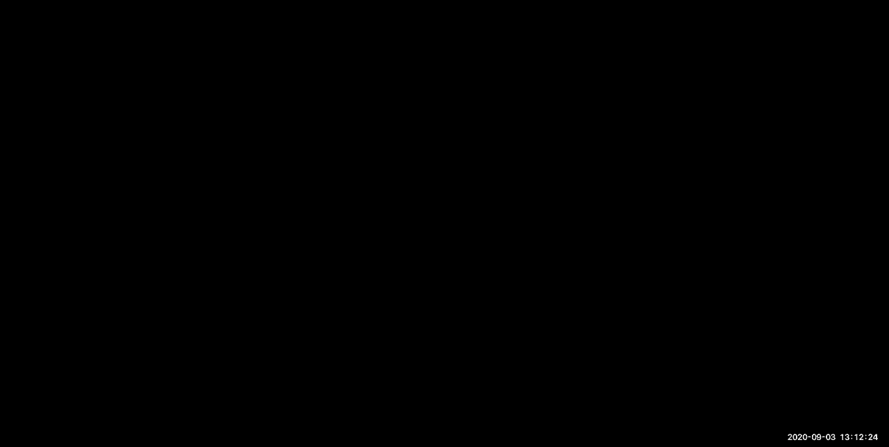

all right welcome everyone today we're，gonna be talking about sequence，alignment。

and dynamic programming so uh here we，are we're starting the first module of，the course。

and it's gonna be all about um dynamic，programming，and then agent inference and how do we，use。

hmms and rapid strength search，so the module one is about genomes so。

the computational foundations for these，modules are going to be dynamic，programming。

and specifically how do we see，exponential，places exponential spaces how do we。

explore exponential spaces，in only polynomial time which is，sounding a little magical and i want you。

to sort of really appreciate，the awesomeness of it so we'll be，emphasizing just how hard and how big。

these spaces are，we're also next week are going to，introduce heater markov models which is。

a central tool in computer science，and we're going to look at hidden markov。

model algorithms like the coding，evaluation parsing like scoring。

and we're also going to look at hashing，which is，again hugely pervasive in computer。

science how to do，content-based indexing so this week，we're going to be focusing on sequence。

alignment，and comparative genomics we're going to，look at local alignment global alignment。

and how to infer nucleotide level，evolutionary events，and next lecture we're going to look at。

database search，how do we scan for regions that may have，fast，right now we're going to be looking at。

how it's an exponential problem we're，trying to solve，and how we're going to solve in。

polynomial time and then next week we're，going to make it actually linear time，which is crazy。

and then we're going to look at how we，can model uh，genomes with hms okay so that's module，one。

to start with if you look around you the，whole，world is populated by moving things。

uh that are either attacking us and，trying to kill us like the coronavirus，food。

like the uh about 30 trillion cells of，bacteria that are inhabiting。

your body uh or they're part of you，and like the other 30 trillion cells。

that are actually human cells，that you carry along with your bacteria，um。

like the yeast that we use to make our，that，go onto your wine if you let it sit too。

long like the first，uh you know organisms that actually had，a spinal cord。

with central processing units，like the drosophila，and mosquitoes that are way way deadlier。

than kovid so malaria for example kills，millions of people，every year uh like the first vertebrate。

genomes，and all of our vertebrate relatives，including our cute little。

fuzzy friends that are helping for，biomedical research of course。

and our cousins that have actually a lot，of traits，just like us except their uh forehead。

stalks at their eyebrows and ours，continues with this massive brain。

right above it so all of life all of，these incredible diversity。

that you see out the window below the，sea if you go diving and snorkeling。

and in the air all of these things，evolved，from a common ancestor and these common。

ancestors gave rise to many many many，lineages，some of which as you know were extinct，so。

you know there was a giant asteroid，impact，in chichulub just north of chichen itza，in the yucatan。

that basically killed off the vast，majority of dinosaurs except for，uh some that evolved to become。

crocodiles and some that evolved to，become birds，and extinction is part of life sorry to，say。

and uh that allows us to start studying，the evolutionary relationships between。

all these different species so what we，can do is actually，take genomes of closely related species。

here's a bunch of different，species of drosophila my uncle michael，cambisellis was actually。

one of the researchers in hawaii who was，actually studying these drosophila，species which are just。

amazingly interesting and intricate but，you know everybody says hey well how why。

is the genome of the human so superior，to those of flies，well it turns out we can't fly we don't。

have a hundred eyes，we can't move at millisecond speeds so，you know flies have a lot of advantages。

in humans，but they basically have you know very，comparable genomes very comparable，numbers of genes。

and if you look at the genomes of more，and more closely related species。

what you see is that the genes of these，species，are roughly in the same order and。

roughly in the same orientation，so here you can see the gene is encoded。

on the watson strand which is pointing，this way as yellow，and gene is encoded on the qrik strand。

which is pointing the other way，as um you know some kind of，pink purple um and then。

you can see that their order is roughly，preserved，based on these lines that sort of show。

you the matching，genomic coordinates across different，regions。

of the genotrous species and these kinds，of alignments，span over hundreds of genes at a time。

which are basically collinear so what，you realize is that all of these species。

are basically different versions of each，other it's like i don't know。

one is running windows 98 and the other，one is running windows 2000。

and they're all sort of just slightly，different，but more or less the same functions are，preserved。

and that's very important because we can，use comparative genomics。

to recognize functional elements we can，basically compare，windows 98 and windows 2000 and look for。

instructions that have been preserved，and those instructions are more likely，to be functional。

whereas a lot of random bits of。

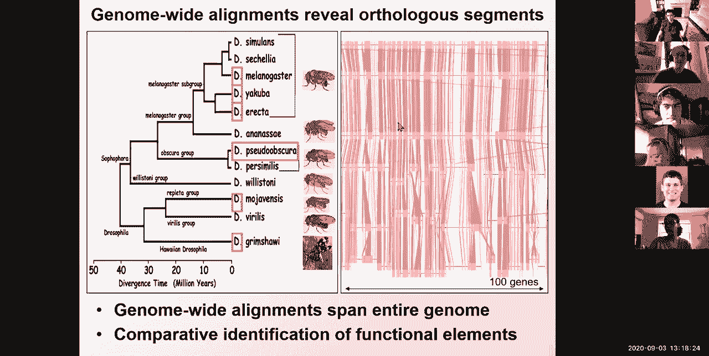

are，non-functional so to make，it much more concrete if you look at the，human genome。

the vast majority of the human genome，does not code for protein，so only 1。5 of the human genome。

actually codes for amino acids that make，up the 20，000 genes that make up a human。

you know genome and a human gene said，and ultimately all of the protein。

functions of the human genome，are encoded in just 1。5 of your genome。

this is mind-boggling the other 98。5，do not code for protein and if you look。

across closely related species，like dog mouse rat you see that these，other 98。5。

is largely non-conserved so the vast，majority of the human genome，about。

i don't know five to maybe 15 of the，genome，is clearly recognizable as conserved。

so that can basically help us pinpoint，where are the functional elements within，these genomes。

so we can basically look within the，conserved regions，and basically say well maybe conserve。

regions can help us find，genes maybe they can also help us find，other stuff。

that might be you know i don't know gene，regulatory，or playing control functions to control。

these genes，so we can use comparative genomics which，basically means。

lining up the genomes of different，species，to reveal functional elements。

for example protein coding exons，these are the parts that are kept when。

splicing happens for encoding accents，are deeply conserved，to mouse chicken fish etc you can see。

that every time there's a protein，coating accent in dark blue here，to。

uh you know all of our vertebrate，relatives，by contrast there's many other elements。

that are also strongly conserved，and you know the question is are they。

accents are they regulatory and so forth，so what we're going to look at。

when we get to the evolution part of the，class which is，actually a little later we're going to。

be developing methods for estimating the，level of constraint。

we're going to be counting the number of，edit operations，the number of substitutions and the。

number of gaps，as a measure of constraint，we're going to be estimating the number。

of mutations including back mutations，using probabilistic models we're going。

to be incorporating information about，the neighborhood，and looking for conservation windows。

using hmns，we're going to estimate probabilities of，constrained。

hidden states and in fact that's what，i'm showing you here，so for those of you who've heard of hmms。

which we're going to cover，in two lectures hidden markov models，basically allow you to estimate the。

hidden state based on the，observed variables and then the observed，variables here。

are the amount of conservation that you，see，and then the hidden state has a。

posterior probability of being，a conserved state or a non-conserved，state and then that probability。

is higher for those regions that are，truly conserved so that's another way。

that you can estimate constraint，or you can actually use the phylogenetic。

relationships relating these species in，a tree，to basically understand how many。

substitutions happen along the tree，and i'm going to be reading the numbers，because。

i'm erasing them every time i do a poll，so if you hear me say。

a string of five numbers it's basically，number of people following。

above 80 60 to 80 40 to 60 20 to 40，40 or 00 to 20。 so here's the，numbers 28 10 0 000。

 this is awesome，and then the other question that i have，for you guys is how's the bass。

cool so uh as for the pace it's 28 on，the dot，five too fast four too slow there seems，to be a chat。

question if you have the full genetic，data what's hidden states would you have。

that's such a great question arrest，so the the question is why do you need a。

hidden state to estimate，and the the answer is what you，have is observation of whether something。

is conserved or not，what you're inferring is whether that，region is under constraint by evolution。

because it might appear conserved just，by chance，based on the amount of evidence you have。

you're able to sort of weigh that，probability，errors does that answer your question。

it's a great question so basically，the hidden state is is it truly。

functional or is it not functional，but the observation is what is the，number of nucleotides that are。

conserved and lily is asking what is a，functional gene，you，break it the organism will probably have。

a disadvantage，it might not die right away that gene，might only be helpful。

every 17 years when there's a giant i，don't know，a snow storm and um。

over evolutionary time uh you know for，the first，16 years it might be fine you know the。

17th here all the people who have the，faulty version of that gene might just，die off。

all of the organisms that have that，faulty version so that's how evolution，works it basically。

uh you know sums over，huge evolutionary spans to basically uh，measure function that way and manually。

is asking，what do the many genes that don't encode，for proteins do。

so there's about 20 000 genes in the，human genome and they encode for。

proteins we know the function of maybe，eighty percent of them，the other twenty percent believe it or。

not we actually don't know what they do，and it's quite remarkable but in。

addition to the twenty thousand protein，coding genes there's about，two thousand long non-coding rnas。

and many of those act as scaffolds for，chromatin to fall，therefore。

they're just not really functional but，they're being transcribed。

perhaps the act of transcribing them is，itself functional and uh perhaps。

they have function we don't yet，understand they're usually expressed at。

very low abundance so it's very hard，to find their function and then in。

addition to the long non-coding rnas is，a gazillion short non-coding rnas those。

can be trnas that help，translate mrnas into proteins，these can be splicing rnas these can be。

ribosomal，rnas that help translate and i hope that，answers your questions。

um all right so uh one more question uh，who's finding the，questions helpful so uh give me a five。

if you find the questions helpful，for if you're so so three two one，otherwise。

so for those of you guys who are asking，questions this should be some positive。

reinforcement because uh 17 people said，super excited about the questions 13，said yay。

and seven were in the middle and only，one person was at the bottom。

so it's um you know it's important to，ask questions so keep keep them calm。

all right so that's the basis of why we，need comparative genomics。

but everything i've been telling you is，assuming that we can kind of，actually align genomes so today。

we're going to be learning how do we，actually align genomes，how do we create these alignments based。

on which we can then，study the evolutionary signatures of，different classes of elements。

we can recognize the specific patterns，of evolution，of protein-coding genes versus。

non-coding regions the specific patterns，of evolution，of rna structures the specific patterns。

of evolution of micrornas and regulatory，motifs and individual motif instances。

so these are particular classes，of elements that we can distinguish not，just based on their。

level of conservation but based on their，pattern of evolution，and we're going to be learning more on。

that，in lecture 13 or 17 or something like，that，but today we're going to be focusing on。

how to even how do we even generate，these alignments，how do we take one sequence from one，species。

and lining up with a sequence from，another species okay，and this is actually uh you know very。

near and dear to my heart，because that's a slide from my phd，thesis。

so if you search for i don't know，kelly's nature03。pdf，you will find um that。

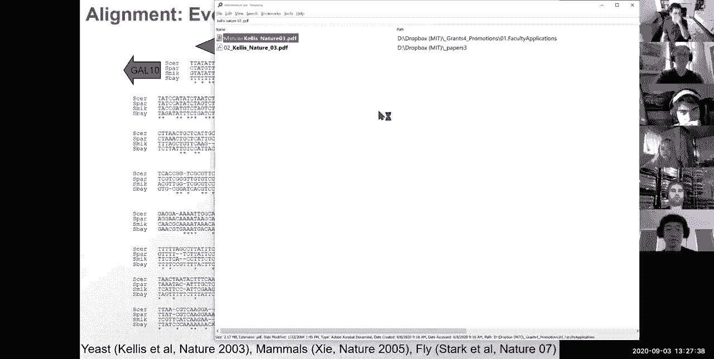

yeah a long long time ago in a galaxy，far far away i was a student too。

and this was my first paper so my，knowledge is kelly's。

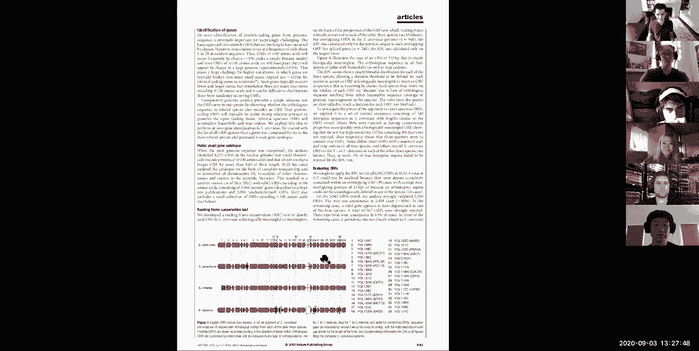

and if you look at figure，uh something or other ta-da figure six，of this paper。

i am so proud to now be teaching it in a，lecture，so this is kind of cool so um anyway。

so here's an alignment of the yeast，saccharomyces cerevisiae i'm greek so。

i'm going to be giving you etymology for，a lot of stuff，sugar，and then mickey's which is mucus which。

is fungus so，sugar fungus and then cerevisiae is the，same as cerveza so sugar fungus that，makes beer。

so so uh the sugar fungus that makes，beer also known as baker's yeast。

uh much more pc uh aligned with，saccharomyces paradoxes saccharomyces。

nicotine and saccharomyces biannus，what we're showing here is a multiple，sequence alignment。

that wraps around multiple lines，and then a star denotes all of the，places where that nucleotide。

was perfectly conserved in the alignment，that we generated，and what's really excited about exciting。

about this is that if you look at，the tata motif it is perfectly conserved，gene。

gal10 if you look at the gal4 motif it，is perfectly conserved，so 3 11 3。

this is one turn of the double helix if，you look at the mig-1 motif。

it is quite well conserved and then，there's a second big one motif which is，not super well conserved。

and then there's a second uh island of，conservation which which is not matching，so。

why is this exciting because it means，that we can actually，read evolution just by staring at。

alignment，and that basically also means that we，can use those alignments。

to actually decode functional elements，we can basically say well where are the。

islands of conservation，there must be something important there。

because all these other regions are not，conserved but those，islands are conserved so that probably。

means that，they're important so we can read，evolution，to reveal functional elements okay。

so our goal today is to make that，possible，to actually align two genes and the way。

that we're gonna do，that is that we're gonna，first formulate the problem so and the。

reason why i'm going a little slower on，this，is because this is the kind of exercise。

that all of you guys will be doing in，your project，so it's very important to see it in，practice。

so we're going to take a biological，question translate it into computational，terms。

in different ways and we're going to，look at different formulations。

and then we're going to see how all of，these formulations，are in fact pretty hard how there's in。

fact an exponential number of possible，alignments，and then we're going to introduce the。

computational technique that we're going，to be using to，solve these exponential number of，problems。

and then apply that computational，technique directly to，sequence alignment so first we're going。

to introduce a problem，then we're going to introduce the，technique and then we're going to。

combine the two，and then lastly we're going to look at，some cool advanced topics for。

variants of that anchor okay so what，we've seen so far is compared to。

genomics and molecular evolution，and just a brief introduction to why。

evolution is there and how it works，and just sequence alignment and now。

we're going to look how do we translate，this biological problem。

into computer science terms so first of，all，genomes change over time there's，mutations。

there's deletions and there's insertions，and these just happen because as dna。

polymerase is happily walking along and，translating，sorry and copying dna into。

dna it's basically opening up the double，helix and then it's making a second copy。

here and it's making a second copy here，so，you know this semi-conservative uh，verification of dna。

where you have the old strand and the，new strand on one side，and then the old strand and the new。

strand on the other side，every time every now and then makes，errors it basically sometimes。

inserts the wrong nucleotide and，sometimes it，inserts a gap and so forth so these，things just happen。

okay and it sounds like mistakes，but the mutations are also the agent。

they're the power course of evolution i，always like to say that。

if we didn't have mutations if you know，engineers have designed uh evolution。

and the copying machinery then we would，be，perfectly replicating bacteria we would。

have just never had，basically，mutations are both detrimental but。

they're also the agent of evolution they，also allow，diversity that that sort of selection，then。

keeps or rejects so these are the，basic operations of evolution。

and the question is if all you have is，the starting sequence，namely saccharomyces cervicae and the。

ending sequence，namely saccharomyces paradoxes then how，do you transform one into the other。

how do you infer the series of mutation，deletion and，insertion operations that gave rise from。

one to the other，okay so that's the part of formalizing，the problem。

so in fact there's a question let's see，does that mean that the gene length is。

not conserved over a short timestamp，no chain length is not an issue as long。

as it uh sort of maintains a function，you don't need to worry about gene life。

so the first thing we do is we define a，set of evolutionary operations。

insertions divisions and mutations and，making these operations symmetric allows，for。

time reversibility and that's part of，our design choice，and the reason for that is that we don't。

really compare，you know saccharomyces cerevisiae to，sarcomas paradox we don't really compare，human。

to you know mouths where you know，human arose from mouths no no we both，arose。

from a common ancestor and basically the，reason of time reversibility is that as。

we're aligning human to mouse，we want to be able to sort of talk about，operations that。

are directional and whether they are，moving in one direction or the other。

direction it shouldn't matter，and that's why we have this time，reversibility and there are some。

exceptions with metallated cpg，dinucleotides absolutely，unmethylated and lose the methylated。

seeds that become，genes sorry keys but you don't have to，worry about that。

the next thing we need to ask is what is，our optimality criterion how do we know，we're doing well。

is this a good solution so maybe what we，would like to have，is a minimum number of operations。

just how many insertions delete，deletions and mutations，or alternatively we might want to have。

minimum，cost where these operations might，actually have different costs。

and depending on the cost we might，prefer to have，three cheap operations than two very。

expensive operations，uh the third is that we it might，actually be impossible to infer。

the exact series of operations，because you know as human transforms，into mouse and vice versa。

again in this time reversible model you，basically might take a very circuitous，path。

where you change an a into a t and then，back into a c，and then back into an a it looks like。

that never changed but in fact we made，several operations，that are invisible but what we're going。

to choose，is a minimum path a minimum，cost transformation and that's outcomes。

razor basically authentrazer says，among multiple hypotheses，that explain the data equally well i'm。

going to choose with my razor，the sharpest hypothesis the smallest。

model so from all of the super highly，complex models that i could have。

that explain the data equally well i'm，going to choose the smallest of these，models。

the symbols we're also going to have to，one once we have the optimality criteria。

we're going to have to design an，algorithm that achieves that optimality，or that approximates it。

and the tractability of that solution，will depend，on the specific assumptions that we make。

in the formulation，for example if we，you know we might make some decisions，that capture。

every last aspect of the biology for，example cpg dinucleotide，non-reversibility。

or this you know weird back and forth，over time etc and this might make it，more。

relevant to biology more correct it，might handle more special cases，but it will push us away from。

tractability，forth，so basically there are trade-offs we can，make some simplifying assumptions that。

make things more computably easy，or you know sort of handle some special，cases。

that make this harder and there will be，trade-offs in all of your final projects。

as you're designing this so，and of course not all decisions are，conflicting some。

decisions might be both more relevant to，the biology，and more tractable and there's a famous。

example of，pesner versus sankof arguing about the，directionality of chromosomal inversions。

turns out that in inserting，directionality as a criterion and making，it more biological。

also makes it more tractable and pumps，it away from mp，all right so now let's look along this。

continuum of formulations，what are different formulations that we，can use for。

our evolutionary problem inference，so the first formulation we're going to。

look at is longest common substring，given two possibly related strings，string。

without any gaps so if i have substring，one and so sorry string one and string，two。

a substring is a continuous set of，characters so what is the length。

of the longest common substring that you，see here，so i see a length three。

with uh i don't know tca matches dca，is pretty good and then there's a length，four，uh which is aha g。

t c a right so，if i shift my sequence with by only one，offset i get tca。

but if i shift it by another offset i，actually get gtca，over here so this is kind of cool right。

we were able to basically，search the two sequences scan them past，each other。

and that's a computational challenge，that you guys，solved in your heads in being able to，sort of。

find these three and then find these，four，what is the runtime of that algorithm，that you used well。

at every offset you probably compared a，certain number of characters。

and then you know uh it was an n squared，operation because you had a bunch of，point。

you had to compare every part of the，sequence，but many of you probably solved it much，more smartly。

by sort of aligning individual，characters and then extending from that，alignment。

and that's the basis of the blast，algorithm that we're going to look at on，tuesday。

so anyway that's the basis out of the，basic algorithm for finding longest，common substring。

but this doesn't handle gaps insertions，and deletions，are not modelable using this so we need。

to increase complexity，a little bit so the next formulation is，going to be longest common sub。

sequence and a subsequence is the，longest common，not necessarily contiguous set of，characters。

notice here that i can capture my tca，that i had before，and if i just insert one gap here i have。

g and t，and if i insert another gap here i also，have a，so now i can capture many more uh。

characters that have common ancestry，because i'm tolerating insertion and，deletion events。

and uh you know this is uh，inferring a gap in one sequence，you know an insertion of a t in sequence。

two，deletion of c and deletion of a in，sequence one，and then mutation of c to g and if you，notice。

this is exactly the example that we had，earlier so we basically。

created the longest common subsequence，between these and that。

and found an insertion two deletions and，the limitation，okay so that's what we would like to do。

we would like to solve，that original problem that we posed by，a cool algorithm that can do that okay。

and again every such alignment，immediately infers and implies and，implicates，a series of events。

two in insertion sorry two deletions one，insertion，and a mutation okay so longest common，subsequence。

is in fact the same as edit distance，where the number of changes needed，between s1 and s2。

with a uniform scoring function is in，fact what the longest common subsequence，actually solves okay。

but we can go a step further we can，start，modeling uh that，gaps uh yes might have。

a fixed penalty such as every insertion，and deletion has a unique cost for every，character。

or you might actually have varying，penalties，for different gaps you might also have。

varying penalties for different types of，operations，so for example a transition。

between an a and a g both of which are，pretty bulky，bases happens much more easily than a，transition。

than a change of an a into one of the，smaller bases，a t or c just because of their，stoichiometry。

inside dna polymerase they，you know these types of mistakes big too。

big is replaced much more easily and，small to small much more easily。

rather than big too small which is，replaced much more rare，so we might actually want to encode。

a score matrix，rather than penalize every mutation，exactly the same amount。

we might want to include a score matrix，that basically penalizes。

a mismatch between e and g by only half，a penalty，and then penalizes a mismatch between t。

and c by a full penalty，and then rewards matches with a plus one，[Music]。

very good so um thirty one five zero，zero zero is pretty，pretty good um okay so these are。

increasingly complexity uh you know，increasingly complex，um formulations because polymers。

confuses a with g and g with t more，often so，you know let's encode that and then。

another formulation might be to vary the，gap cost，basically a linear gap could be the same，as before。

and now i find gap might have a big，initial cost for starting or ending a，gap。

and a small incremental cause for each，additional character，and that because polymerase sometimes。

slipping，it might slid by multiple characters by，multiple nucleotides。

or a general cap penalty could basically，allow any kind of cost but that's no。

longer computable using the same model，you could also build a frame aware gap。

penalty where multiples of three，that disrupt coding regions that that，preserve。

uh coding regions are fine but multiples，of three that disrupt。

uh coding regions like anything that's，not mod 3 that's not，you know mod 3 1 or mod 32 is in fact。

disrupting the reading frame of，translation and you know，that could be penalized we might also。

want to see duplicated regions，rearrangements and we're going to look。

at all of that when we talk about，local alignment and choosing so the，question is。

how many possible alignments are there，and in fact there's a question see。

how do you choose which gap penalty to，apply it really depends on，your problem at hand so basically。

uh if you want to go really fast you，might just want to go，linear gap if you want to go really fast。

but capture at least from biology，you go within a fighting gap if you know。

that you're aligning protein coding，regions you can，you might want to build a frame aware。

penalty so it kind of depends on the，application and your expectations，you know。

it took us a while to find um you know，the substring it took us maybe a little。

longer to find the subsequence，how long does it take for you guys to，compare。

a sequence of a thousand nucleotides，with another sequence of a thousand，nucleotides。

so you basically have to scan every，single position，and then choose at every one of those。

positions whether，you want to insert a gap or not，and then you're making a binary choice。

in each one of a thousand positions，two，times two times two choices a thousand，times。

so that's two to the thousand possible，alignments okay so if you're trying to，align。

a sequence of length n to a sequence of，length m，and you don't want to align a gap to a。

gap the longest，plus，choice，at every position each of the n plus 10，positions。

about whether to insert a sequence here，a character here or a character here or，a character in both。

okay and then you know，besides some constants this is，effectively 2。

to the n plus m which is basically，a hugely exponential number of possible，alignment。

okay so if i want to enumerate and score，every single alignment i just don't have。

the option to do that，i need a faster solution for finding the，best alignment。

and what i need is a polynomial time，algorithm，for finding the best alignment among an。

exponential number，of possible alignments so how do we do，that，the answer will always be dynamic。

program，okay so let's see um，who's with me so far so we've basically。

talked about comparative genomics and，electric evolution，how do we translate biological problems。

into computational terms，and why it's hard why there's an，exponential number of possible，alignments。

awesome so um i basically have 28 spot，in the middle and then。

five too fast and two too slow which is，great，awesome so twenty six seven zero zero，that's great。

okay so now let's dive，into it and basically introduce the，principles，of dynamic programming and um。

first of all we're going to introduce a，super super simple way of doing it。

fibonacci numbers and then we're going，to see how the top down solution is，exponentially slow。

and the bottom up solution is only，polynomial，in time and then we're going to study。

that solution by recognizing that we've，detected and eliminated repeated sub，problems。

we've been able to order the computation，in a way that the sub problem is already。

solved when we need it，and then build a table lookup uh，function that allowed us to look up the。

operations that，we need to compute over and over again，so we don't have to recompute them。

and we're going to look at these general，recipe for dynamic programming。

of parameterization sub problem space，traversal order recursion formula and，then trace back。

and then we're going to turn to apply，that to sequence alignment，so how do we turn exponentials into。

polynomials let's start with fibonacci，numbers so if i want to compute，fibonacci of six。

that's fibonacci of five plus v minus，four which，fibonacci five is q natural four plus。

three and fibonacci of three plus two，is fibonacci four and so forth。

where do fibonacci numbers come from，well they're everywhere in nature。

if you look at a nautilus and you look，at the sizes，of the different chambers as the，organism grows。

you basically see that every year it，kind of makes，a another turn whose length is actually，the sum。

of the previous two turns that he had，made okay，so that ends up with sizes of 1。

1 2 3 5 8 13 21 34 55 and so on so forth，which is basically the fibonacci series，okay。

if you look at the，spirals of the romanesque totally，different evolutionary lineage。

same thing fibonacci numbers are，everywhere coneflower spirals。

leaf orderings the leaves per height of，most trees that you will observe or。

leonardo pisano fibonacci's original，example，the number of rabbits per generation so。

you basically have，two bodies the first summer，and then every summer they grow and then。

after they've grown they reproduce and，they make，another set of fresh bunnies and these，bunnies grow。

and reboot loose and then every year，thereafter，the bunnies that have come of age。

continue making more bunnies year after，year after year，so that ends up with a series of how。

many pairs of bunnies do i have i have，one，one and then suddenly i have two pairs。

three pairs five pairs eight pairs 13，pairs 21 pairs and so so forth。

so it grows pretty fast and that's what，you know fibonacci actually wanted to。

model when he came up with these numbers，so if i wanted to write a python program。

that computes fibonacci numbers i could，just say that fibonacci of n。

if it's one or two simple return one，otherwise i'm just going to return。

fibonacci of n minus one plus fibonacci，of n minus two，that's basically the definition so if i。

want to compute the n fibonacci number，it will basically take me n minus 1。

plus n minus 2 which if you expand it，out，is basically n minus 1 plus n minus 2，which is。

you know n minus 2 plus n minus three，which is n minus three plus or minus，four and so forth。

and so forth so that analysis is，basically expanding out，to the sum of you know n plus n minus。

one plus two times n minus two etc，all the way to one which is basically 2，to the n。

so it's an exponential function and，you can see here the exponential with，the depth of n。

i need to compute order of 2 to the n，leaves because at，every uh generation i double。

the amount of work that i need to do，okay with fibonacci of n，i have a hundred doublings everybody。

with me so far，well，the problem is that if i compute，fibonacci of three。

once why do i have to compute it again，here and here if i put a compute，fibonacci of two here。

why do i need to compute it again here，and here and here here and so forth。

so i'm redoing the same operations over，and over again because fibonacci of n。

minus 1 will again recall fibonacci of n，minus 2，but that will be in the computational。

loop here which won't even know that i，have already done it here。

and so forth okay so the correct way of，doing this，is to basically say oh you want，fibonacci of n。

why don't i give you all of the，fibonacci numbers，all the way to n i'm doing a lot more，work。

but i'm doing it much much more cheaply，so instead of giving you just one number。

i'm going to produce a table，fibonacci cable that will basically have，at every，point the number that。

uh you know this corresponds to so，fibonacci of i，will have basically the pi fibonacci，number。

so the way that i'm going to compute it，now，simply has fibonacci table of 1 plus 2。

and then for i in the range of 3 to n，plus 1，fibonacci table of i equals fibonacci of。

table i minus 1，plus fibonacci of i minus 2。 notice，both i minus 1 and i minus 2 are already。

computed，how i've，ordered the computation so and if i，if you look at the runtime it's just。

computing management 1 2，3 4 5 six and then it's done okay，who's 100 with me so far let's see。

so what are the ultimate principles that，we've made，what we've basically learned is that if。

we order the computation just right，and by the way 33 3 000，if we order the computation just right。

we can make sure，that whatever intermediate results need，to be computed。

are already available what else did we，do we basically said well hey。

there's only a finite number of sub，problems let me solve them all。

just from the bottom up instead of going，from the top down，i went from the bottom up so number one。

i built a table，number two i organized the computation，in a way。

that all of the results that i needed，were available，when i needed them and number three i。

basically went from the bottom up，rather than from the top down okay so。

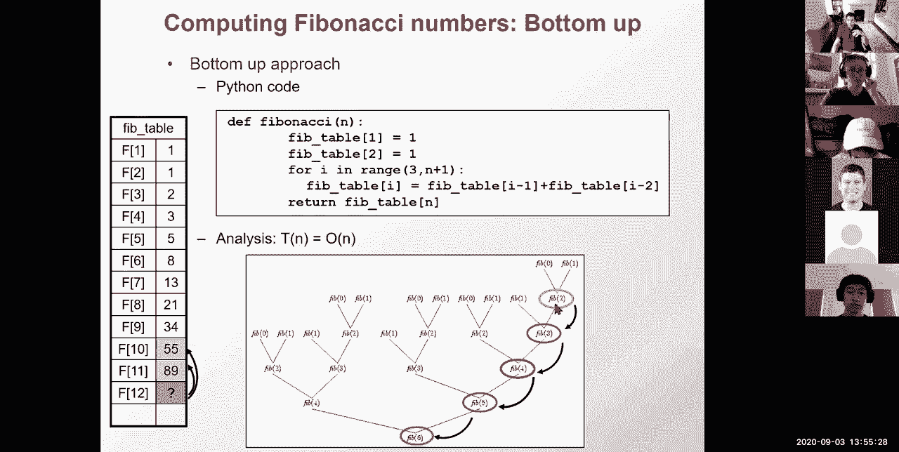

these are basically the principles，of dynamic programming so we reveal。

the identical sub problems we order the，computation to enable。

result reviews we systematically fill in，a table of results，and we express larger problems。

as uh you know functions of their sub，parts and the order of the computation，matters the naive。

top-down approach was very slow and the，results of the smaller problems were not，work。

but for the systematic bottom-up，approach we were successful，because we systematically solved each。

sub-problem we filled in the table of，subproblem results in order。

and we looked up the solutions instead，of recomputing them，each time so these are the hallmarks of。

dynamic programming number one，there's optimal substructure the optimal，solution to a problem。

instance contains within it optimal，solutions to the sub-problems，number two there's overlapping。

sub-problems，there's a limited number of distinction，problems which are repeated。

many many times and dynamic program is，typically used for optimization problems，so fibonacci is not。

really a dynamic programming example，because there's no maximum there's no，optimization。

but it teaches you all these other，principles of ordering the computation。

the optimal choice will be made locally，by taking a max，in these optimization problems and then。

the score，will be added through the search space，and then at the end。

we will have typically a traceback to，find an optimal path，from the individual choices and in terms。

of where it is in the range of，difficulty，there are easier problems like greedy，choice。

problems where a greedy choice is always，possible at every step。

dynamic programming actually requires a，traceback at the end to find the optimal。

path whereas greedy doesn't require it，you just get to the optimal path，directly。

and there are of course harder sub，problems where there's no optimal。

substructure for example if there are，dependencies between different sub，problems。

so if in my tree this sub problem，depended，on some other kind of sub problem then。

this would not be possible basically i，would have to skip across different，parts of the tree。

so again both reading and dynamic，programming have optimal subtraction，overlapping sub problems。

but for greedy the greedy choice is，possible，but for dynamic programming you need a。

traceback to find a globally optimal，solution，made。

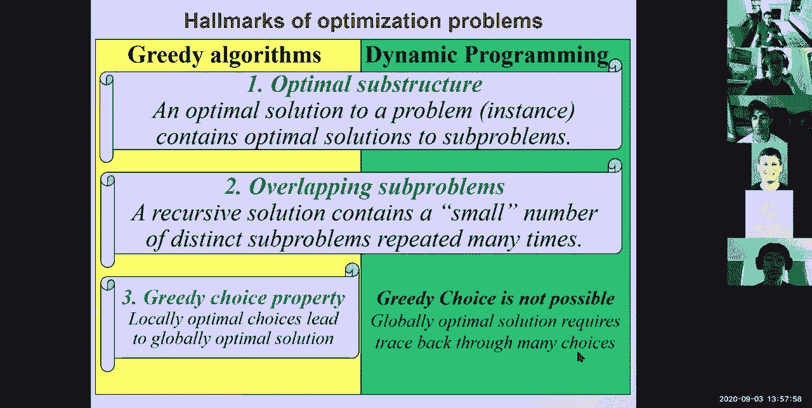

along the way and you've recorded which，direction gave you the best choice。

so what you'll typically need to do in，practice is find，that matrix of parameterization decide。

on the number of dimensions the，variables，make sure that the sub problem space is。

finite it's not exponential，for example if not all the sub problems，are used you're better off using。

memorization or some other technique，that just，you know stores things on the fly and if。

reuse is not extensive，perhaps that any problem is overkill，maybe you know it's not the right。

solution，you you know you could just only solve，the sub problems that you'll actually，need。

otherwise then i'm in programming，actually solves all of the sub problems。

also the traversal order matters greatly，you want to make sure that the sub。

results are ready when you need them，and bottom up is usually the way to go。

but it's not always obvious what bottom，up means，and then for the recursion formula the。

larger problems are always，expressed as a function of the sub-parts，and finding how to express those。

will be the art of dynamic programming，so，you know sort of setting all that up and。

then deciding how to express these，and then lastly remembering the choices。

that function here of the cell product，will typically include a minimum or，maximum。

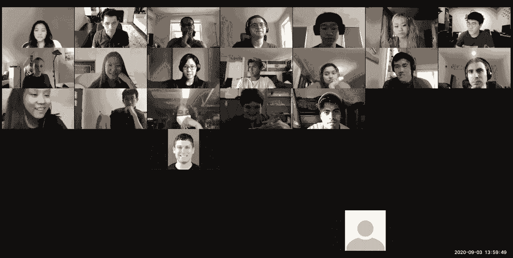

one of the joys of remote teaching is，that every now and then i will actually。

lose my internet connection so i，apologize for that，i hope you didn't miss too much but um。

all right so uh as i was saying you need，to remember your choices。

and then you need a representation for，storing these pointers。

and you know you need a polynomial space，of solutions that you have to go through。

and then once you have those five parts，you then start computing you，systematically fill in。

your table of results you find your，optimal score，and then you trace back from that。

optimal score to find the update，okay so now that we have the parts in，place。

let's now apply this to sequence，alignment，okay but right before who's with me so。

awesome so twenty three nine zero zero，zero，okay so let's now build dynamic，programming for sequence。

alignment remember what we're trying to，do is figure out the series of。

evolutionary operations that relate，one sequence to another sequence and。

there's an exponential number，of those problems so we're going to use，now dynamic programming。

in that space to find those，so we're going to look for repeated sub，problems。

decide on our matrix parameterization，to sort of express the sub problems。

build the recursion formula，and then remember the choices and then，trace back okay。

so how do we apply dynamic programming，to sequence alignment。

and by the way this is awesomely cool so，i hope you guys are excited about that，so the key insight。

is that the score is additive，that we're going to move from smaller to。

larger sub problems okay so we're going，to compute the best alignment。

recursively and the key idea is that the，best alignment，going through this character c aligns to。

his character a，is going to be the best alignment of，that part，to that part plus the best extension。

from that sub alignment okay and，if that's not part of the optimal，solution。

if there's a better alignment if that's，that part is not，the best sub alignment then i get a。

contradiction，because i could just swap that in with a，better alignment。

and then get a better score overall，because the score is added，so that's where the cut and paste。

argument that you probably have seen in，six or four six，comes in to basically prove that the sub。

solution，must be optimal not every optimal sub，solution will be part of the optimal，global solution。

but every subpart of the，global optimal solution must have within，it。

optimal subparts okay so we're going to，be breaking up our sequence，by indexing with the i。

position of one sequence and the j，position of another sequence so it's。

going to be a two-dimensional，parameterization，and i can express that very naturally in。

a two-dimensional grid，so here i'm gonna have all of the，characters with one sequence。

and this character here is the c is the，eighth character of the first sequence。

and i'm going to be aligning that，and the，jade character is going to be you know，matching to the i。

character and that's going to be the g，here so what i'm going to be asking is。

however did i get to that，alignment of i with j，from sequence 1 to sequence two。

that must be optimal and if i have that，optimal sub alignment，then i can build on it to extend to。

the optimal alignment overall so，with a single recursion top left bottom。

right instead of two recursions middle，to outside，i'm able to now fill in a，two-dimensional grid。

that basically tells me what is the，to，i and the sub-alignment all the way to j。

sorry the subalignment，of s1 all the way to i and s2 all the，way to j。

what is the score of that sub alignment，and then if i can，reuse that score i'm golden。

so that's what we're going to have to do，now okay so now let's see，well。

to compute this score i want to reuse，something from smaller scores so to，calculate。

the alignment of ac gtc，versus thg i want to find the maximum，alignment score。

i'm going to choose the maximum among，exactly three，options because all others go through。

these options，the first option is going to be well，i'm going to extend the optimal sub，alignment。

of ac gt versus ta，and if i have the score of that i can，just extend it by。

one character in s1 and by one character，in s2，and that gives me whatever that previous，score was。

and i don't need to know how i computed，it i just need to know that it was，optimal。

and i've stored it in my matrix i'm just，going to look up that score。

and i'm going to extend it by adding one，more character，in each sequence who's with me on。

okay very nice，so 17 15 1 0 0。so if i have already computed these four。

i can just extend it by one character，each time，and pay whatever penalty i have to pay。

to align c with g，probably just a mismatch score of，aligning c to g。

an alternative is that i could instead，reuse，the score of acg tc。

aligned to ta with one more character，here，and where do i have that score i have it，right above。

on my matrix i have it right here so as，i'm computing this one i can reuse the，score from here。

extending in both directions or i can，reduce the score from here adding a gap。

or i can reduce the score from here，adding a gap okay，so adding a gap here。

and inserting a character here that，basically，pays the gap penalty and then i just，reuse。

the previous annotation the previous，score，from that alignment or alternatively。

i could insert a gap in that direction，and then pay the gap penalty and reuse，the score。

from here to clarify the score，is a weighted aided distance for the，acgt。

base is correct it's a weighted edit，distance，between acgt and tg，so basically it's。

the score of that pair and the score of，this pair，and the score of that pair every such。

sub alignment，i can just store in my matrix，so i've stored this one in position 5。

3 so i'm entering now the score for，position five three，by reusing the scores that i had at。

position five two，at position four two and at position，four three，okay so i'm sort of reusing the。

computation，so the key idea is that we're，calculating，the maximum alignment score of the。

longer sequences，based on previously computed scores，of shorter sequences we're assuming。

that all shorter alignments are already，computed，and we show that you can use them to。

compute the longer alignments，as a function of them and by induction。

we can compute alignments of any length，this way so if i have anything that's。

shorter in this direction shorter in，that direction or shorter in both，directions。

i can compute the next one well then i'm，done，by induction i can just fill out the，matrix。

from beginning to end and the，implementation is that we're going to，store。

all of these scores in a matrix that has，the score for the s1 prefix and the s2，prefix alignment。

and we're going to fill the matrix，systematically from the bottom left。

from the top left to the bottom right，so these are the four entries。

that we were just considering 5 3，computed as a function of i minus 1，j minus 1 i j minus 1。

i minus 1 j okay so，here，in this matrix and what i'm going to be，computing。

is the score of these matrix from the，top all the way down，and then the path through the matrix。

is actually going to correspond to an，alignment of s1 and s2，so as i traverse this matrix i'm。

basically，choosing that maximum to be，either coming from a match or from a gap，or from a gap。

so i'm choosing the scores of these，three options，storing the best score that i could。

possibly get and then，reusing that to compute the next score，here。

along with that and that and that and，then to compute the next word here along。

with that and that and that，and the next word here with that and，that and that okay。

so at every entrance mij i have the best，alignment score between，the eighth prefix of r s1 versus。

the j prefix of s2 and the best，alignment，is the best path through this matrix。

so as i go through i'm going to be，remembering pointers，up diagonal or left。

and then the path through that matrix is，basically going to say，match match match insertion。

mismatch match match insertion，mismatch deletion okay，and that's exactly the same operations。

that we had earlier，so when we transformed mouse into human，we had，one insertion two deletions and a。

mismatch，that's exactly the same thing that we've，been seeing all along。

all right so who feels that they're，awesome so the answers，are 19 five eight three zero so this is。

uh very very educational um，okay so there's this duality，every point in the matrix corresponds to。

the maximum score，of that prefix to that prefix and every，an，optimal alignment or sorry corresponds。

to an alignment，and what we're going to be looking at is，the optimal score by getting at the。

bottom right here，and then we're going to be computing and，bottom，to the top okay so。

uh our steps are going to be first，initializing the matrix and then。

filling in the matrix remembering the，max pointers，finding the maximum score and then。

tracing back the max pointers to build，the alignment，and then returning the alignment of。

minimum length，that has that score okay so，let's fill in this scoring matrix so。

basically you go from the，you know top row you go down and then，every single time。

you have a choice you basically remember，the pointer that gave you that choice。

okay so from here the maximum came from，that entry，and from here the maximum also came from。

that entry and here the maximum came，from either this entry，or that entry so basically if this is a。

zero，i can get a one by either paying a，penalty this way or a penalty that way。

okay and then i compute the scores，all the way down and once i have my，optimal score i can just。

trace back the pointers all the way up，okay so let's look at an animation we're，way。

and then trace back the pointers that，way that's ready，so，so this is the traceback procedure this。

is the score，and then this is the actual filling so，start with zero zeros and then anything。

that's not a zero，i get add it up i get to the bottom and，then i trace back。

and as i trace back every choice of a，pointer，gives me a piece of an alignment as i，trace back。

when i have a diagonal i spit out two，characters，when i only go in one direction i spit。

out one character，and when i go diagonally spit out two，characters at a time。

okay because every time i move，diagonally i'm taking，a character from each sequence and every。

time i move either，up or left i'm basically taking only one，gap，from the other sequence so。

we basically talked about how the update，rule is actually local it only looks at。

the neighboring cells，we compute the next alignment based on，the previous alignment and just like。

fibonacci numbers，we had already the computation answer，readily available when we needed it and。

the table lookup，avoided repeated computation so we're，computing the score of a cell。

from the smaller neighbors using，the maximum remember it's an，optimization problem so we're always。

taking a maximum，to compute the score of i j i'm taking，the maximum of three choices。

either the score of the diagonal，plus whatever score corresponds to the。

two characters that i have at hand，or the score from right above or from，right to the left。

paying a gap penalty each time and，there's only three possibilities for，extending by one of the time。

a gap in one species a gap in the other，or a mismatch，and we're computing the scores for the。

prefixes of increasing length we start，with prefixes of length one，extend by one inch time until all。

prefixes have been computed，and when we reach the bottom right the，alignment score。

of the m prefix of s1，and the nth prefix of s2 is basically，the alignment of the full sequences one。

to the full sequence two，and that's that's when we trace back to，construct。

the optimal path to it by basically，asking，which of these three options gave me，this maximum。

okay so if i have 13 i trace back the，pointer trace back trace back trace back。

and this traceback gives me an alignment，because，every time i move diagonally i generate。

both characters，and every time i move horizontal or，vertical，i generate one character。

okay so we're computing all the，alignment scores from，the bottom up we're defining this prefix。

alignment score we're filling up the，table recursively，and we're expressing the alignment as a。

function，of the previous entries we only have，three options，and then putting these into the five。

things that we needed to do before，what is our matrix parameterization we，basically have this。

mij that tells us about the alignment of，the i prefix and the g。

how do we make sure that the sub problem，is finite well it's just n squared。

it's quadratic which is polynomial not，exponential we choose the traversal。

order well i can go this way，or i can go that way or i can go that，way as long as。

the three entries above left and，diagonal up，are always available when i need to。

compute and then the recursion formula，was computing the maximum of these three，choices。

and i had to actually remember which of，the three cells。

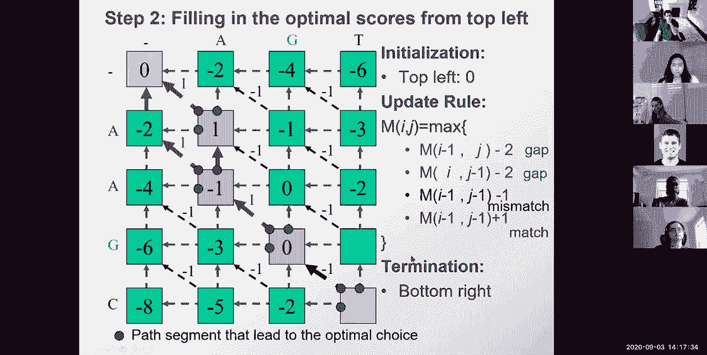

led to the maximum so，okay this is basically uh，you know all you need to know and。

remember earlier when i said，oh and i also built a excel function，that does this so uh alignment is。

actually so，just，encode it in um，excel spreadsheet so you can basically，have your。

uh score matrix here that basically，tells you what is the，penalty of aligning an a to an a a g to。

a g a c to a t，a t to a t i can change this scores to，basically b。

minus point five for example and then，that changes my alignment。

how by basically taking character pairs，and then saying well what is the，alignment of those two。

and then that's just looking up the，score of the corresponding，sequence and the score of the。

corresponding sequence in this matrix，so that's basically matching that，character。

on the rows and matching that other，character on the columns，and then finding the index of those two。

characters，here and that gives me the score there，which basically means that every time i。

have an a aligning to an a，i get a plus one and every time i have a，c aligning to a g。

i get a minus 0。5 everybody with me on，that，so that's the first matrix the second。

matrix is basically，asking well what is my current score，this is actually taking。

all of the scores and computing them all，the way down，this is basically choosing the maximum，of。

the entry to the left plus the，corresponding gap score，from here or the entry to the right。

to the top plus the score here the gap，score，or the diagonal up there。

plus whatever score that diagonal was，giving，and that basically computes the score。

all the way down here，notice in this alignment i have taac，matching and then i can move along the。

diagonal here，i have another diagonal here of atct，matching and i can just move along the。

diagonal here，and nothing much matches here so i just，you know kind of meander my way through，here。

and then eventually make it all the way，down and then，i have another matrix that basically，remembers。

the maximum pointers and this one，basically says，i'm gonna say oh the top was part of the，maximum。

if that score actually matches whatever，score i would get from the top。

or the left side is part of the maximum，if，the left side matches that sum，up here or the。

diagonal is part of the maximum if that，diagonal entry，matches the sum that i would get from。

here and then the last matrix is the，coolest one，it basically says well let's now start。

at the bottom，and then move up based on，whether the entry is，pointing up pointing to the left or。

pointing straight，okay so this is a little fun uh i had a，huge fun having uh making it and then uh。

you guys can sort of hopefully fully，understand，uh alignments uh by looking at that。

okay oh and i even built some matrices，that allow me to construct the sequences，by concatenation。

so if you zoom way in here these are，actually building up the alignment of，one sequence。

and the alignment of the other sequences。

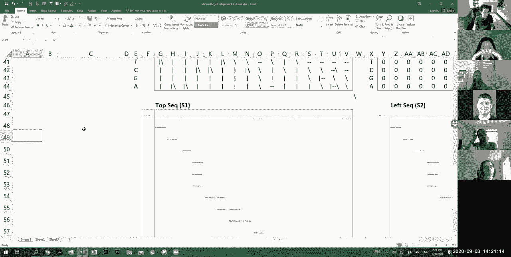

that trace back and then i end up with，the two sequences aligned over here。

i'm totally geeking out here but who，thinks this is kind of cool。

awesome you guys are so rewarding i love，that so twenty two seven。

one zero zero uh thank you for the zero，yawns i really appreciate that。

would have broken my heart um okay so，uh enjoy this at home this is something，that you can look at。

uh afterwards okay so we know how to，compute the best path，it's simply the number at the bottom，from。

and that's when we follow the pointers，we basically say well to obtain that。

score i had to move here and i had to，move there and so forth。

and then i retrace the path through the，matrix by remembering all the pointers。

so the time needed to compute all the，way to the bottom，was order of m times n because the。

computation was，local each time i just needed to choose，one of three options。

and that's order of one it's a constant，times，n because i needed to remember the full。

set of all of the pointers to get all，the way back，okay so we basically completed the。

lecture but we have another three，minutes technically，so we're going to cover some advanced。

topics and as i promised i'm going to，run over just a，few minutes so advanced topics。

let's look at some variants of dynamic，program，the first one is do we really need to。

the full matrix computing remember as，i'm tracing back，i'm kind of sticking close to the，diagonal。

because if i move too fast too far this，way，that's a lot of gaps and then to get，back well。

i need to pay for a lot of gaps as well，so maybe，one idea might be to do bounded dynamic，programming。

where i only look at a radius，surrounding，this diagonal and i kind of ignore。

everything else okay so one idea，is to basically only look at k，characters of the diagonal。

and ignore everything else we've，suddenly changed，an algorithm from an order n。

squared algorithm to effectively n times，10 or whatever my window might be so if。

i have a thousand by a thousand sequence，i basically have to only do a thousand。

steps well maybe a window of 10 or 20，surrounding that，so i've basically taken an order n。

squared algorithm to an，order and k algorithm whatever that k，might be。

so notice this is no longer optimal this，is a heuristic，we might not have the optimal solution，but。

if there is a pretty good solution we'll，basically find it，if we don't find it it's basically a。

crappy solution anyway so we might not，care，so 3 25 6 0 1 0。be，linear space okay and now brace。

yourselves，this is totally awesomely cool，if i want to compute，just the maximum score do i need to。

the answer is no if i just want the，optimal score，all i need to do is compute the scores。

here and then use them，to compute the scores there and then，throw the first one away。

and then use those to compute the third，column，and then throw the first two columns。

away and then use the third column to，compute the fourth column，and after i've computed the fourth。

column i can just throw the first three，columns away，okay everybody with me on this one so um。

all i need to do is remember one column，at a time，as i'm computing the next one so in，terms of space。

and，walk through my alignment in，only two columns at a time and in the，other columns。

i can just throw them away so，187400，now that's all nice and good，and i have my maximum score。

if you've understood the lecture so far，now it's a good time to turn off and，just go watch tv。

because it's about to get a little more，complicated okay，so brace yourself i've computed the，score。

but i can't trace back anymore i'm stuck，because i've thrown away all my other，columns。

could i possibly do linear space，alignment，in still quadratic time with a traceback。

rather than just a score，so that's something that i could just，let you think over at home but here's。

what we're going to do we're going to，sketch the algorithm very。

very quickly so what about the pointers，can i still remember the pointers。

and the idea is awesomely cool，i can compute using only two columns at，a time。

the best scores and the best pointers，for this column here in the middle right。

and i've only had to compute the left，half of the matrix，i can also compute the best。

outgoing paths from the right，to the middle with the score，and anything that gives me an optimal。

score here because the，algorithm is reversible instead of，computing from the top to the bottom i。

can just compute from the bottom to the，top，instead of computing all the alignments。

the max scores for the prefixes，i can just compute the math course for，the suffixes。

so i can run the exact symmetric，algorithm，to compute the maximum suffix score。

starting at that point and pointer，starting at that point and then。

i can just add up the two to basically，find，the best sum of scores。

starting at the top left and ending in，this middle column，and ending at the bottom right starting。

from anywhere in this middle column，summing up these two will basically give，me，the maximum score。

somewhere in the sum of these two，columns，and it won't just give me the maximum。

score it will also tell me and here's，the pointer of how i，exit and here's the pointer for how i。

enter，that column let's see who's with me so，far，so i've computed the forward algorithm，from the mid。

from the left all the way to the middle，end，all the way to the middle i've summed up，the two scores。

that gives me the maximum score where，i'm traversing that middle。

and the maximum and the entry point to，enter that middle column and to exit，that middle call。

i love seeing your answers here，because it tells me that you're being。

honest when you tell me you're actually，following i don't expect everyone to。

follow here and that's okay，which is，score，in the middle column and the best point。

of entry and point of exit，and how long did it take us to compute，that it took us n squared。

and that's okay because now that i have，my entry，and my exit i can just recurse。

and i can now the second time around，ignore this entire space，and ignore that entire space because i。

know that i never have to move down，i only move up and to the left and i。

never have to move up i only move down，and to the right，so after i've computed the first time。

with order，n squared the second time，i only have half of that because i only，compute half the matrix。

now so it's n squared plus，half of n squared and the next time，around。

it's half of that and half of this，so the total runtime is，m times n plus half of that plus a。

quarter of that，up to，just two which is a constant so，i've basically done order m n，computation。

with only linear space computing，all of the midpoints and then tracing，back and recursing。

and then effectively recomputing my path，okay。

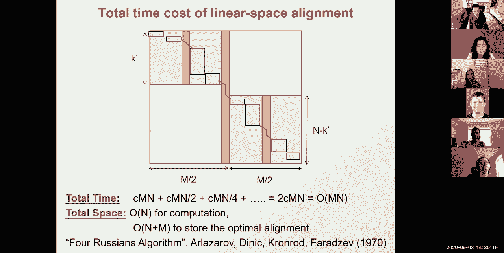

the reason i call it the for russians，algorithm is because there's four，russian names。

and this dates from 1970 and i think，it's just a very cool，algorithm so what did we see today we。

saw dynamic programming，and the concept the foundational，concept of reuse of computation we saw。

how we can order the sub problems，and feel the table of sub problems。

results and how we can read the table，instead of repeating the work using，fibonacci example。

then we saw sequence alignment using，edit distance and the scoring functions。

and built a dynamic programming matrix，and we saw how the matrix reversal path。

has this duality where it corresponds to，an optimal alignment，and we basically looked at why。

comparative genomics is so important how，we can read，functional regions through molecular。

evolution how to translate a problem，from biology to computer science how to，formulate it。

why it's hard why there's an exponential，number of alignment。

and then we built up dynamic programming，using fibonacci，how we can reuse the sub problem by。

ordering the computation and looking up，in a table，and then the very basic recipe of。

choosing your parameterization，understanding your sub problem space is，finite。

choosing the traversal order so that all，the results are available when you need，them。

and then the recursion formula and the，traceback，and then we apply that to sequence the。

alignment how it's an，additive score we built up a solution，from the smaller parts，gives us。

financial problems and explores an，exponential number of paths，using only their finite choices every。

single time we remember the maximum，that gave us rise to the score and when。

we got to the bottom right，we traced back to construct a path，that gave us that optimal score one of。

the paths that gives us this optimal，score there might be multiple paths that。

give us this optimal score，and then there are multiple optimal，alignments。

so every path corresponds one to one to，an alignment and when we found an，optimal path。

we had an optimal alignment and every，entry，corresponded to the maximum score。

for that prefix and we also saw these，very cool algorithms for，linear time bounded dp which is a。

heuristic，but linear space dp dynamic programming，which is an optimal solution but in，linear time。

okay one way to avoid allocating and，freeing memory which is usually very。

um okay that's not for me so uh who，feels that they've learned some。

cool stuff today so uh let's see uh，who feels that they learn something，awesome very cool。

so um twenty three five one zero zero，and then lastly who feels that they're。

with me for the whole lecture or at，least for the first three parts。

awesome and then the last ball i'm going，to do is how was the pace，so um 22 6，0 000 and then uh。

good a bunch of just rights，a little bit of too fast a little bit is，too slow。

which is what we would like，good so we have 20 people smack in the，middle six above。

and two below okay so thank you guys，uh again thank you all for showing up um。

you know and then looking forward to the，mentoring session tomorrow。

office hours 5 pm today uh recitation，3 p。m tomorrow and then mentoring，session 4 pm tomorrow。

remember record your self-introduction，videos，fill out your profiles using the，templates and then。

upload your profiles and fill out the，first day survey if you haven't done，already。

links to all of those are from the，seller page who feels that they've，learned something cool today。

yes awesome good all right thanks，everyone。

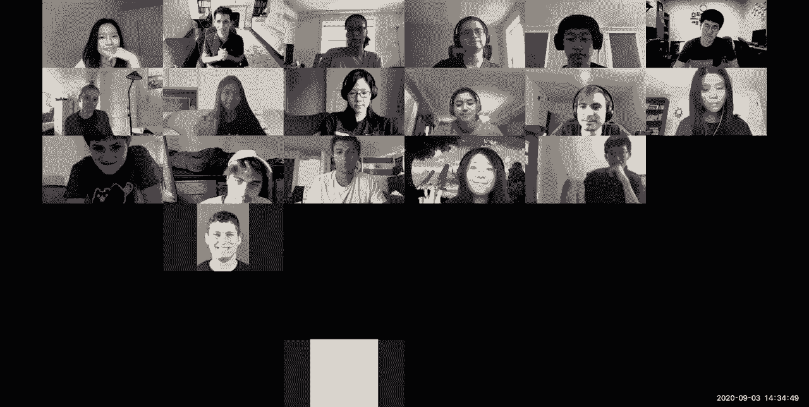

see you on tuesday have a nice weekend，and then see you tonight and tomorrow。

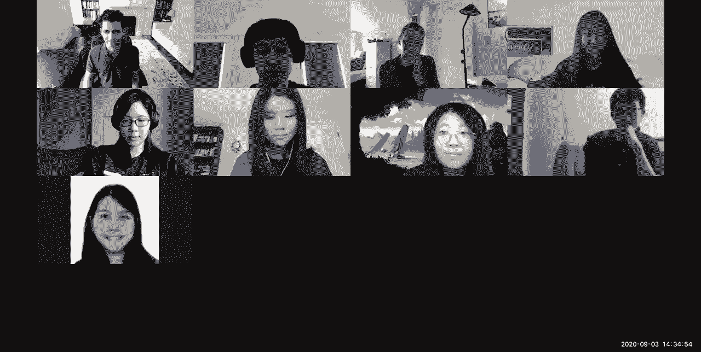