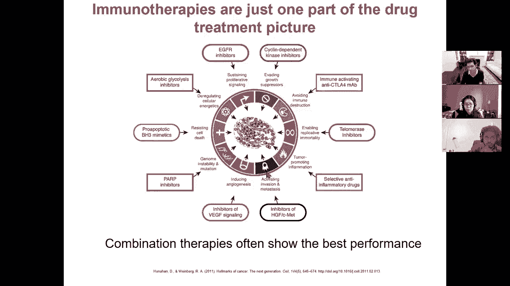
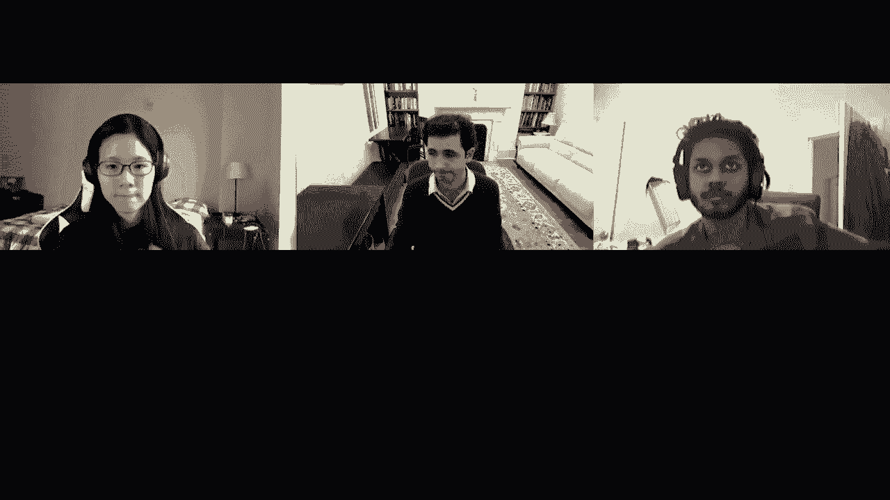

# P21：L21- 癌症基因组学 - ShowMeAI - BV1RM4y1g76r

uh welcome everyone today we're going to，be talking about cancer genomics so，class。

so we've basically completed our five，modules of，aligning and modeling genomes gene。

expression and networks gene regulation，and epigenomics，population and disease genetics and。

comparative genomics and evolution，so this module we're going to be talking。

about cancer genomics today，single cell genomics on tuesday fee was。

actually not tuesday but next thursday，he was，on the lecture 23 and then genome，engineering。

so these are very much frontiers，these are current research directions of，the field and uh。

you know these lectures are changing，very rapidly，as the field is evolving so today。

on cancer genomics we're going to be，looking at，the foundations of understanding cancer，so。

talking about oncogenes tumor，suppressors and the hallmarks of cancer。

then we're going to talk about tools for，discovering，recurrence and heterogenating through。

exome sequencing then we're going to，talk about whole genome sequencing。

going beyond just protein coding exons，to non-coding drivers，and convergence and then going beyond。

mutations，to study epigenomic changes in cancer，and also functional heterogenating and。

then lastly we're going to talk about，tumor immunology and how the tumor，interacts。

with the immune micro environment of the，cell and，how we can exploit these understanding，to drive。

immunotherapy so let's start with the，hallmarks of cancer，so bob weinberg and doug hanuman wrote a。

review，for cell in 2000 titled the hallmark of，cancer，and they attempted to characterize what。

differentiates a tumor，from a normal cell and they summarize，the acquired capabilities of cancer in。

six different categories and four new，ones in 2011。so how do you think about these。

capabilities these are basically，skills that the tumor needs to gain，in order to become a tumor so。

one of them is how to avoid apoptosis，how to avoid the signals from a cell，that maintain。

cells in check with other cells，the second one is how to become，self-sufficient。

in the growth signals so，cells in the body don't just grow，whenever they feel like。

it they receive signals from other cells，and from their environment that。

basically tell them when it's okay to，grow，so you can think of these as the gas，pedal and the brakes。

so in one hand the gas pedal is，basically stuck down on the other hand，the brakes。

are broken and you can't brake anymore，so these cells will continue dividing。

but that's not everything you need the，cells will also have，humongous energy needs so there's。

uh another one of those capabilities，which is the tumor，will send signals to the surrounding。

uh environment to basically sustain，angiogenesis，they basically uh are vessels，with。

oxygen and blood and give it the，nutrients that it needs，in order to continue growing so。

the the next one is，the tumors themselves uh will not be，able to divide if they were normal cells。

because every cell has a built-in safety，that basically only makes lets it divide。

a certain number of times，before it's telomeres for example get，too short or because before。

you know all kinds of things go wrong，whereas the tumors，are able to replicate infinitely。

and that's another one of those，capabilities basically being able to，continue replicating。

the next one is tissue invasion and，metastasis so the tumor cannot simply。

grow in place but there's actually an，evolutionary advantage，if that tumor can now colonize other。

parts of the body，again the tumor doesn't try to kill you，but，every mutation that makes it grow more。

is actually positively selected and this，is one of those positively selected，mutations。

that basically allow for invasion of，metastasis，and the next one is the environment。

is usually sending signals that prevent，growth，and the tumor basically becomes。

insensitive to those signals，so the way to understand tumor biology，versus normal cell biology is。

the wonder of multicellularity，basically as the cells acquired the，capabilities。

to work together in a single organism，they basically have to play nice they。

have to come up with a set，of skills that actively prevents tumors，and basically what。

cancers do is actively suppress，each of those things to basically，immortalize those cells。

so these are the hallmarks that were，listed in 2000 but again a huge amount，then。

and there are four emerging hallmarks，that were，recently recognized one of them is。

cellular energetics itself so basically，within the cell the production of energy。

carried out by the mitochondria and，these mitochondria，are deregulated and now are able to now。

produce a huge amount，more energy the second one，is that cells interact with the，environment。

and they will with the immune，environment of the of the body，and they usually show um。

signals that basically tell the body，yes i'm doing fine you know don't you，don't have to。

take me out or communicate in general，but，the tumor cell is able to actually avoid。

immune destruction，by interacting with the immune system，the third one is genome instability and。

mutation，so you would think that maintaining the，genome，intact is something that every cell。

should do in order to survive，and that's true for most cells but the，tumor has actually an advantage。

to creating instability and creating，hypermutation，because this actually allows it to play。

the number，the numbers game namely if，9 out of 10 cells die but，1 out of 10 acquires additional。

mutations that make it more，tumor-like that's perfectly perfectly，fine for a tumor。

because the one that gets lucky，quote-unquote，will then expand to make many many more，progenies。

so destabilizing the genome and，creating a mutator phenotype that。

actually increases the mutation rate，is extremely beneficial to the tumor，because。

it can actually get away with killing a，lot of，tumor cells that are not beneficial and。

that are not having an intact，genome and therefore lead to，a small number of cells that have。

acquired these additional，beneficial mutations so it basically，cranks up the surge space if you wish。

while killing off branches that are less，helpful and the last one is，tumor-promoting。

inflammation so there's，another interaction with the immune，system in the inflammatory system。

that actually brings it additional，immune cells that it can then co-opt。

and then use to perhaps go elsewhere in，the body or，bring energy to it through these，inflammatory。

processes and so on and so forth so，any questions so far who's with me on。

these hallmarks of cancer so this was a，way to group，all of the knowledge that folks had，acquired。

about genes that were usually mutated，and so forth，to distill it into a small number of，capabilities。

so this is great a hundred zero zero，zero，so the order in which the tumor acquires。

these capabilities，does not matter as long as it acquires，all of them。

so in some cases it'll be one mutation，of each and maybe，two mutations in that category that then。

leads to the，tumor becoming a tumor in other cases a，single mutation。

might actually be both evading apoptosis，and increasing your gene genesis for。

example as long as the tumor ultimately，acquires all these，capabilities and the way that you should。

think about tumor biology，is that there's an immense number of，possible paths。

to become a tumor because for any one of，these capabilities，there are many many genes and for any。

one of those genes，there are many many enhancer regions，that you could dysregulate。

so you have to think of the tumor as，heterogeneity，being its very definition that，ultimately。

leads to these capabilities and，every single tumor in the body will。

effectively find a different combination，of mutations and paths，that lead it to these set of。

capabilities，so there's many many pathways and every，tumor finds，a different path to it。

and here's some examples of paths to，become self-sufficient growth signals。

you could activate or ask oncogene，to become insensitive to anti-growth。

signals you could lose retinoblastoma to，pressure，to evade apoptosis you could basically，produce。

make your replicative potential infinite，you could turn on telomerase and，basically keep。

expanding your telomeres to sustain，angiogenesis you could，produce this vegf inducer that actually。

is a signal for，um these um for a geogenesis to happen，and to uh invade。

other tissues and allow metastasis you，can basically inactivate，e-cadherin so，which。

these pathways are enabled，and these specific changes can happen。

and you can see that these include both，inactivation and activation。

both loss and gain of different types of，functions，this is through a combination of。

germline mutations，and this is everything that we've talked，about so far so we've talked about。

common variants and we've talked about，rare variants，so when we looked at genome-wide。

association studies there，are thousands of genetic variants，that are weakly associated with cancer。

through genome-wide association studies，and this is effectively the focus of our。

lectures on genetics but there are also，rare variants，which are themselves inherited which are。

stronger effects sometimes，that are also coming from the germline。

but where the tumor actually differs is，these somatic mutations。

so somatic mutations or mutations that，happen after，forms，as the as the initial zygote is dividing。

to create the embryo and as our cells，are dividing throughout our lifetime。

to basically continue producing，you know you know higher people。

uh taller bigger and so so forth as we，grow to adulthood，and also to replenish ourselves when we。

are caught or when，you know some cells die or when you're，burned and so forth there's，time。

that you renew your skin through sun，exposure or that you regrow，your adipocytes you know as they。

uh as they get replenished nearly every，cell of your body，except perhaps for some of your neurons，is。

undergoing replacement as you go through，life，so you know there's this um。

philosophical dilemma of hey when you，start replacing a plank of a ship。

every year and eventually after a few，years there's not a single plank of the，original ship。

is it still the same ship and in the，same way，your body replenishes itself。

constantly and you know at some point，all of your cells will have been renewed，except again。

for some of your neurons so during，every one of those cell divisions there，is a potential for。

somatic mutations and what's really，dramatically different in the way that，we。

analyze germ line mutations versus，somatic mutations，is that somatic mutations are subject to。

positive selection because if any of，those makes the tumor more likely to，replicate。

it will be amplified whereas for，germline mutations the main force that，we've been talking about。

is purifying selection so negative，constraint whereas this is positive，constraint。

okay so that's for somatic mutations，and then in addition to those there are。

gene regulatory alterations that will，basically change the expression，forth。

so cancer can be thought of as a，combination of germline，somatic but also epigenomic changes gene。

regulatory alterations，that will then give rise to complex，phenotypes so there's many paths。

and those paths don't need to be all，somatic，they don't need to be all germline they。

don't need to be all of genomic they can，be a combination of those。

so you have some germline mutations that，have low moderate or high penetrance。

and then you can look for somatic，mutations that are genetic or genomic or。

that are changing gene expression，patterns，or that are changing signaling and those。

are indeed are then leading to，somatic histopathology or specific，biomarkers。

and then ultimately clinical progression，and，so forth and in response to therapy you，can actually。

select additional mutations after，that another key concept，that is important to realize in the。

context of tumors，is that not every mutation is a driver，mutation。

you basically acquire a huge number of，mutations on the path to，getting your first driver mutation。

what's a driver mutation a driving，mutation is a mutation，that actually contributes to some of，these。

capabilities of the cancer whereas the，passenger mutation is just。

yet another mutation that happens along，for the right，and again this is an evolutionary。

process there's an enormous number of，mutations，only some of which will actually be。

driving the tumor，progression so again oncologists，differentiate between driver and。

passenger drivers confer an advantage to，the growth of the tumor。

passengers do not directly contribute to，the fitness of the tumor。

but they are along for the ride and the，challenge of course，is going to be how do we distinguish。

which ones are drivers and listeners or，our passengers the way that we usually，do that。

is to look for recurrent mutations，across different patients that，deactivate the same pathways。

and that will tell us that these are，more likely to be driver，events so you have an intrinsic。

mutational process，some environmental and lifetime，exposures and。

eventually you might gain a mutation，that makes dna replication more，error-prone。

or that makes dna repair less active and，then suddenly you have a mutator，phenotype。

and the moment you acquire that mutator，phenotype many many more mutations start，accumulating。

and you're gaining many additional，drivers so it's not a one-time shot，evolutionary process。

some of these mutations are in fact，facilitating，other mutations and in particular this。

genome instability concept，is one of those where if you gain that，capability。

then you're much less much more likely，to to achieve the other ones。

more rapidly so let's see who's with me，so far，on this combination of events across。

different pathways，and on the difference between passenger，awesome so 80 20 000。

okay again there's many mutated genes，that can drive cancer main emergence。

mutations that drive tomorrow genesis，can be one of four different。

things number one they can be oncogenes，these are the things that。

create the tumor or they can be tumor，suppressors，these are the things that take out the。

breaks from becoming a tumor，they could be mutator genes these are，genes that。

increase genomic instability and they，could also be epimutator，these are dysregulations that create。

this increased mutation rate so these，proto-oncogenes are genes，that normally promote and direct。

normal cell cell growth but when mutated，they become，hyperactive they become oncogenes and。

then they stimulate，overactive growth so on one hand you，basically have。

more of a gas pedal on the other hand，you have，tumor suppressors these are genes that，normally。

slow down cell division and when mutated，they can show a，loss of function and gain unchecked cell。

growth，so these are gain of function and these，are loss of function mutation。

so gain of the gas pedal loss of the，stop pedal，and again mutator genes as we talked。

about earlier regulate genomic stability，if they're mutated there's more。

instability more chances for the tumor，so p53 is an example of a tumor，suppressor。

so it serves as the guardian of the，genome，normally and it serves as a key link，between dna damage。

and repair as soon as p53，senses that there's some kind of，abnormality。

or dna damage or hypoxia or there's，something wrong with the cell cycle。

it does two things number one it stops，the cell cycle it basically says don't，divide anymore。

and it starts dna repair and then if it，manages to repair，the problem then it can restart the cell。

cycle，or it can lead to apoptosis and this is，program self cell cell death this is。

self-suicide of a cell which realizes，that it can no longer be beneficial to，the organism。

but when p53 mutates there could be dna，damage or cell，cell cycle abnormality or hypoxia but。

p53 is no longer able to sense them，and therefore the cell cycle can。

continue and the cells can become，cancers，so mutations in p53 can cause。

loss of function and promote tumor，emergence and growth，so p53 is normally a tumor suppressor。

but when it's lost you then have，uh mutator phenotype，so for example dna breaks uv radiation。

are sensed by p53 it interacts with，several pathways，it controls growth versus arrest it can。

controls apoptosis and geogenesis，so it's at the core of this massive，number of pathways。

and that's why if you look at what are，the where are the mutations associated，with cancer。

normally happening they're happening，enormously more frequently in b53 than，any other gene，path。

to cancer so it's very frequently，re-exploited，but each time through a different。

mutation so there's an enormous，diversity of 53 mutations，that can lead to any of these，regulations。

it also controls mitochondria in，apoptosis maturation of growth，suppresses micrornas。

dna repairs and so forth，that's one example of a tumor suppressor，gene。

ras is actually an example of an，oncogene，so the ras family members are small。

gdpases that are involved in cell growth，and cell cycle pathways and mutation in。

the ras family members can actually，cause rampant growth，and proliferation so you basically have。

ras here at the center，of a large number of pathways going，through the cell cycle through phase g0。

g1，and s and ras controls，a number of processes that either，inhibit the cell cycle before it begins。

or move through the cell cycle after，it has begun and if you have。

mutations in the ras family you can，basically lead to，family，proteins and they are examples of。

so they're you know they're upstream of，have，basically different forms of ras。

activated or not and then，when it's activated can lead to a large，number of pathways。

which include control of the，cytoskeleton through，actin cell survival signaling。

endocytosis gene expression cell cycle，motility apoptosis and so on so forth。

you can also create genomic，rearrangements，that enable these deregulatory events so。

tumors can be driven by fusion events，that create chimeric proteins that serve，as oncogenes。

there's a very famous example of，recurrent fusion，which involves these pcr and abl genes。

that drives chronic myelogenous，leukemia cml and that's basically when，there's a rearrangement。

between chromosome 9 and chromosome 22，that brings these two genes together。

and then creates this octogene，so this oncogene，concept has basically led to a。

therapeutic hypothesis，which is that the tumor is now putting，all of its eggs in one basket that。

basically it becomes，addicted to a specific oncogene despite，a very large number of genetic and。

epigenetic，alterations cancers are very often，dependent，on a few select oncogenes and then。

targeting these oncogenes，can actually provide an achilles heel a，weak spot。

for cancer and enable targeted therapies，and there's combination treatments that，can actually drive。

the tumor from this large evolutionary，space that it，explores into a more narrow space where。

it really becomes addicted to that，oncogene，and therefore combination treatment can，number one。

drive it to that dependent and number，two，target the gene that it has now become，dependent on。

is everybody with me here on this whole，concept of an oncogene。

addiction and how to drive the tumor to，that，lovely so 60 20 20 000，let me know if you guys have any。

questions again we talked about mutator，genes，these are mutations that lead to。

lower repair efficiency or increased，overall，tumor mutation rate and these mutator。

genes are involved usually in dna repair，pathways，and genes involving controlling。

chromatin stability and movement，through the m phase of the cell cycle so，you basically have。

normally a rest in g0 or，you know you enter g1 and the s phase g2，and so forth。

and these mutator genes can prevent，the cell from having all of these。

checkpoints that they normally have，so there's a dna damage checkpoint and。

if a cell senses dna damage it basically，stops dividing，there's another dna damage here there's。

another phase checkpoint，spindle assembly checkpoint and so forth，and these mutator genes。

can get rid of the checks and balances，effectively of the cell cycle，and lead to aberrant divisions。

and again beyond individual genes，copy number variants and rearrangements，are a very common。

uh technique that the tumors exploit，as a way to create both these onco genes。

and get rid of these tumor suppressors，they have you know many different types。

of genomic instability，they can be polyploid and when we talked，about whole general duplication。

this is one of the mechanisms that，tumors can actually create this，instability and then。

gain a lot of these second copy genes，that can then be exploited。

for the tumor's advantage or they can be，unemployed，so polyploid means many。

chromosome copies aneuploid euploid，means good chromosome copies and euploid。

means not good chromosome copies so，unemployed means that you've gained or，lost segments。

of a chromosome or you might have an，entire duplication of a chromosome or an。

entire deletion of a chromosome and，these can lead to，copy number variations so these can be。

dosage effects for example，if you want to amplify a particular gene，you could simply。

duplicate that segment of the dna so you，now have two different，locations from which the gene is。

expressed，or it could lead to rearrangements and，structural variants。

where the context of a gene might，actually change so you might actually，have gene regulatory changes。

where the genes are now sitting in a new，context，so if you invert a particular segment。

you now might have a promoter here，or if you translocate it into different，chromosomes or。

if you duplicate it and or if you lose，it you might actually have，these changes。

so that's basically in introducing the，concept of oncogenes and tumor，suppressors。

and these hallmark capabilities of，cancer and，these tumor suppressors proto-oncogenes，and oncogenes。

the mutator phenotype and some of those，are actually driven by。

viruses that will then lead to the cell，becoming a tumor，enters，your cell and starts replicating it。

might actually，result in a mutator phenotype that will，then lead to additional mutations。

that might create a tumor and again，fusion oncogenes，so let's talk about now how do we get。

at these tumor suppressor and oncogenes，and how do we discover those so how do，we identify。

drivers of tumor genesis，so a key goal of exome and whole genome，profiling。

is to identify these driver mutations，that confer，positive fitness advantages to the tumor。

and this mutation can be common rare or，somatic variants and many of the。

discovered genes through these，are in fact the basis of these hallmarks，of cancer。

you know we didn't start with the，hallmarks we，ended with the hallmarks the first step，are。

drivers and that are recurrently mutated，and then，let's study these genes and try to。

understand what are these hallmarks of，cancer，and there's really three types of。

mutations and three types of analysis，the first one as i mentioned is。

genome-wide association studies and if，are looking for weak effect。

typically non-coding mutations which are，common in the population，genetic linkage can lead to。

the discovery of strong effect mendelian，mutations，which are running in families and hodgin。

of sequencing，of exome or genome can lead to，the discovery of strong effect somatic。

mutations that arise，during the mitotic cell divisions，again the concept is that you might have。

some predisposition to cancer，through some ancient mutations that are，common in the population。

or some recent mutations that are you，know in your great grandpa。

and great drama perhaps through their，exposures，through you know modern pollutants and，so so forth。

and after they make a fertilized egg，you can now have any a series of。

additional mutations that are happening，during these somatic events。

many of them will be passengers shown，here in blue and then there will be some。

initiating driver events，and some additional driver events and，every one of those driver events then。

leads to an expansion，of additional cells that can have，tumor phenotypes and you can see here。

the color getting darker and darker and，darker as additional these capabilities。

of cancer are acquired，and then that tumor will now start，growing and you end up with these。

mutations so again there's roughly one，mutation，every megabase and across the genome。

there's only five to 20 drivers，so there's an enormous number of，passenger mutations。

so you know if there's 3。2 billion，letters in the dna there's 3。

200 mutations out of which only 5 to 20，will actually be drivers so identifying，these drivers。

is a challenge of a needle in a haystack，problem so who's with me so far。

so let's go through each of these so，basically from genome-wide association，study。

there's a large number of genetic，variants that are common，in the population that are associated。

with many different types，of cancers and you notice that not every，one of them is associated with。

all cancers no instead you have，very tumor-specific，changes so that suggests that there's in。

fact a lot of distinct biology，between different cancer types and these。

mutations are in fact very often tuned，to the specific environment that every，type of tumor。

lives in so again there's hundreds of，genome-wide association，hits for diverse cancer types and。

these usually act through polygenic risk，and weaker effects，and they don't have any visible。

mendelian inheritance，there's also a huge number of rare veins，that have been associated with。

cancer through mendelian genetics and，linkage mapping，so from the family history of a person。

that has cancer for example we can look，at，who in their family had cancer and then。

trace the inheritance patterns of the，chromosomes across these pedigrees。

to recognize which segments of，chromosomes，contain these，mutations that are segregating in that。

family，with cancer so knowing the family，history and the pedigrees we can map。

cancer driver genes with linkage，analysis and mary claire king，in fact mapped the braca 1 gene for。

breast cancer，on chromosome 17 in 1990 using genetic，linkage analysis in families。

with inherited risk for breast cancer，and every family，carried a different set of inherited。

mutations，but they were recurrently hitting the，same gene，and that's one of the key concepts of。

cancer the fact that you have to embrace，the fact that，every single one of these mutations。

will be occurring independently in each，of those families，and once it's acquired you will then be。

able to trace it，and very often they will be falling back，onto the same number of small genes this。

very small number of genes，that lead to cancer，and the third uh technique after gus。

and rare variants and linkage analysis，is somatic mutations so this is paired，sequencing。

of both normal and tumor tissue to look，for recurrent mutations，and hot spots that are implicated in。

cancer，the goal here is to recognize the clonal，heterogenating，and the mutational diversity within a。

tumor and that hydrogenating，leads to actually lower allelic，fractions so when you're doing。

sequencing of a chunk of a tumor，every cell might actually have a，different dna。

so these driver mutations might actually，be a，very small number of those passenger，mutations so。

what you would like to do is enrich for，them so how do you do that。

well you could look for heterogeneity，because of these lower level fractions。

you can recognize that only small，fraction of the reads show the mutation，and you also need。

highly sensitive methods to actually，call the mutations so you start with。

whole genome sequencing or whole exome，sequencing，and then you compare that with between。

normal and tumor，to recognize where are the somatic，mutations rather than the germline，mutations。

so you sequence the tumor in your，sequence you know outside the tumor。

you then can look for mutations that，have happened，multiple times either that happen。

multiple times across different，individuals，or that show multiple disruptions within，the same person。

you could also predict the functional，impact of these mutations you could say。

well that's a silent mutation it doesn't，change the amino acid，as opposed to wow that's a you know。

changing a charge amino acid，into a hydrophilic amino acid um so，will。

more likely change the protein function，and then you could look for recurrent。

combinations of mutations，and then you could experimentally follow，up and validate。

whether indeed these mutations can lead，to increased replications and so forth。

and that's where you start with an，enormous number of passenger mutations，and eventually。

you filter them out to only find a small，number of drivers，tools，for calling these somatic point。

mutations，so for example metect is developed by，gadgets lab and it's basically looking，at。

the tumor reeds and the normal reeds，and predicts which，are more likely to be coming from the。

tumor based on，a statistical enrichment above some some，threshold。

and then there's many additional filters，that you can apply，after you found these enriched mutations。

number one you could say，hey is it near a gap is there a strand，bias。

basically if i only recognize it on the，forward strand it's more likely to be a，sequencing error。

but if i recognize it on both strands，it's more likely to be real。

if i have multiple alleles this might，simply be a duplicated，poorly。

on the genome i might want to reject it，because i might simply be fooling myself。

in where it actually is going，is it clustered by position and。

if it's also observed in control you can，basically say well，no this is not unique to the tumor so。

it's less likely to be a driver，and after you do that you basically then，go and search。

for whether it's also found in normal，samples，and you can reject the ones that are。

also common in the population，and ultimately search across dbsnp。

to classify it and then you have a set，of candidates，somatic mutations after you've excluded。

common variants，so this is a bayesian classifier it，determines if the mutation is tumor，specific。

impaired tumor normal sequencing even a，very low allelic fraction，down to frequency and again。

notice that even in the tumor that，mutation is not，covering all of the reeds。

for example 90 of the tumor reads might，a small，fraction of the cells have that mutation。

but you can still detect it，as distinct from normal apply all these，filters。

and then detect it as a driver so how do，you annotate，these driver these drivers based on。

search for gen code annotations or，look for known list of dna repair or。

look at the functions of these，corresponding proteins look at known，cancer variants。

through databases of existing，previously identified mutations in。

cancer that you can then use to boost，your power，and you could also look for non-cancer，variants。

to exclude those if it's a common，polymorphism it's less likely，to be a driver because otherwise it。

wouldn't be common in the population，if it's found in thousand genomes if，it's found in the。

so through this we can now start asking，great i've identified all these somatic。

mutations do they cluster，and that's the main evidence for，recurrence and for drivers it's，level。

where a specific amino acid residue，might be，repeatedly disrupted it could be。

recurrence at the gene level，where there could be multiple，deactivations of the same gene。

or it could be recurrence at the pathway，level where multiple genes involved in，the same pathway。

are in fact repeatedly imitated and if，you look at bracket one and bracket two。

they're both recurrently mutated and，their individual mutations are，themselves recurrent。

so bracket two is in chromosome 13 it's，an autosomal dominant and it has a role。

in genomic instability，and there's more than 300 different，mutations that have been reported。

bracket one is a chromosome 17 it's also，to someone dominant，and more than 500 different mutations。

have been uh reported and you can see，here some of those mutations piling on。

to different places in the protein and，that tells you that well this place is。

probably a very good place to，mutate if you're a tumor you're trying，to continue。

replicating or growing，so from exome analysis we can reveal，recurrently mutated。

genomic hot spots so looking at for，example 10 000 tumors across 41，different cell types。

this team here by mike schneider，and others looked at 2 million somatic，hypermutations。

with an average number of somatic，mutations of 57，per exo and they found that in fact。

20 000 human genes harbored hot spots，and there were 400，hot spots that were affecting 275。

protein coating genes，and you can see here how these hotspots，are distributed。

across the genome so you can see you，know just a very large number of。

hotspots all falling into the same，protein here，these brass proteins which are a family。

that's very repeatedly，mutated in cancer you can see large，number of these mutations。

so you can see here how many hotspots，are there and again the number one，is as always p53。

there's very there's like 50 different，dna binding domain mutations。

and you know there's some some of them，so again there's two sides of cancer on，one hand。

it's recurrence that there's a small set，of pathway alterations that are。

necessary for cancer and these are the，hallmarks of cancer，and that oncogenes and tumor suppressors。

are points of recurrence，and then the converse of that is，heterogeneity。

cancer is an evolutionary process driven，by positive selection there's a very。

large number of pre-cancerous cells，which are costly subjected to selection。

and there's many ways that an oncogenic，pathway can be hit，so you have to look at these clonal。

evolutionary properties so again if you，look at clonal，genomic heterogeneity within a single。

tumor you can look for，intra-tumor heterogeneity which is，driven by this evolutionary dynamics。

and find evidence of positive selection，for mutations，that have fitness benefits to the cancer。

and that depends on the mutation rate，the number of cell divisions the cancer，type and so forth。

you know looking at this diagram of，these expansions and these driver events。

you can then ask if i do bulk dna，sequencing，of different cells and i map these two。

call variants then what are the dynamics，of the tumor across time and you can see。

these driver mutations expanding each，time and you could also have。

treatment intervening and changing，the tumor composition so if you，say well。

at that point i could see these four，different lineages，and at a later point perhaps even after。

treatment，you might see a very different，composition so the image you should have。

in your head is not all，i'm sequencing this one particular cell。

it's no i'm sequencing a distribution of，cells，so again genomic stability can be a，source of。

functional heterogeneity the，abnormalities can lead to instability。

that can lead to more mutations that can，lead to increased genetic diversity and。

that can lead to increased hydrogenating，and instability can be detrimental to，escape。

bottlenecks by increasing the number of，paths to the cancer，so emergence or resistance to。

chemotherapy and treatment，and these tumors again play the numbers，game there's very little。

purifying selection it's mostly positive，selection，and every single time you go through a。

bottleneck through treatment for example，the tumor can then find a way out even。

if there's one cell left，and then expand back into uh additional，paths，be。

found both in emergence of the tumor the，first time around as well as resistance。

so for example after treatment you can，see that，their tumor cells can diminish，dramatically。

but all it takes is one cell to then，re-expand and then after another。

treatment you basically can compress，that original tumor，except for a small clone a small。

of that tumor that can then acquire，additional mutations and then lead。

to new metastases so this can be，a response to the treatment so the tumor，is not simply。

evolving without any pressures as you，carry on treatment the tumor is，responding to the。

treatment and evolving away from that，treatment，and there's a lot of micro environmental，factors。

that can influence this and perhaps this，can also lead to a distant metastasis。

where there's a different micro，environment which can then lead to。

a different set of mutations so it's an，evolutionary process。

which is undergone sometimes in multiple，locations in the body，each driven by its own its own。

and you can trace that clonal history of，the multiple metastatic sites。

by looking for mutations that are，actually shared，so for example uh girlinger at all。

sequence both metastatic lesions and，different locations in the primary tumor。

in four renal cells carcinoma patients，and these mutations were regionally。

distributed and could be partitioned，into private，shared and ubiquitous and the share。

could be either，primary or metastatic and you could then，infer the phylogenetic relationship。

between the different regions of the，tumor，and this ploidy profiling can also show。

differences in genomic，instabilities employee is asking what is，the copy number。

at every location so sequencing the，normal tissue，you see that even the normal tissue has。

an additional acquired mutation，and then there's a shared branch of the。

primary tumor and a bunch of private，mutations，in different spots of that tumor and。

then there's a shared metastasis spot，which is you know elsewhere in the body。

and then again a lot of，private mutations coming out of that so。

when you look at these uh tumor cells，you basically see this，of phenotypes which is indicative。

of these different lineages，living within the same tumor sample。

so you can have ubiquitous mutations you，can have shared，primary mutations you can see here that。

you know all of these，have something and then this is shared，only with a subset。

this is shared only with a different，subset and that's the metastasis。

and then you have a large number of，additional private mutations。

that are only shared with a small subset，of the cells，and you can build these computational。

models for clonal substructure，so there's python for example in python，where，tell you。

how the tumor is evolving according to，you know gamma distributions uniform，distributions。

you know binomial distributions beta，binomials and so forth，so these complex models are typically。

needed for discovering，the underlying clonal structures and，multiple measurements across either time。

or space are usually needed to，tune the parameters of that model and，what we find is that mutational。

prevalence is in fact，closely associated with phallogenetic，history that。

through the phylogeny of the tumor you，can kind of see，where are the driver mutations that are。

leading that evolutionary process，so in our own work in collaboration with。

genevieve bolland we've basically been，tracking a patient across，here。

day 1200 so that's like nearly four，years later，and we could actually see that。

as we sample the same person，with recurrent tumors after the first。

treatment the second treatment the third，treatment，you can actually see that some of these。

are identifying new lineages，that were previously not recognized and，thought to to have been gone。

but you can see that this green vineyard，this yellow venus has for example，re-occur。

and this blue lineage keeps jumping from，different places different places in。

his body and so so forth so overall we，can now start，tracking the specific mutations that are。

happening along each of these，lineages and infer，even recurrent events that are happening，across。

different places so again there's dozens，of samples from multiple。

lesions multiple time points across the，body and we can use the passenger，mutations。

to infer the phylogenetic relationship，of all of the tumor samples。

and once we have that phylogeny we can，infer the，multiple tumor lineages that coexist，simultaneously。

and you can see that there's at least，five lineages with some private。

lineages down on each of these sites，and you can recognize driver events that。

drive tumor resistance and metastasis，based on their growth and their change，in abundance。

as well as this convergence for example，this genome doubling，has happened twice so you can see here。

that these other lineages seem to have，disappeared，and only that additional lineage in。

green is in fact，seen in the final recurrence that，let the patient ultimately die and you。

can see that there's in fact a genome，doubling here and another genome，doubling there。

you can see that there's a lot of c2，mutations here in the green lineage。

and then there's additional c2 mutations，uh in one of the other lineages。

so you can kind of see these paths to，so we talked about these lessons from，exome sequencing。

and this concept of recurrence with，common signatures across different types。

different patients different tumors，different clones and these evolutionary。

dynamics of clonal heterogeneity，followed by clamping down of the，diversity through selection。

in treatment followed by re-expansion，if some of the cells of the tumor，actually expand。

and some computational models that allow，us to actually capture，great so we are。

so this is all from exome sequencing，this recurrence and heterogeneity at the。

gene level at the protein coding level，but we are increasingly able to actually。

go to the whole genome，and look for non-coding drivers and，convergence across a much larger。

diversity，of mutations but that actually has，additional challenges。

we have to correct for the background，mutation rate，of different regions of of different。

chromatin epigenomic states，across different patients and across，different regulatory neighborhoods。

of a gene and to recognize，convergence we have to trace mutations。

to the enhancers that they control and，control，and these genes the pathways that they，belong in so。

outside proteins whole genome sequencing，and non-coding mutations。

are these enormous additional challenge，and if you look at what fraction of。

total mutations are found in，coding exons they're a tiny tiny little。

fraction like less than one in a，thousand，for coding introns you know slightly，higher。

non-coding accents non-coding introns，and then intergenic it's enormous。

so all of these things are actually，sitting outside the protein coding genes。

so how do we go about systematically，studying that so again a lot of the。

tools that we've been covering，throughout，the class for understanding the epi。

genome understanding motifs，understanding the non-coding landscape。

understanding the circuitry of how to，link down coding regions to their target。

all of that actually comes back to bear，in these analysis to enable us，to study the recurrence。

in the whole genome side of things so，again，the vast majority of somatic mutations。

are non-coding and the vast fast vast，majority of those，are in fact passenger mutations and。

finding the drivers，is enormously hard so how can we make，sense of non-coding mutations well。

number one recurrence，similar to coding but there's a，challenge。

for protein coding mutations it's very，easy to say oh great，these are all in the same gene but now。

we don't actually know the boundaries of，the unit，of a function is it an enhancer is it a。

set of enhancers，is it the whole megabase surrounding the，gene is it every nucleotide within that。

megabase or is it just a small subset，of exons or sorry of enhancers。

number two the background mutation rate，can vary dramatically between regions。

between patients between chromosome，states and，you know different segments of the dna，and。

the convergence is also much harder，because before to look for convergence。

there was the unit of the gene，all of the accents of the gene belonged，to the same gene。

so now we have to actually overcome the，challenge，of we don't actually know what gene。

every non-coding region is linked to so，how do we，use all of that information so again。

these scattered mutations can target，common genes and ultimately common，pathways。

and convergence is actually much harder，for the non-coding space。

so again there's two challenges number，one how do we detect the mutations and。

then number two how do we interpret the，mutations，for detecting limitations this is all，about。

each of those，looking for cancer tissue versus normal，tissue，and looking for mutations that are more。

abundant in the cancer tissue，and that are more abundant in the cases，rather than the controls。

so you can have cells from the biopsy，and，from nearby locations that are not。

associated with a tumor in the，cases and then you also want to sample，blood。

as a germline uh indication，and blood also from um，controls to basically make sure that the。

mutations that we're finding，to be that we're predicting to be，drivers are not simply。

also very common in the controls so then，you sequence in your genotype。

identify variants and then you can look，for，common and germline variants from g1s。

and look for those that are enriched，relative to the background or rare。

germline from whole genome sequencing，typically nexons，or rare somatic。

from algebra sequencing that are，different between the tumor。

and the controls sorry between the tumor，cells，and the non-tumor biopsy of。

the cases and then you do a statistical，test for enrichment based on。

the odds ratio based on a burden test，what's a burden test，that's basically adding up mutational。

burden through the，throughout different mutations and then，uh you know。

asking whether that particular gene has，more mutation that you would expect。

even if they're not just at one same，residue all the time，they could just be a total accumulated。

burden for that gene，and then you look for signals of，positive selection and then when it。

comes to functional prioritization，you could look for whether a particular，motif is gained or lost。

through the position weight matrices or，through these deep learning models that。

allow you to predict the mutational，impact of any mutation in the genome。

even if you haven't previously seen it，you could say if i have a，deep learning model that predicts。

enhancer activity or transcription，factor binding，and i perturb the nucleotide how much。

does that change the，location score for that region，you could also ask is it disrupting a。

region that's evolutionarily conserved，only five to ten percent of the genome。

is evolutionarily conserved between，related mammals so you could say let's，maybe focus。

only on the subset that is evolutionary，conserved，as a way to prioritize mutations that。

are more likely to be，impactful and you could also within，the network of a cell look for centrally。

located，nodes and then you go in and，experimentally validate the results。

by looking at the functional effects of，this mutation，in a mouse model or in a dish and so。

forth and then of course you then，translate it to the，these，different uh challenges so basically on。

one hand，you want to correct for the background，mutation rate of your tumor。

and that background mutation rate can，vary dramatically so for，example melanoma has。

a hundred times the mutation rate of，um sarcoma so here's，ewing sarcoma you see that its mutation。

rate，is less than you know 0。5 mutations，every one megabase，whereas melanoma its mutation rate is。

actually，you know nearly 100 mutations per，megabase，so there's a dramatic change here a。

factor of 10 here another factor of 10，here，between different types of tumors so。

the second thing is not just the overall，mutation rate，so if you。

color every substitution according to，the set of nucleotides that it changes。

from c to t from c to a from c to g and，so on so forth，you can actually see that the specific。

types of mutations that are happening，are dramatically different between，different tumor types。

so from the mutations alone you might be，able to say，well this really looks like an ovarian。

cancer or this really looks like a lung，cancer and so forth，the second challenge is looking at the。

mutation profiles，of those different tumor types and not，just correcting for the overall rate，so。

these changes in these frequencies，are in fact stemming simply from the，mutator genes。

that are selected in each type of tumor，active，in different tissues so for example lung。

cancer will target，long active repair genes and there's，distinct mutational profiles。

that those genes that those repair genes，will lead to when they're mutated so if，you look at。

this diversity of the types of changes，that are happening between c2a c2t，uh you know cpg to cpt。

tpg and so forth you basically have，different tumors in fact showing。

then as you walk along the genome，there's a lot of regional，heterogeneity in the mutation rate so as。

you go through the genome，you could say well where is the mutation。

rate the highest and that's the curve in，red and you can see that mutation rate。

is much higher in specific locations of，the genome，and what's really interesting is that if。

you look at olfactory receptors，they show a very high mutation rate in，cancer。

well is that because they're driving，cancer the answer is no，they're usually also mutated outside。

cancer so that's something that，you know you need to correct for the，second challenge is that。

the lower the expression，the more mutations a region accumulates，and the reason for that。

is a little counterintuitive you would，think that wow the regions that are。

utilized the most should be the ones，that show the most mutations。

but in fact those regions that are the，most active，are also the ones that are recruiting，the most。

dna repair genes so that when there's a，mutation there you can actually detect，it very rapidly。

so the genome fights against the damage，that's coming from utilization。

so well that it's in fact the inactive，regions，that are showing the higher mutation，rate。

and also replication timing correlates，with that as well，so the genes that show low expression。

are also the regions that are，replicating late，so again if you look at olfactory。

receptors for example you see that，they have lower expression overall and。

they have a later replication overall，if you look at just random genomic，locations they're you know。

somewhere in the middle and if you look，at these cancer genes，they're you know much more highly。

expressed and much more early，replicated so you can correct for all。

that so mutation rate varies greatly，across the genome it correlates with。

replication time with gene expression，level，and olfactory receptors are long genes。

and they have the end long genes have，the most mutations but they're not。

cancer drivers they're just highly，imitated，and once you adjust for the background。

mutation rate they actually disappear，so that's why it's so important to，rate。

in order to recognize locations that are，specifically hypermutated compared。

to the background that you would expect，and for example here。

if you look at this red curve that's not，because it has a lot of driver genes。

no on the contrary you would expect it，to have more mutations but in fact you。

find that it's depleted from mutations，whereas here it is actually enriched for，mutations。

so that's why correcting for these，things that correlate with a mutation，rate。

allows you to recognize true driver，genes and true driver regions，lovely so 2080。

again the mutation rate varies with dna，accessibility，the repair machinery is optimized for。

accessible sites，which would otherwise become，hypermutated due to that access。

in cancer however the repair machinery，is often disrupted so the cancer。

mutations are in fact enriched，for dna's one hypersensitive sites and。

these are very cancer type specific，and likely due to the promoter activity。

and nucleotide excision repair，and so so forth so if you look across，different types of cancer。

you see that promoters have，a large number of mutations and then，enhancers have fewer mutations。

and then hero chromatin has the most，that，this is flipped differently for，different types of tumors。

so from melanoma for example you see，many more，dna's hypersensitive sites being mutated，in。

promoters as opposed to other，tumor types where the promoters are in，fact depleted compared to。

again the mutation rate can vary by the，epigenomic landscape，and in particular with the minor groove。

orientation，so depending on whether the major groove，or the minor groove，is facing the histone。

the mutations that are actually more，associated with，so the basically both the somatic and。

the germ limitation rate，show a 10 base pair periodicity in，nucleosome occupied dna。

and this periodicity actually tracks the，dna minor groove facing toward and away。

the histones and the orientation of the，periodicity depends on the mutational。

processes that are active，in each tissue and this in fact，contributes。

to the atcg 10 base per periodicity in，eukaryotic genomes，so if you look at these you know。

periodicity it is actually found，both in the somatic mutations and。

the variation of the divergence as well，as this，weak base pair periodicity。

so this is one more thing that one needs，to correct for，and then the last thing is if you look。

at the，different chromatin states that a，location is found in，this is uh something that also。

correlates very heavily，so regions that are in promoters or in，enhancers or in poised。

are in fact showing this gradient of，mutation，and then these open chromatin regions。

have the lowest mutation rate，and then the highest mutation rate is。

fine in those is found in those poised，regions，so you can distinguish accessible。

regions as you know their own class，and they have the lowest mutation rate。

and that's likely driven by the，accessibility of the repair machinery，and then outside these dna is。

hypersensitive regions the chromatin，states very greatly with promoters being，much more hypermutable。

than enhancers than transcribed regions，and so on so forth，so you can trace these across different。

chromatin states，but also across different patients so，here this is again our own work with。

richard solari，and this is looking at the mutations，that are happening。

at the number of mutations that are，found in different patients。

and you can see here that as you go from，patient to patient，the same chromatin state shows an。

increase，in the emission rate，so that's another thing that you need to。

control for when selecting for，these regions so music db，is one of these tools that has been。

developed to uh，call somatic mutations relative to the，background by computing these aggregate。

gene scores and again that's a tool by，get gets，over at the broad which accounts for。

many covariates including，patient-specific effects，gene-specific effects conservation。

transcriptional activity，dna replication timing chromatin state。

to construct a background model and then，you call significant mutations。

compared to that background model you，then aggregate the gene scores across，the tumor。

and establish a significant threshold to，control the fdr，and that's how you can identify true。

drivers，and this is work that we've done in，collaboration with moline rasmussen。

who is a visiting student in the group，where we can detect，non-coding driving regions by accounting。

for many of these details that i told，you about，regarding the mutational background so。

that's non-coding drive or detect，uh based on what would be the expected。

mutation rate and what is the observed，mutation rate，and for that expected mutation rate you。

can basically combine，many of these features that i told you，about。

so now you can ask well great we've，identified，these oh i see a chat here。

why would something mutate with 10 base，per periodicity，so that has to do with the properties of，how。

the dna is actually facing，the keystones it's not entirely clear as，to why。

the you know this side would be，imitating more，it's something that was very unexpected。

when it was found，but the idea is that the repair，machinery can，access the dna differently if the。

mutation，is um more accessible，to the dna repair so if the，dna is actually accessible that's that's。

easy you just，go there but if the dna is actually，wrapped around the histones。

how close the repair machinery can get，to that damaged site is in fact。

what can can determine that periodicity，does that make sense i just yeah got it，great。

okay so we've now controlled for all，these things we've identified a bunch of，non-coding drivers，act。

so they can act in many different ways，by changing that circuitry that we've。

been talking about in these other，lectures so，it can lead to the gain of a motif。

you know maybe this promoter region was，not bound by the tf but now that the。

limitation it can be bound，or you could lose a motif the，transcription factor was bound and now。

it can no longer bind，or you might actually change the，affinity of the transcription factor。

itself you might have，you know more of these factor or less of，that factor，you might also rewire the。

local context of a particular gene，you could also mutate motifs to either。

gain or lose microrna binding sites，in the three prime etr and you could，also have。

sponge micrornas that are lost so what，are these sponge micrornas，these are sorry these are sponge。

pseudogenes，which when expressed can suck up，all of the micrornas that would。

otherwise go and repress，other genes and therefore cause，this global change in the binding of a。

one particular microrna，so these non-coding mutations can affect。

emery genesis in many different ways，by gaining loss of a motif by change of，binding。

or structural variants that bring，together genes，or mutation micrornas or pseudogene，sponge changes。

again this convergence can allow you to，now look for distant。

regulatory sites that are all converging，on to，regulation of the same target gene and。

some of those can actually come from the，same chromosome，or from distant regions of that。

chromosome or even from distant regions，across different chromosomes。

so every one patient might have a，different mutation，but across all these patients when you。

sum it up，you can see these recurrent hotspots of，mutations，from that originating so again this。

convergent model is looking at，many regulatory motifs within a common，enhancer many enhancers。

for a common gene many genes for a，common pathway，and many pathways resulting in。

conversion functions，so there's this hierarchical model that，can aggregate mutations。

across multiple levels and with richard，we define this concept of a regulatory，plexus。

which is this you know weaving together，of the genome from any loci all，targeting。

the same common target gene so looking，for these recurrent，non-coding mutations in these regulatory。

reflexes we can number one，construct the plexus for each gene and。

map non-coding driver regions onto that，plexus，and then recognize driver target genes，even。

when there are no protein-altering，mutations so，you can basically predict the impact of。

different mutations across different，patients，and then aggregate that impact and then。

coalesce it converge，onto the common target gene and then you，can go in and experimentally validate。

some of those non-protein drivers，through either high throughput。

functional dissection and validation of，those non-coding drivers。

by synthesizing the mutated sequence and，then using some of the tools that we're。

going to talk about in the last lecture，such as the self-transcribing reporter。

assays or lucifer's reporters，or single cell genetic screens you with。

crispr eye or crispr a and again we're，going to talk about those in the last，lecture。

and then you can also validate them in，model organisms by going in and changing，those genes。

and seeing whether they in fact lead to，changes in the replication or changes in，the。

tumor and so forth so that has all been，about，sequence based drivers but we're not。

constrained to only look for sequence，based drivers there could actually be。

genome alterations by simply changing，an at the genomic region so you could。

actually have an epigenomic alteration，as a cancer driver event for example if，you look for，that。

many of them are in fact affecting，regulatory proteins so that suggests。

that if these same regulatory proteins，are simply，changing in their activity through。

other roles through other sort of，non-mutational means，that could also change and that's the。

concept of an，epi mutator gene these are global，epigenomic alterations。

these epi mutator genes control global，epigenome maintenance and wiring。

and then could be exploited in the，cancer for global gene regulatory，alterations。

so for example ch2 which is a polycom，repressor，or dna microlasis and dimethylases are。

very frequently changed，and they can result in global，epigeneum-wide changes。

in the same way that increased mutations，can play the numbers and have the tumor。

gain functions even though many of its，cells will die，these epigenomic dysregulation even。

though it's global，can basically lead to selective events，that target specifically。

specific pathways so this can go through，nucleosome，or，erasing and also histo modifications。

and these can actually guide the type of，therapeutics that you should look for。

so you could diagnose cancer as alter，differentiation，and you could treat the cancer by。

reprogramming the cancer cells，towards normal development and you can。

also study heterogeneity of the tumor at，the single cell level and we're going to。

talk about single cell genomics next，lecture so single celler and easy can。

capture the diversity of clonal groups，and you can also call copy number，variants。

based on clustered expression，differences in the same genomic location。

so you could look across the tumor for，locations that are increasingly higher。

or increasingly lower and you can，use that to call copy number changes，from。

the single cell data directly，the heterogeneity can also be in the。

tumor microenvironment so if you look at，the tumor cells or the non-tumor cells。

there's a huge number of t，cells and b cells and microphages and。

endothelial cells natural killer cells，that are surrounding the tumor。

and you could also reveal the diversity，of that，micro environment by sequencing the gene。

expression patterns of the stromal cells，and the immune cells，and how they're interacting with the。

tumor it could also be heterogeneity in，cell cycle stage，and cellular state so as the cells are。

progressing through that cell cycle，you can basically capture that and then，look。

where is each cell in the cell cycle，and then hierarchically group the cells。

based on the tumor hydrogenating，between different lesions between。

different cell types in the same lesion，between cells of the same type and also。

during the cell cycle，for a given cell by matching single cell，dna seek and single cell rna sync you。

can actually infer the clonality，directly，and then build models that allow you to。

infer what are the mutations，of a tumor and how is that associated，with changes。

in expression for the same tumor cell，the last topic which is extremely，important。

is the immune interactions of the tumor，again the tumor is dependent and。

acting on the microenvironment so the，tumor must be understood in the context。

of the microenvironment and every tumor，has a variety of cells in the。

microenvironment that provide key，interactions that either repress。

or promote its growth so again the tumor，cell is found in the context of these。

fibroblasts endothelial cells perisic，these immune inflammatory cells and you。

know both cancer stem cells，and cancer cells and invasive cancer，cells。

so you can basically look at how is that，micro environment，interacting with the tumor through all。

of these different types of interactions，so the tumor is actually。

actively rewiring the immune profile of，the surrounding，cells so this immuno editing function。

happens very early during the tumor，emergence and the tumor evades the，adaptive immune system。

by altering its own immune profile，and this is simply darwinian evolution，cells。

that go unrecognized and therefore the，immune system is actually selectively，keeping those cells。

that it cannot recognize by killing the，cells that it can't recognize。

and therefore the tumor represses the，immune recognition through multiple，means。

by either lowering its own antigenic，profile，so basically favoring mutations that are，system。

therefore less antigenic it can also，decrease its antigen presentation so you。

can repress the major histocompatibility，complex the mhc，it can establish immunosuppressive。

immune environment，by down regulating cytokine signaling，repressing t selectivity reprogramming t。

regulatory cells and dendritic cells，so these cells are in fact constantly，talking with each other。

and the tumor can basically send signals，to the immune cells，saying oh everything's going fine you。

can just go back to rest things are，going great，and these repressive uh signals。

is something that the tumor itself will，send pretending that it's one of those。

other immune cells that normally repress，the immune system such as t regulatory。

cells it can directly replace，repressed diesel effectors by，upregulating t-cell inhibitory ligands。

and it can also recruit suppressive，immune cell types it can，recruit immunosuppressive myeloid。

derived suppressor cells，mds and it can escape immune，surveillance。

so these tumor immune interactions are，involved in progression，in therapy and in relapse so there's。

new coding mutations that generate new，antigens so the immune system cannot。

recognize the tumor as non-self and，targeted，again tumors down regulate their own。

antigen presentation，they down regulate the immune system and。

there's many therapeutics that actually，target that，and that's the whole basis of，immunotherapy。

which has been one of the most，successful interventions，against tumors where the immune system。

helps select clones that are not，recognized，by attacking these highly antigenic，clones。

and then the tumor decoy cells can also，potentially overwhelm the immune system。

and let other cells survive so you could，actually have selection for，extremely um immunogenic。

cells from the tumor that will then，trigger，an enormous immune response towards only，those cells。

allowing other cells to evade the tumor，again we find recurrent mutations in the。

hla genes that refresh the mhc，antigen presentation so the tumor，generates inhibitory ligands。

immunotherapies can reverse this and，promote t-cell activity，so anti-immune diseases can also help。

trigger，immune response against cancer so，you can you know there's this interplay。

where on one side you have，immunosuppression on the other hand side，you have basically tumor。

so every tumor cell can basically，recognize and speak to the receptors。

that are inhibiting t cells or，activating t，cells and these tumors can basically，generate immune。

ligands that suppress the selectivity，effect，and promote t-cell activity and。

autoimmune diseases can actually help，trigger immune response against，the cancer so if your body。

is used to attacking itself as soon as a，tumor starts having a lot of antigens。

the body will attack the tumor more，easily，so there's you know usually the tumor。

will interact with these t，cells and will suppress t cells，through pd-1 but if you basically have a。

pd-1 blockade，that blocks the receptors then you're，basically，blocking the inhibition of the immune。

system that means that it，over activates the immune system which，can certainly help fight the tumor。

but it can also lead to auto immunity，so that's you know a double-edged sword。

and new antigen diversity can predict，immunotherapy success，the higher the mutational load the more。

likely you are to succeed，so mutational frequency new antigen load，is correlated with response to。

checkpoint blockade，immunotherapy and the intuition is that，even if the t cells。

aren't immunosuppressed they still need，targets so，likely，it is to actually respond and you can。

actually computationally，use deep learning or other methods to，predict neoantigen。

and neo-epitope recognition so to know，if a coding mutation will become a，neo-epitope。

you can actually predict the likelihood，of presentation of antigens。

through this mhc position specific，uh prediction so this is position，specific scoring matrix。

and there's newer versions that actually，use neural networks and deep learning。

to basically predict whether given your，specific immune system。

status whether a particular sequence of，the tumor，will be a new antigen or not。

again tumors vary dramatically in their，new antigen landscape，the abundance highly correlated with。

mutation rate and this new antigen can，be oncogenes or passenger mutations。

and the intra-tumor heterogeneity of the，neo-antigen，landscape can predict whether。

immunotherapy will be successful or not，and based on your t cell referred to r。

this can actually be adjusted in a，personalized way so how do the t，cells recognize the multitude of。

antigenic peptides that's being，presented by the mhc，every t cell generates a unique t。

cell receptor or tcr through this，vdj recombination and this region。

that interfaces with the mhc is the cdr3，and you have a large number of。

exons for each of these and you select，only one of those，and that creates an enormous diversity。

of 10 to the 15，different t cell receptors and that's，what allows your immune system to。

recognize this enormous diversity of，potential，antigens in the world。

these infiltrating t cells have a very，distinct repertoire，and you can determine it across。

different types and start predicting it，and matching it，and you can detect antigen-specific t。

cells using，dna barcoded peptides and mhc multimers，and you can actually use that to start。

predicting，how will the immune system of a person，respond to the antigens of a tumor。

and that also allows you to start，designing，personalized neoantigen cancer vaccines。

the goal is to utilize patient-specific，neural antigen profiles，to develop cancer vaccines that then。

assist with anti-tumor response，and the hypothesis is that the。

neogene-specific vaccines will promote，anti-tumor response by t cells with t。

cells receptors that recognize amino，antigens，the challenges are number one how do you。

identify the patient-specific hla allele，specific peptides，and number two how do you validate that。

indeed the synthetic peptides will，assist the tumor response，in real patients and that's what near。

her cohen，and kathy wu have been doing uh both，in the clinic and in a startup that。

that's basically trying to get，at um sort of new therapeutics and，they've been。

basically predicting these hla allele，specific peptides，using this combination of high。

throughput assays，with a neural network predictive model，where you can。

create a large number of experimental，data sets and then feed them。

into a model that will then predict how，a，person will respond and then you want to。

validate the clinical efficiency of，these synthetic peptide mutations。

using personalized vaccine treatments，and this is just some responses that，basically show that。

many of the patients indeed showed this，uh，and then，the patient t cells will then recognize。

mutated epidurals more efficiently，than the wild type if it does and you，see complete response。

for some of the patients where the tumor，just completely goes away，or partial response followed by。

immunotherapy，which will then lead to complete，response after that。

a car t cell therapies are another，popular immunotherapy，that actually uses the targeting。

elements of a monoclonal antibody which，is raised against the recurrent tumor，antigens。

fused with a signaling component of a t，cell receptor to direct，cytotoxic t cells against the tumor。

cells，so then the idea is that you're taking，the cells of the patient。

the immune cells of the patient you're，training them，to recognize the antigens of the tumor。

and then you're re-inserting them，effectively creating，a population of immune cells inside the。

patient，that are now trained to fight their own，tumors and you let the immune system of，the patient。

then take care of the tumors rather than，try to，you know kill the tumor directly so that。

allows for robust polyclonal tsar，response，without antigen presentation unlike。

checkpoint blockade therapies，and then these artificial receptors are。

directly integrated into the patient's，immune cells，through adaptive uh transfer so you're。

basically taking out the cells，retraining them fusing them so that they，now have a recognition。

specifically for the tumor of that，patient and then you're，you know helping them treat their own。

tumor，and then this happens through these，bi-specific diesel engagers。

that allow you to have an antigen，specific presentation and then coupled，with the response element。

from the t cells and that allows you to，now start building，this uh in interface of the tumor。

the immune cells surrounding it and then，this micro，environment interaction so again。

immunotherapies are just one part，of the drug treatment picture there's an，enormous number of。

uh pathways for the tumors and then，the immune system interactions is。

only some of those pathways so you have，to think of immunotherapy in the context，of the whole tumor。

so that's all we have to cover for today，so we talked about，the basics of the hallmarks of cancer。

and then how we can identify those，hallmarks through，exome sequencing through whole genome。

sequencing and also beyond，just sequencing with epi mutations and。

just changes in gene expression in the，epigenome，tumor，and its microenvironment in the context。

of immunotherapy，all right let's see who feels that，lovely so uh 75 25 000。

okay guys so uh that's it that's the，last lecture before the quiz so tomorrow，we're gonna have the。

mentoring session again where we're，gonna talk about your mid-course report。

so that we can give you feedback as to，where you stand on the project and then，on tuesday。

