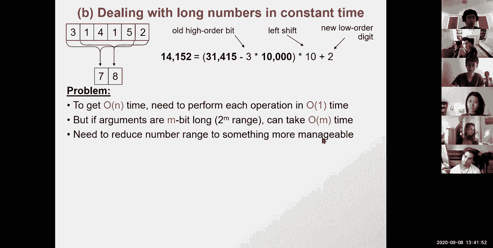
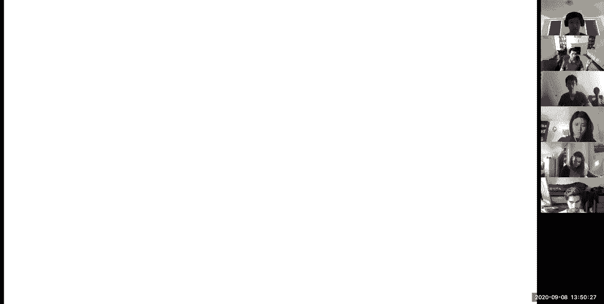
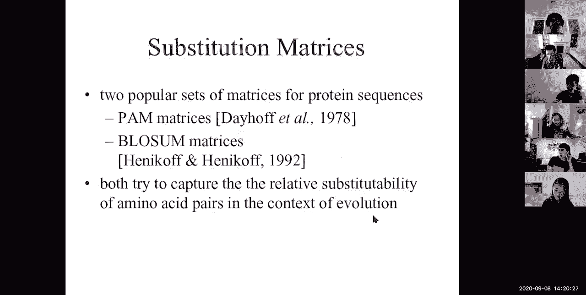
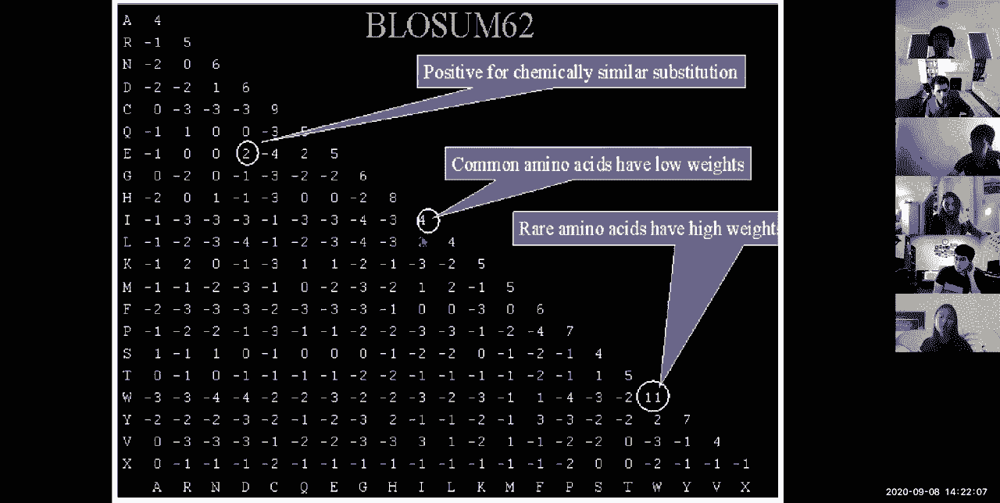
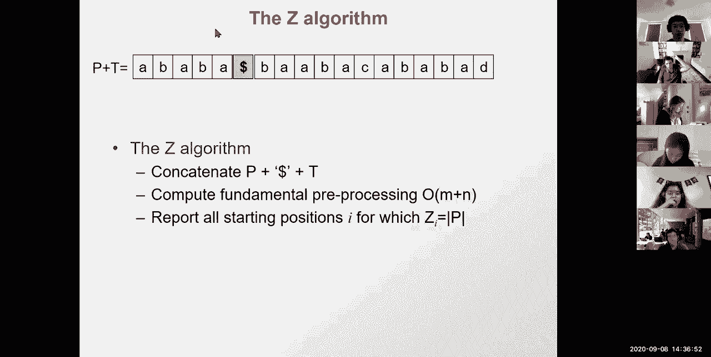
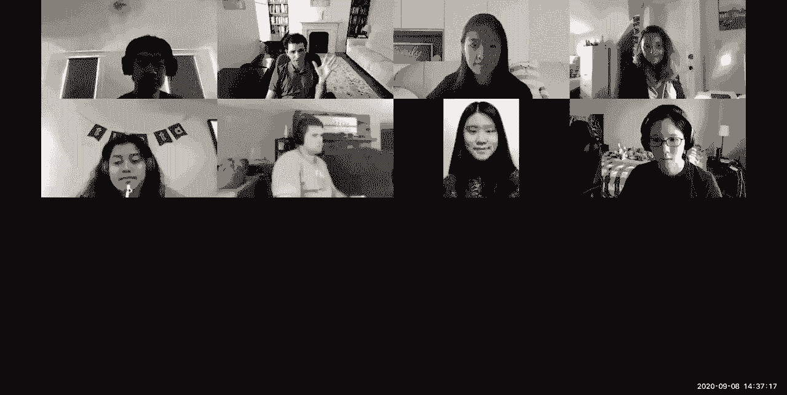

# P3：L3- 局部对齐哈希 BLAST 对齐分数 - ShowMeAI - BV1RM4y1g76r

all right so，welcome today we're talking about，lecture three and，the goal is to dive deeper into。

alignment so first，we're gonna do a recap of lecture two，and sort of review。

what we learned previously about，computing optimal scores recursively。

and algorithmic variations that save，time or space，and also this very cool excel。

implementation of that，then we're going to be talking about，global versus local alignment。

and sort of variations on the theme of，how to start the，how to change the initial the start and。

the end position and，the update rules to sort of turn global，alignment to local alignment。

then we're going to look at a very very，cool way of thinking about alignments。

as a number matching and basically we're，going to look at semi-numerical。

string matching for exact string，matching and how that actually speeds up，the computation to。

linear time or actually，even constant time rather than this，you know quadratic time and then we're。

going to look at a variant of that，matching，and specifically the blast algorithm by。

searching first the neighborhood，expanding all of the neighborhood，searches and then。

scoring each of those and then we're，going to look at the probabilistic。

foundations of alignment so basically，how do we，think about these score matrices。

and what do they really represent and，what we're going to do is，uh recognize that in fact there is a。

probabilistic view，of all of these foreign matrices as log，odd scores negative logout scores。

which is basically giving the additive，nature，of our algorithm a very cool。

probabilistic interpretation is，multiplying the probabilities。

which then leads to uh p values directly，interpretable from the data。

and then if time allows and uh if you，would like to have your uh。

you know sort of brain explosion at the，end of the lecture just like we had last，time。

exact string matching algorithm rather，than probabilistic，with this fundamental string。

pre-processing which is，exhibiting and making explicit，all of the uh suffix and prefix。

self-redundancy of every string and how，that immediately gives a linear time。

algorithm for exact matching，the practical application is not as，strong of course as blast。

but the theoretical applications are，quite substantial，all right so let's dive right in the。

goal for today is，sequence alignment and database search，we're going to be learning。

about hashing which is fundamentally，important，and um also you know a lot of probably。

stick interpretations of our scores，which is also uh hugely important in，machine learning in general。

so quick recap lecture two so the goal，was to，calculate the total score of aligning。

one string to another string and finding，the edit distance between them that it。

allows for insertions mutations and，deletions，and then we saw that mutations and。

preservation could be，thought of as taking a shorter problem，of aligning smaller substrings and then。

expanding those by a，character from each of the strings in，each case。

and alternatively you could build a，longer alignment up from only extending。

one of the characters by one，one of the sequences by one character，one。

and vice versa inserting a gap in this，one and how，we could create a matrix that stores all，of these。

intermediate scores by，having the，uh that matrix indexed by the，length of the i-prefix of s and the。

length of the j，prefix of s of s1 and os2，and using those prefixes of increasing，size as a way to。

create those longer alignments and we，could store those in different entries。

in the matrix and simply look up the，score，of the best possible score that i could。

have by aligning that，sub that prefix to that prefix is，already stored there so i don't need to。

compute all possible，sub problems with that then we saw how，this could be run across the entire。

matrix，effectively giving at the bottom the，maximum possible score。

and how we could trace back from that，score to basically create an alignment。

and the traceback procedure would be，moving either diagonally through this。

matrix or horizontally or vertically，in each case corresponding to an，insertion of a character。

or from both sequences ie a match or a，mismatch，when the two characters don't agree or。

an insertion from only one，sequence as i'm constructing that，alignment moving back。

again illustrating this principle of，dynamic programming，i could compute the locally optimal，score。

at every position but，the globally optimal score would only be，possible by。

tracing back because this particular，locally optimal score is not necessarily，part of。

the globally optimal solution so i'm，saving the choices that i make for。

the computation of every locally optimal，score，and i'm reusing these choices in。

constructing the globally optimal，solution，in a second step which is the traceback。

so in the first step，i compute forward and then i trace back，and we saw how there was this beautiful。

duality between，scores in the matrix and maximum scores，of the prefix alignment of the eighth。

prefix of s1 and the jth prefix of x of，s2，and paths through the matrix which。

basically correspond to，all possible alignments inserting a lot，of gaps this way。

and then a lot of gaps that way or，matching a lot of characters as i'm，moving directly。

so there was the duality of best，alignment best path there's an，exponential number of possible paths。

through the matrix because each time i'm，making a three-way choice，something。

along the lines of three to the n ways，of traversing this matrix。

but we could search through the best，path across，all of these exponential number of。

possible solutions，by uh creating this dynamic programming，matrix and then tracing back。

all in quadratic time which is，than，exponential so that's the difference。

between i don't know three to the，thousand，versus a thousand squared so a thousand。

square is a million，three to the thousand is you know if you，had a universe for any。

every atom in our universe a hundred，times that's basically what，you know three to the thousand mean。

which is ridiculously large and then we，saw how we could only compute things。

based on these local computation scores，and how we could traverse the matrix，horizontally。

vertically diagonally as long as the，previous，as long as the previous sub problems，problem。

are already solved and available and，then we saw two very cool modifications。

uh to this theme to algorithmic，variations the first was to save space。

by sorry to save time by only searching，near the diagonal understanding that。

as soon as you veer off diagonal into，this gray zone，you're basically paying a huge amount of。

cost and therefore solutions，interesting，anyway and therefore if you're just。

searching for a strong enough solution，between two sequences that you know。

are kind of well related already then，you can just search that diagonal。

we also saw a space computing uh，for computing the optimal score which is，kind of trivial。

by simply saving the last，column of the alignment each time and，that gets you the maximum score。

just fine then we saw uh，modification of this linear，space maximum score computation that。

could not only compute the maximum score，but could also compute the。

max the best path through that score，so that algorithm is basically uh，to recursively compute。

the forward path going all the way to，the middle of that matrix。

the reverse path going all the way to，the middle of that matrix and then。

adding up the two to find the best，traversal，and then recursively computing this out。

and again you don't have to，worry about you know all of the details，of that algorithm。

then we saw this very cool way of doing，all of that，in an excel spreadsheet which is kind of，cool uh。

you can basically enter your scores here，your gaap score，your match and mismatch score for。

purines and primitives，then，out come the direct scores of matching a，character to a character。

reading from that matrix the maximum，score，for every matrix m i j。

in um the prefix i and the prefix j of，the two characters，and then whether that maximum score。

matches，the score computed from the top from the，diagonal left or from the left。

in these symbols and then lastly the，traceback and of course，the computation of um appending those。

sequences，all of that can be done in excel，spreadsheet which is kind of fun because，you can。

basically create these cool bifurcations，you can play with the scoring scheme you。

can play with the characters，up there and uh so and so forth，all right so who's with me so far let's。

see uh，how well are you remembering the last，beautiful all right so we have twenty。

four seven two zero zero all right，so today we're going to dive deeper into，alignments。

first we're going to look at what does，local alignment mean compared to global。

alignment and we're going to look at the，needleman wound algorithm。

and the smith waterman algorithm has two，varieties for both global and local，alignment。

and then how to vary gap penalties and，various algorithm speedups，so what is local alignment local。

alignment basically says，i don't care to align the whole string，as to the whole string team。

i'm just going to create a sub alignment，of a portion of s，to a portion of t so a local alignment。

of strings s and t，is an alignment of a substring of s with，a substring of t。

why do we care about local alignment，because for example，very small domains of a gene might be。

the only conserved portions，so if i only care about the domain um。

you know of i don't know that that's a，transmembrane domain or uh。

i don't know rna binding domain of a，protein and i don't really care about。

the rest of the protein i just hear，about that domain，or i might be looking for a small gene。

in a large chromosome，so i might be you know searching for，that gene。

uh in a long chromosome and you know，maybe the whole gene is not conserved。

maybe it's just a small portion of the，gene，or because when i look at two，often。

undergo rearrangements so then i kind of，want to sort of，focus on the subset of these regions。

that are truly orthogonal that are truly，related，evolutionarily rather than forcing a，single path。

through that matrix i might want to，create multiple paths for that matrix。

the way to illustrate that is going back，to our little dot plot。

views that we had earlier and basically，say that，what global alignment does is that it。

forces you to find，all of the diagonally aligning portions，along a single path。

through that matrix whereas what local，alignment does is that it allows you to。

say well hey there's a strong，strong match between this portion here，and that portion there。

and there's another strong match between，here and there and there's another。

strong match here another，another strong match there i don't，necessarily need to be able to thread。

them all together，i just need to sort of you know reveal，that wow this gene seems to have moved。

and it's not the end of the world，and forcing me to sort of create a，single path。

would basically create an alignment of，only，this portion you know b to b。

and c to c missing out on a and d or，a and c but missing out on the other two。

or those two and so forth，whereas the true alignment is simply，corresponding to a series of。

rearrangements，where this portion b is here this，portion d is here this portion a。

moved and this portion c moves okay，does everybody see this so um we，are able to capture these。

uh very funky rearrangements by just，looking at，short diagonals through the matrix。

so who's with me on sort of，understanding the definition of a local，alignment。

basically the goal is we're only going，to look for portions，of of the two sequences that are。

matching，rather than the whole thing and，biologically this is very meaningful。

in a series of rearrangements for，example your genes and a chromosome or，domains in a protein。

so uh 29 1 0 0。 that's great，the problem however is that local，alignment is not necessarily well。

defined，and the reason for that is that i don't，really know if i should be expanding a。

further if i should be you know sort of，using the maximal，uh high scoring portion as the you know。

i mean where do i stop if there's some，weak match，sort of flanking this do i include this。

weak match or no，what constitutes an optimal local，alignment so we're going to talk a。

little bit about that，as we start looking at the algorithms，for local line。

so the first question is how do we，transform our global alignment，procedure into a local alignment。

procedure，if anybody wants to raise their hand and，take a stab at answering or just。

unmuting yourself what would i need to，do to transform，the needleman wunch algorithm which is。

this global alignment algorithm，into the smith waterman algorithm which。

is this local alignment algorithm，so first i initialized，at the top left and then i terminated。

at the bottom right and my update was，looking at，the left，left and above so what do i need to。

change here，you can type in your answers in chat or，you can，unmute yourself or you can raise your。

so um i see a couple of answers that's，great，allow termination anywhere so uh sonia。

you're absolutely right，so thomas change determination that's，right too so。

allow termination everywhere that's，brilliant what else do i need to do。

type in your answers or raise your hands，and the ta since i don't have the view。

of everyone if somebody，um yeah initialize anywhere lily that's，absolutely right。

andrew also allow initiation everywhere，that's brilliant so instead of，initializing only。

there i can just start anywhere，anything else this would be enough。

but i could also change the update to，basically also allow to，restart from a zero which is。

effectively initialize anywhere okay，so that's absolutely right so basically。

the three things that i need to do，is you know i can allow either a zero at，the top。

or a zero anywhere in this top，row or this leftmost column，and then termination anywhere and then。

non-negative matrix says evelyn that's，also correct，basically choosing the zero at any point。

basically allows me to you know restart，anywhere，and frankly by having the zero here i。

don't really need that，since at any point i can just choose to，restart okay。

that's awesome you guys are rocking it，so that's global，and that's local so global starts at the。

top left，anywhere，and ends anywhere and then you know uh，has a zero here which allows it to start。

anywhere，what about semi-global what semi-global，does is that it basically says。

well as i'm doing my sequencing reaction，i might just have a chimeric read。

so there might be a rearrangement or i，might just have you know。

junk nonsensical sequence after a while，so what i want to do is make sure that i，cover。

at least one of the sequences all the，way to the end so how do i do that。

so basically i don't want to have any，end gap penalty，so the way to do that is where do i want。

to initialize，i can initialize anywhere on the top，edge or the left edge。

absolutely and then i can terminate，anywhere on the bottom row or the，rightmost column。

and does my initialization my iteration，change，not really so the iteration is the same。

as for global alignment initializations，top row or left column，and determinations bottom row right。

column this is kind of cool right，we're basically taking this super，complex problem and we're now by。

abstracting it away，into this matrix computation we can just，create create variations of our。

algorithm，that are just super easy to to come，about understand to explain to，rationalize。

we can also change alignment to have a，that，is to basically say well i'm going to。

allow anything along the，column or anything along the rows and，i'm going to search over the maximum。

over any of these positions but then we，might not need to be so general。

one way to base the problem of that，is that you basically turn a。

local computation which was order one，into an order n computation。

and that basically suddenly turns an n，squared algorithm into an n cube，algorithm。

so for a thousand by a thousand，character alignment，i suddenly have you know to run a。

thousand times slower，so instead of being a million it's now a，billion。

operations that i need to do so it's，extremely extremely slow so it's a cubic，runtime but。

we could instead have an a fine gap，penalty so what a finding out penalty，means is that。

i will pay first an initial cost for，starting a gap，and then a small incremental cost for。

extending a gap，and the reason for this is that when，polymerase makes a mistake to sort of，skip。

it kind of can skip over multiple，characters multiple nucleotides。

but then you know the longer the gap the，more the penalty but you're paying a，high initial penalty。

for having started the skipping，operation，so the way that you can actually create。

this kind of function using our matrices，is to create what we call state and。

we're going to get into state，next at the next lecture as we start，talking about heat markov models。

but basically right now you could add a，binary value，for every sequence remembering whether。

i'm starting a gap or not，and the first time that i'm starting a，gap i will pay that initial penalty。

and then after that i basically have a，value that i'm remembering。

of whether i am starting a gap or not，and the way to implement this is to。

remember two separate scores，one score is basically saying oh what is，the current maximum score。

if i'm now starting a new gap and what，is the current maximum score if i'm in。

the middle of continuing，a new gap so basically the，implementation would be to add a second，matrix。

for an already in-gap state，okay and the way to do that is as you're，making the decision。

of which character of which score to，build on，uh for your um for your。

matrix you basically can say well，i have three choices i can build on this。

i can build on that i can build on that，or i might build on extending a gap。

where that score for extending a gap in，another matrix，might actually be lower so if i'm。

extending a gap i can just，to，start the gap then i'm selecting from，this matrix。

okay so let's see who's with me on this，additional，matrix for remembering the state。

of i'm now starting a new，uh you know gap then，i sort of store the score of being in a，gap。

but then if i extend an existing gap i，can just look up，more from the previous one so here i。

would have，one more option for looking at the，matrix with，an additional gap all right so eight。

twelve eight zero zero so again that's a，little more advanced but you don't have。

to worry about it uh，basically what i'm trying to illustrate，is the power of what we've done we。

basically now can，look at all kinds of changes to that，original algorithm by sort of。

rationalizing directly，on these matrix computation another way，to do it would be to。

basically say that well gaps in，protein coding regions have to be，multiples of three。

because they preserve the reading frame，of translation so maybe，i want to pay a much lower score for。

gaps that are multiples of three，but a higher score for math for gaps。

that are not multiples of three，and you can again remember that by，having one more state。

and your possible states are i'm，starting a gap or i'm，mod three one in the gap and mod three。

two in the gap or mode three zero in the，gap and so forth，so you can play with this dynamic。

programming variation，to sort of create additional algorithms，so that's the point that i want you to。

get out of this，the fact that we now have global，alignment，fully figured out local alignment fully。

figured out，and then we can create varying gap，penalties various。

algorithmic speedups by sort of thinking，about the，dp abstracted problem。

all right so that's for global alignment，and for，local alignment now let's see if we want，to build。

local alignments especially，if i want to be searching through，a short string very rapidly。

so remember earlier when we motivated，local alignment，we basically said that i might want to，search。

uh a small gene in a large chromosome，yeah sure if i'm searching for a small。

gene in a large chromosome，one way to do it would be to search for，that string in a。

local alignment with the entire，chromosome and that's extremely，expensive it's basically。

taking i don't know a thousand bases and，then searching them against。

a million bases so it's suddenly a，billion computations，that i need to do a billion comparisons。

between character and character，what can i do instead what i could do，instead is。

interpret my my numbers，semi-numerical okay so let's talk about。

the carb wrapping algorithm that allows，us to do this，so when i'm looking for an exact match。

of a pattern with no gaps what the car，grabbing algorithm，allows you to do is to interpret the。

string numerically，and therefore do the computation in，constant time。

so we're going to start with the broken，version of the algorithm and then。

progressively fix it to make the，solution work，and then we're going to look at。

deterministic linear time，algorithms so basically those，deterministic ones are。

the z algorithm the boy or more，algorithms of suffix trees suffix arrays。

and so forth so these are very cool，things to uh，look up for yourselves and a lot of。

really cool algorithms especially on the，concept of suffix trees and suffix，arrays。

uh and we're going to also cover uh，burris wheeler transforms，later this term which is another。

variation of the suffix 3 concept，of storing the self-similarity。

of an array or of a string or a query or，of a target，in various ways and we're going to look。

a little bit into that with various，builder transform，okay so now let's dive into the card for。

wrapping algorithm what does it allow，you to do，the key idea is i'm going to interpret。

my string as a number so i'm going to，search，this particular gene into this very。

large large chromosome，and the way that i'm going to interpret，my gene is instead of saying oh it's。

character 3 followed by character one，followed by character five by character，one and character five。

instead i'm going to interpret it as i，don't know ten thousand times pi。

okay uh thirty one thousand four hundred，fifty，so now i'm going to search for this，number。

in this string of numbers，so the key idea is that if i interpret，these strings as。

numbers i can just do that in a single，unit operation simply ask hey。

are you thirty one thousand four hundred，fifteen are you thirty one thousand one，hundred for fifteen。

are you thirty one thousand four hundred，fifteen and when i match，i'm all set okay who sees this。

as the key concept even though there's a，lot of problems with it who gets the，intuition。

so red is asking this is clearly not，element wise mapping so first of all，25 22 5 1 1 0。

this is clearly not element wise mapping，more than four，so，my window size might be my string itself。

and then we're going to talk about，window size，when we talk about the blast algorithm。

but for now my window size is the entire，string so i'm searching for。

this whole number and therefore my，window size is dictated，by my string all right so this is。

nice and cool everybody gets the，intuition behind that but now，we have also on any computer you can。

only process yeah of course，guillaume，uh very shortly all right so the key，this。

and then this number is going to be 23，000 35，000 59 000 and so forth and eventually。

y7 is going to be 31 000。 so，the quick little program is compute x，basically。

you know my query and then for every i，compute y i basically compute each of，these numbers。

and then if that matches then print a，doesn't match，okay this obviously doesn't work and。

the reason it doesn't work is because，it takes us a long time to compute this，number。

from the previous one sorry to compute，this number so basically to compute 31。

415 from this i need to basically take，five，10，and then add that to 4 times 100 add。

that to 1 times 10 000。oh sorry 1 times 1 000 and add that to 3，times 10 000。

so basically for every power，of 10 as i go through these strings。

i basically need to do an addition and a，multiplication，which is basically a linear time，computation。

so i kind of blew it there however we're，going to see how we can compute the next。

number based on the previous one，and therefore go back to another one，computation。

so how is that well suppose that i've，already computed 31，415 how do i compute 14。

152 in a constant number of operations，so to do this i need to figure out a，function。

that will transform this number into，this number，using a constant number of steps so can。

anybody see what those steps might be，so notice that the middle one four one，five is the same。

so what i need to do is add the three at，the front，sorry remove the three at the front and。

add the two at the back，and then shift these numbers by one so，how do i do that。

super easy to compute a new number i，basically take the old number。

subtract 10 000 times whatever digit，that was to get rid of that digit。

so that basically gets rid of the three，and i have one four one five。

and then i want to left shift it by，multiplying by 10，and then i want to add the lower order。

bit which is，the number two okay so basically the，middle number。

the middle digits of the number already，the left，remove the higher order bit and add the。

lower bit okay，very cool this is cool right so，basically i can now compute。

all of these numbers super super fast，because i can reuse the computation you。

guys are masters every using，complication now，so i can basically compute my number so，27 to，1 0 0。

 all right so，there's an there's a new problem that，arises of course which is。

you know i come in and i'm like oh great，i want to match a，string of length a thousand against the。

chromosome of length a million，so uh great i'm gonna have all these。

thousand digit numbers in my computer uh，and these are some，very very big numbers so the problem is。

that the computer simply doesn't have，the power，to compute uh you know on such long，numbers。

so to get the order and time we need to，perform every operation in constant time，long。

this can actually take order of m time，so if i have a thousand long um。

a thousand character number um，i need to somehow compute every part。

separately because my machine can only，fit 32 bits at a time not a thousand，bits at a time。

so what we need to do is actually reduce，the range。

of the numbers to something more，manageable，okay so one way to do that is。

hashing so what is hashing hashing，is a very cool fundamental computer，science technique。

to basically map a very large universe，u into an individual little space。

so i'm going to basically select k，which is a key that i'm hashing from a，huge universe。

this is the universe of all one thousand，digit numbers，okay that's an enormous universe。

it can represent basically two to the，one thousand possibilities，way way more than the number of，and。

to do this enormous mapping into a tiny，little space，we're going to basically hash。

every key into a smaller space，so one hash function might be to i don't，know add up all the bits。

and then you know do these progressive，adding of bits across different。

parts another one might be to take the，modulo another one might be to just。

take the first 20 bits of my number，or the last 20 bits of my number okay so，what are desirable。

we want it to be reproducible so that，every time i compute this function of，the same two numbers，y。

then i want the hash of x to match the，hash or y basically the hash of x is，always the same，and。

it sounds super trivial but it's hard to，obtain is that，there's a uniform output distribution。

so even though i'm taking this enormous，insights，you know starting space when i compute。

out of it i want i want to cover，the entire set of numbers okay。

so the way to think about this is that i，have an enormous space that i'm trying，to map。

into a smaller space i want the coverage，of this smaller space to be kind of，uniform。

i don't want all of the numbers to map，right here，okay i don't want i don't want that i。

want and i don't want this either，okay what i want because then there's，unused spaces。

if i have this basically all of the，numbers are going to be，very。

desirable because it leads to what we're，going to call collisions。

okay what i would like is some kind of，uniformity in the way that i that i。

match the characters so that，as i take this enormous space and i，i。

cover most of the tiny space i don't，just cover，a tiny fraction of that tiny space okay。

uh let's see who's with me so far on，hashing，and this desirable uniformity。

in the distribution with which i'm，mapping this huge space of numbers。

into this tiny tiny little space i want，that tiny little space。

so guillaume pairwise independent hash，functions，are good but they're not giving us the，run time。

desirabilities that we would like in，order for the runtime visibilities to，actually match。

okay so uh 23 5 3 0 1。um okay so how do we achieve this，how do we basically map this huge space。

into this tiny little space，while covering that space uniformly for，any input distribution。

the way to do that is to make sure that，your，um that your hash result depends on。

all of the bits of the initial number，basically if i only take some of the，bids then。

you know i am much more likely to to，generate these collisions。

okay so one way to do this hashing is to，basically，uh do the mod 13 and mod 13 basically。

does depend on all of the digits，because it's effectively um you know。

like creating that number wheel and then，going around it，uh you know every 13 you kind of come。

back to itself，and that basically means that these，numbers if they're sort of uniformly。

distributed in that，universe they're going to be usually，uniformly distributed。

in that other smaller space okay，so this is one way to hash to basically，take。

this very very large space and then map，it onto，simply the mod 13 of that which，basically for 31。

415 corresponds to seven，and then for 14 158 2 corresponds to，eight。

okay and the beauty of that is that i'm，as i'm computing，the next number based on the previous。

number，all of these operations i can do，mod 13 okay so，that's very important because i don't。

want to be computing on，thousand digit long numbers i want to，computing on very small numbers。

and of course instead of 13 here i'm，going to have i don't know。

13 13 or 13 13 13 just like something，much much smaller than all of the，numbers。

in you know between 0 and 2 to the 1000，okay so that's what the hashing will do。

so basically hashing basically has，resolved this problem of wow these，numbers were very long。

but it has created a new problem which，is collisions，so what are collisions i've been using。

this term already a collision，is when the hash of x matches the hash，of y。

it's the same but x is actually，different from y，and that's of course going to happen。

because i'm mapping this very large，universe，basically all you know people in the，united states。

into a tiny tiny little space namely all，the numbers between i don't know one and，a hundred。

so to give you another example if i take，your，uh mit id numbers okay every single one。

of these numbers is i don't know nine，digits long，so that basically means that there are。

two to the nine possible，entries uh in your uh，you know if i if i basically indexed。

everything according to your social，security number or，your mit number okay so basically。

the universe that i'm mapping from is，i don't know all numbers that have uh。

nine pages or something like that，okay so this is the size of the space，that i'm starting from。

but you know there's only i don't know，50 students in the class。

so basically i don't want to allocate，all of that space in memory。

i want to allocate a much smaller space，in memory，and one way to do that is to basically。

hash numbers，from the you know nine digit long，numbers to much smaller numbers。

one way to do that is to basically take，the modular 50，and then all of your numbers are going。

to be landing somewhere around here，and then i'll be able to sort of then，check if indeed。

the original number that i had matches，the hash if two numbers，map to the same hash entry i can then。

simply compute the original numbers to，basically check if they do match。

and if they started from different，places and they，give them out to the same place then you。

know there's going to be a collision，or if they're actually the same number。

then they're going to match，but that's you know that's something。

that python does trivially by creating，dictionaries，at any point you can basically create a。

dictionary which is basically mapping，this very very large space。

into a small number of entries with only，the memory allocation。

needed for the number of students in the，class instead of，you know all of the possible numbers and。

atoms in the universe，okay so let's see，can we use perfect hashing to eliminate，yeah perfect caching。

is possible but perfect hashing is，actually quite expensive。

so you know you know you don't need to，do this kind of overkill but yes，absolutely。

so how do we what do we deal with what，do we do when we find a collision。

how do we deal with pollution so here's，an example of a collision。

i basically i'm searching for the number，315，but i've now hashed it to a much smaller，space of。

you know modular 13 and i go through and，most of the numbers don't。

don't have a collision which is great，basically shows how great my hash，function is。

but every now and then i'm going to have，a collision so basically that's a valid。

match because the actual original，matches，and that's just furious here because the。

actual original doesn't match，so what are the consequences of mod p，hashing the good。

is that it enables fast computation we，can now use smaller numbers。

the bad is that it leads to spurious，hits collisions，so how do we deal with the band so first，that i。

hit ie the match of the hash，corresponds to valid match ie the match，of the original numbers。

so basically we're going to have to，recompute the equality，for the entire string not just a hash。

okay so what we're going to do is that，we're going to compute the numbers。

modulo p we're going to compute y i，by reusing y i minus 1，and now we're going to check every time。

there's a match，in other words if y i matches，then that's a hit but i want to know if。

the hit is actually a match or not，so to know if the heat is a match i'm。

basically now going to ask if，p is actually equal to the substring，to，i plus length of p so。

if indeed that original string matches，then i print that there's a match。

and otherwise i just continue because，it's a spurious kit，okay so twenty six three zero zero。

that's great，um so there's another question on the，chat，our monte carlo algorithms acceptable in。

this context let's talk about this，offline view，um so the，so basically the end result is that。

i've now managed to uh，compute things in linear time，however every now and then i'm gonna pay，then。

i'm gonna have to pay the full cost so，basically every single one of my，computations is now。

constant time but every now and then，i'll have to pay linear time。

and that means that our my algorithm in，the，worst case will be quadratic but in the。

best case it will be linear，because i will have to pay this only a，certain number of times。

so the reason why we want this uniform，distribution in hashing is because we。

only want to pay for this，linear time penalty，one out of m times rather than。

all the time okay where m，is the subspace that i'm mapping things，into。

could we do another round of casting，with a different mod to reduce，absolutely so now。

this is a great suggestion so basically，nice basically saying hey why don't i，hash twice。

so i can hash one mod p and one mod p，plus two or something like that and then，one p plus two。

you know i don't know 13 and 11。 uh just，two relatively，prime numbers that are。

prime relative to each other and then，that basically means that i'm reducing。

that probability of collision，by another factor of n which is quite，remarkable。

so um basically the reason why we're，trying to make sure that the。

hit that the the spurious hits happen，infrequently is because then it sort of，scales up。

our total compute so basically we it，avoids，uh we want to avoid the worst case。

behavior of many collisions with a bad m，so we're going to usually choose a。

random end at the beginning，so the other challenge is that both the，algorithm。

and the analysis become more complex，we're going to now have to compute。

the expected run time rather than，the deterministic run time because the，case，time。

depends on how often i'm going to have，to go back and check the original string。

when i didn't really have to so we're，going to have to show that the。

probability of a spurious kit is small，is，linear okay so um，to put it all together we're going to。

basically，compute the match by interpreting，strings as numbers，thus enabling a very fast computation。

and there are other semi numerical，methods like fast forward transform，shift and etc。

and to make all of this work we're going，to have to basically compute the next。

number based on the previous，one rather than the order n computation。

that we had before that gives us an，order one computation，we're gonna hash modulo p to keep the。

numbers small，that's again an order one computation，instead of order n computation because，of these。

thousand character long numbers and then，we're gonna have to deal with collisions。

and that's suddenly where you have a，randomized，uh expected runtime it's a randomized。

probability of a algorithm，and then that gives us order one in，expectation。

okay so uh let's see who's with me so，far，on um this whole，part two of semi-numerical。

all right so now let's build on this，concept of hash functions to basically，speed things up。

even further and let's now，just，exact string matching so the problem，that we have。

from before is that if you know i'm，trying to match strings and this，is 31415，okay，like 31 0405。

would be just fine with a one character，mismatch，but the solution that we've looked at。

now doesn't allow this at all it's，either matching，perfectly or in mod space it could be。

anywhere okay so how do we now allow for，inexact string matching so that's where。

this blast algorithm comes from，it's a very cool acronym it's basically，basic local。

alignment and search tool but it's also，lastingly fast which，is super super fast so how do we。

um you know understand this algorithm so，basically here's what blast。

tries to do it says well with sequence，alignment we kind of assume that the。

sequences have some kind of common，ancestry，fine and finding the right alignment。

between the two sequences，is um you know expensive but，we want to basically any because it has。

an evolutionary interpretation of the，minimum number of events etc。

and that's sort of what we saw in the，second lecture，by assuming that the sequences have some。

common answer but the sequence database，search problem，which is the problem that blast is。

trying to do is given a query，a new sequence and given a target which，is many many old sequences。

we want to ask which sequences if any，are related to the query and the，perfect。

once the initial matches are reported we，can then fine-tune them afterwards。

but the query must be super super fast，for a new sequence，and the key insight is that most，sequences。

will be completely unrelated to the，query so we don't need to us。

to align every single one of them super，well and sort of have this evolutionary，interpretation。

so what we're going to do is exploit the，distinct，nature of the database search problem。

how namely that there are going to be，many spurious hits，and we're going to say well if you're。

going to reject，any match that has less than 90 percent，uh i you know identity where the。

identity percentage is less than 90 then，why bother，even looking at sequences which don't。

have a stretch，of 10 nucleotides in a row，therefore we can pre-screen sequences。

for common long stretches，and we're going to put the speed where，we need it namely。

we're going to pre-process the data，because that，happens offline and once the query，arrives。

we're going to act super fast so then，the solution，is going to be these contents based，indexing。

and blast so the example is you know we，could intex，all ten mers and the idea is that only。

one ten mer in four to the k will match，that's one in a million even if we have，500 gamers。

that's only one in two thousand that，will match and there's many additional。

speedups that are possible，okay so that's the basis of this basic。

local alignment search tool that's the，blast algorithm，and if you look at the uh blast。

algorithm it was developed，you know back in 1990 and it still。

continues to have 4 000 citations every，year，so that has a total of 55 000 citations。

and that's just for the first version，the second version gap，blast inside that has another 55 000。

citations so，uh you know many of us would say oh，great i have this awesome paper let me。

work on something else now，but no they said well let's make it even，better so。

what were the two key insights one，insight is hashing，just like carburabin this semi-numerical。

string matching so，it's basically taking these numbers and，then hashing them computing them。

as a number the second key inside，is this neighborhood search where。

we are allowing to find hits even when，there's not a single，exact tamer that matches。

so let me explain i received my query，and then i split it into overlapping，words of length w。

okay so i'm gonna chop it up into three，mers，and then i'm gonna effectively。

hash all of these streamers to basically，then expand them out，on。

amino acid space rather than nucleotides，okay so the key idea of the neighborhood，search is that。

instead of simply hashing，the exact string knowing how well，amino acids match to each other knowing。

how similar，amino acids are in i don't know，functional space，we're going to basically expand the。

neighborhood，of all possible，three amino acid strings that are，sufficiently similar to my query。

were up until some threshold okay，so pqg has the you know total。

um score of 18 and i might have a score，of i don't know 80，of that or 70 of that and then go all。

the way down to 13 and then consider，all neighbors of that and then。

go and hash all of the neighbors in my，database，okay so the key idea that's different，from what。

carp rabbit was doing is that we're，creating this hash table，and we're searching this hash table。

by looking for all of the neighbors of，our word，up until some threshold okay so we're。

splitting the query into overlapping，words，we're finding the neighborhood words for。

every word until some threshold team，and then we're going to look up in our。

table where these neighborhood words，occur by creating this giant hash table。

that basically tells us for every i，don't know threamer，in our sequence what are all of the。

places where the streamer，occurs in our database and then once we，have the hit。

we're going to extend it to look for a，match which is sufficiently high。

up until some score x okay and then，we're going to，report the significance and the。

alignment for every one of those matches，okay so this is the recap we take our，query。

we break it up into uh sets of streamers，and then for every dreamer we're going。

to expand this neighborhood，and then search that neighborhood and，expand that into a match。

so let's see who's written so far on the，blast algorithm，okay so um are there any questions so。

so 14 12 3 3 0，so again the key idea here is that i'm，going to create one giant database that。

tells me for every timer，or for every threamer where does it，exist in my database。

in my in my sort of set of sequences in，my genome，and then when i have that i can just go。

directly into that instead of searching，all of the places，i only search one in 10 000 places。

because that's how often，uh yes dion we're going to look at，locally sensitive hashing variants。

all right so why does this even work，and the reason for that is that you know。

if i know that two things are going to，be quite similar like 90，similar then i only have so many。

mismatches to distribute in my whole，sequence，so basically if i know that my preview。

is going to be 90 similar to my target，then i can just search all of the，neighborhoods。

to basically look for uh matches，and yeah this one might not match and。

this one might not matter but this one，might match，and therefore i have a lot of。

opportunities to find a hit，why do we process the neighborhood for。

the query instead of pre-processing，on the original string and just having。

more entries in the hash table，instead yeah that's a great way so i use。

uh absolutely so i could simply create，a database that hashes every string，not just for you know。

where it is but where all of the near，neighbors are，the reason why we're doing the。

neighborhood search on the query，rather than on the database is because。

it allows us to tune the parameter，because if i did the neighborhood，expansion of the。

database i would have to choose only one，threshold，from the beginning or by doing it at，query time。

i'm basically allowing the threshold to，be chosen，okay so we are basically building on the。

concept of hashing，we're now creating a very big table to，search into。

we're searching the neighborhood of our，query，and every such window and every time we，have a hit。

we're expanding it out on both sides to，decide if it's a match or not。

okay and the reason why it works as i，mentioned earlier is because。

we only have so many places where we can，put those mismatches。

a very simple idea of why this works is，that，if you have you know two pigeons and。

three holes there must be at least one，hole with no pigeon，and if you basically have 90 identity。

with 100 nucleotides there must be a，stretch of 10 nucleotides that doesn't，have a single mismatch。

and in practice there's going to be more，pigeons per hole because of the way that。

you distribute those but even in the，worst case，you're going to have a strong enough。

match so basically if you have，these two pigeons to distribute these，two mismatches to distribute。

chances are there's going to be a，stretch with no pigeons at all with no，mismasks。

all right so that's the basic blast，algorithm and then there are several，ideas beyond this w humor。

indexing so basically we'd like things，to be faster，or better sensitivity with fewer false，negatives。

one way to do that is to basically do，filtering to eliminate，low complexity regions because they。

cause curious hits，we can simply filter out or all low，complexity regions in our query。

or we can even filter most，overrepresented items in our database。

that's a little weird right it basically，says wow i'm hashing all these。

tenomers and i'm going to eliminate the，thousand，most frequent cameras i mean that sounds。

counterintuitive why would you want to，do that，and the reason is that the 10 most，frequent tenors。

are probably going to be you know，so so frequent that they don't allow you，to narrow down。

the set of sequences that are truly，so you know it's it's sort of a very，cool trick。

to eliminate things that are just simply，so promiscuous，that they're not very informative what's。

information content information content，is basically，sort of if i ask a yes no question it。

should limit the space by half，if i ask oh is the suspect a human。

it's not really informative the suspect，is most likely human，is the suspect between the ages of 20。

and you know 60，yeah well yeah me and nearly all people，know all suspects are going to be so。

you know i'm not really asking the right，questions so if you're saying well。

is this sequence containing an a and，every sequence contains an a it's not，i。

if i find things that are just so，overrepresented，that they're not informative i can just。

simply throw them out，the other idea is what now had suggested，earlier which is。

use two smaller w mers，rather than a single longer one so，basically i can use。

hashing twice i can basically you know，look for one hit and another hit that，are nearby。

and that's a much more sensitive search，method，then you know so basically at every。

speed it's more sensitive，and at every sensitivity it's faster so。

this and the reason for that is that，simply that's how evolution works。

evolution doesn't tend to preserve these，super super long scratches，but it tends to preserve smaller。

stretches，and then uh you know dion suggested，uh locality sensitive hashing so。

beyond w i could search for non-context，consecutive w so basically one way。

is to basically search for um a，lower dimensional projection of my。

tenor into a four-dimensional space，rather than a ten dimensional space。

and then the key idea here is that i'm，gonna search with a cone。

where only certain characters matter and，other characters are，wild cards and i can first decide on。

this wild card，and then that's sort of the random，projections idea that califano，introduced。

and that indic sort of improved upon，and these are first choosing the。

positions of those stars at random，and then studying with what。

frequency are mismatches found and if i，can project，with multiple neighborhoods i can。

basically create，this higher frequency，of preservation，all right so that's the blast algorithm。

the whole，concept is that we're going to be，hashing just like for the linear time，string matching。

in the car private algorithm but we're，going to create this very large hash。

table and we're going to search that，hash table，using neighborhood search and there's。

some very cool modifications like to hit，blast and hashing with combs。

so let's see who's with me so far on the，third part，this blast algorithm。

so nine nine ten one one so um，yeah you guys are mostly with me but not，100 with me and that's okay。

uh these are complicated algorithms um，so now i want to switch gears a little，bit。

and talk about the probabilistic，foundations，of sequence alignment basically where。

are these match and mismatched，penalties coming from we're going to，review the blossom。

and the pam matrices and sort of see，these，you know majors that we've been looking。

at where do they come from，and how to compute the statistical，significance of an alignment score。

okay so when we saw this query word pqg，we basically said well p e g is a close，enough match。

prg is a close enough match and so so，forth up until，down here okay how did we decide。

which characters are close enough how，did we search through that。

well the place where this comes from are，matrices that basically tell you。

what should be my penalty for，substituting，this amino acid with that amino acid，okay。

and then you know sometimes i have a，three，one，and so forth so uh that's。

in protein space that's basically how we，search for that neighborhood in protein，space。

but it's the same thing that we did，earlier when we looked at。

nucleotide space basically in some cases，we decided to reward，matches by the same amount and。

to penalize mismatches by different，amounts，based on whether uh you know an age。

was swapped with a g or a c with a t，which are，transitions versus transversions for all。

other substitutions，which are much more unlikely，so where do these scores come from and。

how do we know whether two，aligned sequences are actually related，or not。

so what should these alignment scores，represent，what they should represent is the。

probability that two similar sequences，are indeed evolutionarily related。

in other words homologous what is the，likelihood ratio between two different，hypotheses。

the first hypothesis is that the，alignment that i'm observing is due to，chance。

that's the unrelated hypothesis the，second hypothesis is that the alignment，common。

ancestry that's the related hypothesis，and what i want to do is calculate the，probability。

of observing the alignment that i，observe according to each hypothesis。

so what is the probability that x is，aligned on top of y，given the unrelated model versus the。

related one，okay what's the approach the probability，of aligning x on top of y。

exactly the way that i have them by，model u or by modern r，so the alignment score should represent。

the likelihood ratio between the two，hypotheses，namely the probability that the。

alignment is not due to chance，is simply the likelihood ratio between，pxy。

given related divided by pxy given，unrelated，and i could compute as a score the log。

of that probability and the aha moment，that i want you to eventually get。

is that additive matrices do，basically，computing exactly that likelihood ratio。

so let's expand out the probability to，get to that moment，so the pro the model for two unrelated。

sequences，is simply the probability of aligning，every character of x。

on top of every character of y is the，independent sampling of every character，of x。

and the independent sampling of every，character of y，so every one of them is just the pro you。

know the product of sampling each of the，characters，and the product of sampling each of the。

other characters，okay the probability of aligning x and y，given the related model is basically the。

probability of observing，the pairs of characters at every one of，those positions。

and that should be given to us by，indeed，land on top of each other in。

you know alignments that i observe okay，so therefore the likelihood ratio。

between the related model and the，unrelated model，is this related probability。

p of having amino acid a，on top of amino acid g，which is basically the product of this。

at every position of the alignment and，then the second one is this。

product of these independent terms，at every position which is basically the。

product of these two independent，probabilities at every position。

and the reason why i do this is because，i want to sort of have the common i。

at every position and then take the log，of all that so the log probability。

the log odds ratio is simply，simply，the sum of the logs，which is simply the。

product of the unrelated model divided，by the，sorry the related model divided by the。

unrelated model at every position i，okay so this is the frequencies of，individual characters。

and that's the frequency with which，those characters are observed on top of，each other。

and how do i get this so，first of all let's get to that aha，moment so if i take the sum。

of the log probabilities i will，basically have the related，versus unrelated likelihood ratio the。

log likelihood ratio，and that's simply the score，that i have for my probability matrix so。

if my score，substitution my substitution score may，the matrix that i was showing you，earlier。

if that's simply the log of these ratios，then all of this the additive scores。

that i've been obtaining，will simply be the exact probability，ratios of the corresponding sequences。

okay so let's see who's following me so，far，if i take basically this log ratio。

and i add it up in this additive way of，my alignments force，using。

earlier to compute these additive scores，will effectively be giving me likelihood，ratios。

as long as i have these uh two，probabilities，factored in there all right。

so this is not looking so great so 7 10，6 3 2 so hopefully once everything comes。

together you guys will，get higher there so there's two popular，there's。

pam matrices and blossom matrices that，try to capture the relative substitution。

of amino acid pairs in the context of，evolution，okay what these matrices basically tell，you is。

the frequency with which i expect to see，amino acids on top of each other if the。

two sequences are related，versus if the two sequences are，unrelated okay。

so what the blossom 62 matrix is doing，is basically looking at blocks。

some at 62 identity and it's basically，saying with what frequency do i expect，to see。

these two amino acids on top of each，other，if they're related or if they're。

unrelated it's the likelihood ratio，between the two，notice that along the diagonal the。

numbers are in fact，changing quite a lot matching a，tryptophan to a tryptophan。

gives me a score of 11 whereas matching，and i said losing to another solution。

gives me a score of four，why is that because，trip defense are more rare they're much。

more likely to be，ending up aligned on top of each other，by chance。

whereas a solution to a solution given，that it's a more common amino acid。

these are much more likely to be aligned，on top of each other，due to chance also if i match a loose。

into an isoleucine，i still get a positive score i get，actually a reward for a mismatch。

and the reason for that is that you know，biochemically they're very similar。

and therefore evolution switches them，very often，and therefore when i look at these。

frequencies with which these amino acids，are found on top of each other in。

related versus unrelated sequences。

they're much more likely to be related，if i see them on top of each other。

so basically the substitution matrix，score for every pair a b，is simply the frequency with which i。

find them on top of each other，versus what i would expect by chance and，exact。

principle and therefore as i，add up my scores these numbers，i can train them directly on blocks of。

aligned and blocks of randomly occurring，pairs of characters，and these blocks are basically going to。

be dictated，straight from these um，amino acid substitution penalties，which is basically going to be。

corresponding directly to，that alignment score so to recap putting，it all together。

what we were doing in that spreadsheet，where we were looking up。

these values of what is the penalty that，i should pay for aligning an a。

if i use numbers that stem directly from，that likelihood ratio。

of how frequently do i see them together，in a true aligned，set of sequences versus a random set of。

sequences，then whatever score i'm computing by，adding up all these numbers throughout。

my alignment and throughout my，dynamic programming matrix to get to the，bottom。

all of these scores are going to have an，immediate probabilistic interpretation。

which is going to be exactly the，likelihood ratio，of observing this alignment given the。

related model，or given the unrelated one so that's，basically coming full circle。

and connecting these initial，substitution matrices and those scores。

with the likelihood ratio of those，alignments，so that gives me directly the。

probability of an alignment，given this related or unrelated model。

and how do we build these matrices in，the first place，so what hennikoff and hennikov husband。

and wife did，in pnas in 1992 is that they estimated，these probabilities from blocks。

of sequence fragments that represent，structurally conserved regions in the，proteins。

and they built out blocks with proteins，that were at sixty percent，for。

five percent sequence identity so they，had structurally aligned them。

and they said ah these must correspond，and then，they built those together okay。

so let's see who's with me so far on the，fourth part，namely the probabilistic foundations。

of the sequence alignment of sort of，using，the scores that come from related versus，unrelated。

and then looking at the corresponding，frequencies and then using these，frequencies as part。

of the substitution score for a，match or a mismatch and then ending up。

probability of the whole alignment using，this additive score，so we have eleven twelve four four zero。

so most people，are following very very well all right，so um we could stop there。

and you guys are welcome to sign off，there's some optional，material that i want to cover for the。

to stay，it's not going to be on any exams or any，other thing this is purely for your，interest。

so just to sum up what we've done today，is that we've looked at。

global alignments versus local alignment，we looked at needleman wunch which is，this global。

top left to bottom right versus smith，waterman which is recreating these small，blocks。

and we also looked at varying gap，penalties we looked at，linear time exact string matching where。

we were using this semi-numerical，interpretation，of our sequences and the carb wrapping，algorithm。

we saw how initially it didn't quite，work but we fixed it using hash，functions。

and using these you know introduce this，concept of a randomized algorithm。

and then we went from exact string，matching to inexact string matching，using the blast algorithm。

where we were hashing with a，neighborhood search and，that allowed us to now first search for。

all of the neighbors，that's the inexact part and then hash，that's the exact part。

which makes it super fast and then we，saw variations like two hit blast and。

hashing with cones that allow you to，either speed things up or be more，sensitive。

and then we looked at the probabilistic，foundations of sequence alignment。

where these mismatch and match penalty，scores come from in the blossom case。

with these blocks of related sequences，and how we can compute the statistical。

significance of an entire，alignment by adding up these，probabilistic interpretations of the，score。

which at every position gives me the，log likelihood ratio of this character。

alignment being by chance or not，chance and then adding up across all of，them。

the the sum of the logs i e the log，of the products i e the total，product of probabilities at every。

independent position of my alignment，of the two sequences being related or，not related。

so first of all a quick paul of who's，with me now，on the entire lecture so far the first，four parts。

great so um doing pretty good so eleven，four three one zero，so 25 people above midi。

middle and only one person below middle，this is kind of good，all right so now let's talk about。

deterministic linear time exact string，matching again this is all。

optional material so the key idea is，that we want to gather，more information from every comparison。

pre-process our string to find，the in the string self-similarity。

and for those of you who have another，class this will be all in youtube very，short。

so what i want to search is a string p，inside a longer string key a pattern，inside the text and。

i want to find all of the occurrences of，p and t，which are exact matches in linear time。

how do i do that so，one way to do that is to basically just，simply scan that。

into this every single time matching the，however i can do better than that。

i can basically uh realize that wait a，minute，every time i have a mismatch here，i。

understand the self，matching of a small string onto itself，i can basically jump further every。

single time，so if all of the characters，in the pattern are the same then。

i can basically say oh i have a match，match，if i have a mismatch here do i need to，research。

the first offset probably not because i，know that the a won't match here。

so that basically means that i can make，bigger jumps，if my sequence self-similarity is a。

hundred percent，because every time i have one mismatch i，can just jump。

by three it doesn't matter what that，character is，all i know is that it's not an a okay。

so that's one extreme case where i，basically went from，having uh m times。

n comparisons to having only n，comparisons because i only need to check。

the first character the second the third，the fourth the fifth the sixth 6th the。

78th and 9th and the 10th character so，this is actually，order n comparisons by gathering。

information about my string each time i，do this，okay this should be fairly kind of cool。

at the other extreme，if every one of my characters is，i've searched for a b c d and suppose。

that i've matched them，then i don't need to sort of research at，the same position。

because i know that there's no cell，similarity so i can just make a huge，jump each time。

so there's at most end matching，comparisons，and there's at most and non-matching。

comparisons so that's again order n，comparisons，so in both cases if i have。

all characters be the same and all，characters be distinct，i can basically do this in order and，time。

so by extrapolation we're going to show，that in fact we can do this for all。

cases even in the middle so in the，special case where all characters are，the same each order n。

in the special case where all characters，are different each order n。

and in the general case what we're going，to do is very cool we're going to learn。

the internal redundancy structure of our，pattern，by doing a pattern pre-processing step。

and the the three methods for that are，fundamental pre-processing，newth more spread or finite state。

machine，so how am i going to learn the internal，redundancy structure of a string。

so what i want to know is this z，vector that basically tells me the，length。

over which the current string，matches the beginning of that string。

okay so over here at position five，the length over which the string。

the suffix starting at that position，the length over which this match is the，prefix of that string。

is three okay，so because aab matches aav，but x is different from c so that。

basically means that the length，of that z vector the z vector basically，tells me the length。

of the internal redundancy of that，substring starting at that position，versus。

the substring starting at the start，position okay，who's with me so far on that internal。

redundancy vector，z that basically tells me what is the，length over which。

i'm matching myself at the beginning of，the string，versus the position of the string that，i'm at now。

this is awesome so，um we have eight seven two three zero，this is awesome，so therefore。

i'm gonna define this thing called the z，box that basically tells me for how long。

am i matching myself at the beginning，okay and then i'm going to define the r，vector。

to basically tell me what is the right，position over which，the longest z box that i'm in ends。

okay and then of course the left，position is going to basically say，what is the starting position of。

the longest z box that just ended，where i am now okay so，at every character k i will have the。

left pointer，and the right pointer basically tell me，both sides，the z。

vector the right pointers and the left，pointers in linear time，and the proof for that is effectively。

reusing these fours as i'm building them，so if k is outside a z box，i'm simply going to compute z k。

if k is inside a z box i can just look，up ck，because the self redundancy at this。

position is the same thing as the self，redundancy at that position。

if i'm inside a box that's self similar，to the start，because k prime basically should have。

exactly the same，as this k here because i'm inside this，redundancy pattern，which is kind of cool so。

basically，compute this vector then i can just，simply compute。

every position from the left all the way，to the right，by either computing it or reusing it。

and in both cases i can still compute it，in linear time，which is uh you know very important。

so if you basically get this intuition，get，you know all of the details but if i get。

if you get this intuition i can simply，compute the z，vector by reusing this left and the。

right vector，and you know reusing my computation and，the coolest part of it all。

is that if i can compute all of these，things in linear time，then i can basically simply。

concatenate my pattern，and my text with，a non-sensible character in the middle，that doesn't exist。

in either the pattern or the text and，if i can compute the entire z。

vector for my concatenated string，in time n plus m they can just simply，report。

all starting positions where z i，is exactly the same as p because that's，all of the positions。

where there's an internal redundancy and，therefore where this string matches。

so it's kind of cool all right who feels，that this was，uh kind of cool so let's see relaunch。

the following，uh sorry who who who gets this the fact，that if i can compute the internal，redundancy。

i can do，all of these computations in linear time，because i'm sort of。

expanding and rebuilding on the internal，self-redundancy，and then as i get to the end of that，string。

i effectively have you know the entire，computation，effectively done awesome so。

we have uh five five two one zero this，is awesome，and that's the deterministic linear time。

at least sketch of an idea，to basically complete these uh linear uh。

searches all right so thursday we're，going to talk about，hit mark of models and on friday we're。

going to have another one of those，mentoring sessions thank you guys thanks，for staying over time。

and then looking forward to seeing you。

