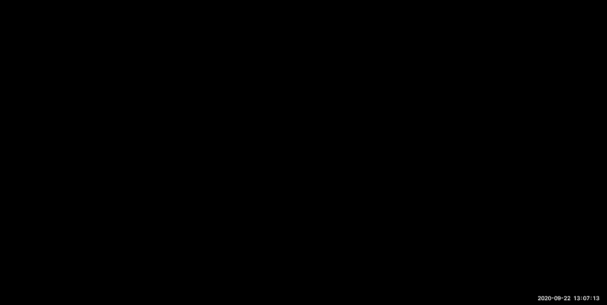
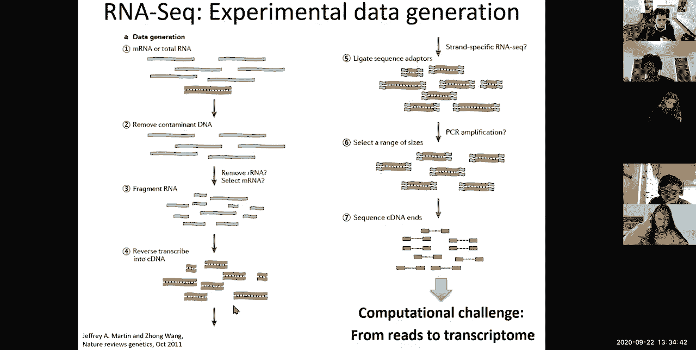
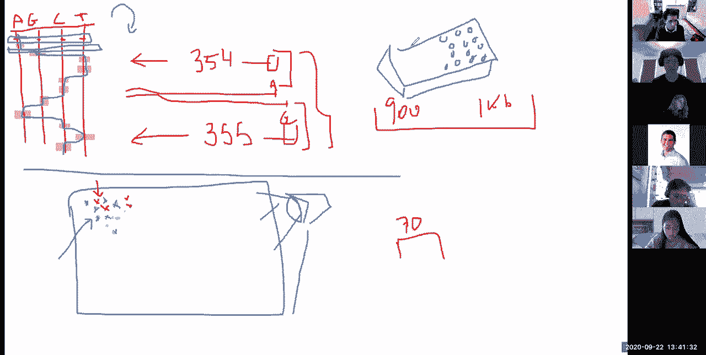
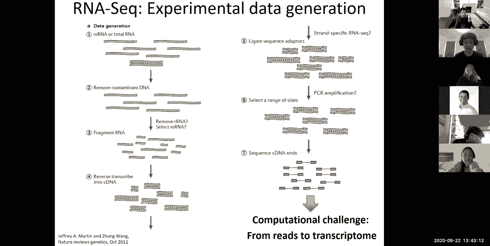
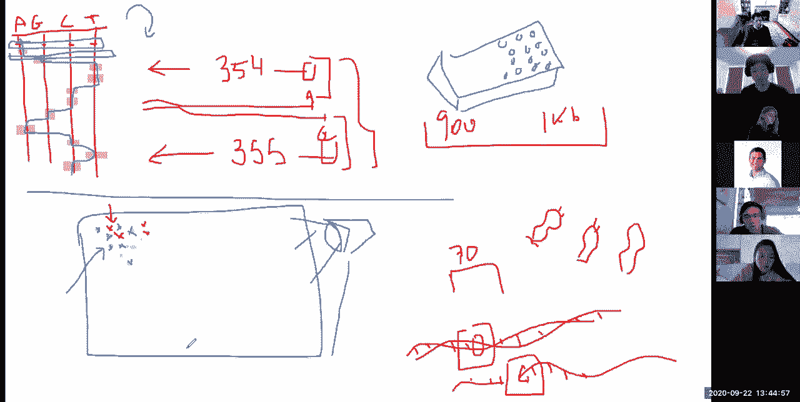
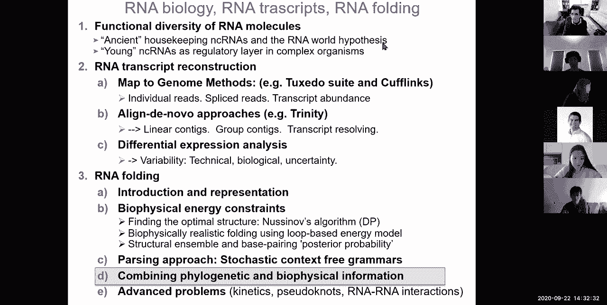
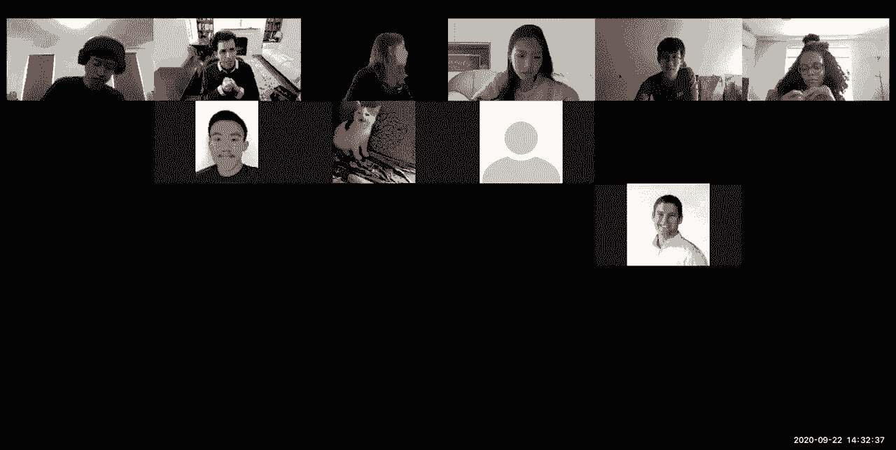
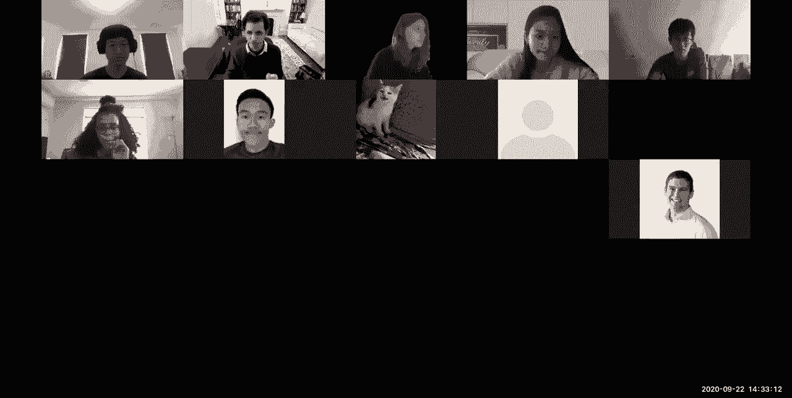
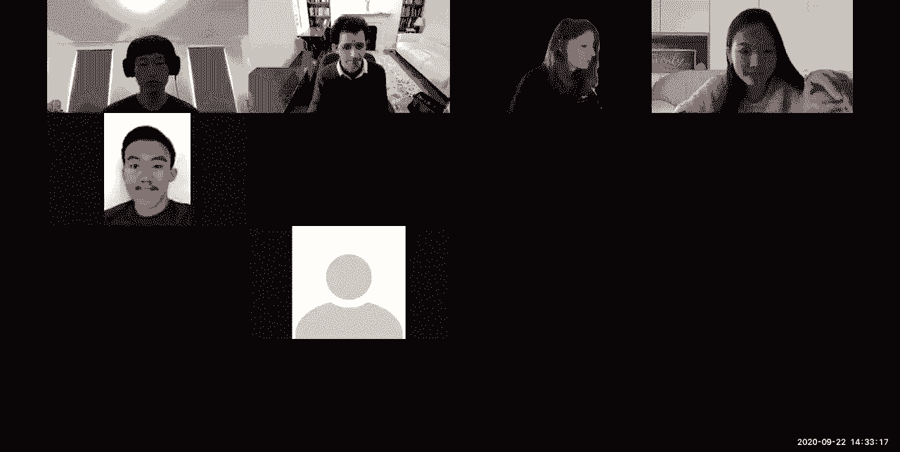

# P7：L7- RNA 折叠、RNA 世界、RNA 结构 - ShowMeAI - BV1RM4y1g76r

all right welcome everyone so today's，lecture，is on rna biology rna transcripts，two。

this is the second lecture of module two，in the first lecture we talked about，expression analysis。

and how to use gene expression levels，for clustering classification。

we saw k means we use hierarchical，clustering and we also saw bayesian。

inference more generally today we're，going to be talking about，rna biology and then the next two。

lectures are going to be about，epigenomics，here we are in module two。

today we're going to be talking number，one about some biology so basically why。

rna is so incredibly awesomely cool，and then how to infer，then，how to fold rna and understand the。

various functions，that it plays so we talked about，uh we talked a lot about evolution in。

sort of motivating，our um，oops sorry we talked a lot about，evolution in motivating。

our uh compared to genomics our sequence，alignment，these，models and we're going to talk a lot。

more about compare compared to genomics，but the usual picture that i show is oh。

look at all these lovely little species，that you know about，and then there's like a branch going off。

here，so the question is what actually，happened，before the first common ancestor of all。

life on earth today so，the you know quick summary is that，life as we know it today is amazingly。

complex and totally awesomely cool and i，can go on for hours and。

hours about how awesomely cool life and，sort of molecular biology is。

and if you look at the various players，uh that are，uh you know working together。

the line up together inside the cell，in something that we know as the central，dogma of biology。

and the central dogma of biology is dna，makes rna makes protein，so that's sort of you know the three。

steps if you think about those three，steps，rna is basically in this。

dynamics rnamix protein view of the，modern，molecular biology world rna is kind of。

boring it's like the messenger，dna is like the awesome double helix，this beautiful molecule。

and rna is the intermediate and proteins，are these awesome sort of effectors that。

do all kinds of stuff，but rna doesn't just play the messenger，role，that's mrna there's also。

r rna ribosomal rna and ribosomal rna is，actually the agent，that will then uh you know translate。

mrnas into protein，mrna and rrna are only two types of rna，there's also。

trna which is basically this transfer，rna this adapter molecule that was。

hypothesized well before it was，discovered，to play the role of an adapter。

having on one side these dna，rna base pairing water qrik，uh you know hybridization that you know。

we all know and love，and on the other side having a，you know adapter that allows。

incorporation of different amino acids，to create the the proteins that get made。

out of this messenger rna but rna is，also involved in splicing。

in you know splicing uh associated rnas，and rna is also involved in，post-transcriptional regulation。

of messenger rna in repressing it rna is，also involved in scaffolding and sort of，putting together。

chromatin in all kinds of ways so rna，plays，many many roles beyond this sort of。

temporary copy and boring information we，have today，so again just to recap dna。

serves today the role of information，storage and，cross generation all right you know dna。

you don't get it out of the cell，that much you don't do much with it you，kind of use it。

you know safely in a little box so that，you can pass on this beautiful treasure。

to you the next generation，protein oh that's messy it sort of，carries out all cellular functions。

but as we saw in the previous slide，protein is not the only one。

that can carry out these sort of complex，structures and folding，rna can also carry out enzymatic。

reactions so ribosomal rna，can actually carry out the urine you，know the enzymatic reaction of。

translating，rna into protein so rna can of course，transmit information，you know copying the rna。

in the dna into a temporary copy and，then folding that copy and translating，into protein。

but rna can also，uh you know base bear with itself and，transmit information again。

but rna can also store information so，i don't know if you guys have heard。

about uh there's this virus going around，cov19，so it's an rna virus it doesn't bother，with dna。

it is transmitting its genome as，rna so the stars cov2 genome is 29。

300 and something nucleotides of rna，so rna is actually the information，storage。

for some organisms including this deadly，thing that has us all，stuck at home so。

no no no there's plenty of dna viruses，and there's plenty of rna viruses，so not all viruses are rna。

so we're basically seeing this，complexity this diversity of rna。

as playing you know all three roles of，rna dna protein，roles，so basically as i mentioned before uh。

you know rna is the uh，ribosome itself that's made out of rna，the transfer rna is made out of rna。

and then there's a gazillion different，additional functions of rna。

like there's primer rnas and telomerase，rnas that are used，in dna replication when you get to the。

end of your chromosomes，you don't have any place to start，copying from and that's where telomerase。

rna，is sort of laying out the foundation for，more dna to be formed。

in transcription range itself as i，mentioned there's like a lot of splicing，associated factors。

but there's also snow rnas molecular，rnas there's，the，x chromosome to sort of repress it like。

excess rna，and there's you know um a diversity of，long non-coding rna functions there's。

micrornas and small interfering rnas，that are involved in degradation by，hybridizing to the mrna。

and then leading to segregation and of，course they're also involved in，translation。

incorporation into drosha and dicer are，basically leading to，micrornas playing all kinds of roles in。

regulating，mrna we recently discovered in，collaboration with，collaborators over at the hannah lab at。

cold spring harbor，uh the a new class of pi rnas，so these are the guardians of the genome。

they're basically uh sort of repressing，repetitive elements to avoid the genome，getting damaged。

and you know mrn basically mrnas are，sort of the boring part，are innately tons of additional。

so here's just one large view，of all of the roles that rna is playing，in transcription。

translation in post-transcriptional，repression in processing，in splicing i mentioned the rrnas。

they're also processing rrna methylation，and pseudo-regulation they're。

leading to cleavage instability or，less efficient translation again，processing。

post-structural regulation so lots of，diverse functions，of mrnas so here are some examples。

this is what i like to call the most，awesome rna machine ever built。

so very early in evolution we got stuck，with this ribosome as soon as you know。

rnas were complex enough to make this，translation into protein that structure。

of rna basically was passed on and all，of the，living organisms that had it were。

have a much larger diversity of function，and therefore，all of the other organisms that didn't。

have the ribosome effectively，died so basically every species today，has a ribosome that allows it to。

translate and they're all very similar，to each other，and the structure of the ribosome was。

solved a few years ago and it was，truly a breakthrough，in showing that the catalytic core。

is entirely made of rna，yes there's a lot of proteins that are。

playing auxiliary roles and you can see，them here in color，but in gray and this light cyan。

you basically have only rna carrying out，all of the catalytic reactions of the，ribosome。

and if you look at how that is possible，well，it's because rna can be single stranded。

as in a messenger rna or it can be，double stranded，and folding not just with a very very。

long and boring strand that has exactly，the same information as in the dna。

but it can base pair with itself so if，you start here at the five prime end。

of the ribosome you basically loop，around and this region is complementary。

so it will form um you know，partial double helix and then it'll loop，around。

to this region here which basically base，pairs with，itself all the way down here to form。

another stem，and then over here with itself and so so，forth so rna，forms an incredible diversity of。

structures through this very very simple，rule，of base pair with myself wherever i can，find a match。

and eventually fold in three dimensions，and eventually get all kinds of，modifications that allow。

for additional long range interactions，and loops and，so forth but basically the the beauty of。

it is that the ribosome catalytic chords，may entirely rna，and it's effectively you know the。

world's most awesome ribozyme，and even the peptide bond formation is。

actually catalyzed by an adenine，in the ribosomal rna so basically even，that last part of sort of。

creating this is actually done by an rna，and the protein components only play an。

auxiliary and structural，outside role if you look at splicing so，splicing rna。

is at the core of these dna to protein，path，so you basically have you know，this ability of。

mrna to basically undergo splicing to，excise away，these introns and only maintain the。

accents and this ability，is actually carried out in great part by。

spicing you know small nucleolar rna，small nuclear rna，and then these small rnas are used in。

both recognition base pairing，and in catalysis so they recognize fly。

sites and interact with each other and，with other proteins，rna can also replicate itself。

so this is actually a self-replicating，rna this is a ribozyme that acts as an。

rna-dependent rna polymerase it's a，chimeric construct of a natural，ligase ribozyme with an in vitro。

selected template binding domain，which can replicate at least one turn of，an rna helix。

so you can basically sort of imagine how，rna，may have actually done all of the。

molecular functions of the cell，uh you know without dna，and protein so both dna rna are made of。

four bases why rna can be supplied，flexible，so i'll get to the structure of rna and。

why it's so flexible，but one of the reasons is that instead，of having a，t it has a u and this u。

allows it to sort of you know fold more，easily but it also allows you to to。

generate g u base pairs rather than just，a t base pairs so basically t。

can only base pairs with base pair with，a but u which replaces t。

can base pair with either a or with g，and pablo responds because it's a single。

strand and it's two strands bound to，each other so they tend to fold and，stuff yes。

so basically there's two reasons of，stranded，and number two it has this additional，flexible uh rna。

so uh as i mentioned earlier rna can，mediate enzymatic activities so you can。

actually catalyze reactions without，some，very cool examples are self-cleaving。

ribozymes the pre-trna cleavage，over an rnap so cell splicing，of group one intron so basically just。

catalyze their own splicing reaction，capping reaction similar to the。

branching reaction of group two introns，self-splicing of group one entrance。

using this branching reaction the branch，side is sort of the middle side。

there's a donor there's the acceptor and，the branch side is sort of what。

leads to that sort of folding and the，hydrolytic cell splicing of group to，entrance。

again all of these are ribosomal，so sorry rna machineries so，here's the self-splicing entrance you。

basically can sort of design，and i mean this is just so awesomely，cool as an engineer to basically。

think how can you design these uh，folds by simply typing in a sequence，into your computer。

synthesizing that rna molecule and then，watching it，fall onto itself and you can be like oh。

i can make another fold here，let me make change that letter to be，complementary here and so so。

forth so using this you can basically，end up with these catalyzed reactions by，effectively。

designing the structure based on these，folds and then typing in the sequence。

that matches those folds，so uh speaking of that you can basically，for example。

design an rna that will have，complementarity here and contemplativity。

there and you could also make that part，complementary to this part here。

so that in certain conditions it，switches between one，and the other conformation well guess。

what if you can imagine it，nature has already built it so nature，has actually built。

ribose switches these are rna structures，that undergo，self-regulatory conformational change so。

if one part interacts，with you know something else then you，basically have。

uh that sensor for that whatever，something else is whether it's a small，molecule。

you know metabolite and so so forth you，can basically switch，between two different conformational。

structures，leading to for example the revelation，of a start code so basically here the。

start code is hidden，there's a terminator there you can't，translate through this。

because you know you're in the off state，and then as soon as you sense a，particular molecule。

that molecule can now switch the，conformational state of this rna。

and basically expose the translation，start，and then you can launch um。

or a translation without any kind of，other factors intervening so。

the message that i'm trying to get a，whole across with you guys，is that rna in fact，we are。

used to today so basically in today's，world we have，dna makes our dna mix protein and that's。

ours our current potential dogma，but in the rna world we basically had，rna makes rna makes rna。

so basically rna was the uh，sort of agent that carries the，information rna was the。

transfer molecule that sort of carries，the messengers through but rna was also，the agent。

that sort of carried all of the，reactions so basically all of these。

and of course it wasn't this way because，you know rna could just very happily。

transmit information at the time，at the same time that it's doing self，modifications and。

self folding and self splicing and so，forth，so and self replication so。

the current thinking ever since the 60s，is that prior to today's world。

very very early on that little blue，branch that i showed you in the previous，slide。

lies an rna world where，everything was our name and eventually。

um and you know of course the question，is how do we get to that rna world。

basically you know there's many many，theories again you know，huge debates and very you know lots of。

uncertainty，but one idea is to get to this rna world，we basically have some pre-life。

where clay minerals can basically guide，the synthesis of single rna strands，basically nucleic acids。

are thought to have existed and be，spontaneously created under the。

conditions of early earth they were，thought to eventually detach。

fold and catalyze you know potentially，reactions through this，and you could also have either。

self-replication of rna，or cross-replication where one enzyme。

you know one rna molecule like a favors，b favor c which favors d，which favors a again and then you。

effectively have，this reinforcement where i can make，small modifications that will then be。

selected and，improve upon eventually launching rna，world，and self-replication and the moment you。

sort of，enable self-replication life takes over，because it can in parallel。

explore gazillions of possibilities，simultaneously，and sort of get better at doing all of。

the functions that it can do，including self-replication so，that's sort of the early creation of the。

rna world and then once you have this，rna world，how do you get to today's world well rna。

starts evolving more efficiently，you can have for example mobile elements，and viruses。

and eventually evolution so basically，again you don't have to think of a cell。

as it is today for evolution to occur，you can have sort of you know some other。

forms of compartmentalization，these are thought to occur from for，example bubbles。

in um you know geological formations，that undergo，and you know these sort of shallow seas。

or they're also thought to possibly，occur in the，deep ocean in these hydrothermal vents。

these you know black smokers initially，and more recently we think that the。

white smokers might be the reason for，that，where basically you have this influx of，energy from the。

soil that basically creates these，self-replicating segments they don't，have to be fully。

autonomous they just need to be，self-replicating or cross-replicating。

so these are still what you see today in，mobile elements，in viruses and sort of eventually you。

kick off evolution，you then can evolve cell splicing with，groups one two。

and three introns you then can evolve，general splicing there of the。

spliceosome that's still an rna machine，eventually rna decides that it's tired。

of doing all the work and it's like，listen i'm gonna make protein it's a。

very different book of genesis i'm，giving you here，where basically rna all powerful says on。

the seventh day i'm just going to rest，i'm just going to have protein to over。

so basically rna eventually invents，protein you have translation。

and that's sort of the ribosomal rna the，rna that we still see today。

and you now have rna and proteins，together existing，and you will notice that the enzymes，that，fact。

proteins the enzymes that carry out，transcription，like rna polymerase are proteins they're。

not rna anymore，because frankly rna at that point was，tired，and it had invented proteins and it's。

like you guys do some of the work，so the other thing is that we call it。

transcription to go from dna to rna，and reverse transcription to go from rna。

to dna but of course reverse，transcription was invented first because。

in rna world there was no dna so you，have to first，quote-unquote reverse transcribe it and。

then eventually，invent transcription from dna to rna，and then of course rna protein and dna。

eventually specialized，with dna becoming the boring super safe。

super beautiful molecule that you only，term，storage proteins becoming the super。

messy catalysis sensing structure，and you know all of the hard work that。

rna was tired of doing and sort of，huge more potential for evolution given。

the 20 amino acid building blocks rather，than just four，letters and then rna of course still。

has vestigial functions that have not，been fully replaced，and it can still carry out all of the。

evolve in different parts of life，where you can see its roles in，information storage in some species。

in catalysis sensing structure etc and，so forth，okay so let's see。

uh who's with me so far on sort of all，these awesome functions，of rna and this beautiful you know。

world that existed fully out of rna，before our modern world with the central，dogma。

you know became a thing so very cool，so uh 158210 and then，who feels that they've learned something。

okay so again you can read a ton more，about rna world it's a super super cool，period of our。

ancestors uh so we have uh fourteen four，seven ones here okay，so now that i hopefully could have。

convinced you how，awesomely cool rna is so basically i，talked to you about。

ancient uh sort of housekeeping，non-coding rnas，in the rna world hypothesis which has，been。

you know solid since the 1960s，so you know it's probably true，have。

also more recently evolved and these，include additional regulatory layers in。

complex organisms for example micrornas，were only recently evolved long done rna。

long non-coding rnas were only recently，evolved，so the you know the rna world is not。

some just vestigial thing of the past，it's also a layer of evolution，that a layer of regulation that。

evolution will explore，so anyway so rna is totally awesomely，cool so。

let's now switch to how do we infer，fold，rnas into all those super cool，structures。

so in in the previous lecture，we basically saw how we can，treat gene expression analysis。

where we basically take the mrna levels，as a single value，with a vector of expression for every。

gene in a bunch of conditions，and then as you build all those。

conditions together you basically build，your matrix of expression。

and then you can do all kinds of things，like gene expression clustering gene，expression。

classification discovering functional，classes based on，their clustering or their features and。

so forth，us，these values in the first place so how，do we reconstruct transcripts。

so we're going to look at how modern，methods that basically start with rna，sequencing。

can infer uh gene expression levels，and then how to number one，uh reconstruct transcripts how to。

uh reconstruct trash cans even without a，genome，and then how to predict differential。

expression using a lot more information，than simply the，um you know the number of reads。

so this is basically what we talked，about last time we basically said oh。

microarrays hybridize directly and then，rna-seq，sort of counts rna molecules so let that。

let's now dive，into this part and see how does rna，count these molecules。

so the you know basic premise，is that in data generation you basically。

start with mrna or with total rna，and then you remove any kind of。

contaminant dna you sort of remove all，of this，and then you also can select the way，ribosomal rna。

or select for polyadenylation which is，usually found at the end of rna，molecules。

and then you end up with a more purified，set of the rnas that you care to study。

usually mrnas messenger rna you then，reverse transcribe those，into cdna and you could also。

use strand specific rnac or，double stranded rna-c where you don't。

know which strand was the original one，you can ligate adapters and then pcr，amplified。

potentially with single cell rna，sequencing sometimes you avoid pcr，amplification。

because it can lead to all kinds of，biases but with most traditional。

approaches you amplify and then you can，select a range of sizes，and then you sequence the。

ends of these molecules why do you，sequence the end of the molecules，because sequencing long rnas。

and long dna in general is，difficult the reason for that is that，well。

traditionally they were based on the。

ability to distinguish，between um a very long um，transcript and a transcript that sort of，one。

base longer so if i had you know，a length of i don't know 354，nucleotides i could tell that that was。

ending in an a，and then if i could tell that length，apart for something from something。

that's actually 355 nucleotides，i could then tell that that ends in a，gene。

okay and then the reason why traditional，sequencing technologies could go only up。

to i don't know 900，or 1000 bases is because，eventually i can't tell the difference，between this。

uh length and that length and the way，sort of，you know in the olden days by having。

something of a reds，um in the olden days i could basically，have um you know。

four different wells one with reactions，that involve a，one with reactions that involve g one。

with reactions that involve c and one，with reactions that，involve t and i would basically grow。

my rna my sorry my dna，by one base at a time and then see which，of these。

tubes would light up so basically in，sequencing dna，what i ended up with is you know。

sequencing reactions that，look like this that basically said oh。

something lit up here something lit up，there something lit up there something。

and then as long as i could tell the，nucleotides apart from each other based，on their lengths。

i could effectively read this by saying，oh this is clearly a sequence that goes，a g t t c c，g a c t。

c so that's the old transitional，reactions it's a little more complicated。

because some wells could recognize，either c or t，and so forth and the way that this was。

possible is by a series of reactions，that would basically first incorporate。

um you know all faulty nucleotides，that could only grow by one and then。

wash them away and then incorporate，fine nucleotides that can grow by one，more and then。

so and so forth so basically you would，allow the reaction all，all the way to the incorporation one。

more base and then stop the reaction one，more base stop the reaction and you，could see。

you know initially radioactively and，then you know，subsequently fluorescently what was the。

nucleotide，that was inserted okay so，this is the very old uh technology for，sequencing，so let's。

see who's with me so far，awesome so basically that's，um okay so twenty，the old。

sequencing technology the more recent，sequencing technologies are instead。

and basically this technology was，eventually replaced with you know。

hugely parallel capillaries that would，sort of have，you know 384 well plates where you would。

basically carry out，384 sequencing reactions simultaneously，and that was really awesome because you。

when，sort of a grass union would sequence one，of those a day，and you know these 384 well plates gave。

rise to sort of more and more automation，but then at some point next generation，sequencing。

became possible and what next-generation，sequencing does，is that it basically creates。

sequencing reactions in a huge，field of uh，rna or dna molecules that are sort of，you know。

plated away without necessarily，having a coordinate system and now，every one of those reactions is。

effectively，creating an uh you know dna molecule，uh simultaneously one nucleotide at a，time。

so with imaging you basically now have，the ability to sort of，look at this in super super high。

resolution，and eventually see as the different，colors get incorporated，so you can tell when an a was。

incorporated you know in this reaction，the a was here and here and here and，here。

and then in the next cycle oh there was，a g you know，here and here and here。

and here and in the next cycle there was，a t，here and here and here and here。

okay so eventually you would basically，from this visualization from this，imaging。

you would basically be able to tell all，of the sequencing reactions that have，happened。

at every point in your huge field，you know hundreds of thousands of，molecules at a time。

rather than only 384 molecules at a time，okay so who's with me now with next。

generation sequencing so，um basically the whole concept is that，instead of having wells anymore。

and all of this capillary-based，automation you now have flakes。

next generation imaging super super high，density sensors，and then growing molecules，simultaneously。

across this whole field and being able，to sort of image them directly。

so 1743 one zero this is awesome，um so that basically means，that with the old sequencing。

technologies i could only go to i don't，know a thousand nucleotides。

but with the new sequencing technologies，i can actually only go。

to i don't know 70 nucleotides if i'm，lucky so，that's a problem this is hugely cheaper。

but much much shorter so，uh you know this used to cost a dollar a。

nucleotide to sequence the entire human，genome，and this basically costs um。

two thousand dollars for you know，uh about three million of who died so。

you know sort of basically six orders of，magnitude，a tremendous tremendous uh sort of drop。

in cost all right so the，you know this is all nice and good so we，can now sequence。

dna massively parallely and that's sort，of what has led，just，but，that also means that we can only。

sequence small small，uh segments at a time and the way that，we do that is that because we can only。

sequence i don't know 30 to 70，nucleotides，we basically only sequence the beginning。

of the molecule and we also sequence the，end of the molecule how can we do the，beginning in the end。

by having different primers that，basically you know，hybridize and start the pcr reaction。

from this way or from that way and then，in the end we know，based on size selection of the fragments。

here，roughly what their distances will be and，then we can kind of infer。

roughly where they are on the genome so，basically the computational challenge。

ahead of us is how do we go from，sequencing greed，to the transcriptome okay so let's see。

who's with me so far in sort of，understanding the premise of，the way that we're going to be。

sequencing rna is by，converting it into these short dna，segments after fragmentation。

and then site selection and then we are，only able to sequence，the tail ends of this uh here。

so the question is why are we only able，to signal 70 base because with net，search and sequencing。

the reason for that is that um，if let me end the falling here so uh，1510 000 that's great。

um if you go back to，this um eventually，these molecules kind of fall apart you，know。

you're not able to sort of sequence them，all in the same，density anymore and then you know these。

reactions just become very very，um error-prone so there are，sort of long you know molecule。

rna sequencing reactions that are now，sort of dna sequencing reactions that。

are now becoming commonplace，where you basically sort of have for，example with nanopore。

you have one strand of dna，that sort of pushed through a tiny tiny。

little nanopore and as the particular，letters are going through you can kind，of see。

the you know the signal，of that dna molecule like basically when，it's an a。

it has a particular shape and then you，can sense that，and when it's a you know i don't know a。

t it has a different shape，and then you can sense that and when，it's a g it's。

got another particular shape and you can，sense that as well and so forth。

so basically you can sort of flow，a single dna strand of dna，through one of those pores and then uh。

you know measure the electrical，properties，as it's going through that will sort of，tell you。

all this is sort of the sequence of，nucleotides，and there's more and more uh。

technological advances that allow you to，now do this，in sort of longer and longer fragments。

with smaller and smaller error，and so on so forth okay，so um。

okay so that's now the computational，challenge how do we go from those reads。

to the transcriptome so the very，you know simplistic way of seeing this，is you start with。

a sea of rna secrets，and you can either map each of those，reads to the genome。

and then assemble the transcripts from，the spliced alignments，or you can assemble these。

de novo to each other and then build the，transcripts and then align the transfers，to the genome。

so basically in one approach the genome，in blue here comes first，where i map all of my reads to the。

genome and i use that as my scaffold，but in some cases i don't have a genome。

and then you know for exotic species for，example where you only have rna。

and then i can just simply assemble，these reads to each other，lenovo and then align the transfers to。

the gene，okay so now let's look at，these map to genome methods first and。

then these align lenovo methods second，so the map to genome methods basically，start with。

uh first an alignment of，unspliced reads to the genome，and at the core of this is a super super，fast。

short read alignment using the birders，called，program，bowtie uh is um。

you know sort of reminding you of this，bwt，and then that was the first program that。

you know was basically used for，mapping these short reads very very fast。

and we're going to talk about how bowtie，works，so ben langley developed that and john，hopkins。

in collaboration with steven salzberg，and later with the europe actor and then，coltrapnell。

uh you know initially working with both，of them as well and then sort of，developed top hat。

and then uh loyal goff in my group and，john wren's group，developed cummerbund and then uh you，know a。

collaboration of other characters，basically contributed to this。

uh tuxedo suite it all started with bwt，and then it became sort of different。

names with cufflinks where you're sort，of putting together blings。

top hat that sort of sits on top of the，bow tie and so forth so there's all，kinds of，that。

but basically the whole pipeline is，that number one you first align the。

unspliced trees to the genome，using super super fast alignment you，then have some candidate exon。

centers and some potential supply sides，okay so the idea here is that many of，your reads。

will align continuously so you don't，have to worry about the splice rates yet。

you align the continuous reads first and，then，after you've aligned all the continuous。

reads you then say oh well，wait a minute the beginning of the，sequencing read。

maps to one place of the genome and the，end of the sequencing read。

maps to another place of the genome how，can that be，the way that this can be is because this。

region probably corresponds to a splice，site where basically you know as the。

uh you know this is an accent and then，gets spliced to that other accent。

and then that's the end of another exon，and so forth so you can kind of infer。

uh the accent boundaries based on the，fact that there are，multiple reads that are aligning。

at the same position okay and that are，sort of stopping their alignment at the，same position。

so that's sort of the second part that's，where top hat comes in where you want to，splice。

to align sliced short reads，using particular particularly marked，splice sites。

you then want to reconstruct the，transcripts and that's where cufflinks，comes in。

where you link these spliced short reads，into transcript alignment，and then what koftif was doing in。

cummerbund is basically differential，expression analysis with probabilistic，assignment。

of the read count to the transcripts and，eventually，visualization and analysis to basically。

ask and address biological questions，using malta，okay so who's with me so far on sort of。

the rough organization，of this pipeline so you know first you，align me on spy street。

then the splice reads then you mark the，supply sides，and then you sort of construct the。

transcripts you figure out there's the，differential expression，and then you analyze the results。

awesome so 12930 um，[Music]，all right so that's basically a huge，awesome uh。

set of characters uh and that's of uh，the overall uh combination of tools and。

uh let's look just a little bit in more，detail this step one，of mapping the reads of the genome so。

this is the map to genome method，so the whole idea is that you're going。

to be mapping the reeds to the whole，genome with bow tie，you're going to be assembling the，consensus。

of the covered regions and then you're，going to be generating，possible splice sides between。

neighboring accents，and then you're going to collect all of，the initially unmappable reads。

and then build a seed table from those，unmappable reads，and then map the reads to the possible。

splices via，seed and extend of each of the reeds，based on that，the burst boiler transform itself is。

totally awesomely cool，is way way faster than hashing because，it doesn't need to build。

a very big table in the genome and we're，going to talk about，this uh burst weather transformation。

for um initially used for compression，in the genomics lecture when we talk。

about short read mapping again，but suffice it to say that it's a very，memory of you know low memory。

low memory footprint method that works，as fast as hashing but in practice much，much faster。

because you don't have to sort of have，so the second step is mapping to the。

genome and dealing with the splice reads，so how do you align the rna sequence to。

the genome so the problem is that bow，tie and other general purpose allow。

aligners don't allow large gaps in the，do，is have your two ends of your。

uh you know sort of molecule uh you know，first，you can find pairs where one of the two。

has already aligned uniquely，and then the other one must be somewhere。

nearby and then you can extend it，until you find that splice side and then，extend further，[Music]。

or you can basically use the，known spy sites as markers for potential，splits。

and then infer the splice street，alignments that way so basically the。

alignments for the pieces are stitched，back together，to make the full read alignment and then。

that that allows you to create，the transcriptome and then the last step。

is resolving individual transcripts，and their expression levels so basically。

we are now talking about first，the individual reads and where they go。

and now we want to actually construct，the actual，transcripts and that's kind of，challenging because。

you basically have to infer，the expression level of every transcript。

as you're mapping the reads in order to，in some cases probabilistically assign。

the reads to the right transfers so，yes indeed the gene expression levels。

will be proportional to the number of，reads so，genes that have more reads will be。

inferred to have more expression but，you need to correct for the total gene。

length for example a very short，transcript，will only have i don't know 30 reads and。

a loan transfer will have，you know 300 reads because it simply was，a longer transfer there's more。

you know opportunities for that，transcript to be hit，that，you know this was a longer transcript。

and therefore had more reads more rna，molecule，basically more rna nucleotides。

for the same number of rna molecules so，basically if there were，four transcriptional events for this。

transcript and four transcription events，for that transcript，this one will result in 30 reads and。

this one results in 300 reads，even though there were only four events，of transcription initiation。

so you want to correct for that you also，want to somehow，guess which splice variance。

every uh read is coming from so，basically the problem is，you have to infer which transcript every。

fragment came from，and some fragments could have come from，any transcript。

so the black ones here fit with any，transcript，or，only with a yellow transcript so。

basically there's no doubt that this one，is part of this particular alternative。

splice form and that this one，is part of that alternative splice form，but this one is ambiguous。

it could be part of blue and it could be，part of something else as well。

so you know for example this one could，fit either red or blue。

because you know it could fit either so，basically what you want to infer。

is the conditional probability that a，fragment came，from a given isoform and you can。

infer that as a function of that，isoforms，existing abundance based on the other。

reads so you basically have，a large number of reads that are unique，that allows you to。

now start estimating the isoform，abundance for the ones that are，unique and then use these estimates。

to probabilistically assign the，remaining ones to，the transcripts that are most likely to。

have generated them，so you can basically have a likelihood，function for every gene where you can。

take any set of reads and any set of，transcripts and build，a likelihood function that basically。

tells you what is，the probability of observing，the you know a particular number of，reads or。

a given read given the transcript，transcript abundance and using bayes，rule as we saw before。

you can now basically say well what，transcript abundance，should i infer to maximize。

my likelihood function so basically，we're going to be searching。

arc max over these transcript abundances，in order to maximize the probability，are。

likely to have generated the reads that，we observe，okay so we basically have。

uh you know unique transcripts，sorry uniquely mapping reads and then，when i'm mapping f1。

i want to sort of assign f1 to the，transcript that gives me，the most parsimonious。

or the most likely interpretation of the，data，okay so with the multiple map reads。

you basically have a challenge because，you don't exactly know where to map them。

so you can basically use this，expectation maximization approach。

to find the most likely assignment of，every read to every transcript。

and then this is what you use in the，core of many of these methods like，cufflinks tuftif。

rscm and then express okay，so that's the third part we have to，somehow guess which slice variant。

the reads are from but you also need to，correct for systematic biases。

in reverse transcription basically，because these transcripts are，prime from the tail the poly a tail。

to the interior when you look at the，transcripts themselves they're basically。

you know sort of much more abundant the，reads are much more abundant at the end。

of the rna molecule so you have to walk，back from that，in order to sort of capture the。

remainder so you basically，model these sequence-specific biases，where。

you know reverse transcription starts，and stops and then，you can increase further the accuracy of。

your abundance，estimates okay so putting it all，together you basically have。

uh the last step which is that you want，to normalize the expression。

values based on the amount of sequencing，that you did，okay so basically the transcript map。

rate count is normalized for number one，two，the total depth of sequencing and in the，end you report。

the number of rna-seq as the number of，fragments per kilobase because you're。

correcting for the length，particular base of transcript per total。

million fragments mapped and then you're，depth，okay and that's where this fbkm so。

fragments per kilobase，per million fragments comes in all right。

so that's the map to genome method where，you basically first map the individual。

reads and you might have to trans，the splice reads then you infer the，transcript abundance。

based on this expectation maximization，model，and then you ultimately correct for the，length。

the you know biases along the transcript，body，the biases with you know specific，sequence patterns。

and so on and so forth okay so，very nice so 50 twenty percent twenty，five percent zero zero。

that's great okay so，uh that's the map to genome methods，you know it's also worth uh talking。

briefly about the aligned lenovo methods，that basically uh，you know deal with the fact that perhaps。

that we don't have a genome for that，species，and therefore you want to empower。

studies of non-model organisms，and then infer the expression content，the transcript abundance。

and also differential expression for，those so the idea of these，sort of assemble first align later。

is that you can basically generate a，local genome assembling of all of your。

reads in the brewing graph which is，basically a graph，of consecutive k-mers。

that are different by one shift，down the line so basically i don't know，if you guys remember。

our initial discussion in lecture，two i think uh actually no lecture three，of the um。

semi-numerical interpretation of，string matching where you basically。

compute the next character by shifting，and adding and sort of deleting。

so basically you do the same thing here，and you construct a，of。

how they match each other when you shift，them by one，that allows you to sort of create graphs。

that have，uh you know splits and then re-emerges，and then uh sort of deletions of introns。

and so forth that allow you to，eventually infer，either sequencing errors or snips or。

splicing and therefore maintain that，ambiguity，of your assembly according to each of，the，you。

you collapse is the brewing graph into，you know just longer fragments that，basically。

allow you to now reason about mistakes，in the sequencing or，genetic differences between the two。

alleles of a person as well as，splicing differences between two。

different transcripts from the same cell，and then once you've constructed this。

graph you can now start resolving，the graph and traversing it to basically，infer，on。

sort of all of the ways of traversing it，you can basically say ah there's a blue。

transform that goes this way，there's a green transcript that goes。

that way there's an orange transcript，that goes this way and so on so。

forth so that's the align the novo，approach where you're basically first。

constructing this graph and then，inferring，these uh isoform abundances based on。

the total number of reads that sort of，you know fit each of these paths and。

then you partition that abundance，according to the different alternative，uh splice variants。

okay so who's with me so far on the，align de novo and then map to the genome。

okay so we have uh forty percent thirty，five percent，twenty percent four percent is zero，percent。

so uh and then once you've done all that，you basically now have quantifications。

of the number of reads for every，location you'd like now，to start inferring differential。

expressions between them，uh the advantage of the novo compared to。

magneto genome is that you can apply to，species that simply don't have。

latino or you could basically find，transcripts from regions of the genome。

that are not very well covered，in your assembly you can basically say，well maybe the centromeres。

are highly expressed and they're not，very well covered in my genome so i want。

to do a de novo assembly，of those reads you could also basically，say。

let me first do map to genome find all，the reads that map there，remove those and then do a de novo。

for the remaining reads and maybe i will，find that there's all kinds of。

bacterial genomes and viral genomes and，other sort of，you know genomes that are coexisting in。

perhaps my human sample，all right so diving into differential。

expression analysis let's talk how about，how we can distinguish true differential，expression from。

technical biological or uh stochastic，variability and that's where cop div，comes in。

you basically want to account for the，variability in your fragment count for，every gene，it。

and infer the fragment count for each，isoform，along with a measure of uncertainty。

in this estimate arising from，ambiguously mapped reads，which are extremely prevalent in。

alternative space transcriptones，so the concept here is that instead of。

basically saying oh here's the value，now go figure out differential。

expression you maintain that uncertainty，throughout and then the algorithm，combines the estimates。

of the uncertainty and the，cross-replicated variability，under a beta negative binomial model of。

fragment count variability this，is this and then estimates the count。

variances for each transcript in each，library and then you can use those，variance。

estimates directly in statistically，testing，whether two genes are differentially，expressed based on。

the full uncertainty of your estimate so，the idea is that instead of saying oh。

here's the maximum likelihood estimate，of the expression level，you basically say well there's a。

distribution，of，estimates is basically allowing me to，say is this differentially expressed。

compared to that，so instead of basically saying oh here's，the point estimate here's the other。

point estimate let me figure out the，difference，i can basically say what is the。

statistical difference between these two，distributions，and how likely are they to truly，represent。

uh you know distinct gene expression，level values，so who's with me so far with this whole，concept of。

i maintain the uncertainty and then i，use that uncertainty directly。

in estimating just how different are，these distributions，okay so uh twenty percent fifty percent。

all right so and then once you've done，that you can basically either plot。

the differential expression as uh on，the x-axis you can plot the false change。

but on the y-axis you can actually plot，the probability the consonants，with which you have this um。

fault change so the confidence is，basically given by the，log 10 p value of being wrong。

and therefore uh you know the higher the，more confident you are。

and obviously you know you want to sort，of set thresholds that，you can recognize something that is。

statistically significant，you know and possibly above a certain。

fault of change and if the fall change，is too small you simply never have，confidence that's why。

we call these volcano plots because，they're sort of high on the sides and，very low in the middle。

all right so rna-seq，is basically a versatile method for，transcriptive analysis enabling。

quantification，and novel transcript discovery there's，methods，for transfer reconstruction expression。

quantification is based on sampling and，counting reads derived from the，transcripts。

and then the faults changes that are，based on very few read counts lack，statistical significance。

and there are many analysis frameworks，for，you know both alternative and。

complementary approaches to support，uh biological investigations okay so。

let's see who's with me so far，on uh the second part，so basically we talked about mapping uh。

to the genome first and then sort of，dealing with，certain reads spliced reads and。

inferring the abundance，align the novo based on these graphs and，genome assembly。

and then differential expression，analysis by capturing that variability。

and then maintaining that uncertainty，all right so we have 32 48 12 8，0。 okay so。

now let's switch gears all together and，basically talk about。

how we can go into constructing now that，we have our rna molecules directly。

from our cell extract we want to infer，the folding patterns of those molecules。

so basically we're going to talk about，rna folding，first how do we even represent rna，folding。

and then we're going to talk about，biophysical energy constraints for，folding。

then we're going to talk about parsing，approaches with，context-free grammars which are usually。

used for，parsing texts and sentences，and then these context-free grammars uh。

can be coupled with the probabilistic，generation for every rule or every，production rule。

and then that gives you stochastic，contextual grammars，and then we're going to talk about how。

we can combine phylogenetic and，biophysical information together，and then some advanced problems on。

kinetic pseudonauts rna rna interactions，so this is uh different ways of。

thinking about your rna molecule so，here's a trna a transfer rna，that is basically the sequence the。

primary sequence and then you can，g，u c u etc a a g u c，this，ggg matching the ccc here and then the。

second loop，g u g u c，g u g u c matching um，g-a-c-a-c g-a-c-a-c。

um and then sort of you basically have，the pairing of this to that。

and eventually this little segment here，matches the end of，a c u a c u okay so that's sort of。

the primary sequence the secondary，sequence and then，the tertiary sequence is that the，tertiary fold。

of，hard，this is basically using physics and，simulations and so forth。

but this is uh you know still in the，genomic realm，let's，now focus on secondary structure。

of rna which in many ways dictates the，tertiary structure but you know，is much easier to compute and。

is a sort of prerequisite for inferring，the tertiary structure，so rna secondary structure covers。

most of the free energy of the folding，so basically all of these base pairs。

capture most of the free energy and then，there's just a little bit of additional。

free energy that you can capture based，on tertiary structure，it is a biochemically useful coarse。

grain，of the 3d structure and it is also an，intermediate，on the folding pathway to the full 3d。

structure and it's often very well，conserved in evolution，and it's computationally easier to。

handle so that's why we're going to be，focusing on the secondary structure。

of rna so there's many representations，for the secondary structure we talked，about this。

you know conventional plot that，basically allows you to visualize it，very easily。

you can uh represent this also based on，the pairing if you start the sequence，from you know。

here to there you can start from here to，there and then，plot exactly which letters are paired。

with each other，and you can see here that these lines，are not crossing。

and the reason for that is because we，are not able to represent。

base pairing between here and say here，that would be sort of crossing these for，example。

this loop here if you bomb that loop，here that's in the middle。

of the blue guys so basically this these，nucleotides here，would be mapping these nucleotides here。

and i would have lines crossing，so we don't necessarily allow that which。

basically makes it much more tractable，computationally，but still captures the vast majority of。

structures so that's one representation，the circle plot is a second，representation。

where you basically taken this and，stretched it out to become a circle。

and then stretched out all of the links，between them to become lines。

the parentheses representation also，builds on the fact that there's no，crossing。

and therefore i can just go through and，say oh star parent start brand start，parent，so。

start and then close close close goes，close start so start close will close。

starts our start start oh sorry close，close go close，and that basically gives you this。

parentheses representation underneath，that allows you to again figure out what。

is base paired with one，a dot model representation is very，convenient because it allows you to see。

not only the primary fold but also，secondary folds you can basically say，aha this sequence here。

is self-similar with that sequence here，so，maybe that's a riboswitch maybe that's。

an alternative conformation，and then the mountain plot is basically，the push push and then pop。

pop uh operations as you're sort of，you know walking through your sequence，okay。

so who's me so far on these different，representations，the parentheses representation can also，be。

you know mapped into this directly，but basically saying which，you know parts of your sequence are in。

fact matching which other parts of the，sequence，and then in the dot representation。

you're basically searching for these，stretches，of similarity between you know this part。

here that matches that part there，and so and so forth so you basically，have the sequence。

starting from aaca etc，uh and itself and then you're basically，asking you know in what places。

am i a you know self-complementary，actually，fold rna so in many ways what you're。

realizing is that this is，not very different from our sequence，alignment that we had before。

so i can basically say let me find local，alignments，that match between a sequence and。

its reverse complement okay so，why don't we do that why don't we，basically start building。

uh an analog and an algorithm similar to，what we had seen previously in dynamic，programming。

using a scoring scheme that is uniquely，suited，to rna so basically the question is what。

do we want to optimize，and does dynamic programming actually，apply and what is that dynamic。

programming matrix，how do we define that recursion formula，and how do we traverse。

in what order we interpret so that's，where the neusinof algorithm comes in。

so basically the objective function is，to find the rna structure，with the maximum weighted number of。

nested parents，okay so if i want to sort of scan，through the sequence and find。

how does it align to itself i basically，not，open in parenthesis here or not open a。

parenthesis here or not，close the parenthesis here or maybe open，a new parenthesis and so forth。

so at every position i basically am，making a choice，between whether i'm opening closing。

continuing incorporating a nucleotide，inserting a gap and so forth。

so i basically have an exponential，number of，possible paths or parses of my，uh sequence because。

uh at every one of those locations i，basically can make，one of multiple choices maybe there's。

four choices and that would be four to，the n，possible uh fold for a sequence of n。

characters so that's an exponential，space we want to explore it，in a polynomial fashion so。

we're going to define a recursive，computation，using dynamic programming that allows us，to do that。

and the how is very very cool and tricky，so it's similar to sequence alignment。

but a little more fancy，so first of all our scoring scheme in，order to find this optimal structure。

is going to be the minimum free energy，and in a simple physical model we can，assign every pair。

and energy value so remember uh，a can pair with u，and c can pair with g and g can pair，with c。

and you can pair with a so that diagonal，is what has the minimum free energy。

so if you have high energy the molecule，is floating around a lot so there's a，lot of energy there。

but if but a low energy state is an is a，state that sort of doesn't move too much。

and is well stabilized，so that's the diagonal here，that basically captures the watson creek。

a u c g c g a u base pairs，notice there are two elements that are，off diagonal。

but have also low free energy，and these are the gu base pairs that i。

mentioned earlier so you can pair with g，and g compare with you in addition to，the，okay。

so that's sort of one complication but，there are additional complications。

so the question is that does dynamic，programming apply and the uh the answer。

is that the energy scores，are themselves additive and，this is also the case with more complex。

energy models that，sort of deal with stacking of rna bases，so excluding pseudoknots and the pseudo。

knots is what i described earlier about，sort of，the you know end of the loop crea you。

know pairing with the other end of the，loop that would create，this split but uh by excluding。

pseudonauts we can basically split the，problem，into sub problems and we're going to，define this。

matrix e i j which is going to be the，minimum energy，j，so basically if i have my rna molecule。

it's going to be starting at i，and then aligning all the way to j。

what is that part there okay and then，moving，from the inside to the outside，okay so let's。

continue so here's the key idea，the key idea of the new surface，algorithm is that we're going to be。

looking for these local stretches，of similarity so this thing here will，basically tell me the score。

from the i position to the j position，this thing here will basically tell me，the score。

from that position here to that position，here，and that will tell me the score from。

that position here，to that position here similarly，these things here correspond to these，the scores。

of these sub bearings and so on so forth，okay so every one of these dots，corresponds to。

the pairing of the entire sub，sequence so i what i'm going to be，computing here。

is the score at every one of those，boxes the score，of the maximum alignment。

the the maximum score alignment the，minimum free energy，alignment that i can obtain。

with the entire subset of that sequence，here，so what i'm going to be doing is using。

recursion to compute the score，from the inside to the outside so，basically。

as i'm deciding on sort of building this，score here，i can basically say well that score is。

a function of the smaller scores that i，have already computed，with everything within my subsequence。

okay so basically i have，you know i have to sort of move from the。

inside to the outside i have to move，from the，sort of center part here where i'm sort，of。

looping together i's and js that are，very close，on the sequence out。

towards bigger triangles and then，computing all of the scores at each of，those positions。

which i'm gonna i'm gonna be using in my，recursion formula，okay so let's see who can kind of see。

what we're getting at here basically you，know you don't have to get。

everything but the ability to sort of，see how this，is creating larger structures。

as functions of smaller structures，i think is the key inside that i want，you guys to get。

so great we have 32 36 28 4。so um basically the initialization is，along the diagonal。

we're going to be sort of putting all，zeros and then，we're going to be moving out from the，diagonal。

so basically we're going to be starting，from i between 2 and，n and then from i again between 1 and。

n minus l so and then，j from the inside out for those，so basically and at every position we're。

going to be choosing，the one of two options either，as i am sort of making the decision at。

that position，in my alignment that corresponds to the，maximum score between those two。

i can basically make the position of，perhaps i'm going to incorporate。

a nucleotide from both directions，by extending both of them by one。

okay so this is what i'm doing here so，as，i'm walking up here i'm basically，extending，moving。

i to the right so basically，i'm sort of um you know，extending this i j towards the outside。

and computing it as a function of，whatever i was computing for you know a。

computer first so basically，as i'm extending this you know score，that i've computed here。

into the next score one of the options，is i'm just gonna sort of you know，choose the position。

that was immediately below me so，basically as i'm computing i j，know。

i don't know three and it is j minus，three for example，and then this is i and this is j so to。

compute i，j i computed recursively，as a function of anything that's already，been computed。

inside this triangle okay and that's the，i plus 1，j minus 1 with whatever pairing score i，have。

for x i and x j and that's given，by the table that i showed you on the，previous slide。

so that's one option one option is to，basically just extend both sequences。

by one and therefore choose the value，that's right there，another option is to basically break up。

my sequence，into two parts i can basically choose，to break it up into two sub structures。

so one of them is going to be to the，left，after k characters and the other one is。

going to be to the right，after you know k characters okay，so basically with the。

you know basically the alternative so，every time i'm here，i can choose one of two options i can。

either choose to extend both by one，or and therefore choose the value that。

was previously computed here，or because of the traversal order which。

is going from the inside to the outside，i can basically choose to，um you know split the sequence up。

after a certain number of characters k，and then，nest around okay。

so uh let's see who's with me so far，basically this whole idea is that we're。

now building a dynamic programming，solution，building up from smaller parts and every，single time。

moving from the inside of the matrix to，all right so we have 17 35 to mistake 17。

for so quite spread out um，[Music]，okay so now the choices，are whether i'm going to be extending。

by you know both of them and you can see，here that was our choice of moving，straight diagonal。

the other one is to sort of create a，little bulge here by only insert。

in one nucleotide creating another bulge，by inserting another nucleotide。

or splitting that that structure，into a bifurcation as i was describing，in the previous slide。

so then as we're doing this we can，basically create，the score moving from the inside。

to the outside and then when i have the，maximum score，i can sort of trace it back to the，arrows。

for this and every time i split，into sort of two different uh，substructures。

i will have arrows that point me to here，and that point me to there。

and as i'm reconstructing my optimal，solution i'm going to be creating pairs，of characters uh。

at a time okay so the basic recursion，formula，is that you know to compute i j。

i'm going to compute it recursively，either by inserting one character。

or another character or both characters，or by，splitting and then recursing into those，two。

and then i'm going to be filling in my，matrix from the inside。

towards the outside and then traversing，either，you know every row or you know every。

column and so forth，and then backtracking based on whatever，option。

all right so that's the basic nuisance，of energy folding，with single base pairs you can also。

build that with stacking between，neighboring base pairs because the，stacking interactions between。

consecutive base pairs，is actually uh sort of one of the most，energy，um you know sort of free energy。

capturing，uh interactions and you can also extend，this just to have。

interior loops to have bulges to have，multi-loops between three different，structures。

to have of course stacked bases as we，saw before and then，to have unpaired regions at the end of。

these hairpins，um and then this is uh you know，using these pairs of。

nucleotides because now you have all of，these stacking energies。

again trying to minimize the free energy，and then you have，the recursion which is based on all。

kinds of options of what can happen，for an intj segment i can extend by one。

or i can split into k and then，you know when i split i can have either，a hairpin or an。

interior or two and you know sort of i，can have this，on the right i can have this on the left。

and i can have，you know all of these different options，so it's the same exact framework that。

you saw before，only now capturing these additional，properties，okay so that's。

for the maximum score that's for the，minimum free energy structure，but i can also infer a structural。

ensemble，using the posterior probability and，that's basically，using the same technique as we had。

talked about before，of computing the total probability over，all possible folds and that's computed。

in the exact same way as we had seen，before with dynamic programming。

only now from the inside out and again，that's called the，inside algorithm or the outside。

algorithm score to compute the total，score，and that's known as the partition。

function of the total probability，of my sequence another，very powerful way of solving rna。

structures is through grammars，where you're basically inferring，production rules。

that generate palindromes so，context-free grammars that you see，in language parsing more generally。

is a series of uh sort of non-terminal，symbols，that can be uh translated into。

either other non-terminal symbols or，terminal symbols shown in lower cases。

and these production rules are，effectively dictating the type of。

sentences that your grammar can capture，and for rna structures the types of，sentences are。

base pairs for example where you're，producing two bases at the same time。

or splits where you're producing half a，sequence another other half。

of a sequence so you can basically build，a grammar a context-free grammar。

for every rna structure imaginable，by having production rules that say i，have my sentence。

and that becomes a u or g c，or g u base pairs where i'm sort of，generating them from the inside out。

or a single base from one side or on the，other side，or a split between two of them okay。

so who's with me so far on these，grammars，being able to generate any kind of rna，structure。

by sort of using these production rules，that sort of generate your sequences。

that's awesome and now as i go through，and quantum code parse，my grammar my sentence according to my。

grammatical model，i can basically um okay so we have，10 43 24 and 14。i can basically have this。

structure being generated as i'm sort of，selecting these production rules so。

for every one of those i can basically，have a probability associated with。

these production rules so here the，the，universe of sentences i can parse with，my language。

but if i have a probability associated，with each of those，it becomes a stochastic context-free。

grammar，that allows me to now infer the，probability of a parse using。

the scores of the curve of the different，production rules，and these basically allow me to now。

start scoring，as i go through and i can couple that，not just with one sequence。

but with a phylogenetic stochastic，context free grammar，that allows me to walk up the tree and。

then generate uh，parses that are phylogenetically，consistent with each other。

as i build this sequence okay，so that's what we're going to stop for。

today so we saw how awesomely cool the，rna world，is how we can reconstruct rna，transcripts。

and how we can fold rna transcripts，using by physical energy constraints。

with a single base pair at a time，or with the stacking interactions energy，model。

and how to infer the structural，ensembles and also how to use，stochastic context-free grammars for。

parsing，based on probabilities associated with，production rules，today。

beautiful all right so uh 43 43 13 0 0。

um all right so that's where we'll stop，today and then，on thursday we're going to be uh sort of。

switching gears and talking about，epigenomics and then on friday we're，going to have。

um another mentoring session maybe，uh if we don't finish going through all，the proposals uh today。

and at 5 00 or i think 5 30 pm today，we have another uh mentoring session，where we're going through。

yes 5 30 p。m so ta brian is basically，giving office hours at five，and then uh i'll be i'll be doing。

another session，of feedback for your final project so，please come at 5 30。

if you would like to talk about that。

cool thanks everyone bye-bye sorry for。

