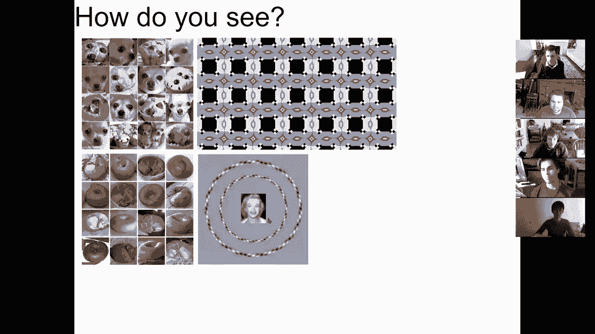
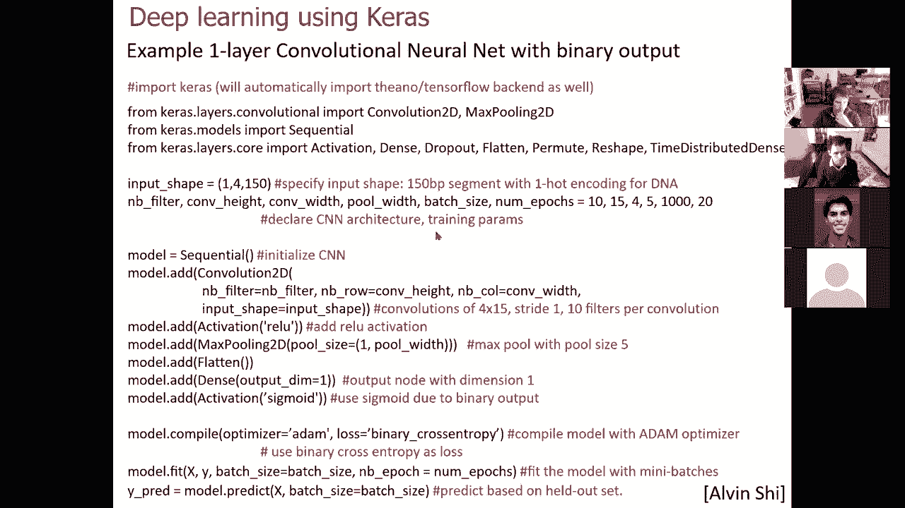
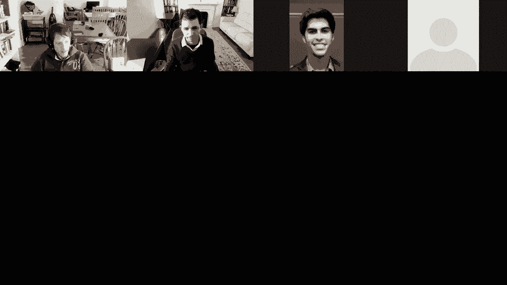
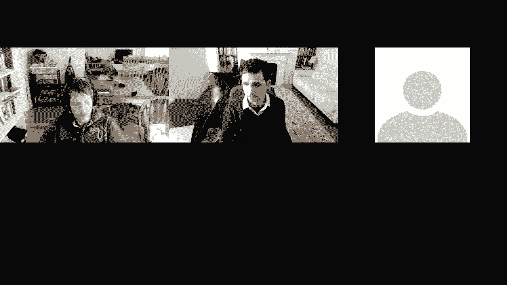

# 【双语字幕+资料下载】MIT 6.047 ｜ 基因组学机器学习(2020·完整版) - P12：L12- 深度学习 - ShowMeAI - BV1RM4y1g76r

so welcome everyone today we're going to，be talking about deep，learning and there's a lot of super。

awesome people who have helped，contribute to these slides and they're，acknowledged here。

um so first we're going to talk about，supervised，learning with neural networks basically。

introduce the concepts of perceptrons of，layers of activation units，and so on。

and then you know just the very basics，of learning，about gradient descent back propagation。

learning rate dropout overfitting just，foundations from，basically the 60s and then we're going。

to talk about，unsupervised learning with deep belief，networks and how to start learning。

representations，using other encoders then we're going to，talk about。

modern deep learning architectures，focusing a lot on convolutional。

neural networks and recurrent neural，networks and also transfer learning in，general。

generative adversarial networks and，we're also going to talk about。

uh deep learning specifically in the，field of regulatory genomics where this，has actually been。

very very powerful and then introduce，to you guys some computational。

infrastructures that you can use，in your own projects so first of all。

as we start thinking about learning the，you know first question is hey we are，learning machines。

we are growing up in a complex world and，we're able to see，so as you start looking at this picture。

the question is what do you see what are，the primitives that you see。

you might see trees you might see，buildings you might see people。

and cars and you're not thinking about，individual edges you're not thinking，about sort of。

you know these low level pixels you're，not thinking about，shades of color you're really thinking。

about objects so your brain is，clearly doing something there to sort of，abstract away。

all of these low-level details to learn，how when you see a hand。

you know you can immediately read the，fourth avenue，and so forth so there's something that。

goes on inside your brain，that sort of you know extracts meaning，from all of these primitives。

and one way to understand what goes on，inside your brain is to actually start。

looking at some visual illusions that，actually kind of break，see。

here uh you know what what do you see，you see a bunch of muffins or actually。

wait no you see a bunch of little dogs，uh or wait uh some are muffins and some，are dogs。

and i don't know for you but my brain，actually hurts when i'm trying to figure。

out which ones are muffins and which，ones are dogs，and that's probably because your。

primitives are sort of fighting against，each other，and it's the same thing here if i ask。

you what you see well you probably see a，bunch of bagels，and you know that's clearly bagel that's。

clearly bagel or wait a minute，that's a little dog and uh is this a dog，or a bagel it's hard to tell。

so again your brain is sort of has，combating uh primitives，fighting for attention what if i show。

you this one，and i tell you well you know clearly，this top，blue line goes up to the right and this。

one goes up to the left and so so forth，but what's really weird uh is that no。

these lines are actually parallel and if，i show you these，that's，you。

uh marilyn here you might say oh yeah of，course that's a picture of maryland。

but in fact what's actually happening is，that，these lines are parallel to each other。

these circles are perfectly concentric，and maryland here，is actually if you squint is maryland。

but if you look really closely it's，albert einstein，so your brain is clearly uh。

fighting between all of these different。

cues that it's uh you know，grown up to recognize and again in terms。

of you know having your brain hurt，there's um there's a lot going on in。

this picture but basically what's really，going on is that，a computer has basically reused，primitives。

from other places to construct a fig uh，a picture，from somewhere else so this is actually。

a person looking at you，and when you squint it looks like a，normal person but as you sort of zoom in。

it's you know very problematic so the，question is，how uh is your brain actually messing。

all these up and what actually goes on，inside the primitives of your brain so。

a lot of the early work on neural，networks was inspired，very much by our you know budding。

understanding，of the architecture of the visual cortex，and all of these things that we've been。

talking about and all these sort of，conflicting signals，that are happening inside our brain are。

very much at the core，of our very motivation for，initially machine learning and neural。

networks and how deep learning，so every time you look at an image that，image gets projected。

through the lens of your retina and then，this you know gets projected back into。

a a series of cortical layers，that are interpreting initially your，primary uh signals and then。

higher and higher orders of abstraction，and your visual cortex is actually，organized into layers。

that are basically looking at higher and，higher，you know combinations of the lower，layers，are。

happening at each of these levels，as sensors for particular types of，features。

so you can actually have a spatial，frequency responders，orientation tuning responders contrast。

responders，and so forth that are actually at the，basis，of your visual perception and of course。

low level，if you actually ask what is happening at，the level of individual neurons you。

basically have these，synaptic connections where，neurotransmitters are being released。

and if there's a sufficient number of，these molecules，crossing a you know barrier you。

basically have a sufficient number，of um signals that are，crossing a particular activation，threshold。

add it up through all of these inputs，to the same neuron the same neuronal，cell。

and all these inputs are basically，adding up the amount of neural。

you know transmitters that they have，detected and eventually making a，decision。

at the cellular level to fire or not，and these decisions are basically made。

at every one of these cells，but across a actual neural network a，human neural network。

you basically have networks of these，neurons connected to each other。

adding up these signals and then making，threshold，decisions for depolarization and then，sending off。

their signal to now the synapses，and inside your visual cortex there are，actually。

uh you know responses that are happening，at different layers of abstraction so as。

i mentioned earlier you can have，edge detectors and bar detectors and。

you know center versus periphery，detectors，and those are arranged at increasing，layers of complexity。

with you know higher layers，of your visual cortex，capturing higher level levels of，abstraction。

of orientation you know disparity color，some basic shapes some curvatures and，eventually。

complex features and objects as you get，to these higher levels and this is not，just true of your。

visual cortex this is also true of your，mortar motor cortex so your motor cortex，has similar。

layers of organization with you know，multiple layers of abstraction。

and this is true for your you know，auditory cortex for，you know most of the learning features。

inside your brain，are in fact you know exploiting the same，architecture。

and if you look at what is that，architecture doing that architecture is，simply。

effectively a general learning machine，so this neocortex that went from you，know our siblings。

more or less the mice to our you know，twins basically the you know chimps。

and the macaques to this dramatic，increase in brain size and i like to，show this picture。

because i mean of course this is one of，the most successful humans on the planet。

um but you know having no hair also，helps you appreciate，the huge amount of stuff that goes on。

above the eyes so，if you look at you know the chimp skull，there's。

this you know nice little space here and，if you look at the human you basically。

have this massive expansion of hardware，here，you know you kind of stop at the top of。

the eyebrows and then for humans you，have this massive expansion。

so basically to to the chimps we kind of，look like the aliens from mars attacks。

uh look to humans with this massive，massive cortical expansion。

and this is very much the same type of，architecture it's sort of this neural。

network with multiple layers，of abstraction and sort of you know，increasingly complex。

features and abstractions being learned，and，that machinery has basically evolved a，long time ago。

you know hundreds of thousands of years，ago um，well after we separated from chimps，obviously。

but then heavily selected and hasn't，really changed that much in the last you，know 10 20。

maybe even 50 000 years so，we've basically captured huge areas of，science without。

any dramatic changes to the hardware，because of its generality。

what has changed is the huge amount of，knowledge that we infuse，our children during these malleable。

periods of you know i don't know the，first 18，you know maybe even 24 years where you。

guys are just like，you know taking classes must stop and，just getting you know。

all of these different layers to sort of，you know train on increasingly complex。

abstractions um which you know is very，unique to the human species。

because we don't have to fend off uh，enemies you know very rapidly。

so what deep learning does is that it，exploits this，concept of multi-layer architectures。

with the computational framework to，actually learn，abstractions that are reused at。

multiple layers and multiple levels and，multiple nodes throughout this network。

so the way that you know we can think of，recognizing these images is that there's。

a visible layer which is the input，pixels，and then there's a hidden layer and。

another hidden layer another hidden，layer that are all，feeding information to each other very。

much similar to，the layers of our visual cortex and，these layers。

um let's see there's a chat question did，hear，uh the microphone well can you guys hear。

me is it really deep，is it okay no it's fine okay good um，yeah it's a little deep and it comes and。

goes sometimes i see，um yeah so，i can switch to this microphone can you，that one。

and oh it's better okay um，all right so basically these you know，this visible layer is now。

connected to an edge detector which is，then connected to a corner contour。

detector which is building on these，edges and then and，parts of an object detector which is。

building on these quarters or contours，and ultimately an object identity which，is based on these。

object parts so that's where，deep learning really gets its name the，multiple，learned。

and you can think of representation，learning as，actually，learning the features and learning the。

mappings for the features，but then the concept of deep learning is，that。

we're not only going to learn these，features but we're going to build。

additional layers of more abstract，features that are learned，at，you know this hierarchy of ai ai。

includes for example knowledge bases，machine learning is more statistical。

that's where you know logistic，regression for example fits in，rather than just you know humans。

encoding a lot of knowledge，representation learning can basically，build on you know these logistic。

regressions and，other types of statistical learning and，have some kind of shallow。

representations and what，deep learning does is you know for，example the multi-layer perceptrons and。

so forth，they have you know these additional uh，features of learning features and，so。

you can sort of see this increasing，layer of complexity，there as well so the question has always。

been how do，we humans recognize uh you know，images of i don't know 20 by 20 pixels。

or 64 by 64 pixels so，how do we take a bitmap and then learn，that these are all twos and this is。

probably a four，and that's probably a seven and so so，forth so。

uh the the whole concept is that perhaps，what humans are doing。

deep down is the same that we can do at，the machine level，so maybe we can design these。

neurons these artificial neurons that，receive inputs the same way that our，neurons receive inputs。

been，has been crossed to sort of send out an，output，with some kind of linear function that。

basically says that the output is going，to be some sum，of all of the inputs each scaled by some。

weight，okay so that's sort of the most basic，artificial perception。

and then a biological neuron is you know，not that far，off from that and what a neural network。

does is that it，stacks up these artificial perceptrons，to basically。

uh capture these multiple layers of，abstraction，and the the the sort of key insights。

beyond these initial designs，of a linear function is that beyond，a。

thresholding for that activation layer，that happens inside our brains，that allows us to um。

to to learn non-linear functions，so the concept here is that this。

function is purely linear and therefore，we can't really，capture the complexity of the world。

around us that requires a lot of，thresholding a lot of sort of。

you know max functions and xor functions，and so forth，which can't be easily learned using。

these linear functions，but instead what we can do is use some，kind of thresholding for example a。

sigmoid unit，is something that was used in the early，days of machine learning。

for mapping from this zero to one，with a threshold of saturation so if，you're you know below zero。

you know the the the neuron doesn't fire，it doesn't respond and eventually it。

sort of saturates and sort of goes，to full response okay so that was the，first type of。

of approximation of what happens inside，your brains with a sigmoid unit。

another way of thinking about this is，perhaps it doesn't saturate at one，just。

zero for a while and then you know at，some point there's this activation，threshold and then。

the more you feed it afterwards the more，it fires and that's this，soft plus unit that basically。

again starts out at zero and then，eventually smoothly transitions to this，more linear。

uh function and then uh，non another you know much more simple。

and much more commonly used now uh type，of，non-linearity is this rectified。

linear unit or this rendu so what this，radio does is，is a hard max。

basically it's it's a instead of having，a soft，function you basically have a heart，function that is。

zero until you get to some level of，activation threshold，and then simply matches the input。

thereafter，okay so these types of non-linearities，suddenly expand the expressivity of。

these neural networks dramatically，and allow you to learn a huge huge you，know family of functions。

so how do you learn with these functions，the way that you learn is that you。

adjust the weights so let's think about，one layer at a time so basically what i，would like to know。

function，all the way up here of what is the，desired output if the desired output is。

oh i'm seeing a cat or i'm seeing a dog，or i'm seeing a person or i'm seeing a，car。

that's the desired output okay so it's a，one or a zero，or it could just be some you know scalar，that。

whenever the set of functions，which the set of inputs that are，supposed to be。

lighting up for the dog for example，match，then i predict a dog the way to do that，is to actually。

look at the gradient look at the，difference between，your desired output and your actual，output。

for a given input so for every input i，have，i have the predicted output given the。

current set of weights，and the desired output given the current，input。

is everybody with me so far so what i，can do is basically take the difference。

between the two and adjust my weights，to best match that difference and the。

way that i adjust the weights，can be you know a hard way or it could，be a soft way。

i could basically look at the gradient，of how，is the weight changing relative。

or how is the error changing relative to，the weight，and then adjust the weights along that，gradient。

okay so that's what gradient based，learning does，it basically says here's the delta，here's the。

error between the desired outputs and，the current outputs，and i'm going to take the partial。

derivative of that error function，relative to the weights that i'm，currently adjusting。

and i'm going to adjust the weight at，time t，as a function of the weight at time t，minus 1。

with some change that i'm going to be，applying，and that change is going to be some you。

know epsilon which is going to be the，learning rate，times this derivative relative to the，gradient。

okay the derivative relative to the，weight which is basically the gradient。

with potentially some additional weight，decay，that basically tells me how fast is that。

weight decaying，as i go through which basically forces，me to learn smaller parameters over time。

so that，you know the initial weights don't just，explode，and then potentially some momentum。

which is using the previous change，to guide me so that i don't sort of，sharply。

jump back and forth and miss that，optimal okay，so what gradient descent does is that it。

takes the partial derivative of the，error which is the desired output minus，the current output。

with respect to the weight you know，adjusted by some learning rate。

which is needed to not overshoot the，optimal solution some weights decay。

which penalizes large weights，to prevent overfitting and some momentum。

which is based on the magnitude，but also the sign of the previous update。

when the direction of the update is，consistent you basically have faster，convergence。

when it's inconsistent you sort of don't，jump too far around it。

and uh you know this is the traditional，gradient-based learning，stochastic gradient-based descent is。

speeding up the computation by，randomly sampling the subset of samples。

and then updating the weights using only，that subset，so using only a subset of samples i can。

actually have either stochastic gradient，descent，or even online learning where i'm。

updating the gradient using only one，training point each time so this is，basically the typical。

approach of you carry out a first a，forward pass，that tells you what is the output y and。

what is the desired output，and then you do a backward pass a back，propagation。

which basically looks at what should，have been the weight here。

what should have been the output there，how should i adjust，the weights and for each of those。

intermediate nodes i continue，propagating，this back where i'm basically taking the。

derivative of the weight，of the error with respect to this kl，weight with respect to this jk way。

and so on so forth okay so what，the update rule does is that it sort of，continues updating。

at every layer of the network，from the you know closest to the，furthest from the output okay。

so the way to think about this is that，what you're，looking at is how that error surface。

changes with respect to your weight，in a one-dimensional way you can，basically say well if i。

increase my weight then my air surface，you know goes higher and if i decrease。

my weight it also goes higher，so what i want to do is follow the，direction of the derivative。

and then decrease my weight if i'm to，the right of this，or increase my weight if i'm to the left。

of this，and of course i'm not updating one，ways，so you can think of you know a，multi-dimensional。

space of errors that i'm traversing，and then i have constraints from。

every training example that are pushing，me in specific parts of the space。

so provided that the objective error，function is concave，at every iteration the error derivatives。

will decrease the distance between the，current weight vector。

from every local optimal solution and by，a finite number of updates the weight，vector must reach。

one of these local optima so you know if，the local optimum is here where i can no。

longer improve the weight，you know i will eventually get there，approach，so the learning rate is。

basically extremely important and，there's many additional challenges for，convergence。

so for example if the optimal solution，space is very narrow，you'll end up with a very slow。

convergence because you're going to be，jumping all around it，if the learning rate might almost also。

be small to not overshoot，the optimal solution so you might sort。

of just jump there every single time，and then the numerical approximations of，the gradient uh。

can basically take steps in slightly，incorrect directions，and bigger steps can simply miss it all。

together and of course there's a huge，challenge of overfitting because we have。

a lot of parameters and usually very few，training examples，so large networks basically take time to。

train and they need bigger steps，and they can also shoot in all the wrong，directions。

and the architecture sometimes must also，be learned so that's，you know learning the weights here but。

you might also want to learn hyper，parameters for example，how many hidden layers should i have how。

many hidden units what should be my，learning rate，maybe the learning rate itself should be。

a parameter a hyper parameter that i'm，learning，and the weight decay factors and so，forth。

so the one of the most important，concepts，in uh deep learning to to realize is the。

the whole concept of training error，versus generalization error，so your training error is the error。

in your actual training set so you can，basically，fit your parameters to better and better。

and better approximate，that training set and eventually you'll，get just very very close at。

approximating it，and that decay in blue tells you that，your code is working that the system is。

actually learning，but the problem is that the better you，can approximate your initial。

examples the worse you will actually，start approximating，your new cases and the reason is that。

beyond just learning a set of，uh functions that is general you're now。

starting to learn the particularities of，the example that you showed。

for example if you learn uh you know how，to recognize i don't know president，obama。

based on his dark shirt you might sort，of see another picture where he's。

wearing a lighter shirt and sort of say，oh well that's not him anymore。

because after learning some features i，kind of，overfit the particular jacket that he，was wearing。

okay and and，that's the reason why number one you，want to avoid。

training for too too long over time and，number two，you want to distinguish a training set，from。

a test set that basically tells you at，what point do i start，you know predicting incorrectly and。

the problem with that is that if you，choose the stopping point based on the。

minimization of the error of the test，set，you will then need another。

place to actually validate how well does，that do more generally，so what we usually do is use a。

validation set for，stopping and then a test set which is，completely held out for them knowing。

how that decision to stop affects the，overall performance，in yet another training set which is。

another evaluation set which is the test，so basically we usually leave out a。

small validation set which is not used，to train it's used to evaluate the model。

and you basically have this validation，cross entropy，that decides when to stop and you stop。

when this validation，across entropy increases to prevent，overfitting and then you look at your。

overall performance in the test set，uh to do that okay so the you know the，more you learn。

the better you will fit that function up，until some point where your，generalization error will start。

increasing，another way to avoid overfitting is，using regularization。

by keeping your parameters small or，by namely your weights keeping your。

weight small and that sort of where the，weight decay for example can come in。

or by keeping the number of weights，small，and one way to actually keep the number。

of weights small is to actually just，randomly drop，some intermediate nodes in your。

network so again we talked about，regularization last time，we talked about linear l1 lasso。

regularization，quadratic l2 ridge regularization，and their combination of elastic net on。

the parameters，and what dropout does is that it，achieves this parameter minimization。

in deep learning by randomly dropping，hidden units with different input points。

with some probability p，so you're basically saying well instead。

of having a fully connected network i'm，going to，throw away some of these and that will，force。

my network to not overly rely on any one，of those intermediate nodes so you're。

basically training a sub network by back，propagation as usual，and this is equivalent to a bootstrap。

aggregation approach or a backing，approach，that has an exponential number of models。

each of which is missing，some nodes and it provides a very，powerful regularization method that。

avoids overfitting，in general and the reason for that is，this intuition。

that what you're actually doing is um，you know enriching your family of models。

each of which is using a slightly，different version，of those weights。

so what dropout allows you to do is go，you know go beyond，you know with a local minima where uh，go。

further down in your minimization of，error，okay so usually the networks are。

pre-trained by generative models，and if your y-axis is the testing error，even。

after non-dropout training it is，reaching the plateau，and non-drawable training is probably。

getting stuck because，it has now put so much weight in some of，the nodes。

that you can't just get out of the local，maxima that these nodes allow you to do。

but with dropout you sort of force，yourself to take a hit initially。

and move out of this local maxima but，then that allows you to reach a higher。

you know local maximum so these are some，basics，of supervised learning with neural。

networks so basically we introduce the，basic foundational introductions of how。

our own brain works and then，these layers of learning these，activation units through sigmoid soft。

plus relu，and you know gradient descent stochastic，radiant descent online learning。

back propagation the rate of learning，dropout，and also how to avoid overfitting so。

let's do a quick poll，okay so this is lovely um，okay so uh let me go briefly through。

these parts to basically get at some of，the more，modern architectures but the the next。

sort of uh progress，concept，of learning these representations in an，unsupervised。

way so if i have a fully connected，network that basically has some visible。

units that are connected directly to the，inputs，and some hidden units without。

necessarily having an output unit，and i don't have now an output that i'm，trying to learn。

i just have a set of relationships that，i'm trying to learn，so these are basically a general。

boltzmann machine，where everything is connected to，everything else where the visible units。

are connected to each other and the，hidden units are connected to each other。

so this you know general this，generalized，boltzmann machine is basically a，universal approximator。

of probability mass functions over，discrete variables so you can basically。

learn these relationships the novo，a restricted baltimore machine basically。

takes away the connections between these，units，which allows you to actually uh you know。

learn these features，more uh generally so it's a different，type graph，and。

there's only one layer of hidden units，and one layer of visible units。

and it's a very simple unsupervised，learning module where you're basically，learning。

these relationships through these，different functions，so stacking these restricted voltage，machines。

allows you to now start learning layers，of representations，at higher and higher levels of。

abstraction and again all of this is，strained，simply based on these relationships，learnings than。

a particular output function that you're，trying to match，so you can basically now ask if i let，this。

uh stacked you know rbm，loose on a set of characters what is it，actually learning。

and if i sample now from this，over multiple generations of learning it。

will basically start approximating these，functions，even though it was never actually，trained to，and。

there's a lot of features of learning，these rbms but also much more generally。

useful for learning which is this，concept of，a thermodynamic interpretation of your，learning rate。

so you can think of this local maxima as，basically，needing some activation energy to get，over。

these barriers that separate them，and if i include a lot of，noise in the system it will be able to。

jump over those barriers，but eventually it will never actually，stop at any one of them because the。

activation energy will be too high，so one idea is this simulated annealing，that basically。

cools down the temperature as you move，forward and as you，progress through various epochs of。

learning in your system，to effectively allow you to get out of，these local maxima early on。

but eventually once you've reached one，of those deeper，local maxima you can。

no longer jump out of them because this，uh temperature of the system has now，cooled down。

effectively making it harder to jump，back out of them，so that's what simulated annoying does。

it basically changes this temperature，and then it controls the stochasticity，of the transition。

you can also train by gibbs sampling by，updating，all of the hidden units in parallel or。

updating the visible units to get a，reconstruction and then updating the，forth。

so we talked a little bit about deep，sampling a couple of lectures ago。

to basically get at this whole concept，that instead of，trying to learn a joint function across。

everything i can just learn，parts of it each time and instead of，approximating the entire posterior。

distribution i can，sample from that posterior distribution，without actually，fully reconstructing it。

so another way to，to to get at this is phases，of wake and sleep where you're basically。

clamping the visible units with data or，data，to basically allow you to get out of，this local maxima。

to um sort of incorporate the data and，effectively，having a sleep or a dream phase where。

you're now letting just the hidden units，sort of generate output。

and you know learn these relationships，between them，and then reclamping the visible units to。

sort of start feeding these data again，so that's for unsupervised learning with。

these deep belief networks，that allow you to learn representations，without necessarily having。

a output function associated with them，now there's another way to learn，representations。

without having a training function，by tricking this，supervised learning architecture into。

an unsupervised learning architecture，into behaving like an unsupervised，learning architecture。

so the idea is the following with an，auto encoder，you basically have a set of input，variables。

where the output variables are exactly，identical to the input variables so you。

have an image of a cat，and you're trying to learn a，representation of a cat。

without ever telling it these are cats，and these are not cats，but the way that you're doing this is。

that you're giving as the，output image the same input，as the input image so you're trying to。

predict the full image of a cat，using the full image of a cat that's，trivial right。

i can just take all of the pixels and，then，you know output the same pixels that i。

received and that would be trivial，of，pixels and millions of，intermediate nodes but the key idea of。

an auto encoder is that it imposes a，bottleneck，whereby my input，has to be summarized it has to be。

compressed，into effectively a representation which，is then，expanded back out to match the output。

image，so you're basically tricking a，supervised learning algorithm to work in。

an unsupervised fashion，you feed the input as the output，function to be learned。

but you constrain the model complexity，so you can pre-train these with uh you，know rbm as we saw。

earlier to learn representations for，future supervised，tasks and you can use the rbm output as。

data for pre-training the next layer，and after the pre-training you could。

unroll your ibm's your rbms to create，this deep autoencoder，and you can again fine tune it using。

backpropagation from this，so one way to learn these，representations is to。

force your model to sort of learn these，layers of abstraction，even in advance or by simply。

you know creating this bottleneck in the，middle，okay so who's with me so far you guys，following well。

so what we talked about is supervised，learning，and unsupervised learning but also the。

sort of halfway between supervised and，unsupervised，using these autoencoder functions。

so we have 53 37 550 that's awesome，so so the next major major。

innovation has been with convolutional，neural networks and specifically，learning convolutional。

filters and these pooling and some，max filters so convolutional networks，really changed the world。

in 2012 with this paper uh，by and knowing a series of papers where，uh you know these image。

competitions were always won by these，hand-tuned features，and you know all of these uh sort of。

non-machine learning，approaches and then sorry non-non uh，deep learning approaches basically the。

key transition was when alexnet，basically scored，an error that was 10 lower。

than their runner-up and that was one of，the earliest applications of these。

convolutional neural networks，okay so this whole idea in this。

image uh representation learning is that，uh computers basically you know don't。

see an image of lincoln here，all they see is a series of pixels。

and these series of pixels is basically，just one giant array，of numbers so with an image。

of you know just 255，for，just a very small uh image nowadays and。

the question is is this lincoln is this，washington is jefferson is this obama。

and how can the computer answer this，question so，on，a million long image vector directly。

and the answer is of course not i'm not，going to do that i'm going to exploit，learn。

patches and then build up these patches，and again this goes back to our visual，cortex the fact that。

the recognition features are exploiting，the local structure，of the way that the neurons are。

connected near each other，to be able to recognize on center versus，off-center firing to recognize。

edges based on the relative firing of，pixels nearby，to be able to recognize shadows and so。

on and so forth in order to build up，these primitives，so then how do you identify features。

in these images how do you find a nose，eyes and mouth，wheels the license plate the headlights。

doors windows and steps，so the you know traditional approach，of you know the field of machine。

learning，and ai was that we're going to hand，craft features i'm going to learn。

primitives of windows and you know，somebody's going to code in and sort of。

you know see what windows look like，but what modern deep learning does and，do。

is that they learn the features，themselves the novo，and and the key insight here is that，these。

convolutional filters are going to be，applied，throughout the image so i'm going to be。

learning this throughout the image so，therefore，a patch of a window that i learned here。

will also be applicable to a patch of a，window that i learned there。

a wheel feature that i learned here will，also be applicable to a real feature，that i learned there。

so basically by learning these，representations and these features。

ie these convolutional filters jointly，across，the whole image in this sort of。

parameter sharing approach，i'm going to be able to learn these，representations directly。

so how can you produce these feature，maps，so you know photoshop has for a long，time had these。

filters where you can basically sharpen，your image what's sharpening。

sharpening is basically taking the，middle pixel subtracting the surrounding，pixels。

and then that increases the contrast in，the intensity，or you might want to build an edge。

detector which basically says，you know if there's uh you know。

difference here between the positive and，the negative that basically means that。

every single time i traverse，a shading that changes from light to，dark。

then this feature is going to be firing，and therefore detecting the edges that，way。

so if i basically have an input image，like this and i use even a，two pixel filter like that where it。

adds up the number of the value of the，pixel here，and it subtracts the value of the pixel。

there every single time i have，a you know very，high intensity pixel and a very low，intensity pixel。

that filter is going to be firing，maximally if i have just black to black。

it's not going to fire at all if i have，all，but as soon as i transition between。

black and white it's going to be firing，either positively，or negatively based on the specific type。

of transition that i'm making，between black and white is everybody，with me here。

yeah awesome so you can basically build，these very simple kernels ie。

filters uh in in this way and basically，you know hand craft them，or you can basically start now，novo。

you can basically learn these types of，filters，the novel and the idea here is that。

i'm going to be sharing parameters，as a set of convolutional filters that，i'm going to be。

learning as global hyper parameters，throughout my image，so the convolution allows you to share。

parameters，across your entire image so here's a 3x3，convolution，on a 5x5 image so what does the。

convolution do，it basically adds up the pixels，according to that filter，have，3 0 1 2 6 2 2 4 1。

as my input i can then pass that through，this filter，and that filter is some kind of edge。

detector here you can see the positive，negative，you basically will add up all of this so。

minus one times three，zero times zero one times one for the，first row。

plus minus two times two zero times six，is，you know two minus two times minus one。

uh zero times four and then one times，one so i'm adding all of that and i get，a single number。

which is how well did that convolutional，filter，score at that position，whole。

sort of matching a filter to a part of，an image，by scanning it through so convolution is，basically。

combining multiple numbers together and，the convolution is obviously the，opposite。

and what i'm doing now is that i'm，convolving i'm combining，multiple pixels together through a。

filter to compute，the output function of that，so 65 24660，so basically that's what this。

convolutional filter does it's the same，transformation applied to different，locations of the image。

and in matrix form and simply you know，applying this uh，you know throughout and this。

convolution is made of multiple copies，of this image and it's sparse because it。

only applies to small regions，and i can sort of have a sliding filter。

or a many to one filter which is using，for example the r the g and the v。

channels of a rgb image and so so forth，and these filters must apply to the。

entire depth of the image so，you know they end up reducing the size，of the image。

and then i basically have a pooling，layer which is either taking the maximum，or the mean。

that simply says did i detect an，occurrence of that feature anywhere in，my image。

in in dispatch of an image okay so this，is basically what this convolution。

operation is doing instead of going，through and computing this，and uh you know detecting all that so。

the the key idea of this convolutional，neural networks，is that what we're going to be doing is。

we're going to be learning，not just the weights but also，a separate set of filters so i'm going。

to be learning，the weights but also the filters，and this hierarchy of filters this，hierarchy。

of handcrafted features is learned，directly from the data rather than hand。

engineering them okay so that's the key，inside，of this convolutional neural network so。

basically number one i'm going to be，learning，the structure of the image where nearby，pixels。

matter and it matters that they're，nearby because they construct patches。

number two i'm going to be learning，layers of abstraction，and number three at each of these layers。

i'm going to have a set of，separate features which are shared，throughout。

which are effectively enabling me to，learn so these low-level features are，going to be。

learned lenovo and these are the，features that are actually learned。

if you look at low level features at the，lower layers，and then the mid layers and the high。

layers these are the，visualizations of the actual features，that are learned。

and you can see here that you know，there's dark spots and light spots。

and these are effectively edge detectors，and then you start seeing sort of，particular patterns。

combining these edges and these are，actually starting to match。

eyes and ears and noses and then if you，look at the high level features。

they basically start matching different，parts of the faces，okay and all of that is learned the novo。

so this is what this you know dramatic，transformation deep learning has done it，basically said。

okay great let's start with an input，image and then，we're going to apply some convolutional，filters。

and i'm going to be learning the filters，directly from the data。

and then i'm going to be self sampling，those and then applying more，convolutions and。

sampling those and applying more，convolutions and this is basically。

creating these layers of abstraction，so over here i'm learning edges and over，here i'm learning。

contours and over here i'm learning you，know parts of objects，and then。

after i've extracted these multiple，layers of features，and annotated the different patches of。

my image based on whether those features，occur or not then i go back to the。

traditional machine learning，and sort of deep sorry these traditional，neural networks。

that basically have a fully connected，layer where i can basically learn，cat。

or a person by combining these，features that i've learned at each of，those layers。

okay so who's with me on the whole，architecture，of this convolutional neural networks。

that basically starts at the bottom，learns progressively more abstract，features by。

learning a separate set of reuse，parameters for those features，and then applying those in a fully。

connected layer at the end，to effectively make whatever prediction，all right so 44 56 0 000。

um okay so basically you know a typical，image classification task will start。

with the pixels of your image，learn convolutions and then carry out，this pooling operation。

and this pooling operation is combining，information from multiple places，together to say hey。

did this occur anywhere in that patch，because frankly，as you're trying to recognize a face it。

might not matter exactly where the eye，was positioned even if the eye is。

slightly to the left side to the right，lying above it's still an eye and it's，still in roughly。

the right spot so these，you know pooling layers allow you to be，invariant to these transformations。

and then convolutions on the pulling and，forth，learning these abstractions and then。

classifying at the end okay so you，basically have feature extraction。

the way to think about these networks is，that you basically have。

a depth a height and a width the height，and the width，is dependent on the pixels of your image。

at every layer of abstraction and then，the depth is basically，how many of these uh you know。

convolutional filters am i applying，so i'm gonna look for you know up down，edges，might be。

down you know left right edges the next，one might be circles the next one might。

be contours and so so forth so basically，i'm learning many of these filters and。

i'm stacking them on top of each other，and then all of that is you know the the，full。

information i'm going to be pushing to，the next layer，and then of course this non-linearity is。

going to be allowing me to say did，anything happen here rather than。

you know worrying about all of these，negative numbers that would then not。

allow me to to be able to abstract away，so the，the challenge of course is that。

as i'm learning these features there's a，lot of，variability in the images and in any。

data set that i'm that i'm learning on，so there's a lot of scale variation。

there's a lot of deformations a lot of，occlusions，a lot of variations within classes or。

you know there's a lot of background，clutter and，the viewpoint through which i'm seeing a。

phase might actually change and the，illumination might actually change。

so how do i correct for that there's two，ways to correct for that，one way to correct for that is to。

basically have，a complete coherent model of the world，that basically tells me how are features。

of the world going to change，if i you know take the lighting away for。

example if i take the deformations away，if i take the viewpoint away so perhaps。

i could infer a 2d to 3d，function that learns what，you know that this is truly a statue。

with a nose and eyes and，mouth and so forth so that's one way and，some models of human cognition are。

basically saying that what we're，actually doing is learning，3d models in your head that's one one。

way to interpret，another way to interpret it is that our，brains，are simply being exposed。

to faces from every possible angle，and we have this massive massive massive，learning。

network that allows us to recognize，spaces，despite all of these variations so one，way to do that。

is to one one way to make to let，machines do that，is to actually expose them to pictures，of cats。

by deforming them artificially，by sort of regenerating a，slightly you know occluded version or。

you know by sort of taking the pictures，of a bus，from 100 different angles and then it's。

going to learn how to recognize the boss，from this angle from that angle from。

that angle from that angle from that，angle，as opposed to learning some kind of true。

3d representation，so the feature in variance，is usually achieved by，feeding that machine a ton of。

perturbations，and then letting that machine learn the，same object，through many different types of。

perturbations so who's with me，here on this concept of instead of，trying to reverse or annihilate。

these perturbations i'm just going to，create more and more perturbations。

so that my system can learn the，representation，regardless of what specific perturbation。

sounds great so um so again these are，just the typical，layers and uh there's been a lot of，evolution。

in these uh you know deep neural，networks in these，deep learning networks so the initial。

one had basically，uh you know a huge huge number of，features，for what we thought at the time but。

again，this was dramatically increased by，subsequent layers，so by subsequent learning approaches。

that basically dramatically increased，the number of layers so basically。

you know alexnet for example had eight，layers vggnet had，19 layers and you know these numbers of。

layers increased dramatically google net，for example had 22 layers，and then these resnet had。

uh you know just huge huge numbers of，layers，my，input might have tiny tiny tiny little，effects。

in the variations in my output so that's，a problem that we're facing in genetics。

that we're going to start talking about，you know next week but this。

is a huge problem where there are，so many different layers where it's very，hard to now。

do gradient descent across all of these，different layers，so what resnet introduced is this whole。

concept，of feeding these residuals，across these networks and jumping over。

these layers so across these layers，you can basically feed additional，information。

that allows you to now make the learning，more efficient，by you know having some additional。

uh and again there's been countless，applications of these approaches。

through you know medical imaging for，example and breast cancer screening。

where you can now start letting the，machines，recognize you know features of images。

that are having a breast cancer and that，don't have a breast cancer，and then being able to recognize。

perhaps，notice things that a radiologist might，actually not notice。

so this is you know on the convolutional，neural network site this whole concept。

of applying these convolutional filters，and pulling，uh through this sum and max in order to。

be able to extract，these um translation invariant features，but also altering the inputs as a way to。

sort of get at，positioning variants lighting invariants，and other types of invariances。

so the other type of architecture，that is pervasive and also extremely，useful in genomics。

is recurrent neural networks and that's，the goal，or the goal there is to learn linear or。

temporal relationships，so the concept of these recurrent neural，networks is that they have。

inter time dependencies with each time，step sharing parameters with the next，time step。

so for example these dependencies might，include the value of the hidden units。

or the value of the output of the，previous stage，and this is extremely important in any。

kind of temporal data set so if you're，understanding speech，or if you're translating language based。

on written words or when you type on，your phone and it sort of，predicts the next word all of that is。

based on these recurrent，neural networks so what is the idea of，the recurrent neural network。

is that at every time point，for example as i'm writing the first，word the second word。

the third word i have a function，that is dependent on both the previous。

value and the current text that i'm，entering，okay and a very compact way of，here。

which basically says that this network，is a temporal network which i can unfold，over time okay。

so these recurrent neural networks can，basically propagate information across，different time steps。

and you can have different types of，architectures for，propagating this this might come you。

know the previous information might come，from the hidden unit。

or it might come from the output unit or，it might come from the input unit or it，might come from。

you know some intermediate node that i'm，learning or it might be the delta。

between the output unit and the previous，prediction it is that at every time，point。

you can basically finish your，computation and then have an，input ready for the next time point so。

one way to achieve learning with this，is to always just try to predict。

the you know previous basically the the，right answer of the previous time point，for example。

so to always make a prediction for，everything you see，and then to validate that prediction。

based on the next thing you saw，so this allows you to basically，self-train。

these temporal recurrent neural networks，by simply always trying to make a。

prediction about what's the next thing，that's coming，and then updating my model of the world。

based on how off i was，from that prediction and that，effectively gives me infinite。

training data but the concept here is，that，i might actually see something earlier，on that。

allows me to now predict something after，some time steps，okay so the problem with that is that。

as i increase the distance in between，steps，this becomes increasingly difficult。

because there's this vanishing gradient，problem that i mentioned earlier but now。

instead of the layers being stacked on，top of each other，the you know different uh variables are。

stacked，horizontally next to each other based on，longer and longer time points。

is everybody with me as to sort of what，the point what the what the challenge。

is here so basically the same way that，we were previously，trying to learn across many many。

different layers and we had trouble，because we couldn't propagate，information。

we're now trying to learn over many time，points and the gradients basically。

become vanishingly small and you know，vanishingly，so uh the way to address that。

is that you can basically create，long short term memory modules and what。

is a long short term memory module，it's a module that is basically able to，decide。

whether it wants to learn or not，and that can propagate a memory，that it has learned and then decide。

whether it wants to keep this memory，or not in the previous time point so you。

can basically have a forget，gate that basically simply says whenever，that。

whenever the input is such that i decide，that i no longer want to。

remember this i can just simply forget，it away，or i can have an input gate that。

basically says oh now i want to learn，something new，so i can sort of now remember that。

in this sort of propagation framework or，i can have an output gate that basically，says well。

now it's a good time to re you know to，remember，the thing that i've been remembering。

along and to reuse it，for the next time point so these long，short-term memory gates basically allow。

you to，effectively have this non-vanishingly，aspect the non-vanishing aspect of your，input。

because the signal doesn't decay，at every step i decide whether to fully，remember the signal。

or to fully forget the signal，so you can basically propagate state in，both directions。

by having a forward lstm and a backward，lstm and i can stack these lstms along。

with convolutional neural networks，to basically for example learn videos so。

in a video i can have a convolutional，neural network，at every frame which is basically，learning。

a head a person a torso and so forth，while at the same time learning a，sequence between the output。

of my convolutional neural network and，then the output of all that。

is a combination of a cnn and an lstm，through this rnn basically i'm using。

this convolutional neural network this，long short-term memory module。

and this recurrent neural network in a，combined fashion，everybody with me here as to sort of，this。

the power of taking these primitives and，together，awesome uh，46 38 15 000。 so。

remember earlier as i was saying that，the next，time point can depend on many different，variations。

of that input so here are some，variations so basically i could have the，next one。

depend on the output function or on the，loss，basically the error function between the，desired output。

and the actual output i can have it you，know depend on，you know any of these combinations as。

i'm unfolding my network，so that's for recurring neural networks，of how to learn these linear。

and these temporal relationships another，two major innovations that i want to。

talk about transfer learning，and these generative adversarial，networks so what is transfer learning。

transfer learning is seeking to，pre-train a particular model。

using a massive data set and then finish，learning，using a smaller data set for example i。

might want to，you know study the brains，of a small number of subjects that。

i spend a lot of money and energy，uh gathering and getting these，you know specific i don't know drug。

responders in my clinical trial，and doing you know imaging on them might。

just be very expensive because i just，don't have that many people in my，clinical trial。

but i have a lot of healthy subjects，that i can apply the same technique to。

so what i could do is offline，prior to getting my specific subjects。

i can effectively learn a representation，you know through these convolutional。

neural networks and this fully connected，layer，for what healthy subjects look like in，their brain。

more generally and then when i get my，very small number，of targeted subjects i don't have to，relearn。

the entire stack of convolutional，filters，i can just simply use transfer learning。

to learn to to basically，reuse the bottom layers of that，architecture，and guide my function。

using all this prior knowledge and，classify a new function，and then adapt it simply to the targeted。

subjects that i have，so when i get a new subject i can，basically classify that new subject。

using the representations that have been，learned on a lot of healthy subjects。

and the classification that has been，learned，on a set of targeted subjects so。

using these representations i might be，able to learn，some kind of i don't know soft max，regression。

classification of blue points versus red，point，using everything that i've already。

learned and pre-trained，uh on this uh sort of healthy set data，set，so basically instead of just。

using deep learning the full way through，on this tiny data set。

i can basically use deep learning on a，large，public data set and then transfer these。

features and then，only train my classifier at the end okay，so um yeah so you basically learn these。

intermediate representations，these abstractions from one task，and then you're transferring that。

knowledge to another task，which then requires many fewer training，examples。

and you reuse the features unchanged or，you do some small amount of adaptation，of the features。

so you could go back and readjust these，convolutional filters a little bit if，you would like。

and then you know this works，across surprisingly seemingly different，domains。

because you're learning something about，the natural world and something about，these global。

features okay so who's written so far on，transfer learning，this whole concept of pre-training your。

network，to learn these representations based on，a large data set。

so that you can then go and only learn，small parts，smaller，all right so as for generative。

adversarial networks you guys have，probably seen them，a lot um in the news so you know this。

whole concept of，this person does not exist even though，it looks like perfectly normal person。

so the what's the idea there the idea of，these deep fakes，of this ability to sort of generate very。

photorealistic，people or in the concept of in the，context of genomics very。

you know biologically realistic data，sets，is that you can create two different。

neural networks one is a generator，network，that generates fake images or i don't。

know gene expression levels similar to，other gene expression levels，that。

tries to distinguish whether those，fake images are fake or real，so you have first some kind of noise。

vector that you're feeding to your，generator，and that generates a lot of fake images。

and then you have a discriminator that，basically says oh no this image is fake，this image is real。

and that discriminator is effectively，what's teaching the generator。

to generate more realistic images，and then that allows the discriminator，to get。

to to improve the generator so the，generator gets better，because it has a teacher and that。

teacher is the discriminator network，that says oh sorry i can tell this one's，fake。

keep keep trying but at the same time，the generator network helps the，discriminator network improve。

because it basically makes fake images，that are closer and closer to reality。

and therefore the discriminator needs to，get better at discriminating。

so that's why we call them adversarial，networks，because they're fighting against each。

other as one is getting better，the other one has to get better and as。

the other one gets better the first one，needs to get better，so supervisor powerful but it's。

expensive and it's hard to train，so the idea of these generative。

adversarial networks is that you can，generate，a neural network that provides the，feedback。

instead of having humans basically tell，it well no that doesn't look too real。

you have a network that gives that，feedback so if you couple the two the。

generator and the discriminator you can，improve them both，and this was initially generative and。

now you can have semi-supervised，but also reinforcement learning。

architectures based on that principle，and then there's many applications you。

can improve images you can improve data，sets you can create art and phases and。

3d worlds and so forth，so for all of you guys who are basically。

doing final projects that require a lot，of data，one idea might be to actually create。

generative adversarial networks，that allow you to generate additional，data sets。

using features of the original data，but you know that allow you to sort of，get more and more。

data realistic，on these，uh generative adversarial networks and。

how they're working with the generator，and the discriminator that are getting，better at each other。

by having one of them catch the errors，of each other of the other。

and then you be used as the teacher and，as the student gets better at generating，these more。

realistic images the teacher gets better，at distinguishing，better and better those images and then。

you know you basically have the，evolutionary process working，okay lovely so 69 23 800。

all right so now that we have all of，this infrastructure，of supervised learning using these basic。

building blocks and back propagation，and these basic ways of avoiding。

overfitting we have this unsupervised，learning with these boltzmann machines。

and these rbms and the stacking of these，rbms into belief networks。

we have this uh tools for give sampling，simulated annealing these wake sleep。

cycles these energy based uh approaches，we now have these auto encoders and this。

ability to do self training and，representation learning and pre-training。

we have these convolutional neural，networks that allow us to learn。

these separate functions and these，convolutional filters，that are going to be reused throughout。

the image at every layer of abstraction，including these pooling layers with sum，or max。

that are basically allowing us to be，transferring variant or translation，invariant。

um these recurrent neural networks that，allow us to learn these temporal，relationships。

unfolding through time and these lstm，modules these long short-term memory。

modules that allow us to now remember，something for a long time and then reuse，it when needed。

and it's transfer learning of being able，to pre-train in a particular domain。

and then apply to new domain or these，generative adversarial networks that，allow you to generate。

more data like the data that you had，before for example images or gene。

expression profiles and so forth，using these two networks we can now turn，back。

to regulatory genomics and see how are，all of these tools applying in the，context of。

regulatory genomics so the idea here is，that my input data is going to be。

dna or protein or gene expression，profiles，and this input data is going to be fed，to。

a low level learning machine which will，then have，higher and higher convolutional filters。

to eventually learn representations，which i can then use at the end through。

a fully connected network，to predict whether i don't know a，transcription factor will bind。

or whether this region is a gene，or whether this element is rapidly，evolving。

and so so forth okay so traditional way，of doing that，in the context of genomics is to。

basically have in the same way as i have，an rgb filter，which basically tells me red green blue。

channels of the same image，to have a one hot encoding of acgt。

where instead of having a single letter，i have，a bit vector four times so i have four，bit vectors。

at every position that bit vector tells，me if it was an a，t t a t c c a c。

and so so forth okay so i can feed，to my convolutional neural network uh，one hot encoding。

of my input data that basically tells me，which nucleotide did i see。

so every dimension is i see an a did i，see a scene did i see a gene and so so，forth。

and then the convolutional filters can，simply be，the motifs that，i'm learning from the data。

in the same way that we learn these，position weight matrixes，or these position specific score。

matrices these pssms or，these pwms i can basically now，have a matrix that i'm learning。

quote-unquote on the side and these are，my convolutional filters that i'm going，to be applying。

throughout my my genome throughout my，genomic region，these are going to be my convolutional。

filters that basically tell me did i，recognize this particular motif here。

so for example the tgttac motif is the，tgttac，motif and i can scan that motif at every。

position on my，effectively，my genome and then see when did it match。

and as that convolutional filter fires，and basically says yes it did match i。

can have my pulling layer that says，did that motif match anywhere within，this 50 nucleotide block。

and then i can have my fully connected，layer，that basically learns the binding of a。

transcription factor from an experiment，which i'm now，learning how to predict from the，sequence okay。

so who's with me here on how we can take，this convolutional neural networks。

and now apply them to a genomic data set，using this one hot encoding approach。

where we're learning these motifs we're，learning these convolutional filters。

in the same way that we learned our，edge detectors and our eye detectors and，so forth。

i can basically learn convolutional，filters at，every layer of abstraction。

okay so i basically have my inputs，my convolutions my you know，pooling and then uh one or more。

fully connected layers and eventually，predict whether that transition factor，binds or not。

given the underlying sequence，and you can do that with a single task。

or you can do that with multiple tasks，for example you can predict will this。

transcription factor bind，in this cell type and will this，interesting factor binding。

that other cell type or will the，difference or extreme factor buy。

or you can predict you know multiple，classes simultaneously，and why would i want to do that the。

reason i want to do multitask learning，is because the underlying motifs might，actually be reused。

across my network so then，reusing that makes a lot of sense if i，have the same alphabet。

that will then be reduced，so we can basically learn these latent。

representations either at the dna level，or at the protein level so we can，basically learn。

representations of even 3d structures by，learning from the amino acid sequences。

particular combinations，that are associated with particular，functions which are in the end。

learning about domains of these proteins，so here's one example by frascaridis，over at the media lab。

who's basically learning these，on，the protein domain and then，predicting which proteins will be for。

example cutting dna，or which proteins will be binding dna，and so forth based on their。

domains so all of this infrastructure，is uh you know has evolved a lot since，these。

tools first came out and there's a lot，of tools that allow you to now。

create these deep learning models very，cheaply，so there's a lot of libraries like piano。

and tensorflow and torch，that have automatic features for，learning or symbolic differentiation and。

black propagation they allow you to，compile for particular，graphical processing units enabling。

speedups，that are stemming from these highly，optimized and parallel implementations。

of these core neural network functions，that are found in these gpus。

and there's high high-level neural，network libraries that，wrap on top of the anode and tensorflow。

that simplify neuronal creation such as，keras，there's，much more powerful gpus and easily。

accessible cloud gpu computing such as，there's，much more sophisticated and powerful。

models that you can now combine，to build your neural networks so alvin。

sheen a student in my group basically，built this very simple example to walk，you through。

deep learning using keras to build a one，layer convolutional neural network with，a binary output。

so you first import care which，automatically imports the anode and，tensorflow。

and then from keras that layers the，convolutional you import，a 2d convolutional layer and a 2d max。

pooling，architecture then you also import the，sequential model。

and then an activation dropout flatten，permutation reshaping time distributed。

dense functions and so forth，so you then specify the input shape，of your neural network。

so you basically want for example a one，hot encoding，of dna with four letters that's 150。

nucleotides long，and then you decide that you'd like，a particular cnn architecture particular。

convolutional neural network，architecture，with say 20 epochs with a batch size of，a thousand。

with a pool width of 5 with a，convolutional width of 4，with 15 convolutional。

layers and then you know particular，filtering，this，sequential function and then you can add。

these to the convolutional filter based，on，the you know filters the rows of the，height。

the columns of the width and the input，shape of，one for 150 and that basically tells you。

this is a convolutional 4x15 with stride，1 and 10 filters per convolution you can。

then choose your particular activation，layer so this is a relu。

a rectified linear unit activation and，then，you can add a pooling with pull width。

of 5 whatever you chose up there，and then you flatten that model and then，you。

output with dimension one and then you，can use an a sigmoid，activation function for example because。

of a binary output of zero one，whereas your relu will will not just，simply stop at。

zero or one it will just go to any kind，of input function，and then you simply compile it with a。

particular optimizer，and a particular loss function for，example binary cross entropy loss。

and then you fit the model using some，data which is your dna data。

and some output that basically tells you，is the transcription factor bound here，or not。

with a particular batch size and a，particular number of epochs，to basically fit the model with these。

mini batches，and then your prediction is simply，know，x and y labels you just predict based on，the x。

with a particular batch size okay so for，those of you who are interested in sort。

of learning from dna data，you can just adapt this code and then，you will be。

up and running and using this all right，so what did we see today we saw。

a lot of things across deep learning so，basically looked at，the traditional neural network so for。

example how do humans see and what are，these building blocks that we can build，inspired by these。

human visual cortex of perceptrons and，layers and activation，units we saw how we can do gradient。

descent，and then back propagation how to change，the rate of learning dropout and，overfitting。

we saw how you can use unsupervised，learning not just supervised learning。

with these deep belief networks and，these auto encoders，and，these you know uh entropy based learning。

functions，uh we saw simulated annealing and deep，sampling，we saw these modern deep learning。

architectures of auto encoders，these convolutional neural networks and。

these recurrent neural networks，and also transfer learning and these，generated adversarial networks。

and then we saw some examples in the，field of regulatory genomics and some，tools that you can use。

for deep learning computing all right，so who feels that they've learned stuff，today。

okay so uh 46 23 23 80。 this is awesome，all right well thanks everyone and then。

see you tomorrow for the。

