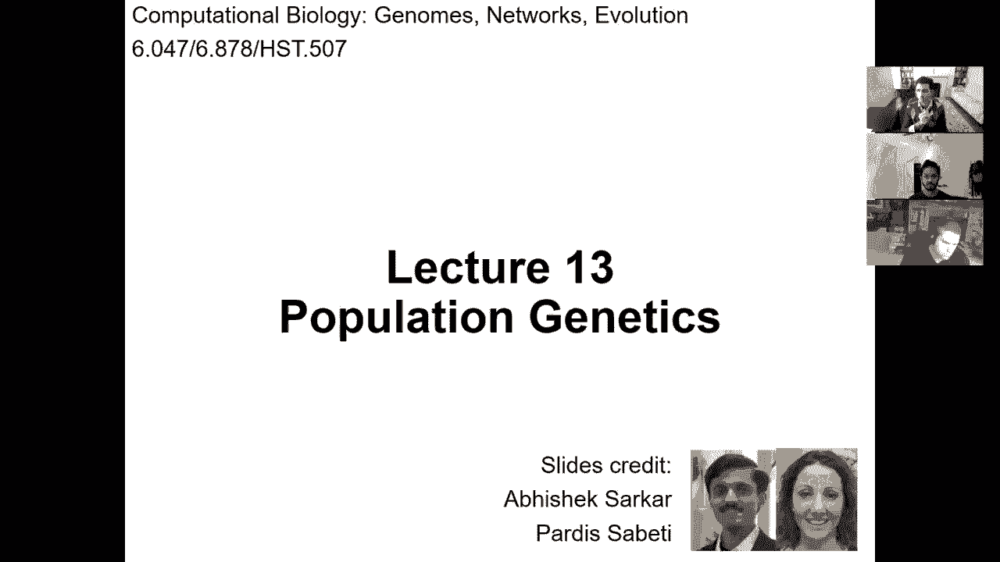
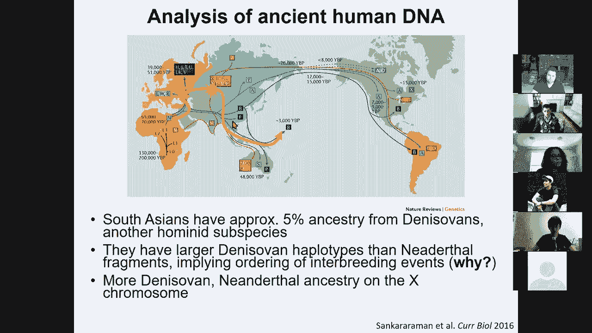
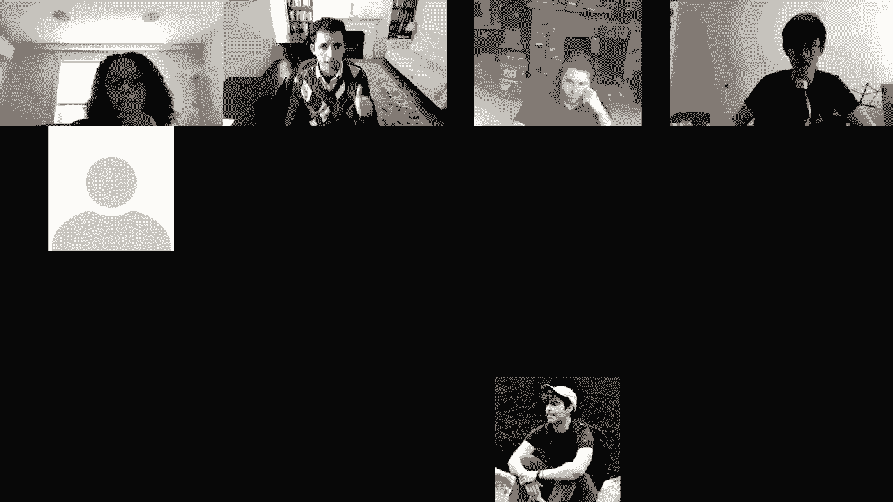
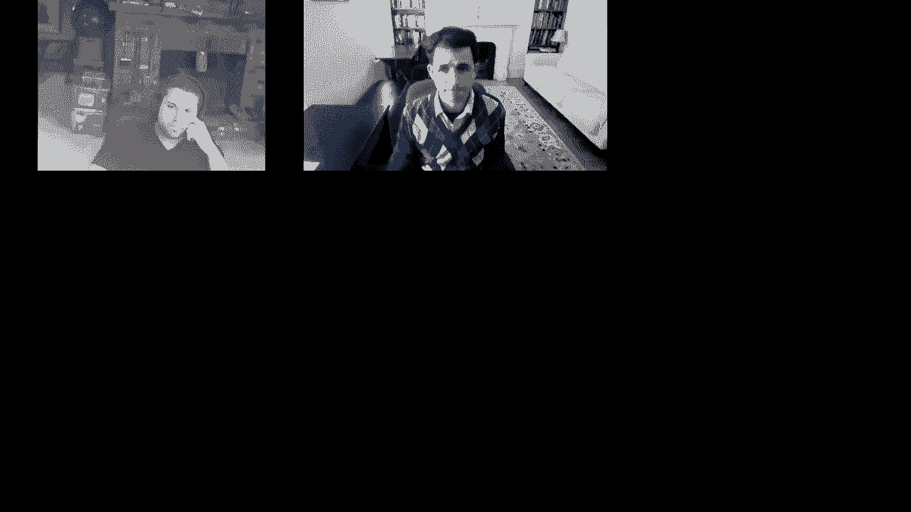

# 【双语字幕+资料下载】MIT 6.047 ｜ 基因组学机器学习(2020·完整版) - P13：L13- 群体遗传学 - ShowMeAI - BV1RM4y1g76r

so welcome everyone。

uh today we're talking about population，genetics，so we are entering the module of。

population genetics and disease genomics，so today we're talking about population。

differences and genetic variation，uh the second lecture will be on。

disease association so basically how do，we carry out the，genomic association study and how do we。

understand it，the next one will be quantitative trait，mapping，looking at differences in the。

intermediate phenotypes，and then lastly systems genetics and，genome-wide variation。

so we've been basically building a lot，of toolkits for understanding genomes，and now we're going to。

apply all these toolkits to understand，genetic variation in disease。

and then to talk about variation between，species，so these are the four lectures so we're。

going to look at how do we measure and，understand human variation today。

and then we're going to get into，phenotypic variation，next week so first of all how do we。

build genetic variation maps for the，human genome how do we detect。

variation how do we quantify it and what，are some of the initial insights so i'll。

give you a brief history of human，genetics，about the genome variation snips indels，cnvs strs。

and then we're going to talk about how，to detect them in a thousand genome，project，variants。

from sequencing reads and then we're，going to switch to，haplotypes human relatedness human。

demographic history，and then measuring human selection at，multiple scales。

so inheritance has been understood for a，long time，we've been basically selectively。

breeding animals and plants for a long，time we basically went from。

you know animals that will eat you to a，man's best friend，we've selected uh both animals and。

plants for their traits this is what，corn，used to look like i think it was known，as teosante。

and it's completely inedible and of，course it's a major source of food today。

so these stories uh date back to ancient，ancient times，and even from ancient greece basically。

there were，a lot of theories that have somehow uh，polluted，modern uh evolutionary theory if you。

look at anaximander，he would argue that the first human was，in fact born。

from a non-human relative and that there，was probably a fish，origin of the land animals in 300 bc。

aristotle，was basically the first to create a，taxonomy of the species in a，classification。

and uh you know a lot of other，philosophers were basically arguing，about，seedlings and as。

early as 450 bc and pedophilies was，basically arguing for a random mixing of，traits。

with natural variation where the，successful ones survive，giving the semblance of purpose so you。

know again preluding a lot of what，you know darwin's theory made so clear。

and uh again in 300 bc pickers had this，purely naturalistic，generation of diversity without any。

supernatural intervention，of course these were a huge minority a，tiny minority compared to this huge。

majority，that were um sort of believing in some，kind of divine force。

uh driving a clear movement to the，betterment，of which humans represent the epitome as，opposed to。

this natural adaptation view of，uh standing selection so，this of course with the renaissance uh，was。

expanded upon dramatically and clarify，dramatically，so we went from the ideas of la mark who。

basically had this，transmutation idea of sort of getting，into this complexity force that is。

pushing species to become more complex，as opposed to adaptation and then。

he had the idea of the spontaneous，generation of very simple life forms and，then an innate force。

know，no no basis in reality unfortunately，that's where uh the darwinian ideas were。

completely revolutionary，this whole idea of a continuum of，species。

of random mutation which is the source，of diversity，and that there isn't just one elephant。

that basically，within elephants there's you know a huge，continuum of phenotypic traits。

upon which natural selection acts，with fitness uh of course darwin's ideas。

were not complete there was a lot of，blending，inheritance and he had this concept of，geneals。

that would basically gather information，from everywhere in the body，uh。

you know this development of the embryo，this information being spread back out。

and he had a lot of lamarckian ideas，about sort of，epigenetic changes as we would call them，now。

feeding back into the genetic，information which will then impact the，next generation。

uh of course now we understand that this，is you know bogus that instead，the germline。

has no feedback or at least minimal，feedback，from the rest of the body and。

that the vast majority of the source of，feedback is through the act of selection。

for whatever traits this germ line，generates so uh you know again huge。

advance of this continuum of species but，still some things to be resolved。

contemporaneously with darwin，mendel basically was the first to，recognize。

the inheritance without any blending，the concept of discrete units of，inheritance which are genes。

the concept of dominant versus recessive，alleles，that can basically be hidden in a。

particular generation，the，genotype and that depending on which，combination of genotypes you have you。

can basically，observe only the dominant or the，recessive alleles，and this concept of independent。

assortment，namely a concept of digital inheritance，the fact that you could have round。

or you know fizzly you could have，colored or white you could have you know。

multiple traits which were independently，recombined so mendel's ideas，unfortunately became。

completely ignored for about 50 years，until，the 20th century and the reason for that，is that。

contrary to mendelian inheritance this，biometric school of inheritance was，basically observing。

continuous phenotypes it wasn't just，like everybody's born with either blue，eyes or brown eyes。

there's a whole continuum with every，spectrum you know，and everybody's not born with either。

black or blonde hair there's a whole，continuum of color，and these ideas are basically um。

you know very difficult to reconcile at，first you，with this concept of discrete，inheritance。

from mendel so even mendo himself was，wondering，if his rules of inheritance。

were applying also in humans outside his，p experiments and whether in fact the，rules of evolution。

across，different species and of course along，with those there was a lot of。

other uh there were a lot of other，theories like saltationism where。

giant leaps are happening orthogenesis，vitalism neolamericism，theistic evolution and so forth so。

in the last century with ron fisher，we basically have seen the blending of，mendelian inheritance。

and this continues trait variation，with the realization that continuous。

phenotypic variation can be explained，simply by multiple mendelian loci。

the concept that height might appear to，be continuously varying，across individuals but。

you don't need uh sort of continuous，alleles you could simply。

deal with discrete alleles each of which，has a modest effect on the phenotype，combining。

to give this semblance of a continuum，of genetic variation and you should，realize that this is。

all well before 1953 when the structure，of dna was solved，and recognized as the basis of。

inheritance and well before even，chromosomes or dna，or genetic material were understood so。

there's you know a lot of major leaps，that have happened theoretically before。

we actually had the practical，instantiation of what is actually a gene。

and that came with a work of linkage，mapping，by morgan and his student sturtevant who，basically。

first constructed a genetic map of，these traits that mendel was talking，about。

as independently as sorting were in fact，deviating from mendel's rules when the。

genes were closer to each other on the，chromosome，and the amount of deviation。

namely the recombination between these，traits，would allow you to map these genetic，variants。

in a linear map along the chromosome，this was a breakthrough basically。

you know well before we had the，structure of dna or we understood that。

you know chromosomes are the basic，the base of inheritance or that this was。

widely accepted in the incentive，community，there was already this ability to start。

mapping these mysterious things，that you know we now call genes and，alleles and genetic loci。

onto these chromosomes so，based on this very simple uh in，method for constructing these genetic，maps。

the mendelian trait mapping revolution，happened in the 80s where we could now，start mapping。

individual strong effect single gene，mendelian mutations，onto specific genetic loci based on。

their co-inheritance patterns，relative to other loci and this，of course has been um in many ways。

complemented but in some ways also，superseded，human genome sequencing the complete。

sequencing of the human genome，in the turn of the century of the，millennium。

and the incredible wealth of，genome-wide association studies that，have been。

possible through mapping of individual，genetic variants of modest effects。

across thousands of individuals that are，unrelated，rather than the traditional mendelian。

mapping of pedigree，and that has led to number one of course，the human genome。

number two the variation maps of human，genetic variation，the haplotype concept of blocks of。

inheritance，and of course genomic association，studies and now increasingly the。

recognition of not just common alleles，but also rare variants that are，segregating in the population。

huge，number of traits from cardiovascular to，drug response to all kinds of。

cancer biological processes neuronal，processes，and cognition immune diseases metabolic。

diseases cardiovascular diseases，digestive disorders，lipid inflammation hematological body。

weight measurements，cardiovascular and so on and so forth so，what we are now recognizing。

is that our genes play，an enormous effect on our physiology，but also in our cognition and we have。

the tools for making them systematically，so that's the challenge that we have，today so basically。

how do we use these genetic studies，to understand the molecular basis of，disease。

and our goal for the next few lectures，is going to be how do we use all of the。

tools that we've learned about so far，at the service of genomic medicine of。

understanding the molecular basis of，human disease，so the promise of genetics is that it's，unbiased。

you know um even if genes were made out，of green cheese，genetics would still work it you know。

there's no，um no particular mechanism that you need，to assume，in order for genetics to work is。

completely advised，number two it gives you causality，and causality is a luxury in，epidemiology。

the challenge with epidemiology is that，it's always been about correlation。

it's always been about oh if you uh，drink more coffee you live longer。

well you know why is that is it because，you are，richer you can afford to go to starbucks。

and uh you know if you're，also richer that that means you also。

have better healthcare and therefore you，live longer a better。

you know lifestyle and so so forth or is，it really that coffee，makes you live longer or is it that。

living longer，makes you drink more coffee so all of，this causality。

directionality versus correlation is，something that has been very difficult，in epidemiology。

but with genetic variation that you are，born with，it's been finally able it's been finally。

possible to argue，about causality it allows you to，basically。

you know discover new disease mechanisms，through，the discovery of new genes and new。

genetic loci associated with disease，and ultimately finding new target genes，for new therapeutics。

and enabling both precision medicine of，going after individual，genetic uh you know determinants of。

disease but also，personalized medicine of tuning perhaps，the therapeutics to your particular。

genetic makeup，so that's the promise of genetics the，promise is that we can go through the，genome。

carry out genome-wide association，studies and then，these，loci and from that gain all this the。

trouble of course，is that when you look at the genetic，loci，underlying the vast majority of genomic。

association studies，you find that in 93 of cases，the disease hits do not affect the，protein directly。

instead they affect the circuitry，so all of these tools that we've been。

building for understanding the epi，genome，for understanding regulatory motifs or。

understanding networks for making sense，of all of these，complexity of gene regulation is in fact。

front and center in the battle against，human disease，to understand this genetic loci we need。

to understand，the underlying mechanism of how the，genetic variants are acting。

we need to understand how every single，nucleotide and every single variant in，the human genome。

impact function we need to understand，the target genes of these loci。

which is not always obvious so in this，particular case there's this very strong。

genetic association with obesity，sitting exactly at this fto gene locus。

but if you look at these 89 common，variants associated with obesity in，these fto locus。

they all sit in the first intern of the，fdo gene and you know tiny part of the，second。

intron but none of them affects the，protein，so even though many people had assumed，that fto。

is the gene that's the target of these，docus，what we showed uh in in our own work。

is that the target of these locus states，1。2 million，away，in these ir x3 and rx-5 genes so the。

target gene is always not is，very often not known the causal vary is，known。

the relevant pathways are not known and，the mechanisms are not known。

so what we're going to be doing the next，you know in this group of four lectures，in this module。

is number one understanding natural，genetic variation and then using all of。

these tools to understand，the intermediate phenotypes that are，affected by these variants。

and how ultimately they impact disease，so here's the scope of the challenge in。

every single one of your cells，you have these two meters worth of dna，packed inside your cells。

that have two copies of your genome，in 23 chromosomes with roughly 20 000，genes，and 3。

2 billion letters of dna that's，understand，how every single letter functions in。

order to understand the impact of，millions of polymorphic sites。

poly means many morphic means forms many，forms so polymorphic，is something that is segregating the。

human population in multiple forms，far，beautiful so eighty percent twenty，percent zero zero zero。

okay so if you look at，genetic variation between individuals it。

happens in many forms so the first thing，to recognize is that 99。9，of dna is shared between you。

and every other person on the planet so，basically you know those who go to war。

remember you are fighting against your，brothers those who uh you know，um again if you understand the。

the brotherhood and sisterhood of，humanity uh it's very hard to sort of。

you know go up in arms against any，fellow human so，99。9 of dna is shared between any two，individuals。

it's only in the remainder one，you know less than one percent one per，thousand of the genome。

that the variation in that remainder，explains all of our predisposition，differences。

and of course the remaining phenotypic，variation has to do with environment。

and stochastic differences okay，and the the variation happens in many，forms。

the most common by far which happens，every thousand bases，is a snip，single nucleotide polymorphism。

nothing fancy single nucleotide it means，it affects a single nucleotide。

and polymorphisms means it has many，forms so this is either c，or a g at that location and of this we。

have，millions of those then，there's insertions and deletions so for，example one allele，by。

t a t g g so that's an indel，and that's roughly one every ten，thousand nucleotides。

then there's short tandem repeats where，you basically have gtc gtc gtc。

gtc repeated a variable number of times，and this also happens once every time，thousand bases。

and then the you know big ones，are either structural variants or copy，number variants，you know。

on median 5000 base pairs and they are，deletions，happen，roughly every million bases in the。

genome everybody with me so far，so the question is whether single。

nucleotide polymorphisms have an impact，and if you look at the genetic code。

you basically can see that if you change，a nucleotide for example in the fourth。

sorry in the third quadrant position，which is fourfold degenerate。

you basically have no change in the，amino acid，so outside proteins most of the variants。

have no impact，within proteins about a third of the，variants have no impact。

but the other third can basically，dramatically alter，the function if you actually switch the。

amino acid translation，so basically many modern analysis like，genome-wide association studies and。

eqtls will focus on，snips and indels and very often these，have only two alleles these are the，states。

and they're identified as you know some，reference，uh id so rsid，and the submitted sequences are uh。

that contain a variant our cluster and，we now have these db snip or database of。

single nucleotide polymorphisms，that now has more than 100 million known，rs189107123。

what does that do it changes a c into a，a g okay it sounds，you know pretty benign until you realize。

that in fact it changes，a glutamic acid into a valine，and this is actually the underlying。

basis of single sickle cell anemia，so basically that's when your blood。

cells are in fact having the sickle，form and they're unable to transport as，much oxygen。

so that can lead to all kinds of，problems，so of course sickle cell anemia is a。

you know devastating disease but the，reason why this variant is actually。

frequent in the human population，is because this was actually selected。

because the individuals who have this，mutation or at least heterozygous for，this mutation。

are much less likely to contact malaria，so if you look at the region。

of sub-saharan africa where malaria is，prevalent you also see that the allele。

that is predisposing his individual，physical anemia is actually，you know much more prevalent here's。

another example，so basically we talked about snip，variations uh，such as for sickle cell anemia um。

you can also have this uh short，tandem repeat variation so this uh，str variation where for example。

underlying huntington's disease is one，of those，uh short-term repeats if you have nine，copies。

of cag in this htt gene，underlying huntington's disease，huntington。

uh you're fine if you have 12 10 copies，you're fine if you have 12 copies you're，fine。

but if you have 30 or more copies then，you get an abnormal protein which，damages your neurons it。

leads to brain cell death and all kinds，of impacts on mood coordination speaking，dementia etc。

so again these are happening throughout，have，an impact but when they do hit an，important gene。

they have a devastating impact and，here's another example with。

a needle so basically this is the cystic，fibrosis gene cftr，where if you basically uh you know。

insert，this uh you know particular，with，these infections in the lung with cysts，and fibrosis。

leading to of course the name of cystic，fibrosis and then this is。

an insertion of you know a particular，amino acid okay and，you know that that can again have。

devastating consequences，so what we're going to be focusing on，today is how do we。

catalog and how do we understand human，genetic variation and how we use that。

to also understand human history and，population differences between。

individuals so first of all we need a，language，for referring to these variant alleles。

so to distinguish the two alleles we can，talk about，the whether it matches the reference。

human genome，and the reference human genome is you，know some person from。

buffalo new york that is just a random，person，on the planet so for every allele you。

can basically ask does it match the，human reference does it match this，random。

human among us or does it not match that，random human among us okay so that's。

sort of the most unbiased view，of talking about alleles we could also，ask。

if an allele is the major allele or the，minor leo if it's，more or less frequent in the population。

the challenge with this one of course，is that there's no uh basically。

you don't always have the major allele，be the major allele everywhere。

there are some smaller population where，the minor allele，across the planet is in fact a major。

allele in that population，most，recent common ancestor between human and，chimp。

so you can ask if it's an ancestral，allele or a derived allele。

and again the problem there is that uh，chimp，so you might not have an ancestral or，derived。

annotation and you could also ask if，it's disease，associated or not if it's the risk，allele。

or the protective allele but again the，challenge there is that if you think of，malaria。

allele is actually the protective allele，against malaria，but it's the risk allele for sickle cell。

anemia so basically there is non-risk，depends on the environment if you look。

at obesity of course the risk allele for，obesity，is pretty bad today but it was actually。

pretty beneficial，when food was scarce because you could，store a lot more。

calories from your diet so that's the，first，sort of realization that there's。

basically many ways of classifying these，alleles，you can also classify these alleles by。

their allele frequency，so we're going to refer to common，alleles if they're more than 5。

to low frequency alleles if they're，between 0。5 and 5，to rare alleles if they're less than 0。5。

percent，and then to private or de novo variants，if uh you know they're found in only one，person。

or sometimes if they're a subset of a，person if you have，a mutation that happened during the。

development，of the embryo that gave rise to you as a，person，you might have some subset of your cells。

that have an additional mutation，that the rest of your cells don't have。

and that's what we're going to call，a somatic mutation somatic because it's，not in the germ line。

it's um it's in the rest of the body，so here's an example r is whatever you，know here's the。

allele the reference allele the minor，allele and then，you know whether it's ancestral or not，okay。

so what you should really embrace from，the beginning of this lecture。

is that the frequency of an allele is，not happening at random basically if an。

allele is very detrimental，it will probably not be very common，and the reason for that is that。

selection will basically act，against it so when we're talking about，common alleles。

most of the time they're having a very，modest effect，on the phenotype by contrast rare，alleles。

can have a very strong effect，and of course private alleles and the。

novel alleles and somatic alleles，are not very much in selection，especially if it's。

you know a late onset phenotype for，example，and therefore they are allowed to have。

much stronger effects，so if it's a common allele chance is，that it has a。

low effect and if it has a high effect，chances are it's a very rare allele。

okay so you can basically look at the，continuum and i really want you to，oh。

there's two types of variants there's，common you know low effect variants。

and then rare high effect variance no，not really，it's really a continuum where you。

basically can have lots of low frequency，variance with intermediate effects。

and of course you can have an enormous，number of rare variants with modest，effects。

because rare variants come in all forms，and shapes and sizes，so the vast majority of rare variants。

have，no effect just like the vast majority of，common variants，have。

power to identify those so what we，usually do is that we either。

when we discover an allele it tends to，be either common of low effect。

or rare of strong effect because that's，where our power is，the further down you go this way the。

less power you have to discover them，and of course there's very very few，examples of high effect。

common variants that influence common，disease one example is for example the，apollo protein e。

where the e4 allele has，an enormous risk for alzheimer's disease。

it carries half the genetic risk for，alzheimer's，in one locus and you know that's very。

much an exception because it's both，common and high effect okay，so let's see who's with me on this。

continuum，between common versus rare，and between strong effect versus a。

okay so we have seventy percent thirty，percent zero zero zero，um all right so understanding now。

this continuum we can start asking where，is genetic variation useful。

if you're looking at rare alleles that，cause mendelian disease。

then it's of course hugely useful to the，person carrying it，as a prognostic for whether they're。

likely to get sick，by contrast if you carry a common allele，it really doesn't tell you much about。

whether you're going to get sick or not，it's instead，the polygenic many genes poly means many。

yannick means genes the polygenic effect，of，many many many common variants that，together。

allows you to know what is your，predisposition for a particular disorder。

okay so at the rear end of the，spectrum genetic variation can inform。

therapeutic development you can identify，a target gene you can oh sorry it can。

it can inform personalized genomic，medicine you can provide，individualized medical insights。

diagnostics，in cases of severe genetic disorders，identification of individuals。

more or less likely to benefit from，specific therapeutic interventions。

and then prediction of individuals at，risk for，severe idiosyncratic adverse drug，responses。

and unfortunately this personalized end，of the spectrum has been vastly。

oversold for years but technological，advances are finally bringing，to reality what has long been a。

futuristic vision，so that's at this end of the spectrum，for the mendelian。

disorders for the common variants，instead you should think of them as。

informing therapeutic development for，all of humanity，rather than for that one person who's。

carrying the variant，because we can identify new target genes，screen chemicals。

against those genes build animal models，and eventually conduct，clinical trials in humans and。

you know therapeutic development，desperately needs，new insights into human biology and，genetics is。

those，insights because the the therapeutics，that come out of，genetics are much more likely to。

actually succeed，in those clinical trials okay，so now how do we represent and store。

genetic variation so again，remember humans are diploid organisms，so that means that every individual。

carries two homologous copies，of every single chromosome and therefore。

you have two copies of every variant，and you can call them the maternal or，the paternal allele。

although most of the time we're not，going to care if it was mom who gave it，to you or that。

and those variants co-occur within，haplotypes which are inherited as a unit。

okay so we're going to talk a lot more，about hablotypes sorry，so those hablotypes are basically。

telling you about the string，we're going to talk about the haplotype，blocks so those hablotypes。

are basically telling you the string of，particular variants that you have。

inherited from the mom and from the dad，and then your genotype tells you at，every one of those loci。

do you have zero one or two alleles，from say the alternate okay so here i。

have zero alternate alleles here i have，one alternate allele here i have two，alternate alleles。

you have if i have two alternate alleles，pretty clear that mom。

and dad gave me one if i have zero it's，pretty clear that neither mom nor dad，gave me one。

but if i have one then i really don't，know if it was mom or dad。

that gave it to me okay and that's going，to be important，in what we call phasing or you know。

haplotyping in terms of going from this，genotype that captures both alleles，together。

to the hablotype that captures the，separation the deconvolution of those，alleles so。

inferring haplotypes is experimentally，possible，but it's currently infeasible to。

directly measure these habitats over the，whole genome because basically。

you know phasing them figuring out which，variation goes with which variation，across。

very different loci is very hard，something that's much，cheaper and much more efficient to。

measure are genotypes，because you simply need to build a，microarray。

and then with that microarray you，basically hybridize the，reference and the alternate for every。

locus in the genome that is known to be，polymorphic in the population that，ask。

how many you know how much signal，intensity did they have in the，hybridization。

to the risk or the non-risk or the，reference for the alternate。

genotyping however loses information and，you need algorithms and statistical，models。

to recover it okay and that's where，phasing comes in and that's where also。

imputation comes in okay so we're going，to talk about those challenges，uh shortly so the goal。

of human genetics is of course to，understand disease，to do，is understand and systematically catalog。

human genetic variation so the first，step for that is，sequencing lots of individuals to。

discover the variance in the first place，the second step is cataloging those，common variants。

and the co-inheritance patterns in these，haplotype blocks，and step three is genotyping a。

much larger set of individuals so you，sequence i don't know the order of。

thousands to discover the variation，and once you have the variance you then。

genotype of the order of millions of，individuals，and then you can estimate population。

specific properties and，disease associated properties and so on。

so forth and the projects that enable，that were initially hapmap，for haplotype mapping project。

and then followed by the thousand，genomes project，so how do you discover genetic variation。

well you sequence，and then you align so we've talked about，sequencing we've talked about alignment。

so you do that over and over and over，again and then you map all of your，sequencing reads。

onto the reference human genome and then，you basically ask what were。

the locations of the genome that were，polymorphic，that actually had variation so high。

therapy sequencing is commonly used to，measure these molecular phenotypes like。

gene expression his modifications，and in everything we've talked about。

with chip seek and rna-seq and etc we've，ignored the mismatches。

and instead we've matched the reads that，were highly similar，but these might actually represent true。

sequence variance，and we need statistical methods to，distinguish true variance from simply。

errors and that's where variant calling，comes in，so there's a huge industry。

in genomics for whole genome variant，calling，one of the most widely used is this gatk。

hablotype color，that basically uses heuristics to find，mismatches that are not explained by。

noise and therefore，likely represent true variation so what，you basically do is that you use an。

assembly graph，and we talked a little bit about those，graphs when we talked about the novo。

transcriptome，assembly so you basically have graphs of，variation。

that split in the places where you have，snips，and then re-merge after those and then，the question is。

for every hablotype what is the，probability of，observing a read that has an a。

given the hablotype that i have，and that's probabilistic and that's a，generative model。

you can use a hidden markov model to，basically walk along the genome and say，which haplotype am i。

at currently where the states might be，insertion deletion substitution。

and the emissions might be pairs of，aligned nucleotides and gaps，and the transitions are basically。

equivalent to the insertion deletion gap，penalties，from smith waterman and we talked about。

this dynamic programming，alignment before and using this，probability of。

read given the hablotype using this sort，of，generative model we can then infer。

by bayes rule the probability of being，in a particular，haplotype given the read and you can。

assign genotypes，to each sample based on the maximum，aposteriori，you know。

particular regions that you care about，and then you're inferring the plausible，haplotypes。

and then you determine for every read，what is the likelihood that this read，has a g or a t。

at that location and then you sort of，annotate the samples，accordingly so that's for。

genetic variant calling from whole，genome sequencing，there's a lot of work also in exome。

sequencing where you're basically，sequencing specifically，only the actions and the reason is that。

it's just cheaper，and that's where a lot of the strong，effect variants are likely to be。

perturbing the proteins directly so，again the motivation is that the。

exome has actually very different，sequence properties than the rest of the。

genome in substitution rates and gc，content，and you can train a logistic regression，classifier。

to predict which mismatches are errors，and which are actually true polymorphic，variants。

so you can basically train using the，thousand genomes exome，project secreting reads where more than。

two reads for example a line with a，mismatch，and you can have a set of true positives。

where the reads，uh you know these are the reads where，the mismatch was also discovered in the。

exon pilot，project and the true negatives are your，remaining reads and then。

as features in this classification，framework，you have your mismatch quality scores。

your flanking quality score，whether the neighboring nucleotides were，swapped normalization。

uh of the distance to the three prime，end of the reed where the quality，usually drops。

and this you know particular exome，fairy color is basically much much，faster than the full bayesian。

model and it has a lower positive rate，and you can see more information here。

so using this calling for both，whole genome sequencing and exome，sequencing the。

thousand genomes project has basically，cataloged 2，500 whole genome sequences at。

low depth this is 4x instead of 30x，which would be high depth，across 26 sub populations。

spanning the globe so for example in，kenya，in finland in central european。

populations mexican you know and so，forth，so han chinese japan and so forth，so there's been a lot of。

project，first of course is this enormous amount，of data second。

is a catalog of genetic variation across，the genome，and third is actually sophisticated。

statistical tools，for phasing for imputation that account，for noise。

for known patterns of variation such as，linguistic equilibrium and so on so，forth。

okay so that basically gives us the，basis，upon which we can then build uh，genetic variation maps。

to relate to human disease and you can，see here a little bit of，sort of the population variation of。

these，variants across the human population，so for example you can ask what fraction。

of the population in particular country，is in a particular sample site is，actually shared across。

all continents and you can see here that，for example，if you have a variant in mexico chances。

are that，you actually have it everywhere else um，but if you have a variant in africa a。

lot of variation in africa is not，actually found outside，africa and the reason for this is of。

course the out of africa，event where the you know，standing variation of human diversity。

that was living in africa，was only partially sampled in the subset，of individuals who left africa。

to basically populate the rest of the，world but by the time they got here。

they were carrying variants that were，actually seen everywhere else。

okay so we now have this basic catalog，of human genetic variation。

what you'd like to do next is go and，measure it so basically the key。

insight is that most genetic variants in，an individual，are recurrent in the population once。

you've discovered them and cataloged，them you can basically build。

a common genotyping array for measuring，them，and then dna microarrays were the key。

technological advance of the 1990s，and the idea is you have a fragment of，the sample dna。

that contains the snips and you can，hybridize it，by reverse complementation two probes in，your array。

and one of the probes will have the risk，or the reference allele the other one。

will have the non-risk or say the，alternate allele，and you can tag these fragments with。

fluorescent compound use intensity to，recover which probes were bound。

and which alleles were present in the，sample between zero，one or two copies of the alternate，allele。

and today it's still the fundamental，technology used in large-scale，population genetic assays。

if you look at 23andme or ancestry。com，or any of these，you basically have these microarrays as。

the basis，the you know the workhorse of human，genetics，so of course next is the study of。

disease associations across populations，and that requires new array designs due，to differences。

in polymorphisms and in leakage，equilibrium，across populations so if you want to do。

a genomic association study in an，african population you will use a，different set of snips。

than if you want to do it in an asian，population or in a european ancestry，population。

and so forth so what we've talked about，so far is genetic，variation how to detect it how to，quantify。

it and some initial insights about the，extent of variation in the human，population。

and some of its sources what i'd like to，talk about next is，hablotype blocks recombination linkage。

disequilibrium，and phasing okay so we're going to first，do a quick introduction of the biology。

of meiosis and recombination and where，are these hot spots coming from and also，this prdm9 protein。

and its motif evolution and then talk，about linkages equilibrium about。

haplotype blocks and about imputation，and phasing so if you look at identity，by descent。

in related individuals you basically，have uh，parents that actually share 50 of their，dna。

with their children so every parent gave，some combination of their genetic。

material in blue say for that and in red，for mom，some combination of that genetic。

material went to each child，okay so siblings also share 50 of the，dna with each other。

but these are actually different 50 so，basically notice the parents are，actually unrelated。

as they should be and the children are，each inheriting dna from mom and from，dad。

but from either the maternal grandpa or，the maternal grandma，in each case okay so here's a。

comparison of my son's dna uh，versus my dna so you can see here that，at 100 of the genome we are。

exactly 50 identical and the reason for，that is because，i gave him you know uh either my mom's。

dna or my dad's dna，every locust and my wife also gave him，either mom's dna or that。

or her mom's or her dad's dna at every，locus okay，so that's um you know a running joke。

between me and my wife is that when my，son was born，uh very pale skinned and blonde and blue，eyed。

people were like oh where does he get，his blonde hair and i，always joked oh probably his dad and。

my wife sent me this picture when the，genetic results came in for my son。

saying well you know she only said he，wrote paternity。jpg and she sent me，these pictures like。

you can stop making that joke now um，anyway，so this is now a very different。

comparison this is a comparison between，my brother，and me and you can see that that 50。

is actually very different my brother，and i，are basically a hundred percent，identical for。

about a quarter of our genome depending，on of course on the random meiosis，events that。

my mom and my dad had when they're they，were generating，you know the sperm and the egg that made。

me and that made my brother，that's a quarter of the genome roughly，that is。

you know 100 identical there's another，quarter of the genome where we are，completely different。

where basically both mom and dad gave us，just completely different。

copies and then there's about another，50，identical what i want you to focus on on。

is these arrows here basically what，happens how do we switch，between 50 identical and 100 identical。

and 0，identical that's basically a location，where we both got the same copy。

and then where we both got sorry the，same two copies，this is where we both got you know only。

one of the two copies but，a different other copy and that's where，we got just two different copies。

of of the dna so what what happens at，these locations that's where。

recombination events happen and you can，count the number of recombination events。

by comparing your dna，to the dna of your siblings and you can，see basically how many recombination。

events do you have，per chromosome you know through the four，meiosis events。

that gave rise to you and to your，siblings，so the basic biological function。

of this is that during metaphase，the chromosomes line up and during，anaphase。

they're basically taken into the two，daughter cells，and if the chromosomes don't line up，correctly。

then you end up with invaluable cells，with cells that have，many copies of uh you know one。

chromosome and a few copies of another，chromosome and so so forth，and there are genetic disorders。

associated with that for example trisomy，21，is a viable segregation。

of the 21st chromosome with two copies，going into one，and zero copies going into the other。

leading eventually to the child having，actually three copies，so how do you prevent these non-uh。

sort of non-homologous，events that basically don't split the，chromosomes equally。

so the way that you that the uh，you know cells of every species have，evolved to do that。

is that you line up the chromosomes，by these double-stranded breaks。

in one of the two chromosomes that then，lead to，repair from homologous，recombination that。

eventually leads to either a，non-crossover，correction where you basically。

synthesize the dna based on the strand，invasion，and correction or sometimes a crossover，event。

so these recombinations basically happen，because of the act of lining up the，chromosomes。

during meiosis so recombination is，actually crucial for lining up，chromosomes during meiosis。

and gamete formation and recombination，starts with a double-stranded break。

which is then repaired by strand，inversion invasion of the homologous，chromosome。

and repair can lead to either gene，conversion where you've basically now，repaired it with。

the other copy now you have a blue，which now has been lost from the blue，copy。

and that's gene conversion or you could，actually result in recombination。

where you don't have a blue chromosome，anymore but you have a blue followed by，red。

where you end up with these，recombination，events okay and that's one of the。

fundamental selective advantages，of sexual reproduction the fact that you，can actually have。

every allele and you can line up these，correctly and you can have you know。

dominant recessive effects，far，on sort of the mechanistic basis of，these recombination events。

where um you basically break up this，brother，awesome so we have seventy percent。

twenty five percent zero five zero，small，number of these events and the reason is。

that to line up your chromosomes you，basically have，need to，align them and the other reason that's。

the reason for having them，the reason for not having more is that。

double-stranded breaks can actually lead，to damage double stranded breaks can。

you know write havoc on the dna，so recombination，uh does not happen uniformly over each，chromosome。

yes there's a very small number of，events between my brother and me。

and there's a very small number of，events between any siblings，and between every generation but the。

other key insight is that the，where these events happen is actually，very non-random。

these happen in very specific，hot spots of recombination which occur。

roughly every 100 000 nucleotides，and they occur within these regions，hundreds of times more often。

in these hot spots and in mouse，molecular studies of this event and this，process revealed。

that prdm9 is actually the protein，that demarcates hot spots，that's what i like to say that's what i。

like to call the tragic love story，of peer game 9。 so what why is it a，tragic love story。

because prdm9 has a motif that it knows，and loves it basically loves to buy that。

motif but the problem is that，every single time it binds that motif in，the genome。

it causes a break in the dna，to lead to recombination followed by，repair。

from the homologous chromosome，so that basically means that if one。

copy of the dna has a motif that matches，its favorite site then it will actually，kill it。

by binding it and it will basically be，replaced by the copy that。

it by it likes less that it loves less，that it，doesn't bind as well so that basically，leads to。

this very funny game of selection，where as prdm9 is binding all of these。

sites in the genome it's causing，loss of its motif and therefore it，evolves rapidly。

to adapt to another motif that is now，not as destroyed by its own binding。

and as it's adapting that other motif，that it now prefers to recognize。

will also get depleted and they will，just need to mutate again to recognize a，new motif and so forth。

okay so that leads to this enormous，positive selection for rapid evolution。

of the dna binding zinc finger domain，of the pdm-9 protein with more than。

40 known prdm9 alleles each with a，different dna binding specificity。

and of course the repair double-stranded，break no longer contains this motif。

leading to an evolutionary competition，between the protein，and its motif okay。

so if you now look at where are these，recommendations happening because of。

this very rapid evolution of prtm9，these hot spots of recombination are，happening。

differently between say your reuben，populations in africa central european，populations。

and then you know chinese han and，japanese，population so what this leads to is，actually differences。

in the specific binding but then the，first feature that's the second feature。

that i want you to notice that there are，differences，you know between populations but the。

first feature that i want you to notice，is that there are，haplotype blocks in the genome and the。

reason for those blocks is that prdm9，prefers to bind in this location and in。

that location in this location，leading to these hundredfold more。

frequent recombination in those places，than in other places in the genome so。

this recurrent recombination，events occur at specific hotspots and。

this r squared correlation between the，snips，that is found so basically red here is。

how correlated are these pairs of snips，across these locations these，order。

in which they arose not necessarily，their physical order on the chromosome。

so that's why you don't just see，continuous blocks but you see these。

sort of stretches here with a new snip，that happen，in the context of an ancient habitat。

so how do we measure these，[Music]，blocks what we you know they're known as。

haplotype blocks or blocks of，linkage disequilibrium or ld，blocks what is linkage disequilibrium。

well first of all，equilibrium would be if the uh，alleles are co-segregated uh you know。

roughly the frequency you would expect，and this equilibrium，means that you have you're deviating。

from this equilibrium，a g，often，than you would expect by chance if the，two alleles were。

randomly segregating okay so that's，basically，the fudging that mendel had to do to。

come up with his law of independent，assortment，and of course there's some uh debate as。

to whether this was fudged or not，but basically the uh alleles，found。

were in fact largely independent from，each other except for some exceptions。

and the data looked a little too good uh，suggesting that，you know he may have actually fudged。

that deviation thinking that he may have，miscounted or something like that。

and that's sort of the whole basis of，genetic mapping this，deviation so now linkage equilibrium is。

when you found，pairs of alleles that are not，segregating，independently but are co-segregated。

so genetic variants do not segregate，independently when they're close to each，other in the。

in the chromosome and you can basically，measure the coefficient，of linkage this equilibrium between。

allele a and allele b，at loci l1 and l2 and that，dab is simply the product of these。

opposite locations in the table so，the one one at the bottom the zero zero。

at the top left and then the one zero，and the zero one and the off diagonals。

so if you basically measure these you，know，difference here that basically gives you，the。

amount of linkage equilibrium that，you know you're observing at that，location so it's a property。

of the specific alleles not of the loci，and different alleles that these loci，have a different。

d or d prime so what's d d，is that this equilibrium and if they're，independent。

that's equilibrium is zero that means，that they're in equilibrium that means，that they're。

segregating independently when the，product is the same，and the reason for that is simply that。

the product that you would expect，for you know each of these alleles is，simply。

um you know the product of those uh，you know individual frequencies so if，you have basically。

uh zero with frequency you know point，five four and a one increasingly four，point four five。

four point four six at one locus and，then point three and point six at the，other locus。

the product of those basically gives you，the expected，uh haplotype of zero zero which is the。

product of those two，and this is sort of driven simply by the，product of those。

and then if you observe deviation from，that，that basically tells you that the two。

are in fact in leakages equilibrium from，each other，it measures the degree of departure from。

mendel's law of independent assortment，so the problem of course that to，interpret the actual values。

because these values depend on the，allele frequencies you need to normalize。

and that's where d prime comes in so，basically，you can ask for a particular allele，frequency。

you can have a d a b max，which depends on the frequencies and，gives you the maximum possible。

deviation from，equilibrium and then d prime is just the，ratio，of d to d max which is in this。

particular case 51，which basically tells you that 51 of the，maximum possible disequilibrium。

enabling you now to use this d prime，measure，at different loci with different allele，frequencies。

awesome so uh 30 45，205。 um，so that's one measure this d measure，but you can also measure the uh。

you know more directly the linkage，equilibrium are squared，the correlation between these alleles。

so basically this is the squared pearson，correlation，of the two snips to each other and in，practice。

the pearson correlation is very，efficiently computed for all snips。

in you know windows such as you know as，x prime x divided by n。

and that's a fundamental quantity that，is used for modeling，genome-wide association studies z-scores。

so the key property is that the r，squared correlation for individual snips。

is exactly the r square of the geos，association summary statistic，for those snips you can basically。

measure this by taking the，d squared and then dividing by the，product by the。

product of the individual state，frequencies for each of those。

so basically what the hap project did is，catalog，these haplotype blocks across different。

populations so basically you know the，central europeans，chinese you know mexican kenyan and you。

know yoruban，and so and so forth okay so the goal was，to understand this haplotype structure。

of the human population based on the，shared variation，and，the fundamental knowledge that this。

enabled is now，allowing us to carry our genome，association studies eqtls。

by systematically cataloging these，millions of snips across these 11，subpopulations across the globe。

these，co-inherited blocks whose co-inheritance，you can measure，using these d prime and r squared。

and then it genotyped 270 individuals，using these dna microarrays so basically，what we're learning。

is that not only are these blocks，spanning thousands of nucleotides at a，time。

but these blocks are actually threaded，to each other，in non-random ways so there's relatively。

few haplotypes that exist in the human，population，instead of the 2 to the 10 million。

possible hablotypes that you would，expect with 10 million snips，you basically have a tiny tiny tiny。

number by comparison，so that basically implies a very high，level of genotype。

sharing even for unrelated individuals，and you can see here just one，representation of。

the linear genomic variation the genes，here with all of their accents in green，and then。

all of the genetic variation and how，the genetic variation is threaded。

together in these hablotype blocks，so the key insight is that，mutations don't happen。

altogether they didn't just all happen，in africa and then there's no more，mutations。

mutations happen in the background of，haplotype blocks，you basically have this ancestral。

haplotype and then，for example in europe we might have this，red hablotype。

and then you know i don't know in asia，you might have this blue hablotype and。

then in africa you might have this，orange haplotype，and then in the background of that。

haplotype you have additional mutations，that are occurring，so the green mutations happen i don't。

know only in egypt，in recent years in the context of，uh you know an existing diversity and。

this one might only happen in nigeria，you know a few you know a thousand years，ago。

that happened in the context of that，haplotype okay，so basically with 36 snips spanning 9 kb。

you would expect，2 to the 36 possible allele combinations，so if you sample 120。

parental european chromosomes in，practice you find that，31 of them have exactly the same snip。

set of snips，45 have exactly that and 29 have exactly，that and so forth。

so in practice there's only five，recurrent haplotypes，and then two singletons one here and one，there。

so it's remarkable how much less，variation there is，why is that exciting that basically。

means that in order to figure out，all of the snips that the vast majority，of europeans carry。

across these 9 000，nucleotides all i need to do is sample，one two three four five。

snips so by measuring only five snips，i can tell apart the red one from the。

blue one from the orange one from the，green one，okay so that means that i can carry out。

a genome-wide association study with，dramatically less，probes dramatically fewer probes than。

what i would need if i were to，resequence，the entire genome okay uh。

who's with me here on this concept on，the fact that all i need to do is。

sample enough snips to be able to，reconstruct a haplotype，that each person carries rather than。

having to profile，every single snip in the genome so not，only，is only a tiny subset of genomic。

locations namely one in a thousand，actually variable but among the variable。

locations i don't even need to profile，all of them because by profiling a，subset。

i can in fact computationally infer the，so 60 40 0 000，okay so so that's a blessing the，blessing。

is that we basically can profile only a，handful of loci，of snips and then infer the entire，hablotype。

the curse is that even if i went，and profiled every single snip in this，locus。

because of the co-inheritance i still，wouldn't know，what is responsible for the association。

so i showed you the example of obesity，that these 89 common variants were。

all associated with obesity，in the risk allele in the risk hablotype。

so that basically means that i don't，know which one causes it，you know i can i can ask well are you。

the one are you the one are you the one，it's very hard to tell because they're，all co-inherited okay。

so the blessing is that we can test very，few，and infer the haplotype the curse is。

that even if we tested all of them，the association lies at the level of an。

entire hablotype rather than at the，level of snips，so you need a lot more data in order to。

have a sufficient number of，recombination events，in order to be able to genetically find，map。

to infer what are the driver nucleotides，in any one location，okay one tool that can help in fine。

mapping，is multi-ethnic studies i can carry out，my association in a european。

and indonesian population and because，they have different，ld block boundaries i might be able to。

actually，you know you know find map or the，location to，only a subset of variants that are。

associated in both populations，okay everybody with me on this one great。

an alternative way of find mapping is to，basically look at，epigenomic information and we're going。

to talk about that at the next lecture，where you can basically look at the，annotation of those snips。

and based on the annotations say that，only this snip here，is compatible with the global properties。

for that genomic association study，enabling me to map，with high resolution what are the likely。

variants that are driving this，association，all right so we talked about haplotypes，recombination。

lincus equilibrium and then uh how，you know the the underlying biology。

reading to these recombination hotspots，with a tragic love story of prdm9 and。

its rapid protein and motif evolution we，talked about different ways of measuring。

linguistic equilibrium between d，d prime and r squared and we talked，about haplotype blocks。

let's now look at how we can actually，solve，this problem that i mentioned earlier of。

how do you choose those snips and once，you have those snips，how do you infer the remaining。

intermediate，events in this hablotype so let's talk，about imputation。

and phasing so the goal of genotype，imputation，is now you've gone ahead and measured。

only this one this one this one this one，this one that one，and you'd like to infer what is the。

value of all of the remaining，missing snips so the goal is to infer，the genotypes。

at the unobserved snips but the，challenge with that is that it actually，requires。

phased reference haplotypes，so a some problem that we need to solve，in order to infer。

the missing information is to actually，first，from the genotypes that i have in，further phasing。

and then from the phasing i will get the，missing data for free。

and the key intuition is that the same，haplotype copying model，for the phasing applies to genotype。

imputation that basically，we have to phase alleles for genotype，snips。

and then copy the alleles for the，unobserved variants and recover the，genotypes by。

summing the inferred hablotypes so then，the key idea is that。

if i see these particular five locations，that are measured，i can infer that i have the blue。

hablotype here with the red haplotype，here，i'm a little uncertain about what i have。

in the middle and then i have，the blue hablotype here and the red，haplotype here okay。

and the reason for that is that there's，only a small number of possible。

haplotypes in the human population that，i can choose from，so as i'm trying to quote-unquote，explain。

the observable data i have only，a small number of possible explanators。

and i have to walk through switching as，to what my explanation is。

at every location so who's with me so，far so basically what i need to do is。

infer how did i get these genotypes，and the way to infer that is to walk，along the genome。

and then infer what is the most likely，haplotype that is explaining my current，data。

and once i have that haplotype then，imputation is actually trivial。

because i can just simply copy over the，remaining，snips from that haplotype so if i know。

that i have the red and the blue，haplotype，then i can fill in the missing，information and therefore。

i can fill in the missing genotypes，all right so we have 30 64 7，0 0。 all right so。

let's talk about phasing the goal is to，resolve genotypes to the underlying。

haplotypes and this requires the，auxiliary information，of either the parent genotypes or some，ld。

information so again if i have the child，here of，0 1 two zero one two zero and the mom。

and the dad you know if i have those i，can basically start，inferring the homozygosites。

trivially if i have zero and zero here，i know that i got 0 from both if i have，2 and 2 here。

i know that i got 1 from each and so，forth，okay the challenge is of course when i，have a 1 here，know。

whether i got it from um you know，mom or from dad or every one of those，locations，okay so the。

you know the homozygous sides can be，trivially phased，and then if at least one parent is。

homozygous then there's no ambiguity，left，so basically here i know that i have a，one here。

and dad is a zero so i can only have，gotten it for mom，and there i know that um。

uh you know both mom has one copy，with a one and one copy with a zero and。

dad has one copy with the one one copy，of the zero，so it's very unclear at this location。

how i got my one，whether i got it from mom or from that，so basically both parents are，heterozygous。

then i actually need linkages，equilibrium to resolve，a lot of，tools that have been built for phasing。

these unrelated，individuals so here's one such tool，that basically considers collections of。

unrelated individuals，without any pedigree information but，only the patterns of linkages，equilibrium。

so the input is phase haplotypes in a，reference panel，so using my reference panel i have a set。

of haplotypes that i can choose from，and then the other input is the observed，genotypes。

for one individual from that population，one sample from that population and then。

as i'm walking through，i have this hidden markov model that，basically tells me which。

haplotype is preferable at this location，and then the transitions between them，are in fact。

these recombination events okay，so the unobserved haplotypes underlying。

the observed genotypes can be traced，back to a common ancestor，with the reference panel and directly。

fitting，this series of recombination events，that we call this ancestral，recombination。

graph so this a org or arg，is basically telling you how every。

single individual in a particular sample，is related to each other based on every。

single recombination event that has，occurred，along the genome okay so we can directly。

fit the arg but that's intractable for，large samples so we can approximate it。

we can generate each of the unobserved，haplotypes by copying，segments from the reference haplotypes。

such that the resulting genotypes match，then every single recombination，corresponds to a switching。

which reference haplotype we're copying，from and this model needs to infer。

where the recombination events are，occurring so if you can try all possible，sets。

that's intractable so instead you can，slide a window over the genome and，consider。

whether there's a recombination at the，location or whether there's no，recombination。

and you can compress the redundancy in，the reference hablotypes representing。

uh it as paths through a graph of，recombination events，okay all right so。

we've covered a lot of material but，we're still not done，so um you know i'll continue for another。

10 minutes approximately to try to cover，some of the remaining awesome topics but。

i think these are really the basis，of what you need for geos and eqtl so i。

don't mind spending a little more time，on that，all right so then let's talk now about。

human relatedness if you look at，how many variant sites there are。

per genome you see that the finnish，population has roughly，four uh you know variant sites per。

million，whereas the african populations have an，enormous，higher variation because。

that standing variation of the human，population was not subsampled。

in the out of africa event for these，populations，and then some of the admixed populations。

uh you know from mexico or from latin，america，are basically showing a combination of。

uh this high variation and low variation，based on uh the fraction of the genome。

that corresponds to each of those，populations，a very cool concept that i want you to。

sort of keep in mind，is that we can in fact estimate the，diversity of a population by looking at。

every single location in the genome，and asking how much variation is there，at that location。

you know as i go further and further，back in time，and what you can estimate from that。

is the effective population size at，every location in the genome and the，distribution of those。

as you go back through time that's the，number of individuals that is needed in，an ideal。

model to recapitulate the population，properties，so using this approach you can estimate。

using individuals from each of those，populations just how many alleles，coalesce。

at such a distance or at such a distance，or at such a distance and at such a，distance。

effectively inferring based on the，variation，the distribution of the amount of。

variation across the genome，the ancestral population size for those，individuals。

and if you do this for most you know，human population you basically see。

that there was a dramatic expansion，in the population size followed by。

dramatic reduction that's the bottleneck，that you know all human populations went。

through followed by a re-expansion，in the um you know current。

population so if you look at bengali for，example you see this enormous。

additional variation added if you look，at fun chinese，you see this expansion here if you look。

at finland you see less of an expansion，but they all share the same bottleneck，and if you look at。

these you know far east asian，populations you see this sort of，additional drop。

in the variation potentially another，bottleneck，so but if you look at the african。

populations you don't see，as much reduction but you see and you，don't see as much expansion as well。

and you know that that gives you a sense，so，when you now look at individuals from。

a mixed ancestry where they have，you know sub-saharan africa and european，in east asia。

you can actually paint their chromosomes，according to，the uh ancestral segment that the，hablotypes。

that you've now painted onto that genome，have come from，okay and therefore you can say okay this。

person has this segment that has，an ashkenazis jew uh origin or。

uh you know this a person has a native，american ancestry in that segment here。

or a west african ancestry for you know，about two-thirds of their genome and so。

forth in european ancestry，for about 20 of their genome so，you can use this uh painting by。

using a latent dirichlet allocation，model and then，assigning these topics ie these。

ancestral population ethnicity，backgrounds，to every segment of their genome as you，scan through。

so you can basically look at the，ancestry mixture for that individual，the genotype frequency and the。

corresponding populations，so rf mix is one such program that，basically uses a random forest。

classifier to predict the source，population of each local segment。

using the allele frequencies in the，reference populations and then，outputting which population every。

observed segment came from，so you can basically scan across using，this conditional random field。

which is kind of like an hmm but it has，conditional probabilities rather than，generative。

models and using that you can basically，paint，every single individual as a column。

based on the fraction of their genome，that can be assigned，to each of those populations so if you。

look at southern european individuals，well they mostly have southern european。

ancestry with some northern european，ancestry，if you look at northern european。

individuals they mostly have northern，european with some southern european。

if you look at southeast asia across，different countries you have some。

european admixture if you look at east，japan，mostly station chromosomes and then you，know for others。

you have more central asia if you look，at east africa versus，west africa and so forth so every。

individual，is a mixture of many ancestral，populations there's no such thing。

as a pure uh you know uh ancestry，in you know the vast majority of humans。

and what's really cool is that you can，take this matrix of genotypes，by individuals and infer。

the principal components of that matrix，you can basically carry out。

singular value decomposition exactly as，we saw two lectures ago，and decompose this genotype by。

individual matrix，for every elite for every location what，is the allele that they have。

and when you do that in a sample of，european individuals，you basically have this map that。

places individuals according to the，country where they were sampled。

and what you can see is that the first，presumable component is in fact the，north-south。

uh you know gradient of europe and then，the second prison component in east-west。

gradient of europe recapitulating，exactly，the history of migrations that gave rise。

to those populations，together and the history of uh you know。

um intermixing between these individuals，and and that again tells you about the，continuity。

of the human population and these，principal components，are extremely important in carrying out。

genome-wide association studies when you，start looking at，phenotypic variation and how that。

relates to genotype，variation then you need to correct for，the fact that。

you know if you have an association with，height for example，it might simply be due to ancestry if。

you have an association with asthma，it might simply due to a to ancestry，rather than。

um you know a specific phenotypic，variation so very often，we take those principal components which。

are population level effects，and we correct them out in order to then，look at the residual，by。

location snip by snip associations okay，so you can basically quantify this，divergence between。

populations using this fixation index，fst，that basically compares pairs within a，subpopulation。

and then start understanding how did，these populations diverge，is the。

evolutionary history of the european，continent，but also what is the evolutionary。

history of all of the migrations，across uh you know the human population。

so you can basically trace mitochondrial，dna which is inherited only from the，mother。

or y chromosome dna which is only，inherited from the father，and then infer the history of。

hablotype groups in the human population，and this is basically what we see we see，this you know。

ancient tree in africa you see this out，of africa event，that basically gave rise to europe but，also。

australia and also the americas you see，the second migration that basically you，know went。

uh into uh same you know several the，same locations and then，uh this mixture of uh。

human migrations upon migrations so if，you look at the aboriginals。

in australia you basically see that it's，the same out of africa event。

and that it actually coincides if you，look at north indians you basically see。

this evidence of admixture with，eurasians，but you don't see that in south indians。

which basically suggests another，migration，concurrent with both history and，mythology。

if you look at the recent migration into，india in india you basically see this。

gradient of admixture going from，europe to north india to south india if，you look at。

south america you see this wave of，migrations with a sex bias on the x，chromosome。

because the subsequent waves of，migration，were more likely to maintain the females。

of that population rather than the males，leading to an increased ancestry of the。

native american or the x chromosome，if you look at south america you，basically see this。

history of migration again with the same，gradient，of admixture and if you look at for。

example argentina，you see that the european influence，starts from the andes and goes towards。

the atlantic rather than the other way，around，because of the history of the migrations。

if you look at the，recent uh migra，admixture of african chromosomes with a，slave trade。

uh into america with this mixture with，european you basically again see this，you know。

multiple migration events with，the slave trade and if you look at，ancient human dna。

you see that two percent of all，non-african genomes，are in fact derived from the neandertal。

genome and，if you look at the ust ishim man who，basically lived，in iberia in the iberian peninsula。

forty-five thousand years ago，you see that it also has two percent。

neonatal dna suggesting this early and，prolonged contact between。

neanderthal and modern human into this，interbreeding between，homo sapiens and neanderthal about 50。

000 to 60 000 years ago and again you，see this south asian，ancestry from denisovans another ancient。

uh hominid dna that has now migra you，know sort of been found，first，out of africa then mixing with。

neanderthal mixing with denisovan，and then spreading to the rest of the，world okay。

so that's where i'm going to stop today，we're not going to talk about measuring，human selection。

but we talked about genetic variation，the history of human genetics。

understanding genetic variation and，mapping it from this mendelian。

to the common variant understanding，haplotypes recombination，linkage equilibrium methods for。

imputation and，phasing of the missing data and then how，to paint，human relatedness and population。

differences onto these haplotypes，how to correct using prism component，analysis，uh for the。

population effects prior to doing your，genetic association studies，and then we talked about human。

demographic history and this，history of evidence of migrations across。

the human continents and also with，mixing with dna，from neanderthals and denisovans and so，so forth。

so that gives us the basis now we，haven't yet talked about phenotypic，variation。

that gives us the basis for，understanding，phenotype on top of that so we now have。

the genetic variation component，at the next lecture we're going to look。

at the phenotypic variation component，okay so who feels that they've learned，stuff。

uh today so let's see stop launch，polling，lovely so uh sixty percent forty percent。

and then zero zero zero，all right thanks everyone and then uh。

see you for office hours today and then。

