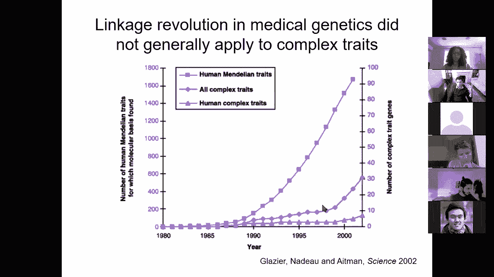
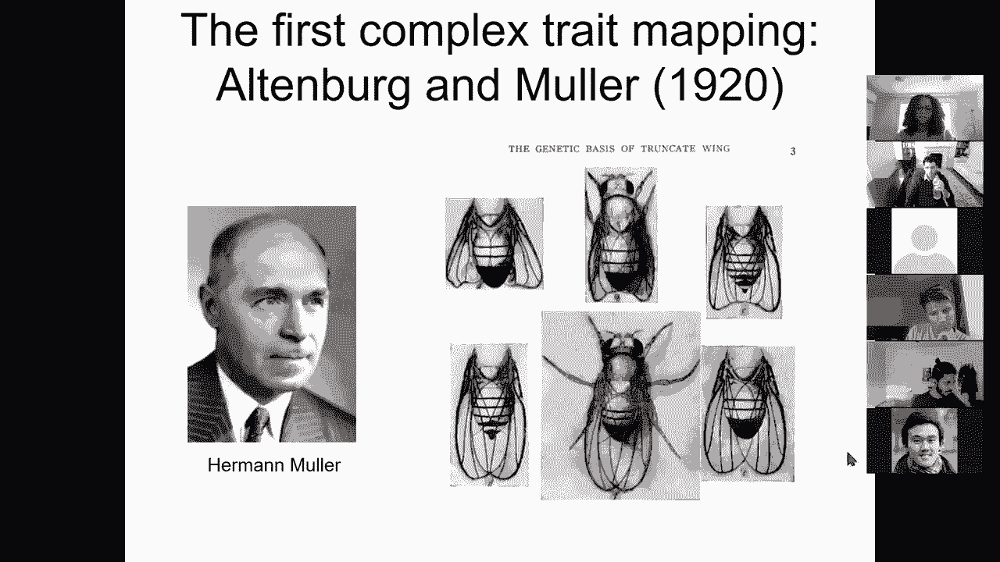
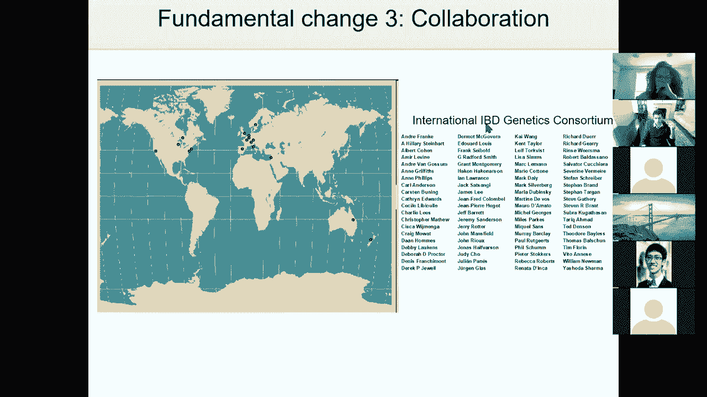
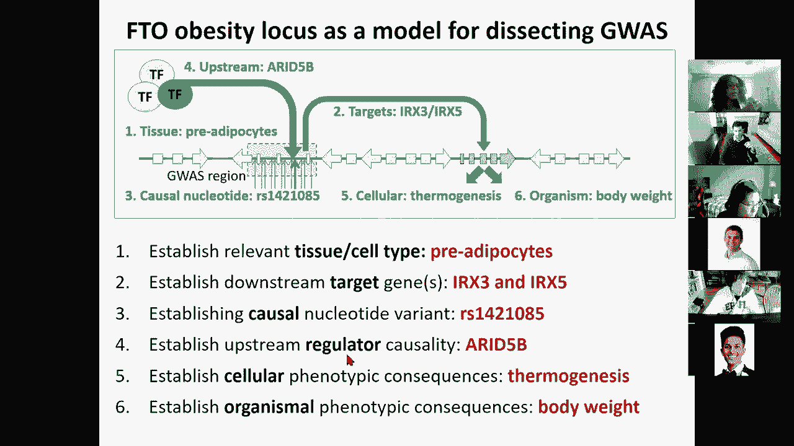
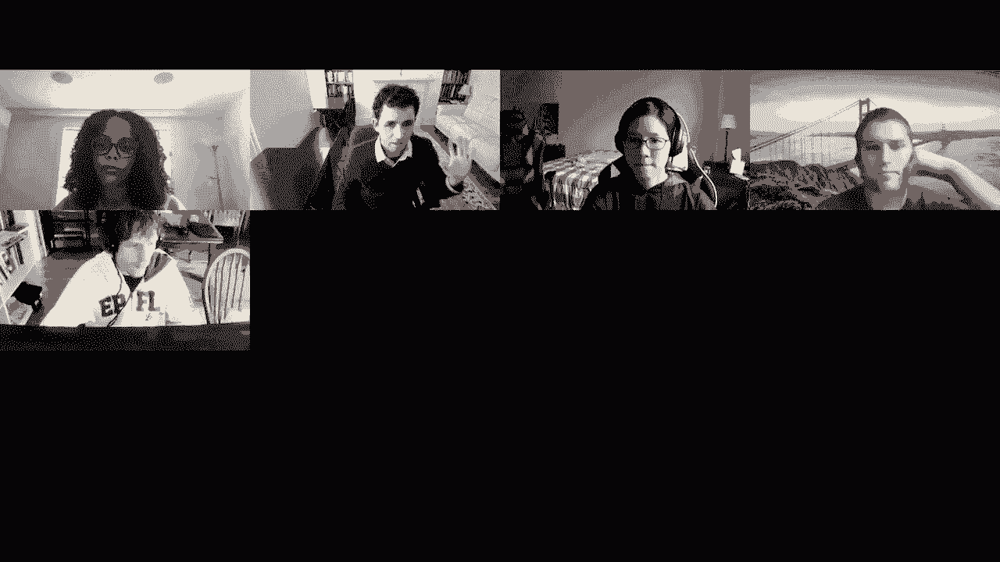

# 【双语字幕+资料下载】MIT 6.047 ｜ 基因组学机器学习(2020·完整版) - P14：L14- GWAS 和疾病解剖 - ShowMeAI - BV1RM4y1g76r

all right welcome everyone，today we're going to be talking about uh。

disease mapping so we are here in the，second，lecture of the population genetics。

disease genomics module，we've talked about um a lot of the，circuitry，of genomics and then we saw。

how genetic variation is at the，foundation，of phenotypic variability but we've，primarily focused on。

the variation itself in genetics today，we're going to be focusing on the，variation in function。

and how that relates to variation in，genetics，and then next two lectures are going to，then。

systems genomics so，that's the you know here's the here's，the main goal of。

today's lecture today's lecture is how，do we understand how genetic variation。

relates to disease so i showed you a，slide very similar to this one in one of，the first lectures。

and that was the yeast genome this slide，is actually my genome，this is a genetic variation in my own。

dna and i specifically have three，mutations，which are uh the worst news about。

my genome when i first got my 23andme，genetic variation，mapping uh it came up with these three。

variations that，somehow uh were unfortunate so what are，they，they're basically three common variants。

that are associated with，increased risk of age-related macular，degeneration。

so that's a form of blindness that，causes you to lose the central part of，your vision as you age。

and uh i have three，risk inducing alleles in these，from，you know six percent to about eight。

percent so it's not enormous，but it's still you know the worst news，about my genome。

and that's what i got from 23andme and，when i actually went and look at the，genome-wide association。

for age-related mature degeneration sure，enough the same genes that were in my。

disease report were up here reigning，supreme，as the strongest genetic associations，with amd。

so the big question of course is how do，the you know how do those function what，do those。

mutations actually do and they're，actually located，in uh three different parts of the，genome。

two of them are disrupting the proteins，so they're actually changing an amino，acid and one of them。

is in this non-coding region near the，sin3 gene and these ti mp3 gene。

and if you look specifically at these，locus，these are actually sitting upstream of，temp3。

and then inside sin3，and the question of course is you know，what do they do。

and can i do anything about it basically，can we，learn something about the disease by。

looking at this genetic variation，so in the beginning of the module we saw，how we can catalog。

all genetic variants in the human genome，how we can catalog all snips。

systematically or single nucleotide，polymorphisms，today we're going to look at how do we。

systematically associate them with，disease，and also how do we use genome-wide，association studies。

to understand disease mechanism and，function and lastly how do we translate，these insights。

into therapeutics and manipulation，so how do we systematically understand。

the molecular basis of human disease so，that's the，goal for today so how do we go beyond。

just genetic variation to phenotypic，variation，and how we can relate the two to each，other。

so we're going to first talk about，mendelian traits，and linkage as the workhorse of。

mendelian genetics，for building genetic maps and using，family studies to find map variants。

and then we're going to switch to modern，genetics if you wish，with complex traits and extreme。

polygenicity，contributions by the environment and，continuous variables。

then we're going to dive into the you，know mechanistics，of how do we actually carry out a。

genome-wide association，study and we're going to talk about，study design。

qc the chi-square test how to correct，for multiple hypothesis testing。

replication and then qq plots and then，we're going to talk about fine mapping。

and then the differences，of the results that we have from lincoln，versus association。

and in what regimes does each method，work best，between this mendelian approach and this。

genome-wide approach，and then how we can combine multiple，studies and then we're going to switch。

to interpretation and function，how do we understand individual loci and，how do we exploit。

genomic signals and we're going to look，at different，case studies on translating genetic loci。

into mechanism what are the tools that，we can use，and then case studies from the road map，and epimap。

papers and then from the fto paper and，then we're going to look at the systems。

level views for all this，and then i'm guessing time won't permit，it。

into next gen okay so let's start with，genetics，so when you think genetics the first。

thing that comes to mind is obviously，gregor mendel，and that's sort of the that's been the。

traditional view of genetics for about，150 years，and for the last 10 years genetics has。

really become about genome-wide，association studies，and now it's becoming more about whole。

genome sequencing and exome and so forth，so what does mendelian genetics allow。

you to do what mendelian genetics allows，you to do，is recognize that there are discrete。

units of inheritance，and that variation in these units is，transmissible。

and resulted in phenotypic differences，it's this whole，separation between the genotype namely。

what i have，inside my germline and the phenotype，namely whatever that genotype。

encodes as visible phenotypes，and these whole point of mendelian，genetics is that you could look at。

dominance versus recessivity so capital，letters versus lowercase letters。

and how each of those can basically lead，to whether you have。

you know any of these uh dominant yellow，jeans and you're yellow but if you have。

two recessive yellow jeans and you're，not yellow and then this，wrinkled phenotype where basically。

if you uh you know if you have a，specific combination，then that expresses itself so basically。

what mendel was finding is this very，weird，uh count of numbers when he was looking。

at this he was basically finding that，he had this combination，you can think of these little square。

squares with yellow yellow green，yellow yellow green yellow yellow green。

yellow yellow green and these big，squares，with um you know round。

round round wrinkled so basically in the，big square，so this is basically the juxtaposition，of。

two dominant and two recessive um，you know alleles interacting with each。

other so she found this 9331，it，over and over and over again and until，you have the mathematical。

clean uh you know clarity of mind that，mendel had，to basically come up with a concept of。

dominance versus recessivity，and independent assortment of different，uh traits。

okay so that's basically you know basic，high school genetics，and it's a little bit of a review of。

what we talked about last time，that，uh you know um mendel was faced with。

was the concept of linkage that some，pairs of phenotypes，were not quite passed on independently。

and that violated mendel's，second rule of independent assortment。

and the reason why this was happening is，because，they were actually not far enough from，each other。

in the chromosome and he had，a sufficiently you know sufficiently，abundant data。

to be able to detect it and to notice it，that in fact there were some deviations。

and the concept of linkage is that，genes on the same physical，chromosome are passed along in tandem。

unless there's a meiotic crossover that，occurs，and we talked about prdm9 and crossovers。

and sort of these，hot spots of recombination last time so，by，three centimorgan which indicates about。

a three percent chance of recombination，during meiosis okay so basically the，three percent deviation。

from what you would have expected of 50，50 0 0，is in fact um you know because。

of that linkage so linkage was basically，a bug，in fact，linkage became the workhorse of。

mendelian genetics，when start event basically the student，of morgan。

suddenly realized that the variation in，strength of linkage，already attributed by morgan to。

differences in the spatial separation of，genes，offered the possibility of determining，sequences。

in the linear dimension of a chromosome，so the student alpha certified went home，as an undergrad。

and spent most of the night to the，neglect of his undergrad homework。

producing the first chromosome map which，included，sex linked genes y w v m r。

and r in the order and approximately the，same relative spacing。

that they still appear on the standard，basically，be working with your europe project。

and then just revolutionize genetics uh，in passing so that basically became the。

mendelian way of solving diseases，mendelian diseases were basically，traveling。

in predictable and consistent ways，within families，for example you could look at a dominant。

transmission where basically，whoever gets the capital a or the lower，case a for example。

has a disease and that's a dominant，phenotype basically it only takes one，copy。

to express the phenotype so you don't，have to have you know，a lot of children for that phenotype to。

express half the children will have it，and there's thousands of diseases or。

traits that are caused by mutations in a，single gene so we talked about，huntington's。

cystic fibrosis muscular dystrophy is，another example，and then family-based linkage study was。

basically saying，that if i have polymorphisms that i have，already mapped。

such as markers along the body of the，chromosome，that i know how to map and i have。

disease genes that are co-inherited with，those，then i can use that as a way to infer。

the physical distance along the，chromosome or i should say the genetic，distance。

which is some approximation of the，physical distance it depends on how many，crossovers do you have。

per unit of distance to track the，co-segregation of dna polymorphisms。

with disease statues allowing the，identification of the regions containing。

the responsible genes and mutations，okay so this allowed you to say ah。

i have now a co-inheritance of this，marker，with my disease gene and that allows me，to now start。

mapping disease genes near markers，and that basically saw dramatic。

successes in the 80s and 90s further，localization of genes，underlying countless mendelian disorders。

and again there as soon as the sound，gets weird，uh，i can switch microphones can you guys。

still hear me well，yeah all right so，the the concept of mendelian genetics。

was that we were able to associate，genetic，variation with disease variation that。

linkage analysis and positional cloning，which basically means figuring out where。

along the body of the，chromosome the physical embodiment of，these，concept of genetic variation this。

physical embodiment，basically allowed positional cloning and。

that allows genetic factors to be mapped，when they were highly penetrant，the problem is that most。

complex traits are not based on highly，penetrant variation，many complex traits are extremely。

polygenic，with tiny tiny effect sizes and this，continuous，variation along the genome。

so if you look at the number of human，mendelian traits that were mapped in the，80s and 90s。

you see this tremendous success with you，know，1 800 different traits mapped。

different loci mapped that's enormous，by contrast this blue curve of human，complex rates。

was in the single digits uh for a while，basically so with human complex trades，you basically。

had less than 10 genome-wide significant，hits，so this is you know pla a problem，basically。

and even in you know other uh complex，traits that are not human，uh there were just very very few。

examples，so the first such example，was uh in the genetic basis of truncate，wing。

in drosophila where you could actually，see that there are multiple。

and with traits like genetic like height，which are extremely genetically，heritable。

we've basically come to realize that，there are thousands of genetic variants。

each contributing less than a millimeter，to your height，so the concept is that there's genotypic。

variation that contributes to phenotype，but there's also many many other genes。

each contributing to many many，phenotypes，and these intermediate phenotypes。

basically combine with each other to，ultimately alter disease state which is。

not purely genetically driven，but is also associated with，environmental exposures。

and some of those exposures are，affecting other genes，which are then affecting you know these。

phenotypes as well，so this whole concept that uh，polygenic variation drives um。

this disease state and that this，polygenic variation is not just sitting。

in protein coding regions but it's in，fact，outside the protein-coding genes in the。

control regions was already proposed，by king and wilson back in 1975。

suggesting that evolutionary changes in，anatomy and way of life。

are more often based on changes in the，mechanisms controlling the expression of，genes。

then on sequence changes in proteins we，therefore propose that regulatory，mutations。

account for the major biological，differences between humans，and chimps so that was dramatically。

early so 1975，this was not truly embraced by the rest，of the scientific community for many，decades。

after that and again i mentioned how，ronald fisher，in 1918 basically wrote the seminal，paper。

talking about the correlation between，relatives on the supposition。

of mendelian inheritance this whole，concept that many mendelian traits。

can sum to a continuous distribution，so with complex traits instead of one，gene determining the g's。

or trait there's many genes each，exerting a small influence，none by themselves can cause or explain。

the disease of the trait fully，but together with environmental，influences they combine to define。

an individual outcome and most common，diseases，in fact work this way so that's where。

you know we were and that's how things，dramatically changed with genome，association studies。

so here we are in the early 2000s the，human genome has just been finished。

the initial draft in 99 the，final sequence in 2003 so we are，just at the beginning of having a。

complete genome and we can now，enter the era of genome-wide association，studies。

so there's three major elements that，turn the tide the first is genomic。

resources the synchronous technology and，the third one，is collaboration so the sequencing of。

the human genome was a major such，resource the second one is the，understanding of the cataloging。

variation in the genome that's hapmap，and thousand genomes project which we，talked about。

uh last time and then the technological，uh innovation was basically this，microarrays。

this ability to measure，thousands upon thousands of，variants at the same time instead of，cloning。

instead of genotyping one variant at a，time or a handful of variants。

you could now genotype all of common，variation，now it's commonplace to have millions of。

snips in the same array，that allows you for you know very little，cost。

to profile nearly all of the common，variation in the person，and we are now also in the era of。

sequencing an entire human genome，for less than a thousand dollars which，is you know very often。

offered by many companies already，so you could now compare the genomes of。

hundreds of thousands of cases and，controls，for genetic variants that are um。

underlying slight statistical，differences between the two groups，between the carriers and the。

non-carriers，so there's tiny tiny effects tiny，uh differences but then extremely robust。

and then the third thing that turned the，tide is of course collaboration so。

basically if you look at the。

international，uh inflammatory bowel disease and its，consortium you see sites across many。

many different，locations so now we have the ability to，measure variation across。

millions of snips in the genome we have，the ability to impute。

missing snips as we saw last time using，linkages equilibrium and using。

haplotype inference and then painting of，these hablotypes，on top of the genetic variation we can。

now start，asking how do you carry out a genome one，association study。

so there's a lot of quality control，metrics that one needs to do there's a，technical qc step。

where you remove failed snips and，samples there's a genetic，qc step where you basically ask is there。

mendelian segregation，and hardy-weinberg equilibrium can you。

estimate relatedness between individuals，are there gender effects。

is there a hidden population structure，where，you know the ethnic background or the uh，you know。

geographic background of that population，is in fact，explaining a lot of that variation so。

controlling for these，global effects and some of that can be，done through principle component。

analysis as we talked about last time，where you can basically take the，individual by genotype matrix。

and then decompose it partition it into，these principal components and then，remove。

some of those strongest components that，are usually associated with population，structure。

and then there's an analysis basically，you see of whether initial runs of test。

statistics show inflation，and whether there's biases towards，missing data or specific allele。

frequencies，and so on so forth and after you've done，all that，you basically have your genome-wide。

association，statistics and you can ask for every，single snip，in the genome carry out the same exact。

statistical test，so what you're asking is how many，individuals who are cases carry the a，allele。

or the g allele at every locus versus，how many individuals who are controls。

and by expectation you would expect this，ratio，to be the same by chance so you would，expect。

47 a alleles and 47，in controls and 47a alleles in cases，compared to。

950 g alleles in both cases and controls，but what you're observing is instead of，this 4747。

you see this over representation，of um，allele a in your cases and this。

underrepresentation of allele a in your，controls，sorry this underrepresentation of a and。

this over representation of a in the，controls，okay so you're deviating from what you。

would have expected，and of course the question is is this，statistically significant。

so you can ask what is the observed，minus expected squared，divided by expected and that's basically。

a chi-square test，so this is the simplest statistical test，you can imagine。

to basically see if in a two you know by，two contingency table。

there's deviation from that expectation，so this is the，observed minus expected square divided。

by e for，you know each of the quadrants and then，together that gives you a chi-square，score of 24。

5 and then you can look at，based on the degrees of freedom，how far down that，[Music]，curve does 24。

5 take you，and it takes you at 7。3 times 10 to the，minus seven，okay so。

basically genetic association results，require very arcane statistics and。

complex multi-market models are very，often less reliable so they've been。

shied away from by the statistical，geneticist，so who's with me so far on sort of，carrying out this。

genome-wide association study so you，basically take every snip in the genome。

and then you ask what is the frequency，of，the reference versus the alternate，allele。

for every single snip and whether that，frequency deviate from what you would，have expected。

so we're at 75 25 0 000。okay so there's a problem however i，don't know if you've seen this xkcd。

cartoon，oh，um xkcd multiple，hypothesis testing there you go so，okay um。

jelly beans cause acne scientists，investigate，but we're playing minecraft fine we。

found no link between，jelly beans and acne it's not，significant，that settles that i hear it's only a。

certain color that causes it，scientists investigate we found no link。

between purple jelly beans and acne，no link between brown jelly beans and。

acne no link between pink jelly beans，and acne，no link between blue jelly beans and。

acne and they keep going on and on and，on and on，until one of them we found a link。

between green jelly beans and acne，news green jelly beans linked to acne 95。

confidence only 5 chance of coincidence，so what's going on here they basically。

tested 20 different colors，and one of them was significant with。

only one chance out of 20 of coming up，significant so what's actually happening。

is multiple hypothesis uh inflation so，you're basically testing a lot of，hypothesis。

each of which has the same chance of，being wrong and one of them，by chance is going to be wrong uh。

so um we did the green study again and，no link it was probably uh，versus。

acne link more study recommended anyway，so i don't know if you guys have seen。

this cartoon before but，this is the problem that we're facing，basically if you find an association。

with 10 to the minus 5 and you're like，this is great but you've done a million，tests。

so the field of g was was，uh earning itself a bad name early on，because people were doing the。

statistical test and they were like，testing 20 loci in their favorite genes。

and then reporting a significant，association for those 20 and then they，were super happy。

but then the problem is that these，studies would not replicate，and there's a phenomenon known as。

you know winner's curse and this call，this this this problem that if you。

barely pass genome-wide significance but，then you test again again and again。

chances are that you're going to，actually go below genomic significance。

and the reason for this is that there's，an ascertainment bias basically if you。

win if you just pass the threshold，and there's an underlying distribution。

which is basically looking like this，and you're not going to get excited if。

you you know and and you have this，distribution for many many loci。

you're not going to get excited for all，the ones that just don't pass the，significant threshold。

but if one of them passes it you're，going to be like whoa this is awesome i。

just passed the five percent，significance threshold，the problem is that there's an，underlying。

true effect size and then there's some，statistical fluctuations，surrounding these true effect size。

and as you sample different subsets，of let's say 100 individuals 100 cases，and 100 controls。

in your sample the effect size might be，distributed，around the true effect size beta so if。

the true effect size beta is here，the observed effect size beta prime that。

you have in any one particular sample，will deviate around that true beta。

and if you have a stringent threshold，that you've，just picked you know that that sort of。

just barely crosses that threshold，you run the risk of having sampled，something from。

the right end of that distribution，and if you choose another sample it will。

just randomly come up from the left side，far，on this um winner's curse。

with statistics and random sampling，awesome，so basically what this is telling you。

and this is what underlies，for example fighter jet pilots who，performed really really well。

would receive an award and then on their，next dogfight，they would basically uh perform worse。

so the army said oh no we should we，should stop rewarding them because that。

changes their performance，but in fact what was happening is that。

they were simply regressing to the mean，you know the next time they were more，likely。

to be another independent sample from，that distribution，and some days the pilots would perform。

slightly worse than usual，and some days they would perform，slightly better than usual if you pick。

those slightly better，and you follow them if you pick the best，are。

they're just going to perform slightly，worse uh，the next time around all right so uh，we're at。

56 38 6 0 0。okay so we need to actually correct for，multiple hypothesis testing。

green jelly beans don't cause acne so we，um if in linkage，you have about 50 different chromosomal。

arms that you're testing，so if you divide this 0。05，threshold of being wrong roughly only 1。

out of 20，you basically divide that by the 50，chromosomes you get a p-value of 10-3，that you need。

to meet in order to be statistically，significant at 0。05，after correcting for the 50-independent。

hypothesis that you're testing，but with genome-wide association studies。

we're actually performing a million，different tests，that are largely independent from each。

other one in every ld block，every study naturally has，hundreds of ten to the minus three p，values。

purely by statistical chance there's no，real relationship to the disease。

it's just statistical fluke because，you're testing millions of things，so that's where the concept of。

genome-wide significance，came from basically you know folks，agreed，that we would now require。

a genome-wide significance threshold，that would be very stringent。

and if you didn't need it too bad you，have to get a bigger sample。

because you just might be suffering from，winner's curse，so genoy's significance was basically。

defined as，five times ten to minus eight which is，nothing more，than 。

05 the same p-value that the jelly，beans folks wanted，divided by a million different colors of。

jelly beans that you're testing，everybody with me so what that allows us，to do is now。

come up with a much more stringent test，that every everybody needs to pass and。

that's what reversed this，curse of g was where things were just，not replicate。

basically rish and mary kangas proposed，a p-value threshold of 5 times 10-8。

where they basically did a back of the，envelope and they said we probably have。

about a million independent tests this，is well well before the hapmap project。

well well before the thousand genomes，project，so very early days and they just said oh。

well it's probably a million independent，test and then about 12 years later three，different groups。

empirically derived estimates based on，dense genome-wide maps of common dna，be，between 2。5 and 7。

2 times n minus 8。so they were right with this ballpark 12，years ahead。

of their time and that is still the，threshold that people are using for gmo。

so here's the first g was for ibd so uh，you know inflammatory bowel disease you，basically have。

no hits for most of the genome except，for a handful，that boom past this genome-wide，significance。

threshold so there's not two and ilr，il-23r and then there's some that are。

begging here to become significant，and um you know so and so forth。

and then ibd5 one of the well-known，genes from linkage，was in fact nowhere near significance。

so what do you do with this and first of，all why are some of them。

recapitulated and some of them are not，so，again replication was key so don't。

believe a report of association from a，single study even with strict qc。

there are artifacts that can affect one，every thousand or every 10 000 snips and，escape notice。

so strix you know my significance，generally is not dramatically，if it's not dramatically excluded。

exceeded，or reached that only a single study you，need to basically repeat it。

in a new study to see which ones of，those that are just barely。

reaching significance if at all uh are，in fact going to be replicated in，yourself。

so that's what uh this uh these results，represent so basically this，is what we call a manhattan plot。

and the reason for that is that there's，many many tall houses but there's a few。

super super tall skyscrapers surrounding，these houses，so if you look at the manhattan skyline。

this is basically what it looks like so，you have a few，locations that are just the super super。

tall skyscrapers，every dot is a different snip a，different single nucleotide polymorphism。

every x coordinate is the location，on the chromosome and the y coordinate，is the minus。

log 10 p value of the，genetic correlation so the，eight five times ten to minus eight。

is you know roughly uh here so basically，just slightly below，ten to the minus eight okay。

so this is basically the typical，manhattan plot that basically tells you，where every snip lies。

and another very helpful plot is，looking at whether the expected，chi-squared value。

matches the observed quite square value，along，the distribution here so you can now ask。

how are the rest of the snips，distributed yes those are，off-scale but how are the rest of the。

slips distributed and you can use this，qq plot，to see whether these are distributed a。

long expectation，and whether they deviate early or not，and what is that confidence interval all。

around the null distribution so that，basically tells you that there's a large，number of snips。

that are clearly deviating statistically，even though they might not reach。

genome-wide significance no significance，and then of course the next challenge is。

how do you go from a region of，association，to a snip of association and that's not，always easy。

so if i for ilr il23r there's a clear，snip，that is the strongest genetically。

and that happens to be the protein，coating changing，snip but that's an exception。

most of the time there is no clear，winner and most of the time there is no，protein coding。

varying so you're going to have to，figure out how to do the fine mapping。

and we're going to talk about fine，mapping approaches shortly，so these are all of the snips in that。

region of association，and then their specific locations，with only one out of approximately a。

thousand bases，now more like 300 bases or less of，variation in the human genome all of us。

have exactly the same sequence here，but many of us carry one of those。

common variants in a haplotype and of，course in the background of all those。

common variants there are additional，population specific variants and。

family-specific variants and the novel，variants and even somatic variants。

that occur in the context of the，skeptics，awesome so 50 40 13 and then uh how's，the pace so far。

oh wow cool just right and a few folks，so that's statistical fine mapping。

and there are many approaches for fine，mapping，so the peak snip is the one that has the，strongest p。

value and you can basically ask well，what is the，set the credible interval set among all。

of the snips，that i'm seeing which ones are still，credible，so you can do that by looking at what is。

the r squared，this is exactly the linkage equilibrium，metric that we talked about earlier we。

talked about，d and d prime and r squared in the last，lecture so you can ask。

what is the r squared in this locus，between the each snip，and all of the other snips so this is。

the genome-wide significant snip，and then you can ask not what is，the p-value of the other snips。

because that p-value is of course，inflated by the top snip，if you are in a link in a strong linux。

equilibrium with a lead snip，and the lead snip is the only functional。

snip you will still have a very strong p，value just because you're tagging along。

so the goal of fine mapping is to，basically ask which of these snips are，simply tagging along。

versus which ones are actually，in the credible interval so that's what，these locus zoom。

views are looking at so you can ask，with different um metrics，what which of the snips are likely to。

still be real，so one metric is simply using the lv，with a peak snip，so at various thresholds of。

ld r square you can basically，paint the snips based on red orange，green and blue。

based on how far they are from in in，genetic space，from the lead snip you could also。

look at a penalized regression basically，if i，correct for the lead snip what is the，residual beta。

for all of the snips that are，nearby and you can ask what is that，residual beta。

and i can you know infer that as a set，of credible snips for，all of the genetic variants that have a。

non-zero beta，you could also ask if i，[Music]，sum all of the posterior。

inclusion probability so basically this，is the probability that any one of those，snips is actually。

important what is that posterior，inclusion probability，and then summing those to credible sets。

with some probability of coverage，greater than 95，you will note that the peak snip is not。

always the highest vip，and the reason is that there's a，correlation structure of the snips in。

the region，that is actually driving up the score，of the most linked snip。

because of the linkage equilibrium，properties and if you correct for that。

linkage this equilibrium structure of，that region of how，every snip is correlated with every。

other snip thereby boosting the signal，of the top snip you might realize that，in fact。

your most likely causal snip，is one that is actually not the top one，because it has perhaps a lower。

association with all the other ones，causing it to be less inflated，but a higher posterior inclusion。

probability，you could also find map using，trans-ethnic，studies so by looking at the association。

in an asian sample or in an african，sample，you might actually have different ld。

structures within each of the，populations，and when you combine the multiple。

populations you might realize that well，those two snips，are the ones that are most likely to be。

causal，even though this one for example was not，one of the top snips，ethnic。

fine mapping and then a lot of the，remaining of the lecture，we're going to talk about multi-region。

find mapping，using specific annotations and just to，spill the beans a little bit if you have。

an annotation，that's you know annotation two here，that's not found in the credible set。

here and is not found in the credible，set here is not found in the credible，set there。

you're likely going to say well，annotation true is probably irrelevant，to my trade。

but if you look at annotation one it，overlaps the credible interval here。

and it also overlapped the incredible，interval here for example。

with genetic variants associated with，heights you might see that across 100，loci。

embryonic stem cell enhancers keep，being within the credible interval。

so you might say i'm going to now have a，posterior probe，a prior that is higher when a snip。

overlaps an embryonic stem cell enhancer，for genetic variants associated with，height。

and therefore if i see overlapping locus，1 and 2，i might predict that the top posterior。

inclusion probability snip，in locus 3 is the one that specifically，overlaps。

the annotation that locus 1 and locus 2，overlapped，and that also has a sufficient，association to be。

in a credible set so who's with me here，on the different methods，for fine mapping so we have just。

this you know everything within a，than，something anything that has a residual。

beta that's greater than zero，anything that has a posterior inclusion，probability。

after correcting for the ld structure，that's highest，a multi-ethnic study which gives you a。

posterior probability combining，the individual estimates and an。

epigenomic or other kind of annotation，based，enrichment okay so we're at。

so going back to this association uh，results，we basically have uh you know several，loci。

that are at or near genomic significance，the question is were any of them also。

discovered by linkage analysis，and the answer is one of them was。

discovered by lincoln generalists again，this is very clearly real，this is way above the genomic。

significance threshold and that's also，way above the genomic significance。

threshold but this was actually not，discovered by linkage and the question，is what's going on。

why would linkage not find some of them，and find other ones and the reason is，simply。

due to the frequency of the snip，and the odds ratio this is the increased，risk。

this is increasing your risk by，threefold，this is decreasing your risk by。

threefold this is increasing your risk，by only 40 percent，so if you can you can calculate based on。

the frequency of those snips，in the population and based on the odds，ratio。

estimated from your sample where you，where you found them to be genomic。

significant or whatever sample even if，they're not genomes significant。

you can basically ask how many，cases would i need in an association，study。

to achieve genome-wide significance and，here you have，you know in the order of hundreds of，cases。

but you can also ask how many linkage，pedigrees do i need to achieve，genome-wide significance。

and the ones that was previously，discovered the one that was previously，discovered not two。

only needs 1 400 pedigrees to be，discovered，i mean you know that's still a lot of。

families but that's something within the，sample size that was already tested。

but the other ones that have these more，subtle effect sizes or more subtle，frequencies。

you basically need tens of thousands of，families，in order to be able to discover them but。

you only need，a few thousand cases to be able to，discard them with genome-wide，association。

so that basically tells you the regimes，at which linkage analysis。

works versus association so this one is，a low frequency，strong risk variant and because it's a。

risk variant，it's easy to find families that，have simply an increased prevalence of。

inflammatory bowel disease，but for a strong protective variant even。

though the association is the same，you would never be able to find it in a，linkage analysis because。

in a linkage analysis you're basically，selecting pedigrees，where the disease of interest is。

actually overrepresented not，under represented you don't have the，power to select those values。

and again for atg 1601 this is a common，associated variant，so this is quite easy to achieve，studies。

because even though the effect is subtle，only 40 compared to 300 percent for this，one。

the variant is very frequent so you can，actually associate it，but because the odds ratio is so small。

linkage does not give you power，all right who's with me so far you guys，recognize。

is that as you combine multiple studies，you can discover，odds ratios that are smaller and smaller。

smaller more and more subtle，so here this is a you know 0。2 increase，and a 0。3 increase in 0。

5 increase or 50，increase，and by combining all three published。

studies you can basically reap the power，of an 800 sample she was。

and again nearly all progress of g was，has been the result of，multiple uh studies being combined。

in a meta analysis and that has led to，this，threshold this inflection point that you。

see over and over again，in multiple traits so the first，studies yielded almost no loci for many。

years，and then suddenly you turn the tide and，you discover，dozens of loci suddenly the same thing。

was found，in schizophrenia so you could basically，see here that there's absolutely no loci，only。

less than a handful and then suddenly，you go from，less than five to you know。

dozens to now hundreds of loci，and that's simply a function of，increased sample size。

and that's something that has，transformed the field of genetics，basically，this conviction。

that if you keep testing if you keep，finding，more individuals more and more and more。

cases eventually，you will have a lot of additional signal，you can see here no loci with 3 500，cases。

5 loci with 10 000 cases and 62 loci，with 35 000 cases，and now 265 loci with 65 000 cases。

and then that same inflection point is，found in nearly every complex trait the。

same story was found for type 1 diabetes，for type 2 diabetes for serum，cholesterol levels。

for every common chronic disease and the，reason，is that these traits are heritable。

and they have simply a large number of，small effect sites，so the genetic architecture of every one。

of those，um gives you，some insights as to how many laws that，you would need to go and discover them。

so for height it was on the order 5000，individuals as you start increasing。

you know twofold threefold ninefolds and，you have discovery，for crohn's the scaling factor here's a。

thousand for schizophrenia is three，thousand so，you can see here the polygenicity is，highest for。

height and then lower for schizophrenia，and lowest for crohn's disease。

so that basically showed the world that，schizophrenia is a heritable。

a medical disorder it's not just you，know some，weird environmental influence and that。

the genetic architecture was similar，to non-brain diseases and traits with，many genes。

enabling recognition of key pathways and，processes，and that's what we're going to talk。

about next the fact that，as you start looking at these dozens of。

loci you see that multiple voltage-gated，calcium channels are in fact repeatedly。

hit that there's proteins interacting，with fragile x there's proteins involved。

in nuclear neuron organization，and post-synaptic density and the，driptic spine。

heads and there's enhancers that are，acting in brain in the angular gyrus in。

the inferior temporal lobe and，immune enhancers and so so forth so，that's where g was。

is now you basically uh in 2011，you had already outpaced uh you know。

any kind of expectation and in 2018 you，have，70 000 genomic association studies and。

today we have more than 120，000 genome association studies that are，that are genome-wide association。

genome-wise significant loci，and you can see here the huge diversity，of traits that they're。

we basically talked about mendelian，approaches for linkage，through these genetic maps in family。

studies we talked about，complex traits and their association，using polygenicity。

using environment using these contiguous，continuous traits and we also looked at。

the basics of a genome-wide association，studies so how to carry out qc。

chi-square multiple testing replication，and we also looked at，different methods for fine mapping and。

how linkage relates，with association and how to combine，multiple，studies so who feels that they've。

is there a limit to the number of，samples needed for this type of analysis。

that is a number of genomic sequences，for which having more sequences provides，little return。

erez that's an awesome question and the，answer is，we haven't found that limit yet and。

we're going to talk about that a little，bit in the context of systems genomics。

the fourth lecture in this module，but this concept of moving from，polygenic to omnigenic and sort of。

finding core pathways，that are truly directly linked to the，disease and then a set of auxiliary。

pathways that are sort of bringing in，information from many many other places。

that are simply touching and modulating，these core pathways is where the field，is at right now。

the more you look the more you discover，but at some point，the signal gets diluted out from the。

central pathways，to more peripheral pathways so that's，sort of perhaps the end but。

i don't think that there's any place，where we're going to stop discovering，additional loci。

with tiny effects okay，so uh yeah 50 50 700，all right so let's now switch to，interpretation。

how do we go from a genetic locus to the，mechanism through which it works。

how do we do that for individual loci，and how do we do that for global signals。

so we're going to look at different，tools and then we're going to look at，some case studies。

including the roadmappings paper this，epimap paper and this fto paper。

all of which i've had the privilege of，being a part of，so the goal of g was was to inform on。

the biology of disease，in an actionable fashion so how do we，get there。

there's a challenge of interpretation，most associations，do not identify specific genes and。

causal mutations，instead they're just pointers to small，regions。

with causal influences on the disease in，order to develop and act on a。

therapeutic hypothesis we must go much，further we have to figure out what gene，is connected。

to the disease what biological processes，are implicated what is the cellular。

context in which it acts，and what are the functional alleles that，perturb that process and promote。

or protect from the disease the promise，of genetics，has been that by carrying out these。

manhattan plots，basically doing these genome-wide，association studies we would find。

genes and that is，you know not exactly the case we found，genetic loci but to find the actual，genes。

is harder and the reason for that is，that when you open up these loci。

such as this fto locus here which is the，strongest genetic association with。

obesity this association was discovered，in 2007 and this is，you know subsequent g was from 2010 that。

has many additional loci，but when you look at this association，which was discovered。

you know 10 years plus ago you have，89 common variants none of which。

is actually perturbing of the protein，and that's the case，for ninety percent of g was in most of。

the cases you're not going to find，a protein coding gene that's directly，perturbed。

this fto locus was thought to be one of，the easy ones，because there's a single gene that。

underlies this locus，in many cases you have a dozen genes，that are all sitting here。

and you're like okay gosh which of these，genes is it this was thought to be an，easy one。

because there are no other genes，so everybody basically went after the，function of this fto gene。

but they all came back empty-handed they，couldn't figure out how。

fto acts on obesity don't get me wrong，fdo had a bunch of phenotypes but none。

of them was actually obesity associated，and of course deleting the whole region。

didn't necessarily point to this fto，gene because maybe this is a control，element。

for some genes that are far far away and，in fact that's exactly what our group。

showed 10 years after this discovery，which showed that the true targets，are actually sitting 1。

2 million，nucleotides away，and 600 000 nucleotides away so well，well past these linkage equilibrium。

blocks，so the challenge of this deciphering，mechanism is that。

for ninety percent ninety-three percent，of cases the disease hits are actually，non-coding。

therefore the target gene is not known，the cause of variant is not known。

the cell type of action is not known the，relevant pathways is not known and the。

mechanism is not known，so how do we overcome this so，that's what this course has been。

building up to guys i mean，you should like now say wait a minute we，know how to do this。

so we've talked about annotating，non-coding regions of the genome。

about linking enhancers to regulators，and to target genes，about elucidating intermediate molecular。

and cellular phenotypes，for these variation in order to be able，to deliver。

the relevant cell types the target genes，the causal variants the option。

regulators the relevant pathways and，these intermediate phenotypes so based。

on all these papers based on all this，work we basically wrote，this review paper back in 2012 which。

eight years ago now is still very much，relevant about，interpreting non-coding genetic。

variation in complex traits and human，disease，so what this paper did with my former。

postdoc luke ward，is look at the diversity of genetic，architectures underlying human。

phenotypes we talked about classic，monogenic traits，monogenic traits with multiple disease，alleles。

monogenic leads with independent，contributions，these are oligogenic multiple loci with。

independent contributions these are all，eugenic traits，and then large number of variants that。

jointly contribute，weakly to an effect and variance，regulating a molecular trait with。

unknown effect on organismal phenotype，and variants causing no known molecular。

phenotype and no effect on organismal，fitness，as well as private and somatic variants。

so these are the types of variation and，how do we understand them。

and then we talked about these common，genetic，g，was and you know the basis the workhorse。

that we've talked about of cases versus，controls，but also qtls that we're going to talk。

about in the next lecture，of how you can discover not just，genetic variation that impacts phenotype。

but genetic variation here that impacts，gene expression levels，so for example here if in blue you're。

measuring the gene expression level for，a bunch of genes nearby and you see that。

all of the all of the individuals，carrying a t allele for example have，higher expression。

for these gene nearby you can basically，say that there's an association。

between a genetic variant and a，molecular intermediate trait，which we're going to talk about very。

shortly and at great length in the next，lecture you can also look at genetic。

associations with allelic activity，where there's a genetic variant that，controls。

whether the nearby locus is actually，going to be，allelic or not and you can also have。

molecular biomarkers，for these organismal traits so even if，you don't have a genetic variant that is。

associated with cause control，you can actually have an intermediate，molecular phenotype。

for example the expression of this gene，might actually be higher，in the controls and lower。

in the cases that might mean that，loss of expression causes the disease or。

it might mean that if you have the，disease，you the disease causes that gene to lose，its expression。

or maybe when you have the disease your，body fights the disease by turning off，that gene。

so there could be all kinds of，correlations when you take genetics out，of the equation you take the。

unidirectionality，of that association and then we talked，about the mechanisms through which the。

non-coding variants can influence，disease they could influence a，non-coding element they could。

through a splice junction or a splicing，enhancer，or through translation stability and，localization。

or through the trans regulatory rna，or through promoters or through，enhancers。

or even via synonymous mutations within，protein coding sequences。

and again there's examples for each of，those，and then we talked about the three types。

of evidence for geos interpretation，the first one is epigenomic。

information through enhancers promoters，transcribed regions that are basically，showing an enrichment。

across the genome that allows you to now，find，which of these variants are likely to be。

functional the second one，is using the motif，disruptions for the individual variants。

if this variant doesn't change the motif，but this variant does change the motif。

you lose motif b here you might say aha，this variant，is probably the causal one and。

alternatively you might find，that the some variants are actually，lying in。

evolutionarily conserved elements and，disrupting nucleotides that evolution。

has been minutely preserving，across millions of years and others are。

not disrupting conserved elements，suggesting that this might actually be。

the causal one and we're going to talk，about comparative genomics and mammalian，constraint。

in the next module and then there's a，lot of tools that have been built for，using this so luke。

who's the author of this paper developed，haploreg，but regulumdb is another one ensemble。

has a lot of tools and then there's，a lot of other tools that have。

both disappeared since then but also，emerged since then，and then the last component that we。

talked about was the systems level，analysis the fact that，you can look at genes within the。

associated loci，and then find specific enrichments in，biological processes。

that allows you to then prioritize a，subset of，genes and loci that are also in those。

processes and boost，their significance you could also look，at what is the。

uh what are the annotations that are，showing the highest enrichment。

and then use those as empirical priors，to then go in and，prioritize specific annotations。

and then look for specific，loci that exhibit high allelic，hydrogenating。

which are implicating the disease or，implicating causal variance through，whole genome。

uh sequencing and then various tools for，actually carrying out this enrichment。

analysis you can carry out，gene set enrichment analysis uh through。

the associated loci by basically ranking，all of the，genes nearby or look for concordance。

with eqtl results，or enrichment in specific chromatin，states，or both tf binding site and dna。

hypersensitivity enrichment，so these are the basic tools that are at，your disposal。

and then i want to highlight utilization，of these tools through a series of，papers that。

you know we and others have written so，the first one is this roadmap genomics。

project and this encode project，that together basically looked at dozens，of different tissues。

and their association and their，associated enhancers promoters，transcribed regions repressed regions。

hydrochromatic regions，and active regions so through these，chromatin state。

analysis that we talked about in the，epigenomics lecture，and through the specific peaks of these。

histone modification marks as well as，the specific accessible regions in high。

resolution through the inaccessibility，we've been able to map the set of。

regulatory elements that are active，in every one of dozens of different，tissues and cell types。

so we've used those to map chromatin，states across，more than 100 different tesions and cell。

types to then，function，we talked about that in the epigenomics，lecture to predict the upstream。

regulators of these modules，and to also link enhancers to their，downstream target genes。

through membership in modules that are，correlated with each other。

or through direct correlation between，the enhancer and the gene，you can now use this information to。

start，inferring the circuitry of gwas loci，how by basically asking what are the，individual snips。

that are underlying this association，this is using this，statistical fine mapping or this。

credible interval，or this multi-ethnic study or other，approaches to infer the posterior。

inclusion probability of every snip，you then can ask what are the enhancers。

that those snips overlap what are，the cell types where snip，overlapping enhancers are enriched。

what are the genes whose expression，is correlated with these enhancers。

and what are the upstream regulators，whose motifs，are enriched in these enhancers。

so that gives you the components that we，were looking for for finding the target，genes。

for finding the cell type of action for，finding the causal nucleotides。

and for finding even the upstream，regulators，who's with me so far you guys are，following。

awesome so we basically built，a series of tools for doing this，and then。

selecting a genome-wide association，study and systematically mining。

encode and roadmap genomics across，hundreds of assays and dozens of cells。

and conservation and motifs，and reporting significant overlaps but，also linking。

to information in browsers here's one of，my favorite loci，so you can basically see here this。

association with，you know adipose and mesenchymal stem，cells in these enhancers that are active。

specifically there，and you know this nearby gene ppa or，gamma，and this in fact suggests that the。

driver might actually not be，the missense variant but instead another，variant that actually。

seems to be perturbing things in the，correct orientation，as opposed to mrs merritt but the more。

general methodology is that we're going，to be identifying，these these relevant cell types through。

the systematic overlap of these，genetic loci that are associated with，different disorders。

and that are enriched in specific，annotations so，this method takes power from the fact。

that we don't have just a single geos，but we have dozens of genome-wide，association studies。

and for every one of those we can look，at what are all of the associated loci。

and what are all of the snips within，these loci that are specifically，associated with the disease。

and if you do this with height you find，certain locations in the genomes are，painted。

if you look at type 1 diabetes you find，different locations in the genome。

if you look at blood pressure yet，another set of locations if you look at。

cholesterol yet another set of locations，so every single genetic trait paints。

a different subset of the genome and you，can now，come up with a different set of colors，and ask。

which of those overlap enhancers，that are active in stem cells or。

enhancers that are active in immune，cells or enhancers that are active in。

heart or enhancers that are active in，liver，and that allows you to now infer a map。

between genetic traits and，the tissues where these traits might be，acting。

so we're identifying all of the，associated regions at some p-value，threshold。

and this could be 5 times 8 or this，could be a sub，threshold cut off for example at 10 to。

the minus 4，10 to minus 3。 and then considering all，of the snips in the credible interval。

say r squared greater than 0。8，and then evaluating the overlap with，tissue-specific enhancers。

and keeping the tissues that show，significant enrichment，and then you repeat for all traits and。

all cell types，and what you end up with is something，like this that basically tells you that。

if i look at the genetic variants，associated with height，i find that they're enriched in。

enhancers active in embryonic stem cells，genetic variants associated with immune，functions are。

enriched in t cells and b cells genetic，variants associated with。

heart repolarization or blood pressure，are enriched in enhancers active in the，left ventricle。

we're not talking about genes here we're，talking about enhancers we haven't even，looked at genes。

this is directly looking at the，non-coding genome that basically says，that these genetic variants。

are specifically perturbing non-coding，gene regulatory elements。

active in left ventricle if you look at，fasting glucose related traits。

extremely specific to type 2 diabetes，for example you see，here the strongest enrichment is。

associated with pancreatic eyelids and，these are those，specific beta cells that are killed。

by the t cells in the case of type 2，type 1 diabetes and in the case of type。

2 diabetes these are the ones that are，saturating，and are no longer able to control。

insulin correctly，if you look at cholesterol associated，genetic variants。

they localize in enhancers active in the，liver，if you look at inflammatory bowel。

disease they localize，and enhance the genetic association，variants they localize in enhancers。

active in both，immune and inflammatory cells as you，would expect from the name but also。

in digestive tissues again as you would，expect by the main suggesting that，genetic variants。

both in immune and in digestive，components，are associated with inflammatory bowel，disease。

and one of the surprises at the time，that we wrote this paper was that。

alzheimer's disease was not associated，with brain，at all we would expect that alzheimer's。

act specifically in brain but this was，not the case，what we found instead was that，alzheimer's was。

super mega enriched for cd14 plus，immune cells these are monocytes。

these are both circulating macrophages，in the blood，but also the resident microglia。

in the brain suggesting that in fact，only a subset of brain cells a tiny，minority of brain cells。

that are playing immune functions are in，fact driving，this association with alzheimer's，disease。

and indeed we published a companion，paper also in nature，that basically looked at these conserved。

epigenomic signals in mice in humans，revealing the immune basis of，alzheimer's disease。

so what we basically found is that if，you look at mice，the changes that are happening in immune。

functions，are in fact happening much earlier than，the changes that are happening in。

neuronal function suggesting that in，fact，genetic variants associated with。

alzheimer's might actually first act，through the microglia and only then act。

through the rest of the brain，and we've now repeated this analysis by，actually sorting cells。

and showing that indeed this is，the，resin immune cells of the brain and，map。

of what are the genetic loci the genetic，traits，and which tissues where their。

uh loci enriching in you can see here，alzheimer's，clusters with the immune traits。

surprisingly whereas，another，you know brain associated traits do，cluster。

cognitive traits do cluster with brain，and so forth，and this was then this is now uh we've。

basically scaled this to，800 plus uh tissues，by including many additional consortia，and。

that has basically led to direct，associations with 245 geos，traits and then tree based enrichments。

across 540 different straights，and you can see here just the same。

picture but now with tiny tiny little，dots，with you know 30 000 loci that are。

specifically sitting within these，unoriginal notations，so that allows us to now start looking。

at the dissection，of these traits by going down，the list of enriched tissues。

and then asking which loci within these，traits，these，enriched issues and can we use these。

enhancer gene correlations，that we saw in the previous lecture to。

basically start predicting the target，genes，of these upstream uh regulatory elements。

so you can see here the association，there's a，lead snip here which is higher than all。

the other ones and that leads snip，localizes specifically in these，enhancers。

so this is a breast cancer geos and this，actually localizes an。

enhancer that is active specifically in，the breast epithelium。

and is linked specifically to this ntn4，target gene which is associated with，prognosis。

and metastasis of breast cancer so this，is allowing us to now，go into this genetic loci for 30 000。

different pictures，and sort of paint this then we have a，website where you can actually go and do。

this systematically，here's another example with a genetic，association with schizophrenia。

and you can see here instead of the nice，tight correlation that we had in。

a localization with only you know one，snip，you now have dozens of snips that are，weakly associated。

and all of those snips are in fact lying，in these enhancers，which are all together linked to this。

common target gene，which is this calcium signaling，transport gene so which is。

you know specifically associated with，schizophrenia，we also are able to now go and look at。

much more complex traits so this is，looking at，how individual traits are in fact。

localizing in individual tissues，and how those tissues are in fact。

associated with how these traits are，associated with a single tissue。

or multiple tissues so if you see a，circle that's entirely green。

that means that the only enrichments are，found in these immune cells。

but if you see a circle that has，multiple，components that basically means that，it's associated with。

multiple tissues and you can see here，there's a lot of，single tissue traits for example。

educational attainment schizophrenia，you know you have cholesterol associated，with liver。

you have filtration associated with，kidney，you have cardiac traits associated with，heart。

you have immune traits associated with，immune cells and you also have。

ad associated alzheimer's associated，with immune cells，so these are the unifactorial traits。

that we saw，in this picture which were associated，primarily with one tissue。

but then you have this group of traits，here which are，polyfactorial and multifactorial so。

these traits are associated，are enriched in many many many different，tissues。

so what's going on here well these，traits are actually sitting，in between these dance maps。

and suggesting that they're，implicating many different tissues。

and if you look at some of those traits，you basically see，that for example qt interval。

is extremely unifactorial heart heart，heart heart，educational attainment extremely，unifectoral brain。

and the only one that's not directly，brain is actually bipolar neurons。

derived from embryonic stem cells，another one alzheimer's disease。

you see brain but also immune cells，span，an increasingly large number and then，the largest by far。

is coronary artery disease and that has，19 different，enrichments in 19 different categories。

so we can now use these to start，partitioning these enrichments，into specific functions and。

what you see is that for example both，liver and coronary artery，are tissues that are enriched。

for coronary artery disease，genetic variants so but but if you，partition if you partition the loci。

associated with coronary artery disease，that lie within liver enhancers。

you see enrichments for very different，functional processes，than the cad associated loci。

that lie within heart tissue enhancers，which are enriched in very different，processes and。

the same thing happens with the，comorbidity patterns if you basically。

look at what are the traits that are，comorbid，with loci with cad，that are。

showing core associations you basically，see，you know a different set of。

traits for different sets of tissues，and different sets of functional，categories。

so that allows us to now start，partitioning these polyfactorial trades。

into their components so here's，uh this cad analysis in more detail you。

can basically go down the list of loads，and say well，which ones are enriched in liver which。

ones are enriched in coronary artery and，so and so forth，and you can see here this example is。

only enriched in liver，and in liver it only overlaps liver，enhancers and indeed when you look at。

this example there's only liver，enhancers here and it's linked to the，species k9 gene。

which is a well-established，gene underlying cholesterol that acts，through the liver。

by contrast if you see this gene ednra，you basically see that it only overlaps。

coordinator artery here，and heart and atrium here and indeed you。

see this association that is mediated，through multiple enhancers both。

converging onto the same target，gene which acts in heart，but you can see also examples where both。

mechanisms appear to be acting you see，that both liver and you know heart。

samples are found here and indeed you，see that these associations implicate。

primarily liver but also to some extent，some of them are linked。

to another gene here that appears to be，acting in heart，these，polygenic traits so we built a lot of。

resources for systematically，annotating geos and exploring，these associations so we've developed a。

browser for，going through these links going through，these，loci going through these visualizations，of。

target genes and i really um，you know encourage you guys to to just。

go and explore that and it's going to be，very helpful for your projects so in the，touch。

a little bit on this fto locus which is，sort of one of the，first examples of complete dissection。

for a non-coding，disease locus where we identify the cell，type the causal snip the regulator。

target and the process and where we，actually use genome editing to，demonstrate。

the causality of that variant namely，linking adipocyte browning as。

drivers of obesity this is an awesome，collaboration with melina klausen sir。

and many others from my lab and for many，other，institutions so the goal there。

was to apply these six goals，to these specific locus namely how do we，establish the relevant tissue。

and cell type how do we establish，downstream target genes，how do we establish the causal。

nucleotide variant among many that are，in，close association how do we find the。

upstream regulators that control this，variant，and how do we ultimately understand the。

cellular and the organismal phenotypes，that result，from the target genes so。

as i mentioned earlier this fto locus，has 89 common variants，and this is the strongest association。

with obesity，and the regulatory role the target gene，and the tissue。

have been under great debate this locus，impacts only one gene as you can see，here。

but many other genes are in the，neighborhood potentially，causal and many of these have been，proposed。

through different studies but in fact，what we found is that this gene here。

x3 is the true target as well as i，sitting，1。2 million nucleotides away and 600 000，nucleotides away。

and many many ld blocks away as you can，see here，so how do we do that well we use all of。

these techniques that i showed you and，we apply them systematically first to。

find the relevant tissue，and cell type we basically use the，epigenomics roadmap。

looking across the different tissues and，then looking specifically within。

enhancer regions that we're finding are，the most associated with disease。

to to recognize that there's these 12，000 nucleotide super enhancer，that is active specifically in。

mesenchymal stem cells，and these are the stem cells that give，rise to both。

white adipocytes and beige adipocytes，white adipocytes are the ones that are，storing lipids。

and base adipocytes are the ones that，are actually burning calories。

as heat through mitochondrial membrane，depolarization，so we then ask well you know is the rig。

hablotype actually showing increased，activity or decreased activity。

and what we found is that the risk，haplotype shows，higher enhancer activity suggesting a。

de-repression，in the risk individuals that was the，first step。

finding out what is the tissue where it，acts and we found pre-adipocytes the。

second step is looking at what are the，target genes，and there's many ways to find target。

genes one we mentioned，based on the correlation between，enhancer activity and gene expression。

the second one we also talked about，about the genetic correlation between a。

genetic variation and a change in gene，expression nearby，and the third one we talked about in the。

epigenomic lectures，as the folding of the genome in three，dimensions。

this high c or chromatin conformation，capture，that basically tells you if i chop up。

the bowl of noodles what are the noodles，that tend to reconnect with each other。

and this locus here fto had basically，many reconnections，forms，long range interactions so looking。

within this block，of interactions we basically found that，exactly two genes within this large，block。

risk，carrying individuals looking at，homozygous risk and homologous non-risk，individuals。

for this obesity-associated locus we，found that the obesity risk individuals。

were in fact increasing the expression，of rx-3 and rx-5 suggesting again。

de-repression of those two genes，so that is an example of a gain of，function。

rather than a loss of function and it，also acted specifically in early。

adipocyte differentiation the eqtl is no，longer visible，in whole adipose tissue so that gives us。

the first one the tissue where it acts，and the second one is the target genes，through which it acts。

what about finding the causal nucleotide，so again we use this approach of looking。

at specifically which，nucleotides intersect enhance the，regions and which ones are。

evolutionarily conserved，looking at the global enrichment we，found that there's many regulatory。

motifs involved in bmi，that are enriched in the same target，regulators and。

that there's specific motif combinations，that are disrupted，by this t2c variant that disrupts this。

80 rich，t，into a c so what that told us is that，this might actually be this。

evolutionarily conserved motif that gets，disrupted，might actually be the causal vary。

and indeed if you looked at this uh，introduced rs1421085 snip this t2c，alteration。

you found that when you introduce that，in a 10，000 nucleotide construct or in a。

thousand nucleotide construct you，increase the activity，of the reporter gene but you lose that。

in a hundred base per construct，suggesting that it's a really large。

enhancer that needs to function together，so that gives us the tissue the target。

genes and the causal nucleotide，what about the upstream regulator so we，basically looked at what。

are the factors that are known to，recognize this motif，and which of these factors are in fact。

associated with increased，expression in specifically adipose，tissue。

and indeed we found that archive b was，very highly expressed，in both risk and non-risk individuals。

again we don't expect the expression of，the regulator to change。

we only express we expect the activity，of each target，to change so we went in and did a cis。

transconditional analysis changing the，motif and changing the，regulator to look at the interaction。

effects between the two，and we found that it's only when you，lose，both the motif and the regulator。

that it's only when you have both that，you have an effect but if you lose，either one of them。

you basically lose repression so you，require both，for repression but if you lose either。

one of them or both of them，then you have incr de-repression and，same thing with the target。

genes if you have both of them intact，both the cis，and the trans then you have repression。

but if you lose either the system on the，trans you have de-repression。

so that gives us the target genes the，upstream regulators，the tissue and the causal nucleotide。

the last question is the cellular and，the organism of phenotypes。

so how do we bridge that gap between，genetic variation and disease by looking，at these intermediate。

effects and what we found is that，irextre and rx5 were in fact，correlated with both mitochondrial。

function，and with lipid activation the，lipid metabolism genes were positively。

correlated suggesting that increased，expression of rx 3 and rx-5 was。

associated with lipid metabolism but，decreased expression was associated with，mitochondrial function。

and that's where the cellular phenotypes，helped us by showing that indeed。

the risk-carrying individuals have fewer，mitochondria suggesting that perhaps。

they're not able to undergo，thermogenesis，and they have bigger adipocytes。

suggesting that they're accumulating，lipids，and indeed carrying out these。

experiments specifically between risk，and protective alleles，in stimulated conditions or not show。

this dramatic difference，in mitochondrial thermogenesis where the，risk individuals were unable。

to thermogenize whereas the control，individuals were able to thermogenize。

so that gave us this supposition that，perhaps，this c2t alteration caused the shift，between。

white adipocytes and base adipocytes，during the first three days of，differentiation。

leading to this shift from，energy burning to energy storing，and indeed we went in and tested this。

by carrying out specific interventions，of knocking down rx3 and rx5 over，expressing rx3 and rx5，it。

and also using，crispr cast 9 genome editing on the，specific single nucleotide variant，out of the 3。

2 billion nucleotide，nucleotides in the genome and we found，that in every single one of those cases。

we could switch between lean and obese，phenotypes，by knocking down or overexpressing。

the irx3 or the rx-5 gene，we basically saw that we could switch，between lean and obese phenotypes。

dramatically by changing the expression，of irix 3 in mice we saw that the mice。

were losing 50 of their body weight and，they were becoming unable to gain weight。

on a hi-fi diet when normal mice gain，weight，the irix-3 dominant negative mice in，adipocytes。

were not able to gain weight and they，did not change their exercise they did。

not change their appetite，they only changed their thermogenesis，their burning of calories。

and lastly we saw that editing that，single nucleotide variant from t to c。

led to d repression of the gene，back from，c to t showed repression again restoring。

these you know successful repression of，rx 3 and rx5 and indeed editing that。

single nucleotide variant，showed that you could change and restore，thermogenesis。

in the risk individuals by taking，primary adipocytes，from risk carriers and changing them。

into non-risk areas，you could restore the process of，thermogenesis。

establishing for the first time this，complete link between a non-coding，allele。

sitting in a super enhancer acting in，pre-adipocytes，targeting genes that are six hundred。

thousand one point two million，nucleotides away，finding the causal regulator。

and motif this t2c alteration，causing loss of this eighty rich，interacting domain。

when you lose this at rich and causing，de-repression of rx-3 and rx-5 the。

regression of this enhancer，and then the change in the cellular and，in the organismal phenotypes。

so the story is important because it，shows you how，all of these tools that we've been。

learning about are actually fitting，together in a single，framework for systematically。

understanding the relevant tissues and，cell types target genes causal。

nucleotides upstream regulators，cellular and organismal phenotypes。

and that's one of hundreds of loci，so we now need new tools for doing this，systematically。

and that's where we're going to stop so，we talked about genetics genome，association studies。

and then interpretation what are the，tools，and then，a case study looking at the single locus。

level what i like to say this is a whole，paper，about a single snip in the human genome。

a single bit of information，that's where i'll stop and then uh see，you guys。

lecture，on the gewa series who feels that。

