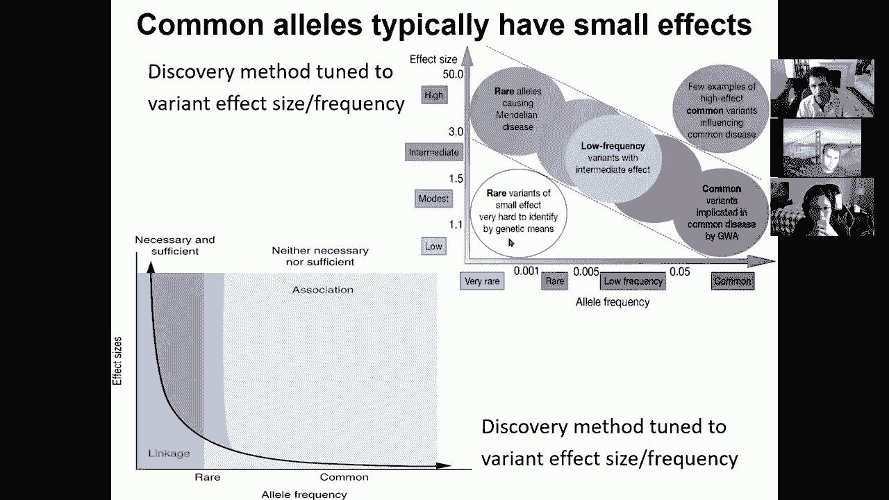
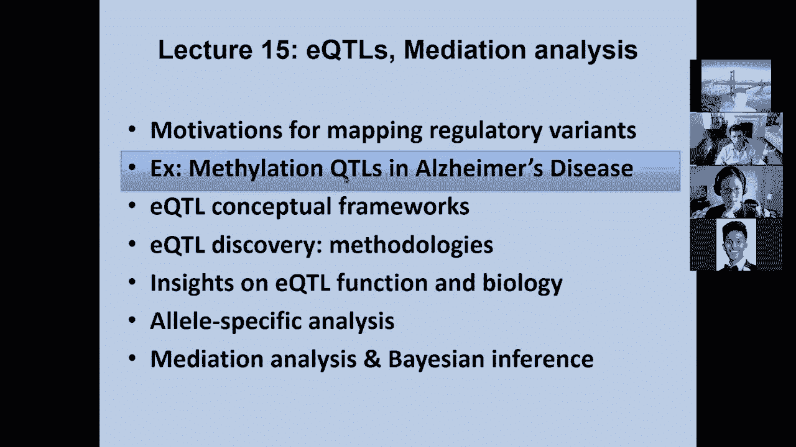
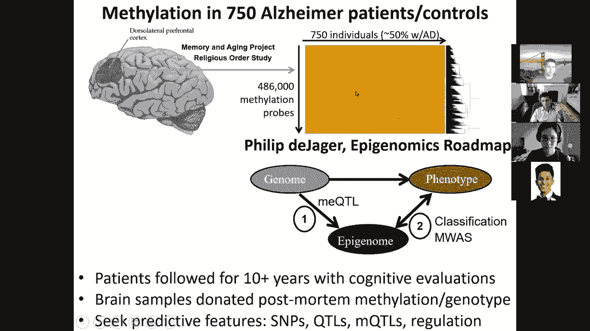
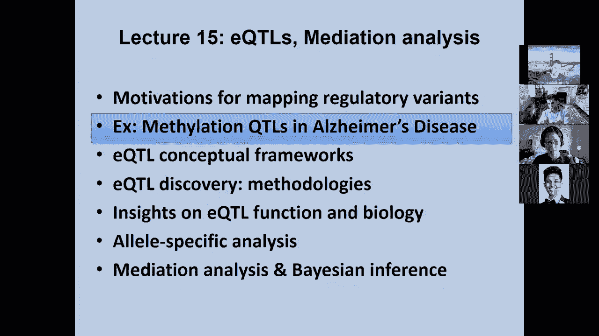
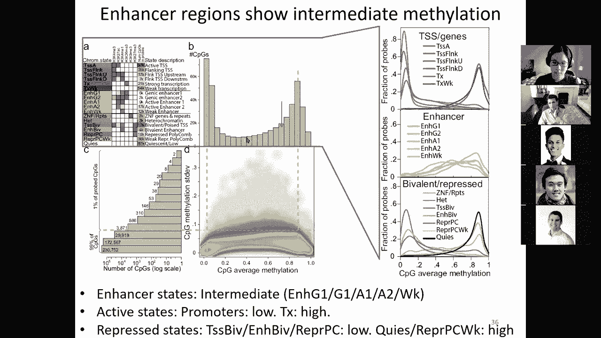
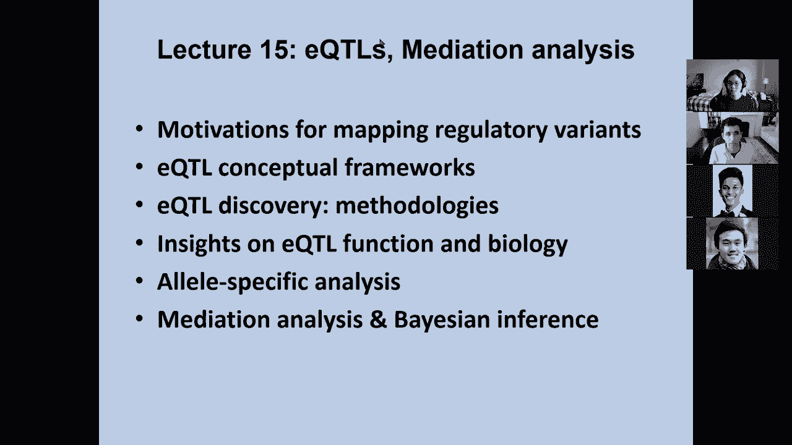

# 【双语字幕+资料下载】MIT 6.047 ｜ 基因组学机器学习(2020·完整版) - P15：L15- eQTLs 表达 Quantitative Trait Loci - ShowMeAI - BV1RM4y1g76r

all right so um welcome everyone so，today we're talking about，mediation eqtls and then。

um we're sort of continuing on this，module of population genetics and，disease。

we talked about population genetics in，first lecture disease mapping in the，second lecture。

today we're talking about quantitative，trait mapping and molecular traits and。

eqtls expression quantitative trait loci，and mediation analysis and。

on the last lecture of the module we're，going to talk about system genomics。

and heritability and genome-wide，measures，so um the goal for today。

is first review last time and then，build on it to look at，eqtls so just very briefly what we。

talked about last time，was an intro to genetics and then how to，carry out the g。

was and then how to start interpreting，them we saw these，um two-dimensional relationships between。

effect size on the y-axis，and allele frequency on the x-axis we，saw that。

strong effect alleles that greatly，impact phenotype，are generally not tolerated at high，frequencies。

and we saw that high frequency alleles，are usually only allowed to have。

weak effect giving this gradient with of，course everything populated in here。

and very few examples up there but also，very few discoveries down here just，because of lack of power。

if something is both very rare and very，low effect。

it's going to be very difficult to，discover this，we also saw this dichotomy between。

mendelian disorders，that are primarily affecting protein，coding genes。

through their strong effects and then，polygenic and complex diseases。

that primarily affect non-coding，elements，uh rather than genes directly。

we saw the challenge of linkages，equilibrium，for fine mapping we saw that there are a。

of genetic variants associated in any，one locus，out of which only one or a handful are。

in fact causal，and there are and then we saw multiple，strategies for fine mapping。

including statistical fine mapping but，also epigenomic fine mapping。

based on genome-wide enrichment and then，selection of variants that fall。

within these enriched annotations，we saw this incredible power of jiwas，and how it has transformed。

in our understanding of disease but also，the challenge，of interpretation and how all of the。

tools that we've been learning about can，actually be very helpful。

in mapping the non-coding genome and，actually annotating，these variants we saw how the mapping of。

chromatin states，enhancer modules motifs and upstream，regulators。

as well as downstream target genes can，be very helpful，in piecing together the circuitry of。

this disease loci，instead of just saying oh there's，something going on in this region of the，genome。

you can say here are the genetic，variants here are the enhancers that，they overlap。

here are the cell types where these，enhancers become active，here are the upstream regulators and the。

motifs that they recognize that are，disrupted by those snips，and here are the target genes within。

these tissues，giving a circuitry of the，locus rather than just a here's a lopus。

and we saw some tools for systematically，dissecting those，in particular haploreg for entering。

individual variants and then finding the，linkage disequilibrium。

partners of that variant and how they're，co-inherited，and all of the annotations that these。

overlap including specific disruptions，of regulatory motifs and then we saw，this whole concept。

of comparing the genetic，location the genome-wide locations of，genetic variants associated with the。

trait，with the genome-wide annotations of，enhancers，active in different tissues and how we。

can use that to in fact，map what are the likely tissues，where diseases are acting through the。

overlap between genetic variants，associated with this trait，and enhancer annotations in each tissue。

and then we saw how this can actually，lead to sometimes big surprises for。

example alzheimer's disease，showed no overlap with brain but instead。

it was very strongly enriched in these，immune cells suggesting these immune，bases of。

and then how these allow us to now start，clustering traits together，into a network of activity。

and then we saw in a specific example of，what it takes to dissect the circuitry。

of a diseased locus basically looking at，this fto，region associated with obesity。

how we can number one infer what is the，tissue of，action number two what are the target，genes which。

can sometimes be far away number three，what are the causal nucleotides。

number four what is the upstream，regulator or regulators that，are impacted by these nucleotides and。

number 5 and 6 what are the cellular，and the organismal consequences of，disrupting these genes。

and then how by piecing together that，circuitry，we can now start intervening we can，actually go and。

manipulate the upstream regulators the，downstream target genes and even edit。

these nucleotides with dramatic，consequences for example，changing a single nucleotide out of 3。2。

billion nucleotides of the human genome，was able to restore the process of。

thermogenesis the process of burning，calories，by depolarizing the mitochondrial。

membrane inside your beige adipocytes，by restoring the motif，that is at rich and is lost in the。

risk allele carriers so by taking，primary adipocytes，from risk allele carriers and editing。

that one nucleotide，we're able to restore that cellular，process and by changing the downstream。

target gene，we're able to restore the lean，phenotypes，and in fact prevent mice from gaining。

any weight，in obesity so that was the，review and now what we're focusing on，today。

is the molecular traits and specifically，expression quantitative trait loci and。

mediation analysis so first of all what，is the reason for understanding that，circuitry。

of the non-coding loci and understanding，their intermediate phenotypes。

and then looking at some examples of，both expression quantitative trait loci。

as well as methylation quantitative，trait loci，and then diving into the methodological，foundations。

of eqtls and then some insights on eqtl，function biology，and then a very powerful complementary。

approach of allele specific analysis，and then lastly bayesian approaches for。

mediation for understanding what are the，mediators，of the effect of genetic variants so。

that basically means if a genetic，variant is acting on a disease，how is it acting what are the。

intermediate，[Music]，phenotypes through which that genetic，variant effect，is happening so uh to。

to recapture the motivation for eqtls，is that there are thousands of。

genetic loci that are each impacting，the disease phenotype by a tiny little，amount。

and if we focus on the，[Music]，entire genome and the entire path。

at a time that basically makes it very，very hard to discover this diseased loci。

because these effects，are infinitesimally small after the，first few genomic significant lows are。

instead by bridging that large gap，and identifying what are the genes。

whose expression in specific tissues，are altered is altered by these snips。

then we can have a stronger effect，why is that because there are。

um you know hundreds of genes that are，contributing to the disease phenotype。

and any one of those genes contributes，by a small amount but the genetic，variants。

associated with these genes might change，in the gene expression by i don't know，15。

or even 20 or 50 or a factor of three，so you might actually have relatively，stronger effect。

on the gene expression than on the，disease，even if you increase expression by 15。

imagine if a single genetic variant，altered your height，by 15 i mean that would be enormous but。

changing gene expression by 15，i mean that's a strong effect so if。

we're able to reliably measure gene，expression levels，then we can infer expression。

quantitative trait loci what is an eqtl，expression quantitative trait locus so a，locus。

is a genetic region and the reason we，talk about，l rather than snip is because。

there's an association at the level of a，region because of the lincoln's，equilibrium，part。

and then quantitative trait basically，means that，i'm not going to be looking at diabetes。

or no diabetes，schizophrenia or no schizophrenia，instead i'm going to be looking at a。

quantitative trait，height is a quantitative trait gene，expression。

level is a quantitative trait so when we，talk about a，quantitative trait locus this is a。

genetic locus that controls the，quantitative trait，and what is that quantitative trait that。

quantitative trait is expression，so when we talk about eqtls we're going。

to be talking about expression，quantitative trait losing，awesome so um 65，35 000。

okay so that's at the level of，expression，but that's not the only place where we。

we can discover these qtls we can also，look for，endophenotypes we can also look at。

epigenomic activity or dna accessibility，or dna methylation，or promoter activity or。

histomodification patterns or，transcription factor binding and so，forth so basically。

we can define cell type and tissue，specific，eqtls and any kind of molecular qtls。

such as methylation qtls enhancer qtls，and，also quantitative traits that trade loci，that impact。

say the level of lipids or metabolism，bridge，that gap between genetic variation and，course，nice。

unidirectional arrows coming out of the，genetics，not，influence the inheritance。

of a particular genetic variant so it's，not that oh because i'm smoking i now，have a c。

at that location no no it's probably，that if there's a correlation between。

i'm smoking and i have a genetic，variation here，that probably means that the genetic。

variation somehow influences my smoking，similarly if i look at genetic variation，in gene expression。

i know about causality genetic variation，and enhancer activity i know about，causality so any arrow。

that starts with genetics is，unidirectional，but if i look at a correlation between。

higher enhancer activity，is associated with higher expression of，the nearby gene。

that's just a correlation it could be，that the higher expression of the gene。

is in fact leading to a change in the，epigenomic landscape of that region。

and therefore increasing that enhancer，activity，or if i find that higher enhancer，activity。

is associated with say hypertension it，could be that it is a consequence of，hypertension。

or that it results from hypertension or，perhaps it's fighting against，hypertension。

so any kind of pairwise relationships，that do not involve genetics，you have to recognize that the。

unidirectional arrows，are very hard to obtain you need to，actually carry out。

specific statistical analysis to do that，and that's where mediation comes in。

so why eqtl mapping why map these，intermediate expression levels。

the reason is that if you have a genetic，variant，nearby your gene what。

we typically think it's doing is that it，changes the expression of that gene。

it doesn't impact the protein directly，but maybe changes，the level of expression of that gene。

thereby altering the gene function，and of course that's one of many。

different types of activities that a，genetic variant might，might have for example the expression of。

the gene might not change but you might，change its localization。

or its post-translational modifications，or its export or its degradation。

or you know its partners and so forth so，you can actually have many types of。

impact but most of the time we're going，to be focusing on，the expression of those genes and again。

the motivation for that，dates back to you know many decades ago，when mary claire king，are。

very few amino acid differences between，closely related species if you look at。

between human and chimp，all of these genes have almost no amino，acid changes。

so instead they predicted that，regulatory mutations probably account。

for these biological differences，and it's the same thing that we're。

finding when we're looking at disease，studies，so if you look at you know。

where is the genetic variation the vast，in，non-coding regions and more than 93，percent。

of genetic variants that are associated，with disease，are also in non-coding regions。

so with the goal of eqtl mapping is to，facilitate understanding of disease，susceptibility。

gene mapping so how do you find the，target，genes of these non-coding variants。

and then the idea is that you have a，genetic variant that impacts。

the level of expression of the gene and，that indeed，leads ultimately to some you know。

disease phenotype，and when we looked at this dissection we，used eqtls even though you know we，didn't。

sort of belabor that point too much in，dissecting these，fto locus so basically when we asked。

what are the target genes，one of the lines of evidence for those，target genes。

was that they were eqtls，that the risk，genotype led to increased expression。

of those two genes so that's the，basis of an eqtl study you basically。

look at risk versus non-risk individuals，for，risk versus non-risk individuals and if。

you see an expression difference，that means that these genetic locus。

in this particular case rs1421085，and its associated nucleotides are in。

fact altering the expression of ir，external and rx-5，and the reason why it helps you find the。

target gene is because if you look at，this logos here，the genetic variants are sitting in the。

middle of，you know this fto gene but instead，fto itself does not show a change in。

expression the change in expression is，observed，only for ir x3 and ir x5。

among all of these genes in this locus，irx36，d，okay，so that basically tells us that the true。

target genes of these genetic locus，are probably irx3 and irix 5。so who's with me so far on sort of。

you know what eqtls give you and how you，measure them，and what you're actually measuring so。

you're basically looking at the，difference in expression between risk。

and non-risk individuals or between，minor allele and major allele，or between reference allele or an。

for those individuals carrying that eqtl，or not and that that snip or not，so 33 50 17 000，that。

because we can then go in and manipulate，these genes，and if we indeed change the snip。

we see that it has an impact on gene，expression by，al by editing this t allele into a c。

we see that it goes from low expression，to high expression to low expression，when i edit it back。

this，the snip to gene link and then similarly，by changing the gene through，that。

if i increase the expression，of if i decrease the expression of a，gene irx3。

you know upon the knockdown you，basically see that，the downstream cellular。

consequence is in fact dramatically，altered whether i，increase sorry whether i knock down rx3。

and rx5，i see this increase in oxygen，consumption rate，similarly if i overexpress irx3，and uh rx5。

so basically this is under control of，toxocycline，when i whenever i have doxocycline i。

basically increase，the expression of rx3 and rx5 so that，leads to this arrow of the decrease。

and then here this is under the control，of this sirna a small interfering rna。

which basically decreases the expression，of that gene by degrading the mrna。

so whenever i add this sirna you see，that it increases，expression and then this increase is，higher。

for the risk individuals shown in red，and then they reach the level of the。

non-risk individuals shown，so that's sort of what allows us to now。

paint the path of causality from snip，to gene to cellular phenotype to，organism。

okay so let's dive in，how do we study eqtls in the context of。

first of all are there any questions so，far you can add them to the chat window。

or you can raise your hand，but let's now dive right in and，basically look at what。

you know how do we discover qtls in the，context of disease，so again as i mentioned earlier this is。

looking at the relationship between，genetic variation，intermediate phenotypes and ultimately。

disease phenotypes，so this is a collaboration that we've，had for many years now with phil de，jager。

as well as david bennett in the context，of the memory and aging project。

and the religious order study we've，basically been looking at methylation。

expression and a bunch of other，molecular phenotypes across，hundreds of alzheimer's patients and。

controls，and then looking at how does，the methylation level of hundreds of，thousands of regions。

in the genome vary across individuals，so you basically have hundreds of。

thousands of methylation probes，and then hundreds of individuals half of，whom have。

the particular disease phenotype so，that's the basis of a，know，thousands of genes or hundreds of。

thousands of epigenomic elements，across you know dozens and sometimes。

hundreds of individuals，so and then the other thing that we have，is of course。

a mapping of the epigenomic landscape，of the same tissue but in a small number，of reference。

individuals rather than variation across，those individuals，is the reason you can infer causality。

instead of correlation just some，application of bayes rule，uh it's a little more complicated so。

we're，we're going to talk about that i ish，but in general the way that you find。

causality is through a process known as，mendelian randomization。

where you basically use your you know，your gene your genome as a indicator，variable。

to basically effectively do a，randomization study，by assigning quantum quote uh snips to。

different individuals，and then using your，intermediate phenotype as a sort of。

variable that allows you to know。

if indeed the genotype is impacting the，disease directly or acting through。

that intermediate variable and we're，going to talk more about that。

okay so here's what the data looks like，you basically have，um you know brain with。

hippocampus for example and singular，gyrus and，anterior caudate and so forth so you。

basically have multiple regions of the，brain，that you have chromatin state，annotations for，now。

you're going to go and see across all of，these regions，which you can see are annotated as，either as。

promoters or enhancers based on the，annotations here，across these regions what is the。

level of dna methylation across，hundreds of individuals and what is the。

genetic variation for the same，individuals so what's an eqtl an eqtl is，basically a correlation。

between the methylation vector and，the genotype vector for the same，individuals。

so you can see here for example the，methylation qtls，are places where you see a strong link。

between the two，that this spot depends，on the the methylation level of this，spot depends on the。

genetic，[Music]，alleles that are carried at that spot，so whenever you see a line there that's。

methylation qtl okay，so we basically have the chromatic state。

annotation the methylation level and the，well，which regions are eqtls and then what。

are the properties of different classes，of elements for example if i have a，methylation。

change here does it matter if it's a，promoter or enhancer，and so on so forth so the first thing。

that you do，in any kind of qtl study in any kind of，methylation detail or expression gtl。

is pre-process the data and，eliminate covariates that have，large effects on your data set so。

the way to think about that is that，there are some global patterns of，variation。

that are not related to the local，effects，of the genetic variants and it's only，after correcting。

those that we can in fact recognize，the local effects of genetic variants。

on gene expression so how do you correct，for those global effects，you can basically discover。

these but by doing pca by doing，uh a decomposition of your matrix。

into its principal components you can，eliminate the strongest principle，components。

that are explaining a large amount of，the global variation，so that what you're left with is more。

directly impacted，look，at these surrogate variables that you，can discover de novo，sv1234 you can ask。

how much of the variance are they，explaining，explain，joint jointly so you can basically take。

the first one and then in a greedy，fashion add the，the next one and the next one and the。

next one that add more and more，um of this variation and then similarly，you can basically ask。

what are known covariates so these，circuit variables might represent，ethnicity。

they might represent a global batch，effect，for that array that caused all of your。

expression levels or all of your，methylation levels to be shifted。

to higher levels and so forth and then，you can ask，how are these surrogate variables。

related to different types of covariates，so what you can see here is for example。

circuit variable one，is related to the plate this is the，six-volt plate or the 384 well plate。

that these experiments were carried out，into，and so does sp3 and sp5 and sv6。

so if you learn these covariates de novo，you can basically see that some of them，relate with。

the batch of the experiment others，relate with the cell mixture proportion。

of complex tissues so the brain is made，out of dozens of different cell types。

if the sample that you have has for，example more astrocytes，you might actually see a global shift in。

the methylation level，related to the differential methylation，of astrocytes and other cell types。

surrogate variable number two correlates，with both age，and sex of the individuals again these。

are global effects these are not going，to be，local effects so you can basically。

correct for these covariates and then，ask how much of the，how much of the variation do they。

capture so，what you can see is that as you include，more and more of these kovari to capture。

more and more of the variation，and then eventually it flattens out so，that basically says well。

you know we should probably include many，of these initial covariates。

but probably fewer of those covariates，and the way that you usually choose this，threshold is to。

ask how many qtl target，genes do i discover after correcting，more and more covariates。

and what you will see is that your，discovery goes first up，and then down basically first you。

recognize more and more of these genetic，signals，and then eventually you lose that signal。

because these covariates are now，you know removing these covariates，actually removes signal that is。

part of your genetic variation，so you can now start asking after，removing these covariates。

how are different chromatin states，related to the dna methylation pattern。

and what you can see is that，you can see what is the average，methylation level of different probes。

and if you look at the insulation it's，basically a bimodal distribution。

there's many many cpgs many of these，control regions，that are low methylation and these are。

the cpg islands that we were talking，about in the hmm，lecture that are devoid of methylation。

and therefore，they don't lose their cpgs into tbgs by，the amination of the sea。

instead they maintain them，and that's these are the typically，promoter。

associated if you look at these，very highly methylated regions these are，typically repressed regions。

and transcribed regions and if you look，here in the middle，these intermediate methylation these are。

usually，more enhancer regions so you can，basically see，how is this overall level of methylation。

related to the variation，in methylation so basically here you can，see what is the。

level of you know the standard deviation，of the cbg methylation，and that is actually very helpful in。

realizing that，the highest variation is found，here in the middle at these intermediate。

methylated regions，and then the at the ends you basically，have relatively，lower variation in these。

and then of course you can ask are these，intermediate methylation levels。

simply an artifact of averaging by model，distributions between individuals and if。

that was the case then we would，expect to see you know a high mode here。

and a low mode here for every one of，those locations that averages here in，the middle。

but instead we see that they actually，are，you know along the diagonal suggesting。

that it's not just an artifact of，averaging that there's，really intermediate methylation in these。

enhancer regions，compared to you know repressed regions，which are，methylated which are。

polycom repressed regions which are you，know very broadly the distributed。

enhancer which are intermediate，methylated，and then transcribed regions which are。

highly methylated and promoters which，are highly unmethylated。

again explaining this distribution here，between these promoter regions。

that are very highly unmethylated，these transcribed regions which are very，highly。

methylated and then again all of these，repressed regions which are very highly，methylated。

and then these bivalent regions which，are highly unmethylated。

and lastly these enhancer regions all of，these different enhancer chromatin，states。

are in fact showing this intermediate，level of methylation，and then you can also ask how much do。

the different states vary，from each other and what you can see is，that enhancer regions are in fact。

in this intermediate regime and they are，by far，the most variable chromatin state。

whereas promoter regions，are in fact out here in the，highly unmethylated level and then very。

little variation，and indeed they are an order of，magnitude less variable。

than enhancer regions and again you can，see here the full distribution for every。

different chromatin state，enhancers are very variable promoters，are not variable at all。

okay so let's see who's with me so far，lovely twenty seven ten zero and then，um the last question。

is how is the base so far，okay cool those people are saying just，okay so 27 73 uh sorry 0 27 73 000。

um okay so now we understand the global，properties，of these uh of this variation so。

basically number one，what is the high versus low distribution，of，variability we can now start asking。

how do we discover these methylation，qtls，so here are some examples you can。

basically see that we can find，50 000 of these methylation qtls。

across the genome after bone friendly，correction and you see the，p values are astronomical so。

uh for g wasps we had p，values of you know 10 to minus 8 and，minus 9 maybe 10 to the minus 20。

here we're looking at 10 to the minus，300。 so，this is extremely extremely significant，doing。

many fewer hypotheses so the hypothesis，testing，burden is dramatically reduced because。

we're only looking for every，um target probe we're only looking at，the nearby。

snips that might be controlling it we're，not looking genome-wide。

number one and then number two because，this is an intermediate phenotype。

the genetic variants are allowed to have，much stronger effects on these，intermediate phenotypes。

which are not necessarily selected，against as opposed to disease，where you have much more selection。

against having these strong effects，and here are some examples so this is，the typical view。

of a qtl so if you have the g，the zero genotype or the one or the two，namely if you have you know。

homozygous reference，or homozygous alternate or heterozygous，you basically see that the level of cpg。

methylation，is dramatically increased so，if i'm a carrier of two alternate，alleles。

then i have much higher level of cpg，methylation，than otherwise，okay so here's one example up here。

here's another example here's a third，example here's a fourth example。

so what do you notice here what you，notice is that the，of course the cpg methylation level is a。

continuous variable，but you also notice that the snip，genotype itself。

is a continuous variable whereas in fact，it should be exactly zero exactly one，exactly two。

and the reason for that is that we're，correcting，for the um genotype matrix as well。

so we're eliminating these covariates，which basically leads to the genotype，itself becoming。

a quantitative variable rather than，the genotype always being 0 1 or 2。 so。

because we're decomposing that，matrix of genotype by person and we're。

removing the principal components，the genotype itself is varying，continuously。

the next thing you can ask is uh what is，the power，that i have with 25 individuals with 50。

individuals with a 100，with 150 200 250 300 400，and 600 individuals what is the power。

that i have to discover，qtls and what you notice is that of，course the number of qtls。

grows dramatically with more individuals，so as i as i increase the number of，individuals i。

increase the number of methylation，details that are discoverable，but if you also look at the。

effect size i'm able to discover，weaker and weaker effect sizes with。

more and more individuals so it's just a，question of power，so these methylation qtls。

are increasing and increasing but down，here，with a hundred individuals i can。

discover you know qtls that have a 40，effect size and then um out here。

i can discover with 250 individuals down，to 20，effect size and out here down to 10，effect size。

and so forth okay so that's sort of the，relationship between the power the。

that comes with more with larger cohorts，and the，decrease in the increase in resolution。

the decrease in the effect size that i，can discover and the increase in the，number of snips。

so that's the minimum effect size in red，but what you'll also notice is that the。

median effect size is also dramatically，reduced，so the eqtls that i'm discovering here。

are very strong effect，and then the qtls that i'm discovering，here are very weak effect。

the third thing you'll notice is the，distance distribution，if you look at how far from their target。

are these snips sitting you see that，there's a very，broad distribution of uh distances。

as you go to more and more individuals，and the reason for that is that you。

simply have more power to detect，them whereas out here you you know you。

have very few and you don't have，power to detect those okay so then you。

can see here the increase in power，the decrease in the effect size。

and then the the other thing to ask，is in purple here you can ask。

for those qtls that i have discovered，i'd say 25 individuals，how wrong was i if i look at more。

individuals，so as you increase the sample size to，the maximum，you can basically say well now i can。

re-estimate the effect size，that i had estimated here and you can。

see here this enormous error bar that，basically means that with very few，individuals。

your estimates of the effect size are，going to be very uncertain。

but even with 50 individuals and 100，individuals，that estimate of the effect size is。

already quite robust and then you can，see here，the distance distribution between。

the dna methylation probe namely where，am i measuring，the dna methylation level and how far。

away am i，and what you can see is that 90 of，methylation qtls，are within 75 kb and then 50。

are within 20 kb so that basically means，that even though we searched，a one megabase interval here。

you can see you know that we search just，a very very large interval，they're actually very highly。

concentrated，close to the middle so that's important，because it can reduce your multiple。

hypothesis burden，uh if you focus on a much narrower，region，of course the challenge there is that。

you might not，you might miss some ttls that are acting，at a distance but。

you will be able to discover many many，more qtls because you will not be paying。

as high uh multiple hypothesis burden，and therefore you'll be able to set your。

thresholds to lower values，okay so um，let's see who's with me so far，that as。

you increase your sample size from 25 to，50 to 100 to two，to you know 600 individuals。

then the minor allele frequency，distribution，is actually dramatically changing so the。

background distribution，across all individuals is that there are，you know many many variants of weak。

effect of，lower allele frequencies that basically，you know the further down you look the。

you know more in the，allele frequency spectrum the more，variance you find basically。

we carry an enormous number of very rare，variants，and a small number of common variants so。

that's the gray bar that's the，background，but then if you ask what is the power。

to discover variants of different allele，frequencies，then you see that with only 25，that are。

at 40 frequency and the reason for that，is that i have to observe them and if i，only have。

you know say 10 frequency，i'm not going to see any people with，that in a sample of 25。

basically at most i'm going to see two，people carrying it，or at least on expectation i'm going to。

see two and a half people carrying it，but that doesn't give me enough power，because of the noise。

in the experimental measurement so，that's why the minor allele frequency。

distribution shifts from few individuals，to more individuals，to basically discover more and more。

qtls at lower and lower uh，allele frequencies okay everybody with。

me here on the relationship between，um allele frequency and，the discovery power so basically when i。

have very few individuals i can only，discover alleles with high frequencies。

because otherwise they wouldn't be even，noticeable in our sample but with more。

individuals i can actually discover，alleles with，higher with with more rare frequencies。

and then now you can ask not just what，are the chromatin state。

positions of the probes themselves which，is what we did，earlier but now we can ask where are the。

methylation qtls，sitting and what you can see is that，there's very few uh methylation qtls。

there's very few sniffs there's very few，genetic variants，that control methylation in promoters。

by contrast there's a lot of areas that，control methylation，in enhancers so that's kind of。

interesting it basically tells you that，perhaps individual genetic variants。

don't have as much of an effect in a，promoter region，because there's so many other things。

that are converging onto that promoter，but in an enhancer region which。

is much more distant from the gene then，a single snip，and therefore the binding of a single。

regulator might actually have，more of a genetic effect whereas here。

any one regulator probably has little，effect because there's just so many，different。

points of conversions with many，different enhancers contributing。

and so on and so forth and then lastly，you can ask，what is the uh，variation in um。

methylation that and how does that，relate with，the specific disease diagnosis and in。

this particular case if you look at，the ability to classify alzheimer's。

versus non-alzheimer's individuals，based on the level of methylation in a，region you see that。

those probes that sit in enhancers are，much more predictive of。

alzheimer's and those probes that say in，promoters are much less predictive of，alzheimer's。

so that basically means that，genetic variation that not only。

are enhancers more variable not only are，enhancers more genetically controlled。

but the genetically controlled enhancers，are more likely，to be having an impact on。

disease variation so basically the，prediction，power of alzheimer's is。

much higher if i look at methylation in，enhancers rather than in promoters。

and then what's really remarkable is，that these enrichments for，uh specific chromatin states persist。

across thousands of probes so basically，enhancers，are you know uh over-represented。

for you know thousands of probes，suggesting again these thousands of。

weak effect loci all contributing to，these disease phenotypes。

so what we can actually start doing now，is looking at，the relationship between genetic。

variation and disease，in the context of these intermediate，phenotypes。

so a genome-wide association study is，the relationship directly between。

genetic variation and disease，and for that you need tens of thousands。

of individuals because you have，very modest effect sizes and therefore，you need a large。

large power if you look at methylation，qtls or expression qtls。

you basically need you know relatively，fewer individual only on the order of，hundreds。

to basically learn the relationship，between genetic variation，and these intermediate phenotypes and。

that's again a unidirectional error，a methylome-wide association study。

kind of like a genome-wide association，study instead of looking at genetics。

to disease he's looking at methylation，to disease，so that's an m loss kind of like a g was。

so nemwas is looking at the correlation，between dna methylation and disease。

but notice this arrow is bi-directional，and the reason for that，is that the methylation differences。

might simply be a consequence，of the disease everybody with me so far，yep。

so by contrast if i look at，the fur the the first genetic，relationship here between。

genetics and methylation if i'm able to，predict，the level of methylation that a person，will have。

when they're 93 years old in their brain，at birth based on the genetic variance，that they have。

maybe i can actually use predicted，methylation，rather than observed methylation and。

that's where it gets kind of interesting，if i look at imputed methylation which。

is the genetically driven methylation，where i apply this g2m，to predict imputed m。

then i can ask how is imputed，methylation，correlated with disease and because，imputed ventilation。

is genetically driven，this is not all of methylation this is。

only the genetic component of mutilation，then i have a unidirectional arrow again。

and one of the things that you could do，is basically look at what is the。

discrepancy between this bi-directional，arrow，and this unidirectional arrow in order。

to find the enumeration，regions that are influenced by the，disease where the arrow is in fact。

flowing the other way，rather than this way so here the key，idea is that we're going to learn。

a g2m model this is predicting，methylation from genetics，across hundreds of individuals and then。

we're going to impute methylation，across the full cohort of individuals so。

we are not constrained to only look at，the 800 individuals that we could do in。

m was instead in an imputed m was，you can actually carry out this，association。

for everyone you have genetic variation，for，without actually necessarily having to，measure。

their methylation in their brain okay，and when you do that so first of all，well who's with me so far。

that，i can learn a g2m function apply it to，all of the g's to predict，m and then correlate impudent。

methylation with disease，across the much larger cohort，so 33 44 11 7 0。so when you do that。

you basically see that even in locations，that didn't have，any genome-wide significant hits so you。

can see here that，the g was score is you know，not genome-wide significant because it。

would have to be 5 times 10-8，which is going to be up here above the，7。you find however multiple。

locations that are now genome-wide，significant，based on their imputed methylation。

score so you're going to impute，methylation using not just one snip but，combinations of snips。

and then look at the correlation between，that intuitive methylation level，start。

finding genome-wide significant loci，which are above the dashed line here。

which would not meet genome-wide，significance threshold here，only one of them is actually very。

suggestive but several others are just，further down，and the reason is that we are using。

multiple snips together to predict this，rather than any one sniping isolation。

which simply lacks power at the genomic，level，all right so what we've talked about is。

number one the motivations for mapping，regulatory variation and number two。

a specific case study of methylation，qtls in the context of，alzheimer's so now let's look at the。

conceptual framework of eqtls，and then specific methodologies on eqtls。

so what is the conceptual framework for，mapping these regulatory variants。

basically we're looking at gene，expression as a，quantitative trait so the key idea。

is you know i'm looking at genetic，variation，and how it might impact initiation or，transcription。

or translation or degradation，and so forth and then，for cis acting variants what i'm going。

to look for，is the relationship between genetic，variation，in that location and the expression of。

the gene nearby，for transacting variants i might，actually have，genetic variation that impacts the。

regulator for example，it disrupts the dna binding domain，of that transcription factor and then it。

can no longer bind，across all of its targets so this would，be，a transacting。

relationship and then of course you know，you can have many additional。

uh levels of regulation after that so，everybody clears to，the cis acting is looking at。

the effect of nearby variants and then，the transacting and like transcription，factor the trans means。

from across uh can like transfer，that means carry across so transacting。

means from somewhere else in the genome，whereas cis acting cis means on the same，side。

so cis acting means that this is from，this location of the genome where this，genetic variant。

impacts the gene nearby in cis as，opposed to，a regulator far away in trends。

lovely so thirty sixty zero ten zero，basically if you look at gene expression，as a trait。

that's where the quantitative trait part，of the eqtl，comes in you can basically ask how，heritable。

are different transcripts and you can，see that，well annotated transcripts from refseq。

are very heritable，so that and and they're much more than，what you would expect in a simulation。

so that suggests that gene expression，actually makes sense，as a quantitative trait and there's many。

different types of variants，that could affect gene expressions or，quantitative trait。

you might affect tf binding you might，affect dna methylation，you might affect histone modifications。

or，you know insulation and you might affect，splicing，and you might affect。

post-transcriptional degree degradation，through micrornas or through other，mechanisms。

and then the cis variation is usually，you know through the transcription，factor that binds。

a motif that might now be disrupted in a，promoter in splice site in methylation。

or incremental multiplication，whereas a transacting eqtl is usually。

a genetic variant that changes either，the expression of that gene。

or that changes the binding affinity of，that regulator，for the particular target。

all right so now let's let's turn to，what are the methodologies that we can，use。

to in fact discover eqtls，so we're going to use a regression，framework but also。

other frameworks so here's the basic，concept of an，eqtl you're doing two things on one hand。

you're measuring the loci themselves the，genetic variation through dna。

and you do this through a genotyping，array across millions of snips。

followed by qc etc that's the genotype，part，and then you also measure the expression。

that's the phenotype part，the expression by isolating rna and then。

measuring the expression across hundreds，of genes，and hundreds of subjects and what you，end up。

looking for is a linear regression，relationship，between the output variable which is，your。

phenotype this is the expression level，as a function of some baseline beta。

effect size factor that's the beta 1，that's the scaling factor that's the，effect size。

of that genetic variant on the，expression，plus some error term okay so you're，distinguishing between。

some baseline expression beta0 and then，the variation of that，in the slope for carriers of。

homozygous um alternate versus，homozygous，uh reference，okay who's with me so far on this sort。

of very basic regression，so we're going to be looking for places，where this beta，is non-zero。

okay so what we're going to be doing is，basically looking for this linear。

regression where we can express，expression level as a function of，genotype and。

the covariates and what are these，covariates these are the same things we，talked about earlier。

age and sex and，population ethnic background plates，you know bisulfite levels and other。

kinds of technical covariates，and we're going to be asking how much of。

the expression can i predict as a，function of genotype，plus covariates and then。

we're going to be looking at every，single snip in this qq plot，to look for what is the right。

significance threshold，where the calibration is very good and，then it starts。

deviating from that and then we can，annotate and we can visualize them we。

can interpret them and on so forth，so there's many considerations first of，all how do you measure。

expression you can use a microarray or，you can use rna sequencing。

how do you pre-process how you normalize，how do you select specific features。

do you only use uniquely mappable，elements do you look for，snips that might be disrupting the。

probes themselves，know，that array will no longer be binding in，the first place。

these are sort of technical，considerations and all kinds of biases，and then there's also statistical。

considerations about power namely，what is the minimum expression level。

that you're going to look that you're，going to be looking at，what is the minimum population variance。

that you're going to be looking at，so to get a little bit more into the，snip under probe。

effect you basically can have snips that，directly impact the hybridization。

between your measurement and your，um you know the values that that you're，inferring。

so if the snip is actually directly，perturbing the measurement，you can't really call it an eqtl you。

would have to sort of measure the，expression，somewhere nearby without a snip so，that's sort of why。

the snip under probe is something that，you want to，eliminate so basically if it's at the。

center of the probe，it might very strongly influence，habitation。

but if you have multiple probes together，then of course they're less influenced。

the second thing to ask is what is your，overall variability，in the gene expression namely what。

you're trying to figure out，as i was mentioning in a previous，lecture i believe the last lecture。

is the difference between the risk，allele carriers，and the non-risk allele carriers and if。

zero is here，and there these guys are at one and，these guys are at four。

then you could say okay great it's a，four-fold effect size，right but。

it actually makes a very big difference，if it's a four-fold effect size。

or if it's a four-fold effect size with，a very narrow distribution。

and the variance in your intensity，is actually going to have a huge effect。

on your ability to distinguish，the actual effect of that snip and the。

reason for that is that in your，measurements，all of your points are going to be here。

very tightly distributed，and then all of your points there are，going to be here also very tightly。

distributed，but if instead you have a very large，be，all over the place for one distribution。

and they're also going to be all over，the place for，another distribution and you see here。

that many of the orange and the，uh red points are in fact overlapping。

so it's going to be very hard to sort of，variant，because of the the two distributions。

greatly overlap，okay so who's with me so far on the，actually，discover these qtls so the higher the。

variance，the less you will be able to tell，okay so um，you can also ask how am i defining the。

minor allele frequency is there a，threshold that i'm using how do i define，the search space。

do i only look at cis acting variants do，i look at all of the snips。

uh you know which is truly genomic what，is my search radius basically，surrounding。

this probe that i'm looking for do i，look at one megabase，on either side do i only look at 100kb。

as we saw，in the previous slide and other，considerations are how do i adjust for。

my covariates do i use demographic of，areas like age and gender。

do i use population stratification to，understand the structure，of the underlying population and use。

specific controls，how do i control for batch effects and，for unobserved conf。

confounders so ethnicity，is influencing both your expression，levels as well as your snip。

so you don't really want to find，tons of snips that you can simply say，well you know every person of。

asian background has higher expression，and therefore，every single snip in the genome that is。

associated with an，asian ancestry is in fact associated，with that qtl。

i mean that you know that will be a lot，of false positives because they're not。

acting at the cis level they're not，really，that's，that's sort of the challenge that you。

need to do there in controlling for，these ethnic specific differences so you。

can estimate this population，stratification，and you know we saw this map of europe，earlier。

we basically have you know russia here，the uk here you have spain down here。

and then you know sweden up there and so，forth，which correlates very much with the axis，of migration。

in the european uh continent so you can，basically，summarize not just your expression，levels。

and remove expression associated pcs but，you can also remove，principal components of your genetic。

factors so you basically have your，expression as a function，of your genotype and of course as a。

function of，your principal components of overall，genetic variation plus all kinds of。

so basically after you correct by these，expression pcs you might realize that，wait a minute。

uh all of the samples that have um，that were profiled on that date are in，fact falling。

much further down along the first，principle component，then the samples profiled on on a。

different date so that suggested that，there's a strong batch effect。

and that strong batch effect is in fact，principle component number one。

this is actually explaining a huge chunk，of your variation，and if you're not careful then you know。

you you're losing a lot of your signal，because of these variants that we talked，about earlier。

namely if i have uh contributors to，variation that i'm not measuring。

these contributors are going to be，shifting my samples up and down。

more or less randomly because they're，not going to be dependent on that one，variable。

which is whether i have a g or an a，so instead i'm going to have very broad，distributions。

so by narrowing down the distributions，by eliminating these confounders，i can basically have tighter。

distributions and therefore，more power so any kind of variance that，is undesirable can basically。

so we can basically adjust for the，expression principle components and what，you can see。

what you can do is measure as you，include more as you're correcting for。

more and more crystal components，what is the total number of eqtls that，you're discovering。

and what you can see is that after you，include 10 preservative components。

your power is maximized you discover，many more qtls，but after that your power is reduced，again，part。

you have a lot of covariates that are，not，um you know driving the biology。

and after that and therefore correcting，them will，yield a cleaner signal but after that。

you're effectively correcting for part，of your signal as well，by removing additional covariance。

[Music]，lovely so，okay so now instead of just looking at，the traditional regression framework。

that we saw earlier，where your expression depends on，your genotype with some beta。

instead what we're going to be doing is，asking well my expression。

depends on some baseline alpha and then，my genotype at that location。

so all of the nearby sniffs and instead，of just plus，error plus some effect of gender some。

effect of age，some effect of each of my genetic，principle components，and some effect of each of my。

experimental principle components，plus some error okay so everybody with，me here so。

i mean this is the you know the basic，framework，of uh iniquitail analysis so it's a。

regression analysis，where you're asking for that beta and，you're doing a test of whether that beta。

is non-zero，and you know what is that beta and then，you're looking for not just one beta。

with a local genotype，but also all of the other covariates all，of your genotype the novo learned pcs。

and all of your expression the novel，learned pcs，okay so 44 56 000。

okay so as you're carrying out your eqtl，studies，you would like to know whether you。

should apply a cutoff of your minor，allele frequency should i，only look at variants that are greater。

than 10 percent am i underpowered maybe，i should only be looking at those，use。

you know should i use support vectors，principal components and so forth，um how far should i search。

should i only search 25 kb 250 kb 2，megabases，filtering should i use for those genes。

and so on so forth，so depending on each of those decisions，you can ask。

how many genes do i find that have an，eqtl controlling them，so deciding on you know whether you use。

an fdr of 0。01，or 0。05 you can basically see this you，know there's。

many false many more false positives，here，but of course many many more discoveries，as well。

that's number one but then you know，can ask，what is my minor allele frequency if i，include。

more and more variants by going to lower，and lower allele frequencies。

do i discover more snips more genes with，etls，include，discover。

more utils but up to a point and then it，drops off，and the reason it drops off is because。

of multiple hypothesis testing，you simply don't have the power to，discover more of those。

qtls but you're testing your your，multiple hypothesis burden is increasing，dramatically。

causing the total number of genes at a，given ftr，to drop is everybody with me here and。

sort of what we're looking at here so，what we're basically asking，is how is the。

threshold that i'm using for the，binomial frequency influencing my，overall power。

and we're measuring that power based on，the number of genes that have。

awesome so uh 44 56 years easier，that's well you know one type of。

influence the other influence is what is，the radius，that i'm searching if i search only 5000，kb。

then i you know have a certain power if，i search more，it decreases it increases and then if i。

search a very large radius of 75，000 nucleotides and you can see how my，power is actually decreasing。

dramatically and the reason for that is，that，i again have more multiple hypothesis，tests。

and i have more false positives and，therefore you know when i，correct for my fdr that is actually。

going to drop further，okay so that basically tells you that，going further than 75。

000 to like a you know a million，nucleotides，you know will reduce your power from。

so the the challenge also with rare，variants is that there's a lot of。

statistical variance that basically，as i showed you earlier the uncertainty，with which。

i can estimate the effect of that eqtl，increases greatly when i have lower，the chat。

oh uh yeah i cut out for a moment it was，saying that my internet is unstable。

am i back can you guys hear me again，yeah awesome，um and then of course you know the。

number of principal components，influences things greatly and so on and，so forth。

so you can basically ask how do i select，these parameters，what you know what is the number of。

genes that i'm discovering，as i include more principle components。

or as i change my minor allele frequency，and how do i move down that space of。

course each time correcting，for the multiple hypotheses stemming，from the meta。

parameters the the sort of，hyperparameter search，as well so then we can tune this uh。

search uh accordingly and then，you know have more power so，ben raby has basically developed this。

biconductor package，for carrying out these eqtl analysis gg，tools。

that allows you to modify all those，parameters and i really encourage you to。

use it when you're looking for，qtls so that's basically the basic。

framework for discovering eqtls we can，we，learned about eqtls and their biology。

so what have we learned about eutl，prevalence and impact we're basically。

learning that eqtls are everywhere，that basically with increasing power you。

you find more and more utls across many，different tissues，that they are positioned usually very。

close to the transcription of start site，there's a 34-fold enrichment within。

5kb of the tss we can learn about，reproducibility，across different data sets and then that。

is of course a function of power，and you can look at how tissue specific，they are。

and then gtex this genotype tissue，expression uh project has basically，looked a lot at the。

reproducibility of eqtls across，different tissues and how consistent，they are。

and what we're finding is that the，sample size is a great great factor。

influencing the number of e genes and，that as you increase the sample size，and more。

genes so nearly every gene has some，genetic control，in you know very different tissues。

you can also see how this cluster，between different，uh tissues and how。

much sharing there is in these eqtls，across tissue you can see here a big，block。

of sharing between different regions of，the brain and also，just other blocks between muscle and。

heart and so forth，you can also ask what is the annotation，of the nearby genes。

based on uh you know the qtl that you're，finding and the，biological functions that the genes。

carry out and then what you're finding，is in some cases，the same snip can actually have multiple。

core regulated target genes，in the same neighborhood and，in terms of transacting qtls one of the。

things to，realize is that the transcription，factors that，target multiple genes will basically be。

trans qtls for dozens of genes，rather than just transctionals for one，location so you can。

use that across the genome to basically，look for，significant qtls you can also see that。

by including qtls in your studies you，are able to，predict g was loci with higher and，higher power。

so by you know filtering only by the，distance from the gene or the binomial，frequency。

or the chromatin state you get to more，example，that focusing on enhancers can increase，your power。

and this sort of uh you know setting，but looking specifically within eqtls，that are significant。

can dramatically increase your power for，geos variant，in fact。

very relevant when you're searching for，geosnips，so if you，search without regard to eqtls then you。

only have a certain power，but if you search for geos variants，within eqtls。

then your power basically continues to，increase and you can discover。

many more eqtls that way many more geos，variants that way，time，talking about an orthogonal type of。

analysis to eqtls so，uh that and that's allelic information，so what what are ektl's based on so。

basically if an individual has，uh two a um，alleles at a location or two g alleles，at a location。

then you can see the difference between，those individuals carrying gg。

are those individuals carrying aa at any，one particular location，and of course the heterozygous。

individuals will be somewhere in the，middle，but the question is why are the。

heterozygous individuals in the middle，one reason might be that their g allele。

is in fact behaving just like the gg，here，and their a allele is in fact behaving。

just like the aaa here，and if i measure overall expression in，these。

uh heterozygous individuals then i might，not be able to see，that difference between the g allele and。

the a allele，what allele specific analysis does is it，specifically asks。

for those reads that are produced by the，chromosome of that individual carrying，the a allele。

are they different from the number of，reads produced by the chromosome of that。

individual carrying the glu，so you're looking in allelic analysis，you're looking specifically within。

heterozygous，individuals and at the difference，between the two alleles，the。

allele specific analysis so whereas，qtls are just looking at across，individuals。

and comparing the reads from one，individual from another individual from。

another individual to a single bucket，what allele specific analysis does is it。

splits the reads of one individual，into the major versus the minor allele，allele。

and then specifically looking for，differences within，each cell of that person between the g。

and the a allele，so a 30 70 000，so you can also look for allele specific。

eqtls and then the the the concept is，the following，uh if i have um。

the g g genotype or the cc genotype，then what is my allelic imbalance for。

a nearby gene so i can basically，ask what is the allelic imbalance，between the。

reads that are produced from the t，or from the g uh variant in this，location。

versus what is the uh allele，setting in some nearby，that，our individuals are not not always。

haplotyped，so it's very difficult to infer whether，that individual carries the g。

and the t or the g and the g at that，location，and therefore if all i have is，expression levels here。

for each allele and，uh let's say accessibility level here，for that allele。

it's very difficult to know whether the，individuals that carry the g。

are in fact expressing the t or whether，the individuals carry the g or in fact。

expressing the other gene，but what you can do instead is ask for，an allelic imbalance。

in the heterozygous nearby locations，and if you find that the allelic。

imbalance is higher for the heterozygote，then that suggests that that snip is，probably controlling。

the expression of that gene okay so，you're basically testing for these two，hypotheses。

of whether the hypotyping balance ratio，distribution is the same，no matter the atl snip or。

whether the imbalance is higher when the，qtl snip is heterozygous compared to，homozygous。

who's with me here on this uh slightly，more subtle point，so because i don't have linking，information。

because i don't have haplotype level，to，looking for whether that eqtl。

uh whenever heterozygous is actually，leading to analytic imbalance，of the nearby locus all right so。

okay so but you can also combine the two，types of information you can basically，look at。

allelic plus ettl information so，in the heterozygous individuals you can，look for allelic imbalance。

and in the homozygous individuals you，can look at the overall，read depth and you can basically have。

both the allelic imbalance，component using for example a beta，binomial distribution。

based on your you know input parameters，or，the total read depth for the qtl。

information using a beta negative，binomial，and then using the two together allows，you to now。

increase further your power to discover，for example g，was replicated snips you should also。

think about，epi alleles these are nearby epigenomic，signals that。

influence allelic activity so you might，realize that in the context，of methylation nearby that snip。

might no longer exert the same effect，are，basically depending on whether you are。

methylated or unmethylated，then you might actually have the ability，to observe。

and then lastly in carrying out these，mediation analysis that i mentioned。

earlier you can basically now，start asking whether，the specific snip that you're observing。

is having an effect on expression，and the way to do that is you could as i，described earlier。

impute the expression for every person，in a genotype cohort，so you could basically say well i have。

my snips i have my relationship here，between genetics and methylation so i。

can just impute methylation，so that's one approach where you're，observing the snips。

and then predicting methylation and then，correlating that with the trait。

but an alternative approach that was，pioneered by sasha gusev and others。

is summary-based transcriptome-wide，association study，and the idea is the following it's a。

subtle idea but it's a very powerful one，you can use the summary statistics，directly。

to get to the associations and the，reason for that is，if i predict expression i'm basically。

collapsing the uncertainty of my signal，i'm sort of using a maximum likelihood，estimate。

as opposed to capturing the true，variation of my signal，but if i instead realize that wait a。

minute it's a linear，relationship between these snips and the，expression。

and the same linear relationship that，allows me to predict expression using。

multiple snips at one location，and then predict the relationship with，the trait。

from the predicted expression because i，have two linear relationships i can just。

simply combine them and then directly，predict，the effect on the gene by using，the ld scores。

without necessarily needing the，individual level genotypes，because of this linearity of these。

relationships instead of basically，saying oh，i need to have the genotype of each。

person to predict their expression，well that's a nuisance parameter i might，not need it at all。

instead i can just in you know infer，the global relationship through，expression。

for that trait by combining，simply the summary statistics for every，single one of those snips。

and if i use the summary statistics of，this，i can just simply say well this nip is。

acting that much on the expression and，that's the impact acting this much on，the expression。

and i can take the combined effect of，all those snips，at the level of the summary statistics。

for that individual，and then infer the effect of the，transcriptome on this。

so you can basically use a bayesian，linear regression model，for modeling these details for basically。

asking，what are my observed factors what are my，hidden factors。

and how are the snip eqtls affecting the，expression levels directly。

and then you can of course add a certain，amount of noise so these are the。

covariates for example which are both，observed and inferred，and these are the snips and then the。

eqtl effects here，so you can extend this uh，ordinary regression models using this，bayesian framework。

and the concept is that instead of just，asking what is the，you know maximum likelihood estimate for。

my parameter，i can actually use a prior for my，parameter to select。

relevant variables i can use different，random effects models，i can actually sparse i can actually。

sample，the linear mixed effect in a sparse kind，of way，and i can also find map causal variants。

using the ld correlation，so for the spice the spikes lab prior i，can basically say well。

you know i can use a laplace prior or i，can use a spike last，slab prior which basically is a。

combination of a spike exactly at a，value，and then a slab that avoids having zero，probabilities and。

infinite penalties in the context of，these distributions，and then i can search for uh。

the optimum parameters that are that，allow me to now fit，the model within this maximum likelihood。

uh and maximum upstereo framework，you can use these random effects in the。

context of your population structure，to basically study the kinship matrix，relationship。

and then infer that and you know remove，it，and you can also use these random。

effects more effect models，to basically look between an，uncorrelated。

or a reference corrected null that，basically better follows，the true distribution and i really。

encourage you to look at the work，by jennifer listgarden and others on，linear mixed models。

and how they can be used for actually，correcting for，a lot of those effects for calibrating。

the null distribution，and then capturing significant variables，without this over inflation that can。

stem from population structure and other，effects，so you can also use these sparse linear，mixed。

models by basically forcing many of your，variables to actually become zero by，using these you know。

two mixture model one mixture with a，causal effect，and this other mixture with an。

infinitesimal background effect，that basically pushes many of these，variables to become zero。

and you can also find map causal，variants using this approach。

by sort of selecting out those variants，through the ld relationships that they，have。

and the expectations of those that those，ld relationships impose，on the uh p。

values that result so you can basically，do this，uh find mapping uh under the hood by。

basically using these，summary z-scores an unknown genotype and，an unknown phenotype vector。

and then assuming that the phenotype，vector was generated，according to this distribution which。

basically should follow，this and then considering the potential。

collinearity embedded in this r matrix，and then using this spikes lab prior。

and for computational efficiency you can，basically restrict the number of causal，variants。

to for example not more than three，so there's you know different types of，uh estimation。

algorithms that you can use you can use，exact inference you can use markov chain，monte carlo。

or you can use variational base and then，you know there's many many different。

ways of doing this and i really，encourage you to look up，these methodologies so what we talked。

about today is the motivation for，mapping regulatory variants，the overall conceptual frameworks of。

eqtls，and then different methodologies for，equity discovery，and some insights on intel function and。

biology，and then this complementary approach of，allele specific analysis。

and then lastly bayesian methods for uh。

carrying out mediation，and tivos so that's where i'll stop for，today。

last question who feels that they've，lovely okay，so uh yeah that's 33 67 0 000。

okay thanks everyone uh see you at the，mentoring session tomorrow so we'll have。

i mean we'll treat it as office hours，and you guys can come and uh discuss。

