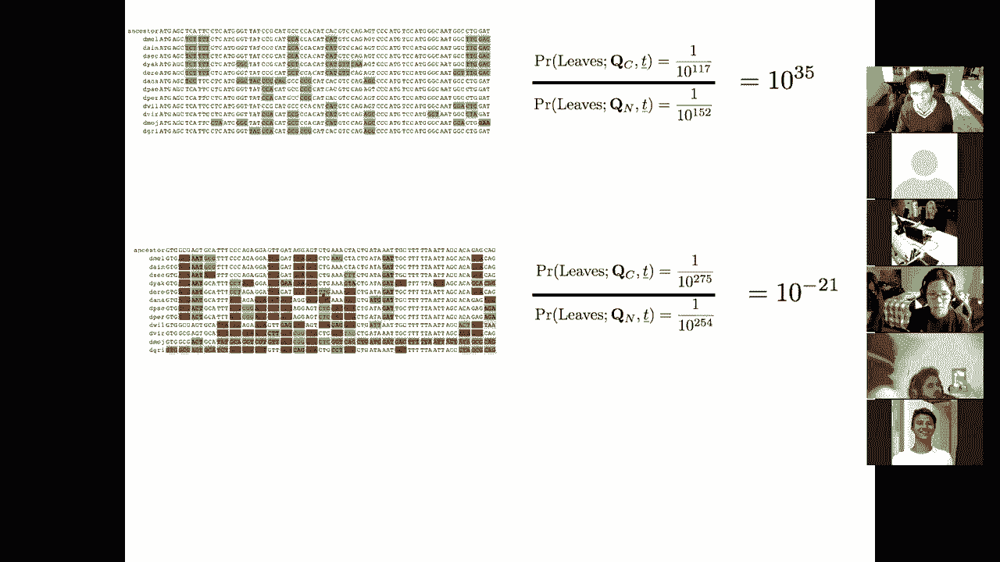
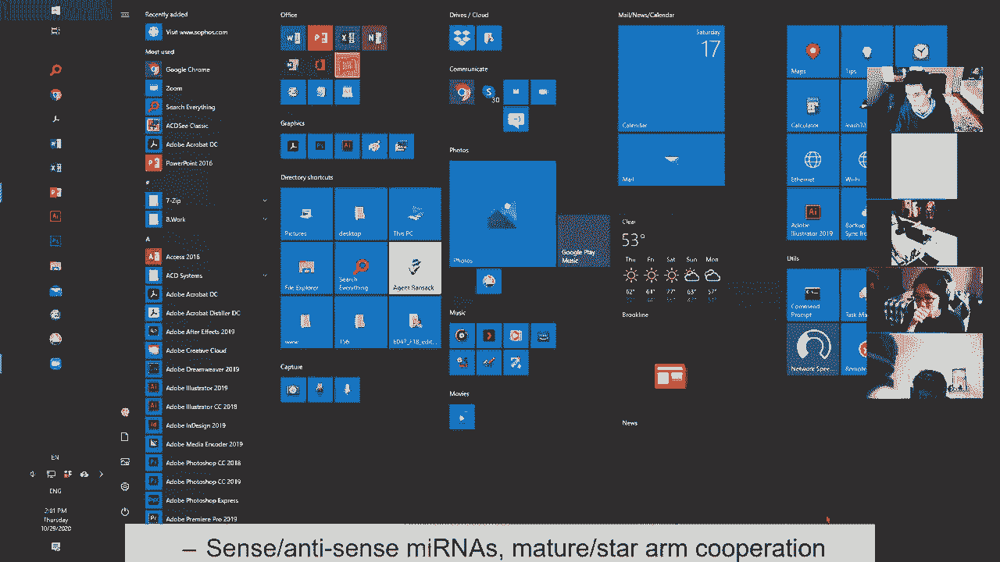
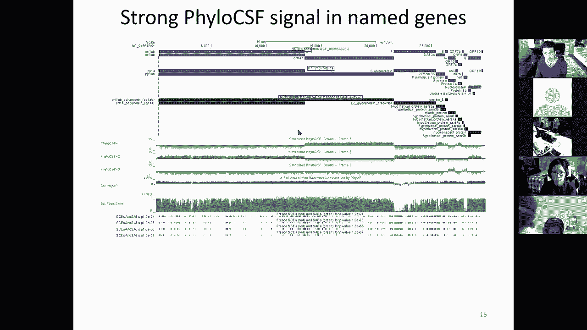
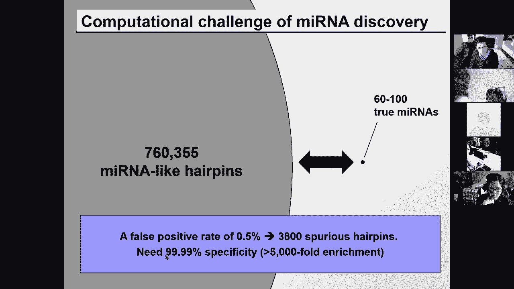
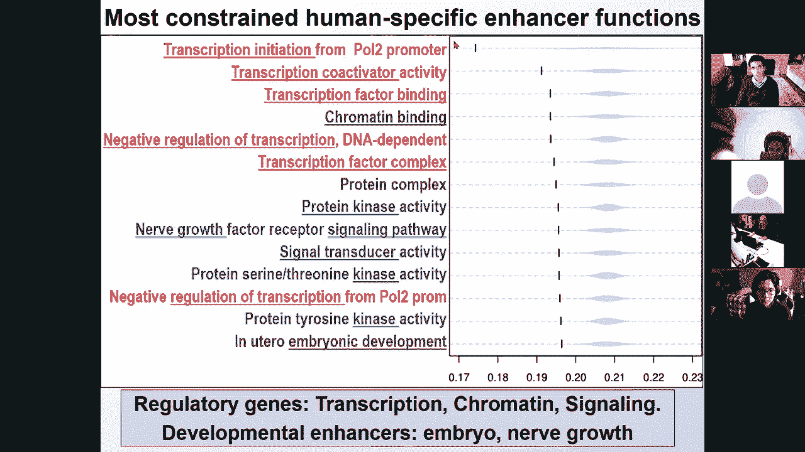
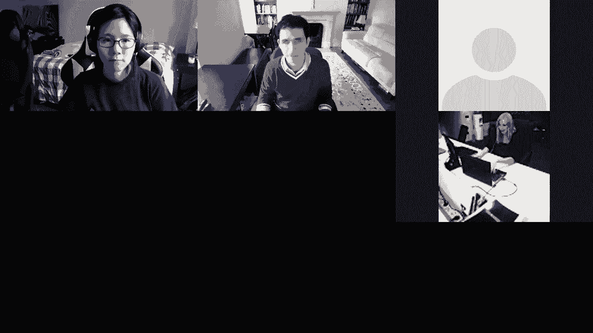

# 【双语字幕+资料下载】MIT 6.047 ｜ 基因组学机器学习(2020·完整版) - P17：L17- 比较基因组学 - ShowMeAI - BV1RM4y1g76r

all right welcome welcome so today we're，talking about，comparative genomics and specifically。

evolutionary signatures，for genome annotation so we are entering，the last。

module of the class on comparative，genomics and evolution，today's lecture is going to be on。

comparative genomics，and evolutionary signatures next time，we're going to be talking about。

genome scale evolution and genome，duplication，then we're going to talk about。

phylogenetics and phylogenomics，and then we're going to have the quiz。

and then we're going to transition，to the future directions so we've talked。

a lot about genome annotation，about uh gene expression np genomics。

about networks and regulatory genomics，and about disease genetics and disease，genomics。

which was all about variation within the，human lineage，today we're going to be talking about。

variation across species，and specifically we're going to be，looking at how we can use genome-wide。

studies，to infer signatures of evolution，and then use these signatures to。

annotate elements and we're going to，apply these，signatures to annotate protein coding，known coding。

and micrornas and regulatory motifs so，protein-coding genes，non-coding genes microrna genes and also。

regulator motifs，and next time we're going to be talking，about genome rearrangements。

and genome duplication about how to，construct global alignments based on，syntony。

and how to detect structural changes and，then we're going to have two lectures on。

phylogenetics and phylogenomics namely，how do we，use phylogeny to understand evolutionary。

rates models of evolution，going to，go back to dynamic programming on a tree。

and bayesian models of evolution and，then with phylogenomics it's going to be。

very similar to today's lecture on，using global signatures to understand。

individual local events and we're going，to be looking at，gene trees and species trees and。

reconciliation，so i showed you this slide earlier on，to motivate genome alignments to how how。

to construct alignment，and this lecture basically picks up very，much where that left off。

namely the idea that we can use，alignments，of closely related species which we can。

construct using dynamic programming，using blast using you know all kinds of。

tools for building these alignments and，once we have constructed these，alignments we can go in。

and look at the conservation patterns of，different regions，and here the stars denote perfect。

conservation across these four species，that roughly span the distance，see。

that there are islands of conservation，which stand out based on stretches of，stars。

and those islands of conservation in，fact correspond very well，to known regulatory motif instances。

within these regions so the idea is can，we now，use comparative genomics to study。

these signatures systematically and to，discover these elements，and in particular today's lecture is。

going to be focused on，reading evolution to reveal functional，elements。

and then next time we're going to be，looking at how we can use。

genomes to understand evolution itself，so basically，we can the better we understand。

evolution the better we understand，genomes and the better we understand，watching the genomes。

the better we can model evolution，so the goal for today is to first look，at nucleotide。

conservation and evolutionary constraint，then to look at evolutionary signatures。

which focuses on the patterns of change，rather than the amount of conservation。

and then we're going to look at，signatures of protein coding genes and，then signatures of rnas。

motifs transcription factor binding，sites and micrornas，and also how to measure selection within。

the human lineage，so comparative genomics is extremely，powerful we can use it to compare。

related species in order to discover，functional elements，and the concept is that ever since。

darwin we have understood，of two，components on one hand random mutation。

on the other hand natural selection，and the random mutations basically，exploring。

space by randomly mutation mutating，elements，which is not you know trying to do so。

it's just making mistakes，that，if engineers were in charge of selection，we would still be。

perfectly replicating bacteria with no，mistakes，so mutation is a double-edged sword on。

one hand it introduces，problems but on the other hand it，introduces novelty。

and what we're going to be focusing on，mostly today is，how it in how。

purifying selection works namely those，mutations，that disrupt elements how those are，maintained。

on the phylogenetics lectures we're，going to talk a little bit more about。

positive selection but now we're mostly，going to be focusing on，random mutation that mostly breaks。

things but every now and then it makes，things better，and then natural selection is the brutal。

decision which is selected within the，context of the environment，those uh resulting sequences。

that are maintaining the function so，again on one hand we have，random mutation which is completely。

blind，kick you know shoots at everything，randomly，and then natural selection which is，maintaining。

those sequences that maintain the，function that still preserve the，function。

what is the result of those two forces，applied over evolutionary time。

on one hand non-functional regions will，accumulate mutations，and will be kept basically uh。

we will accumulate mutations and those，mutations will be kept，so over evolutionary time any mutation。

that happens in a non-functional region，is preserved but within functional，regions。

mutations accumulate just as much but，they decrease，fitness and therefore over evolutionary，time。

those organisms that have，disrupted elements to basically，eventually become less fit。

and their genes will eventually thin out，so if you look at，the effect of all this is that even。

though the same amount of mutation，happens in both types of regions in both。

functional and non-functional regions，over evolutionary time those mutations，in functional regions。

are excluded from the gene pool and，those mutations in，non-functional regions are accumulating。

so who's with me so far，on this concept of random mutation，so one of the things that we care about。

is of course，power so how much power do we have to，discover，these functional elements and the。

very simple concept is that the more，branch length you have，you have。

on the stream the more events you have，that will basically be accumulating in。

non-functional versus in functional，regions，and the more power you will have to，distinguish。

the accumulation of mutations in the，non-functional regions and their。

exclusion from functional regions，so your power should be scaling roughly，linearly。

with the amount of evolutionary，distance that you capture in the tree of。

species that you're aligning，and if our goal is to distinguish。

functional versus non-functional based，on the number of mutations。

with very close distances there's really，no mutations in either region。

with sufficient distances we can，distinguish the differential，accumulation。

of substitutions in functional versus，non-functional regions，and with very very distant comparisons。

then the functional regions are no，longer conserved so，the challenge there is that you know if。

you compare i don't know amoeba，and mammals there's very little，conservation。

and therefore you won't be able to，really capture，this distinction between functional and。

non-functional so，the solution that we often take in，comparative genomics is to compare。

many closely related species and that's，much more powerful than few。

distinctly related species namely for，the same total branch length。

we prefer many closed species because，the functional regions are conserved for，each pair of species。

they haven't had enough time for any，pair-wise，evolutionary comparison to accumulate，enough。

new environmental adaptation basically，the environment hasn't changed that much。

in short evolutionary distances and，therefore the pairwise conservation will，be still high。

but the non-functional regions will，accumulate noise，independently and the analogy that i。

like to give here，is when you're recording an orchestra，with one microphone if there's noise。

surrounding that microphone you're going，to record as much noise，as signal if there's multiple。

microphones，the signal will be transmitted linearly，to all of the microphones。

but the noise will be independent in，each of the microphones and therefore。

we're able to actually capture，the evolutionary signal because of this。

independent accumulation of noise，in the different lineages，so uh everybody with me here on this。

concept，that we want a lot of branch length but，the way to get this branch length is。

much more powerful when you look at，multiple close-related species rather，than just two。

very decently related species great，uh so 67 17 17 000，um so now we have。

uh studied the concept of neutral branch，power，and how purifying selection maintains。

functional elements unchanged by，excluding those，species and those organisms that have。

accumulated mutations that disrupt，now let's look about detecting。

constrained elements and specifically，looking at individual nucleotide or，model。

that can detect these nucleotides，so you can build basically now these，genome-wide alignments。

and for any one species，you can see the jeans on the watsons，strand or the quick strand in different。

colors here so some are encoded，facing to the right some are facing to，the left and then。

over evolutionary time you can basically，align these species，and see that the order is roughly。

conserved，why is that important because by，choosing species where the。

chromosomal segments are roughly，conserved in the same order，that means that we can construct。

alignments not just of the protein，coding regions，but also of the intergenic regions in。

between these genes，so that means that we can actually study，patterns of evolution。

throughout the genome in both coding and，non-coding regions，and this is true across hundreds of。

genes at a time，so we can now start using，these comparisons to identify functional。

elements within them，and i showed you this slide also in the，very first lecture。

or lecture number two looking at，used to，reveal functional elements by showing，that for example。

exons these are protein coding exons in，tall blue light，are in fact very deeply conserved and。

the challenge of course is that many，other elements are also strongly，conserved。

and the question is are these in fact，axons，or regulatory regions so。

if we're trying to understand whether，this particular region here，is uh coding or non-coding we can。

actually，um i don't know what's wrong with the，animation here there you go。

we can actually ask well um what what is，this region，could it be another protein-coding gene。

uh exon that is just simply not，annotated，could it be a long non-coding rna so if。

we look at the patterns of change of，this sequence，we can basically see that aha，tree。

over which it is conserved stops，outside mammals so it's not conserved in，chicken fugu or zebrafish。

so that suggests that this might，actually be，a non-coding region because protein，coating accents。

tend to be very deeply conserved even，outside the mammalian tree，so in general protein coating genes。

evolve uh you know，much lower and，we can now ask well great let's first of。

all develop methods for detecting，constraint，and then we're going to develop methods。

for distinguishing different classes，of constraint so for detecting，constraints。

uh we talked about how we can count the，total number of edit operations。

or the number of substitutions in gaps，and that's what our dynamic programming，lecture was about。

or we can estimate the number of，mutations，including an estimate of back mutations。

and that's going to be the focus of our，phylogenetic lectures。

you know lectures three and four of this，module we can also incorporate。

information about the neighborhood we，can look for conservation windows，so as we go for example in。

uh you know different stretches of，nucleotides，we might say okay well here that's a。

conserved nucleotide but it's conserved，alone and that's another conserved。

nucleotide but it's conserved alone，maybe the fact that multiple nucleotides。

in a row are conserved is actually，important，so we can use windows of conservation to。

so that that's sort of the concept of，windows and you can write。

a hidden markov model for example that，searches for the best transitions，between。

highly conserved versus lowly conserved，regions and we talked about an，application。

for uh hidden markov models in the hmm，lecture，for understanding where are islands of。

protein coding constraint or where，are islands of non-coding constraints in，the human genome。

and in particular the see the，information that you see here，on the y-axis shows the posterior。

probability，of being in a hit markov model state，that is corresponding to conserved。

versus non-conserved elements，so again you can estimate the，probability the posterior probability of。

constraint，hidden state and you can use，either viterbi decoding or posterior。

decoding you can use viterbi decoding to，find the path，that best corresponds to the best parts。

of conserved not conserved，or you can use posterior decoding to to，define what are the most likely。

hidden states for every single，nucleotide，in that region and again you can use。

phylogeny to estimate the tree mutation，rate or the rejected substitutions。

and that's basically asking along my，tree，are there individual snips that have，individual。

mutations that have not occurred when i，would expect them to occur，and we could also allow different。

rates，and we're going to talk about that in，the phylogenetic section。

but the main thing that i'm going to be，focusing on today is，the concept of patterns of selection。

versus rates of selection here are three，examples，of regions that are evolving neutrally。

or non-neutrally so in the neutral，region you see that，you know there's a lot of substitutions。

so every conserved position is shown as，a dot，and every change is shown by the。

nucleotide to which that sequence has，changed，so c for example has changed repeatedly，in t。

in this entire subtree and then into a，for this lineage and that and to g for。

that linear gene to a for that entire，subtree and so on so forth okay。

so a neutral sequence basically has，multiple independent changes，that are switching between every。

nucleotide and every other nucleotide，and that's basically um you know the，neutral sequence。

the constrain sequence，can basically show a decreased rate of，change。

that's basically saying well great i can，have any kind of mutation。

but i just have fewer mutations overall，so there's many more dots there's many，more constrained。

sequence so we can build a probabilistic，model of a substitution rate。

that has a maximum likelihood estimation，of that，rate of evolution omega and we can。

report the rate omega，and also report report the log odds，score。

that that rate is non-neutral and then，we can use either window-based or a。

site-wise application of omega，everybody with me so far uh okay i see a，question。

how does branching occur so the，branching is basically speciation so，that's when。

um for example this species here，was separated from that species here，either because。

you know post zygotic segregation event，where for example，there may have been a rearrangement in。

one of the chromosomes of the ancestor，of ananasi，that basically makes their chromosomes。

no longer line up so even though the，flies might be，have，offspring that offspring might not be。

viable because they can't line up their，chromosomes properly，another possibility for this branching。

is for example，in the hawaiian phi is my uncle michael，cambicellis who was actually。

a professor over at nyu he actually，studied the speciation，of the hawaiian drosophila species and。

what he found，is that for example flows of lava，could actually separate species and they。

would no longer be able to，mate with each other and then lead to，speciation events。

so that's how these branches occur they，can either be geographic，isolation or post zygotic which。

but those，the zygotes are not compatible i hope，that answers your question。

all right so we talked about the，intensity of constraint but then we can，also。

uh study this region here and what we，find in this region，is that there are a lot of independent。

events，where the c change into a g and again，into a g，and again into a g and again into a g in。

a bunch of different，independent lineages so these are not，phylogenetically congruent。

as you have here instead they represent，independent events，so what does that tell us does that tell。

us that this nucleotide is evolving，randomly is it neutral evolution well no。

it's not quite neutral it is constrained，to be either a c or a gene half the，species have a c。

half the species have a gene so instead，of basically，uh studying a rate which here would be。

very high suggesting that that，nucleotide is evolving neutrally。

we can instead detect unusual patterns，of substitution we can basically build a，probabilistic model。

of the stationary distribution for a，markov chain，between the four characters ac gt and。

then as the letters are switching，in that markov chain we can basically。

ask are they switching to each other，in a non-random way we can basically。

build a maximum likelihood estimator，of this vector of what are the。

nucleotides that are being constrained，at that region，for，every k-mer in the genome and the logos。

that that k-mer is，non-neutral who's with me so far on，this distinction between the overall。

amount of change，awesome so 36 64 000，so using this we can now go through the。

genome and not just say，what is highly conserved or what is，lowly conserved but also。

what is conserved as a t or g as an a，or c or a t or g and so on so forth。

okay so we can basically match position，weight matrices across the genome。

and we've used that to now reveal，individual transcription factor binding，sites。

and also uh within motif instances of，position specific biases and with more。

species you can actually，derive the motif consensus directly from。

that sequence where basically you can，see that multiple nucleotides are，actually being constrained。

in a particular location and you can，use that to now recognize genetic，variants。

that are disrupting motifs that are，evolutionary conserved，and we talked about that when we talked。

about g was functional interpretation，so that's about detecting constrained，elements either through。

the sequence uh，specific the position specific amount of，mutation or the position specific。

pattern of change and now，we can also use that to estimate the，fraction of the genome that's。

constrained，namely even if we can't detect an，individual nucleotide。

whether we can detect the fact that，across the entire genome there appears，to be more constrained。

than what you would expect by chance so，the idea here is that we're going to be，looking at the。

distribution of evolutionary constraint，so we can measure，constraint either through omega or。

through pi，uh through the rate or through the，pattern of conservation。

and then based on the distinction，between these two curves，recognize how much conservation is。

actually，detectable so that's about putting a，threshold here，and then asking what lies above that。

threshold and at every threshold we have，some，false positive rate so we can choose。

this false positive rate，based on neutral elements we can，basically ask。

what is the amount of evolution that i，would expect，for neutrally evolving regions that's。

the blue here，so we can basically look at the，distribution of conservation scores。

in that's the red versus expected differ，distribution if there's no constraint。

that's the background in blue，and then at any cutoff we basically have，a set of true positives。

which are all the ones that are in the，red distribution，above the threshold or false predictions。

false positives，which are the ones that are in the blue，distribution above that threshold。

and at every threshold we basically have，some false positive rate。

so the false positive rate is basically，telling you，you know um i can choose the threshold。

based on that blue distribution，to have a false positive rate of five，percent or something like that。

and based on the difference between，those two distributions i can choose。

a threshold and a false positive rate，at any uh distinction but the problem is，that we can't。

detect all of the constraint elements，because the curves overlap，basically yes you know the。

true signal is slightly shifted to the，neutral signal in blue but，the distributions are still highly。

overlapping so you know we will never be，able to detect something here without。

also letting in a bunch of false，positives there，however what we can do is actually。

estimate the total amount of，excess constraint by integrating over。

the entire area between the two curves，and using this we can basically say what。

fraction of the genome，is not only detectable as constrained，but also what fraction of the genome is。

estimated，as being under constraint overall，even though i will simply have no power，to detect those。

and what this analysis has led to in the，context of the mammalian，alignment is that there's a。

very strong enrichment for constraint，within protein coding transcripts but。

also in the five prime utrs and three，prime etrs and in promoters。

and you know in other regions of the，genome but then the，new elements are largely falling in in。

trolling，and intergenic regions namely there's uh，yes less enrichment but an enormous。

amount of constraint there，and using this we can basically estimate。

by comparing the blue and the red curve，that there's this excess constraint。

in this uh you know purifying selection，side but if you scale up this curve。

of basically the difference between the，whole genome in blue，and the ancestral elements in red and。

then these are ancestral repeat elements，which we expect are not very heavily。

constrained so we can use these，red elements to basically estimate the。

access constraint and then that access，constraint has in fact two modes，that's。

excess purifying constraint and the，other one is actually excess positive，selection。

where basically there's new elements，being discovered，being evolved there so who's with me so。

far on this whole concept of not just，being able to detect elements using a，particular threshold。

but also look at the excess elements，okay so nearly everyone is pretty high。

except for one person a little lower，if you have any questions please put。

them in the chat and i'm happy to answer，the constraint that we've talked about。

here has been based on，the actual evaluation of constraint，across different elements but you can。

also look at the overall depth of，coverage，at different regions and what you can。

see is that for example protein coating，exons，have a coverage of about 20 species out。

of the 29 species that we have been，comparing，for ancestral repeats you have much less。

coverage what does that mean that means，that not only，are the aligned species highly。

conserved there but moreover there are，more aligned species，in the regions of the genome that are。

functional so you can use，the overall coverage depth as an，additional measure of constraint。

and if you look at elements that were，conserved across four mammals you can，see that they're。

much more aligned across the 29 mammals，and then these new elements that we're，discovering。

are also very highly aligned and also，highly constrained，and right now we're only using the。

constrained signal，but there's an additional residual，signal left，in the presence or absence of an。

alignment，at that particular location so you can，see here how the power increases from。

four species human mouse rat dog to 29，species you basically see that。

we can detect a lot more constraint but，we can also，estimate uh much more constraint。

and the constraint here at 50 nucleotide，resolution is roughly five percent。

uh estimated but uh with the patterns of，change we're finding，more constraint estimating。

okay so that's all about，measuring constraint at the nucleotide，level but now。

when we look at larger elements we can，actually look for patterns that involve。

multiple nucleotides at a time so now，we're going to talk about the concept of。

evolutionary signatures and then，specifically focusing，on the patterns of change so。

the idea here is that um，we can basically develop signatures for，detecting。

that perhaps this region here is，actually evolving，differently from those other regions。

there and then the concept here is that，the specific，function of a region whether it's a。

protein-coding gene or a non-coding rna，or a you know regulator motif the，specific function。

dictates the selective pressures that，are acting on a region，and those selective pressures in fact。

dictate the patterns of mutations，insertions and deletions，that we're going to be finding so。

we can therefore develop evolutionary，signatures that are characteristic。

of every type of function for example if，you look at protein coding genes。

and you compare protein coding versus，non-coding regions，the code and substitution frequencies。

themselves，are telling you that triplets of，nucleotides are exchanged。

at a rate that is consistent with，selection for amino acid function，whereas。

in non-coding regions triplets are，exchanged，signature，of protein coding evolution is codon。

substitution frequencies，and the second signature is reading，frame conservation namely a pressure。

to preserve the reading frame of，translation so that the gaps are not are，always multiples of 3。

here 6 and 3 as opposed to here 14 7 and，17。so these are evolutionary signatures。

associated with protein coding function，we can also talk about evolutionary。

signatures associated with rna structure，so here the function is not at the amino。

acid level the function is at the，base pairing level and therefore those，substitutions。

that change the nucleotide sequence but，preserve the pairing，will be tolerated so if you have a。

substitution that changes，a gc base pair into an at base pair，that's perfectly fine。

the folding still happens so，compensatory changes that preserve the，folding。

are in fact a signature of rna，structures，and also silent gu substitutions where，basically g。

can base pair with either c or with u，in an rna structure and these gugc，substitutions。

are another one of those evolutionary，signatures notice we're not。

asking how much conservation is there，we're asking whether the changes。

are specifically preserving the，a signature of selection for a，particular function so over here for。

protein coding regions，the white nucleotides are the ones where，there was no change。

we're not even using the white，nucleotides we're only using the colored。

nucleotides which are the ones where a，change has occurred，to basically look for these evolutionary。

signatures，is，very characteristic of sort of low，conservation here and in the middle but。

high conservation in the branches，and then the structural features of。

loops and pairs and a relationship with，three prime meters that give us。

additional signatures and for regulatory，motifs，the signatures are that the mutations。

actually preserve，the consensus and they allow for，increased branch length score at any one，location。

and also a genome-wide conservation so，these signatures together allow us to，detect。

regulatory motifs from their，evolutionary，signatures and also detect individual，motif occurrences。

so the reason why i'm showing this slide，even though we're going to dive into。

details for each of those，is i want you to recognize that there's，very different。

classes of evolutionary signatures for，every type，of functional element and the the。

key idea behind there is that，mutation will randomly explore this，evolutionary space。

and the shape of that space will be very，different，for protein coding genes the shape might。

look i don't know more this way，and for rna the space the shape might。

look that way and for microrna the shape，might look like，like that basically we're looking at the。

space of all，sequences that all encode the same，function，and that space is。

what allows us to detect these，evolutionary signatures and，in that space you basically have to。

think about，the impact of more branch length，if you are trying to infer that the。

shape i don't know it's a square versus，a circle，with very few dots thrown at the paper。

you might not be able to tell，but with more events the shape of。

mutations that are tolerable is in fact，much more，clear all right so that's the concept of。

evolutionary signatures the fact that，different classes of elements，evolve in different patterns in。

different ways，and we're not going to be focusing on，the amount of change or the amount of。

conservation，we're going to be focusing on the，specific patterns of change so who's。

with me so far on the concept of，evolutionary signatures，and how they're distinct from simply the。

overall amount，um okay so using this we can now go into，protein coding genes and。

discover new protein coding genes or，revise，existing protein coding genes or detect，unusual。

gene structures within rnas we can，develop，methods to detect novel structural，families or。

ways of recognizing targeting or editing，or stability signals，and also riboswitches we can。

within microrna evolutionary signatures，we can discover novel microrna families。

expand existing macro rna families，look for specific classes of micrornas。

where the two arms are cooperating or，where the sense and the antisense strand。

are in fact both functional and we can，also in the space of motifs discover new，regulator motifs。

new regulator motif instances or，networks of transcription factors and。

micrornas as we discussed in the，regulator motifs and regulatory genomics。

lecture and also we can infer，single binding site resolution for many，of those。

so let's dive into signatures for，protein coding evolution，so we're going to discover the we're。

going to discuss reading frame，conservation and also，codon substitution frequency okay。

so here's the test for you guys there's，uh，here's an alignment of 12 species of，drosophila。

and these again are spanning a distance，similar to the mammalian。

distances of 29 mammals about 60 million，years worth of divergence，and we can now ask where。

is the protein coding region here so，part of this region encodes a protein，and part of this region。

is non-coding who wants to take a guess，as to what region，is protein coding versus non-coding you。

guys can annotate，directly or you can raise your hand or，so if we draw a vertical line here。

i will claim that the sequence to the，left of this，line is evolving differently from the。

sequence to the right of this line，so what are some of the evolutionary。

signatures that we talked about，the first signature is in the gaps。

if you look at the gaps here these are，length five，and that's length one that's not the。

kind of gaps you would，expect in a protein coding region by，contrast this is a gap of length six。

six and three and the reason for that，is that within protein coding regions。

you want to preserve the reading frame，of translation，okay whereas here there's no constraint，for。

preserving the reading frame the second，signature，is that if you look at the patterns of，mutation。

here they're actually happening，periodically，so conserve conserve not conserve。

conserve conserve not conserve，what i like to call bang bang poof bang bang poof。

bang bang bang bang bang poof bang bang，bang bang boom bang bang poof bang bang poof 。

so the stars are aligned are are arranged，the stars are aligned are are arranged。

in a periodic pattern and that is，largely，driven from the silent codon，substitutions。

that are largely involving the third，codon position，and more specifically than that there。

are specific，synonymous substitutions that are，happening，much more frequently within。

protein coding regions but not within，non-coding regions，and lastly you can see that there's a。

splice side here，gtag this is the acceptor side，where we're switching from a known。

coding to a coding regime，so these are basically evolutionary，signatures for protein going selection。

once again notice that we haven't even，colored the conserved nucleotides we're，only coloring，the。

evolutionary signatures for protein，awesome so 75 13 13 00 is easier，okay so as i mentioned earlier。

the uh frame shifting signature comes，from the fact that if you delete，an entire codon for example。

the fat cat sat if you delete that，entire codon，the cat's app is still interpretable，like the。

f here that shifts the reading frame of，translation of all the subsequent，nucleotides and all the。

subsequent codons so that basically，makes it nonsensical so，the atk acts at doesn't mean anything。

because you've shifted by one if you，delete two nucleotides，f and a the ca。

doesn't again mean anything but if you，delete three nucleotides you're back in，frame。

so the insertions and deletions that，mangle the remainder of the protein uh。

are causing a frameship and therefore，they're very strongly excluded。

within protein coding regions similarly，for this，bank bank proof pattern for this。

conserve conserve not construct pattern，you can see that，the first two nucleotides are sufficient。

to specify the，translation of any of these three code，four codons into the same。

amino acid and same thing here if i have，the first two nucleotides conserved。

the third one is basically free to vary，for the vast majority。

or for the verb for a big portion of the，genetic code so basically this table of，translation。

of the genetic code is in fact what，dictates，this periodicity of mutation constraint。

so natural selection tolerates mutations，that have little or no effect on the，protein。

so we can use this to now look at the，alignment，of a protein coding region versus a，conserved。

non-coding region and we can color，synonymous conservative and，non-conservative。

codon substitutions synonymous coding，substitutions are the ones where the，amino acid translation。

is exactly preserved the exact same，amino acid，is uh translated whereas。

conservative simply means that you're，replacing that amino acid with another。

amino acid with similar properties，and then non-conservative means that。

you're replacing that amino acid with，another amino acid with very different，properties。

so if we color these synonymous versus，conservative substitutions。

in this alignment of 12 slides what you，can see is that，all of the mutations here are in fact。

synonymous or，conservative and the vast majority of，mutations here are in fact not。

conservative because，in non-coding regions evolution doesn't，care to preserve these。

synonymous or conservative they don't，mean anything and，if you change a triplet of nucleotides。

randomly，you're just as likely to hit any of the，first or second or third position。

and therefore most of them will actually，disrupt the amino acid translation。

we can also color frame shifted，nucleotides，based on insertions and deletions that。

are not multiples of three，and here you don't see the gaps because。

we've aligned them to the reference of，the ancestor，but these these gaps are still colored。

the locations that are in the wrong，reading frame are still colored in，orange。

and then lastly you also see that，there's stop coders that get inserted。

in the middle of this region because，again there's no pressure not to include。

stop codon so even though this region，here has roughly the same evolutionary。

rate as this region here their patterns，are dramatically different and you can。

zoom out and do this across，the entire genome and what you can see。

here is an entire region where you see，non-coding，non-coding and then protein coding and。

again you don't need to be a，statistician，to sort of see the humongous strength of，signal here。

separated exactly by this slope codon，there okay，so these are the signatures for protein。

coding genes we talked about reading，frame conservation and also。

caution substitution frequency so now，let's see how we can score，these signatures for reading frame。

conservation we can basically ask what，fraction of the sequence。

is in the same reading frame and over，here you can see that，if i break this region up into little。

windows，and i ask what fraction of that window，is in the same reading frame。

i get a hundred percent in this case but，i get only 60，in that case given the large amount of。

frame shifts，and we can calculate that by simply，aligning all three frames and then，asking。

which frame gets the maximum score by，simply，saying well if i interpreted this as all。

being frame one or all being frame two，are all being frame three。

what is the maximum of the three i can，get and then that allows you to sort of。

infer this dramatic distinction between，those，so using just reading frame conservation。

within the yeast genome，we were able to see that uh，named genes were in fact accepted at，99。

9 percent sensitivity，and random introgenic regions were，rejected at 99，specificity and。

uh these additional 2000 hypothetical，orbs were in fact，classified as either protein coding for。

most of them，but there were 500 that were very，strongly rejected。

and here's an example of a very strongly，rejected or basically see here this atg。

the stop codon and then these patterns，of substitutions that are not periodic。

and also these large number of，insertions and deletions，for the code and substitution frequency。

we're now going to develop a likelihood，ratio framework by，estimating a coding substitution matrix。

and a non-coding substitution matrix，and then scoring this systematically so，how do we distinguish。

protein coding versus non-coding，constraint what we're looking for is a，method that can quantify。

the distinctiveness of all 64 by 64，codon substitutions why because there，are 64 possible codos。

and any of them of them can be changed，into any one of the 64，possible codes so for synonymous。

substitutions，we would expect them to be very frequent，in protein coding regions。

and for nonsense for example we would，expect them to be much more frequent in，non-coding than coding。

and we can model the phylogenetic，relationship among the species。

with multiple apparent substitutions，that can be explained by a single，evolutionary event。

with species that are phallogenetically，consistent we want to tolerate，uncertainty in the input。

where we don't know the ancestral，sequences so we're going to be，integrating over all values of the。

ancestral sequences，and we also want to tolerate alignment，gaps where。

basically for low coverage species we，might be just missing that part of the，genome。

and also missing data and lastly we want，to re，report the certainty and uncertainty of。

the resulting form of a p-value，we want to quantify the confidence that，given the alignment。

that a given alignment is protein coding，and the units are going to be either p。

value or bits or decimals so how are we，going to do that we're basically going，to model evolution。

as happening along a phylogeny and，ancestral sites changing into，progressively uh you know different。

sequences and ultimately giving rise to，the observations we have。

we have of course only observations for，the present，day species we don't have observations。

for these ancestral species，so we're going to have to be integrating，over their possible values。

so at every site which is every，alignment，codon alignment column of every triplet，every coda。

is going to be treated independently and，then given the tree topology。

and these conditional probability，distribution，of evolving under a protein coding or a。

non-coding model we can simulate，evolution of an ancestral sequence into，the subsequent events。

and we can，[Music]，we can given the leaf sequences，infer the ancestral sequences。

either through maximum likelihood or，through uh，probability distribution over all。

ancestral sequences，and for l leaves this classic these，conditional probability distributions uh。

have，a large number of parameters so it's，basically 2，l minus 2 times 64 square parameters。

but the problem here is that instead of，having a different substitution matrix，at every branch。

we're going to couple them and basically，think about a single substitution。

matrix for the entire tree therefore，limiting that number of parameters。

so what we're going to be doing now is，parameterizing，this conditional probability，distribution。

by a rate matrix which is actually，shared throughout the tree，and a branch specific time which is。

going to be the branch length，by which this is scaled so we're going，to have the probability。

that the child has value b given that，the parent has value a。

and that t time has elapsed as basically，a matrix that is，raised to the power t so basically this。

is just，a rate matrix for an infinitesimally，small time t，which you can then scale to the tree。

lengths，specify how much time has passed between，any two nodes，and the rate matrix describes the。

relative frequencies，of codon substitutions per unit branch，length。

and the synonymous substitutions have，very high rates and the nonsense of，digits are very low rates。

so we can obtain maximum likelihood，estimates of now instead of 2l minus 2。

times 64 squared a single 64 square，matrix，shared across the tree plus not times。

plus 2 l minus 2 parameters which are，the scaling factors，for each branch length and we can use。

expectation maximization，to infer these parameters so here's an，example。

of a four by four substitution matrix，and uh rate of substitution so basically，here we have。

this four by four matrix that basically，tells us with what probability。

is or what is the score with which each，of these nucleotides is replaced by，another nucleotide。

and that is basically this e to the qt，is effectively the solution to the。

system of differential equations，describing this markov process model of，evolution，we're，time。

that is being elapsed so this is the，matrix form，for these substitutions and then this is。

now scaling it，by the corresponding branch length and，then this is this，geometrically falloff。

distribution which we're going to look，at in our phylogenetics，lecture with troops canter and kimora。

models so that all of these，entries have closed form solutions so。

basically we're going to be looking at，this rate，and then this derivative is in fact the。

rate that we're looking at and of course，there's a lot of hairy map for how do we。

actually estimate q，we can collect as many alignments of，known protein coding sequences as the。

training data，and then consider the probability of the，training data as a function of q。

where basically the likelihood of q is，computed as a probability，of the training data and then these。

parameters q，and whatever lapse time t using the，feldenstein algorithm that we're going。

to talk about on，next week and then we're going to choose，the queue that。

maximizes the total probability of，having that likely q，of observing the training data so we're。

basically choosing，the parameters that maximize the，likelihood of the training data。

so there's many maximization strategies，you can use you can use expectation，maximization。

you can use gradient descent simulated，annealing spectral decomposition and。

others and the branch that can also be，optimized in exactly the same way。

simultaneously while optimizing the，matrix we're optimizing the branch，length。

and then we're also estimating the，non-coding model similarly，with random non-coding regions as。

training data，and given that the vast majority of，non-coding regions are going to be not。

coding rather than some，missed genes that gives us enough power，to estimate。

so we can now use this generative model，of codon evolution，to compute the probability of a given。

alignment，marginalizing over all possible，ancestral sequences，using feldzenstein pruning algorithm。

that we're going to see next week，so given a protein coding alignment。

the probability of observing the leaves，across all of these codons multiplied，with each other。

given the time elapsed is 1 over 10 to，the 117，and the probability of observing the。

same leaves here is 1 over 10 to the 275，so that means that if i simulate，alignments。

randomly according to this model i'll，get this，the，117 samples okay so that's why that。

probability is too small，but the way that we're going to be，computing whether something is coding or。

non-coding is by taking the ratio，between these two models we're going to，basically ask。

with what probability can i obtain，this exact alignment under the coding，model。

versus under the non-coding model and，same thing here，that exact alignment of the coding model。

versus the non-coding model，and we're going to take the likelihood，ratio between those，as our uh uh。

p value with which we're going to be the，low gold score with which we're going to，be deciding。

whether this alignment is coding or，non-code okay，so who's with me so far on sort of how。

exactly we're，doing these kinds of evaluations so，we're learning these matrices。

and then we're applying these matrices，along the tree，and then asking how likely is it to。

generate that exact alignment，using a coding matrix or a non-coding，matrix。

for both protein coding and for，non-coding alignment，oops so uh 25 50 25 0 00。

so carrying out this exact likelihood，ratio，gives us uh 10 to the 35。

uh for the logout ratio here for the，odd ratio here so that basically means，that。

this region is 10 to the 35 times more，likely to be protein coding。

than non-coding and that region is 10 to。

the 21 times more likely to be，non-coding than protein coding so，that is an enormous signal。

for such a short region and then that's，our measure of confidence that the，alignment。

is indeed protein coding okay，so we can now use this to revise genes。

uh look at sequence read-through but，also，i want to make a small parenthesis here。

because we've actually used this，approach，to now revise the protein coding。

genome of sarsko v2，so what i want to do is walk you through，some of that work because it's kind of。

cool so，i don't know if you guys recognize this，sequence，so this sequence uh is if you look at。

the tiny little font here，29 903 nucleotides of trouble，packed in a single positive strand rna。

so anybody wants to take a stab at，guessing what this is，this is in fact the entire genome。

of sars cove ii this is the virus，that has，us all teaching remotely instead of。

being in class together，that genome is known to encode a，large number of proteins。

from a single polypeptide that starts，here with an atg，encodes 15 different proteins and then。

stops with the taa then comes the spike，protein that you guys have all heard，about in the news。

starting with an atg and then stopping，here with the taa，then comes this uh or 3a protein。

atg to taa and then the envelope protein，atg to taa，and then this membrane protein atg to。

taa and so so forth okay so，you would think that with the genome。

these small everybody would know exactly，what's encoded in the genome and indeed，these。

uh open reading frames but in fact for，some of them，it says no known function for f7b。

no known function for rf8，no known function for you know rf10 and。

so on so forth so basically many of，these，have no known functions so the question。

is are they functional or are they not，functional，so what we basically did is use the，exact same。

method of detecting protein coding，versus non-coding signals，and then we applied it to a subset。

of the coronavirus genomes，that are very closely related to，the current 19。

genome of sarge cove 2 and the sarge，2003，uh virus uh，stars golf one or sarskoff and what you。

can see here is that，the um the new coveted 19 genome，is in fact a distant relative of stars，2003。

that lineage here is actually quite，quite decently related，and as soon as you get outside to mers。

these genomes just don't even align some，of the orbs at all，and then the other coronavirus genomes。

that are known to infect humans，are in fact common cold viruses one two。

three four which are largely benign，and you know moving around this very，frequently。

so that's the phylogeny that we're going，to be using and then using this。

phylogeny we can construct genome-wide，alignments，and then evaluate the protein coding，constraint。

in each reading frame of the，source code to genome and you can see，here。

this frameshift side that switches the，conservation from the second reading。

frame to the first reading frame，in the middle of this，oops，that's happening here in the middle of。

the pole 2 protein basically there's a，slippage，sequence here gggttgcgtgtaa。

which basically causes the ribosome to，slip and，instead of terminating at a stop codon，here taa。

it will then shift by one and then，translate all of that，which is actually the polymerase protein。

so that's a trick that the，of，the rate with which the later proteins。

will be translated so what we found。

using this is that many of the genes，that everybody，knows and loves in the first part of the。

genome here are in fact indeed amazingly，well conserved，fact，teaching us all kinds of cool messages。

for example we're，seeing that in the s1 protein this is，the spike protein that basically，attaches。

and then enters the first attaches to，the h2 protein，and then enters the human cell by fusing。

the two membranes together，that is actually uh you know very，strongly uh，very very fast evolving and。

at the nucleotide level，but not at the protein coding level you，can also see this other protein here。

uh which is protein eight is in fact，also super super fast evolving at the，nucleotide level。

but very clearly conserved at the，protein coding level，so you can use this to basically now。

revise the annotation of the surgical，two genome，and what we're finding is that for。

example this orf10 that has been，annotating as pro，annotated as protein coding is in fact。

in a perfectly conserved or，a nearly perfectly conserved region。

which shows very strong nucleotide level，constraint，and the reason for that nucleotide level。

constraint is that，it overlaps an rna structure but in fact，you can see that it has an internal stop。

codon，and it has multiple disruptive，substitutions，here you can see this orf8 which is。

super super fast evolving at the，nucleotide level but is in fact。

clearly evolving as a protein-coding，gene in those two places，and you can also see a dual-coding。

region，within the nucleocapsid protein，so here's orth9b which is in fact，evolving。

as protein coding in both，fact，not protein coding and you can also，discover。

a new protein coding gene within another，protein，so using these signatures we can see，that orf 3a。

has another overlapping or within it or，3c，that actually encodes another protein so。

these evolutionary signatures that，basically we've used，to understand the fly genome the yeast。

genome the human genome，have also been very helpful in revising，the gene。

content of the sars cov2 genome，genes，and discovering new types of evolution。

within protein coding regions in human，and elsewhere，so we can now basically take this。

model of protein coding evolution and，then build a hidden markov model，three。

conservation or minus one minus two，minus three conservation，and then just you know put a markov。

chain or a，semi-mark of conditional random field，which is a discriminative version。

of a hidden markov model and basically，scan the genome for regions that are。

new protein coding so here you can see a，very nice example of，protein coding evolutionary signatures。

being extremely strong so a hundred，percent or zero 100 or zero。

has that posterior probability of being，protein coding，and you can also see this non-coding。

region here，which clearly has no protein coding，signal but it's just as conserved if not。

more conserved，than the protein coding exos by contrast，this other region here that also doesn't。

match a known exon，coding，so we can use this to now go and，discover，new accents。

so we can again also discover new，protein coding genes，in the human genome similarly new。

protein coding genes the fly genome in，the yeast genome，and also discover new patterns。

of uh new new types of protein coding，genes for example，what we found is that there are some。

stop codons，that are just completely ignored by，evolution evolution seems to be caring。

about these regions as a protein，caring about that region as a protein。

but not caring about these regions of，protein，so for most proteins you see this very。

clear transition from coding to，non-coding，but for some proteins the coding signal，continues。

past the first top coder and we've used，this to basically discover a new，mechanism。

of post-transcription regulation that，actually allows read-through for。

hundreds of proteins in the fly genome，and a handful of proteins in the human。

we can also discover these these，rna structures that are associated with。

the stock code and read-through，and this excess conservation surrounding。

these stock codons we can also find，overlapping selection for protein，coating actions。

so here there are um，basically we can measure not only，what the protein coding signal is like。

but we can also measure synonymous，constraint，within the third codon position of。

protein coding genes，and across all of these hox proteins we，were able to find that in fact they。

encode，many additional motifs and rna，structures overlapping their coding，regions。

and that actually causes their，synonymous rate to drop，to zero so we can separately estimate。

the synonymous rate and the，non-synonymous rate，across different genes and。

we can basically find regions where the，synonymous rate actually drops。

to zero suggesting that there's like，simply no toleration，for uh synonymous substitutions。

indicating overlapping protein code or，overlapping elements encoded within the，protein coding signal。

we've also used this to now interpret，non-coding，g-was signals with new protein-coding，genes。

so here's one example where there was a，remember in the g-was lecture i，mentioned that 93 percent of。

gus signals are in fact non-coding well，this is one of them，but for this and another 118。

genetic loci we basically found that we，can now predict，new protein-coding genes that exactly。

overlap this genetic signal，enabling us to now show that for all of。

these different types of functions，these protein coding exons are in fact。

probably what's being disrupted，here's one example of this gene。

that is expressed that is a certain this，locus that is associated。

with umiopia and this gene which is，expressed specifically within the retina。

and within the eye suggesting that this，is probably the function of that gene so。

that was all about protein coding，functions let's switch now briefly to，signatures of rna。

of motifs of transcription factor，binding sites and of micrornas so going，back to。

these different classes of elements so，for protein coding we saw these codon。

substitution frequencies，and for non-coding we we saw these，reading frame，shifts so what about rnas。

so when we talked about rnas we，basically talked about，these context-free grammars that can be。

used for，generating rna sequences，we can basically build a context-free，grammar that。

gives us production rules for uh，middle，u space by a with s in the middle so。

these production rules are basically，recursive，and allow you to generate pairs of，nucleotides。

that are um you know parsed along here，so if you look at the parse tree for。

this particular sequence you basically，have this empty sequence this。

s which became empty and then this s，which became a，emitting a on the left and this other s。

which emits g，and c on the right on the left，and then this s here which emits a c an，s and an s。

which is basically a fork which，basically，co you know captures this rna structure。

so this is a context-free grammar，but a stochastic context-free grammar，basically has。

probabilities associated with these，production rules enabling you to infer。

the probability with which this grammar，emitted that particular sequence so you。

can use this to basically emit，pairs of nucleotides but you can also，use this to emit。

alignments of nucleotides and that's a，stochastic，context-free grammar that's on a，phylogenetic tree。

and that's basically philo scsf，so that allows you to now generate，the parse of not just a sequence。

but a phylogenetic alignment along that，phylogeny，which basically at every point emits。

a whole vector of alignment aligned，sequences，and then this and that are g and c。

and they're emitted together a and u are，emitted together，c and g are emitted together a and u are。

emitted together，so we can now in a single sequence use，the terminal symbols as。

base pairs and then the emission，probabilities are the base frequencies。

in loops versus paired regions，but much more powerfully a file of scfg。

has terminal symbol has alignment，columns as，terminal sim symbols or paired。

alignment columns and the emission，probabilities are calculated from the，phylogenetic model。

and the tree using again feldzenstein's，algorithm，that we're going to be talking about in。

the phallogenetic lectures so instead of，having a four by four matrix for single，columns。

for paired columns we have a 16 by 16，matrix，that is trained on non-rna structures。

and then applied to look for，evolutionary sequences that evolve in，the same way。

so using this we can now go and search，for new rna structures and families。

we can basically find families with，paralegals conservation，when these are actually conserved the。

multiplications and so on so forth，so that's for phylogenetic stochastic。

contextual grammars as a way to discover，rnas so let's now turn to motifs。

again this should be a review of the，regulatory genomic signal where we。

talked about these evolutionary，signatures for regulatory motifs，where in any one location。

the motif is preferentially conserved，but the signature for motifs comes。

from the fact that they are conserved，genome-wide，so across hundreds of locations in the。

chino you basically have，preferential conservation of known，motifs versus random controls of similar。

properties and that's one signature，the intergenic region preferential，conservation。

another signature is the bias to be，preferentially conserved within，intergenic regions。

rather than within coding regions，whereas，random motifs are more conserved within。

protein coding regions because protein，coding regions are generally more。

more frequently conserved and also true，motifs are conserved upstream。

versus downstream whereas random，controls are，conserved in both so that gives us three。

different signatures，for genome-wide conservation of，regulator motifs。

and again applying these signatures we，can search for，k-mers that are preferentially conserved。

and then，expand these gamers into longer motifs，through these extensions。

so we can use the same thing for，discovering now individual instances of，those motifs。

so of course the challenges in，individual motif，instance identification is that the。

motifs might actually move，and they might actually be lost so the，evolutionary signature for。

individual motif occurrences is instead，that the uh if we search，for the pattern matching the motif。

independently in each species regardless，of the alignment，we can basically ask what is the total。

branch length covered，by all of the species that contain a，match，to that motif so how does the。

stochastic context-free grammar come up，with new rnas it seems like would only。

categorize rnas based on grammar it's，most likely to generate，so for the stochastic context free。

grammar，the way that it works is that you learn，a general grammar。

for rna classes and then you have a，probability，associated with emitting pairs of。

compared to emitting individual elements，and then you can look at the likelihood，ratio。

between this sequence being parsed，according to，a paired model versus a single。

model and the grammar however is general，it doesn't always need to recognize，exactly that structure。

it's just that every production rule，that generates，pairs of columns is more likely in an。

rna structure，but the production rules that only，generate single columns are more likely。

in the unpaired regions so that's how it，distinguishes paired versus unpaired。

i use i hope that answers your question，uh，yeah sort of great thank you okay。

so that's for genome-wide conservation，of motifs，and then this is for individual，instances of。

motif occurrences where we can now ask，what is the total branch length over。

which the sequences are conserved，and that gives us 2。23 substitutions per，site。

so that basically means that this entire，tree，measured in units of substitution per。

site captures these branches but doesn't，capture this branch that branch in that。

branch and that branch，because either the motif is lost or that，sequence is not。

present there so now we want to ask is，this branch length，sufficiently high despite uh you know。

the missing species and we can actually，ask，whether this branch length is above。

which you would expect by chance，notice that this is allowing for，mutations。

that are permitted by the motif，degeneracy and it also allows，for movement of the motif where they。

don't all have to start exactly the same，location，because they're searched independently。

in each of the species，and these are the short branches that，are missing。

so as we mentioned in the regulatory，genomics lecture we can now look at。

the uh signal some of which might，actually be noise，versus purely noise how by using。

motif specific shuffled control motifs，to determine the expected number of。

instances of every branchline score，that we would expect by chance alone due。

to non-motif conservation，and then we can translate that into a。

confidence score as a fraction of the，instances above the noise。

so the way that we do that is that we，produce a lot of control motifs。

that have similar properties as the，known motifs and then we ask。

how frequently are the control motifs of，similar type，reaching a branch length which is。

similarly high，and you can see here that at this，location here。

you know 30 percent of the signal could，be accounted for by noise，suggesting that in fact we have 70。

percent confidence，and then over here it's more like 90，percent is actually。

so the last signature that i want to，talk about is the micro rna。

evolutionary signatures to basically，look for uh，you know only 60 to 102 micrornas。

compared to 760 000 microrna-like，hairpins so it's an，enormous challenge of signal to noise。

so even with a false positive rate of，0。5 percent we would have 3，800 spurious hairpins so we need。

specificity of，99。99 so basically more than 5 000 fold，the way that we do that is by looking at。

evolutionary properties，of aligned microrna sequences，so as you know micrornas are basically。

these short regulatory rnas，that are produced by these hairpins and。

then incorporated into the argonaut，complex，to target and degrade。

target mrnas that have a matching seven，so these micrornas are encoded through。

various particular kinds of structures，which are incorporated into this draw，shine dicer。

machinery to basically go and，cut target mrnas，and if you look at this alignment you。

basically see this，characteristic shape of high，conservation low conservation high，conservation。

and we can use this property，as one of the signatures of uh，this。

one side of the hairpin another side of，a hairpin，and then the stem here which is or or。

the the loop at the end，which is less conserved and then the，stem outside which is less concerned so。

this conservation profile，is one of the evolutionary signatures，that we can use。

and you can see here that true micrornas，have much stronger，correlation with the conservation。

profile compared to，two random controls and then，you can also look at the minimum free。

energy of the consensus fold which is，lower，for true micrornas you can look at the。

structure conservation index，you can look at structural features of，the hairpin stability。

the number of asymmetric loops the，number of symmetric loops and each of，those basically gives you。

uh and reach an enrichment that，we can combine now to get a total，enrichment for true micrornas so。

combining these，multiple evolutionary and structural，signatures we now have more than 4500。

fold enrichment，from the，conservation profile but also from the，hairpin energy。

from the arm versus loop conservation，so we basically can put these together。

into a decision tree which basically，allows you to now，learn whether something is a microrna or。

not by combining multiple decision trees，and that's what random forests are based，on we basically。

build many decision trees any of which，can select，cutoffs and the direction of cutoff。

every feature can be reused multiple，times，and you can use serially by end or in，parallel by or。

and then you can build that into an，ensemble classifier，through bagging of model averaging that。

basically combines the predictions，and then you can take the median of the。

predictions and that gives you，basically robustness and also uh an。

ability to evaluate future importance，so that basically allows you to now just，go and discover。

novel micrornas that you can compare to，the known micrornas so here are some。

examples of novel micrornas that are，discovered，and how they align。

so we also were able to use that to，discover，uh new properties of sense antisense，micrornas。

so here's an example within the，drosophila hox cluster，that's the developmental cluster that。

constructs the body plant and you can，see that if this region is transcribed。

in the forward direction，then this microrna inhibits those genes，if it's transcribed in the reverse。

direction then there's a，antisense microrna that is actually，inhibiting those genes。

so on the sense direction you basically，have inhibition of this one。

and on the antisense direction you have，inhibition of the other ones。

in each case basically serving as a，switch between，sense or antisense each time having。

different targets，and um the prediction from that that，alex stark made was that。

if you were to uh ectopically express，this sense versus antisense microrna。

you would then lead to a morphological，change in the drosophila。

and indeed you can see that this flight，balancing organ，called an altir was in fact transformed。

into a wing，just by changing the balance between the，sense and the anti-sense，where。

the sense one would be repressing this，gene and the antisense one would be，repressing the other gene。

so that concludes our lecture for today，we basically talked about comparative，genomics as a way to。

looking at，nucleotide conservation and，evolutionary constraint looking at。

evolutionary signatures that span，multiple multiple nucleotide positions。

and focusing on the patterns of change，focusing on protein-coding genes。

to basically revise the protein coding，and the non-coding，genome of human or fly of yeast。

and more recently of the stars go to，virus，and also signatures for rnas motifs。

transcription factors binding size，and micrornas just as a small，parenthesis。

we can use these signatures to also，search for constraint，within the human genome so basically we。

can ask，whether the mammalian constraint matches，the human constraint。

and we can use that to in fact infer，that there's，additional constraint within。

active regions of the human genome so if，you look for example，within protein coding regions yes of。

course they are the most well conserved，but if you look now within regions that，show activity。

according to binding of regulatory，motifs，or novel short rnas these are as，conserved。

as some protein coding regions which is，basically，you know suggesting that indeed there's。

additional function，within the human genome which you can，recognize。

just by comparing uh you know human，population，variation so here's one example where。

you can look at the bound versus the，unbound motif instances for tccf。

and indeed you can see that this signal，drops，dramatically for the bound motif，instances。

suggesting that this heterozygosity，which is the amount of substitutions。

that you have within the human，population is in fact indicative of，constraint。

and again here we're amplifying our，signal because we're using。

multiple instances of these motifs and，if you look across all of these。

different motifs you see that they're，all，showing more，diversity within unbound motifs and。

within bound motifs，suggesting that whenever they're bound，there's more constraint。

leading to more rejected substitutions，even within，also，look at what are the specific biological。

functions that are associated with this。

increased constraint，and then indeed there are specific，biological functions that show。

this increased constraint so，next lecture we're going to be looking，at uh evolution specifically。

and how we can use comparative genomics，to learn，new classes of evolutionary events and，then。

after that we're going to be focusing on，phylogenetics and phylogenomics。

so lastpaul who feels that they've，awesome uh very cool so 50 50 000。

all right thanks everyone and then uh，see you actually，i won't see you tomorrow tomorrow we。

don't have a mentoring session，so if you guys want to chat send me an，email i'm happy to chat。

progress。

