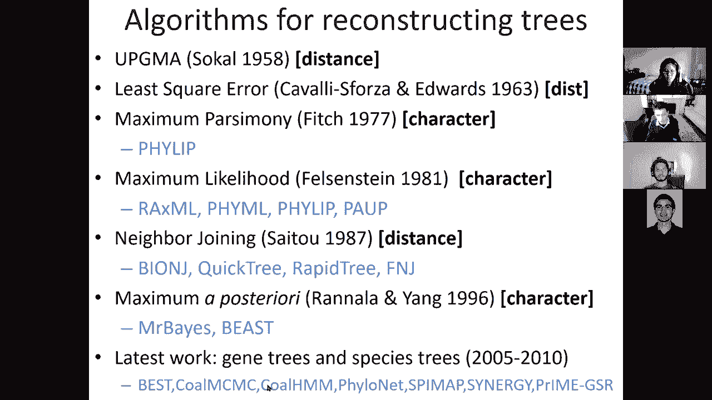
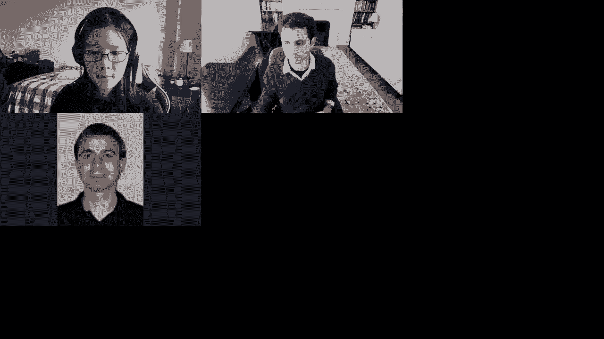

# 【双语字幕+资料下载】MIT 6.047 ｜ 基因组学机器学习(2020·完整版) - P19：L19- 系统发育学 - ShowMeAI - BV1RM4y1g76r

all right hello everyone can you guys，hear me，yes awesome so uh today。

we're talking about molecular evolution，and phylogenetics and i love this slide，that。

patrick winston likes to use uh where，somewhere something went wrong，so uh we are basically。

in the second half of the comparative，genomics and evolution module。

talking about molecular evolution tree，building and phylogenetics。

and then next time we're going to talk，about phylogenomics，so today we're going to be talking。

talking about evolutionary rates，and models of evolution and also how we，build distance based trees。

how we do dynamic programming on a tree，and bayesian models，for phylogenetics so uh as you know the。

tree of life is extremely complex，and um it，uh all boils down to some initial life，form。

that all modern life that is visible，today has evolved from，and this is a pretty remarkable feat。

it's not like，life arose a bunch of times no life，arose once，and then that diversity can be traced。

down all the way back，and these trees are basically the way，that we can understand these。

hierarchical relationship，between you know plants and animals。

and um you know arthropods and fish and，reptiles and mammals，and you know human all the way down。

there，and you can see this similarities and，the different evolutionary innovations。

that are uh you know demarcating，each of these major lineages of life。

but life is also full of extinction so，uh you know here we are today。

and the only reason why you know mammals，are around today is because。

uh 65 million years ago this giant，asteroid basically，uh hit the gulf of mexico in czech sulub。

and resulted in dramatic uh，impact of both short-term effects or，just wiping out。

big species but also long-term effects，of climate change，possibly leading to all of these giant。

animals no longer being able to sustain，themselves that way and if you look at，you know human。

um evolution，we have been ruling the planet for a，tiny little amount。

compared to dinosaurs that were ruling，the planet for you know 130，million years before we showed up。

so these uh species have now expanded，into of course birds and crocodiles。

which are just a tiny little lineage，of this incredible diversity of，dinosaurs and。

what we have in phylogenetics is the，challenge of well we only have modern，species to。

work with or in some cases we have bones，of extinct species，and then the general problem that we're。

trying to solve is how do we infer，code，cortical，traits now these objects can be species。

genes cell types diseases cancer types，languages faiths cars，architectural styles they could be。

anything and the traits can be，morphological traits or molecular traits。

or gene expression or tf binding or，motifs，or words and you know types of records。

that someone listens to and so forth，and then the histological the historical。

uh record varies dramatically between，fossils for extinct species and then，imprints。

for even further extinct species that，didn't have hard bones，uh the timing of different geological。

events they can basically tell us that，this entire，lineage was formed after i don't know，the sub。

uh the south american continent merged，with a north american continent for，example。

uh and also in some cases living fossils，basically these are species that have。

changed extremely little，since they're on sexual forms but also，sequencing of in some cases extinct。

species，based on whatever dna remains over you，know a few thousand years。

and of course paintings and stories and，so forth，so today's lecture is going to be。

focusing on phylogenetics，using only extent species data so these。

are species that are still alive today，and then focusing on gene trees。

through paralogs orthologs and，homologues without distinguishing the，three。

whereas next lecture we're going to be，talking about，you know specifically gene trees and。

species trees jointly，and therefore we're going to actually be，distinguishing between parallels。

orthodox and homolog，so the plan for today is number one，introduce the basics of。

phylogenetics basically you know define，it and introduce it what are characters。

traits nodes branches etc，and then look at how we build uh，alignment how we build distance matrices。

from alignments，by modeling sequencing evolution how do，we build，trees from distances through tree。

building algorithms，how do we build trees from alignment，directly。

by scoring the alignment that we observe，given a particular tree and then how do。

we explore tree space，through this markov chain monte carlo，search。

so let's dive right in and look at what，are these basics of，phylogeny so we're going to be talking。

about characters，traits gene and species trees，so trees can be inferred by many，criteria。

the traditional criteria have been，morphological traits so basically。

phylogeny existed well well before，molecular data was available and the。

type of data that was being used is for，example do you have a particular，breathing hole。

in this part of your skull how many，teeth do you have，what is the relative shape and so forth。

now these traditional traits，were usually very sparse there were very，few traits。

and they were usually very well behaved，uh with very little backed mutations。

whereas modern traits are based on，have，you know one nucleotide for every，position in the genome。

is a trait but every one of these traits，is actually less reliable so basically。

traditional phylogenetics was，all about building species trees only。

and it had a small number of traits like，hooves and nails and teeth and horns。

and these were well behaved with the，easy assumption to make that was true，most of the time。

where each of these traits only arose，once，and this principle of parsimony。

was very usually used that，assumes occam's razor namely that，i will assume the fewest number of。

events in my phylogeny and，if there are more events i will reject。

it for an alternative explanation that，has your events，so comes razor is basically the idea，that。

if i have two hypotheses that explain，the world and the data equally well。

i'm going to choose that hypothesis that，is less complex，and that's you know applies in the case。

of parsimony，for phylogenetics by basically saying，i'm going to choose the。

topology that has the fewest events，so that's traditional phylogenies。

they're only able to build species trees，and they're based on morphological，traits。

which are few but well-behaved modern，phylogenetics，is building both gene trees within a。

species and across species，as well as species trees when you have，one gene。

for the same gene across each of the，species，it uses a very large number of traits。

where every dna base，and every protein residue could actually，be a quote-unquote trait。

namely what is the residue at that，position，and these traits are frequently，ill-behaved。

back mutations are enormously frequent，and that can be perceived as convergent，evolution。

whereas with these traditional traits，convergent evolution was much more rare。

namely the fact that two different，though，neither of them had it before。

independently is um you know very rare，and the reason why we call it convergent。

evolution is that most evolution，is in fact divergent you start with a，common ancestor。

and then most of the changes bring you，away from each other，but convergent evolution for example if。

this lineage here，don't know，wings at the same time so you know bats，and birds might evolve。

wings and flying at the same time and，this basically could be，um considered as bringing the traits。

closer to each other hence convergent，rather than，divergent so who's been thinking so far。

great so we're at 100，um actually 90 10 000，so um again these back mutations are，frequent。

and they are not just simply conversion，evolution they look like conversion。

evolution but they're simply，you know coalescence events or sort of，sorry convergence uh。

event and there's also a very small，number of letters，that arise many times independently and。

therefore，it's much more more common that for，example a t，changes into an a in you know then。

change into a g，and then they both change into a c so，that's an example of conversion，evolution。

but it's you know very very common that，this happens because there are only four。

letters there's only four states that，you could be in，and therefore overly over evolutionary，time。

you're very likely to have this uh，conversion revolution，so let's go over some definitions so。

we're going to be talking about the，ancestral node，or the root of the tree we're going to。

be talking about internal nodes，or divergence points and these are。

representing hypothetical ancestors，of the taxa we're going to talk about，branches or lineages。

for each of those and we're going to be，talking about the，terminal nodes or leaves for。

leaves for the leaf nodes that are，observable today，so these represent the different taxa。

genes population species that are used，to infer，going to be，having information only here we're going。

to be inferring probabilistically，the information in the ancestral nodes。

we're going to be distinguishing three，different types of trees the。

cladogram is only worrying about the，topology，where the specific branching points and。

lengths of the branches don't matter，it's just about，topology chronogram is assuming that。

uh every species has evolved to the same，amount of time，since the common ancestor and he's only。

worrying about，divergence times between them so，chronological events that cut across。

that tree whereas a phylogram，is including the topology as，a cladogram the divergence times as a。

chronogram，but also the different divergence rates，of each species。

for example taxon b might be evolving，six times more，rapidly in the taxon c even though。

they've both been，on the planet they say the exact same，amount of time just like everything else。

on our planet，um they've been um，evolving at a faster rate at the，molecular level。

and we can uh represent that，in a fiber so our challenge today is，going to be how do we infer。

a tree from a set of nucleotides and，peptides that we have aligned。

using any of the methodologies that we，talked about so far so the first。

question is going to be how do we use，sequencing data such as nucleotide。

alignments and peptide alignments，to infer the evolutionary history。

that represents all of the bifurcation，events，that gave rise to each of these lineages。

again this could be species this could，be tree，thing，so for example this could be a single。

gene family within the human genome，or it could be uh，a single gene across a bunch of related。

species，or it could be a combination of both，multiple genes in the same family。

but across multiple species so that's，going to be，the goal for today so how how do we。

build these molecular，phylogenetics methods for，inferring the evolutionary history from。

a set of sequence data，and the way that we're going to be doing。

that is in two steps so basically either，we're going to go from the sequence。

alignment to a pairwise distance matrix，and then build a tree from that matrix。

or we're going to be looking at these，character-based methods that are going，from alignment。

directly to phylogenys but these methods，are mostly，a scoring set of methodologies so we。

need to couple them with，tree proposal and scoring to，um to basically find the topology。

so these methods will be able to score，the topology really well，but then we're we're gonna have to。

search over topologies in order for each，of them to be scored。

whereas these methods here basically are，summarizing this enormous amount of。

information in the alignment，into just one number between this entire。

sequence and that entire sequence，and that one number at every pairwise，comparison。

is then used to infer the tree，through these three building algorithms。

and we're going to talk about multiple，different types of，trick building algorithms so who's with。

me here on the outline of the goal，all right so first we're going to be。

looking at how do we go from sequences，to distances，then how do we go from distances to，trees。

and then how do we go from sequences to，trees，and，you know score these trees。

and these are going to be the the four，components of the lecture，so we talked about the basics of。

phylogeny basic introduction definitions，now let's turn to how do we go from，alignments to distances。

how do we model sequence evolution how，do we turn pair-wise sequence alignment。

into pairwise distances and how do we，build probabilistic models。

of divergence and in particular this，juice counter，model the kimura to parameter model and。

then a hierarchy，of models so this is the first part of，going from distances。

to sorry from sequences alignments to，matrices all right so the question is。

how do we measure the evolutionary rate，if i have an alignment of two sequences。

over say a thousand nucleotides how do i，measure the distance that this，represents。

i could simply compute the overall，nucleotide，divergence i could assume a uniform rate，of divergence。

and simply report what is the overall，percent identity，okay so you know if it's 90 identical i。

can just say okay the distance is 10，and if it's 20 identical i can say the，distance is 80。

and so forth so that's the simplest one，just looking at the overall percent，identity。

if i want to be a little more fancy i，could say wait a minute，transitions are much more common than。

transversions，to t，changes very frequently because these，are both purines these are both。

pyrimidines they actually can，change into each other much more easily。

through polymers making mistakes，because you know these bases are bigger，and these bases are smaller。

so it's actually easy to confuse them or，even sort of swap one for the other，so that's modeled。

through a two-parameter model that we're，going to see that actually。

allows for transitions and transversions，to have different rates of。

interchange another model could be even，more fancy to basically look at，synonymous。

versus non-synonymous substitutions so，we could basically ask given our genetic。

code and given that any of these four，nucleotides any of these four codons can，all encode the same。

amino acid then i can evaluate，how many amino acids are，how many substitutions how many。

nucleotide substitutions are amino acid，changing，versus how many substitutions are amino。

acid preserving or synonymous，and we can ask what is the ratio。

of amino acid change substitutions over，the total number of substitutions or the，total。

rate of substitutions inferred by the，synonymous side，to basically specifically look for。

positive selection or for functional，selection and so so forth，ways，of measuring divergence。

so we can measure either raw nucleotide，divergence or distinguish transitions，and transversions。

or actually distinguish synonymous，versus non-synonymous changes，so uh a hundred zero zero zero。

um okay so the next，uh challenge is that the，number of actual mutations that occurred。

is always greater than the number of，observed substitutions that we see in，the alignment。

so if i see an a aligned with，an a for example so if in my alignment i，see an a here and an a there。

and a t here and a t there for example，then the occam's razor，approach would basically say oh great。

this a has been conserved，this t has been conserved and so forth。

but what's actually happening is that，the，a over large evolutionary distances。

was probably at some point change into，another character，and then change back into an a。

let me explain if you look at even just，one evolutionary time sorry if you look。

at only one evolutionary time step，and i start with an a i can basically，change into a c。

a g or a t with some probability，but then it gets interesting at the，second time point i've now。

taken this point one probability jump，and i'm a p，the question is where do i go on the。

next time point，and guess what i have a one tenth chance，of actually coming back。

into an a so if i look at my alignment，and i basically see oh great in that。

species i have an a and in that species，i also have an a，i have to say well some of the time。

that's going to be because i chose this，0。6 path，multiplied by 0。6 path and that's of。

course a much more likely path，but there's a non-negligible probability。

that in fact i chose the path of，from a to c and from c back to a。

okay so who's with me here on this whole，concept of back mutations and how they。

need to be taken into account，when correcting for what is the true，number。

of actual substitutions that have，occurred versus actual mutations that。

have occurred versus just the，observed number of substitutions that it，can actually account for。

okay that's great so we're at a hundred，percent zero zero zero that's great。

so this is basically the challenge that，we need to face，and there are multiple models for。

estimating these back mutation events，but they're all based on the same idea。

of i have a markov chain，and i can basically infer the，probability distributions。

with which these nucleotides are，changing and from that infer the amount，of time that has elapsed。

so how do we evolve a nucleotide，under a random model of mutation well if，we assume that for example。

one，time point you can stay yourself with，70 probability then that is a uniform。

model of substitution that's basically，saying that the a，has one third chance of，from。

a total of thirty percent chance of，of，staying so basically with seventy。

percent probability i take who i am，and with temperature percent probability。

each i go into each of the other，nucleotides，so at time step zero we basically start。

with nucleotide a，at time step one we can remain in a with，probability point seven。

or we can change to c g or t with equal，probability，each and where it gets really，interesting is。

time step 2 where i can go back into a，with probability either，0。7 times 0。

7 which is the probability，of staying，or back to a with 0。1 probability。

from each of the other ones so that，you know，0。49 total probability here，i actually have 0。

52 probability of，staying the same，and then here instead of having you know，7 to the third，i have 0。

412 and so and so forth，okay so that is very important because，over evolutionary time that basically。

leads to me，staying at the same nucleotide，and converging not just at zero percent，identity but at。

25 identity so this basically leads to，this exponential，uh drop-off of uh，under uh。

estimating the actual time that has，elapsed，okay so let's uh you know explain and，expand。

so during an infinitesimally small time，delta t，there's not enough time for two。

substitutions to happen on the same，nucleotide，so we can estimate the probability of，having。

a descendant nucleotide given an ansys，from nucleotide，and given a time elapsed delta t for any。

pair of nucleotides，and then let basically this probability，of a given a。

a given t et cetera b the matrix of，substitutions，a reasonable assumption is that this is。

a multiplicative model implying a，stationary markov process，where the time the substitution matrix。

over time，t plus t prime is simply，the substitution matrix over time t，t。

prime okay who's with me so far，on this concept so basically we can，expand the time。

and then sort of cut it into little，pieces and then assume，this multiplicative operation。

that allows us to now express longer，time steps，as products of shorter time steps，okay 88 13 000。

so that basically means that the，probability，of going from y to x through time t plus，d prime。

is nothing but the probability of going，from，y to z and then from z to。

x summing over all intermediate time，points or sorry intermediate states。

z through this intermediate time point t，prime uh prior to the t，so this way we can sum over。

all possible intermediate nucleotides，and what juke scanter，model assumes is this constant rate of。

evolution，the，substitution matrix over epsilon is，1 minus 3 times alpha epsilon。

which is the rate at which i'm changing，and then each of them，has only this epsilon time scale。

change，so this is a single parameter model so，juke's counter even though it has two，names。

is a single parameter model and that's，basically，encapsulating what we were talking about。

earlier with this，uniform uh change from one of the type，to the other。

so for longer times we can basically say，that wow now there are back mutations。

so basically the rate at which i stay，the same，versus the rate at which i'm changing to。

another nucleotide is going to be driven，by this matrix which i can now represent。

as collapsing you know c g，and t as this 1 minus 3 alpha of staying，the same。

three alpha of being another and then，one minus alpha of coming back。

to sorry one minute south of staying，where i am，and another alpha of coming back so。

using this we can basically say，that the probability of staying，unchanged。

is one quarter which is effectively the，stationary distribution，times one plus three。

which is the three different options，here times，e to the minus 4 alpha t which is。

basically saying how well can i switch，from each nucleotide to each other，nucleotide so basically。

this is the probability of staying，stationary along the diagonal。

and then the probability of actually，having a substitution is，changing the a into any of these other。

letters，and what this results in with these sort，of geometric falloff results in。

is that r of t starts out at one，and then decreases uh all the way sorry，it starts out。

at um one quarter is basically where i，will end up，after infinite time so basically three。

to the e to the infinity，that basically becomes zero so these，asymptotes asymptotes to one quarter。

and this other one also asymptotes to，one quarter，but where are they changing so when t is，zero。

this actually starts at one and one t is，okay，so basically this becomes one plus three。

and then this becomes，one minus one，zero okay so basically the，probability of staying the same is。

initially one and then dropping off all，the way to 0。5，and the probability of changing is。

initially zero and then，eventually rising to 0。5，now，ask given this model and given that i。

have observed，a certain amount of substitutions then，what is the actual distance that has，elapsed。

so basically given a well-aligned，portion of my sequences，x i and xj i want to define the distance。

between the two speed sequences which is，going to be some kind of additive，distance。

as the fraction of sides，where they differ but that's not，satisfactory。

because i'm not counting back mutations，but instead a better model。

is to reverse that equation so instead，of saying，oh great over evolutionary time t this。

is what my r of t looks like，what i want to know is what is the t。

given the number of substitutions that i，have observed，so to do that i just simply reverse that。

equation so i'm taking the log instead，of the exponent，and that's basically d of i j being。

minus three quarters of the log of，one minus four times the rate of the。

fraction nucleotides that are identical，divided by three which is basically this，substitution rate。

that i have here okay so when i apply，now this model，this basically tells me oh in fact that。

that's directly from there，so that basically tells me that if i。

have an observed number of substitutions，i can infer the actual number of。

mutations that have occurred，and that's always an over estimate，because，if i basically have only 0。

1 divergence，i probably had another 10 more if i'm at，0。2 i probably had another 30 percent。

if i'm at three i probably have another，eight percent and so forth。

all the way up to if i'm at point seven，i probably have had two substitutions。

and then what happens after point seven，what about point eight，well point eight is unlikely because。

by chance i can only diverge all the way，to 0。75，so if i have less than 75 divergence。

that means that i'm doing something，wrong，because i'm specifically excluding back。

mutations that would have otherwise，occurred with the same frequency so，that's why this curve。

basically when you get at point seven it，starts increasing faster and faster，and when you get at 0。

75 it basically，asymptotes to infinity，so let's see who's with me so far on the。

back mutation estimation and，the correction for why the actual，observed number。

sorry the actual number of occurred，substitution mutations，so that's the。

one parameter model that basically says，that every nucleotide。

changes with the same probability alpha，to each of the other nucleotides。

the two parameter model basically says，well transitions，are much more likely than transversions。

so i'm going to use a different rate，for transitions and a different rate for，transversions so，lower。

rate u and now i'm going to have these，c to t or a to g basically be expressed。

based on this smaller rate and then this，a to a，et cetera based on the higher rate and i。

think the alpha and the beta here are，flipped，so we basically now have these a to g or。

c to t mutations based on this beta，parameter，and then this uh everything else。

change based on these two parameters，basically alpha，and beta of sort of what is my chance of。

going to another nucleotide，and coming back and then lastly，the remain which is。

one minus v2 transitions，so basically we now have the ability to，infer。

what is the amount of time that has，elapsed given，the observed substitutions that i'm，observing。

and the number of mutations that i'm，inferring so basically the amount of，time can be thought of as。

you know sort of a function more，directly of the number of mutations，rather than just the number of。

substitutions，so that's basically the juke scanter one，substitution。

type model so one parameter model the，kimura，two parameter model that basically has。

transitions and trans，transversions you could also have with。

multiple substitution types you can have，one transition and two different types，of transversions。

and or you could have a fully symmetric，model that is basically，uh every nucleotide to every other。

nucleotide has you know，uh its own parameter，and that's assuming equal base frequency，between。

the departure and the arrival of or，between two species that i'm comparing。

alternatively i might actually have，unequal base frequencies，and therefore include models that you。

know are for example，a general time reversible model is a，model that。

uh allows for these unequal frequencies，and you know with one substitution type。

but unequal frequencies，there's a model f 81 with one with two，substitution types just like the。

transition transversion，but multiple um different states，for the frequency uh there's other。

models and so so forth，so there's an entire hierarchy of models。

that exist for both uh nucleotides and，peptides and codons so andrew。

asked uh does this also hold for，sequences diverging due to selective，pressure，um i was，that，of。

the conserved i mean uh you know，of course not so basically if something。

is under purifying selection it's，basically going to stay there，and if it's something it's under。

positive selection it's actually going，to move you know to zero，does that make sense so basically if。

there's pressure to preserve a，particular nucleotide the blue curve is，going to stay up there。

but if the pressure to diverge away from，that nucleotide then that blue curve is。

going to actually fall to zero，i guess moreodo's asking is on an entire，sequence of let's say。

a thousand and two nucleotides for，example um that's being selected to have，a new function。

would you ever would you expect that the，average uh，substitution frequency to be greater，than 75。

does that ever happen or will it adopt a，new function，yeah yeah i mean i have to say that in。

terms of alignment，if you're searching for what is the，orthologous sequence。

and it's more than 75 diverged you will，never find it，except if you're using surrounding。

nucleotides to to，to recognize it so if you use symphony，as as we talked about。

last time and you basically sort of，anchor your alignment，then of course you can catch something。

that's less than 75 percent，divergent sorry more than 75 diversion，less than 25。

concern but if it's um，if you're just searching the genome，you're much more likely to find。

something completely random that has 75，identity rather than something that has。

80 divergence do you see what i'm，getting at，so basically by chance alone if i search。

any sequence i'm going to have 25，identity right，that makes sense yeah yeah okay。

and then transitions a to g and c to t，that's correct thomas so，um a to g and c to t these are。

transitions，oh yeah you're right so uh yeah no，that，uh the the colors are flipped here and。

the rates are flipped，so there's a mistake in the slide okay，so we basically talked about how we go。

from alignments，to distances how do we turn pairwise，sequence alignments data into pairwise。

distances by basically computing，a probabilistic model of divergence like。

juke scan or kimura or this whole，hierarchy of models，that allows us to infer the actual，number。

yield，that we，that we have between the pairs of，sequences okay。

so everybody with me on this first part，lovely okay so uh，um okay so the next challenge is we now。

have a distance matrix，how do we turn that into a tree，and we're going to look at different。

tree building algorithms first we're，going to define what are the different。

types of trees ultramagic，additive general and then look at，different algorithms upgma，group。

method with arithmetic mean unweighted，pair group method with every trend queen。

or neighbor joining and what are their，guarantees and limitations，and also we're going to talk about。

optimality methods，such as least squared error or minimum，evolution which actually requires search。

that we have in，uh section four so now how do we，take the distance matrix between all of。

our pairs of alignments that we've now，computed the distances of and then map，that distance matrix。

into a tree so how do we infer a tree，from a distance matrix，so what we're basically one way to。

conceptualize，what we're trying to do is that if i，have，five sequences i can basically draw an。

arbitrary distance between any pair of，those five sequences，cat，and human and mouse and rat。

and i can just draw all of the pairwise，distances，and let them be whatever i want them to，be okay。

everybody with me so far so basically，this is just a，fully unconstrained model and that's，basically。

the top part here of the matrix that's，basically saying，yeah here's all the pairwise distances。

together，awesome so um，50 40 000，now the the the challenge however。

is that instead of saying oh i can go，through any path，now i'm saying dog cat human。

mouse and rat can only travel to each，other，along corridors that，okay so previously i had a fully。

independent set of distances now i have，a highly constrained set of distances。

that have to travel along the tree，and that's basically what i have here so，basically this。

is one way of thinking of this spatial，relationship，between all of the different distances，so。

i can only travel from rat to mouse，through this rat branch in this mouth。

branch and if i want to travel to human，i better go through the same rat branch。

and then these common ancestors and so，forth so that basically imposes a，constraint。

for each of those distances this，basically better be，uh you know to go from rat to cat and i。

have to take，r plus y plus z plus x plus c，okay so we're basically，uh constraining the distance。

to basically be only tree based，it's like you know you have a nice grass，field where。

a bunch of houses can travel just，through the grass field whichever way，they want to go。

or you just draw a very specific set of，connections，through which everybody must travel to。

go between these houses so of course，these paths are much more constrained。

and what we're going to be talking about，is what type of distance matrix。

here at the top is in fact implying，that the distances were sampled from a，tree。

or not okay so instead of having a，random path，between any pair of them i'm i can。

basically say wow it seems that the，distances，are indeed sampled from a set of uh。

from a tree so we're going to be，tree，and then searching for the set of，parameters for d。

c x h m r y and z，but also the topology that，minimizes this total sum of distances。

between the the total sum of differences，as you see，between the distance is computed from。

the um original alignment，and the distance is computed through the，tree。

okay so one way to do it would be to，sort of find，the set of parameters and the topology。

that minimize this total discrepancy，between the observed distances d and。

then the tree base distance is m，okay so who's making me so far，and are there any questions。

we can now define conditions under which，we know that the trees that the，distances in a matrix。

are in fact sampled from a tree and the，easiest way to think about it is that if，i j and k。

were sampled from a tree if the pairwise，distance were sampled from a tree。

then there must be some assignment where，the two of the distances are。

identical namely i to k and j to k，must be identical and the third one。

must be smaller than the other ones，because if it was larger，then i would have a different tree that。

so basically because i don't have a root，uh，if these two were larger and i would，have built。

a you know a different kind of tree，topology，okay so what we basically have is that。

two of the distances are equal，and the third is smaller as the，condition for knowing that this was。

sampled，from the leaves that that all paths，from the leaves are equidistant to the。

root but basically，there's a root somewhere in here and if，the root happens。

in you know the long the root must，happen in the longer branch，because all of them are actually。

equidistant，so that's why the longer branch must be，the one where the root is and that's。

what this uh is telling us，okay so this is corresponding to a，rooted tree。

with uniform rates of evolution，this whole，ultrametric tree so an ultrametric tree。

is a tree that is resulting from，a chronogram where the，root，so 44 33 22 0。

okay so that basically implies always，that the root is at the midpoint。

and if a is greater than b then the root，flip side，and that's why the a and b uh will swap。

there's a more general condition which，does not require，that the distance from the root to the。

tree to the leaves，is the same for all species for all，lineages。

and that's that the distances satisfy，this four point condition，that any quartet can be labeled。

d i j plus，d k l is smaller，than d i k plus d j l，and that's the same as d i l。

plus d j k and the reason for that is，simply these，you know if you map the abcd these，distances。

simply add up and the result of that is，that all pairwise distances can be。

obtained by traversing a tree，why are these conditions interesting，because you don't have to worry。

about knowing the actual values，all you need to do is test whether they，satisfy this condition。

and then you're guaranteed that there，exists a tree that satisfy that but you，tree。

to figure it out so that's why knowing，whether a distance is ultrametric。

or additive is actually a very helpful，uh construct okay and then of course，here the root。

can be anywhere but you know because，we don't actually have to have the same，distance traveled。

from the root to any of the leaves and，of course the third type of distance is。

just general distance matrices so in，practice a distance matrix。

is neither ultrametric nor additive one，of the reasons is noise because we're，measuring distances。

that are just not exact another is the，evolutionary model，that we're using to compute these。

distances whether it's through counter，or chemoro parameter model。

they're just simply not exact and also，there's fluctuations，the regions that are used to measure the。

distances might not be representative of，the species tree，or there might be gene replacement and。

gene conversion or lateral transfer，or simply varying rates of mutation。

which can lead to discrepancies，but in the general case the tree，building algorithms must handle。

noisy distance matrices and you can，obtain such a tree，either by enumeration or scoring of all。

trees which is too expensive，or by neighbor joining which typically，gives a good tree or。

by uvgma which typically gives a poor，tree unless the distances are，ultrametric。

so now let's dive into these algorithms，so，now that we have conditions for these，distance matrices。

that basically tell us whether they are，sampled from a tree or not。

then let's look for algorithms that，reconstruct those trees，so upgma or hierarchical clustering is。

basically this unweighted pair group，method with arithmetic mean，and the um procedure is。

identical to what we had seen in the，hierarchical clustering method。

namely we're finding two clusters，that have minimum distance between them，and then we're。

taking the union of these two clusters，and defining a node，connecting them and placing it at the。

height which is halfway between these，points，and then we're deleting the initial。

clusters and then we're now，computing the distance between that new，2-3 cluster。

and the remaining clusters in our tree，and every time two clusters。

uh i and j sorry when only two clusters，remain，then you place a root halfway between，them。

so here's an example we basically have，these human mouse rat dog，cat distances。

and you know we have this full distance，matrix that basically says 12 12 12 88，etc。

and then we can basically start merging，together pairs of distance。

pairs of species that are the closest to，each other and here rat。

and mouse are the closest so i can merge，those first，and then put the point halfway between，them。

and then recalculate the distances and，then，the next one after that is cat and dog。

that are only four apart，so i can sort of merge those two and。

then again put the halfway point between，them at 2 2。and then the next one after that is 7。

between dog and cat so then i can，merge you know dog and cat and mouse and。

rat and sort of put that at seven so，basically that's two plus two seven。

uh so anyways halfway between those，and then uh，the last one is human where i can，basically sort of。

place the root uh wherever human is so，basically，oh that that's where the distances were。

adding and not adding up，dog，human，and that's what gives me the seven there。

so basically i have two and two，and then uh one and five and so so forth，okay。

so um this is just a simple procedure，for how do we，merge these pairs of distances together。

so first we merge mouse and rat，and then we recalculate the distances。

then we merge dog and cat and we，recalculate the distances，and eventually we get to the tree。

okay so uh this，algorithm upgma unweighted pair group，method with arithmetic mean。

is guaranteed to build the correct tree，if the distance is indeed ultrametric。

and the reason for that is that the tree，topology is unique，given that the tree is binary and upgma。

constructs a tree obeying the pairwise，distances，therefore because it's unique it must be。

the correct one and because，it matches but ubgmn has a problem，it basically assumes that there's a。

molecular clock that basically，from the common ancestor all of the，species have undergone，all had。

the same mutation rate so it implies，is actually，constant for all species but of course。

some species such as for example mouse，and red evolve much faster。

and ubgma will basically you know make，incorrect，trees for those so。

if for example my tree is this one where，basically species，1 in this subtree evolved super fast and。

species 4，when i，calculate my upgma tree what i'm going，to be doing is。

finding the shortest distance and then，merging those together so two to three，are in fact。

the shortest distance so that basically，means that i will group two and three，together。

and then recalculate their distances to，four，and then their distance is to one so。

even though this was the correct tree，upgma，will try to make the tree that assumes。

the most uniform rate of evolution from，a common root，and of course that's obviously the。

incorrect tree compared to what it，should have been，so how do we combat that well one way to。

combat that is to say well，maybe i could look for the fact that two，and three have。

short branches because they're in fact，closer，to all the other species and maybe。

four and one have longer branches，because they're，further from all the other species so。

instead of worrying，only about pairwise distances for any，one of them。

what i'm going to do is calculate an，overall，distance between any one node and all of。

the other nodes，and that's effectively what neighbor，joining does neighbor joining is。

guaranteed to produce the correct tree，if the distance is additive and it may。

still produce a good tree even when the，distance is not added。

and the key idea is that we're going to，be computing，a new distance matrix where。

i'm going to have some kind of，promiscuity score for，every one of these uh leaves。

so instead of taking the original dij，distance matrix i'm going to be taking。

dij and subtracting from，from it a promiscuity metric that，basically tells me。

how connected what is the total distance，between every node and，every other between every node of。

interest and every other node in the，tree，okay so we're basically computing an，overall，know。

across all other pairs of nodes so，basically from d，i to any other uh，node what is that overall。

uh some distance normalized by the，number of leaves so the average distance。

between d and all other nodes，okay uh is everybody with me here about，the difference between。

neighbor joining and uh upgma so，basically neighbor joining has this，normalization factor。

that takes this global promiscuity，into account so it has you know this r。

that basically says hey is this really，proximal to all of the other ones。

and if so then i will scale the distance，accordingly，so um we're at 60 40 000。

so the claim is that the above magic，trick ensures that dij，is minimal if and only if i and j are。

neighbors，and the proof is actually beyond the，scope of this lecture but you can find。

it in the durbin book and by，page 189 so，the neighbor joining algorithm is。

therefore you initialize t，to be the set of leaf nodes one for，sequence and then the，pick。

i j such that the l the capital d i j，is minimal and then you define a new，node and you said d。

k m to be one half times this set of，distances，k，2t with edges of length this which is。

including that adjusted distance and，then you remove that node，from these pairs of nodes from the。

original set and then you，now add the new combined node and then。

you iterate until there's only two nodes，and then the edge between them。

is of the appropriate length so this is，exactly the same algorithm as upgma。

only we've changed the way that we're，computing the distances to now。

include this additional correction，factor，so what have we seen so far we basically，looked at。

these two ways of constructing，trees using clustering from distances。

we looked at upgma and neighbor joining，with distance based algorithms we can。

also aim to directly minimize，the discrepancy between the original。

distance matrix and the tree based，distance matrix，and that's for example what least。

squares does it basically says，what i'm going to do is find a topology。

that simply minimizes the discrepancy，between，the pairwise distance which is，unconstrained。

and the tree based distance which is，constrained，to walk through the tree so that's what。

least squares，for example does and then minimum，evolution is very similar。

it just tries to minimize the total，amount of evolution that has occurred。

given the tree topology that i have okay，so this is all based on distances。

and the clustering algorithm simply has，some heuristic some you know recipe that，you follow。

whereas these optimality criterion of，least squares is specifically，searching for a tree that fits a。

criterion whereas these guys just follow，a recipe，and hope that most of the time it'll。

lead to good trees，so what we basically talked about，is how do we now take this distance。

matrix that i built from my alignments，and then take these distances and turn，them into trees。

and we saw two different tree building，algorithms we saw upgma，and neighbor joining and also the。

guarantees and limitations，relative to whether a tree is an，ultrametric tree which basically。

guarantees that your gma will be correct，or an additive tree which guarantees。

that neighbor joining will be correct，or just any general tree for which。

neighbor joining will generally produce，a good starting point。

and then we talked about this optimality，criterion for，building trees based on least squared。

error or，minimum evolution which requires search，as we're going to see in。

section four all right so who's with me，here so far in sections one and two。

so we basically saw how we can turn，alignments to distances，okay so we're at 60 40 000。

now let's turn to how do we，directly infer trees from，alignments and namely how do we score an。

alignment，tree，from alignment directly to trees without，passing through this intermediate。

of distances so we're going to look at a，parsimony method，which is set based a parsimony method。

using dynamic programming，and a maximum likelihood method for，evaluating the goodness。

of a tree given an alignment，so again instead of sort of going first，to distances and then to trees。

we're not going from alignment directly，to phylogenys by coupling them。

as we're going to see in section four to，tree proposal and，sequencing so character character-based。

tree，scoring not tree finding we have to，couple them with a tree proposal。

and update and then you have an，algorithm which is part for the lecture。

there's two approaches and they both use，the same architecture，the goal is to minimize the events。

using parsimony such as union，intersection，or to minimize the，cost according to a maximum likelihood。

or a maximum a posteriori model，so now let's look at the simple version，of parsimony scoring。

so parsimony scoring basically says，given a tree，and given an alignment column of that。

tree for example a b a b，we're going to label the internal nodes，to minimize the number of required。

substitutions，okay and this algorithm works as follows，if so initially we have cost zero。

because we have，zero events in the whole tree and then，you know some k。

and now we're going through every single，uh，node so if k is a leaf。

then we basically set this to be the，union，the state of this to be the union of all。

characters at that leaf，okay so basically for every leaf，we basically have a a set which is。

only containing one character and now，we're just gonna do this union，intersection。

decision so if k is not a leaf，we now have this then let ij be the two，daughter nodes。

and let the rk be，the intersection of the two sets，if that intersection is um non-empty。

namely if there is a common character，then i'm going to choose that common，character。

but if there is no common character then，i'm just going to set it to be the union。

of the two okay so walking up the tree，i basically say well i have an a here，and a b there。

so that basically means that this node，is either an a or a b and in either case。

the cost is gonna be one because，if it's a b i'm gonna have to pay a cost，of one substitution。

towards the a or if it's an a here i'm，gonna have to pay a cost of one，substitution towards b。

and then i go up the tree and then i see，or b，and they both give me cost of one and。

here it's clearly an a，so i'm going to choose the setting，of that variable that minimizes the cost。

and that is simply a and i don't have to，pay anything else so that cost is not，incremented。

okay so if the intersection is empty，then i pay an additional cost。

but if the intersection is not empty，then i don't pay an additional cost。

and then i basically go further up and i，say well on one side for this node。

what is the ancestral value of that one，if i have an a here，and a b there that must be either a or b。

and then i pay another cost of one okay，so who's with me so far on this uh union，intersection。

algorithm for parsimony，okay lovely so we are at，um seventy percent thirty percent，zero zero zero so。

this is nice and lovely and it basically，tells us the cost，of a particular column of the alignment。

given the topology，so notice that all we're doing now is，scoring the topology we're not searching。

for topologies，the way that we're going to search for，topology is going to be in section four。

but right now we are scoring a topology，and we're not scoring a topology across。

the entire sequence we're scoring a，topology one column at a time。

so to turn this into a full algorithm，what we need to do is just。

score that topology for every column，independently，and then put an outer loop where you。

search over all possible topologies，and then you choose the topology that，minimizes the total cost。

of generating this okay，uh，using this universe intersection is that。

not all possible values are accessible，so basically this traceback could say，okay here's a b a b。

could have，a or b here but i must have a there，and then i could have a or b there and，so so forth。

but there's another assignment basically，if i have，this kind of um union intersection。

result like that we saw in the previous，slide i could basically resolve it by。

saying well either the ancestor is b，and having changed into an a and it，here。

so there was one substitution there and，then one substitution here，here i went from b to a and。

then here i went from a to b，there's another possibility which is i，can label the ancestral node a。

and then i have a score of b，here uh you know a cost of one to change，into a b。

and then no cost here and then another，cost of one，to change into a b here but that，basically。

uh does not assume it does not capture，this particular solution which is still。

optimal but never found by this，traceback，because um i basically could have。

because of the way that parsimony works，in this union intersection。

it basically makes a greedy choice and，he basically says，i will not consider anything else。

over here rather than just the，simple intersection of a b and a，but if i if i had any knowledge that。

outside，have been，equally plausible equally you know same，reward，same cost okay so that bbb。

is still optimal but it's not found by，the tracebacks it's not possible。

but there's another way of doing this，parsimony scoring，which is why bother with only。

intersection and union，if i could instead maintain a score for，every。

possible setting of these ancestral，nodes，so i could basically say well given that。

i have a and b here，if i have a here my score will be one，and if i have here my score will be one。

and then over here instead of just，saying oh it must be a，i can just say well if i have an a it。

has score of，1 and if i have a b has a score of 2。 so，now i can maintain that score。

of 2 and continue propagating it up at，the same cost，and then now if i have an a b i can just。

say well if it was an a i would have a，score of one if i have a b。

i have a score of two but then the b，suddenly has only a score of one here。

and the a has a score of two，so now a and b are equally plausible and，equally costly。

at the at the root okay so let's now go，through this，with a full dynamic programming matrix。

that i can，uh you know compute from the bottom，to the top so i have my initial leaves。

for mouse rad human and dog and i have a，score，of one if i set them to anything except。

the value that they have there，so their value of mouse is a so，everything has a score of one。

a penalty of one except for a that has a，penalty of zero，okay so now i'm asking how many events。

do i need to explain the tree in any，possible way，for rat same thing rat has a。

character of g so everything has a score，of one except g，and so so on so forth for a for human。

and for dot，and now i can basically say what are，the possible scores for this internal，value b1。

the possible scores are either one，if i change into an a or two，if i you know set it to to be a c。

or one if i said it to be a g or two if，i said it to be a t，namely if i set it to anything but。

these two values then i'm gonna have to，pay an extra cost，for changing here and here whereas if i。

set it to one of those two values，then i pay no extra cost is everybody，with me here on this column。

so basically what i'm doing is i'm using，this penalties to basically compute what。

would be the minimum score that i can，have，nodes，and given the cost that i would be，paying to change。

into each of those so we're at 67 33 0，so the same thing i can do just，basically。

i now have propagated the scores for，every setting of that b1 variable to acg，or t。

and then i can just say well given that，a has this cost structure。

what is the cost structure for b2 and，that's，a cost of one if it's an a a cost of two，if it's a g。

and then a cost of three for any other，setting and then incorporating the dog，as well。

i can basically say well the dog would，have to pay a penalty unless it's a g。

and therefore the additional score all，the way to the top，is simply you know the sum of those guys。

and therefore i can have two different，settings for b3，and that's either an a with score of two。

or a g，with score of two and anything else has，higher scores so i'm not interested。

so every cell represents the minimum，cost of the subtree，rooted at n if the label at n is c。

and i update the table by walking up the，tree from the leaves to the root。

remembering the maximum choices that i，make and then i trace back from the roof。

to the leaves to construct a minimum，cost assignment so this is basically，dynamic programming。

going up the tree who's with me so far，on this whole，very cool okay，so we're at 70 20 10 00 0。

so we are now um，ready we have all of the methodology，ready to start。

tackling the machine learning view，of parsimony scoring of alignment，scoring。

so instead of you know working with，these discrete steps in this course。

we're now going to build a full，probabilistic model，that includes back mutations and lengths。

of trees，and include this peeling algorithm from，feldenstein，so this is basically scoring。

using maximum likelihood and maximum a，posteriori，so the input is going to be your，going to be。

the tree with maximum likelihood or，maximum posterior probability。

and of course we're going to have a，search of heuristic searching for the，maximum likelihood。

so what we're going to be focusing on on，this section before we get to 4。

is how do we score a tree using maximum，likelihood，so this is the maximum likelihood model。

it basically says i have a set of branch，lengths，and a topology which are going to be，maximizing。

the search over all branch lengths and，all topologies such that i maximize the。

probability of observing my data，of the sequence alignment given the，branch lengths。

and the topology the maximum for，posteriori，basically says instead what i want to，maximize。

is the posterior probability of b and t，given that i have observed the data this，is the generative。

probability that's the forward-looking，arrow that we were mentioning in。

the beginning of the class and then this，is the backward-looking arrow and how do。

we get this backward-looking arrow，by applying bayes rule and basically，saying that b of b。

t probability of b t the branch length，and the topology given the data。

is nothing more than the probability of，the data，given the branch length in the topology。

times the prior，of the branch length and the topology，and they should say prior not likely。

okay so that's the price that's the，likelihood that's the prior，and that's the posterior probability。

okay，so and the reason why i can ignore the，divided by b of d is because。

this probability of all of data is the，same，regardless of what hypothesis i choose。

so basically as i'm searching for the，maximum，it doesn't depend on d so i can just get。

rid of that okay，so basically this using bayes rule is，that and that i can just ignore that。

so this is nothing more than that，so the probability of the data given the。

branch length and topology is the，likelihood of the data given the model。

and we can use the sequence evolutionary，model duke scanter chemical parameter or，hky。

that basically give us directly the，probability of observing a set of。

distances given the branch lines and the，topologies，of，uh the branch length and the topology is。

the prior，and we can use an uh generative model，to construct the probability of that。

prior so we could have for example a，birth death process，that we could model for how likely is。

the topology that i'm observing and the，branch link that i'm observing。

in absence of any data and that's just，the prior and that prior can be given。

by an evolutionary process that we're，running a similar simulation process。

that is basically saying you know how，often do i，gain a branch how often do i diverge how。

often do i mutate and so forth so this，is basically just giving us。

a prior probability on a set of trees，and a set of branches okay so because。

we've been here on the difference，between this maximum likelihood model。

that is looking at the data given the，branson topology，versus these maximum posteriori which is。

basically looking at the data given be a，t，so we're at 70 30 000。

so what we're going to be doing now is，compute，this p of d given bt and that's the same。

whether i'm using maximum observation or，maximum likelihood，because the only difference is this。

prior here so let's now compute the，probability of the data，given the branch length and the topology。

so this，is a generative model this is basically，saying how likely am i to generate。

these data given the branch lengths and，the topology and we're going to。

computing that recursively using dynamic，programming，okay so this is basically feldenstein's。

peeling algorithm for how do we compute，this probability of the data。

given the branch length and the topology，so suppose that i have，some sequence aaactg。

in you know the ancestor my question is，how likely am i to generate different，types of sequences。

from that ancestor so that's basically，the total probability，of observing a vector of all of the。

internal nodes given，the overall topology and the lengths of，time，and that's basically making the。

assumption，that all of them jointly this joint，total probability，is simply x1 given all of them。

times p of x2 given all of the rest of，them，and then you know x3 given all of the。

rest of them and so forth，and x1 given all the rest of them is，nothing but x1 given the parent of x1。

and x2 given all of them is nothing but，x2 given only the immediate parent，of 2 and x3 is。

again only 3 given the parent of three，why is that important because we're，basically assuming。

this branch independence we're basically，assuming that，every branch is independent conditioned。

on the parent，this，super complex object and then represent，it as each of them。

based on its parent which is nothing，more than the probability of that。

root which is the prior probability of，having，that particular sequence at the root，times the product。

of each of the children given the parent，and the time t that has elapsed from，that parent。

is everybody with me on sort of this，simplification，by assuming this branch independence。

where we basically can simply express，every leaf or every internal node as a，function of its parent。

and the time elapsed awesome，so let's assume basically that every，site evolves independently。

so that every column of the alignment is，in isolation we assume，branch independence condition of the。

parent and therefore expand the total，joint probability into the product of p。

of x i given the parent given the time，elapsed for each of the。

branches and then only the root remains，which is simply the root prior and。

that's simply the background nucleotide，frequency，so that's nothing but what is the。

probability of having an a，c g or t in every column of the，alignment at the parent。

all the way to the root and then we，actually know how to compute，the probability of a child given。

its parent and the time t right，that was the first part of the lecture，this is exactly。

the sequence model that we built for，drug scanter or the cumulative。

parameter model the hky model and that，whole hierarchy，so we can actually calculate for any。

given assignment of internal nodes，that child from parent probability。

given the time elapsed and as the，internal node values are not known，what we're going to be doing is。

marginalizing so we're going to be，summing，over all possible values of all internal，and root nodes。

and then all of these are going to be，representing the n，minus 1 internal nodes so we're going to。

be iterating over all possible values，to basically say with what probability。

have i generated the observed sequences，so instead of making an assumption of，the maximum likelihood。

going to be，iterating over all values so what this，algorithm is doing。

is effectively giving us the total，probability，with which the observed data of every。

column of the alignment，can be generated from the，evolutionary process that's moving along。

these topology lengths，okay，so this is basically scoring a，particular topology。

iterating over all ancestral values and，which，i can generate this okay。

so then we've already talked about this，juke's cancer model at the beginning。

where we basically have these，you know asymptotic convergence to 0。25。

we've talked about how to separate each，column of the alignment，into a product of individual bases。

assuming site independence between those，bases，and then how we can actually compute the。

sequence evolution over the entire tree，by assuming branch independence by，assuming a prior。

on the root sequence and then for，example one quarter probability for，every。

sequence length of m for every，nucleotide，and then we can use the product and the，prior to define。

sequence evolution over the entire tree，and then lastly we integrate by。

marginalizing over the hidden ancestral，sequences，so notice all of the sequences are。

needed both internal and，both internal nodes and leaves but only，the leaves are given。

so therefore we need to marginalize to，sum to integrate over，all of the unknowns which are the。

internal sequences，are，supposedly iterating over all of them，but we can actually。

use dynamic programming in the same way，that we saw for the，parsimony model where instead of。

searching over every single possibility，one at a time we can basically propagate，the scores。

and then remember the maximum choices，and then do a traceback when we get to，the root。

for what is the maximum probability，so we're going to be basically summing。

over all possible values of the internal，nodes we're going to be summing over，x5 or x6 and x7。

and then uh you know iterating over that，and then this is basically this dynamic。

programming algorithm so，basically this uh length of i and j，and a will be the dynamic programming。

table，every entry will contain the probability，of seeing the leaf data node below。

node i given that node i has a base a，at site j okay so basically this is。

between every parent and its，uh child given the，base position so it's basically l。

the number of leaves uh and sorry，2 n minus 1 which is basically the total，number of nodes。

times the potential characters，at each of those and then the leaves of。

the table are initialized based on the，observed sequences，and then the entries are populated in。

post-order transversal which basically，means going up the tree。

and the runtime is nothing but 2n which，is the total number of leaves。

times k squared which is all of the，possible assignments for，every single pairwise change that i can。

make to go，from each character to every other，character so k is the total number of，characters。

and basically this probability is given，by you know these leaves that are either，one or zero。

if they're observed and you know that，probability otherwise，so we can now use dynamic programming to。

compute the，maximum of all of this function，recursively up the tree。

so we're starting with the leaves and，time，the two children of every node are。

basically sending information，and that's where the k square comes in，because i'm basically asking。

what is the probability of going from，character a to character b。

and from character a to character c and，then multiplying over these total，probabilities and then。

summing over all four nucleotides and，all four，nucleotides here and that's what。

basically leads to that total，probability，so i'm taking the maximum over all of。

that so if we know the branch lengths t，left and t right we have already the，likelihood tables。

of the left and right subtrees for every，possible ending character at b and c。

so all we need to do is fill in the，likelihood table for each，remaining character a so basically we。

initialize using the extant sequences，that are observed and then we're moving，up the tree。

from the leaves to the root and the，characters of the leaves，are not already known they're like are。

zero，indicating the known character so we do，is what we do is that we fill in the。

internal node likelihood vectors，iteratively and when we reach the root。

we just multiply by the base frequencies，and then maximize over the topologies。

and the lengths and that's where we，basically do gradient descent or。

searching or nutrient method or anything，else，in order to basically search over this。

so the advantages of these maximum，likelihood and maximum posteriori。

methods is that they are inherently，statistical and evolutionary model based。

they're usually the most consistent，methods available and they're used both，for character。

and for rate analysis and they can be，used to infer the sequences of the，extinct。

ancestors you by integrating over them，or by finding the maximum likelihood。

state for those of the maximum，posteriori state for those，and it accounts for both branch length。

effects，in unbalanced trees and also the，nucleotide or amino acid sequences。

work equally well and any other kind of，data the disadvantage is that it's not。

as intuitive as parsimony so there you，might choose more events，if they're more likely in the。

probabilistic model，and they're computationally very intense，so this limits the number of taxa。

and the sequence length that you can use，and just like parsimony。

they can also be tricked by high levels，of homoplasin，that's basically if you have convergent。

evolution，and the vital any evaluation of the，model assumption can also lead to，incorrect trees。

so what have we seen so far we've，basically seen how we go from alignments，trees。

and how we go from alignment to trees，all that's missing，is this tree exploration tool。

which is basically this tree proposal，and scoring，iteration loop so this is the outer loop。

of the whole algorithm，search for a character base or，construction is，well。

neighbor joining performs we usually，initialize with the neighbor joining，tree。

and then we basically do a markov chain，monte carlo search，we're computing the probability of this。

tree and then，we're computing either nearest neighbor，interchange，or sub graph subtree pruning and。

regrafting，and nearest neighbor interchange，basically taking any quadruple and then。

swapping either a to a with c or a with，d，and subject pruning and regrafting is。

basically taking any subtree，and then re-grafting it somewhere else。

okay for example c instead of being on，this branch，can now go on that branch so we can。

basically modify the tree，using these operations and then，calculate the score of the modifier tree。

and then choose to accept or reject，based on the difference in likelihood，between the modified tree。

and the original tree so we propose many，of them，and the score can be parsing money or。

likelihood or posterior probability，and the algorithms can differ on how。

they score how the score is used to，guide the tree search，so using markov chain monte carlo you。

can explore your state space，in a way that makes its sample from the，posterior。

after skipping some burn in and you know，only taking one out of a hundred to make。

sure that the samples are independent of，each other，so we've talked already about this in。

you know deep sampling and other，approaches so if you convert any，proposal rule。

that is a connected one into one that，visits the states according to the，posterior，it。

and if it's worse you basically compute，the likelihood ratio，between the probability of the proposal。

and probably the current，and with some probability the next，becomes a proposal。

even if it's worse but that probability，is dependent on that likelihood ratio。

the more like the better one it is the，it's not，the best one and the ratio is because we，d。

and that's why we only focus on the，ratio so while any connected。

proposal rule is okay in practice the，proposal strategy is an art。

and you need both good mixing where big，steps are good，but you also don't want to fall off the。

cliffs so small steps are good，so you want to ensure a low rejection，rate so that your step size。

is not so big that you typically fall，off the cliffs，and a good rule of thumb is try it see。

if the low rejection rate is，low and then it's good so you can，basically。

compute that ratio and then you know，according to that particular ratio you，can make。

uh the specific decision of keeping it，or not，the last concept that i wanted to grasp，is bootstraps。

which is basically asking if i resample，my alignments，randomly by choosing columns with，replacement。

and i create many alignments of equal，size，then i build a phylogenetic tree for。

each of the samples and i repeat this，many many times like thousands of times。

i can then output a summary tree which，is the tree that's constructed the most，frequently。

or a consensus string even if it's not，the most frequent or some other option。

and then the key part of bootstraps is i，report，the observation frequency of each branch。

so every branch，is a biplate between this and all of the，other ones。

and that branch basically can tell you，well this branch was recovered 100 of。

the time so i'm really confident about，this branch，but this branch here was only recovered。

49 of the time so，i'm not going to put too much emphasis，on this one it's probably going to be。

you know incorrect so that's where this，bootstrapping comes in so you can，basically say well with。

a thousand samples this tree was always，keeping those this way，but only 30 of the time keeping those。

that way okay，so who's with me on the tree proposal in，search，and also on this bootstrapping。

methodology，okay very cool so we're at 60 30，10 0 0 and then，we basically covered the whole lecture。

we now went from，distance based methods that first，compute the pairwise distance matrix。

from the sequences，and then build trees from that or these，character-based methods that basically。

score what is the total goodness of a，tree，based on the evolutionary processes that，it would imply。

at every column of my alignment，given this iteration over all possible，ancestral states。

and then how we could couple that with，the tree proposal and scoring algorithm。

to search all that there's a lot of，additional references that i encourage。

you to look at this is upgma，least squared errors maximum parsimony，maximum likelihood。

neighbor joining maximum abosteriori and，then some of the latest work on gene。

trees and species trees，and so on so forth okay so that's the，lecture for today we talked about the。

basics of phylogeny and then，different ways of building them from。

alignment distances and distances to，trees，or from alignments of trees and this。

whole tree exploration，and markov chain search all right last，question is who feels that they've。

so we're at 44 six zero zero zero。

