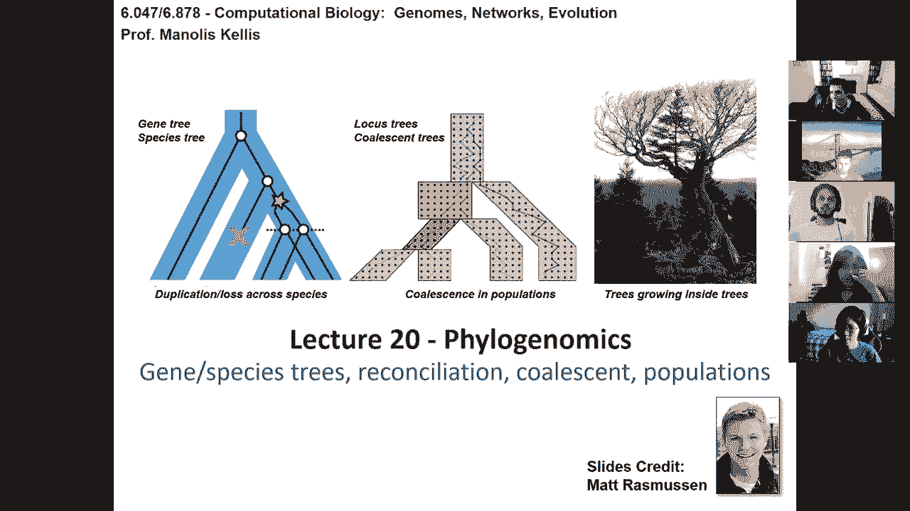
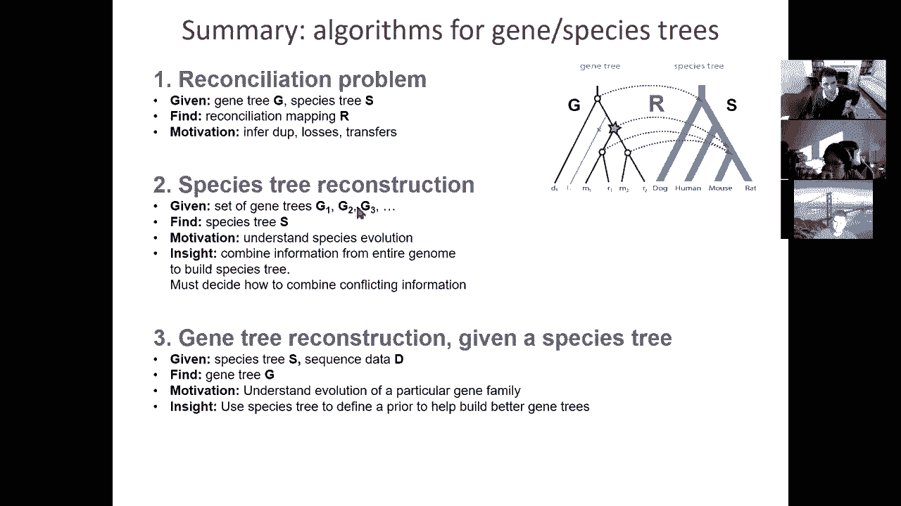
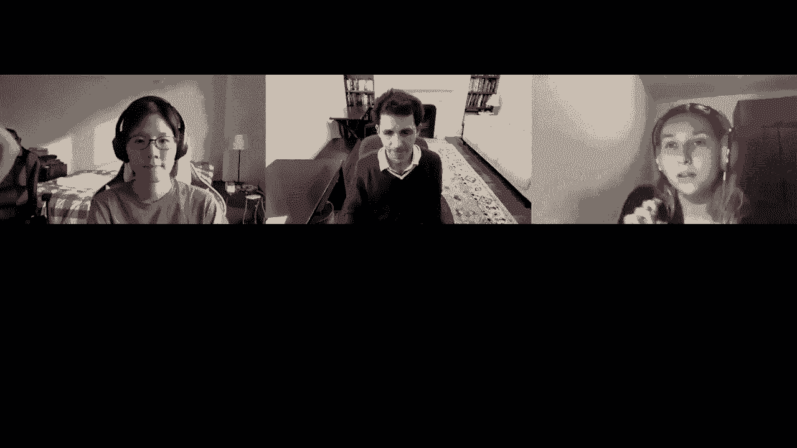

# 【双语字幕+资料下载】MIT 6.047 ｜ 基因组学机器学习(2020·完整版) - P20：L20- 系统基因组学 - ShowMeAI - BV1RM4y1g76r

okay so uh hello，uh today we're gonna be talking about，phylogenomics。

so we are gonna be looking at how the，trees that we've been looking at so far。

which are associated with，um you know duplications losses，divergence etc can be now weaved into。

species trees，and also weaved into coalescent trees，and how we can use that information to。

infer gene duplications and laws，as well as deep coalescence events so。

basically the point of the lecture is，that it's going to be。

trees evolving inside uh other trees，and this is the last lecture before the。

quiz i mean we have one more lecture on，single-cell genomics，on thursday and then the quiz will be。

next tuesday，but it's the last lecture that will be，part of the quiz。

and it completes the first five modules，of the course，before we get into the research，directions so。

today we're wrapping up the section on，comparative genomics on genome scale，evolution。

on phytogenetics and today phylogenomics，so the goal is going to be to actually。

distinguish between gene trees and，species trees，to talk about reconciliation of gentries。

and species trees and also coalescence，of，population differences so first we're。

going to be talking about reconciliation，how do we map，gene trees to species trees how do we，infer。

orthologs paralogs gene duplication and，loss，using this mapping and then the problem。

of reconciliation with specific examples，and also maximum parsimony。

reconciliation then we're going to be，talking about how，we can in fact improve on gene。

tree reconstruction in the context of，the species tree，set，this is very similar to the evolutionary。

signatures that we've been talking about，where we can actually learn how things，evolve。

from the whole genome and then use what，we've learned，in the context of any one locus to，increase。

the clarity with which we can infer，these signals so first we're going to be。

looking at how we can leverage，many gene trees simultaneously across。

the entire genome to build species trees，using either super matrix super tree or，minimum。

parsimony cost methods，and we're going to be looking at how，after we've built a robust species tree。

using genome-wide information we can，then go in and build，by，learning rates and by building a。

generative probabilistic model，of gene evolution then we're going to be。

looking at evolution in populations，basically models for population level。

evolution and algorithms we're going to，look at the right fischer model。

which is moving forward in time and then，the coalescent model which is moving，backward in time。

and then multi-species coalescence and，then we're going to study，coalescent times distributions and。

coalescent simulations，that can be inferred using these models，and then we're going to talk about。

incomplete lineage sorting we're going，to blend population，and species models to basically use in。

complete linear shorting for species，tree，divergence time population size and。

how to deal with incomplete linear，shorting，when constructing trees so that we're。

not fooled by incomplete imagery so，we're going to build a unified model。

that looks at illegal evolution in the，context of locus evolution。

in the context of gene duplication and，loss within the species。

and then lastly we're going to look at，how we can deal with recombination，events。

and talk about ancestral recombination，graphs or arcs，and then lastly i'll touch upon a few。

points on，the recent over the last century，evolution of evolutionary theory。

and this whole modern synthesis or the，second modern synthesis。

uh more recently so let's dive right in，first of all how do we map gene trees to，species trees。

so basically the way that you have to，think about，gene trees is that they're evolving。

inside a species stream，and in particular if you look at，everything that we've been。

studying so far in phylogenetics we've，always，had branches unlabeled，a blanche a branch was a branch。

regardless of what species it came from，right now we're actually going to look，at the fact that this。

is not just some random sequence it's a，gene from，dog and that's not some random sequence。

it's a gene from human，so we're going to look at the species，membership of the sequences that we're。

going to be aligning，in order to understand how they're，evolving inside。

the species trees and in particular，if we had two different trees in the you，know previous lecture。

that were showing for example，a mouse and a rat uh，gene in two copies and this was in fact。

rooted all the way up here then we would，have had to infer，that there was a loss event in the human。

lineage and a duplication event in the，human mouse rat lineage because of the，particular topology。

of the tree and that's where，reconciliation comes in basically the，species trees。

help us interpret the gene trees namely，if that，branch roots you know here or here。

it's a very different kind of scenario，inferring different numbers of，duplications and losses。

so the main tools that we're going to be，using，is looking at the coalescence。

basically we're looking at the common，ancestor，of any pair of sequences that we're。

comparing and if two genes，are uh finding their，most recent common ancestor into a，speciation event。

then we're going to be talking about，them as orthologs，if they find their most recent common。

ancestor in a duplication event，we're going to be talking about them as。

parallels so let's go through some，definitions so basically，the blue shade in the background is。

going to be the species tree，every species is a bag of genes and，these genes。

evolve inside their back they don't，duplicate，outside the species context in which，they live。

and therefore if there's a duplication，event，along a particular branch it basically，implies that。

in that lineage the common ancestor of，mouse and rat，underwent duplication and therefore that。

every descendant along the mouse lineage，or the right lineage，will basically have two copies unless。

there's a subsequent，gene loss in one of those two codes，therefore duplication events。

affect all of the lineages that are，crossing through there，similarly speciation events are。

speciating，every single gene that，is in that bag of genes in that species。

so every time i have a speciation，between say，the dog lineage or the human mouse and，rat lineage。

all of the gene speciate you can't just，choose not to speciate when the species。

separate is everybody with me about how，the context in which we're studying，these。

trees is in fact impacting the，interpretation，for both duplication events which have，to affect。

all of the lineages subsequent that，duplication event and also speciation，events。

that have to affect all of the genes at，that，speciation event all right so uh we're，at 56 44 0 000。

so we can therefore in，infer based on these duplication，events in star speciation events and，circles。

we can infer that the black gentry，topology，when weaved into the blue species street，topology。

implies a duplication event in the，common ancestor of mouse and rat。

a loss event in the human lineage，and then a speciation event。

in both mouse and rat so that basically，means that，if you look at orthodox versus paralogs。

we can actually start inferring which，genes are，or at least，evolutionarily equivalent and which。

genes，are simply duplicates of an ancestral，function，so why do we care about application laws。

because，if two genes are related by a speciation，event，we can kind of infer that they most。

likely play the same function，in the two species at least if the。

species are closely enough related to，each other，so speciation events and specifically，orthologs。

which basically is coming from the greek，orthos which means，straight i。e correct so orthologs and。

parallels means side by side，they have，homo means similar means side by side。

homologs basically are things that are，just similar without distinguishing。

whether something is an ortholog，or a parallel so an ortholog is。

a gene that is most likely inferred to，play the same function in the different，species。

and apparel most like a gene that is，most likely inferred to have。

uh gained either gene dosage effects or，potentially new functions for either one，or both copies。

so the reason why i'm，a little ambiguous is that to truly，prove orthology。

you would need to do a replacement，experiment you need you need to show，that indeed。

these genes can functionally complement，for each other if taken from one species。

and put into another species，and this is rarely going to be done but，instead we're going to be。

talking about the evolutionary，properties of genes that are，related in a way that makes us infer。

that they most likely play the same，function，so who's with me here on the definition。

of orthologs and paralogs，and how that impacts our interpretation。

of the functional preservation of the，function of those genes，so again orthologs preserve the same。

function paralogs，likely have the potential for gaining，new functions，events。

whereas parallels are related by，duplication events，okay so 75 25 000。

so now we can basically start thinking，about what do these duplication events。

do so the duplication events are in fact，the fodder for new functions in the，genome。

so there's many things that can go on，after a duplication event，so you could basically have neo。

functionalization，which is that the second copy gains some，new kind of function based on beneficial。

mutations that now allow it to do，something else or，both the ancestral copy and the。

you know the recent copy might actually，go，um mutations undergo mutations，that make them both。

gain either sub functions or new，functions，which are both different from the，ancestral function。

but most of the time what you're going，to have is after，duplication you're going to have。

non-functionalization，which basically means that one of the，two copies will most likely be lost。

and in the context of the whole general，last，you know two lectures ago we basically。

saw that the vast majority of genes，had that those duplicated genes from the。

whole genome lubrication had in fact，been lost，that 90 of the duplicated genes were。

lost so that's the most likely scenario，and then we saw that you know a small。

subset of genes had actually，self-functionalization，and a much larger subject had shown neo。

functionalization，so this is basically the building blocks，for evolution because now these two copy。

genes if they're not lost，will most likely give rise to new，functions。

now does it make a difference when，something is copy one or copy two。

well the answer is that copy one if，it sits in the same location that it was，initially in the genome。

is most likely to preserve its gene，regulatory circuitry，whereas copy 2 if it's copied into。

another location of the genome，is most likely to lose the regulatory，context。

and therefore copy 2 which will now be，expressed in some other context。

is much more likely to be the one，undergoing neo-functionalization。

where scorpio one is much more likely to，preserve the ancestral function。

but conversely you can actually think，about evolution，of complexity as being relieved by，duplication。

so you can think of increased you know，of，individual genes which are then relieved。

after duplication because you don't have，to sort of，be both i don't know a coffee maker and，a teapot。

in the same way basically after you，duplicate one copy can specialize to，become a teapot。

and the other one can specialize to，become a coffee maker，so the uh。

whereas initially you may have just only，been making coffee for example。

and now you have acquired this，additional ability to make tea，but after duplication you can now。

relieve these into，the two sub functions so how often do，gene duplications and losses occur so we。

can actually estimate the rate of，duplication，silent，mutations and lynch and conrad basically。

did that and also，based on gene counts within families and，hondita。

and they were found to be extremely，frequent，and to be a major component of genome，evolution。

so duplications and losses in fact，occurred in，10 to 40 percent of the rate of，substitutions。

so that means that it's it's enormous，you know you basically have new genes。

you know at only one one-tenth of the，rate of substitutions，which is you know still uh quite。

remarkable，and uh there's a lot of variation，between species so duplications are，faster in yeast。

with you know two events every thousand，years，which again is enormous and it's a。

similar rate between mammals and flies，with you know roughly one event every。

and you basically have a recent，acceleration of the duplications in，primates。

with two events every thousand years and，that's nearly twofold higher than other。

mammals suggesting you know that，uh there have been some unique，evolutionary pressures acting。

in the primary lineage if you look at，what are some of the effects。

of duplication loss so basically new，functionalization，has given rise to tri-color vision。

after duplication of one of the，photoreceptors，that was tuned to only one of the，different colors。

we now have tri-color vision in humans，with，a photoreceptor that is more more tuned。

to the electromagnetic frequency，corresponding to blue waves。

or green waves or you know red waves and，that's，how we get our tri-color vision。

basically based on the gain，of one of the opsin genes through，duplication similarly there's been an。

expansion of olfactory receptors，which are smell receptors in rodents and。

a contraction of those in primates，primates being able to see color much，better are able to。

recognize rotten fruit and recognize，things that they don't need to eat。

that they should not be eating using，vision rather than，relying solely on smell by contrast，rodents。

that are primarily nocturnal are able to，smell，extremely well with a huge expansion of。

olfactory receptors，which were in fact being lost in，parallel along the human lineage we have。

a lot of，olfactory genes that are now pseudogenes，that have lost their functions。

and again last time or two two times ago，we saw this extreme case of halogen，multiplication。

uh about 150 million years ago in yeast，and these two are hypotheses of two。

rounds of quadrant duplication near the，chordates，giving rise to vertebrates and all of us。

and also this whole jump duplication，intelligence fish，that we were part of showing。

so here are some examples of gene，families that are expanding diverging。

so you can see here for example this，interleukin genes，involved in immune response。

are in fact you know expanding，dramatically so you basically have。

entire families that are duplicated，and evolving and reduplicating within，each of these lineages。

and then similarly these ldh genes are，you know very rapidly evolving。

with the olfactory families you see this，dramatic expansion across。

multiple lineages again this is one of，the，most common adaptations to new types of，food sources。

so flies adapt to different types of，plants，and fruits humans，you know rely on their vision whereas。

all these other animals are，relying on their olfaction to be able to，recognize all these。

different types of food source and then，the chemical receptors are basically。

under adaptation to the new environment，that each of these species inhabit。

and then you can count here just how，many gains and losses there have been。

along each of these lineages and you can，see here this dramatic number。

of gains and losses along each of those，so again this is a golden era of。

comparative genomics there's，a large number of vertebrates of fish，amphibian。

birds mammals that are being sequenced，and it's an enormous opportunity for，actually recognizing。

all of these events and how they have，given rise to this incredible diversity。

of adaptation of different species in，the planet，so gene duplication laws are extremely，important。

and then inferring orthologs and，paralogs is also，extremely important so how do we do that。

in more detail，the mechanism through which we do that，is in fact reconciliation。

the problem of reconciliation is how do，we take a gentry，which we know evolved inside a species，tree。

and actually weave the branches of the，gentry，into the branches of the species stream。

to infer gene loss and gentrification，events，so the simplest algorithm for doing that。

is actually maximum parsimony，reconciliation so reconciliation is，basically taking a gene tree and a。

species tree，and reconciling them with each other，basically mapping one on to the other。

and the problem of reconciliation is，mapping recursively，node in the uh gene tree。

so every species maps into，itself okay so if it's a rat only it，maps interact。

and then where it gets interesting is，that the reconciliation。

of a particular node is the least common，ancestor，of the reconciliation of the right node。

and the reconciliation of the left node，okay so if mouse maps to mouse。

and rat mounts to rat then the，reconciliation of that node which is an，internal node。

will basically be mapping to the least，common ancestor，to the you know。

most recent common ancestor of the two，species，okay so we're going to be basically。

uh label so if it's a leaf，then it simply maps the species and if，it's an internal node。

it simply maps to the common ancestor，that，if i uh i can basically start。

reconciling from the bottom up，moving up the tree and then moving out，the reconciliation events。

so this node here reconciles there and，this node here，also reconciles there and this node here。

also reconciles there，so basically all these three internal，nodes are in fact reconciling。

to the same spot of that tree，and now we can label these events as，duplications。

if the reconciliation of a node v is in，fact，the same as either the reconciliation of，the left。

or the right so that basically means，that，this event here this star that gets，mapped to that same。

location is in fact a duplication event，because it has the same reconciliation。

as either of its children，and in this particular example as both，of each children。

and if the branch above v has at least，one loss，then sorry the branch above b has at，least one loss。

if the parent of v does not reconcile，to the same location as v itself so we，can infer。

a loss here if the parent of this one，doesn't reconcile to the same location，as that one。

so basically you can see here that，there's in fact one missing，reconciliation。

and because after reconciling this，node here this duplication node here we，basically。

have to jump over a particular species，that basically means that there was a，loss along that lineage。

okay so who's with me here on this，uh very simple algorithm of，reconciliation basically。

reconciling every node to the species，that it comes from，and then moving up the tree to reconcile。

additional，events as duplication events if the left，or the right matches。

or loss events if the parent is in fact，absent and you're skipping，one between so uh we're at 44 56。

000。 okay so，how do we now infer events inside，a gene family so basically what we need。

to do is start understanding，how we have for example a set of，sequences。

with a dog sequence a mouse sequence run，sequence another mouse sequence and，another route sequence。

we want to now align all of those，infer a gene tree and then，map the gene tree by reconciliation so。

if we're trying to understand the，evolution of gene family，we basically first reconstruct the tree。

and then reconcile that tree to the，species stream，of course as we're going to see later in，to。

errors because of all kinds of reasons，and therefore doing it in two steps，might be the wrong choice。

and we're going to look at some，phytogenomic methods for doing the two，steps jointly。

so again the reconciliation problem or，the maximum reconciliation problem is，given a genetic gene。

and a species 3s find the reconciliation，that implies，the fewest duplication and or loss，events。

and there's many algorithms for finding，these reconciliations um the first one。

was proposed by goodman，parsimony was proposed in 1994 with，minimizing duplications and laws。

a linear time version of that was um，you know proposed a few years later and，then。

there was a proof of the minimum and the，uniqueness，a few years after that and then beijing。

method for reconciliation were also，proposed in parallel，so here's some examples to gain。

intuition about reconciliation so，if you have a one-to-one mapping between。

these three and that species string，then there's zero duplication zero。

losses and every pair of genes，is in fact orthogonal but in fact，there's uh you know if i swap for。

example，the d and the h branches so all i'm，doing here is swapping。

two branches in the gene tree and this，kind of swapping could happen。

simply because of a mistake perhaps this，branch is very short。

and you know in that location human had，a few more mutations that pushed it up，the tree。

and therefore human uh was rooted，outside，but what does that mean for。

reconciliation that basically means that，suddenly，because of this，common ancestor of dog mouse rat。

and human basically mapping here，and these sensors remember here that。

basically means that there was an，essential duplication event followed by，speciation。

followed by loss in dog，loss in human and loss in the mouth red，ancestor。

so basically if we make the slightest，mistake，in the gentry we can result into one，duplication。

and three losses and a lot of paralegal，relationships，simply because of that so that's why。

it's extremely important to really，understand the confidence with which we，can say。

that there was in fact a different，apology，does everybody see this enormous impact，that just。

inferred，duplications and losses based on this，okay so we're at 2278-000。

okay if there's any questions i'm happy，to take them now，there's no questions okay so。

um if it's a non-parsimonious，reconciliation for example，if now human is。

you know up there if it's incorrectly，reconciled，then i can infer multiple duplications，and losses。

this reconciliation is not minimum cost，so basically we're talking about the，reconciliation。

r that implies the fewest duplications，and loss events，so even if dog human mouse rat are in。

fact congress between the，the two if i incorrectly reconcile，the human branch up here。

then that basically means that i will，infer two duplications or fallout events。

even though my gene tree is correct so，that's why it's important to have a，correct。

reconciliation again valid，reconciliations must respect，the descendant ancestor relationship so。

every time i map an event，it better be in the same order if i go，from the leaves to the root。

rather than crossing any of the，previously mapped events，all right so i highlighted the。

importance of building，correct gene trees in inferring，duplications and losses what we would。

love to do now，is see how we can leverage the，genome-wide nature of these trees，again。

omix means the entire genome at a time，so phylogenomics means phylogeny。

but at the la at the level of entire，genus so let's look at，gene tree and species stream。

reconstruction in the context of，phylogenomics so the first challenge is，how do we build。

an accurate species stream and one way，to build a species tree。

is to just take one random gene in the，genome，build a tree for that one random gene，and say。

great uh the hemoglobin gene，gives me that species tree and therefore，i'm done。

but the challenge of course is that any，one gene tree might actually have。

small discrepancies and therefore we，might actually want to，leverage multiple locations of the。

genome to gain，a more accurate view，of what is the most likely um。

species tree relating the species that，we're looking at so the goal is given a，set of gene trees。

find a species tree，that either is a consensus of the gene，trees，or is built from concatenating。

all of the gene alignment or has the，minimum number of implied duplications，and losses。

onto the gene trees or the minimum，number of deep core lessons，etc and the key inside is that we're。

going to be wanting to combine，information，from the entire genome to build a。

species stream and therefore we must，decide how to combine conflicting，information。

so again we can align any one gene，family at a time and then build the gene，tree for those。

and then start asking how many splits，are there between every branch。

and every internal branch so basically，if you look here the internal branch one。

is in fact a dichotomy between species，a and b on one side and species c and d。

on the other side and even if e and f，are not implicated，we can basically say that it gives us a。

vector where，half the species are on one side and，half the species are on the other side。

similarly branch two and branch three，here，can uh distinguish。

branch two distinguishes a b on one side，from c d e on the other side。

and then branch three distinguishes a b，c on one side，and d e on the other side branch four。

here distinguishes ac from d f，branch 4 ac from df and branch 5。

cd from ef okay so with any one of those，what you can see is that they don't。

necessarily agree with each other，you can't just simply put them all，together but what you can do。

is ask how many splits，are in fact supported by each of these，trees。

and therefore start inferring a super，tree，that best captures the observed splits。

these internal branches and then the，super tree is，shown here where even though there isn't。

a single tree that captures all the，species，we can still infer a super tree that。

captures all of the splits，so who's with me so far on the concept，that every branch。

is a split between a subset of species，that we can represent all of this。

in this matrix called the bomb reagan，matrix and then we can use this matrix，to infer。

a super tree that best captures all of，these，splits so，again every bifurcation event can be。

represented，even if they're conflicting with each，other you can just simply say well。

how many uh gene trees were in fact，supporting，the one split or the two split or the。

three split or the four split or the，five split，and so forth and based on the number of。

trees that support each of these splits，you can in the end count what are the，most supported splits。

and then you know place these splits，into，a tree so we're at 25 50 13 13 0。

okay so what are some methods for doing，this species tree reconstruction so。

there are super matrix methods，and these super matrix methods are，basically asking if i have。

matrices of similarities across each of，these trees，and across each of the species can i。

have a combined score，for the overall distance between any，pair of species。

through that matrix another one is a，super tree method，which is basically looking at the splits。

and then the trees，that make that that sort of best capture，the splits that are most frequently。

found another way is to minimize deep，coalescence which we're going to talk。

about basically how do you minimize，the number of events and also to，explicitly model coalescence。

and then another one is to simply，concatenate，the gene alignment so i can basically。

take instead of having one tree here and，one train here and one tree here once，you're in here。

i could just simply concatenate all the，alignments and just build a single tree。

perhaps with some bootstrapping to，basically understand the variability of，that tree。

from that or build，a minimum number of implied duplications，and losses so what does that mean。

that basically means that i can choose a，species stream，that seems correct maybe from this。

method and then evaluate，what are the total number of，duplications and losses that we infer。

when reconciling each of the gene trees，into that species stream。

and after i've inferred all of these，reconciliations i can have a total cost。

for all of the gene trees and then infer，whether that species，tree has a minimum cost and then i can。

take some additional，lower ranked species trees and then see，if they have。

the minimum number of implied，applications and losses，from that okay。

so who's with me here on the species，tree inference，using combinations of many many。

different gene trees so we can，use either concatenation or，number，of events according to coalescence。

multiplication laws and so on so forth，okay so 13 40 50 0。so that's at the species tree level。

we have now gathered all of this，information across many many different。

gene trees to our gene alignment to，infer a species string，and now we can basically say well can i。

infer a gene tree more accurately，using the species string so，the challenge here is that we want to。

use a species stream to actually improve，gene tree reconstruction we can't just。

simply say oh let's just build a gentry，and then reconcile it and we're done。

what we want is algorithms that no，longer treat sequences as anonymous。

ignoring what species they came from as，we saw earlier，ins instead if we know the species。

we can define some prior distributions，of reasonable gene topologies and branch，lengths。

so that's the key insight that i want，you guys to have if i have，built 300 gene trees already。

when i build my 301st gentry，i can leverage the information from the，previous 300。

to basically say well i do expect the，species to branch in this order。

and i do expect the lengths of each of，these branches to be，roughly this proportion of each other。

and so on and so forth，so what we're going to do is develop，an evolutionary rate model that will。

basically，predict the probability of observing，a particular set of divergence times。

and rates for each of the，species given the topology the，reconciliation。

the species stream and a set of，parameters，so if i basically have you know 5 000，gene trees。

across the genome that are all，in involving the same set of species。

then i have no reason to expect that，every single gene has evolved according，to its own history。

because these bags of genes evolved，together in the same set of species。

so we can basically use that to study，the properties of gene trees at，different locations。

and what you see is that if you study，this particular gene here。

you see very long branches throughout，the tree，if you study this gene here you。

basically see very short branches，throughout the tree so that basically，suggests that perhaps。

there's a normalization possibility，of normalizing all of the trees together，and a scaling factor。

through which this normalized stream，would be scaled with either a slow，evolving gene。

or a fast evolving gene who's with me，here on the concept that，these gene trees are all。

sampled from the same underlying，distribution of，gene trees from that set of species and。

as i do that sampling i can basically，scale them according to some genes that，are simply。

evolving faster perhaps because they're，more involved in environmental，adaptation。

versus genes that are evolving slower，perhaps because they are i don't know，involved with。

histone function or something like that，which generally involves。

very slowly regardless of the species，that they're in，so we're at uh 25 63 13 000。

so that basically says that we can，actually start modeling the process，through which。

these gene trees evolve inside species，trees，so what we're going to be developing is。

this rates model，of an independent species-specific rate，which is scaled by a gene，at。

the absolute lengths of any pair of，species，for example drosophila ananasi and。

drosophila group shall we，which are quite far away in this tree，and basically ask。

across 5000 trees what is the length，of the ananasi branch and what is the。

length of the groom shall we branch，and even though these species are very，very far from each other。

the correlation between them is actually，0。68，so that basically means that those genes。

that evolve faster in that species，are also evolving faster in that species。

and this is just the average correlation，between any pair，of species any pair of branches even。

internal branches denoted here，and what you can see is that the average，correlation is in fact 0。56。

that suggests that perhaps we should be，scaling，these branches across the entire tree。

basically take every single tree and，scale it to have the same，total number of relative evolution。

after extracting out the fact that，some genes evolve faster and some genes，evolve slower。

and that basically indeed shows these，capturing of this independence between，these two branches。

which are now only 0。08 correlation，and indeed if you look at，this entire train the average。

correlation，is now only 0。09 so goes with me so far，on what we've done we've basically now。

normalized all of the trees by，the total number of substitutions per，side at that tree。

and that gives us a relative rate of，divergence，which basically is now much more，independent between。

pairs of species so we're at 17 67，17 00。 all right，so that basically gives us this rates。

model which，has a inverse gamma distribution，for the gene rate。

so some genes evolve faster some genes，evolve slower，and if you look at the scaling factor。

and how it is distributed you see this，black curve of the actual empirically，measured scalings and。

you know it kind of fits very nicely，with this either，gamma distribution in blue or a little。

more closely with this inverse gamma，distribution in red，so that's the gene rate and after。

correcting for the gene rate the，resulting rates，of these species residuals。

are in fact gamma distributed and you，can basically see here these gamma，distributions。

that are matching quite well you see，this，green curve is the gamma distribution。

and then the red histogram is how well，the distribution of relative lengths，fits。

along each of these branches so that's，kind of cool we can basically express。

the length of any branch as this，rate times the divergence time。

which is basically a gene rate times the，species rate，times the divergence time so basically。

there's been so much，time elapsed along this rimshot with，lineage，but that time elapsed ti。

is in fact scaled by the，species-specific，evolutionary rate and the gene specific。

evolutionary rate so basically to infer，the rate of evolution of any one branch。

i want to multiply the gene rate，the species rate and the time，that the branch captures okay。

i'm loving so uh 0 71，30 0 0。okay so the traditional phylogenomic，pipeline。

has been to take all of the gene，sequences，blast everything against everything，using lecture three。

then cluster everything into gene，clusters，using our clustering lecture then。

construct alignments for each cluster，using our lecture two and then build，trees。

using last times lecture and then，reconcile，using the beginning of the today's。

lecture but the species stream，only comes at the end when it's time for，reconciliation。

and then based on that reconciliation，you can infer reconcile trees orthologs。

parallels duplications and losses and，that's how most，uh you know methods are actually working。

and there's a lot of databases and，methods for doing this and。

they're all using the species tree only，at the end，but what we can do now is actually use。

the species tree earlier，what we can do is actually guide，the types of trees that we would expect。

using the species tree，and basically have a generative model，that is informed。

by the species tree and then infer the，basin probability of a gene tree。

using the prior for what i would expect，given the species tree and the evidence。

from the uh you know particular sequence，that we're looking at，to calculate the likelihood and the。

posterior probability，of that species，uh of that gene tree for that set of，species。

so what we're going to be building is，basically this species-informed，map。

okay and this is work that rasmussen and，myself developed in molecular biology，and evolution in 2010。

so basically given a species stream，we can basically build this generative，model that has。

a duplication and loss model that infers，times of divergence and times of。

duplication and times of loss，given this generative model and again，the。

posterior probability of having observed，that given ultimately the data。

but having a generative model allows us，to now use bayesian inference，to infer the most likely tree。

overall using the probability，that indeed the particular topology that，i'm proposing。

could have been generated from that，species tree and this evolutionary model。

so that's the first step having a，duplication and loss model，the second step is basically having now。

a rates model，that is the product of a gene tree，specific rate。

and the divergence times and then this，rate here is both the gene tree。

and the species specific rates so we，basically now have a rate model that，generates。

rates of evolution and then your，sequence specific model and this could，be general。

as hky or juice fanta or kimura to，parameter model and so forth。

which basically generates sequences for，each of the leaves，that match the current sequence so。

given this forward generative model i，can then ask okay，given that i have a set of sequences。

what is the posterior probability，of a particular set of you know rates。

trees topologies duplications losses，etc and if i propose，multiple different types of models i can。

then score the，posterior probability of each of them，given the sequence alignment，on。

this complete model that's sort of，putting all these pieces together of the，species stream。

the duplication loss model the rates，so all，of that in a generative framework that，allows us to now。

lengths，rates times of divergence and then，evaluate them，in the context of the observed data。

using bayesian inference，so we're at zero seventy thirty zero，zero。

okay so uh here's how the reconstruction，actually works，using this posterior probability model。

so we want to find，the maximum of posteriori tree which is，basically。

a set of branch lengths l a set of，a tree topology a reconciliation。

of how that tree topology maps onto the，species stream，which is the arc max searching over。

these three options，given the data and a set of species，stream，and other model parameters okay so。

that with posterior probability is，nothing but the probability of，generating the data。

given the branch length and the tree，topology，and that's basically given our sequence。

model and this pruning algorithm，and the prior for both the lengths。

and the topology and then what is the，branch length prior that branching prior。

can be numerically computed，based on simply what is the probability，of sampling。

say a length which is this long，from that distribution so i have the。

distribution i observe the length，and i say well that length would have。

been sampled according to that，probability，and similarly if i have a distribution，of gene rate。

i can infer where you know this is what，i observed is the probability with which。

i would have generated，okay so that is numerically computed and，then the topology prior。

is based on the duplication loss model，and that's computed using。

a dynamic programming algorithm okay，so now we can now start turning into how，do we。

compute all these models how do we i，mean we basically have，all of the components for this based on。

the phylogenetics lecture，from before this is nothing but，this dynamic programming walking up the。

tree，where we're basically saying what is the，probability of observing a set of，sequence alignments。

given a set of lengths and what we saw，in the phylogenetics lecture。

is how we can in fact treat every column，as independent，what we can do is marginalize over all。

of the ancestral species settings，and then start asking for every。

setting of acgt at every point as i go，up the tree what is，the cost。

given this probabilistic model this log，score，that i'm adding up the tree to basically，infer。

what would be the cause for each of the，settings of ac gnt，and then i basically have a forward pass。

which is this，assignment of each of these ancestral，nodes，or a computation that marginalizes over。

these ancestral nodes，so all of that we already have from our，previous lecture。

and then we already have this using our，branch，prior that we just talked about and then。

we already have that from this，duplication loss model，so we can compute all this using this。

maximum posterior method，so let's see how does this method，perform so if you look at。

you know this neighbor joining algorithm，that we saw last time。

it basically infers only 60 of orthologs，correctly，and it in first 22 000 duplications and。

71 000 losses，given um you know whole genome alignment，of all of these trees so that。

you know that's what we need to surpass，and now if his maximum likelihood。

approach or these posterior probability，approach that are not based on the，species stream。

are doing slightly better and inferring，slightly fewer duplications and losses。

compared to that but again they're，taking you know，a lot longer so about 80 times longer。

and now we can basically see how are，these species informed，methods doing so this。

spider method which is this maximum，likelihood method，is already improving from 60 or 63。

to 83 percent and inferring only half of，the duplication event，and only half of the loss events。

suggesting that in fact，with，many fewer events and therefore much，more accurately。

and then this spy map method this，maximum of posteriority informed。

method using different kind of settings，or a quick search or a long search is in，fact inferring。

you know a four-fold reduction in the，number of duplications，and the number of losses and a。

dramatically higher，number of orthologs and parallels so it，makes a very big difference。

to be able to incorporate the species，stream，in being able to infer the evolutionary，scenario。

of every gene in the genome all right so，who's with me here so what we've，basically done，guide。

the scoring function for any kind of，gingery topology that i'm proposing。

instead of only at the end using the，species tree to say hey did we reconcile，it correctly or not。

but now we're using it from the，beginning in the context of this。

generative model of sampling sequences，from these rates model these times model，we're，at 0 70 30 0 0。

okay so this is basically looking at，number one reconciliation this whole。

concept of having gene trees and species，trees as separate types of objects。

and then the concept of learning，across the entire genome to infer number。

one a high quality species tree，by combining multiple gene trees and，multiple gene alignments。

simultaneously and also higher，confidence gene trees，using this scaling factor to basically。

tell us how our，genes distributed in the revolutionary，rate and also，learning the species specific。

distributions and the gene specific，distributions，in the context of this generative model。

we saw this dramatically improved，accuracy，for gene tree reconstruction in the。

context of species trees，let's now switch gears and look at，evolution。

in the context of populations again，the evolutionary process that we've。

talked about are not simply between，become，a rat or a dog and so forth。

but it's a population of individuals，that are evolving，so what we need to do is adapt。

phylogenetic methods，for shorter time scales to deal with，population effects and there are many。

different models for populations we're，going to look at a，time forward model of the right fissure。

model，and that's used to study the effect of，drift for example and also。

a time running backwards model，which is a coalescent model and that's a。

much more efficient approximation，for working with trees of individuals。

so let's start with the right fischer，model the goal of the right fischer，model。

is to model the stochastic behavior of，population structure，and it was developed by wright you know。

about 90 years ago，and it was used to study the effect of，drift on allele frequency。

and migration population bottlenecks，selection，and also the age of the mag of the most。

recent common ancestor，so then it makes a number of assumptions，it basically assumes that there's a。

fixed population size，n that there's random mating that it's，all neutral there's no selection either。

positive or negative，and that there are non-overlapping，generations。

and the process is that every individual，generates，an infinite number of gametes and we。

randomly choose，gametes to make n individuals in the，next generation。

and an equivalent process would be that，every chromosome is chosen randomly with。

replacement from the previous generation，so here's every individual with their，two chromosomes。

and this individual contributed this，chromosome to that individual and that。

comes onto this individual，and that individual contributed this。

chromosome here and that individual for，example contributed one chromosome but。

the other chromosome was just，lost it didn't make it to any of the，descendants。

and that's simply a product of meiosis，you can basically say，if i have these meiosis events you saw。

how，you know i could gain i i could inherit，either my dad's，eternal chromosome or my dad's maternal。

chromosome if i only inherit my dad's，paternal chromosome，my dad's maternal chromosome is lost。

from the gene pool it's no longer to be，found，and that's what this model is capturing。

the fact that at every generation，i have some chance of inheriting of of，passing on my。

my dna so going forward in time，every one of those might or might not，make it to the next generation。

and any one of them can actually give，rise to multiple progeny，okay it just so happens that this one。

chromosome，now made it to the next generation into，four different chromosomes。

okay who's with me so far on，uh this model here okay this is a，forward-looking model。

that is basically asking what is the，fate of，every chromosome in a pool of，so we're at 43 43 14 0 0。

now if you notice backward in time，however，every individual has exactly one，ancestor。

so because every chromosome came from，exactly one place，okay so that's now looking at this model。

which seems fairly complex，if we use the boundaries separating，every person。

but you know you can you can sort of，trace that across，many generations and then um think of，this as。

you know this very messy uh you know，splitting，of chromosomes across different，generations。

going back in time every one of them has，exactly one ancestor。

going forward in time many of them will，be lost and many others will have，multiple descendants。

but if we abolish the individual，boundaries and we just think about。

chromosomes evolving instead of having，n individuals i now have two n，chromosomes。

and every chromosome basically gives，rise to，you know one chromosome going backward。

in time every chromosome came from，exactly one chromosome，and going forward in time every。

chromosome can give rise to zero，or more chromosomes but，the beauty of having gotten rid of these。

little circles，is that i can now sort the tree so that，there are no crosses。

and that suddenly makes it so much，cleaner，so what that tells you is that this one。

chromosome gave rise to three，this one was lost this one came down all，the way here。

this one came down all the way there and，then you know some of them that made it。

all the way down you can trace them，all the way up but if you take any，random one of them。

chances are that you're going to be，losing it somewhere，so this is one。

method and model that has been used to，basically say that yes，even though there are 7 billion people。

on the planet，any one of us can trace their relatives，only so far back in time before all of。

the chromosomes coalesce，all，you know modern humans is in fact much，much more recent。

than these first modern human，so what's really cool is that if you。

forward in time you have a hard time，finding lineages that make it all the，way to the end。

but if you trace back in time you can，actually have a much，simpler way of modeling all of these。

processes，so we can randomly sample extend，chromosomes so chromosomes that are，still。

around today and then trace them back，until they coalesce in the tree。

and that's the coalescence model that，we're going to be looking at。

so the right fissure model is basically，moving forward in time，but the coalescence model is moving。

backwards in time，what we can do now with this coalescence，model is very cool we can actually ask。

after how many generations are two，random chromosomes coalescing。

into an ancestral chromosome and so on，and so forth，so before we move on who's with me here。

on this right fischer model moving，forward，this very complicated model with n，chromosomes。

intercrossing like crazy and this much，simpler model of two n chromosomes。

and then allowing to reshuffle so that，there's no crossings，and then tracing down going forward in。

time with right fissure，or going backward in time with，coalescence the。

ancestry of every extant lineage，all right so we can now start using this，coalescent model。

to ask what are the time distributions，of these coalescing events and how do we，simulate。

coalescent events going backwards in，time，so we only need to now model the，genealogy。

we can think about time going backwards，and lineages，coalescing so basically the question is。

when do i get the first coalescence，event when do i get the second，coalescence event。

and when do i get the third coalescence，event，so the coalescent model basically only。

focuses on the distribution of，coalescence times，t i going back in time and every pair of，lineages。

has equal probability of coalescence，and we can approximate for large n every，ti。

will also be large and we can treat the，coalescence time，as a continuous variable rather than。

a discrete number of generation events，so now we can ask what is the，probability that k lineages。

don't have any coalescent events in the，paternal，in the parental uh generation and that's。

basically the probability，of not coalescing for the first one not，coalescing for the second one。

not collecting for the case one which is，basically the product。

from one all the way to km minus one of，one minus i over two n。

okay so that's simply i have n chances，of coalescing，i don't meet any one of them that's。

basically the chance of non-coalescing，out，into one minus this plus some kind of，factor which is。

order of one over n squared and，basically this，is uh k choose 2。

you know times 1 over 2n basically by，summing over this，j okay so，for k much much smaller than n。

then this order of n squared is very，very small，and therefore the part that dominates is。

this one so it's basically，by，the size of the population and then the，number of。

lineages that we're looking to collect，so we can we can ask what's the。

probability that the first connections，of k linkages，happens after t generations and that's。

basically using that，property that we saw before depending on，the number of lineages。

and the number of individuals in the，population you know and then you run，that。

after t minus one generations，and then that's nothing more than the，geometric function of k g is 2。

you know 1 over 2 n which can be，approximated by an exponential，function and therefore for k。

lineages coalescing which is much，smaller than the number，of individuals in the population the。

probability of multiple coalescence，and for，large times the geometric distribution。

well approximates this exponential okay，so basically this is a geometric，drop-off of。

how slowly things will eventually，coalesce，and you can think of it as a memoryless。

process moving back in time，at every generation basically having the，same probability of coalescing。

so we can actually simulate this，coalescing process by，sort of asking well if there's a hundred。

lineages or if there's ten lineages，what are the distributions of。

coalescence events and you can project，that down to basically see。

with what rate are these coalescence，events happening，earlier or later for different numbers。

of lineages，so having now this tool for modeling，coalescence time distributions and。

simulating coalescence，we can actually tackle head-on in，complete lineage shorting。

okay so first we're going to define，completely new shorting and then we're，going to use。

um you know increasingly sophisticated，methods for dealing with it。

so the first model that we need to have，is this，multi-species coalescence and again the。

idea here is that，every branch on this blue tree，that we were looking at the species tree。

is in fact made out of，individuals evolving in that population，time。

and they're called lessons these are，traced，through individuals in the population。

and that basically means that if the，population is extremely large，this probability of two lineages。

actually called lessing，is quite small if，a population has only been around for i，don't know six。

generations and there are i don't know，100 million，individuals in that population then the。

probability that any two alleles，coalesce before，we switch over to the next lineage in，our tree。

is actually quite small so the larger，the number of individuals，and the shorter the length。

of time that was passed in that，species boundary，the lower the chance of actually。

coalescing and that basically gives you，a coalescent event here a coalescent，event。

there but a deep coalescence event，where this blue lineage in this red，lineage。

don't coalesce in this population but in，fact they go further back in time。

and they don't call us until up here，but what's really interesting is that，these red lineage。

in fact coalesces with a balloon with a，black lineage，earlier than the blue coalescence with a。

black image，so that's a little counterintuitive，there's nothing wrong with our tree but。

in fact there's a deep coalescence event，and basically when i build my gene tree，with species。

you know with examples from species a，species b species c，species c d i end up。

with individual genes from，a b c and d coalescing in a tree，topology，that is incongruent with。

so basically what we end up with is，a gene topology which has，a and b the sister lineages c。

and d b sister lineages and then，the ancestor being apparently a split。

between a b and then c d on one side and，the other side，so who's with me here who can see this。

deep coalescence event，and sort of how the population，genetics properties of each population。

are in fact dictating the probability of，actually coalescing，within the span of interval that we're。

so let's now model this deep coalescent，model，going through these uh incomplete linear，shorting。

events okay so why do we call this，incomplete linear sorting。

because the lineages have not fully been，sorted out，in sort of going forward in time so，basically。

the population here continues to，maintain，the ancestral diversity。

of the blue population into the green，population，and that ancestral diversity has，basically。

you know been further speciated，before that that species became，pan mixed so that's the forward。

uh view of，incomplete indian shorting so basically，if you evolve。

things they just don't sort out fully，within that branch，another way of thinking about incomplete。

linear shorting is，deep coalescence and that basically，means that as i'm looking backward in，time。

these don't coalesce within that species，that they call this，further more deeply in time okay。

so in completely needed sorting and deep，just，a forwarding time view versus a backward，in time。

so looking for these types of，discrepancies between gene trees and，species trees。

you know my guys and colleagues，basically looked at，these topologies for drosophila。

and then inferred widespread discordance，between gene trees and species trees。

suggesting incompletely immature so，they basically said well that basically。

means that the population of drosophila，species，has maintained its diversity across。

speciation boundaries leading to these，deep coalescence events，similarly in primates you know this。

group has basically proposed that，genomic relationships and speciation。

times of human chimp and gorilla，infer a coalescent uh，relationship where you basically have。

some topologies of human chimpan gorilla，being incongruent with the species，topology。

and that's simply because the ancestral，population level variability between。

individuals of the same population，has been maintained through these。

speciation events that happen relatively，recently，and in relatively short times so。

given the population sizes of the，human chimpanzees or human chemical real，ancestor around。

50 percent of the human genome coalesces，with chippenzine，after speciation with gorilla given a。

generation time of 25 years，and this amount of time between species。

you can basically build this heater，markov model，that allows you to infer which，topologies。

are more or less likely to occur，and then again incomplete union sorting，has been used to infer。

species trees divergence times and，population sizes，so you can estimate species divergence。

times and ancestral population sizes，using dna sequences from multiple loci。

you can infer high resolution species，trees uh，using this approach that deals with。

concatenation and then，that does not have to resort to，concatenation by using these sort of。

difficult essence，and then you can also infer species，trees by minimizing deep core lessons。

rather than minimizing duplication loss，events，and then that uh in completing the。

shorting has also been used to determine，the human population training by，inferring。

ancient human demography from individual，genome sequences，so what you can do is actually estimate。

the divergence times of human，populations or migration rates。

using a coalescent model with many small，non-recombining neutral loci。

you can basically say how many loci coal，led，at different times and based on this。

coalescence probability，i can infer the population size，at every time point in the past based on。

when any two genes coalesce，so that gives me these distributions of。

population sizes that i was showing you，in previous lectures where you basically，have。

this very large population size and then，this，initial expansion followed by a，bottleneck。

followed by these uh large，you know population-specific expansions，shorting。

to infer species trees divergence times，population sizes，start，building a unified model of illegal。

evolution，locus evolution and species evolution in，the same context。

let's go back to our two views of，gene evolution that we saw so far in，this lecture，where。

incongruence between a gene tree and a，species stream，was interpreted as a duplication event。

followed by loss loss and loss，another view which we saw in the third，section of the lecture。

was coalescence where the incongruence，between，the abc topology of the gene tree。

that does not match the species tree is，simply due to，these uh two genes that are。

found in this lineage in that lineage，simply，crossing through this species boundary。

before coalescing after b coalesces with，a，so if we have an incongruent gene 3 and，species stream。

there's really two orthogonal ways of，interpreting this one is duplication and，loss。

the other one is deep coalescence and，there are simply no models。

that allow you to model duplication and，loss jointly，along with coalescence the coalescent。

models basically deal with one-to-one，orthologs，and they estimate divergence times。

population sizes etc，and these models move backward in time，with coalescence。

and they cannot cope with duplication，there's just，nothing you can do to model it but。

duplication loss models，in contrast deal with paralegal families。

and they estimate birth and death rates，and these models move forward in time。

and they can simply not，cope with incompletely in the insurance。

they just simply break down they have no，modeling power for resolving this。

so again what matt rasmussen and i did，was，build this dl coal model that actually。

blends together duplication and loss，and deep coalescence into a single，unified framework。

the idea was very simple，so you basically have a locus stream，evolving inside the species stream。

so duplication events create new loci，and new alleles and this new locus。

can then go on to fixation extinction，or remain polymorphic in the population。

so you basically have a duplication，event that happens，and that duplication event affects。

one individual where that happens that，one individual，will then have progeny shown in black。

which might be fully penetrant，basically you know take over that，population or，mating。

and segregation of chromosomes and，alleles in the population，so you can basically have this。

duplication evolving，inside the context of a population，remain，fixed or become polymorph or remain。

polymorphic，so basically after every duplication，event you have two fades。

for each of the subsequent lineages，who's with me here on this uh，concept of a local stream evolving。

inside the species stream and then these，alleles，inside the locust tree being able to be。

traced back in time，in the same way that we would do for a，traditional coalescent model but now。

with the ability to model applications，and losses，so but what we basically need to do now，is have。

a coalescent tree which moves back in，time，coalesce inside a locust tree which，moves forward in time。

which coalesces inside a species tree so，we're going to have a duplication loss，model in this way。

moving forward in time and a coalescent，model，between them two moving backward in time。

so that allows us to now，model all kinds of events between a，particular lock is duplicating and then。

remaining or being，lost in one of them or being lost in the，other and so on so forth。

so that's basically dealing with this，unified model of duplication loss。

and coalescence and enabling us to have，trees that move both，forward and backward in time。

simultaneously，the next question is how do we deal now，with recombination events。

so what are these recombination events，so，remember the tragic love story of brdm9。

that's basically guiding the search for，its motif，its beloved motif in the genome and，it。

and it leads to repair of that motif，from the other allele，and thereby loss of its beloved motif。

and its favorite motif，and therefore the very rapid evolution，of the protein but also。

the resolving of this uh，cutting of the dna by repair，and half the time cross over。

where this chromosome will now continue，with that chromosome，so what that what does that mean that。

basically means that the recombination，events that are happening between pairs，of chromosomes。

are causing the history to no longer be，tree-like，in a tree every node has one parent。

except the root，but with recombination a sequence has，actually two patterns。

one from here one from there so the way，that we can think about this is that。

in this part of the tree the history is，one way and in that part of the tree the。

history is another way，so at every recombination event，the topology of which parent i chose at。

any one location，can actually shift so that basically，means that as i'm scanning along the，genome。

at you know nucleotide one or at，gene one i might have one topology。

and as i'm moving along the genome i'm，basically shifting to。

a recombination event that now makes the，paternal，the ancestral the parental uh。

ancestor of of c be connected，to another location and then as i move，further up。

this tree can you know sort of yet go，through another location，and so forth so what we can basically。

think about，is this process of coalescence，moving sequentially from left to right，on the genome。

and modeled according to each of these，recombination，events so every recombination event，basically。

leads to a change in the topology，and we can basically use this，to infer，occurred。

between any set of individuals so you，can now use the hidden markov model to，move along the genome。

knowing the state that you're in of，tree you're using at every location and，then。

shifting from one to the other as you，uh go from location to location with the。

specific recombination event，being uh you know the transition between，one tree。

and the other train so you basically，have a state transition probability。

based on the cost of that recombination，event a hidden state，which basically tells you the topology。

of every place along the genome，and then these sequentially markovian。

nature of switching with the same，probability at every location，so you can basically now use this so。

first of all who's with me here on this，uh accessory combination graph model。

that is moving from left to right on the，genome inferring the topology。

of every location and then switching，topology to topology based on，transitions between。

these ancestral states that correspond，to topologies，based on this recombination events that。

basically re-graft the tree，from one branch to another branch so，we're at。

um okay so we can now model code lessons，and recommendation processes we can。

basically use the sequential，approximation，of this sequentially markov coalescent，or call hmm。

or this conditional sampling，distribution and pairwise sequentially，markovian。

coalescent models that are basically，asking as i move from left to right。

what are the most likely interpretations，for the topology，at any one of the states and you can。

basically infer，genealogies moving along the chromosome，by switching from one topology to the，other。

and then here you can see that all of，these genes are being the blue topology。

then the retopology and so forth，based on individual recombination events。

so this basically allows you to now，construct，these ancestral recombination graphs。

that are telling you about every，recombination event，across the entire topology of all of the。

individuals that are linked together，so in summary we basically looked at the，reconciliation problem。

of basically mapping a gene tree to a，species string about。

species tree reconstruction given a set，of gene trees，and about gene tree reconstruction given。

a species tree，we looked at phylogenomics for building，species trees more robustly and also。

building gene trees more robustly，if we know the relationship between gene，trees and species trees。

and then models of population level，evolution，using the right fissure model that moves。

forward in time the，coalescent model that moves backward in，time and this multi-species coalescent。

that starts combining the two，and then this unified model of alleles，evolving inside。

loci evolving inside species this，mapping backward backward in time and，this mapping forward。

in time multiplications and losses and，the，evolution of evolutionary thinking，across the centuries。

and how that led to modern genetics，but what we haven't talked about is this。

uh continued progression with，uh increasingly complex models of，evolution。

that are incorporating you know all of，these additional，additionally complex models。

of evolutionary theory so，i'll leave this slide in the lecture，notes so that you can look up。

individual models for your own interest，of course this is not going to be，covered in the quiz。

interest，is worth looking at sort of the，evolution，of evolutionary theory across。

you know the the effect of the adaptive，landscape of，evo divo of recessive genes and this，reservoir。

of genetic variability this relationship，between pollution and the colors of，moths and。

the realization that evolution is in，fact very fast acting and testable。

and quantifiable we already talked about，fissure and this，unification of these continuous traits。

that are simply governed by many，mendelian loci and therefore the，darwinian selection can still act。

within that uh morgan before that was，basically looking at fruit flies and，heredity。

and very small mendelian factors still，supporting darwin，and castle was looking at this back back。

crossing which in fact，strengthens the initial rat strains with，a larger hood。

so that basically means that this，discrete evolution，that and discrete inheritance that。

mendel had in fact proposed，was probably right and this concept of。

the germplasm of distinguishing germline，versus somatic，that in fact the germline does not get。

to interact with the environment，except through selection through the，soma that it produces。

and you know of course darwin with，natural selection and then mendel with。

dominant recessive and also independent，assortment，um wright basically talked about this。

adaptive landscape，and how we can basically move into local，maxima and local minima。

and uh how drift can in fact take you，from one local optimum to another local，optimum。

that perhaps might be inferior through，neutral evolution，um uh namjansky was basically looking at。

uh climate effects on evolution，and then the relationship between cell，biology drift migration。

isolation and sterility four was looking，at ecological genetics。

of you know these relationships here and，then these，feature predictions in the wild and then。

looking at stabilizing selection where，the extremes are actually harmful。

but phenotypes are moving towards，average，where，there's reproductive isolation that。

leads to species that are initially，compatible no longer being able to。

interbreed because they've been isolated，for so long that，inversions or other chromosomal。

differences can in fact lead to，speciation events，now since i'm looking at paleontology。

not being linear but in fact branching，and irregular and non-directional。

of sort of exploring this space stepping，is looking at plant，polyploidy as a barrier and。

instantaneous creation of new species，when you have a duplication event。

of the genome for example that leads to，no longer compatible species with each，other。

williams raising up the selfish gene，hypothesis，and lewis with the hawks genes and the。

evolution of the body plan，and his deep homology in embryo versus。

ancestral species and this whole evil，devil，relationship um and，uh you know kimura building these。

molecular clocks and this co-evolution，and this armed race of sexual，reproduction。

then social biology and punctuated，equilibrium，and then later this concept of exception，of basically。

reusing things in evolution that are，initially evolved for different。

functions learned behaviors and this，plasticity，or the battle between maternal and，paternal。

genomes that are leading to，either maternal maternal infects through。

imprinting and then of course the advent，of wholesome sequencing and。

phytogenetics and phylogenomics and，epigenomics and epigenetic inheritance。

the construction of niches through，evolution and this coevolution between。

the genes and the environments that they，shape，and then the concept of evolvability of。

basically getting better at evolving，and being able to go back through，previous。

forms by maintaining this ancestral，diversity gene transfer，and phylogenetic networks rather than。

sort of traditional bifurcating，phylogeny，and again the concept of endosymbiosis，of。

being able to engulf another species and，live within it，or have it live within you hybridization。

and evolutionary psychology made，selection sexual selection，uh this uh you know moving from。

genes to organisms and ultimately，ecology level，evolution and again including proposing。

these post-mortem synthesis，incorporating all these ideas，so anyway i just want to expose you to。

all of these ideas there's，a tremendously rich literature we don't，have of course。

uh the opportunity to to dive into all，of that but in fact i encourage you to。

take for example berwick's，course on evolution next term，that's，that's the lecture for today uh who。

feels that they've，lovely so we're at seventy percent，thirty percent years here。

okay thanks everyone and that's，basically all the material for the exam。

our next times lecture will be on single，self genomics and this will not be，covered in the exam。

but i still encourage you to attend。

