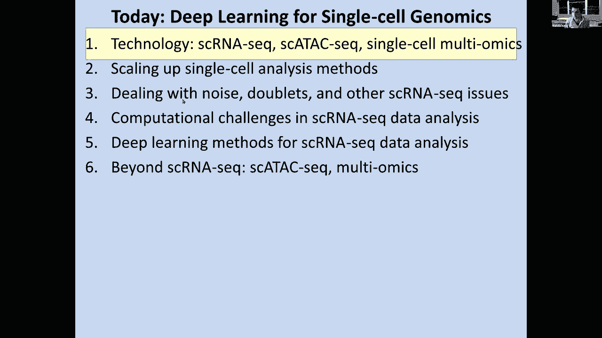

# 【双语字幕+资料下载】MIT 6.047 ｜ 基因组学机器学习(2020·完整版) - P22：L22- 单细胞基因组学 - ShowMeAI - BV1RM4y1g76r

people who have their video on you will，not be on the recorded video so don't。

worry about privacy concerns it turns，out that it only records my video and。

the slides that I'm sharing so without。

further ado let me share my screen can，you guys see my screen into the slide。

all right let me okay cool um how's the，audio can you guys hear me can you know。

if you can hear him yeah awesome perfect，alright so today we're gonna be talking。

about single-cell genomics and，specifically deep learning methods for。

single-cell genomics so the goal is to，be able to infer information at the。

single cell level so we're gonna talk，that，specifically single seller and AC single。

cell attacks a single film multi-omics，and we're going to talk about how we。

scale up these technologies and then how，to deal with noise with doublets and。

other single cell or any seek issues，then an outline of what are the。

computational challenges in single-cell，RNA seek data analysis and what are the。

deep learning approaches that have been，used for single cell RNA seek and then。

lastly how do we go beyond single cell，RNA seek to single cell taxi and，multi-omics so it's awesome。

so foundations first of all why profile，single cells so the first challenge is。

when we look at bulk data when we look，at say brain biopsy and then we measure。

RNA in the brain or when we look at a，liver bites and we measure RNA in the。

liver which are the examples that have，been using for the last few lectures。

what you end up is an average over many，dimensions you end up with an average。

over many different cell types you end，up with an average over many different。

cell States very different developmental，states of different cells different。

responses and different temporal，positions in the cell cycle as well as。

different temporal positions in whatever，response b-cells are undergoing so if。

you look under the microscope you see，that cells are extremely heterogeneous。

so averaging the expression of detail in，that cell in that cell and that cell。

will basically give you something that，not represent any one of these cells the。

second reason is that cells，differentiate they start with a minute。

operatic stem cells for example and then，they can differentiate into all of the。

different blood vintages you know all，the degree and myeloid and famous。

lineages and from those you basically，end up with again a very different mix，cells。

if you profile whole blood similarly，even within a cell type there are。

dramatic differences between individual，cells which are again impossible to。

capture even if you were to sell sort，for say different cell markers that。

capture each of these cell types and，similarly when cells respond to the。

environment the specific receptors that，they have will capture only you know the。

environment of the cell to a partial，degree and what you're going to get at。

the whole tissue level or the whole，organ level is going to be an average of。

those responses whereas in fact，depending on the amount of viral protein。

that the cell might detect each cell，might actually have a very different。

response and again you can see this，under the microscope where breach cells。

that respond to an immune stimulus are，in fact very very different to each。

other in the response patterns and then，lastly another reason to actually carry。

out single cell profiling is that if you，look at circulating tumor cells or if。

you look at the early embryo of the，zebrafish you only have eight cells so。

the methods that we are using for，capturing bulk RNA basically means that。

if there's only one percent of yourself，and are tumors in your sample you will。

completely miss that and similarly if，you only have very very few cells in。

your area you might also miss that the，other major issue is that if you look at。

a bulk data set and these are the，individual data points of the expression。

of one RNA molecule one RNA one，across different sales you might。

actually have in the real data a very，bimodal distribution some sales might be。

experiencing a lot of that gene and some，other sales might be expressing very。

little of that gene but when you look at，the bulk profile you will end up with an。

average of those completely missing，Levi's modality the other issue with。

both ADA is that rare events can be lost，if you look at the distribution of。

average values you will end up moving，that distribution very very close to the。

average when in fact there might be some，individual cells that have。

overwhelmingly strong signal for that，gene and these might be completely lost。

in the both day so this is not a new，concept basically folks have been trying。

to study individual cells for a long，time and these approaches have been。

traditionally using microscopy to，basically look at individual labeled。

RNAs with about five probes so you can，measure five different rnas and you know。

you can capture all kinds of special，information about those and you know。

this is very very rich for any one cell，but it only captures very very few genes。

and very little information for those，you know across across the other genes。

there's of no information these has been，scaled up a little bit with some electro。

beacons and with fish technologies and，with in situ sequencing looking at many。

Indies from probes so basically looking，at you know large numbers of probes and。

you know with single cell or any，sequencing we can now start looking at。

you know effectively large large numbers，by the way the PDF of the lecture has。

been posted on the chat so what's the，underlying foundational technology for a。

lot of these single-cell RNA sequencing，technology idea is rt-pcr so the concept。

is that you start with a line cell and，then you extract RNA and then you，basically carry out reverse。

transcription and you add primers and，you basically you know measure the RNA。

expression of your population so the way，that this has been carried out in very。

early studies was to isolate individual，cells painstakingly through either。

flow cytometry or through capture with，iPads or any other such method and then。

to measure as many genes as possible，using those individual cells and of。

course this requires a massive amount of，amplification within these wells to。

basically capture a large number of，genes with RNA sequencing of a single。

cell in a single well and of course，there is all kinds of challenges with。

being able to even handle that much，small of a sample when most RNA。

profiling methods have been really，optimized for bulk samples with many。

many RNA molecules in many cells so，there has been a lot of optimization for。

single cell per to priam for vacations，and so forth and then this has been。

applied to study individual cells across，you know different contexts the key。

advantage of single cell RNA sequencing，is that you can now do this not just for。

five or ten probes but for hundreds and，thousands and tens of thousands of set。

of genes across thousands of cells so，the idea is that you take your tissue。

you can carry out RNA seek of the whole，tissue you might create a single cell。

suspension that includes both you know，single cell and RNA preparations and。

then associated individual cells，and then isolate these single cells and。

you can isolate them using your pipette，you can basically you know suck in one，cell at a time。

or you can use cell sorter a basically，fires cells individually and then sort。

of can visualize their properties and，capture them or let them through and。

more recently with micro fluidics that，basically bring cells through a series。

of chambers that allow them to move，individual cells around and then after。

that the key step is again this reverse，transcription reaction starting with a。

ponytail and then ending up with some，kind of complication so basically you。

end up with an amplification here in a，by PCR or all kinds of other things and。

what you end up with is a measurement of，individual genes across individual cells。

and now you can basically see that every，column here represents a different cell。

and you can see how these cells are，perfect for behaving in different。

conditions after you know no stimulation，at zero hours or after one hour two。

hours four hours six hours and you can，see here the individual genes that turn。

on in a subset of cells and then some of，these genes turn on in all of the cells。

in those conditions and some so forth，raise your hand if you're with me so far。

in terms of what we're seeing here，awesome great so this is the you know。

basic premise this is the basic，challenge and basically what we're。

seeing is that the single-cell RNA seek，data that you obtain from these。

experiments effectively looks like bulk，RNA data in many cases if you look at。

the exchange of a B at the bottom you，see 10，000 cells at a time averaged and。

then at the top you see individual cells，so one cell at a time you can see these。

RNA molecules are piling on from that，one cell exactly the way that they're。

finding on across tens of thousands of，cells so for these columns very。

reassuring basically tells us great we，can capture RNA seeking。

Meishan in individual sales and that's，true for many of the genes where many of。

the genes are basically expressed you，know with all of their exons in all of。

these different cells but then the story，gets more complex for some of those。

genes you basically see that for this，gene yes the ball could look like that。

many of the individual cells look，exactly the same way but for some cells。

you simply don't have expression so what，could be happening here same thing here。

you basically have completely no，expression for some cells and then very。

low expression for other cells and maybe，only one X in here and so forth so what。

ends up happening is maybe in those，individual cells something went wrong。

with the experiment you know that's one，possibility but if you look at other。

genes they look perfectly fine so the，experiment seems to have worked for。

those cells another possibility is that，these genes were randomly dropped out。

that may be because I'm only looking at，very very few cells once a lot of time。

maybe that one cell you know somehow the，RNA got stuck in the wrong side of the。

cell and it wasn't captured so there are，all kinds of technical reasons why this。

could be happening but the much more，interesting biological reason is that。

these cells might actually just not be，expressing that are in any at that。

particular time maybe I only need this，RNA to be expressed every two hours and。

sure all of these cells are expressing，it when I catch them on in the act of，transcription。

they are highly expressing but these，cells maybe they just ran out maybe。

they're about to Express or maybe their，cell to cell variability where some。

cells in the tissue really must express，that gene but not all cells in the。

tissue need to express that gene so，maybe having only one out of ten cells。

expressing that gene is perfectly fine，and there's all kinds of reasons why。

true biological cells surprising，variability might actually be underlying。

this data and this is confirmed when you，look at these genes with different。

profiles under the microscope with，fluorescent labels what you can see here。

that this gene which is sister，radically expressed across all of the。

cells is indeed lighting up in all of，the cells under the microscope this gene。

which is only expressed in some of the，cells but completely absent from other。

cells he's indeed showing exactly the，same pattern under the microscope with a。

bimodal distribution just like we saw，earlier many gene many sales just don't，express this at all。

and then other cells expressed it pretty，fine levels and then if you looked at。

the bulb TV show you would take out with，his genes very lowly expressed by all of。

the team all over cells without，realizing that now it's very highly，bimodal。

it's either expressed with hundreds of，molecules or with zero moles and then if。

you look at some of these intermediate，data sets even though you can see that。

those intermediate values are indeed，captured under the microscope you see。

these very strongly expressing cells，where that particular gene is 6：06 is。

actually very strongly expressed and，then you see other cells where these。

genes very weakly expressed is everybody，so basically this inter-cell variability。

can be captured systematically using a，single cell or anything and then if you。

look at these housekeeping genes that，are the least valuable basically see。

that you know they're always on and if，you look at some of the most variable。

genes you see that in some cases they're，only expressed in one cell at a time and。

then you know very very few cells are，actually expressing all right so that's。

the basic premise of what we're trying，to achieve we're basically trying to。

sort of profile information at the，single cell level so if you have any。

questions now not every x chat，all right so how is that feasible how do。

we actually make single seller an AC，possible so what I showed you before was。

basically technology that could profile，you know maybe ten cells at a time and。

then this is you know a few years ago，but since then on these log axes。

technology has dramatically improved to，being able to profile tens of thousands，of cells at a time。

and hundreds of thousands of cells at a，time so let's look at what are the。

underlying technologies that enable that，enabled this dramatic exponential。

scaling of the single cell our intensive，technology so basically we went from。

having individual pipettes capturing，individual cells and then putting them。

into wells to having you know microscope，and capillary pipettes to ultimately。

having facts sorting where with a laser，you can basically decide which cells you。

care about and which tells you don't，care about and ultimi altum Utley being。

able to actually carry out laser capture，microdissection basically select。

individual cell types to more recently，being able to carry out microfluidic。

separation of individual cells，effectively capturing these cells and。

trapping them along with specific，barcodes in these you know gel droplets。

that are effectively separated from each，other in an oil medium that effectively。

allows you to to capture individual，cells and then more recently to liquid。

based collections and a substrate assume，combinatorial bar coding of individual。

cells but regardless of the individual，technology being utilized the key idea。

is the same you basically want to，physically separate the cells into some。

kind of wealth this could be either a，big tube or individual wells in a。

96-well plate or in a 384-well plate and，then the traditional approach has been。

to carry out profiling by physical，separation of these cells into，microfluidic chips and then。

sequencing of the entire well each time，with full-length RNA sequencing and then。

being able to detect gene expression，splicing and all kinds of additional。

information for the individual cell in，each of the wells more recently this has。

been pushed to much much higher，throughput with cells not being sorted。

but instead trapped inside hydrogel，droplets with methods like drops a can。

in drop and also the cells that are，physically separated from facts orders。

have been also profiled using the，simplification methods with cell thick。

Marcy etc and then after this Pope is，your amplification these methods are。

effectively only sequencing the three，prime UTR of these genes where basically。

the reverse transcription begins with，the poly a tail and the TT primer that。

you know initiates the reverse，transcription and then that leads to。

simply measuring of gene expression，without necessarily being able to。

capture the full length the splice，parent and other information about those。

cells okay so the the key approaches are，outlined here along with their cost we。

basically went from facts sorting and，capturing cells by laser and being able。

to capture millions of cell per，experiment but only measuring up to 17。

markers and then we cite often qPCR we，basically were able to scale that to up。

to 40 markers at a much much higher cost，per cell so if you want to carry out I。

don't know million cells you would have，to spend if you want to profile。

ministers you would have spent thirty，five million dollars which is of course。

prohibitive or with mine crop by，painting and qpcr yes you could have。

only spent one dollar per cell but you，would get very few genes and you would。

only get very few cells like three，hundred two thousand cells。

similarly fluid I'm basically was based，on micro fluidics and then that allowed。

you to capture only you know 52，sales per experiment not again a。

prohibitive cost of $35 per cell but，being able to capture six thousand to。

nine you know thousand genes per cell，for cell lines or one thousand to five。

thousand for primary cells so basically，these technologies each have a。

limitation either in a very small number，of markers or in a very small number of。

cells that you can profile but three，technologies have basically stood out as。

having both many many cells for each，experiment so hundreds of cells or。

thousands of cells and also having a low，enough cost of either $3 per well or $3。

per cell or five cents per cell with you，know the 10x genomics platform or。

recently so how do these work well for，smart seek one of the earliest methods。

to be developed as I showed you on the，previous slide the key idea is that。

you're basically flowing the cells in a，tube and then with a laser you're。

basically you know deciding whether to，keep or not individual cells using。

either you know multi-well plate below，and some deflection plate that sort of。

moves the cells that you don't care，about away and then after you put these。

cells into wells the rest of the，experiment is effectively an rna-seq。

experiment okay raise your hands if，you're with me on the first approach，here。

yeah so basically I'm just capturing，individual cells putting them to。

individual Wells and then carrying out a，traditional quorum call for a quote RNA。

seek reaction that is basically only，trying to capture the you know。

information set that one well optimized，for the fact that there's only one cell。

in that work the next approach is very，very cool it's basically saying instead。

of using wells to carry out my reaction，I'm going to use micro droplets to carry。

my reaction so the idea is the following，I'm gonna create a big tube of。

individual gel beads each of which，contains a single barcode with I don't。

know ten letters long so this is four to，the ten possible barcodes everybody with。

me on this part raise your hands or，shake your hands yep perfect then I'm。

going to be flowing these gel beads in，and these microfluidic tube and I'm。

going to be flowing cells into those as，well，so basically I'm flowing the individual。

cells that have suspended either from，this approach or from other kinds of。

suspensions okay and then these cells，are going to be entering these。

individual droplets so here's a zooming，here or you basically have a droplet。

that has a bead with a specific bar code，this bar code basically contains I don't。

know 10 or 20 nucleotides as well as a，unique molecular identifier and the goal。

for this um I for this unique male，identifier is to effectively distinguish。

PCR artifacts of amplifying the exact，same RNA molecule or actually generally。

capturing different RNA molecules and，also also of course a PCR handle which。

are going to be using to initiate your，polymerase chain reaction multiplication。

everybody with me so far，raise your hands if you're with me on，the idea here and awesome。

so mister the idea is that all of these，reactions are now going to be capturing。

and captured inside these droplets so，what am I going to be doing the droplets。

once I've trapped the cell into the，droplet the you know the you see this。

little light blue circle it basically，contains the cell and the bead within it。

and basically then I carry out reactions，you know millions of droplets at a time。

within those droplets and what is the，first reaction that I can do I can。

basically lyse the cells to sort of，break open the RNA and now the RNA is。

floating around that droplet and then，getting in contact with these barcodes。

and then being ligated to this barcode，which then enables me to uniquely label。

every one of the RNA molecules inside，that cell which is now inside the。

droplet with the same exact barcode，basically telling me what cell that RNA。

came from raise your hand if you're with，me here yes awesome，so we can basically do that with many。

many different barcodes and label every，one of those cells and eventually every。

one of those RNAs inside that cell and，then after the fact you remove the oil。

which was basically causing these gel，droplets to separate from each other and。

that allows you to now carry out an RNA，sequencing reaction on a single big tube。

where the most of the sequence will，basically be telling me about which RNA。

I'm profiling and the barcode would be，which will be basically telling me how。

do i group those RNAs according to the，cell that they came from。

so from sequencing say for example gene，mm I see that wow I've secretly in five。

times in my pool four of which at the，red barcode and one of which at the Blue。

Bottle of the green marker so that，basically allows me to infer which one's。

of these RNA molecules for each of the，genes came from which so。

I'm going to stop here and see if people，any questions so far，who's with me raise your hands or your。

thumbs or something awesome who think，this is kind of cool，yeah this is very cool right so。

basically we are now able to sort of，instead of carrying out effectively 384。

sequencing reactions to capture 384，cells we can carry out one sequencing。

reaction to capture tens of thousands of，cells right because in the end I'm only。

doing one sequencing reaction so in，terms of the amount of money that I need。

to spend you don't need you know there's，just no increased cost in sort of。

effectively separating out all of the，cells it's as if I was basically doing a。

traditional bulk RNA sequencing reaction，only every one of my RNAs has a barcode。

that basically tells me which cell it，came from okay and this technology has。

been used extensively across the，community so basically it's very rare to。

see a smart sick experiment being done，known nowadays and the reason is that it。

costs basically 100 times more and it，captures 10 times your cells okay so。

basically here we're looking at 50 to，500 cells as opposed to 5，000 to 10，000。

cells and here we're talking about you，know $3。00 per well which is per cell as。

opposed to you know 5 cents per cell，alright everybody comfortable with drop。

seek so again the key idea here is that，you have this complex issue you isolate。

the individual cells used to spend these，individual cells in these droplets and。

then you basically capture you conquered，stamp each of your cells with these。

micro particles that are containing the，barcodes and then that can that creates。

a library with tens of thousands of，single cells each you know with。

thousands of genes in each of the，regimes and each of those RNA molecules，has one。

barcode which basically tells you what，cell they came from and in the way that。

you make those barcodes is that you，basically have initially you know your。

PCR handle and your you know you're，adding to that by effectively doing。

multiple rounds of sequences and you，know you're adding a TCG or you know in。

in every one of those twelve and then，you're increasing and increasing and。

increasing and after say twelve rounds，of things synthesis you basically end up。

with every one of those beads having a，different one of those are any barcodes。

and then after that you'll also，synthesize your viewer minds with an。

additional round of synthesis and that，basically means that you have millions。

of the same cell barcode for every beam，and then you have four to the eight。

different molecular barcodes her for me，okay，so you know very very rare to have the。

same one and then you put those beads，with the sails and then you basically。

have this template switching which，allows you to sequence the barcode first。

and then switch over to the RNA so，basically every single one of your reads。

sort of contains both your initial，barcode and the sequence of the gene。

everybody with me here on drugs week，awesome so that's drop seek and then。

there's another method that's still，emerging which is very very cool and。

worth noting which is this combinatorial，indexing approach how does that work you。

basically have the following idea so，every single one of your actually I'm。

gonna go to this split sick the video，explanation which is very very cute so。

basically what you need to do what，you're trying to do is understand every，single cell of a mixed。

tissue with many cells and every cell is，a little ball here a little tennis so。

you can fumble and inside the ping-pong，ball lie a lot of strings and these are。

all of the rnase of each ping-pong ball，so what you need to do is basically。

break the cells open and then read their，RNA but now we're going to do something。

very very cool we're never actually，going to create these droplets and we're。

never going to actually encapsulate，these cells what we're gonna do is。

prepare large tubes where many many，cells will fit into each of those tubes。

okay so basically we have this you know，brain bucket that has many many cells。

and we have these hundreds of，individually colored buckets that。

basically have each their own barcode，and now we're going to take all of our。

cells and we're going to split them into，say a hundred buckets each with a。

different color these buckets are now，gonna add a barcode to all of the RNAs。

inside each of the cells okay，so we're basically splitting the cells。

into 100 pools and every one of those，pools basically gets its own barcode。

that you're basically adding to every，RNA molecule okay so if I'm cell 134 I。

end up in tube number four in the first，experiment I get barcode number four in。

the first round and then I go back out，into my bucket and I get mixed again。

with all kinds of other cells many of，which were in the same bucket as me but。

most of which 99% of them we're in，another bucket in case you if I have 100。

Wells I basically end up with you know，very different buttons so then I keep。

repeating that I then reap all the，cell's together and then I reach offal。

them into wells with a different barcode，added，okay so now all of the cells have the，same barcode。

after the first round and then I refold，them together and then I split them back，up。

but now randomly into the same set of，100 Wells okay so instead of having，10。

000 Wells I only have a hundred wells，instead of having 10，000 droplets I only。

have a hundred buckets that I'm putting，the cells into every cell does not get，its own bucket ever。

there's no point where one cell is alone，in a bucket every single time I just for。

teaching my cells into you know hundreds，of cells at a time in each bucket but I。

do these multiple times so that，basically means that after I've done。

this multiple times every single cell，has been labeled with a series of。

barcodes first green then red then blue，then yellow and that basically means。

that that one RNA molecule went through，bucket number four bucket number。

seventeen bucket number forty one bucket，number 27 okay，in order for two molecules to have gone。

through the same set of three different，with some confidence that that depends。

on the number of rounds that I did this，the first round I only have you know if。

I only have her if I have a red barcode，I basically have one chance in a hundred。

of having the same barcode if I wasn't，in the same cell if in the second round。

I have a red and a blue barcode I only，have one chance in a hundred in having。

the same exact barcode if I'm not in the，same cell after the third round I have。

only one chance in a million of，basically having the same set of three。

barcodes even though I was in different，cells so basically in the end I'm。

basically confident that if I have the，same set of three bar codes for that RNA。

molecule it must have been labeled，through first the red bucket then the。

green bucket then the blue bucket raise，your hand if you're with me on this one。

yeah awesome who thinks this is like，awesomely cool yes cool so so basically。

here we are with three different，technologies look at question wrong oh。

sorry there's a there's two questions，yeah hold on one second is barcode。

edition sequential yes absolutely，how can the barcode enter the cell in。

anneal to every mRNA so that's where the，funky chemistry happens basically you're。

doing those reactions in a cell，permeable fashion so all of those。

barcodes basically permeate inside the，cell using different technologies and。

then enter the bar to enter the cell and，label all of your mRNAs of that cell。

without ever breaking the cell open okay，and then the first questions are it was。

is barcode of different sequential yes，this picture is incorrect here but these。

picture is correct here so basically in，my little strings I'm basically adding。

the barcodes in a sequential fashion and，therefore red blue green is different。

from red green blue does that answer，your questions guys awesome any other。

or these are these are awesome questions，to keep them coming，it's really great okay so ho so this is。

a totally awesome technology so，basically that means that all I need is，a hundred buckets。

I don't need ten thousand buckets I，don't need a million bucket and with 100。

buckets reused over and over again I can，basically end up with one chance in a。

hundred million or one chance in ten，billion and so forth of being in the。

same well so that basically means that I，can carry out arbitrarily large massive。

reactions and effectively you know，figure out the cell of origin of each of。

those as long as it can go through this，procedure of putting my individual cells。

back into that bucket and and back into，that picture and then redistributing。

them to my hundred buckets，okay so if you are the three，technologies basically that our sort of。

enabling is to do this in a massive，massive scale the first and oldest and。

still much more expensive is you know，these you know smart take technology。

where you're basically putting，individual cells into individual playing，wells。

the second technology is this still the，cheapest and now extremely robust and。

extremely widely used drop seek or in，drop or very often referred to as 10x。

because this is the company that sells，those kids certainly widely and then the。

third technology which is still emerging，and still has great great potential for。

you know scaling up is you know either，split seek or sign RNA seek at CI for。

community or indexing okay so splits a，course I or an ASIC and basically for。

all of these approaches you basically，harvest your cells then you do your。

single cell processing and then you，profile you create your library and the。

new sequence and you know when you do，analysis okay，so first these cells in Wells traps and。

valves for the sake，these droplets where again you have a，well for every cell and those wells are。

not microfluidic anymore now they're，individual liquid droplets so you have。

tens of thousands of reactions in in，parallel and then the last one is big。

big buckets of reactions many cells at a，time but the cells are being reshuffled。

community really enabling you to figure，out from the first second third and。

fourth barcode what is the unique，identity and the common provenance of。

each of those are anymore okay what，gives that they've learned stuff so far。

yes awesome very cool so now let's talk，about some of the downsides how do we。

deal with noise how do we live with，doublets and how do we deal with other。

sern ASIC issues and then we're gonna，switch to massive computational。

challenges associated with those is，there a way to put you in mind to the。

pool approach yes so in fact the pool，approach you can simply carry out an。

addition or actually don't know the，answer to the question I think yes but。

I'm not I'm not sure so I'll get back to，your level I you know I believe so but。

I'm not sure okay so how do we deal with，noise with doublets and other issues so。

first of all one challenge is our RNA，contamination so basically inside every。

one of your cells translation needs to，happen and for every translation。

reaction you need a different ribosome，and these ribosomes are basically。

primarily RNA with a bunch of Xavier，proteins so that basically means that。

for every protein MA and for every RNA，that I use to make a protein I have。

another RNA which is currently，translating that protein so if you look。

at the relative abundance of RNA I，basically have I don't know 20 copies of。

my favorite gene and a million copies of，the ribosome so if I basically sequence。

you know randomly chances are that，whatever RNA I picked up is gonna be a，ribosome already。

so there are many ways of trying to，remove this huge amount of RNA of。

ribosomal RNA which basically overwhelms，mRNA by you know a factor of you know。

100 to - and poly a selection is one，approach where you're basically，capturing RNAs that have a。

polyadenylation signal which is usually，only found for long non-coding RNAs and。

for which are very low abundance and for，mRNA or messenger RNAs which encode。

proteins so that sort of the first，approach the second approach is to。

actually go in and chop up ribosomal RNA，so basically you can actually。

specifically rival replete using that，the second challenge is PCR has biases。

so when I amplify a particular mrna，molecule the first mrna molecule to be。

amplified might actually just win out in，a rich get richer kind of approach where。

because it's the first one to be，amplified it now has many many more。

templates all of which will now be，further amplified causing Ana。

combinatorial sort of it's exponential，explosion in the number of molecules in。

the notes area in the number of，suppressing reads from that one mode so。

to prevent that one way to do that is to，basically carry out this you know。

particular template switching audios，that basically allows you to sort of。

limit the number of times at the same，molecule is amplified and you also add。

as I mentioned earlier these unique，molecular identifiers or um I that。

basically allows you to sort of，recognize that this particular，amplification is from the same exact。

mode，you then have to deal with all kinds of，quality control matrix so basically you。

want to ask should I keep a particular，cell was it a good conclude cell or was。

it bad for itself and the way to do that，is all kinds of standard metrics that。

have been used before for RNA seek as，well so basically what fraction of my。

reads actually align to the genome what，fraction of my transcripts have I。

successfully covered is there a lot of，ribosomal RNA contamination。

do I have duplicates which we're going，to talk about soon what is the overall。

complexity of the number of different，genes that have captured and what is the。

probability of detecting any one，transmitted relative to overall the。

overall abundance so template switching，I will not describe in detail but the。

basically what template switching allows，you to do is somehow limit that reaction。

and sort of introduce an extra step，where you you basically limit the number。

of non x like switching reactions that，are allowed to happen effectively。

reducing the initial step until you're，able to actually switch the template but。

I can provide more information about，that offline all right so then let's。

talk about how this quality control，metrics so basically depending on how。

many cells you're looking at your，alignment rate can differ greatly。

depending on what technology you're，using your our RNA contamination can。

differ greatly so basically you know if，you sequence with different technologies。

you basically end up with more RNA or，laser learning you can also ask where。

are the reads coming from basically are，they coming from exonic regions and。

again that's what you would like to see，or utrs，and much more likely or much less。

desirable you want to know that they're，not coming from intronic or intergenic。

regions which basically would suggest，that somehow you're capturing either DNA，or pre mRNA。

you can also ask how much of my track，how many of my transcripts am i covering。

depending how Express they are so the，more expressed the more likely you are。

to capture them and the lo Express，transcript you might not capture very。

much and then depending on what，technology you're using you can capture。

more or less of those rarer transcripts，and you can also ask where along the。

transcript or my reads happening so，basically between the five prime end of。

the three prime end you know am I，missing information and you can see here。

how the number of the amount of coverage，gets reduced as they go further into。

that reverse transcription reaction you，can also ask what is the overall。

complexity of the number of genes that，are detected again depending on the。

overall expression and this is sort of，the template switching that I mentioned。

earlier you basically you know switching，from one template back to the other。

template in order to sort of increase，your your capture so the first round of。

full length of your name means that the，PCR duplicates can unfortunately not be。

identified unless you add this your mine，and then of course the noise actually。

depends on the expression namely if you，look at a random variation from the。

actual number of molecules out here that，random deviation will not have too much。

of an effect because these genes are，highly expressed but down here，the random deviation will have a。

dramatic effect so you know over here，for housekeeping genes you can actually。

detect them quite reliably but or for，free they're the ones that I care the。

least about and then for these RNAs，you know I can detect them very poorly。

and I'm quite unsure of their true，expression level because of their little。

bundles and then of course this depends，on different cell types and different。

cells so you might actually have you，know different curves of this overall。

detect ability for different cells，depending on the overall quality of the。

cell for example so again some cells you，will capture much better。

yeah it's also important as I mentioned，earlier to distinguish to do two。

different types of noise one is noise，that is technical and it's actually。

coming from sampling or from kisi our，biases and then the other noise is。

actually biological which is simply that，you know at any one point and in one。

cell might or might not be expressing a，particular transcript and you can。

distinguish these you know in different，ways another major challenge of。

single-cell RNA sequencing is dönitz，namely these are cells that are captured。

in the same droplet so remember before，how we're basically flowing in。

individual cells into individual，droplets and then capturing them so one。

droplet might actually encapsulate two，different cells so that basically means。

that they both get the exact same，barcodes for all their RNA molecules and。

the number of droplets increases with，the number of single cells that are。

recovering basically there's a，limitation to the overall number of。

cells that can be captured because as I，capture more and more cells I capture。

more droplet so basically very often the，reason why we stopped at 5，000 cells is。

that the you know droplet percentage，increases dramatically after that and。

it's very difficult to recognize if just，if a particular quote unquote cell ie a。

particular barcode came from a single，cell or from two cells it'd be the only。

way to recognize that is if you have you，know if you're able to computationally。

deconvolve the two expression signatures，which now correspond to the mixture of。

say and oligodendrocytes l and a，microglial cell so basically if that。

drop that captured both cells together，you're gonna get a mixed up signature。

and it's going to be very difficult to，distinguish which was which。

your hands if you're with me on this one，on the drop on the hundred perfect so on。

the doublet challenge so one way to do，that is to actually prior to my。

reactions actually create cellular，barcode so that the cells themselves as。

they're coming in our barcode so you can，basically label your Cydia name by。

having a lipid tag in this index that，sort of goes in and deposit within your。

within each one of your cells a genie，barcode of some length so that basically。

means that I can pre label myself prior，to this and effectively take a large。

number of cells and then use you know，maybe split the matter no 20-fold or。

something and then use a different，barcode label for each one of the twenty。

different wells that i've now split my，cells into that allows me to now detect。

if I have a combination of barcodes in，my different individual droplets which。

basically suggests that these two cells，in the same droplet were in fact。

individually labeled in those twenty，pools which technology was your question。

referencing how does the template switch，okay all right so that basically means。

that you know I could basically label，the you know these these individual。

cells into sort of ten different colors，so that after the fact I can actually。

remove the doublet this way another way，to do that is to actually combine and it。

sounds a little crazy but combine two，different samples or multiple different。

samples in a multiplexing kind of way，where I've now got both different。

properties of the samples and，different barcodes associated with the。

samples but also genetic variants，associated with the different samples so。

if you basically look at these，individual DNA variants associated with。

say profiling 20 different individuals，then you can use genetic variants。

associated with these individuals -，after the fact basically saying across，my 10。

000 genes that I'm detecting in，the 3-prime regions of those genes I can。

basically detect individual RNA，differences at the genetic level and。

effectively use that to distinguish，between cells that are coming from only。

one individual and cells that are coming，from a pair of individuals is everybody，with me on this one。

so basically and then what's really cool，about these multi seek approach these。

multiplex multiplexing using Liptak，indices approach is that I can actually。

use it to carry out multiplexing so，instead of profiling only one sample for。

each 10x reaction I can be basically，profile nine samples I can take I don't。

know three schizophrenia brains three，control brains and three by Auto range。

and then label them individually using，these all of your hash tags and then。

pull all the material into a single，nuclear suspension and then carry out。

these 10x sequencing from the pooled，material enabling me to recognize when。

SS happen because they will actually be，combinations of barcodes and therefore。

the undetected doublet will only be you，know much more rare because there will。

be only one one out of nine doublets，basically will be undetectable because。

it will happen to capture exactly the，same well that our multiplexing if I do。

a nine-fold multiplexing try do 24，multiplexing and I have one chance out。

of 20 of being an undetected of it raise，your hand if you're with me on this one。

yeah awesome good so now using this，approach from Zika basically profile。

what I showed you and here you can see，that you know if you look at the by。

subject or by 10x library or by，diagnosis Disney cause you basically see。

that there's you know a very good mixing，that happens you know in most places。

which indicates that you know you can nd，you can also do bass correction using。

this so the advantage of that is that，instead of having to do it separate -。

correction for each individual and，therefore you wouldn't know if perhaps。

and by other signature was corrected，away from schizophrenia signature from a。

control signature because of the sample，specific package correction you can now。

do bad correction across samples from，different phenotypes and therefore not。

over correct for the phenotypic，contribution but you can see here okay。

so who's with me so far yes good any，questions I system the question coming，up。

it's multiplexing the same and，sequencing different samples，individually no multiplexing is。

basically sequencing different samples，together so after I've done this。

multiplexing I now have these cells that，are individually bar coded with。

different colors and mix all of these，cells together into each citizen。

jeepers yes it's also cheaper basically，the cost office if he multiplex about 20。

fold drops from you know by a factor of，two and then the idea that you can't。

drop the secretin cost because I still，need to sequence the same amount you。

need to sequence you know as because you，need but you're dropping the cost on the。

10x kids which is about half the cost so，basically on half the cost which is the。

sequencing you can't drop but on the，other half of the cost which is the 10x。

kids you're basically dropping by I，don't know a factor of 20 if you do 24。

multiplexing or a factor of 9 if you do，9 call multiplexing so in the end it。

sort of averages to about you know you，know 45% of the cost is multiplex but I。

think 9 fold any other questions no，thank you，all right so we've talked a lot about。

the technology let's now switch to what，are some of the computational challenges。

in single-cell RNA seek data analysis so，here we are basically processed our data。

we've created our counts of genes per，cell so basically for every one of many。

many cells I have the expression of many，many genes and have many of those count。

matrices then expressions are great，where do I go from here so first of all。

we talked a little bit about quality，control so basically what is the overall。

sequencing depth what is the you know，how's that related to particular size。

factors and then how can I do bat，correction so basically that's a major。

computational challenge with a lot of，effort in being able sort of take。

samples that have a lot of sort of for，example all of the green cells came from，the same person。

although the purple cells came from the，same person all of the red cells came。

from the same person and you see very，little mixing and basically means that。

every person and every batch is，contributing its own substance of cells。

so it's very difficult to know what's，Alzheimer's and what's non Alzheimer's，if one of hammers。

a screen and another Alzheimer's，individual is purple and anon，Alzheimer's individual is red and。

basically tells us that you know there's，something is being driven by badge。

rather than true biology is everybody，with me at least one yeah and then the。

goal of Bosch correction is to basically，make sure that these cells are。

overlapping nicely across the different，clusters the second challenge of course。

normalization basically being able to，sort of infer how deeply seeded sequence。

each of the cells each of the samples，how do i normalize across different。

experiments and then selecting features，what are the genes that are the most。

variable in my experiment for the you，know other teams that are the least。

variable for example housekeeping genes，and the the next one is visualization we。

talked a little bit about that when in，the Disney lecture basically we saw how。

we can actually visualize the layout of，individual cells by embedding them into。

a two dimensional space that tries to，capture the same distance properties。

between pairs of cells and which then，allows me to label all kinds of。

additional information in these plots，for example I could color the cell type。

expression of a particular gene to know，which of these cells express that。

particular gene and for example if that，gene is a marker of enterocytes。

and that gene lights up here and are my，people say aha these particular subset。

of cells are likely to be enter sites，and so on so forth so basically the。

first challenge is you know after we've，done all that to then cluster the cells。

to into to reveal groups of cells are，behaving in similar ways so there's this。

continuum that I end up with and I want，to be able to define clusters that。

somehow break up is continuing into，discrete blocks and maybe within these。

blocks I might have you know different，cell types is everybody with me on this，one yeah。

and that's a sell level analysis，basically how do I first cluster my，cells so that can break up this。

continuum in two different colors how do，I then annotate these different clusters。

based on which you know markers are，associated with each of those so for。

example I might be able to define to use，a previously defined set of markers that。

basically tell me what is the identity，of each of those cell types or I might。

use you know the Novo marker marker，identification serving fir which are the。

sales corresponding to each of those，clusters once I have identified my。

clusters and I've annotated them then I，can do all kinds of cool things I can。

basically ask how are individual cells，traveling through these trajectory。

through these different cell states and，through these different cell types for。

example progenitor cells might be here，and they might be differentiated down。

into those different cell types and，still maintain distinct cellular states。

across them we have a question you know，we have responses so and then after that。

I might be interested in the gene level，dynamics of how is a particular gene。

expressed as I go down this continuum so，basically if I go from you know the。

progenitor cell into a stem cell this is，effectively like looking a。

differentiation time but it's not，exactly differentiation time because。

these genes are profiled in different，cells each time once I profile the cell。

have killed that cell so I can see the，actual temporal course of a single cell。

going through time but I can kind of，order the cells as if they were the same。

cell at different stages and effectively，create a pseudo time between them。

everybody with me under the concept of，pseudo time here perfect and then of。

course I could also ask are there some，metastable States for example states。

that are in between these，tractors where that cell or there's you。

know there's very few cells sitting here，even though they're transitioning。

through here if your cell is here it's，very likely to become a tough sell but。

if it stays here it's very likely to，sort of stay in progenitor cell and this。

is basically at the cellular level，highlighted in red and I can also ask。

what is my change in cell type，composition between one condition and。

other condition if I look at Alzheimer's，disease for example maybe I'll have more。

cells coming from the middle but if I，look at you know control individuals I。

might have more cells coming from the，periphery so that can allow us to ask。

how is a particular variable at the cell，level affecting the presence of that。

group of cells across this visualization，plot and I can also carry out a series。

of gene level analysis that basically，allow me to ask what is the differential。

expression between two different，conditions so for example between。

Alzheimer's and on Alzheimer's I might，find that these genes are highly。

expressed and highly significant and，this is typically shown in this volcano。

plot I basically look at the fold change，in the x axis and then the FDR or the。

significance for the p-value on the，y-axis or the negative log 10 p-value。

not basically allow me to say that yes，these genes show a high fall to change。

and a high significance and so I could，also carry out this analysis the level。

of gene sets' to basically ask what are，the gene sets that are differentially。

active between these different，conditions and I could also infer gene。

regulatory networks based on the，other，I say look across my count matrix so。

basically I could ask how correlated is，the expression pattern of that gene。

across cells to the next gene across，cells and then cluster those together to。

between fur networks of gene gene，relationship or is a transcription。

factor expression in pseudo time，preceding the expression of its。

downstream genes again also in pseudo，prefer，goes on here and then the downstream。

target gene sort of get expressed down，there okay there's additional gene level。

analysis such as clustering of similar，genes or reduction of the dimensionality。

or imputation of missing data or the，convolution of alternative data which。

again are major major challenges and，then another sort of cell level analysis。

is combining the scientific data with，multi-omics with other kinds of data。

sets and data types and also being able，to study all these processes across，multiple resolutions。

so let's now walk through some of the，computational methods that are widely。

used for addressing these challenges，what percent of RNA is actually captured。

individual leads that go to the，amplified and sequence well the depends。

how far you put your sequencing reaction，it's you know if you push that too high。

you're gonna end up with a lot of wasted，sequencing but if you push that too low。

you're you know wasting a big chunk of，your are any sampling practice it's only。

a small percentage of the RNA that，you're actually profiling because of not。

pushing this too far because of doublets，in terms of the numbers of cells not。

pushing the RNA sequencing too far so，that you don't end up sequencing the。

same barcodes the same RNA molecules，over and over again through these PCR。

amplification artifacts and also in，terms of bang for buck you might be。

better off sequencing RNA from many，samples in different experiments rather。

than the same sample much more deeply so，if I'm a computational biologist I'd。

rather have you know fairly deep，profiling of many many cells or of many。

many conditions rather than a super，super deep profiling of one in one。

condition because the amount of，experimental noise cannot be controlled。

and sort of if I put a lot of eggs in，the same basket I might end up you know，not getting as rich。

information now does that answer your，great okay so how do we extract。

biological insights from single cell，areas if data is the goal of the first。

of all how do we calculate self，correlation gene to gene correlation。

imputation of missing values cellular，trajectories and differentiation and so。

on so forth so for clustering similar，cells there's many different approaches。

that have been developed looking at，environmental stimuli cell development。

cell cycle spatial context in order to，be able to sort of capture all of this。

information and even order order to be，able to go for complex teachers to。

individual cells so there's been many，examples where you can actually go into。

specific cases and recognize individual，cell types and these have been used for。

example in the retina to recognize self，acts that were previously not known so。

basically in the retina and alone you，have 39 different cell types that are。

identified from clustering or the single，forensic data and this has basically。

recapitulated decades of minut analysis，and also captured additional cell types。

that were previously not known revealing，markers for those cell types that have，now been validated。

you could also cluster similar genes but，basically recognizing what the most。

variable genes versus what are the，housekeeping genes and then being able。

to ask about sort of relationships，between genes across those different。

cells I'm going through this a little，more quickly to have more time to talk。

about some of the deep learning，methodologies there's been a lot of。

challenge with the zeros basically if，you look at 10，000 cells versus 10，000。

cells you basically get very good，correlation but if you look at two。

individual cells you get many many zeros，in one cell or the other cell and many。

of these are actually just simply，biological you know these cells simply。

so yes and and but also some other，zeroes are due to under sampling for。

example if you look at you know millions，of reach versus only thousands of reads。

you basically see that indeed many of，those years go away when you do that。

there's been a lot of work on，dimensionality reduction basically being。

able to sort of project the data into，lower dimensional representations so if。

you look at PCA for example with the，300sl dataset you can see here the three。

visual components and you can recognize，that these sales are in fact behaving。

differently based on which part of the，PCA space do they fall in you can also。

interpret that dimensionality reduction，by basically looking at how sales are。

moving along these two principal，components you know between the。

beginning of the studio time to the end，of the studio times we're building these。

trajectories there's been a lot of work，on sort of zero inflated negative。

binomial models to basically generalize，linear factor analysis and effectively。

being able to recognize what are the，sample level covariates what are the。

gene level compare it and what are，unknown covariance that might be driving。

the signal by effectively factorizing，the gene expression matrix a long ways。

different dimensions both capturing you，know known parameters and unknown。

parameters of variation we talked about，listening last times I'm not going too，much into this。

and then also distinguishing the，different cell types there's a lot of。

work in being able to first cluster and，then annotate effectively not individual。

cells but individual clusters based on，the expression of marker genes within。

those clusters for example there's，single cell consensus clustering。

which basically looks at you know your，input filtering different genes and then。

calculating different distances between，those individual cells and then。

transforming along different dimensions，and ultimately building your consensus，for。

you know each of them sells there's been，a lot of work going beyond clusters that。

try to sort of break up the cell space，into discrete chunks and actually just。

building diffusion maps that instead，look at differentiation along these。

trajectories to both recognize what is，the traditional means of differentiation。

for example from stem cells into，different lineages and then down this，way and also are there。

transdifferentiation pathways that，basically take you from one state to。

another state without first going to be，differentiation than re differentiation。

a lot of work on archetype analysis，basically being able to capture what are。

the principle archetypes of you know the，principal exemplars if you wish of those。

cells and then using those to，effectively define the dimensions of。

your space and in using those dimensions，to capture variability of your cells in。

your samples and that allows you to，basically combine both discrete and。

continuous measures of distance and then，there's a lot of work in trying to match。

cell types across data set so instead of，reclass turing and re annotating every。

single one of these new experiments，individually can we instead build a set。

of known markers and known signatures，that we can then apply at the cell level。

for any one new data set there's a lot，of work in trying to carry out。

multi-resolution analysis to basically，recognize at both super high resolution。

and sort of low resolution what is，effectively the topography of cell space。

and what are the relationships of fine，grained relationships and sort of large。

grain relationships between them and，ultimately building a network that tells。

you how are each of the cells related to，each other and our each cell state。

within those related to each other in，our soft States relate each other in our。

individual cells related to each other，within this network and this is achieved，through the。

if nearest-neighbor graph that allows，you to do that and you can also。

interpret these variability across，different signatures and builds。

trajectories through cell space as we，talked about using this pseudo time to。

predict either differentiation or cell，cycle and so forth there's a lot of。

methods that have been built for being，able to carry out these analyses so I。

encourage you to spend time looking at，this slide and you know evaluating the。

different methods in terms of the type，of structure that is built on the。

network the robustness strategy is there，any additional input requirements。

whether the measure is biased scalable，with respect to cell scalable with。

respect to genes whether the code and，the communication is available and how。

easy it is to use and you can basically，think of this as sort of for every one。

of those single cell expression analysis，data set，you basically have a plan that measured。

similarity in different ways or how to，project into the manifold in different。

ways how to make cluster within that，manifold whether you're building a graph。

or not how you're actually finding paths，through trajectories and how you're。

actually ordering the cells along these，paths and then depending on that。

basically group the different methods of，single cell trajectory and suit of time。

identification there's been a lot of，work also on imputation of missing data。

both for spatial transcriptomics and for，you know just non spatial transcriptomic。

so for example there's this very popular，method for Markov a phoenix-based graph。

imputation of cells or magic basically，builds a graph of the cells with respect。

to each other and then walks along the，cell cells in the arctic graph using a。

neighborhood based Markov affinity，matrix and sharing information across。

cells to effectively generate and，imputed count matrix that tries to。

eliminate as many zeros as possible so，you end up with the，relationship between two different。

variables for example these two，different genes being much more，meaningful。

after you carry out this mutation than，before and the reason is that you don't。

have as many zeros to worry about and，that imputation can also take matrix of。

cell counts of gene count per cell and，completely and effectively with missing。

data that allows you to now find much，more rich interaction patterns between。

them so before this imputation you，basically have many many zeros and very。

little correlation but then after this，intuitive refinement you end up with。

much more interesting relationships，between pairs of cells and there's a lot。

of methods out there for carrying this，out basically you can do model-based。

imputation data smoothing data，reconstruction using machine learning，approaches and using external。

information and some of the methods that，hear，and there's also work in integrating。

multiple data sets so basically you know，across you know different ways of。

finding mansion cells across different，data types so there's basically just to。

summarize a lot of normalization，imputation class Turing trajectory data。

integration and evaluation methodologies，and I encourage you to again I'll spend。

time to to read through those so this is，the huge huge number of some。

computational methods that have been，developed for single cell or NAC I。

wanted to focus in particular on a，subset of those for deep learning。

particular so one approach that I think，you guys will find very appealing is。

that if you're trying to do batch，correction you can effectively use an。

auto encoder to do that so MMD resonant，effectively built this maximum mean。

discrepancy loss function and then，trained a resonators into a residual，network that you're。

about in lecture with this particular，MMD based score function to learn a set。

of weights that match distributions，across the different batches and what。

you can see here is that before，correction these cells from different。

batches are very very separate but after，correction may overlap greatly and then。

if you compare this with combat for，example another approach robots。

correction you can see that there's a，lot of batches that remain batch effects。

that remain whereas here they're，actually you know corrected away and you。

can see here that it outperforms many，methods for doing this and then the。

whole concept is that the auto encoder，is able to capture a lower dimensional。

representation of your data and then，reproject it back up to a higher。

dimensional representation that，effectively eliminates these batch。

effects by training the representation，to match the distributions across your。

different batches de se or deep，embedding for single cell clustering。

desk is a way of carrying out bad，correction in a cell type-specific way。

so the idea here is very similar we're，going to build an auto encoder again but。

in this particular case there's a，hierarchical as a nested approach that。

allows you to initialize a clustering，obtained from your auto encoder and then。

iteratively optimize this clustering，objective function for each of the。

clusters and you can see here for，example that this approach effectively。

captures overlapping distributions for，each of the clusters whereas other。

approaches are effectively not creating，these overlapping profiles and you can。

see here how this iterative approach，works over time whereas you know at the。

initialization they're quite separate as，you start moving to more and more epochs。

of training you end up with very highly，overlapping distributions and these。

outperforms a lot of sort of the non，deep learning approach so again the。

whole concept of learning a lower，dimensional presentation and projecting。

it back out in a cell type-specific way，Auto impute is another auto encoder。

which is now used for filling in zeros，and then the idea here is that you can。

filter the raw gene expression data you，can feed that process matrix to the auto。

impute model and you can learn an，expression data representation that then。

allows you to reconstruct the full，matrix from that lower dimensional space。

so you're feeding in the sparse in，representation you're training it to。

learn both the encoder and the decoder，functions that best regenerate computed。

expression with no dropouts and you can，see here without imputation the data is。

very locked together but after，imputation you basically have these very。

nice separation across the different PCs，and even magic that we saw earlier is。

loving together all of these different，cell types，whereas this Auto impute lease auto。

encoder based computation method is，actually separating them very nicely and。

you can see here that as you go to more，and more highly expressed genes magic。

still has many zeros where as this，imputation approach as fewer zeros。

and then NCBI is one of the most，interesting approaches that effectively。

uses a neural network to estimate your，parameters in a variational inference。

network so the idea is that you're，learning a nonlinear embedding of the。

cells for any kind of analysis tasks，you basically have different neural。

networks that are used to compute the，embeddings and the expression。

distribution and you even have neural，networks that basically calculate the。

parameters of the gaussians that you use，for these embeddings so you basically。

model your observed data as a sample，which is drawn from a zero inflated。

negative binomial or assume distribution，as we saw earlier and this is。

conditioned on the batch of notations of，each cell if the batch labels are。

available and on to additional，unobserved random variables it's even。

nuisance variation which is a 1d，Gaussian which models the differences in。

capture efficiency in series in depth，and cell specific scaling factors for。

each experiment and then the remaining，unknown variation which is another 10。

dimensional coefficient which basically，captures biological differences between。

cells and that basically represents，every cell as a point in a lower。

dimensional latent space that then maps，the latent variables of this。

distribution through these additional，neural networks so this basically does a。

bad correction and normalize the，estimate of the percentage of。

transcripts in each cell and then uses，these estimates for differential。

analysis and you can see here this SAV I，approach retains the biological signal。

in these diverse data sets it's able，sort of you know correct for these。

patches very very nicely and it is also，able to carry out differential。

expression analysis very very nicely so，going beyond RNA there's been a lot of。

methods for observing histone，modifications at the single cell level。

chromatin accessibility at the single，cell level genome sequencing at the。

single cell level in emulation protein，intracellular proteins or cell surface。

proteins with spatial positioning or the，trajectories of these cells through，pseudo time。

and the differential images of these and，then I include here again on the slides。

that you can peruse different ways of，capturing both unimodal theta so mRNA。

that I mentioned earlier so we talked，about splits against iron a seek and。

sell seek and smart seek in 10x and drop，seek etc but there's a huge number of。

other approaches for genome sequence for，chromatin accessibility DNA methylation。

histone modifications or chroma，conformation as well as multimodal，approaches that allow you to。

simultaneously capture his，commodification in spatial and marine a。

in lenient lineage and spatial mRNA in，spatial mrna and cell surface and so so。

forth so this is an incredible field，it's moving very rapidly and I just want。

to point out one example of single cell，a taxi but basically looking at。

individual teeming accessibility，information from individual cells and。

you can do all kinds of really cool，analysis with that by basically asking。

across the thousands of low side that，have matches to my particular。

transcription factor can I use those to，infer the activity of that transcription。

factor and then to learn about the，correlation patterns between each。

transcription factor and its other，transcription factor at the level of。

individual cells through all of the，targets of those transcription factors。

and you can integrate single cell attack，and single cell RNA see using chrome bar。

and that basically allows you to infer，both the matching of the cells to each。

other based on the expression and the，inaccessibility relationships and you。

can do that systematically across many，different cells so there's a lot of。

signals on multi-omics approaches out，there there's many different approaches。

for achieving single cell multi-omics by，other capturing individual cells and。

wells and then carrying out those there，or by partitioning yourself into cytosol。

and nucleus and profiling them，separately or by tacking with eighth。

notes your individual cells and then，carrying out perturbations in each of。

those or by inferring from the DNA，sequence variation the relationships。

between the by introducing these，variants so when we talked about today，was a lot of technological。

background on single-cell RNA seek，single so taxi and singer from。

multi-omics how these technologies were，scaled up to be able to carry out。

profiling of tens of thousands of cells，and tens of thousands of genes you know。

pennies me challenges of dealing with，noise with tablets and other single。

sovereignty issues such as the large，number of zeros computational challenges。

in single cell or NCP analysis again，very rich set of slides that allow you。

to explore the different methods in more，detail and a small number of examples of。

deep learning methods for single-cell，RNA seek data analysis which is growing。

very rapidly and then how to go beyond，single father NC with single taxi and。

multi-omics sorry for running a little，over co-sleeping so far yes。

feeling that you've learned stuff good，any other remaining questions in the。

awesome well thank you guys sorry for，running a little over but this is a very。

very rapidly moving field we're going to，talk about single cell very briefly。

again next Thursday in the context of，disease so next week we're starting the。

variation module so we're going to be，looking at the learning approaches for。

both variation and disease studies so，stay tuned and see you again next。

