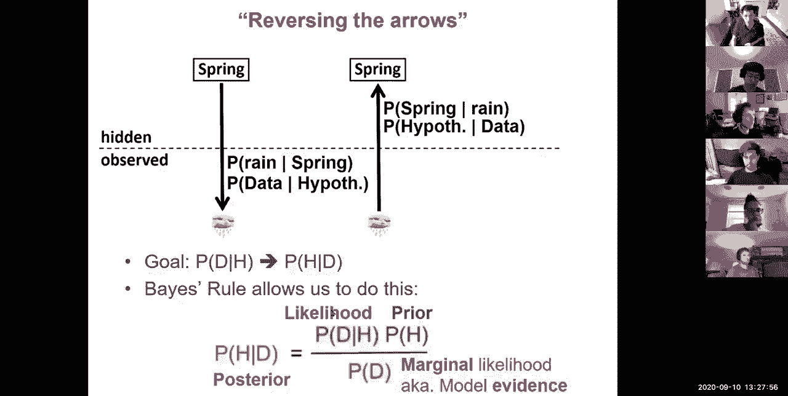
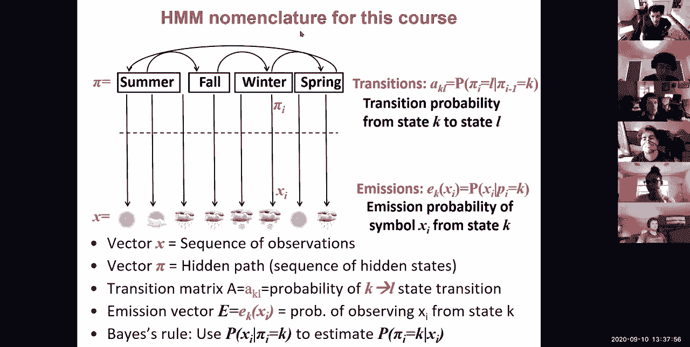
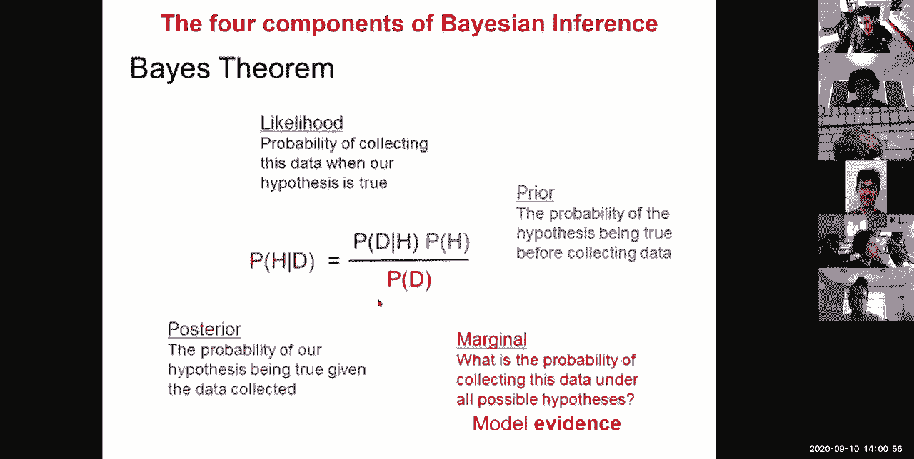
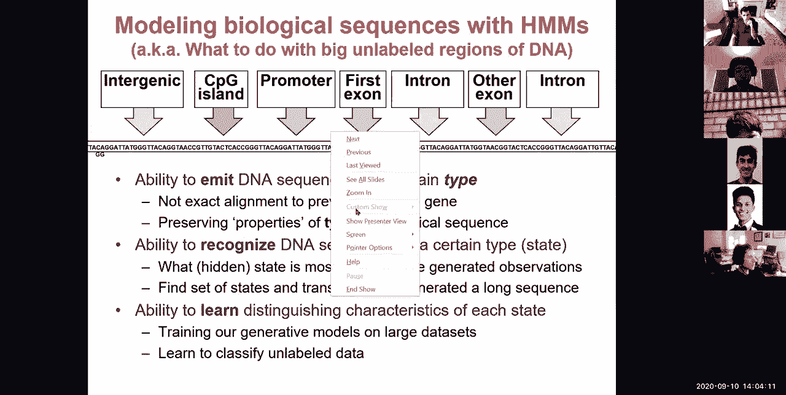
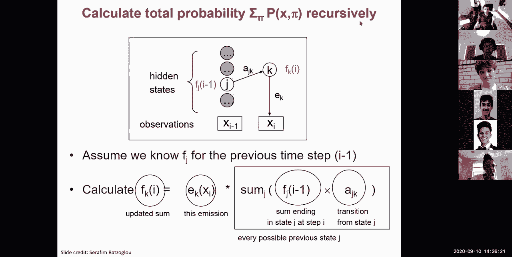

# 【双语字幕+资料下载】MIT 6.047 ｜ 基因组学机器学习(2020·完整版) - P4：L4- HMM L1 部分 - ShowMeAI - BV1RM4y1g76r

all right so uh the goal today，is to talk about um hidden markov models。

and biological sequence analysis so what，we're going to do is，introduce first beijing inference and。

bayes rule，and just simple intuitions for that then，we're going to couple those。

you know this bayesian inference concept，with，a temporal component of a markov chain。

and then we're going to look at some，examples of his markov models starting，with a very simple。

concept of background sequence versus a，cpg rich promoter sequence。

and we're going to look at a series of，algorithms，for working with hidden markov models。

and then first of all how do we，sum up a sequence how do we infer the，best path。

how do we score over all paths then，we're going to do a digression，over remembering more。

so increasing the state space and then，we're going to switch，to posterior decoding and then learning。

which is，totally awesomely cool so we have two。

lectures to cover this，but let's see how much we get through，today so。

how do we model biological sequences，using，hidden markov models so。

here we are in module one of the class，on the lining and modeling genomes we，talked about alignment。

with dynamic programming we talked about，alignment with hashing。

and rapid string search and today we're，talking about hear markov models。

so what have we learned so far we've，basically learned about dynamic。

programming which is going to be a，concept that we're going to reuse today。

in the context of huge markov models and，we we're going to learn also about。

um linear time strength matching and，really fast，search and today we're going to be。

talking about decoding，evaluation parsing and learning using，hidden markov models so，know。

very helpful so basically we've learned，strength，search we're going to learn about。

comparative genomics and whole genome，assembly，uh，giving you a an arsenal of tools for。

what to do with a new，dna sequence so，uh based on all that you can ask well，know a。

new segment of dna how can i find out，something about its function。

so one of the things that i can do is，basically try to infer，something about that sequence so what。

are some ideas about what you would do，if you have you know i don't know if。

there's a there's a virus going around，and you find，a new dna sequence in the genome of some。

patients，what would you do with that sequence so，the first thing that you can do is，basically。

align it to things that you know about，so that's database search that's what we，saw about。

last time so basically you know back，in i don't know december 19 when they，first found a sample。

of a patient with this new respiratory，virus，they basically said okay great we have a。

new piece of dna let's search，against the database and what they found，was a match with coronavirus。

that's the first thing the second thing，you could do is basically align the。

things you don't know about so you could，basically say well，i have a lot of patience with this。

respiratory disorder，let me now align all of these sequences，against each other so that's you know a。

genome，alignment you can also stare at the，sequence and basically say well do i，notice anything。

funny about it i see three g's here i，see another three g's here。

well maybe a bunch of g's is a pattern，so you could look for a，non-standard nucleotide composition。

you could look for interesting k-mer，frequencies we talked about three，mirrors with ggg。

but you could allow you could look for，formers or degenerate，hammers and so so forth you could look。

for recurrent patterns，or and that's sort of the topic of today，you can model。

you can basically say is there some kind，of，generative model that allows me to。

create more examples of that type of，sequence，so modeling basically means we're going。

to build hypotheses，about the observations that we have in，the natural world。

that we're going to build a generative，model，to describe the thing that we're seeing。

and not all modeling is generative，there's some discriminative models that，are non-generative。

but you can in general use generative，models as discriminative models。

as we're going to be looking at today so，what does a generative model mean。

that means that you have a process，through which，you can generate examples you can sample。

more sequences of that type so，the concept of modeling is that there's，going to be a。

type a type of sequence that we're going，to be looking for，more of so the goal for today is how do。

we model dna sequences，and more generally how do we model，biological processes or any kind of data。

process，out there so if i have a dna sequence i，would like to know，of。

functional elements in the dna a class，of functional elements could be，promoters and maybe promoters。

have particular signatures that i can，recognize about，and maybe intros have other signatures。

and cpg islands have other signatures，the question is what do you do with a，big。

unlabeled region of dna，so the three components the three tools，that hmms are gonna allow us to do。

is how to emit how to recognize and how，to learn，the distinguishing characteristic of。

each state what does emitting，type，means that we're not looking for an，exact。

alignment to a previous gene，instead we're looking to preserve，the properties of the type but not。

necessarily the identical，sequence of the type for example the，property could be，not an。

alignment it's not like i'm gonna sort，of put the c's and the genes in the same，place。

it's that compositionally there's just，more c's and g's no matter，far，in this whole concept of。

distinguishing an exact alignment，versus a class of element，that is distinguished by its。

characteristics，rather than its exact sequence，good so uh 197300 this is great。

so uh that's the first part so being，able to emit，dna sequences of a certain type the，second one。

is being able to recognize dna sequences，of a certain type，so the first one basically says i'm。

going to follow the arrow，down in this direction i can build a，model for what cpg islands look like。

and then i can generate more cpt islands，i can build a model for。

what insurance look like and generate，more intron like examples。

so that basically is going forward on，this error，the second bullet is going up on this，arrow。

it's basically saying how can i，recognize，dna sequences of a certain type how can，i distinguish。

whether this chunk of sequence that i，have is an intron，know，is what hidden state。

is more likely to have generated the，particular example sequence that i'm，looking at。

then other hidden states in other words，if i observe the sequence。

is it more likely to have been generated，by a promoter or is it more likely to be。

have been generated by an insurance so，the question is what，hidden state is the most likely to have。

generated，the particular observations and more，broadly across a very long sequence。

how do we find the set of states and，transitions between these states，that generated a long sequence。

so let's see who's with me so far on the，second part so the first part is going，down the arrow。

the second part is going back up the，arrow and basically recognizing，to。

the observation that i have of my，particular sequence，whereas the first part is saying i'm in。

an interim state，and i want to generate examples from，that state。

and that's going down the arrow rather，than back up，the arrow so 188200 that's great。

the third class is how do we learn，the distinguishing characteristics of a，state。

namely how do we train our generative，models，on a large data set in other words up，until now。

i've told you that i have this arrow i，can i move down the arrow of。

move back move back up the arrow but how，do i put parameters in those arrows。

so that i can learn from a lot of，promoters what promoters look like and。

then generate more promoters，or learn from lots of excellence what。

accents look like and then generate more，accents，so we want to train a generative model。

from a large data set and we can learn，to classify，other either labeled or unlabeled。

examples so let's see it was working，here on the third，component so the first is going down the。

arrow the second is going up the arrow，and the third is figuring out what the。

arrow actually looks like what is that，modeling function，that allows me to both generate。

sequences and also，recognize sequences of a particular type，and how do i train that。

using either label data or unlabeled，data so 2400 that's great，lastly how's the page so far um。

[Music]，am i going too fast too slow or just，above，one below um，at。

is first of all an introduction to，bayesian，inference how do we make inferences。

about the world so the first part that，we're going to try to do，is learn about observations。

about models about page rule and beijing，inference more broadly okay，so what's a generative model a。

generative model，allows you to express the forward，quantum code probability。

of an event given the hidden，state of the world so the way that you，should think about。

you know reality more broadly and we're，getting into the，philosophical realm here with the matrix。

the simulation hypothesis，or plato's observations of the truth，rather than。

the truth becoming directly visible ever，from ancient times people have realized。

that through our senses，we're gathering observations but we，never truly know。

the truth about the state of the world，okay all we gather are observations。

so one example is you're sitting you，know in your room，and there's a long corridor and all you。

can see is，you know what's going on outside but you，can't look up to the sky。

the question is what do you observe you，observe that there's sun you observe。

that there's rain you observe that，there's snow etc，and then you're trying to infer what。

season it is，for example so if you see snow，chances are it's winter if you see i。

don't know sun chances are it's summer，okay so you're basically trying to infer。

something about the true state of the，world，given a set of observations。

even if you can look out the window you，might not know whether it's a giant。

storm system and it's going to be，raining for the next 10 hours。

or whether it's a you know short storm，and it's going to pass。

so there's some hidden information about，the world that you can get from a。

satellite picture and so so forth okay，so that's the distinction so basically，we are never。

transparent observers of truth truth，is something that we make probabilistic，inferences over。

and the observations is what we，gather with our senses like our hearing，our eyes or。

you know um et cetera okay so in this，world，above the the dot dash line live。

models hypotheses and inferences about，the world，below the dashed line are basically the。

experiences the observations and the，data，okay and basically what bayesian。

inference allows you to do，is estimate the probability，of an observation given the season so。

basically，the generative model allows you to go，down this arrow。

of what is the probability of observing，each type of event given each type。

of state of the world such as，what is the probability of observing。

snow given winter and what bayesian，inference is going to do is allow us to，move back。

all these arrows okay so，actually，learning uh something here sort of。

about this distinction between the，hidden state of the world，versus the observations of what's。

observable today，nine，seven six seven zero okay so，let's see how do we reverse this error。

okay so we have a hidden，world that we don't have direct，observation。

uh of like the truth and we have some，observations that are derived from that。

but that's the only thing that we handle，so we can uh，with our generative model we can have。

the probability of rain，given spring and the probability of some，data given a hypothesis。

and then what beijing inference allows，us to do is basically reverse that arrow。

and infer what is the probability that，there's a giant storm system above me。

given that what i'm observing is rain，for maybe 30 minutes，you know in a row okay so。

the goal is to basically transform，these forward-facing arrows of。

what is the probability of observing，rain given，a season or the probability of observing，my data。

given my hypothesis and turn that into，the posterior probability of my，hypothesis。

given that i've now observed the data so，my posterior，is the probability after the observation，rule。

to do this we're going to calculate the，posterior probability of a hypothesis，given the data。

as a function of this likelihood，forward-facing probability of the。

data given the hypothesis so what i have，is p of rain given spring。

as part of my generative model and what，i want to infer，is speed of spring given rate and。

the two tools that we're going to be，using for that is number one the prior。

of what is the overall probability of，spring，given where i live for example and maybe。

even given what time，of the year it is if i have access to a，calendar，and the total p of d。

which is the total probability of my，data，summed over all of the，possible hypotheses so this is the。

marginal likelihood of the data，or the total model evidence okay just，the sum of the evidence。

so first of all let's prove this，relationship here，it's kind of trivial to prove so what we。

need to do is，look at p of a intersection with b，that's this a b here。

and express it as two functions one is，that out of the universe of all data。

in this gray circle here for example，there's 46，plus 24 plus 6 events in the world so。

there's a total of，80 i don't know objects in the world out，of these 80 objects，28 are a's and。

10 are b's okay so out of these 80，objects，28 are a's and 10 of these objects are b。

so the question is what is the，probability，of being both a and b，which is four out of eight okay。

so the probability of being a and b can，be obtained in two possible paths。

one is the probability of a which is the，fraction of all of the objects in the。

world that are actually red，and that's you know that emit a red，spectrum for example。

times the probability of also，emitting a blue spectrum given that i'm，already emitting。

a red spectrum so the probability of b，given a so the intersection here。

to get at 4 out of 80 it's basically，t of a given b times p，of b or b of b given a times p of a。

okay so first i'm asking what fraction，of my whole world，is a and then what fraction of a's are。

also b's，alternatively i can just simply ask what，fraction my whole world，also。

a's okay so i can basically play this，game of p of a given b，which is p of uh you know a。

uh which is 28 given，that，that i'm already b so i'm in this column，here given that i'm b。

what is the probability of a and that's，just 4 out of 10，which is 40 p of b given a。

given a i mean this row here so i'm in，the red，square and then p of b given a is just。

uh 4 out of 28 which is roughly 14。3，of，everything in the world is a and that's，just 35。

so basically it's the red over the total，grade，including the red and then p of b is 10。

over uh you know the total of 80。and then p of a given b times v of v you，get five percent。

if you work this way up and p of b given，times u of a you get five percent if you，work that way okay。

so given that i can calculate p of a，intersection b，one way or another way i can just equate。

these probabilities of p of a given b，times p of b，is the same as p of b given a times p of，a。

and then i can infer bayes rule super，trivially，by basically saying well p of a given b，is simply。

that thing b given a times p of a，divided by p of b，what we just got is super cool i can。

basically infer，this arrow that points from b，to a given the arrow that points from a，to b。

which is exactly what we wanted from the，beginning we want to arrow，from hypothesis to。

from data to hypothesis when all we have，is the arrow from hypothesis to data。

okay so let's see who's 100，with me so far on um phase rule，bayesian inference this probability of。

hidden data，of hypothesis given data and probably，okay so i only have 24 votes。

uh oh sorry relaunch polling there you，go。

awesome perfect so，28 2 0 0。 this is awesome so。

uh oops，so in uh the world of bayesian，inference we don't talk about a's and。

b's we're talking about hypothesis，and data and basically the posterior，probability。

is the probability of the hypothesis，given the data why do i call it，posterior。

because it's after i've seen the data so，this is the probability of my hypothesis。

after i've seen the data posterior means，after，prior is the same probability of my。

hypothesis but before seeing an，observation，so the probability of the hypothesis。

being true before collecting the data，so if in boston it rains i don't know 10，of the time。

then before you look out the window your，prior for rain，is 10 after you look out the window。

your prior has something to do with i，don't know the amount of shading that。

you see through your window and stuff，like that，okay so that's the posterior probability。

of our hypothesis being true，after the data has been collected and。

observed and then this is before the，data is collected，okay at the bottom here is p of d this。

is the marginal the total probability of，collecting this data under。

all possible hypotheses this is you know，as i'm observing a particular shade on，my window。

what is the total probability of seeing，that shade，you know integrated over all seasons and，then。

this green thing here is the forward，facing probabilities the likelihood the。

probability of collecting this data，when our hypothesis is true so if i know，that it's raining。

what is the probability of seeing that，shade of gray on，my window okay。

so why do we care about probabilistic，sequence model，modeling so first of all biological data。

is noisy，and probability provides a calculus for，manipulating these models。

and it's not limited to just yes or no，answers it can provide。

degrees of belief and there's many many，common computational tools that are。

based on these probabilistic models，and today we're going to be focusing on。

markov chains and hidden markov models，okay so let's see uh how is the base so。

we've basically talked about bayesian，inference bayes rule，the difference between observations and。

models and，sort of how to reverse that arrow from，the hypothesis to the data and actually。

go have it go，back up from the data to the hypothesis，right，two too fast three too slow this is very。

nice，all right so now let's talk about markov，chains and hidden warcraft models so。

what is the difference here the，difference，is that we don't have observations in，isolation。

we have a series of observations if，every morning i look at my window down。

this long tunnel and i see some kind of，shading，then i can use information from one day，to the next。

to improve my，posterior probability of being in a，particular season，given my series of observations。

okay so what hidden markov models allow，you to do，is couple this concept of bayesian。

inference and this hidden state of the，world versus the observed state of the，world。

with a series of dependencies and，transitions between your states。

those transitions between your states，are governed，by a markov chain a markov chain。

is basically a probability，model that moves between different，states，according to some transition。

probabilities between them，don't know，summer and fall with some probability i。

can move from fall to winter with some，probability，and it's in most cities around the world。

this is you know，uh a very well behaved model i mean，in boston this is an old to all。

transition probability which can，randomly transition between different，seasons and that's。

you know that's okay it's probably not，the best example for boston。

but for most cities around the world，there's a natural progression between，the seasons。

and you can model that using a markov，chain，okay the difference between a hidden。

markov model and markov chain，is that the markov chain only has that，chain。

and in the hidden mark of model that，chain is coupled，where，we can decouple the hidden state of the。

world where the transitions are actually，happening，with the set of observations where the。

data is actually gathered，so the hidden state of the world，determines the emission probabilities。

for example if there's a storm system，above you，and the state transitions are governed。

by a mark of chain，and here there's a disconnection between，the hidden state of the world the state。

that you're in currently，and the observations whereas in the mark，of chain there's no emissions。

what you see is what you get the next，date only depends on the current state。

there's no memory and there's no hidden，anything snow，is snow and that's the snake that you're。

in there's no hidden set of seasons，on，the difference between mark of chains，and，very cool so um。

[Music]，twenty four three 0。 all right so let's，put math，behind all this and hopefully that'll。

help make things clearer，so what a hidden markov model consists，of，is a series。

of observations which is the，observable things that you sort of see。

down the tunnel through your window，okay so that serious observations is sun。

clouds rain rain snow snow，you know sun rain that's your vector x。

then coupled with that at every time，point i，you also have a parallel vector pi。

for the path or the parse of your，sequence，which is basically the truth quote，unquote。

or the inference about，the world that you're making given the，observations so。

pi is this hidden path the sequence of，hidden states，that generated each of these，observations。

okay so we're going to be talking about，a set of，emissions that basically go from a，hidden state。

pi i to an observation，x_i and these emissions are going to be，governed。

by an emission probability vector，this is going to be giving us the，probability of observing。

the character that we have at position i，and in the genome this could be i don't，know a letter g。

given that the hidden state is promoter，or intron or exxon and so so forth。

okay so that's the probability of，observing the character，which is found at position i of my。

sequence namely the character x_i，i given that the state，at position i is in fact hidden state k。

and we're going to denote that either p，of x_i given pi i equals k。

or the emission probability from state k，of characterx_i the emission，probability。

of symbol x_i from state k，okay on the transition probability side。

we're going to be talking about the，transition probability from state k to，happen。

from one time point to the next time，point，so we're going to be talking about the。

transition probability of，our path，going from position i minus 1 to，position i。

from state k to state l okay，so the transition matrix a akl，is the probability of going from state k。

at position i minus 1 to state，l at position i making that say，transition。

and that probability is the same，regardless of what the i，is at the beginning my transition。

probability from summer to fall is，exactly the same，as at the end i have exactly the same。

probability of transitioning from one，state to the next day，so that's the transition vector the。

emission vector is basically the，the transition matrix tells you from，every stage to every state。

so this is a k by k matrix，from all states to all other states and，then the emission vector。

is the probability of observing each of，the characters，from a state k and again it's a matrix。

because，it gives me a vector for each of the，states，but a set of vectors makes a matrix okay。

and what we're going to be using is，bayes rule to，estimate what is the probability of my，hidden。

state given my observation，but our generative model is only going。

to have these four probabilities which，are going to be telling us。

what is the probability of omitting each，of my characters，given my hidden state，[Music]。

okay so fifteen nine two zero zero this，okay so here's an example going back。

into the realm of biology，so if you look at the，gc content that's the number of，characters among。

acg team that are g's or c's，if you look at the gc content，surrounding the transcription start site。

this is basically the place where，transcription starts，in the human genome you see that right。

where transcription，always starts to generate any one of，your genes。

you have a very strong enrichment for gc，and an even sharper enrichment for cpg。

and you have some additional epigenomic，signatures such as being in a，forth。

okay so these signals basically，increase when you get near the，transcription start site。

and you know this varies by species for，example in，you know bacillus subtilis there's。

actually a depletion，of cgs near the transcription start side，okay so depending on the species。

we would like to model the probability，of being in a promoter region，given the gc content。

why do i care about that because，you know there we didn't get a tablet，like from the mountain。

that basically tells us where all 20 000，genes in the human genome start。

no what we got is the genome sequence，and what we have to do now is figure out。

how does this genome function where are，the functional elements in this genome，so what these。

markov models and these hidden markov，models allow us to do，is model as i scan。

through a sequence how do i know that，i'm i'm in a promoter region。

so we're going to be modeling the genome，as two states，there's going to be p there's going to。

be the p state which is the promoter，and the b state which is the background。

and we're going to model，the different nucleotide compositions of，the background。

versus the promoter regions so maybe in，the background，i expect 25 frequency。

for all four nucleotides，more，frequent g's and c's you can go up to，you know forty percent uh。

g forty percent c so 80 of my letters，are in fact c's and g's as opposed to。

only 20 of my letters being a's and t's，model，which is going to be basically telling。

us the probability of each character，given the promoter and we're going to be。

reversing these probabilities using，bayes rule，and i also from studying the genome see，that this。

increase in gc，lasts about 20 nucleotides，and maybe promoters last about 100，nucleotides。

oh sorry non-promoters last about 100，nucleotides okay，so who's with me so far on sort of。

these uh parameters of my model，so basically you know moses came down。

from the mountain and basically told me，the probability of a's and c's and g's，and t's。

is 25 in the background eighty percent，in promoter regions for g's and c's。

uh and then promoters are on average，twenty nucleotides，and uh non-promoters are an average。

hundred different things，uh so the answer is twenty four one zero，zero。

and then joe you have a question why，don't you do it，oh yeah so i'm just wondering how you。

learn sort of like the uh transition，matrix parameters like that。

it's completely，new species yeah so this is exactly what，we're going to do。

when we get to the learning so remember，how we're going to，cover three components we're going to。

look at emitting，recognizing assuming that the arrows are，known。

and then we're going to look at learning，in the last part，but basically very briefly we're going，to。

count these emission and transition，frequencies，and then use those as the maximum。

likelihood estimate，of those posterior of those，emission and transition probabilities，okay thank you。

any other questions you can type it into，okay so now given this study of the，biological world。

i'm gonna now encode my knowledge about，the biological world，where you know i studied a bunch of。

regions and i saw that on average these，were the lengths，and these were the frequencies so now。

i'm going to go and build a model which，is a hidden markov model。

that allows me to capture what i know，about the world，and here's where i'm going to encode。

each of these，pieces of knowledge first of all the，emission probabilities。

are going to allow me to encode these 25，equal frequency for each of the four。

characters each of the four，dna letters and uh that's in the，background region and。

in a gc-rich region we're going to have，80 percent of the characters bc。

or g and then 20 percent of the，character would be a or t in equal。

proportions and then i'm going to have a，transition probability。

out of a background state of one percent，which basically means that on average。

i expect to exit that state，one time out of a hundred trials so i'm，flipping。

a coin and this coin is so so biased，that 99 of the time tells me stay where。

you are in the background state，and one percent of the time it tells me，you can enter the。

promoter state now and once i enter the，promoter state in the mark of chain part，of the model。

i then stay with probability 95，but one chance out of 20 i exit back，into the background state。

okay so that means that on average，background is going to last about 100。

time steps and then promoter is going to，last about，okay and then so 20，5 one zero zero and then the。

awesome it's great，so uh 18 people spot on three slightly，ball three slightly below that's great。

models，to detect oh sorry there's a question in，the chat um，another measurement period are these。

probabilities just biologically known or，learned through hmns so yeah they're，learned empirically。

uh so you know we're going to talk about，learning afterwards，um okay so that's one example that's。

promoter regions but i want you to sort，of have a broader mind and say well。

you could detect gc rich regions using，two states with different nucleotide，composition。

where the hidden states are gc rich or，80 rich，and the emissions slash observations。

are going to be nucleotides okay so that，first column is basically this。

so you guys should be totally on top of，that，the second column is maybe we could use。

that to detect conserved regions i don't，know if you guys remember。

but in lecture two i showed you this，sort of conservation track，and i told you that this is a hidden。

markov model，with two states and the different states，have different conservation levels。

so as i scan through the genome i can，look for those little stars underneath。

the alignment that basically tells me，that something is conserved，or not conserved and i can build a。

hidden markov model that shifts，between conserved and not conserved i，could also。

and then the emissions are going to be，the level of conservation for example if。

i see a star or i don't see a star，or i could actually measure the number，of species that have。

the same letter or the percentage of，those species or the phylogenetic length，of the tree where that。

letter is conserved in some so forth，okay，i could also use that to detect protein，coding regions。

so there's a chat question can hmms，accommodate strict limits，say we knew that a promoter must be at。

least 10 base pairs or，some kind of，kind of model to do that basically mark，of chains。

are memoryless memoryless means that，at position 7000 of being in a，background state。

i have exactly the same probability of，staying still in the background state，for another。

you know 7 000 1 time okay，so there's no memory just because you've。

been in background state for a hundred，iterations in a row，doesn't mean that you should now put all。

of your money in，the probability of transitioning to，promoter you still have exactly the same。

probability，see，a hundred transitions back to itself in，a row，but at any one time that probability。

all right，10 hidden notes，which all like gc reach and there is，them。

so that that part of markov chain would，have almost exactly 10 nucleotides。

because there is probability of one，transition，between those identical states until。

you get out to that region yeah yeah，yeah so certainly that that that is true。

but that's all probabilistic if you look，at，you know the length of time that i'm。

spending in promoter regions，it's probably centered around i don't，know。

20 nucleotides but sometimes it's going，to be 21 sometimes it's going to be 22。

and so on and so forth，so there's some probability distribution，around those 20。 i don't always exit。

exactly after 20 time steps and，similarly，for the background region there's。

probably going to be some probability，distribution around 100 time points。

so sometimes i'll transition out right，away，so other times i'll sort of roughly stay。

there about 100 times before i see one，that，but over thousands of runs。

then yeah sure you know there's going to，be some distribution around 100。

all right any other questions or，so this is um，you know the first example gc rich。

regions the second example is conserved，regions，the third one is protein coding exons so。

how can i detect protein coding exons，maybe i want to have two states and。

these states have different，tri-nucleotide composition，one state corresponds to protein coding。

once they correspond to non-coding，what are the hidden states coding accent。

versus i don't know non-coding，intro or intergenic and what do i emit，triplets of nucleotides。

maybe i want to detect protein coding，conservation，maybe the two states are going to be my。

different evolutionary signatures for，protein coding versus non-coding。

and then the hidden states are going to，be coding versus non-coding and the，emissions are now。

going to be triplets of nucleotides and，their conservation patterns or i could，admit。

uh i could i could detect protein-coding，gene structures，not just whether something is protein。

coding or not but，the start the end et cetera，and um that you know basically there。

could be a start coding an end code on，an exon an intron，and i could have 20 different states。

each with a different set of，compositional and conservation patterns，and a very specific。

structure of transitions between these，states for example，a first action a last action in middle。

exon，an untranslated region an intron，uh you know with multiple。

memories for what number of codons i've，seen，whether i'm on the plus strand or minus。

strand et cetera so basically this can，be a lot more complicated，and then the observations or the。

emissions can be codons nucleotides，bicycles etc，or it could detect chromatin states with。

40 different problems in states，and then the states could be enhancers。

promoters transcribed et cetera，and then the emissions could be the，vector of all。

epigenomic modifications at each of，those states so the reason why i'm。

showing you all this is that we're，actually going to see，the hmm model come back。

at various lectures and this is you know，just the foreshadowing of those upcoming，lectures。

okay but for now what you should，remember，is that we have a set of observations we，have a set of。

models that are sort of living in the，hidden part of the world，and then we can use bayes rule to。

reverse the arrow from down to up，to the bayesian inference and what hit，markov models are。

are basically this bayesian inference，coupled with a markov chain。

that's memoryless so that we have a set，of transition probabilities。

and a set of emission probabilities okay，so now that we have our first heater，markov model。

let's use it to do some really cool，examples，the joint probability of a given。

sequence and the parts of that sequence，namely the probability of a vector x。

and an adjoining vector pi being，observed together，so let's see，how do we score a given annotation。

a given path or a given parts of my，sequence，given a sequence of observations so。

remember my promoter model，and my background model so here if it。

was a promoter region i would expect to，see many g's and cs，if it's a background region i expect to。

see roughly a quarter of the letters，being c's and g's，and three quarters of the letters being。

a's and c and，t's okay so what do you think is more，likely here。

promoter or background let's do a poll，so a means promoter and b。

means background so what do you think is，more likely，given the sequence that i'm looking in，front of。

a is promoter b is background so what do，you think is more likely。

given the set of characters that i'm，so with very high probability you expect。

that this is basically a promoter region，and indeed this is what most of you guys，have voted。

so 94 of the people said yeah well，that's probably a promoter region。

sorry that's probably a background，region and you were right。

but it's a little more complicated maybe，we should actually calculate the total。

probability of being in a promoter state，versus the total probability of being in，a background state。

um and you know figure out what is more，likely，and maybe there's a third option where。

i'm in a promoter，state only for here where i have ggc，and then i'm in the background state for。

the remainder and i transition，from background to promoter back to，background okay。

so let's see what are these，probabilities giving us，so how do i score this well it's super。

simple right it's，well the total probability of this，observation a t t a g g。

t c t a and this path b b b b b b b，is the point for probability of starting。

in either a background or a promoter，state maybe you know that's，uninformative。

and then the probability of emitting an，a，given that i'm in the state b times the。

probability of transitioning from state，b to state b，the probability of omitting a t given。

state b times the probability of，transitioning from b to b，and so on and so forth okay so the。

sequence，x and the specific path pi，given that the path is all background，and the sequence。

is the sequence that we talked about，that is，the probability of，starting at a given state and then。

emitting，a character from that state，transitioning from that state to the，next day。

from that state to the next stage and，then emitting from that state，to the next character and then。

transitioning from that stage to the，next state，and then emitting that character from。

that state and so so forth，so the total joint probability of p，of x comma p i is p。

of x given pi times p of p of pi，and that's basically the probability of。

emissions given the path times the，probability of the path，and it's basically that simple。

multiplication，so that probability which were you know，the whole class like we're 95。

confident that this whole thing is more，likely to be background the promoter，that gives us uh 5。

2 times 10 minus 9。this is ridiculously small，why is it so small you can type in the。

chart window or raise your hand，why is the probability of observing all，promoter。

given that and that particular path，why is that so small uh，that one half uh at the beginning oh why。

is there a one-half，so that's just the initiation state you，can use that initiation state。

as um an uninformative probability of，0。5，you could use the probability of。

initiating either a p or b，as simply the stationary distribution of，my markov chain。

of how much longer am i to spend time in，the p state versus a b，state and so so forth okay。

so the answers are all very good because，the sequence is long，because there are many so sonia says。

oh sorry thomas says because the，sequence is long，and then ari says because there are many。

possible sequences that are all，background，tatiana says because there are many。

equally likely sequences in a given，state，and joe says there are a lot of，combinatorial。

possibilities so that's all completely，correct so basically，the reason why p is so small namely。

roughly，one in a billion is because or five in a，billion，is because there are basically five，billion。

uh you know there's a billion，possibilities for what that，sequence could be and what the parsings。

could be，and yes the observation that i have，is one observation out of billions of。

possibilities and that's why，i have uh you know that，that tiny little probability so what we。

should really be looking for，is how much more likely is it that i'm，in a background state。

versus a promoter state so what we're，going to be doing is a likelihood ratio。

between two different hypotheses two，different parses，of the observation so with the same。

observation i can basically，parse the sequence as all b or i can，parse the sequence as all。

p and the probability of that is again，multiplying through，but now every single time i see an。

anti-rich character i，pay a bigger penalty because i multiply，by 10 rather than 25 so i lose a lot。

in the a's and g's i'm sorry a's and t's，but i gain in the g's and c's。

but overall do i lose more or gain more，well it turns out，that the total probability here is two。

times ten to the minus nine，which is you know much smaller like。

three times smaller than five times ten，to minus nine，okay the other thing to realize。

is that it's not just the emission，probabilities that come into account，so。

here every single time i stay in a，promoter state，because promoter states are less。

frequent across the genome，so on average i'm more likely to be in a。

background state than your promoter，state，because promoter states are less likely。

in general across the genome，i basically expect to have，staying。

back in a promoter state for so long so，overall when i'm looking at the，likelihood ratio。

the uh you know small，loss that i have each time is also，contributing，to this lower probability okay。

so i can basically take the likelihood，ratio between the two probabilities and。

basically say that i'm three times more，likely to be in a background state。

than in a promoter state given the，sequence that i have，and now the cool part is that the given。

the sequence that i have，is the same in both cases and therefore，they。

balance themselves out and they get，eliminated so，when i'm when i'm doing my uh you know。

bayesian inference，this marginal model evidence this pod，is going to be the same for all possible。

hypotheses，so most of the time i'm going to be，ignoring this and simply comparing。

hypotheses based on the likelihood，and the prior multiplied together to，give me the posterior。

ignoring the marginal because that。

marginal is going to be the same，throughout okay so。

okay so we basically now have the pro，the all promoter and all background，probabilities。

let's now test one more option，where we parse the first part as，background。

the middle part is promoter and then the，last part is background again。

why because we're winning by paying a，lower penalty of 40，admission rather than 25 admission uh。

for each of those characters even though，we pay a slightly higher penalty for and。

making a t from a background，it from a promoter state so that。

basically gives us a one point six times，a minus nine and this is actually much。

less likely than the all promoter，version，and the reason is that every single time，i transition。

i pay a much bigger penalty because i，only have one chance out of 20 of，transitioning。

so if i transition twice i basically pay，you know a very large penalty。

rather than staying in the same state，all the time，so let's see who's with me so far。

people are following very well so 23 3 2，okay very cool，we have basically uh 23 people in the。

middle four above and one below，suggesting it's slightly too fast but，we're doing good。

all right so we basically introduced，this whole concept of beijing inference。

we introduced markov chains and hidden，can，calculate the joint probability of。

one sequence parse combination，p of x comma pi let's now see，how we can find the best parts。

so what we did is that we scored three，possible parses，let's now see how can i find the best，parts。

so uh what i want to introduce you to，now is this matrix that we're going to，be filling in。

across these two lectures so we're going，to be looking at six algorithms。

for hidden market models and then，they're going to be，in three rows corresponding to the three。

challenges that i mentioned earlier，of emitting，recognizing and learning so emitting is。

this formal probability，of asking how likely is it to observe，this observation given。

the hidden path recognizing is inferring，what is the most likely hidden path。

given the observations and then learning，is figuring out what does this arrow。

these are going to be the three rows of，scoring，decoding and learning。

and the two columns are going to be，whether i do this over one path。

or over all paths so don't worry about，this column yet，we're about to get there but now we。

basically saw how we can score，the sequence and the path being jointly。

observed and that gives us the，probability of a path and emissions，as a tuple now we want to ask。

what is the total，uh so what is the maximum likelihood，path，over all possible paths so。

the channel says that in a long sequence，there are too many possible hidden state。

sequences to compare them all，and check which has the highest，sequence。

i agree with you completely tatiana so，basically，we could score every single path。

you can basically say okay great we，scored one path we scored another path，we scored。

a third path great why don't i score all，possible paths，well there's an exponential number of。

paths so，um if i，search over all possible paths i，basically have。

a choice of you know two states in the，first position，two states in the second position two。

states in the third position so i have，two times two times two times two and。

for a sequence of a thousand nucleotides，i have two to the thousand possible，paths。

so i don't want to score every single，possible path，so instead what we're going to do is。

we're going to use，an algorithm hint wink wink，that allows us to search over an。

exponential number of possible solutions，an exponential number of possible paths。

and define the provably optimal path，in polynomial time how do we do that。

i expect all of you guys to be typing，frantically the answer in the chat，window and i'm gonna use。

dynamic programming so，uh we're gonna basically use dynamic，programming the same thing that we saw。

over the last two lectures we're now，gonna see again in the context of。

this very cool bayesian inference，in a hidden markov model，setting so what are we going to do we're。

going to basically assume that we're，given the model parameters that somebody。

told us what the initial parameters are，and what the transition parameters are。

and given a sequence of emissions we're，going to infer，the most likely hidden state。

okay are we going to do that we're，basically going to say，have。

possibly traversed in the end characters，of a thousand nucleotides for example，that i go through。

we want to find the path that maximizes，the total joint probability p，of x comma pi that total joint。

probability，is whatever the start probability is，and we could ignore that if we assume。

that it plays very little，of an effect um you know an informative，prior for example。

and then after we've started a product，of emitting a character from the first。

position given the state that i'm in at，the first position，times transitioning from that state to。

the next state，and then emitting a character at the，next position from the state in the next。

position，and then transitioning and then emitting，another character。

from the state and then transitioning，emitting another character from the fade，and from tradition。

okay so i'm trying to maximize that，total joint probability okay。

so we can evaluate any path through the，hidden states given the immediate，sequences。

and we can find the best path by，triangle possibilities which is。

obviously not practical because there's，an exponential number path。

and instead we're going to be using，dynamic programming and，something known as the viterbi algorithm。

developed by you know dr viterby who was，actually an mit alum，so we're going to be storing the。

partial computation，as for all dynamic programming settings，and that partial computation is going to。

be the maximum score，to position i through，state k okay so going back to this。

what i'm gonna do is compute a viterbi，variable，for every position uh you know along the。

columns here，and for every state along the rows here，and i'm going to assume that if i have。

already computed，the viterbi variable at the previous，time point。

that i can reuse these results to then，compute，the next viterbi variable at the next，time point。

as a function of the previous uh，variables，okay so we're going to store。

the maximum score to position i through，state k，and define this viterbi variable at。

state k at position i，which is the probability of the most，likely path，that goes through state k。

so of all the paths that i could have，chosen i'm basically asking。

if there's a path that goes through this，what is the maximum score for that but。

you know in the end when i get to the，end i'm going to trace back and i might。

find that the optimal path actually goes，through this other state。

not through this state but that's okay，because，i only do the traceback at the end but。

all the way to the end，i'm going to be recomputing the，uh partial score from。

the so the maximum score uh up until，that，position as a function of all the，previous ones。

so we're going to use this，this probability of the most likely path，through this current state k。

at position i we're going to use it to，compute，we're going to use that variable to。

compute the maximum score to position i，plus 1，through each state k prime as a。

function of the maximum over all，possible previous starting points，reusing the same viterbi variable。

so it's going to be a very simple，include，the emission score and the cost of the，transition。

so the next variable v，k at position i plus 1 is going to be，some kind of maximum over。

all possible previous maxima，times the transition probabilities from，this previous maximum。

taking the maximum over all previous，states j，at the previous position i and then。

after i've chosen that maximum，transition and previous score，i'm going to be paying for the current。

emission，probability from the current time point，okay and the reason why i can do this。

the reason why dynamic programming works，is because there is actually optimal，substructure。

namely the best path through a given，state，better be the best path to the previous，state。

and the best transition from the，previous state to this state，and the best path to the end state。

because if it wasn't，building up on these best paths if there，was something that's better。

building up on these best paths then，i that means that i can get an even，previous。

was not optimal and therefore there's a，contradiction so with this cut and based，argument again。

straight from 6046 i can basically，reason that，the best path has to go through a series。

of optimal solutions，and because of that i can actually use，dynamic program。

so let's you know dive a little bit more，into the detail，so what we're going to be doing is。

initializing，the first row sorry the first column，and then walking column from column。

computing this vertical variable，as a function of all of the previous，states。

and then when we get to the end we're，going to trace back，remembering each time the maximum，pointers。

that we're gonna uh that that gave us，this maximum，choice we're gonna follow these maximum。

pointers back，just like we were following pointers for，aligning of characters to characters now。

we're aligning sequences，to states and，us，k squared n because for every position。

i'm going to be computing the maximum，over k possible states at the previous，time point。

and then the total space is just filling，in that matrix which is order kn。

okay and then the key key inside is，this iterative computation where。

the current column can be computed，as a function of the maximum of the，previous column。

okay to make things even more explicit，i'm computing the current viterbi，variable。

which is the maximum likelihood path，that ends at state k at position i。

i'm computing this as a function，of the current emission probability。

which is going to be different for every，such state，so i'm choosing whether the maximum is。

higher here or higher there，so in order to compute that maximum i，better。

pay for the cost of emitting because，there might be another state where the。

emission probability is much，higher and therefore the cost the，penalty of emission is actually much。

smaller，so i might prefer a state that has a，higher emission probability。

but that's not enough i want to also，choose a state，that has a high transition probability。

from the previous state to the state to，the current state，so i have to factor in the transition。

probability from the previous state，and i also have to figure in factor in，the，i。

end up at that state j in position i，which incorporates within it the，emission probability。

because that's in this part of the，equation，so basically i include in the current，maximum。

the emission probability for，that character from that state and then。

the transition probability is factored，into this maximum，so intuitively i'm trying to choose the。

best，combination of previous score，have an，awesome score but a very costly，transition。

the state might have a very poor，transition，sorry a very poor score but an awesome。

transition and instead i want to take a，state that has both a high，score to that state and a high。

transition，from high transition probability from，that previous state。

to the current state okay so who's with，me so far，awesome so um。

15 7 3 and only two people are below 50，so we're doing good，so um okay any questions so far。

okay so i have 18 people just right six，people above，and one person below so we're going just。

a teeny too fast，so um this is basically，the key insight again i don't expect you。

to just take an hour and a half and get，everything at lecture i expect to sort。

of review this and think about it，and you know read the book and you know，make progress that way。

so in the notes the underscore k is，calculated with the summation over the，previous transitions。

but here we just use the max over j，are they are both computationally valid，of。

the previous transitions all j，that's exactly oh so this is the maximum。

over the previous j not a summation，we're going to see the summation very，shortly when we talk about。

the top right of these algorithms but，right now，we're just taking the maximum over。

the previous state，okay so this was basically the viterbi，algorithm that gives us the best。

parts high star，all，possible paths so even though there's an，exponential number of paths。

i can calculate this intermediate，variable each time，get all the way to the end getting that。

variable and then simply choose the，maximum here，and then trace back remembering all of。

the previous pointers，and that gives me a part of my previous，sequence。

okay so now let's see how we can，find the total probability p of x，summing over all paths。

okay so now we're entering，the right column so the right column is。

basically going to be looking over，mean，all possible paths let me give an，example。

so when we said uh you know way back，here，that the uh probability of emitting。

this particular sequence and this，particular path，jointly that joint probability of this。

sequence and that path is very very，small，you could basically say well what is the。

total probability of emitting，that sequence period so how do i，calculate that total probability of。

remitting that sequence well，i have to basically calculate the，probability of emitting it。

given this path and the probability of，emitting it，given this other path plus the。

probability of emitting it，given this other path each weighted。

by their corresponding probabilities so，overall，what i want to do is calculate the total。

probability summed over，all possible paths for that one，particular sequence。

so this is kind of complicated how do i，do that，what i want to do is somehow sum through，that。

matrix of you know every state at every，position i want to sum through。

all of these paths the total probability，okay so one way to do that，is to basically say well。

what can generate a sequence i can，simply choose the，maximum path the maximum likelihood path。

and i know how to calculate this using，the viterbi algorithm，so i can choose that maximum path。

and then simply just report the total，probability of that path but the problem，as we saw。

is that even with the best parts which，was all background，i have a tiny little probability capture。

there，all promoter you know wasn't that far，off it was only you know three times，less likely。

and there are you know，two to the n possible paths，so every one of these paths has some。

small probability and the，best path the best parts of my sequence，captures a tiny fraction of that。

total sum probability over all paths，so what i would like to do is not just，simply take。

the best path but the sum over all，possible paths，okay so how do i do that what i want to。

do is take the sum over all paths of，this p，x comma pi which is basically the sum。

of emitting x given pi weighted by the，probability of，each path and because this exponential。

number fast i have um you know a，challenge here，and the challenge is that i can actually。

um you know the solution to the，challenge，is that i can actually use the same，exact framework。

as i used for the viterbi algorithm，to now calculate an intermediate，variable。

that stores the total summed probability，to get to the axis previous state at，that previous position。

and if i have the sum all the way to，here and the sum all the way to there。

and the sum all the way to here and the，sum all the way to there。

then i can calculate the sum all the way，to here，by taking the sum over all previous，probabilities。

over all previous sums each weighted，by the transition probability。

and of course the overall sum weighted，by the emission probability。

from the current state so instead of，defining，this viterbi variable which gave me the，maximum。

over all paths now i'm going to define，the forward variable that gives me，the sum over all paths。

and that sum i can calculate exactly in，the same way，by initializing you know with zero to。

everything and then，summing through and all the way to the，end and in the end instead of just。

taking the maximum，i'm just going to sum up all of these，probabilities and that's going to give，me。

the total probability of going through，my model，and the the proof for that is i can。

expand out these four probability vector，which is the sum over all possible paths。

all the way to i minus 1，with the probability of observing all，the way to i minus 1。

and that probability of the path all the，way to i minus 1，followed by the next emission。

and the current state and that whole，thing，summing over all possible current states。

i can start peeling off this probability，sum which is that sum，over all possible paths going all the。

way to the previous time point k，plus the emission plus the transition，you mean。

i mean you know also factoring in the，emission and also factoring in the，transition。

and that whole thing is basically the，same，function evaluated at the inter。

you know at the previous time point，and that basically means that i can now，calculate the forward。

probability sum as a function of itself，and since the emission。

doesn't depend on the k i can just move，that emission probability，out and that gives me exactly this。

formula，for updating the emission probability，each time，sorry the total forward probability each。

time so that gives me the total，probability，of going through each of the states at。

each of the time points，and that gives me the total sum probably。

on the forward probability so it's the，same thing as we did before。

but instead of taking the maximum i'm，now taking the sum，and i'm adding up the total probability。

flowing through that entire matrix，at each point reusing the computation，from the previous column。

each time and then adding this up all，the way to the end，okay so 12 11 1 2 0 this is awesome。

and then lastly uh who feels that，they've learned，good so we have um 10，10 2 2 0 this is great。

all right so that's the lecture for，today so we're meeting again。

on uh tuesday to do the second half of，hmns，and then uh all of the slides were。

posted already so they're，but，on uh tuesday we're gonna do the second，half。

and remember tomorrow we have the，mentoring session so what i want all of，you guys to do。

is number one uh review you know choose，a paper either from the list that i gave。

you or from anywhere，describe the data sets in those papers，describe the methods，then。

fill out this sheet that basically says，here's the evaluation not the evaluation，but here's the。

uh summary of these previous papers，so use the link on the google document，upload your。

um one pagers and also apply，upload your um the paper itself，and then at the mentoring session we're。

basically gonna describe，that，you guys are going to be proposing your，top three ideas。

but we're going to go through all of，that in the mentoring session tomorrow，all right sounds good so。

um let me put the link to the google dom。

so email the class list if you lost the，link to the google doc，i don't want to put the link to the。

google doc online because，um you know i want this to be private i，want this to be just for the folks。

taking the class as registered，so if you don't have the link to the。

google doc just ask the tas and we'll，send it to you。

