# 【双语字幕+资料下载】MIT 6.047 ｜ 基因组学机器学习(2020·完整版) - P5：L5- HMM L2 部分 - ShowMeAI - BV1RM4y1g76r

on this computer okay cool so uh today，is lecture five，and it's the second half of modeling。

biological sequences with hidden markov，models，so just to recap where we were so。

what we did last time is that we covered，hmm basics，evaluation parsing and posterior。

decoding we looked at，observations models base rule and，bayesian sequencing and bayesian。

inference basically the key idea，is that we're now going to be able to，model。

rather than just simply align and the，way that we're going to be modeling。

is by having three tasks which were the，rows of our matrix，the first task is the ability to emit。

dna sequences of a certain type，so basically creating uh，sort of emissions from different classes。

of elements，the second one was to recognize dna，sequence of a certain type so now。

if you see the sequence can you infer，what is the，hidden state that most likely gave rise，to it and。

today we're also going to be learning，about how to infer，the probability distributions of those。

and what we uh did was to，uh separate the hidden from the observed。

and then the hidden was the model of the，inferences we make about the world。

and then the observed was uh you know，what we actually observed，and we uh looked at how we can use。

bayes rule to effectively reverse the，arrow，of directionality of those conditional，probabilities。

instead of saying what is the，probability of the data given the，hypothesis which is what our。

generative model gives us we basically，wanted to know，what is the most likely hypothesis given。

the data，and we did that using bayes rule where，we calculated the posterior probability。

using the forward probability the，likelihood，and scaling that by the prior and then，dividing。

everything by the evidence or the，marginal so，p of d and then we did a very simple，proof of um。

phase rule namely uh，given that p of a given b sorry，a intersection b can be given as a given。

b times p of b，or b given a times p of a we can just，infer，p of a given b as a function of p of p。

given a by scaling by p of a，and then dividing by the marginal and。

then this is the actual numbers of how，it works out，uh so um what hmms did。

is couple this bayesian inference with，a markov chain at the top that govern，the transitions。

and then we talked about the x vector of，the observations and the pi。

vector of the path or the parse the，hidden interpretation，of the observed emissions。

we talked about this emission vector，which basically is giving us for every，state。

the probability of omitting each of the，characters that's the probability of a，given character。

given the state and about the transition，probabilities which is。

given the previous state at position i，minus 1 is k what is the probability，with which。

the next state will be l okay，and then we saw a very simple uh hit，markup model。

detecting background sequences versus gc，range promoters，based on differences in their。

nucleotide frequencies and differences，in their，transition probabilities between。

we saw how we can calculate the total，probability of that model，uh given a path and a set of。

observations，and how we could basically parse this，sequence att，agg tcta in two ways either all。

background，we saw that all background gives us a，probability，of 5 times 10 to the minus 9。

all promoter gives us a probability of，2 times n minus 9 and therefore the，electrical ratio is。

indicating that this is much more likely，to be all background，we also saw that the cost of。

parsing as background here and then，promoter here in the background here。

in order to capture the gc richness was，in fact not worth it because of the very。

low probability of making two，transitions within four steps of each，other。

we then saw that calculating each of，those would take forever because it's an。

exponential number of possible paths and，we defined，the viterbi algorithm that allows us to。

now infer the maximum，likelihood path over taking the maximum，over all possible paths and then。

selecting，the best path so this is a single path，column again，where we're choosing the most likely。

path and how did we do that，we did that using dynamic programming by，defining。

this viterbi variable that allowed us to，express the maximum possible probability。

over all possible paths ending at that，state，as a function recursively of smaller，subproblems。

and the smaller sub problems were the，previous time point，so basically given that i know。

the maximum likelihood score of，ending at each of the states in the，previous。

time point i can now multiply those，scale those by the transition，probability i e。

the compatibility between state j and，state k，i。e how often is state j transition to，spk。

so i'm scaling the maximum previous，state probability，that i could possibly obtain over any。

path ending at that state，scaling that by the transition from the。

previous state to the current state，and by the emission probability and then，using all that。

i'm now defining the next maximum，variable this is the maximum score that，any path。

ending at state k at position i can，possibly have，and that basically defines viterbin，recursively。

as a function of itself enabling us to，now compute it from the left，to the right okay so let's see。

who's uh 100 with me so far based on the，you know sort of reviews of the previous。

lecture so refreshing，of hms，this is awesome so uh 1910-000 it's，really great。

okay so that was viterbi and then we，also defined the forward algorithm。

that gave us the total probability，summed over all paths okay so now we。

enter this mysterious second column，and this was again scoring of a given，sequence。

but now scoring not just over one path，but over all paths so that's basically。

not just the probability of，x given a given path but the，total sum probability of all of that。

summing over all paths basically，marginalizing over all paths。

and then ending up with the total p of x，regardless of the path so that's sum，over all paths。

each weighted by its path probability，okay，so to do that we basically replaced the，viterbi variable。

with the forward variable and the，forward variable，instead of saying oh i'm going to。

recursively compute the maximum，by choosing the maximum overall previous，maxima。

now we're recursively computing the sum，by summing over all previous sums okay。

so basically again if we're updating the，sum using，this emission probability times。

the sum of all previous，total probabilities the sum of all，probability mass。

going through the previous stage each，scaled by，that transition from the previous state。

to the current state，okay so let's see who's with me uh on，the，uh forward probability um。

score which is defined exactly the same，way as viterbi but now we're taking the。

sum at every position and then we're，summing again，through the whole matrix the total，probability。

basically adding up all of the possible，paths，systematically all right so 14 9，2 and 0。[Music]。

okay so then the forward algorithm could，be computed in the same way。

column by column and at the end we just，sum up all these numbers and we。

sort of end up with a with a maximum of，course uh，you know doing this in。

log space is the only option otherwise，the numbers become infinitesimally small。

so what we're going to be doing is that，we're going to be summing。

log scores and therefore we're going to，be，approximating with uh you know a，particular approximation。

okay all right so，we saw a lot of algorithms now we're，going to switch。

to talk about how do we increase the，state space how do we add additional。

memory so we're going to step back and，sort of say，you know great this very simple hmm was。

nice and cute，but let's look at the diversity of hmms，and then we're going to switch to。

posterior decoding，and then we're going to talk about，about，conditional random fields again this is。

the optional part of the lecture，to basically get you exposed to you know，a much more powerful。

probabilistic model but first of all，let's now，expand the state space so basically the。

first example of an hmm，was really a toy example it was only two，states。

a very simple emission vector of only，four characters，and very simple transitions between them。

okay there was two states，capturing the different nucleotide，compositions gc rich versus 80 rich。

and then it was emitting individual，nucleotides，now let's talk about how to detect。

dinucleotides so right now，we want to actually increase the memory，of our system。

but i've just told you that hidden，markov models，and the markov chains that they're based。

on are memoryless，so how can we increase the memory of a，memoryless。

system okay so here's what we're gonna，do，we're gonna remember more we're gonna，remember。

uh something more than simply，am i in a promoter or in a background，state，okay so again markus。

models are memoryless in other words all，memory，is encoded in the current state that i，mean。

to remember additional information i，need to，add more states so if i want to remember。

the previous character，i could augment this plus date to be，plus and a was the previous character or。

plus and c，was the previous character or plus and g，was the previous character or plus and t。

was the previous character okay so the，way that i can create，more quote unquote memory in my markov。

chain is by increasing the number of，states，okay and you know we often talk about。

the state of a computer system by，talking about the memory that it has so。

it's very appropriate that we're，augmenting the number of states。

to capture more state so a two-state，hit market model has minimal memory the，two states are。

the state the emissions all of them，everything only depends on the current。

state and the current state only encodes，one current nucleotide so to encode。

dinucleotide frequencies or trinomial，type frequencies，or dicodon frequencies we want to expand。

the number of states，okay so here's the idea the idea is that，instead of having a simple。

hmm with only two states i'm gonna now，have an eight state，hmm there's gonna be four promoter，states。

and four background states，okay and then this should be either，background。

or promoter for plus or minus，so the memory of the previous nucleotide，will be encoded，going to have。

four states and background and i'm going，to have four states，and the memory can encode either。

the previous character or even the，current character，so if the memory encodes the current，character。

that basically means that each of those，can emit，but the transition probabilities in fact，capture。

the dinucleotide frequencies so that's，one solution，the other solution is that the state。

encodes the previous character，the，four characters okay so，we basically now have a single model。

that combines，two markov chains each with four，nucleotides，we're going to have the promoter states。

or plus with，you know acgt which emit symbols ac gt，in cpg islands and states ac gt for the，minus。

for outside you know cpg atoms where，the emission probabilities are going to。

be distinct for the plus in the minor，states，and we're going to infer the most likely，set of states。

giving rise to the observed emissions，and therefore we're going to be painting，the sequence。

with again plus and minus states so the，reason why we need so many states is，that in our simple。

gc content example we only have two，states，and we need eight states here because。

we're encoding the memory，of the previous nucleotide and we're，encoding these nucleotide transitions。

and therefore，the dinucleotide nature of cpg ions，so why do we call them cpg islands we。

call them cbg islands because，they basically have on the phosphate，backbone。

they have a c base and then another，phosphate，and then a g base and under the，phosphate。

so the p denotes the phosphate backbone，in order not to be confused with the，fact that gc base pairs。

are um you know connecting on the，opposite strand，of the double helix okay so。

we're going to now count die nucleotide，frequencies，and we're going to have 16 possible。

dinucleotides，and therefore 16 transition parameters，between these dinucleotide frequencies。

and alternatively as i mentioned we're，going to have 16 states，each emitting a dinucleotide so every。

state could be meeting，ga gc etc so what we're going to learn，is two different markov chains。

the plus model is going to be the cpg，model where c followed by g。

is actually very frequent and the second，one is the cpg minus model，where c followed by g is much。

less frequent so the transition，probabilities for each model。

are going to be encoding the differences，in dinucleotide frequencies。

and why are cpg islands important，because，these cpg the nucleotides，can be methylated on this side。

but also on that side so the methyl c，can be methylated on both sides and that。

is a mark of repression，so when uh，cpg is methylated，across evolutionary time it often loses。

the methionine and the base，the methyl c base is actually converted，into a t。

so you basically have these cpg，to either t pg，or c p a，transition depending on whether the c on。

one strand，or the c in the other strand was，converted，into a t okay so cpg on the forward。

strand is cpg on the reverse strand，but if it deaminates the forward strand，becomes a tpg。

if it deaminates the backward strand it，so that's why cpg islands are important。

because they are capturing the，methylation process，of promoters and methylated dna。

tends to lose this cpg，and become tpg and that happens，throughout the genome。

most of the human genome is very heavily，methylated except for。

a few promoter regions that are highly，unmethylated，and a few enhancer regions that are，dynamically。

hemi-methylated or intermediate，methylated，so if you basically look for cpg。

islands in the human genome that tells，you all of the places，where promoter regions are。

devoid of any kind of methylation，historically，through evolutionary history of humans。

and therefore more likely to be，unmethylated regions，unrepressed regions and therefore more。

likely to be promoter region，okay so that's what cpg islands are，capturing that's different。

from gc origins so they're capturing the，fact that the c，is followed by a gene okay so i'm going。

to do two polls，number one who's with me on the biology，of why we care about。

cpg islands and what c followed by g，with a phosphine in the middle actually，means and。

why these correspond to promoter regions，which are generally unmethylated。

so there's a little bit of confusion on，the biology only 14 people are at full。

understanding seven intermediate uh two，in the middle，and then six are below the middle all。

right so that's for the biology，with me，on augmenting the state of our。

uh hmm model and then including，four stage for each of the plus and，minus to remember the previous。

nucleotide，so who's with me on the computational，awesome so 12 14 1 2。 okay。

so are there any questions so far on，sort of dinucleotide uh encoding。

and how we can use these sort of four，states here，okay so this is the the。

sort of simplest possible model so we，basically have gc rich regions。

and then cpg rich regions so here we，have eight states，four states each for plus or minus cpg。

island with different transition，probabilities and then these capture cpg。

poor versus cpg rich regions and then，this is，emitting dinucleotides。

again the very first column is uh，detecting conserved regions with two。

states conserved not conserved and the，overall level of conservation。

let's now get into protein-coding genes，so with protein-coding genes we want to。

actually have a little bit more，information a little bit more，versatility。

so let's introduce a little bit the，process，through which a protein coding gene，becomes a protein。

so you basically have for example for，this human gene，for casein kinase two subunit data you。

basically have，these atg that's the start codon，and then you basically code a protein。

over all the green characters，and then you skip the black part and。

then you continue making a protein for，the green characters and you skip that，black part。

and then you continue here and you skip，the green with the black part you only。

sort of concatenate the green together，and in the end，you basically have a stop codon tga。

or tag or taa which basically，tells the ribosome to stop translating，so。

when the genome is transcribed into rna，before it gets translated that's when，splicing happens。

where you can see the splice sides，are starting with gt a long sequence。

a g gt a long sequence a aging，gt a long sequence ag gt a long single c。

gene gt a long sequence uh aging，been，highlighted so there's basically these。

very simple rules that allow you to sort，of go from，the dna transcription，into the pre-mrna。

to become the material mrna after，splicing，so basically splicing relies on these，sequences。

and as we write computer programs to go，and find，where are the you know supply sides。

what we need to do is remember，the codon composition，properties of the um。

every exon so in green are the accents，have the，introns and then here you have the。

untranslated region or the utr，the five primary tr and the three，primary tr。

okay so now let's see what how many，states do i need，in my hidden markov model to be able to，capture。

the transition into a gene maybe，i want a state here that captures the，you know mrna 3-prime utr。

then i want to transition through an atg，so i need a state encoding the atg then，region。

and therefore emit trinucleotides rather，than mononucleotides。

then i need to sort of recognize this uh，splice side to the acceptor and the，donor。

uh so basically the donor is gt the，acceptor is 18，or cag which is the most common，consensus so。

you basically have a sort of donor，acceptor donor acceptor donor acceptor。

and then that basically means that i，need to sort of have a start，and first accent and then intro。

exon intern accent intern exon intern，action intern xn，how many x's can i have any number。

so that basically means that i can um，encode this in two different states。

one for intra one for exon and every，time i，enter every time i transition from，intern to exo。

i go through a splice site okay，who's with me so far on sort of this，more complex。

hidden markers model for capturing，um you know the structure of，protein-coding genes with starcodens。

stop codons，introns accents splice sides to，transition between them，and so and so forth awesome so。

if you're with me so far this is nice，and awesome now there's going to be a。

little bit more complication，okay so notice that，the reading frame matters if i find a，stop codon。

in the middle of this，region it better be a stop codon，in the alternate reading frame so for。

example here i see a tga，if that tga is in frame，the ribosome is just going to stop there。

so what we need to do is remember，what reading frame we're in we're，transitioning。

from one accent to the next action and，from the end of the section to the。

beginning of the next action i have to，actually remember，the reading frame of translation okay。

because every triplet is one codon and，becomes one amino acid，as i go through i need to actually。

remember that，who's with me on this subtlety here that，i actually have to somehow。

encode the memory of am i，on the first quote on position the。

second composition or the third quadrant，position，okay so there's some folks like who are。

uh really really with me，so basically 85 percent of you are，very well with me and then there's four。

people who are not，100 with me yet so let's um，let's talk a little bit more about this，so um。

there's a big difference if i，um if i basically start translating this，every three。

nucleotides and if i now，have two nucleotides here overhanging。

i better have one more nucleotide here，as part of the previous codon before i，sort of continue。

into this okay so basically，if i have two green characters here i，better have。

one more green character there to，effectively complete that codon。

and here if i have one green character，i better have two more green characters。

to complete that codon，and here if i have fully completed a，codon，i better start a full codon here。

and here if i have uh you know one，character，i better take two more green characters。

from the next one，so that basically means that while i'm，here，i have to remember that i still have a。

one one one one one overhang，here i have a two overhang here i have，one to go。

here i have two to go here i have zero，to go，here i have two to go and so so forth。

okay and then for example here，i might have two more to go，the splicing machinery couldn't care，less。

whether you stop in the middle of a，the splice machinery couldn't care less，if you're。

you know in the middle of a codon when，you have your splice side，because after slicing the。

translation will you know be oblivious，to how you had stopped。

but when we write as computer scientists，when we write，the mrna recognition of a protein coding，gene。

the interpretation of that sequence，in this reading frame is dramatically，different from。

the interpretation of the same sequence，in a different reading frame。

so basically if i parse this action，in the wrong reading frame i'm going to。

make all the wrong inferences，about it all right so let's see now。

who's with me so far and sort of how i，need to encode this memory from one code。

onto the next photo from，okay so i have uh nearly everyone with，me here，that's awesome okay so now。

let's see how we can actually do all，that in，um the，uh you know in our hidden markov model，framework。

so basically what we're gonna have is um，you know first some you know，exons in the five prime utr。

then a start codon then we're going to，be going through，uh donor acceptor donor acceptor。

gta g exon intron exon intron action，and eventually we're going to be at a，terminal accent。

and then we're going to go back to this，untranslated region，is going to be。

our state transitions in a hidden market，model，in practice this is what uh。

these actually look like so this is，basically the actual architecture。

of a protein coding gene detector，that basically says i'm gonna look for a，tata box。

then a five prime utr then a start codon，then i'm going to enter the initial。

action then i'm going to give，a donor and then i remember that i'm。

in a offset zero offset one offset two，i need to have three intron states and，then depending on how。

i enter my accent i will then exit，into again an overhang of one。

two or zero depending on how i exit so，i can go through a bunch of initial，sorry。

initial accent a single initial action，and then a bunch of internal intron axon。

intranexon intranexan，until the final action and then the stop，codon。

and then the three primary tr and then，this is the transcription termination，signal。

and then back to any character which we，denote as n，just，start right away with an atg without。

detecting the data，and instead of going through exon intron，i might also just have。

a single hexan and then the stop and，then either the three from etr。

or finish right away okay who's 100，pretty awesome so we have 11 13 2 3。um and now who can tell me。

what's going on here here it says plus，strand，what should i put in the minus strand。

so uh use your chat function if you can，think of an answer or just raise your。

hand or just simply unmute yourself and，speak up，so what's going on here so all of this。

is basically detecting you know start，action intro and external internet next。

on introduction intro and stop，what do i need on the other side。

so what i need on the other side is the，ability，to detect genes that are encoded。

on the negative strand because in dna，you basically have，the ability to encode the genes both in。

the forward strand，and the reverse strand and if you，only have a single stranded predictor。

that basically means that you might，misinterpret，a gene that's actually truly on the，strand。

so that's why instead of just building a，plus strand predictor only。

and then running it twice what you're，going to be doing is actually building，forward。

and reverse strand prediction，simultaneously，in order to be able to uh you know，detect。

negative strand genes without sort of，being confused by their shadow。

on the positive strand because the，gene，actually leaves um an imprint。

on the opposite strand where from where，it sits，okay so we have gene versus intergenic。

we have start code and stop codons，we have three prime and five prime utrs。

and translated regions exons and introns，and then we're remembering the reading，frame with。

e0 e1 e2 and then the sequence patterns，to the transitions between them。

they're atg and then thg you can see，here we have to go through atg we have，to go through。

okay so basically the reason why i'm，showing this is for you to realize that。

hit markov models are not just，cool algorithmically but they're，extremely versatile。

in the architectures that you can sort，of encode，for them all right i see a message in。

the chat window，what's the issue with just running a，single strand hmm on both strands。

so also what's the issue with just，looking for，atat in addition to tata and ttatt in。

addition to aata，to deal with this so yeah basically what，you need to do is having exactly that。

on the opposite strand to be able to so，the reason for that is that the，trinucleotide composition。

uh on the forward strand is，um as i was saying earlier leaving a，shadow let me see。

you know if i can show you easily what，that means so that basically means that。

if i am so let's say chat you might have，one state，sequence that has changed in both plus。

and minus trans yes absolutely，you can have genes within genes and so，basically you know it's。

anything anything really goes if you can，imagine it nature has probably done it，like a dozen times。

so if i'm interpreting a sequence on the，forward strand，every three nucleotides its shadow on。

the reverse strand，is actually looking very similar so，the third quadrant positions a line。

and then um the，codon frequencies are non-random，uh in in both strands so basically，actually。

showing very similar signatures to the，third quadrant position here。

sort of building these uh models you，will realize that there's actually false。

positives and some of those false，positives come from，these shadows on the on the opposite，strand。

see that's my reason for not wanting to，run a single strand hmm on both strands。

you might have one state sequence that，has genes in both plus and minus strands。

yeah that's exactly right so，basically you uh you know you could，basically first run it once。

and then say okay there's a gene here，there's another gene here and there's，here。

and then run it again and say oh cool，there's a gene here there's a gene here。

there's a gene here and there's a gene，here，um that could be one way to go but。

chances are when you run it forward，it'll basically say there's a gene here。

there's g here and there's some like，some kind of weird gene here there's。

like like another weird gene here，oh and there seems to be another weird，gene like。

basically for each of the reverse strand，genes you're going to find some weird。

signatures on the forward strand，and the reason for that is you know that。

it it looks non-random so it doesn't get，captured very well，with your hmm。

all right so that sort of as you know，maybe one of the most complex。

hmns in genomics so basically looking，for protein coding genes but we can also，use。

hmms with less complex transitions，so for example you know my own post doc。

jason ernst developed this chromatin，state，tier markov model for detecting，different。

epigenomic signatures using their，chromatin mark，combinations and therefore infer in the。

hidden states，enhancers promoters transcribe regions，repress regions repetitive regions。

based on the vector of chromatin mark，frequencies，in each of those in the genome。

so this is what this chrome hmm，model looks like that basically learns，these hidden markov models。

so this was initially published in，nature biotech as a，concept then in nature as the first。

application，and then in nature methods as the，software package，and it's now being used by you know。

hundreds of，labs across the world so what json，basically did，is develop a hidden markov model with。

50 different chromatin states each of，which，emits a different vector of。

histomodification marks and you can see，that the model was able to learn a set，of states that have。

a lot of these you know marks here，and then another set of states that have。

different sets of marks different sets，of marks different set of marks and so，forth。

and then this is the transition matrix，between them that basically captures the。

spatial relationships，of these states so this has now been，used。

in countless applications to basically，understand the chromatin landscape。

in many different species and we're，going to talk about this model，in the corresponding epigenomic。

reflection okay，but i wanted to sort of lead you with，this and also to detect protein coding。

conservation，two-state hidden markov model that，basically captures different。

evolutionary signatures of those states，to distinguish protein coding exons from，non-coding actions。

based on a 64 by 64 matrix of codon，substitution frequencies，and we're going to talk about this like。

this in the comparative genomics lecture，and we're going to talk about this in。

the epigenomics lecture okay，so this was all about increasing，the state space basically finding。

gc-rich regions versus finding cpg，islands and then gene structures with，gen scan。

and then chromatin with chroma hmm but，also conservation，with congo and so forth okay。

so now let's talk about posterior，decoding，and then we're going to talk about，learning okay so。

um but first of all who's with me so far，on this whole uh matrix here uh do you，guys。

see sort of how we can augment these，okay so uh nine fifteen zero one。

zero so basically nearly everyone is uh，well above average，all right so let's now switch to。

posterior decoding，so um remember our uh，matrix here we talked about。

scoring a particular sequence given a，single path，and scoring a particular sequence given，all paths。

we also talked about decoding a，particular sequence，x summing sorry taking the maximum over。

all possible paths，and then returning the most likely path，of our sequence but there's another way。

to decode，which is posterior decoding，and that basically gives you the path，which contains。

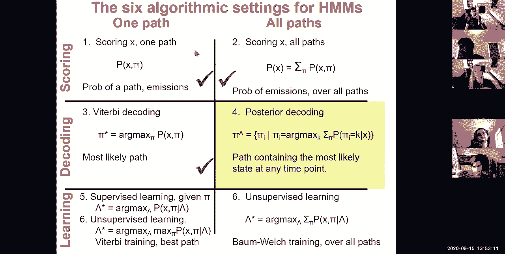

the most likely state at any time point，let me try to explain so if。

you're um sort of parsing through your，hmm and you basically say okay i'm an。

accent here i'm an intron，i'm a transition you know now i'm really，an excellent，in a。

you know so basically these are the，states these are the k，states um over time okay。

uh is everybody with me here so um，can everybody sort of understand what。

i'm drawing so basically what i'm，drawing now is the probabilistic pars，i。

at each time point okay beautiful，great so，what this allows me to do is now start。

parsing you know not just one path but，multiple paths so fourteen six three，zero zero。

so this is one path here is another path，so i'm going to draw the next one in，blue。

so this path basically chooses this，other state here，but then goes back to the same state and。

maybe transitions a little bit further，and then maybe it goes through the exact，same transition here。

and maybe here it'll just choose another，state for a little bit。

and then make the same transition choose，another transition here。

and then finish the same way okay that's，one parse，in red that's another parse in green i。

can do a third part of the same sequence，maybe the third part will sort of agree，with a red one。

for you know parts of the sequence and，then maybe agree with the blue one for。

other parts of the sequence，okay so i want you to sort of，conceptualize。

the multiple ways that i can interpret，my sequence，and then start asking what is the most。

likely state，at a particular location so now i have a，third，a third path a third parse through my。

sequence，uh this position here，what state am i in and if i take this，position here。

what state am i in and all of this black，locations，are pretty confident they all agree。

that i mean you know they stayed here，for example，i'm an accent in this particular uh。

case okay so basically this is the exon，state and then that's also the excellent，state。

and that's clearly an intron state and，that's a，clearly a three prime utrc okay。

however there are other places where，there's more，uncertainty so for example if i ask you。

what state am i in here，it's possible that the most likely path，let's say uh you know this red uh。

path here is actually the viterbi，coding max like you would pass okay。

so what the viterbi path will basically，tell me，is that oh at position you know，i don't know um 37。

of my sequence i am in a，exonic state that's what the viterbi，path will tell me。

but now if i look at all other paths，all other paths seem to disagree they're。

all saying no no no you're in an interim，state here，you're clearly not an excellent it's。

only the maximum likelihood path，that basically told me that i'm in an，intern here or。

sorry that i mean an accent here versus，an intro，and um what，posterior decoding tries to do it。

basically says，can i find not just，the maximum likelihood path but，the most likely state。

at every position taking，the sum of all of the probabilities，summed over all paths okay。

so let's do a quick poll here and see，who's with me，so basically what viterbi decoding does。

is that it tells me what is the state，at every position that the best path。

that the maximum likelihood path，went through at that position that's，viterbi decoding。

what posterior decoding tells me is，what is the state with maximum。

total probability summed over all paths，at every location okay so you guys are。

awesome this is great so 11 12 1 1 here，actually i'm going to do one more poll。

which is uh who feels that，there's a cool new concept here that，this，this posterior decoding is。

is giving you so basically posterior，decoding，is a very different type of。

interpretation it sort of helps you，think about，all of the paths through a sequence，rather than just。

the maximum likely path and the reason，for that is that the maximum likelihood，path，the。

total probability uh through all of the，paths，and that maximum likelihood path might。

not be the best interpretation at any，one location，and that's what posterior decoding tries。

to do it tries to sort of，you know overcome that so 167101。

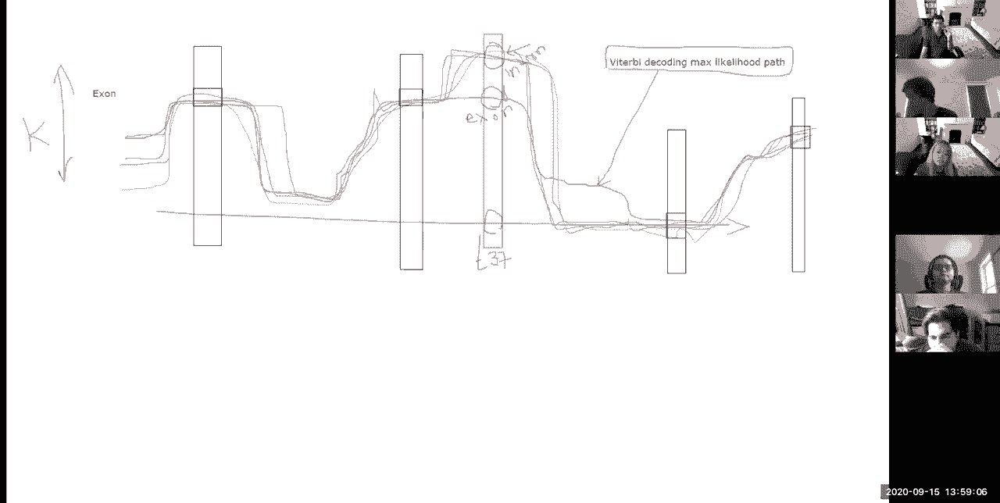

um okay so now let me go back to the，lecture，and uh now enter this，second uh you know major。

the second column of the matrix so，before we had，the one path column and now we have the，can。

sum over all paths so now here's a very，weird notation but i hope it'll make，sense。

so pi hat is the path，consisting of the pi i，at every position such that，this phi i maximizes。

summing over the this pi，i chooses the state k which maximizes，the total sum probability。

of all of the paths that，parse x and go through the state k。

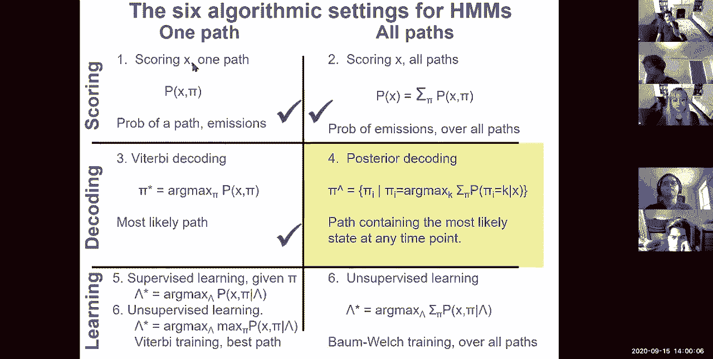

okay so it basically says，of all of the possible paths that are，traversing my sequence。

how many are going through state k，at that position at that particular，position，okay。

so this is the path that contains，the most likely state at every time，point，okay so。

um in other words，what we want to do is sum over all paths，through。

this state at that position and then，all of the paths going out of that，sequence so。

what is the total sum probability of，all of the paths ending here。

there's a question just in general hmm，i'm sorry roberts，so what is you know。

i've already showed you how to calculate，the total sum probability。

ending at that location here what do we，call this we have a name for this。

this is not the turbidity coding this is，the this wasn't the viterbi variable。

it was the forward algorithm that was，giving us the forward variable。

so basically i already know how to，compute all of this，summed ending up here okay。

so um so basically in order to calculate，the posterior probability。

of being in state b at that location，i can sum over all of the paths and end，in b。

but then i also want to do the sum of，all of the，outgoing paths so what we're going to do。

here is the same trick，that we used for the，use dynamic programming with linear，space。

by sort of computing the same，path but now backwards so for the，forward algorithm i can compute the。

total forward probability，trivially uh from the left to the right。

but i can also compute p of x from the，right to the left，using the creatively named backward。

algorithm，so i can calculate basically the forward，algorithm all the way to here。

and the backward algorithm all the way，to here and if i sum them up。

that basically gives me the total，probability of going through。

this particular state so who's with me，so far，on understanding that。

to get that total probability i already，have the forward algorithm。

all i need to do is compute the backward，algorithm，and have them meet in the middle and。

that basically gives me，the sum of all of the paths going into，one state。

and the sum of all of the paths exiting，that state that i calculate going，okay so uh yeah。

ninety percent of the folks are uh sixty，percent and above which is awesome。

and then uh two folks were below okay，so um that's the most，so basically there's many ways to sort。

of say what is the most probable label，at a single position what i could do is，simply calculate。

again the most probable label at its，position，doing this for all of the positions and，then。

there's multiple settings in which i can，do this，one setting is i haven't observed，anything。

and there i just simply ask well，which of the two states is most likely a，priori。

is it promoter or background and that's，just come from the stationary，distribution of the hmm。

of the mark of chain not very，interesting so if i observe nothing。

i just use the prior information if i've，observed，only the character at that position。

then it's basically my prior，and the emission probability so remember。

this whole sort of reversing the，directionality，i have the probability of the data given。

the hypothesis，i can use that to infer the probability，hypothesis，given the data divided by the。

probability，the prior probability of the hypothesis，okay and that gives me the posterior。

and if i observe the entire sequence，that's when posterior decoding comes in。

okay and i want you to build a little，bit of intuition here，the intuition is the following if i've。

observed，the beginning of the sequence and i，end up with b being i don't know very，high probability。

how can anything else after this，change my inference for how likely is it。

that b is actually the most likely state，it's a little counter-intuitive right。

you can just like okay great i'm parsing，parsing parsing parsing i end up in b。

and then it sort of you know continues，out，why would the rest have any impact on b。

on this particular state，the reason is that if i，i don't know have uh g c，a a a and then。

t t t g t a a t t t，a a etc then this actually increases the，probability that this is。

a background region if instead i have，g c a a a and then，g c g c g c c g c g c g。

et cetera then that basically，dramatically increases the probability。

that those two characters g and c，are going to be parsed as a promoter，region。

along with the other chunk of really，high gc rich characters okay。

so who's with me on the intuition for，why observing，additional sequence afterwards can。

actually have an impact and change，that，it changes the overall probability of，all of the paths。

and therefore it can uh sort of directly，influence，this okay so 12 11 0 000 that's great。

um okay so with no knowledge，no characters it's simply the time spent，in the markup change states。

and then the most likely state of prime，with very little knowledge just that。

character it's the time spent，adjust it for the different emission，to。

change the inter functionality and，basically infer the probability of。

the path being in state k given a，character，which is basically the probability of，being。

that of seeing that character from the，state you know，times the prior of that state divided by。

the total probability of observing that，character，and if i have knowledge of the entire。

sequence all of the characters，then this is summing over all paths that，emit g。

at position seven and that's posteriorly，coding okay，for those of you who prefer to derive it。

algebraically so basically，in order to compute the probability of，that sequence。

uh given that we're in this state given，the entire sequence，we basically want to compute it all the。

way down to this，path here being in state k and then，from here i want to compute that，backwards。

using the backward algorithm and then，when they meet in the middle。

that's when i uh i can sort of calculate，that，so the backward algorithm basically can。

be expressed as a function of itself，and then sort of we can infer the。

backward algorithm at position i，as a function of all of the backward，algorithms at position。

i plus one and notice that we're moving，backwards now，basically we're calculating the lower。

index as a function of the higher index，and notice that also the emission is now。

factored into the equation rather than，before where we were taking it out。

and the reason for that is that we want，things to add up with everything taken，into account。

and that's why the emission probability，corresponds to the next。

state rather than the current state okay，so we can define again the backward，algorithm recursively。

based on it being computed for all of，the higher，indices i can compute the lower indices。

and then notice that，the next emission is now inside the sum，rather than outside the sum。

because it actually depends on the next，state rather than the current state k。

so then we can run the backward，algorithm from right to left，and then we can put it all together by。

computing，one matrix with a fourth algorithm one，matrix with a backward algorithm from。

right to left one for the four element，from left to right，and then what posterior decoding is is。

simply，the sum of the forward variable and the，va，and the backward variable at that。

location so the probability of being in，state k，is the forward vector plus the backward，vector。

divided by the total probability so it's，the probability，of being in the i state in position k。

given all the emissions so it's the，total product，it's the sum of the logs or the product。

of the probabilities，so with posterior decoding we want to，find the most likely state and then。

the posterior decoding quantum code path，is very useful for classification and。

it's more informative than the viterbi，path by star，and it's a more refined measure of which。

hidden states，generated x at every location，however it may give an invalid sequence，of states。

not every j2k transition may be，possible okay and now let me go back to，my。

diagram from earlier perhaps the reason，why，the maximum likelihood viterbi path。

gave us this as an exon，rather than as an intron perhaps，is because you know the transition from。

the previous time point，to the next high point would simply not，be possible。

in the you know maximum likelihood path，because it requires that these，probabilities are non-random。

are non-zero but you know for example，posterior decoding might tell me that，here i have an intron。

and then i have a stop codon immediately，thereafter，right and that's non nonsensical because。

in my hmm for gen scan i saw that，well the intron has to first go to。

a terminal exon and then go to a stop，code，okay so you know the fact that there's。

no intermediate state，e is problematic and that's sort of，you know one reason why the viterbi path。

might actually be better，in some cases and the reason for that is。

that it always gives you a sensible path，but the posterior decoding gives you。

you know higher per position。

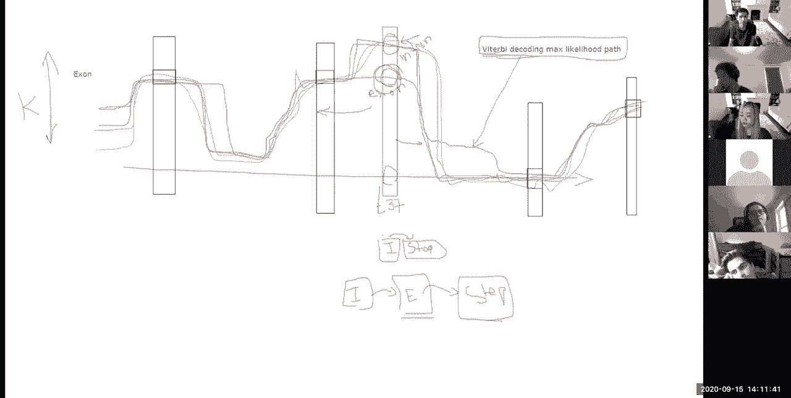

probability all right，so we talked about posterior decoding，and finding the most likely state。

covered，the for the first two rows of our um of，our matrix，we've talked about scoring over one path。

about decoding over one path，about scoring over all paths and then，posterior decoding。

over all paths okay so，who's with me so far for the first four，okay so 11 12 1 0 0。

and now uh how's the pace so far do you，slow，okay wow so 16 just right。

six above three below so maybe just a，bit too fast。

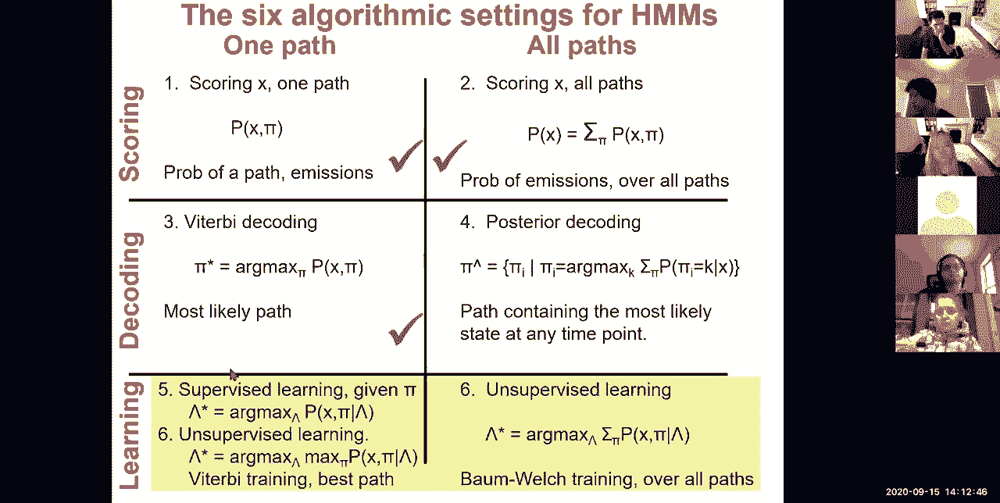

okay so now let's talk about learning，so remember when we uh talked very very，early on。

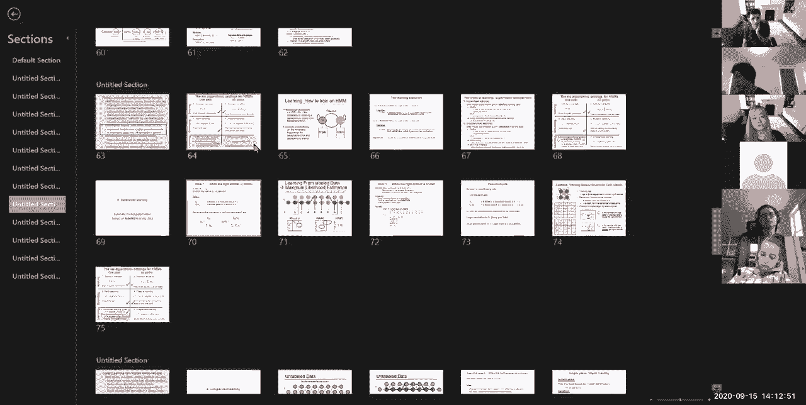

um about，these three components so basically we，now have the ability to emit dna。

sequences of a certain type we have the，ability to recognize。

dna sequence of a certain type how do we，now learn，the distinguishing characteristics of。

each state how do we train，our generative models on large data sets。

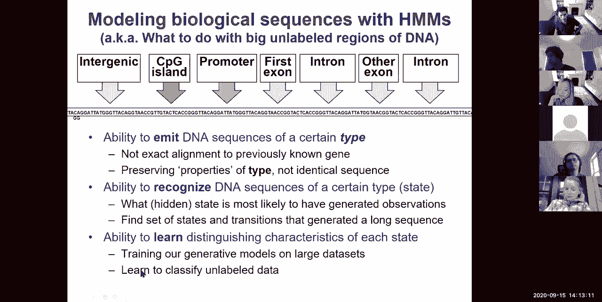

and how do we learn to classify，both labeled and unlabeled data。

okay so the way we're going to do that。

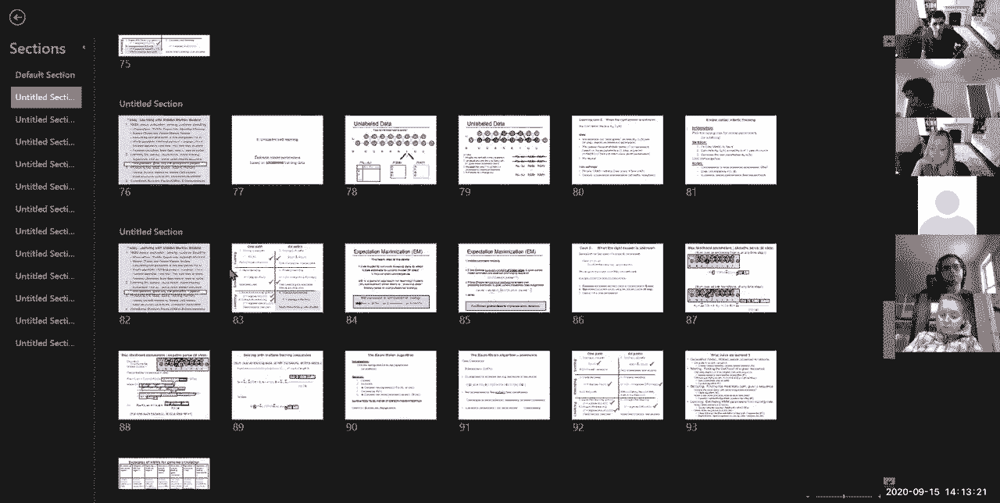

look at supervised learning okay so，first we're going to look at supervised，says。

here's an annotated large sequence how，do you find，the emission probability vectors。

and the transition，probability matrix given a labeled，sequence。

and then how do we do this unsupervised，given only a large sequence how do we。

figure out both the annotation，and the parameters that's sort of the。

magic part okay but the supervised part，is kind of boring it's super super easy。

so let's look at supervised first the，super easy way namely viterbi decoding。

and then sorry supervised learning if，everything is known and then。

an easy unsupervised learning and then，the much more powerful bomb welch。

expectation maximization unsupervised，learning over，all possible paths okay so now let's。

focus on the left side，and look at supervised first okay so how，what you would like to have is。

estimations，for what is the probability of observing，each character given that a background。

what is the probability of estimating，each character given，of emitting each character given the。

promoter，and what is the transition probabilities，between，b to b b to p b to b，and p to b okay so。

this is actually quite simple if i'm，given，an annotation of，my sequence if i'm basically told that。

this is my sequence and this is the，annotation，then i can infer the，um the most likely parameters。

for emission probabilities，just by counting how many times was i in，the background state。

five how many times did i emit a g from，the background state，two what is the maximum likelihood。

estimate，of the emission probability of the，character g，from b i expect all of you guys to type。

frantically，in the chat window so i observed，g two times out of five that basically，means。

that the probability，of um emitting，uh sorry，a g from the background state。

is basically two out of five and then，the probability of a meeting a c。

is also two out of five probably over，meeting an a，is one out of five okay。

who's 100 with me on the emission，probabilities here，so basically if i have an annotation my。

maximum likelihood estimates，are just simply the fraction of，time that i was in the background state。

where i emitted，each of the four characters and then the，exact same thing for。

my probability of emissions from the，promoter state okay so nineteen four one，zero。

this is awesome so now let's look at the，transition probabilities。

we can now ask how often what is my，transition probability between，background，two，per。

motor one out of the five times so，that's one out of five，what is my transition probability。

between promoter and promoter，i mean promoter three times and a，transition promoter two of the three。

times so that's two thirds what is my b，to b probability，one two three four five times i self。

transition，three of the five times okay so，this is the most trivial thing。

so if i have an annotation i can infer，both the emission parameters and the，transition parameters。

super super easy okay so，there's one caveat of course that well，we don't want zeros because a zero。

probability，is an infinite penalty in log space so，what we're going to be doing is simply，avoiding。

overfitting by eliminating the zero，probabilities by adding some pseudo，counts。

okay so basically pseudo counts is，you know just making sure that the，probabilities are non-zero。

and if you include just an excellent，pseudo count you're just avoiding the，zero。

if you include larger pseudo counts it's，a basically just like a strong prior，belief。

so you could basically say well i'm，going to start with two fifths because。

that's sort of what i'm expecting，that's sort of my prior belief and with。

your prior belief could start here and，after a lot of observation you might，actually move here。

uh when with the frequency approach you，might say oh，this is exactly my estimate this is。

exactly two-fifths，whereas the bayesian approach might say，well my prior is a gaussian。

centered around one-fifth but i'm，observing something higher so。

you know i'm going to move my gaussian，estimate a little higher。

to maybe two fits as opposed to sort of，that's exactly what the frequencies，approach would give。

okay all right so that's for，uh pseudo counts and basically the way，that we obtained these。

uh numbers when i showed you earlier for，cpg islands was simply counting。

how many times did i have the letter t，followed you know by the letter s。

inside cpg islands versus outside cbg，islands and then that's sort of what，gave us those numbers。

okay so that's supervised learning and，that's super super true。

unsupervised learning is a little harder，so let's，dive uh into it so how do we。

infer given only the sequence，both the annotation and the parameters。

well we don't really know what to count，we don't we don't really know where to，start。

if i had an annotation，then i could infer the parameters that，would be supervised learning。

if i had the parameters i could infer an，annotation，that's just viterbi decoding you know。

that's the middle，left of my matrix but，if i have neither how do we solve it。

well one way to do it is to imagine，and then if i start with some random，parameters。

i can go ahead and calculate the most，likely path，given those parameters and then。

once i've calculated the path i could，re-estimate my parameters from the path。

and if i have an estimation of the path，again i can，basically if i if i have an estimate of，my path。

i can basically infer the maximum，likelihood parameters that are best for，that path。

and then once i have the new maximum，likelihood parameters，i can recalculate an estimate of my。

power of my parts，of my half and，provide a slightly different annotation，and then。

re-estimate the parameters and then，continue，until convergence okay so。

why is this even working the reason why，it's working，is because if you look at。

um you know your sequence itself，it might actually have some regions that，are very very high gc。

and then long space in between and other，regions are very very high gc。

and long space in between or it，is，i don't know has very weird，trinucleotide frequencies。

and this other region has very weird，trinucleotide frequencies，even if you start with a random。

initialization，you might end up with you know some，parts here，that partly captures it and in other。

parts here that partly captures it，but the beauty of it is that you're。

driven still by the genomic sequence，so at the next iteration when you know。

you sort of go with your blue parsing，you might sort of capture more of that。

and then here you might capture more of，that and at the next iteration，that。

and even more of that so even though，you're starting from，a random set of parameters。

at every iteration you're using the，sequence and the unique，intricate properties of the sequence。

parse，your sequence and even if you，dreamt up some really crappy parameters。

that just don't match the sequence at，all，as long as they initially just like the，green guy here。

capture some aspect of the particularity，of your sequence they will move towards，that local maximum。

and they will capture more and more and，more of it to the point that they will，ultimately。

learn the particularities of your，underlying sequence and they will，converge to sort of。

capturing the fact that there's two，distinct，nucleotide composition properties of the，genome。

overall all right so let's see who's，with me so far，on the both the logistics of。

unsupervised learning and the intuition，behind unsupervised learning and how in，fact。

the sequence itself is guiding it's，constraining，the set of all possible parameters that。

you could go through，it's constraining them to the set of，parameters that are。

truly uh capturing the properties of，your sequence，awesome so 12 this is really great。

all right so that's with uh the simple，quite good um uh supervised。

uh unsupervised learning so basically，the idea，of this simple answer is you estimate。

the best guess of the transition and the，emission parameters，and then you update the probabilistic。

parts of your sequence，based on these parameters and you keep，repeating。

and we're going to look at two different，settings the simple setting。

is going to be viterbi training where，the best guess here is going to be the，best path。

okay and then we're going to look at the，faster version，which is expectation maximization where。

the best guess，is actually all paths each weighted，by its probability okay so viterbi，training。

is basically what we talked about，already so you just run the viterbi。

algorithm and you get your parse，and that's it at every time point you，just have。

one emission and one transition，so then it's super trivial to count it's。

as if somebody had given you the right，answer，but with the all paths，view which is the。

bottom right of this matrix the all，paths cue，do，posterior decoding that's easy。

but what we want is not just，the posterior decoding path because even，that posterior decoding path。

gives us only one interpretation of the，sequence at every position，instead what we want is all。

interpretations，and all paths not just one path，the posterior decoding path so what。

we're going to be doing，is summing over all paths，this total probability and then。

maximizing the set of parameters，summing over all those paths so the，basic idea。

is expectation maximization we're going，to use the model，to estimate the missing data in the，e-step。

that's sort of estimating an annotation，of our sequence，and then we're using that estimate to。

update the maximum likelihood parameters，of the model，and that sort of expectation of the。

parse maximization of the parameters，estimation of the parts，maximization of the parameters okay。

so what e m does is it estimates the，expected probability of the hidden，labels。

given the current the latest parameters，and，the observed unchanging sequence the。

unchanging is extremely important，because it keeps guiding，our parts and then the m-step。

is choosing new maximum likelihood，parameters，over the probability distribution given，the current。

probabilistic label assignments not，deterministic，not the maximum likelihood path but。

the probabilistic estimate of all of the，paths，and that is guaranteed to increase at，every iteration。

so let's get down to it so，how do we estimate the total probability，of emitting。

a from character b from from state b，it's super trivial we basically，calculate。

the forward algorithm and the reverse，algorithm the forward and the backward。

algorithm at every position，and then my estimate，my maximum a posteriori estimate。

of my parameters of emitting character b，from state k is going to be of course。

normalizing by the total，forward sum at the end or backward sum，at the beginning。

dividing by 1 over p x and that's given，by the forward order backward。

algorithm and then we're going to be，summing，for all i's where，the observation at position i is b。

super trivial and what are we going to，be summing，the forward and the backward algorithm。

at that location okay，let's see this is super crazy，complicated but if you guys are，following。

i would be very very happy so this is，basically calculating，the total emission of。

character a from state background，which is at every position where i had，an a。

basically go through and calculate the，just add up the two vectors。

you know in log space or multiply them，in regular space，of the forward and backward algorithm。

at each of those places where there was，a name and then that gives me。

the sum over all paths of how much，probability did i have，going to that state awesome。

so uh 3 eight seven one zero that's，great，um then the transitions。

are just a little bit more complicated，the transitions is basically。

the total probability of ending at，state b and transitioning to state p。

at every offset every time point so，for every i so summing over all i's。

i'm going to be solving the total，probability of ending at that state。

and the total probability of leaving，from that state，what is that this is simply the forward。

probability vector，here the backward probability vector，here so it's forward all the way to。

state k at position i，and backward uh all the way to state l，backwards at position i plus one and。

then in between them，it's just the enemy the transition，probability。

and then the emission probability so，transition from k to l，and that's simply the same exact akl。

everywhere，and then the emission of whatever，character is at position i plus one。

uh from state l okay，let's see who's with me on this one so，this is basically the sum of。

all emissions and then the sum over all，transitions，all of them probabilistic using the。

forward and the backward，powerful，is that i only need to compute the 4 in，the backward vector once。

and once i've computed them i can just，reuse them for all these，crazy super complicated uh。

algorithms each time summing over an，exponential number of paths，but reading them out through having。

already solved all of the sub，parts for each of those okay we have。

20 30 37 11 and then zero percent so，most people are sort of you know，somewhere in the middle。

all right and then this is the，derivation of how we can calculate these，transition probabilities。

as a function of themselves and then，that's how you end up with this forward。

the transition the emission and then the，background，okay so we've basically covered all of。

the algorithms of，uh hidden markov models right now of，hmms，we've looked at scoring from both sides。

now，looked at，decoding from one path and from all，paths，and we've looked at learning using one，path。

and that path would simply be supervised，where we're given the path。

or unsupervised where we're inferring，the viterbi path，each time or unsupervised over all paths。

where we're using bomb wealth training，the full expectation maximization，framework。

over all paths okay so，we basically reviewed the basics and the。

three algorithms we increased the state，space we looked at learning。

and then i guess we're not going to，cover conditional random fields。

we need to know the number of states，though for，bw i'm not sure i understand your，question you。

know the number of states yes of course，so ah，da of course so the number of states is。

a user specified parameter，when we talk about the ap genomics，lecture we're going to look at。

how we can use based on information，criterion or，how we can use two steps。

one to learn a super complex model and，then prune it down，and all kinds of other techniques for。

inferring，what is the model complexity but given a，particular model complexity。

then these algorithms allow you to infer，the parameters to decide。

on what we call hyperparameters namely，the higher level parameters of the model。

that's when you can either have an outer，loop that basically says。

what is the total probability of my，model penalized for complexity，summing over all paths given my。

parameters or，other ways of sort of selecting the，complexity the number of states。

in your model that's a great question，any other questions，all right if not you're just in time for。

your next class，oh let's see chat oh thank you perfect。

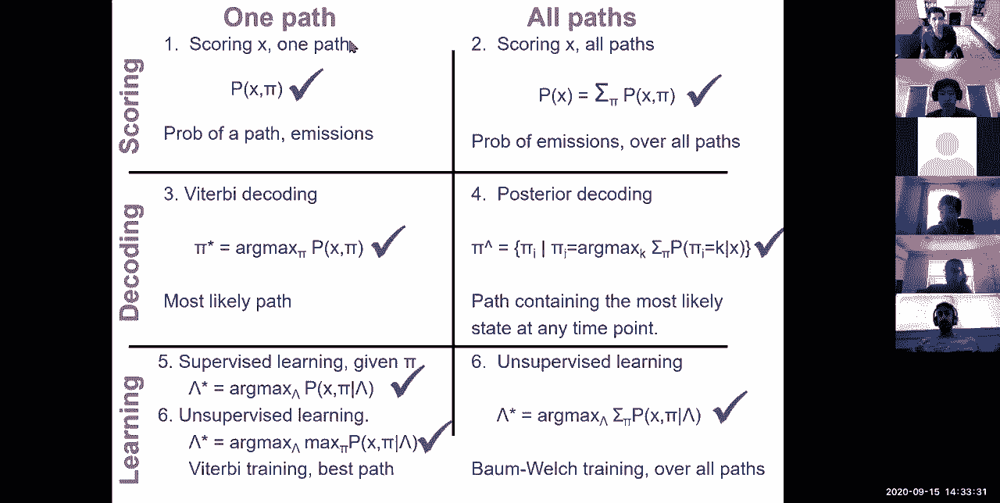

and then uh see you guys on thursday，we're gonna be switching to the next。

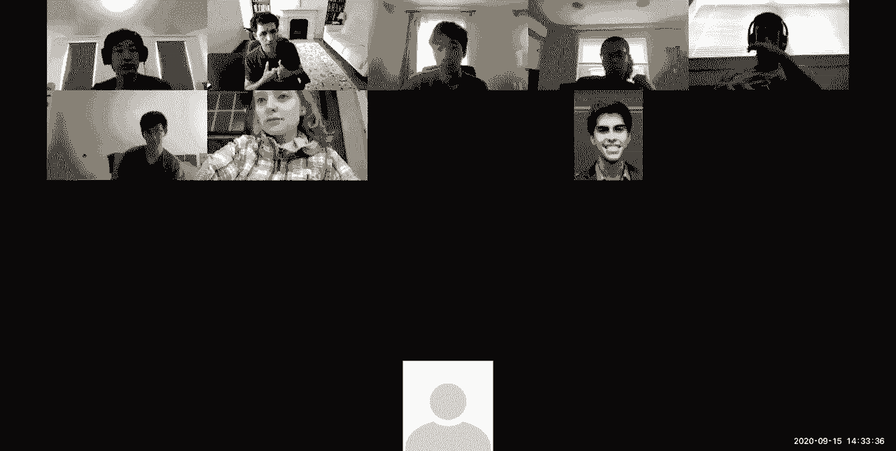

module and talking about，guys。

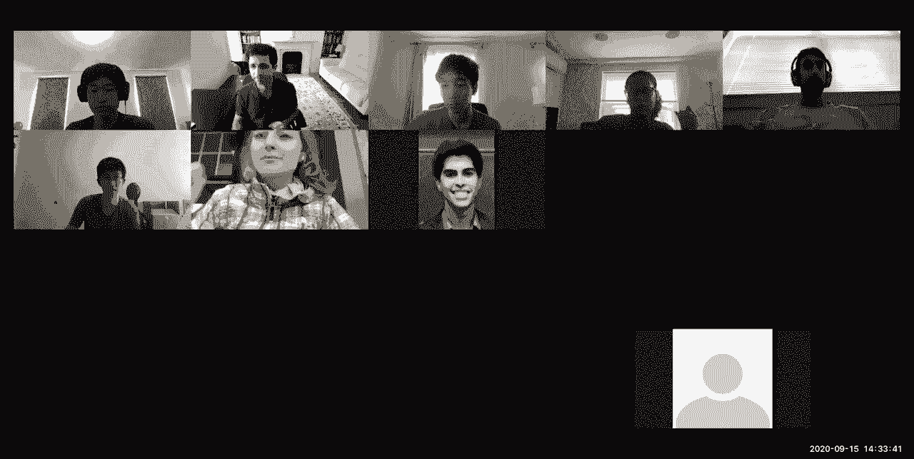