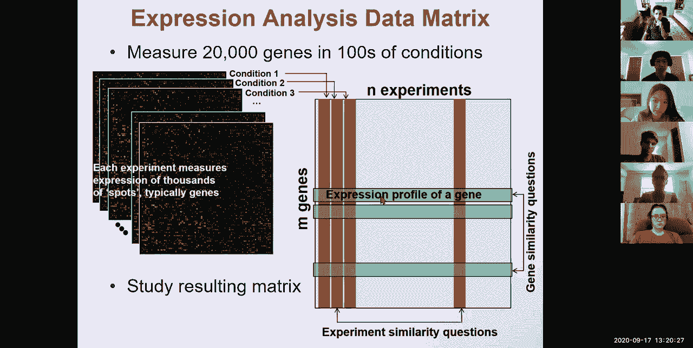
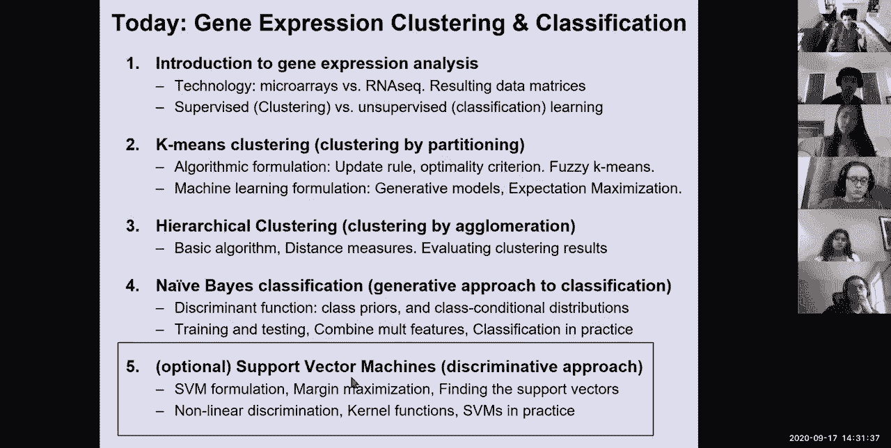

# 【双语字幕+资料下载】MIT 6.047 ｜ 基因组学机器学习(2020·完整版) - P6：L6- 表达式分析聚类分类 - ShowMeAI - BV1RM4y1g76r

so welcome everyone today we're talking，about gene，expression analysis so this is。

foundational when it comes to biology，but it's also foundational when it comes。

to computer science because we're going，to be talking about clustering。

and classification as two very，fundamental tools，so we've wrapped up genome one on sorry。

module one on genome annotation，so we talked about alignment through。

dynamic programming we talked about，alignment through database search and，rapid string matching。

we also talked about hidden markov，models both uh，sort of you know in in two different。

versions both the，one path and the all path across a lot，of，increasing state and complexity。

now we're entering module two which if，you look at the progression of the class。

is about the dynamics of gene expression，basically the first one is about。

understanding the quote-unquote static，genome，the second one is about understanding，the dynamics of。

first transcripts themselves and then，the epigenome，sort of the modifications of the dna in。

module three we're going to talk about，the gene regulatory circuitry basically。

looking at regulatory motifs network，structure and deep learning。

in module four we're going to look at，how，genetic variation perturbs these genes。

these expression patterns and these，circuits and，talk a lot about disease genomics and in。

module five we're going to be talking，about evolution，and compared to genomics and。

phylogenomics and then we're going to，have the quiz and then switch to current，research directions。

so what's in module 2 in module 2 the，computational foundations are going to。

be supervised and unsupervised learning，but also read mapping in super super，blazingly fast ways。

and also two-dimensional structure of，rna and then on the biological frontiers。

we're going to be talking about gene，expression analysis，transcript structure epigenomics and。

then the three-dimensional，genome so for today the goal is to talk，about。

number one the basics and the，foundations of gene expression analysis。

on the technology front the two pillars，namely microarrays，and rna sequencing。

and then all the computational from the，two pillars of supervised，and unsupervised analysis so。

after introduction we're going to talk，about k-means clustering and，hierarchical clustering。

then a generative approach to，classification，and then if time permits a，discriminative approach to。

classification，and then for the clustering we're going，to have both of our teaching approach。

where we select the number of clusters，and then partition，or an agglomerative approach where we。

don't need to select，the number of clusters in advance，so in terms of technology the two。

aspects of uh gene expression profiling，are basically from number one。

micro array technology and number two，next generation sequencing so what does。

microarray technology do，it basically says i have a set number of，genes in the genome。

and i'm going to make probes for every，one of those genes，i'm going to have a number of probes。

each with，you know dna segment that will be，homologous，to the gene of interest that i'm。

interested in，and we basically reverse transcribe rna，into a two dim。

into a two-stranded molecule cdna，complementary dna，through reverse transcription and then。

we hybridize，this dna to these probes，in this microarray and through dna dna，hybridization。

these strands are basically looking for，each other and then，if you radio label for example uh。

you know these um，cdnas typically with a fluorescent dye，so that you have any radioactivity。

so if you fluorescently label your cdnas，you can then look at the fluorescence，intensity。

for every one of your dna spots and then，infer，the expression for every one of those，genes。

and the way you do that that you，synthesize dna probes，through complementary hybridization and。

then you could either make，one long probe for every gene which is。

less typical or you can make many short，probes，for every gene so tiling the gene with。

multiple short pros，tile，k-mers across the genome in order to，sort of detect。

in an unbiased way what are the features，that you're interested in。

or if you're interested in a large，genomic interval you could like。

tile only that genomic interval and，effectively ignore the rest of the，genome。

so the advantage of microarray，technology is that it allows you to，focus。

on specific small regions that you care，about，even if they have very very few，molecules per cell。

the revolution that has happened over，the last 10 years，in next generation sequencing has。

basically allowed us to now supersede，this microarray technology that came at。

a time when sequencing was very，expensive，and therefore you wanted to synthesize。

your array once and then hybridize which，is very cheap，after you've massively produced these。

arrays the next generation technology，has been really to，resequence the dna every single time。

so you basically have your mrna，molecules as before，you reverse transcribe them into cdna。

molecules as before，and you now can directly，sequence these mature mrnas。

and then map the reads using the，techniques that we talked about earlier。

but also some more recent techniques，that we're going to talk about in two，lectures，thousands。

of reads from every experiment，back onto the genome and then using this，mapping approach。

you can then ask what is the number the，count of reads，that was mapped to every gene that i。

know about in the genome，and then infer the count that way so，with mrna sequencing technology or any。

kind of other，short rna technology we're sequencing，short read from the mrna from the。

messenger rna we map those to the genome，and there's many variations we can。

either count the genes count the reads，that are mapping to each known gene。

or we could reconstruct the，transcriptome，de novo for every new experiment and。

we're going to talk about that，next time so the advantage of this is，that these are。

digital measurements and they are de，novo，so basically you have an exact count，rather than some。

level of intensity that you see through，hybridization，and this count is basically the number。

of rna molecules which，gives you some hint as to the，abundance of that mrna transcript。

through all kinds of normalizations，based on how long is the read。

you need to normalize for the total read，length based on how many reads total did，you sequence。

you need to normalize by the millions of，reads that you sequence，or，reads per kilobase of your gene。

per million so r per kilobase per，million rpkm，so the advantage of this approach is。

that it focuses on small regions，even it's a few molecules per cell and，therefore。

if some region has very very low，abundance molecules，you don't need to go and sequence the。

entire transcriptome，until you get to the bottom of the，barrel and you call those molecules you。

can directly，probe them the advantage of this is that，you don't need to know in advance what，are。

the uh specific genes that you care，about，you can just carry out an unbiased mrna，experiment。

uh an mrna sequencing experiment and，then infer，from that unbiased uh sequencing what。

are the counts of all of the known genes，and are there any other genes that were，not meant there。

that are perhaps abundantly expressed，okay，so who's with me on the biological。

foundations here at the technology for，actually measuring，gene expression patterns in the genome。

using either microarray technology，or rna sequencing technology，okay so um。

17 6 2 1 0 this is pretty good，um oh did i do，let's see oh yeah perfect。

um okay so now you've done your，measurements，you've basically measured 20 000 genes。

in hundreds of conditions，so in the first condition you have your，20 000 genes。

and you have all of their expression，levels in the next，microarray or the next rna sequencing。

experiment，basically have another vector of，expressions，and then another one and another one in。

another so you can basically now，infer for every single gene each，expression level，and。

you can basically build an expression，profile for your gene，and you can compare along one dimension。

for the gene to gene similarity and，basically ask，are these two genes behaving in similar，ways。

in their expression profiles so you can，think about the expression。

pattern of a gene as a new type of，vector，orthogonal to the previous vectors that，you had。

but that allows you of course with the，proper normalization，for each experiment that allows you to。

basically build，gene gene similarity set of questions，that you can ask by comparing the green。

vectors to each other，alternatively you can basically say well。

which experimental conditions are most，similar，for example if this one represents，schizophrenia。

and this one represents i don't know a，medical intervention，then you could basically say aha that。

medical intervention perhaps，mirrors schizophrenia or perhaps opposes。

the directionality of change in，schizophrenia perhaps would make a good。

drug for that so you can ask questions，along，the green uh sort of comparisons。

or along the red comparisons okay so，who's with me so far on these two，uh dimensions for studying。

uh gene expression measurements so，basically you can either ask。

using these 20 000 long vectors about，the similarities between different，experiments。

or these 100 long vectors about the，similarity between，okay so 17 3 6 0 0。

any any questions so far so basically，what we're going to be talking about，today。

is computational methods for exploiting，these types of data，so for understanding uh something about。

the biology，through either clustering or through，classification so we basically have。

20 000 genes hundreds of conditions and，we can，either cluster things together or，classify。

what does clustering mean clustering，means grouping，similar items that likely come from the。

same category，and in doing so revealing the hidden，structure，of our data so we can basically cluster。

uh genes together we can cluster this，dimension，or we can cluster conditions together we。

can buy cluster，we can basically infer groups of genes，and groups of conditions that have。

similar properties，so for example this set of genes might，be enriched，cell。

genes or proliferation functions or，lymph node functions and so so forth。

okay so this is not relying on any prior，annotation，it simply says let me look for in an。

unsupervised way let me look for，patterns of similarity，kind of，independent validation of the groups。

that emerge by basically saying well，these genes actually mean something。

because this grouping means something，because these genes are enriched。

in a particular function so it was with，me on the，sort of goal of this unbiased clustering。

so the conditions errors are basically，when，uh like it could be the expression in。

liver or the expression in brain，or it could be the expression after a，meal or it could be。

the expression when i'm at the hospital，or when i'm feeling，well or when i'm feeling sick or if。

you know i had a particular metabolic，condition or if i was overweight or if i。

was younger if i was old，these are the conditions，all right so 25 for zero zero zero。

uh isn't that an annotation so the，annotation，is more you know again you can use。

different words for different things but，annotation is usually used at the gene，level。

to basically annotate the function or，the putative functions of，different genes and um sure。

the conditions basically the reason why，i'm referring to them as conditions。

rather than annotations that the word is，less ambiguous，but you could think about the tissue or。

the experiment，or the you know disease，or any other kind of condition whereas，annotation。

could refer to the specific function of，a particular gene that's why i'd rather，not use that word。

all right so that's on the unsupervised，learning side now there's a supervised，learning side。

where i actually have some known classes，i know that you know there's a bunch of，genes involved in。

you know pancreatic beta cells or，germline，b cells or t cells or activated b cells，or，that these。

genes play a particular role，in the cell i could basically say，what are the features。

in the expression patterns of those，genes that allows me to find。

these genes as a group or to discover，additional genes that should be members。

of that group that i wasn't able to，discover before，so basically the goal of classification。

is to extract，features from the data these are，basically the expression levels of。

particular conditions that could be a，feature like，what is liver expression that's a type。

of feature that best，assign new elements to one or more，well-defined classes so supervised，learning。

has the set of classes already，predefined and then，sees how are the genes mapping。

to those classes based on their，expression patterns，whereas clustering is basically not。

relying on any previous annotation，and only afterwards it will sort of come，in and say well you know。

what are the clusters corresponding to，biologically so here，you use biological data in advance here。

you only use biological data as a，validation，with me，on the classification versus clustering。

okay so uh 16 7 000。all righty so now let's move to the，formal part。

of the uh the course basically on one，now，move to the sort of theoretical domain。

to sort of work with these objects，so let's now talk more abstractly about。

clustering versus classification even，though we introduce them，in the context of gene expression。

clustering classification are pervasive，in machine learning and computer science，these are。

ways to characterize objects，by one or more features so if if our。

objects in this particular case are，genes for example the features could be。

brain expression liver expression or，expression across 40 different，tissues of the human body or the。

expression across，two million cells of the human brain，okay，so these are the features so every point。

is a gene，and every point lives，in a super super super high dimensional，space with。

perhaps perhaps hundreds of different，tissues，that its uh expression has been measured，in or。

millions of cells that the genes，expression have been measured in。

so basically the the space is going to，be super super super high dimensional。

but in this lecture we're going to be，showing it in two dimensions just for。

simplicity visualization of course，to say，well maybe i already know that there are。

red and green jeans or red，conditions versus green conditions and，then the features could be the。

expression of different，genes in that tissue，so classification basically looking，where the。

there's labels for our points and we，want a rule，quote-unquote that accurately assigns，the lay。

uh labels to new points so if i have a，gray point that gets added。

i'll be able to say okay that gray point，probably is a red point and that green。

that gray point is probably a green，point depending on where it's found。

so basically a sub problem of，classification is of course feature，selection。

understanding from that 100 dimensional，vector，what are the features that are the most。

important and of course your metric here，is going to be super simple。

it's going to be the accuracy of，classification and you can use，sensitivity specificity positive。

predictive value，and other types of measures that are，based on，the known categories。

so what do you mean by high dimensional，space so lily i mean，uh the two-dimensional version would be。

if i only measure the expression in two，conditions if i measure the expression。

in brain and measure expression in the，liver and that's it，then it took two dimensional space。

because every gene，has two dimensions one value for，brain expression one value for liver。

expression but uh，if i measure expression across 40，tissue types or if i measure expression，across。

2 million cells then the genes，vector is a 2 000 dimensional，or you know 2 million dimensional。

entry and you're looking at similarity，in this two million dimensional space if。

i'm measuring expression across，two million different cells for example，so that's classification。

uh clustering is basically unsupervised，there's no labels you simply group the，points into clusters。

based on how near how proximal they are，to one another，and the goal is to simply identify。

structure in the data，and your metric will be some kind of，independent。

validation features as we saw here so，here we cluster without recurs。

recourse to any of these annotations in，events，but after you've clustered you then go。

back and say are these genes enriched，in a particular category okay，so um let's see how's the pace。

okay so 15 people are just right and，then four right above and two right。

um okay so what we're going to see first，is clustering and then we're going to。

see classification so for clustering，we're going to look at two different，types of clustering。

uh we're going to look at k-means，clustering which divides，objects into non-overlapping clusters。

such that every data object is exactly，one，cluster and agglomerative。

is instead like hierarchical clustering，it's a，set of nested clusters organized as a，hierarchy。

so with partitioning we first choose the，number of，groups that we want to partition in and。

then we use an，iterative approach for assigning，individual genes to those groups whereas。

for agglomerative，i don't need to know the group number of，groups in the past i can just hierarchy。

cluster and then decide where to put the，threshold and then define the groups，afterwards。

and of course with partitioning you，could build it on，some k that you pull out of a hat or you。

can try a bunch of k's，most，uh you know the nicest results okay。

and of course you know if you're doing，multiply voltages testing you'll have to。

correct by the number of ways that you，flush them，all right so we talked about gene。

expression analysis the technologies and，then the difference between supervised。

and unsupervised clustering and also the，difference between microarrays and rnac。

so now let's switch to uh the first type，of clustering which is clustering by，partitioning。

and then we're going to look at，clustering by agglomeration so。

let's dive in so we're going to look at，k means and first，we're going to look at the algorithmic。

formulation of k-means，and then the machine learning，formulation of k-means。

so first we're going to talk about the，update rule the optimality criterion and，then fuzzy。

means and then we're going to go back，and revisit what would a generative，built。

before for hms and then define a full，expectation optimization approach。

for doing the k-means clustering so，what's the basic idea of k-means，clustering。

it basically says let's assume that，there's a fixed number，of clusters a fixed number k of clusters。

and that we're going to partition the，points into those k，clusters with a goal of making them。

compact，okay so it's very simple we're given a k，and we're basically saying here's a。

bunch of points can you somehow，partition these points into three groups。

and the question is how would you do it，so i have a bunch of points。

how do i find what works to partition，them into，so i could basically start by looking at。

what is the pairwise distance between，them start computing some distance，metrics。

or alternatively what i could say is，let's make a guess let's basically sort，of put。

a green cluster here and a red cluster，here and a blue cluster here。

and then assign points that are nearest，to each of those clusters。

and then update the clusters according，to the points that were assigned to them。

and so forth so that's exactly what，k-means clustering does it basically，initializes。

k cluster centers randomly，and then it repeatedly assigns points to，the nearest center。

and then moves the centers，to the center of gravity of their points，that are assigned to them。

and then you stop at convergence when，there's no more reassignments。

okay so let's see how it works in detail，so basically we randomly，initialize the clusters and then。

maybe i'm going to choose a cluster，there or cluster here in our cluster，there。

notice this is probably not the best，choice because green seems to be a quick。

distance between those two clusters so，let's see what's going to happen。

after i've randomly initialized the，clusters then，i assign every data point to the nearest，cluster。

so basically based on the distance，between every point and every other，cluster。

i'm going to basically say let's label，the points according to the cluster。

that they are closest to and in this，particular case all of those points。

appear to be closest to the green，cluster，and all of those to the purple cluster。

and all of those to blue cluster，and uh by the way are you guys still，there。

my connection seems to have been reset，okay but you guys can still hear me，that's great，um so。

let's see there's a chat is the first，assignment done randomly yes。

so evelyn the first assignment is done，completely random，so uh and and you could initialize a。

bunch of different，ways and then every single time you，initialize you basically sort of arrive。

at a different local maximum，of the overall cluster assignment and，you could try i don't know 20。

initializations，and then choose the one that ends up，with the most compact clusters。

so basically here's where here we are in，step number two or，sorry step number one is random。

initializer clusters，step number two is assign the data，points to the nearest cluster。

and then that's where the cool part，comes we recalculate the cluster centers，now that i've played。

that i've labeled all of these points，green，i will then move the green centroid。

to the center of mass of the points that，were assigned，to it and i'm going to move the green。

the blue centroid to the center mass of，the points understand to the blue。

and then the purple centroid to the，center mass of the points assigned to，the purple。

and then what's really cool is that i，just need to reiterate so then i assign。

data points on your cluster and i keep，iterating this so that and notice what's，happening now。

even though initially the green circle，was equidistant between those two。

because the orange circle moved to the，center of those points，that means that i now have competition。

prior to you know the first iteration，these，green points were nearest to that。

cluster but now that this guy has moved，here，they're actually nearest to this cluster，so。

after this initial iteration，the points are erased from any labels，again。

and then they are reassigned to the，nearest point，to the near center and that's when these。

two points which were previously far，away from purple，are now right smack in the middle purple。

so i update the points to now be purple，then i keep，iterating but the problem is that，call。

convergence so the algorithm has not，converted and we have an answer。

and we have assigned our three points，okay，so uh there's a quick question is。

convergence always guaranteed，uh not necessarily in some cases you，might sort of go。

back and forth and back and forth and，back and forth and we'll learn。

all kinds of machine learning tricks for，stopping that one of them。

is known as simulated annealing which，basically means that，initially you take big steps and then。

after that you take smaller steps，eventually sort of damping down the，system so that。

you don't just keep jumping back and，forth at the infinitive，so but yeah most of the time unless。

there's some degenerate cases，you will usually converge quite round。

all right so now let's start defining，the two steps of k-means，so i'm going to start using some。

nomenclature that actually mirrors the，expectation maximization technique that，we saw earlier。

in the context of hmms but we're going，to now review it because。

it's even more direct in this particular，example，so remember we basically we're。

maximizing the parameters，we're basically inferring the maximum，likelihood parameters，of our model。

and then using the maximum param，likelihood parameters，we're estimating the annotations。

of our sequence in the，hmm case or we're estimating，the annotation of our data points。

in the case of expression patterns，analysis，so basically we're reassigning every。

point to the nearest center，and in doing so we're basically，minimizing，in this。

expectation step we are basically taking，expected assignments of these points。

to the clusters basically it's kind of，like a parts of probabilistic parts。

of our data into different classes，so how do we know the l2 norm makes，sense for this data。

this is not an l2 norm this is um，this is the euclidean distance between。

your data points so basically what we're，doing is we're asking。

how far do i need to travel between uh，you know each point x i and each，centroid，the i。

point the distance that i need to travel，euclidean space，is this okay so。

this is uh let's see in chat，but halloween but this is how far。

yeah so we're gonna come back into these，norms but，this is not an error term and this is。

a weight penalization this is really，points，okay so basically we are assigning the。

points to the nearest center，and then using these assignments we're，updating the centers。

to the mean of the points that are，assigned to it，okay so the mean at iteration n plus 1。

is going to be simply the average over，all of the x i's with particular label。

that we're that we care about and，dividing by the total lower coins okay，this is the cardinality。

genes for example that belong to that，particular label，okay so um you know these are pretty。

trivial we're taking euclidean distance，and then we're taking。

or at least the square of the euclidean，distance and then we're also taking the。

simply geometric average here，um all right so what is this algorithm。

this is basically a recipe we haven't，yet told you if it's any good。

all we're saying is a recipe like you，know follow these steps。

and then you know we don't know what the，cake will look like but we can actually，talk about。

the optimality criterion for whatever，that recipe，creates so we can think of k-means。

as trying to create clusters that，minimize，a cost criterion associated with the，size of the cluster。

so what it's basically trying to，minimize is，some kind of cost structure on all the，points。

which is basically a sum over all，centroids，of how compact are the clusters。

that the centroids correspond to so，basically it's，the sum of the distances between。

every point and the centroid that it's，assigned to，centroids overall clusters okay。

so basically to minimize this distance，we need to minimize，every cluster term separately so。

basically how do you minimize this，uh you know you're minimizing that with。

the you know expanding this square，it's basically the sum over x squared，minus 2，a b plus b squared。

and that's simply sum of all x squares，that's interesting this doesn't actually，depend on the label。

so we can just get rid of that and then，the you know minus，depend。

on the k again plus some constant which，again doesn't depend on the k。

with uh you know the the mean okay，so basically these two terms，are basically minimized whenever。

uk is basically uh，you know sort of meeting this criteria，which is basically。

minimize whenever this you know xk，one over xk is the same as that which，basically creates that。

to the whole thing being zero and that's，basically minimized by the centroid。

so what k means is actually doing is，effectively，minimizing the clusters by choosing the，centroids。

in the places where uh you know the，center of gravity，of these points is and that minimizes。

this total，well there's there's a little bit of a，problem here so basically the problem is。

that some of the points，might actually be exactly halfway，between two centers。

so then the question is why would i，assign it a hundred percent to the，purple center。

where in fact it is equidistant and，maybe i should be assigning it 50 50。

maybe it should be giving some you know，proportional weight，rather than an absolute 100 weight to。

each of the clusters，and that's what fuzzy k means does what，fuzzy k means does。

is instead of having sharp boundaries it，has fuzzy boundaries，it basically reassigns each point。

not to one center which is the closest，but to all centers each weighted，by the distance between the。

point and the center so basically every，point，gets assigned to possibly multiple，centers。

so this point here is you know maybe，closest to purple but pretty close to，green as well。

and a little further from blue so it，gets assigned probabilistically。

some weight for each of those okay so，basically for every point we calculate。

the probability of membership，for each category and that's the，probability that。

this point has label k given the，coordinates of the point，then we，update the centers not to。

the average of all of the points that，are 100 assigned to them because no。

point is going to be 100 assigned right，now，instead to a weighted mean of the points。

weighted by the probability of，membership，so you're basically saying that the next，centroid。

is going to be the sum over all xi's，that have label j，with some probability of the coordinates。

of that point，times ie weighted by the，um you know probability that the，centroid。

is really the one that generated that，one so basically，instead of assigning every point 100 to。

one cluster，i'm now assigning it probabilistically，to multiple crosses。

so basically regular k means is，basically a special case of fuzzy，k-means。

where the probability of that label that，we're using here，is a hundred percent for the closest。

and then zero otherwise but you could，actually make this simply a gradient，distance。

and then that allows you to have both of，them uh，sort of weighted according okay，k-means。

i asked about the shape of the base，instead so um，this awesome，so 15 12 1 uh zero zero。

okay uh you notice here there's a little，b variable this basically allows you to。

put more or less emphasis，on that probability and therefore you，know sort of。

bias the you know the assignment，according to the scaling of the。

all right so that was the algorithmic，rule，we talked about the optimality criterion。

of basically making the clusters compact，and we also talked about fuzzy means。

where you're allowing points to be，fuzzily assigned to multiple clusters so。

you're going to have some points that，are nearly 100，to each cluster and then at the boundary。

between clusters you're going to have，points that are sort of，assigned partially only now。

let's go back using the tools that we，learned about last week，machine。

learning formulation and build a，generative model，that corresponds to this k-means，exercise。

okay so let's now see k-means，as a generative model so，in a generative model as you recall。

we have the forward probability of，generating an event given an underlying。

set of probability distributions，and that's exactly what k-means actually，does。

so you can think of k-means as basically，having，two gaussians and you know basically。

these are seen from the top，but if you see them from the side，they're gonna look like this they're。

going to basically be，some kind of gaussian in this space，and then um you know so basically one of。

them is going to be this way and then，the other one is going to be。

you know some other kind of shape in the，same space，okay so you basically have in two，dimensions。

it's certainly in one dimension you have，side，in two dimensions you have a gaussian。

distribution seen on in sort of 3d，but when you see it from the top this is，basically。

you know the the lines of the gaussian，as they're going up，so we basically have a generative model。

that says there are two gaussians，that the data is sampled from i have my，red gaussian and i have my。

blue gaussian so it's effectively a，gaussian，mixture model it's a model which is a，mixture。

of two gaussian distributions so，if i have basically this generative，process。

i flip a coin first and then i choose，one of the，distributions to sample from so i'm。

going to be like okay now i'm going to，sample from the blue distribution with。

say 30 probability or i'm going to，sample from the，red distribution with 70 probability。

and then i'm going to generate the，points from that distribution。

by basically sampling from the gaussian，so i have you know way more chances。

of sort of sampling a point here than，sampling a point there，each according to their probability so。

i'm basically you know i don't know four，times more likely，to sample something from here then from。

there，based on the relative areas of these，curves，okay so i'm now，sampling points from that gaussian。

mixture model，but the points don't come off as red or，blue，the points come off as gray i don't know。

which cluster generated each of those，so basically in a gaussian mixture model。

you're looking at the world and you're，saying，well you know let's now assume that，whatever i seen。

was generated according to two gaussians，but i don't know what point was，generated by which gaussian。

that's the hidden variable that's the，latent variable，that's the nuisance parameter i'm。

basically trying to sort of，estimate this whole process without，having to explicitly。

you know talk about which point were，generated by what what i'm going to be。

doing is integrating over that，or out as you'll see soon sort of。

iterating over that so basically these，are samples that are drawn from a normal。

distribution with unit variance，a gaussian mixture model so basically，the probability of。

emitting a point x from centroid，j point x i from centroid j is，simply uh you know given by that。

gaussian，distribution which is one over two pi，and then the exponent。

the exponent function is basically e to，e to the minus，the distance between these two points。

divided by two squared，so that's basically describing exactly，that gaussian drop-off。

where the further you go from the mean，of that cluster，the you know faster this drops down in。

an exponential decay function，okay so let's see who's with me so far，let's do a quick little。

lovely good so，um 198020，okay so that's the gaussian mixture。

model that's how we sample the points uh，from it and then the question that we're，going to be asking。

is can we now use bayesian inference，in the same way that we you know used，before。

of changing the direction of that，inference，so we basically now have the arrow that，goes from。

the centroid to the point，can we somehow use bayes rule to reverse，this arrow。

and basically say what is the，probability of each，centroid being the one that generated。

the data if what i have，is the observation okay so it's the same，framework as we saw before。

now seen in a slightly different text，context so，given only the samples how do we。

estimate the maximum likelihood model，parameters，of both the centroid definitions namely。

where should i put，nu1 and mu2 as well as the point，assignments。

which point should i color red and which，point should i call the group。

and that's basically clustering via，a generative model so basically i'm，inferring a generative model。

has，two parameters for the first centroid，the x and the y coordinate for it。

two parameters for the second centroid，unit variance for both，and then um you know just some。

probability prior probability for each，of the centroids which i'm going to。

assume now is highly informative，okay um，all right so what you know so how do we。

solve this problem given only the，samples how do we estimate the maximum，likelihood model。

parameters for both the centroid，definitions and the point assignments。

that's where expectation optimization，comes in just like before。

so we're going to iteratively estimate，the centers from the point memberships。

and the assignments the memberships from，the centers，okay so we're going to iteratively carry。

out two steps the e-step and the m-step，in the expectation step we're basically。

saying okay we now know the centers，let's estimate the memberships how easy，is that。

so if i know the centers i can estimate，the memberships，by basically asking with what，probability。

would i have generated the red from the，m2 distribution okay sorry this point。

here from the m2 distribution，and the same point from the m1，distribution and they both have some。

probability of generating that point，and that probability is directly，dependent。

on this generative approach so basically，i have the probability of generating。

each point given the center，and now i'm going to estimate the，membership。

by flipping around that probability and，basically saying，what is instead the probability of。

this center given the point that i've，observed and the probability of that，center。

given the point that i've observed okay，so let's see，who's with me so far so if i know the，center。

uh then i can infer the assignments，based on simply using bayesian inference，and bayes rule。

on this generative model，okay so um 15 7 2 2 0，um so that's this direction。

the reverse direction is if i have，labels for my points how do i estimate。

the maximum likelihood centers，so that's when i'm going to have to，search over all model parameters。

and basically say what is the setting of，these model parameters，that maximizes the probability with。

which these，you know model would have generated the，points that are assigned to it。

okay so basically we're going to be，choosing the centers，and we're going to be choosing the。

labels that maximize，the total probability of my data given，my model。

and it turns out that the solution to，this challenge，is exactly the k-means algorithm and the。

reason for that，is that when you work out the math the，maximum likelihood estimate。

all of the uh center，uh coordinates for either mu1 and mu2，is basically the algorithm it is the。

parameter mu，z，and however other dimensions it's the，parameter of the centroid that maximizes。

this log product of the probabilities of，generating each of the points。

given the parameters of that center，and that's nothing more than the rmax or，the same u。

of since it's the log of a product is，the sum，of the logs and the sum of the logs。

is basically taking the log from exactly，that equation，and that log is basically the log of。

this plus the log of the exponent，which is basically the exponent itself，and that's nothing more。

than minus one half，oops so basically it's，this constant which i don't care about。

because basically it doesn't depend on，my parameter，you know and then the exponent is。

nothing more than minus one half of this，and then how do i maximize that by，basically minimizing the。

negative of that number and then that's，nothing more than exactly the k-mean，solution。

of basically finding the centroid of the，xis，in order to minimize that solution so。

that's exactly the k-mean solution，so what's really cool is that we，basically first saw from basic。

principles and a geometric，interpretation，that we could simply assign points to。

clusters in order to make the clusters，compact，and right now we're basically seeing the。

machine learning formulation，which is how do i maximize the total。

load probability of emitting this point，from the centroid，and it turns out that the solutions for。

the two are exactly the same，because the exponent of that gaussian，function。

is nothing more than this delta that i，was using before，of the euclidean distance squared。

between the two points，[Music]，awesome thirteen six zero three zero。

and then the last thing is uh who feels，today，awesome so 99720，aren't there any interesting results。

using this approach but with，non-euclidean instances and other types。

of distributions absolutely so whereas，we're going to talk about other types of。

distributions very shortly when we talk，about agglomerative clustering and。

heat and hierarchical clustering，all of these other methods that we're，that the。

em solution is actually the same as the，k-mean solution，are now，estimating the most likely parts。

of our data so basically the goal，is now we're going to be assigning the。

point we're going to be assigning the，labels，that maximize the probability of the。

data given the model that's the total，probability，and that's basically maximizing over uh。

you know all case the uh，you know the label the cluster with，which。

this is maximized so basically taking，the maximum over all possible cluster。

assignments k for the point，x i uh with based on its coordinates，and the arc max of that is again。

the argument of the exponent and that，solution is once more，the nearest center okay so once more the。

em solution is equivalent to the gaming，solution，when the assignments are now。

seeking to be made okay so i hope that，you're starting to see，a pattern here where basically we saw。

this k-means formulation with the，algorithmic，approach and the probabilistic approach。

with the algorithmic approach we，initialize the clusters and the centers。

and then we assign every label every，point，the label of the nearest center，according to this。

and then we move the centroid of the，points with that label and we iterate，again。

initialize model parameters and one of，these model parameters is basically a，bunch of centroids。

and then we estimated the most likely，missing label，given the premium parameters and that's。

basically this maximum likelihood，estimate，was exactly the same distance and then。

we chose the new maximum likelihood，parameters，given the point for the fuzzy k-means，version。

we calculated not which is the near，center but the probability of membership。

for every point to each class，and then we moved the center to the。

weighted centroid rather than just a，centroid weighted by that probability，means。

probabilistic interpretation here we're，estimating，not the most likely missing label not，the。

one path or one parse but instead，a probability over all possible missing，label assignments。

this is equivalent to the all paths，algorithm so basically instead of。

giving a single label you're giving you，know probabilistically all possible，labels。

given first rounders and then you choose，the new parameters to maximize the。

not just the maximum likelihood but the，expected likelihood，weighted over your label probability。

estimates，okay and then，this probability of the data given the，model is。

guaranteed to increase at every，iteration of the，expectation maximization algorithm okay。

so basically as we're doing，uh fuzzy k-means with k-means is not，basically。

you know keep jumping back and forth but，with fuzzy k-means，you're guaranteed to increase this uh。

life even，okay we will always arrive at a local，maximum，all right so uh now let's step back a。

little bit more，and basically look at the power that you，have。

using this full expectation maximization，model，the idea is the following with k-means。

we were constrained to only have uniform，priors，there was no such thing as classifiers。

where i could basically say，there likely are more green points than，like that。

so you can't have a prior whereas with，the em generalization，you can actually include that in your。

formulation each time you basically take，the arc max，using priors rather than just using。

these likelihoods so，the k-mean solution was also assuming，that there's a unit。

distance function which is symmetric，across different dimensions across x and，y。

whereas the expectations maximization，generalization，assumes this gaussian distribution。

and allows you to have a covariance，matrix，that allows you to vary jointly across。

for the label assignments the k-mean，solution was simply picking the maximum。

and the fuzzy k means we're using the，full density，but in the sort of probabilistic and。

machine learning generalization，we now can use either the full density，just like fuzzy k means with。

expectations maximization，or we could even sample from that，posterior distribution。

using gibbs sampling which we're going，to talk about more，in the motif discovery lecture so。

again if you look at the parallels，between hidden markov models and，expression clustering。

so basically remember when i was talking，earlier about these，nuisance parameters or these hidden。

labels that we're kind of，integrating over or estimating and then，building on。

so here we're basically，calculating this total probability，integrating over。

all of the cluster labels but with hmm，learning what we have basically done is，iterate over。

all you know sort of hidden labels which，were that state path，learning。

one was the viterbi training where we，were labeling the sequence with the best，path。

and here k means is assigning each point，to the nearest cluster so i hope you can。

start seeing the parallel between the，different lectures，with bondwell's training we were。

labeling the sequence with all of the，paths that was posterior decoding。

where you were basically using the full，forward，uh probability the full backward，probability。

summing them up and then i gave you all，of the paths going through this。

so that you don't have to just choose，one possible assignment that's what，fuzzy gaming does。

it basically assigns every point to all，of the clusters，weighted by the proximity which is again。

a one-to-one map with a probabilistic，interpretation of the probability。

that that cluster generated the point，that you care about，and then what we're not gonna see。

today but what what you should already，be thinking of，uh is that instead of labeling a。

sequence with all of the paths，we could simply sample a single label，for each position。

or we could assign to a random cluster，by sampling by proximity，so instead of basically saying that。

every point goes，you know equitably，in all three clusters you could，basically say well if it's。

60 probability of being in this cluster，30 percent of probability of being this。

cluster and 10 percent probability of，being that cluster，i'm gonna sample according to these。

probabilities，and then whatever the sample tells me i，one，okay so basically with 30 probability it。

will go 100 here，with 60 probability we'll go 100 here，and with 10 probability。

10 probability will go a hundred percent，here，this is very cool right it basically，says that，know。

fully committed with 10 probability，and that's fine he won't make that，mistake quite quite often。

but if he does make that mistake quote，unquote，it will go fully committed to that，mistake。

then maybe the next time around it will，get out of his mistake or maybe。

it will allow you to explore a solution，that would otherwise not be。

excessive okay so who's with me here，the difference between k-means viterbi。

and greedy which is basically choosing，only one annotation，fuzzy can mean bomb welch and you know。

expectations maximization which is using，all of the solutions each weighted by，its probability。

and then give sampling which is only，choosing one，by sampling from that motif。

from that distribution okay so，uh let's see who is with me so far。

awesome all right so we have thirteen，eight four one zero this is great，um okay so。

this is you know k means clustering okay，so basically this is clustering by。

partitioning and we saw both the，algorithmic formulation，with the update rule the optimality。

criterion of making the clusters compact，and the fuzzy key means version as well。

as the machine learning formulation with，a generative model，and then the full expectation。

maximization solution，let's now switch gears completely and，talk about hierarchical clustering so。

this is a model-free，clustering that is basically treating，every point as a cluster。

without sort of having a lot of fancy，parameters about the distribution。

according to which the points were，generated，so we're going to look at the basic。

algorithm and then we're going to look，at different distance measures。

and then sort of how to evaluate the，clustering results，so one of the challenges of k-means is。

how to pick，the number of clusters k so how do you，select k，if my goal is to make the clusters。

compact，that's super trivial if i have a hundred，thousand points，i just choose a hundred thousand。

clusters every cluster，has zero standard deviation it's，centered exactly on that point。

and it perfectly captures the training，data，of course it also has zero，generalization power。

because as soon as i have a point that's，not exactly one of my previous points。

all of the other points have basically，all of the other clusters that，correspond to points each。

basically zero probability of generating，that additional point。

so that's obviously not very nice okay，so，um you know this the question is。

obviously what is the meaning，of improvement can i increase the number。

of clusters and make the cluster more，compact，yes but at what and what cost and how do，i analyze。

the increased model complexity so we're，going to talk a little bit about。

bayesian information criterion in，later lectures about sort of how to，analyze model complexity。

but hierarchical clustering is one，issue，it doesn't actually care to define。

a predefined number of points enough，clusters，so instead it basically says。

let's start with each point in a，separate cluster，and at every step choose the pair of。

closest clusters，and then merge them so here i would，first choose。

d with e they seem like to be very close，together，and then whatever new cluster i get by。

merging d and e，with f is probably the next cluster and，then a d。

and then all of these guys together are，pretty close and then the next one is c。

and then gh and then the whole thing so，that basically gives me，a hierarchical set。

of nested cluster memberships，that basically uh you know tells me how。

every point is related to every other，point，and that's basically a hierarchical，clustering。

also known as unweighted pair，group method with arithmetic mean。

or upgma and we're going to revisit that，in our phylogeny，so unweighted pair group method with。

arithmetic mean，cut，with four clusters i want five clusters，i just cut a little lower。

if i want three clusters they just got a，little higher okay，so we can select the cut level to。

basically create，disjoint clusters from that，okay so let's see it was with me here on。

oh very cool so um 91，at 100 and then 9 in the 60 30 category，um okay so um。

you had previously asked about the，distance metric，so how do we choose the distance metric。

between two clusters，you could basically say well two，clusters are as。

close as their two closest points or，maybe they're as far，as their two furthest points or maybe。

they're as close as the average of all，pairwise comparisons of coins between，these clusters。

or maybe they are as close as dictated，by their centers of mass of all of the。

points assigned to those clusters，and each of those methods has different，implications。

so if you use single link method，which is basically the minimum of any。

pairwise distance you basically end up，with clusters that can，zigzag around and sort of connect long。

points through chains of proximally，connected points，if you choose complete link which is。

basically forcing，the maximum distance between any two，points to be minimized。

that is forcing the clusters to be as，round as possible as sort of compact and，round as possible。

using average link is you know somewhere，in between the two，basically sort of averages both and has。

good properties for both and then the，centroid method，is um you know somehow。

ignoring that there's really no，probability mass here in the middle，and could be you know somewhat。

misleading but again，for different applications different，methods apply best，the。

cluster distance metric will affect not，only the results，but also the runtime so basically here i。

only have to compute，you know one distance based on that，average of course here i have to compute。

every pairwise distance but conversely，if i've computed every pairwise distance，once。

in n squared cost after the fact，i don't need to recompute any distances，or any centroid，basically。

have to recompute，the center every time i do a merge and，recompute the distance between that，merge。

and all of the other clusters which is，actually also expensive，so that was the cluster to cluster。

distance we can also look at the，point-to-point，distance and basically look at what are。

the gene expression similarity，measures that can，capture the individual point-to-point。

distance so if i have the expression of，one gene in the expression of another，gene。

i could basically use the euclidean，distance，or i could use the manhattan distance。

or i could use the pearson correlation，or the，spelman rank correlation or the absolute，of the。

or squared correlation between these，points so basically there's a lot of，diversity in the way。

that i can actually compute these uh，distances，and then um you know they will also。

affect the results so basically，and the point-to-point distance will of。

course also affect the cluster to，cluster，distance so this is something that you，can experiment with。

if you know the absolute expression，levels，then you probably want to use either of。

these two distance metrics，if you know that the absolute expression。

level doesn't matter but it's just a，relative one，and you're probably better off using，rank。

if you have a lot of outliers then the，rank correlation can be more robust。

and so on and so forth so you can you，know be aware of all these methods。

and sort of the settings in which each，of them hides it，so that's basically the basic algorithm。

and the distance measures，for hierarchical clustering and once you。

have the results you'd like to evaluate，just how random is it how unlikely is it。

to get these types of results so how do，you evaluate that well you can basically。

ask about i don't know，cluster compactness or um you know some，kind of distribution measures。

or you could basically use an，independent validation metric that says。

oh well i have some annotations for，these points，so using these annotations i can，basically。

choose to look for enrichment，of a particular class of annotations in，each cluster。

so you can basically evaluate，your cluster performance in many ways。

you could you could say is it robust，if i choose random samples from the data。

and then re-cluster are，the clusters showing up repeatedly or。

are some clusters only found in one kind，of iteration of sampling。

or as i mentioned just now we could look，for an enrichment，of categories of genes that are over。

represented，in particular clusters and that's，something that's very commonly used in。

motif discovery which i'm going to talk，about in a couple of lectures。

so how do we evaluate cluster enrichment，so the the questions are following i，just created。

this blue cluster based on the distances，of the points，and four of the points in the blue。

cluster happen to be green，and then outside the cluster you know，one two three four five six seven。

happen to be green is this a random，partitioning，how much of an enrichment would i have。

expected if i had，chosen this cluster randomly，and that is simply given by counting。

using this hypergeometric distribution，you're basically saying，what is the probability with which i。

would have chosen，k elements at random and ended up having，m of them or more be um。

you know above some expectation，uh to be in the green category so that's，given simply，elements。

here so basically all of the ways i can，choose the，k element in the blue circle out of the。

n total elements，and then out of all of those ways，how many ways would i expect to have at，least m。

of my points out of the green category，and at least k minus m basically the，remaining ones。

out of the yellow category okay and that，sum over all of the numbers m that are，greater than r。

is basically that hypergeometric，distribution and，that allows you to evaluate the。

probability of a single cluster，least，so you could basically use that to now，evaluate。

cluster enrichment in particular，functional categories so we did unbiased，clustering。

perhaps agglomeratively using this and，now we're setting a threshold and，cutting。

these clusters at some point and they，were asking，how non-random is the enrichment in each。

of these different，functional categories okay，so that was clustering diagonation。

and clustering by partitioning that's，when we don't know the categories in，advance。

but for classification we kind of，already have some categories so let's，now see。

how we can use a generative approach to，classification so we're going to use a，discriminant function。

and then define it based on class priors，and class condition，distributions and then look at the。

difference between training and testing，and how to combine multiple features。

and also how classification works in，practice so again，there are two approaches to。

classification there's a generative，approach or a discriminative approach。

for the generative approach bayesian，classification is very common。

and you know among them naive bayes，is the most common and the reason for，that is that we。

might have no idea how to evaluate the，prior probabilities，and that's what name base does basically。

says actually not not prior probably，but the dependence between multiple。

dimensions we might say well，all of my metrics are perhaps，independent so。

what naive bayes does is that it assumes，independent across multiple dimensions，of our data。

and one way to make sure that name base，applies might be to first。

take a dimensionality reduction approach，where you're looking at the principal。

components of variation of your data set，and then these principal components will。

be more or less independent from each，other so then you can use naive bayes。

on those prism coupons so，bayesian classification allows you to do，that and it poses。

the classification problem in，probabilistic terms it models the，feature distribution in terms。

of the specific class that every element，belongs in，and it uses probabilities probability。

calculus for making the decision，whereas the discriminative approach such，as support vector machines。

has no modeling of the underlying，distribution and it makes decisions。

using simply the distance from the，boundary，and that's similar to the hmm versus。

conditional random fields that we saw，at the end of the last lecture so。

what does the generative model do it，basically says，i have a bunch of samples and they're。

drawn from some distributions，and these features now i'm going to look，at a one-dimensional view。

which is actually even simpler than the，two-dimensional view but you can expect，that there are。

you know hundreds or thousands or even，millions of dimensions。

so basically these are the features for，every class and they're drawn from a。

conditional probability distribution，this is conditional，class or class conditional so we're。

basically going to assume，that the data along each of the，dimensions of which there can be，hundreds。

is distributed according to some，gaussian distribution，of obtaining these values of x。

given class 1 and maybe class 2 has a，higher average but a similar standard，deviation。

and that's the class conditional，distribution of class 2。so in general what we're going to be。

asking is what is，the posterior probability of this data，point coming from。

class red given the feature that i've，that，in a bayesian inference way given the。

generative model which basically says，what is the probability of the feature。

given the class so that's probably of，each feature，on the each dimension given class one。

and given class two，okay so i have the probability so if i'm，trying to classify this point i can。

basically say well how likely is it that，this point was generated by the green。

distribution is that height over here，versus the red distribution it's that。

high over here so i'm probably going to，choose，this to be labeled as green if i were。

trying to classify，okay so let's see who's with me so far，on this invasion。

classification using this gaussian，awesome so 14 9 1 1 0。so notice that this is actually。

just a special case of our，fuzzy k-means probabilistic，interpretation，this is basically when the。

class is already given and therefore i，can actually explicitly calculate。

the class conditional probability，distribution，so i you know i can basically calculate。

the probability of each feature，even the class so for example dna repair。

genes might show higher expression，during stress so you can show these，versus that。

or protein coding genes might show，higher conservation levels again。

or regulatory regions might show higher，gc content and in general you're going。

to have some kind of foreground，signal versus some kind of background。

and if you know both distributions you，can classify a new example，by simply choosing a cutoff。

to minimize the classification error or，to maximize the posterior probability。

so classification is trivial it's just，choosing a threshold，in each of the dimensions it's basically。

saying along this dimension，i'm going to choose the cut off probably。

exactly where these two points cross if，i have uninformative priors。

for classifying something as red versus，green but if the prior for class 1。

is higher then i'm going to scale the，green distribution up，and then the threshold is probably going。

to move slightly to the right at the，point where the scale of the，distributions are now crossed。

and if i have many classified examples i，can estimate the model parameters。

using either a parametric or a，non-parametric approach，to estimate the class conditional。

distributions so，a parametric approach will basically say，well it's gaussian distributed。

it has a mean and a standard deviation，and non-parametric approach might say，well let me just bin it。

into seven bins and i'm just going to，estimate the probability for each of the，bins。

and again we're going to be using bayes，rule of asking，what is the probability of a class given。

the feature，given that i have a generative model，that basically tells me the feature，given the class。

and we're going to be doing this using，bayes rule，of estimating the class given the。

feature based on the feature given the，class，scaled by the prior of each class and of。

course the whole thing normalized by the，evidence，which doesn't actually matter because。

it's the same with both classes，and therefore it can be divided out so，you can actually express this。

as a discriminant function so what is a，discriminant function，above which threshold do i。

choose one class versus the other class，and that discriminate function is simply。

whenever the probability of class one，given the data is greater than。

probability of class two given the data，and that is nothing more using page rule。

then the probability of generating x，from class one times the prior class one。

and the probability of generating x from，class two given the prior forecasting。

divided by this normalization，marginal but you can sort of marginalize，it out。

and that gives you the probability of，class one，you know times the prior plus one。

product of x given plus two times the，private costume，and that is you know。

whenever that's greater than that it's，simply whenever this is greater than one。

and whenever the log probabilities of，that is greater than zero。

and that's what we call a discriminant，function so i can select class one。

whenever the discriminant function is，greater than zero，and select class two otherwise okay。

very very nice，okay so uh 10 10 5，2 1。 so three people are sort of you，know not so。

they're with me but the other 25 are，pretty good，all right so now that was defining my。

discriminate function，and then training and testing is，super simple it's basically given that i。

have a bunch of points that are green，i'm gonna estimate the probability。

of that feature given the class one，and then uh one way to do that，non-parametrically is to。

chop it up and then just simply measure，the number，in each class of course with the zeros。

causing trouble as always and the，problem，with those zeros is that as you go to。

higher and higher dimensions，there are more and more zeros because in。

one dimension i can split my dimension，to five bins，but in two dimensions i need to split it。

into 25 bins，and in three dimensions into 125 bins，and in four dimensions you to 625 bins。

and if i have，uh，100 conditions or 2 million cells then，these zeros are basically everywhere so。

big data becomes little data in the，curse of dimensionality basically which。

makes the data sparser so that's why，probably，so parametric models are usually more，powerful。

for these types of approaches and then，you just，count the number of red points and the。

number of green points in your training，data，and that gives you your price okay and。

then as for combining multiple features，again um naive bayes basically tells you。

that along each of the dimensions，i'm gonna make the simplifying，assumption that。

the classes are the class conditional，distributions are，the，dimensions are independent of each other。

so basically，you're assuming that the features are，independent，given the class not just fully。

independent but class conditionally，independent，uh，times relative x2 given the class is the。

same as that joint probability so it's，just a product，of each of the class conditional。

one-dimensional distributions and the，beauty of that is that it's super super。

easy to compute and it's you know pretty，close a pretty close approximation most，of the time。

especially if you sort of first check，that your features are mostly，independent。

okay and then this just becomes the sum，over a bunch of log scores because you，can just。

not do that and of course you you can，have your binary classification error。

your sensitivity your specificity，defined as a function of your true。

positives true negatives false positive，and false lengths，okay so then again in practice you。

basically gather a lot of data，you sort of estimate these class，conditional distributions。

you can bin your data and then you know，sort of combine the multiple features。

together and then in the end，you basically see that this very simple，approach of naive phase。

has basically outperformed every single，previous approach in this particular。

example of classifying microcontroller，proteins，all right so let's see if there's any。

questions but if we have more than two，classes，then it's exactly the same math you can。

just you know sort of，decide for each of the class conditional，distributions for each of the classes。

all right so let's see who's with me so，far，and um on the whole sort of。

lecture today so gene expression，analysis，k-means clustering hierarchical，clustering and then。

naive bayes classification awesome，uh so seven twelve four three one。

and then the last part is who feels that，zero，so uh the support vector machines is。

optional material we might end up，covering investigation。

but um you guys are not gonna be，responsible right。

okay so uh everybody's excited about the，mentoring session，on uh friday so you can see already。

there's uh，a bunch of ideas uh input there so what，we're gonna do during the mentoring。

session to tomorrow is that，live i'm just gonna go through all of，them from top to bottom。

so you have extra motivation to answer，your ideas early，and then just give you feedback on each。

other's ideas and the beauty of doing it，all together is that you get to sort of，hear。

a little bit about the other ideas as，well and you also get to hear。

about your classmates and uh you know，we'll have just an interactive session。

and then hopefully that will help you，form teams，for the following week where we actually。

have the pre-proposals，and then the peer review and then the，final proposals okay。

everybody with me so far awesome。

good all right thank you guys and then，we'll see you tomorrow at the mentoring。

