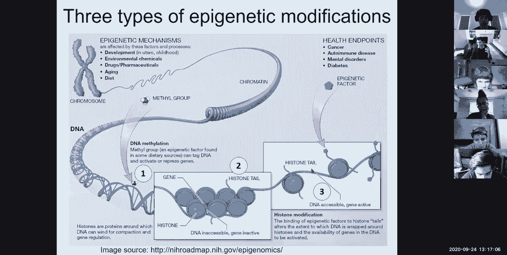
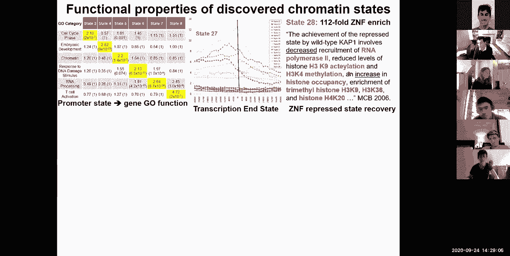
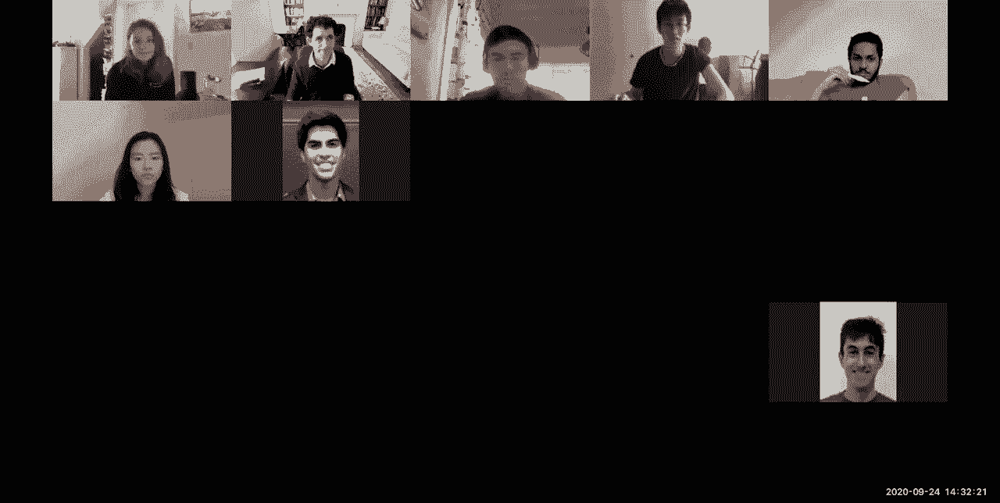
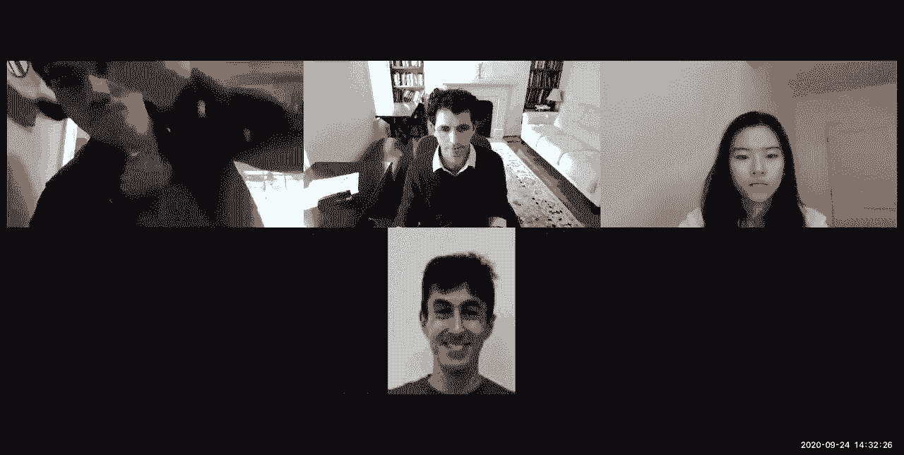

# 【双语字幕+资料下载】MIT 6.047 ｜ 基因组学机器学习(2020·完整版) - P8：L8- 表观基因组学L1 部分 - ShowMeAI - BV1RM4y1g76r

okay so uh welcome everyone so today，we're going to be talking about，epigenomics so there's a lot of。

challenges with，genomics and it's one of my favorite，fields so uh here we are。

in uh the third lecture of module two，on gene expression energy genomics and，sort of halfway between。

genome annotation and starting in two，lectures，regulatory genomics and networks disease。

and then comparative genomics，so today we're going to be talking。

focusing of course on the computational，aspect of epigenomics，but first i'm going to sort of first。

introduce the field，what is epigenomics about the diversity，of chromatin modifications。

and then how do we go about finding，where those modifications are so how do，we use antibodies。

and chromatin immunoprecipitation，followed by next generation sequencing。

and then just some introduction to the，data generation projects。

the raw data and then the primary data，processing how do we map the reads。

how do we call peaks and how do we do，quality control，and then we're going to focus on methods，for。

integrating multiple epigenomic，modifications to infer chromatin states。

on the genome and define a multivariate，hidden markov model for doing this and。

sort of for annotating the states，and then a question that a lot of people。

have asked a lot about about，model complexity how do we select the。

number of chromatin states and also the，number of marks，how do we capture dependencies and state。

conditional marking dependence，and then how do we do joint learning，across many cell types。

and then how do we use the activity，patterns of those for actually。

regulatory genomics that we're going to，talk about next，next week and specifically linking，enhancers。

to their upstream regulators and to，their downstream target genes。

and then lastly we're going to talk，about epigenome imputation，by actually exploiting chromatin mark。

correlations，so let's dive right in introduction to，epigenomics so the epigenome。

is the reason why you can have a single，static genome，in uh which is shared among nearly all。

of your cells nearly identical，and yet have this amazing diversity of，cell types。

if you look at blood cell types there's，you know a huge diversity。

of different types of immune cells of，oxygen carrying cells，of you know clotting cells and then。

clotting cells and then um you know many，different types of recognition。

and fighting and so on so forth so you，know we've learned a lot of。

immunology uh recently all over the news，through，uh the covert pandemic the brain has。

this incredible diversity of cell types，uh you know there's main major cell。

types of neurons astrocytes，oligodendrocytes microglia but also the。

huge diversity of tissues in both，the you know early brain and the，neocortex。

in humans uh if you look at all of our，internal organs like the heart the liver。

the spleen the you know sort of，uh there's you know this incredible。

diversity of cell types and chambers，that are guiding other cell types。

and even if you just look at your skin，there's this incredible innervation。

uh where you have neurons that are sort，of directly，interacting with your skin with your，hair。

with your blood supply with innervation，with the other environment。

the regeneration you know if you have a，wound it heals and all of the same cell。

types are built again，system of interconnected not just cell，types but also。

uh organizational networks of，communication and，feeding and of feedback and control that，are sort of。

uh you know reflected at any any portion，of your，of your body so all of that is possible。

through the epigenome so how is that，achieved，so the epigenome is basically what holds。

your dna together，and it plays first structural roles but，it also plays。

um functional roles and it enables this，diversity，of cell types just to give you an idea。

of how much dna，is packed every in every one of your，trillions of cells you basically have。

about two meters worth of dna，inside a cell which is，six orders of magnitudes smaller。

and that string has a diameter the dna，itself has a diameter that's。

nine orders of magnet is smaller than，its length，so it's this amazing feat of packaging。

to basically take two meters worth of，dna and pack it into every one of your，trillion cells。

and if you put your 30 trillion cells，end to end，basically，reach to jupiter 10 times。

every single human on the planet has so，much dna pack，so that's the first function if you wish。

of the epigenome，it's sort of making all of that dna，you know fit together and how is that，possible。

well through many many different layers，of packaging so first of all the dna。

double helix is wrapped around，these nucleosome bowls，there's 147 nucleotides and about a 50。

nucleotide linker，so you can think of 200 nucleotide，segments of the genome。

packaged up in those bowls and those，bowls themselves are sort of packaged up。

inside this chromatin fiber which is，itself packaged up in higher，organization。

into sort of a regions and b regions，which are more active or repressed and，other。

and we're going to talk about a lot of，that next uh next lecture，and uh you know all of that is then。

condensing，to effectively ultimately lead to the，chromosomes that we know and love and by。

the way this chromosome，picture that you usually see is only，found in a specific。

phase of the cell cycle where the，chromosomes line up in order to，segregate。

between the daughter cells but most of，you know，much less packaged up and sort of，floating。

but still maintaining their own domains，so again dna is very very long the cell。

is very very small the compression，is you know several orders of magnitude。

smaller than the extended dna，and then in order to use the dna this。

compact structure must actually open，locally for transcription factors to，bind。

and there's a huge role of accessibility，of the state of the chromatin and 3d，interactions。

in sort of making all that possible so，when we talk about，epigenomics epi means on top of。

and then genomics means on top of the，genome so top of the genetic information。

so ap genomics are the modifications，that you can put on top，of the primary information。

of the human genome so the primary，dna information can be modulated。

it can be modified the analogy that i，like to give is，in the same way that you have。

annotations on a musical score，that allow you to sort of play something。

louder or play softer or sort of you，know，increase and decrease and so forth。

that uh can be modulated through three，types of modifications，of this uh sort of combination。

of number one the dna and number two the，the proteins that dna is wrapped around。

so the first type of modification is on，the dna，itself and we talked about it briefly，it's。

cpg methylation y，cpg because it's the c and then followed，by phosphate。

followed by a gene so in cg nucleotides，that are consecutive，you basically have a methyl c which is。

usually indicative of repression in，regulatory regions so if you have this，quantum code fifth。

nucleotide if this fifth base of the，genome this methyl c base，you basically are more likely to be。

repressed and the vast majority of the，human genome is in fact methylated and，only a small minority。

in cpg islands that we talked about is，unmethylated，so these methylations before the first，form。

of epigenome modifications and it，happens directly in the dna，the second form is dna accessibility。

it's basically，where is dna actually accessible，which is not directly packaged up。

tightly around these nucleosomes，and that accessibility basically tells，you about。

where regulators are binding so if you，have a transcription factor。

it will usually bind the accessible，regions with dna，and if you if you sort of do an。

excessive accessibility assay which is，basically，shocking up the dna uh inaccessible。

regions and then reading what places got，chopped up，or marking those open accessible regions。

in some way and then reading which，regions were marked。

then you will see that these are uh，sort of spaced by nucleosome size uh。

sort of inaccessible regions and then，within them you will actually see。

in super high resolution footprints of，individual regulators that are sometimes。

covering 10 nucleotides at a time，and then surrounding those you will see。

accessibility and then lack of，accessibility exactly there，and so forth so there's two layers of。

accessibility，the first is you know at the peak level，but then when you zoom way into the peak。

you will notice that the peaks actually，have，this double shape where you basically，have。

you know the transcription factors that，are bound within there，so in some cases you will see sort of。

multiple indentations，of your factor of your accessible region，that basically says aha this is a。

generally accessible region here，which is bound by two different，regulators here and there。

okay so accessibility can be thought of，at multiple，levels of resolution so。

that's the second type of modification，so basically the first is dna，methylation the second is dna。

accessibility，and the third one is histone，modifications，so these epigenetic factors can，basically。

modify the dna the the interpretation of，the dna，itself okay so these are by far。

the most diverse and richest form of，epigenomic quantification so how do they，happen。

they basically happen on the tails of，histone proteins，that make up nucleosomes okay so i'm。

introducing a lot of nomenclature，that，dna is wrapped around twice that's the。

147 base pairs that i talked about，earlier，and every one of these nucleosomes is。

made out of eight proteins，and these eight proteins are called，histone proteins。

and they see some proteins are usually，h2a two copies，h2b two copies h3 two copies。

and h4 two copies okay but there's a lot，of variants of these histone proteins，that can sort of swap。

in creating modified nucleosomes and，nucleosome variants，that you can use in specific locations。

across the genome，so in terms of epigenomic information，the on top of the genome information。

you have dna methylation dna，accessibility，and histone modifications what are these，modifications。

so these histone tails these histone，proteins have，long amino acid tails that basically。

stick out and can be，modified with methylation ubiquitination，acetylation。

phosphorylation and so forth and these，modifications，can basically be recognized by。

specialized proteins，that will then you know influence，the interpretation of that region of the，dna。

by basically marking the regions that，are important，in the cell types where they will be。

important so if you，if you go back to the different cell，types of the human body maybe。

neurons will have a particular um，you know set of regions that will be，marked as。

active by the epigenome when the same，regions will be marked inactive，in say the microglia or in the。

astrocytes and so forth，so that's uh through this epigenetic，genomic memory so when i say they。

modulate they basically，can directly physically render it，inaccessible。

or they can alter the quote-unquote，sequence，where the transcription factor that。

normally recognizes an unmethylated，scene，can no longer recognize a methyl latency。

or they can modulate it by，recruiting other factors that will then，compete away the。

regulators that are normally bound or by，itself，to basically make it more condensed or。

less condensed and so forth，okay so you can basically think of gene。

regulation as a constant struggle，between transcription factors that are。

you know sort of binding the dna，directly these are the regulators the。

sequence specific factors that bind，these sequence motifs that we're going。

to talk about in two lectures，the histone proteins that are sort of。

having an inherent affinity to dna，the nucleosomes that they're you know。

making up the general factors the，chromatin regulators，all competing with each other so。

the way that we're going to be denoting，is based on the specific protein like。

basically whether it's h2a h2b h3 or h4，so this is h3 for example and then。

the specific amino acid residue counting，from the end，so lysine 4 is this one here。

and that's sort of k4 or lysine 36 is，sort of further down，and then the specific chemical chemical。

modification so whether it's a，methylation or phosphorylation uv，detonation etc。

and then also the number sometimes you，can have multiple methyl groups on top。

of each other so you can have methyl，methyl methyl，and that we denote as methyl three so。

we're going to be talking about，h3 which is basically he's on each，string。

lysine for trimethylation and just，simply calling it，h3k4 trimethyl or。

h2b cave lysine 5 oscillation or h2bk5，and okay so these are，uh in addition to the dna modifications。

the，methyl c and cpgs the nucleus and，positioning and the dna accessibility。

okay so overall the way that，the epigenome is marked is by having。

all of these collaborating through dna，methylation，histone modifications dna accessibility。

collaborating to mark the，dna with different colors，and these colors correspond to the。

enhancers that are active，in the cell type of interest the，promoters that are active the。

transcribed regions the repressed，regions the repetitive regions and so on。

okay there's hundreds of these，modifications that are already known。

there's many new that are still emerging，and we can systematically map them。

using chromatin immune precipitation，bisulfite sequencing and dna，accessibility。

so dna accessibility i mentioned already，it's，basically figuring out what regions are。

actually physically accessible to a，particular，why，you know dna seek basically says what，regions。

was dnas which is a cutter that cuts，accessible dna，so if dna is cut it then you know it was。

accessible，so that's sort of one way the second one，is you treat you chemically treat the，dna。

in a way that modifies the metal c，nucleotides，differently from the non-methyl c，nucleotides，see。

where are the differences and based on，the differences you can infer。

which regions were actually methylated，versus on methylate，so to get at biso by at dna methylation。

you basically do bisulfite sequencing，which is sort of you know chemically。

modifying and then sequencing，and then chromatin in your precipitation。

we're going to talk about but this is，using antibodies，to pull down regions of the genome。

that have a particular modification okay，and then you chop up the。

dna you pull down these regions you，sequence what you got and then you see，where did you fall。

on the gene okay so these three，us，and by many others to systematically map。

you know hundreds of samples，across the adult and human，and embryonic human body across。

different regions of the brain，across different types of primary cells，in vitro differentiated cells。

and，you know one such example is the encode，project，that stands for encyclopedia of dna，is。

uh you know from the european union，another one is the，roadmap epigenomics project which was。

part of the nih roadmap effort which was，the director's office。

and you know modern code mouse and code，and so so forth，so our group has been quite quite active。

in this area，and we have helped uh lead some of these，consortia。

uh of course on the computational side，in sort of integrating，all these datasets together to infer a。

map of the human epigenome so many of，today，are in fact very near and dear to my。

heart because many were developed by，students and postdocs in my group and，then applied very widely。

in the field of epidurals so，project，mapped more than 100 different primary，tissues and cells。

and then mapped multiple，histomodifications，across them as well as dna accessibility。

and dna methylation and gene expression，and then integrated all these data to，sort of produce。

a map of the human epigenome，and you're going to notice that i'm。

using these colors here these colors are，colors that we have basically invented。

and reused in many different projects，so they're kind of standardized but。

these colors basically will be using，are，distal gene regulatory regions that are。

extremely cell type specific，and that loop around to the promoters to。

help recruit the diversity of factors，types，when they're needed these are enhancers。

because they enhance，the expression promoters again similarly，name because they promote。

expression promoters are proximal，regulatory regions and this，is the place where rna polymerase will。

ultimately bind，in order to start transcription and，they are similarly marked by a。

combination of histomodification，dna methylation and the inaccessibility。

and then transcribe regions we're going，to be showing in green promoters in red。

enhancers in orange and repressed，regions in gray，and so on so forth okay so here i'm。

showing some of the prevalent marks in，each of these types of regions。

but again there are dozens of these，modifications，so the goal of this project has been to。

map multiple notifications in multiple，cell types in multiple individuals。

in multiple species in multiple，conditions with multiple antibodies，across the whole genome。

and there's many waves of these that，were published so we just recently，released。

the last the latest wave of encode so，that was you know again all over the，news。

multiple papers in nature uh but there's，many more in the pipeline。

and you know you guys are lucky because，you have，massive amounts of data that was just。

not available when you know i was a，student，so this is the basic overview to。

epigenomics so basically，you know why is the epigenome helpful。

the diversity of chromatin modifications，uh you know and then now we're going to。

talk a little bit more about sort of，antibodies，chip chromatin representation。

the data generation projects and the raw，data，awesome uh great so，60 36 400。 so。

let's now dive into how do we actually，process the data how do we infer peaks。

and where the reeds go and where are，those modifications，so this is where chromatin。

immunoprecipitation，comes in so chromatin，immunoprecipitation，uh followed by sequencing what is what。

does it mean first of all so chromatin，chromatin is basically the combination，of dna and proteins。

that uh sort of um you know hold your，genetic information so chromatin usually，refers to。

uh you know both the proteins，that make up the histones as well as。

the dna that is wrapped around them as，well as the auxiliary factors that sort，of hold it together。

okay and then immuno basically means，i'm going to use an antibody basically。

i'm going to exploit the immune system，to do that，and then precipitation means to pull。

something down sort of make it，precipitate，kind of like rain precipitates followed，basically。

so how do we figure out all of the，locations in the genome，where a particular piece of modification。

is，the way to do that is you basically，build an antibody，you know that we denote with this cute。

structure，of antibodies and then you train，this antibody based on many copies of，that modification。

so you basically pull down you so you，generate a lot of that modification。

you feed it to i don't know uh，either bunnies or goats or camels or。

just some animal that has a pretty good，immune system，that sort of generates a lot of these。

antibodies and then you basically，generate this antibody stock that。

different people across the world order，and then if you want to map you know，keystone h3。

k4 and e3 so you know this promoter mark，h3k4g3 or this enhancer mark。

h3k27 installation you basically just，order a lot of that antibody。

and when you get the antibody what you，do is that you pull down，your chromatin using that antibody。

you basically first fragment the dna，so that every time you pull down you。

only pull down the regions that are，actually bound by that modification。

and then you use the antibody to pull it，down and then you basically purify。

the dna you sort of first cross link in，order to sort of，tie together the protein and the dna。

and then you fragment and then you pull，down and，you then um select。

with your antibody and then you reverse，the cross-linking and you purify the dna。

and then you basically sequence the dna，using different types of significant，technologies。

that we talked about last time so you，usually also do an input dna control。

where you don't use an antibody or you，use a igg like an antibody that doesn't，bind to anything。

and then you basically get a bunch of，reads from your control。

a bunch of reads from say an antibody to，ball two or 2 state 12，or to cse4 or to any kind of。

transcription factor，or you can basically build your，antibodies specifically two histone。

modifications and then after you are，done you sequence，and then you map them to the gene okay。

so again you have your cell nucleus you，cross link you add your protein or your，modification。

a specific antibody you cool down with，this antibody you reverse across linking，you get a bunch of。

dna you sequence that dna and you map，that dna back to the gene，okay what you end up with is。

this this is basically a，representation for every genomic，position on the x-axis。

what is the number of reads the number，of sequencing reads that i got。

on the y-axis corresponding to that，modification，and what's really kind of cool here is。

that there's a huge，immense amount of data in this in this，kind of pull-down the first thing you'll。

notice is this bumpy，nature that's basically the positioning，of individual nucleosomes。

so you basically pull down a lot where，the nucleosomes are，and they have a periodicity of roughly。

200 vapors，the second thing you notice is that，there's these nucleosome-free regions so。

you know you see here there's a lot of，nucleosomes where you basically pull，down that。

you know histone modification mark，h34me1，and then there's a dip where you don't，see them anymore。

and then more of them and that dip is，also present here，in this h3k for me three what is that。

dip that dip，is basically the promoter region which，is usually a nucleosome-free region。

that's a region that sort of nucleosomes，are usually not inhabited。

so you basically uh can see that feature，there and then the other thing you'll。

notice is h3k4me1 is this enhancer mark，you can see it flanking。

this start of the transcription and that，sort of where all of these，answers are both upstream of。

transcription and then downstream of，transcription within the first and。

second insurance in this particular，example，you see this promoter mark h34 and e3。

which is localized quite precisely，in the promoter and in the start of that，gene and then you see。

h3k36 from methylation this is a mark，that i had previously colored，regions。

so h3k36 strong ventilation is a mark of，transcribed regions promoters h3k4me3。

enhancers http for me1 and h3k27，acetylation，and then there's additional marks。

associated with elongation，with polycom repression with her，chromatin，repression and so forth so。

this is basically the primary data that，you get for all of those histone，modification。

chromatin uh in representation，experiments or chip seek experiments。

so every sequence tag is about 30 bases，long as i see with my little fragments。

and then i map these tags to unique，position in the three billion base。

reference genome and the number of reads，that i get，depends on the sequencing depth，reads。

and the density the positioning of those，reads the concentration and the，distribution of those reads。

tells me about where was that，modification，in the genome of course we do that not。

just with one mark but with many many，different marks，so basically here's h3k4me3 that you saw。

earlier，here's the h3k4me1 that you saw earlier，here's h3k36 trimethylation that you saw。

earlier but then we see those in the，context of many additional marks。

this is a polycom repression mark h3k327，tri-methylation，by contrast h3k27 acetylation。

is one of the best marks for enhancer，regions notice that they're both。

in the 27th license of histony stream，that basically means that that position。

can only have either one mark，because，every genome has two chromosomes every。

every cell has two chromosomes to copy，of your two copies of uh you know two。

cups of every chromosome of course not，just two chromosomes but two cups of，every chromosome。

the two copies might actually have，different marks，so one copy might have you know http 27。

oscillation the other copy might，actually have h327，trimethylation so you these are these。

are known as bivalent regions where，basically，region，in the two sister chromosomes or。

different cells in a mixture，have basically a combination of active，or repressive marks。

okay so that's what the data looks like，this is the primary，data and then one of the things that。

we're going to learn about today is how，we can transform this data，into a chromatin state，same。

hidden markov model framework that we，saw earlier how you can infer。

the hidden state of the epigenome at，every position，basically based on the observed，positioning。

of different histone modification marks，okay so let me pause here and see。

so basically we talked a lot about the，different technologies for probing the，epigenome。

we talked about the chromatin in，precipitation in particular，and how we can pull down these。

antibodies using these antibodies we can，pull down chromatin，after fragmentation and then figure out。

where it goes，and map it accordingly so 43 48 9 0 0，this is great。

the question of course is what are some，of the computational challenges，surrounding this。

one of the computational challenges is，how do we map，super super fast uh resequencing。

of the human genome through，the lens of this epigenome pull down。

this antibody chromatin representation，pull down，we're basically just resequencing。

segments of the genome and we need to，map，hundreds of thousands of sequencing，reads，same。

reference genome the last thing that you，want to do，is dynamic programming then i mean。

programming will basically，match，you know that that sort of is high，enough you don't want that。

blasting is a very good solution and you，might，want that but the chat because it sort。

of uses this hashing，approach the the challenge with blast is，that it has。

a huge huge memory footprint and，therefore，when everybody wants to blast 100，million reads from。

all of their experiments you end up with，just the servers breaking down and you，know people。

aren't able to do it on their own，machine because the memory footprint of，that table。

is just so so large so the first thing，that we're going to see，is how do we map millions of short。

greens，in the genome so first we're going to，talk about the traditional。

hashing schemes and then we're going to，talk about a very cool，computational technique known as the。

to，in the last lecture so the question is，the following so guys brace yourselves。

i'm going to ask you this so how do we，map reach the genome i want to align，every read。

to the best matching location the，reference genome and i have 10 million，reads。

they're all 30 bases long here's an，example and then，you want to allow these matches because。

of sequencing errors or snips，and be both algorithmically and memory，efficient。

and that's critical okay so raise your，hand as soon as you find。

this sequence here and then if you don't，find it i'll just go to the next page。

and you can just keep searching the，three billion letters it's pretty fast，right。

uh okay i've seen a lot of hands raised，uh it's，uh right there good you guys all found。

that's awesome，so how did you search for it uh i mean，i'm joking i mean this is。

obviously impossible super super super，slow the way that humans would do it。

so how do you do this blazingly fast so，that you can map 10 million reads in 10，minutes。

how do you do it the answer，is of course not sequence alignment。

because that's super super slow that's，quadratic，and not even hashing or blast which was。

actually the solution until about 2008，so there's also other advanced。

algorithms and again the reason for that，is that the memory footprint is just so，large。

there's other algorithms like the linear，time string matching that we saw。

that basically had this order m plus n，or suffix trees and suffix arrays and，then you know there's。

an addendum in one of the lectures that，allows you to do that but then the。

challenge with even those algorithms is，the memory regard the hash table。

or the suffix stream and to a lesser，degree also the suffix array。

require just a huge amount of space，you basically need to know for every，k-mer where。

all of the locations in the genome where，it maps and there's just a lot of gamers。

so what we're going to look at today is，the burst wheeler transform which，actually。

does that in order m for your query，so it's super super blazingly fast and。

it's also amazingly memory efficient，it allows you to sort of store the，entire，um database in memory。

in actually less space than what you，would need，for the genome itself so less than n。

and this has actually been the new norm，since 2009，since uh lag mean introduced bow tie。

so this is the paper by ben lightman i，had also mentioned to you called，tropnell。

and salzburg earlier so this is，introducing the concept of burris，wheeler indexing。

and that basically made it 35 times，faster than mac and 300 times faster，than so。

and of course after 2009 both soap，and mac were suddenly uh you know，releasing new versions。

that basically at the core use the burst，wheeler transform and the birds will。

transfer okay so what is this burst，wheeler transform，that gives bowtie bwt its name。

the idea is that instead of using，hashing，which is creating this very large hash，table。

that is very you know memory intensive，you basically are going to create a，transformation。

of your dna okay so what hashing allows，you to do is content-based indexing。

and therefore as soon as i have a string，that i'm interested in。

i have a large database that basically，tells me here's all the places where，that string occurs。

what bird's water transform does is that，it，only stores not the original string。

but a shuffled version of，your string it basically reorganizes。

the genomic string in a way that allows，you to sort of map，hundreds of millions of reads super。

super fast，by only using two pointers one pointer，is the start，of all of the locations that contain。

that string and the other pointer is the，end of all of the locations that contain。

that string and the way you，search is from the back to the front so，you're basically having。

suffixes of increasing length，and in that reorganized string，you basically have a window that keeps。

narrowing down at，every additional character that we，include that has the starting position。

and the ending position，of all of the substrings that match，that increasingly length suffix。

of your query okay so i take my query，i break it up into characters from the，end to the beginning。

length，length one two three etc all the way to，the full length，and for every one of those i have the。

start and the end position，these are all of the t's in the genome。

these are all of the atms in the genome，these are all of the aats in the genome。

these are all of the taat in the genome，and i keep jumping back and forth。

to basically find all of the locations，where this exists，so who's with me on the overall。

intuition of，what are we going to do instead of，building hashing。

we're going to reshuffle our genome in a，very cool property that。

maintains the adjacency of characters，that allows me to now search for them，super super super fast。

so uh 32 36。705，that's great um okay，so here's the burst wheeler transform。

okay let's dive into the details，so i'm going to take my string like，hat banana at。

why do i why do i need hat and add，because these are nonsensical characters。

that simply do not appear in the english，language，one for the start one for the end and，then。

you guys should get super excited as，soon as i say this i transform banana，into b and n hat a a。

at a and that's it，okay uh it's pretty obvious so i'm gonna，skip to the next slide nothing more to。

explain，um okay i'm joking so um this should，make no sense you're probably thinking，this guy。

insane why would i want to do that but，what i will try to convince you is that。

this transformation is，awesomely powerful the first thing to，think about is how do we you know what。

is even this transformation so what，bird's water transform does is that it，creates a table。

where all of the rows are all possible，rotations，of the string s so here's my string，banana。

here's the first rotation here's the，second rotation，i'm going to put the add at the。

beginning and then banana at the end，here's the this third rotation the，fourth rotation。

fifth etcetera okay so for every，rotation，i rotate the characters of my string。

and i end up with all of the rotations，this is true right give me a thumbs up。

if you guys are with me，so uh good um，so then i sorted，alpha numerically so basically i started。

lexicographically，then n，and then you know start and end and then，all of the。

strings are short okay everybody with me，so far，and now the third part is i just take。

the last column of that string，b and n at a a at a and that's my burst，ruler transform。

transformation okay so let's see who's，reading so far，on the bwt transformation so i take，take。

the last column of that sort awesome so，nearly everyone's with me，that's great so 73 14。

9 5's here um so，we've basically transformed our string，in a way。

that captures some kind of redundancy，because nn is together and a a is。

together so there's some stretches，of nucleotides that are the same but not，all of them。

because it's only in the first column，that i have all of them together so a。

b and etc in the last column i have some，of them together，okay so that's the first part。

the algorithm of birth water transform，was initially introduced。

for uh compression and you can see why，because it exhibits the stretches of，nucleotides that are。

going together but how do you decompress，well we have to show that it's，reversible so to invert the。

corresponding transform，i basically again create an empty table，and i repeat n times where。

n is the length of the string the，following，i basically take the last column and i，want to get。

the first column from it come on guys，the first column is super easy to get。

right what do we need to do to the last，column，i just need to sort it if i sort the，last column。

i immediately get the first column okay，so if i sort of take the last column。

and i sort it i basically end up with，the first column and now what's really。

cool about having the last column in the，first column，the fact that if i put the last column。

right in front of the first column，two mer rotations there are two，nucleotide long。

rotations because ba is actually，continuous and a is continuous and a is，continuous。

and so and so forth so these give me，the first two columns and if i sort that，now。

i basically have a n which is a n here，a n which is a and here a out which is a，add here。

wait a minute i now have my first two，columns，and i can add the last column at the。

beginning and resort，and i basically have the first three，columns and i can keep adding。

the last column each time and resorting，and then that gives me all of the，rotations。

and in the end i just take the string，that starts with a start character and。

ends with the end character，and then that's the rotation of my，original character。

okay so who's with me on the，reconstruction，of the original string from the bird's，wheeler transform。

of the string so basically i take the，original，um you know set of all rotations，the。

last column and then having the last，column i can sort it to get the first。

column having the first two，i can sort them to get the third column，and so forth。

all the way to the original string，awesome so uh 52 36 8 4 0 that's great。

okay so i basically showed you how we，can construct this crazy transformation。

how we can reconstruct the original，string from the crazy transformation。

what i'm going to show you now is how，this crazy transformation。

is actually useful for super super fast，searching of short strings。

okay so this is a slide that my former，postdoc jason ernst made。

when he was a guest lecturer for this，lecture and he used my name，on it because it has this nice。

repetitive structure of monoliths callus，and if you want to search the string，olives。

in my in the genome which is made out of，annoying spells，what do you do so first you do the。

burger transformation，and you basically have your first column，and your last column。

of your alignment and then，you do the following you basically keep。

alternating back and forth between last，column and first column，and you use only two pointers as i。

mentioned earlier，the first pointer is basically telling，you where is the start。

of all of the red strings that sort of，match，that currently growing suffix and the，last。

and the second pointer is the end，pointer of where is the stop at the end，of that。

so you basically only maintain two，pointers that are sort of jumping around，the genome。

and at every iteration you include，one additional character and then，you basically search where is。

the first occurrence of that character，and where is the last occurrence of the。

character and you use basically this，auxiliary matrix，that remembers for every letter where。

is that letter in my index and how many，of that letter do i have so this is a，run length。

encoding of my database，okay so this is basically the original，versus wheeler transform utilization。

where you basically have the location，and simply the wrong length of each of，the characters，now。

search the beginning and the end of all，of the s's，the beginning of the end of all of the，iss。

the beginning of the end of all the，all the，olix's and then i end up with exactly。

all of the locations in the genome that，have this，and the key idea is that the birdswilder。

transform has this，last first property that the case，occurrence of character。

x in the last column is also，the same exact character current as the，kth occurrence of character x。

in the first column in other words，if i have uh you know my string banana，here and i have the last。

character here the second a，of the last column is also，the second a of the first column that。

character there，is exactly the same one as that one it's，the a and a。

and then start okay so basically because，i've sorted，in a preserving kind of way。

i've basically ensured that i can sort，of shift back and forth between the last。

column and the first column，using this last first property and i can。

just keep jumping back and forth with，the start pointer and the end pointer。

of increasingly large suffixes，and then scanning through that matrix。

where you initially have a large，interval and a smaller and smaller and，smaller interval。

okay so let's see who's with me so far，on sort of this start pointer end，pointer。

window of searching and this sort of，the，last column and the first column so i'm，maintaining this。

then，increasingly large suffixes are getting，used，to basically search these in the genome。

all right so we have 13 35 35 13 4。 so，yeah i mean，again it's important to get these，intuitions。

and you can sort of work out through the，pseudocode at home，basically it's these two auxiliary。

matrices that you need basically，one of them is how many characters occur，before c。

lexicographic in the genome and the，second is how many occur，before index k and that index k。

is getting used for the start pointer，and the end pointer，and that's what allows me to keep。

jumping back and forth notice here i，only have the ls，that are preceded by is i don't have all。

of the l's so this l is，excluded because i'm sort of growing my，the。

key intuition for how we can map these，hundreds of thousands of read super，super fast。

i transform my genome once，i map hundreds of thousands of reads to，that transformed space。

counting up the number of occurrences，and then i transform the string back to，the original ordering。

and i now have the locations and the，peaks，you know sequencing reads that will pull。

down by that particular chipset，experiment，so it has very little memory usage which。

is basically the same as the input or，actually less because of the run length，encoding。

you don't represent the matrix or the，strings just the pointers，you encode by simply sorting the。

pointers and you decode by simply，and the original application was in。

string compression so for example if you，use visib 2，it actually does exactly that and then。

the runs of length are compressed into，red and long，letter run length pairs and then there's。

a lot of bioinformatics applications，with substring searching，that achieve similar runtime as hash。

table hash tables and suffix trees，but very little memory and therefore a。

lot of practical speed gains，and therefore if you map hundreds of，once。

you pre-process once you read the counts，in the transform space，uh you you construct the recount and。

perform space and then you reverse the，transform，exactly once and then you map the count。

back to the genome coordinates，okay so we talked about，introduction to the genomics and then。

read mapping，with hashing suffix trees and the pwt，transform，next。

so you've now mapped all your reads to，the genome，you'd like to now know if your。

experiment was actually good quality，so let's now try to understand a little，deeper。

what are the quality control metrics，that we can use，to assess the quality of the experiments。

we're going to talk about cross，correlation，about peak calling and also idr，going to be the。

irreproducible discovery so，let's talk about these quality control，metrics so first of all。

the encode project and many other，projects have basically developed。

these uniform processing pipelines that，basically have a lot of map reads to，start with。

using vwt or other methods as as we just，discussed，and then you basically have uniform peak。

calling pipelines，and you have this irreproducible，discovery，rate so idr processing basically infer。

quality control and then you basically，can do motif discovery，co-association signal aggregation over。

different elements and then in parallel，you basically have signal aggregation。

sorry signal track generation by read，extension and multiplicity corrections。

and then segmentation which we're going，to talk about today using chrome hmm or，segway。

and possibly self-organizing maps and，then these signals here can be。

aggregated with that thing there，so let's now talk about these parts of。

quality control so how do we do qc，so the first form of qc of quantity，control。

is to use your input dna as a controlled，dataset，the idea is the following i basically。

pull down my transcription factor，using an antibody or my，histomodification and then i do the。

chromatin representation twice，once with the antibody and once with the，input。

why do i do that because if i do it with，the antibody i get all these nice peaks。

but if i do it with the input i also get，all these nice beats，and all these peaks are basically。

corresponding to just different regions，of the genome that have particular，properties。

telling me how much more was that region，of the dna，pulled down in my assay than what i。

would have expected，by chance based on its overall ability，to be pulled down。

and that's why you need this input data，so there's many sources of bias。

basically the genome itself might，fragment，in a non-uniform kind of fashion or open，chromatin for。

segments and regions might be fragmented，more easily，than closed region and repetitive。

sequences might be，over collapsed in the assembled genome，maybe one of my piece is because。

that region is actually represented 40，times in the dna，but you know i wouldn't know that if i。

didn't use a control dataset，so to control for these biases we can。

remove the portion of the dna sample，before the gypsy，carry out a controlled experiment。

without an antibody that's the input dna，and fragmenting input dna sequence。

and then map and then use it as a，background the second form of qc。

is read level quality control so you，basically can，look at the quality release of the，quality。

scores of every letter in your read，and then c where does this qc drop。

and then sort of chop them up there and，if the overall quality is pretty low。

then you can chop it up here as well and，then this quality control metrics。

basically 40 basically means that it's，probability，of being incorrect is 10 to the minus，four。

probability of being correct is ten to，minus three and ten to minus two ten，minus one。

and by sort of transforming them in sort，of minus log ten，p values times ten you basically have a。

very intuitive scale，which is actually a log scale for sort，of understanding what is the overall。

product，okay so the third，is that the fraction of short reads，that are mapped should be uh more than。

50 okay i have some，chat so maybe naive but can，cutting up the sequence ever interfere。

with the target sequence if especially，long，and then does rna-seq is the same。

mapping algorithm yes for rnac we can，use the same mapping algorithm。

and then uh you know that that's sort of，what we talked about in the。

rna lecture last time the fact that when，you chop up your reads the first program，you use is，suite。

and then you sort of build things up on，top of that，um and then for the target sequence。

chopping things up，might interfere yes potentially，but you know most of the time you have。

enough reads，that can sort of help each other so，you can basically ask whether your reads。

are mapping uniquely，whether your reads are not mapping at，all and whether your reads are actually。

mapping multiple places，and you can be you know sort of playing，those of each other。

by using the uniquely mapping reads to，guide，the multiple mapping reads and to maybe。

even assign them probabilistically，to different locations in the genome，that are the most consistent。

with the uniquely mapping ones，again absence of reads in a region could。

be due to no assembly coverage or too，many reads mapping to this location。

like it's a repetitive element or，there's simply no activity observed。

because that region is inactive or，quiescent or you know there's some dead，regions。

and to deal with mappability biases and，code and other projects have basically。

developed these blacklisted regions，sets，so these regions keep coming back over，and over again。

and more recently we've started，developing these white listed regions。

where at least some data set has unique，reads and then we can treat the。

unmappable regions which are simply，missing data，and then distinguish them from just，empty regions。

so basically with multiple mapping reads，you could simply say i don't want to，assign them anywhere。

or i want to assign them fractionally to，all of the locations。

or i can pick one location at random and，average across many reads。

or use an expectation optimization，approach where you map according to，density。

which you estimate from the unobedience，reads and you can also use。

paired ends where the pair then read can，be used to resolve ambiguity。

so you can use the quality score just to，answer your question by sort of stopping。

like basically putting less priority on，those regions，and again i only showed you the exact，matching。

version of the burst wheeler transform，searching of bowtie，but there's an inexact version that uses。

backtracking and that actually uses the，quality scores as a way to sort of。

prioritize matching in letters that are，high quality，and then less matching in letters that。

um okay so uh thanks，uh the next question then the next，quantity control metric is your overall。

library complexity，so basically a typical chipseek peak，will look like this where you basically，have。

randomly starting positions for your，peak，from different reads basically the reads，are sampling。

multiple starting positions if your，if you have，very few rna fragments you basically end。

up with your reads stacking up on top of，each other that basically means that。

they are amplification artifacts，that basically when you did your，amplification reaction prior to。

sequencing，you had very few reads to start from and，that sort of led。

to many rna molecules that have exactly，the same start，so to know the distinct uniquely mapping。

reads，you need to know just how many of those，are actually duplicates。

should i count them as six different，reads came from here，or should i actually just think that。

they were pcr artifacts，one way to do that is to use uh the，concept of unique molecular identifiers。

where you have，a precursor sequence that is unique and，random，uh that you can use in your priming to。

basically know if after amplification i，amplified a single molecule。

or multiple molecules that sort of will，allow me to correct for that，and you can infer your library。

complexity based on the number of，duplicates，that have one hit two hits three hits，etc。

and then that should follow a geometric，on the，repetitive hitting and then that can。

tell you what is my overall，complexity so basically if m1 divided by。

m2 or of course m2 divided by m3 etc，is large then you know that your library，is actually。

sufficiently complex so these are three，quality control metrics and a fourth one。

is actually very cool，is cross correlation what does cross，correlation mean。

it means you're exploiting the forward，and the reverse reads，and your fragment length peaks and your。

phantom read length fees，to basically infer whether your，signature reaction was actually。

successful or not so the idea，is the following with chrominium bishop，immunoprecipitation。

you have a regulator that sits there or，histone that sits there。

and you randomly fragment the dna and，you pull down，the fragments that were attached to that。

regulator，which fragments are going to come down，the ones that started slightly to the，left of it。

and sort of rolled inside it or，the ones that started slightly to the，right of it and then rolled。

backwards inside it so i'm going to have，three prime regions，and five prime regions that are sort of。

pointing in opposite directions，and they're going to be creating a peak，is。

slightly offset from the actual event，of the transition factor binding or the。

distal modification being there，and some right pointing sort of right to，left pointing arrows。

that are just slightly to the right of，it and the two of them together。

are basically telling me many things，they're telling me about。

the fragment length and they're telling，me about the event，size of what's actually happening the。

fragment length，is basically you know how big were the，regions themselves。

the spread tells me about the you know，the length of the event itself。

tells me about sort of whether the，experiment worked or not so how can i。

exploit that property as a quality，control，what i can basically do is scan the。

forward reads and the reverse reads，past each other and then compute the，correlation。

genome-wide between the forward and the，reverse read，when they are offset by exactly half the。

length of these sequences，you basically have the maximal，correlation。

and then after i've scanned them past，each other it dropped back。

it drops back down okay so let's see，who's with me on the strand，cross correlation so if i take the。

forward reads and i scan them past the，reverse reads with some uh offset。

basically uh at different offsets the，cross correlation will peak。

and that peak will coincide to exactly，your frequent length distribution so。

and that's the distribution of how at，what size，did i fragment my genome，so uh 10 60 25 5 0。

so uh remember as i'm fragmenting my，genome，in my chipseq experiment i'm basically。

selecting just roughly what size，i want this fragment to be and that size，is going to determine。

that peak right here okay so if that，peak is very high，then you know that your experiment。

worked quite well but in some cases，that peak is overshadowed，by another peak which is basically the。

read length itself and that read length，simply comes from the fact that a pcr。

artifact will sort of create a forward，read and a reverse read。

without there actually being a fragment，so a high quality experiment will。

basically have the maximum peak，and a low quality experiment will，actually have you know much。

less strength cross correlation uh at，the，expected length distribution but it will。

have its highest ones，length，because of this pcr artifact，so you've now done your quality control。

you basically know that your experiment，is high quality，you've done your cross correlation next。

thing is you want to actually call，peaks you want to sort of transform。

this contiguous signal into a set of，intervals，want to，here，is important and when you have your。

uh you know signal uh that that i showed，you an example of earlier。

you can kind of see a peak here and a，peak there and a peak here and a big。

pair and a big bear and a big pair，but then how do you distinguish those，from you know these。

low level uh you know variation，in that sequence the way that you can do，that is by basically。

building a statistical model that，basically tells you，given my fragment length how much。

you know with what probability would i，expect to see，that many reads in a particular location。

of the genome，so you estimate you basically transform，your read counts into。

normalized intensity signal by，estimating the fragment link read length。

expanding every read for five prime，to three prime so basically your cross。

correlation analysis will tell you，exactly what the fragment length is。

and you can use that fragment length to，then transform all of the reads。

to basically better align them together，so after you've done this you basically，have the p。

you now know your fragment length and，now you can shift，all your reads by that fragment length。

and get a single uniform p，so after you've done that you can then，go back。

and actually do big calling so you sum，the intensity for every base in the。

extended reads from both strands，and you perform the same operation of，the input dna control。

to correct for sequencing depth，differences and then you calculate。

the enrichment ratio value for every，position in the genome，between your actual chromatin immune。

precipitation signal，and your igg empty no antibody control，and your result is an enrichment fault。

difference，for chip over control signal that's the，primary signal now。

across your genome so the next thing you，want to do is actually call things，calling，example。

max and peaksy are the two most popular，that were used，differ。

in sort of using a window-based scan or，clustering tags together or you know。

all of these different properties so，whether they generate density profiles。

how they assign the peaks，the adjustment with the control data and。

then the significance relative to the，control data so there's a lot of。

design choices that you can go through，instead of selecting those，and after you've done all that you。

basically have the ability to now，model your signal distribution and then。

infer probabilistically with what chance，do i expect to have，you know experiment there sort of that。

sort of truly reflecting that，the chipseek signal was strong there so。

how do we do that we basically can，construct the poisson，p value model that has a read count。

model which is a locally adjusted，poisson distribution，that tells you what is the probability。

that my count is，x based on some locally estimated lambda，and then some kind of possible statistic。

estimated from that，and then this local lambda could be you，know sort of estimated at 5kb。

10kb 1kb or background intervals from，the control data，and you have your poisson p value that，you uh。

use to basically say what is the，probability that the count is greater，than x。

given the lambda parameter that i have，estimated from my local control。

and your peaks are those genomic，locations that pass，some user-defined p-value for example，10-5。

or q-value for example you know 0。01 uh，threshold，and you have an empirical false。

discovery rate by for example swapping，the chromatin implications the input dna，tracks。

and then recomputing the p values and at，every value you have an empirical false，discovery rate。

which is the number of control peaks，divided by the number of chip。

peaks and then you use an fdr threshold，to call peeps，okay so that's sort of four calling。

peaks in a particular interval，and then one of the challenges of course。

is that you cannot set a universal，threshold，for empirical false discovery rates and。

key values it depends on your promising，classification and input sequencing，depth。

it depends on the binding you create，ubiquitin of your factor，stronger antibodies have more of an。

advantage and fdr，is actually quite unstable very small，changes in the threshold can lead to。

massive changes，in the peak numbers and if you look at，the number of peaks that were called by。

max or that were called by spp，at the same fdr threshold you have，dramatically。

large differences and it's also very，difficult to compare results across，different peaks。

big colors with a fixed threshold，because different methods compute，the empirical ftr or key values。

differently，so one way to overcome these limitations，is to basically use。

a statistical framework known as idr，for irreproducible discovery rate。

you can think of it as just like ftr the，false discovery rate。

but since you don't have truth you only，have reproducibility，so instead of false you basically say。

irreproducible which is basically，you know equivalent to false so how do，you select meaningful。

peaks using reproducibility，so the the key idea is that you can use，speed ranks。

in replicated experiments to basically，know how far down the rank list to go in。

each of the two experiments，okay so the question is the following if，you have two replicates。

one has these peaks here and the other，one has these beaks here，yeah the replicates show some small。

differences in the peak heights，and they have many peaks in common but。

many peaks are actually unique this peak，is very strong here that。

is very strong there and so on and so，forth this is clearly a peak i don't，want to throw it away。

and this is clearly a peak i want to，throw it away so，you know what can i do i could take the，union。

of the two well this is too lenient，and it basically keeps the garbage from。

both suppose that this is truly a false，speaker that this is really bogus。

i'm gonna keep it in because you know i，didn't filter anything。

i could take the intersection well the，problem with that is that it's too，peaks。

this is clearly a good beak maybe it's，not captured there so i'm gonna throw it，away。

i could take the sum i could basically，say you know take all of this signal。

add it to all of that signal and then，call peaks on the sum，the problem is that this does not。

exploit the independence of the two data，sets so basically i'm sort of。

you know not using the extra work that，generate，two different replicas what idr。

does is that it basically says well，let me move down the rank list。

from one experiment and then as i'm，moving down the rank list，i'm basically asking what is the。

non-reproducibility of those peaks，in the other data set so i have two。

different data sets i've sorted them，both，and i'm going down the rank list of the。

first and then asking oh，at some point i stop replicating i stop。

seeing the peaks at the same rate and，the beauty of it is that it doesn't need，to be。

all the way down here maybe i'm sort of，you know finding that only 10 or。

only 90 of the peaks are still found，or you know that's still okay because i，can keep。

all of my peaks even though that's those，that don't reproduce。

i can keep all of those peaks as long as，they're ranked up until some threshold。

where the reproducibility goes down the，drain，or the irreproducibility increases。

and i can do that for the first data set，and for the second data set。

and if one data set has 5000 peaks and，the other one has，500 000 peaks it's still okay。

because even the 500 000 peak data set，will basically stop reproducing。

at some threshold value but i can keep，like maybe 450 000 of those。

500 000 peaks even though i only had，5000 peaks in the other one，so i'm still using the replication。

and i'm still keeping the best of both，worlds，so who's with me on idr so。

the key idea is that you want，neither the union nor the intersection，nor the sum。

but you want to use the independence of，the two experiments and you're using。

each of them to evaluate the other and，even if they differ dramatically in，their number of reads。

you can still go down the rank list and，sort of decide，the stopping threshold for each of your。

two experiments，and then select all of the peaks above，that，reproducibility threshold for both of。

them，so 11 50 39 0 0。okay so again the idr model is a two，component mixture model。

it only looks at the ranks which means，basically that the marginals are uniform。

so all of the information is encoded in，the joint distribution。

and it models that joint distribution of，ranks as though，it came from a two component gaussian。

mixture model，so this can be fit using an em algorithm，using these parameters of the mean and。

the standard deviation from both and，sometimes level of agreement。

and then you basically have much much，higher consistency，so basically with idr uh。

you basically have the number of peaks，by spp agreeing much more with the。

number of peaks hold by max，whereas with fdr you basically have this，violent disagreement between。

so and if you don't have good replicates，one way to do it is to construct。

pseudo-replicates by basically，resampling or，using some other kind of way of，constructing those。

and then still use ibr even with one，good replica，okay so we've talked about。

epigenomics overall we've talked about，the primary data processing the read。

mapping the peak calling the algorithms，we're doing that the qc。

cross correlation peak calling and then，idr let's now switch to how do we then。

incorporate now information from，multiple marks simultaneously，so again the idea is that these。

chromatin signatures are distributed，across multiple marks so。

you know multiple modifications together，give you information about the，underlying。

state of the chromatin so what we're，going to use now is this whole concept。

of there's an underlying truth，which leads to the emission of，observations。

and i'm going to use these observations，to infer the truth，using a probabilistic model i'm going to。

make a generative model，that has different chromatin states，as the different sort of hidden states。

and each of those chromatin states has a，probability of emitting。

each of these different marks whether，it's a promoter，you'll see more of the red marks if it's。

a transcribed region you see more of the，green marks，if it's a quiescent region you see more。

of the gray marks，and so on so forth so the way we're，going to do that。

is we're going to have a multivariate，heater markov model，this is exactly the same model that we。

had before the hidden markov model，where we have a set of observations and。

we infer the most likely hidden state，using an emission probability from every，state to。

every mark but instead of emitting a，univariate single mark，we're now going to emit through a。

multivariate hmm，a vector of histomodification marks so，that basically says that in state one。

i have this emission vector and in state，two i have this other emission vector。

so there's several design choices that，we made with，jason ernst when we did this work how do。

you model，the emission distribution whether you，model the signal，and。

the design choice that jason made was to，locally binaries the data。

using some poisson threshold of 10 to，the minus 4，and then you end up with just yes or no。

answers at every position，and these numbers represent the，probability with which i expect to see a。

yes answer for these marks，being found in those states okay，so who's with me so far on the。

multivariate hmm so the whole concept is，instead of emitting a single value at a，time。

now i'm emitting a vector of marks and，this vector，is based on the genome-wide。

annotations of all of these marks across，the entire genome，and then based on the core currents。

patterns of these marks，i can effectively use expectation，maximization to learn。

combinations of marks that are，indicative，of different models so 650 3366。

so that basically means that，if i have a an enormous genome，200 base pair intervals across three。

billion bases，you basically have the co-occurrence，patterns of those。

shifted based on where you are in the，genome，and by using electric maximization we。

can basically jointly learn，combinations that are more frequent in，different locations。

so what's really you know remarkable，about chrome hmm，is that it can basically learn these。

combinations，across the entire genome jointly，through all of these different locations。

so it basically partitions the genome，this，emission parameter matrix which，basically gives you。

the probability of observing each mark，at every location，and this transition matrix that。

basically tells you with what，probability am i，you know in each state neighboring to。

each other state，set，of many different chromatin marks you，can basically end up with this。

output parse this output annotation，interpretation of the data into，repetitive regions。

repressed regions far away from the gene，and then active intergenic regions as，i'm approaching。

approaching the gene then these promoter，regions，that are sort of right at the start of，regions。

early in the middle and late in the gene，as they go through，and then you know more active。

interesting regions flanking the gene，and then repressed regions far away so。

this is actual real data this is the，binarization down here and then this is，the。

actual parse of this and it's quite，remarkable that it can basically capture。

where the genes are simply by looking at，this combination of signals。

which you can see is just you know so so，clear，the remarkable thing about this model is。

that it assigns，a huge number of prominent states to a，tiny portion of the genome。

but these are the interesting portions，these are enhancer states promoter，states，in these。

large-scale repressed and quiescent，states，and then you can actually parse your，entire genome。

across all of your chromosomes in this，way and，now start characterizing each of the。

states to give them a meaning based on，their functional and positional，enrichments。

so basically what the algorithm does is，as a pure，heat markov model you basically you tell。

it why don't you go and learn 51，different chromatin states，it goes and learns these chromatin。

states and it basically says here's what，i found but it doesn't give you names。

you then can then go back and look at，where are these states occurring。

relative to the promoter regions of the，genes，and you see that those states are very。

enriched right at the，transcription start site plus or minus，2kb so these you can now call。

promoter states and then you can ask how，are these states enriched based on，transcription。

and then you see that all these states，are in fact transcribed states。

and you can sort of you know assigned，them that way，and where are they in terms of their。

chromatin accessibility，and you can see that all of these states，for example show。

higher overlap with dnas uh than，you know uh what you would expect in。

other states you see these repressed，states in these repetitive states are。

basically showing specific，uh overlaps with repeat elements or，laminar regions。

and so forth so based on those，annotations you can then go back。

and interpret the model that you build，and then assign，different chromatin states with a very。

high resolution annotation，so you can basically distinguish very，subtle differences between these。

different states，based on very subtle differences in the，specific combinations of mars。

but also in their genomic position，relationships，and that's sort of what we did we。

basically went and sort of annotated all，of these different，states enabling us to learn all kinds of。

really cool things，so for example we found that depending，on the。

promoter state that you are in whether，in state three four five six seven or，eight。

your enrichment for different gene，ontology categories，differ dramatically suggesting that。

somehow the genome is encoding，not just that you're a promoter but that。

you're a promoter of a particular class，of genes，we found a transcription end state。

associated with the act of，ending transcription something that was。

not previously recognized we found this，zinc finger and rich state that showed a，112-fold enrichment。

for zinc fingers so state 28 here，is this znf state that is defined by。

that mark that mark that mark and that，mark，and then in fact people who have studied，these directly。

have basically in their abstract for，their paper，uh effectively describe the emission。

parameters of one of those 50 chromosome，states，we found that the motif enrichment were。

quite distinct between enhancers and，promoter regions，that uh these。

chromatin states 10 kb away from the，transcription start，we're in fact very often predictive of。

the level of transcription downstream，and many different classes of repressed，elements。

we also use that to discover new，protein-coding genes for example where，these。

transcribed regions matched with，evolutionary conservation，indicative of protein coding genes。

we're able to discover long intergenic，non-coding rnas，based on the presence of a start and。

a transcribed state but absence of，evolutionary conservation for protein，coding。

we're able to discover different classes，of enhancer elements，and to also something that we're going。

to cover in the end of the term，start interpreting genetic variants，associated with uh disease。

that overlap these enhancer chromatin，states，so that's where we're going to stop。

today so we talked a lot about，epigenomics primary data processing and。

also discovering characterization of，multi-mark signals and then next。

lecture we're going to start with how do，you select the number of chromatin，states。

how do you learn chromatin states，jointly across many cell types。

and how do you systematically impute the，epigenome，and then we're going to continue with。

the 3d chromatin，architecture so last ball of the day，today，so again what we talked about was。

epigenomics more generally the diversity，of chromosomes，how to use antibodies for chromatin。

immune precipitation and the various，data generation projects，how to map reads you with uh this new。

versus wheeler transform that has，transformed，biology in many ways how to do qc。

using cross correlation and other，metrics how to do p calling，and how to use this irreproducible。

discovery rate，and then lastly how to discover and，characterize，chromatin states jointly and their。

combinatorics and how to distinguish and，annotate，different classes of promoters。

transcribe introgenic repressed and，repetitive states，so we have 50 45 500。

all right so thanks everyone and then，see you tomorrow for the。

mentoring session actually um there's a，small number of you and we've emailed，you about sort of。

uh possibly doing this but basically，what we're planning to do tomorrow for，the mentoring session。

is that we're going to do a final team，building exercise，where we're going to group people into。

themes，and you guys will have a chance to pitch，your themes and sort of。

exchange ideas and balance ideas with，each other so please come to the，mentoring session tomorrow。

because we will actually be sort of，giving you the final opportunity to find，teammates。

and to sort of form teams so even if you，have teams already，please do come because you might find。

