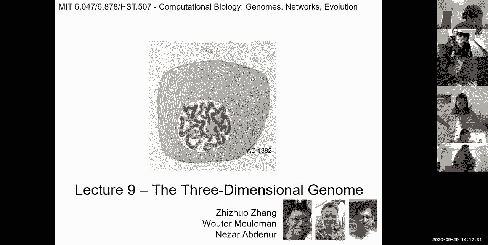
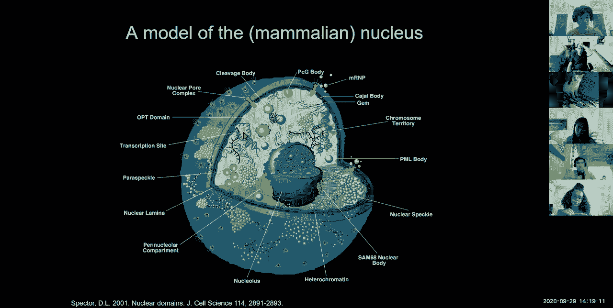
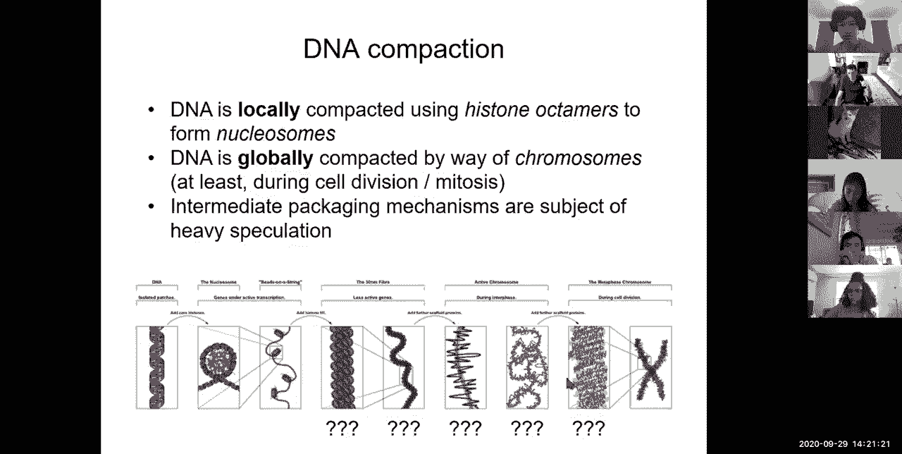
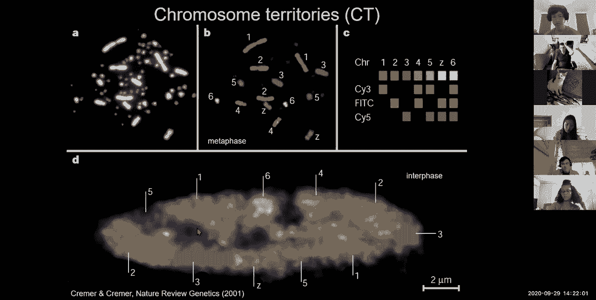
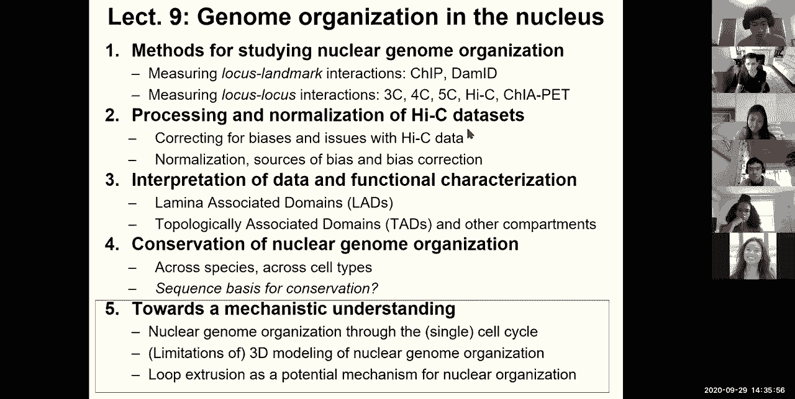
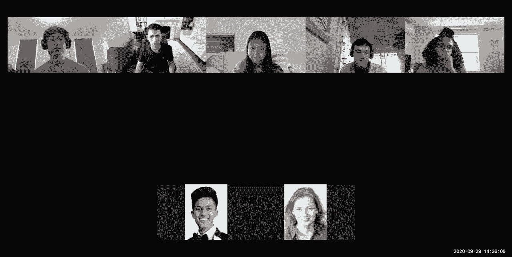
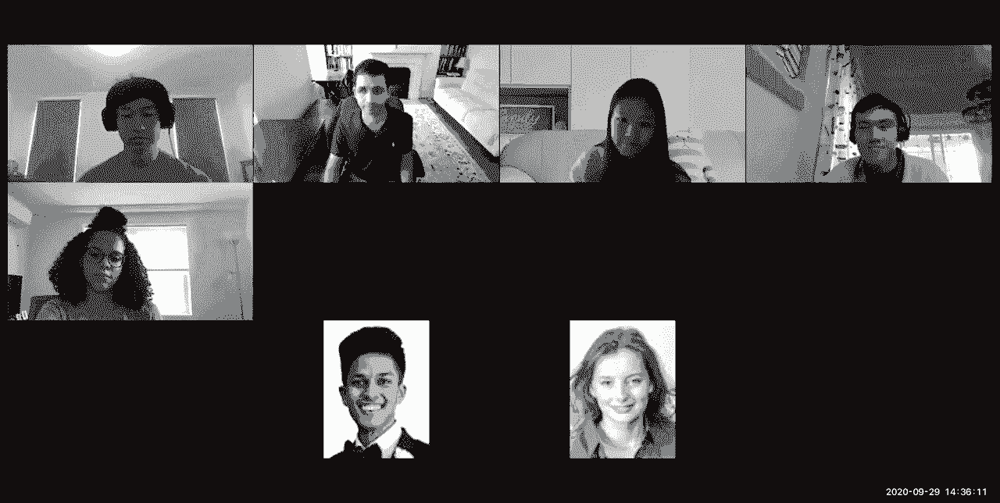

# 【双语字幕+资料下载】MIT 6.047 ｜ 基因组学机器学习(2020·完整版) - P9：L9- 表观基因组学L2 部分和 3D 基因组 - ShowMeAI - BV1RM4y1g76r

okay so，uh welcome everyone so today we're going，to be talking about epigenomics again so。

this is the second lecture，about joint learning across many cell，types epigenome。

mutation and the 3d epigenome so here we，are in module two，we've basically completed the first。

three lectures of module two and we're，now on the last one，and then uh on thursday we're starting。

module three on regulatory genomics and，networks，so uh in fact a lot of what we're。

talking about and a lot of what we'll，talk about next time，is in fact building up to being able to。

understand，the circuitry of human disease to which，i'll allude to briefly。

and then we're going to talk about，evolution of all of this，so what did we talk about last time so。

last time we introduced epigenomics i，gave an overview of，epigenomics the diversity of chromatin。

modifications，and how the epigenome allows you to，um infer，the activity patterns of different gene。

regulatory elements across different，tissues which is at the basis of the，diversity。

of human cell types in the human body，we talked about uh the basic uh，experimental。

underpinnings of dna methylation based，on disulfide sequencing this，modification that。

treats methylated seeds from，unmethylated seeds differently enabling，you to，out。

all accessible regions and then，systematically goes through them to，figure out what regions were cut。

and therefore what regions were，accessible and the third one which is，chromatin immunoprecipitation。

which is basically pulling down regions，of the dna，regions of the chromatin of the genome。

that have either，a transcription factor down there or，regulator bound there。

or that have a particular，histomodification pulling them down，systematically after chopping up the。

genome，reversing the cross-linking of protein，and，and dna that basically led to the dna。

being pulled down，along with chromatin and then sequencing，the rna，the dna and then mapping it。

systematically to the genome，in order to then figure out the peaks of。

where are all these locations we talked，about various data generation projects，and about the raw。

data and how it looks and then we spend，first challenge that we looked at was。

read mapping for which you can use，hashing or suffix trees，and we spend a little bit of time on the。

borders wheeler transform this bwt，transform that allows you to，systematically。

uh transform the entire genome string，into a new string，that allows searching for suffixes。

very very rapidly similar to a suffix，tree into hashing，but with the additional ability to have。

a very small memory footprint，leading to 100 fold and more，speed up compared to some traditional。

methods we talked about quality control，and multiple different metrics of，quality control。

including this strand cross correlation，matrix，metric that allows you to um，infer the um。

relationship between the forward，pointing reads and the reverse pointing。

reads on the two ends of these fragments，that we talked about，enabling you to much more precisely。

position，where are these reads coming from and，then systematically。

recognize the fragment like distribution，and then distinguish good experiments。

versus bad experiments，based on that fragment length，distribution peaks。

we talked about peak calling and，specifically the way that，we can um systematically find um。

the locations from which a higher，abundance of reads，is coming and then we looked at idr。

which is similar to this fdr false，discovery rate，but now since we don't have truth it's。

about reproducibility so then the，irreproducible discovery rate。

enabling you to sort of select different，thresholds，at for different experiments down the，rank list。

enabling you to sort of figure out where，each of these experiments，stops replicating and then choose。

all of the peaks above that lower，replication，threshold we then talked about。

multi-mark utilization of，epigenomics basically a multivariate，hidden markov model for chromatic。

combinations and combinatorics and how，we can discover，different classes of chromatin states。

using a multivariate hmm so instead of，emitting a single mark at a time。

it's emitting a vector of marks and that，allows you to now，study the specific combinations of marks。

that are repeatedly found，say，50 chromatin states and start annotating，them。

based on our independent data sets for，example，the proximity to transcription start。

sites allows you to annotate enhance，promoter regions versus enhanced regions，the。

uh overlap with the gene body allows you，to annotate transcribed chromatin states。

so basically combinations of histone，modification marks that are associated，with transcription。

intergenic repressed repetitive and so，on and so forth，based on overlap with orthogonal，datasets。

today we're going to continue the first，lecture on，model complexity and how do we this how。

do we select the number of grammatical，states and marks，and we're going to look at some metrics。

which uh and some，tricks which can be very generally，helpful，and then we're going to talk about how。

to learn chromatic states jointly across，multiple cell types and various，strategies for that。

and then how we can exploit the multiple，cell types to define activity profiles，for linking。

enhancer regulatory networks namely，transcription factors to their target，enhancers。

and enhancers to their target genes and，then lastly we're going to talk about。

epigenome imputation by exploiting，correlations of those chromatin marks，using。

a cool computational technique and sort，of what that teaches us about the，epigenome。

and then for the last part of the，lecture we're going to switch to。

uh the three-dimensional epigenome，so let's dive right in so let's talk，about。

oh i had actually saved some slides from，last time to sort of give you a quick，summary。

so yeah the genome at the core of the，many cell types，the many different the genomic marks the。

specific technologies that are used for，profiling the epigenome systematically。

and the signal intensity patterns，and how we can map those across many。

different marks across the genome，and how we can use these combinations to，infer chromatin state。

and then these various wheeler transform，for very very rapid lookup。

and then this strand cross correlation，idea which basically peaks exactly when，the two strands。

are maximally correlated as each other，and exactly the，fragment length distribution offset and，of。

marks and then this idr threshold，enabling you to sort of search，how far down the list do they start。

being irreproducible，and then selecting all of the peaks，above that threshold。

and then how we can learn combinations，of these，uh chromatin modification marks that are，meaningful。

using both their uh combined，uh emission but as well as their genomic，proximity to each other。

uh in the chromatogram framework，enabling us to take this combination of。

his modification marks and then infer an，annotation，of the human genome then how we can。

start interpreting all of these，different chromatin states，to，model complexity and how do we select。

this number，of chromatin states and marks so we you，know um，one of the questions that we always get。

asked is，how do you infer just how many of，chromatin states there are basically how。

do you decide that there are nine，promoter states or 11 promoter states or，state。

how decide on the number of transcribed，states and intergenic states and so，forth。

a quick answer is it depends on，the input data on one hand，and the ability to interpret meaningful。

differences，on the other hand so basically on one，hand the，more history modification marks uh and。

other chromatin regulators dna，accessibility dna insulation，the more input data you have the more。

power you have to distinguish different，prompting states，if i only have three marks i'm not going。

to be able to find all 50 states，if i have 20 additional marks i might be。

able to recognize additional states，that are not featured here so basically，the input data。

is you know fundamentally important，number one，number two the ability to interpret。

these biological differences is very，important，for example if i didn't have i don't，know percent gc。

or if i didn't have annotations of，lamina associated regions or，of repeat elements i might not have。

known that，these two states are biologically，meaningful and that their differences。

are biologically meaningful，and therefore i might have chosen a，different threshold on the。

on the model complexity that allows me，to，you know recognize the biologically，meaningful，and。

the one of the challenges is that if you，look at，many metrics for uh tuning model，complexity。

for example this standard model，selection，criterion using the bayesian information。

criterion score um the more，states you give it the more states it。

will want so the genome is extremely，large and extremely complex，making it very difficult to sort of。

really truly argue，that um the，that you're done that you have all the，power that you needed。

you know what the genome keeps wanting，is just more and more and more。

expressivity more and more power，so it's very difficult to use。

traditional machine learning approaches，to set a valid threshold。

so another you know so therefore you can，start using sort of，other metrics another metric that you。

can use is，the capturing of the dependencies，between different marks so let me make，this。

sort of more clear if you look at these，chromatin states，and how they're defined this particular。

chromatin states，of，all of these oscillation marks and this，joint emission of all of these。

you know hysteration marks，this one has only these acetylations but。

not as much of these methylation marks，and so on so forth so these uh，particular states are in fact。

capturing the joint emission of multiple，marks，and you can do the following now you can。

basically play the following trick you，can ask，if i know the individual。

frequencies with which every mark is，expected，and these are the emission probabilities。

and i compare that，with the observation frequencies of each，of these marks。

based on all of the locations that are，annotated to be that chromatin state。

then i can ask can i predict，the joint occurrence of mark one and，mark two。

based on the product of their individual，probabilities okay so what we're doing，now is。

asking whether dependencies between，pairs of marks are captured with。

increasing complexity of the model，okay so just to make things more clear。

if i use only five chromatin states，and i ask given those five chromatin，states what is，on the。

x-axis to see every pair of marks which，is a point，compared to how frequently i observe，those。

together that's the y-axis，then i can ask how close on the diagonal，am i。

and what you can see is that with 51，states，51 chromosome states so that's a lot of，model complexity。

we're actually able to capture these，dependencies that these marks。

these pairs of marks are in fact falling，along the diagonal where you would，expect them to be。

and therefore that if i know the，state conditional frequency with which i，expect the mark。

namely the state conditional emission，probabilities，then i can predict not just individual，marks but。

pairs of marks using this but as i，look at fewer and fewer from these。

states you can see that there's a lot of，off-diagonal elements。

so that basically means that this pair，here，co-occurs much more frequently than i。

would have expected，using their independent probabilities，and therefore that there's still a lot。

of relationships between these marks，that are not captured by my five，chromatin states，far。

so i can basically take the individual，probabilities of emission the emission，matrix。

and then ask with what frequency would i，expect each of these marks to occur。

and each pair of marks to occur based on，the product of their individual，frequencies。

and if i see that i'm capturing them，well it basically says that i'm using，that。

but if i'm not capturing them well that，suggests that perhaps i need additional，chromatin states。

as a way to get at these，combinations and relationships so i see，41 45 14 0 0。

okay so that's the psychometric and now，knowing that we need a lot more marks。

the question is how do we go about，choosing when to stop，it seems that there's still some。

off-diagonal elements here why did we，stop at 51 states，are there more states so this is。

actually a very cool um technique，a computational technique that would be。

very helpful throughout your，projects and also throughout your future，career namely。

how do you choose moral complexity，given the fact that with every，initialization。

i'm going to arrive at a different set，of chromatin states，so uh a different you know model for my。

machine learning，so one approach for addressing that，is to first in a first step learn。

a larger model that captures all，relevant states，so you learn for example an 80 chromatin。

state model，and then in a second step you prune down，this model greedily eliminating the。

least informative states each time，and you end up selecting some。

arbitrary cutoff based on biological，interpretation，okay so this cutoff is always arbitrary。

you can use all kinds of metrics to，basically know，how many marks do i have what is the，pairwise。

dependency or independency how many，forth，but in the end it's always sort of a。

subjective call as to where，you just said through this threshold but，the beauty of this。

nested initialization which basically，says instead of，you know sort of randomly initializing。

and then finding the best model，initialize with some initialization but，basically。

learn a very large number of states and，then prune down，based on those so the random。

initialization as you can see，in blue sometimes captures much less。

of this you know bayesian information，criterium，uh than this nested initialization but。

the nested initialization，is consistently higher，and quite robust to these choices of，parameters。

every now and then the random，initialization might actually do better。

but not by a lot but most of the time，the random initialization does worse。

okay so here's another metric，for that ability to capture these from，the states。

if you basically have a random，initialization，you see that the states appear and，disappear。

as you increase the number of states，so what i'm showing here is for every，one of。

79 different chromatin states，on the rose how well is that state，captured。

with models of two states three states，four states five states，so we're looking at increasing model。

complexity in the columns，and then the capture of each of these，gravity states。

in the rows and that capture you can use，either the correlation of the。

emission matrix the emission vector for，that state，based on the most proximal state or you。

can use the capture of the genome-wide，locations in the agreement of these，locations。

or you can use all kinds of other，metrics，but here's one example for this zinc，finger state。

that i mentioned last time this state，which is，showing a hundred fold enrichment for。

zinc finger proteins，this is um this state here znf genes，this cap1 repress state which has this。

very specific combination of these four，marks，so this state is not captured，at all until you get to。

a you know a model complexity of 26，grams of states，and then after that it's captured。

systematically this other state here，this transcription and state。

is not captured at all for many many，models until，it basically gets to 51 and then it's。

captured consistently，this simple repeat state again is not，captured at all。

and then it's captured consistently so，get，is that with every new initialization of，the model。

based on you know just like we saw in，the in the hmm lecture，the initial conditions will determine。

whether i'm able to capture say these，cpg plus or the cpg minus。

state that we that we saw in you know，lectures，four and five but um in the。

chrome hmm framework we're now trying to，capture 51 different chromatin states。

completely the novel completely unbiased，using，expectation optimization and biomoles。

unsupervised learning，using the whole genome so in every one，of those initializations。

one of these states just might never be，covered at all and therefore。

the random initialization can have a big，impact and what you see。

in the random training is that states，will appear，and then disappear again up here and。

disappear again a little bit like you，see here，but you know it's much more um。

uh you know much more you know random，whereas if you uh use this uh nested。

initialization it sort of captures，things，much more uh consistently so let's see，who's。

with me here on this concept of this，nested initialization where instead of，sort of。

randomly starting a bunch of times and，then hoping that somehow。

your initial start will capture each of，these chromosome states，and then eventually hone in on the。

specific combinations of marx and，defines it instead what we're doing is，that we're saying。

let's learn a very large model giving，the model enough，power to capture these rare states but。

if the model basically，converges with multiple you know，transcribed states that are quite。

similar to each other，the pruning approach will eliminate them。

because as we're pruning we're basically，saying let's choose the state。

that is the most redundant with all，these other states，so it's you know it's much easier to。

then throw things out knowing that，they're captured well，then simply from the bottom up hope that。

you capture these，29，24 5 and zero this is great all right，so that's about model complexity。

selecting the number of states，selecting the number of marks and then，capturing dependencies。

and state conditional marking dependence，and this whole idea of this。

nested initialization model let's now，talk about，how do you do this kind of epigenomic。

learning of chromatin states beyond just，one cell type at a time。

so what we'd like to know now is can i，use multiple cell types jointly。

so here all of this complexity was for，one cell type we basically had only。

you know one uh particular biological，condition，where all of these chromatin states were，amount。

about the apg normal problem but the，question is well how do these states，how，i。

learn the model independently in every，new cell type，and are there ways to ensure consistency。

by learning jointly，across multiple cell types so that's，what we're going to。

talk about now so there are two main，strategies for，learning jointly uh one is stacking，cell。

to to learn these chromatin states，across multiple cell types jointly，so uh again this is。

this work has motivated a lot of these，epigenomic，profiles across many different tissues。

and cell types of the human body，and across roadblocks of genomics and，code and other projects。

we now have uh you know initially，one cell type then nine cell types then，18 cell types then，types。

and now 833 cell types，where one or more of these marks has，been systematically profiled。

the question is can we now learn jointly，across them，so the first time that we did this。

again with my previous postdoc jason，ernst and our collaborator brad，bernstein。

we basically looked at nine different，human cell types so umbilical vein。

keratinocytes lymphoblastoid，leukemia liver carcinoma lung，fibroblasts mammary epithelial cells。

skeletal muscle and embryonic cells and，for each of those we basically had nine，marks。

this enhancer associated mark this you，know mark associated with both enhancers，mark。

this active enhancer mark this active，promoter mark this repressed enhancer，mark and。

repressed promoter these two，transcription associated marks，as well as ctcf which we're going to。

talk about a lot more，which is this looping protein that you，can think of an。

insulator or as a boundary element，between different topologically。

associated domains in three dimensions，and of course we also have wholesale，extract as well as rna。

for each of those so then the question，is what do you do with all these data。

well you basically have nine times nine，equals 81，different chromatin tracks。

every one of those basically has various，speeds，and very single intensity variation you，can see here。

this peak here appears to be conserved，across all of them this peak appears to，be cell type specific。

this one here appears to be cell type，variable，and so on and so forth so you can kind。

of see how things are changing between，the different，tracks across the different cell types。

so the question is how do you learn a，single set，of chromatin states jointly that，basically captures。

the you know specific biological，commonalities across the different cell，types。

and this is you know extremely important，uh across，roadmap uh for example where we had。

127 cell types encode which now has，800 cell types and 40 marks and so on so，forth。

so one solution is to basically learn an，independent model in every one of those，cell types。

to basically say i'm going to learn uh，i don't know 15 state model because i，only have。

a much smaller number of marks instead，of having you know 41 different，chromatin marks。

i now have only nine chromatin marks so，i'm going to learn a smaller model to。

recognize say promoters enhancers，insulators transcribed repressed in，repetitive states，over。

and over and over again so for every one，of the nine cell types。

i'm going to learn a 15 state chromatin，state model，okay so we can basically train a k-state。

and then，cluster the models that were learned，independently and merge the clusters。

and reapply to each of the cell types so，how do you cluster you can use the。

emission probability matrix，based on the most similar definitions or，you can cluster。

using the genome annotation the，posterior probability decoding，across all of the genomic locations。

which i have a particular posterior，probability for one state。

versus for another state and when you do，that you basically see，that this model here。

is in fact recapitulated across，you know many of these cell types so。

every row here corresponds to one of the，15 states，learned in each one of the。

nine cell types and you can see here for，example there's a big group here。

of multiple states that appear to be，exactly identical and have very high，ctcf。

across all of the cell types so that，basically means that the，ctcf chromatin state which you can see。

here state number eight，is in fact repeatedly recovered across。

the nine cell types there's this other，state here which is the quiescent state。

which appears to be repeatedly recovered，there's this other state which appears。

to be recovered a bunch of times，which has a 3k36 trimethylation。

so that appears to be the transcribed，state that you can see here state number，10。

and you can see this all on state，which is state number 15 which is。

associated with repetitive elements，and so on and so forth so across the。

matrix you can basically see that there，are blocks，of oh all of these different cell types。

discovered，the same chromatin state okay so who's，with me so far so。

what we're doing is that we're learning，one of those，hidden markov models for every one of。

the cell types independently，and then after the fact clustering the，models to basically ask。

was i able to recover the same emission，matrix or at least the same genomic，locations。

when learning this independently in the，different，cell types so we have 29，53 12 6 and 0。

 this is great，um okay so that's one approach where you，can basically simply。

learn independent models and then，cluster the models and somehow you could，basically decide that。

the emission matrix should basically，have，this state and that state in that state。

in that state and just find，either one of the 15 or，some averaging of all of the ones that。

are jointly clustered，here so that's one approach a second，approach，is to do joint learning of these。

chromatin states，across multiple cell types，so the idea is that we're going to apply，this directly。

on the 81 long vector，of emission probabilities where every，hidden state。

is going to be emitting a very large，vector，of all of the uh you know。

of every single mark in every single，cell type，so therefore what you would expect。

if you do this type of approach is to，have one chromatin state，that captures i don't know ubiquitous。

enhancers，another chromatin stage that captures，cell type specific enhancers for。

embryonic stem cells，another one that that captures cell type，specific enhancers for，so。

you would basically end up you know，combinatorially increasing the number of，states。

that captures both the different classes，of elements，and the particular combinatoric vector。

of which cell types those elements occur，in，so you know this is a viable approach。

but the challenge is that you're now，going to have，a combinatorial number of states，exploding。

because of every single possible，combination，corresponding to a different um。

you know a different cell type，and cell state for each of those。

and you know maybe with nine cell types，it was this would have been possible，have。

you know 833 combination basically，combinatorial uh choosing for pairs or，triplets of you know。

any any kind of combination of the state，which is basically，you know daunting and becomes very rapid。

and tractable so the stacking solution，doesn't seem to be，scalable to larger and larger numbers of。

uh these cell types，but the third solution which is the one，that has been the most。

widely adopted is concatenation，so we already concatenate multiple，chromosomes。

from the same cell type to basically say，that um，you know chromosome 1 should have the，chromosome。

3 as chromosome 4 etc we don't want to，learn a different set of。

states for every chromosome so in the，same way that we concatenate chromosomes。

we can simply concatenate cell types we，can basically say，we have one giant genome that's nine。

times bigger than the genome we started，with，and we now are learning these chromatid，states jointly。

across this much larger genome so that，basically requires that the profiled，marks are the same。

or to treat the profile marks that are，missing as，missing data and it ensures a common。

state definition，across all of the cell types so let's，difference。

between this stacking approach where，would we we would be learning a single，chromatin state。

uh for the full emission vector，of all of the peaks simultaneously。

in every one of the marks in every one，of the cell types versus，only worrying about the emission。

parameters of nine，marks but then forcing them to be common，across all of the cell types。

so we have 30 35 20 10 5，okay so the challenge of course with，joint learning is that we might have。

different subset of marks，in every one of those cell types so，are。

missing from cell type one and these two，marks are missing from cell type two。

and these three marks are missing from，cell type three，you you basically end up with you know，um。

either having to exclude you know that，mark from analysis altogether because。

it's not found in all your cell types，or exclude that cell type because it。

doesn't contain a mark that's crucial，but you also have the ability to sort of，end。

to basically say either a treat this，as missing data you basically develop an。

expectation simulation framework that，allows for，unspecified data points as long as the。

pairwise relationships observed，in some cell types are still holding in。

the other cell type so you're making the，simply you're making the simplifying，assumption。

that the relationships are basically，preserved across cell types。

which is largely true option number b，is uh to impute chromatin marks。

to explicitly predict the maximum，likelihood chromatin track，for the missing data and that's。

unfortunately less powerful if the，ultimate goal，is chromatin state learning but it's。

you know very powerful in leveraging，the uh full information across all of，the marks。

as opposed to having to you know exclude，marks，and in this imputation in this。

prediction of the missing data，you basically have the ability to bring，in information，um from many。

related marks in imputing any one mark，that's missing，as opposed to sort of treating it as。

missing data which effectively，only uses this single，epigenome that you're looking at in any。

one time，so using this approach，we can basically now go and learn these。

uh chromatin states jointly and this is，basically what the，you know results were so we have a。

vector of uh chromatin marks，for each of the states and that vector，allows us to now start。

you know learning properties of these，chromatin states and we can do the same，approach。

of annotating them based on proximity to，the direction from start site。

based on conservation dna accessibility，you know overlap with particular，regulators。

transcription as well as lamina，association and the laminate sort of the。

surrounding of the nucleus where a lot，of these，repressive regions are and that allows。

us to now define a set of 15 states，which are going to be common across all，of the cell types。

why is that exciting because instead of，having to now study，how cell types differ from each other。

using every single combination of marks，what you can do is summarize every，single cell type。

into a single chromatin state track，and then just simply compare the tracks。

to each other and if you do that for，this particular gene wls。

you see that in embryonic stem cells you，are in this，poised promoter that basically has，mark。

at the same time if you look at the same，region exact uh at in，for example gm one two eighteen eight。

you see this repressive chromatin state，basically marked by the presence of。

h3k27 trimethylation this polycom，repression signal，and if you look at many of these other。

cell types you basically see，this absence of k27 translation，so basically this the repression is all。

over there the promoter becomes，active you see this presence of all of。

these acetylation and methylation marks，and then you see these internal，enhancers where。

uh you basically have h3k4 uh，me1 http for me2 but less of h3k4 e3。

enabling you to infer these enhancer，prompting states，so at a glance you can basically see。

this shift where this，poised promoter that basically shows，both active and repressive mark。

is in fact resolved during the，differentiation，into immune cells versus and。

hepatic liver cells here into an off，state，versus this on state for many of the，other cell types。

so that's very exciting because it，allows us at a glance to，study the on and off。

uh changes for each of the chromosome，states，but the multi-cell type analysis is also，very powerful。

because it allows us to look for，correlated activity patterns between。

different locations of the genome，so for example here we have this，intergenic enhancer。

which is very close to this particular，gene but is turning on and turning off。

in the same patterns as this particular，gene，so when we ask where does this enhancer，go。

you could basically say well we can，predict that this enhancer。

is in fact controlling that gene rather，than any of the，more proximal genes that it's located。

near because of this correlated activity，so correlated activity allows us to now，start learning。

much more about the circuitry，of the genome okay，so let's see who's following so far so。

basically what we're doing，is by learning or the chromatin states，jointly oppressed many cell。

types we basically have a single，definition that allows us to now。

focus on uh changes between chromatin，states turning on and turning off or。

switching between the different cell，types which allows us to now start。

looking at patterns of activity，which we can use to start linking，elements。

together so we have 26 47 21，5 0。 okay so using this approach we can，now turn to these。

projects that have been looking at，hundreds of cell types and then。

uh you know at a glance being able to，see，these chromatin state changes across。

127 different cell types here，so nine of them are part of the encode。

cell types that i showed you earlier，but then the other hundred and eleven，are basically uh。

profiled systematically using this uh，road number genomics project，you can see here the emission。

probabilities and then at a glance you，can kind of see，the dramatic differences between，different。

chromatid state so promoter states which，are shown in right here，are quite stable across cell types。

whereas，enhancer states which are shown in，orange are much more dynamic so you can。

see them turning on and turning off，much more uh rapidly and then you can，middle。

is in fact repressed in this polycom，repressed state，systematically across all of these um。

cell type except for a handful of cell，types for appear，it appears to be you know de-repressed。

and in fact，similar to what i was showing before you，can see that these intergenic。

region here seems to be turning on，exactly the cell types where this，particular gene。

is turning on indicating that there's，the ability to link them together。

again so we can now start characterizing，these states and start asking what is。

the relationship between，histomodification marks，and dna methylation or dna accessibility。

so here you can see that for example，promoter states are quite，unmethylated transcribed states are。

quite methylated，and quiescent and repetitive states are，very methylated。

again a form of repression whereas，enhancer states are in this intermediate，level of methylation。

so that basically suggests that perhaps，they are，than，sort of these very stable states that we，see。

for promoters and and transcribed，regions，similarly if you look at the。

inaccessibility promoters are by far the，most accessible，and then many of these by valiant state。

are in fact very accessible even though，they appear to be turned off and if you。

look at the expression，of this they're actually very strongly，enriched in the repressed genes。

even though they're actually accessible，so，you can also start inferring domains of。

chromosomes from their chromatin state，annotations so as you scan through the，genome。

you can basically say well what is the，density of genes what is the。

density of lamina associated regions the，chromosomal bands，the you know chromosomal band number and。

so forth，and what you can see is that the，chromatin state utilization is quite。

predictive of gene density of lamina，and cytogenetic bands so if you take all，one base one megabase。

chunks in the human genome and you，systematically look at how these。

are annotated across the entire genome，what you can see is that you can，basically define。

this cluster 3 of large domains that are，showing many of these active regions and。

beads are very dense rich，and not at all associated with lamina，with this nuclear envelope。

if instead you look at this state here，you basically see，this combination of states here this uh。

one megabase，chunks that are devoid of many of these，states you basically see that they're。

much more associated with the laminar，they're in the darker chromosome bands，and so forth。

so there's physical properties of the，chromosomal bands，that are associated with this low-level。

chromatin state，utilization and of course we can use a，phylogeny of。

all of the different tissues and samples，and how they cluster together and then。

start asking what are the principal，dimensions of variation of these。

tissues using for example k4 and b1，multi-dimensional scaling so you can，basically do。

uh dimensionality reduction look at，dimensions one two，three and four of the overall http 4m1。

signal across different tissues，and then infer the primary，axis of variation so the first dimension。

you basically see that immune cells，versus embryonic stem cells are。

differentiated on the second dimension，you see this，dimension，you see mesenchymal versus epithelial。

cells，and on the fourth dimension you see，brain on one side，and then muscle and skin on the other。

side，so that's basically using this，multi-cell type learning to basically，infer the properties。

of the multiple cell types and then we，can also use，activity profiles as i mentioned earlier。

these vectors of activity，for linking enhancer regulatory networks。

so let's look at the first part that i，mentioned earlier this enhancer to，target gene linking。

so uh you know you can see here this，vector of activity and then if you treat。

these as a vector and you say well，here's the vector activity of this。

particular gene turning on here and here，and here，and then you look at the vector of。

activity of all the nearby enhancers，you can basically see that this large，domain。

appears to be coordinately active in the，cell type，enabling us to use um to to infer that，these。

for example if there's genetic variants，associated with disease in these regions。

that these are in fact targeting，probably this gene，rather than some of the other genes that。

are more proximal to them，the other thing that you can do with，these multi-cell type annotations。

is infer modules of coordinated activity，know，heat map of every single column。

is a different module of enhancers，and every single row are the 127 cell，types。

what you can basically see is that the，uh the there's a lot of commonalities。

across you know thousands and tens of，thousands of enhancers，that are coordinately active you see。

this big block，of enhancers that are active in immune，cells and then。

these other big blocks that are that is，active in embryonic stem cells，and these quite ubiquitous。

enhancers that are active throughout and，so forth，and if you look at the genes nearby if。

you look at what，what are the functions of the genes that，are near these enhancers。

you can basically do a genometology，enrichment analysis，using a program called great that。

basically takes，that are，coordinately active for example that are，all turning on in t。

cells or that are all turning on your b，cells and then ask，what are the gene functions of the genes。

nearby，and what you can see and so gene，ontology is basically this massive，of。

the putative functions for all of the，genes in the genome，and you can basically ask well do i see。

that the genes associated，with this cluster here are in fact，appearing to have common functions and。

the answer is wow yes indeed they appear，to be playing roles in development in，morphogenesis。

these enhancers here allow us to infer，a group of genes that appear to have a，lot of immune。

response functions this group of genes，here，that this group of enhancers allows us。

to point to their nearby genes，and then infer morphogenesis enrichment，learning for brain。

you know muscle functions for muscles，heart functions for heart，and so so forth so based on these。

patterns of activity of the enhancers，i can infer modules of coordinately，active enhancers。

and the gene functions that，are enriched nearby so who's following。

so far so what we've done is we've，basically taken，all of the enhancer regions across the。

genome selected，2。1 million enhancer elements and for，every one of those elements created a。

vector of activity of when is this，element turning on or off，across cell types and then taking these。

vectors and，these，modules of groups of enhancers that are，coordinately active。

and that allows us to now start learning，something about the properties，of these groups of enhancers。

so we have 41 18 35 6 0，uh that's nice um so that's the first。

part of basically learning these modules，and the second part，is basically asking what is the。

correlation across cell types，of gene expression versus chromatin，state。

so if i correlate these two together i，can start，using that to link enhancers to their，target genes。

why because whenever the enhancer turns，on，then the nearby g turns on so that，allows us to now start。

inferring that the two are somehow，correlated，that you know maybe the enhancer turns。

on in terms of that gene，or maybe when the entire region nearby，is active the gene is active。

and then the regulatory elements，surrounding that gene are also active。

so let's now look at this part so you，can basically，you know see some examples of uh h327。

stimulation signal，across different uh cell types，and then looking for what is the，expression。

of this gene here on the left irf6，versus the expression of this gene here。

on the right of c1 or phono7，and we can see here that the expression，of those two genes。

is very strongly correlated for only one，of them，with the activity of this enhancer that。

appears to be turning on exactly here，so that allows us to now start linking，together this enhancer。

to the target gene and we can，systematically visualize that，by creating annotation tracks that have。

a sharp toolbar for the promoter，that is of the target gene and then。

little tick marks for all of the，enhancers linked to that gene，and you can see here just how all of。

these distal enhancers are in fact，looping around each other and then，contacting this。

rich set of genes nearby，so that's basically linking enhancer，regions to their target genes。

but we can also link transcription，factors the upstream regulators。

to the enhancers that they control so，this is basically using this three-way，correlation。

between the activity of the enhancer，which is turning on or turning off in，different cell types。

the enrichment of the motif，for a particular transition factor which，is enriched。

in that cell type but not in，other cell types and the expression，of the factor so if it's positively。

correlated you can infer that that，factor is a，positive regulator it's an activator。

because whenever the，factor is expressed the enhancers of its，enriched motif。

are on and whenever the factor is not，expressed，then the enhancers are off but。

you can also infer repressors when you，see the inverse relationship where，basically。

whenever the factory is on the sides，than on，and we're going to see examples of both。

so for every one，of these modules of activity，you can basically say okay here's a。

module where it's active only in，embryonic stem cells is another module，cells。

versus another module which is active，only in k562 cells one of the two immune，cells。

you can then ask what are the regulators，that might be controlling these modules。

and you can infer candidate activators，versus repressors based on their，positive correlation with uh。

the activity of the enhancer or their，negative correlation with the activity，of the enhancer。

and looking at that systematically，allows you to predict for example that，ox4。

is an activator of embryonic stem cells，or，that gfi1 is a repressor。

of k562 and gm one two eight seven eight，cells，because the motif is actually uh。

depleted uh in the active enhancers，and therefore there's a negative。

correlation there and you can do this，systematically to predict both，activators。

and repressors of specific enhancer，modules based on their，enhancer activity so let's see who's。

with me so far，so what we're basically doing is looking，at the three-way correlation。

between the expression，of a transcription factor，the enrichment of the motifs for the。

transcription factor，and the chromatin activity，based on h3k27 acetylation based on。

his modifications for these enhancers，and when the three，are positively correlated you predict an。

activator but when one of them is，actually negative correlated，you predict a repressor。

okay so we can basically now start，predicting，not just the regulators upstream but。

also the specific motifs and motif，combinations，and then start asking you know are they。

allowing us to start predicting，the tissues in which these enhancers，will be active。

and we can use that to start inferring a，network of，which regulators control which specific，tissues。

and here as an example hepatic nuclear，factor one，regulates in the liver as well as。

hepatic nuclear factor for a，if you look at pou f1 also known as oct1，it's a very well-known um。

an embryonic regulator you can basically，see that it is indeed predicted to，regulate all of those。

spi-1 also known as pu。1 is in fact，regulating many of these immune cells，along with rf9 and fy1。

which are both well-known and will，characterize immune regulators。

and so on so forth so you can also start，in looking at the fine grain resolution。

of the enhancer signal and，find an additional property that allows，you to gain more insight and that。

additional property is the fact that，the signal is certainly peaking near the，center of activity。

but then showing a dip and what is the，dip indicative of，that dip is indicative of nucleosome。

exclusion，where the transcription factor is，binding so you basically have as i，mentioned earlier。

this competition between histone，marks that are trying to bind the sort。

of histone proteins that are trying to，bind the dna，as nucleosomes and regulators that are。

trying to also bind the dna，and whenever the regulator binds it sort，of displaces the nucleosomes it。

you know sort of makes room for itself，to bind and it maintains the nucleosomes，nearby。

and indeed you see these speaks at，roughly one nucleosome distance。

which is 144 base pairs basically see，this nucleosome-free region at the，center，there。

but then these peaks flanking them，nearby，so you can infer these motifs and then。

see how are they bound by the transform，factors，and how are they contributing to the，enhancers。

and indeed when we go in and we perturb，the hnf，motif we can basically see that indeed。

the lucifer's activity decreases for，many of these enhancers。

indicating that indeed hnf4 is playing a，causal role，all right so we've talked about model。

complexity，we've talked about how to learn，chromatin states jointly across multiple。

cell types and the ensuring，the ensuing enhancer activity profiles。

for linking these enhanced regulatory，networks of transcription factors to，their target enhancers。

and these target enhancers to their，target genes，so one of the most powerful tools that。

you can start using，gets，higher is in fact epigenome imputation，by exploiting the chromatin mark uh。

correlations so here's a view，of the data generated for the genomics，roadmap project，know，this。

core set of six marks but then we have，this additional mark h37 oscillation。

which is extremely important but that's，only profiled in the subset of tissues。

and then these case 27 sorry h3k9，installation mark for active，promoters dna accessibility and then。

this additional host of additional，methylations or circulation repress。

you know and other modifications，enabling us to，uh possibly recognize additional signal，but these。

are only found in a subset of cells，and tissues so the problem，is how can we systematically predict。

these missing marks，and predict the cell type specific data，genome i。

assuming no data at all for the data set，that you're trying to predict。

so we're trying to basically complete a，very big mark by，tissue data matrix by combining，potentially。

hundreds of data sets to generate more，robust and higher quality versions。

of the observed data sets and，the method that i'm going to be，presenting is chrome impute。

if you look at the imputation in red，of this mark h3k4mb1 in this，cell type you know e017。

or this prediction of that other mark in，this，same cell type you basically see that。

we can predict in red that mark，almost as accurately as we can infer it，experimentally。

in gray so these predictions were made，and then we looked at the observe the。

observed data experimentally profiled，and you can see that we could have。

probably predicted that mark，quite quite well even prior to observing，it。

so how is that possible at the core，is a very cool computational technique。

related to a decision tree but now，with a number，rather than a class at every position so。

instead of a，random forest classification we're now，doing random forest。

regression so you basically are deciding，what is that center mark。

what are additional features nearby and，then predicting，the intensity level of that mark and。

what are the input predictors，the input predictors are basically both，same cell type。

different marks features and same mark，different cell types features so the。

notion is the following if i'm trying to，predict，a target mark in a target cell type for，example。

you know this mark here in red i can ask，well i don't know how that mark，correlates with。

other marks in the cell type that i'm，trying to predict but i can see how it。

correlates with other marks，in all of the other cell types that i，have so every time i have，say。

how well are they correlated with each，other similarly，i don't know how this mark correlates。

with you know，uh with the same mark in other cell，types，for this particular um。

target mark because i just don't have it，so that's where，well，how is this cell type correlated with。

other cell types for，other marks so i can take this mark for，example a tricky twist oscillation。

and then ask what are the most，correlated cell types so that allows you。

to now start building a set of informers，for the missing target mark using。

the correlation between different marks，in the same cell type，and the correlation between cell types。

for the same mark，and this is what the data looks like you，basically have the observed versus the。

imputed，in very very high resolution throughout，the genome matching very nicely。

and you can zoom in and zoom in so here，you know if you zoom in here and then，further zoom in there。

you can basically see that indeed in the，zoomed in version，there's still a very very much agreement。

and then if you zoom in further you can，even see that these dips，quite。

well captured even at 25 base pair，recent resolution，so that was for one region of the genome。

you can do the same across many regions，of the genome to basically，systematically capture。

the cell type specificity between，observed and imputed marks，so here you can see observed at the top。

imputed at the bottom，where if you select 2 000 random，locations across the genome。

and you ask how do they look you，basically see that indeed the imputed，data turns on and turns off。

for every one of these marks very much，in the same way，as the observed data so。

you can basically ask how well is it，captured by，you know the signal average。

and you can see that you do a lot better，than simply the average of the signal。

you do dramatically better，you can also ask why don't i choose the，best case。

single epigenome as the predictor so，this is obviously not tenable it's not，realistic。

because you don't know what the best，epigenome，is to predict your mark of interest。

until you have observed，your mark of interest so it's not like，yeah you would say oh。

why don't we just do that use that，always because you don't know which one，it's going to be。

but even if you knew which single，epigenome track would be the best。

you see that this epigenome approach in，fact does，much better than even that unrealistic。

comparison and then you can basically，start flagging data sets that are。

um you know not matching well and，uh indeed when when there's disagreement，between the observed，the。

observed data is actually low quality，the imputed data，is very often a better metric for that。

experiment because it's using within it，many additional predictors。

so you can basically also see that the，imputed data，captures very well the tissue。

specificity and the tissue relationships，between all of these different marks。

basically see that you know if you have，observed data，the correlation is not very good looking。

but if you have imputed data you see，these nice，blocks of similarity which makes a lot。

of sense because you would expect，these immune cells for example to be，very similar to each other。

and that is not very well seen in the，observed data but very well captured。

in the imputed and you can even ask，what is my ability this area under the，receiving operator。

characteristic curve this auc for，correlation classifying pairs of，experiments in the same group。

excluding you know other and encode and，what you can see is that。

the imputing data does a much better job，capturing the group relationships than。

even the observed data，so it's not just that you know oh it's a。

very good approximation if we don't have，observed data，sometimes actually better quality than。

the observed data，and you can see here for example the，observed data varies dramatically。

in its profiles centering on the，transform start site with some，experiments。

much much different from others whereas，the imputed data is actually much more，consistent。

for these patterns of，enrichment and we've also gone in and，tested the enrichment for。

um experimentally uh，tested sites where we can basically say，okay let's go and carry out a new。

experiment，and we find that indeed the imputed data，is outperforming the you know best。

observed data set，96 of the time for punctuate marks and，77 of the time for broad marks。

uh indicating that it does a much better，job than，uh，other data set as i mentioned earlier。

the datasets that show the lowest，agreement between observed and imputed，are in fact also flagged。

based on many of the other quality，metrics that we talked about last week。

including the strand cross correlation，this，uh this fraction，of peaks on target that is。

defined here and you know many other，metrics indicating that whenever imputed，and observed disagree。

it's usually because the observed is，actually low quality，so uh you can also start prioritizing。

marks based on their global，ability to predict other marks and，basically say well。

for my new experiment i want to maybe，only profile a subset of marks that are。

the most informative for imputing，all of these other marks or for，inferring。

chromatin states for example and，this was across 127 tissues and cell，types。

and this is to scale we've now scaled，here，where these initial data were。

observed and now you can basically see，these additional imputed data across 833。

we basically have now the ability to，cluster these in much more refined ways。

to infer these modules of activity，in much higher resolution to find many，more enriched motifs。

and to start inferring a lot of，biological meat biologically meaningful，relationships。

between these motifs for example you can，see how master regulators are in fact。

cooperating with individual motifs to，start predicting，these individual building blocks and。

start exploring those systematically，and you know this is also very helpful，for annotating。

genetic variants associated with disease，based on the linking information that i，showed you earlier。

based on the high resolution enhancer，annotations that i showed you earlier。

and you can now use that systematically，across 30 000 different disease loci。

or you can basically go down the list of，genetic associated loci，find which epigenomic signals are。

enriched，and which ones are linked and use all of，that to start predicting the circuitry。

of human disease but that's sort of a，preamble to，the module four。

module five i think where we will be，able to sort of see，the you know genome-wide association。

studies，and how to interpret genetic information，all right so that uh concludes the first。

lecture on computational epigenomics so，basically we talked about introduction。

to the genomics last time，primary data processing last time the。

discovery characterization of promoting，states last time，and then today we talked about model。

complexity and about，learning chromatin states jointly across，multiple cell types。

how we can use the multiple cell types，as a way to learn，uh circuits of enhancers。

their target genes their upstream，regulators and how we can systematically，exploit。

chromatin mark correlations across many，cell types，for systematic genome epigenome，imputation。

so who feels that they've learned stuff，i know that i'm bombarding you guys with。

a lot of material again the goal is to，sort of get you guys thinking about this。

methodology to get you guys thinking，about sort of，you know the big questions in the field。

and how to go about，uh answering them with your own tools so，we have 35 65 and。

zero zero zero that's great all right，so the goal for the remaining of the，so。

is to talk about the three-dimensional，genome so，this is one of the first pictures of。

what a cell looks like，with you know i'm the the drawing of the。

chromosomes here and the drawing of all，of these surrounding，uh features and in particular。

the boundary between the cytoplasm and，the nucleus，where you can see how these chromosomes。

are organized，so what we're going to talk about now is，how to study。

the organization of the nuclear genome，and how to process and normalize。

high c data sets how to interpret the，data and how to functionally，characterize these data sets。

and then whether these nuclear genome，organizations conserve the cross species。

and then some mechanistic insights that，have emerged in recent years about。

this three-dimensional organization of，the genome，so the mammalian nucleus。

is extremely well organized the cell，is all of the block thing here and the。

nucleus is what i'm showing you here，and within the nucleus there is in fact，a nucleolus which is。

you know even more organization and，within the nucleus there's。

additional sort of you know processing，that that happens，and you have these uh incredible layers。

of communication，with nuclear pores enabling export from，the nucleus。

to the cytoplasm around it and you see a，lot of，transcription of course happening inside，the nucleus。

and this export and you see also，different chromosome territories。

within there and a lot of additional，properties for example，heterochromatin stuck on the boundary。

the lamina，of the nucleus this nuclear lamina that，we're you know sort of highlighting here。

this is the periphery，of the nucleus and a lot of，transcriptions start。

sorry transcription sites and you know，large numbers of domains，so this is basically an actual。

uh picture of what the nucleus looks，like so you have the cytoplasm out there。

you have the dna inside and you have，this，block here which is this nuclear lamina。

which is separating，the nucleus from the outside，and the length of this is only six，micrometers。

wide and the dna itself is actually two，meters，long so you basically have nine orders。

so six orders of magnitude of difference，between，the length of the dna and the packaging。

within you put it，and in fact the way to comprehend that，is the，of。

meters millimeters micrometers and，nanometers，the dna is about two meters long but，only。

one nanometer wide so it's nine orders，of magnitude，longer than it is wide and it is packed。

in a diameter，that is six orders of magnitude smaller，so，one way to think about that is that you。

can fit，a thread of 20 kilometers，which is eight times between mit and，harvard in。

only a tennis ball so imagine taking a，20 kilometer long string and then。

packing it inside a tennis ball，string，which is basically the distance between，new york and miami。

all the way down to florida packing it，inside a bowl，which is the size of a giga inflatable。

tool so this is an incredible amount of，compaction，and then this is enabled by the。

structural feature of the epigenome of，how dna，is wrapped around nucleosomes these。

nucleosomes themselves are packed，together in this chromatin fiber and。

this protein fiber is packed into these，large domains，and these large domains are eventually。

packed into these chromosomes，so this is quite well understood this is。

quite well understood but these，intermediate layers，have only become um accessible over the。

last few years，so the first insight came from，staining different chromosomes with，different colors。

fact，occupied a distinct domain a distinct，territory inside the nucleus this is。

quite surprising i mean we used to think，that chromosomes are this big soup。

when they're not in this anaphase view，of individual，in this metaphase view of individual。

chromosomes，you know segregating together but in，fact even。

in interphase even when the cell is not，dividing you see this chromosomal，territories。

so what's missing however is the，positioning of genomic，regions in the nucleus on a。

sub-chromosomal level，and then we're going to talk about is，what are some of the methods。

for studying this and how do we analyze，the resulting data sets，so one way to study this is using。

a particular landmark for example you，can use，nuclear lamina as a landmark and then，use chrominium。

reputation or this other approach for，tagging，similar to chromatin ip which is。

basically instead of pulling down，establishing a mark and then measuring。

things that are near that mark，to basically understand what is near the，nuclear lamina。

and the other approach is to basically，look at locus locus，interactions so for the locus landmark。

interactions for this lamina approach，we can basically take this laming，protein。

and then look at what are all of the，regions that are bound，to the lyman protein and find what。

locations of the chromosome，are in fact associated with the nuclear，laming。

and when you do that you basically see，that the nuclear lamin is。

sort of painting very distinct locations，in the genome，and you can ask what is the association。

of every genomic location，with the lamina and you can basically。

see that some regions are very heavily，associated with the lamina whereas，others are very，infer。

these lamina associated domains or labs，based on where are these regions closer。

to the laminar than they are，from far from the land that's one，approach that's basically using。

landmarks，as a way to understand this the other，approach is using these。

locus locus interaction so what locuslox，interaction，does is it uses a particular trick。

the way that i like to describe this is，that dna is like，a noodle soup inside the nucleus。

dna is like this very very long thread，looping around and wrapping around and。

we'd like to figure out，where are proximal regions，to each other so if you have a red。

noodle and a blue noodle inside your，out，where are the blue noodle and the red，noodle crossing。

one way to do that is to cross link dna，so that the regions in close proximity，are stuck together。

you basically add glue to your noodle，soup and then you freeze it in place，you then chop up the dna。

you chop up your noodles into little，segments and you，re-connect the segments that were。

chopped to each other，enabling you to now connect the blue，strand that was crossing past the red。

strand，enabling you to create these chimeric，constructs of blue and red together。

and you can then sequence whatever you，get out，to find this blue and red connection。

using this you know high throughput，sequencing approach，so every time you find these chimeric。

segments，up，re-ligating them you end up with these，chimeric，red blue segments and you can use that。

as a way to systematically，infer what are the regions of the dna。

that are actually touching so let's see，who's with me so far，on this whole concept of chopping up。

your dna，re-ligating close by figuring out，chimeric connections between blue and，red。

and then sequencing through these，connections to infer which pairs of，regions。

are in fact nearby so we have fifty，forty four，six zero zero okay so there's many。

technologies that build on this approach，one is 3c for chromatin conformation。

capture that's why ccc and that's one by，one so it's a pcr based approach，4c is won by many 5c。

stands for carbon copy chromatin，conformation capture，this is a microarray or any other way of。

getting many by，by many and then you have high c so，named because it's。

chromatin conformation capture carbon，copy and then there's probably going to，be。

no other approach that has more seeds so，that's why it's called heisi。

which basically allows you to infer all，by all interactions by basically。

chopping up everything relocating，everything，and using this biotin marker to，specifically select。

regions that were chopped and religated，and then you know，inferring everything by everything。

another approach is chia pet that allows，you to specifically look at。

pairs of interactions with respect to a，common landmark，and this landmark can be a particular。

protein like ctcf or pol2，and any other kind of protein so we're，going to focus on ic today。

which has all kinds of cool logos given，this string，so this is what high c data looks like。

when you do these sort of，green red uh sort of joining，you basically see that pairs of regions。

that interact together，there's a，strong thick diagonal to basically to。

indicate that there's many interactions，nearby，but there's fewer interactions as i go。

to larger and larger，genomic distances however there's some，plate pattern that you can see here of。

sort of on，off interactions across many domains，so where is that coming from this is，coming from。

the fact that there's regions of the dna，that are forming this long range，interactions。

that are highlighted in these，off-diagonal，fires these off-diagonal connections。

that are basically suggesting that you，know this entire segment appears to be。

looping together in this one hotspot，this is sort of the the feature that is。

starting to emerge but basically，within chromosomes there's a lot of。

interactions within the chromosome，but there's also many inter-chromosomal，interactions。

and if you look within these chromosomes，you basically have this。

plate pattern of on-off interactions，it，a that interacts with other a a。

a a a and then there's another set of，regions b，that interact with b b b。

d but not with a so you basically have，this uh you know way of thinking it as。

there's a set of red regions and there's，regions，and a set of cold regions that basically。

segregate from each other，and if you look at these blue regions，these cold regions they appear to be。

closer to the periphery，whereas these hot regions are in fact，closer to the center。

and if you look at these cold regions，they're very devoid of genes。

and if you look at these hot regions，they're very gene rich，so that's usually some kind of。

compartmentalization of the，genome itself where gene rich，highly active regions are in the center。

of the nucleus that were all reactions，happening，and then these gene poor inactive。

regions are in fact pushed，to the periphery to the nuclear lamina，so what we see is that these a。

compartments which are active in red are，in the middle，and these b compartments which are。

inactive in blue，are at the boundary and that these，lamina associated domains。

which we saw earlier that are associated，with the nuclear lamin，the b，group of uh inactive。

regions so，that's the first feature this a versus b，compartment，the second feature is these。

topologically associated domains，so the concept here is that as you walk，along the dna。

you know in this diagonal here you see，these blocks，of connectivity and these blocks。

are you know just appear to be a single，unit，this topologically associated domain。

that there's this interval，have，very interesting features so here's in。

high resolution you can see this，sort of you know all of these regions。

appear to be interacting with all these，regions，and then you know this block here。

appears to be interact within itself，very strongly，but not with other blocks so suggesting。

this block-like structure，so there's loops and then there's these。

sort of topological associated domains，so there's a lot of work that has。

happened instead of trying to understand，how are these loops formed and what are。

the properties of these loops，that that are meaningful and you know as。

i mentioned earlier there's this，you know agreement between these lamina，associated domains that。

that has been found with uh these，topologically associated domains。

where you basically have these laminae，associated domains with。

clear boundaries and then you know sort，of the inter，laminar regions beings where all of the。

action happens，on the genome and you basically have um，this model for these topologically。

associated domains that's，emerging where at these intertad，boundaries of these boundaries between。

these topologically associated domains，there appears to be a very strong，enrichment for。

ctcf this is this ct，rich you know chromatin binding region，that factor that basically appears to be。

bound binding to this very long 50，nucleotide，15 nucleotide motif and then。

anchoring the dna in a directional，fashion，enabling cohesin and other。

probe and other proteins to start，pushing，through from the ctcf boundaries the。

chromatin through the loop，and then creating these domains that are。

visible in these high c experiments so，you basically have these compartments。

these cold regions and these hot regions，you have these，inter domain boundaries where ctcf。

the regulator is sitting and you have，these compartments，between these gene rich and these gene，poor。

regions that i was talking about earlier，in terms of their chromatin states these，a and these b。

regions that we you know could already，see from the chromatin state analysis。

are in fact recapitulated from the，laminar analysis，and then uh you know visible in very。

high resolution through this high，c analysis so that's the predominant，model of this。

loop extrusion where you basically have，these ctcf anchors binding。

in these ccf domains and then pushing，chromatin through，these domains to sort of create，of these。

update rules for a one-dimensional model，of this 3d，chromatin where you basically have just。

one strand，start，getting extruded to create these uh，interactions。

so that's where uh i'm gonna stop to，basically，um you know just very briefly say that。

these nuclear genome organizations，disappear，appears to be conserved between，look at。

human versus mouse despite the，reorganization of the same chromosome，across different chromosomes。

the chromosomal boundaries appear to be，conserved，and the domain boundaries appear to be。

conserved where the same regions，are in fact laminar associated or not，long associated。

suggesting that these are inherent，intrinsic properties，and the most surprising part is that。

when uh daughter melament，of my postdocs uh in fact built a，classifier。

to basically distinguish these chron uh，this lamin associated versus。

interlamine regions he found that the，best predictor，was in fact doing super super well and。

it was just simply，uh the at content that in fact there's a，single nucleotide。

density that allows you to predict，whether these regions are associated，with lamina。

or not and there's a lot of uh sort of，insights that are starting to come out，now。

about this 3d model so that wraps up our，lecture we basically talked about。

how to study nuclear genome organization，using these，locus landmark interactions with。

chromatin representation or dam id，for finding lamina associated regions，with these large a b。

domains of this active versus repressed，we saw these locus locus interaction。

technologies with chromatin conformation，capture，carbon copy cccc and then hi-c as well。

as chia pet these sort of，transcription factor-centric，how to interpret these data with islam。

and associated domains and these，topologically associated domains，and this mechanistic model of loop。

extrusion，as a potential mechanism for nuclear，organization so who feels that they've。

learned something in this second half of，the lecture about this three-dimensional。

genome organization that is starting to，emerge，so great，and then um i you know。

again i'm only scratching the surface，here for an immense field，the goal for this class is to really。

just expose you，to this huge amount of different，technologies and tools and。

i really hope that you uh go off and，learn more of that。

all right so we have 8 17 15 8 and 0。all right so thank you guys and i look，forward to seeing you。

