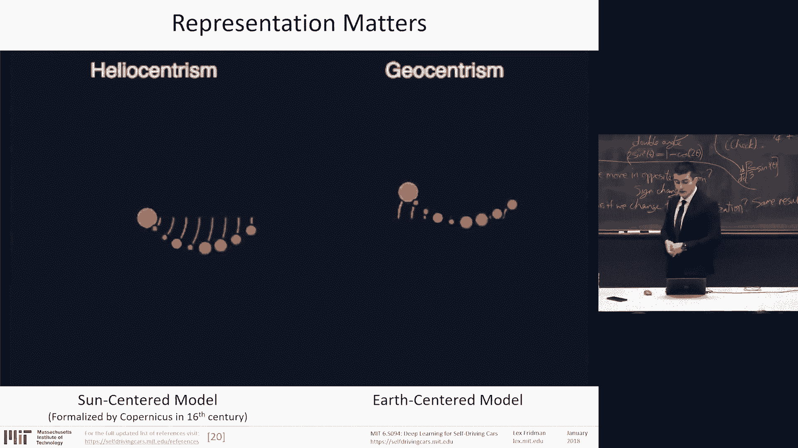
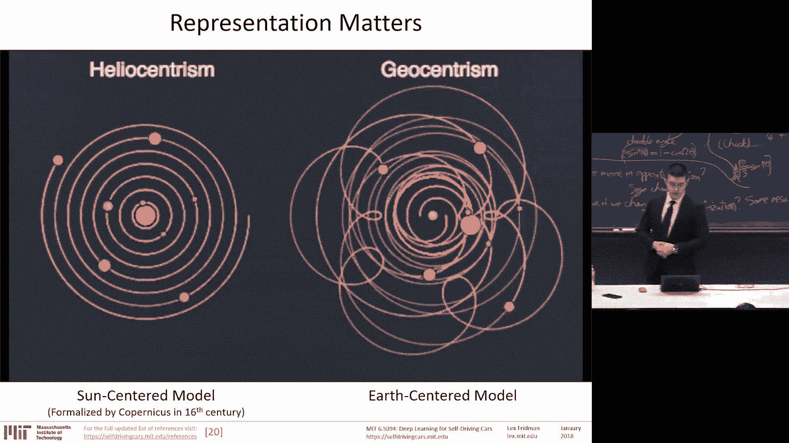
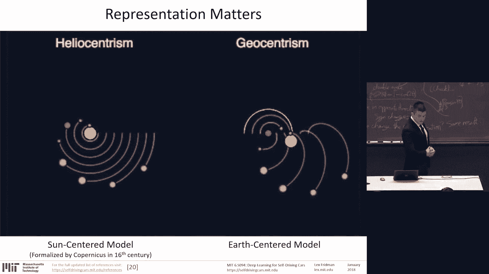
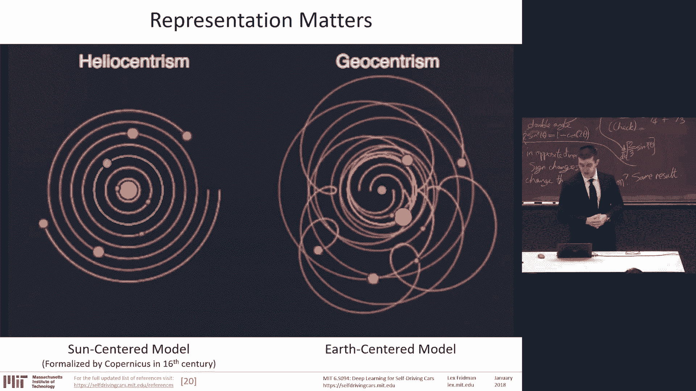
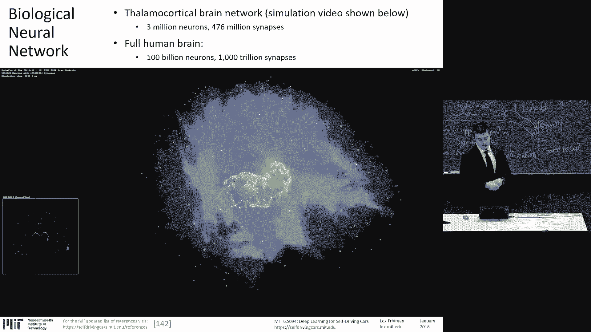
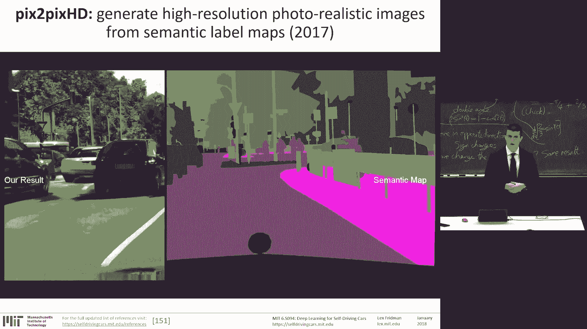
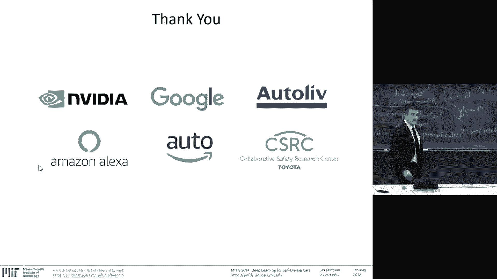

# P2：L2- 深度学习 - ShowMeAI - BV1Y34y1i7vC

Thank you everyone， for braving the cold and the snow to be here。

This is6S 094 deep learning for cell driving cars。And it's a course where we cover the topic of deep learning。

Which is a set of techniques that have taken a leap in the last decade for our understanding of what artificial intelligence systems are capable of doing。

And self driving cars， which is。Systems that can take these techniques and integrate them。

In a meaningful， profound way， enter our daily lives in a way that transforms society。

So that's why both of these topics are extremely important and extremely exciting。

My name is Le Friedman。And I'm joined by an amazing team of engineers in Jack Towilliger。

 Julia Kiinsberger， Dan Brown， Michael Glaer， Lee Ding， Spencer Dodd， and Benedict Jenk。

 among many others。We build autonomous vehicles here at MIT。

 not just ones that perceive and move about the environment， but ones that interact。

 communicate and earn the trust， and understanding of human beings inside the car。

 the drivers and the passengers and the human beings outside the car。

 the pedestrians and the other drivers and cyclists。The website for this course， selfdivingcars。mt。

idu， if you have questions， email deepcars@ mit。idu。Slack， deep D MIT。For registered MIT students。

 you have to register on the website。And。By midnight， Friday， January 19。

Build a neural network and submit it to the competition that achieves the speed of 65 m per hour on the new deep traffic 2。

0。It's much harder and much more interesting than last year's for those of you who participated。

There's three competitions in this class， deep traffic， se fuse， deep crash。

There's guest speakers that come from Waymo， Google。Tesla。

And those are starting new autonomous vehicle startups in voyage。Utonomy。And。Aurora。

In the news a lot today from Cs。And we have shirts。

For those of you who brave the snow and continue to do so。Towards the end of the class。

 there will be free shirts。 Yes， I said， free in shirts in the same sentence。 You should be here。

Okay， first， the deep traffic competition。There's a lot of updates。

 and we'll cover those on Wednesday。 It's a deeper reinforce learning competition。 Last year。

 we received over 18000 submissions。😊，This year， we're going to go bigger。😡。

Not only can you control one car within your network， you can control up to 10。 This is multi agent。

 deeper enforcement learning。 This is super cool。😊。

Second， psych fuse， dynamic driving scene segmentation competition。Where you're given。The raw video。

The kinematics of the vehicles and the movement of the vehicle。

The state of the art segmentation for the training set， you're given ground truth labels。

 pixel level labels， scene segmentation。Andd optical flow。 And with those pieces of data。

 you're tasked to try to perform better than the state of the art in image based segmentation。

Why is this critical and fascinating and an open research problem。Because。

Robots that act in in this world in the physical space not only must interpret。

 use these deep learning methods to interpret the spatial visual characteristics of a scene。

 they must also interpret， understand and track the temporal dynamics of the scene。

 This competition is about temporal propagation of information。 not just scene segmentation。

You must understand the space and time。And finally。

Deep crash where we use deep reinforcement learning to slam cars thousands of times here at MI T at the gym。

You're given data on 100 runs where a car knowing nothing is using a monocular camera as a single input driving over 30 miles an hour through a scene that has very little control through。

 very little capability to localize itself， it must act very quickly in that scene。

 you're given 10 runs to learn anything。We'll discuss this in the coming weeks， this competition。

Will result in four submissions。That we evaluate everyone's in simulation。

 But the top four submissions we put head to head at the gym。 And until there is a winner declared。

 we keep sing cars。At 30 miles an hour。Deep crash and also on the website as from last year and on GitHub。

 there's deep Tesla。Which is using the large scale naturalistic driving data that we have to train a neural network to do end to end steering that takes in monocular video from the forward roadway and produces steering commands that steering commands for the car。

Lectures today we'll talk about deep learning， tomorrow we'll talk about autonomous vehicles。

 deep parallells on Wednesday。Driving scene understanding， so segmentation。That's Thursday。On Friday。

 we have Sasha Arnu。The director of engineering at Waymo。

 Waymo is one of the companies that's truly taking huge strides in fully autonomous vehicles。

 Theyre taking the fully L 4 L 5 autonomous vehicle approach。

 And it's fascinating to learn He is also the head of perception for them。

To learn from him what kind of problems they're facing and what kind of approach they're taking on。

 We have Amelia Frizoli， who one of last year's speakers， Sir Dsh Carman。

 said Emillia is the smartest person he knows。So Amelia Frzo is the CT of autonomy。

 an autonomous vehicle。company that was just acquired by Delphi。For a large sum of money。

 and they're doing a lot of incredible work in Singapore and here in Boston。😊，Next Wednesday。

 we are going to talk about the topic of our research and my personal fascination is deep learning for driver state sensing。

 understanding the human， perceiving everything about the human being inside the car and outside the car。

One talk I'm really excited about is Oliver Cameron on Thursday。

He is now the CEO of Autonomous Vehicle startup Voyage。

 he was previously the director of the selfdriving Car Program for Uudacity。

 he will talk about how to start a selfdriving car company For those。

 he said that MIT folks and entrepreneurs， if you want to start a one yourself。

 he'll tell you exactly how it's super cool。And then Sterling Anderson。

Who was the director previously Al Tesla Autopilo team and now is the cofounder of Aurora。

The the self drivingriving car。Startup that I mentioned that has now partnered with Nvidia and many others。

 So why self driving cars。This class is about applying data driven learning methods to the problem of autonomous vehicles。

Why self driving cars are fascinating and an interesting problem space。Quite possibly， in my opinion。

 this is the first wide reaching and profound integration of personal robots in society。

Wide reaching， because there's 1 billion cars on the road， Even a fraction of that will change。

The face of transportation and how we move about this world。Profound。

 and this is an important point that's not always understood。Is there is an intimate。

Connection between a human and a vehicle when there's a direct transfer of control。

 it's a direct transfer of control that takes that his or her life into the hands of an artificial intelligence system。

I showed a few click。Qu clips here。 You can Google first time with Tesla Autopilot on YouTube and watch people perform that transfer of control。

 There's something magical about a human and a robot working together。😊。

That will transform what artificial intelligence is in the 21st century。

And this particular autonomous system。AI system， cell driving cars。

Is on the scale and profound the life critical nature of it is profound in a way that it will truly test the capabilities of AI。

There is a personal connection that will argue throughout these lectures that we cannot escape considering the human being。

That autonomous vehicle must not only perceive and control its movement through the environment。

 It must also perceive everything about the human driver and the passenger and interact。

 communicate and build trust with that driver。

Because。In my view， as I will argue throughout this course。

 an autonomous vehicle is more of a personal robot than it is a perfect perception control system because perfect perception and control to this world full of humans。

Is extremely difficult and could be 2，3，4 decades away。Full autonomy。

Autonomous vehicles are going to be flawed， They're going to have flaws。

 and we have to design systems that are effectively caught that effectively transfer control to human beings when they can't handle the situation。

 And that transfer of control。Is a fascinating opportunity for AI。Because。The obstacle avoidance。

 perception。Of obstacles and obstacle avoidance is the easy problem。

It's the safe problem going 30 miles an hour， navigating through streets of Boston。Is easy。

It's when you have to get to work and you're late。Or you're sick of the person in front of you that you want to go in the opposing lane and speed up。

That's human nature， and we can't escape it。Our artificial intelligence systems can't escape human nature。

 they must work with it。What's shown here is one of the algorithms we'll talk about next week for cognitive load。

Where we take the raw 3D convolution neural networks， take in the eye region。

 the blinking and the pupil movement to determine the cognitive load of the driver。

 we'll see how we can detect everything about the driver， where they're looking， emotion motion。

 cognitive load， body pose estimation。Drowsiness。The， the。

 the movement towards full autonomy is so difficult。

I would argue that it almost requires human level of intelligence。That the。As I said，2，3。

 four decade out journey for artificial intelligence researchers to achieve full autonomy will require achieving。

 solving some of the problems， fundamental problems of creating intelligence。And。

That's something we'll discuss in much more depth in a broader view in two weeks for the artificial general intelligence course。

Well we have Andrei Corpay from Tesla， Ray Kurzweil， Mark Reyberg。From Boston Dynamics。

Who asks for the dimensions of this room because he's bringing robots。Nothing else was told to me。

It'll be a surprise。So that is why I argue the human centered artificial intelligence approach。

In every algorithm of the design considers the human。For autonomous vehicle on the left。

 the perception， scene， understanding and the control problem。

 as we'll explore through the competitions and the assignments of this course。

Can handle 90 and increasing percent of the cases， but it's the 101。

1% of the cases as we get better and better that we have to。

 we're not able to handle through these methods。 And that's where the human perceiving the human is really important。

 This is the video from last year。Of Arc de Triomph。 Thank you。 I didn't know it last year。

 I know now。That is one of millions of cases where human to human interaction。

Is the dominant driver not the basic perception control problem？So why deep learning in this space？

Because deep learning is a set of methods。That do well from a lot of data。

And to solve these problems where human life is at stake。

 we have to be able to have techniques that learn from data， learn from real world data。

 This is the fundamental reality of artificial intelligence systems that operate in the real world。

 They must learn from real world data。Whether that's un left for the perception， the control side。

Or on the right for the human， the perception and the communication。

 interaction and collaboration with the human and the human robot interaction。Okay。

So what is deep learning？It's a set of techniques。 If you allow me the definition of intelligence being the ability to accomplish complex goals。

Then I would argue。Definition of understanding may be reasoning。

Is the ability to turn complex information into simple， useful， actionable information。

And that is what deep learning does。Deep learning is representation learning。Or feature learning。

 if you will。It's able to take raw information。Raw。

 complicated information that's hard to do anything with and construct hierarchical representations of that information to be able to do something interesting with it。

It is the branch of artificial intelligence， which is most capable and focused on this task。

Forming representations from data， whether it's supervised or unsupervised。

 whether it's with the help of humans or not， it's able to construct。Structure。

 find structure in the data such that you can。Extract simple， useful， actionable information。

On the left。For me in Goodfe's book。Is the basic example of image classification。

The input of the image。On the bottom were the raw pixels， and as we go up the stack。

 as we go up the layers， higher and higher order representations are formed。

From edges to contours to corners， to object parts。 and then finally。

 the full object semantic classification of what's in the image。

This is representation learning。A favorite example for me。Is。One from four centuries ago。

Our place in the universe。And representing that place in the universe。

 whether it's relative to Earth or relative to the sun。On the left is our current belief。

 On the right is the one that is held widely four centuries ago。

Representation matters because what's on the right is much more complicated than what's on the left。

You can think of in a simple case here when the task is to draw a line that separates green triangles in blue circles in the Cartesian coordinate space on the left。

 the task is much more difficult， impossible to do well。

 On the right is trivial in polar coordinates。This transformation is exactly which we need to learn。

 This is representation learning。So you can take the same task of having to draw a line that separates the blue curve and the red curve on the left。

If we draw a straight line， it's going to be a high。

 there's no way to do it with zero error with 100% accuracy。Shown on the right is our best attempt。

But what we can do with deep learning with a single hidden layer network done here。Its form the。

 the topology， the mapping of the space in such a way in the middle that allows for a straight line to be drawn that separates the blue curve and the red curve。

The learning of the function in the middle。Is what we're able to achieve with deep learning。

It's taking raw， complicated information and making it simple。Actionable， useful。

And the point is that this kind of ability to learn from raw sensor information means that we can do a lot more with a lot more data。

So deep learning gets better with more data。

And that's important for real world applications。Where edge cases are everything。

This is us driving with two perception control systems。 One is in Tesla vehicle with the autopilot。

Version 1 system that's using a monocular camera to perceive the external environment and produce control decisions。

 and our own neural network running on the Jescent T X 2 that's taking in the same with a monocular camera and producing control decisions。

And the two systems argue， and when they disagree， they raise up a flag to say that this is an edge case that needs human intervention。

There is covering such edge cases using machine learning。Is the main problem。

 of artificial intelligence and when applied to the real world， it is the main problem to solve。Okay。

 so what are neural networks。Inspired very loosely。

 And I'll discuss about the key difference between our own brains and artificial brains。😊。

Because there's a lot of insights in that difference。

But inspired loosely by the biological neural networks here is a simulation of a thalamoccortical brain network。

 which is only3 million neurons。476 million synapses。 The full human brain is a lot more than that。

100 billion neurons。1000 trillion。Synapses。

There's an inspirational music with this one that I didn't realize was here。It should make you think。

Artificial neural networks， okay， let's just it play。😊。

The human neural network is 100 billion neurons， right， 1000 trillion synapses。

One of the state of the art neural networks is ResNe 152， which has 60 million synapses。

That's a difference。Of about a seven order of magnitude difference。

 the human brains have 10 million times more synapses than artificial neural networks。Plus。

 or minus one order of magnitude， depending on the network。

So what's the difference between a biological neuron and artificial neuron？

The topology of the human brain have no layers。 Ne networkss are stacked in layers。 They're fixed。

 for the most part。There is chaos， very little structure in our human brain in terms of how neurons are connected。

 they're connected often to 10，000 plus other neurons。

 The number of synapses from individual neurons that are input into the neuron is huge。

They're asynchronous。 The human brain works asynchronously。

 artificial neural networks work synchronously。The learning algorithm for artificial neural networks。

 the only one。The best one。Is back propagation。And we don't know。How human brains learn。

Processing speed。This is one of the。The only benefits we have with artificial neural networks is artificial neurons are faster。

But they're also extremely power and efficient。And。

There is a division into stages of training and testing with neural networks with biological neural networks。

 as you're sitting here today， they're always learning。The only profound similarity。

The inspiring one。The captivating one is that both are distributed computation at scale。

There is an emergent。Aspect to neural networks where the basic element of computation， a neuron。

Is simple， is extremely simple。 But when connected together， beautiful， amazing。😊。

Powerful approximators can be formed。A neural network is built up with these computational units where the inputs。

 there's a set of edges with weights on them。ThesThe weights are multiplied by this input signal。

A bias is added with a nonlinear function that determines whether the network gets activated or not。

 Well， the neuron gets activated or not visualized here。

And these neurons can be combined in a number of ways。 They can form a feed forward neural network。

 or they can。Feed back into itself to form。To have state memory。In recurrent neural networks。

 the ones on the left。Are the ones that are most successful for most applications in computer vision？

The ones in the right are very popular and specific when temporal dynamics or dynamics time series of any kind are used。

 In fact， the ones in the right are much closer to the way our human brains are than the ones on the left。

But that's why they're really hard to train。One beautiful aspect。

Of this emergent power for multiple neurons being connected together is the universal property that with a single hidden layer。

 these networks。Can learn any function。 Learn to approximate any function。

Which is an important property to be aware of。Because。

The limits here are not in the power of the networks。

 The limits in the is in the methods by which we construct them and train them。

What kinds of machine learning， deep learning are there？We can separate it into two categories。

Memorizers。Now the approaches that essentially memorize patterns in the data。

And approaches that we can loosely say are beginning to reason to generalize over the data with minimal human input on top on the left are the quote unquote。

  teachers， is how much human input in blue is needed to make the methods successful for supervised learning。

 which is what most of deep learning successes come from。

 where most of the data is annotated by human beings。The human is at the core of the success。

 most of the data that's part of the training needs to be annotated by human beings。

With some additional successes coming from augmentation methods that extend that。

Extend the data based on which these networks are trained。

And the semiupvised reinforcement learning and unsupervised methods that we'll talk about later in the course。

That's where the near term successes we hope are。 And with the unsupervised learning approaches。

 that's where the true excitement about the possibilities of artificial intelligence lie。

 being able to make sense of our world with minimal input from humans。

So we can think of two kinds of。Deep learning impact spaces。

 One is a special purpose intelligence is taking a problem， formalizing it。

 collecting enough data on it and being able to solve a particular。Case that provides value。

Of particular interest here is a network that estimates apartment costs in the Boston area so you could take the number of bedrooms。

 the square feet in the neighborhood and provide as output the estimated cost。

On the right is the actual data。Of apartment cost。 We're actually standing in a。

In an area that has over $3000 for a studio apartment。Some of you may be feeling that pain。

And then there's general purpose intelligence。Or something that feels like approaching general purpose intelligence。

 which is reinforcement and unsupervised learning。Here from Madri Apathhi's Pong the Pixels。

 a system that takes in 80 by 80 pixel image and when no other information is able to beat。

 is able to win at this game， no information except a sequence of images。

 raw sensory information the same way， the same kind of information that human beings take in from the visual audio touch sensory data。

 the very low level data and be able to learn to win in this very simplistic in this very artificially constructed world。

 but nevertheless a world where no feature learning is performed。

 only raw sensory information is used to win。With very sparse minimal human input。

We'll talk about that on Wednesday。With deep reinforcement learning。So， but for now。

 we'll focus on supervised learning。Where there is input data。

 there is a network we're trying to train。A learning system。

 and there's a correct output that's labeled by human beings。

That's the general training process for a neural network， input data。

 labels and the training of that network that model。

 so that in the testing stage on new input data that has never seen before it's tasked with producing guesses and is evaluated based on that。

For autonomous vehicles， that means being released either in simulation or in the real world to operate。

And how they learn how neural networks learn is given the forward path of taking the input data。

 whether it's from the training stage。In the training stage， the taking the input data。

 producing a prediction， and then given that there's ground truth in the training stage。

 we can have a measure of error based on a loss function that then punishes，The synapses。

 the connections， the parameters that were involved with making that wrong prediction。

And it back propagates the error。Through those weights。

 we'll discuss that in a little bit more detail in a bit here。So what can we do with deep learning。

 You can do one to one mapping。Really， you can think of input as being anything。

 it can be a number of vector numbers， a sequence of numbers， a sequence of vector of numbers。

 anything you can think of from images to video to audio to text can be represented in this way。

 and the output can the same be a single number， or it can be images， video text， audio。

1 to one mapping on the bottom， one to many， many to one， many to many。

 and many to many with different starting points for the data。Asynchronous。

Some quick terms that will come up， deep learning is the same as neural networks。

It's really deep neural networks， large neural networks。

It's a subset of machine learning that has been extremely successful in the past decade。

Multilayer perceptron， deep neural network， recurrent neural network， long short term memory network。

 LSTM， convolution neural network， and deep belief networks。

 all of these will come up through the slides。And there is specific operations。

 layers within these networks of convolution， pooling， activation and back propagation。

 this concept that we'll discuss。In this class。Activation functions。 There's a lot of variance。

On the left is the activation function in the left column and the x axis is the input and the y axis is the output。

The sigmoid function， the output。If the font is too small， the output is not centered at zero。

For the 10 H function， it's centered at zero， but it still suffers from vanishings。

Danished ingredients is when the value， the input is low or high。The， the output of the network。

 as you see in the right column there， the derivative of the function is very low。

 So the learning rate is very low。For rail you。It's also not zero centered。

 but it does not suffer from vanished ingredients。Back propagation is the process of learning。

 it's the way we take go from error， compute is the loss function on the bottom right of the slide。

 taking the actual output of the network with a forward pass， subtracting it from the ground truth。

 squarearing dividing way to and using that loss function。

 then back propagate through to construct a gradient to backproagate the error to the weights that we're responsible for making either a correct or an incorrect decision。

So the subasks to that， there's a forward pass， there's a backward pass。

 and a fraction of the weight's gradient subtracted from the weight， that's it。

That process is modular， so it's local to each individual neuron。

 which is why it's extremely we're able to distribute it across multiple。Across the GPU。

 parallellyzed across the GPU。So learning for a neural network。

These competition units are extremely simple。 They're extremely simple to then correct when they make an error。

 when they're part of a larger network that makes an error。

And all that boils down to is essentially an optimization problem where the objective utility function is the loss function and the goal is to minimize it。

 and we have to update the parameters， the weights and the synapses and the biases to decrease that loss function。

And that loss function is highly nonlinear。Depending on the activation functions。

 different properties， different issues arise， there's vanish ingredientss。For sigmoid。

Where the learning can be slow。There's dying ras。Where the derivative is exactly zero。For inputs。

 less than  zero。There are solutions to this like leak Urales and a bunch of details that you may discover when you try to win the deep traffic competition。

But for the most part， these are the main activation functions。And it's the choice of the。

Neo network designer， which one works best。Their saddle points。

 all the problems from numerical nonlinear optimization that arise come up here。

It's hard to break symmetry。And stochastic gradient descent without any kind of tricks to it。

Can take a very long time to arrive at the minimumma。

One of the biggest problems in all the machine learning and certainly deep learning is overfitting。

You can think of the blue dots in a plot here。As the data to which we want to fit a curve。

We want to design a learning system that approximates to the regression of this data。

So in green is a sign curve， simple， fits well。And then there's a ninth degree polynomial。

 which fits even better in terms of the error， but it clearly overfits this data if there's other data。

That it has not seen yet that it has to fit。It's likely to produce a high error。

 So it's overfitting the training set。This is a big problem for small data sets。

And so we have to fix that with regularization。 Regularization is a set of methodologies that prevent overfitting。

Learning the training too well in order and then to not be able to generalize to the testing stage。

And overfitting the main symptom is the error decreases in training set。

 but increases in the test set。So there's a lot of techniques in traditional machine learning that deal with this cross validations and so on。

 but because of the cost of training for neural networks。

It's traditional to use what's called a validation set。

So you create a subset of the training that you keep away for which you have the ground truth and use that as a representative of the testing set。

Perform early stoppage or more realistically just save a checkpoint often。

To see how as the training evolves。The performance changes on the validation set。

 and so you can stop when the performance in the validation set is getting a lot worse。

 it means you're overtraining on the training set。In practice， of course。

 we run training much longer and see when what is the best performing what is the best performing snapshot checkpoint of the network。

Dropout is another very powerful regularization technique where we randomly remove part of the network。

 randomly remove some of the nodes in the network。Along with its incoming and outgoing edges。

So what that really looks like is a probability of keeping a node。

And in many deep learning frameworks today。It comes with a dropout layer。

 So it's essentially a probability that's usually greater than 0。5 that a node will be kept。

For the input layer， the probability should be much higher or more effectively what works well is just adding noise。

 What's the point here， you want to create enough diversity in the training data such that it is generalizable to the testing。

And as you'll see with deep traffic competition， there's L2 and L1 penalty。Weight， decay。

 weight penalty。Where there's a penalization on the weights that get too large。

 the L2 penalty keeps the weights small unless the air derivative is huge。

And produces a smoother model and prefers to distribute when there is two similar inputs it prefers to put half the weights on each。

 distribute the weights as opposed to putting the weight on one of the edges。

Makes the network more robust。one penalty has the one benefit that for really large weights。

 they're allowed to stay。 So it allows for a few weights to remain very large。

These are the regularization techniques， and I wanted to mention them because they're useful to some of the competitions here in the course。

And I recommend to go to to TensorFlow playground。To play around with some of these parameters。

Where you get to online in the browser， play around with different inputs， different features。

 different number of layers and regularization techniques。

And to build your intuition about classification， regression problems。

 given different input data sets。So what changed， why over the past many decades？

Neural networks that have gone through two winters are now again dominating the artificial intelligence community。

CPUs， GPUs。Aics， so computational power has skyrocketed。From Moore's Law to GPUs。

There is huge data set， including IageNe and others。There is research， bad propagation。In the 80s。诶。

The convolutional neural networks， LSTMs， there's been a lot of interesting breakthroughs about how to design these architectures。

 how to build them such that they're trainable efficiently using GPUs。

There is the software infrastructure from being able to share the data Gi。

To being able to train networks and share code and effectively view neural networks as a stack of layers as opposed to having to influence stuff from scratch with Tensorflow pietorrch and other deep learning frameworks and there's huge financial backing from Google。

 Facebook and so on。Deep learning。Is。In order to understand why。

It works so well and where its limitations are， we need to understand where our own intuition comes from about what is hard and what is easy。

The important thing about computer vision， which is a lot of what this course is about。

 even it's in deeper reinforcement learning formulation。

Is that visual perception for us human beings was formed 540 million years ago。

 that's 540 million years worth of data。An abstract thought is only formed about 100000 years ago。

That's several orders of magnitude， less data。So we can make with neural networks， predictions。

That seemed trivial。The the trivial to us human beings。

But completely challenging and wrong to neural networks。

 here on the left showing a prediction of a dog with a little bit of a distortion of noise added to the image。

 producing the image on the right， a neural network is confidently 99% plus accuracy predicting that it's an ostrich。

And there's all these problems that has to deal with， whether it's in computer vision data。

 whether it's in text data， audio， all of this variation arises in vision。

 its illumination variability。The set of pixels and the numbers look completely different。

 depending on the lighting conditions， it's the biggest problem in driving is lighting conditions。

 lighting variability， pose variation objects need to be learned from every different perspective。

 I'll discuss that for when sensing the driver， most of the deep learning work that's done on the face on the human is done on the frontal face or semifrontal face。

 there's very little work done on the full 360 pose variability that a human being can take on。

Intraclass variability for the classification problem， for the detection problem。

 there is a lot of different kinds of objects for cats， dogs， cars， bicyclists， pedestrians。

So that brings us to object classification， and I'd like to take you through where deep learning has taken big strides for the past several years leading up to this year to 2018。

So let's start at object classification， is' when you take a single image and you have to say one class that's most likely to belong in that image。

The most famous variant to that is the Inet competition， INe challengellge。

 the Inet data set is a data set of 14 million images with 21。

000 categories and for say the category of fruit， there's a total of 188。

000 images of fruit and there is 1，200 images of Grnny Smith apples。

 it gives you a sense of what we're talking about here。

So this has been the source of a lot of interesting breakthroughs in deep learning and a lot of the excitement in deep learning is first。

 the big successful network， at least。One that became famous in deep learning is Alex in 2012 that took a leap of a significant leap in performance on the Inet challengellge。

So he was one of the first neural networks that was successfully trained on the GPU and achieved an incredible performance boost over the previous year on the Inet Challge。

 the challenge is， and I'll talk about some of these networks is to give in a single image。

 give five guesses and you have five guesses to guess for one of them to be correct。

The human annotation is the question often comes up， so how do you know the ground truth？

Human level performance is 5。1% accuracy on this task。

But the way the annotation for IageNet is performed is there's a Google search where you pull the images already labeled for you。

 and then the annotation that on mechanical Turk， other humans perform is just binary。

 is this a cat or not a cat？So they're not tasked with performing the very high resolution semantic labeling of the image。

Okay， so through from 2012 with Alex andette to today。

And the big transition in 2018 of the Inet challengellge leaving Stanford and going to Kegel。

It's sort of a monumental step because in 2015 with the Reant network was the first time that the human level of performance was exceeded。

And I think this is。A very important。Map of where deep learning is， for particular。

 what I would argue is a toy example， despite the fact that it's 14 million images。

So we're developing state of ER techniques here and the next stage。

 as we are now exceeding human level performance and this task is how to take these methods into the real world to perform scene perception。

 to perform driver state perception。In 2016 and 2017。

 CU Image and SCNe has a very unique new addition to the previous formulations that has achieved an accuracy of 2。

2% error。2。25% error on the Inet classification challengeen is an incredible result。Okay。

 so you have this image classification architecture that takes in a single image and produces convol and takes it through pooling convolution。

 and at the end fully connected layers and performs a classification task or regression task and you can swap out that layer to perform any kind of other task。

 including with the recur neural networks of image captioning and so on。

 or localization of bonding boxes， or you can do。Fully convolution networks， which we'll talk about。

On Thursday。Which is when you take a image as an input and produce an image as an output。

 but where the output image in this case is a segmentation。

Is where a color indicates what the object is， the category of the object。

 So it's pixel level segmentation， every single pixel in the image is assigned a class。

 a category where that pixel belongs to。This is the kind of task that's overlaid on top of other sensor information coming for the car in order to。

Perceive the external environment。You can continue to extract information from images in this way to produce image to image mapping。

 for example， to colorize images and take from grayscale images to color images。

Or you can use that kind of heat map information to localize objects in the image。

 So as' as opposed to just classifying that this is an image of a cow， RCNN。

 fast and faster RCNN and a lot of other localization networks。

Allow you to propose different candidates for where exactly the cow is located in this image and thereby being able to perform object detection。

 not just object classification。In 2017， there's been a lot of cool applications of these architectures。

 one of which is back on removal。Again， mapping from image to image。

 ability to remove an background from selfies。Of humans or human like。Pictures。faceaces。

The references with some incredible animations are in the bottom of the slide。

 and the slides are now available online。

Picks to picks， HD。There's been a lot of work in Gs。In generative artsarial networks。

 in particular in driving。GNs have been used to generate examples that generate examples from source data。

 whether that's from raw data， or in this case， with Ps to Ps。 H D is taking。

Carse semantic labeling of the images， pixel level， and producing photoreistic， high definition。

Images of the forward roadway。 This is an exciting。

Possibility for being able to generate a variety of cases for cell driving cars for autonomous vehicles to be able to learn。

 to generate， to augment the data， and be able to change the way different roads look。

 road conditions， to change the way vehicles look cyclists pedestrians。

Then we can move on to recurringcurren neural networks。

 Everything I've talked about was one to one mapping from image to image or image to number。

 recur neural networks work with sequences。We can use sequences。To generate handwriting。

To generate text captions from an image。Based on the localizations。

 the various detections in that image。We can provide video description generation。 So taking a video。

And combining convolution neural networks with recurrent neural networks。

 using convolution neural networks to extract features frame to frame。

 and using those extractive features to input into the RNNs to then generate a labeling。

A description of what's going on in the video。A lot of exciting approaches for autonomous systems。

 especially in drones， where the time to make a decision。Is short。

 same with the RC car traveling 30 miles an hour， attentional mechanisms for steering the attention of the network have been very popular for the localization task and for just saving how much interpretation of the image。

 how many pixels need to be considered in the classification task。So we can steer。

 we can model the way a human being looks around an image to interpret it and use the network to do the same。

And we can use that kind of steering。To draw images as well。Finally。

 the big breakthroughs in 2017 came from。This， the pong pixels， the reinforcement learning。

 using sensory data， raw sensory data， and use reinforcement learning methods。

 deep are all methods of which you'll talk about on Wednesday。

 I'm really excited about the underlying methodology of deep traffic and deep crash is using neural networks。

As the appromators inside reinforcement learning approaches。

 So Alpha Go in 2016 has achieved a monumental task。

That when I first started artificial intelligence was told to me it was impossible for the asked them to accomplish。

 which is to win at the game of go against the top human player in the world。However。

 that method was trained on human expert positions。

The AlGo system was trained on previous games played by human experts。

And an incredible accomplishment。Alpha goes  zero in 2017。

It was able to beat alphaphago and many of its variants。By playing itself。From zero information。

So no knowledge of human experts。No games， no training data， very little human input。

And what more it was able to generate moves that were surprising to human experts。

I think its Einstein that said that intelligence。That the key mark of intelligence is imagination。

I think it's beautiful to see an artificial intelligence system come up with something that surprises human experts。

Truly surprises。For the gambling junkies， deep stack and a few other variants。

Had been used in 2017 to win a heads up poker。 Again， another incredible result。

 I was always told artificial intelligence would be impossible for any machine learning method to achieve。

And was able to beat a professional player， and several competitors have come along since。

We're yet to be able to win in a tournament setting， so multiple players。

 for those of you familiar heads up poker is one on one， it's a much， much smaller。

 easier space to solve。There's a lot more humidity humid dynamics going on from when there's multiple players。

 but that's the task for 2018。And the drawbacks is one of my favorite videos，😊，Show it often。

Of coast runners。For these deep reinforcement learning approaches， the。

Learning of the reward function， the definition of the reward function change controls how the actual。

System behaves， and this will come。This would be extremely important for us with autonomous vehicles。

Here the boat is tasked with gaining the highest number of points。

And it figures out that it does not need to race， which is the whole point of the game in order to gain points。

 But instead， pick up green。Circleles that regenerate themselves over and over。

This is the counterintuitive。Behavior of a system that。

Would not be expected when you first designed the reward function。 And this is a very formal。

 simple system。 Nevertheless， is extremely difficult to come up with a reward function that makes it operate in the way you expect it to operate。

 Very applicable for。Automous vehicless。 And， of course， in the perception side。

 as I mentioned with the ostrich and the dog。A little bit of noise with 99。6% confidence。

 we can predict that the noise up top is a Robin， a cheetah， Ar modillo， Leserpanda。

 these are outputs from actual state of the art and neural networks。

Taking in the noise and producing a confident prediction。

It should build our intuition to understand that we don't， that the visual characteristics。

 the spatial characteristics of an image do not necessarily convey the level of hierarchy necessary to function in this world。

In a similar way， with a dog in the ostrich and everything in an ostrich。

 a network confidently with a littleer of noise can make the wrong prediction。

Thinking a school bus is an ostrich and a speaker is an ostrich。They're easily fooled。But not really。

 because they performed the task that they were trained to do well。So， we have to。

Make sure we keep our intuition。Optimized to the way machines learn， not the way humans have learned。

Over the 540 million years of data that we've gained through developing the eye the revolution。

The current challenges we're taking on， first， transfer learning。

There is a lot of success in transfer learning between domains that are very close to each other。

 so image classification from one domain to the next。

There's a lot of value forming representations of the way scenes look in natural scenes look in order to do scene segmentation。

 the driving case， for example， but we're not able to do any。

Any bigger leaps in the way we perform transfer learning？

The biggest challenge for deep learning is to generalize， generalize across domains。

It lacks the ability to reason in the way that we've defined understanding previously。

 which is the ability to turn complex information into simple， useful information。

Convert domain specific。Complicated sensory information that doesn't relate to the initial training set。

That's the open challenge for deep learning。Train on very little data and then go and reason and operate in the real world。

Right now neural networks are very inefficient， they acquire big data。They require supervised data。

 which means they need human， costly human input。They're not fully automated。

 despite the fact that the feature learning incredibly。

 the big breakthrough feature learning is performed automatically。

 you still have to do a lot of design of the actual architecture of the network and all the different hyperparameter tuning needs to be performed human input。

Perhaps a little bit more educated human input in form of PhD students， postdocs， faculty。

Is required tune these hyperparameters， but nevertheless human input is still necessary。

They cannot be left alone。For the most part。The award defining the award， as we saw with Coast R。

 is extremely difficult。For systems that operate in the real world， transparency。

Quite possibly is not an important one， but neural networks currently are a black box。

 for the most part， they're not able to accept through a few successful visualization methods that visualize different aspects of the activations。

 they're not able to reveal to us humans why they work or where they fail。

And this is a philosophical question for autonomous vehicles that we may not care as human beings if the system works well enough。

But I would argue that itll be a long time before systems work well enough where we don't care。

We'll care and we'll have to work together with these systems， and that's where transparency。

 communication， collaboration is critical。 and edge cases， it's all about edge cases。In robotics。

 in autonomless vehicles。The 99。9% of driving is really boring。 It's the same。

 especially highway driving， traffic driving。It's the same， the obstacle avoidance。

 the car following， the lane centering， all these problems are trivial， it's the edge cases。

 the trillions of edge cases that need to be generalized over on a very small amount of training data。

So again， I return to why deep learning。I mentioned a bunch of challenges。And this is an opportunity。

It's an opportunity。To come up with。Techniques。That operates successfully in this world。

 So I hope the competitions we present in this class and the autonomous vehicle domain will give you some insight and an opportunity to apply in some of these cases or open research problems。

With semantic segmentation of external perception with control of the vehicle and deep traffic。

And with deep crash of control of the vehicle in under actuated high speed conditions and the driver' state perception。

So with that， I wanted to introduce deep learning to you today before we get to the fun tomorrow of autonomous vehicles。

So we'd like to thank Nvidia， Google， Autolive。Toyota and at the risk of setting off people's phones。

 Amazon， Alexa Auto。

