# P5：L5- 深度学习与类人环境感知 - ShowMeAI - BV1Y34y1i7vC

Today we will talk about how to apply the methods of deep learning to understanding the sense of the human being。

 the focus will be on computer vision， the visual aspects of a human being。

 of course we humans express ourselves visually， but also through audio， voice and through text。

Beautiful poetry and novels and so on。 We're not going to touch those today。

 We're just going to focus on computer vision， how we can use computer vision to extract。Useful。

 actionable information from video， images， video of human beings。

 in particular in the context of the car。

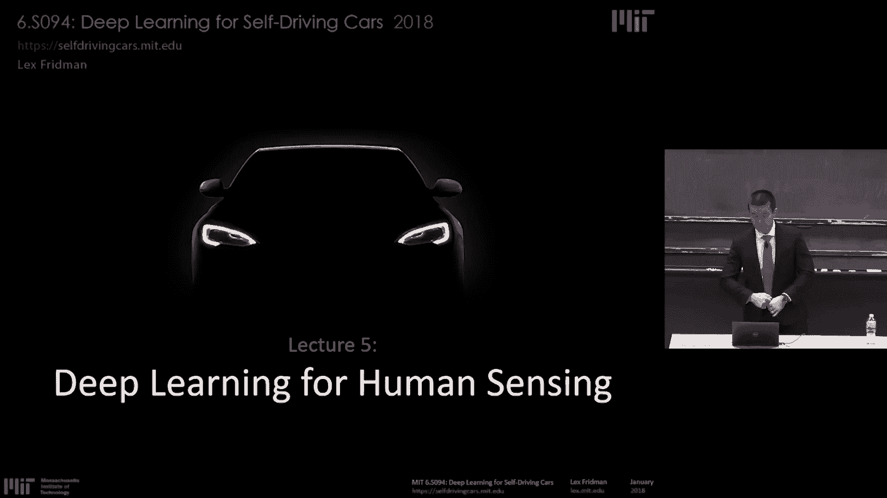

So。What are the requirements for successfully applying deep learning methods in the real world so when we talk about human sensing we're not talking about basic face recognition of celebrity images。

 we're talking about using computer vision， deep learning methods to create systems that operate in the real world。

And in order for them to operate in the real world， there are several things。 They sound simple。

 some are much harder than they sound first， and the most important here from most to less more to less critical ordered。

Is data， data is everything， real world data。 We need a lot of real world data。

To form the data set on which these supervised learning methods can be trained。

I'll say this over and over throughout the day today data is everything that means data collection is the hardest part and the most important part we'll talk about how that data collection is carried out here in our group at MIT。

 all the different ways we capture human beings in the driving context， in the road user context。

 pedestrian cyclists。But the data。It starts and ends at data。The fun stuff is the algorithms。

But the data is what makes it all work， real world data。Okay， then once you have the data， okay。

 data isn't everything I like。Because you have to actually annotate it， so what do we mean by data。

 there's raw data。Video， audio。LDar all the types of sensors we'll talk about to capture real world road user interaction。

You have to reduce that into meaningful representative cases of what happens in that real world in driving 99% of the time。

 driving looks the same it's the 1%， the interesting cases that we're interested in and what we want is algorithms to train learning algorithms on those 1% so we have to collect the 100 percent。

 we have to collect all the data and then figure out an automated semi-auated ways to find the pieces of that data that could be used to train neural networks and that are representative of the general kinds of things that happen in this world。

Efficient annotation。Annotation isn't just about drawing bonding boxes on images of cats。

Annotation tooling is key to unlocking。Real world。Performance systems that successfully solve some problem。

 accomplish some goal in real world data， that means designing annotation tools for a particular task。

Annotation tools that are used for glance classification for determining where drivers are looking is very different than annotation tools used for body poses estimation。

 is very different than the tooling use that we use for psych views。

 investing thousands of dollars for the competition for this class to annotate fully seen segmentation wherever every pixel is colored。

Theres needs to be tooling for each one of those elements and they're key， that's HCI question。

 that's a design question there's no deep learning。

 there's no robotics in that question it's how do we leverage human。Computation。

 human the human brain to most effectively label images such that we can train neural networks on them。

Hardware。In order to。Train these networks in order to parse the data we collect and we'll talk about we have now over 5 billion images of data of driving data。

 in order to parse that， you can't do it on a single machine。

You have to do large scale distributed compute and large scale distributed storage。And finally。

 the stuff that's the most exciting that people this class and many classes and much of the literature is focused on is the algorithms。

 the deep learning algorithms， the machine learning algorithms， the algorithms that learn from data。

 of course， that's really exciting and important， but what we find time and time again in real worldor systems。

 is that as long as these algorithms learn from data， so as long as it's deep learning。

The data is what's much more important Of course it's nice for the algorithms to be calibration free。

 meaning they learn to calibrate self calibrate， we don't need to have the sensors in an exact same position every time that's a very nice feature。

 the robustness of the system is then generalizable across multiple。Multiple vehicles。

 multiple scenarios。And。One of the key things that comes up time and time again and we'll mention today is a lot of the algorithms developed in deep learning are really focused for computer vision are focused on single images now the real world is happens in both space and time and we have to have algorithms that both capture the visual characteristics。

 but also look at the sequence of images sequence of those visual characteristics that form the temporal dynamics。

 the physics of this world， so it's nice when those algorithms are able to capture the physics of the scene。

The big takeaway， I would like， if you leave with anything today。Unfortunately。

 it's that the painful， boring stuff of collecting data， of cleaning that data。

 of annotating that data in order to create successful systems is much more important than good algorithms or great algorithms。

 it's important to have good algorithms， as long as you have neural networks that learn from that data。

Okay， so today I'd like to talk about。Human imperfections。And the various detection problems。

 the pedestrian body pose glance and motion， cognitive load。

Estimation that we can use to help those humans as they operate in a driving context。And finally。

 try to continue。With the idea， the vision that fully autonomous vehicles。

 as some of our guest speakers have spoke about and Stling Annis will speak about tomorrow。

 is really far away， that the humans will be an integral part of cooperating with AI systems。

 and I will continue on that line of thought to try to motivate why we need to continuously approach the autonomous vehicle。

 the self-driving car paradigm in the humancented way。

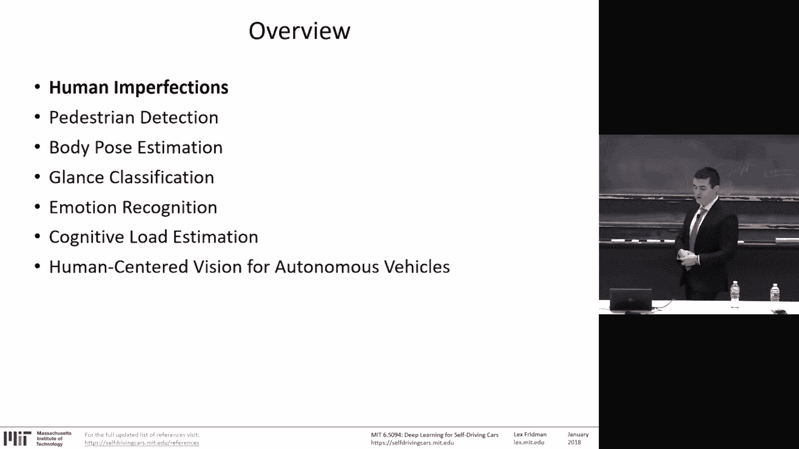

Okay， first， before we talk about human imperfections。

 let's just pause and acknowledge that humans are amazing。

We're actually really good at a lot of things。That's sometimes sort of fun to talk about how much how terrible of drivers we are。

 how distracted we are， how irrational we are， but we're actually really damn good at driving Here's a video of state of our soccer player Mesy。

 the best soccer player in the world obviously。And the state of the art robot on the right。

 same thing， well， it's not playing， but I assure you the American Ninja warrior。

Casey is far superior to the DARPA humanoid robotics systems shown on the right。Okay， so。

Continuing on the line of thought to challenge us here that humans are amazing。you know。

 there's record high in 2016 in the United States， there was over 40。

000 since many years across the 40，000 fatalities mark， more than 40。

000 people died in car crashes in the United States。But that's in 3。2 trillion miles traveled。

 so that's one fatality per 80 million miles。That's。1 in 625。Chance。

Of dying in a car crash in your lifetime。Interesting side fact， for anyone in the United States。

 folks who live in Massachusetts are the least likely to die in a car crash。

Montana is the most likely。So for everyone that thinks of Boston drives is terrible。

Maybe that adds some perspective， here's the visualization of ways data across a period of a day。

 showing you the rich blood of the city， that the traffic flow of the city。

 the people getting from A to B on a mass scale， and doing it， surviving， doing it okay。

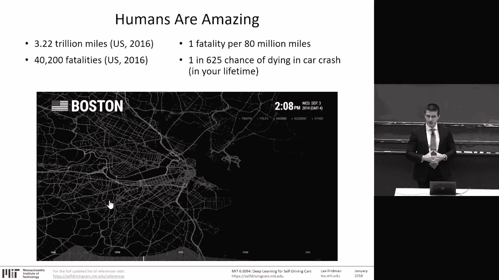

Humans are amazing。But they're also flawed。Texting sources of distraction with the smartphone。

 the eating， the secondary tasks of talking to other passengers， grooming， reading。

Using navigation system， yes， sometimes watching video and manually adjusting or adjusting the radio。

3，000 people were killed。And 400，000 were injured and motor vehicle crashes involving distraction。

In 2014， distraction is a。It's a very serious issue for safety。Texting。Every day。

 more and more people text， smartphones are proliferating our society。

170 billion text messages are sent in the United States every month。 that's in 2014。

 you can only imagine what it is today。Eyes off road for five seconds is the average time your eyes off the road while texting five seconds。

If you're traveling 55 miles an hour in that five seconds。

 that's enough time to cover the length of a football field。So you're blindfolded。

 you're not looking at the road in five seconds， the average time of texting。

 you're covering the entire football field， so many things can happen in that moment of time。

 that's distraction。Drunk driving， 31% of traffic fatalities involve a drunk driver。Drug driving。

 23% of nighttime drivers tested positive for legal prescription or over the counterary medication。

Distracted driving， as I said， is a huge safety risk， drowsy driving， people driving tired。

 nearly 3% of all traffic fatalities involve a drowsy driver。

If you are uncomfortable with videos that involve risk， I urge you to look away。

 these are videos collected by AAA of teenagers， a very large scale naturalistic driving data set and is capturing clips of teenagers being distracted on their smartphone。

Once you take it in， the problem we're against。Yeah。

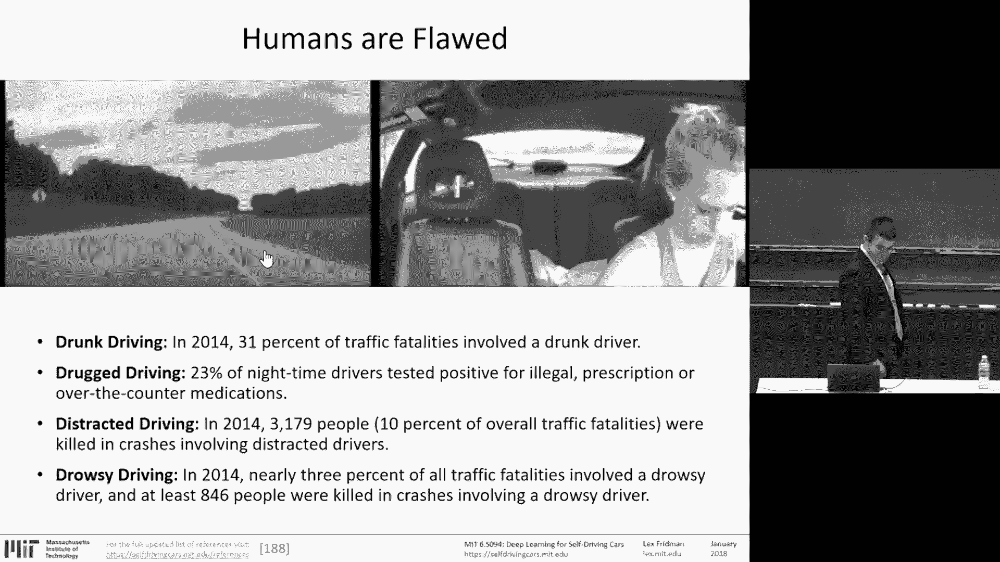

So in that context of human imperfections， we have to ask ourselves as the humancented approach the autonomy in systems。

 autonomous vehicles that are using artificial intelligence to aid the driving task。

 do we want to go as I mentioned a couple of lectures ago。

 the human- centered way or the full autonomy way， the tempting path is towards full autonomy。

 where we remove this imperfect flawed human from the picture altogether？

And focus on the robotics problem of perception and control and planning and driving policy。

Or do we work together human and machine to improve the safety， to alleviate distraction。

 to bring driver attention back to the road and use artificial intelligence to increase safety through collaboration。

 human robot interaction versus removing the human completely from the picture？As I've mentioned。

As Sterling will certainly talk about tomorrow and rightfully so， and yesterday， or on Tuesday。

 Emilio has talked about the Ellf four Way is grounded in literature， is grounded in common sense。

 in some sense。It's， you can count on the fact that humans。

The natural flaws of human beings to overtrust， to misbehave。

 to be irrational about their risk estimates will result in improper use of the technology。

And that leads to what I've showed before， the public perception of what drivers do in semi-autonnomous vehicles。

 they begin to overtrust the moment the system works well， they begin to overtrust。

 they begin to do stuff they're not supposed to be doing in the car， taking it for granted。

A recent video that somebody posted， this is a common sort of more practical concern that people have is while the traditional ways to ensure the physical engagement of the drivers by saying they should touch the wheel the steering wheel every once in a while and of course there's ways to bypass the need to touch the steering wheel some people hang objects like I can off of the steering wheel in this case brilliantly。

 I have to say they shove an orange into the wheel to。

Make the touch sensor of fire and therefore be able to take their hands off the。

Ptoollot and that that kind of idea makes us believe that there's no way that， you know。

 humans will find a way to misuse this technology。 However， I believe that that's。

Not giving the technology enough credit。Artificial intelligence systems。

 if they're able to perceive the human being。Are also able to work with a human being。

 and that's what I'd like to talk about today。Teaching cars to perceive the human being。

And it all starts with data， it's all about data as I mentioned。

 data is everything in these realw systems with the MIT naturalistic driving data set of 25 vehicles of which  21 equipped with Tela autopilot。

 we instrument them， this is what we do with the data collection。

 two cameras on the driver we'll see the cameras on the face capturing high definition video of the face that's where we get the glance classification。

 the emotion recognition， cognitive load， everything coming from the face。

 that we have another camera a fish eye that's looking at the body of the driver。

 and from that comes the body pose estimation， hands on wheel， activity recognition。

And then one video looking out for the full scene segmentation for all the scene perception tasks and everything is being recorded。

 synchronized together with GPS， with audio， with all the can coming from the car on a single device。

 synchronization of this data is critical。So that's one road trip。In the data。

 we have thousands like it traveling hundreds of miles。

 sometimes hundreds of miles under automated control， an autopilot。That's the data again， as I said。

 data is everything， and from this data we can both gain understanding what people do。

 which is really important to understand how autonomy。

 successful autonomy can be deployed in the real world and to design algorithms for training for training the deep learning the deep neural networks in order to perform the perception task better。

25 vehicles。21。Tesla's Model S， Model X， and now Model3。Over a thousand miles collected a day。

 every single day we have thousands of miles in the Boston。

 Massachusetts area driving around all of that video being recorded， now over 5 billion video frames。

There are several ways to look。At autonomy， one of the big ones。Is。Safety。

 that's what everybody talks about， how do we make these things safe？But the other one is enjoyment。

Do people actually want to use it we can create a perfectly safe system， we can create it right now。

 we've had it forever before， even cars， a car that never moves is a perfectly safe system， well。

 not perfectly but almost。But it doesn't provide a service that's valuable。

 It doesn't provide any enjoyable driving experience。 So okay， what about slow moving vehicles。

 It's an open question。The reality is with these Tesla vehicles and L2 systems doing automated driving。

 people are driving 33% of miles using Tesla Autopilot， what does that mean。

 that means that people are getting value from it， a large fraction of their driving is done an automated way。

That's value， that's enjoyment。The glance classification algorithm we'll talk about today is used as one example that we use to understand what's in this data shown with the bar graphs there and the red and the blue。

 red is during manual driving， blue is during autopilo driving， and we look at glance classification。

 regions of where drivers are looking on road and off road and if that distribution changes with automated driving or manual driving。

And with these glance classification methods， we can determine that there's not much difference。

 at least until you dig into the details which we haven't done and the aggregate。

 there's not a significant difference。That means people are getting value and enjoying using these technologies。

But yet they're staying attentive or at least not attentive。

 but physically engaged when your eyes are on the road， you might not be attentive。

 but you're at the very least physically your body's position in such a way。

 your head is looking at the forward roadway that you're physically in position to be alert and to take in the forward roadway。

So they're using it。And they don't overtrust it。And that's， I think。

 the sweet spot that human robot interaction needs to achieve。

iss the human gaining through experience， through exploration， through trial and error。

 exploring and understanding the limitations of the system to a degree that overtrust can occur。

 that seems to be happening in this system and using the computer vision methods I'll talk about。

 can continue to explore how that can be achieved in other systems。

 when the fraction of automated driving increases from 30% to 40% to 50% and so on。

It's all about the data and I'll harp on this again， the algorithms that interesting， I will mention。

 of course， it's the same convolution neural networks。

 it's the same networks that take in raw pixels and extract features of interest。

It's 3D convolutional neural networks that take into sequences of images and extract the temporal dynamics along with the visual characteristics for the individual images。

 it's RN and LSTMs that use the convolutional neural networks to extract features and over time look at the dynamics of the images these are pretty basic architectures。

 the same kind of deep neural network architectures。

But they rely fundamentally and deeply on the data。On real world data。

So let's start where perhaps on the human sensing side it all began， which is pedestrian detection。

Decades ago。To put it in context， pedestrian detection here shown from left to right on the left is green。

 showing the easier human sensing tasks， tasks of sensing some aspect to a human being。

 pedestrian detection， which is detecting the full body of a human being in an image or video。

Is one of the easier computer vision tasks and on the right in the red microcicades。

 these are the tremors of the eye or measuring the pupil diameter。

 or measuring the cognitive load or the blink dynamics of the eye。

 the velocity of the blink with microglans and eye pose are much harder problems so you think body pose estimation pedestriany detection face classification detection recognition。

 head pose estimation， all those are easier tasks， anything that starts getting smaller looking at the eye and everything that starts getting fine grained thats much more difficult so we start at the easiest pedestinrianary detection。

And as the usual challenges evolve of computer vision we've talked about is the various styles of appearance。

 so the interclass variation， the different possible articulations of our bodies superseded only perhaps by cats but us humans are pretty flexible as well the presence of occlusion from the accessories that we wear to occlu self-accclusion and occ each other crowded scenes have a lot of humans in them and they occlude each other and therefore to be able to disambiguate to figure out each individual pedestrian is a very challenging problem。

 so how do people approach this problem， well there is a need to extract features from raw pixels。

Whether that was hard cacades， hog or CNN， through the decades。

 the sliding window approach was used because the pedestrians can be small in an image or big so there's the problem of scale so you use a sliding window to detect where that pedestrian is you have a classifier that's given a single image says is this a pedestrian or not you take that classifier you slide it across the image to find where all the pedestrians is seen so you can use non neural network methods or you can use convolution neural networks for that classifier It's extremely inefficient then came along our CNN fast R CNN and fast R CNN。

 these are networks that。As opposed to doing a complete sliding window approach are much more intelligent。

 clever about generating the candidates to consider。

 so as opposed to considering every possible position of a window， different scales of the window。

 they generate a small subset of candidates that are more likely。

And finally using a CNN classify for those candidates， whether there's a pedestrian or not。

 whether there's an object of interest or not， a face or not。

 and using that maximal suppression because there's overlapping bonding boxes to figure out what is the most likely bonding box around this pedestrian around this object that's our CNN and there's a lot of variance now with mask our CNN really the state of the art localization network mask also adds to this on top of the bonding box it also perform segmentation。

 there's voxelNe which does threedimenal and lidDarR data uses localization and point clouds。

 so it's not just using a 2D images but in 3D。But it's all kind of grounded in the RCNN framework。

Okay， data。So we have large scale data collection going on here in Cambridge。

 if you've seen cameras of LiAR and various intersections throughout MIT we're part of that。

 so for example here's one of the intersections're collecting about 10 hours a day instrumenting it with various sensors I'll mention。

 but we see about 12，000 pedestrians a day。Acroross that particular intersection using 4K cameras。

Using stereo vision cameras 360， now the Insta 360， which is an 8 K360 camera， GoPro。

 LiDar various sizes， the 64 channel of the 16。And recording。This is where。

This is where the data comes from， this is from the 360 video。

This is from the LDar data of the same intersection。

This is for the 4K camcorders pointing at a different intersection and the different。

Then capturing the entire 360 view with the vehicles approaching the pedestrians。

 making crossing decisions。This is understanding the negotiation that pedestrians。

 the nonverbal negotiation that pedestrians perform in choosing to cross or not。

 especially when they're jaywalking and everybody jawalks。

Especially if you're familiar with this particular intersection。

 there's more J walkers than non J walkers， it's a fascinating one。

And so we record everything about the driver and everything about the pedestrians。And again， ourCNN。

 this is where it comes in， is you do bonie box detection of the pedestrians here。

 the vehicles as well and allows you to convert this raw data into hours of pedestrian crossing decisions。

And begin to interpret it。That's pedestinrian detection， bonding box。For a body pose estimation。

Is the more difficult task body pose estimation is also finding the joints， the hands， the elbows。

 the shoulders， the hips， knees， feet， the landmark points in the image。

 X Y position that mark those joints that's body poses estimation。

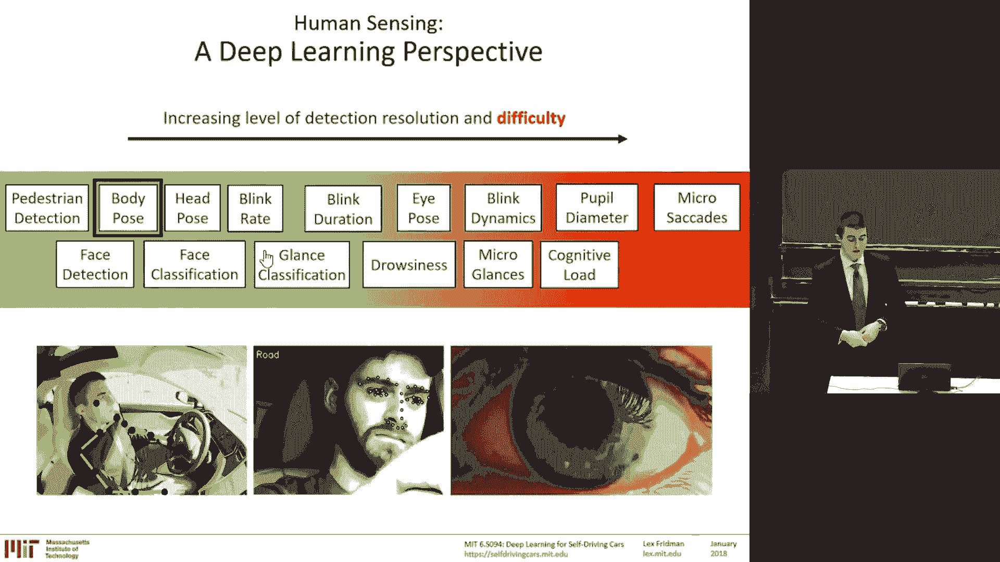

So why is that important in driving， for example， it's important to determine the vertical position or the alignment of the driver。

 the seat belts and sort of the airbag testing is always performed in the seat beltt testing is performed with the dummy considering the frontal position in the standard dummy position the greater and greater degrees of automation comes more capability and flexibility for the driver to get misaligned from the standard quote unquote dummy position。

 and so body pose or at least upper body pose estimation allows you to determine how often these drivers get out of line。

From the standard position， general movement， and then you can look at that hands on wheel。

 smartphone， smartphone detection， activity， and help add context to glance estimation that we'll talk about。

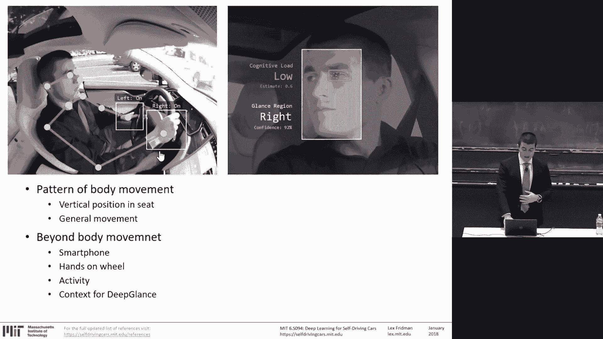

So some of the more traditional methods were sequential， is detecting first， the head。

 and then stepping， detecting the shoulders， the elbows， the hands。The Depot's holistic view。

Which has been a very powerful， successful way for multi person pose estimation。

Is performing a regression。Of detecting body parts from the entire image。

It's not sequentially stitching bodies together， is detecting the left elbow， the right elbow。

 the hands individually。It's performing that detection and then stitching everything together afterwards。

Allowing you to deal with the crazy deformations of the body that happen， the occlusions， and so on。

 because you don't need all of the joints to be visible。And with this cascade of pose regressors。

 meaning these are convolution neural networks that take in a raw image and produce an Xy position of their estimate of each individual joint。

 input is an image， output is an estimate of a joint。Of an elbow shoulder， whatever。

 one of several landmarks。And then you can build on top of that。

 every estimation zooms in on that particular area and performs a finer and finer grain estimation of the exact position that joint。

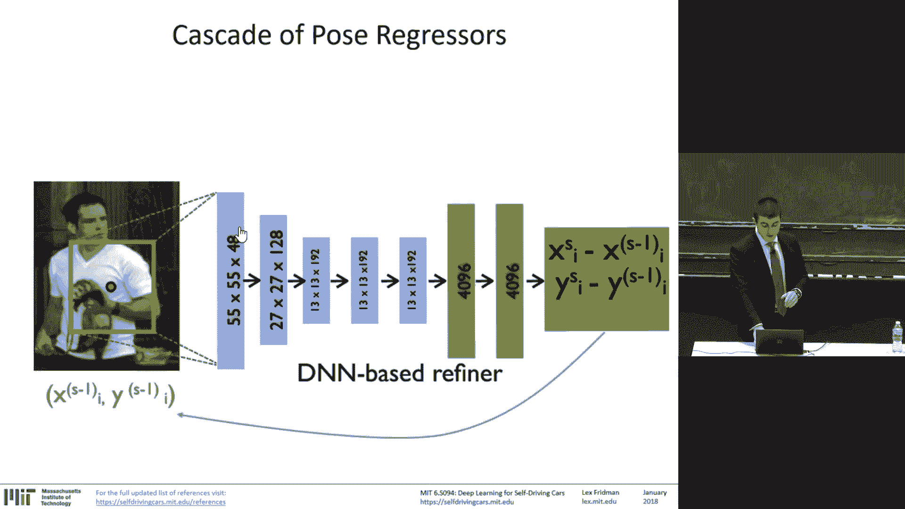

Repeating it over and over and over。So through this process。

 we can do part detection in multi person。And multiperson scene that contain multiple people。

 so we can detect the head， the neck， here， the hands。

 the elbows shown in the various images on the right。That don't have an understanding who the head。

 the elbows， the hands belong to， is's just performing a detection without trying to do individual person detection first。

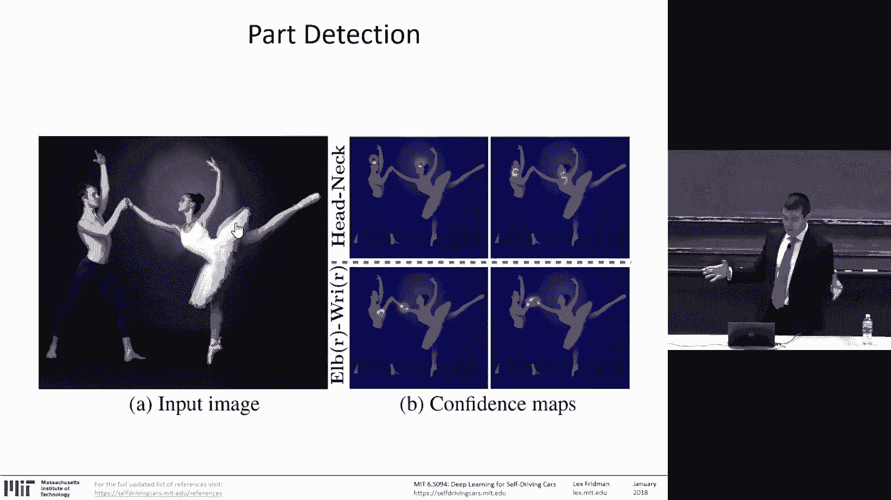

And then。Finally connecting or not finally， but next step is connecting with part affinity fields is connecting those parts together。

 so first you detect the individual parts then you connect them together and then through biparttheite matching。

 you determine which is who is that each individual body part most likely belonging to so you kind of stitch the different people together in the scene after the detection is performed with a CNN。

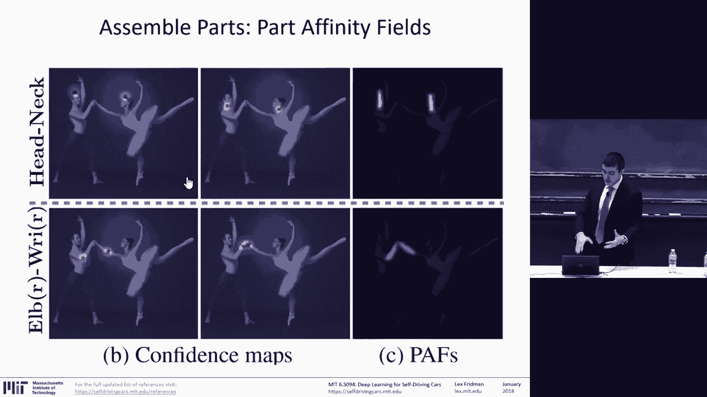

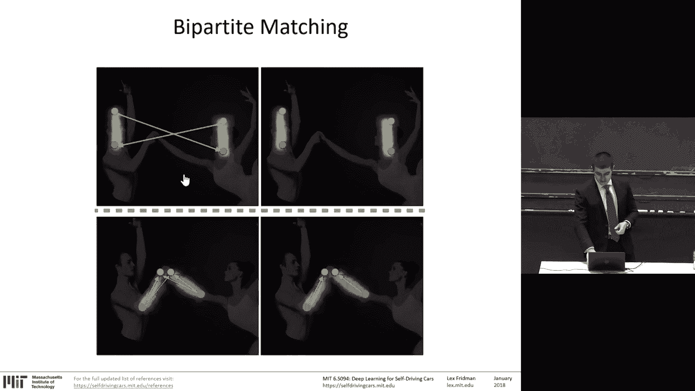

We use this approach for detecting the upper body， specifically the shoulders， the neck。

 and the head， eyes， nose， ears。That is used to determine the position of the driver relative to the standardomic position。

 for example， looking during autopilot driving 30 minute periods。

We can look at on the X axis is time and the y axis is the position of the neck point that I pointed out in the previous slide that the midpoint between the two shoulders。

 the neck。Is the position over time relative to word began， this is the slouching。

 the sinking into the seat。Allowing the car to know that information and allowing us or the designers of safety systems to know that information is really important。

We can use the same body pose algorithm to from the perspective of the vehicle。

 outside the vehicle perspective， the vehicle looking out is doing as opposed to just playing pedestrianity detection and using body pose estimation。

Again， here in Kendall Square。Vicles crossing， observing pedestrians。

 making crossing decisions and performing body pose's estimation。Which allows you to then。

Generate visualizations like this and gain understanding like this on the X axis is time on the y axis is on the top plot in blue is the speed of the vehicle。

 the speed of the vehicle， the ego vehicle from which the camera is observing the scene。

And on the bottom， in green， up and down is a binary value。

Whether the pedestrian is zero when the pedestrian is not looking at the car。

 one when the pedestrian is looking at the car。So we can look at thousands of episodes like this。

 crossing decisions， nonverbal communication decisions， and determine using body pose's estimation。

The dynamics of this nonverbal communication here just nearby by media lab crossing。

 there's a pedestrian approaches， we can look and green there when the pedestrian glances。

 looks away， glances at the car， looks away， fascinating glance behavior that happens。Interesting。

 most people look away before they cross。Same thing here。

Its just an example we have thousands of these body pose estimation allows you to get this fine grained information about the pedestrian glance behavior。

 pedestrian body behavior， hesitation。Glance classification。

 one of the most important things in driving is determining where drivers are looking。

If there's any sensing that I advocate and has the most impact in the driving context。

 is for the car to know where the driver is looking。

And at the very crude region level information of is the driver looking on road or off road。

 that's what we mean by glance classification， it's not the standard gaze estimation problem of XYz determining where the iPos and the head pose combined to determine where the drivers looking No this is classifying two regions on road off road or six regions on road off road left right center stack rearview mirror and instrument cluster so it's regionbased glance allocation。

 not the geometric gaze estimation problem why is that important。

 it allows you to address it as a machine learning problem。It's a subtle but critical point。

 every problem we try to solve in human sensing in driver sensing has to be learnable from data。

 otherwise it's not。It's not amenable to application in the real world。

 we can't design systems in the lab that are deployed without learning if they involve a human。

 it's possible to do slam localization。By having really good sensors and doing localization。

 using those sensors without much learning， it's not possible to design systems that deal with lighting variability and the full variability of human behavior without being able to learn so Ga's estimation。

 the geometric approach of finding the landmarks in the face and from those landmarks determining the orientation of the head and the orientation of the eyes。

 there's no learning there outside of actually training the systems to detect different landmarks。

If we convert this into gaze classification problem shown here， glance classification。

Is when taking the raw video stream， determining in post。

 so humans are annotating this video is the driver， which region the driver is looking at。

That's we're able to do by converting the problem into a simple variant of classification。On road。

 off road， left right， the same can be done for pedestrians， left forward， right。

It can annotate regions of where they're looking。And using that kind of classification approach determine are they looking at the cars or not。

 are they looking away， are they looking at their smartphone without doing the 3D gaze estimation。

 again， it's a subtle point， but think about it if you wanted to estimate exactly where they're looking。

 you need that ground truth。You don't have that ground truth unless you there's in the real world data。

 there's no way to get the information about where exactly people were looking。

 you're only inferring。So you have to convert it into a region based classification problem in order to be able to train neural networks on this。

And the pipeline is the same， the source video here the face。

 the 30 frames a second video coming in of the driver's face of the human face。

 there is some degree of calibration that's required。

 you have to determine approximately where the sensor is that's taking in the image。

 especially for the glance classification task because it's region based and needs to be able to estimate where the forward roadway is。

Where the camera frame is relative to the world frame。

The video stabilization and the face frontalization。

 all the basic processing that remove the vibration of the noise that remove the physical movement of the head that remove the shaking of the car in order to be able to determine stuff about eye movement and blink dynamics and finally with the neural networks。

There is nothing left except taking in the raw video of the face for the glance classification tasks and the eye for the cognitive load tasks。

 raw pixels， that's the input to these networks and the output is whatever the training data is。

 and we'll mention each one so whether that's cognitive load glance， emotion， drowsiness。

The input is the raw pixels and the output is whatever you have data for， data is everything。Here。

 the face alignment problem， which is the traditional geometric approach to this problem。

 is designing algorithms that are able to detect accurately the individual landmarks in the face。

 and from that estimate the geometry of the head pose。For the classification version。

 we perform the same kind of alignment or the same kind of face detection alignment to determine where the head is。

 but once we have that we pass in just the raw pixels and perform the classification on that。

As opposed to doing the estimation， it's classification。

Allowing you to perform what's shown there on the bottom is the real time classification of where the driver is looking。

 road， left， right， center stack， instrument cluster。And rearview mirror。And as I mentioned。

 annotation tooling is key。So， we have。A total 5 billion video frames。

 one and a5 billion of the face。That would take。Tens of millions of dollars to annotate just for the glance classification fully。

 so we have to figure out what to annotate。In order to trade in neural networks to perform this task。

And what we annotate is the things that the network is not confident about。

 the moments of high lighting variation， the partial occlusions from the light or self occlusion。

And they're moving out of frame， the out of frame occs。

All the difficult cases going from frame to frame to frame here in the different pipelines starting at the top。

 going to the bottom。Whenever the classification has a low confidence， we pass it to the human。

 it's simple， we rely on the human only when the classifier is not confident。

And the fundamental trade off in all of these systems。

I what is the accuracy we're willing to put up with here in red and blue in red is human choice。

 decision in blue is machine task， in red， we select the video we want to classify。In blue。

 the neural network performs the face detection task， localizing the camera。

 choosing what is the angle of the camera？And provides a trade option between accuracy in percent frames it can annotate。

 so certainly a neural network can annotate glances for the entire data set but it would achieve accuracy in the case of glass classification of low 90%。

Classification on the sixth class task。Now， if you want a higher accuracy that it will only be able to achieve that for a smaller fraction of frames。

 that's the choice。And then。A human has to go in and perform the annotation of the frames that the al is not confident about。

And it repeats over and over， the algorithm is then trained on the frames that were annotated by the human and will repeats this process over and over on the frames until everything is annotated。

 yes。Yes， absolutely， the question was， do you ever observe that the classifier is highly confident about the incorrect class？

一て抓。Right， question was， how， well， then how do you。How do you deal with it。

 how do you account for that？How do you account for the fact that highly confident predictions can be highly wrong？

Yeah， false positives， false positives that you're really confident in。There's no。

 at least in our experience， there's no good answer for that except more and more training data on the things you're not confident about that usually seems to deal generalize over cases we don't encounter obvious large categories of。

Of data where you're really confident about the wrong thing。

Usually some degree of human annotation fixes most problems。Annotating the low confidence。

Part of the data。Solves all incorrect issues。But of course。

 that's not always true in the general case that you can imagine a lot of scenarios where that's not true。

For example， one thing always。Perform is for each individual person。

 we usually annotate a large amount of the data manually no matter what。

 so we have to make sure that the neural network has seen that person and and the various ways their face looks like with glasses with different hair。

 with different lighting variation， so we want to manually annotate that it's over time we allow the machine to do more and more of the work。

So what's resulting in this in the glance classification case is you can do real-time classification。

 you can give the car information about whether the driver is looking on road or off road。

 this is critical information for the car to understand and you want to pause for a second to realize that when you're driving a car for those who drive or for those who driven any car with any kind of automation。

It has no idea about what you're up to at all it no it doesn't have any information about the driver except if they're touching the steering wheel or not more and more now with the GM super cruise vehicle and Tesla now has added a driver facing camera that slowly started to think about moving towards perceiving the driver but most vehicles on the road today have no knowledge of the driver this knowledge is almost common sense and trivial for the car to have it' common sense。

 how important this information is where the driver is looking that's the glance classification problem and again。

Emphasizing that we've converted has been three decades of work on Ga's estimation。

 Ga's estimation is doing head bow's estimation， so the geometric orientation of the head。

 combining the orientation of the eyes and using that combined information to determine where the person is looking。

We convert that into a classification problem， so the standard gaze estimation definition is not a machine learning problem。

Glance classification is a machine learning problem， this transformation is key。Emotion。

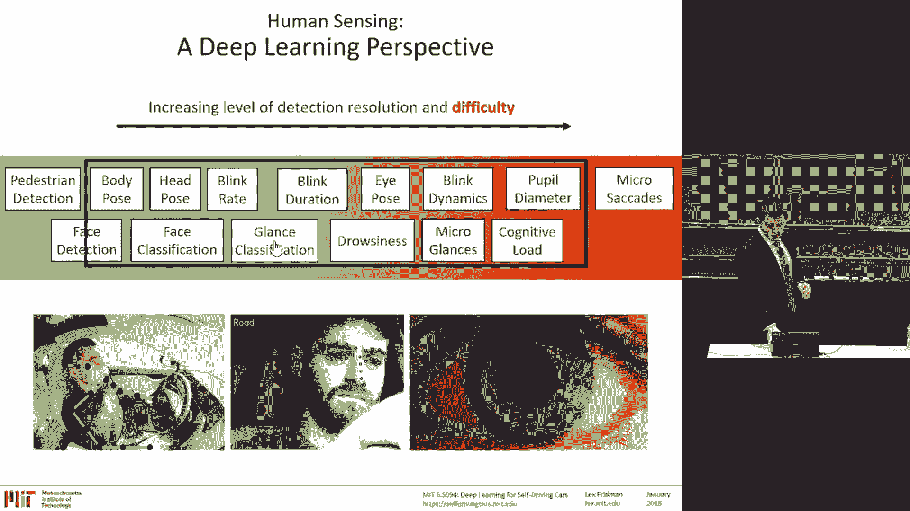

Human emotion is a fascinating thing。So the same kind of pipeline， stabilization。

 cleaning of the data， raw pixels in， and then the classification is emotion。

 the problem with emotion。If I may speak as an expert， human。Not an expert in emotion。

 just an expert at being human。Is that there is a lot of ways to asize emotion。

 to categorize emotion。To define emotion。Whether that's for the primary motion of the peri scale with love。

 joy， surprise， anger， sadness， fear， there's a lot of ways to mix those together to break those apart into hierarchical taxonomies。

And the way we think about it in the driving context， at least。

 there is a general emotion recognition task sort of。I'll I'll mention it。

 but it's kind of how we think about primary emotions as detecting。

The broad categories of emotion of joy and anger of disgust and surprise。

And then there is application specific emotion recognition。

 where you're using the facial expressions that all the various ways that we can deform our face to communicate information。

To determine。A specific question about the interaction of the driver。So first， for the general case。

 these are the building blocks， I mean， there's countless ways of deforming the face that we use to communicate with each other。

 theres 42 individual facial muscles。That can be。Used to form those expressions。

One of our favorite tools to work with is the Fect of SDK。

 this is their task with the general emotion recognition task is taking in raw pixels and determining categories of emotion。

 various subtleties of that emotion in the general case， producing classification of anger， disgust。

 fear， surprise， so on。And then mapping， I mean， essentially what these algorithms are doing。

 whether they're using deep neural networks or not。

 whether they're using face alignment to do the landmark detection and then tracking those landmarks over time to do the facial actions。

They're mapping the expressions， the component， the various expressions we can make with their eyebrows or their nose and mouth。

Eyes to map them to the emotions， so I'd like to highlight one because I think it's an illustrative one for joy。

 an expression of joy is smiling。So there's an increased likelihood that you observe a smiling expression on the face when joy is experienced or vice versa。

 if there's an increased probability of a smile，There's an increased probability of emotion of joy being experienced。

 and then joy and experience has a decreased probability likelihood of brow raising and brow followinging。

So if you see a smile。That's a plus for joy。If you see brow raised， Bra Foro。

 brow4o is a minus for joy， that's for the general emotion recognition task that's been well studied that's sort of the core of effective computing movement from the visual perspective again from the computer vision perspective。

For the application specific。Perspective， which we're really focused on again。

 data is everything what are you annotating， we can take here we have a large scale data set of drivers interacting with a voice based navigation system。

So they're tasked with in various vehicles to enter a navigation。

 so they're talking to their GPS using their voice， this is for depending on the vehicle。

 depending on the system in most cases an incredibly frustrating experience。

 so we have them perform this task and then the annotation is self-report after the task they say on a scale of one to 10。

 how frustrating was this experience。And what you see on top is the expressions detected and associated with a satisfied a person who said a 1 on the satisfaction。

 so a one on the frustration scale。I was perfectly satisfied with the voicebased interaction on the bottom is frustrated as a I believe a nine on the frustration scale。

 so the feature the strongest there， the expression remember joy。

 smile was the strongest indicator of frustration for all our subjects。

 that was the strongest expression， smile was the thing that was always there for frustration。

There's other various frowning that followed and shake the head and so on， but smiles were there。

 so that shows you the kind of clean difference between general emotion recognition task and the application specific here perhaps they enjoyed an absurd。

Moment of joy at the frustration they were experiencing， you can sort of get philosophical about it。

 but the practical nature is they were frustrated with the experience。

 and we're using the 42 muscles of the face that make expressions to do classification of frustrated or not。

And there data does the work， not the algorithms， it's the annotation。

A quick mention for the AGI class next week for the Artificial General Inligence class。

One of the competitions we're doing is we have a JavaScript face that's trained with a neural network to form various expressions。

To communicate。With the observer。So we're interested in creating emotion。

 which is a nice mirror coupling of the emotional recognition problem。It's going to be super cool。

Cognitive load。We're starting to get。To the eyes。Cognitive load is the degree to which a human being is accessing their memory or is lost in thought how hard they're working in their mind to recollect something。

 to think about something as cognitive load。And to do a quick pause of eyes as the window to cognitive load eyes。

 the window to the mind。There's different ways the eyes move， so there's pupils。

 the black part of the eye， they can expand and contract based on various factors。

 including the lighting variations in the scene， but they also expand a contract based on cognitive load。

That's that's a strong signal。 they can also move around。 there's ballistic movements。

 thecades when we look around eyes jump around the scene。

 they can also do something called smooth pursuit when you and connecting to our animal past can see a delicious meal flying by or running by that your eyes can follow it perfectly they're not jumping around so when we read a book our eyes are using sattic movements where they jump around and when the smooth pursuit the eyes moving perfectly smoothly those are the kinds of movements we have to。

Work with。And cognitive load can be detected by looking at various factors of the eye the blink dynamics。

 the eye movement and the eye the pupil diameter the problem is in the real world and real world data with lighting variations everything goes out the window in terms of using pupil diameter which is the standard way to measure non-contact way to measure cognitive load in the lab when you can control lighting conditions and use infrared cameras when you can't all that goes out the window and all you have is the blink dynamics and the eye movement so neural networks to the rescue 3D convolution and neural networks in this case。

 we take a sequences of images is the I through time and use 3D convolutions as opposed to 2D convolutions on the left is everything we've talked about previous to this is 2D convolutions when the convolution filter is operating on the Xy2D image。

Every channel is operated on by the filter individual separately， 3D convolutions combine those。

Convolve across multiple images， across multiple channels。Therefore。

 being able to learn the dynamics of the scene through time as well， not just spatially。Tempor。

And data。Data is everything for cognitive load， we have， in this case， 92 drivers。

So how do we sort of perform the cognitive low classification task。

 we have these drivers driving on the highway and performing the what's called the end back task zero back。

 one back， two back and that task involves。Hearing numbers being read to you and then recalling those numbers one at a time。

 so when zero back， the system gives you a number seven。

 and then you have to just say that number back。Seven and it keeps repeating that's easy。

 this is supposed to be the easy task one back is when you hear number， you have to remember it。

 and for the next number， you have to say the number previous to that。

So you kind of have to keep one number in your memory always and not get distracted by the new information coming up with two back you have to do that two numbers back so you have to use memory more and more two back so cognitive load is higher and higher okay so what do we do we use face alignment face frontalization and detecting the eye closest to the camera and extract the eye region and now we have this nice raw pixels of the eye region across six seconds of video and we take that and put that into 3D convolution on your network and classify simply one of three classes zero back one back and two back so we have a ton of data of people on the highway performing these task and backtask and that forms the classification supervised learning training data。

That's it， the input is 90 images at 15 frames a second。

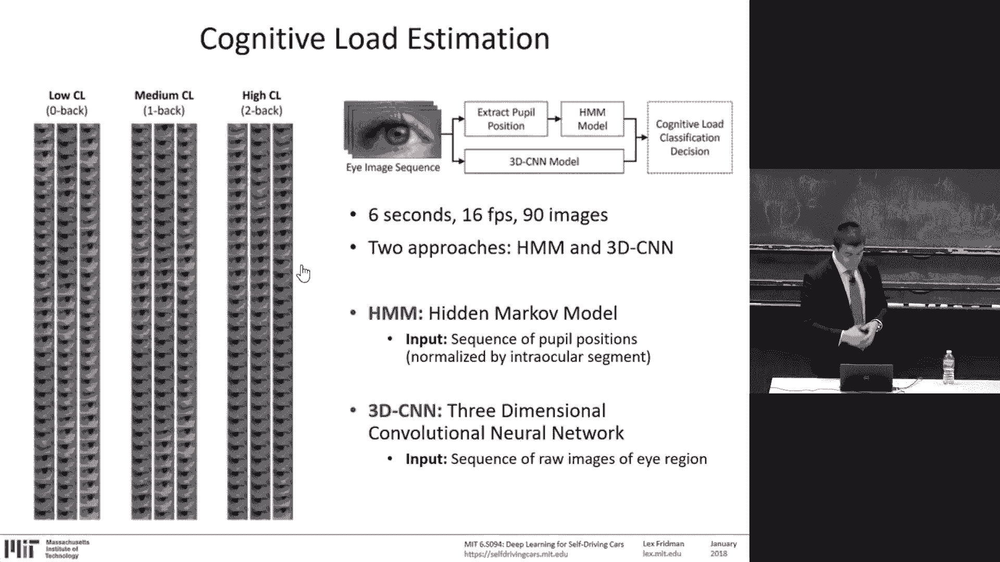

And the output is one of three classes。Face frontalilization I should mention is the technique developed under for face recognition because most face recognition tasks require frontal face orientation is also what we use here to normalize everything that we can focus in on the exact blink。

 it's taking the it's taking whatever the orientation of the face and projecting into the frontal position。

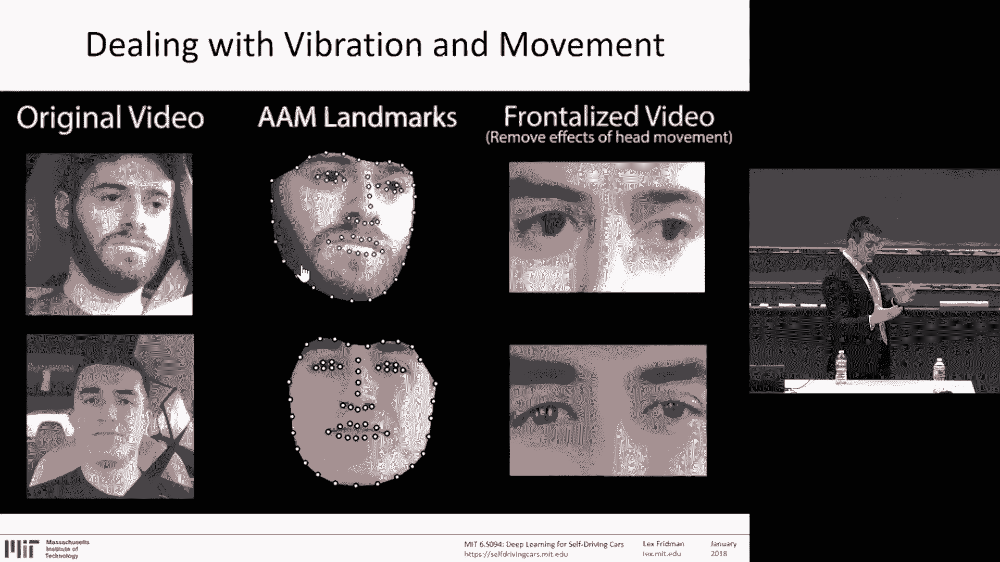

Taking the raw pixels of the face is detecting the eye region， zooming in and grabbing the eye。

Well you find， and this is where the intuition builds。你。It's a fascinating one。

 what's being plotted here is the relative movement of the pupil。

 the relative movement of the eye based on the different cognitive loads for cognitive load on the left of zero。

 so when your mind is not that lost in thought and cognitive load of two on the right when it is lost in thought。

 the eye moves a lot less， the I is more focused。On the forward roadway。

 that's an interesting finding， but it's only in aggregate。

 and that's what the neural network is tasked with doing with extracting on a frame by frame basis。

This is a standard 3D convolutional architecture。Again， taking in the image sequence is the input。

 cognitive low classification is the output and classifying on the right is the。

Accuracy that's able to achieve of 86%。 That's pretty cool from real world data。

The idea is that you can just plop in a webcam， get the video。Going in。

 going into the neural network。 and it predicting。A continuous stream of from zero to two of cognitive load。

Because every single zero back， one back two back classes have a confidence that's associated with them so you can turn that into a real value between zero and 2 and you see here's a plot of three of the people on the team here driving a car performing a task of。

Conversation and in white showing the cognitive load frame by frame， at 30 frames。

 the second estimating the cognitive load of each of the drivers from zero to two on the y axis so these are high cognitive load and showing in on the bottom red and yellow of high and medium cognitive load and when everybody's silent the cognitive load goes down so we can perform now with this simple neural network with the training data that we formed we can extend that to any arbitrary new data and generalize。

Okay， those are some examples of Ho you know networks can be applied。

 and why is this important again。Is while we focus on the sort of the perception task of using neural networks。

 of using sensors and signal processing to determine where we are in the world。

 where the different obstacles are and form trajects around those obstacles。

We are still far away from completely solving that problem。I would argue 20 plus years away。

 the human will have to be involved and so when it's the system is not able to control。

 when the system is not able to perceive when there's some flawed aspect about the perception or the driving policy。

 the human has to be involved and that's where we have to know let the car know what the human is doing。

 that's the essential element of the human robot interaction。

The most popular car in the United States today is the 4 F150， no automation。

The thing that sort of inspires us and makes us think that transportation can be fundamentally transformed is the Google self driveri。

 the Waymo car and all our guest speakers and all the folks work on the autonomous vehicles。

But if you look at it， the only people who are at a mass scale or beginning to are actually injecting automation into our daily lives is the ones in between。

 it's the Tesla， it's the L2 systems， it's the Tesla system， the supercz， the Audi， the Volvo S 90s。

 the vehicles that are slowly adding some degree of automation and teaching human beings how to' interact with that automation。

And。Here it is， again。The path towards mass scale automation where steering wheel is removed。

 the consideration the human is removed。I believe is more than two decades away。On the path to that。

 we have to understand and create successful human robot interaction approach。Autonomous vehicles。

 autonomous systems in a human centered way。The mass scale integration of these systems of the human center systems like the Tesla vehicles。

 a Tesla is just a small company right now， the kind of L2 technologies have not truly penetrated the market。

 have not penetrated our vehicles， even the new vehicles being released today。

 I believe that happens in the early 2020s and that's going to form the core of our algorithms that will eventually lead to the full autonomy。

All of that data， what I mentioned with Tesla with a 32% miles being driven。

 all of that is training data for the algorithms， the edge cases arise there。

 that's where we get all this data in our data at MIT is 400，000 miles。

 Tesla has a billion miles so that's all training data on the way on the stairway to mass scale automation。

Why is this？Important。Beautiful and fundamental to the role of AI in society。

 I believe that cell driving cars when they're in this way are focused on the human robot interaction。

 are personal robots。They're not perception control systems。

 tools like A Roomba performing a particular task。When human life is a stake。

 when there's a fundamental transfer between it。of life， of a human being。

 giving their life over to an AI system directly， one on one is a transfer。

 that is kind of a relationship that is one indicative of a personal robot。

ThisIt requires all the things of understanding， communication， of trust。These are。

Fascinating to understand how a human robot can form trust enough to create really an almost。

One to one understanding of each other's mental state， learn from each other。Oh， boy。呃。

So one of my favorite movies， Goodwill Hunting， we're in Boston， Cambridge。

 have Im going to regret this one， this is Robin Williams。Speaking about human imperfections。

 so I'd like you to take this quote。And replace every tie you mentions girl with car。

People call those things imperfections。 Robin Williams is talking about his wife who passed away in the movie。

Talking about her imperfections。They call these things imperfections， but they're not。

 that's the good stuff。And then we'll get to choose who we let into our weird little worlds。

You're not perfect sport。 And let me save you the suspense。 This girl you met。

 she isn't perfect either。 You know what， Let me just。什么。

The little idiosyncrasies that only I know about。That's what made to my wife。

I chicken put only to share on my pack dogs。People call these things imperfections。我啊 that。你 the。

In perfect sport。Let me say the assistance。でか咩。其有界。The question is when。本车的。so new。

And everything in the world for。 but no find that that is by getting the shop。

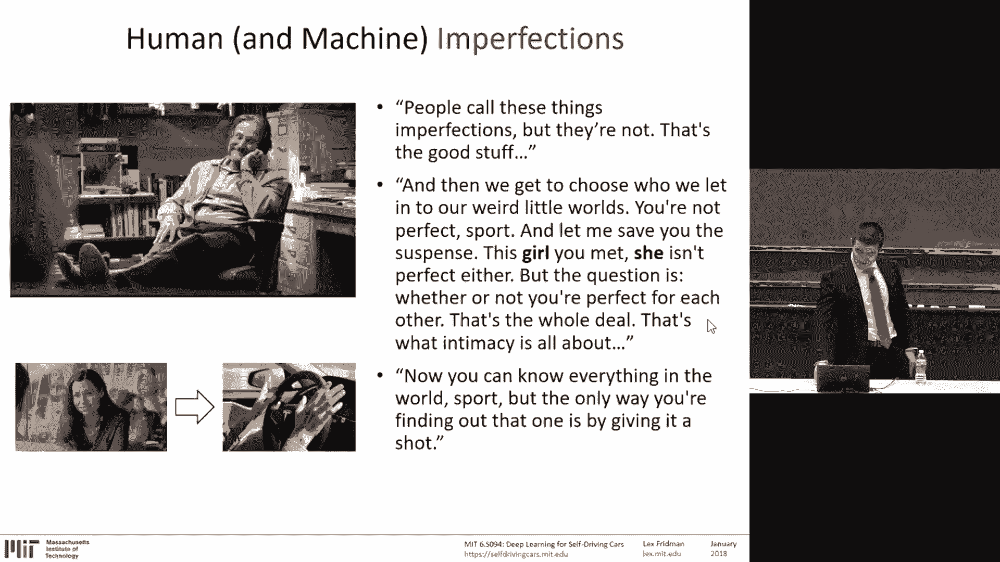

So the approach we're taking。In building the autonomous vehicle， we are here at MIT in our group。

 the human center approach to autonomous vehicles。They were going into release in March of 2018 in the streets of Boston。

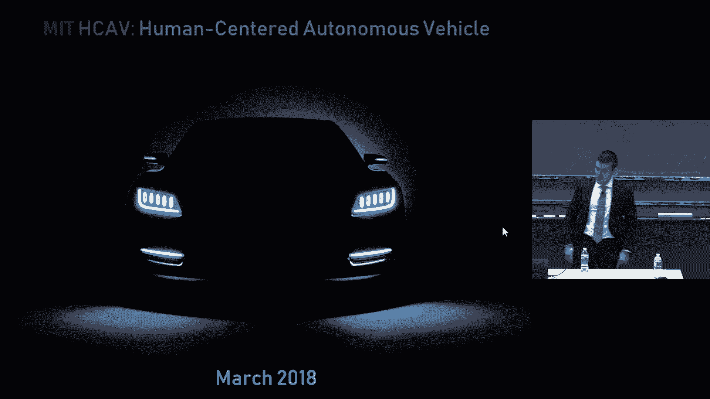

Those who would like to help。Please do。I will talk run a course on deep learning for understanding the humans at CI 2018 will be going through tutorials that go far beyond the visual。

 the convolutional neural network based detection of various aspects。

Of the face and body would look at natural language processing， voice recognition。And Gs。

If you're going to Kai， please join。

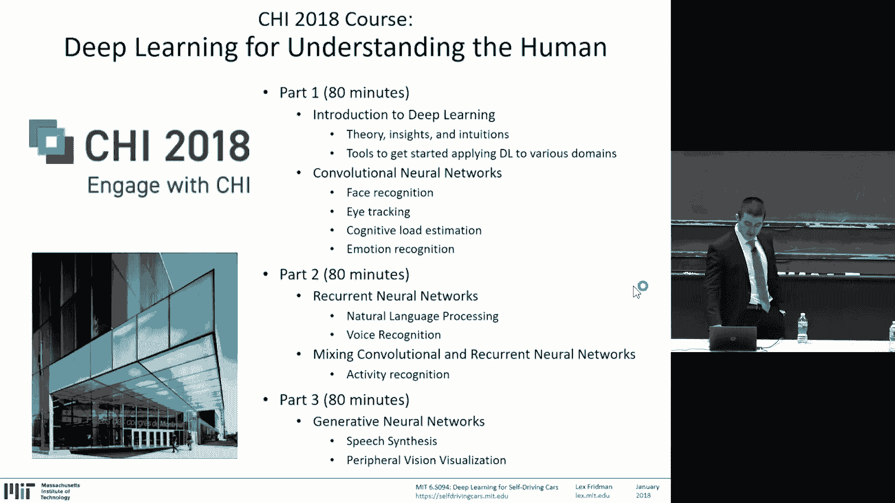

Next week， we have an incredible course that aims to understand。

To begin to explore the nature of intelligence。Natural and artificial。We have Josh Tenembaum。

 Ray Kurzweil。Lia Barrett。Nate Dbinsky looking at cognitive modeling architectures， Andre Carpahi。

Stephen Wolffrm， Richard Moes， talking about autonomous weapon systems and AI safety。Mark Rebert。

From Boston Dynamics and the amazing， incredible robots I have。And。

Ilia says Sver from Open AI and myself。

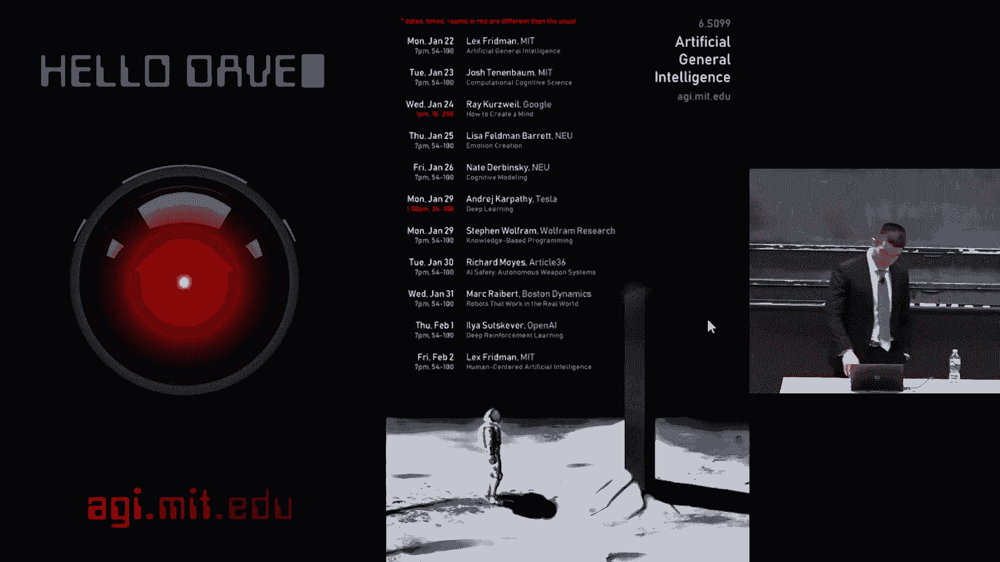

So what next？For folks register for this course， you have to submit by tonight。

A deep traffic entry that achieves a speed of 65 miles an hour。

And I hope you continue to submit more that win the competition the high performer award will be given to folks。

 the very few folks。Who achieve 70 miles an hour or faster？We would continue rolling out Seg fuse。

 having hit a few snags and invested a few。Thousands of dollars in the sanitation process。

Of annotating a large scale data set for you guys will continue this competition that will take us into。

Into a submission towards NIPS where we would hope to submit the results for this competition and deep crash。

 deeper enforcement learning， these competitions will continue through May 2018。

 I hope you stay tuned and participate。There's upcoming classes。

 the AGI class I encourage you to come to is going to be fascinating and there's so many cool。

 interesting ideas that we're going to explore， it's going to be awesome。

 there's an introduction a deep learning course that I'm also a part of where I get a little bit more applied and get folks who are interested in the very basic algorithms of deep learning。

 how to get started with those。Hands on。And there's an awesome class I ran last year for those who took this class last year we also talked about it on the global business of AI and robotics。

 the slides are online， I encourage you to click a link on there and register， it's in the spring。

 it's once a week and it's truly brings together a lot across disciplinary folks to talk about ideas of artificial intelligence and the role of AI and robotics in society。

 it's an awesome class。And if you're interested in applying deep learning methods in automotive space。

 come work with us。We have a lot of fascinating problems to solve or collaborate。So with that。

 I'd like to thank everybody here， everybody across。

The community that's been contributing we have thousands of submissions coming in for deep traffic and I'm just truly humbled by the support we've been getting and the team behind this class is incredible。

 Thank you to Nvidia， Google， Amazon， Alexa， AutoLve and Toyota， and today we have shirts。

Extra large。Extra， extra large medium over there， small and large over there。

The big and small people over here and the medium sized people over here。So just grab one and enjoy。

 thank you very much。

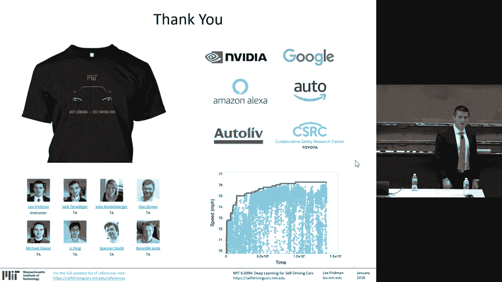