# P6：L6- 面向运动规划的深度强化学习 - ShowMeAI - BV1Y34y1i7vC

All right， hello everybody， welcome back， glad you came back。Today。We will unveil the first tutorial。

 the first project。This is deep traffic code named deep traffic where your task is to solve the。

Traffic problem using deeper reinforce learning。And I'll talk about what's involved in designing a network there。

How you submit your own network and how you participate in the competition。As I said。

 the winner gets a very special prize。To be announced later。What is machine learning？Several types。

 there's supervised learning。 As I mentioned yesterday。

 that's what meant usually when you discuss about， you talk about machine learning and talk about its successes。

 Supervised learning requires a data set。Well， you know the ground truth。

 you know the inputs and the outputs。And you provide that to a machine learning algorithm in order to learn the mapping between the inputs and the outputs in such a way that you can generalize to further examples in the future。

On supervised learning。Is the other side。When you know absolutely nothing about the outputs。

 about the truth。Of the data that you're working with， All you get is data。

And you have to find underlying structure。Underlying representation of the data that's meaningful for you to。

 to accomplish a certain task， whatever that is。There's semiupervised data。Or only parts。

 usually a very small amount。Is has， is labeled。 There's ground truth available for just a small fraction of it。

 if you think of。Images that are out there on the Internet。And then you think about IageNe。

 a data set where every image is labeled。The size of that image that data set。

It's a tiny subset of all the images。On the available online。

But that's the task we're dealing with as human beings。

 as people interested in doing machine learning。Is。How to expand the size of that。

Of the part of our data that we know something confidently about。

And reinforcement learning sits somewhere in between。It it's semi superupvised learning。Where。

There's an agent that has to exist in the world。And that agent。

Knows the inputs that the world provides。But knows very little about that world。

 except through occasional。Time delayed rewards。 This is what it's like to be human。

This is what life is about。You don't know what's good and bad。 You kind of have to just live it。

 And every once in a while。You find out that all that stuff you did last week was pretty bad idea。

That's reinforcement learning。 That's semi supervised。

In the sense that only a small subset of the data comes with some ground truth。

 some certainty that you have to then extract knowledge from。So first。

 at the core of anything that's that works currently in terms of practical in a practical sense。

 there has to be some ground truth。 There has to be some truth。That we can hold on to。

 as we try to generalize。And that's supervised learning。 even as in reinforcement learning。

 the only thing we can count on is that truth that comes in a form of a reward。

So the standard supervised learning pipeline is you have some raw data。The inputs。You。Ground truth。

 the labels， the outputs that matches to the inputs。Then you run a certain any kind of algorithm。

 whether that's a neural network。Or another prepros processing algorithm that extracts the features from that data set。

You could think of a picture of a face that algorithm could。Extract the nose， the eyes。

 the corners of the eyes， the pupil。Or even lower level features in that image。After that。

 we insert those features。Into a。In a model， a machine learning model。We train that model。

Then we as we， whatever that algorithm is， as we pass it through that training process。

 we then evaluate。After we've seen this one particular example。How much better are we at other tasks？

And as we repeat this loop， the model learns to perform better and better at generalizing from the raw data to the labels that we have。

And finally， you get to release that model into the wild to actually do prediction。

On data A is never seen before。That you don't know about。And the task there。Is to predict the labels。

Okay， so neural networks is what this class is about。

It's one of the machine learning algorithms that has proven to be very successful。

And the building block， the computational building block of a neural network， is a neuron。

A perceptron。Is a type of neuron。It's the original old school neuron。Where the output is binary。

 a0 or1。It's not real valued。And the process。Their perceptron goes through。Is it has multiple inputs。

And a single output。The inputs， each of the inputs have weights on them shown here on the left as 。7。

6，1。4。Those weights are applied to the inputs， and a perceptron the inputs are ones or zeros。Binary。

And those weights are applied。Just， and then sum together。A bias on each neuron is then added on top。

And。A threshold。There's a test whether that summed value plus the bias is below or above a threshold。

 If it's above a threshold， produces a one， If it's below a threshold， it produces a 0， simple。

It's one of the only things we understand about neural networks。Confidently。

 we can prove a lot of things about this neuron。For example。What， we know。

Is that a neuron can approximate approximate a Nn gate。And navigategate。Is。A logical operation。

 a logical function that takes this input。It has two inputs， A and B here on the diagram on the left。

And the table shows what that function is。 when the inputs are  zeros，0，1， in any order。

 the output is a one。Otherwise， it's a0。The cool thing about an aggregategate is that it's a universal。

😊，Gay。That you can build up any computer you have。Where you phone in your pocket today can be built out of just N gates。

 So it's a， it's a functionally complete。 You could build any logical function out of them。

 If you stack them together in arbitrary ways。 The problem with N gates and computers。

Is they built from the bottom up， You have to design these circuits of N gates。

So the cool thing here is with the perceptron。We can learn。This magical man。

 we can learn this function。😊，So let's go through what how we can do that。

How a perceptron can perform the Nand operation。Here's the four examples， if we put。

The weights of negative2 on each of the inputs。And a bias of three on the neuron。

And if we perform that same operation。Of summing the weights， times the inputs。Plus， the bias。

In the top left， we get。When the inputs are zeros and there's sum to the bias， we get a three。That's。

 that's a positive number， which means the output of a perceptron will be a one。On the top right。

 when the input is a 0 and a 1。That sum is still a positive number。 Again， produces a one。And so on。

 But when the inputs are both ones， then。The output is a negative one， less than 0。So， while。

 this is。Simple， it's really important to think about。It's， it's a sort of。The one。

Basic computational truth you can hold on to as we talk about some of the magical things neural network can do。

Because if you compare a circuit of Nan gates。In a circuit of neurons。The difference。

 while a circuit of neurons。Which is what we think of as a neural network。

Can perform the same thing as the circuit of nagates。What it can also do is it can learn。

It can learn the arbitrary logical functions。That a arbitrary circuit of N gates can represent。

 but it doesn't require the human designer。We can evolve。If you will。So one of the key aspects here。

 one of the key drawbacks of perceptron。Is it not very smooth in its' output。

As we change the weights。On the inputs， and we change the bias and we tweak it a little bit。

It's very likely that when you get。It's very easy to make the neuron output a0 instead of a 1 or one instead of a0。

So when we start stacking many of these together， it's hard to control the output of the thing as a whole。

Now， the essential step。That makes a neural network。Work that a circular perceptrons doesn't。

Is if the output is made smooth。Is made continuous with an activation function。

And so instead of using a step function， like a perceptron does。Shown there on the left， we use。

Any kind of smooth function， a sigmoid。Where the output can change gradually。

As you change the weights and the bias。And this is a basic but critical step。And so， learning。

Is generally the process of adjusting those weights gradually and seeing how it has an effect on the rest of the network。

 You just keep tweaking weights here and there and seeing how much closer you get to the ground truth。

And if you get farther away。You just adjust the weights in the opposite direction。

That's neural networks in a nutshell。There is what we' will mostly talk about today is feed forward neural networks。

On the left。Going from inputs to outputs。With no loops。There is also。

These amazing things called recurrent neural networks。They're amazing because they have memory。

They have a memory of state。 They remember。The temporal dynamics of the data that went through。

But the painful thing。Is that they're really hard to train。

Today we'll talk about feed for neural networks。So let's look at this example。Yes。

An example of stacking a few， a few of these neurons together。Let's think of the task。

The basic tasks now famous using the classification of numbers。You have an image of a number。

 handwritten number。And your task is given that image。To say what number is in that image。Now。

 what is an image， An image is a collection of pixels， In this case， 28 by 28 pixels。

 that's a total of 784 numbers。 Those numbers are from 0 to 255。And on the left of the network。

 the size of that input。Despite the diagram is 784 neurons。That's the input。

Then comes the hidden layer。It's called the hidden layer， because it has。It has no interaction。

With the input or the output。It is simply a block used。

The it's at the core of the computational power of neural networks is the hidden layer。

It's tasked with forming a representation。Of the data in such a way that it maps from the inputs to the outputs。

In this case， there is 15 neurons in a hidden layer。There is 10 values on the output。

Corresponding to each of the numbers。There are several ways you could。

 you can build this kind of network。 And this is what the magic of neural networks is you can do it in a lot of ways。

 You only really need four outputs to represent to values 0 through 9。But in practice。

 it seems that having 10 outputs works better。And how do these work whenever the input is a5。

The output neuron in charge of five， gets really excited。 and output a value that's close to one。

From zero to one。Close to one。 And then the other ones。Get output of value。

 hopefully that it's close to 0。And when they don't。

We adjust the weights in such a way that they get closer to 0 and closer to one。

 depending on whether it's the correct neuron associated with the picture。

We'll talk about the details of this training process more tomorrow when it's more relevant。But the。

What we've discussed just now is the forward pass。Through to the network。

It's the pass when you take the inputs， apply the weights， sum them together， add the bias。

 produce the output。And check which of the outputs produces the highest confidence of the number。

Then once those probabilities for each of the numbers is provided。We determine。The gradient。

That's used to punish or reward the weights that resulted in either the correct or the incorrect decisions。

 And that's called back propagation。 We step backwards through the network。

 applying those punishments or rewards。Because of the smoothness of the activation functions。

 that is a mathematically efficient operation。That's where the G GPUs step in。

So far example of numbers。The ground truth。For number six。Looks like the following。In the slides。

Y of x equals to。A10 dimensional vector。Where only one of them。The， the sixth。Values of one。

 The rest are 0。That's。The ground truth that comes with the image。The loss function here。

The basic loss function is the squared error。Y of x is the ground truth。

And a is the output of the neural network。Resulting from the forward pass。

So when you input that number of a of a6 and the outputs。Whatever it outputs， that's a。

 a tenal vector。And it's summed over the inputs。To produce the squared error。

That's our loss function。 The loss function， the objective function。 That's what's used to determine。

How much to reward or punish the back propagated weights throughout the network？

And the basic operation。Of optimizing that loss function， of minimizing that loss function。

Is done with various variants of， of gradient descent。It's hopefully a somewhat smooth function。

But it's a highly nonlinear function。This is why we can't prove much about neural networks。Is it。

 it's a highly， high dimensional， highly nonlinear function。 that's hopefully smooth enough。

Were the gradient descent。Confined。It's way to at least a good solution。

And there has to be some stochastic element there。That。

doesn't get that jumps around to ensure that it doesn't get stuck in a local minima。

Of this very complex function。Okay， that's supervised learning。 There''s inputs， there's outputs。

 ground truth。It's our comfort zone。We're pretty confident we know what's going on。

All you have to do is just you have this data set， you train and。

You train a network on that data and you can evaluate it。

 you can write a paper and try to beat a previous paper， It's great。

The problem is when you then use that neural network to create。

An intelligent system that you put out there in the world。

And now that system no longer is working with your data set。

It has to exist in this world that's maybe very different。From the ground truth。

So the takeaway from supervised learning。Is that neural networks is a great memorization？

But in a sort of philosophical way， they might not be great at generalizing。At reasoning beyond。

The specific flavor of data set that they were trained on。The hope for reinforcement learning。

Is that we can extend the knowledge we gain in a supervised way。To the huge world outside。

Where we don't have the ground truth of how to act。

Of what does how good a certain state is or how bad a certain state is。

 This is a kind of brute force reasoning。 And I'll talk about。Kind of what I mean there。

 But it feels like it's closer to reasoning as opposed to memorization。

 That's a good way to think of supervised learning as memorization。You're just studying for an exam。

 And as many of you know， that doesn't mean you're going to be successful in life just because you get an A。

And so。A reinforcement learning agent。Or just any agent。A human being。Or any machine。

Existing in this world。Can operate in the following way。From the perspective of the agent。

 it can execute an action。It can receive an observation。Resulting from that action。

In a form of a new state， and they can receive a reward or a punishment。You can break down every our。

 You can。 You can break down our existence in this way。 Simplistic view。

But it's a convenient one on the computational side。And from the environment side。

Their environment receives the action。Amidst the observation。 So your action changes the world。

 Therefore， that world has to change。And then tell you about it。

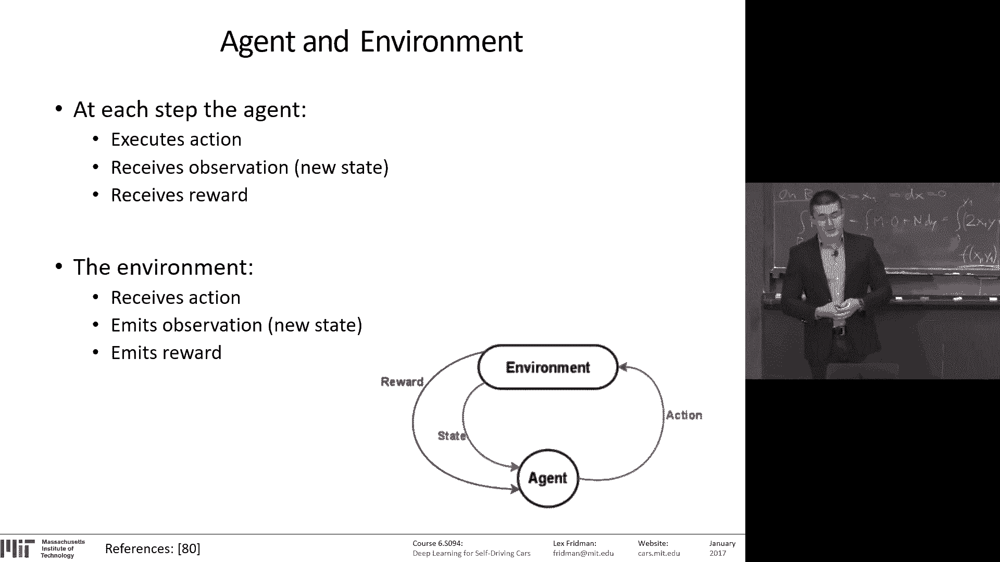

And give your reward or punishment for it。So。That's the。Again， one of the most fascinating things。

 I'll try to convey why this is fascinating a little bit later on。Is the work of deep mind。Onatari。

This is Atari breakout。A game。Where a paddle has to move around。That's the world it's existing in。

 It's a paddle。 The agent is a paddle。And there's a bouncing ball。

 And you're trying to move your actions to right， move right， move left。

In you trying to move in such a way that the ball doesn't get past you。

And so here is a human level performance of that agent。

And so what does this panelddle have to do that's to operate in this environment。 That's to act。

 move left， move right。Each action changes the state of the world as may seem obvious。

 but moving right changes visually。The state of the world， in fact。

 what we're watching now on the slides。Is the world changing before your eyes for this little guy。

And it gets rewards or punishments。Rewards， it gets in the form of points。

 They're racking up points in the top left of the of the video。And then when the ball gets passed。

 the paddle。It gets punished。By dying， quote unquote。

 and that's the number of lives there has left going from 5 to 4 to 3。Down to 0。

And so the goal is to select at any one moment。The action that maximizes future award。

Without any knowledge of what a reward is。In a greater sense of the word。

 all you have is an instantaneous reward of punishment。

Instantaneous response to the world to your actions。

And this can be modeled as a Markov decision process。Mark our decision process。

Is a mathematically convenient construct。It has no memory。All you get is you have a state。

That you're currently in， you perform an action， you get a reward。

 and you find yourself in a new state。 And that repeats over and over。You start you from state 0。

 you go to state 1。 You once again， repeat an action， get a reward， go to the next state。Okay。

 that's the formulation that we're operating in。When you're in a certain state。

 you have no memory of what happened。Two states go。Everything is operating on the instantaneous。

Instantaneously。And so what are the major components of a reinforcement learning agent。

 there's a policy。Thats that's the agent， the function broadly defined of an agent's behavior。

That means。That includes the knowledge of how， for any given state。

 what is an action that I will take。With some probability。

Value function is how good each state and action are in any particular state。And there's a model。Now。

 this is。A little。A subtle thing that is actually the biggest problem with everything you'll see today is the model is how we represent the environment。

And what you'll see today is some amazing things that neural networks can achieve。

On a relatively simplistic model of the world。 And to question whether that model can extend to the real world where human lives are at stake in the case of driving。

So let's look at the simplistic world， a robot in a room。You start at the bottom left。

 your goal is to get to the top right。Your possible actions are going up down， left and right。Now。

 this world could be deterministic， which means when you take， when you go up， you actually go up。

Or it could be non deterministic。As human life is。Its when you go up， sometimes you go right。

So in this case， if you choose to go up， you move up 80% of the time， you move left 10% of the time。

 and you move right，10% of the time。And when you get to the top right， you get a reward of plus one。

 and you get to the second block from that，42， you get negative one， you get punished。

And every time you take a step， you get a slight punishment。A 。04。Okay， so the question is。

If you start the bottom left。Is this a good solution。

 Is this a good policy by which you exist in the world？And it is if the world is deterministic。

Whenever you choose to go up， you'll go up。When ever choose to go right， you go right。

But if the actions are stochastic， that's not the case。In what I described previously。With 。8 up。

 and。Probability of 01， going left and right。This is the optimalum policy。Now。

 if we punish every single step with a negative 2 as opposed to negative 004。

So every time you take a step， it hurts。You're going to try to get to a positive block as quickly as possible。

And that's what this policy says。 I'll walk through a negative one if I have to。 as long as I get。

 stop getting the negative 2。Now， if the reward for each step is a negative 。1。

You might choose to go around that negative1 block。Slight detour to avoid the pain。

And then you might take an even longer detour as the reward for each step goes up or the punishment goes down。

 I guess。And then。哦。And then there's an actual positive reward for every step you take。Then。

 you'll never。You'll avoid going to the finish line。😡，You'll just wander the world。We saw that。

With the coast racer yesterday， the boat that chose not to finish the race because it was having too much fun getting points in the middle。

So。Let's look at the world that this agent is operating in。As a value function。

That value function depends on a reward。The word that comes in the future。

And that reward is discounted because the world is stochastic。 We don't。 We can't expect the reward。

To come along to us in the way that。We hope it does based on the policy。

 based on the way we choose to act。And so there's a gamma there that， over time。

As their reward is farther and farther into the future， discounts。That reward。

Diminishes the impact of that future award in your evaluation of the current state。

And so your goal is。To develop a strategy that maximizes the discounted future award， this sum。

 this discounted sum。And reinforcement learning。Theres a lot of approaches for coming up。

With a good policy。A near optimal， an optimal policy。There's a lot of fun math there。

You could try to construct a model that optimizes some estimate of this world。

You can try in a Monte Carlo way through just。Simulate that world and see how it unrolls。

And as it unrolls， you try to compute the optimal policy。

Or what we'll talk about today is Q learning。It's。An off policy approach。Where the policy。

Is estimated as we go along。The policy。Is represented as a Q function。The Q function。

Shown there on the left is， I apologize for the equations I lied。Therell be some equations。

The input to the Q function is a state at time T， S T and an action that you choose to take in that state A T。

And your goal is in that state to choose an action which maximizes the reward is the next step。

And what Q learning does。 And I'll describe the process。

Is it's able to approximate through experience。The optimal Q function。

The optimal function that tells you how to act in any state of the world。You just have to。Live it。

 You have to simulate this world。You have to move about it。You have to explore。

In order to see every possible state， try every different action。Get rewarded， get punished。

And figure out what is the optimal thing to do。That's done using。This Bowman equation。On the left。

 the output is the new state。The estimate。The Q function estimate of the new state for new action。

And thats， this is the update rule at the core of Q learning。You take the estimate， the old estimate。

An ad based on the learning rate。Alpha from 0 to 1。They update the evaluation of that state。

Based on your new reward that you received at that time。So you've arrived in a certain state S T。

 You try to do an action。And then you got a certain reward and you update your estimate of that state。

An action pair based on this rule。When the learning rate is 0， you don't learn。 when alpha is0。

You never change。Your worldview， based on the new new incoming evidence。When alpha is one。

You every time change。Your evaluation， your world evaluation based on the new evidence。

And that's the key ingredient to reinforcement learning。First， you explore， then you exploit。First。

 you explore in a non greedy way， and then you get greedy。

 you figure out what's good for you and you keep doing it。

So if you want to learn an Atara game first， you try every single action every state， you screw up。

 get punished， get rewarded。 and eventually you figure out what's actually the right thing to do。

 and you just keep doing it。 And that's how you win。Against the， the greatest world。

 the greatest human players in the world in the game of Go， for example， as we'll talk about。😊。

And the way you do that is you have an epsilon greedy policy that over time。With a probability。

Of 1 minus epsilon， you perform an optimal greedy action with a probability of epsilon。

 You perform a random action。Random action being explore。And so as epsilon goes down from1 to 0。

 you explore less and less。So the algorithm here is really simple。On the bottom of the slide there。

It's the algorithm version， the pseudocode version of the equation。The Bellman equation updateate。

You initialize your estimate of state action pairs。Arbitrarily， a random number。 Now。

 this is an important point。When you start playing or living or doing whatever you're doing and whatever you're doing with reinforcement learning or driving。

You have no preconceived notion of what's good and bad。 It's random。Or however。

 you choose to initialize it。 And the fact that it learns anything is amazing。

I want you to remember that。That's one of the amazing things about。The Q learning at all。

 And then the deep neural network version of Q learning。The algorithm repeats the following step。

 You step into the world， observe in an initial state。 you select。And actionction A。So that action。

 if you're exploring will be a random action， if you're greedily pursuing the best action you can。

 it will be the action that maximizes the Q function。You observe an reward after you take the action。

And a new state that you find yourself in。 And then you update your estimate。

Of the previous state you are in having given taken that action using that Belman equation update。

And repeat this over and over。And so there on the bottom of the slide is。A summary of。Life。Yes， he。

The Q function。Yes， yes。 yeah。 It's a single。The question was， is the Q function a single value？

 And yes，s it's just a single continuous value。So the question was， how do you model the world？So。

The way you model。 So let's start this very simplistic world of Atari。Paddle。

 you think you model it as a paddle that can move left and right。 and there's some blocks。

 and you model the physics of the， the ball。That requires a lot of expert knowledge in that particular game。

 So you sit there handcrafting this model。That's hard to do， even for a simplistic game。

The other model you could take。Is looking at this world in the way that humans do visually， so。

Take the model in as a set of pixels。Just the model is all the pixels of the world。

 You know nothing about paddles or balls or physics or colors and points。

 they're just pixels coming in。That seems like a ridiculous model of the world。

 but it seems to work for Atari。 It seems to work for human beings。 When you're born。

 you see there's light coming into your eyes。And you don't have any。As far as as far as we know。

 you don't come with an instruction when you're born。You know， there's people in the world。

 and there is。There's good guys and bad guys， and this is how you walk。 No。

 all you get is light sound。And the other sensors。And。

And you get to learn about the every single thing you think of as。

The way you model the world is a learned representation。

 And we'll talk about how a neural network does that。 It learns to represent the world。

But if we have to hand model the world。It's an impossible task。It'ss that's the question。

 If we have to hand model the world。Then that world better be a simplistic one。

That's a great question。 So the question was， what is the robustness of this model if。

 if the way you represent the world is at all even slightly different from the way you thought that world is。

That's not that well。Study as far as I'm aware， you I mean。

 it's already amazing that if you construct， if you have a certain input of the world。

 if you have a certain model of the world， you can learn anything' is already amazing。

The question is， and it's an important one is we'll talk a little bit about it。

 not about the world model， but the reward function。 If the reward function is slightly different。

The real reward function of life or of driving or of coast runner is different than what you expected it to be。

 What's the， what's the negative there。 Yeah， it's， it's it could be huge， so。

There's another question or no， never mind， yep。Sorry， can you ask that again。Yes。

 you can change it over。 So the question was， do you change the alpha value over time and you certainly should change the alpha value over time。

 yeah。else。So the question was， what is the。The complex interplay of the epsilon function with the Q learning update。

That's 100% fine tuned， hand tuned to the particular learning problem。 So you certainly want to。

The more complex， the， the， the larger the number of states in the world and the larger the number of actions。

 the longer you have to。Wait before you decrease epsilon to zero， but you have to play with it。

AndIt's one of the parameters you have to play with， unfortunately， and there's quite a few of them。

Which is why you can't just drop a reinforcement learning agent into the world。Oh。

 the effect in that sense， No， no， it's just a coin flip。And if， if that epsilon is 0。

5 half the time， you're gonna take a random action。 So it's no， there's no specific。

 It's not like you'll take the best action。And then with some probability。

 take the second bass and so on。 I mean， you can certainly do that。

 But then the simple formulation that works is you just take a random action because you don't want to have a preconceived notion of what's a good action to try when you're exploring。

 The whole point is you try crazy stuff。If it's a simulation。Okay， so good question。

So representation matters。This is the question about how we represent the world。

 So we can think of this world of breakout， for example。Of the Saari game。

As a paddle that moves left and right。And the exact position of the different things you can hit。

 construct this complex model， this expert driven model that has to fine tune it to this particular problem。

But。In practice， the more complex this model gets the worse that Bellman equation update。

 that value the trying to construct a Q function for every single combination of state and actions becomes too difficult because that function is too sparse and huge。

 So if you think。Of。Because of looking at this world in a general way， in the way human beings would。

 is a collection of pixels visually。If you just take in a pixel。

 this game is a collection of 84 by 84 pixels， an image， an RGB image。

And then you look at not just the current image。But look at the temporal。Trajectory of those images。

 So like， if there's a ball movie， you want to know about that movement。 So you look at。4 images。

 So current image and three images back。And say they're gray scale with 256 gray levels。

That size of the Q table， that the Q value function。It has to learn。Is。Whatever that number is。

 but it's certainly larger than the number of atoms in the universe。That's a large number。

 So you have to run the simulation long enough to touch at least a few times。

Most of the states in that Q table。So。As Elon Musk says， you may need to run， you know。

 we live in a simulation。You may run， have to run a universe just to to。

 to compute the the the Q function in this case。

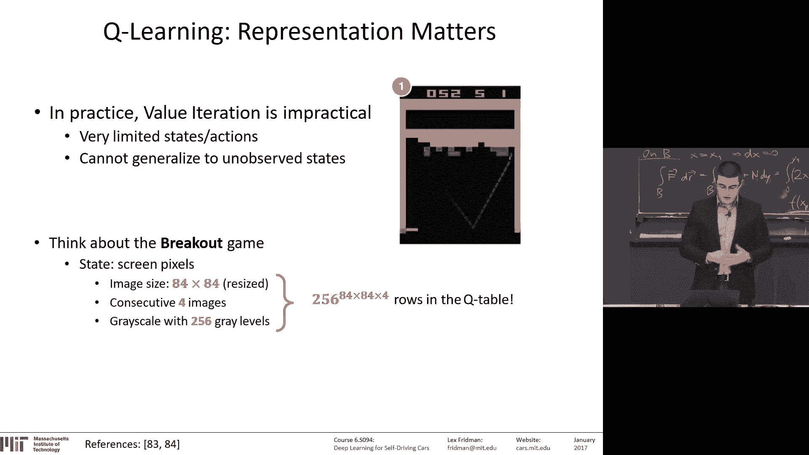

So that's where deep learning steps in。As instead of。Moodeling the world。As a Q table。You estimate。

 you try to learn that function。And so the takeaway from supervised learning。

 if you remember that it's good at memorizing or good at memorizing data。

The hope for reinforcement learning。With a Q， Q learning。Is that we can extend。

The occasional rewards we get to generalize over the operation。

 the actions you take in that world leading up to the rewards。

And the hope for deep learning is that we can move this reinforcement learning system。

Into a world that doesn't need to be， they can be defined arbitrarily。Can include。

All the pixels of an Atari game can include all the pixels sentd by a drone or a robot or a car。

But still， it needs a formalized definition of that world， which is much easier to do。

When you're able to take in sensors， like an image。So deep Q learning， a deep version。

So instead of learning a Q table， a Q function。We try， and estimating that。Q prime。

We try to learn it。Using machine learning。So it tries to learn some parameters。This huge。

Complex function。We try to learn it。And the way we do that。As we have a neural network。

 the same kind that I showed that learned the numbers to map from an image to a classification of that image into a number。

 the same kind of network is used to take an a state。And an action and produce a Q value。Now。

 here's the amazing thing。That， without knowing anything。In the beginning。As I said， with a Q table。

 it's initialized randomly。The Q function。This deep network knows nothing in the beginning。

All it knows。Is in the simulated world， the awards you get for a particular game。

 So you have to play time and time again and see。The， the rewards you get for every single。

Iteration of the game。But in the beginning， it knows nothing。

And it's able to learn to play better than human beings。This is a deep mind paper。

Playing at with deeper reinforcement learning。From 2013。

That's one of the key things that got everybody excited about their role of deep learning and artificial intelligence。

Is that。Using a comb neural network， which I'll talk about tomorrow。 But it's。

 it's a vanilla network， like any other like I talked about earlier today， just a regular network。

It takes the raw pixels， as I said。And estimates that Q function from the raw pixels is able to play at many of those games better than a human being。

And the loss function that I mentioned previously。So。Again， very vanilla loss function。

 very simple objective function。The， the first one youll probably implement。

 we have a tutorial and tensorflow。Squared error。 So we take this Belman equation。

Where the estimate is  Q。The Q function estimate of state and action。Is the maximum？

Rewards you get for taking any of the actions。That takes you to any of the future states。And you。

Try to take that action， observeer the result of that action。And if the target is different。

That your learned target， the learned， what the function has learned is the expected reward in that case is different than what you actually got。

You adjust it， you adjust the weights in the network。And this is exactly the process by which we。

Learn how to exist in this pixel world。So， you're mapping states。And actions。So a Q value。

The algorithm is as follows。This is how we train it。 We're given a transition。

S current state action taken in that state are the rewards you get。 And S prime is what you。

 the state you find yourself in。And so we replaced the basic update rule in the previous pseudocode。

By。Taking a forward pass。Through the network， given that S state。We look at what。

The predicted Q value is of that action。We then do another forward pass through that network and see what we actually get。

And then if we're totally off。每。Punish， we back propagate the weights in a way that next time willll make less of that mistake。

And you repeat this process。And this is a。You're playing your this is a simulation。

You're learning against yourself。And again， the same rule applies here。

 exploration versus exploitation。You start out with an epsilon of。Zero or1。You you're。

Mostly exploring。And then you move towards an epsilon of 0。And with theari breakout。

 this is the deep mind paper result。 is training epics on the X axis on the Y axis is the average action value and the average reward per episode。

I'll show why it's kind of an amazing result， but it's messy because there's a lot of tricks involved。

😊，So it's not just putting in a bunch of pixels of a game and getting an agent that knows how to win at that game。

 There's a lot of preprocess and playing with the data required。So which is unfortunate。

 because the truth is messier。Thenhan the hope。But one of the critical tricks needed is called experience replay。

So as opposed to letting an agent。 So you're learning this big network that learn that tries to build a model of what's good to do in the world and what's not。

And you're learning as you go。So with with experience replay。

 you're keeping a track of all the things you did。 And every every once in a while。

 you look back into your memory and pull out some of those old experiences。

 the old good old times and train on those again。😊，As opposed to letting the agent。

Run itself into some local optima where it tries to learn a very subtle aspects of the game that actually in the global sense。

 doesn't get you farther to winning the game。Very much like life。So here's the algorithm。

 deep Q learning algorithm。Co code。We initialized the replay memory。 Again。

 there this is this little trick that's required。It's keeping a track of stuff that's happened in the past。

We initialized the action value function Q with random weights。And observe initial state。 again。

 same thing。 Select in action。With a probability epsilon， explore。Otherwise。

 choose the best one based on the estimate provided by the neural network。

And then carry out the action， observe their award。And store that experience in the replay memory。

And then sampled random transition from replay memory。So， with a certain probability。

You bring those old timers back to get yourself out of the local mini。

And then you train the Q network。Using the， the difference between。Your。

What you actually got and your estimate。You repeat this process， over and over。

So here's what you can do after 10 minutes of training。On the left， so that's very little training。

What you get is a paddle that。Learns hardly anything， and it just keeps dying。

 If you look at it goes from five to four to3 to2 to one， those are the number of lives left。

Then after two hours of training and a single GPU。It learns to win it， win the。You know。

 not die rackup points。And learns to avoid the ball from passing。Passing the paddle， which is great。

 That's human level performance， really。Better than some humans， you know。

 but it still dies sometimes。 So it's very human level。And then after four hours。

 it does something really amazing。😊，It figures out。How to win the game in a very lazy way。

 which is drill。I hole through the blocks up to the top and get the ball stuck up there。

 and then it does all the hard work for you。 That minimizes the probability of the ball getting past your paddle because it's just stuck in in the blocks up top。

 So that might be something that you wouldn't even figure out to do yourself。And that's an。

I need to sort of pause here to clearly explain what's happening， the input to this algorithm。

Is just the pixels of the game。It's the same thing that human beings take in。

When you take the visual perception。And it's able to learn。Under this constrained。

Definition of what is a reward and a punishment It's able to learn。To get a high reward。

That's general artificial intelligence。A very small example of it， but it's general。

 It's general purpose。 It knows nothing about games。 It knows nothing about paddles or physics。

 It's just taking sensory input of the game。

And theyve did the same thing for a bunch of different games in Atari。And。

What's shown here in this plot on the X axis and is a bunch of different games from Atari and on the Y axis is a percentile where 100% is about the best that human beings can do。

 meaning it's the score that human beings would get。 So everything about there in the middle。

 Everything to the left of that is far exceeding human level performance。

And below that is on par or worse than human level performance。 So you can learn all so many boxing。

pinball。All of these games， and it doesn't know anything about any of the individual games。

 It's just taking them pixels。 It's just as if you put a human being behind any of these games。And。

Ask them to learn to be。

Beat the game。And there's been a lot of improvements in this algorithm recently。 Yes， question。Nope。

 no， there's no。 So the question was， do they customize the model for game for a particular game And no。

 the point you could， of course。 But the point is it doesn't need to be a customized for the game。

 but。But the important thing is。That it's still only on Atari games。

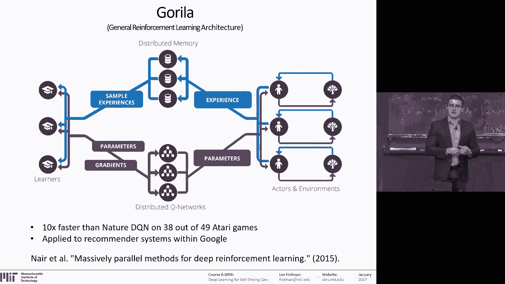

So the question， whether this is transferable to driving。Perhaps not。

Right， you play the game where you do or not， you don't have the Yeah， you play one step of the game。

See， you take action in a state。And then you observe that。 So you have the simulation。 I mean。

 that's really。That's one of the biggest problems here is you require the simulation to in order to get the ground truth。

Yes。So that's a great question or a comment。 the comment was that for a lot of these situations。

The reward function might not change at all， depending on your actions。 The awards are really。

Most of the time delayed 10， 20， 30 steps down the line。

 which is why it is amazing that this works at all。That it's learning， it's learning locally。

And through that process of simulation of hundreds of thousand times runs through the game。

 it's able to learn。😊，What to do now such that I get a reward later。It， it's if you just pause。

 look at the math of it， it's very simple math。And look at the result， it's incredible。

So there's a lot of improvements， this one。Called the General reinforcement Learning architectureitecture or gorilla。

The cool thing about this in the simulated world， at least。

 is that you can run deeper reinforce learning in distributed way。

 You could do both the simulation in distributed way。

 You could do the learning in the distributed way。😊，You can， you can generate experiences。

 which is what this kind of diagram shows。 You can either from human beings。Or from simulation。So。

 for example， the way that。The way that Alpha Go， the Deep Mind team has beat the game of Go is they learn from both expert games and by playing itself。

So you can do this in a distributed way， and you can do the learning a distributed way so you can scale。

 And in this particular case， the gorilla。Has achieved a better result than the DQN network。

That's part of their nature paper。

Okay， so let me now get to。Driving for a second here。 where， Where does reinforcement learning。

Where reinforcement learning can step in。And help。So this is back to the open question that I asked yesterday。

 is driving closer to chess。Or to everyday conversation。Ches。

 meaning it can be formalized in a simplistic way， and then we could think about it as an obstacle avoidance problem。

 And once the obstacle avoidance is solved。You just navigate that constrained space。

 you choose to move left， you choose to move right in lane， you choose to speed up or slow down。Well。

 if it's a game like chess， which we'll assume for today。As opposed to for tomorrow， for today。

We're going to go with the one on the left。

And we're going to look at deep traffic。Here's this。Game。A simulation。

Where the goal is to achieve the highest average speed you can。On this seven lane highway。

Full of cars。And so as a side note for students， the requirement is they have to follow the tutorial that I'll present a link for at the end of this presentation。

And what they have to do is achieve a speed。 build a network that achieves a speed of 65 m an hour or higher。

There is a leaderboard。And you get to submit the model you come up with with a simple click of a button。

 So all of this runs in the browser， which is also another amazing thing。And then you immediately。

 or relatively so。Make your way up to leader board。So let's look， let's zoom in。 What is this。

 what is this world， two dimensional world of traffic is。

What does it look like for the intelligence system？

We destize that world into a grid shown here on the left。 That's the representation of the state。

 There are  seven lanes， and every single lane is broken up into blocks spatially。

And if there's a car in that block， the length of a car is about three blocks。

Three of those grid blocks。Then that grid is seen is occupied。And then the red car is you。

That's the thing that's running in the intelligent agent。

There is on the left is the current speed of the red car。Actually she says MIT on top。

And then you also have a account of how many cars you passed。And if your network sucks。

 then that number is going to get to be negative。You can also change with a drop down。

 the simulation speed from normal on the left to fast on the right。 So normal is。So， you know。

 the the fast speeds up the replay of the simulation。The one on the left normal。

 it feels a little more like real driving。The， there is a drop down for different display options。

 The default is none in terms of stuff you show on the road。Then there is the learning input。

Which is the while the whole space is Destized。You can choose what your car sees。

And that's you could choose how far head it sees behind， how far to the left and right it sees。

And so by choosing the learning input to visualize the learning input。

 you get to see what you set that input to be。Then there is。The safety system。

This is a system that protects you from yourself。The way we've made this game。

Is that it operates under something similar。If you have some intelligence。

 if you drive and you have adaptive cruise control in in your car， it operates in the same way。

 when it gets close to the car in front， it slows down for you。

And it doesn't let you run the car to the left of you， to the right of you off the road。

So conss the movement。Cpabilities of your car in such a way that you don't hit anybody。

Because then it would have to simulate collisions， and it would just be a mess。

So it protects you from that。 And so you can choose to visualize that quote， unquote， safety system。

With the visualization box。 And then you can also choose to visualize the full map。

This is the full occupancy map that you get， if you would like to。Provide his input to the network。

Now， that input for every single grid， that it's a number。 It's not just a 0，1。

 whether there's a car in there。It's。The maximum speed limit， which is 80 m hour。't，'t go。

 don't get crazy，80 miles an hour is the speed limit。That block， when it's empty。

 is set to the 85 miles，80 miles an hour。And when it's occupied。

 it's set to the number that's the speed of the car。And then the blocks that you。

 the red car is occupying is said to the number to a very large number。

 much higher than the speed limit。So safety system here shown in red。

Are the parts of the grid that are not that your car can't move into question？我塞。Yep。Yes。Yes。

 the question was。What was the third option I just mentioned， and it's you， the red card itself。

You yourself， the blocks underneath that car are set to a really high number。

 It's a way for the algorithm to know， for the learning algorithm to know。

That these blocks are special。So， safety system。Shows red here if the car can't move into those blocks。

So any。In terms of。When when it lights up red， it means the car can't speed up anymore in front of it。

 And when the blocks to the left or to the right， light up is red。

 that means you can't change lanes to the left or right。On the right of the slide。You're free to go。

 free to do whatever you want。 That's what that indicates。 is all the blocks are yellow。

Safety system says you're free to choose any of the five actions and the five actions are move left。

 move right， stay in place， accelerate or slow down。And those actions are given us input。

That action is， is that's what's produced by the， what's called here， the brain。

The brain takes in the current state as input， the last reward and produces and and learns。

 uses that reward。To train the network。Through backward。Function there， it's back propagation。

And then。Ask the brain， given the current state， to give it the next action。With a forward pass。

 the forward function， you don't need to know the operation of this function in particular。

 This is not something you need to worry about， but you can， if you want。

 you can customize this learning step。There is， by the way， what I'm describing now。

 there's just a few lines of code right there in the browser。

That you can change and it immediately with the press of a button changes the simulation or the design of the network。

 you don't need to have any special hardware， you don't need to do anything special。

 and the tutorial cleanly outlines exactly all of these steps。

But it's kind of amazing that you can design a deep neural network that's part of the reinforcement learning agent。

So it's a deep Q learning agent。Right there in the browser。So you can choose the lane side variable。

 which controls how many。Laanes to the side you see。 So when that value is 0， you only look forward。

 When that value is one， you have one lane to the left， one value to the right。 It's really the lane。

 the radius of your perception system Pates ahead is how far ahead you look。

 Pates behind is how far behind you look。And so， for example， here， the lane side equals 2。

 That means it looks 2 to the left，2 to the right。Obviously， if to to the right is off road。

It provides a value of 0 in those blocks。If we set the patches behind to be 10。

 it looks 10 patches back behind starting at the one patch back is starting from the front of the car。

The scoring。For the evaluation， for the competition。

Is your average speed over a predefined period of time。And so the method we do。

 we use to collect at speed is we we run the agent 10 runs， about 30 simulated minutes of game each。

And take the median speed of the 10 runs。That's the score。This is done serverside。And。

So so given that we've gotten some， for this， for this code recently gotten some publicity online。

 unfortunately。This might be a dangerous thing to say， is no cheating possible。

But because it's done Surside， and we did this is JavaScript and it runs in the browser。

 it's hopefully sandboxed。So we can't do anything tricky。But we dare you to try。

You can try it locally to get an estimate。And there's a button that says evaluate。

 and it gives you a score right back of how well you're doing with the current network。

That button is。Start evaluation run。 You press the button。 It does a progress bar。

 and it gives you the average speed。You can there's a code box。

Where you modify all the variables I mentioned and the tutorial describes this in detail。

And then once you're ready， you modify a few things， you can press apply code， it restarts。It。

Kills all the training that you've done up to this point or resets it。And starts the training again。

So， save often。And there's a save button。So training is done a separate thread。In web workers。

Which are exciting things that allow you to。Allow jascript to run amazingly in， in， in know。

On multiple CPU cores in a parallel way。So the simulation that scores this or the sorry。

 the training is done a lot faster than real time。1000 frames a second。100 movement steps a second。

This is all in JavaScript。And the next day gets shipped to the main simulation from time to time as the training goes on。

So all you have to do is press run training。And it trains， and the car behaves better over time。

Maybe I'll actually show it in the browser。

这。Let's see if it work， well， is it going to mess up？Well good。

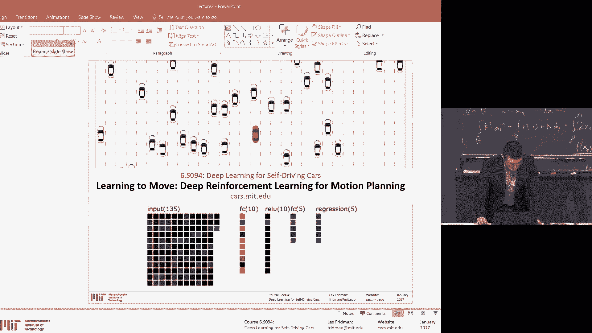

Why is it being weird。What can possibly go wrong。So here's the game。When it starts。

This is running live in the browser。Artificial intelligence， ladies and gentlemen。In the browser。

 a neural network。 So currently it's not very good。 It's driving at two miles an hour。

And watching everybody pass。So。What's being shown live is the loss function。Which is pretty poor。

 So in order to train， like I said， thousand frames a second。You just press the run training button。

And pretty quickly， learns based on the network you specify in the code box。

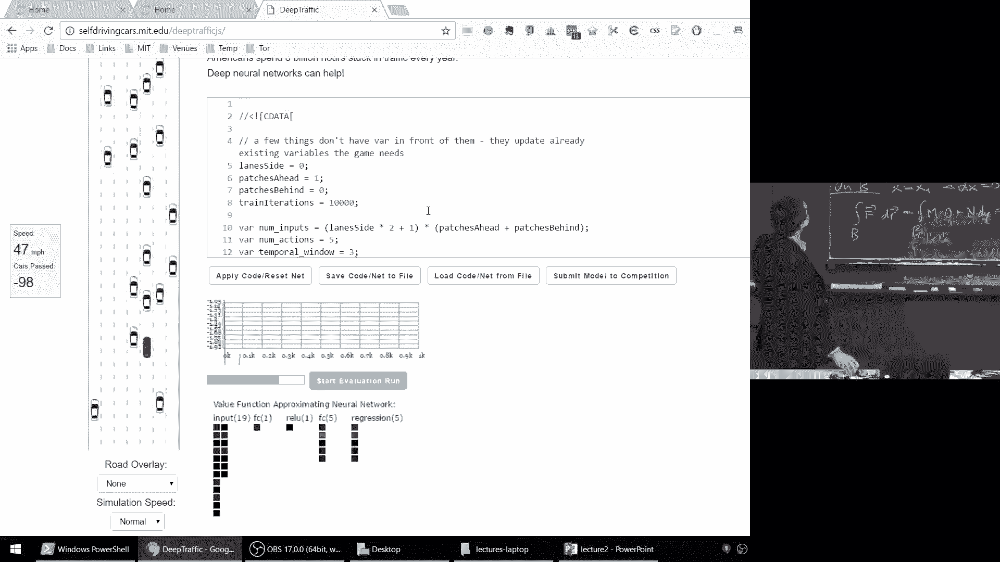

How to and based on the input and all the things that I mentioned。

Training finished。It learns how to do a little better。We on purpose。

 put in a network that's not very good in there。 So right now， we won't， on average。

 be doing that well。But it does better than standing there in place。

And then you could do the start evaluation run。To simulate the network much faster than real time。

 to see how well it does。 This is a similar evaluation step that we take。

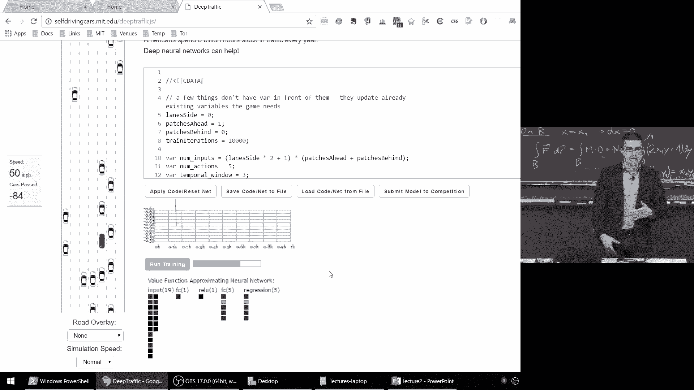

When determininging where you stand on the leaderboard， the current average speed。

In that 10 run simulation is 56。56。

Ms per hour。Now。I may be logged in。 Maybe not。 if you're logged in。

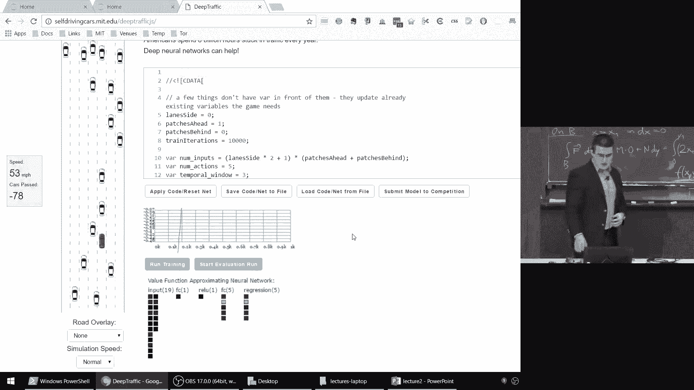

You click submitmit your code， if you're not logged in， it says you're not logged in。

 please log in to submit your code。

And then all you have to do is log in。

is the most flawless demo of my life。And then you press submit model again in success。Oh man。

Thank you for your submission。 And so now my submission is entered as Lex and the leaderboard and my 56。

56 or whatever it was。😊，So I dare all of you to try to beat that。So， to。

As， as you play around with stuff， if you want to save the code。

You could do so by pressing the save code button saves the various JavaScript configurations。

 and that saves the network layout to file。And then you can load from file as well。 danger。

 it overrides the code for you。And you press the submit button to submit the model to competition。

Make sure that you train the network。 We don't train it for you。 You bring us， you submit a model。

 and you have to press train。And it gets evaluated in time。 it enters a queue to get evaluated。

This is public facing， so the queue can grow pretty big。And it goes to that queue， evaluates it。

 And then depending on where you stand， you get added to the leaderboard， showing the top 10 entries。

You can resubmit often。And only the highest score counts。Okay， we're using we're using code。Now。

 implementation of neural networks。Done in just JavaScript。By Andre Carpathy from Stanford。

 now Open AI。Comdomnet JS is a library。And what's being visualized there。

 it's also being visualized in the game is the inputs to the network。 In this case， it's 135 inputs。

You can， you can also specify not just the。Not just how far head behind you see to the left and to the right。

 you can specify how far back in time you look as well。

And so what's visualized there is the input to the network，135。And neurons。 and then the output。

 a regression similar to the kind of output we saw with numbers where there's 10 outputs saying if it's a 0。

1，0 9 here， the output is one of the five actions。 Left， right， Stay in place， speed up or slow down。

The cognitivenet JS settings。Is you can select the number of inputs。

If you want to mess with this stuff， this is all the stuff you don't need to mess with because we're ready to give you the variables of laneside and patches ahead and so on。

 You could select the number of actions。The temporal window。And the network size。嗯。So the。

 the network definition here。Is the。This is the input， the size of the input。Again。

 all this is in the tutorial。 just to give you a little outline。

 there is a the first fully connected layer has 10 neurons。With radio activation functions。

Same kind of smooth。Function that we talked about before。And the regression layer for the output。

And there's a bunch of other messy options that you can play with if you dare。

But those aren't the ones I mentioned before it's really the important ones。

 it's selecting the number of layers， the size of those layers。

 you get to build your own very neural network that drives。

And the actual learning is done with a backward propagation。 And then the。

That returns the action by doing a forward path to the network。

In case you're interested in this kind of stuff， there is an amazingly cool。😊，Code editor。

That's a monoco editor。That it， it just works。 It does some auto completion。

 So you get to play with it。 makes everything very convenient in terms of code editing。

A lot of this visualization of the game。And the and the simulation and the simulation we talk about tomorrow is done in in the browser using HTML L 5 canvas。

 So here is a simple specification of a blue box with canvas。 And it is very。

Efficient and easy to work with。And the thing that。A lot of us are excited about a very subtle one。

 but that you can。Not just run。So with the V 8 engine， jascript has become super fast。 You can。

 you could train neural networks in the browser。 That's already amazing。 And then with Web workers。

 as long as you have Chrome。😊，A modern browser。Is you can run multiple processes in separate threads。

So we could do a lot of stuff。 You can do visualization separately。

 and you can train in separate threads。It's very cool。Okay。

 so the tutorial is CARS that MITDDU and deep traffic。

 we won't put these links on the website for a little bit。

We got put on the front page of hacker news。Which。We don't want those to leak out。

 especially with the claims that you can't cheat。And while it's pretty efficient in terms of running so everything is running on your machine。

 client side。It's still， you have to pull some images here and pull some of the code。

 So the tutorials on cars。 MT IDU slash deep traffic and the simulation is deep traffic J S。

 So cars M T IU slash deep traffic J S。 I encourage you to go there， play with the network。

 submit your code。And win the very special prize， it it is a pretty cool one。

 but we're still working on it。😊。

there is a prize， I swear。Allright， so's。Let's。Take a pause and think about what we talked about today。

So the very best of deep reinforcement learning。Is。The most exciting accomplishment。I think。

Is when the game， when I first started。And， as a freshman， took intro to artificial intelligence。

It was said that it's a game that's impossible for machines to beat because of the combinatorial complexity。

 it's just a sheer number of options， it's so much more complex than chess。And so。

The most amazing accomplishment of deep reinforcement learning to me is the design of Algo。😊。

When for the first time， the world champion and go was beaten。By deep minds， alphaphago。

And the way they did it， and this is， I think， very relevant to driving。Is you start。

By creating first in a supervised way， training a policy network。So you take expert games。

To to construct a network。First， so you don't play against yourself。

The agent doesn't play against itself。But they learn from expert games。

So theres some human ground truth。 this human ground truth represents reality。 So for driving。

 this is important。 we have a well we're starting to get a lot of data where video of drivers is being recorded so we can learn on that data before we then run the agents through simulation where it learns much larger magnitudes of data sets through simulation。

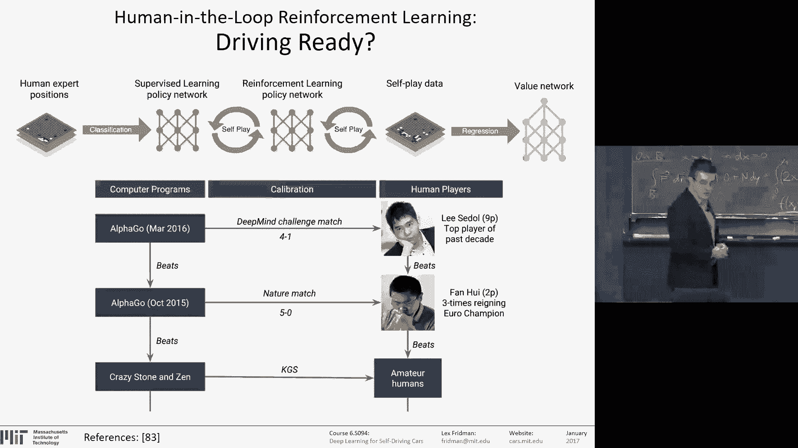

And they did just that。Now， as a reminder。That when you let an agent。Drive itself。

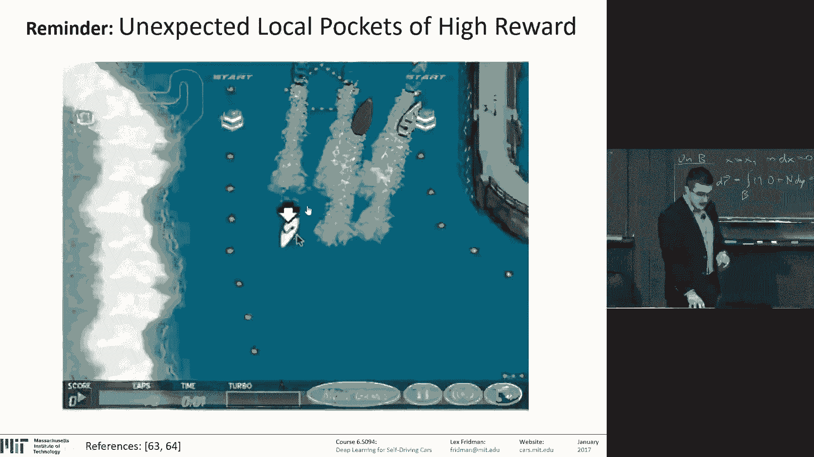

I is probably one of my favorite videos of all time。 But I just recently saw this。

 I could just watch this for hours， but it's a reminder that。😊。

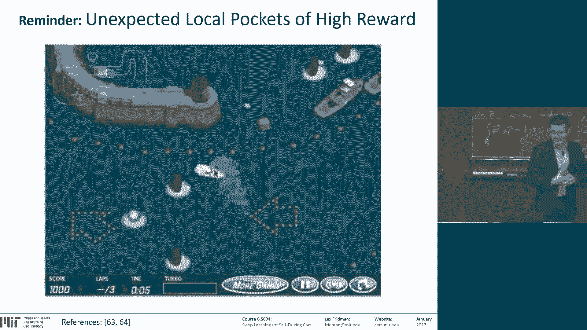

You can't。You can't trust。

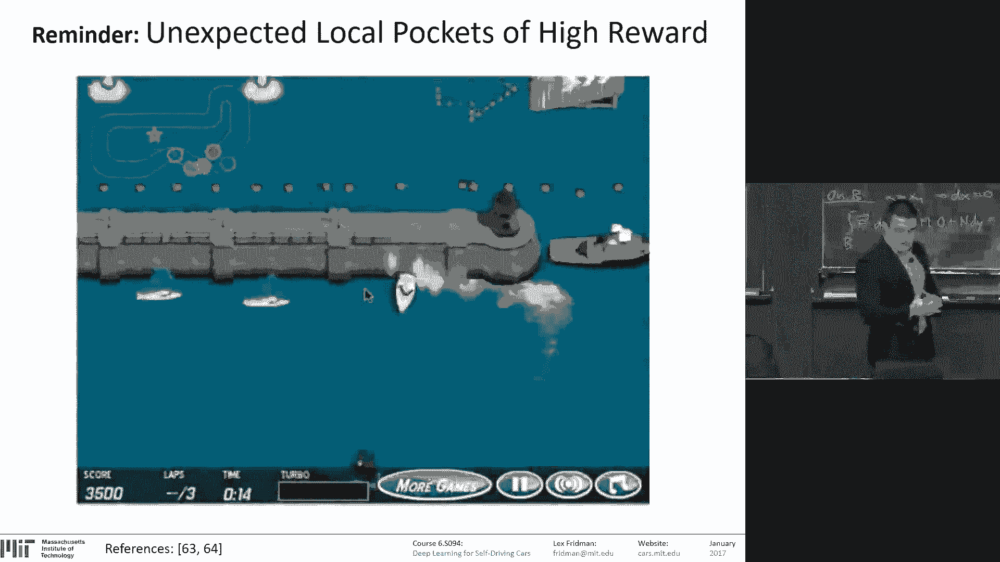

Your first estimates of a reward function。

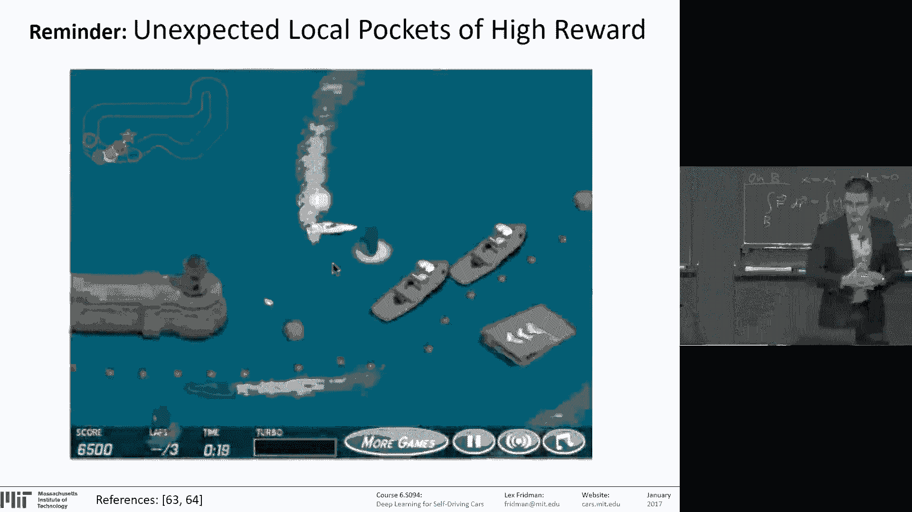

To be those that are safe and productive for our society。

 when you're talking about an intelligent system that gets to operate in the real world。

 this is just as clear of a reminder of that as there is。

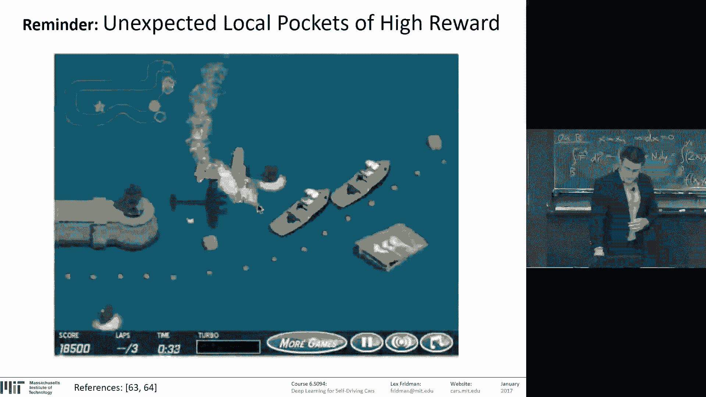

So。Again， all the references are available online for these slides， we'll put up the slides。

I imagine you might have， if you want to come down and talk to us for questions for the either Docker or JavaScript question。

So the question was， what is the visualization you're seeing in deep traffic。

 you're seeing a car move about， how is it moving， it's moving based on the latest snapshot of the network you trained。

So it's just visualizing for you just for fun， the network you trained most recently。Okay， so if you。

 if people have questions， stick around afterwards。Just details on Docker and。And yeah。

Do you want to do it offline， we're going to check up。

