# 【英语字幕+资料下载】MIT 6.S094 ｜ 深度学习与自动驾驶(2018·完整版) - P1：L1- 深度学习与自动驾驶简介 - ShowMeAI - BV1Y34y1i7vC

All right， hello everybody。Hopefully you can hear me well， yes， yes， great。So welcome to Cose 6 S0，9。

4。

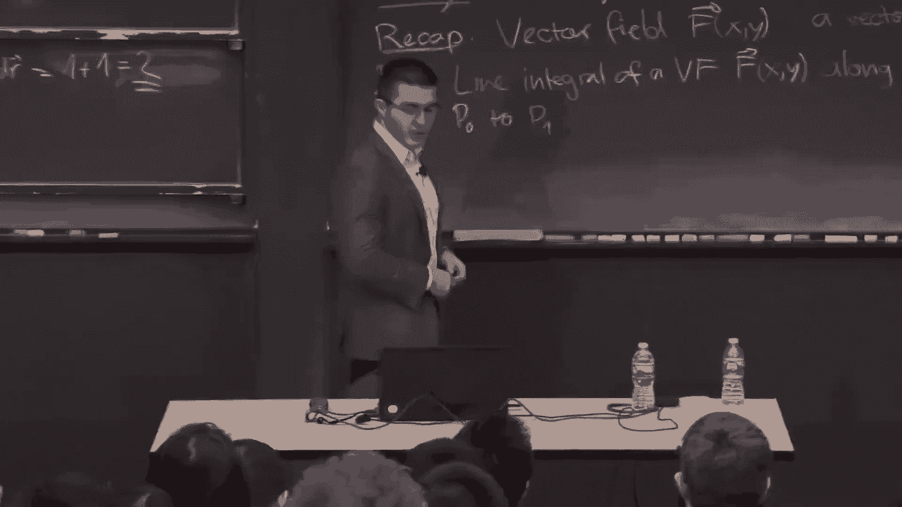

Deep learning for self driving cars。We will introduce to you the methods of deep learning。

 of deep neural networks， using the guiding case study of building cell driving cars。

My name is Lex Friedman。You get to listen to me for a majority of these lectures。

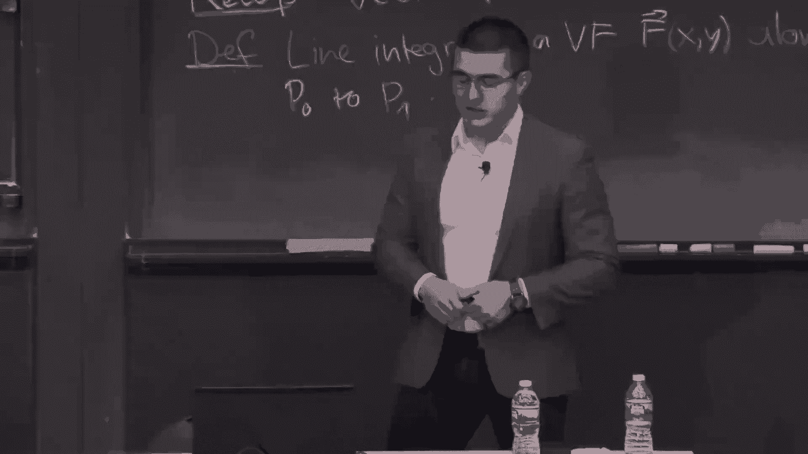

And I am part of an amazing team with some brilliant TAs， would you say brilliant？Dan。Dan Brown。

You guys want to stand up。 okay， they're in front row， Spencer。William Angel， Spencer Dot。

 and all the way in the back， the smartest and the tallest person I know， Benedict Jenk。

So what you see there on the left of the slide is a visualization of one of the two projects that。

One of the two simulations， games。That will get to go through。

We use it as a way to teach you about deeper reinforcement learning， but also as a way to excite you。

By challenging you to compete against others， if you wish to win a special prize。Yet to be announced。

 Super secret prize。So you can reach me and the TAs at Deep Cars at MIT atEDU if you have any questions about the tutorials。

 about the lecture， about anything at all。The website。

 Car that MITU has the lecture content code tutorials again， like today。

 the lecture slides for today are already up in P form the slides themselves。

 if you want to see them just email me， but they're over a gigabyte in size because they're very heavy in videos。

 so I'm just posting the P。And there will be lecture videos available。

A few days after the lecture is given so speaking of which there is a camera in the back。

 this is being videotaped and recorded， but for the most part the camera is just on the speaker so you shouldn't have to worry if that kind of thing worries you。

 then you could sit on the periphery of the classroom or maybe I suggest。Sunglasses and a mustache。

 fake mustache。 That would be a good idea。 There is a competition for the game that you see on the left。

 I'll describe exactly what's involved。In order to get credit for the course， you have to。

Design and neural network that drives the car just above the speed limit，65 m an hour。

 But if you want to win， you need to go a little faster than that。So who this class is for。

You may be new to programming， new to machine learning， new to robotics。

 or you're an experts in those fields， but want to go back to the basics。

So what you will learn is an overview of deep reinforcement learning。

A combinationvolution neural networks。Recurring neural networks。

And how these methods can help improve each of the components of autonomous driving， perception。

 visual perception， localization， mapping， control planning， and the detection of driver state。Okay。

 two projects， code name， deep traffic is the first one。There is。

 in this particular formulation of it， there is seven lanes。It's a top view， it looks like a game。

 but I assure you it's very serious。It is the agent in red。

The car in red is being controlled by a neural network。

 and we'll explain how you can control and design the various aspects of the various parameters of this neural network。

 this neural network。And it learns in the browser。😡，So this we're using Comnet JS。

 which is a library that is programmed by Andre Carary in JavaScript。 So amazingly。

 we live in a world where you can train in a matter of minutes， a neural network in your browser。

And we'll talk about how to do that。 The reason we did this is so that there is very few requirements for get you up and started when neural networks。

 So in order to complete this project for the course。

You don't need any requirements except to have a Chrome browser。And to win the competition。

 you don't need anything except the Chrome browser。The second project， code named deep Tesla。

Or Tesla。Is using data from a Tesla vehicle。Of the forward roadway and using N end learning。

 taking the image and putting it into convolution neural networks that directly maps a agressor that maps to a steering angle。

So all it takes is a single image， and it predicts a steering angle for the car。 And you。

 we have data for the car itself。 and you get to build a neural network that。Tries to do better。

 tries to steer better， or at least as good as the car。Okay。Let's get started with the question。

With the thing that we understand so poorly at this time， because it's so shed in mystery。

 but it fascinates many of us。And that's the question of what is intelligence。This is from a 1996。

March 1996， Time magazine。And the question。Kem machines think is answered below with they already do。

So what if anything is special about the human mind？

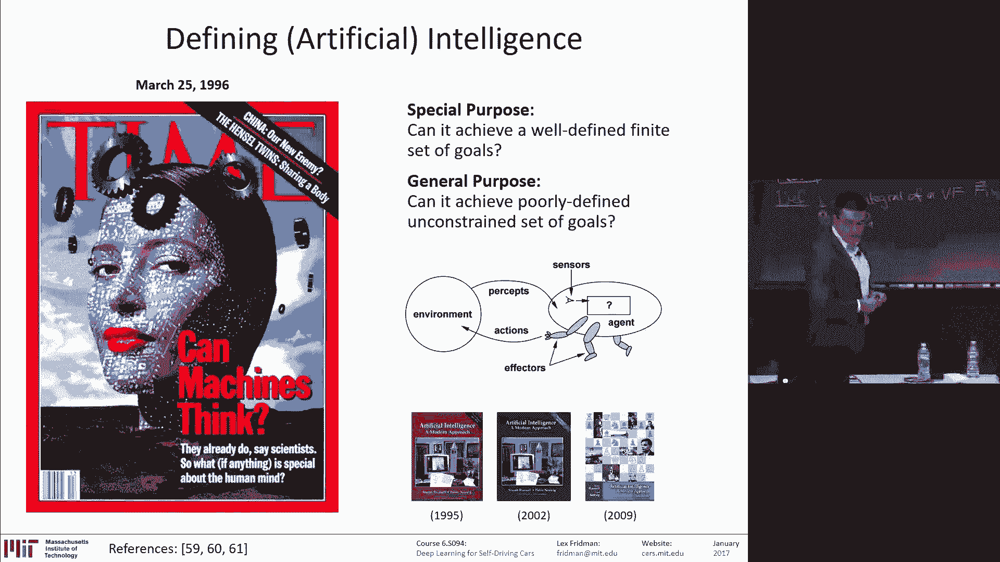

It's a good question for 1996， a good question for 2016，17， now。And the future。

And there's two ways to ask that question。 One is the special purpose version。

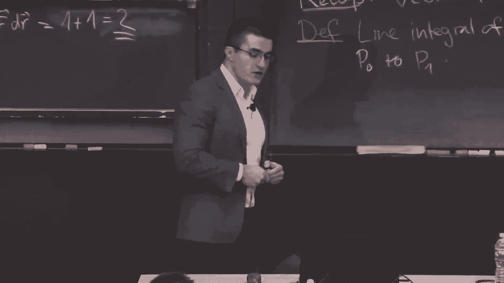

Can an artificial， can an artificial intelligence system achieve a well defined。Specifically。

 formally defined， finite set of goals。And this little diagram from a book that got me into artificial intelligence is a bright eyeed high school student。

The artificial intelligence is a modern approach。This is a beautifully simple。

Diagram of an of a system。 It exists in an environment。 It has a set of。

Sensors that do the perception。It takes those sensors in， does something magical。

 There's a question mark there。 And with a set of effectors。

 acts in the world manipulates objects in that world。😊，And so。Special purpose。 we can。

Under this formulation， as long as the environment is formally defined， well defined。

 as long as the set of goals are well defined， as long as the set of actions， sensors and the。

Ways that the perception carries itself out is well defined。

 We have good algorithms of which we'll talk about that can optimize for those goals。

 The question is， if we inch along this path。Will we get closer to the general formulation。

 to the general purpose。Version of what artificial intelligence is。Can it achieve？Poorly defined。

 unconstrained set of goals with an unconstrained， poorly defined set of actions。An unconstrained。

 poorly defined。Utility functions。Rewards。This is what human life is about。

 This is what we do pretty well， most days。Exist in a。Undefined， full of uncertainty world。So， okay。

 we can separate tasks into different three different categories， formal tasks。 This is the easiest。

It doesn't seem so， it didn't seem so at the birth of artificial intelligence。

 but that's in fact true if you think about it， the easiest is the formal tasks， playing board games。

 the improving。All the kind of mathematical logic problems that can be formal formally defined。

Then there's the expert tasks。So this is， this is where a lot of the exciting breakthroughs have been happening。

 where machine learning methods， data driven methods can help aid。😊。

Or improve on the performance of our human experts。This means medical diagnosis， hardware design。

 scheduling。And then there is the thing that we take for granted， the trivial thing， the thing that。

We do so easily every day when we wake up in the morning。The mundane tasks of everyday speech。

 of written language， of visual perception。Of walking。

Which we'll talk about in today's lecture is a fascinatingly difficult task。An object manipulation。

So the question is。That we're asking here before we talk about deep learning。

 before we talk about the specific methods， we really want to dig in and， and。And try to see。

 what is it about driving。How difficult is driving？I is it more like chess。

 which you see on the left there where we can formally define a set of lanes set of actions and formulate it as this。

 you know there's five set of actions， you can change a lane， you can avoid obstacles。

 you can formally define an obstaclely， you can formally define the rules of the road。

 or is there something about natural language something similar to everyday conversation about driving that requires a much higher degree of reasoning。

Of communication。Of learning。Of existing in this under actuated space。

 is it a lot more than just left lane， right lane， speed up， slow down。

So let's look at it as a chess king。 Here's the chess pieces。

What is what are the sensors we get to work with in the self of an untonmous vehicle。

And we'll get a lot more in depth on this， especially with the guest speakers who've built many of these。

There's radar。 There's the range sensors， radar， Lidar that give you information about the obstacles in your environment。

That help localize the obstacles in the environment。

 Theres the visible light camera and stereo vision that gives you texture information that helps you figure out not just where the obstacles are。

 but what they are， helps to classify those。Has to understand their subtle movements。

Then there is the information about the vehicle itself。

About the trajectory and the movement of the vehicle that comes from the GPS and I U sensors。

And there is the rich state of the vehicle itself， what is it doing？

What are all the individual systems doing that comes from the can network。

And there is one of the less studied but fascinating to us on the research side is audio。

The sounds of the road。That provide the rich context。Of a wet road。

 the sound of a road that when it stop raining， but it's still wet， the sound that it makes。

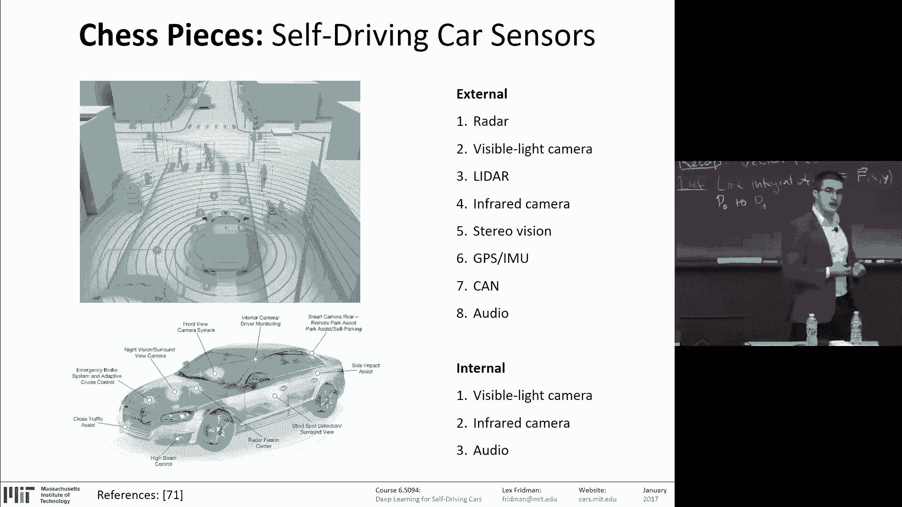

The screeching tire and and honking。 These are all fascinating signals as well。

 And the focus of the research in our group。😊，The thing that's really much。

Under investigated is the internal facing sensors， the driver。Sensing the， the state of the driver。

 where are they looking， are they sleepy。The emotional state， are they in the seat at all。

And the same with audio。That comes from the visual information and the audio information。

More than that。Here's the tasks， if you were to break into modules。

 the task of what it means to build a self driving vehicle。First， you want to know where you are。

 Where am I localization and mapping， You want to map the external environment。

Figure out where all the different obstacles are， all the entities are。

 and use that estimate of the environment to then figure out where I am， where the robot is。

Then there's scene understanding。Is understanding not just the positional aspects of the external environment and the dynamics of it。

 but also what those entities are。 Is it a car， I it a pedestrian， Is it a bird。

There's movement planning once you have kind of figured out to the best of your abilities。

Your position and the position of other entities in this world that figuring out a trajectory through that world。

And， finally。Once you've figured out how to move about safely and effectively through that world。

 it's figuring out what the human that's on board is doing。

Because as I will talk about the path to a self driving vehicle。

 and that is hence our focus on Tesla。May go through semi autotonnomous vehicles。Where there is a。

Where the vehicle must not only drive itself， but effectively hand over control。From the car。

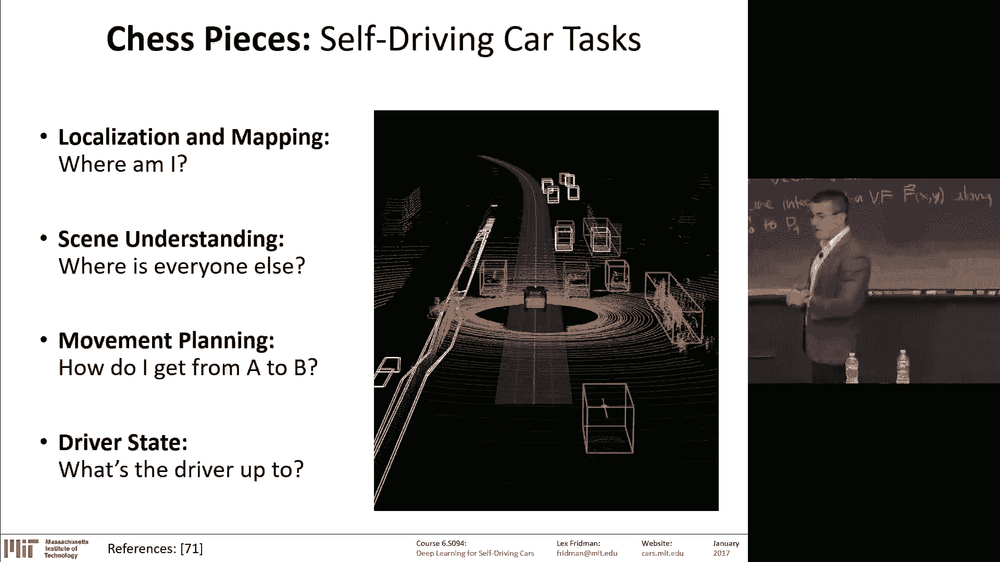

To the human and back。Okay， quick history。Well， there's a lot of fun stuff from the '80s and '90s。

The big breakthroughs came in the second DARPA Grand challengeenge。With Stanford Stanley。

 when they won the competition， one of five cars that finished。

 this was an incredible accomplishment。In a desert race。

A fully autonomous vehicle was able to complete the race。

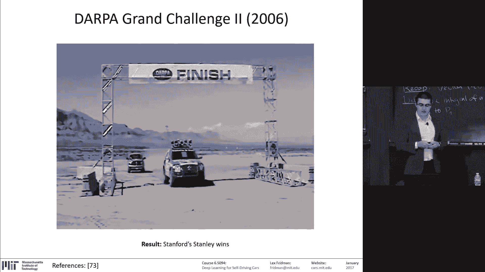

In record time。The DARPA Urban challengeenge in 2007。

Where the race was the task was no longer a race to the desert。But through a urban environment。

And CMU's boss。Would GM won that race？

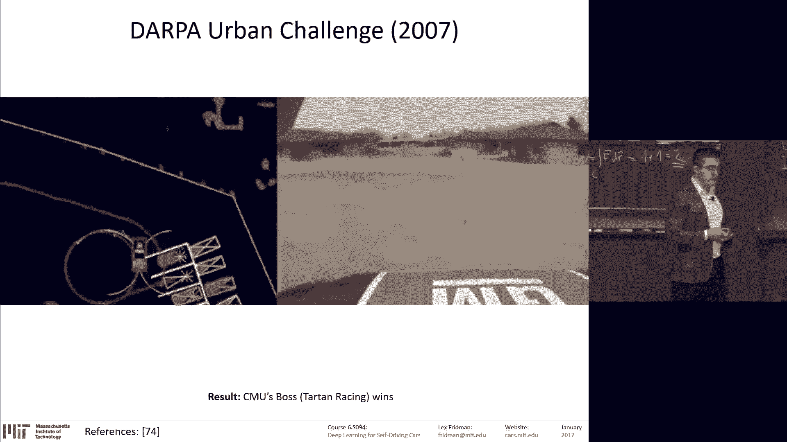

And a lot of that work LED directly into the。Acceptance and。

Large major industry players taken on the challenge of building these vehicles。Google， now， Waymo。

 self driving car。Tesla with its autopilot system and not autopilot2 system。

Uber with its testing in Pittsburgh。And there's many other companies。

 including one of the speakers for this course of Mutonomy。That are。

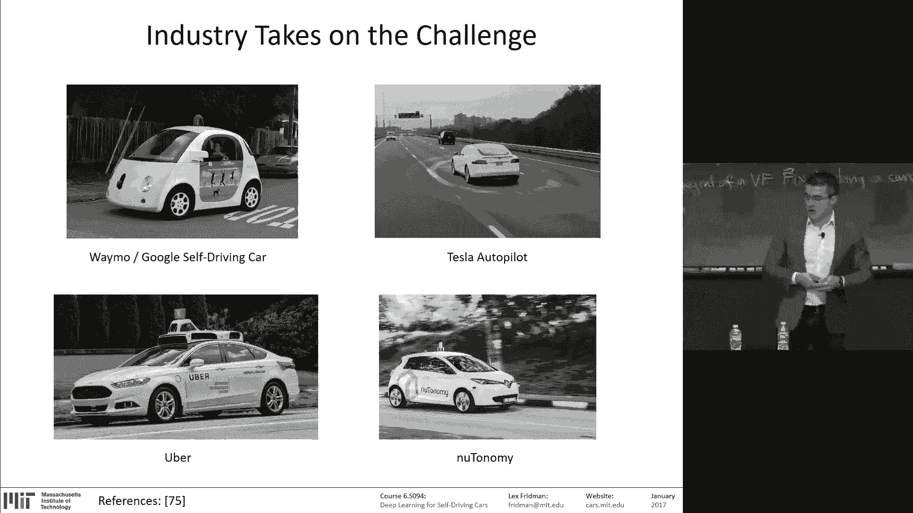

Driving the， the wonderful streets of Boston。Okay， so let's take a step back。We have。

If we think about the accomplishments in the DARPA challenge。

And if we look at the accomplishments of the Google self driving car。

Which essentially boils the world down into a chess game。It。

Uses incredibly accurate sensors to build a three dimensional map of the world。

 localize itself effective in that world and move about that world。😊，In a very well defined way。Now。

 what if driving。The open question is， if driving is more like a conversation。

Like a natural language conversation。How hard is it to pass the touring test， The touring test。

 as the popular current formulation is， can a computer be mistaken for a human being in more than 30% of the time when a human is talking behind a veil having a conversation with either computer or human。

 can they mistake the other side of that conversation。For being a human， when it's， in fact。

 a computer。And。The way you would in a natural language。

 build a system that has successfully passes the touring test is。

The natural language part processing part to enable it to communicate successfully。

 so generate language and interpret language。Then you represent knowledge。

 the state of the conversation， transferred over time。And the last piece， and this is the hard piece。

 is the automated reasoning。Is reasoning。Can we teach。Machine learning methods to reason。That's。

 that is something that will propagate through our discussion because。

As I will talk about the various methods， the various deep learning methods， neural networks。

Are good at learning from data。But they're not yet， there' is no good mechanism for reasoning。Now。

 reasoning could be just something that we tell ourselves we do to feel special。

 better to feel like we're better than machines。 reasonasoning may be simply。😊。

Something as simple as learning from data。We just need a larger network。

Or there could be a totally different mechanism required。 And we'll talk about。

The possibilities there。Yes。Good。Withて that。No， its it's very difficult to find these kinds of situations in the United States。

 So the question was for this video， is it in the United States or not， I believe it's in Tokyo。

 so India。There's a few European countries。A much。Are much more towards the direction of。

Natural language。Versus chess。In the United States， generally speaking。

 we follow rules more concretely。 The quality of roads is better。 The marking on the roads is better。

 so there's less requirements there。These cars are driving the left side。아 I see。I just， okay， yeah。

 you're right。 It is cause y， yeah， so， but it's certainly not the United States。

 I'm pretty it's spent quite a bit of Googling trying to find the United States。 And it's。

 it's difficult。So， let's talk about。The recent breakthroughs in machine learning。

 and what is at the core of those breakthroughs？Is neural networks。

That have been around for a long time。 And I will talk about what has changed。

 What are the cool new things and what has hasn't changed and what are its possibilities。 But first。

 in neuron。Crudely。Is a computational building block of the brain。 I know there's a few folks here。

 neuroscience folks。This is hardly a model。It is mostly an inspiration。And so。The the human neuron。

Has inspired the artificial neuron。The computational building block of a neural network。

 of an artificial neural network。I to give you some context。

These neurons for both artificial and human brains are interconnected。In the human brain。

 there's about。I believe 10，000 outgoing connections from every neuron。On average。

And they're interconnected to each other。the largest current， as far as I'm aware。

 artificial neural network has 10 billion of those connections， synapses。

Our human brain to the best estimate。That I'm aware of。Has。10，000 times that。So。100 to 1。

000 trillion synapses。Now， what is a。Artificial neuron。The building block of a neural network。

It takes a set of inputs。It puts a weight on each of those inputs。Sums them together。

Applies a bias value on each that sits on each neuron。

And using an activation function that takes us input。

That sum bless the bias and squishes it together to produce a zero to1 signal。

And this allows us a single neuron。Take a few inputs and produces an output。A classification。

 for example， a 0，1。And as we'll talk about， simply。It can。Serve as a linear classifier。

So it can draw a line， it can learn to draw a line between like what's seen here between the blue dots。

And the yellow dust。 And that's exactly what we'll do in the i Python notebook that I'll talk about。

But the basic algorithm is you initialize the weights on the inputs。And you compute the output。

You performed this previous operation that I talked about sum up。Compute the output。

And if the output。Does not match the ground truth。The expected output。

 the output that it should produce。The weights are punished accordingly。

And we'll talk through a little bit of the math。Of that。

And this process is repeated until the perceptron。Does not make any more mistakes。Now， here's。啊。

The amazing thing about neural networks， there's several。 and I'll talk about them。😊，啊。One。

 on the mathematical side。Is the universality of neural networks with just a single layer。

 If we stack them together， a single hidden layer。The inputs on the left， the outputs on the right。

And in the middle， there's a single hidden layer It can。Closely approximate any function。

Any function。So this is an incredible property。That with a single layer。Any function。

You can think of。That。You，You can think of driving as a function。 It takes input。

The world outside is output。To control the vehicle。

 There exists a neural network out there that can drive。Perfectly。

It's a fascinating mathematical fact。So we can think of this then these functions as a special purpose function。

 special purpose intelligence。 You can take say as input。😊，The number of bedrooms， the square feet。

Type of neighborhood， those are the three inputs。It。Passes that value through to the hidden layer。

 And then one more step， it produces the final price estimate for the house。For the residents。

And we can teach a network to do this pretty well in a supervised way。 This is supervised learning。

You provide a lot of examples where you know the number of bedrooms， the square feet。

 the type of neighborhood。And then you'll also know the final price of the house of the residence。

And then， you can。As I'll talk about through a process of back propagation， teach these networks。

To make this prediction pretty well。Now， some of the exciting breakthroughs recently。

Have been in the general purpose， intelligence。This is from Andre Carpathy。Who's now at open AI。

I would like。To take a moment here， to try to explain how amazing this is。😊，This is a game of pong。

If you're not familiar with Pong。There's two paddles and you're trying to bounce the ball back。

And in such a way that prevents the other guy from balancing the。

 the wall the ball back at you on the。The the artificial intelligence agent is on the right in green and up top is the score。

8 to 1。Now， this takes about three days to train on a regular computer， this network。What is。

This network doing， it's called the policy network。The input is the raw pixels。

They're slightly processed and also you take the difference between two frames。

 but it's basically the raw pixel information。That's the input。There's a few hidden layers。

 and the output is a single probability of moving up。That， that's it。 that's， that's the whole。

 that's， that's the whole system。And what it's doing is。It learns。

Not you don't know at any one moment。You don't know what the right thing to do is。 Is it to move up。

 Is it to move down， You only know。What the right thing to do is by the fact that eventually you win or lose the game。

So this is the amazing thing here is there's no supervised learning about。

 there's no like universal fact about any one state being good or bad and any one action being good or bad in any state。

But if you punish or reward every single action you took， every single action you took。

For entire game， based on the result。So no matter what you did， if you won the game。

The end justifies the means。If you won the game， every action you took and every action state pair gets rewarded。

 if you lost the game， it gets punished。And this process with only 200。

000 games where the system just simulates the games。It can learn to beat the computer。

This system knows nothing about pong， nothing about games。This is general intelligence。

Except for the fact。That it's just a game of pong。And I will。Talk about how this can。

Be extended further。 Why this is so promising。And why this is also。We should proceed with caution。So。

 again。There's a set of actions you take up down， up down based on the output of the network。

 there's a threshold， given the probability of moving up。

 you move upward or down based on the output of the network。And you have a set of states。

And every single state action pair is reward if there's a win and it's punished if there's a loss。

When you go home。Think about how amazing that is。 And if you don't understand why that's amazing。

Spend some time on it。It's incredible。Sure， sure thing。 The question was what is supervised learning。

 what is unsupervised learning， what's the difference， So supervised learning。

Is when people talk about machine learning， they mean supervised learning most of the time。

 Supervised learning is。Learning from data。It's learning from example。

 when you have a set of inputs and a set of outputs that you know are correct。

 what are called ground truth。So you need those examples。

 a large amount of them to train any of the machine learning algorithms to learn to then generalize that to future examples。

This is。Actually， there's a third one called reinforcement learning。Where the ground truth。Is sparse。

 The information about。When something is good or not。

 the ground truth only happens every once in a while at the end of the game， not every single frame。

 and unsupervised learning is when you have no information about the outputs that are correct or incorrect。

And it is the excitement。The deep learning community is unsupervised learning。

But it has achieved no major breakthroughs at this point。This is the。

 I'll talk about what the future of deep learning is and a lot of the people that are working in the field are excited by it。

 But right now， every any interesting accomplishment has to do with supervised learning。

s the green  one， right， and the brown one is。Just a touristuristic solution like look at the velocity。

So。Basically， the reinforcement learning here is learning from。Somebody who has certain rules。

And how can that？Be guaranteed that you would generalize to。Somebody else。再下。

So the question was this， the green Paddle learns to play this game successfully against this specific one brown paddle with us operating under specific kinds of rules。

 how do we know it can generalize to other games， other things， and it can't。

But the mechanism by which it learns generalizes。So as long as you let it play。

As long as you let it play in whatever world you want it to succeed in。Long enough。

It will use the same approach to learn， to succeed in that world。 The problem is。

This works for worlds you can simulate well。Unfortunately。

 one of the big challenges of neural networks is that they're not currently efficient learners。

We need a lot of data to learn anything。 Human beings need like， need one example。Oftentimes。

 and they learn very efficiently from that one example。 So。And again， I'll talk about that as well。

 It's a good question。So the drawbacks of neural networks。

So if you think about the way a human being would approach this game。This game of pong。

 that would only need a simple set of instructions。 You're in control of a paddle。

And you can move it up and down。And your task is to bounce the ball past the other player。Con by AI。

Now， the human being would immediately， they may not win the game。

 but they would immediately understand the game and will be able to successfully play it well enough。

To pretty quickly learn to beat the game。But they need to have a concept of control。

 what it means to control a paddle。 They need to have a concept of a paddle。

 They need to have a concept of moving up and down and a ball and bouncing。

 they have to know they have to have a at least a loose concept of real world physics that they can then project that real world physics onto the two dimensional world。

 All of these concepts are。Are concepts that you come to the table with？That's knowledge。

And the kind of way you transfer that knowledge from。From your previous experience。

 from childhood to now， when you come to this game。That is something is called reasoning。

Whatever reasoning means。And the question is whether through this same kind of process。

You can see the entire world。As a game of pong。And reasoning is simply ability to simulate。

That game in your mind。And learned very efficiently， much more efficiently than 200000 iterations。

The other challenge of deep neural networks and machine learning broadly is you need big data。

 and efficientient learners I。That data also needs to be supervised data。

 You need to have ground truth。Which is very costly for。To annotation。

A human being looking at a particular image， for example。

 and labeling that as something as a cat or a dog， whatever objects is in the image。

 that's very costly。And for particularly for neural networks， there's a lot of。Parameters to tune。

There's a lot of hyperparameters。 You need to figure out。The network structure first。

 how does this network look， how many layers， how many hidden nodes？

What type of activation functions on each node， there's a lot of hyper parameters there。

 and then once you built your network。There is parameters for how you teach that network。

 There's learning rate， loss function， mini batch size， number of training iterations。

 gradient updates smoothing。And the selecting even the optimizer with which you。With which it is。

Solve the various differential equations involved。It's a topic of many research papers。

 certainly it's rich enough for research papers， but it's also really challenging。

It means that you can't just plop the network down and it will solve the problem generally。

And defining a good。

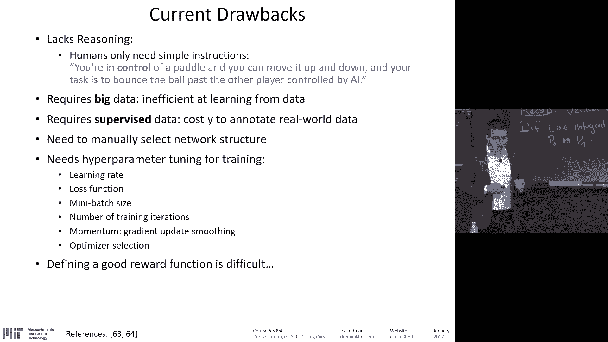

Loss function。 or in the case of pong or games， a good。Reward function is difficult。

 So here's a game。 This is a recent result from open AI。

And teaching a network to play the game of coast runners and the goal of coast runners。

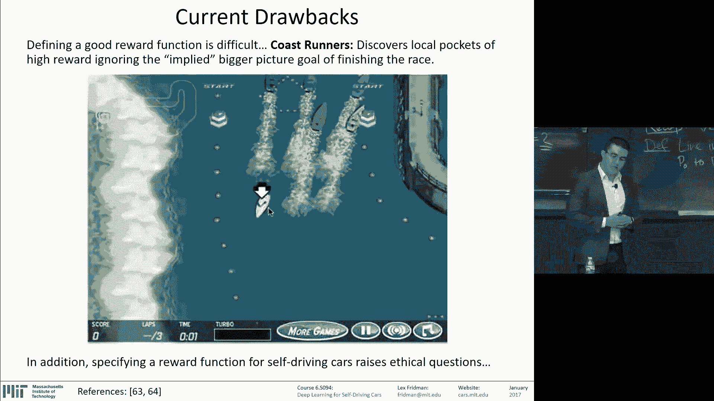

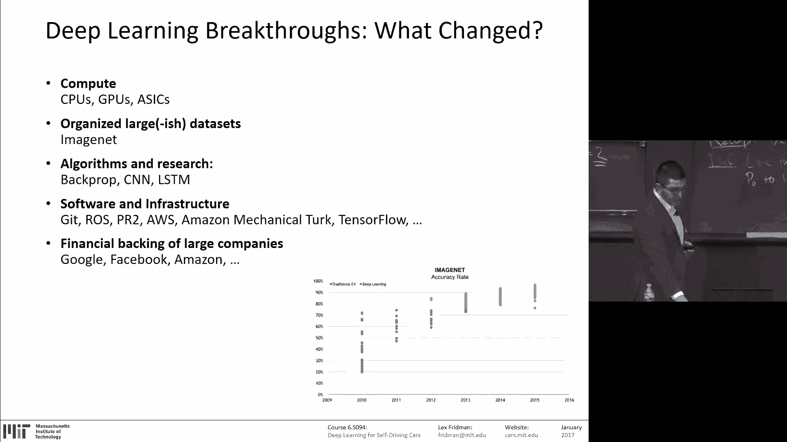

Is to go you're in a boat， the task is to go around a track。

And successfully complete a race against other people you're racing against。

Now this network is an optimal one。And what has figured out that actually in the game。

It gets a lot of points for collecting certain objects along the path。

 So what you see is it's figured out to go in a circle and collect those green turbo things。

And what is figured out is you don't need to complete the game to earn the reward。😡，Now。

 that more sort of。and despite being on fire and hitting the wall and going through this whole process。

 it's actually achieved at least a local optima， given the reward function of maximizing the。

 the number of points。And so。It's figured out a way to earn a higher award while ignoring the implied bigger picture goal of finishing the race。

 which us as humans。Understand much better。This raises for self driving cars ethical questions。

Besides other questions。You can watch this for hours。And it will do that for hours。

 and that's the point is。

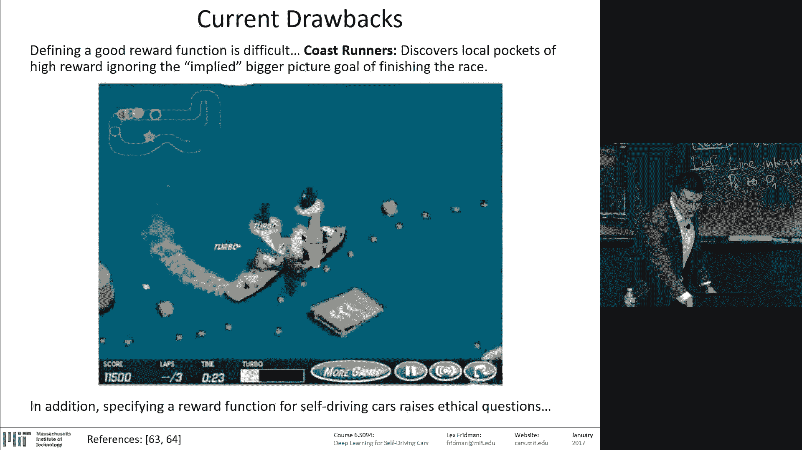

it's hard to teach。It's hard to encode。Formerly define a utility function under which an intelligence system needs to operate。

 And that's made obvious， even in a simple game。And so what is yep， question？おび。So the question was。

 what's an example of a local optimum that an autonomous car so similar to the coast race so what would be the example in the real world for an autonomous vehicle？

And。It's a touchy subject。But it would certainly have to be involved。

The choices we make under near crashes and crashes， the choices a car makes want to avoid。

 for example， if there's a crash imminent and there's no way you can stop。Just prevent the crash。

 do you keep the driver safe or do you keep the other people safe？And。There has to be。Some。

EvenEven if you don't choose to acknowledge it。Even if it's only in the data and the learning that you do。

 there is an implied reward function there。And we need to be aware of that award function is because it may It may find something until you actually see it。

 we won't know it。 Once we see it， we'll realize that， oh。That was a bad design。

 And that's a scary thing。 It's hard to know ahead of time what that is。

So the recent breakthroughs from deep learning。Came。Several factors。 First is the compute。

Moore's law， CPUs are getting faster，100 times faster every decade。Then there's GPUs。Also。

 the ability to train neural networks and GPUs。And now， a6。

Has has created a lot of capabilities in terms of energy efficiency and being able to train larger networks more efficiently。

There is larger。 Well， first of all， in the， in the 21st century， there's digitized data。

There's larger data sets of digital data。And now there is that data is becoming more organized。

 not just vaguely available data out there on the Internet。

 It's actual organized data sets like Inet， certainly for natural language there's large data sets。

There is the algorithm innovations。Back back propagation， conution neural networks， LSTMs。

 all these different architectures for dealing with specific types of domains and tasks。

There's the huge one。Is infrastructure is on the software and the hardware side。

 there's Git ability to share an open source way software。There is pieces of software that。

That make robotics and make machine learning easier。 Ross， Tensorflow。

 Theres an Amazon mechanical Turk。Which allows for efficient。

 cheap annotation of large scale data sets。It's AWS in the cloud hosting machine learning。

 hosting the data and the compute。And then there's a financial backing of large companies， Google。

 Facebook， Amazon。But， really。Nothing has changed， there really has not been any significant breakthroughs we're using the accomplished neural networks have been around since the '90s。

 neural networks have been around since the 60s。There's been a few improvements。But the hope is。

 that's in terms of methodology。The compute has really been the workhorse。

The ability to do the hundred fold improvement every decade。holdss promise。

 And the question is whether that reasoning thing I talked about。All you need is a larger network。

 that is the open question。So some terms。For deep learning。First of all。Deep learning is a PR term。

For neural networks。It is a term for utilizing。 its for。For deep neural networks。

 for neural networks that have many layers。It a symbolic term for the newly gained capabilities that compute has brought us。

That， that training on GPUus brought us。So deep learning is a subset of machine learning。

 There's many other methods that are still effective。The terms that they'll come up in this class。

First of all， multi layerer perceptron， deep neural networks， recurring neural networks， LSTM。

 long short term memory networks， CNN or convnets， convolutional neural networks。

Deep belief networks。 And the operation thatll come up as convolution， pooling。

 activation functions and back propagation。

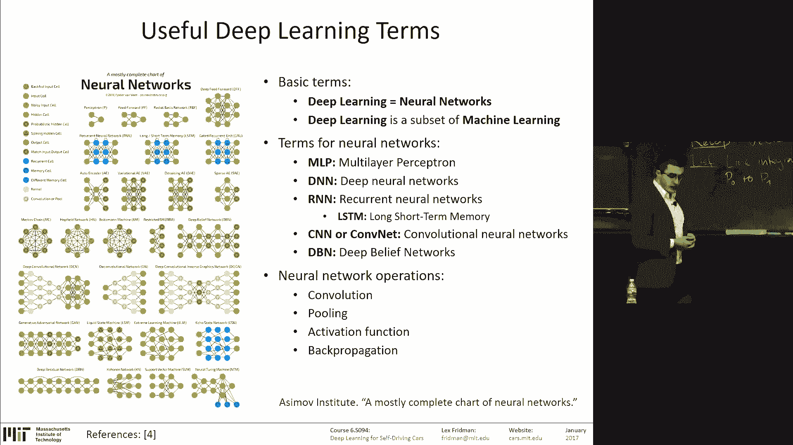

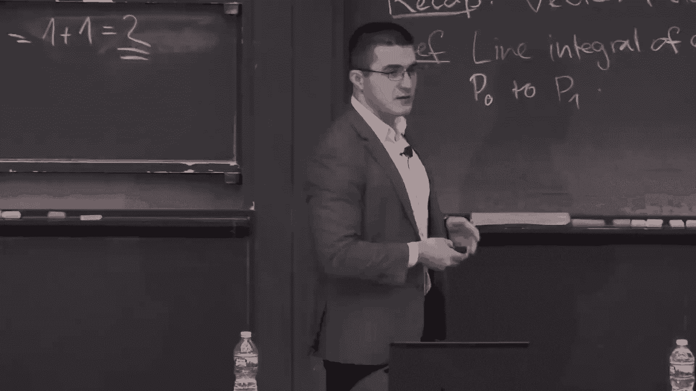

， good question。So the question was， what is the purpose of the different layers in your neural network。

 what does it mean to have one configuration versus another？So a neural network。

So having several layers。It's the only thing you have an understanding of is the inputs and the outputs。

You don't have a good understanding about what each layer does。

There are mysterious things neural networks。So I'll talk about how with every layer。

 it forms a higher level。A higher order representation of the input。

 so it's not like the first layer does localization， the second layer does path planning。

 the third layer does navigation， how you get from here to Florida。Or maybe it does。

But we don't know。So we know we're beginning to visualize neural networks。For simple tasks。

 like for imagenet classifying cats versus dogs。 we can tell what is the thing that the first layer does。

 the second layer， the third layer。 And we'll look at that。 But for driving， when you。

 as the input provide just the images and the output， the steering。It's still unclear what you learn。

Partially because we don't have neural networks that drive successfully yet。Yeah。

The neuro network fills， or does it eventually generate the？So this this is the question was，Do you。

Does a neural network generate layers over time， like does it grow？

that's one of the challenges is that a neural network is predefined the architectures。

 the number of nodes， the number of layers， that's all fixed。

Unlike the human brain where neurons die and are born all the time。neural network is prespecified。

 That's it。 That's all you get。 And if you want to change that。

 you have to change that and then retrain everything。So， it's fixed。

So what I encourage you is to proceed with caution， because there's this feeling when you first。

Teach a network with very little effort how to do some amazing tasks， like classify a face。

Versus non face or your face versus other faces or cats versus dogs。 it's an incredible feeling。

And then you， there's， there's definitely this feeling that I'm an expert。But what you realize is。

ItIt's。You don't actually understand how it works。And getting it to perform well for more generalized tasks。

 for larger scale data sets， for more useful applications requires a lot of hyperparameter tuning。

 figuring out how to tweak little things here and there， and still in the end。

 you don't understand why it works so damn well。So， deep learning。

These deep neural network architectures is representation learning。

This is the difference between traditional machine learning methods。Where。For example。

 for the task of。Having an image here is the input， the input to the networks here is on the bottom。

 the output is up at top。 and the input is a single image。Of a person in this case。And so。The input。

 specifically。Is all of the pixels in that image， RGB。

 the different colors of the pixels in the image。And over time。

What what a network does is build multireal representation of this data。The first layer。Builds。

 learns the concept of edges， for example。The second layer starts to learn composition of those edges。

 corners， contours。Then it starts to learn about object parts。And finally。

 actually provide a label for the entities that are in the input。

And this is the difference between traditional machine learning methods。

 where the concepts like edges and corners and contours are manually prespecified by human。

By human beings， human experts for this particular domain。And representation matters。Because。

Figuring out a line for the Cartesian coordinates of this particular data。

Where you want to design a machine learning system that tells the difference between green triangles and blue circles。

Is difficult。There's no line that separates them cleanly。And if you were to ask a human being。

 a human expert in the field to try to draw that line。They would probably do a PhD on it。

And still not succeed。But。A neural network can automatically figure out。To remap that input。

Into polar coordinates， where the representation is such that it's an easily linearly separable data set。

And so deep learning is a subset of representation learning， is a subset of machine learning。

 and a key subset of artificial intelligence。Now， because of this。

Because of its ability to compute an arbitrary number of features at the core of the representation。

 So you're not if you're trying to detect a cat in an image。

You're not specifying 215 specific features of cas and whiskers and so on that a human expert would specify。

You allow a neural network to discover tens of thousands of such features。Which maybe for cats。

 you are an expert。 But for a lot of objects， you may never be able to sufficiently provide the。

The features which successfully would be used for identifying the object。

And so this kind of representation learning， one is easy in the sense that all you have to provide is inputs and outputs。

 all you need to provide is a data set that you care about without hand engineering features。And two。

 because of the。Its ability to construct arbitrarily sized representations。

Jeep neural networks are hungry for data。 The more data we give them。

 the more they're able to learn about this particular data set。So， let's look at some。Applications。

First。Some cool things that deep neural networkss have been able to accomplish up to this point。

 Let me go through them。First， the basic one。Alex Ne。I for Iagenet is a famous。Data set。

 and it's a competition of classification and localization where the task is given an image。

 identify what are the five most likely things in that image and what is the most likely and you have to do so correctly。

 So on the right， there's an image of a leopard and you have to correctly classify that that is in fact。

 a leopard。So they're able to do this pretty well。Given a specific image。Determine that。

 it's a leopard。And。We started what's shown here on the X axis is years on the Y axis is error in classification。

So starting from 2012 on the left with Alex Ne。And today。The error is decreased。From 16%。

And 40% before then， with traditional methods have decreased to below 4%。 So human level performance。

 if I were to give you。This picture of a leopard is a 44% for 4% of those pictures of leopards。

 you would not say it's a leopard。 That's human level of performance。 So for the first time in 2015。

 convolution neural networks outperform human beings。 That in itself is an incredible。

 That's something that seemed impossible。 And now is because it's done。Its not as impressive。

But I just want to get to why that's so impressive because。

Computer vision is hard that we as human beings have evolved visual perception over millions of years。

 hundreds of millions of years。So we take it for granted， but computer vision is really hard。

 Vis perception is really hard。 There is illumination variability。 So it's the same object。

The only way we tell anything is from the shade the reflection of light from that surface。

It it could be the same object drastically in terms of pixels， drastically different looking shapes。

And we still know it's the same object。There is pose variability and occlusions。

Probably my favorite caption for an image for a figure in a academic paper is deformable and truncated cat。

These are pictures。 You know， cats are famously。Are deformable。

 they can take a lot of different shapes。It arbitrary poses are。Are possible。

 So you have to have computer vision used to know still the same object。

 still the same class of objects， given all the variability in the post and occlusions iss a huge problem。

 We still know it's an object。We still know it's a cat。

 even when parts of it are not visible and sometimes large parts of it are not visible。

And then there's all the intra class variability。In interclass。

 all of these on the top two rows are cats， many of them look drastically different。

 and the top bottom two rows are dogs also look drastically different。And yet。

 some of the dogs look like cats， some of the cats look like dogs。

 And as human beings we' pretty good at telling a difference。

 and we want computer vision to do better than that。It's hard。So how is this done。

 This is done with convolution neural networks， The input to which is a raw image。

 Here is an input on the left。Of number 3。And I'll talk about through convolutional layers。

That image is processed passed through， convolutional layers， maintain spatialal information。

On the output， they in this case predicts which of the images， what number is shown in the image， 0。

1，2 through 9。And so these networks， this is exactly everybody is using the same kind of network to determine exactly that input is an image。

 output is a number。And in the case of probability that it's a leopard， what is that number？

Then there's segmentation built on top of these convolution neural networks where you chop off the end。

And convolutionize the network， you chop off the end where the output is a heat map。

So you can have instead of a detector for a cat， you can do a cat heat map。Where its。

The part of the image， the output heat map gets excited。

 the neurons on that output get excited and the spatially excited in the parts of the image that contain a tabbyca。

And this kind of process can be used to segment the image into different objects， a horse。

 so the original input on the left is a woman on a horse。

 and the output is a fully segmented image of knowing where's the woman， where's the horse。

And this kind of process can be used for object detection。

 which is the task of detecting an object in an image。Now。

 the traditional methods accomplish neural networks and in general in computer vision is the sliding window approach。

 where you have a detector like the leopard detector that you slide through the image to find where in that image is a leopard。

The segmenting approach， the RCNN approach。Is efficiently segment the image in such a way that it can propose different parts of the image that are likely to have a leopard or in this case。

 a cowboy。And that drastically reduces the computational requirements of the object detection task。

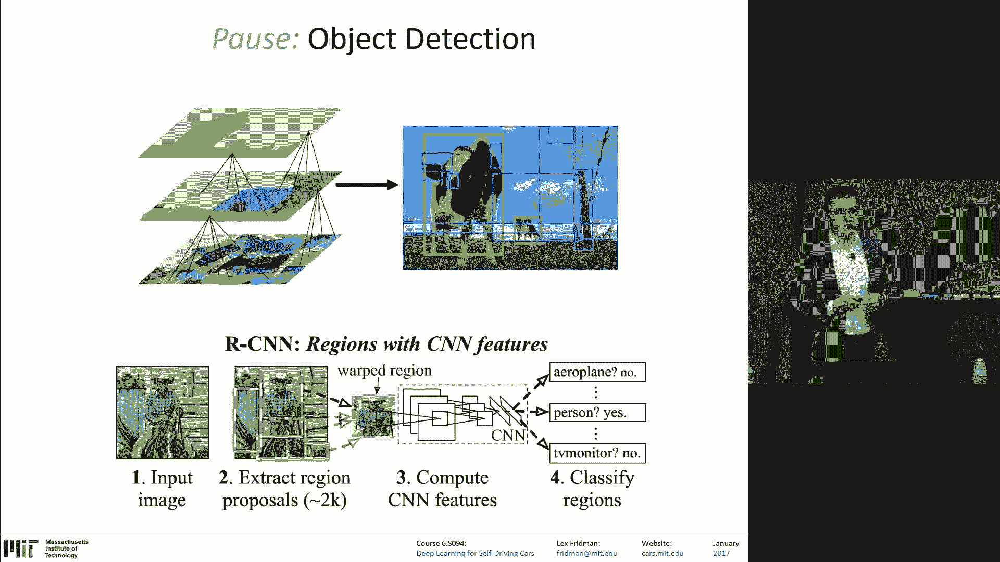

And so， these networks， this is the currently one of the best networks for the imagenet task of localization is the deep deep residual networks。

They're deep。So， VD G 19。Its one of the famous ones。 V G G nu。You starting to get above 20 layers。

 in many cases， 34 layers is the renet one。So the lesson there is the deeper you go。

 the more representational power you have， the higher accuracy。But you need more data。

Other applications， colorization of images。So， this， again。Input is a single image。

 and an output is a single image。So you can take a black and white video from a film。

From an old film and recolor it。And all you need to do to train that network in a supervised way is provide modern films。

And convert them to gray scale。 So now you have arbitrarily sized data sets。

That are able to data sets of gray scale to color。And you're able to with very。

With very little effort on top of it to successfully， well， somewhat successfully recolor images。

Again， Google Translate does image translation in this way。Image to image。

It first perceives here in German， I believe。Famous German， correct me if I'm wrong。

 dark chocolate written a German on a box so this can take this image， detect the different letters。

 convert them to text， translate the text， and then using the image to image mapping。Map the letters。

 the translated letters back onto the box， and you can do this in real time。

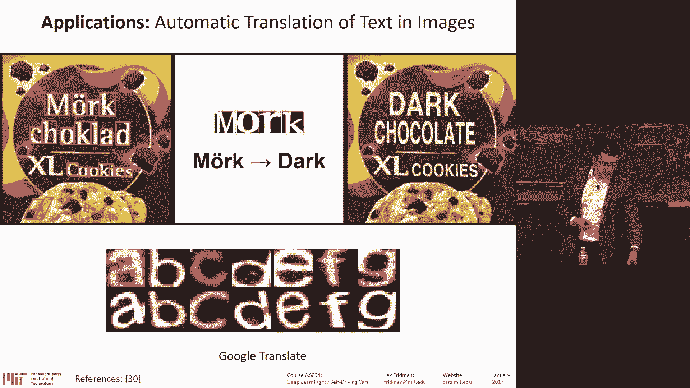

On video。So what we've talked about up to this point on the left are vanilla neural networks。

 common neural networks。That map a single input to a single output， a single image to a number。

 single image to another image。Then there is our current neural networks， the map。

 this is the more general formulation， the map a sequence of images or a sequence of words or a sequence of any kind to another sequence。

And these networks are able to do incredible things with natural language。With with video。

And anytime series data， for example， we can convert text to handwritten digits。

With handwritten text。Here we type in。And you can do this online。

 type in deep learning for self driving cars， and it will use an arbitrary handwriting style to generate the words deep learning for self driving cars。

This is done using recur on neural networks。We can also take car R N Ns。

 They're called It character level recurren neural networks that train on a data。

At an arbitrary text dataset set。And learn to generate。Text， one character at a time。

So there is no preconceived， syntactical， semantic structure that's provided to the network。

 It learns that structure。So， for example， you can train it on Wikipedia articles， like in this case。

And it's able to generate successfully。Not only text that makes。Some kind of grammatical sense。

 at least。But also， keep perfect syntactic structure for Wikipedia， for markdown。

Eiting for latex editing， and so on。This text says naturalism a decision for the majority of Arab countries。

 Capitalized， whatever that means was grounded by the Irish language by John Clare and so on。

 These are sentences。 If you didn't know better that might sound correct。 And it does so。

 let me pause one character at a time。So there is， these aren't words being generated。

 This is one character。 You start with the beginning three letters， not。You generate you completely。

Without knowing of the word naturalism。This is incredible。You can do this。

To start a sentence and let the neural know will complete that sentence。So， for example。

 if you start the sentence with life is。Or life is about， actually。

It will complete it with a lot of fun things。 The weather， life is about kids。

Life is about the true love of Mr。 mom。Is about the truth now。And this is from Jeffrey Hidden。

 the last two。 If you start with the meaning of life。

It can complete that with the meaning of life is literary recognition。

 maybe true for some of us here。Publish a parish。And the meaning of life is the tradition of ancient human reproduction。

Also true for some of us here， I'm sure。Okay， so what else can you do。

 You can This has been very exciting recently is image caption recognition。 generation， I'm sorry。😊。

Image caption generation is important for。For large data sets of images where we want to be able to determine what's going on inside those images。

 especially for search， if you want to find a man sitting in a couch with a dog。

 you type it into Google and it's able to find that。So here shown in in black text。

 a man sitting on a couch with a dog is generated by the system。

 A man sitting in a chair with a dog in his lap is generated by a human observer。And again。

 these annotations are done by detecting the different obstacles， the different objects in the scene。

 So segmenting the scene， detecting on the right， there's a woman， a crowd， a cat， a camera， holding。

 you know， purple。 All of these words are being detected。

Then a syntactically correct sentence is generated a lot of them。

 and then you order which sentence is the most likely。 And in this way。

 you can generate very accurate labeling of the images。Captions for the images。

 And you could do the same kind of process for。Image question answering。

You can ask how many- so quantity， how many chairs are there？You can ask about location。

 where are the right bananas？You can ask the ball the type of object。

 what is the object on the chair， it's a pillow。And these are， again。

 using the recurrent neural networks。You could do the same thing with video caption generation。

 video caption description generation。 So looking at a sequence of images as opposed to just a single image。

What is the action going on in this， in this situation， This is the difficult task。

 There's a lot of work in it in this area。 Now on the left is correct description。

 of a man is doing stunts on his bike， a herd of zebras They're walking in the field。

 And on the right， there's a small bus running into a building。You know， it's talking about。

Relevant entities， but just doing an incorrect description。 A man is cutting a piece of。

A piece of a pair of a paper。It's cutting a piece of a pair of a paper。 So the words are correct。

Perhaps， but so you're close。But。No cigar。 So one of the interesting things。

You can do with the recurrent neural networks is if you think about the way we look at images。

 human beings look at images is， is we only have a small fovea with which we focus on， in the scene。

 So right now， your periphery is very distorted。 The only thing if you're looking at the slides。

 Are you're looking at me。 That's the only thing that's in focus。

Majority of everything else is out of focus。 So we can use the same kind of concept to try to teach a neural network to steer around the image。

 both for perception and generation of those images。 This is important first。

 on the general artificial intelligence point of it being just fascinating。

That we can selectively steer our attention。 But also。

 it's important for things like drones that have to fly at high speeds in an environment where at 300 plus frames of second。

 you have to make decisions So you can't possibly localize yourself or perceive the world around yourself successfully。

If you have to interpret the entire scene。 So what you can do is you can steer， for example。

 here shown is。Reading reading house numbers。By steering around an image。

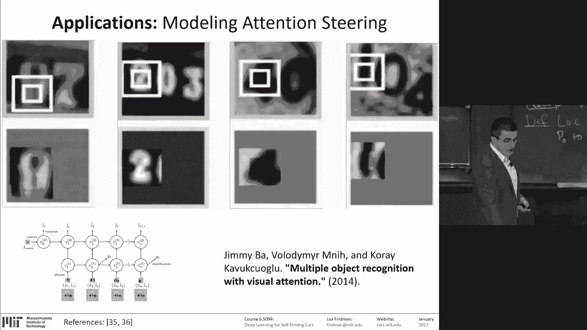

You could do the same task for reading and for writing。

 So reading numbers here on the Ms data set on the left is reading numbers。

 but you can also selectively steer a。The steer network around an image to generate that image。

 starting with a blurred image first and then getting more and more。

Higher resolution as the steering goes on。Work here at MI T is able to。Map。Video to audio。

So head stuff with the drumstick。Silent video and able to generate the sound。

That would drumtick hitting that particular object makes。So you can get texture information。

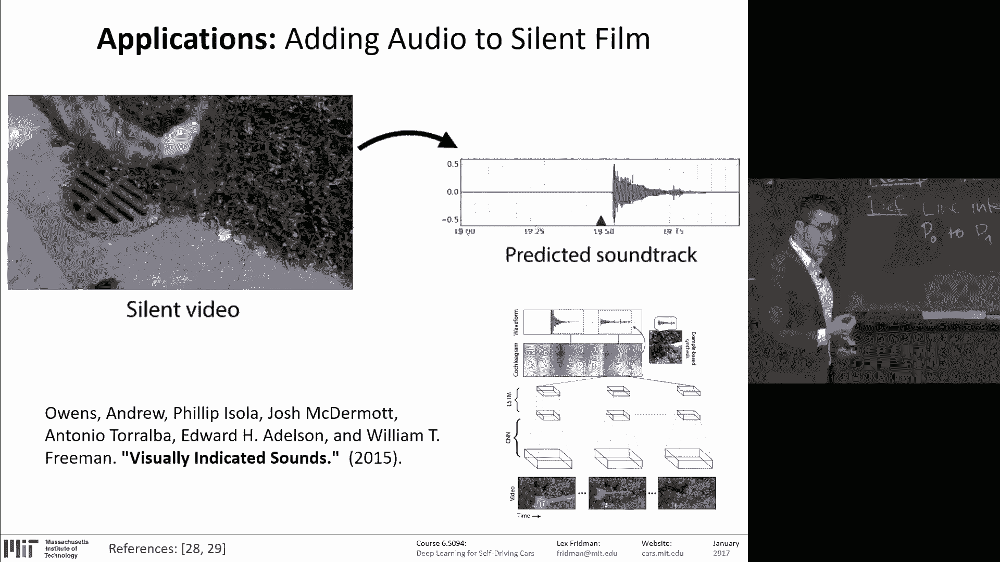

From that impact。So here's a video of a human soccer player playing soccer and a。Stated of the art。

Machine playing soccer。And well， let me give them some time。To build up。Okay， so soccer。

 this is we take this for granted， but walking is hard。Object manipulation is hard。

 Soccer is harder than chess for us to do much harder。On your phone now， you have， you。

 you can have a chess engine that beats the best players in the world。

And you have to internalize that。

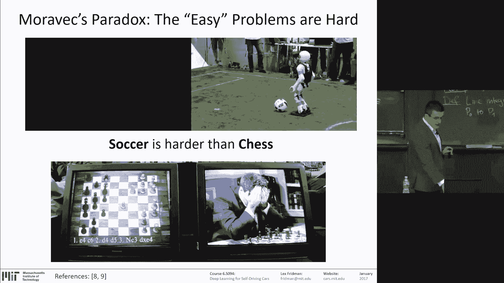

Because the question is， this is a painful video。 But the question is。Where does driving fall。

 Is it closer to chess or is it closer to soccer。For those incredible。

 brilliant engineers that worked on the most recent DARPA challenge。

 this will be a very painful video to watch， I apologize。This is a video from the DARPA Challenge。

Of robots struggling。With the basic object manipulation and walking tasks。So， it's。

It's mostly a fully autonomous navigation task。Maybe I'll just let this play a for a few moments。

To let it internalize how difficult this task is。Of balancing。

Of planning in an under actuated way where you don't have full control of everything when。

 when there is a delta between your perception of what you think the world is and what the reality is。

So there， a robot was trying to turn。An object。That wasn't there。

And this is an M T entry that actually successfully， I believe， gotten points for this because it。

Got into that area。But as a lot of the teams talked about the hardest part。

 so one of the things the robot had to do is get into a car and drive it。And get out of the car。

 And there's a few other manipulation tasks where to walk in on on steady ground。

 it had to drill a hole through a wall， all of these tasks。

 And what a lot of teams said is the hardest part。 the hardest task of all of them is getting out of the car。

So it's not getting into the car。 It's this very task that you saw now is is is a robot getting out of the car。

 These are things we take for granted。So in our evaluation of what is difficult about driving。

 we have to remember。That some of those things we may take for granted in the same kind of way that we take walking for granted。

This is this is more of X。Paradox。With Hans Moreak from CMU。

Let me just quickly read that quote and quod the large。

 highly evolved sensory and motor portions of the human brain is billions of years of experience about the nature of the world and how to survive in it。

 So this is data。 This is big data。Billions of years。An abstract thought， which is reasoning。

The stuff we think is intelligence。Is perhaps less than 100000 years。Of data， old。

We haven't yet mastered it。Sorry， I'm inserting my own statements in the middle of a quote。

WeItt it's been very recent that we've learned how to think。And so we respected perhaps more。

Then the things we take for granted， like walking a visual perception and so on。

 But those may be strictly a matter of data。Data and training time。And network size。

So walking is hard。The question is， how hard is driving？

And that's an important question because the margin of error is small。One，There's one fatality。

Per100 million miles， that's the number of people that die in car crashes every year。

One fatality per 100 million miles。That's a 0000，001% margin of error。

 That's through all the time you spent on the road， That is the error you get。

 We're impressed with INe being able to classify a leopard a cat or a dog。And close to。

At above human level performance， but this is the margin of error we get withre driving。

And we have to be able to deal with snow， with heavy rain， with big open parking lots。

 with parking garages， any pedestrians that behave irresponsibly as rarely as that happens。

Or just unpredictably， again， especially in Boston。Reflections。The ones。

 especially this is one of some of the things you don't think about。

 the lighting variations that blind the cameras。The question was if that number changes。

 if you look at just crashes， so fatalities per crash。Cashes per。Yeah。

 so one of the big things is cars have gotten really good at crashing and not hurting the anybody。

So the number of crashes is much， much larger than the number of fatalities。

 which is a great thing we've built safer cars。But still， even one fatality is too many。So this is。

One， one， the Google self driving car team。Is quite open about。

Their performance since hitting public roads。 This is from a report that shows the number of times。

The driver disengaged the car。Gives up control。That it asks the driver to take control back or the driver takes control back by force。

 meaning that they're unhappy with the decision that the car was making or it was putting the car or other pedestrians or other cars in unsafe situations and so if you see over time that there's been a total from 2014 to 2015。

There's been a total of 341 times on beautiful San Francisco roads。

 And I say that seriously because the weather conditions are great there。

341 times that the driver had to elect to take control back。So it's a work in progress。

AndLet me give you something to think about here。This with neural networks is。A big open question。

 the question of robustness。So this is an amazing paper。 I encourage people to read it。 There's。

 there's a couple papers around this topic。 Deep neural networks are easily fooled。😊，So。

Here are eight images。Where if given to a neural network as input。

 a convolutional neural network is input。The network with higher than 99。6% confidence。

Says that the image， for example， on the top left is a robin。Next to is a cheetah， then an armadillo。

 a panda， an electric guitar， a baseball， a starfish， a king penguin。

All of these things are obviously not in the images， so networks can be fooled with noise。

More importantly， more。Practically for the real world。Adding just a little bit of distortion。

 a little bit of noise distortion to the image。Can。

Forcce the network to produce a totally wrong prediction。 So here is an example。

 there's three columns， correctect image classification。This slight addition of distortion。

And the resulting prediction of an ostrich for all three images on the left。

And a prediction of an ostrich for all three images on the right。

This ability to fool networks easily。Brings up an important point。And that point is that。

That there has been。A lot of。Excitement。Abouttan neural networks throughout their history。

 There's been a lot of excitement about artificial intelligence throughout its history。And。

Not coupling that excitement， not grounding that excitement in the reality。

The real challenges around that。Has resulted in。In crashes。In AI winters。

When funding dried out and people became hopeless in terms of the possibilities of artificial intelligence。

 So here' is the 1958 New York Times article that said the Navy revealed the embryo of an electronic computer today。

 This is when the firstcept perceptron that I talked about was implemented in hardware by Frank Rosenblt。

It took 400 pixel image input。And it provided a single output。Weights were encoded in hardware。

 potentoomes， and weights were updated with electric motors。Now， New York Times wrote。

 the Navy revealed the embryo of an electronic computer today。That expects we'll be able to walk。

 talk， see， write， reproduce itself。And be conscious of its existence。Dr。 Frank Rosenblatt。

 a research psychologist at the Cornell Aeronautical Laboratory Buffalo。

 said perceptrons might be fired to the planets as mechanical space explorers。

This might seem ridiculous， but this was the general opinion of the time。And as we know now。

 perceptrons。Cannot even separate a nonlinear function。They're just linear classifiers。

And so this led to two major AI winters in the '70s and in the late '80s and early '90s。

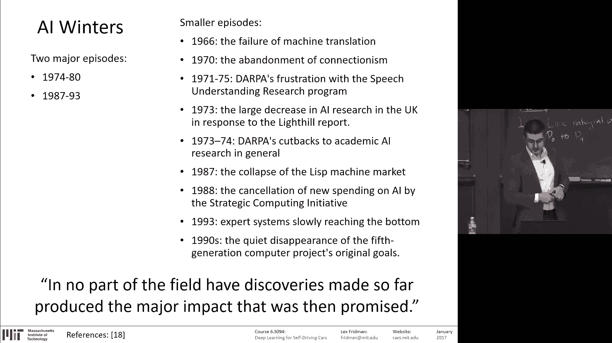

The light Hill report。In 1973。By the UK government said that no part of the field of discoveries made so far produced the major impact that was promised。

So if the hype builds。Beyond the capabilities of our research。Reports like this will come。

And they have。The possibility of creating another AI winter。 So I want to pair the optimism。

 Some of the cool things we'll talk about in this class。

With the reality of the challenges ahead of us。The focus of the research community。

 this is some of the key players in deep learning。What are the things that are next for deep learning。

 the five year vision？

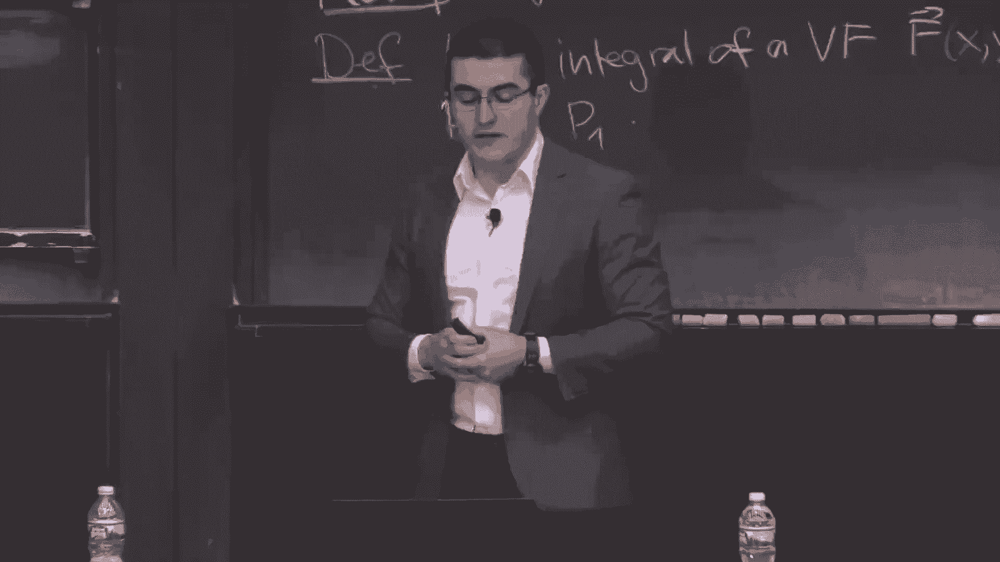

We want to run on smaller， cheaper mobile devices。We want to explore more in the space of unsupervised learning。

 as I mentioned， and reinforcement learning。We want to do things that。

Explore the space of videos more， the recurringcur neural networks。

 like being able to summarize videos or generate short videos。😊，One of the big efforts。

 especially in the companies with deal with large data， is multimodal learning。

 learning from multiple data sets with multiple sources of data。And lastly， making money。

From these technologies， there's a lot of。ThisDespite the excitement。There has been an inability。

 for the most part， to make serious money。From some of the。More interesting parts of deep learning。

And while I。God made， made， made fun of by the T S for including this。

Slide because it's shown in so many sort of business type lectures。

 but it is true that we're at the peak of a hype cycle， and we have to make sure。

given the large amount of hype and excitement there is， we proceed with caution。1。Example of that。

Let me mention。Is we already talked about spoofing the cameras。

 spoofing the cameras with a little bit of noise。 So if you think about it。

Self driving vehicles operate with a set of sensors。

And they rely on those sensors to convey to accurately capture that information。

Now what happens not only when the world itself produces noisy visual information。

 but what if somebody actively tries to poof that data。

One of the fascinating things that been recently done is spoofing of Lidar。

So these LiDars is a range sensor that gives a 3D point cloud of the objects in the external environment。

And you're able to successfully。Do a replay attack where you have the car see people and other cars around it when there's actually nothing around it。

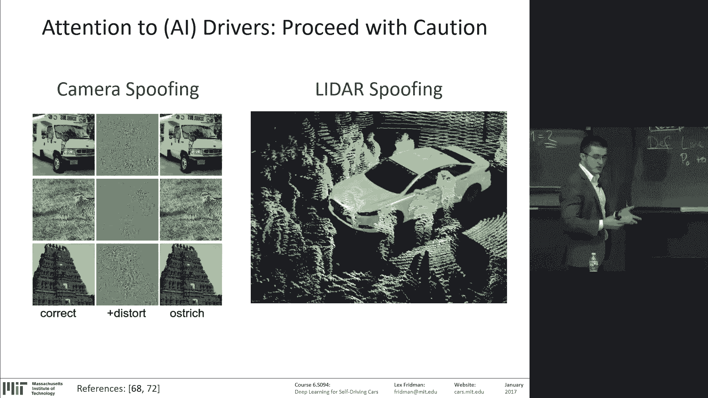

In the same way that you can spoof a camera to see things that are not there。A neural network。

So let me run through some of the libraries that we'll work with and that are out there that you might work with if you proceed with deep learning。

TensorF， that is the most popular one。These days， it's heavily backed and developed by Google。

It has primarily a Python interface。And is。Very good at operating on multiple GPUs。There's CAS。

 and also TFLearn and TF SM， which are libraries that operate on top of TensorFlow that make it slightly easier。

 slightly more user friendly interfaces to get up and running。Torch。

If you're interested to get in at the lower level tweaking of the different parameters of neural networks。

 creating your own architectures， Torch is excellent for that with its own LuA interface。

 LuA is a programming language。And heavily backed by Facebook。There's the old school the。

 just what I started on。 a lot of people early on in deep learning started on。

It's one of the first libraries that supported had came with GPU support。

It definitely encourages lower level tinkering。And as a Python interface。And many of these。

 if not all， rely on invidious。And Vdia's library for。

For doing some of the low level computations involved with training these neural networks。

On Nvidia GPUs。MXNet， heavily supported by Amazon。And they've officially recently announced that they're going to be。

 their AWS going to be all in on M Xnet。Neon recently bought by Intel。

 started out as a manufacturer of neural network chips， which is really exciting。

And it performs exceptionally well。Now here are good things。

 Cafe start in Berkeley also was very popular in Google before TensorFlow came out。

Is primarily designed for computer vision with convnets， but is now expanded to all the。

All other domains。There is CTK， as he used to be known and now called the Microsoft Cognitive Tookit。

 Nobody calls it that still I'm aware of。It says multi GPPU support has its own brain script。

 custom language。As well as other interfaces。And what we'll get to play around in this class is amazingly deep learning in the browser。

 right？Our favorite is Kana JS， what you'll use built by Andrea Carpathy from Stanford now Open AI。

It's good for explaining the basic concept of neural networks。

 it's fun to play around with all you need is a browser， so very few requirements。

 it can't leverage GPUs unfortunately。But for a lot of things that we're doing， you don't need GPs。

 You'll be able to train a network with very little。And relatively efficiently。

 without the need of GPUs， it has full support for CNNNs。

 R NNs and even deeper reinforcement learning。Karas Js。

Which seems incredible we tried to use for this class。Didn't didnn't happen to It has GPU support。

 So it runs in the browser with GPU support with open GL， or however it works magically。

 But we're able to accomplish a lot of things we need without the use of GPs。

 So I it's incredible to live in a day and age when。😊，It literally， as I'll show in the tutorials。

 it takes just a few minutes to get started with building your own neural network that classifies images。

And a lot of these libraries are friendly in that way。So all the references mentioned in this。

Presentation are available at this link， and the slides are available there as well。

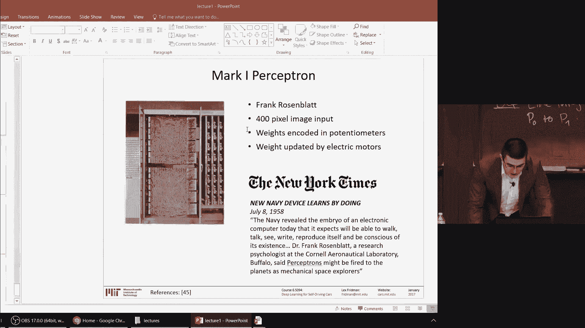

So I think in the interest of time， let me wrap up， thank you so much for coming in today。

 and tomorrow I'll explain the deep reinforcement learning game and the actual competition and how you can win it。

Thanks very much guys。