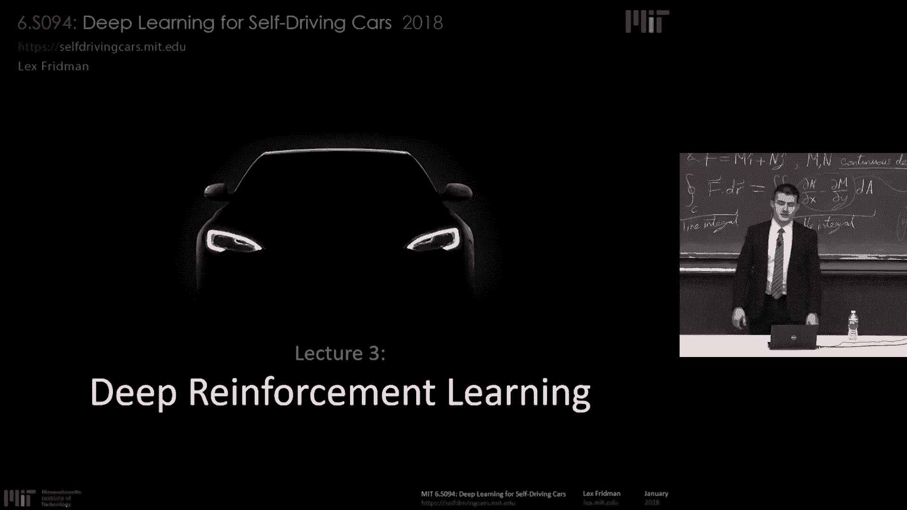
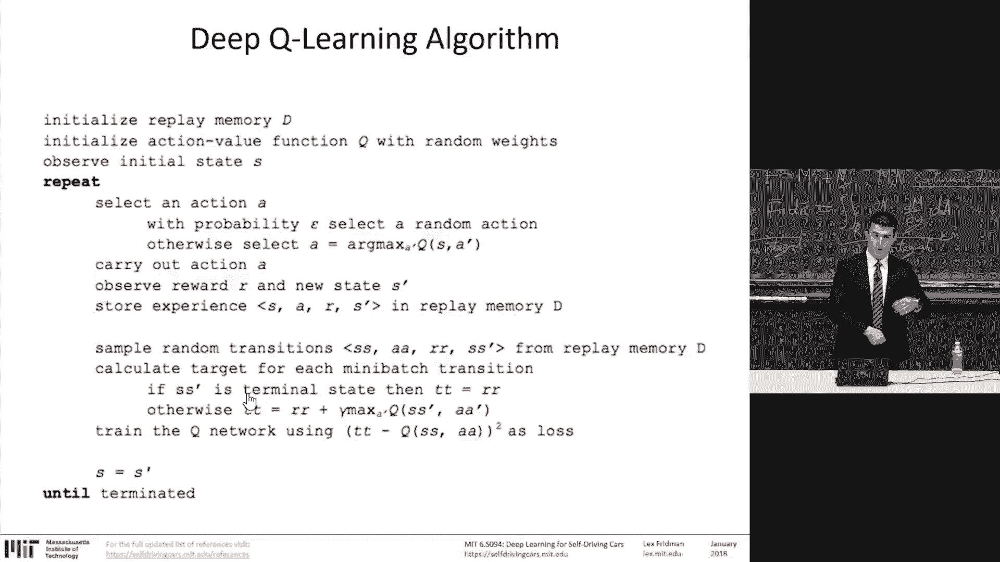
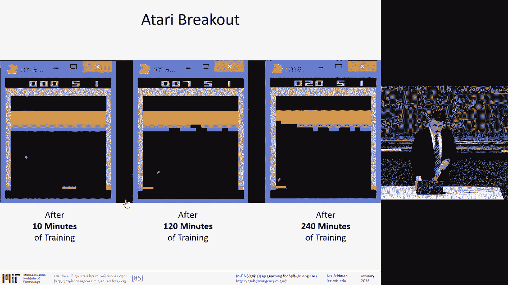
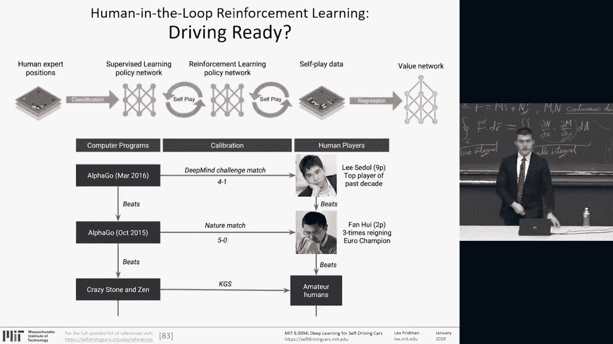
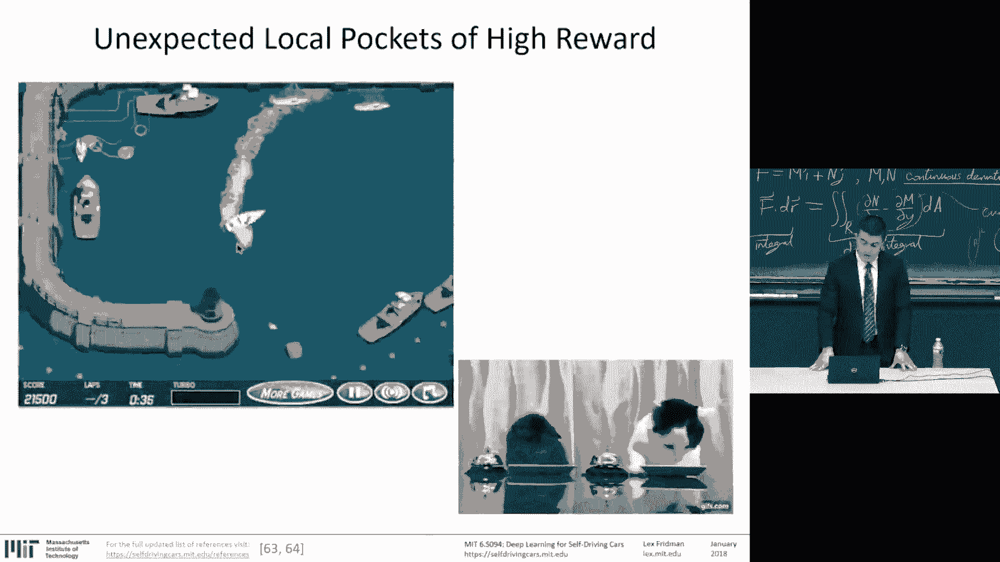
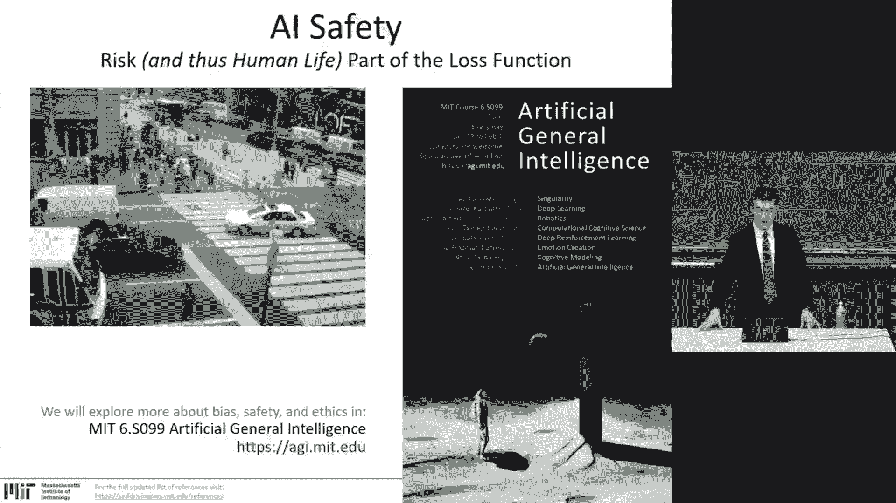
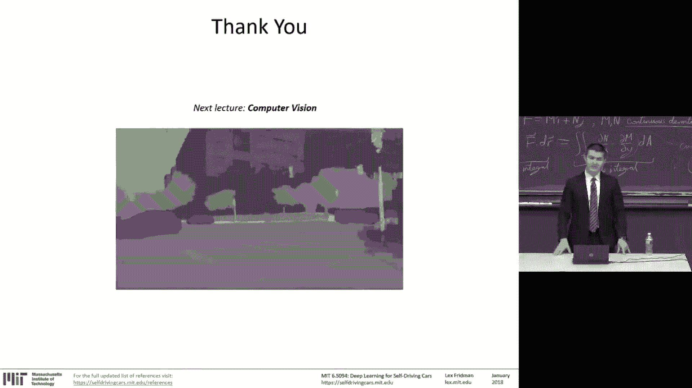

# 【英语字幕+资料下载】MIT 6.S094 ｜ 深度学习与自动驾驶(2018·完整版) - P3：L3- 深度强化学习 - ShowMeAI - BV1Y34y1i7vC

Today， we will talk about deep reinforcement learning。

The question we would like to explore。It's to which degree we can teach systems to act。

 to perceive and act in this world from data。So let's take a step back and think of what is the full range of tasks that an artificial intelligence system needs to accomplish。

 Here's the stack from top to bottom， top to input， bottom output。The environment at the top。

 the world that the agent is operating in。Sensed by sensors。

 taking in the world outside and converting it to raw data interpretable by machines。Censor data。

And from that raw sensor data， you extract features。

You extract structure from that data such that you can input it， make sense of it， discriminate。

 separate， understand the data。And as we discussed， you form higher and higher order representations。

 a hierarchy of representations based on which the machine learning techniques can then be applied。

Once the machine learning techniques， the understanding， as I mentioned。

 converts the data into features into higher order representations and into simple， actionable。

 useful information。We aggregate that information into knowledge。

 We take the pieces of knowledge extracted from the data。

Through the machine learning techniques and to build a taxonomy。A library of knowledge。

And with that knowledge， we reason， an agent is has to reason。To aggregate。

To connect pieces of data seen in the recent past or the distant past。

To make sense of the world it's operating in。And finally。

 to make a plan of how to act in that world based on its objectives。

 based on what it wants to accomplish。 As I mentioned。

 a simple but commonly accepted definition of intelligence。

Is a system that's able to accomplish complex goals。

So a system that's operating in an environment in this world must have a goal。

 must have an objective function， a reward function。 And based on that。

 it forms a plan and takes action。And because it operates in many cases in the physical world。

 it must have tools。Effectors with which it applies the actions to change something about the world。

That's the full stack。Of an artificial dince system that acts in the world。And the question is。

What kind of task can such a system take on？What kind of task can an artificial intelligence system learn as we understand AI today？

We will talk about the advancement of deeper enforcementment learning approaches in some of the fascinating ways it's able to take much of this stack and treat it as an end to end learning problem。

But we look at games。 We look at simple， formalized worlds， while it's still impressive。

 beautiful and unprecedented accomplishments。😊，It's nevertheless formal tasks。

Can we then move beyond games and into expert tasks？Of medical diagnosis。Of design。

And into natural language， and finally， the human level tasks of emotion， imagination。Consciousness。

Let's once again review the stack in practicality。In the tools we have。

The input for robots operating in the world， from cars to humanoid to drones。Its LiDar， camera。

 radar， GPS， stereo cameras， audio， microphone， networking for communication。

 and the various ways to measure kinematics。Well I'm you。The raw sensory data。It's then processed。

 Feature are formed， representations are formed and multiple higher and higher order representations。

 That's what deep learning gets us before neural networks， before the advent of。

Before the recent successes of neural networks to go deeper and therefore be able to form high order representations of the data that was done by experts。

 by human experts Today， networks are able to do that。

 that's the representation piece and on top of the representation piece。

 the final layers these networks are able to accomplish the supervised learning tasks。

 the generative tasks。And the unsupervised clustering tasks。Through machine learning。

 that's what we talked about a little in lecture one and will continue tomorrow and Wednesday。

That supervised learning。And you can think about the output of those networks as simple， clean。

 useful， valuable information。 That's the knowledge。And that knowledge。

It can be in the form of single numbers， it could be regression， continuous variables。

 it could be a sequence of numbers。 It can be images， audio sentences， text。Speech。

 once that knowledge is extracted and aggregated， how do we connect it in multireutional ways。

 form hierarchies of ideas， connect ideas？The trivial silly example is connecting images， activity。

 recognition and audio， for example。If it looks like a duck quacks like a duck and swims like a duck。

 we do not。Currently have approaches that effectively integrate this information。

To produce a higher confidence estimate that is， in fact， a duck and the planning piece。

The task of taking the sensor information， fusing the sensor information， and making action。

 control and longer term plans based on that information， as we'll discuss today。

Are more and more amenable to the learning approach， to the deep learning approach。

 but to date have been the most successful and non-learning optimization based approaches。

 like with the several of the guest speakers we have。

 including the creator of this robot Atlas in Boston Dynamics。So the question。

 how much of the stack can be learned end to end from the input to the output。

 we know we can learn the representation and the knowledge， from the representation and to knowledge。

 even with the kernel methods of SVM。And， certainly。With neural networks。

 mapping from representation to information。Has been where the primary success in machine learning over the past three decades has been。

Mapping from raw sensory data to knowledge。That's where the success。

 the automated representation learning of deep learning。

Has been a success going straight from raw data to knowledge。

The open question for us today and beyond is if we can expand the red box there of what can be learned end to end。

 from sensory data to reasoning， so aggregating， forming higher representations of the extracted knowledge。

And forming plans and acting in this world from the raw sensory data。

We will show the incredible fact that we're able to do learn exactly what's shown here and to end with deeper enforcement learning on trivial tasks。

😊，In a generalizable way， the question is whether that can then move on to real world tasks of autonomous vehicles of humanoid。

 robotics， and so on。That's the open question。 So today let's talk about reinforcement learning。

 There's three types of machine learning。Supervised。

Unsupervised are the categories at the extremes relative to the amount of human input that's required for supervised learning。

 every piece of data that's used for teaching these systems is first labeled by human beings and unsupervised learning on the right is no data is labeled by human beings。

In between is some sparse input from humans， semisupervised learning is when only part of the data is provided by humans ground truth。

 and the rest must be inferreed generalized by the system。

 and that's where reinforcement learning falls。Reinforcement learning。

That's shown there with the cats。As I said， every successful presentation must include cats。

They're supposed to be Pavlov's cats。And ringing a bell and every time they ring a bell。

 they're given them food and they learn this process。The goal of reinforcement learning is to learn。

From sparse reward data， from learn， from sparse supervised data。

 and take advantage of the fact that in simulation or in the real world。

 there is a temporal consistency to the world， there is a temporal dynamics that follows from state to state to state through time。

 and so you can propagate information even if the information that you received about the supervision。

 the ground truth is sparse， you can follow that information back through time to infer something about the reality of what happened before then。

 even if your reward signals are weak。So it's using the fact that the physical world evolvevolves through time in some sort of predictable way to take sparse information and generalize it over the entirety of the experience that's being learned。

So we apply this to two problems。 Today， we'll talk about deep traffic。As a methodology。

 as a way to introduce deeper enforcement learning。

 So deep traffic is a competition that we ran last year。And expanded significantly this year。

And I'll talk about some of the details and how the folks in this room can on your smartphone today or if you have a laptop。

 train an agent while I'm talking， training a neural network in the browser。

 some of the things we've added are we've added the capability we've now turned it into a multi-agent deeper reinforcement learning problem where you can control up to 10 cars with a neural network。

Perhaps less significant， but pretty cool is the ability to customize the way the agent looks。

So you can upload and people have， to an absurd degree， have already begun doing so。

 uploading different images instead of the car that's shown there。

As long as it maintains the dimensions， shown here is a SpaceX rocket。

The competition is hosted on the website， self driving cars that MITDduu sdeep trafficff we'll return to this later。

The code is on GitHub with some more information， a starter code。

And a paper describing some of the fundamental insights。

That will help you win at this competition is an archive。

So from supervised learning in lecture 1 to today。Supervised learning we can think of as memorization。

Of ground truth data in order to form representations that generalizes from that ground truth。

Reinforcement learning is we can think of as a way to brute force propagate that information。

 the sparse information。Through。Time。To assign quality reward to state that does not directly have a reward。

To make sense of this world when the rewards at sparse but are connected through time。

You can think of that as reasoning。So the connection through time。Is modeled。

In most reinforcement learning approaches。Very simply that there's an agent taking an action in a state and receiving a reward。

And the agent operating in an environment executes an action。

 receives an observed state and new state and receives their award。

 This process continues over and over。😊，In some examples， we can think of any of the video games。

 some of which we'll talk about today， like an Atari breakout as the environment。

 the agent is the paddle。Each action that the agent takes has an influence on the evolution of the environment。

And the success is measured by some reward mechanism， in this case， points are given by the game。

And every game。It has a different point scheme that must be converted。

 normalized into a way that's interpretable by the system。And the goal is to maximize those points。

 maximize the reward。The continuous problem of cart pole balancing。

 the goal is to balance the pole on top of a moving cart。The state is the angle， the angular speed。

 the position， the horizontal velocity。The actions are the horizontal force applied to the cart。

 and the reward is one at each time step if the poll is still upright。All the first person shooters。

 the video games， and all Starcraft。The strategy games。In case of first person shooter and doom。

 what is the goal， the environment is the game， the goal is to eliminate all opponents。

 the state is the raw game pixels coming in， the actions is moving up， down， left， right， and so on。

 and the reward is positive when eliminating an opponent。And negative when the agent is eliminated。

Industrial robotics。Been packing with a robotic arm。

 the goal is to pick up a device from a box and put it into a container。

 the state is the raw pixels of the real world that the robot observes。

 the actions or the possible actions of the robot the different degrees of freedom and moving through those degrees moving the different auators to realize the position of the arm and the reward is positive when placing a device successfully and negative otherwise。

Everything could be modeled in this way。Markov decision process as a state as zero action A zero and reward received。

 a new state is achieved， again action and reward state， action reward state。

 until a terminal state is reached。And the major components of reinforcement learning is a policy。

Some kind of plan of what to do in every single state， what kind of action to perform。

A value function。As some kind of sense of what is a good state to be in。

 of what is a good action to take in a state。And sometimes a model。

That the agent represents the environment with。Some kind of sense of the environment it's operating in。

 the dynamics of that environment that's useful for making decisions about actions。

Let's take a trivial example。A grid world of 3 by 4，12 squares。 When you start at the bottom left。

And our tasked with walking about this world to maximize reward。

The reward that the top right is a plus one and a one square below that is a negative one。

 and every step you take。Is a punishment or is a negative reward of 0。04？

So what is the optimal policy in this world？Now， when everything is deterministic。

Perhaps this is the policy。When you start at the bottom left， well， because every step hurts。

 every step has a negative reward， then you want to take the shortest path to the maximum square with the maximum reward。

When the state space is non deterministic。As presented before with a probability of 0。8。

 when you choose to go up， you go up， but with probability 0。1。You go left and point1， you go right。

Unfair， again， much like life。That would be the optimal policy。

What is the key observation here that every single state in the space must have a plan？

Because you can't， because then a nondeministic aspect of the control。

 you can't control where you're going to end up。 So you must have a plan for every place。

 That's the policy， having an action an optimal action to take in every single state。Now。

 suppose we change the reward structure。 And for every step we take。

 there's a negative reward is's a negative too。 So it really hurts。

 There's a high punishment for every single step we take。 So no matter what。

We always take the shortest path， the optimal policy is to take the shortest path to the only spot on the board that doesn't result in punishment。

If we decrease the reward of each step to negative 0。1。The policy changes。

Where there is some extra degree of wandering， encouraged。

And as we go further and further in lowering the punishment as before to negative 0。04。

 more wandering and more wandering is allowed。And when we finally turn the reward。Into positive。

 So every step。え。Every step increases their reward。Then there's a significant incentive to。

 to stay on the board without ever reaching the destination。Kind of like college for a lot of people。

So the value function， the way we think about the value of a state or the value of anything in the environment。

Is the reward we're likely to receive in the future。

And the way we see the reward we're likely to receive is we discount the future award because we can't always count on it。

Here gamma， further and further out into the future。

 more and more discounts decreases the importance of the reward received。

And the good strategy is taking the sum of these rewards and maximizing it。

 maximizing the disccoed future award， that's what reinforcement learning hopes to achieve。

And with Q learning。We use。Any policy to estimate the value of taking an action in a state。

So off policy， forget policy。We move about the world and use the Belllman equation here on the bottom。

To continuously update our estimate of how good a certain action is in a certain state。

So we don't need this this allows us to operate in a much larger state space in a much larger action space。

 we move about this world through simulation or in the real world。

 taking actions and updating our estimate of how good certain actions are over time。

The new state at the left is the is the updated value。

 The old state is the starting value for the equation。

 And we update that old state estimation with the sum。

Of the reward received by taking action action A in state S。

And the maximum reward that's possible to be received in the following states。Discounted。

That update is decreased with the learning rate， the higher the learning rate， the more value we。

 the， the faster we learn， the more value we assign to new information。That's simple。 That's it。

 That's Q learning。 This simple update rule allows us to。To explore the world。 and as we explore。

Get more and more information about what's good to do in this world。

 And there's always a balance in the various problem spaces we'll discuss。

 There's always a balance between exploration and exploitation。

As you form a better and better estimate of the Q function of what actions are good to take。

You start to get a sense of what is the best action to take。But it's not a perfect sense。

 It's still an approximation， and so there's value of exploration。

 but the better and better you estimate becomes the less and less exploration has a benefit。

 so usually want to explore a lot in the beginning and less and less so towards the end and when we finally release the system out into the world and wish it to operate its best then we have it operate as a greedy system。

 always taking optimal action according to the Q value function。

And everything I'm talking about now is parameterized and are parameters that are very important for winning the deep traffic competition。

Which is using this very algorithm with a neural network at its score。

So for simple table representation of a Q function where the y axis is state for states， S1234。

 and the x axis is actions， a12，3，4。We can think of this table as randomly initiated or initiated。

 initiatedized in any kind of way that's not representative of actual reality and as we move about this world and we take actions we update this table with a bellman equation shown up top and here slides now are online。

 you can see a simple pseudocode algorithm of how to update it of how to run this bellman equation and over time the approximation becomes the optimal Q table The problem is when that Q table becomes exponential in size。

When we take in raw sensor information， as we do with cameras， with deep crash。Or with deep traffic。

 taking the full grid space and taking that information， the raw grid pixels of deep traffic。

 and when you take the arcade games here that are taking the raw pixels of the game。

Or when we take go， the game of go， when it's taking the units， the board。

 the raw state of the board。As the input， the potential state space。

 the number of possible combinatorial variations of what states as possible is extremely large。

 larger than we can certainly hold the memory and larger than we can ever be able to accurately approximate through the Belmon equation over time。

😡，To simulation。Through to the simple update of the Bellammy equation。

So this is where deep reinforcement learning comes in。Neural networks are really good appromators。

 They're really good at exactly this task of learning this kind of Q table。😊。

So as we started with supervised learning， Re networks help us memorize patterns using supervised。

Ground truth data。 And we move to reinforcement learning that hopes to propagate。

Outcomes to knowledge。Deep learning allows us to do so on much larger state spaces， a much larger。

Action spaces。Which means it's generalizable。 It's much more capable to deal with the raw stuff of sensory data。

 which means it's much more capable to deal with a broad variation of real world applications。

And it does so because it's able to learn the representations， as we discussed。On Monday。

The understanding comes from converting the raw sensor information into simple。

 useful information based on which the action in this particular state can be taken in the same exact way。

 so instead of the Q table， instead of this Q function we plug in a neural network where the input is the state space。

 no matter how complex。And the output is a value for each of the actions that you could take。

Input is the state。 outputput is the value of the function。 It's simple。This is Deep Q Network， DQN。

At the core of the success of Deep Mind， a lot of the cool stuff you see about video games。

 DQN or variants of DQN are at play。This is what at first with a nature paper。De mind。

The success came of playing the different games， including Atari。games。

So how are these things trained？Very similar to supervised learning。The bellman equation up top。

Takes the reward。And the discounted expected award from future states。

The loss function here for neural network， the neural network learns with a loss function。

 It takes the reward received at the current state。

Does the forward pass through a neural network to estimate the value of the future state？Of the best。

Action to taken in the future state。And then subtract that。

From the forward pass through the network for the current state in action。

So you take the difference between what your Q estimator， the neural network。

Believes the value of the current state is。And what it more likely is to be。

Based on the value of the future states that are reachable based on the actions you can take。

Here's the algorithm。Input is the state output is the Q value for each action， or in this diagram。

 input is the state in action， and the output is the Q value。It's very similar architectures。

 So given a transition of S， A R， S prime。S current State taking an action receiving a reward in achieving S prime State。

TheThe update is do a feed forward pass through the network for the current state。

 do a feed forward pass for each of the possible actions taken in the next state。

 and that's how we compute the two parts of the loss function。

And update the weights using bad propagation。Again， laws function。

 back propagation is how the network is trained。This has actually been around for much longer than deep mind。

A few tricks made it really work。Experience replay is the biggest one。

So as the games are played through simulation， or if it's a physical system， as it acts in the world。

It's actually collecting the observations into a library of experiences and that training is performed by randomly sampling the library in the past。

By randomly sampling the previous experiences and batches。

So you're not always training on the natural， continuous evolution of the system。

 You're training on randomly picked batches of those experiences。 That's a huge。

seems like a subtle trick， but it's a really important one。

So the system doesn't overfi a particular evolution of the game of the simulation。Another important。

Again， subtle trick as in a lot of deep learning approaches。

 the subtle tricks make all the difference。Is fixing the target network。For the loss function。

 if you notice。You have to use the neural network， the， the single neural network。

 the D Q I network to estimate the value of the current state。An action pair。And the next。

 so you're using it multiple times。And as you perform that operation， you're updating the network。

 which means the target function inside that loss function is always changing。

 so the very nature of your loss function is changing all the time as you're learning。😡。

And that's a big problem for stability。That can create big problems to the learning process。

 So this little trick is to fix the network and only update it。Every， say， thousand steps。

So as you train the network， the network that's used to compute the target function inside the loss function is fixed。

It produces a more stable computational loss function。

 So the ground doesn't shift under you as you're trying to find a minimal。For the loss function。

 the loss function doesn't change in unpredictable， difficult to understand ways。And reward clipping。

Which is always true with general systems that are operating seeking to operate in a generalized way is for very。

 for these various games。The points are different， some points are low， some points are high。

 some go positive and negative， and they're all normalized to a point where the good points or the positive points are a one and negative points are a negative one that's reward clipping。

 simplify the reward structure。And because a lot of the games are 30 FPS or 60 FPS and the actions。

It's not valuable to take actions at such a high rate inside of these particularly Atari games。

 that you only take an action every four steps while still taken in the frames as part of the temporal window to make decisions。

Tricks， but hopefully it gives you a sense。Of the kind of things necessary for both。

Seminnal papers like this one。 And for the more important accomplishment of winning deep traffic。

s the tricks make all the difference？Here on the bottom is。

The circle is when the technique is used and excellent it's not looking at replay and target。

 fixed target network and experience replay when both are used for the game of breakout， riverade。

 Seaquest and space invaders， the higher the number， the better it is， the more points achieved。

So when it gives you a sense that when replay and target both gives significant improvements in the performance of the system。

Order of magnitude improvements， two orders of magnitude for breakout。And here is。

Sudocode of implementing DQN， the learning。The key thing to notice， and you can look to the slides。

Is。the loop， the wild loop of playing through the games and selecting the actions to play。

Is not part of the training。 It's， it's part of the saving。The observations， the state action reward。

 next state observations and saving them into replay memory into that library。

 and then you sample randomly from that replay memory to then train the network。

Based on the loss function。And with probability up up top with the probability， Epsilon。

 selected random action， that epsilon is the probability of exploration that decreases at something you'll see in deep traffic as well。

Is the rate at which that exploration decreases over time through the training process。

 you want to explore a lot first。

And less and less over time。So this algorithm that's being able to accomplish。In 2015。

 and since a lot of incredible things。Things that made。The AI world。Think that we。

We're onto something。That general AI is within reach。

It's for the first time that raw sensor information was used to create a system that acts and makes sense of the world。

 makes sense of the physics of the world enough to be able to succeed in it from very little information。

But these games are trivial。Even though there is a lot of them。

This DQN approach has been able to outperform a lot of the Atari games。

 That's what's been reported on， outperform the human level performance。But again。

 these games are trivial。What I think。And perhaps biased， I am biased。

 but one of the greatest accomplishments of artificial intelligence in the last decade。😊。

At least from the philosophical or the research perspective。Is。Alpha goes 0。First， alphago。

 and then alphago 0。Is Deep Mind system that beat the best in the world in the game of go。

So what's the game of Go。It's simple。I won't get into the rules， but basically it's a 19 by 19 board。

Shown on the bottom of the slide。For the bottom row of the table， for a board of 19 by 19。

The number of legal game positions is two times 10 to the power of 170。

It's a very large number of possible positions to consider。 And at any one time。

 especially the game evolves， the number of possible moves is huge。Much larger than in chess。

So that's why AI。The community thought that this game is not solvable。Until 2016。

When Alpha Go used to used human expert position play。To seed in a supervised way。

 reinforcement learning approach。And I'll describe it in a little bit of detail in the couple of slides here。

To beat the best in the world。And then alpha goes0， that is。The accomplishment of the decade。

For me in AI。Is being able to play。With no。Training data on human expert。Games。

And beat the best in the world in an extremely complex game。 This is not aari。

This is a much higher order difficulty game and the quality of players that is competing in is much higher。

 and it's able to extremely quickly hear。To achieve a rating that's better than alpha go。

And better than the different variant of Algo and certainly better than the best of the human players in 21 days。

Of self play。So how does it work？All of these approaches， much， much like the previous ones。

 the traditional ones that are not based on deep learning。Are using Monte Carlo T search， MCTS。

Which is。When you have such a large state space， you start at a board and you play。

And you choose moves。With some exploitation exploration balancing。

Choosing to explore totally new positions or to go deep in the positions you know are good until the bottom of the game is reached until the final state is reached。

 And then you back propagate the quality of the choices you made leading to that position。

 And in that way， you learn the value of。Of board positions and play。

That's been used by the most successful go playing。Engines before and alphagos。

But you might be able to guess， what's the difference with Algo versus the previous approaches。

They use the neural network。As the intuition， quote unquote， to what are the good states。

 what are the good next board positions to explore？And the key things， again。

 the tricks make all the difference。That made alpha go zero。

Work and work much better than Alphago is first because there was no expert play instead of human games。

Alphago used that very same Monte Carlo T search algorithm， MCTS， to do an intelligent look ahead。

Based on the neural network prediction of what are the good states to take。

It checked that instead of human expert play， it checked how good indeed， are those states。

It's a simple look ahead action that does the ground truth。

 that does the target correction that produces the loss function。

 The second part is the multitask learning or what's not called multitask learning is the network is quote unquote  two headed。

In the sense that first it outputs the probability of which move to take the obvious thing and it's also producing a probability of winning。

 and there's a few ways to combine that information and continuously train both parts of the network。

 depending on the choice taken so you want to take the best choice in the short term and achieve the positions that are highly likelihood of winning for the player that' whose turn it is。

And another big step。Is that they updated from 2015， they updated the state of the art architecture。

 which are now the architecture that one imagenet is residual networks， RasNe for IageNe。That's it。

 and those little changes made all the difference。So that takes us through deep traffic and the $8 billion hours stuck in traffic。

America's past time。 So we tried to simulate。Driving the behavior layer of driving。

 so not the immediate control， not the motion planning。

 but beyond that on top on top of those control decisions。

 the human interpretable decisions of changing lane or speeding up slowing down。

 modeling that in a micro traffic simulation framework that's popular in traffic engineering。

 the kind of shown here。We applied deeper reinforce learning to that。We call it deep traffic。

The goal is to achieve the highest average speed over a long period of time。

Weaving in and out of traffic。For students here， the requirement is to follow the tutorial and achieve a speed of 65 miles an hour。

And if you really want to achieve a speed over 70 miles an hour， which is what's required to win。

And perhaps upload your own image。To make sure you look good doing it。What you should do。

 clear instructions to compete， read the tutorial。You can change parameters in the code box on that website。

 cars。mtDu s deep traffic， click the white button that says apply code。

 which applies the code that you write。 these are the parameters that you specify for the neural network。

It applies those parameters， creates the architecture that you specify。

 and now you have a network written in JavaScript living in the browser ready to be trained。

 Then you click the blue button that says run training。And that trains the network。

Much faster than what's actually being visualized in the browser。

1 thousand times faster by evolving the game， making decisions， taking in the grid space。

 as I'll talk about here in a second， the speed limit is 80 miles an hour。

Based on the various adjustments we made to the game。

Reaching 80 miles an hour is certainly impossible， on average。

And reaching some of the speeds that we've achieved last year is much， much， much more difficult。

Finally， when you're happy and the training is done。Submit the model to competition。

For those super eager， dedicated students， you can do so every five minutes。

And to visualize your submission。You can click the request visualization specifying the custom image and the color。

Okay， so here's the simulation， speed limit 80 miles an hour。Cars 20 on the screen。

 One of them is a red one。 in this case。s that one is controlled by neural network。

s speed it's allowed。 the actions are speed up， slow down， change lanes， left， right。

 or stay exactly the same。The other cars are pretty dumb。 They speed up， slow down， turn left， right。

 but they don't have a purpose in their existence。 They do so randomly。

Or at least purpose has not been discovered。The road， the car is a speed。 The road is a grid space。

An occupancy grid that specifies。When it's empty， it's set to。Abe， meaning that。

The grid value is whatever speed is achievable if you are inside that grid。

And when there's other cars that are going slow， the value in that grid is the speed of that car。

 That's the state space。 That's the state representation。 And you can choose how much。

 what slice of that state space you take in。 That's the input to the neural network。

For visualization purposes， you can choose normal speed or fast speed for watching the network operate。

And there's display options to help you build intuition about what the network takes in and what space that car is operating in。

 the default is no extra information is added， then there's the learning input。

 which visualizes exactly which part of the road serves as the input to the network。

 then there is the safety system which I'll describe in a little bit。

 which is all the parts of the road the car is not allowed to go into because it would result in a collision。

 and that JavaScript would be very difficult to animate。And the full map。Here's a safety system。

 You could think of this system as。ACC basic radar， ultrasonic sensors。

 helping you avoid the obvious collisions to obviously the detectable objects around you and the task for this red car for this neural network is to move about this space。

Is to move about the space under the constraints of the safety system。

The red shows all the parts that the grid is not able to move into。

So the goal for the car is to not get stuck in traffic。

Is make big sweeping motions to avoid crowds of cars。The input like DQN is the state space。

 the output is the value of the different actions， and based on the epsilon parameter through training and through inference evaluation process。

You choose how much exploration you want to do。 These are all parameters。

The learning is done in the browser。On your own computer。Utilizing only this CPU。The action space。

 there's five giving you some of the variables here， perhaps you go back to the slides to look at it。

The brain quote， unquote。Is the thing that takes in the state？And the reward。

Takes a forward pass to the state and produces the next action。

The brain is where the neural network is contained， both for the training and the evaluation。

The learning input can be controlled in width。Forward length and backward length。

 lane side number of lanes to the side that you see patches ahead is the patches ahead that you see。

 patches behind as patches behind that you see。New this year can control the number of agents。

They are controlled by the neural network。Anywhere from one to 10。

And the evaluation is performed exactly the same way。

 You have to achieve the highest average speed for the agents。

The very critical thing here is the agents are not aware of each other。

So they're not jointly planning。The network is trained under the joint objective of achieving the average speed for all of them。

But the actions are taking in a greedy way for each。

It's very interesting what can be learned in this way。

Because these kinds of approaches are scalable to an arbitrary number of cars。

 and you can imagine us plopping down the best cars from this class together。And having them compete。

In this way， the best neural networks。Because they're full in their greedy operation。

The number of networks that can concurrently operate is fully scalable。There's a lot of parameters。

The temporal window。The layers， the many layers types that can be added。

 Here is a fully connected layer with 10 neurons， The activation functions。

 All of these things can be customized， as is specified in the tutorial。The final layer。

 a fully connected layer with。I'll put a five regression。

 given the value of each of the five actions。And there's a lot of more specific parameters。

 some of which I've discussed。From gamma to epsilon。To experience replay size。

To learning rate and temporal window。The optimizer， the learning rate， momentum， batch size。

 L2 L1 decay K for regularization and so on。 there's a big white button that says apply code that you press that kills all the work you've done up to this point。

 so be careful doing it。 you should be doing it only at the very beginning。

If you happen to leave your computer running and training for several days， as folks have done。

 the blue training button， you press and it trains based on the parameters you specify。

And the network state gets shipped to the main simulation from time to time。

 So the thing you see in the browser as you open up the website is running the same network that's being trained and regularly it updates that network so it's getting better and better。

 even if the training takes weeks for you， it's constantly updating the network you see on the left。

 So if the car for the network that you're training is just standing in place and not moving。

That's probably。Time to restart and change the parameters， maybe add a few layers to your network。

Number of iterations is certainly an important parameter to control。

And the evaluation is something we've done a lot of work on since last year to remove the degree of randomness。

 to remove the。The incentive to submit the same code over and over again to hope to produce a higher evaluation score。

The method for evaluation is to collect the average speed over 10 runs。

 about 45 seconds of game each， not minutes， 45 simulated seconds。And there is 50s of those。

 And we take the median speed of the 500 runs。 It's done server side。

 So extremely difficult to cheat。 I urge you to try。You can try it locally。

 There's a start evaluation run， but that one doesn't count。

 That's just for you to feel better about your network。That。

 that should produce a result that's very similar to the one we produce on the server。

It's to build your own intuition。And as I said， we significantly reduced the influence of randomness。

 so the score， the speed you get for the network you design should be very similar with every evaluation。

Loading and saving， if the network is huge and you want to switch computers。

 you can save the network， it saves both the architecture of the network and the weights on the network。

 and you can load it back in。Obviously， when you load it in。

 it's not saving any of the data you've already done。

 You can't do transfer learning or JavaScriptscript in the browser yet。Submitting your network。

 submit model to competition， and make sure you run training first， otherwise。

It will be the way to initiate randomly and it will not do so well。

You can resubmit as often you like and the highest score is what counts。

The coolest part is you can load your custom image， specify colors， and request to visualization。

We have not yet shown the visualization， but I promise you it's going to be awesome again。

 read the tutorial， change the parameters in the code box， click apply code， run training。

 everybody in this room on the way home， on the train hopefully not in your car should be able to do this in the browser。

And then you can visualize， request visualization because it's an expensive process。

 You have to want it for us to do it because we have to run in serverside。Competition link is there。

 GitHub starter code is there， and the details for those that truly want to win is in the archive paper。

So the question。That will come up throughout is whether these reinforcement learning approaches are at all。

 or rather if action planning control is amenable to learning。Certainly in the case of driving。

 we can't do what Alpha goes zero did。We can't learn from scratch from self play。

 because that would result in millions of crashes in order to learn。To avoid the crashes。

Unless we're working like we are a deep crash on the RC car or we're working in simulation。

So we can look at expert data。 We can look at driver data， which we have a lot of and learn from。

 It's an open question， where this is applicable。

To date。And I bring up two companies because they're both guest speakers。

DRL is not involved in the most successful robots operating in the real world。

In the case of Boston dynamicsy。Most of the perception， control and planning， like in this robot。

 does not involve learning approaches except with minimal addition on the perception side。

Best of our knowledge。And certainly the same is true with Wayma as the speaker on Friday will talk about。

 deep learning is used a little bit in perception on top。

 but most of the work is done from the sensors and the opt based， the model based approaches。

 trajectory generation and optimizing which trajectory trajectory is best to avoid collisions。

DR is not involved。And coming back and back again。The unexpected local pockets of higher war。

 which arise in all of these situations when applied in the real world。So for the cat video。

 that's pretty short where the cats are ringing the bell and they're learning that the ring in the bell is mapping to food。

I urge you to think about how that can evolve over time in unexpected ways that may not have a desirable effect。

Where the final award is in the form of food。And。The intended effect is to ring the bell。

That's where AI safety comes in for the artificial General intelligencetellig course in two weeks。

 that's something we'll explore extensively。It's how these reinforcement learning planning algorithms will evolve in ways that're not expected。

And how we can constrain them， how we can design reward functions that result in safe operation。

So I encourage you to come to the talk on Friday at 1 pm as a reminder， it's at 1 pm not 7 p。

m in Stata， 32123， and to the awesome talks in two weeks from Boston Dynamics to Ray Kurzweil and so on for AGI。

Now， tomorrow， we'll talk about computer vision and psych views。 Thank you， everybody。

