# 【英语字幕+资料下载】MIT 6.S094 ｜ 深度学习与自动驾驶(2018·完整版) - P4：L4- 计算机视觉 - ShowMeAI - BV1Y34y1i7vC

Today we'll talk about how to make machines see computer vision。And we will present， thank you。

 whoever said yes。And today we will present a competition that unlike deep traffic。

Which is designed to explore ideas。Teach you about concepts of deep reinforcement learning。Sgfuse。

 the deep dynamic driving scene segmentation competition that I'll present today is at the very cutting edge。

Whoever does well in this competition is likely to produce。

A publication or ideas that would lead the world in the area of perception。

Perhaps together with the people running this class， perhaps on your own。

 and I encourage you to do so。

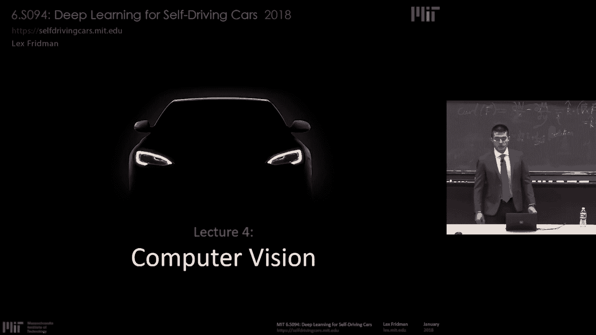

Even more casts today， computer vision。Today， as it stands。Is deep learning。

Majority of the successes in how we interpret form representations understand images and videos utilize to a significant degree neural networks。

 the very ideas we've been talking about that applies for supervised。

 unsupervised and reinforcement learning。And for the supervised case。

 this is just the focus of today。The process is the same。The data is essential。

 there's annotated data where the human provides the labels that serves as the ground truth and the training process。

 then the neural network。Gs。Through that data。Learning to map from the raw sensory input。

To the ground truth labels and then generalize over the testing data set。

And the kind of raw senses we're dealing with are numbers。

I'll say this again and again that for human vision。For us here。

 we take for granted this particular aspect of our ability is to take in raw sensory information through our eyes and interpret it。

But it's just numbers。 that's something whether you're an expert computer vision person or new to the field。

 you have to always go back to meditate on。is what kind of things the machine is given。

 what is the data that its tasked to work with in order to perform the task you're asking it to do。

 perhaps the data it's given is highly insufficient to do what you wanted to do that's the question that'll come up again and again are images enough to understand the world around you。

And given these numbers。They set of numbers sometimes with one channel， sometimes with three RGB。

 where every single pixel have three different colors。The task is to classify。Or regress。

 producing continuous variable。Or one of a set of glass labels。As before。

We must be careful about our intuition of what is hard and what is easing computer vision。

Let's take a step back to the inspiration。For neural networks， our own biological neural networks。

Because the human vision system and the computer vision system is a little bit more similar in these regards。

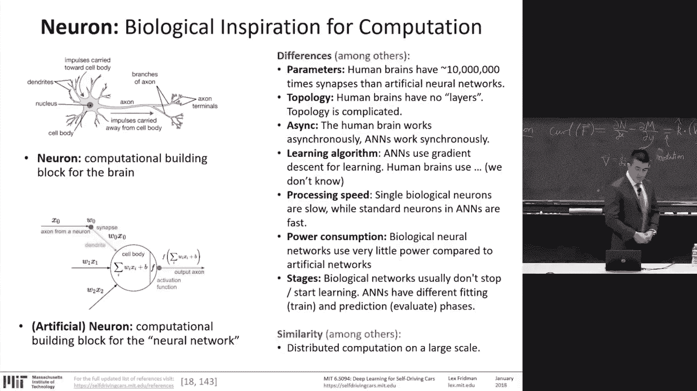

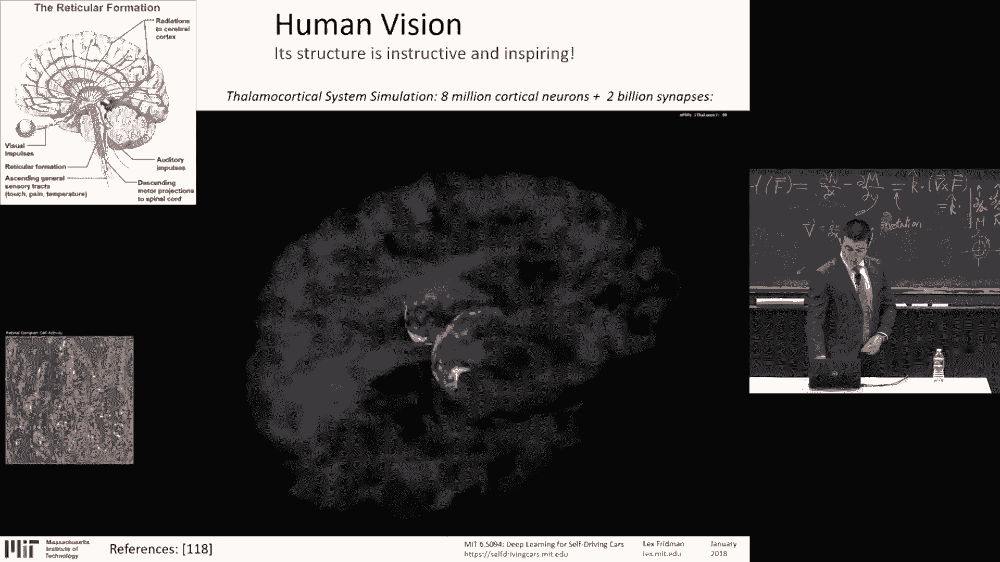

The structure of the human visual cortex is in layers。

And his information passes from the eyes to the。To the parts of the brain that makes sense of the raw sensor information。

 higher and higher order representations have formed。This is the inspiration。

 the idea behind using deep neural networks for images。

Higher and higher order representations have formed through the layers。They're early layers。

Taking in the very raw sensory information and extracting edges。Connecting those edges。

 forming those edges to form more complex features。

 and finally into the higher order semantic meaning that we hope to get from these images。

In computer vision， deep learning is hard。I'll say this again。

 the illumination variability is the biggest challenge。

Or at least one of the biggest challenges in driving。For visible light cameras。Poose variability。

The objects。As I'll also discuss about some of the advances from Jeff Hton and the capsule networks。

 the idea。With the neural networks， as they are currently used for computer vision。

 are not good with representing variable poses。These objects in images and this 2T plane of color and texture。

Look very different numerically when the object is rotated。

And the object is mangled and shaped in different ways， the deformableable truncated cat。

Interclass variability for the classification task。

 which would be an example today throughout to introduce some of the networks over the past decade that have received success and some of the intuition and insight that made those networks work。

 classification。There is a lot of variability inside the classes and very little variability between the classes。

All of these are cats at top。 All of those are dogs at bottom。 They look very different。

 And the other， I would say the second biggest problem in driving perception。

 visible light camera perception is occlusion when part of the object is occluded due to the three dimensional。

Nature of our world， some objects in front of others。And they occlude the background object。

And yet we're still tasked with identifying the object when only part of it is visible。

 and sometimes that part told you there's cats is very hardly visible here。

 we're tasked with classifying a cat when just an ear is visible， just the leg。

And on a philosophical level， as we'll talk about the motivation for our competition here。

 here's a cat dressed as a monkey eating a banana on a philosophical level。

Most of us understand what's going on in the scene。In fact。

 a neural network today successfully classified this。Image this video as a cat。But the context。

 the humor of the situation。 and in fact， you could argue it's a monkey。Is missing。

And what else is missing is the dynamic information， the temporal dynamics of the scene。

That's what's missing in a lot of the perception work that has been done to date in the autonomous vehicle space in terms of visible light cameras。

 And we're looking to expand on that。 That's what Syg views is all about。

Image classification pipeline， there's a bin with different categories inside each class， cat， dog。

 mug hat。Those bins， there's a lot of examples of each and you're tasked with when a new example comes along you've never seen before to put that image in a bin。

 it's the same as the machine learning task before。

And everything relies on the data that's been ground truth， that have been labeled by human beings。

EmNist is a toy dataset set of Hanin digits， often used as examples。And coco， Sa far。

 Inet places and a lot of other incredible data sets， rich data sets of 100 thousands。

 millions of images out there represent scenes， people's faces and different objects。

 Those are all ground truth data for testing algorithms and for。😊。

Competing architectures to be evaluated against each other。CF 10， one of the simplest。

Almost toy dataset sets of tiny icons with 10 categories， of airplane automobile， birdcat。

 deer dog frog， horse ship and truck。It's commonly used to explore some of the basic convolution neural networks we'll discuss。

 So let's come up with a very trivial classifier to explain the concept of how we could go about it。

In fact， this is。Maybe if you start to think about how to classify an image。

 if you don't know any of these techniques， this is perhaps the approach you would take is see would subtract images。

 So in order to know that an image of a cat is different than the image of a dog。

 you have to compare them when given those two images，s what's the way you compare them。

One way you could do it is you just subtract it。And then sum all the pixel wise differences in the image。

 just subtract the intensity of the image pixel by pixel sum it up。If that。

 if that difference is really high， that means the images are very different。Using that metric。

 we can look at C far 10 and use it as a classifier saying， based on this difference function。

 I'm going to find one of the 10 bins for a new image that。That is has the lowest difference。

Find an image in this data that is most like the image I have and put it in the same bin as that image is in。

So there's 10 classes， if we just flip a coin， the accuracy of our classifier would be 10%。

Using our image difference classifier， we can actually do pretty good， much better than random。

 much better than 10%。We can do 35，38% accuracy。That's a classifier， we have our first。Classifier。

Kier his neighbors。Let's take our classifier to our whole new level instead of comparing it to just。

Trying to find one image that's the closest in our data set。

 we try to find K closest and say what class do the majority of them belong to。

 and we take that K and increase it from one to two to three to four to five。

And see how that changes the problem。With seven nearest neighbors。

 which is the optimal under this approach for CFR 10。We achieved 30% accuracy。

Human level is 95% accuracy。And with convolution neural networks， we get very close to 100%。That's。

Where neural networks shine， this very task。Of binning images。

 it all starts at this basic computational unit。Signal in， each of the signals are weighed。Summed。

 bias added。And put an input into a nonlinear activation function that produces an output。

The nonlinear activation function is key。All of these put together。And more and more hidden layers。

Form a deep neural network， and that deep neural network is trained as we've discussed by taking a forward pass on examples of ground truth labels。

 seeing how close those labels are to the real ground truth and then punishing the weights that resulted in the incorrect decisions and rewarding the weights that resulted in correct decisions。

For the case of 10 examples， the output of the network。It's 10 different values。嗯。

The input being handwritten digits from zero to nine， theres 10 of those。

And we wanted our network to classify what is in this image of a handwritten digit。Its  zero，1，2。

3 through9。The way it's often done is there's 10 outputs of the network。

And each of the neurons on the output is responsible for getting really excited when its number is called。

And everybody else is supposed to be not excited， therefore。

The number of classes is the number of outputs， that's how it's commonly done。

And you assign a class to the input image based on the highest the neuron which produces the highest output。

But that's for a fully connected network that we've discussed on Monday。

There is in deep learning a lot of tricks that make things work。

 that make training much more efficient on large。Class problems where there's a lot of classes on large data sets。

When the representation that the neural network is tasked with learning is extremely complex。

 and that's where convolutional neural networks step in， the trick they use is spatial invariance。

They use the idea that。A cat in the top left corner of an image is the same as a cat in the bottom right corner of an image。

So we can learn the same features across the image。That's where the convolution operation steps in。

Instead of the fully connected networks， here there's a third dimension。Of depth。

So the blocks in this neural network。As input take 3D volumes and this output produce 3D volumes。

They take a slice of the image。A window and slide it across。Applying the same exact weights。

 and we'll go through an example， the same exact weights as in the fully connected network on the edges that are used to map the input to the output。

 here are used to map the slice of an image， this window of an image to the output。

And you can make several many of such。Convolutional filters， many layers， many different options of。

What kind of features you look for in an image， what kind of window you slide across in order to extract all kinds of things。

All kinds of edges， all kinds of higher order patterns in the images。

The very important thing is the parameters on each of these filters， these subset of the image。

 these windows， are shared。If the feature that defines a cat is useful in the top left corner。

 it's useful in the top right corner， it's useful in every aspect of the image。

 this is the trick that makes convolutional neural networks save a lot of。

A lot of parameters reduce parameters significantly。Is the reuse。

 the spatial sharing of features across the space of the image。

The depth of these 3D volumes is the number of filters。The stride is the skip of the filter。

 the step size， how many pixels you skip when you apply the filter to the input。And the padding。

Is the padding， the zero padding on the outside of the input to a convolutional layer。

Let's go through an example。So on the left here。And the slides are now available online。

 you can follow them along， and I'll step through this example。

On the left here is an input volume of three channels。The left column is the input。

 the three squares there are the three channels。And there's numbers inside those channels。

And then we have a filter in red。Two of them。Two channels of filters。With a bias。 And we。

 those filters are 3 by 3。 Each one of them is。Size three by three。

 And what we do is we take those three by three filters。That are to be learned。

 these are our variables， our weights that we have to learn。

And then we slide it across an image to produce the output on the right， the green。

So by applying the filters in the red， there's two of them and within each one。

 there's one per every input channel。We go from the left to the right。

From the input volume on the left to the output volume green on the right。And you can look。

 you can pull up the slides yourself， not if you can't see the numbers on the screen。

 but the operations。Are performed on the input to produce the single value that's highlighted there in the green and the output。

And we slide this convolution， no filter along the image。With the stride in this case。Of two。

 skipping， skipping along。They sum to the right， the two channel output in green。That's it。

 that's the convolutional operation， that's what's called the convolutional layer in neural networks。

And the parameters here， besides the bias， are the red values in the middle。

 That's what we're trying to learn。And there's a lot of interesting tricks we'll discuss today on top of those。

 but this is at the core， this is the spatially invariant sharing of parameters that make convolution neural networks able to efficiently learn and find patterns and images。

To build your intuition a little bit more。About convolution。

 here's an input image on the left and on the right。

 the identity filter produces the output you see on the right。

 and then theres different ways you can different kinds of edges you can extract。

We the resulting activation maps seen on the right？So when applying the filters。

Those edge detection filters。To the image on the left。

 you produce in white are the parts that activate the convolution。The results of these filters。

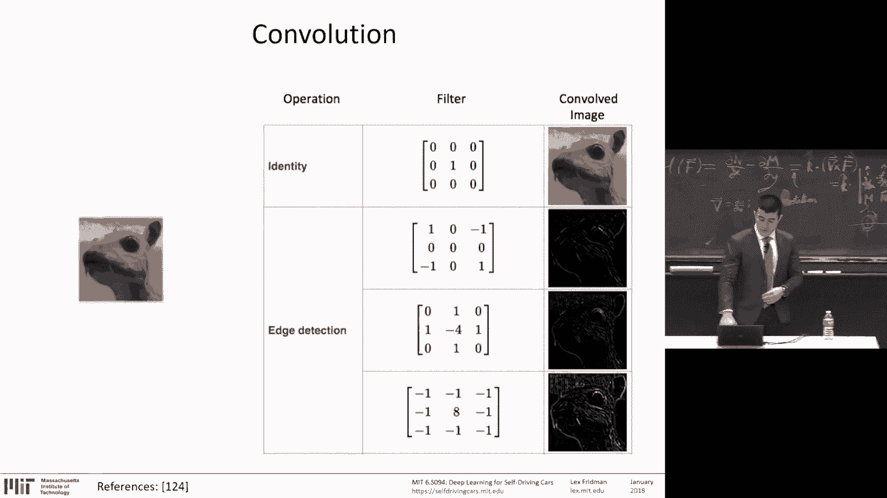

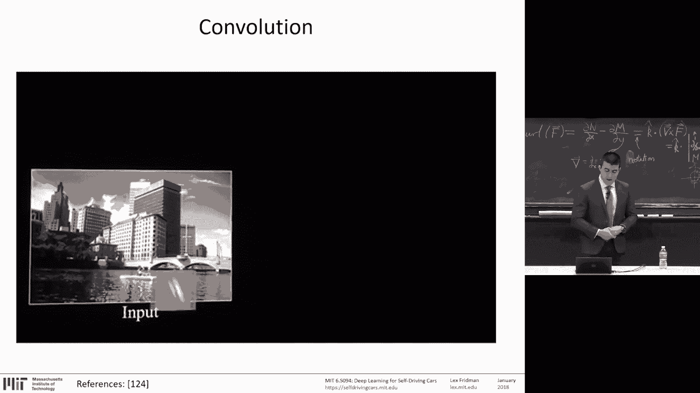

And so you can do any kind of filter， that's what we're trying to learn， any kind of edge。

Any kind of pattern you can move along in this window in this way that's shown here。

 you slide along the image and you produce the output you see on the right。

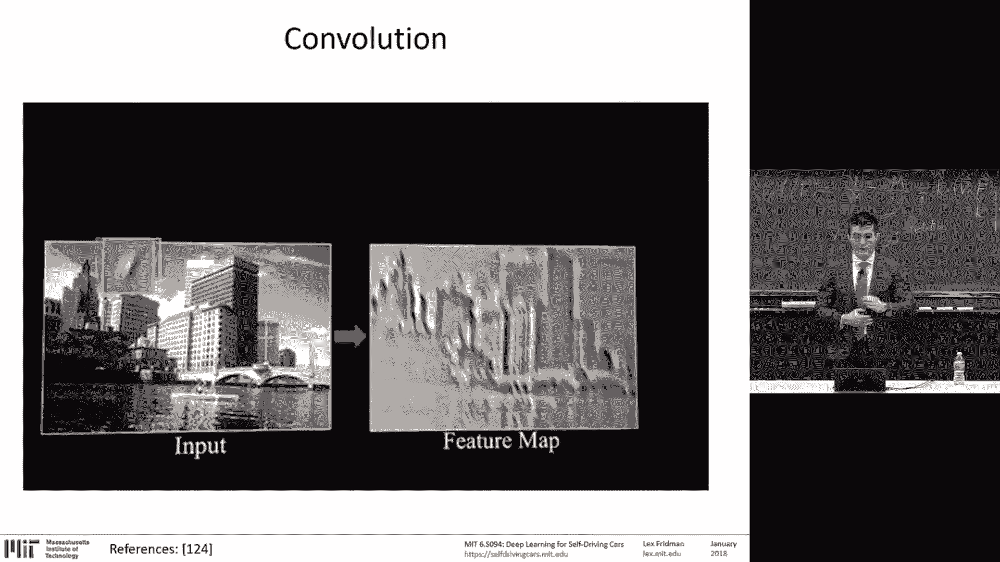

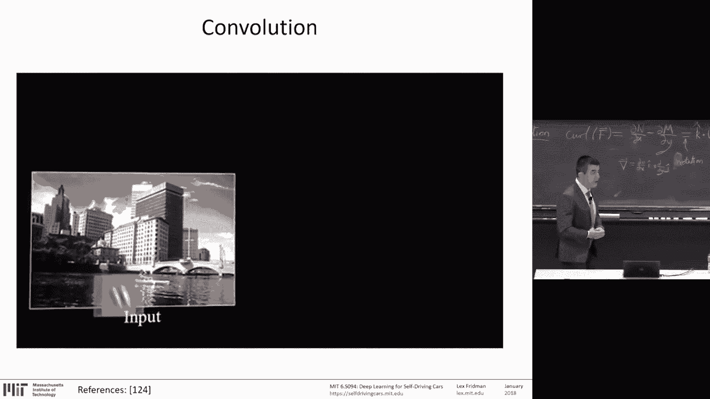

And depending on how many filters you have in every level。

 you have many of such slices that you see on the right， the input on the left。

 the output on the right， if you have。

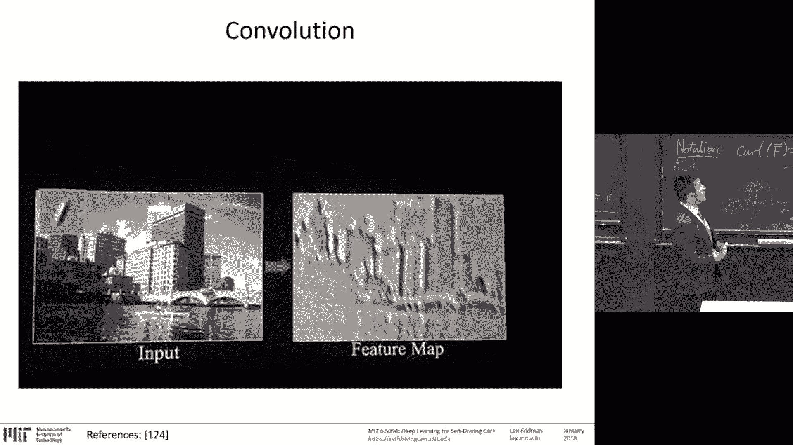

Dozens of filters， you would have dozens of images on the right。

 each with different results that show where each of the individual filter patterns were found。

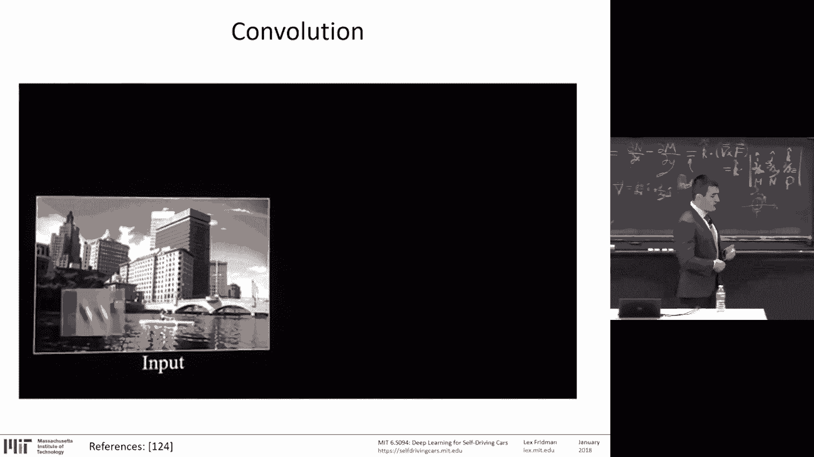

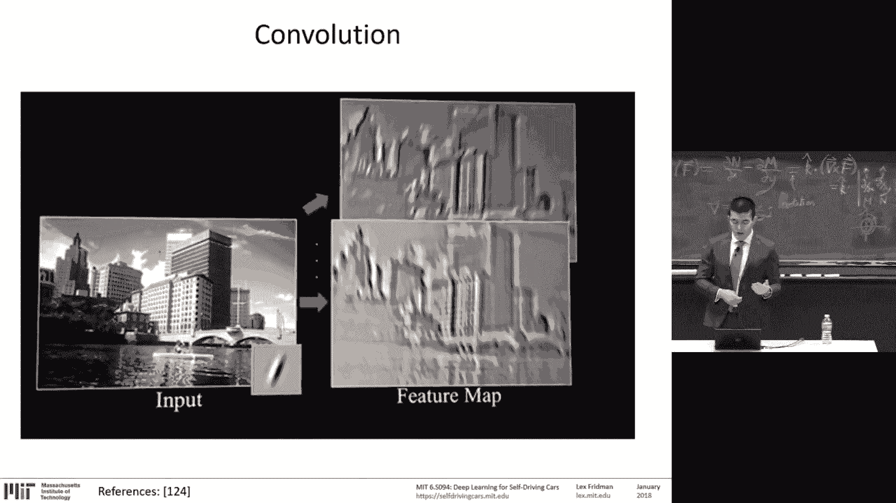

And we learn what patterns are useful to look for in order to perform the classification task。

That's the task for the neural network to learn these filters。

And the filters have higher and higher order。Of representation。

Going from the very basic edges to the high semantic。Meaning that spans entire images。

And the ability to span images can be done in several ways。

 but traditionally has been successfully done through max pooling， through pooling。

Of taking the output of a convolutional operation。And reducing the resolution of that。By。

By condensing that information by， for example， taking the maximum values， the maximum activations。

Thereforefo， reducing the spatial resolution， which has detrimental effects。

 as we'll talk about in the scene segmentation， but it's beneficial for finding higher order representations in the images that bring images together。

 that bring features together to form an entity that we're trying to identify and classify。Okay。

 so that forms。A convolution neural network， such convolutional layers stacked on top of each other is the only addition to a neural network that makes for a convolutional neural network。

And then at the end， the fully connected layers or any kind of other architectures allow us to apply particular domains。

Let's take ImageNe as a case study。An imagenet。The data set， an imageNe， the challenge。

 the task is classification。As I mentioned in the first lecture， Inet is a data set。

One of the largest in the world of images with 14 million images， 21，000 categories。

And a lot of depth to many of the categories， as I mentioned， 1，200 Grannny Smith apples。

TheseThese allow the neural networks to learn the rich representations in both pose。

 lighting variability and intraclass class variation for the particular things。Particular classes。

Like Grny Smith apples。So let's look through the various networks， let's discuss them。

 let's see the insights it started with Alexnet， the first really big successful GPU trained neural network on IageNet that's achieved a significant boost over the previous year。

And moved on to VGGNe。GoogleNe。Agu Lynette。ResNe， CU image， and SNe。In 2017。Again。

 the numbers will show for the accuracy are based on the top five error rate。

 you get five guesses and it's a one or zero。 if you if one of the five is correct。

 you get a one for that particular guess， otherwise it's a zero。And human error is 5。

1 when a human tries to achieve the same tries to perform the same task as the machinist task we doing。

 the error is 5。1， the human annotation is performed on the images based on binary classification。

 Granny Smith， Apple or not， cat or not， the actual task that the machine has to perform and that the human competing has to perform。

 is given an image is provided one of the many classes。Under that， human errors is 5。1%。

 which was surpassed in 2015 by Resnet。To achieve 4% error。So let's start with。AlexNet。

 I'll zoom in on the later networks。 They have some interesting insights。

 but AlexNet and VGGNet both followed a very similar architecture。Very uniform throughout its depth。

Viji Gnet in 2014。Is convolution， convolution pooling， convolution， pooling， convolution pooling。

 and fully connected layers at the end。There's a certain kind of beautiful simplicity。

 uniformity to these architectures because you can just make it deeper and deeper and makes it very amenable to implementation in a layer stack kind of way in any of the deep learning frameworks。

It's clean and beautiful to understand in the case of EGGnet 16 or 19 layers with 138 million parameters。

 not many optimizations on these parameters， therefore。

 the number of parameters is much higher than the networks that followed it。

 despite the layers not being that large。GoogleNet introduced the inception module。

 starting to do some interesting things with the small modules within these networks。

 which allow for the training to be more efficient and effective。

The idea behind the inception module shown here。With the previous layer on bottom。

And the convolutional layer here with the inception module。On top。

 produced on top is it used the idea that different size convolutions provide different value for the network。

Smaller convolutions are able to capture or propagate forward features that are very local。

 a high resolution in texture。Larger convolutions are better able to represent and capture and catch highly abstracted features。

 higher order features。So the idea behind the inception module is to say， well。

 as opposed to choosing in a hyperparameter tuning process or architecture design process。

 choosing which convolution size we want to go with。

 why not do all of them well several together in the case of the GoogleNe model。

 there is the one by one， three by three and five by five convolutions。

With the old trusty friend of Max Poing still left in there as well。

Which has lost favor more and more over time for the image classification task。

And the result is there's fewer parameters that are required if you pick。

The placing of these inception modules correctly， the number of parameters required to achieve a higher performance is much lower。

Resnet。One of the most popular still to date。Architectures that we'll discuss in scene segmentation as well。

Came up and used the idea of a residual block。The initial。Inspiring observation。

 which doesn't necessarily hold true， as it turns out。 But that network depth。

Increases representation power。 So these residual blocks allow you to have much deeper networks。

 And I'll explain why in a second here， but。The thought was they work so well because the networks are much deeper。

The key thing that makes these blocks so effective is the same idea that's reminiscent ofcurren neural networks。

That I hope we get a chance to talk about。The training of them is much easier。

They take a simple block， repeat it over and over。And they pass the input along without transformation。

Along with the ability to transform it， to learn the filters， learn the weights。So you're allowed to。

You allow every layer to not only take on the processing of previous layers。

 but to take in the raw transform data and learn something new。

The ability to learn something new allows you to have much deeper networks。

And the simplicity of this block allows for more effective training。The state of the art in 2017。

 the winner is Squeeing Exitation Networks。That unlike the previous year was C image which Chimpley took ensemble methods and combined a lot of successful approaches to take a marginal improvement。

 SC net。Got a significant improvement。At least in percentages， I think is a 25% reduction in error。

From 4% to 3%。Something like that by using a very simple idea that I think is important to mention。

 a simple insight。It added a parameter to each channel in the convolutional layerir。

In the convolutional block。So the network can now adjust the waiting on each channel。

Based for each feature map， based on the content， based on the input to the network。

This is kind of a takeaway to think about， about any of the networks who talk about any of the architectures。

Is a lot of times recurrent neural networks and convolutional neural networks have tricks that significantly reduce the number of parameters。

The bulk， the sort of low-han fruit， they use spatial invariance。

 the temporal invariance to reduce the number of parameters to represent the input data。

 but they also leave certain things not paraized they don't allow the network to learn it allowing in this case the network to learn the waitinging on each of the individual channels so each of the individual filters is something that you learn as along with the filters makes a huge boost。

 the cool thing about this is it's applicable to any architecture， this kind of block。

 this kind of what the squeeze and excitation block。Is applicable to any architecture。

And because obviously it just simply parameterizes the ability to choose which filter you go with based on the content。

 it's a subtle but crucial thing， I think it's pretty cool and for future research it inspires to think about what else can be parameterized in neural networks。

 what else can be controlled as part of the learning process。

 including hiring higher order hyperparameters。Which aspects of the training and the architecture of the network can be part of the learning。

 This is what this network conspires。Another network has been in development since the '90s ideas。

But Jeff Hnton， but really received been published on and received significant attention in 2017。

 that I won't go into detail here， we are going to release an online only video about capsule networks。

It's a little bit too technical， but they inspire a very important point。

That we should always think about with deep learning。Whenever it's successful。

 is to think about what， as I mentioned with the cat eating a banana on a philosophical and the mathematical level。

 we have to consider what assumptions these networks make and what through those assumptions they throw away。

So neural networks with convolution neural networks due to their spatial invariance。

Throw away information about the relationship。Between。

TheThe hierarchies between the simple and the complex objects。

 So the face on the left and the face on the right looks the same to a convolution neural network。

 the presence of eyes and nose。And mouth。Is the essential aspect of what makes the classification task work for convolution network where it will fire and say this is definitely a phase。

But the spatial relationship is lost， is ignored， which means。

There's a lot of implications to this but。For things like pose variation。That information is lost。

 we're throwing that away completely and hoping that the pooling operation that's performed in these networks is able to sort of mesh everything together to come up with the features that are firing of the different parts of the face to then come up with the total classification that it's a face without representing really the relationship between these features at the low level and the high level at the low level the hierarchy at the simple and the complex level。

This is a super exciting field now that hopefully will spark developments of how we design neural networks that are able to learn the rotational。

 the orientation in variances as well。Okay， so as I mentioned。

You take these convolution neural networks， chop off the final layer。

In order to apply to a particular domain。And that is what we'll do with fully convolutionary neural networks。

 the ones that we task to segment the image at a pixel level。As a reminder。

 these networks through the convolutional process。Really producing a heat map。

 different parts of the network are getting excited based on the different aspects of the image。

 and so it can be used to do the localization of detecting。

 not just classifying the image but localizing the object。And they could do so at a pixel level。

So the convolutional layers are during the encoding process， they're taking the rich。

 raw sensory information in the image and encoding them into an interpretable set of features representation that can then be used for classification。

 but we can also then use a decoder， upsample that information and produce a map like this。

Fully convolution neural network， segmentation， semantic scene segmentation， image segmentation。

 the goal is to， as opposed to classify the entire image， you classify every single pixel。

 it's pixel level segmentation， you color every single pixel with what that pixel。

 what object that pixel belongs to in this 2D space of the image。

The 2D projection in the image of a three dimensional world。

So the thing is there's been a lot of advancement in the last three。Years。

But it's still an incredibly difficult problem。If if you think， if you think about。

The amount of data that's used for training and the task of pixel level of megapixels here of millions of pixels that are tasked with having assigned a single label。

 it's an extremely difficult problem。Why is this interesting。

 important problem to try to solve as opposed to bounny boxes around cats？Well。

 it's whenever precise boundaries of objects are important。

 certainly medical applications when looking at imaging and detecting in particular， for example。

 detecting tumors in medical imaging of different organs。And in driving in robotics。

When objects are involved， it's a dense scene involved with vehicles， pedestrian cyclists。

 we need to be able to not just have a loose estimate of where objects are。

 we need to be able to have the exact boundaries， and then potentially through data fusion fusing sensors together。

 fusing this rich textual information about pedestrian cyclists and vehicles to light our data that's providing us the three dimensionmenal map of the world。

 or have both these semantic meaning of the different objects and their exact three- dimensional location。

A lot of this work successfully。A lot of the work in the semantic segmentation started with fully convolutionary networks for semantic segmentation paper。

 FCN， that's where the name of FCN came from in November 2014。 Now go through a few papers here。

To give you some intuition where the field is gone。

And how that takes us to se fuse the segmentation competition。

So FCN repurposed the imagenet pretrained nets， the nets that were trained to classify wasn't an image。

The entire image。And chopped off the fully connected layers and then added decoder parts that upsampled the image。

To produce a heat map here shown with a tabby cat， a heat map of where the cat is in the image。

It's a much lower， much coarser resolution than the input image。One8 at best。

Skip connections to improve coarseness of upsling， there's a few tricks。

If you do the most naive approach， the upsampling is going to be extremely coarse because that's the whole point of the neural network。

 the encoding part is you throw away all the useless data to the most essential aspects that represent that image。

 so you're throwing away a lot of information that's necessary to then form a high resolution image。

So there's a few tricks where you skip a few of the final。

Pooling operations to go in similar way into a residual block to go to the output。

 produce higher and higher resolution heat map at the end。Signnet in 2015。

Applied this to the driving context and really taking it to Kitty data set and have shown a lot of interesting results and really explored the encoder decoder formulation of the problem。

Really solidifying this the place of the encoder decoder framework for the segmentation task。

Dilated convolution， I'm taking you through a few components which are critical here to the state of the art。

Dated convolutions。So the convolution operation。As the pooling operation。

Reduces resolution significantly。And dilated convolution has a certain kind of grdtting as visualized there that maintains the local。

 high resolution textures。While still capturing the spatial window necessary。

It's called dilated convolutional layer。And that's in a 2015 paper proved to be much better at upsampling a high resolution image。

Deep lab with a bee。V1， V2， now V3。Added conditional random fields。

Which is the final piece of the state of the art puzzle here。

 a lot of the successful networks today that do segmentation， not all。Do post process using CRFs。

 conditional random fields， and what they do is they smooth the segmentation。

 the upsampled segmentation that results from the FCN by looking at the underlying image intensities。

So that's the key aspects of the successful approaches today。

 you have the encoded decoder framework of a fully accomplished neural network。

 it replaces the fully connected layers with the convolutional layers。

Deconvolutional errors and as the years progressed from 2014 to today。As usual。

 than underlying networks。From AlexNet to VGGNe and to now Resnet have been one of the big reasons for the improvements of these networks to be able to perform the segmentation。

So naturally， they mirror the imagenet challenge performance in adapting these networks。

 So the state of the art uses resnet or similar networks， conditional random fields。

For smoothing based on the input image intensities and the dilated。

Convolution that maintains the computational cost， but increases the resolution of the upsseampling。

Throughout the intermediate feature maps。And that takes us to the state of the art that we used。

To produce the images。嗯。To produce the images for the competition。

Bresnet DUC for Dance up sampling convolution。Instead of bilinear up sampling。

 you make the ups learnable。You learn upscaling filters。That's on the bottom。

 that's really the key part that made it work。There should be a theme here。

 sometimes the biggest addition that could be done is paraizing one of the aspects of the network that they've taken for granted。

 letting the network learn that aspect。And the other。I'm not sure how important it is to the success。

 but it's a cool little addition， is a hybrid dilated convolution。

As I showed that visualization where the convolution is spread apart a little bit in the input。

 from the input to the output。The steps of that dilated convolution filter。When they're changed。

 it produces a smoother result because when it's kept the same。

Their certain input pixels get a lot more attention than others。

So losing that favoritism is what it's achieved by using a variable different dilation rate。

Those are the two tricks， but really the biggest one is the parameterization of the upscaling filters。

Okay， so that's what we use to generate that data and that's what we provide you the code with if you're interested in competing in psychFs。

The other aspect here that everything we talked about from the classification to the segmentation to making sense of images is the information about time。

 the temporal dynamics of the scene is thrown away。

And for the driving context for the robotics contest。

 and what we'd like to do is sefuse for the segmentation。

 dynamic scene segmentation context of when you try to interpret what's going on in the scene over time and use that information。

Time is essential。The movement of pixels is essential through time。

 that understanding how those objects move in a 3D space。

Through the 2D projection of an image is fascinating and there's a lot of set of open problems there。

So flow is what's very helpful to， as a starting point to help us understand how these pixels move flow。

Optical flow， dense optical flows， the computation that our best。

Our best approximation of where each pixel in image one。

And moved in the temporal following image after that， there's two images and 30 frames a second。

 there's one image at times 0， the other is 33。3 milliseconds later。

 and the dense optical flow is our best estimate of how each pixel in the input image moved to in the output image。

The optical flow for every pixel produces a direction of where we think that pixel moved and the magnitude of how far moved that allows us to take information that we detected about the first frame。

And try to propagate it forward。 This is the competition is to try to segment an image and propagate that information forward。

For manual annotation。Of an image， so this kind of coloring book annotation where you color every single pixel in the state of the art data set。

For driving cityscapes that it takes。 1。5 hours， 90 minutes to do that coloring。

 it's 90 minutes per image。That's extremely long time。

 that's why there doesn't exist today a data set， and in this class we're going to create one。

Of segmentation of these images through time。Through video。

So long videos where every single frame is fully segmented。

That's still an open problem that we need to solve。Flow is a piece of that。And we also provide you。

This compute that state of the art flow using flowlowNe 2。0。So flowNe 1。0 in May 2015。

Use neural networks to learn the optical flow， the dense optical flow。

And it did so with two kinds of architectures， flow net S， flow net simple， and flow net core。

 flown net C。The simple one is simply taking the two images so what's the task here there's two images and you want to produce from those two images they follow each other in time 33。

3 milliseconds apart and your task is is the output to produce the dense optical flow so for the simple architecture you just stack them together each are RGB so it produces six channel input to the network there's a lot of convolution and finally it's the same kind of process as the fully convolution neural networks to produce the optical flow then there is flownet correlation。

Architecture， where you perform some convolutions separately before using a correlation layer to combine the feature maps。

Both are effective。In different data sets and different applications， so flowlowNe 2。

0 in December of 2016 is one of the state of the art frameworks。

Code bases that we use to generate the data I show。Combines the flown at S and flown S。

It improves over the in flow net， producing a smoother flow field preserves the fine motion detail along the edges of the objects。

And it runs extremely efficiently， depending on the architecture， there's a few variants。

 either  eight to 140 frames a second。And the process there is essentially one that's common across various applications。

 deep learning is stacking these networks together。The very interesting aspect here that。

We're still exploring and again applicable in all of deep learning in this case it seemed that there was a strong effect in taking sparse。

 small multiple data set and doing the training， the order of which those datas were used for the training process mattered a lot。

That's very interesting。

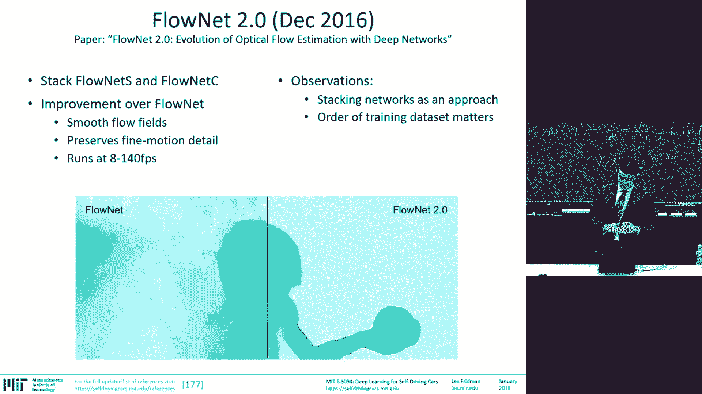

So using FlowNe 2。0， here's the data set we're making available for psychfuse the competition。

Cars that MIT died to use ssych views First， the original video。Us driving in high definition。

1080p in a 8K360 video。Original video driving around Cambridge。Then we're providing the ground truth。

For a training set。For that training set for every single frame， 30 frames a second。

 we're providing the segmentation， frame to frame to frame。Segmented on mechanical turk。

We're also providing the output。Of the network that I mentioned。

 the state of the art segmentation network。That's pretty damn close to the ground truth。

But still not。And our task is， this is the interesting thing is。

Our task is to take the output of this network。Well there's two options。

 one is to take the output of this network。And use other networks to help you propagate the information better so what this segmentation。

 the output of this network does is it only takes a frame by frame by frame it's not using the temporal information at all so the question is can we figure out a way。

 can we figure out tricks to use temporal information to improve this segmentation so it looks more like this segmentation。

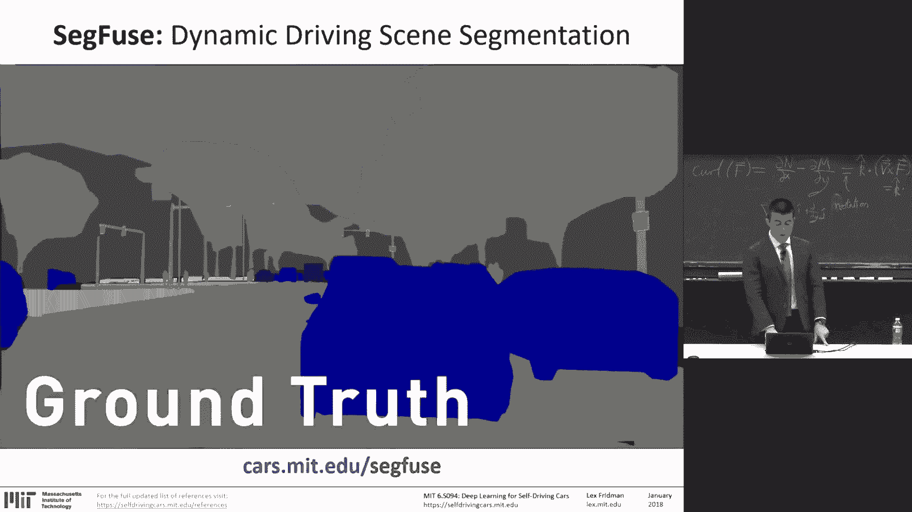

And we're also providing the optical flow from frame to frame to frame。

 So the optical flow based on flow at 2。0 of how each of the pixels moved。

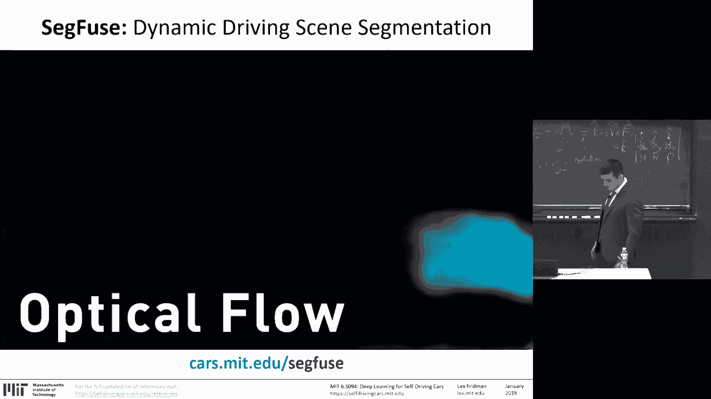

Okay。And that forms a psyfuse competition， 10，000 images。And the task is to submit。Code。

 we have starter code in Python and on GitHub。To take in the original video。

 take in for the training set， the ground truth， the segmentation from the state of the art。

 segmentation network， the optical flow from the state of the art， optical flow。

Network and taking that together to improve the stuff on the bottom left。

 the segmentation to try to achieve the ground truth on the top right。

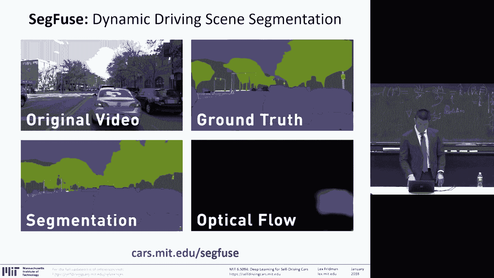

Okay， with that， I'd like to thank you tomorrow at 1 pm is Waymo in Stata。321，23， the next lecture。

 next week will be on deep learning for a sense in the human understanding the human。

 and we will release online only lecture on capsule networks and GANs， general adversarial networks。

 thank you very much。

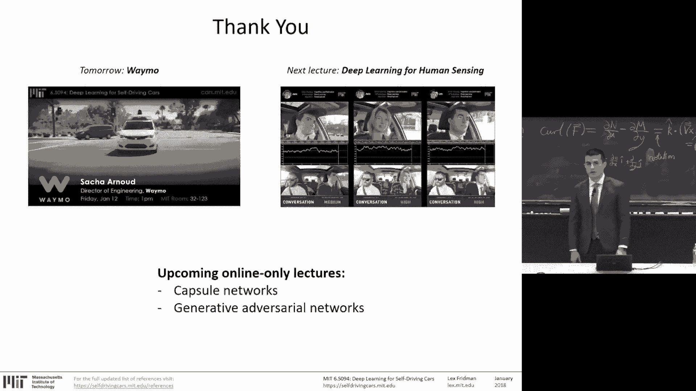