# 【英语字幕+资料下载】MIT 6.S094 ｜ 深度学习与自动驾驶(2018·完整版) - P7：L7- 用于全驾驶任务端到端学习的卷积神经网络 - ShowMeAI - BV1Y34y1i7vC

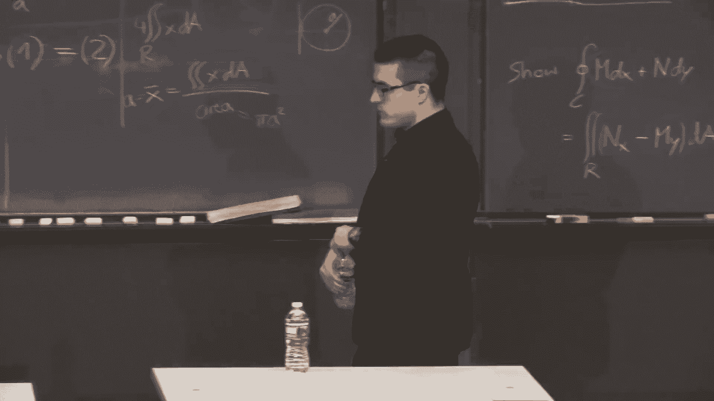

All right， welcome back everyone。Sound okay， all right。

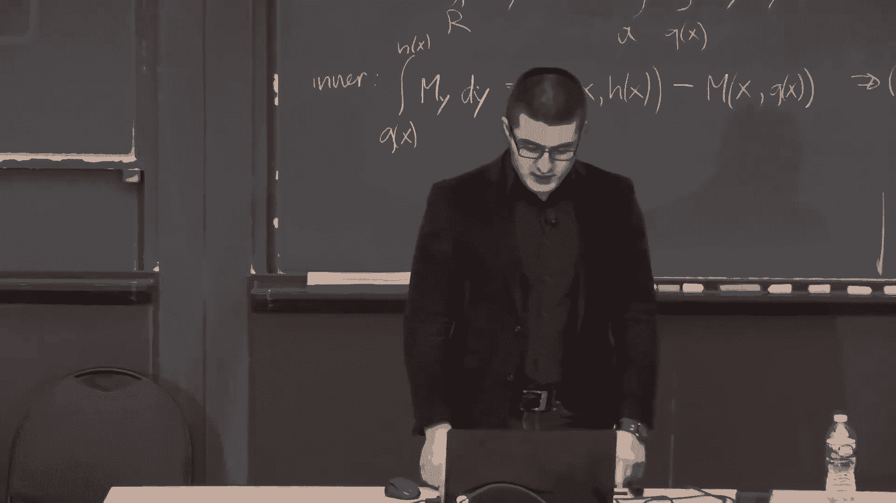

So today we will， we talked a little bit about。Neural networks started to talk about neural networks yesterday。

Today， will continue。To talk about neural networks that work with images。

 convolutional neural networks and see how those。Types of networks can help us drive a car。

If we have time， we'll cover a simple illustrative case study of detecting。Traffic lights。

The problem of detecting green， yellow， red。If we can't teach our neural networks to do that。

 we're in trouble。But it's a good clear illerative case study of a three class classification problem。

Okay， next there's。Deep Tesla。Here， looped over and over in a very short g。

This is actually running live on a website right now we'll show it towards the end of the lecture。

 this once again， just like deep traffic is a neural network that learns to steer a vehicle based on the video of the forward roadway。

And once again， doing all of that in the browser， using jascript。

So you'll be able to train your own very network to drive using real world data。

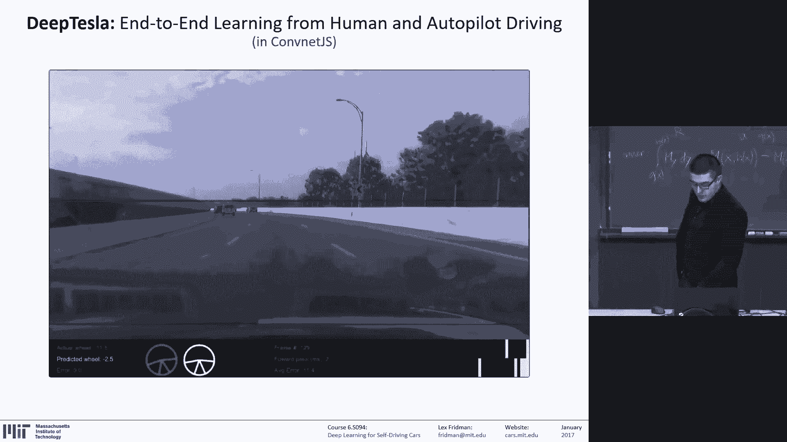

I'll explain how。You will also have a tutorial。And code。

Briefly describe today at the end of the lecture， there's time。

How to do the same thing in Tensorflow。 So if you want to build a network that's bigger。Deeper。

 and you want to utilize GPU to train that network。 You want to not do it in your browser。

 You want to do it offline using Tensorflow and having a powerful GPU on your computer。

 And we'll explain how to do that。Computer vision。So we talked about。Vanilla machine learning。

 where there is no or the size yesterday。Where the size of the input is small。For the most part。

The number of neurons in the case the neural networks is on the order of 10， 100，1000。

When you think of images， images are a collection of pixels。

One of the most iconic images from computer vision and the bottom left there is Lenna。

I encourage you to Google it and figure out the story behind that image。

Is quite shocking when I found out recently。So once again， computer vision。Is these days。

Dominated by data driven approaches。By machine learning。Where all of the same methods。

That are used on other types of data are used on images where the input is just a collection of pixels。

 and pixels are。Numbers from 0 to 2，55， discrete values。

So we can think exactly what we've talked about previously。

 We can think of images in the same exact way。 It's just numbers。

And so we can do the same kind of thing， we can do supervised learning where you have an input image。

 an output label。The input image here is a picture of a woman， the label might be woman。

On supervised learning， same thing。 We'll look at that briefly as well。

Is clustering images into categories。Again semiupervised and reinforcement learning。 In fact。

 the Atari Game we talked about yesterday。Do some preproces on the images。

 They're doing computer vision。 They're using convolutional neural networks， as we'll discuss today。

And the pipeline for supervised learning is again the same。 There's raw data in the form of images。

 There's labels on those images。We perform a machine learning algorithm。

 performance feature extraction。It trains given the inputs and outputs。

On the images and the labels of those images construct the model and then test that model。

 and we get a metric and accuracy。 Ac is the term that's used to often describe how well a model performs。

It's a percentage。I apologize for the constant presence of cats throughout this course。

 I assure you this course is about driving， not cats。But images are numbers。So for us。

 we take it for granted。We're really good at looking at and converting visual perception as human beings。

 converting visual perception into semantics。We see this image and we know it's a cat。

But a computer only sees numbers。RGB values for colored image。

There's three values for every single pixel。From 0 to 255。And so given that image。

 we can think of two problems。 One is regression and the other is classification。

Regression is when given an image， we want to produce a real valued output back。

 So if we have an image of the forward roadway， we want to produce a value for the steering wheel angle。

And if you have an algorithm that's really smart。It can take any image of the forward roadway and produce the perfectly correct steering angle that drives the car safely across the United States。

😊，We'll talk about how to do that and where that fails。Classification is when the input again。

 is an image and the output。Is a class label， a discrete class label。Underneath it， though。

 often is still a regression problem。 And what's produced is a probability that this particular image belongs to a particular category。

And we use a threshold to chop off。The outputs associated with low probabilities。

And take the labels associated with the high probabilities and convert it into a discrete classification。

I mentioned this yesterday， but it bears saying again， computer vision is hard。

We once again take it for granted。 as human beings。

 we're really good at dealing with all of these problems。 There's viewpoint variation。

 The object looks totally different in terms of the numbers of the behind the images。

 in terms of the pixels when viewed from a different angle， viewpoint variation。Objects。

 when you're standing far away from them are up close are totally different size。

 We're good at detecting that they're different size It's still the same object as human beings。

 but that's still a really hard problem because those sizes can vary drastically。

We talked about occlusions and deformations with cats。Well understood problem。

There's background clutter。You have to separate the object of interest from the background。

And given the three dimensional structure of our world。

 there's a lot of stuff often going on in the background。The clutter。

There are inter class variation that's often greater than inter class variation。

 meaning objects of the same type often have more variation than the objects that you're trying to。

Se them from。There's the hard one for driving， illumination。Light is the way we perceive things。

 The reflection of light off the surface。And the source of that light changes the way that object appears。

 And we have to be robust to all of that。So the image classification pipeline。It's the same。

 as I mentioned。There's categories。Its a classification problems。 So there's categories of cat， dog。

 mug， hat。 And you have a bunch of examples， image examples of each of those categories。

 And so the input。It's just those images paired with the category。And you train。To map。

 to estimate a function that maps from the images to the categories。For all of that， you need data。

A lot of it。There is， unfortunately。There's a growing number of data sets。

 but they're still relatively small。We get excited。 There are millions of images。

 but there are not billions or trillions of images。And these are。

The data sets that you will see if you read academic literature most often。Emist。

 the one that's been beaten to death。And then we use as well in this course。

Is a data set of handwritten digits。Where the categories is zero to9。Imagenet。

 one of the largest image data sets。Fully labeled image data sets in the world。

Has images with a hierarchy of categories from Wardnet。

And what you see there is a labeling of what images associated with which words are present in the data。

Car 10 and Car 100 are tiny images。That are used to prove in a very efficient and quick way Offhand that your algorithm that you're trying to publish on or trying to impress the world with works well。

It's small。 It's a small data set。 C far 10 means there's 10 categories。

And places is a data set of natural scenes， woods， nature。City， so on。

 So let's look at C far1 as a data set of 10 categories， airplane， automobile， bird， cat， so on。

They're shown there with sample images as the rows。

And so let's build a classifier that's able to take images from one of these 10 categories and tell us what。

Is shown in the image。 So how do we do that。Once again， all the algorithm sees as numbers。

So we have to try。To have， at the very core， we have to have an operator for comparing two images。

So given an image， and I want to say if it's a cat or a dog。

 I want to compare it to images of cats and compare it to images as dogs and see which one matches better。

 So there has to be a comparative operator。Okay， so one way to do that is take the absolute difference between the two images。

 pixel by pixel。Take the difference between each individual pixel。

Shown on the bottom of the slide for a4 by4 image。And then we sum that pixel Y。

 Pix Y is absolute difference until a single number。 So if the image is totally different。

 pixel wise。There'll be a high number。 If it's the same image， the number will be 0。Oh。

 it's the absolute value， too， of the difference。And that's called L1 distance。Doesn't matter。

When we speak of distance， we usually mean L2 distance。And so， if we。Try to。

 so we can build a classifier that just。Uses this operator to compare to every single image in the data and say。

 I'm gonna pick the。I'm going to pick the category that's the closest using this comparative operator。

I'm going to find。 I have a picture of a cat。 and I'm going look through the data set and find the image that's the closest to this picture。

And say that is the category that this picture belongs to。So if we just flip the coin。

And randomly pick which category an image belongs to will get that accuracy。Would be on average， 10%。

Tandom。The accuracy we achieve with our。Brilliant。Image difference algorithm that just goes to the data set and finds the closest one。

Is 38%。It is pretty good。 It's way above 10%。So you can think about this operation of looking through the data and finding the closest image as。

What's called Kaier's neighbors or K in that case is。

Meaning you find the one closest neighbor to this image that you're asking a question about。

And accept the label from that image。 it could do the same thing， increasing K。

KInc k to 2 means you take the two nearest neighbors。

You find the two closest in terms of pixelix Y image difference images to this particular query image。

And find which category do those belong to？What's shown up top on the left is the data set we're working with。

 red， green， blue。What's shown in the middle is the one nearest neighbor classifier， meaning。

This is how you segment the entire space of different things that you can compare。

And if a point falls into any of these regions， it will be immediately associated with the nearest neighbor algorithm to belong to that image。

To， to that region。With five nearest neighbors， there's immediately an issue。

The issue is that theres white regions， there's tide breakers。Where your five closest neighbors。

Are from various categories， so it's unclear what you belong to。So if we。

 this is a good example of parameter tuning， you have one parameter k。

And you have to your task as a machine， as a teacher of machine learning。

You have to teach this algorithm how to do your learning for you。

Is to figure out that parameter that's called parameter tuning or hyperparameter tuning。

 as it's called in neural networks。And so on the bottom right of the slide is on the x axis is k as we increase it from 0 to 100。

And on the Y axis is classification accuracy。 It turns out that the best K for this data set is 7。

7 years neighbors。 with that， we get a performance of。30%。Human level performance。

And I should say that the way that number is， we get that number。

 as we do with a lot of the machine learning pipeline。Process is you separate the data。

Into the parts of the data set you use for training and another part they use for testing。

You're not allowed to touch the testing part。As's cheating。

You construct your model of the world on the training data。

And you use what's called cross validation。Will you take a small part？

Of the training data shown fold 5 there in yellow。To leave that part out from the training。And then。

 use it。As part of the hyperparameter tuning。As you train。

 figure out with that yellow part fold five， how well you're doing。

And then you choose a different fold and see how well you're doing and keep playing with parameters。

 never touching the test part。And when you're ready。

 you run the algorithm of test data to see how well you really do。

 how well it really generalizes Yes question。Intuition。Or do you just have to run。

So the question was， is there a good way to。Is there any good intuition behind what a good K is。

 There's general rules for different data sets， but usually you just have to run through it。

 grid search， brute force。Yes， question。Good， good question， yes。Yeah。Yes， the question was。

 is each pixel one number or three numbers？For majority of computer vision throughout its history use grayscale images。

 So it was one number。 But RGB is three numbers。 And there' are sometimes a depth value， too。

 So it's four numbers。 So it's。If you have a ste vision camera that gives you the depth information of the pixels。

 that's a fourth。And then if you stack two images together， that could be six。In general。

 everything we work with will be three numbers for a pixel。It was， yes。

 so the question was for the absolute value， it was just one number exactly right。

 so in that case those was gray scale images， so it's not RGB images。So that's， you know。

 this algorithm is pretty good if we use the best。we optimize the hyperparameters of this algorithm。

 choose K of 7， seems to work well for this particular CFFR  to data set， okay， we get 30% accuracy。

It's impressive， higher than 10%。Human beings perform at about 94。

 slightly above 94% accuracy for C far1。 So given an image， it's a tiny image。 I should clarify。

 it's like it's a little icon。Given that image， human beings able to determine accurately one of the 10 categories with 94% accuracy。

 and the currently state of the art convolution neural networks is 95。 It's 95 point。4% accuracy。

And believe it or not， it's a heated battle。But the most important， the critical fact here is。

It's recently surpassed humans。And certainly surpass the Can nearest neighbor's algorithm。So。

How does this work？Let's briefly look back。It's all， it all still boils down to this little guy， the。

 the neuron that sums the weights of its inputs， adds a bias。

 produces an output facing on an activation， a smooth activation function。😊，As question。

The question was， do you take a picture of a cat so you know it's a cat？

But that's not encoded anywhere。Like， you have to write that down somewhere。 So you have。

 you have to write as a caption。 This is my cat。 And then the unfortunate thing。

 given the Internet and how witty it is， you can't trust the captions and images。

Because maybe you're just being clever and it's not a cat at all， it's a dog dressed as a cat。

Yes question。Sorry， CNN do better than what。Yeah， so the question was。

 do coal networks generally do better than nearest neighbors， There's very few problems on which。

Neural networks don't do better。 Yes， they almost always do better。

 except when you have almost no data。So， you need data。

And convolutional neural networks isn't some special， magical thing。

 It's just neural networks with some， with some cheating up front that I'll explain some tricks to try to reduce the size and make it capable to deal with images。

😊，So again， yeah， the input is， in this case that we looked at classifying an image of a number。

As opposed to doing some fancy convolutional tricks， we just take the。

 the entire 28 by 28 pixel image。 That's 700 and。84 pixels as the input。

 that's 784 neurons in the input，15 neurons on the hidden layer and 10 neurons in the output。Now。

 everything we'll talk about has the same exact structure， nothing fancy。

There is a forward pass the network where you take an input image and produce an output classification。

And there's a backward path of the network through back propagation。

Where you adjust the weights when your prediction doesn't match。The ground truth output。

And learning just boils down to optimization。 It's just optimizing a smooth function。

Differentiable function。That's defined as the loss function。

 That's usually as simple as a squared error。Between the true output and the one you actually got。

So what's the difference， what are convolutional neural networks？Comlish on neural networks， take。

Take inputs that have some spatial consistency， have some meaning to the spatial。

Has some spatial meaning in them， like images。 There's other other things。

 You can think of the dimension of time。And you can input audio signal into a conution on neural network。

And so the input is usually for every single layer， that's a convolutional layer。

 The input is a 3D volume， and the output is a 3D volume。

I'm simplifying because you can call it 4D too。It's 3D。 there's height， width and depth。

So that's an image。The height and the width is the width and the height of the image。And then。

 the depth。For gray scale image is one。For an RGB image is three。For a1 frame video。

Of grayscale images， the depth is 10。It's just a volume， a 3D menstrual matrix of numbers。And。

The only thing that a convolutional layer does。Is take a 3D volume input。

Produce the 3D volumes output and has some smooth function。Operating on the inputs。

 on the sum of the inputs。That may or may not be a parameter that you tune that you try to optimize。

That's it。So Lego pieces that you stack together in the same way as we talked to Bob before。

So what are the types of layers that a convolution neural network have， There's inputs。 So。

 for example， a color image of 32 by 32。Will be a volume of 32 by 32 by 3。

A convolutional layer。Takes advantage of。The spatial relationships。Of the input neurons。

And a commvolutional layer。It's the same exact neuron as for a fully connected network。

 The regular network we talked about before。 But it just has a narrower receptive field。

 It's more focused。TheThe， the inputs to a neuron on the convolutional layer。

Come from a specific region from the previous layer。And the parameters on each filter。

 you could think of this as a filter because you slide it across the entire image。

And those parameters are shared。So supposed to taking the for。

 if you think of about two layers as opposed to connecting every single pixel on in the first layer to every single neuron in the following layer。

 you only。Connect。The neurons and the input layer that are close to each other， to the output layer。

And then， you enforce。The weight to be。Tied together。Spaly。And what that results in is a filter。

Every single layer on the output， you could think of as a filter。That gets excited， for example。

 for an edge。And when it sees this particular kind of edge in the image， it'll get excited。

 it'll get excited in the top left of the image and top right， top bottom left， bottom right。

The assumption there is that a powerful feature for detecting a cat。Is just as important。

 no matter where in the image it is。And this allows you to cut away a huge number of connections。

Between neurons。But it still boils down on the right。As a neuron， that sums。

A collection of inputs and applies weights to them。The tuable。

The spatial arrangement of the output volume volume。

Relative to the input volume is controlled by three things。The number of filters。

So for every single quote unquote， filter， you'll get an extra layer on the output。So if the input。

 let's talk about the very first layer， the input is 32 by 32 by 3。 It's an RGB image of 32 by 32。

If the number of filters is 10。Then the resulting depth。The resulting number of。

The stacked channels in the output will be 10。Striide。Is given。

Is the step size of the filter that you slide along the image。Oftentimes， there's just one。Or three。

And that directly reduces。The size， the spatial size， the width and the height of the output image。

And then there is a convenient thing that's often done is padding。The image on the outside was zeros。

So that the input and the output have the same height and width。So this is a visualization of。

Convolution。And I encourage you to kind of maybe offline， think about what's happening。It's。

Similar to the way human vision works。Crudely， so if there's any experts in the audience。

So the input here on the left。Is a collection of numbers，0，1，2。And a filter。Well。

 there is two filters。Shown as W 1 and W， W 0 and W 1。

Those filters shown in red are the different weights applied on those filters。

And each of the filters have a depth。Just like the input， a depth of three。

So there's three of them in each column。And so， let's see。不跟。Yeah。And so you slide that filter。

Along the image。Keeping the weights the same。 This is the sharing of the weights。

And so your first filter， you pick the weights。 This is an optimization problem。

 You pick the weights in such a way that it fires， gets excited。

 at useful features and doesn't fire for not useful features。

 And then this is the second filter that fires for useful features and not。😊。

And produces a signal on the output。Depending on a positive number。

 meaning there's a strong feature in that region and a negative number， if there isn't。

But the filter is the same。 This allows for drastic reduction in the parameters。

 And so you can deal with。Inputs that are 100 by 1 thousand pixel image， for example， or video。

There's a really powerful concept there， the spatial。The spatial sharing of weights。

 that means there's a spatial invariance to the features you're detecting。

 it allows you to learn from arbitrary images。It can you so you don't have to be concerned about preprocessing the images in some clever way。

 You just give the raw image。There's another operation。Poulling。

It's a way to reduce the size of the layers。By， for example， in this case。

 max pooling for taking a collection of outputs and choosing max1 and summarizing those。

Collection of pixels such that the output of the pooling operation is much smaller than the input。

Because the justification there is。That you don't need a high resolution。

Loization of exactly where which pixel got is important in the image， according to， you know。

 you don't need to know exactly which pixels associated with the cat ear。Or you know， a cat face。

As long as you kind of know， it's around that part。

 and that reduces a lot of complexity in in the operations as question。

The question was when is it too much pooling， when do you stop pooling？So。

So pooling is a very crude operation that doesn't have any。

One thing you need to know is it doesn't have any parameters that are learnable。

 So you can't learn anything。Clever about the about pooling。You're just picking， in this case。

 max pool， so you're picking the largest number。So you're reducing the resolution。

 You're losing a lot of information。There's an argument that you're not。

 losing that much information as long as you're not pool the entire image into a single value。But。

You're gaining training efficiency。 You're gaining the memory size。

 the reducing the size of the network， so。It's， it's definitely a thing that people debate。

 And some it's a parameter that you play with。To see what works for you。Okay， so。

How does this thing look like as a whole， a convolution in neural own network， The input is an image。

There's usually a convolutional layer。There is a pooling operation， another convolutional layer。

 another pooling operation， and so on。😊，At the very end， if the task is classification。

You have a stack of convolutional layers and pooling layers。

 There are several fully connected layers。 So you go from those。

The spatial convolutional operations to fully connecting every single neuron in a layer to the following layer and you do this so that by the end you'll have a collection of neurons。

 each one is associated with a particular class。 so in what we looked at yesterday as the input is an image of a number 0 through 9 the output here would be 10 neurons so you boil down that image with the collection of convolution neural。

Convolutional layers。With one or two or three fully connected layers at the end that all lead to 10 neurons。

 And each of those neurons job is to give。Get fired up。

When it sees a particular number and for the other ones to produce a low probability。And so。

 this kind of process。Is how you。Have the 95 percentile accuracy on the C4 10 problem。

 This here is Inet data set that I mentioned is how you take this image of a leopard。

Of a container ship。And produce a probability that that is a container ship or a leopard。

Also shown there are the outputs of the other nearest。Nearest neurons in terms of their confidence。

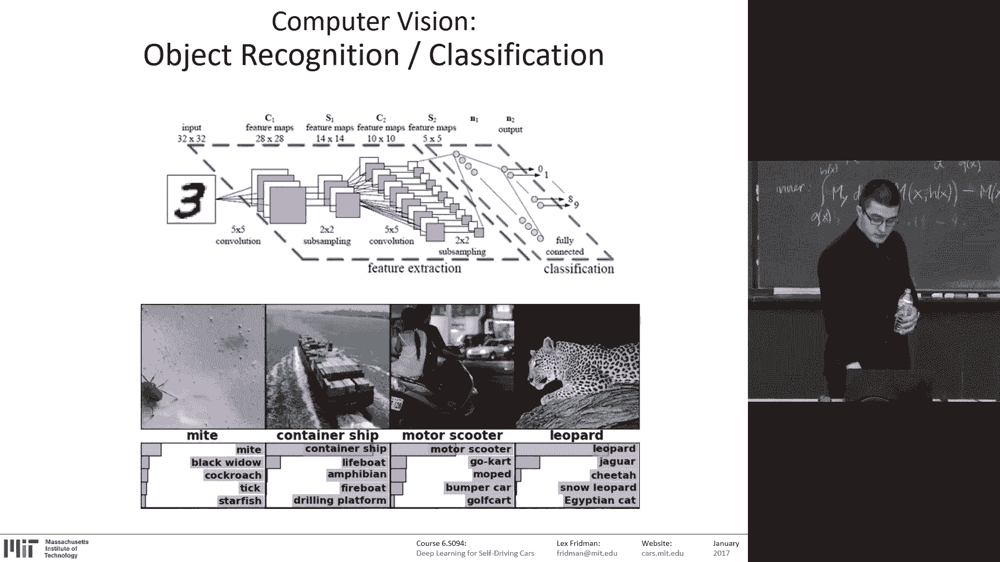

Now， you can use the same exact operation by chopping off。The fully connected layer at the end。

 and as opposed to mapping from image to a prediction of what's contained in the image。

 you map from the image to another image。And you can train that image to be one that gets。Excited。

Spatly。Meaning it gives you a high close to one value for areas of the image that contain the object of interest。

And then a low number for areas of image that are unlikely to contain that image。And so from this。

 you can go on the left， an original image of a woman and a horse。

To a segmented image of knowing where the woman is and where the horse is and where the background is。

The same process can be done for detecting the object。

So you can segment the scene into a bunch of interesting objects。Candidates。For interesting objects。

 and then go through those candidates。1 by one and perform the same kind of classification as in the previous step。

Where it's just an input is an image， and the output is a classification。

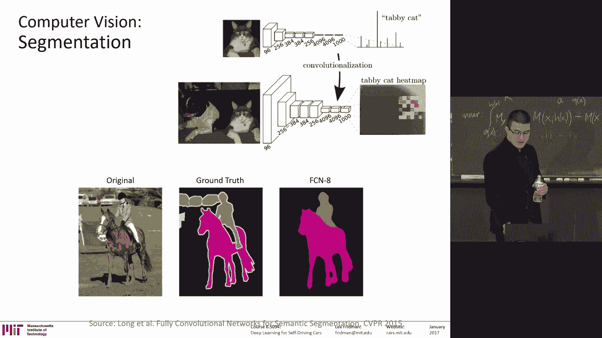

And through this process of hopping around an image。

 you can figure out exactly where is the best way to segment the cow out of the image。

 It's called object detection。Okay， so how can， how can these magical convolution neural networks help us in driving。

😊，This is a video。Of the forward roadway。From a data that we'll look at。

That we've collected from O Tesla。 But first， let me look at driving。Briefly。

The general driving task。From the human perspective。On average。

 an American driver in the United States drives 1010000 miles a year。A little more for rural。

 a little less for urban。There is about 30，000 fatal crashes and 32 plus。Sometimes this high as 38。

000 fatalities a year。This includes car occupants。Pedestrians。Bcyclists。And motorcycle riders。

This may be a surprising fact， but。In a class on self driving cars。

 we should remember that so ignore the 59。9% that's other。

The most popular cars in the United States are pickup trucks。Forour F1 series， Shevy Silvervaaddo。

 Ram。It's an important point that。We're still married to our。To wanting to be in control。And so。

One of the interesting cars that we look at。And the car that is the data set that we provide to the class is collected from is a Tesla。

It's the one that comes at the intersection of the For F 150 and the cute little Google self drivingriving car on the right。

It's fast。 It allows you to have a feeling of control。

 but it can also drive itself for hundreds of miles on the highway， if need be。

It allows you to press a button and the car takes over。

It's a fascinating trade off of transferring control from the human to the car。

It's a transfer of trust。And it's a chance for us to study the psychology。

Of human beings as they relate to machines。At 60 plus miles an hour。

In case you're not aware a little summary of human beings。We're distracted things。Would like to text。

 use the smartphone。Watch videos， groom， talk to passengers。Eat， drink。Texting。

169 billion texts were sent in the US every single month。In 2014。On average， five seconds。

Our I spent off the road while texting。5 seconds。That's the opportunity for automation to step in。

More than that， there's what NTA refers as the4D's。Drunk， drug， distracted and drowsy。

 each one of those opportunities for automation to step in。Dtrong driving。

Stands to benefit significantly from automation， perhaps。So the miles， let's look at the miles。

 the data， there's 3 trillion，3 million。Million。3 million million miles driven every year。

And Tesla Autopilot。Our case study for this class and as human beings。

Is driven on full autopilot mode。 So it driving by itself。300 million miles as of December 2016。

And the fatalities for。Human controlled vehicles。Is one in 90 million。

 so about 30 plus000 fatalities a year。And currently in Tesla， onto Tesla Autopilot。

 there's one fatality。There's a lot of ways you can tear that statistic apart。

 but it's one to think about。Already， perhaps。Automation results in safer driving。The thing is。

 we don't understand automation。Because we don't have the data。 We don't have the data。

On the forward roadway video， we don't have the data on the driver。

And we just don't have that many cars on the road today， that drives themselves。

So we need a lot of data。We'll provide some of it to you in the class。

And as part of our research at MI I T， we're collecting huge amounts of it。

Of cars driving themselves。And what we collecting that data is how we get to understanding。

So talking about the， the data。And what will world。Be doing training our algorithms on。

Here is a Tesla Model S， Model X， we have instrumented 17 of them。

Have collected over 5000 hours and 70000 miles。 And I'll talk about the cameras that we put in。

In them。We're collecting video of the forwardward roadway。

 This is a highlight of a trip from Boston to Florida of one of the people driving in Tesla。😊。

What's also shown in blue is the amount of time that Apolllo was engaged。Currently zero minutes。

 and then it grows and grows。For prolonged periods of time， so hundreds of miles。

 people engage autopilot。Out of 1。3 billion miles driven in Tesla，300 million are in autopilot。

You do the math， whatever that is， 25%。So we are collecting data of the forward roadway of the driver。

 We have two cameras on the driver。 what we're providing with a class is。

Epics of time of the forward roadway。For privacy considerations。Cameras use the record。

Are you your a regular webcam？The workhor of the computer vision community。The C920。

And we have some special lenses on top of it。 Now， what's special about these webcams。

Nothing that costs 70 bucks can be that good， right。

The what's special about them is that they do on board compression。And allow you to。

Collect huge amounts of data， and use reasonably sized。

Storage capacity to store that data and train your algorithms on。So what on the。

Soll driving side do we have to work with。How do we build a self driving car？Theres the sensors。

Radar， Liar， vision。Audio。All looking outside， helping you detect the objects in the external environment to localize yourself and so on。

 And there's a sensorus facing inside， visible light camera， audio again。

 and infrared camera to help detect pupils。

So we can decompose the cell driving car task into four steps。Looccalization。Answering， where am I。

Seecen understanding。Using the texture of the information of the scene around。

To interpret the identity of the different objects。In the scene。

And the semantic meaning of those objects， of their movement。There's movement planning。

 Once you figured all that out， find， found all the pedestrians， found all the other cars。

 How do I navigate。Through this maze， a clutter of objects in a safe and legal way。

And there's driver state， how do I detect using video or other information？

Video of the driver detect information about their emotional state or their distraction level。

 is question。Yes， that's a real time figure from Lidar。 Lidar is the sensor that provides you the。

 the 3D point cloud。Of the external scene。So Lidar is a technology used by。

Most folks were working with cell driving cars to give you a strong ground truth of the objects。

It's probably the best sensor we have for getting 3D information。

The least noisy 3D information about the external environment。Question。

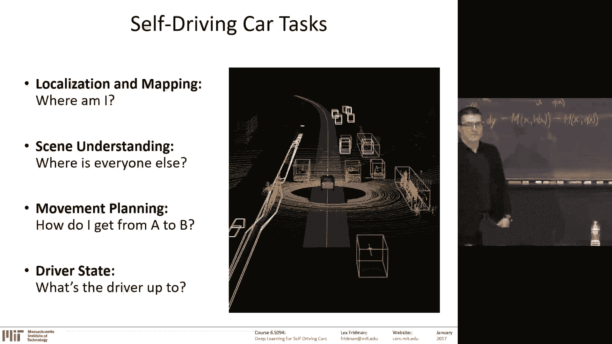

So autopilot is always changing， one of the most amazing things about this vehicle is that the updates to autopilot come in the form of software。

 so the amount of time it's available it changes， has become more conservative with time。But in this。

 this is one of the earlier versions， and it shows the second line。In yellow。

 it shows how often the autopilo was available， but not turned on。

 So it was the total driving time was 10 hours。 Autopilo was available 7 hours and was engaged an hour。

 This particular person is。A responsible drive because what you see or。Is more cautious driver。

 What you see is it's raining。 Autopilo is still available， but。

The comment was that you shouldn't trust that one fatality number as an indication of safety because the drivers elect to only engage the system when they are when it's safe to do so。

 it's totally open- there's a lot bigger arguments for that number than just that one。The， the， the。

 the question is。Whether that's a bad thing。 So maybe we can trust human beings to engage， you know。

Despite the poorly filmed YouTube videos， despite the hype in the media。

You're still a human being riding a 60 miles an hour in a metal box with your life and the line。

 You won't engage the system。Unless， you know， it's completely safe。

 unless youve built up a relationship with it， it's not all the stuff you see where a person gets in the back of a Tesla and starts sleeping or just playing chess or whatever。

 That's all for YouTube。 The reality is， when it's just you in the car。

 It's still your life in the line。 And so you're gonna do the responsible thing。

 Unless perhaps you're a teenager and so on。 But that never changes， no matter what you're in。そ。

The question was， what do you need to see or sense about the external environment to be able to successfully drive。

 do you need lane markings do you need other what are the landmarks based on which you do the localization of the navigation。

 and that depends on the sensors。So with a Google self driving car in sunny California。

 it depends on Lidar to， in a high resolution way， map the environment。

In order to be able to localize itself based on Lidar and Lidar， now。

 I don't know the details of exactly where Ldar fails。But it's not good with rain。

 It's not good with snow。It's not good when the environment is changing。

 So what snow does is it changes the visual， the appearance。

 the reflective texture of the surfaces around us human beings are still able to figure stuff out。

 but a car that's relying heavily on LiDar won't be able to localize itself using the landmarks previously as detected because they look different now with snow。

Computer vision can help us。With lanes or。Following a car。

 the two landmarks that we use staying in a lane is following a car in front of you or staying between two lanes。

 That's the nice thing about our roadways is they're designed for human eyes so you can use computer vision for lanes and for cars in front to follow them。

And there is radar that's a crude but reliable source of distance information that allows you to not collide with metal objects。

So all of that together， depending on what you want to rely on more， gives you a lot of information。

 The question is， when it's the domestic complexity。Of real life occurs。

 how reliable will it be in the urban environment， and so on。So， localization。

How can deep learning help， So first， let's just quick。Summary of visual oometry。 It's using。

A monocular or stereo input of video images。To determine your orientation in the world。

The orientation in this case of a vehicle to in the frame of the world。

And all you have to work with is a video of the forward Worldway。And with stereo。

 you get a little extra information of how far away different objects are。

And so this is where one of our speakers on Friday will talk about his expertise， Slam。

 simultaneous localization and mapping。 This is a very well studied and understood problem。

Of detecting unique features in the external scene。

And localizing yourself based on the trajectory of those。Those unique features。

 when the number of features is high enough， it becomes an optimization problem。You know。

 this particular lane moved a little bit from frame to frame， you can track that information。

And fuse everything together in order to be able to estimate your trajectory through the three dimensional space。

You also have other sensors to help you out， you have GPS。Which is。Pretty accurate， not perfect。

 but pretty accurate。 It's another signal to help you localize yourself。You also have IM U。

 Acceleroerometer tells you the your acceleration。

From the gyrocope at the accelerometer， you have the6 degree of freedom of movement information about how。

The moving object， the car。I's navigating through space。So you can do that。

You could do using the old school way of optimization。Given a unique set of features。

 like Sift features。And that step involves。With stereo input。On distorting and rectifying the images。

 you have two images。 You have to， from the two images， compute the depth map。

 So for every single pixel， Comp the your estimate， best estimate of the depth of that pixel。

 the three dimensional。Position， relative。To the camera。Then you compute。

 that's where you compute the disparity map。 That's what that's called the。

From which you get the distance。Then you detect。Unique， interesting features in the scene。

 Sift is a popular one。Has a popular algorithm for detecting unique features。 and then you over time。

 track those features。 and that tracking is what allows you to。

 through the vision alone to get information about your trajectory through the three dimensional space。

And you estimate that trajectory。There's a lot of assumptions， assumptions that bodies are rigid。

So you have to figure out if a large object passes right in front of you。

 you have to figure out that that what that was。You have to figure out the mobile objects in the scene。

And those that are stationary。Or you can cheat what we'll talk about。And do it using neural networks。

 end to end。Now， what does end to end mean， And this will come up a bunch of times throughout this class and today。

 end to end means。And I refer to it as cheating because it takes away a lot of the hard work of hand engineering features。

You take the raw input of whatever sensors。In this case。

 it's taking stereo input from a stereo vision camera， so two images。

 a sequence of two images coming from a ste vision camera。And the output。

Is a estimate of your trajectory through space。 So as opposed to doing the hard work of slam or detecting unique features of localizing yourself。

 of tracking those features and figuring out what your trajectory is， you simply train the network。

With some ground truth that you have from a more accurate sensor like LdDar。

And you train it on a set of inputs， their are stereo vision inputs。

 and outputs is the trajectors to space。You have a separate convolution in neural networks for the velocity and for the orientation。

And this works pretty well。Unfortunately， not quite well。And John Lennon will talk about that。

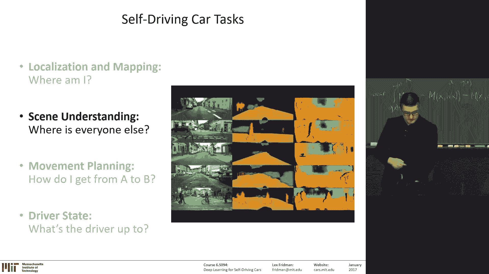

SM is one of the places where deep learning has not been able to outperform the previous approaches。

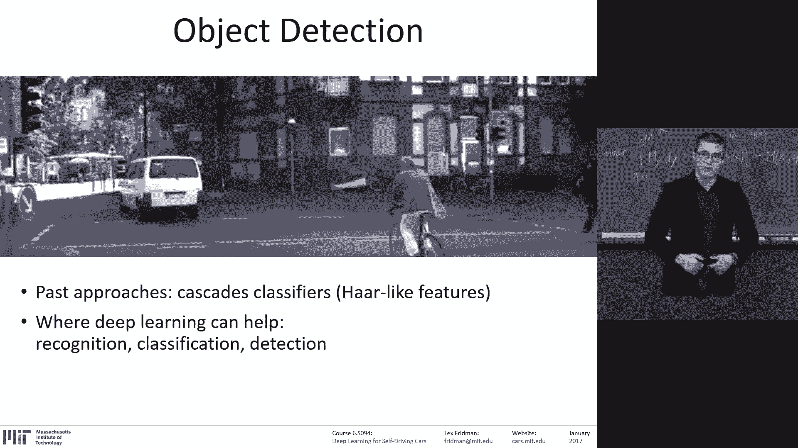

Where where deep learning really helps is the scene understanding part。

Is interpreting the objects in the scene。It's detecting the various。Parts of the scene。

 segmenting them and with optical flow， determining their movement。

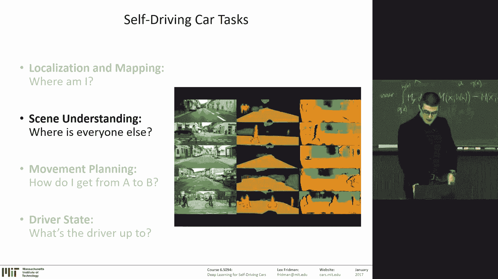

So previous approaches for detecting objects。Like the traffic signal classification detection that we have the TensorF tutorial for。

Or to use。P like features or other types of features that are hand engineered from the images。Now。

 we can use conution neural networks to， to replace。

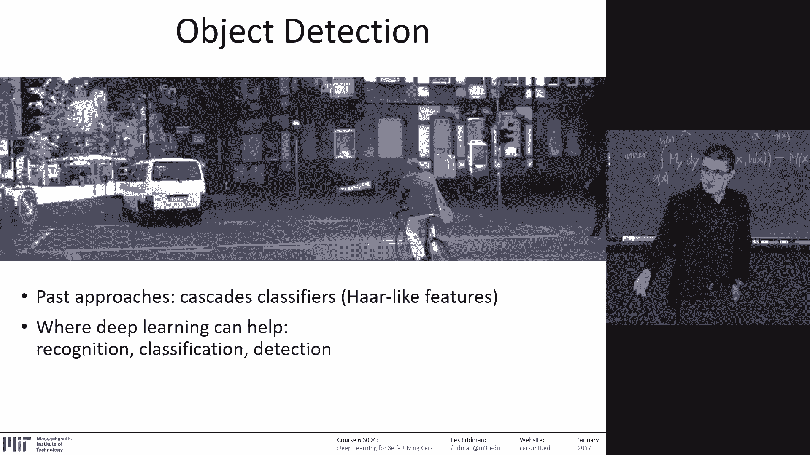

The extraction of those features。And there's a tense flow implementation。Of segmentnet。

Which is taking the exact same neural network that I talked about。 It's the same thing。

 just the beauty is you just apply similar types of networks to different problems。

 And depending on the complexity， the problem can get quite amazing performance。 In this case。

 we convolutionize in the network， meaning the output is an image。 input is an image。

 A single monocular image。 The output is a。😊，Segmented image where the colors indicate your best pixel by pixel estimate of what object is in that part。

 This has no， is not using any spatial information。 It's not using any temporal information。

 So it's it's processing every single frame separately。

 and it's able to separate the road from the trees from the pedestrians， other cars。And so on。

This is intended to lie on top。Of a radar slash Liar type of technology that's giving you the three dimensional or stereo vision。

 Three dimensional information about the scene。 You're sort of painting that scene with the identity of the objects that are in it。

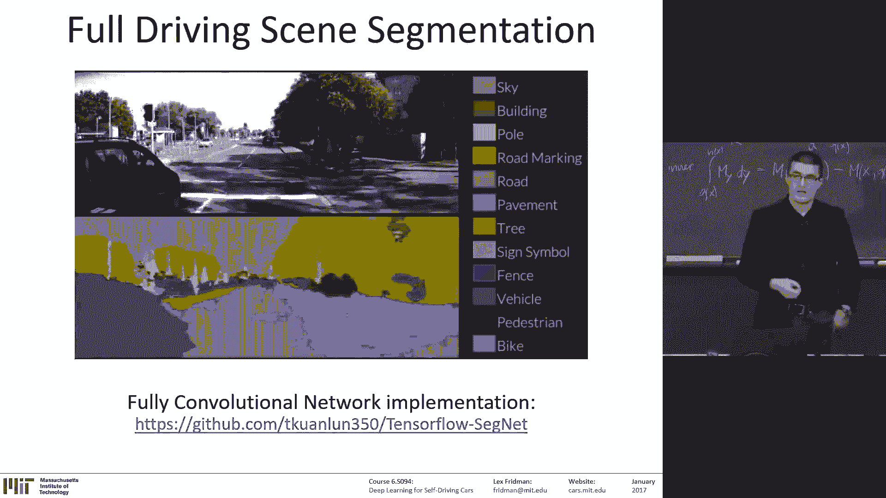

Your best estimate of it。This is something。I'll talk about tomorrow。Its recurring neural networks。

 and we can use recurring neural networks that work with temporal data。

To process video and also process audio。In this case。

We can process what's shown on the bottom is a spectrogram of audio for a wet road and a dry road。

You can look at that spectrogram as an image。And process it in a temporal way using recurren neural networks。

 just slide it across and keep feeding it to a network。

And it does incredibly well on the simple tasks， certainly。Of dry road， versus red road。

This is important， a subtle， but very important。Task。

 and there's many like it to know that the road the texture， the quality。

The characteristics of the road， wetness being a critical one。 when it's not raining。

 but the road is still wet， that information is very important。Okay， so for movement planning。

The same kind of approach。呃。On the right is work from one of our other speakers， Sirsh Kaman。

The same approach we're using for the， to solve traffic。

Through friendly competition is the same that we can use for what Chris Gerdys does with his race cars。

 for planning trajectories in high speed movement along。😊，Complex。Cve。

So we can solve that problem using optimization。Solve the control problem using optimization。

 or we can use it with reinforcement learning。By running。Tens of millions。

 hundreds of millions of time through that simulation of taking that curve and learning which trajectory doesn't both optimizes the the speed at which you take the turn and the safety of the vehicle。

Exactly the same thing that you're using for traffic。And for driver state。

 this is what we will talk about next week。Is all the fun face stuff， eyes， face， emotion。

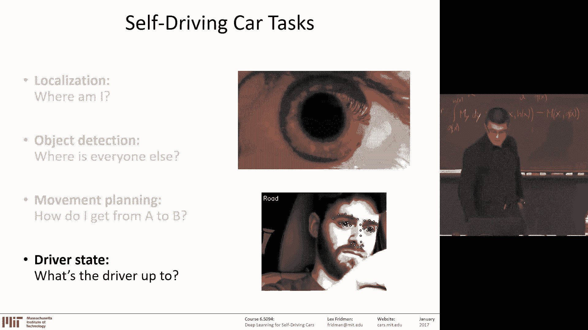

This is。We have video of the driver， video of the driver's body， video of the driver's face。

On the left is one of the TAs in his younger days。Still looks the same。There he is。

So that's in that particular case。Youre。Doing one of the easier problems。

 which is one of detecting where the head and the eyes are positioned。

 the head and eye pose in order to determine what's called。The gaze of the driver。

 where the driver is looking， glance。And so shown and we'll talk about these problems。

From the left to the right， on the left and green are the easier problems on the red or the harder from the computer vision aspect。

So on the left is body pose， head pose， the larger the object， the easier it is to detect。

 and the orientation of it is the easier to detect。And then there is pupil diameter。

 detecting the pupil。The characteristics， the position， the size of the pupil。

 and there's microcicades， things that happen at 1 millisecond frequency， the tremors of the eye。

All important information for。To determine the state of the driver。

Some are possible with computer vision。 Some are not。This is something that we'll talk about。

 think on Thursday。Is the detection of where the driver is looking。

 So with this is a bunch of the cameras that we have in the Tesla is。

Dan driving a Tesla and detecting exactly where of one of six regions。

 we've converted into a classification problem of left right rear view mirror， instrument cluster。

 center stack or forward roadway。 So we have to determine out of those six categories which direction is the driver looking at。

 This is important for driving。 We don't care exactly the X Y Z position of where the driver is looking at。

 We care that they're looking at the road or not。 Are they look at their cell phone in their lab。

 or they looking at the forward roadway。 And we'll be able to answer that pretty effectively using commvolution of neural networks。

You can also look at emotion。Using CNNs to extract。Again， converting emotion。

 the complex world of emotion into a binary problem of frustrated versus satisfied。

This is a video of drivers interacting with a voice navigation system。 If you've ever used one。

 you know， it may be a source of frustration from folks。And so this is self reported。

 This is one of the hard， you know， driver emotion。

 If you're in what's called effective computing is the field of studying emotion。

From the computational side。If youre， if you know that， if you're working in that field。

 you know that the annotation side of emotion is a really challenging one。

 So getting the ground truth of， well， okay， so this guy is smiling。So can I label that as happy？

Or he's frowning， as Zemin said， most effective computing folks do just that。In this case。

 with selfre ask people how frustrated they were on a scale of one to 10。Dan up top reported a a one。

 so not frustrated。 He's satisfied with the interaction。 and the other driver reported it as a9。

 He was very frustrated with interaction。 Now， what you notice is there is a very cold。

 stoic look on Dan's face， which is an indication of happiness。And。In the case of frustration。

 the driver is smiling。 So this is sort of a good reminder that we can't trust our own human instincts and engineering features and engineering the ground truth。

 We have to。😊，Trust the data。Trust the ground truth。

That we believe is closest reflection of the actual semantics of what's going on in the scene。Okay。

 so enter and driving， getting to the， the project and the tutorial。

So if driving is like a conversation。And， thank you。

For someone to clarify that this is a actic triumphph in Paris this video。

If if driving is like a natural language conversation that we can think of end to end driving。

As skipping the entire touring test components and treating it。

As an enter a natural language generation。So what we do is we take as input， the external sensors。

 and an output。The control of the vehicle。And the magic happens in the middle。

We replaced that entire step。Within your own network。

The Ts told me to not include this image because it's the cheesiest I've ever seen。I apologize。

Thank you。 Thank you。啊。I regret nothing。So this is to show our path to self driving cars。

 but it to explain a point that we have a large data set of ground truth。

If we were to formulate the driving task is simply taking external images。

And producing steering commands， acceleration of breaking commands。

 that we have a lot of ground truth。We have。A large number of drivers on the road every day。

Driving and therefore collecting our ground truth for us because they're an interested party in producing the steering commands that keep them alive。

And therefore， if we were to record that data， it becomes ground truth。

 So if it's possible to learn this， what we can do is we can collect data for the manually controlled vehicles and use that data to train an algorithm to to。

They control a self driving vehicle。Okay， so one of the first folks that did this is NviDdia。

 where they actually train in an external image。The image of the forward roadway。

And a neural network， a convolution neural network， a simple vanilla， convolution neural network。

 I'll briefly outline。Take an image in， take a steering， produce a steering command out。

 and they're able to successfully。😊，To some degree， learn to navigate basic turns。

 curves and even stop or make sharp turns at a T intersection。So this， this network is simple。

 There is input on the bottom， outputll up top。 The input is a 66 by 200 pixel image。RGB。

Shown on the left。Or shown on the left is the raw input。

 and then you crop it a little bit and resize it down。66 by 200。

That's what we have in the code as well。In the two versions of the code we provide for you。

 both that runs in the browser and in TensorF。It has a few layers。A few convolutional layers。

A few fully connected layers， and an output。This is a regression network。

 It's producing not a classification of cat versus dog。 It's producing a steering command。

 How do I turn the steering wheel。 That's it。The rest is magic。And we train it on。Human input。

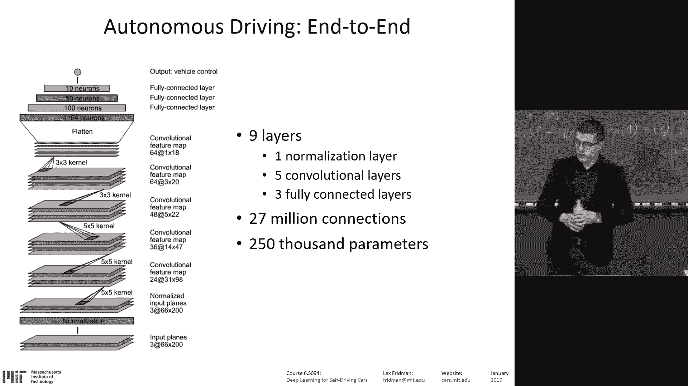

What we have here is a project。Is an implementation of this system in Comnet JS that runs in your browser。

This is the tutorial to follow and the project to， to take on。So， unlike the。Deep traffic game。

This is reality。 This is a real， real input from real vehicles。So you can go to this link。

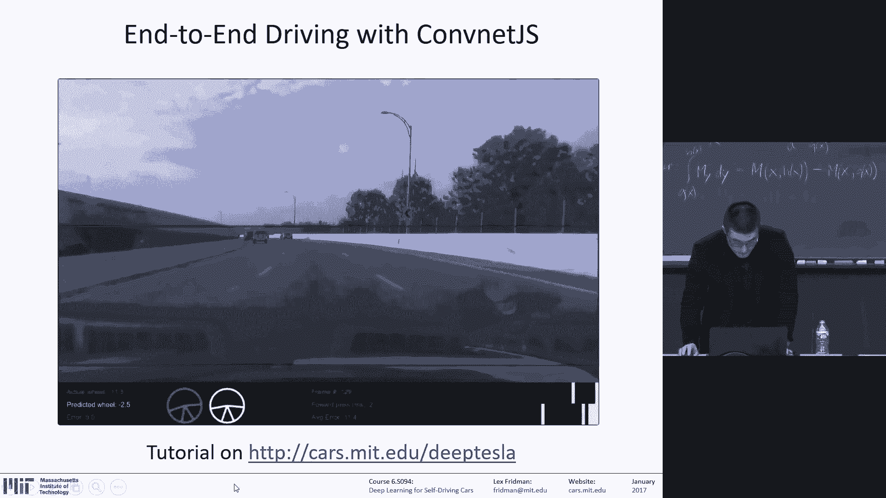

Demo went wonderfully yesterday。 So let's see， maybe two for two。

there's a tutorial and then the actual game， the actual simulation is on deep Tesla JS。 I apologize。

Everyone's going there now， aren't they。Does it work on a phone。It does。Great。Again。

 similar structure up top is the visualization of the loss function as the network is learning。

 and it's always training。Next is the input for the layout of the network。 Theres the。

The specification， the input， 200 by 66。There's a convolutional there。There's a pooling layer。

 and the output is the regression layer。A single neuron。This is a tiny version。Deep tiny， right is。

As a tiny version of。The Nvidia architecture。

And then you can visualize the operation of this network。Unreal video。

The actual wheel value that produced by the driver by the autopilot system。Is in blue。

 and the output of the network is in white。In what's indicated by green is the cropping of the image that is then resized to produce the 66 by 200 input to the network。

So once again， amazingly， this is running in your browser。

Training on real world video so you can get in your car today。

 input it and maybe teach and you'll know to drive like you。

We have the code in commnet JS and Tensorflow to do that and a tutorial。

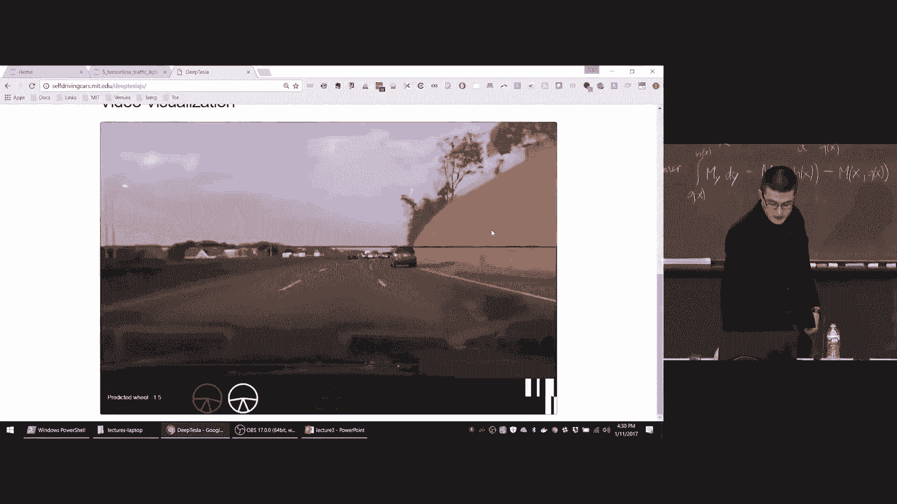

Well， let me briefly describe some of the work here。So。The input to the network is a single image。

 This is for deep Tesla JS， single image。 And the output is a steering wheel value between negative 20 and 20。

 That's in degrees。

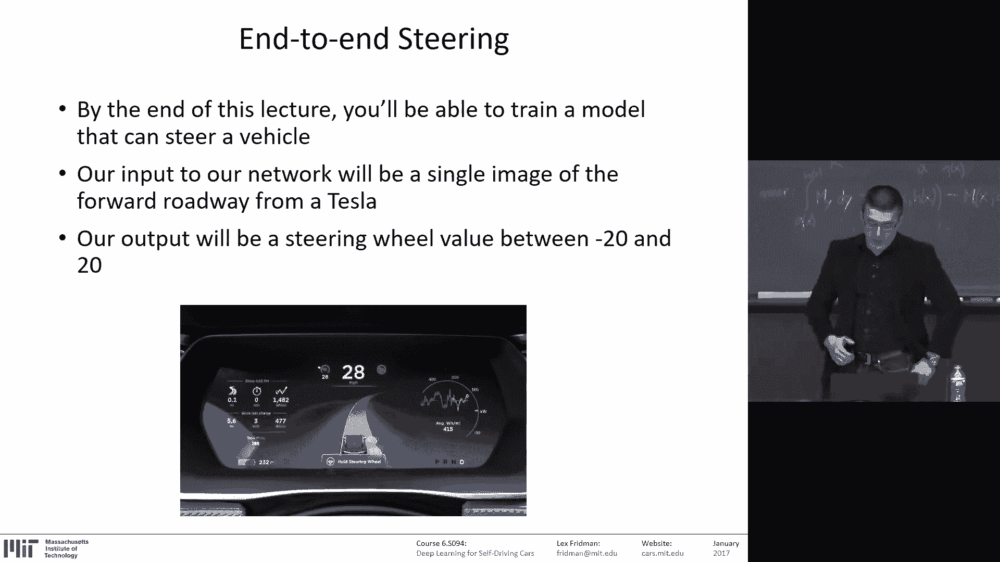

We record。Like I said， thousands of hours， but we provide publicly 10 video clips of highway driving from O Tesla。

Half are driven by autopilot， half are driven by human。

The wheel value is extracted from a perfectly synchronized。Canant。

 we are collecting all of the messages from can。Which contains steering wheel value。

 And that's synchronized with the video。 We crop， extract the window， the green 1 I mentioned。

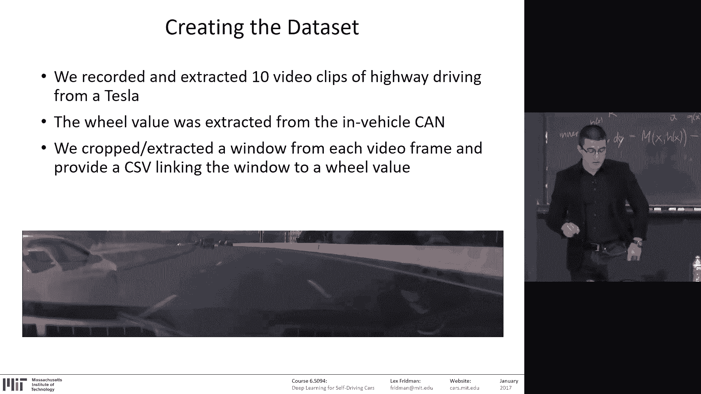

And then provide that as input to the network。So this is a slight difference from deep traffic with the red car weaving through traffic because there's the messy reality of real world lighting conditions。

😊，And your task， for the most part， in this simple steering task。Is to stay inside the lane。

And say the lane markings。In an end to end way， learn to do just that。

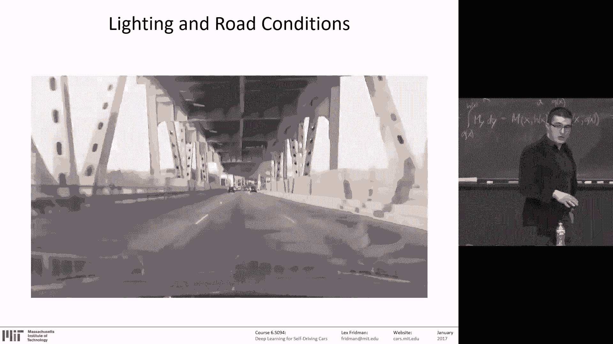

So Comnet JS is a JavaScript implementation of CNNs of convolution neural networks。It supports。

Really， arbitrary networks。I mean， all neural networks are simple。

 but because it runs in jascript it's not utilizing GPU。The larger the network。

 the more it's going to be weighed down computationally。Now， unlike the previous。

 unlike deep traffic， this isn't the competition。 but if you are a student registered for the course。

 you still do have to submit the code。 You still have to submit your own， your own car。

As part of the class，Question。So the question was the amount of data that's needed？

Is there general rules of thumb for the amount of data needed for a particular task certainly in driving。

 for example？It's a good question。You generally have to， like I said。

 and you'll know where' the good memors。 So you have to just have。

Every case represented in the training set that you're interested in。As much as possible。

 So that means。In general， if you want a picture， you want to classify difference in cats and dogs。

You want to have at least 1000 cats and 100 dogs， and then you do really well。

The problem with driving is twofold。 One is that most of the time driving looks the same。

And the stuff you really care about is when driving looks different， it's all the edge cases。

So what we're not good with the neural networks is generalizing from the common case to the edge cases to the outliers。

 So avoiding a crash， just because you can stay in the highway for thousands of hours successfully。

 doesn't mean you can avoid a crash when somebody runs in front of you on the road。

And the other part we're driving is the accuracy you have to achieve is really high。 So for。

For Ca versuss dog， life doesn't depend on your error。

On your ability to steer a car inside of the lane， youd better be。Very close to 100% accurate。

There's a box for designing the network。There's a visualization of the metrics measuring the performance of the network as it trains。

There is a visualization， a layer visualization of what features the network is extracting at every convolutional layer and every fully connected layer。

There is ability to restart the training。Visualize the。Visualized in network。

 performing on real video。There is。The input layer。The convolutional layers。

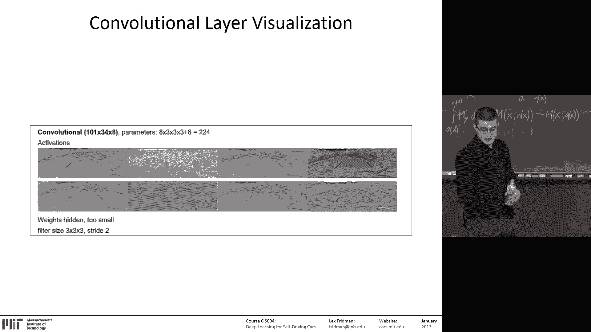

The video visualization。

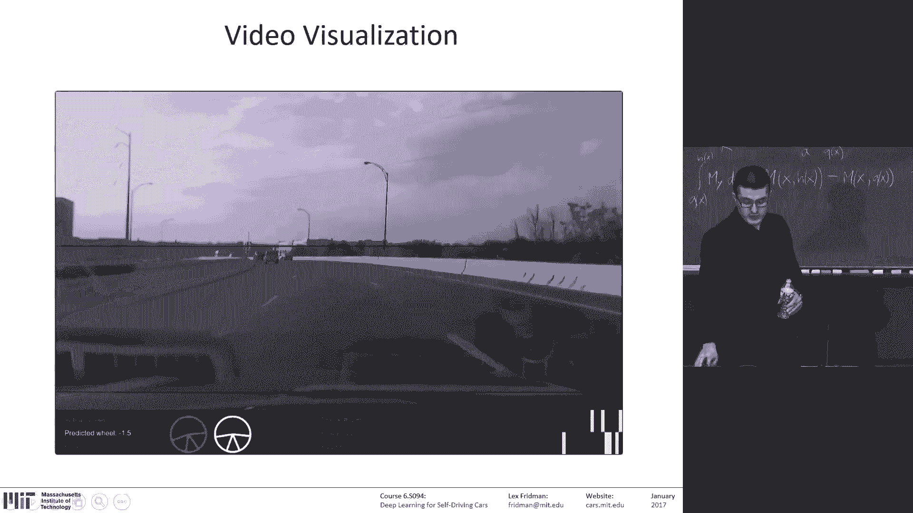

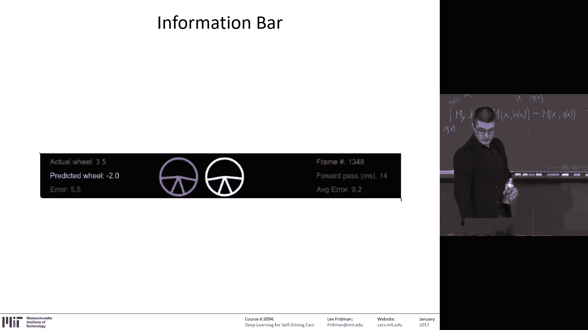

An interesting tidbit on the bottom right is a barcode。That will has ingeniously designed。

How do I clearly explain why this is so cool， It's a way。To through video。

 synchronize multiple streams of data together。 So it's very easy for those who have worked with multimodal data。

 where there are several streams of data for the for them to become unsynchronized。

 especially when a big component of training in neural network is shuffling the data。

 So you have to shuffle the data in clever ways。 So you're not overfitting any one little aspect of the video and yet maintain the data perfectly synchronized。

 So what you did is doing the hard work of connecting the the steering wheel and and the video is actually putting the steering wheel on top of the video as a barcode。

😊，The final result is you can watch the network operate。And over time， it learns more and more。

To steer correctly， I'll fly through this a little bit in the interest of time。

 Just kind of summarize some of the things that you can play with in terms of tutorials and let you guys go。

This is the same kind of process and driving with Tensorflow。 So we have code available in Github。

We just put up on my GiHub on deep Tesla that takes in a single video or an arbitrary number of videos。

 trains on them and produces the visualization that compares the steering wheel。

 the actual steering wheel， and the predicted steering wheel。The steering wheel。

 when it agrees with the human driver or the autopilot system lighting up as green and when it disagrees。

 lighting up as red， hopefully not too often。Again。

 this is some of the details of how that's exactly done in TensorF。

 This is vanilla convolution neural networks， specifying a bunch of layers。Convolutional layers。

 a fully connected layer， train the model， so you iterate over the batches of images。

Run the model over a test set of images。And get this result。We have a tutorial。

Or IPyon notebook in a tutorial up。This is perhaps the best way to get started with convolution neural networks in terms of our class is looking at the simplest。

Iage classification problem of traffic light classification。

 So we have these images of traffic lights。We did the hard work of detecting them for you。

So now you have to figure out you have to build a composition network。 It gets。

ItFures out the concept of color and gets excited when it sees red， yellow or green。

If anyone has questions。Welcom those。 You can stay after class if you have any concerns with Docker with。

Tenssorflow with。How to win traffic， deep traffic， just stay after class or come by Friday。

5 to seven， see you guys tomorrow。

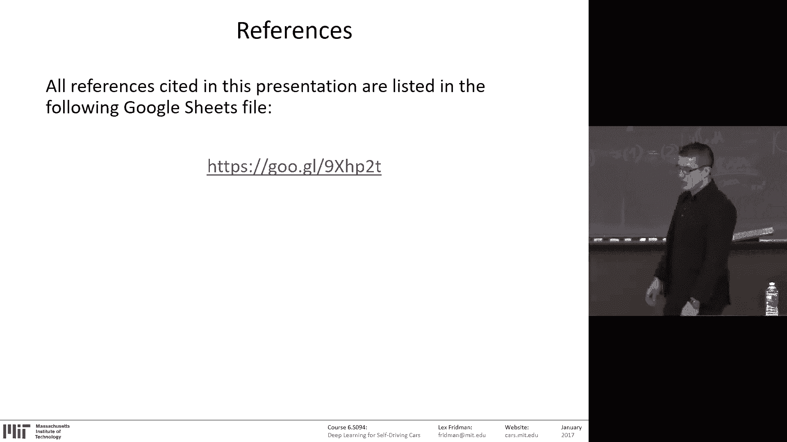