# 【英语字幕+资料下载】MIT 6.S094 ｜ 深度学习与自动驾驶(2018·完整版) - P8：L8- 循环神经网络与时序驾驶操纵 - ShowMeAI - BV1Y34y1i7vC

All right， so we've talked about。Regular neural networks， fully connected neural networks。

 we've talked about convolutional neural networks that work with images。

 we've talked about reinforcement， deeper reinforcement learning。

 where we plug in a neural network into a reinforcement learning algorithm。

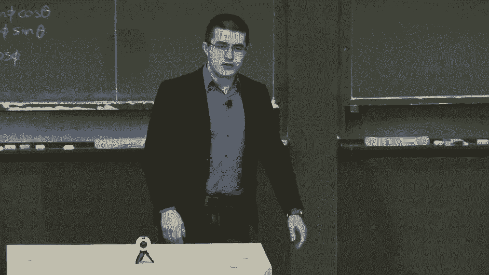

When an agent， when a system has to not only perceive the world。

 but also act in it and collect reward。 And today， we'll talk about。

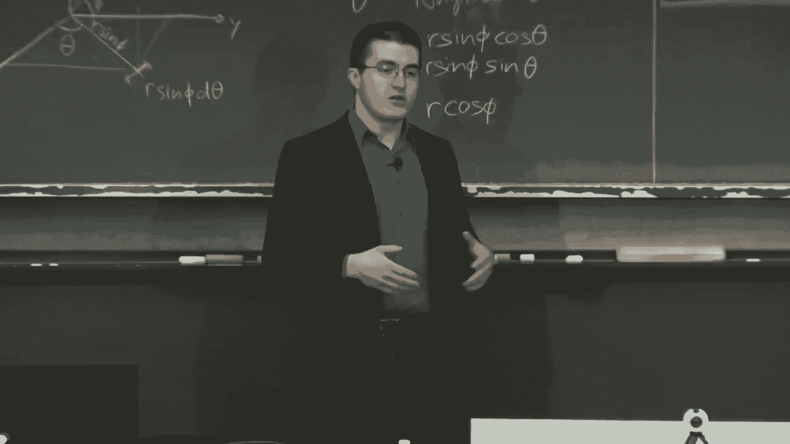

Perhaps the least understood， but the most exciting neural network out there。

Blaor of neural network is recurring neural networks。

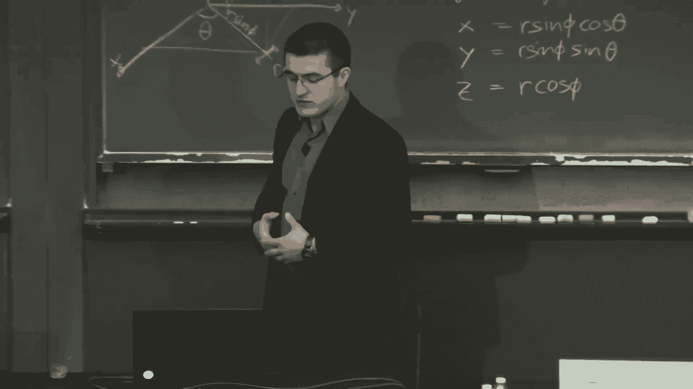

So first， administrative stuff。There's a website， I don't know if you heard carss。mt。edu。

 where you should create an account if you're a registered student， that's one of the requirements。

 you need to have an account if you want to get credit for this。

You need to submit code for Deep traffic JS and deep Tesla JS and for deep traffic。

You have to have a neural network that drives faster than 65 m an hour。

 If you need help to achieve that speed， please email us。We can drop， we can give you some hints。

For those of you who are old school S&L fans， there's the deep thoughts section now in the profile page where we encourage you to talk about the kinds of things youve tried in deep traffic or any of the other deep Tesla or any of the work you've done as part of this class for deep learning。

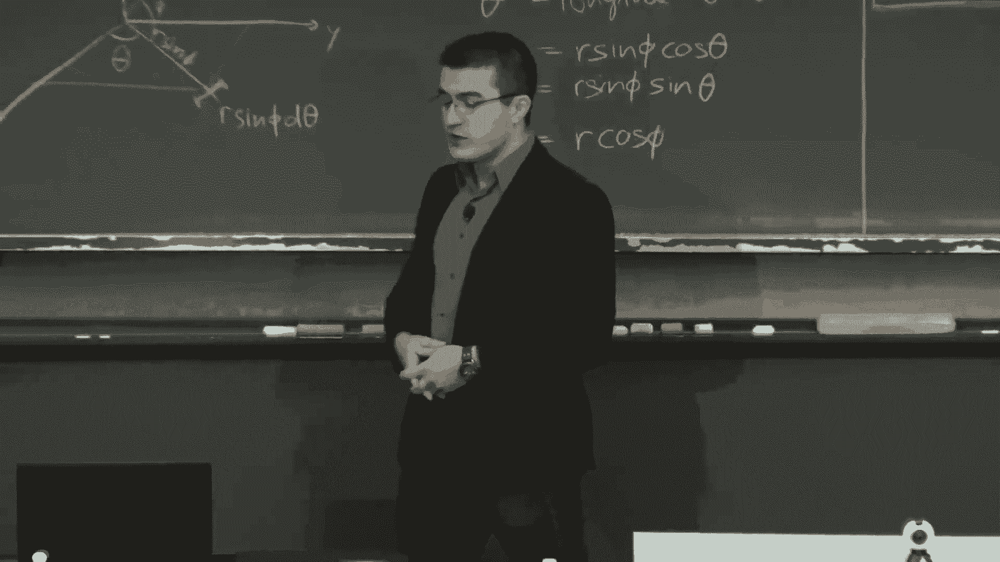

Okay。We've talked about the the vanilla neural networks on the left。

 The vanilla neural network is the one where it's computing。

 It's approximating a function that maps from one input。To one output。

 an example is mapping images to the number that's shown in the image for imagenet。

 it's mapping an image to what's the object in the image。It could be anything。 now， in fact。

Convolution neural networks can operate on audio。 You could give it a chunk of audio。

5 second audio clip。 That still counts as one input because it's fixed size。

 as long as the size of the input is fixed， That's one。Chunk of input。

And as long as you have ground truth that maps that chunk of input to some output， ground truth。

That's a vanilla neural network， whether it's a fully connected neural network or a convolutional neural network。

Today， we'll talk about the amazing。The mysterious recurring neural networks。

They compute functions from one to many。From many to one， from many to many。Also， bidirectional。

What does that mean， they take his input sequences。Time series， audio。Video。

 whenever there's a sequence of data and that temporal dynamics that connects the data is more important than the spatial。

Content of each individual frame。So when there's a lot of information being conveyed in the sequence。

In in the temporal change of whatever that type of data is。

 that's when you want to use current neural networks。Like speech， natural language。Audio。

 and the power of this is that for many of them of a current neural network。

 where they really shine is when the size of the input。Is variable。 So。

 you don't have a fixed chunk of data that you're putting in。 It's， it's variable input。

 and the same goes for the output。So you could give it a sequence of speech。

Several seconds of speech。And then the output is。A single label of whether the speaker is male or female。

That's many to one。You can also do many to many。Translation。

You can have natural language put into the network。In Spanish and the output is in English。

Machine translation。 That's many to many。And that many to many doesn't have to be mapped directly into same size sequences。

So for video， the sequence size might be the same。 You're labeling every single frame。 you put in a。

A5 second clip。Of somebody playing basketball。 and you can label every single frame。

 counting the number of people in every single frame。

 That's many to many when the size of the input size， the output is the same。Yes， question。

The question was， are there any models where there's feedback from output and input。

 and that's exactly what recurrent neural networks are， is it it produces output？

And it copies that output and loops it back in。That's exactly。

 that's exactly almost the definition of our current neural network。

 There's a loop in there that produces the output and also takes that output as input once again。

And so there's， there's also many to many where the sequences don't align like machine translation。

 the， the the size of the output sequence might be totally different than the input sequence。

 We'll look at a lot of cool applications， like。You can。Start a song。

 so learn on the audio of a particular song and have the re you'll network continue that song after a certain period of time。

 so you can learn to generate sequences of audio of natural language of video。O。

I know I promise them many equations， but this is。So beautifully simple that we have to cover back propagation。

It's also the thing that if you're a little bit lazy and you go on the Internet and start using the basic tutorials for Tensorflow。

 you ignore how back propagation work at your peril。You kind of assume it just works。

 I give us some input， some outputs。 It it's like Lego pieces。 that can assemble them。

 like you might have done with deep traffic， a bunch of layers， put them together。 and then just。

Press train and back propagation is the mechanism that neural networks currently the best mechanism we know of that is used for training。

 So we need to understand。Simple power of back propagation， but also the dangers。Summary。

Say I'll put the top of the slide， there's an input to the network as an image。

 there's a bunch of neurons， all with differentiable， smooth activation functions on each neuron。

And then。As you pass through those activation functions。Taking the input。

 pass it through the net of differentiable compute nodes。 You produce an output。 and that output。

You also have a ground truth that correct the truth。That you hope。

 but you expect the network to produce。 And then you can look at the difference between what the network actually produced and what you hope to will produce。

 And that's an error。 And then you back or propagate that error， punishing or rewarding the。The。

 the weights， the parameters of the network that resulted to in that output。

Let's start with a really simple example。There's a function。That takes his input。Up on top。

3 variables， X， Y， and Z。The function does two things。 It adds x and Y。

 and then it multiplies that sum by Z。And then we can formulate that as a circuit。Circuit of gates。

Where there's a plus gate and a multiplication gate。And let's take some inputs shown in blue。

 Let's say x is negative 2。 Y is 5。 Z is negative 4。

And let's do a forward pass through this circuit to produce the output。So negative 2 plus 5 equals 3。

Q is that intermediate value。3。This is so simple。And so important to understand that I just want to take my time through this because everything else about neural networks just builds on these concepts。

 right。Okay， so the the ad gate produces Q in this case is 3。 and then three times negative 4 is 12。

 That's the output。 The output of the circuit of this。Network， if you think of it as such。

 is negative 12。And so the forward pass is shown in blue。

 The backward pass will be shown in red in a second here。

 So what we want to do is what would make us happy。

 What would make F happy is for the output to be as high as possible。😊，Negative 12 is so。

 so we could do better。 So how do we teach it。How do we adjust X， Y， and Z？

So said it produces a higher。F。Makes us happier。 Okay， let's， let's start backward。The backward pass。

We make the gradient on the output one， meaning we want this to increase。 we want F to increase。

 That's how we encode our happiness is we want it to go up by one。And in order to then propagate。

That function that that fact that we want the F to go up by one。

 we have to look at the gradient on each one of the gates。What's a gradient？It's a。

Partial derivative。With respect to its inputs。The， the partial derivative of the output of a gate with respect to its inputs。

If you don't know what that means， it's just。How much does the output change？

When I change the inputs a little bit， what is the slope of that change。

 If I increase x for the first function of addition。F of x， y equals x plus y。

 if I increase x by a little bit， what happens to F， if I increase y by a little bit。

 what happens to F。So taking a partial derivative of those with respect to X and Y。

 you just get a slope of one。 So when you increase， X， F increases linearly， same with y。

Mulplication is a little trickier。When you increase x。F increases by y。

So the partial derivative of F。With respect to x is y。

 The partial derivative of F with respect to Y is x。So if you think about it， what happens is。

The gradients， when you change x。The gradient of change doesn't care about X。It cares about why。

So it's flipped。So we can back propagate that one， the indication of what makes us happy。Backwards。

And that， that's done by computing the local gradient。For Q。

So the partial derivative F with respect to Q， that intermediate value。

That gradient will be negative4。 It will take the value of Z。 As I said， it's a multiplication gate。

 It will take the value of Z。And assign it to the gradient。

And the same for the partial derivative of F with respect to Z， it'll assign that to Q。

 the value of the forward pass from the Q。 So there's a 3 and the negative 4 in the forward pass in blue。

 And then that's flipped， negative 4 and 3。On the backward pass， that's the gradient。

And then we continue in the same exact process。But， wait。So what makes all of this work。Is。

 is the chain rule。It's magical。So what it allows us to do is to compute the gradient。Okay。

The gradient of an F with respect to the inputs， X， Y， Z， we don't need to construct the。

 the giant function。 that is the。The partial derivative of F with respect to X and Y and Z。

Alytically， we can do it step by step， back propagating the gradients。

 We can multiply the gradients together as opposed to doing partial derivative of F with respect to X。

 We have just the intermediate， the local gradient of F with respect to Q and of Q with respect to X and multiply them together。

So instead of computing the gradient of the that giant function x plus y equals time Z。 In this case。

 it's not that giant， but it gets pretty giant when neural networks， we just go step by step。

 look at the first function， simple addition， Q equals x plus y。 and the second function。

 multiplication， F equals Q times Z。So。The gradient on x。And why。The partial derivative。

Of F with respect to X and Y is computed by multiplying the gradient on the output， negative 4。

Times the gradient and the inputs， which， as we talked about when it's。

 when the operation is addition， that's just one。 So it's negative four times 1。That means。

What does that mean， Let's interpret those numbers。You now have gradients on X， Y， and Z。

The gradient of the partial derivative of F with respect to X， Y， Z。 That means the So for X and Y。

 it's negative 4 for Z， it's 3。 That means in order to make F happy。We have to decrease。

They are inputs that have a negative gradient。And increase the the inputs that have a positive gradient。

 The negative ones are X and Y。 The the positive is z。Hopefully。

 I don't say the word beautiful too many times in this presentation。 but this is very simple。

 beautifully simple。呃。Because this gradient is a local worker。It， it propagates for you。

 has no It has no knowledge of the broader。Happiness of F。

It just propagates the it computes the gradient between the output and the input。

 and you can propagate this gradient。Based on in this case， F a gradient of1。

 but also just the error instead of one we could have on the output。

 the error is the measure of happiness， and then we could propagate that error backwards。

 These gates are important because you can break down almost every operation we could think of that we work with in neural networks into one of several gates like this and。

The most popular are three， which is addition multiplication and the the max operation。

 So for addition， what you do is you ignore the， So， okay。

 the process is you take a forward path the network。So we have a value on every single gate。

And then you take a backward pass。And through the back path， you compute those gradients。

For an ad gate， you equally distribute the gradients on the output to the input。

 So when the the gradient on the output is negative 4， you equally distribute it to negative。

 to negative 4。And you ignore the forward pass value。

So that three is ignored when you back propagate it。On the multiplication gate， on the multiply gate。

It's trickier。You switch the forward Pass values。So if you look at F， that's。Multiply gate。

The forward pass values are switched。And multiplied by the value of the gradient in the output。

If it's confusing， go through the slides slowly。Itll， it'll make a lot more sense。Hopefully。

One more gate， there's the MA gate， which takes the inputs and produces its output。

The value that is larger。And when computing the gradient of the max gate。It。Distributes the gradient。

Similar to the adgate。But to only one。To， to， to only one of the inputs。The largest one。 So it。

 unlike the ad gate， pays attention to the input， the the input values on the forward pass。All right。

Lots of numbers。 But the whole point here is it's like， it's really simple。

What a neural network is just a simple collection of these gates。And there， you take a forward pass。

You calculate some kind of function on the end， a gradient at the very end。

 and you propagate that back。So usually from neural networks， that's an error function。

A loss function， Ob function。Cost function， all the same， all the same word。So that's the。

 that's the sigmoid function there。 F when， when you have three weights， W 0， W 1。

 W2 and x 2 inputs x 0 x x 0 x 1， that's gonna be the sigmoid function。

 That's how you compute the output。Of。啊。Of the neuron。 But then you could decompose that neuron。

 You could separate it all into just a set of gates like this。 addition， multiplication。

There's exponential in there in the division。 they're all very similar。

 And you repeat the exact same process if the， the。There's five inputs。

 There's three weights and two inputs， x 0 x1。You take a forward path。Through this circuit。

In this case， again， you want it to increase so that the the gradient on the output is one。

 and you back propagate that gradient of one to the inputs。Now with neural networks。

 there's a bunch of parameters that you're trying to through this process modify。

And you don't get to modify the inputs。You get to modify the weights along the way and the biases。

 The inputs are fixed， The outputs are fixed。 the outputs that you hope the network will produce。

 What you're modifying is the weights。 So I get to try to adjust those weights and such that in the direction of the gradient。

That's the task of back propagation。The main way that neural networks learn。

As we update the weights and the biases。To decrease the loss function。The lower the loss function。

 the better。So in this case， you have。3 inputs on the top left， the simple network， three inputs。

3 weights on each of the inputs。 There's a bias on the node。B， and it produces an output。诶。

And that little symbol。This is indicating a sigmoid function。And loss。

Is computed as y minus a squared。Divided by2。Where why is the ground truth。

 the output that you want to be the network to produce。

And that loss function is back propagated in exactly the same way that we described before。Alright。

 so the subtasks that involved in this update of weights and biases。

Is that the forward pass computes the network output at every neuron。 And then， the finally。

 the output layer。Computes the error。 The difference between A and B。And then。

Backward propagates the gradients。Instead of one on the output， itll be the error on the output。

 and you back propagate it。And then once you know the gradient。

 you adjust the weights and the biases in the direction of the gradient。

Are actually the opposite of the direction of the gradient because you want the loss to decrease。

And the amount by which you make that adjustment。It's called the learning rate。

The learning rate could be the same across the entire network。

 or it could be individual to every weight。And the process。Of adjusting the weights and biases。

 is just optimization。It's learning is an optimization problem。 You have an objective function。

 and you're trying to minimize it。 And your variables are the parameters， the weights and biases。And。

 you know， neural nodes just happened to have tens， hundreds of thousands。

 millions of those parameters。So the space， the function that you're trying to minimize is highly nonlinear。

But it boils down to something like this， y。2 weights。Here are two plots。Or actually one weight。

 sorry， one weight。And then as you adjust it， the cost。

You adjust in such a way that minimizes the output cost。

And there's a bunch of optimization methods for doing this。 You can。This this is a convex function。

 so you can find the minimum。 the local minimum， if you know about these kind of terminologies。

 the local minimum is the same as the global minimum。 So there's not。

 it's not a weirdly hilly terrain where you can get stuck in in So your goal is to get to the bottom of this thing。

 And if it's really complex terrain， it'll be hard to get to the bottom of it。

So there is a lot of different， this general approach is gradient descent。

And there's a lot of different ways to do grade descent。

 some adding in various ways of adding randomness into the process。

 So you don't get stuck into the weird crevices of the terrain。Alright， but it's messy。

You have to be really careful。 This is the part you have to be aware of。

When you're designing a network for deep traffic and nothing is happening。

This might be what's happening。Avananish ingredients。Or explode gradients。

TheWhen the partial derivative is small。 So if you take it a sigmoid function。You know。

 the most popular。For a while activation function， the derivative is 0 at the tails。

 So when the input to this， the sigmoid function is really high or really low。

That derivative is going to be 0。 So the gradient。That you compute， you know。

 gradient tells you how much I want to adjust the weights。 The gradient might be 0。

And so you back propagate that 0， a very low number。 and it gets less and less as you back propagate。

 And so your， the result is that you don't。You think that you don't need to adjust weights at all。

 and when a large fraction of the network thinks that weights don't need to be adjusted。

Then they don't adjust the weights。 And you're not doing any learning。

 That's so the learning is slow。There's some fixes to this。There's different types of functions。

 Here's a piece wise。The， the ra function， which is the most popular activation function。But again。

 it suffers。If， if it's an initial， if the neurons aret initialized poorly。It might not this。

 this function might not。 It might be zero gradient for the entire data set。

Nothing that you nothing that you produce as input。 you know。

 you run all your thousands of images of cats and none of them fire at all。So that's the danger here。

So you have to pick these。Both the， the optimization。Eine。

 the solver that you use and the activation functions carefully。

 You can't just play plug and play like， like their Legoos。 You have to be aware of， of the function。

SGD， stochastic gradient descent。Is the。Is the， that's the vanilla optimization algorithm。

For gradient descent， for。For optimizing loss function over the gradients。

And so what's visualized here is， again， if you're if you've done any numerical optimization or not nonlinear optimization。

 there's the famous saddle point。That's tricky for these algorithms to deal with。

What what happens is it's easy for them to oscillate。

 get stuck in that saddle and oscillate back and forth。As opposed to what they want to do。

 which is go down into， you know， you get so， so happy that you found this like。😊，Low point。

That you forget that there's a much lower point。 And so you get stuck with the gradient。

 The momentum of the gradient keeps rocking you back and forth without you going。

To a much greater global minimum。 And there's a bunch of clever ways of solving that。

The atom optimizer is one of those。But in this case， as long as the gradients don't vanish。SGD。

 the stochastic gradient descent， one of these algorithms will get you there。

 They might take a little while， but they'll get you there。And that's the main yes question。

The question was。You're dealing with a function that's not non convex。

 And how do we ensure anything about it converging to anything that's reasonably good。

 The local optimum converges to it， And the the answer is。You can't。

This isn't only a nonlinear function。It's a highly nonlinear function。

The power and the beauty of neural networks。Is that it can represent。These， like。

Arbitrarily complex functions。It's it's incredible， right。

 And you can learn those functions from data。But。The the reason you。

 people refer to neural networks' training is art。I you're trying to play with parameters that don't get stuck in these local optima for stupid reasons and for clever reasons。

 question。So the question yeah， so continue on the same thread。So the thing is。

 we're dealing with functions where we don't know what the global optimal is。

 That's sort of the crux of it。Everything we talk about。Interpreting text， interpreting video。

You know， even driving， like what is the optimal for driving？Never crashing。You know。

It sounds easier to say that， but you actually have to formulate the world under which you define all of those things。

 and that becomes really non nonlinear objective function for which you don't know what the optimalimum is。

It's just。That's why you just keep trying and get impressed every time it gets better。

 Its essentially the process。And， you know， and you can also compare， you know。

 you can compare to human level performance。 So for Iagenet。

 we can tell the difference in cats and dogs in top  five categories and 90。Shoot 96% of the time。

 whatever accuracy。 And then you get impressed when a machine can do better than that。

 but you don't know what the best is。These videos could be watched for hours。

 I won't play it until I explain the slide。So let's pause to reflect on back propagation before I go on to recurrenial networks。

 yes question。As a practical matter， how can you tell when you're actually training a net。

 whether you're facing the vanishished in problem or？

You need to change your optimizer or you need to， I mean， like you've reached some local minimum。

The question was， how do you practically know when you've hit the vanishing gradient problem？

So the vanishing gradient could be。So that that。The derivative being0 and the gradient。

Happens when the activation is exploding， so like really high values and really low values。

 The really high values is easy because they're like your network is just going crazy。

produce very large values。 And you can fix a lot of those things by just capping。The activations。

The value is being really low。Resulting in vanishing gradient are really hard to detect。This is。

 I mean， there's a lot of research in trying to figure out how to。How to detect these things。

 But it's if you're not careful， it's oftentimes you can。You， you can find that。

And this isn't hard to do where like 40，50% of the network of the neurons are。

 are dead where they're called like for Ra you。 They're dead Ra you knows。

 they're not They're not firing at all。 How do you detect that。That's part of learning。

 So if they never fire， you can detect that by running it through the entire training set。 I mean。

 there's a lot of tricks， but it's that's the problem is。You try to learn。

 and then the you look at the loss function， and it's not。Converging to anything reasonable。

 You either' going all over the place or just converging very slowly。

 And that's an indication of something is wrong。That something could be the loss function is bad。

 That something could be that you've already found the optimal or that something could be the vanish ingredient。

And again， that's why it's an art。But， certainly， some。

At at least some fraction of the neurons need to be firing。Otherwise。

 the initialization is really poorly done。Okay， so to reflect on the simplicity of back propagation。

And the power of it。 So this is。This kind of step of back propagating the loss function to the gradients and locally。

Is the way neural networks learn。 We don't have。 It's really the only way that we've effectively been able to。

 to train。A neural network to learn a function， to adjusting the weights of the biases。

 the huge number of weights and biases， the parameters。Is just through this optimization。

 is back propagating the error。Where you have the supervised ground truth。

So the question is whether this process is just like fitting。Adjusting the parameters。

Of a highly nonlinear function。To minimize a single objective。Is the way you achieve intelligence。

 human level intelligence。 And that's something to think about。

You have to think about for driving purposes， what is the limitation of this approach？

So what's not happening， The neural network design， The architecture is not being adjusted。

 You're not evolving the any of the edges， the layers， nothing is being evolved。

And so there are other optimization approaches。That I think are more。

Interesting and inspiring and effective。 So， for example， this is。Using soft cubes to robot。

 So this this is falling out of the field of evolutionary computation evolutionary robotics。

 where you evolve the dynamics of a robot using genetic algorithms。And that's。嗯。So， you can think of。

So what these robots are being taught to。In simulation， obviously， to， to walk and to swim。

 So that one is swimming。But you could the， the nice thing here is the dynamics that highly nonlinear space as well。

 that controls the dynamics of this weird shape robot。With a lot of degrees of freedom。

 it's the same kind of thing as the neural network。 and in fact。

 people have applied genetic algorithms and colony optimization。

 all kinds of sort of nature inspired algorithms for optimizing the weights in the biases。

 but they don't seem to currently work that well， but it's kind of it's a cool idea to be using nature type evolutionary algorithms to evolve something that's already nature inspired。

 which is neural networks。But it's something to think about。Is， you know。The back propagation。

 while really simple is， is's kind of dumb。 And the question is whether general intelligence reasoning can be achieved with this process。

All right， recurring neural networks。So on the left there， there's an input X。

With weights on the input， U， there's a hidden state， hidden layer， S。With weights on the。

On the edge， connecting the hidden states to each other。And then more weights V on the output， oh。

It's a really simple network。 There's inputs。 There is hidden states。The memory of this network。

And there's outputs。But the， the， the fact that there is this。Loop。

Where the hidden states are connected to each other。

Means that as opposed to producing a single input。The network takes arbitrary number of inputs。

 It just keeps taking X1 at a time。And produces a sequence of x's。Through time。

And so depending on the duration of the sequences you're interested in。

 you can think of this network in its unrolled state。

So you can unroll this neural network where the inputs are in the bottom， X T-1， X， T， X T plus1。

same with the outputs，0。 Oh， sorry， O T-1， O T， O T plus1。

And it becomes like a regular neural network unrolled some arbitrary number of times。The parameters。

 again， there's weights， there's biases。 It's similar to CNNs。

 convolusution neural networks in that it just like conusution and neural networks make certain spatial consistency assumptions。

The recurial networks assume temporal consistency amongst the parameters。

 So it shares the parameters that that W， that U， that V is the same for every single time step。

 So you're learning。The same parameter， no matter the duration of the sequence。

And that allows you to look at arbitrarily long sequences。Without having an explosion of parameters。

And this process is the same exact process that's repeated based on the different variants that we talked about before in terms of inputs and outputs。

 one to many， many to one， many to many。And the back back propagation process is exactly the same as for regular neural networks。

Has a fancy name of background propagation through time。B PT， T， T。

 But it's just back propagation through an unrolled。

Unrolled recurring neural network where the errors are on the computer and the outputs。

The gradients are computed。Propaate back propagated。And computed on the inputs。Again。

 suffering from the same exact problem。 Now， I vanish ingredients。 Now。

 the problem is that the depth of these networks can be arbitrary long， right， so。If。

 if at any point， the gradient hits a low number，0。It becomes that neuron becomes saturated。

 that gradient， let's call it saturated。 That gradient gets。Drives all the earlier layers to zero。

So it's easier to run to a problem where you're really ignoring majority of the sequence。

This is just another Python way。To pseudocode way to look at it。Is you have the same W。 Remember。

 you're sharing the weights and all the parameters from time to time。So if the weights are such。W。

 H A H， H， if the weights are such that they produce， they have either。

They they have a negative value that results。In a gradient that goes to 0。

That propagates through the rest。 So this that's the pseudo code for back propagation。

 The backward pass through the R and N。That W， H H。Propaates back。

And so you get these things with exploding vanish ingredients where。This is， for example。

 a error surface for a single hidden unit R N。 So these visualizing the gradient。

 the value of the weight， the value of the bias and the error。

 So the error could be really flat or could explode。And both are going to lead。

To you not making the either making steps that are too gradual or too big。

It's the geometric interpretation。 Okay， what other variants that we look at a little bit。

Are there for R NNs。 It doesn't have to be only one way。 It can be bidirectional。

 so there could be edges going forward and edges going back。What that's needed for is things like。

Fillling in， missing whatever the data is， filling in missing elements of that data。

 whether that's images or words or audio。And generally， as always， is the case in neural networks。

 the deeper you go， the better。 So this is that deep referring to the number of layers in a single temporal instance。

So， on the right of the slide is， is we're stacking in the， not in the temporal domain。

Each of those layers has its own set of weights and its own sets of biases。These things are awesome。

 but they need a lot of data when you， when you。😊，When you make。

When you add extra layers in this way。Okay， so the problem is while recurrenial networks in theory are supposed to be able to learn any kind of sequence。

The reality is， they're not really good at remembering what happened a while ago。

 The long term dependency。 So here's a silly example。 Let's think of a。A story about Bob。

Bob is eating an apple。So the Apple part is generated by their currential network。Right。

Thecur neural networks can learn to generate apple because they've seen a lot of sentences with Bob and eating。

 and they can generate the word apple。For a longer sentence， like Bob likes apples。

 He's hungry and decided to have a snack。 So now he's eating an apple。

You have to maintain the state that we're talking about Bob and we're talking about apples。

Through several discretereet， semantic。Sentences。And that kind of long term memory is not。

Because of the because of different effects， but vanished ingredients。

It's difficult to propagate the important stuff that happened a while ago in order to maintain that context in generating Apple or classifying some concept that happened。

Way down the line。So， when people talk about。Recurrent neural networks these days。

They're talking about LSTMs， long shirt， short term memory networks。

So all the impressive results on time series and audio and video， all of that that requires LSTMs。

 And so， again， vanilla R N Ns up on top of the slide。is the each cell is simple。

There' are some hidden units。There's an input， and there's an output。

Here we'll use 10 H as the activation function。It's。

 it's just another popular sigmoid type activation function。LSTMs are more complicated。

Where they look more complicated， but。In some ways， they're more intuitive for us to understand。

There's a bunch of gates in each cell。We'll go through those in yellow or different neural network layers。

It was sigma and 10H。Are just are different types of activation functions。

10 H is an activation function that that squishes the input into the range of negative one to one。

 sigmoid function squishes it between 0 and 1。 and that serves different purposes。

There is some pointwise operations， addition。Mulplication。And there is。Connections。

So data being passed from layer to layer， shown by the arrows。There's concatenation。

 and there's a copy operation on the output。 So we copy。

The output of each cell is copied to the next cell and to the output。Okay。

 let me try to make it clarify。Clarify a little bit。

So there's this conveyor belt going through inside each individual's cell。 and they all have。

 there's really three steps in the conveyor belt。The first is there is a sigmoid function that's responsible for deciding。

What to forget and what to ignore。 So it's， it's responsible for。Taking in the input。The new input。

 X T。Taking in the， the。The state of the previous。The output of the previous cell。

 previous time step。And deciding， do I want to keep that in my memory or not。

 And do I want to integrate the new input into my memory or not。

So this allows you to be selective about the information of which you learn。So， for example。

 the sentence Bob and Alice are having lunch。 Bob likes apples。Alice likes oranges。

 she's eating an orange。So。The way。So Bob and Alice are having lunch。 Bob likes apples right now。

 if you say you had a hidden state keeping track of the gender of the person we're talking about。So。

You might say that there's both genders in the first sentence。 There's male in the second sentence。

 female in in the third sentence。And that way， when you have to generate a sentence about who's eating what。

 you'll know the you'll keep the gender information。

In order to make an accurate generation of text corresponding to， to the proper person。

So you have to forget certain things。 Like， forget that Bob existed at that moment。

And you have to forget， Bob likes apples。 We have to remember。The Alice likes oranges。

So you have to selectively remember and forget certain things。 That's LSTM in a nutshell。

So you decide what to forget， decide what to remember。And decide what to output at that cell。

All right。Zoom in a little bit because this is pretty cool。There is a state running through the cell。

This convey。Previous state， like what， you know， the gender。That we're currently talking about that。

That's the state that you're keeping track of。 And that's running through the cell。

And then there is three sigmoid layers。Outputting a one， you know， a number between 0 and 1。

 but it's one when you want that information to go through。And 0。

 when you don't want it to go through。The conveyor belt that maintains the state。

And so first sigmoid function is we decide what to forget and what to ignore。That's the first one。

 You take the inputs from the previous time step， the input to the network from the current time step and decide。

 do I want to forget， Do I want to ignore。Those。Then。We decide which part of the state to update。

 What part of our memory do we update with this information and what values to insert that update。

Third step is we perform the actual update。And perform the actual forgetting。

So that's where you have the sigmoid function is you just multiply it。When it's 0， it's forgetting。

 when it's one， that information passes through。And finally， we produce an output from the cell。So。

 if it's translation， it's producing an output in the English language where the input was in the Spanish language。

And then that same output is copied to the next cell。Okay。

 so what can we get done with this kind of approach。We can look at machine translation。

 And guess what I'm trying to this question。What is a representation of the state。

 is it like a floating point or is it like a vector？我的是。The the state is the。The activation。Multiply。

 by the way。 So it's the outputs of the sigmoid or the 10 H activations。There's a bunch of neurons。

 and they're firing a number between negative1 and1 or between 0 and 1。

 And that's that holds a state。 It's just calling it state is sort of simplifying。

 But the point is that there's a bunch of numbers being constantly modified by the weights。

And the biases。And those numbers hold the state。And the modification of those numbers is controlled by the weights。

And then once all that is done， the resulting output of the recurrent neural network is compared to the desired output。

 and the air is then back propagated through the weights。Hopefully， that makes sense。

So machine translation is one popular application。And all of it is the same。

All of these networks that I'll talk about， they're really similar constructs。You have some inputs。

Whatever language that is again。German， maybe， I think everything is German。And the output。

 so the inputs are in one language， a set of characters that compose a word in one language。

There's a state being propagated。And once that sentence is over。

You start as opposed to collecting inputs， you start producing outputs。

 and you can output in the English language。That's there's a ton of great work on machine translation。

 It's what Google is mostly using for their translator。Same thing。I showed this previously。

But now you know how it works， same exact thing， LSTMs。Generating handwritten characters。

 So handwriting and arbitrary styles。 So controlling the drawing。

Where the input is text and the output is handwriting。And it's， again， the same kind of。Network。

Was some depth here。The inputs is the text。 The output is the control of the writing。

Character level text generation。This is the。The thing that told us about life。The。

 the meaning of life， literary recognition and the tradition of ancient human reproduction。That's。

 again， the same process。Input one character at a time。

Where you see there is an encoding of the characters on the input layer。There's a hidden state。

Hidden layer。 that's keeping track of those activations， the outputs of the。

Of the activation functions。And every single。Time， it's outputting its best prediction of the next character that follows。

Now in a lot of these applications。You want to ignore the output until the sentences。

 the input sentence is over。And then you start listening to the output。

 but the point is it just keeps generating text， whether it's given input or not。

So you producing input is just adding， steering the recurrent neural network。

You can answer questions。About an image。So the input hit there。

 So you could almost arbitrarily stack things together。

 So you take image as an input bottom left there。Put it into convolution neural network。And。

Take the question。There's something called word embeddings is。

 is to broaden the representative meaning of the words。 So how many， how many books is the question。

 So you want to take the word embeddings and the image。

And produce in your best estimate of the answer。 So for a question of what color is the cat。

It could be gray or black。 There's the different LSTM flavors producing that answer。

 same with counting chairs。 You can give an image of a chair。And ask the question。

 how many chairs are there， And it can produce an answer of。3。

So this so I should say that this is really hard， right。

 And it's an arbitrary question ask of an arbitrary image。 So you're both interpreting。

 you're doing natural language processing and you're doing computer vision all in one network。

Same thing with image caption generation。You can detect the different objects in the scene。

Generate those words。Stitch him together in in syntactically correct sentences and rera the sentences。

 All of those are LSTMs with the the， the second and the third step。

 The first is computer vision detecting the objects， segmenting the image and detecting the objects。

 And that way， you can generate a caption that says a man is sitting in a chair with a dog in his lap。

Again， LSTMs for video。Caption generation for video。

The input at every frame is an image that goes into the LSTM。 The input is an image。

And the output is a set of characters。 First， you load in the video。 In this case。

 the output is on top。So， you encode。The video into a representation and inside the network。

 And then you start generating words about that video。 So first comes the input， the encoding stage。

 then the decoding stage。Take in the video， say a man is taking， talking， whatever。

And because the input and the output is arbitrary， there also has to be indicators of the beginnings and the ends of a sentence。

 So in this case， end of sentence。So you want to know when you stop。

In order to generate syntactically correct sentences， you want to be able to generate a period。

That indicates the end of a sentence。So you can also， again， recurring neural networks。LSTMs here。

 controlling the steering。Of a sliding window on an image。

That's used to classify what's contained in that image。 So here。

 a CNN being steered by acurrenial network。In order to convert this image into the number that's associated with the house number。

It's called visual attention。 And that visual attention can be used to steer for the perception side。

 and it can be used to steer network for the generation。 On the right， we can generate an image。

As so the output of the net， it's a LSTM or the output at every time step。Is visual。In this way。

 you can draw numbers。Here。I mentioned this before。Is taking in as an input， silent video。

 sequence of images。And producing audio。So this is。An LTM that takes convolutional。

 that has convolution layers for every single frame。ItTakes images， as input。And produces。

A spectrogram， audioud is output。It's。The training set is a person hitting an object to a drumstick and your task is to generate。

 given a silent video， generate。The sound that a drumstick could make when in contact with that。

With that object。Okay， there medical diagnosis。That's actually。

 So I've listed some places where it's been really successful and pretty cool。

 but it's also beginning to be applied in， in， in places where。😊，Can actually。Really help。

Civilization， right， in the medical applications。 So for medical diagnosis。There is highly sparse。

 and。AVariable lengths。Sequence of information in the form of， for example。

 patient electronic health records。So every time you visit a doctor。

 there's some test being done and that information is there and you can look at it as a sequence over a period of time。

 and then given that data， that's the input。The output is a diagnosis。A medical diagnosis。

 So in this， in this case， we can look at predicting diabetes。Solliosis， asthma， so on。

It was pretty good accuracy。There's something that。All of us wish we could do。

Is stock market prediction。So you can input， for example， Well， first of all。

 you can input the raw stock data， right， the order books and， and so on， financial data。

 But you can also look at news articles from all over the Web。

And take those as input as's shown here on the X axis is time。 So articles some different days。LSTM。

 once again。And produce an output of your prediction， binaryary prediction。

 whether the stock will go up or down。And nobody's been able to really successfully do this。

 But there is a bunch of results and。Trying to perform above random。Which is how you make money。

 right。Significantly above random on the prediction of it going up or down so you could buy or sell。

And especially when there in the cases when there was crashes， it's easier to predict。

So you can predict an encroaching crash。These are shown in the table。

 the error rates for different stocks。

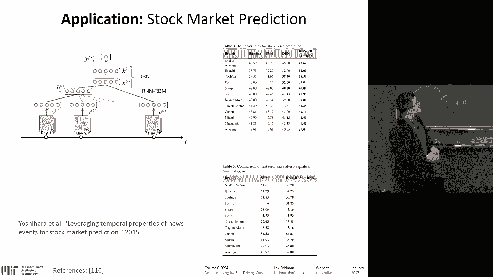

Automotive stocks。You can also generate audio。 this exact same process。 You generate language。

 You could generate audio。 Here's trained on。A single speaker， of a few our epics of them speaking。

 And you just learn that's raw audio of the speaker。And。

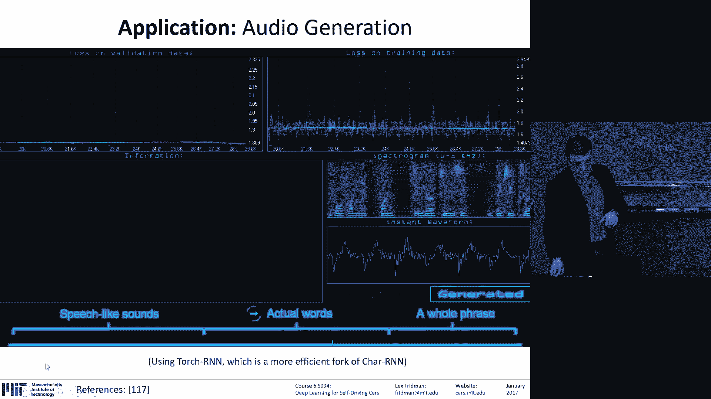

It's learning slowly to generate。あの。1，2，3。I one to desire to the one。S for to say，67，3，5，9，46，4 T2。

 I5。

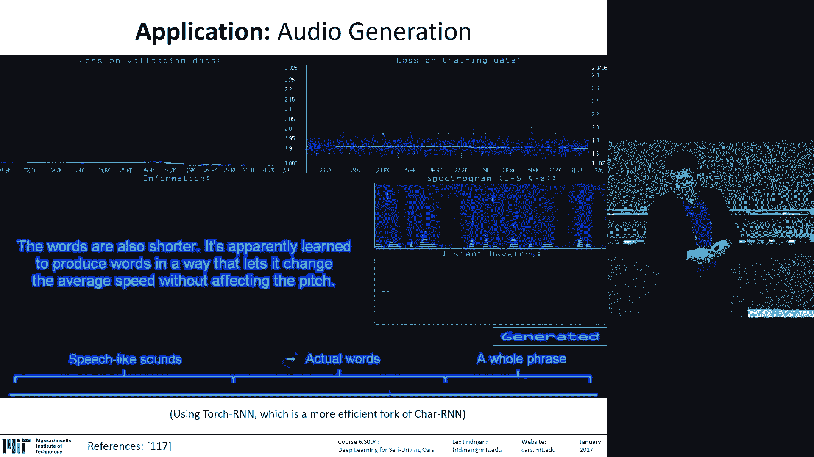

PeopleObviously， they were reading numbers， but that。The the， their mights。This is incredible。

 This is trained on the， on a compressed spectrogram of the audio， raw audio。😊。

And it's producing something that。Over just a few epics is producing something that sounds like words that could do this lecture for me。

 I wish。

9。

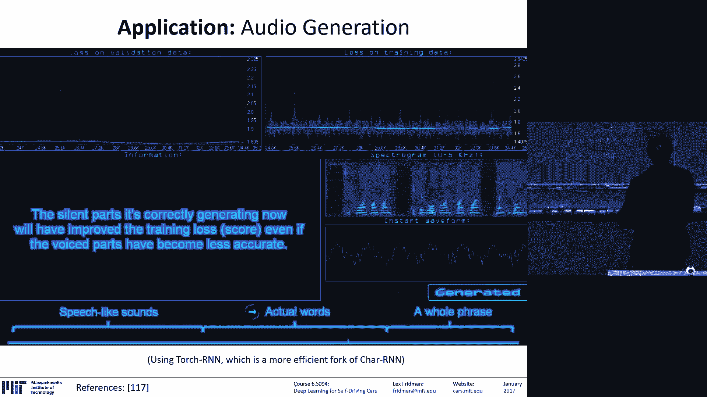

I don't know， this is amazing。

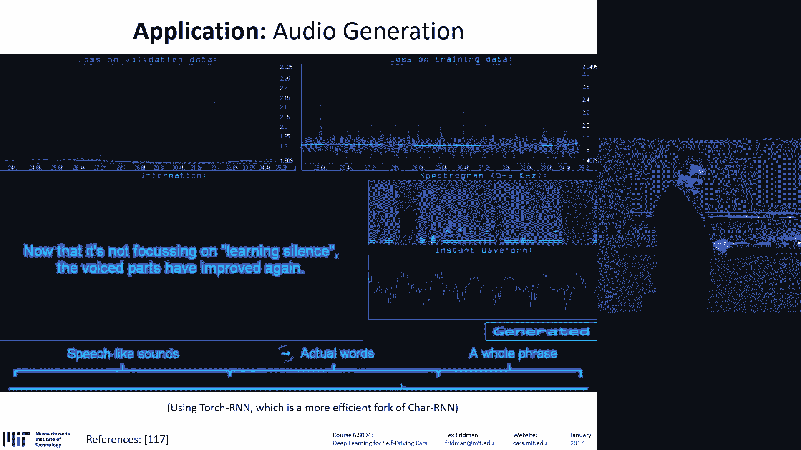

This is raw input。Rraw output， all again， LSTMs。And there is a lot of work and voice recognition and audio recognition。

 you mapping。LetYou turn it up， but you're mapping any kind of audio to a classification。

So you can take the audio of the road。And that's the spectroogram on the bottom there being shown。

And you could detect whether the road is wet or the road is dry。And you could do the same thing for。

Recognizing the gender of the speaker。Or recognizing many the many map of the actual words being spoken。

 speech recognition。But this， this is about driving。

 So let's see where recurrenial networks apply and driving。We talked about。The NviD approach。

 the thing that actually powers deep Tesla， JS。Is a simple convolution in neural network。

There's five convolution layers。In their approach， three fully connected layers。

 you can add as many layers as you want in deep Tesla。So that's you， a quarter million。

Parameterters to optimize。 And all you're taking is a single image。No time for information。

 single image and producing the steering angle。 That's the approach。

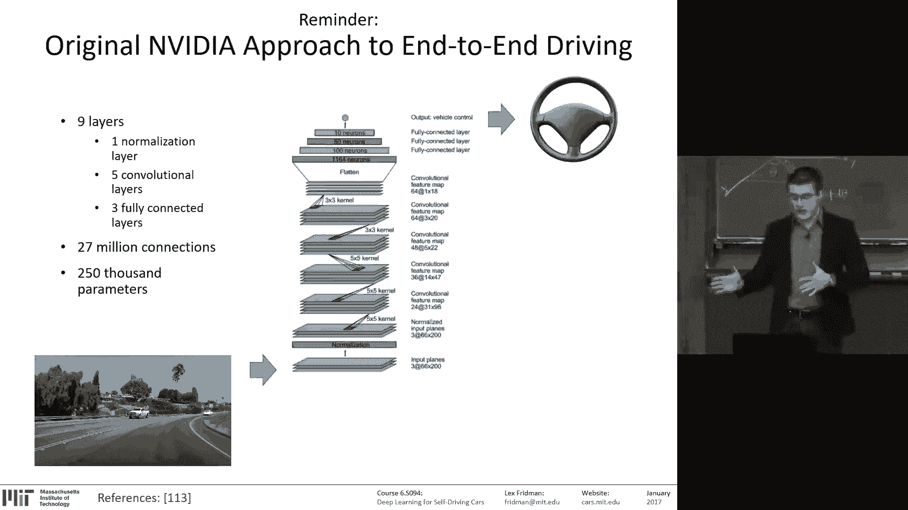

That's the deep tusle way。So take it a single image。And learning of regression of a steering angle。

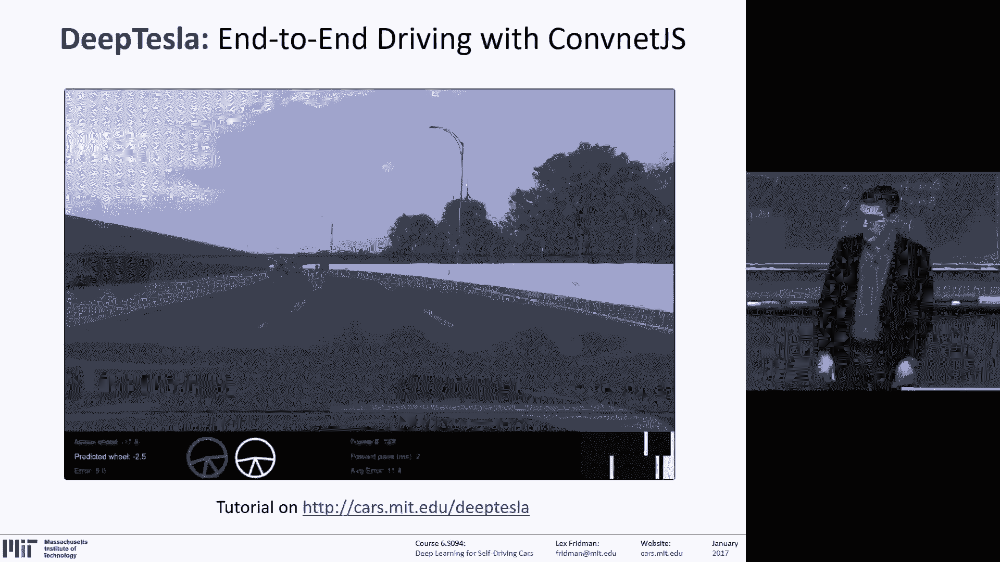

Now， so one of the。Prizees for the competition is the Uuddacity cell driving car engineer。

 nano degreeree。For free。This thing is awesome。 I encourage everyone to check it out。

 but they did a competition。呃。That's very similar to ours。

But they have a very large group of obsessed people。 So they， they were very clever。

 They went beyond just convolution neural networks of predicting steering。

 So taking a sequence of images and predicting steering。What they did is the winners。

 at least the first， and I'll talk about the second place winner tomorrow。

On 3D commution neural networks。 But the first and the third place winners used R N Ns。

 used LSTMs orcur neural networks。And mapped a sequence of images to a sequence of steering angles。

for anyone。Statistically speaking。Anybody here who's not a computer vision person。

 most likely what you want to use for whatever application you're interested in。Is RNNs。

Just the world is full of time series data。Very few of us are working on。Data。

 that's not time series data。 In fact， whenever it's just snapshots。

 you're really just reducing the problem to the size that you can handle。

 But most data the world is time series data。 So this is the approach you end up using if。

 if you want to apply it in your own research。So this is， this is this this。R NNs is the way to go。

So。Again， whats what are they doing， What， how do you。Put images into a recur neural network。

It's the same thing。You take。You have to convert an image into numbers in some kind of way。

A powerful way of doing that is convolutionary neural networks。So， you can take。

Either 3D convolutional neural networks or 2D convolutional neural networks。

 ones that take time into consideration， why not。So process that image to extract a representation of that image。

And that becomes the input to the LSTM。 And the output at every single cell at every single time step is the predicted steering angle。

 the speed of the vehicle on the torque。 That's what the first place winner did。

 They didn't just do steering angle。 They also did the speed in the torque。

And the sequence length that they were using。So for training and for testing。

For the input and the output is a sequence length of 10。The question was。

 do they use supervised learning， Yep， so they were given the same thing as in deep Tesla。

 a sequence of frames where they have a sequence of steering angle， speed and torque。

 I think there's other information too。Available。 So yeah， there's no。

 there's no reinforcement learning here。 question。 To get a sense for how how much information is being passed。

 How many L gates。Something this problem。So so the question was。

 how many LSTM gates are there in this problem？So， this network。It。

s it's true that these diagrams kind of hide the number of parameters here。's， but it's arbitrary。

 just like convolutional neural networks are arbitrary， so。The size of the input is arbitrary。

 the size of the sigmoid function and the 10 h is arbitrary， so you can make it as large as you want。

 as deep as you want， and the deeper and larger the better。What these folks actually use。

 So the way these competitions work and。If you I encourage you finished your machine learning to participate in Kego。

 Cago， I don't know how to pronounce it competitions。

Whereas basically everyone's doing the same thing， you're using LSTMs， or if it's one to one mapping。

 you're using convolutionary neural networks to fully connected networks with some clever preprocessing。

 And the whole job is that takes months。 and you probably if you're a researcher。

 that's what you'll be doing your own research， it's playing with parameters。

Playing with preprocesing of the data， playing with the different parameters the control。

 the size of the network， the learning rate， I mentioned， this type of optimizer。

 all these kinds of things。 That's what you're playing with。Using your own human intuition。

 and you're using your。Whatever probing you can do in monitoring the performance of the network。

Through time。Yes。喂。The question was。You said that there is a memory of 10 in this LCM。

 and I thought R NNs are supposed to be arbitrary or whatever。So it's， it has to do。

With the training。The how the network is trained。 So it's trained with sequences of 10。

 The structure is still the same。 You only have one cell that's looping onto each other。

 But the question is， what， in what chunks。Of what is the size of the sequence of which you're doing the training and then the testing。

You don't have to。 It can be arbitrary length。 It's just usually better to be consistent and have a fixed length。

But its， there's no， you're not stacking 110 cells together。 It's just a single cell still。

So the third place winner。Team chauffeur。Use something called transfer learning。

 And it's something I don't think I mentioned。But it's kind of implied。

The amazing power of neural networks。😊，So first， you need a lot of data to do anything。

So that's a cost。 That's the limitation in neural networks。 But what you could do is， so there's。

 there's。Neural networks that have been trained on very large data sets on INe。There's a VDGnet。

 Alexnet， Resnet， all these networks to train in huge amounts of data。But that those。

 those networks were trained to tell the difference between a cat and a dog or whatever or specific object recognition and single images。

How do I then take that network and apply it to my problem。

 say of driving of lane detection or classifying a medical diagnosis or cancer or not？

The beauty of neural networks is you don't。Me， it depends， but transfer， the。

 the promise of transfer learning。Is that you can just take that network？Chop off the final layer。

The fully connected layer that maps from all those cool。

 high dimensional features that you've learned about the visual space。

And as opposed to predicting cat versus dog， you teach you to predict cancer or no cancer。

You teach you to predict lane or no lane， truck or no truck。

And so as long as the visual space under which the networks operate is similar or the data space。

 like if it's audio or whatever， if it's similar， if the features are useful that you learned in studying the problem of Caverse's dog deeply。

 you have learned actually， how to see the world。 And so you can apply that visual knowledge。

 You can transfer that learning to another domain。 and that's that's the beautiful power of neural networks。

 is they're transferable。As， you know， and so what they did here is they took。

I didn't spend enough time looking through the code。

 So I'm not sure which of the giant networks they took， but they took a giant con neural network。

They prun it down to。 they chopped off。The end layer， which produced 3000 features。

 and they took those 3000 features at every single image frame。

 And that's the X T that And they gave that as the input to LSTM。

 and the sequence length in that case was 50。So this， this process is pretty。

It's pretty similar across domains。 that's the beauty of it。

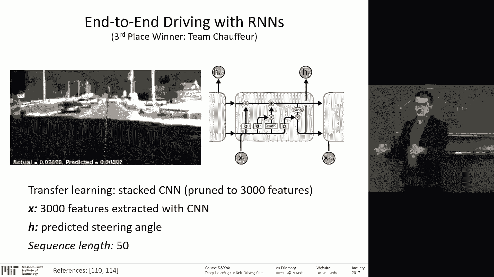

And the art of neural networks。Is in the。That's a good sign。I guess I should wrap it up。

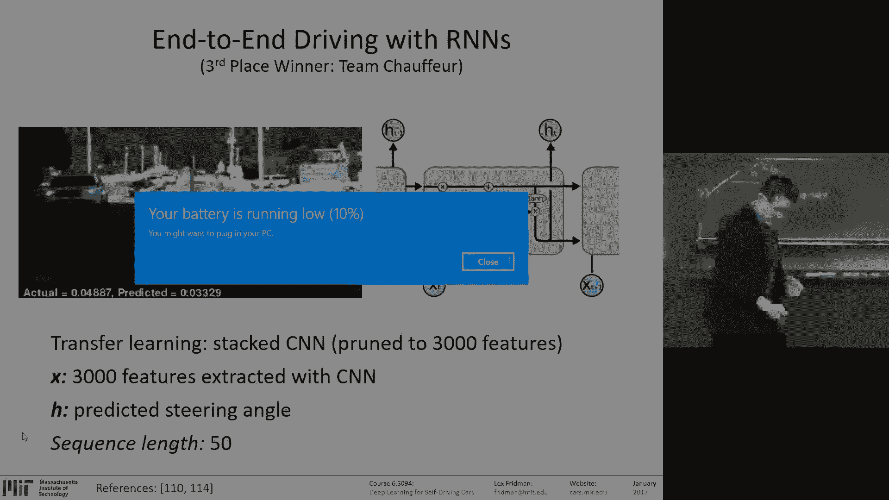

喂喂。I don't think I need much time， but。The， the art of neural networks is in the hyperparameter tuning。

 and that's the tricky part。 And that's the part you can be taught。 That's experience。Sadly enough。

 That's why they called。 I talked about。Sttochastic gradient descent， SGD。

 that's why whoever was Jeffrey Hinton refers to it as stochastic graduate student descent。

Meaning you just keep higher graduate students to play with the hyperparameter until the problem is solved。

So。I have。I have about 100 plus slides on driver state， which is the thing that I'm。

Most passionate about， and I think we'll save the best for last， right。

 andll talk about that tomorrow。 We have a guest speaker。

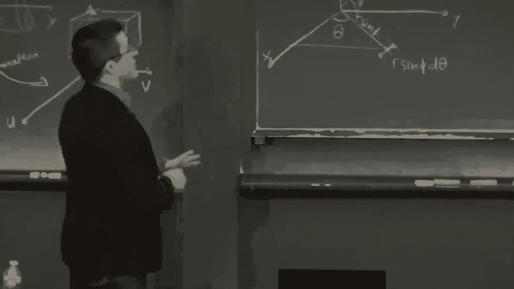

From the White House， you talk about the future of artificial intelligence。

 from the perspective of policy。And。What I'd like you to do， first of all。

 if you registered students submit the two tutorials， assignments and pick up。

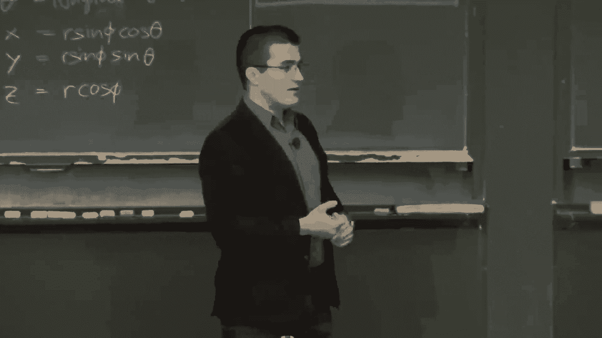

Can we just set up boxes right here or something？ Yeah， just stop by， pick up a shirt。

And give us a card on the way。All right， thanks guys。

