# 【英语字幕+资料下载】MIT 6.S094 ｜ 深度学习与自动驾驶(2018·完整版) - P9：L9- 以人为中心的半自主驾驶深度学习 - ShowMeAI - BV1Y34y1i7vC

All right， so the human side。Of AI。So how do we turn？This camera back in on the human。

So we've been talking about perception， how to detect cats and dogs。Pedestrians。

 lanes how to steer a vehicle based on the external environment。

The thing that's really fascinating and severely understudied is the human side。

So you know you talk about the Tesla， we have cameras and 17 Teslas driving around Cambridge。

Because Te is one of the only vehicles， allowing you。To。To experience in the real way on the road。

 the interaction between the human and the machine。

And the thing that we don't have that deep learning needs on the human side of semi autotonnomous vehicles and fully autonomous vehicles is video of drivers。

 That's what we're collecting。That's what my work is in。

 is looking at billions of video frames of human beings driving 60 miles an hour plus on the highway in their semi autotonnoommous Tesla。

What are the things that we want to know about the human？

If if we are a deep learning therapist and we try to tear apart， break。

 break apart the different things we can detect from this raw set of pixels。

We can look here from the green to red is the different detection problems。

 the different computer vision detection problems， green means it's less challenging。It's feasible。

 even under poor lighting conditions， variable pose， noisy， environment， poor resolution。Red。

Means it's really hard no matter what you do。That's starting on the left with face detection。

 body pose， one of the best studied and one of the easier computer vision problems。

We have huge data sets for these。And then there is microcicos。

 the slight tremors of the eye that happened in one。At a rate of a thousand times a second。All right。

 let's look at。But first， why do we even care？About the human in the car。So one is trust。

 the stress part is so you think about it。To build trust。

 the car needs to have some awareness of the biological thing it's carrying inside， the human inside。

 you kind of assume the car knows about you because you're like sitting there controlling it。

But if you think about it， almost every single car on the road today has no sensors with which it's perceiving you。

 It knows some cars have a pressure sensor on the steering wheel。

And a pressure sensor or some kind of sensor detecting that you're sitting in the seat。

 That's the only thing it knows about you。That's， that's it。 So how is the car supposed to。

This same car is driving 70 miles an hour on the highway autonomously。

How is it supposed to build trust with you if it doesn't perceive you that's one of the critical things here。

 So if I'm constantly advocating something， it' that we should have a driver facing camera in every car。

And that despite the privacy concerns， now you have a camera on your phone and you don't have as much of a privacy concern there is despite the privacy concerns。

 the safety benefits are huge， the trust benefits are huge。

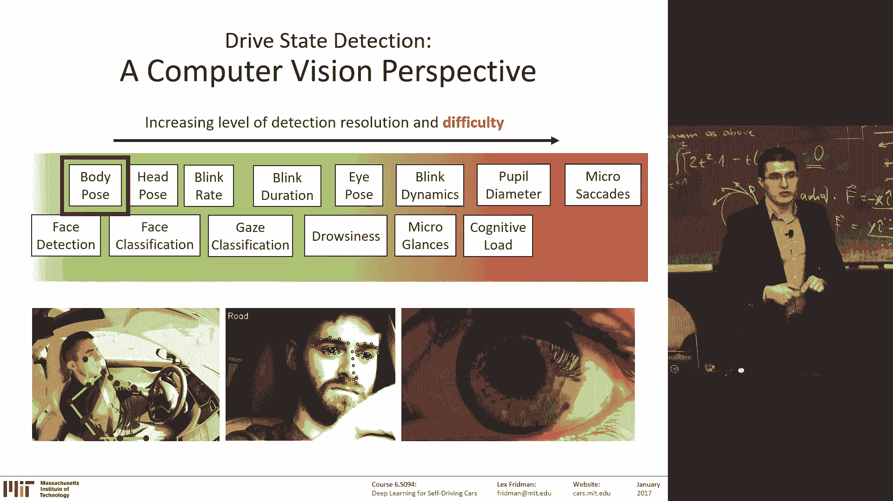

So let's start with the easy one， body pose， detecting body pose。Why do we care。

 So there is seatbelt design。There's these dummies crashed as dummies with which are used to design the safety system。

 the passive safety systems in our cars， and they make certain assumptions about body shapes， male。

 female， child body shapes， but they also make assumptions about the position of your body in the seat。

They have the optimal position， the position they assume you take。 The reality is。In a Tesla。

When the car is driving itself。The variability， if you remember the cat， the deformable cat。

 you start doing a little bit more of that。 you start to reach back in the back seat in your purse。

 your bag， for your cell phone， these kinds of things。 and that's when the crashes happened。

 and we need to know how often that happens， the car needs to know that you're in that position。

That's critical for that very serious moment when the actual crash happens。How do you do？

This is deep learning class， right， So this deep learning you're the rescue。

Whenever you have these kind of tasks of detecting， for example， body poses。

 you're detecting points of the shoulders， points of the head，5，10 points along the arms。

 the skeleton。How do you do that， You have a CNN con neural network。

That takes this input image and takes an output。 It's a regressor。

 It gives an X Y position of the whatever you're looking for。

 the left shoulder of the right shoulder， and then you have a cascade of regressors。

That give you all these points to give you the shoulders， the arms， and so on。And then， you have。

Through time on every single frame， you make that prediction。And then you optimize。You know。

 you know， you know， you know you can make certain assumptions about physics that you can't。

 your arm can't be in this place in the in one frame。 and then the next frame be over here。

 It moves smoothly through space。 So under those constraints， you can then minimize the error。

The temporal error from frame to frame， or you can just dump all the frames as if there are different channels。

 like RGB is three channels。 You could think of those channels in time。

 You can dump all those frames together in what are called 3D convolutional neural networks。

 You dump them all together。 and then you estimate the body pose in all the frames at once。

And there is some data sets for sports。

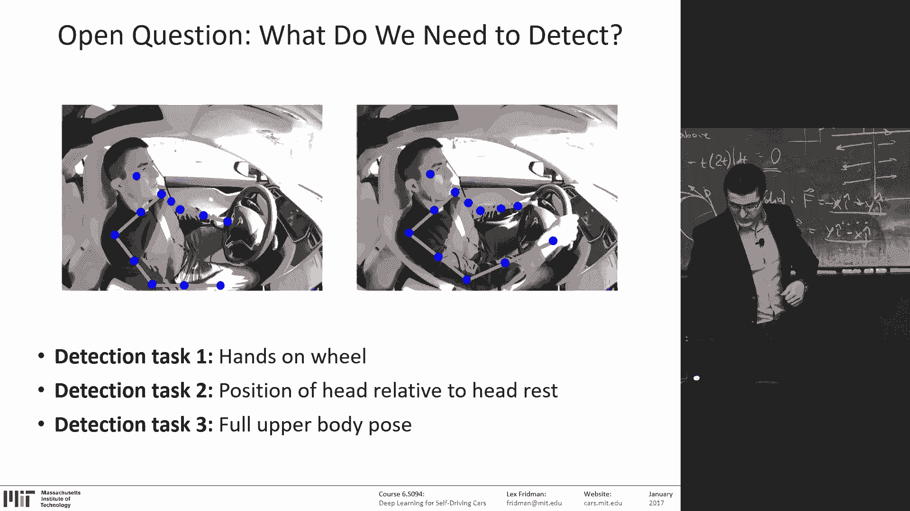

And we're building our own。 I don't know who that guy is。Let's， let's fly through this a little bit。

 So what's called gaze classification。 Ga is another worth glance， right。

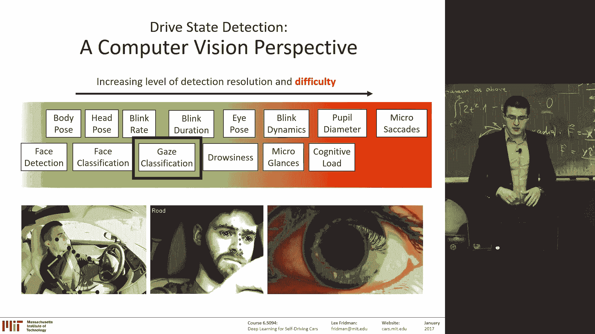

It's a classification problem。Here's one of the TAs for this class。Again。

 not here because he's married， had to be home。I know his priorities are at。 This is on camera。

 should be here。There's five cameras， this is what we're recording in the Tesla。

 this is the Tesla vehicle。😊，There's in the in the bottom right。

 there's a blue icon that lights up automatically detected if it's operating under autopilot。

 That means the car is currently driving itself。 There's five cameras， one of the forward roadway。

 One of the instrument cluster， one of the center stacks， steering wheel， his face。

 And then its it's a classification problem。 You dumped the raw pixels into a convolution in neural network。

 have six classes， forward roadway。 You're predicting where the person is looking。

 Forward roadway left， right。Center stack， instrument cluster， rearview mirror。

And you give it millions of frames for every class， simple。And it does。Incredible well at predicting。

Where the driver is looking And the process is the same for majority of the driver' state problems that have to do with the face。

 The face has so much information where you're looking， emotion， drowsiness。

 So different degrees of frustration。 Ill fly through those as well。 But the process is the same。

 There's some preproces。 So this is in the wild data。 There's a lot of crazy light going on。

 There's noise， There's vibration from the vehicle。 So first， you have to video stabilization。

 You have to remove all of that vibration， all of that noise， as best as you can。 There's a lot of。😊。

Algorithms， non neural network algorithms。Boring， but they work for removing the removing the noise。

 removing the effects of sudden light variations and the vibrations of the vehicle。

 There's the automated calibration。 So you have to estimate the， the frame of the camera。

 the position of the camera。And estimate the identity of the person you're looking at。

The more you can specialize the network to the identity of the person and the identity of the car the person is riding in。

 the better the performance for the different driver state classification。

So you personalize the network， you have a background model that works on everyone and you specialize each individual。

 this is transfer learning， you specialize each individual network to that one individual。Allright。

 there is face frontilization， fancy name for the fact that no matter where they're looking。

 you want to transfer that face to the eyes the nose of the exact same position in the image。

 that way， if you want to look at the eyes。And you want to study the subtle movement of the eyes。

 the subtle blinking， the dynamics of the eyelid， the velocity of the eyelid。

 it's always in the same place so you can really focus in。

 remove all effects of any other motion of the head。And then you just。

 this is the beauty of deep learning， right， You don't。 There is some pre processing because this is。

You know， real world data， but you just dump to raw pixels in。You don't throw all pixels in and。

 and predict whatever you need。 What do you need。 One is emotion。 You can have。 So we had we had。

 we had a study where people used a crappy and a good。Boysbased navigation system。

 So the crappy one got them really frustrated， and they self-reed that as a frustrating experience or not on scale 1 to 10。

 that gives us ground truth。 But it had a bunch of people use this system。

 And you know they put themselves as frustrated or not。

 And so then we can predict we can train a con in your network to predict。

 is this person frustrated or not。 I think we've seen a video of that。

 turns out smiling is a strong indication of frustration。

 You can also predict drowsiness in this way。Gayze estimation in this way， cognitive load。

 I'll briefly look at that。 And the process is all the same。 You detect the face。

 You find the landmark points in the face for the face alignment， face frontalilization。

And then you dump the raw pixels in for classification。 Step 5， you can use SVMs there。

 or you can use what everyone uses now， con your neural networks。

This is the one part where CNNNs have still struggled to compete。Is the alignment problem。

This is why I talked about the cascade of regressors。Is。Finding the landmarks。On。The the eyebrows。

 the nose， the jaw line， the mouth。There's certain constraints there。

 And so algorithms that can utilize those constraints effectively can often perform better than end to end regressors that just don't have any concept of what a face is shaped like。

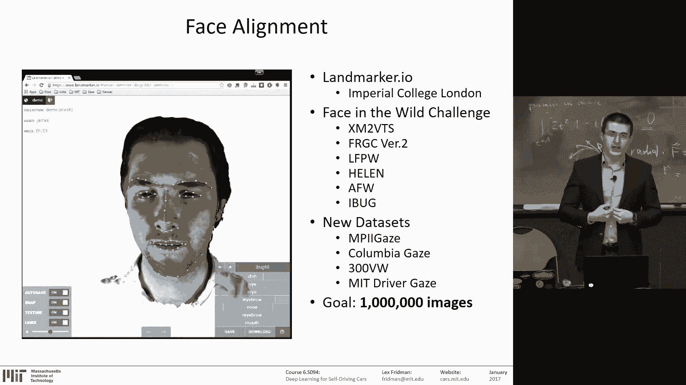

And there's huge data sets。 And we're a part of of the awesome community that's building those data sets for face alignment。

Okay， so this is， again， the T A in this younger form。This is in live in the car。

 real time system predicting where theyre looking。

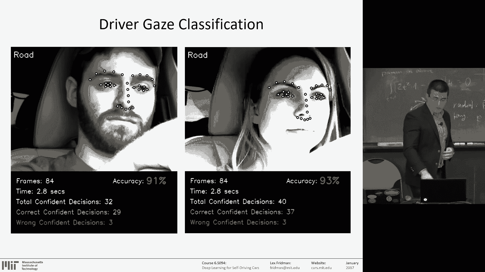

This is taking slow steps towards the。Exciting direction that machine learning is headed。

 which is unsupervised learning。The less you have to have humans look through the data and annotate that data。

 the more power these machine learning algorithms get， right。Currently。

 supervised learning is what's needed。 You need human beings to label a cat and label a dog。 But if。

 if you can only have a human being label 1%。One10th of a percent of a data。Only the hard cases。

 So the machine can come to the human and be like， I don't know。

 I don't know what I'm looking at at these pictures because of the partial light occlusions。

 We're not good at dealing with occlusions。Whether it's your own arm or because of light conditions。

 we're not good with。Crazy light drown out the image。

 This is what Google self driving car actually struggled with when they're trying to use their vision sensors。

 moving out of frame。 So just all kinds of occlusions are really hard。4 computer vision algorithms。

And in those case， we want a machine to step in and say and pass that image onto to the human and be like。

 help me out with this。And the other corner cases is， so in driving， for example。

 90 plus percent of the time， all you're doing is staring forward at the road in the same way。

 That's where the machine shines。 That's where machine annotation。

 automated annotation shines because it's seen that face for hundreds of millions of frames already in that exact position so it can do all the hard work of annotation for you it's in the transition away from those positions that it needs a little bit help just to make sure that this person just start looking away from the road to the rear view and you bring those points up so there's using optical flow。

 putting the optical flow in the convolution in neural network。

You use that to predict when when something has changed and when something has changed。

 you bring that to the machine for annotation。 All of this is to build a giant。Billions of frames。

 annotated data set of ground truth。 I want to train your driver state algorithms。And in this way。

 you can control on the X axis is the fraction of frames the human has to annotate，0% on the left。

10% on the right。 And then the accuracy trade off。 the more the human an is， the higher the accuracy。

 you approach 100% accuracy。But you can still do pretty good。

 This is for the gaze classification task。When。With an 84% 84 fold to almost two orders in magnitude reduction in human annotation。

 This is the future of machine learning。And hopefully， one day， no human annotation。

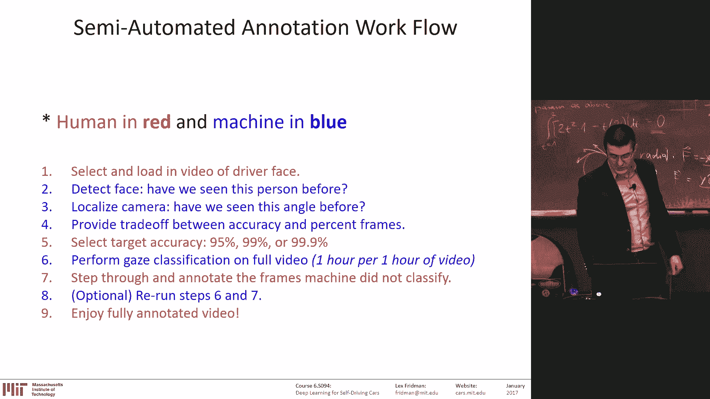

And the result。Is millions of images like this， video frames。Same thing。 driver frustration。

 This is what I was talking about。 The frustrated driver is the one that's on the bottom。

So a lot of movement of the eyebrows and a lot of smiling。 and that's true subject。

 that's the subject。And the happy， the satisfied， when don't say happy。

 the satisfied driver is cold and stoic。 And that's true for subject after subject。

 because driving is a boring experience。 And you want it to stay that way。 Yes， question。😊，Great。

 great， great question， they're not。聊天。Absolutely， that's a great question。 There is a。

 so this is cars owned by MIT。 There is somebody in the back。们家。So the comment was。

 my emotions might then have nothing to do with the driving experience。 Yes。

 and let me continue that comment is your emotions are often。

You're an actor on the stage for others with your emotion。 So when you're alone。

 you might not express emotion。 You're really expressing emotion oftentimes for others。

 Like your' frustrated like， what the heck。 That's for for the passenger。

 And that that's absolutely right。 So one of the cool things。We're doing as I said。

 we now have over a billion video frames in the Tesla。

 We study collecting huge amounts of data in the Tesla。 And it emotion is complex thing， right。

 In this case， we can we know the ground truth frustrated they were in naturalistic data when it's just people driving around。

 We don't know how theyre really feeling at the moment。

 We're not asking them to like enter in an app。 How are you feeling right now。

But we do know certain things like we， we know that people sing a lot。

That has to be a paper at some point。 It's awesome。 People love singing。😊。

So that doesn't happen in this kind of data because there's somebody sitting in the car。

 And I think the expression of a frustration is also the same。问你吧。drive。Yes， so。Yeah。

 the question is， yeah or the comment is that the data set。

 the solo data is probably going to be very different from a data that's nonsolo with a passenger。

 and it's very true。 the tricky thing about driving and this is why it's a huge challenge for cell driving cars for the external facing sensors and for the internal facing sensors。

 analyzing human behavior is like 99。9% of driving is the same thing it's really boring。

 So finding the interesting bits is actually pretty complicated。So that has to do with emotion。

 that has to do with。 So singing is easy to find。 So we can track the mouth pretty well。

 So whenever you're talking or singing， we can find that。

 But how do you find the subtle expressions of emotion， It's hard。

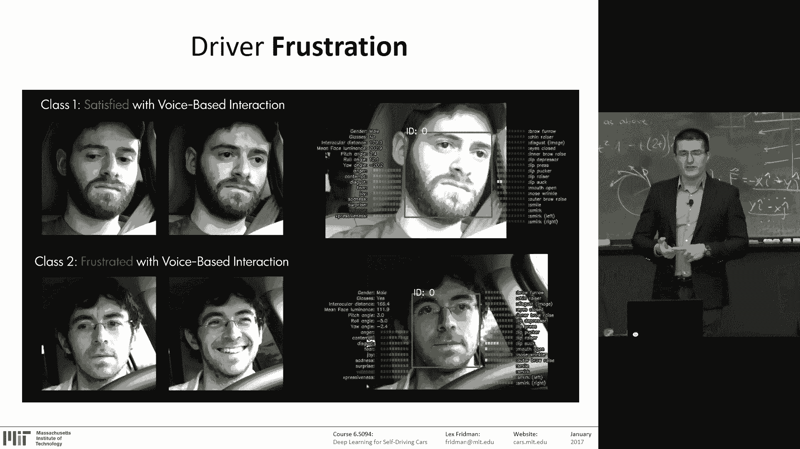

When you're solo。And cognitive load。That's。That's， that's a fascinating thing。 I mean。

 similar to emotion， it's。Now， it's a little more concrete。

In the sense that there's a lot of good science and ways to measure cognitive load。

Cognitive workload， How occupied your mind is。Mental workload is another term used。

And so the the window to the soul， the， the cognitive workload soul is， is the eyes。 So pupil。

 So first of all， the eyes move in two different ways。 They， they move a lot of ways。

 But two major ways is scos。 These are these ballistic movements。

 They jump around whenever you look around the room。

 they're actually just jumping around when you read， their eyes are jumping around。 And when。😊，Like。

 if follow you just follow this bottle with your eyes。

 that your eyes are actually gonna move smoothly， smooth pursuit。

 Somebody actually just told me today thats probably has to do with our hunting background or as animals。

II don't know how that helps。 Like frogs track flies really well。 So you have to like， I don't know。

 Anyway， The point is there are smooth pursuit movements where the eyes move smoothly。

 And those are all indications of certain aspects of cognitive load。 And。

 and then there is very subtle movements， which are almost imperceptible for computer vision。

 And these are microcicos。 These are tremors of the eye。

Here work from here from Bill Freeman magnifying those subtle movements。

 These are taken at 500 frames a second。And so cognitive load。When the pupil。

 that black dot in the middle， just in case we don't know what a pupil is in the middle of the eye。

 when it gets larger， that's an an indicator of high cognitive load。

 But it also gets larger when the light is dim。 So there's like this complex interplay。

 So we can't rely in the wild， outside in the car or just in general outdoors on using the pupil size。

 even though pupil size have been used effectively in a lab to measure cognitive load。

 it can't be reliably used in the car。 and the same with blinks。The when。

 when there's higher cognitive load， your blink rate decreases and your blink duration shortens。Okay。

I think Im just repeating the same thing over and over。

 But you could imagine how we can predict cognitive load， right。We extract video of the eye。

Here is the primary eye of the person the system is observing。Happens to be the same T A once again。

We take the sequence of 100， oh， it's 90 images。 So that's 6 seconds，16 frames a second。

15 frames a second。And we dumped that into a 3D convolution neural network。Again。

 that means it's 90 channels。Of it's not 90 frames， gray scale。And then the prediction is。

 one of three。Class is of cognitive load。Low cognitive load。

 medium cognitive load and high cognitive load。 And there's ground truth for that。

 because we have people over 500 different people do different tasks of various cognitive load。

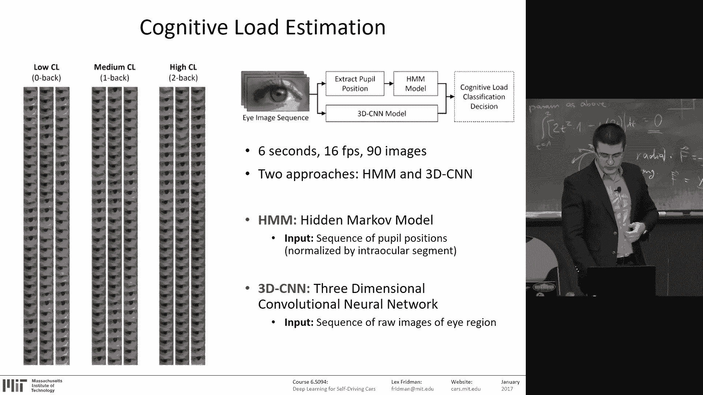

And after some frontalilization， again， where you see the eyes are trans。

 no matter where the person is looking。The image of the face is transposed in such a way that the eyes。

 the corners of the eyes remain always in the same position。

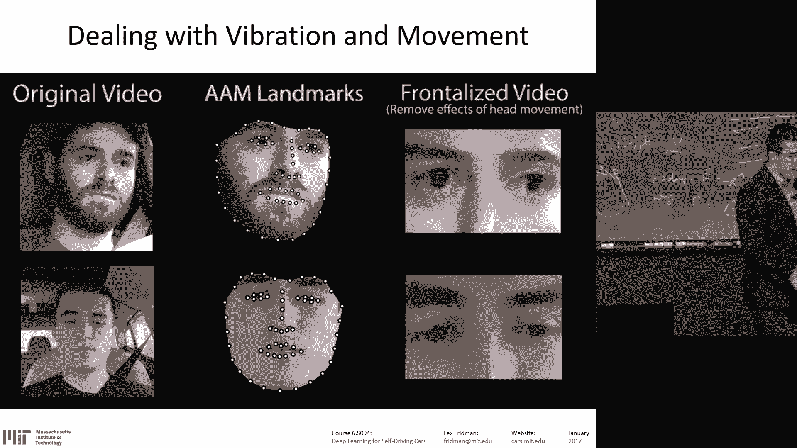

After the frontalilization。We find the I active appearance models， find 39 points。

Of the eye of the eyelids。The iris and four points on the pupil。

Putting all of that into a 3D CNNN model， They positioned I sequence on the left3D CNNNN model in the middle。

 cognitive vote prediction on the right。This code， by the way。It's freely available online。

All you have to do， dump a webcam。From the video stream， CNN runs and faster than real time。

 predicts cognitive load。Same process as detecting the identity of the face。

 same process as detecting where the driver is looking， same process detecting emotion。

 and all of those require very little hyperparameter tuning on the convolutional neural networks。

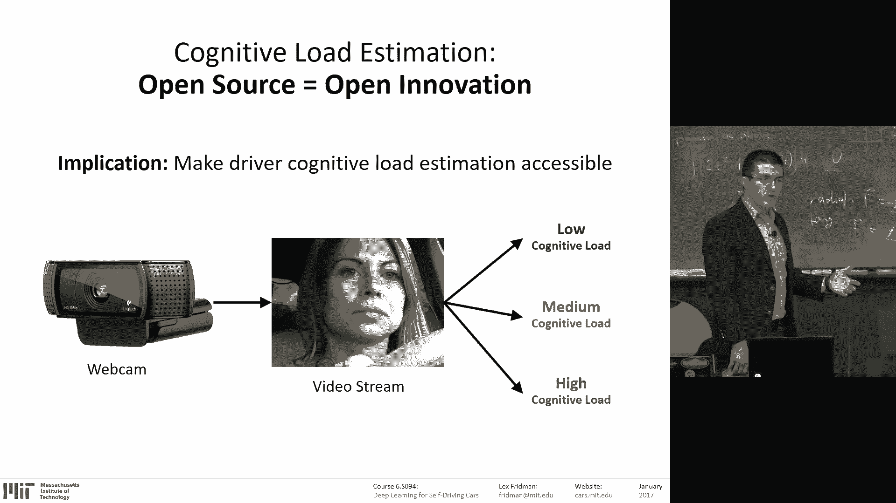

They only require。Huge amounts of data。

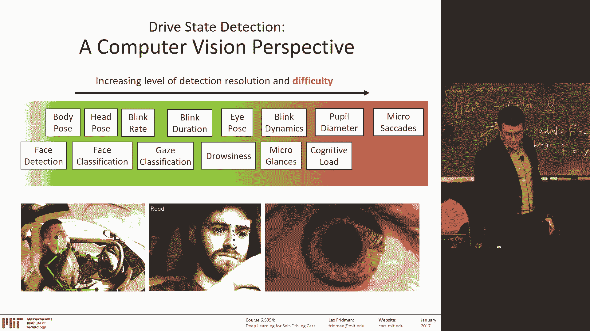

And why do we care about detecting what the driver is doing？ And I think Eric has mentioned。This is。

On the oh man， this is the comeback of the slide。I was criticize this for this being a very cheesy slide。

In。In the path towards full automation。We're likely to take gradual steps towards that。

I can't it's enough of that。 this is better。And especially given that the， this is。Given today。

 our new president。This is pickup truck country。啊。This is manually controlled vehicle country for quite a little while。

 Will like control。And control。Being given to somebody else to the machine will be a gradual process。

 is a gradual process of that machine earning trust。And through that process。

 the machine like the Tesla， like the BMW， like the Mercedes。

 the Volvo that's now playing with these ideas。It's going to need to see what the human is doing。

And for that。To see what the human is doing。We have billions of miles of forward facing data。

 What we need is billions of miles of driver facing data， as well。

We're in the process of collecting that。And this is a pitch。For automakers。

And everybody to buy cars that have a driver facing camera。And， let me， sort of。Close， so I said。

 we need a lot of data。But I think this class has been。And through your own research。

 you'll find that we're in the very early stages of discovering the power of deep learning。

For example， you know， is， is recently。Like Jan Lacoon said。That it seems。

That the deeper the network， the better the results in a lot of really important cases。

Even though the data is not increasing。So why does a deeper network give better results？

This is a mysterious thing we don't understand。 there's these hundreds of millions of parameters。

And from them is emerging some kind of structure， some kind of representation of the knowledge that we're giving it。

One of my favorite examples of this emergent concept is Conway's game of life。

For those of you who know what this is。Will probably criticize me for it being as cheesy as the stairway slide。

 But I think it， it's actually such a simple and brilliant example of。

 of how like a neuron in a neural network is a really simple computational unit。😊。

And then incredible power emerges when you just combine a lot of them in a network。

 And in the same way， the， this is called a cellular automata。😊，That is a weird pronunciation。And。

 and the rule， it it's every single cell is operating under a simple rule。

 You can think of it as a cell， living and dying。It's， it's。

 it's filled in black when it's alive and white， when it's dead。 And when it has two or， it'。

 if it's alive and it has two or three neighbors， it survives to the next time slot。Otherwise。

 it dies。And if it has exactly three neighbors， it's dead。It comes back to life。

 It has exactly three neighbors。 That's a simple rule。 whatever you can just imagine。

 It's just simple。 All is' doing is operating under this very local。A process， same as a neuron。

It's's or in the way we're currently training neural networks in this local gradient。

 we're optimizing over a local gradient， the same local rules。

 And what happens if you run this system。Operating under the really local rules where you get on the right。

It's not。Again， you have to go home。Hopefully， no drugs involved。But you have to open up your mind。

And and see how amazing that is， because what happens is。😊，It's， it's a local computational unit。

That knows very little about the world， but somehow really complex patterns emerge。

And we don't understand why。In fact， under different rules， incredible patterns emerge。

 and it feels like it's living creatures like communicating。 like when you just watch it， not。

 not these examples。 This is， this is the original they get like complex and interesting。

 But even these examples， this complex geometric patterns emerge。 It's incredible。

 We don't understand why。 same when neural networks。 We don't understand why。

 and we need to in order to see how these networks will be able to reason。😊，Okay， so what's next？

I encourage you to read the deep learning book。It's available online， deeplearningbook。org。

As I mentioned to a few people， you should， Well， first。

 theres a ton of amazing papers every day coming out an archive。I， I'll put these links up。

 but there is a lot of good collections of strong paper list of papers。

 There is the literally awesome list， the awesome deep learning papers on Github。

 It's calling itself awesome， but it happens to be awesome。😊。

And there is a lot of blogs that are just amazing。That's how I recommend you learn machine learning is on blogs。

And if you're interested in the application of deep learning in the automotive space。

 you can come do research in our group。Just email me。Anyway， we have three winners。Jeffrey Hugh。

 Michael Gm。And。How do you are you here。Hey， how are you say name。No this。

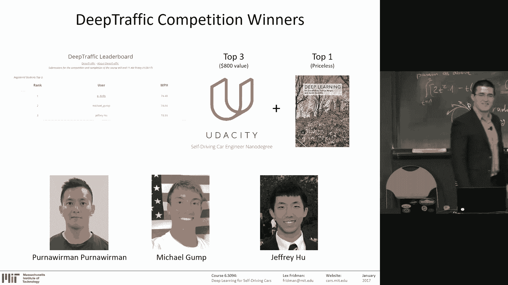

Chris。All。So my name is Florida。P。到的是。Oh， I see。W anyway， here。

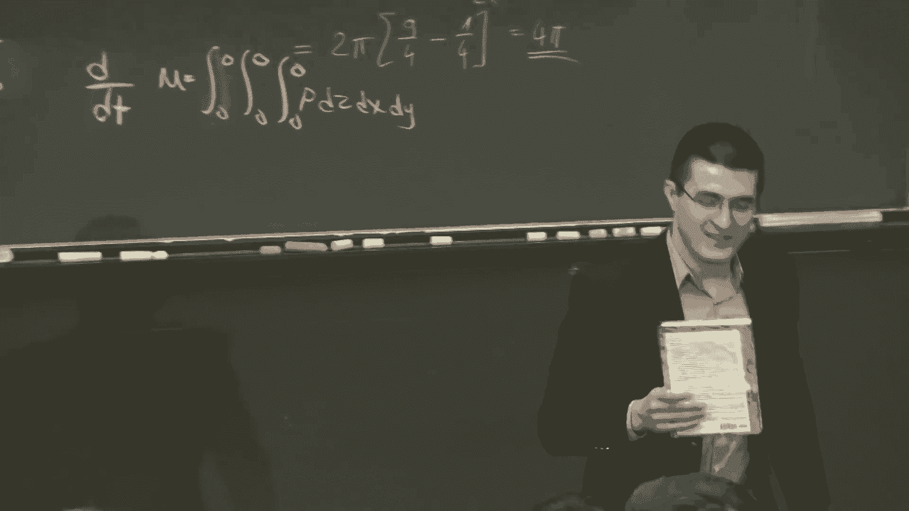

So， he。Achievveed as the stunning speed。Of。So I， I， this is kind of incredible。

 So I didn't know what kind of speed we're going to be able to achieve。

 I thought 73 was unbeatable because we played with it for a while。 We couldn't achieve 73。

 We designed a deterministic algorithm that was able to achieve 74， I believe。😊，Meaning like。

 it's cheating with a cheating algorithm that got 74。 And so folks have come up。

With algorithms that have done have beaten 73 and then 74。 So this is really incredible。

 And the other two guys。 So all three of you get a free term at the Uaci cell drivingiv car engineering degree。

 Thanks to all those guys for giving it。 given that award and bring in their army of brilliant So they。

 they have people who are obsess about cell driving cars。 And we've received。😊。

Over 2000 submissions for this competition。 A lot of them from those guys。

 and they're just brilliant。 So it's， it's it's really。😊。

Exciting to have such a big community of deep learning folks working in this field。 So this is。😊。

For the rest of eternity， well we're gonna change this up a little bit。

 But this is actually the three。Neural networks， the three three winning neural networks running side by side。

 And you can see the number of cars passed there。 The first place on the left。

Second place and third place。 And， in fact， the third place is almost no。

 second place is winning currently。But that just tells you that。The random nature of competition。

 sometimes you win， sometimes you lose。So， there is。

 the actual evaluation process runs through a lot of a lot of iterations and takes to medium evaluation。

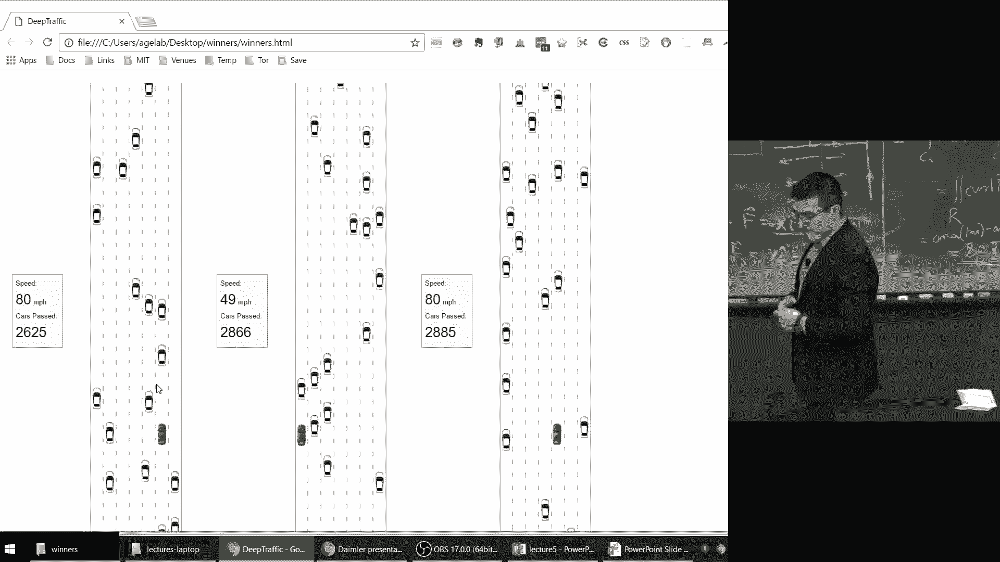

With that， let me thank you guys so much for。 Well， wait， wait， wait， got question。

would be winning networks at all。Yeah， so all three guys wrote me a note about how their networks work。

 I did not read that note， so I'll post this tells you how crazy this has been。

 I'll post the winning networks。To online。 and， and I encourage you to continue competing。

And continue submitting networks。 This will run for a while。 And we're working on a journal paper。

For this。For。This game。We're trying to find the optimal solutions。Okay。

 so this is the first time I've ever taught a class。And the first time。

 obviously teaching this class， and so thank you so much for being a part of it。Thank you， Eric。

you didn't get a shirt， please come back， please come down and get a shirt。

Just write your email on the note on the index note。Thank you。

