# P6：L6  - 生成对抗网络(上) - ShowMeAI - BV1Tf4y1L7wg

Hello everyone welcomelcome to the advancedance deep learning for computeruter vision lecture today it's the first time that I will be giving the lecture well by giving I mean I will make the video but I think we have some very interesting content we going to talk about generative neural networks and the first thing I would like to do is I would like to give you a bit of an overview of generative neural networks obviously you have heard a lot of the terms we have also heard in the previous lectures a lot of discriminative networks but now we want to talk about generative networks mostly in the context of computer vision applications meaning that we want to generate for instance image or we want to generate a video however we also want to go over the。

😊，Yeah， if there are any concepts that could possibly be applied to other domains such as audio generation and so on？

There's this famous taxonomy of generative models and there's quite a few different ones actually and the first thing we have to consider always is。

😊，What does it mean to have a generative model， what does it mean， right？ Typ。

 you have a training set right， And from this training set such as images。

 you want to learn a generative model that can kind of。

you know generate new images of the same type and the same type can mean various different things and most of the time when we're talking about you know what are image types and stuff like that it's mostly referred to a density in other words we have a training set right and we want to learn some sort of density from which we can later on sample in order to generate new samples that follow the same distribution but。

Of course， the samples should not match whatever we have found in the training set。

Now there's two different types there's like implic densities and there's going to be explicit densities and the difference between those is in explicit density you're going to have eventually a loss function that explicitly models the density you're doing we'll later talk about auto aggressive networks you have seen variational auto encoders these kind of things fall into the categories of explicit densities because here you have a loss function that explicitly models it。

😊，At the same time， there's other alternative of networks such as implicit densities。嗯。

Generative adversarial networks is the main thing we will talk about mostly today that falls into that category here we are still learning a density。

 but it is not explicitly modeled by a loss function and you know there are certain implications if you do that you have certain features but also certain drawbacks if you having an implicit density Yeah I would first like to give you a bit of an overview of the generative models of the generative and neural networks we're going to talk about and。

First of all， they're going to talk about about Gs because you know。

 most of you might have heard about them， but I still want to talk about it because they're just so relevant today。

 right， There are so many methods and so many different。

Re works around GNs that in one way or another build on on generative around networks and we will also talk about conditional GNs。

 meaning that at some point we have learned some sort of implicit density with G right at some point you want to control the generation process if youre talking about a plan G you don't have a lot of control but we will talk about how can we actually make GNs useful for certain applications how can we force certain styles of images to be created。

 how can we force for instance， a video with certain animations to be created and so on And I this party is pretty exciting。

 specifically for you know con creation applications， artistic applications and so on。

 So when you want to make GNs practical this is very interesting because here you can basically give it the right control depending on what what the underlying task is going to be we will also talk about autoaggressive networks。

 mainly because I think they。Really very interesting because these are the dominant generative models right now that actually have explicit densities。

They might not be as popular right now as Gs， but I think。You know that comes in Co。

 there's like certain research trends， I think auto aggressiveive networks are pretty important for various reasons and not just in the visual domain。

 mostly for audios， most of the state of the art networks actually are auto aggressiveive there at this point。

We will also talk about neural rendering。 That's kind of an interesting thing that a lot of the research we' be doing。

 for instance， in our group。 And the idea there is we want a couple， you know， traditional。😊。

Generation methods such as what we know from computer graphics， for instance。

 and want to combine it with generative neural networks I will go into a little bit of detail later on what I mean by that。

 but I think it is fair to say that you know if you're looking at some of the progress in the research community in the last like two or three years neural rendering has become a really big thing basically。

You can now instead of having explicit 3D graphics methods。

 you can use neural networks in order to kind of generate cutting edge content。

 especially for video generation over capturing 3D environments。

 this is currently one of the state of the arts so in a sense we have basically two theoretical blocks we want to go over the GNs and the autoive networks and then we have the conditionalganNs and the neural rendering techniques to make things a little bit more practical。

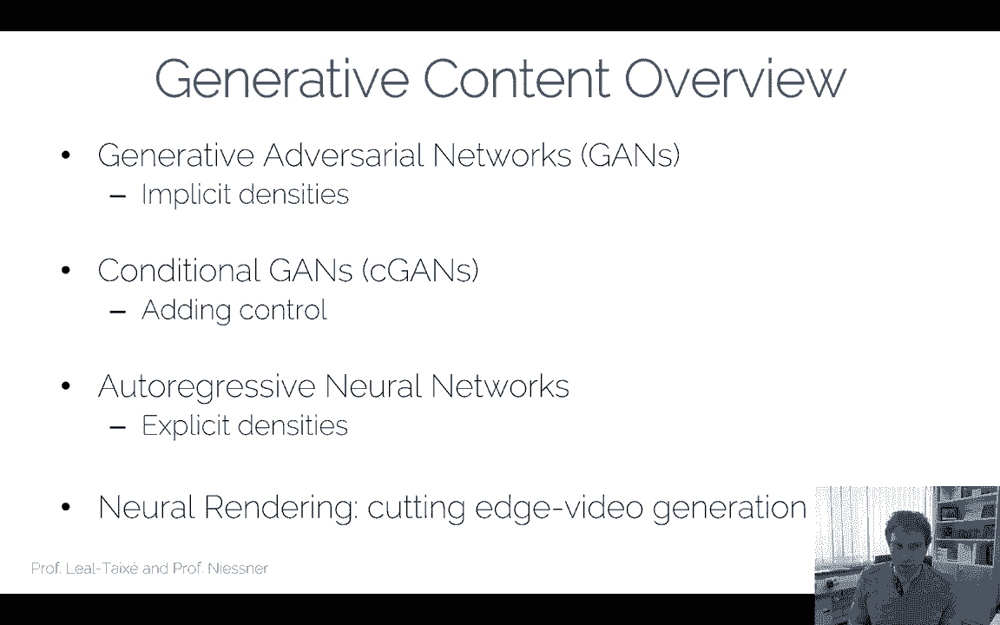

Now I mentioned I wanted to start with G and Pa， as I said。

 they have the implicit densities and the idea is。AndThen we can learn these from a given training dataset and then we can draw new samples from certain distributions and then we can these samples lie inside of the distribution。

 but they are new samples that are not identical with any of the training samples right so for instance if you have a dataset set of faces。

 you can basically generate new faces， they still are faces but you can generate new variations of the different people in these space。

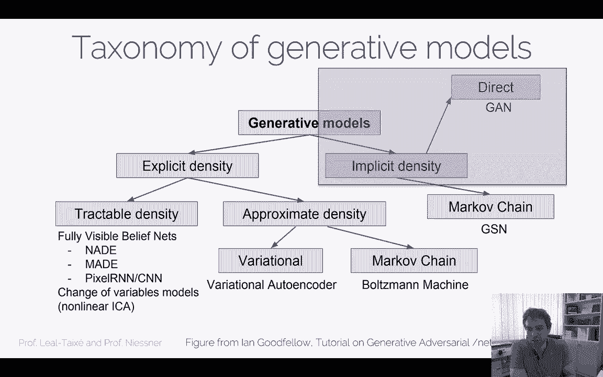

Good yeah， geneative aversarial networks， I will probably always refer to the asksgs in the next few slides。

 they have reached a lot of popularity actually。😊。

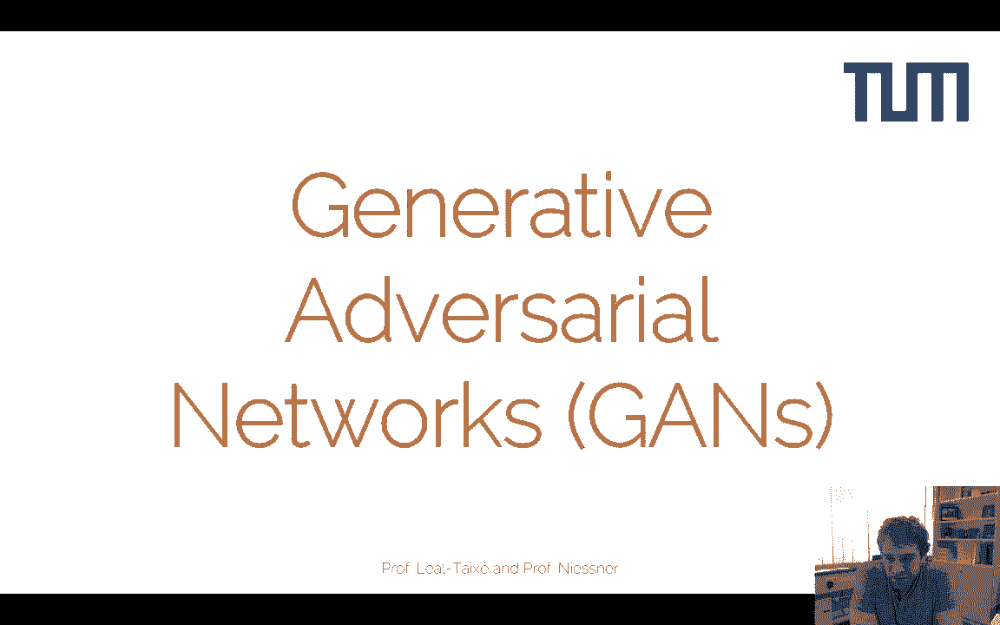

And one one thing to measure popularity is if you're looking at the number of research papers that have appeared。

 this is not quite up to date， this graph it goes until you know early of 2019。

 but you can see here is the the time period of papers right。

 and here's the number of papers that have appeared at the respective。Public menu in this case。

 I think they from archive。 you can see， you know， like 2014， you had barely any again papers。

 And now you have per month， you have almost 500 papers right， So this is kind of a very。

 this is the very rapid growth rates of papers that have again。

InIn the title and this is pretty impressive， I think so you can see there's a lot of people looking into it。

Yeah， the reason why I think it's so interesting is because it kind of showed different ways now how to generate images compared to standard pipelines and it opened up a lot of possibilities for practical reasons and we'll talk about this in this lecture and I hope at the end of the day you know we can all use GNs in various geneative models to do kind of fun stuff。

Now I want to quickly go over the basics again。 I know some of the things we have already covered in the introduction to deep learning course。

 but just for completeness， not everybody might have heard it in the last semester so I still want to quickly do a small recap here。

 We have talked about convolutions and decocomvolutions。

 I understand everybody knows what a convolutional network is right now right So we have here we have here some input image right we're gonna here have the output and we have this three by three conf kernel that is that is being shifted over the input image and in this case we have four valid locations。

 there's no padding no strides。 So this four by four image we're gonna generate a two by two feature map with this conf kernel Now the transpose convolutions are essentially the opposite right So here we have the input here is this grid here。

 we have basically two by two。😊。

Belellet pixels here in the input and what we want to do is we want to make out of two by two。

 we want to make four by four pixels as the output Yeah in the way you do this is kind of this learn little up samplingling in this case again we have no padding and no straight in this case we have yeah we have these four feature locations but basically we just expand the values right and then we run this conf kernel over it same thing as convolution except now we have a transpose kernel and this way we can basically have instead of four instead of going down the resolution we can go up in the resolution。

Now， using the the。Well， I should say one thing right obviously in the literature decomvolutions are often renamed various different ways。

 We have seen them as up convolutions， transpose convolutions， decomvolutions， same thing。

 different people call them differently， I don't have a strong preference most of the time I would just say it's a decomvolution。

 but that's just because I got used to it， but it's not like and the other terms are necessarily wrong。

Yeah with these building blocks with convolutions and decocomvolutions you can dev architectures such as auto encoders and the idea of an auto encoder is we have a series of convolutions that go from a higher resolution input to a lower resolution feature map and this feature map here in the middle is called the bottleneck layer。

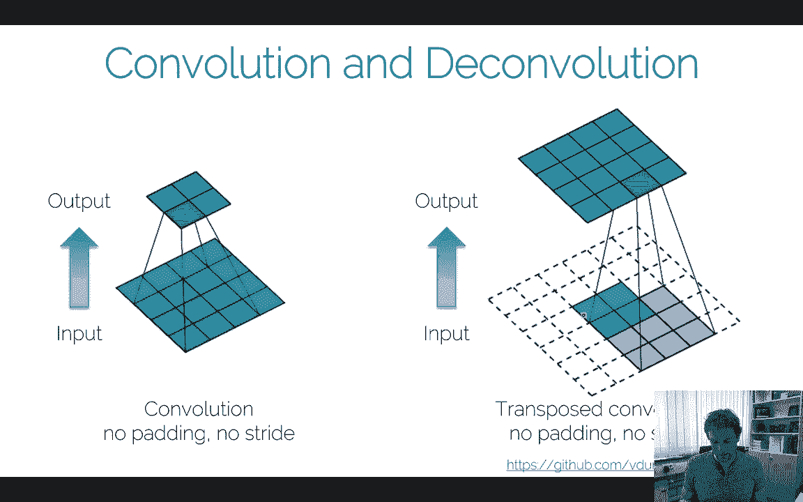

It's doing what it says right it's a bottleneck basically it's compressing the content to a smaller dimensionality of the features here。

 meaning that you have to have to learn some sort of encoding of the image and then what you do is you have a decoder this is composed of a series of decovolutions so you have this learnable upsembling。

And we go here from this bottomne layer again to the original resolution。

And the idea is that we have these convolutions， we have these decoconvolutions。

 this can be a fully convolutional architecture right。

 sometimes you have a couple of fully connected layers here in the middle。

 but often you also have you don't have that you just have a fully fully convolutional architecture and。

嗯。Yeah with that you can design this architecture now right the question is how do we train that Well。

 the most common thing for architecture for auto encoders is were going to have a reconstruction loss So what we're doing here is we have some sort of input image on the lefthand side we' feeding this into our encoder into the bottleneck layer being compressed down to a lower resolution feature map we have a decoder that goes up to the original resolution。

 we have an output image and what we do is we have a reconstruction loss that says oh this output image should be similar to the input image you can use an L1 or L2 loss here。

It's a very simple regression loss basically and and the network is being optimized such that it wants to do this reconstruction Yeah practically what you have is this latent space Z here。

 this is what we get in the bottleneck this dimensionality is typically significantly lower than the input right so of course the spatial resolution gets smaller the feature resolution gets higher but the total dimensionality of the latent space Z is supposed to be significantly lower right？

😊。

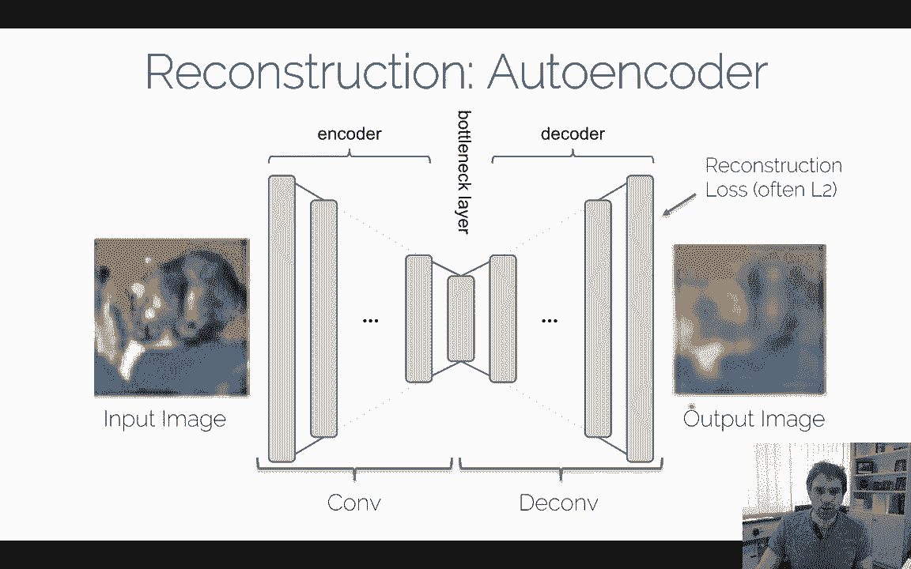

And yeah， I mean if you do this and train this you have here a bunch of input images right and you're training this and you're getting a series of reconstructive images there's also the distinction right now if you're saying you have a training in a validation set right if you're taking a training set essentially what this network here is learning it's kind of learning a lowering approximation of the input it's actually very similar what a PC would do except that this is not a linear but a nonlinearar model but you have the same idea that you have kind of this encoding of a higherdiional input in this case an image right into a lower dimensionality in the bottleneck layer。

And yeah and then we can do the reconstruction by having a loss at the end of the day It's a self-supervised learning。

 a lot of people call it unsupervised learning， I like to call it selfsupervised because you still have a loss here。

 but the nice thing is to train an auto encoder you don't need any additional annotations or labels right it's completely self-supvised you're gonna to feed in an image you're going reconstruct the image again so all you have to do is you have to have a data set of images in this case to train it。

😊，Yeah now we can argue what are we learning and the hope。

 or at least what would we assume what we learn is we learn kind of a compression network？😊，So we。

 be compressing this higher level input into a lower level。

Feature map and then via going back to the original resolution。

's in a sense it's like learning some sort of compression。

Now it's not perfect it's not lossless compression as we can already see here right we have here the input images and we hear the reconstructed image you see these images are a little bit blurry that is based on the fact that well depending on how we do the optimization it's based on what kind of loss we're going to use we will very quickly see that the loss two loss might not be the ideal one because essentially learning some sort of mean average over the training set and so on。

😊，But I'm sure you've heard of auto codes in the context a lot for unsupervised learning。

 you can use clustering in this feature space， you can find dominant access。

 similar to principal component axis right this is why I'm making the comparison to PCA here。

 you can kind of find clustering in your dataset set。

But now we wanted to talk about generative models。 The question is。

 how is an auto encoder useful here， Well， the idea is what we can do is we can train this auto encoder。

At training time with the training set and then at test time what we're doing is we're simply chopping off the encoder part and now what we do is we just have a decoder so this decoder was pretrained in this case and at test time what we do is we just feed in random vectors here in the latent layer and then we're hoping we're getting an original image as output again。

And assuming we've done a good job at， you know， learning this。

 if I going back quickly at learning this latent space here from the input。

 we assume that we have a reasonable。

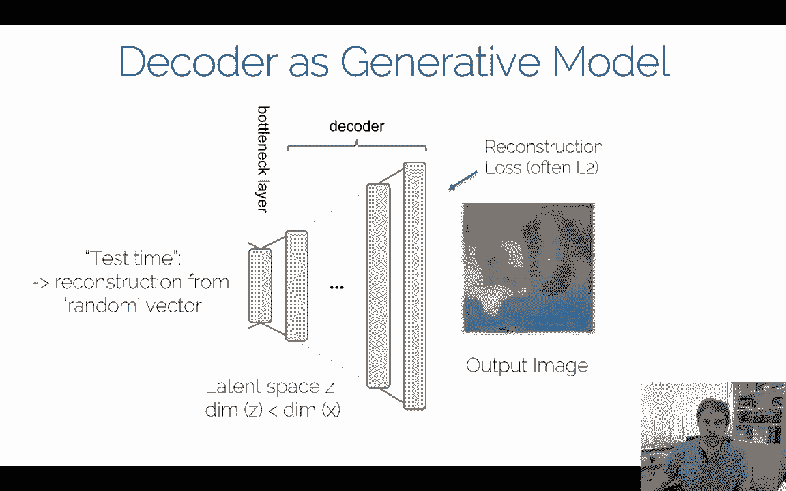

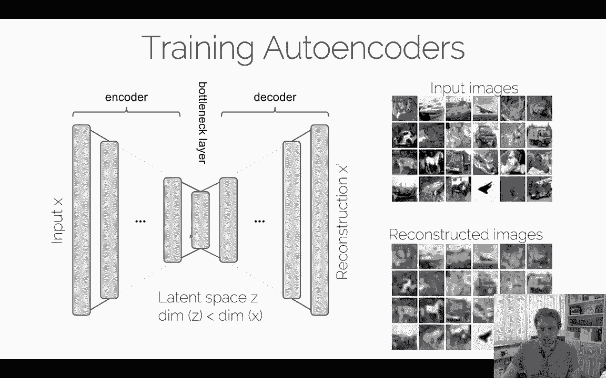

But we have a reasonable decoder that can kind of figure out how to make a real image out of this one again so you can kind of reconstruct from this compressed representation a real image right So the idea why I mentioned compression here is a good one because if this is compressed then I can kind of have the space of all valid real images of a certain domain in here encode it。

 this is a very dense space compared to the possible output space and if that is the case right you would assume that whatever you're feeling in here you're gonna get a reasonable images output。

😊。

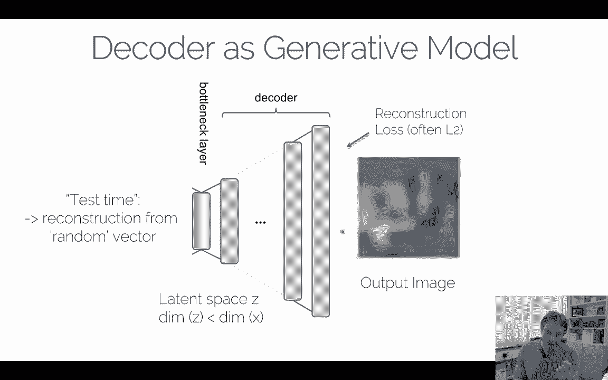

NowOf course in practice it's not going to be so simple。

 of course the space is still pretty high dimensionally in the lant space and you can still get a lot of garbages output。

 but that's kind of the high level intuition how you can assume this right？😊，Okay， but anyway。

 so test time what we do is we just feed in a random vector here so and we want to do reconstruction from this random vector。

And then we're going to get。You going get an output image。And what you can do also is you can say。

 well， you pretrain the auto encodeder， but you can also go ahead and say， well， you know。

 instead of pretraining it， I'm just going train it by fitting in random vectors here to begin with and then you're reconstructing the output image so you can also train directly on this one so you don't have to pretrain on the auto encoder itself。

 but you can also just random vector give me some output。And then you can also go ahead and say， oh。

 because I trained on this， I can also add some sort of semantic meaning into this here， right。

 depending on what kind of training that you have。 so you can say， oh， if my first。

My first component of my latent vector is going to be having high value that corresponds to certain semantic correlation。

 what we see later on in the output image in this case。Yeah， in this case。

 what you will assume is that， you know， the network just learns the mapping from these from the latent space to the respective output。

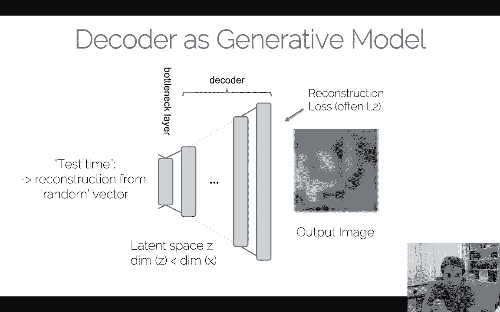

And this is one of the very first works， this is actually paper from Alex Zwky。

 he was in Frebrook at the time and you can train a network like this and then you can go ahead and say。

 oh I'm going to interpolate between my latent space I can go ahead and say。

Oh I have a latent space of this image I have a latent space of that image and I just want to do a linear interpolation in this latent code that I've just optimized for and then I'm getting intermediate results that show kind of a natural transition between the two images。

😊，And these guys have been doing this on well， these guys have been doing this on on single shapes。

 So it was a very， very early paper。 you see this 2014 is the publication date so they could basically interlate。

😊，Between these two channels， this is the source。 This is one image that they have。

 They compute a lant code for that。 and they have another one here。 This is the target。

 And then they simply interpolate in the lant code。 and this like。

Gradually transitions between these chairs。 And the nice thing is now we have our first gene model。

 meaning that we can now， based on this la code， we can control or we can generate new images here。

Very good Yeah in practice you can also change view points here。

 you can morph between the chairs right and you have some certain control of the appearance。

 You see this is not very sharp。 This is not an artifact right now in the video this is actually a little bit lower resolution。

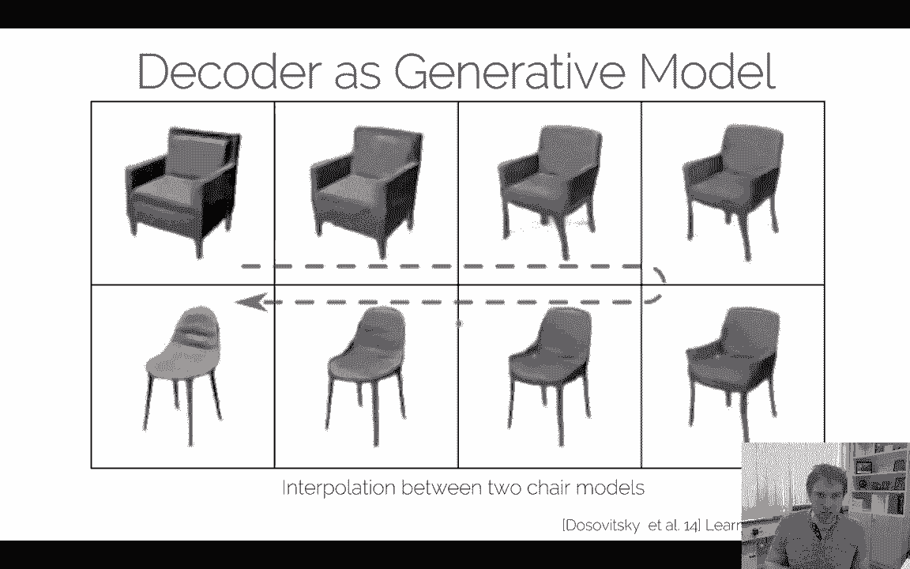

but again， this is a paper from like six years ago。

 but I wanted to highlight this was one of the first papers that actually had this explicit control now from a latent code to a respective target。

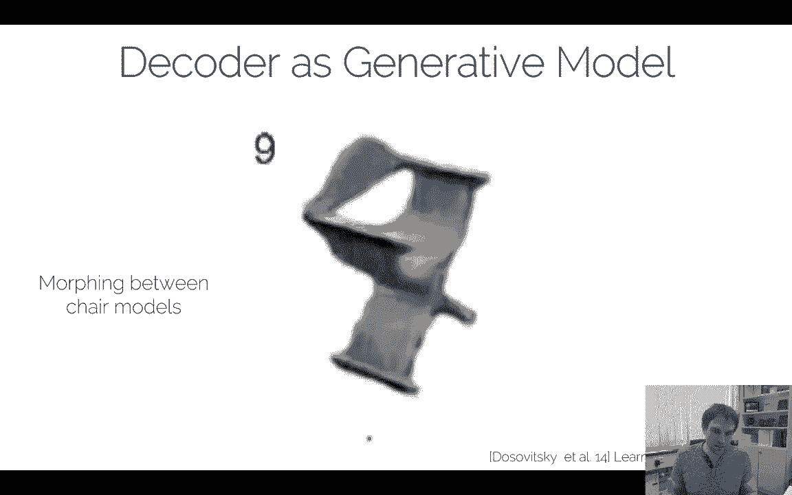

Again， this is still the same idea。 We still have this simple yeah decoder from an own encoder as a generic model right now。

 right， very straightforward and。We're getting these kind of results。Now。

 one thing is what we notice very quickly。 what I mentioned is you know。

 the image outputs were relatively blurry and one reason why that happens is because of our loss。

 in this case， right， we we have this L2 loss that I mentioned That's what a lot of people do。

 you can use， of course， an L1 or hoba loss2。 But in practice。

 you have one of these losses and if we having an L1 loss the optimum is kind of the mean right。

 like you always tend to blur because if you have one outlier。

 you have like a sharp edge that gives you an outlier and the loss。

 the net will favor like smooth transitions。😊，Over sharp edges。

 it's just naturally when you're using an L2 dose。That's by definition， what L Toos is doing。

So it's not going to favor like outliers， but in this case we care about these outliers because this is where we get sharp edges that make an image look realistic。

 right and less blurring。So。😊，The idea now is。The problem is we want to replace this L2 loss and well ideally what I would like to do is I would like to go ahead and tell you what is a good loss function that tells me is it a realistic image or not right like how do I do that。

 Well， I'm going to look at the image and I just know it immediately because I have a good sense of what makes a real image withs a synthetic image right But if you're telling this a loss function。

 this is more difficult right。😊，And the core idea now is。

 instead of using like a fixed function here， what we would like to do is we like to learn that function。

 So in other words， we， in other words， we want to have。😊，A function that tells me how realistic。

Is the image。Or maybe not even realistic。 So how much does it match a certain distribution？

 So if I have a training distribution， I would like to train a loss that tells me， oh， like how， how。

 how good or how well does it match my distribution。And this is the core idea of Gs。

 This is the core idea of a generative everyellerial network。

 So here what we're doing is well this part here is our decoder of an auto encodeder basically its the decoder part and we have in here our latent vector which we had before we have here our generator which is nothing else but a decoder network right it goes from a lower dimensional feature vector in this case it's a random variable。

 but it could be a low dimensional feature vector2 it goes to an image in this case。

 that's our sample so the generated G takes us input。

 the random variable Z that's latent space code and then it generates an image output and now instead of having an L2 loss here。

 what we do is we feeding we trying to learn is this a real image or not and since we have no clue of how to define this loss function which is use another neural network in this case our discriminator。

 this is a second neural network。😊，There is a binary classifier that tells us is this image that we just generate with G。

 is this real or is it fake？And this is our D。 This is our discriminator。Now。

 how does the discriminator know whether this is real or not he needs to have some comparison to a real image。

So what we're doing is we have a binary classification task and we're feeding in real samples and fake samples。

😊，And the discriminator tries to distinguish whether this one or whether it tries to figure out for a given sample。

 is it real or is it fake， so what we do is we randomly feed in either real or either fake ones and the discriminator is being trained is it true or is it not true with a simple binary cross entropy laws。

And the idea is， of course， I'm not going to feed always this one name。

 So I'm just going to randomly feed in fake and real samples。 right。

 So the discriminator has to figure out based on the conduct of the image。 Is it real or is it fake。

And the idea of why we do have the discriminator， though。

 is not that we have a discriminator at the end。 The idea is that we train both generate and discriminator at the same time。

 and the goal of the generator now is to make sure that itfuls this kind of learned loss function from the discriminator。

And the loan loss function means I want to trick the discriminator。 I want to make sure that。

This guy here can generate images that this guy here can distinguish anymore from these ones。

If I had a perfect discriminator。And。I knew exactly， oh， that's a real I not。

I can generate an image like that。That this guy can't tell apart any more than by definition has to be a real image。

Now it's a little bit more tricky than that， right。

 And the reason why it's a bit more tricky is because， well， if this is a fixed network。

Then you're going to have this problem that if I'm just training a generator。

 you will just generate some artificial noise call this adversarial noise that will be generated eventually that will trick this network。

So you have to train these two things at the same time。

 you have to train a generator and a discriminator at the same time。And eventually。

 the discriminator will give you gradients that help to make the generation better。

 That's the core idea of Gs。 This is like this is why it's an esarial network。

 least the disc generator and the discriminator they fight each other， right。

 They try to trick each other。 The generator tries to generate samples that look real。

That the discriminator can't tell apart from the real images anymore。

 and the discriminator tries to tell apart。Whether this is a real element everyone。

Okay typically for the notation here we typically call the latent random variable here is Z。

 this is just the random vector， typically sample from a Gaussian。

 or could be a uniform distribution2， mostly it's a Gasian， we have a generated G。

 we have G of z which is our generated sample， we have x which is our real world image。

 real world sample， again doesn't have to be an image， but we can mostly do it for images right now。

We have discriminationriminity and T of x。😊，Should you know it' the real sample that the discriminator should say。

 hey it's real and D G or Z is the discriminator is now evaluating the generated sample and well hopefully we discriminate it's going to say it's a fake image right？

，Okay。And yeah， if you're looking at these two things。😊。

We have real data on one hand side and fake data on the other hand side and the idea is but by this you know competing process。

 but this adversarial process here， we eventually getting good fake images。

 we eventually getting good images that the generator can do and the idea is that this then lies essentially what we're hoping that we can this is a certain distribution of real images。

 we hope that the generator will also generate certain images that lie inside of the distribution。

 that's also why we call it an implicit distribution。

 what we're learning here because we have no explicit loss to match the distribution here。

 we just hoping by training a generator and discriminator at the same time。

 we hope that were learning this distribution implicitly。

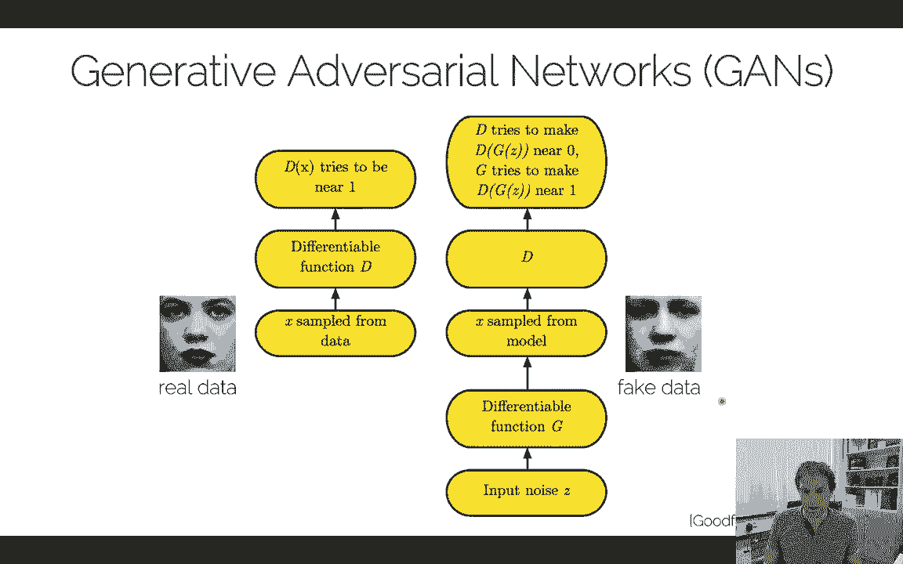

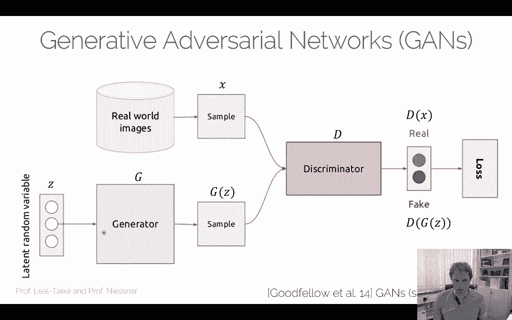

Okay， yeah， but if you're looking at the at the two discriminator and generator processes。

 if you're taking a real sample here， right， we're putting a real sample here as input。

To our discriminator T D and D of x tries to be near1， right， It tries to say， hey。

 this is a real image， I try to recognize that this one is a real image。For the fake images。

 I'm going to start with some random noise and out of this random noise or random variable random lant code。

 I would like to generate an image， and this is what my generator G is doing。

So it generates an image， which is it's a sample from our model。Right。嗯。

This one be feeding it into a discriminator， and the discriminator tries to make sure that。

D of the generated sample is near  zero。And she tries to make sure that this one gets near one。

 right This month， the generator tries to make sure， oh， I'm fooling my discriminator。

 I'm trying to make sure that I can generate something that you。

 you can't tell apart anymore from the real world。And the discriminator tries to make sure I I'm going to nail you down。

 I'm going to know which one is real and which one is fake， right？And these two things run in peril。

 right so I'm going to feed in real images。😊，Traing the discriminator。

And I'm going to train feeding random noise variables to train both discriminate and generated at the same time。

Now， if you're looking at the loss functions， we have here a discriminator loss and we have a generator loss。

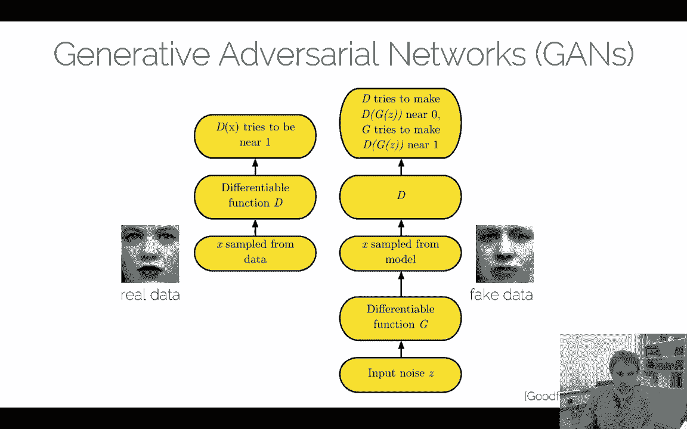

If you're talking about the discriminator I mentioned this before。

 this is nothing else but a binary cross entropy loss right so if we are feeding in so in this case we are here here the real sample X right。

 this is our positive label， this is our one label and then we have here our generated sample this is our negative label where the discriminator should say oh this one should be wrong。

😊，This one should be 1 and this one should be0。And the generator is just trying to fool the discriminator。

 right， we're just going to go ahead and say， oh， yeah。Just please。

 please maximize the loss basically of the discriminator。Okay。

 and we're optimizing for these two things at the same time， so we're playing a little game。

 were having this miniax game， so G minimizes the probability that D is correct。😊，Right。

 we want to make sure that our。Here， our generator tries to fool the discriminator。

And equilibrium is essentially the saddle point right there's no con in this case。

 like theres there's nothing like it says oh now now I fool the discriminator。

 but then I can train the discriminator again and it's going to say oh no I know it again and these two things they mutually get better by helping each other to get better。

😊，And I mentioned this motivation before where we were saying， oh。

 we have kind of this learnable loss function that would des。😊。

D is essentially a learnable loss function。 if you， if you will want to say so。

 And D then provides the loss function or this learnable loss function。

 This discriminator provides the supervision for cheap because were training these at the same time。

 And because of that。😊，we're getting the supervision for the generator。

Now one thing what people have noticed， this was the very first formulation of the Gs here that Goodfeelow provided in this very popular 2014 paper。

This idea of like saddle points and equilibriums is not necessarily something that was introduced in the G papers。

 but for this specific context， it was and。The idea now is basically that were having this discriminator here。

 one problem what might happen is that the generator here。

 yeah this might be still a bit of a problem because the generator might always be wrong so basically if you're never gonna get a a good real sample sorry a good fake sample generator。

 then this loss from the generator will always be high and this loss will always be low in you the problem is there's no like smooth function basically that tells the generator how to get better。

And oftentimes what people do is instead of having this like just the negative discriminator。

 what people do is they use this heuristic method。 If I'm going back。

 this one is still a binary cross entropy for the discriminator。

 but for the generator now we have the negative lock likelihood。

the discriminator of the generator is of the generated images is right。

 and this is a little bit different in this case we maximize the lock probability of D being mistakestaten instead of just taking the negative loss function of both。

The idea behind this heuristic method is that she can still learn。

Even when the discriminator checks all the samples right。

 and that's often the case because in principlely going to have this issue。

 that generation is a lot harder than discrimination。If I have one wrong pixel in principle。

 I know it's a fake image。I mean it's not so easy， it has to still learn it。

 but generation is in principle harder than sorry discrimination is easier than generation。😊。

And this one on this five we have typically this negative local likelihood and I can already say like this is the standard G formulation that most people use today again you're going to go into a lot of different formulations later。

 but this is one of the formulations that a lot of people are using。😊，Yeah。

 so the idea is that she can still learn even when checks all samples because this log loss will not be like so extreme。

 this log likelihood that makes it easier。Okay in practice when you're training this you just have both losses right and you just train them at the same time now if you do this as I already mentioned what often happens is the discriminator will just always dominate the generator。

And often you do an alternating gradient update， meaning that you fix the generator。

 you do an update to the discriminator， so you only train the discriminator for one step。And。

The next step would be now with fixing the discriminator and we're performing one gradient step to the generator and you just alternate right you do this and that and this and that and this and that and this and that and this and that。

This is easier for certain things。 The one thing is basically。

 we only have gradients for half of the network。 So we either need to train generator discriminator。

 We can have bigger networks。 That's one advantage。

 but it's also a little bit more stable because you don't have so many unknowns Youre training at the same time。

 So often this alternating update。Has been being used， I'm saying has because nowadays。

 I think people mostly train it actually jointly， they figured out how to stabilize it with various tricks。

 right？But one thing you can do in these alternating update steps， you can say， well。

 if my discriminator is too strong， I can simply train my generator here。

I can train the generator more often them so I can do one step here， I can let's say five steps here。

 one step， five steps， one step， five steps。Or I can also do it。

Adaptively I can check the loss function until my discriminator loss goes down to a certain level I'm going to do these updates Now I fool the generator now I'm going to go ahead and go to the generator again。

 going to train the generator until my generator loss goes down。😊。

And this way you can balance the two losses， so you' you don't collapse and I'm mentioning this collapsell for now a couple of times。

 Collapsing means typically when the generator is always wrong and the discriminator is always right。

 which is a problem when you don't generate anything。

 you basically have a teacher that tells you whatever you're doing is wrong。

 but it doesn't tell you how。Okay， so this is the vanilla again。

So what you do is right for number of training iterations， what you do。

 you sample a mini batch of M noise samples。 This is our latent code。

 So we have our random variable Z。 We sample our， our real images X from the training data。

And then what we do is we update the discriminator a couple of times， right？And。In this case。

 we have this k loop here that goes over this one here， right and。What we do is we simply train。

 in this case， the binary cross entropy laws of the discriminator。

Now you can argue that you're still updating both weights here， you could also say， oh。

 I'm only going to update the discriminators， that's what I'm saying like sometimes you can split this apart depending on how it goes。

The second part then is here， now you sample the mini batch of the noise samples。

And then you're only train the generator partner in this case here。

 we actually train the discrimator a couple of times， we only train the generator once。Yeah。

 I should say this might not always be a good idea。

 it depends a little bit on how these noise functions behave。How these training functions behave。

 you can see in the losses if your training loss goes wild and wild in this case means if my discriminator goes to0 Im pretty I did something wrong a very good deep I can understand at the beginning of training again is train this function and check that it goes down to0 if the discriminator can go down to0 without out traininging the generator then something must be fishy。

That's just a simple debu step because we will see training these scans is actually very。

 very tricky。😊，Okay， but anyway， what I'm trying to say is in the vanilla again version， you can。

 you can decide。Like there's various versions how to alternate between these things。

 and typically what people do is they look at the loss functions。

 they want to like in the training schedule to check already like how how strong are we update。Okay。

 if you're looking at a training process， it looks something like this， this strain on Ms。

 so we hopefully generate some real numbers。For Ms， this problem is。Relatively easy。Right。

 meaning that we have a small data set right and hopefully after a couple of minimax games。

 we hopefully we hopefully get something reasonable again， we're not converging here。

 we are still in this equilibrium state where the generate and the discriminator they balance each other out。

😊，嗯。Yeah， let's have a look at the loss curves and that is actually something that is very interesting。

😊。

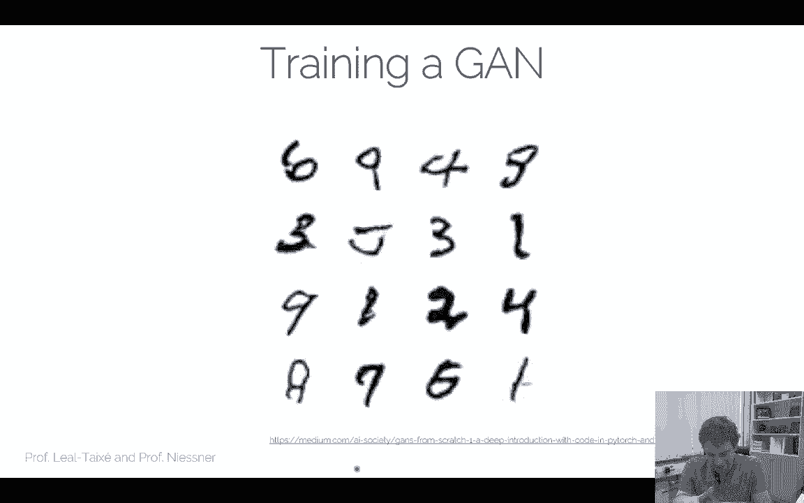

In this oh yeah， one thing I should say here， like whenever you're visualizing the GNs。

 what you do is like in your1 support framework， for instance， what you're going to do is you have。

This one is a fixed lant sand， so you have a couple of fixed random vectors。

Where you want to display stuff and for every iteration you're displaying always the same random variable here。

 same random variable here， same random variable here。

 so they will chiter around based on the training progress。

 but in principle we should get sharper and sharper results and ideally in this case you should see the visual appearance of these numbers。

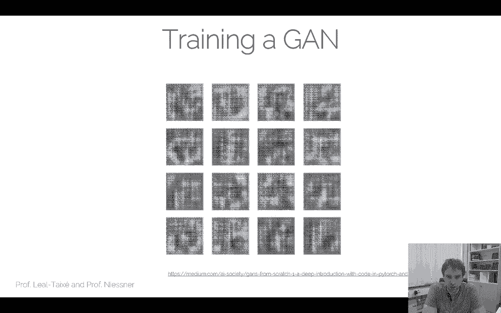

Okay， and one thing that is very important， I'm looking at the loss functions。😊。

We see here two examples， we see a standard mini Maxax game， we see a heuristic method， again。

 practice most people to use heuristic methods today。😊，嗯。

Train losses should look something like that or can look something like that， right， you have here。

I ignore the loss curves here right now this depends of course how you display it。

 but I mean if the generator is like if going back to the loss function here。

 this is just the plane loss in this case， this is just negative discriminator that's why this loss is negative here。

 but let's ignore that for now basically like in this case the generator would like to go up here right sorry generator would like to go down here in this guy would like to go down here。

😊，Okay， but。What we see in this training process is that we see a relatively stable training right so these two losses they don't change too much and even in this case here have the heuristic methods well yeah they go a little bit apart but they don't fully go apart a little bit yes。

 but not too much and after a few iterations you would expect that they're relatively stable。

This is an interesting thing， so now the problem is when you're looking at the loss curves。

 I don't know when I'm converged， I have no clue like this loss function doesn't tell me how far am I my training process yet or how good is the quality of my generated samples yet。

😊，A good learning a good training curve for again is that it's relatively stable I will go into second also about bad learning curves sorry bad training curves and bad training curves would be that if this discriminator here goes to 0 it's still a 0。

6 here if this one went down to 0 then you have a problem because that would mean that the collapse and the discriminator is always right that's an issue I should say also one thing whenever the discriminator collapses to 0 there's no recovery once this happens。

 then you can restart your training。😊，This often happens already at the very beginning which is in a sense good news for you。

 you don't have to wait two days， you know immediately when you collapse and then you can already go ahead and change some parameters。

 fix your box and so on and restart the process。😊，Yeah this is typically how these losses look like。

 these are some generated samples。😊，I mean， on Ms， everything looks kind of O so there's no big difference between minim and heuristics。

 You could argue this one looks a little bit pro here， this one looks a bit Yeah that looks similar。

 I guess there's not so much of a difference here。Okay。

 these are very simple loss functions right now for the game that we use。

 so we have a generating discriminator loss， right， we trying to optimize them jointly。

 either with alternating or with joint training and so on。😊，Now。What we want to do now is， of course。

 we want to generate something that is a bit more interesting than endlessnes images。

 but we want to go to real images。 and there was this。

Well one of the first architectures here that people have proposed was a convolutional architecture it's this DC G paper。

 deep convolutional G paper， the idea is we're starting with 100 dimensional latent code Z we reshaping this to a four by four quote unquote feature map each feature is 1024 dimensional then we have one con fun con1 con Funcom this al deco convolutions this is al decoder right basically what's happening here is we're going reduce the feature dimension。

Right until we at a feature dimension of three for RGP for our image and we're going to make our spatial size bigger from 4 to 4 to 8 by8 to 16 times 16。

132 times 32 and 64 times 64。 so this generator here generates 64 squared images。And。

We can apply this to all kinds of data。 So this again is one of the first architectures people have used there and it's still being used today So it's a reasonable architecture right it's basically。

 well， what you're doing you' starting is a random vector right you're reshaping it to a4 by four feature map and then you're doing decocomutions until you end up with your desired image size。

😊，Oh yeah， by the way， the bigger the image size， the harder this gets right in order to get a big image coherently generated。

 you have to do a lot of things right with the generator and we will see that later how difficult it is to generate yeah bigger images。

😊，Okay， yeah here are some results in MNT again looks pretty reasonable here are some results on cellab A Cab A is one of the dataset sets youll probably use a couple of times in the conts of GNs these are basically。

Portray photos of human faces where the face is relatively centered。

 It looks relatively straightforward， which makes the problem somewhat more tractable， right。

 Basically， since we are trying to implicit implicit distribution here。

 if if the distribution is smaller， the problem becomes a lot a lot easier， right。

 if I'm taking like this problem here of Mnes， my distribution of these punch of like Mnes numbers is is pretty straightforward。

 So of course， it's an easy problem。 Yeah， faces are more complicated。

 But the problem is here for for cell of a， it's a bit la because they're all centered， right。

 and there's all sorts of biases。 I'm not， I'm not gonna。😊。

I'm not going to go into too much detail here， but it's not a realistic representation of the human population here right these are celebritiess data set and they are relatively small distribution of people basically okay。

😊，Bottom line， though， is this is a good data set to start training against because it's a bit easier。

 And in this case， we have about 200000 images we train， right， In this case。

 these are the results that you're getting with these again。 Yeah， looks O right。

 It's not too bad getting getting some some faces。 They look O theyre not perfect。😊，That。

But you can see already now we getting to to somewhat reasonably sized images right it's not like just simple image numbers anymore。

 we can do something with faces。 Here's another result on the Asian F data set。Again。

 we get reasonably reasonable faces again I would like to highlight these also it's also a relatively easy data set。

 again， portrait mainly face centered makes it a lot easier for the network。

Here is an example when you sample through the laden codes this is。

Oh no sorry this is actually the training process I think this is basically it starts here。

 it starts blurry， this is always the same lighting code and then in theory it gets sharp and sharper Yeah again same problem we don't know when were converged all we can do basically for depoing is be looking at these generated images。

😊，嗯。Yeah， I wanted to talk a little bit about that one right now。

 I wanted to talk about how do we know this stuff is working and not working and what do we do if it doesn't work and I can tell you a fair warning at the beginning when you're trying this out。

 a lot of things won't work because it's very tricky to train these gamess。😊。

And we'll get into this in a second why。 It's so tricky。 But let let。

 let's look at the de parkinging steps what we can do。 Well。

 what we can do is we can definitely do this here。 We can again set up tensor board。

 every iterations， we just。😊，Take a fixed number of latent sample codes right。

 and we're looking up always the same set of latent codes。And ideally。

 they're getting sharper and sharper and sharper。Which I guess you can see here to some degree。

 but yeah I guess this gift here starts at the very beginning and it starts it's very pry and then it gets better and better。

If。Yeah there's a few things we can later talk about one problem might be moreco one problem might be that all of these ones look the same eventually that's a problem we'll talk a little bit about that one that means wellma generated。

 generated one real image but it's always the same image that's also a bit of a problem sometimes you get end up with a bunch of them this is a common problem you can see very quickly here if you moret collapse and if you more collapse early on I mentioned this you can hardly recover from that during the train。

😊，We can look at the lost curves。Yeah， these are good loss curves， by the way。 good loss curves。

 meaning I have the discriminator loss here。 We have the generator loss。

 It's a bit wild at the beginning at the very beginning， right， it fluctuates a bit。

 then have a little bit。 you know， you so this one goes a little bit down。

 this one goes a little bit up， but eventually you know， they kind of stabilize here。😊。

Don't go to zero， none of them。They don't go well， there's a little bit of fluctuation but in principle they are doing all fine。

 that is considered to be a good training curve right because we kind of managing to hold this equilibrium。

 at least from a law standpoint。😊，That doesn't mean necessarily it works。

But if the loss was not stable， then I know for sure it did not work。

 So it it's one criterion what we can do here to look at it。 Yeah， when have we done here。

 we don't know we can train it for a long time In principle it's getting better and better and assuming my model capacity is good enough and I have enough training data and my distribution should also get better but I can tell you。

 oh now I'm done with my training right For this one I have to go back。

 look at the images I'll later go into a few details in how to evaluate。

 is it a good image or not Yeah but I can already tell you it's difficult。Yeah。

 I can also show you some bad curves。 Ba training curves would look like that。 This is canonal curve。

 a lot of people will get when they try guns out the first time。

 What's going to happen is this is all a nice discriminator。 right， This is all again， train epochs。

 And what happens， This one goes straight down to0。 This one goes up。

 It will still stay here and go a little bit。 They will be still a bit of fluctuation。😊。

But you can see this one collapsed， this one went to zero， this one went up， no recovery from here。

 restart， fix your box， fix the training data， fix your schedule and stuff like that in this case something went terribly wrong。

Again good training curves look like that I like showing them they look pretty right they start wild a little bit at the beginning。

 but eventually they're going to they're on to balance each other out this is like what's considered to be a good curve again very important if you're looking at the discriminator discriminator should not go down to zero if discriminator goes point to zero。

 something went really really wrong。😊，Well， we have yet another one， by the way。

 I just just typed into Google good training curves for GNs， actually no I didn't do that。

 I just typed in training curves for GNs and then I picked the good and the bad ones。😊，Okay， again。

 good one goes a little bit well here， right， discriminator stabilizes goes a little bit wellier。

 it's generated also stabilizes again， very important that the stabilization happens。😊，Okay， yeah。

 I mentioned the training schedules we've seen for discriminative networks and new training schedules like how to adapt the learning writing and stuff like that。

 We have the same thing here。 Now， the problem is we have to adapt both of them。

 We have to train discriminator and generator。 I mentioned this in the alternating schedules。😊。

Basically， what you do is you have these thresholds while loss discriminate gradient than threshold。

 train discriminator， while loss generate a greater than loss a threshold of generator。

 train generator。Again， this is not always what's happening today。

 you can train them at the same time if you fit in your model。

 if your batch size can be large enough for whatever you need and so on。And。Yeah， there's a lot of。

 there's a lot of different things。 How you。How you can balance with these two things so this is basically the one thing that you have to play around with and it's you need to get a bit of experience。

 which setting to use。😊，And the problem is， of course， depending on your problem statement。

 these settings will be completely different。😊，So。Yeah， one thing。

 I want to discuss a little bit about the strength of the discriminator。

So what is the strength of the discriator going to do？And。Well。

 the whole point of again is that we have this equilibrium but these two things they balance each other out and none of them collapses because you could say。

 well， my discriminator is weak， it's not a big problem right because my generator can now generate great images。

But my problem is， if my discriminator is too weak。

 I'm getting not very good gradients to train my generator again。

 there's no explicit loss on the generator aside from training the discriminator at the same time。

So if my discriminator is bad。And。I just say everything is kind of wrong。

 or everything is kind of right。 I'm not getting a signal for my generator to generate better images。

 so you cannot get better than the teacher if my discrimator is too weak， I have a problem， right。

 It has to be。 it has to be strong enough to tell me what to do and tell me what to do means it has to discriminate and give me crs how I get better myself。

 right。 This is like how this process works。On the other hand。

 if my generator is too weak or if the discrimator is too strong， right， I mean。

 these are obviously synonyms。😊，My discriminator will always be right。

 if my discriminator is always right， that's also a problem because then the teacher is going to tell you you're wrong。

 you're wrong， you're wrong， you're wrong， and now even more wrong。

 but it doesn't tell you a good gradient how to get there。😊，In practice。

 you need good balance and good balance means roughly well discriminated generator should have a similar capacity。

It depends a bit on the problem。The first set of problems where you could say， oh。

 sometimes the generally needs to be twice as big， but it's unlikely you could see something like。

 oh， my discriminator is like 20 times as big as my discriminator。

So generator discriminator should roughly be in the same scale。

If you find that the discriminator gets too strong and this is something that will happen。

 you have to figure it out with the right training schedule right you have to go back here and check how to do that。

 possibly how to have different regularization and so on， but in practice。

You wanna have roughly the same capacity。So that's very， very important。

The next point I want to mention is mode collapse， I mentioned it already。

And mode collapse is the problem。When。We only generate a small number of good images。

When the generator is generating a small number of good images and the discriminator says， well。

 they look like real images seems good to me。But you don't have enough variety。

 So you need to have enough variety。And this is a problem that happens often very early in the training process。

 and this is a real issue。And there's this fundamental difference right now。

 how we are ordering our training if we have the discriminator in a loop or the generator in a loop。

 right？If my discriminator is in the inner loop， so let's see what's happening here。

 right I have here， I maximize。The discriminator， this is my inner loop and minimize the generator and the outer loop right there。

 here's the other way around here， the outer loop is the discriminator。

 maximize that one and the generator in the inner loop。嗯。If my generator is in the inner loop。

 which is this case here， it's very easy to converge to one sample because what I'm going to do is。

I'm going to at the moment。I have a given discriminator。

 and all I want to do is I want to fool that one discriminator。

 If I always generate the same right sample that the discriminator thinks is okay。

 I will not get a very good distribution。 So this will always。Not always one example。

 but it will converge very likely to a small number of samples。

If you have the discriminator in the inner loop。And the in the generator here on the outer loop。

 then you should supposedly。Converge to the right distribution， right。嗯。And that's very important。

 right， That is a very important thing。Because in this case。

I have to always be this guy will basically be trained。While this guy's being trained， right？

And this is what I mentioned for in this vanilla again。

 This is why you have typically first the discriminated loops， which is that one。

 and then the generator loops。 However， you can still have different schedules where you can train the generator a couple of times here。

 too， right you can still do that。 This really depends， though。

 but you have to be aware of this problem that it arises。

If you're training this guy now in the inner loop， you will typically more collapse。

 and that's a thing to consider。Yeah， I'm going to talk a little bit more about more collapse。

 Another interesting thing is the data dimension。😊，What are you using？So this is a graph here。

 this here， these different curves have anyfold dimensions， right。

 This one is the number of modes that we're trying to recover。

And this is the percentage what the actually did recover， right？So if were having more modes。It's。

 of course， harder to recover all of them。Meaning that the recovery rate will typically go down。Now。

What we're trying to measure here is we're trying to have the mode recovery versus the number of modes。

 so the performance。Correoids with a number of nodes。 right， This what I'm saying。

 If you have more modes， it will， it will be harder。If my manifold dimension is going to be high。

Right this 128。嗯。Yeah， then this is even more extreme。If a manifold dimension is lower。

 this is a bit easier， so the higher my dimension， the harder。嗯。Yeah。

 so part of the reason why we often see GNs on specific domains。

Is because we want to simplify our distribution， right， We simplify our manifold， basically。

And because of that， I can most likely recover。Well， I wouldn't say all modes。

 but I cover a lot of modes， like you never recover all of the modes。

And that's unlikely well this this is a toy example， this is not a real image example， right。

 but in practice。😊，If you're having a simpler domain。

 you can recover more modes because you can sample the full domain and then the training becomes easier。

 if you're having a larger domain， In other words， what could happen is a generator picks a pretty good sample。

 looks like a real image。😊，It matches most of the other stuff。But then it turns the same image。

 again。Right， then the generator and the discriminator can't tell it apart。 So in practice。

 this is very important here that you're saying。嗯。Number of modes。Next more recovery rate。

Lower because it gets harder。And often what we see is， well， we're seeing like smaller distributions。

 so we don't have to recover so much stuff。This is why faces work pretty well。

 an image and that doesn't work so well。Let's have a look again at the manifold。

 well and we had this partially from the other one。

 but if you're looking at the mode recovery versus the manifold dimension，😊。

A larger latent space means。More mode collapse， which makes sense because it's harder for the discriminator to figure out this entire space at once。

RightIt can monitor itself to see。 So here what we're seeing is here we have the recovery rate again。

And here we have the manyifold dimensions， right？We have also the data dimension。

 like manyifold is like late vector Z dimension right and this is the data dimension。

 the data dimension doesn't seem to matter too much here。But basically。

 it goes down the lo of the space。😊，But you also want to have enough control eventually。

 so you want to have reasonably large space。So this is something you have to also consider like how big you want to make that space。

Yeah， the reason why I talked about this mod collapse。

 this is something you can and should figure out early on in your training processes， again。

 how you do it， you just visualize a bunch of samples in Tensor board and then you see what's happening。

I also want to mention some of the problems that GNs have。

And the funny thing is these images on the first glanceand look kind of cool and look like a real image。

We getting in full by this Na too。But what we see。They are not real images。If you're looking closely。

 I don't know what's happening here or here， right， It's looked like a dog， like a bit of talk here。

 bit of talk there。 looks like one，2，3 legs here。Something went really wrong in these images。

 but on the other hand， they look kind of a reasonable color distribution。

So the global structure is a big problem for GNS， and it's not surprising that if I'm making my image dimension bigger and I have a larger image to generate。

 this global structure will even be harder to be achieved。In practice you have to train longer。

 in practice you have to have bigger models， but the bigger your model， the longer you have to train。

 the more likely to have things like mod collapse or your loss is diverging。So that's an issue。

 Turn speaking with a structure， a one one common problem is you have often problems with counting。

these are fun samples， you have a lot of ice sometimes here a lot of ice I think。😊。

I don't know what's happening here。Oh here right， something went really wrong like locally the features are okay if I'm going to give you this little patch here。

 it looks perfectly fine， but the global accountss are just wrong。😊，嗯。Yeah。

 one thing you have to also consider。Like if theoretical alreadyically what we're doing Gs are perfectly sound right。

 We have this generator。And we're learning kind of this implicit distribution。

Now the problem is implicit distribution is still being represented by a series of 2D deconvolutions。

 right you have a bunch of 2D operators that have to encode the whole space of images in the training set。

And convolutions are inherently a local operator。😊，Local means well。

 I mean I have a three per three conf， I can locally check what's going on in order to get a larger receptive field I have to have a series of convolutions。

And that's a thing。That is。Very much exhibited in these cases here where you the larger it gets。

 the more global the structure has to be， the harder it is for confident to do it。嗯。Yeah。

 it's just how it goes。Yeah， okay。 so these are common things but we see where we have problems。

I talked a little bit about what you can do when you train GNs and how to evaluate it。

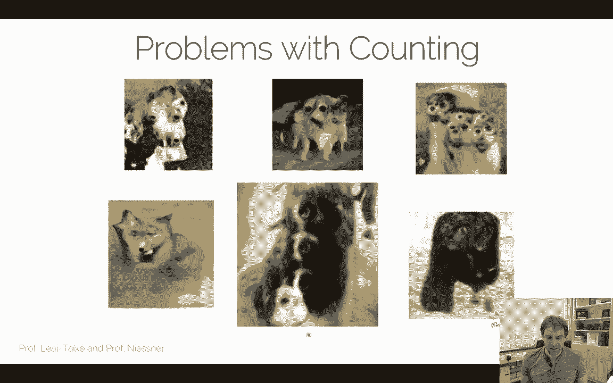

The question is， how do we quantitatively evaluate the performance of Gs。 We already noticed that。

Yeah， the loss function is not going to cut it for us， right。

 The loss function is not going to be so easy to look at。嗯。

The main difficulty what we have with GNs is we just don't know how good we are。

 we don't know whether they converge， we don't know whether they need to train longer。

 we don't know whether it's not working right now and it will get better and so on， but it is a very。

 very difficult problem。And the research community， I mean， I'm a researcher。

 I can say that I'm part of this community， but one weakness of the community is often in papers。

 you see very， very good results。And what we can do is you can just sample a couple of times and take the good results and ch pick them。

And。That is a problem， right， because we would love to quantitatively evaluate。

 but it's very difficult。 So does it always look good or is only some of them being good， right。

 What are the good were the bad cases。 And that's very hard。 I can't put it so easily in a table。

The second question is do we just memorize， do we analyze right， I mentioned oh， well。

 we have a training set in the real samples， do we just memorize a bunch of them。

If were memorizing these ones from the training set， my discriminator， by the way。

 if I'm perfectly memorizing it， my discriminator can't tell them apart。 There's no way。

 So the idea is my training set has to be big enough that my model capacity can't fit in it。😊。

That's still the same thing。 You can still have overfitting problems here， too。Yeah。

 but it's difficult， it's very， very difficult。😊，So what do we do in practice while in practice。

 one thing I told you we look at the images， were looking at the human evaluations。

 every in update steps， you show a series of predictions。

 these predictions typically should be from the same length code right you have maybe you're showing like eight by8 images。

 but they're always the same late and co the visualizing。😊。

Check the training curves if you're revering， if discriminateator is collapsing。Here。

 check if it's getting better or check if we have mode collapse。 These are the things we can do。呃。

At the beginning。It doesn't look very good， but you can check if you have enough variety if you visualize 8 by images and you only have like three different types of these 8 by8 images。

 and you have a lot of duplicates in there。 even they don't look very good and you have a lot of duplicates。

It's a problem because you just more collapsed， right？This one you see very much early on。

 And if this one goes wrong at the beginning， it'll never recover。 that's just the pigish。Yeah。

 it doesn't look good。 What do we do， We go back different hybrid parameters， different networks。

 different learning。 most of the time the learning schedules make a big difference。That's。

 that's one of the number one things you can try。嗯。Okay， this is human evolution？There's also。

Some ideas of doing quantitative evolutions。And one of the most popular ones is called I Inception scores。

嗯。I can already say there's a caveat， the inceptance course。They are not perfect。

They're not telling you 100% what's going on。So the inception scores diminishes salliency and diversity。

嗯。You typically。The idea is basically training a classifier。Right。

 you train an image generation model， and then you check how accurate is the classifier。

So can you kind of recognize the generated image that's kind of a high level idea。

 and you make some assumption of the underlying data。So what do we want to do is。Let's say。

I'm gonna generate images from 10 different classes。And I want to make sure。That my classifier can。

Associate each of the generated samples。Precisely to one class。

So let's say I'm generating cats and dogs。 If the classifier tells me it's a dog， 100% dog， I'm good。

 if it tells me it's 100% it's a cat， I'm good。If it's half dog， half cat， then not so good。

 then I generated something weird。RightThat's kind of the idea。 And this is called salliency。

 This is the first term we have to consider。诶。Check whether the generating image can be classified with a high confidence and high con means you just look at the classification scores。

😊，Really simple idea works to some degree right， I mean of course。

 that's important we need however a second part which is telling us we need some diversity。

It doesnn't help us if we only generate good dogs， but no cats。 It's not good to thing。

 So we need to check that we get it。A uniform distribution of all classes。

 This is what how religion magic should tell us。Yeah， because。

It's its we want to have both right we want to have diversity。 You don' want to have staency。

 that's what the inceptionious course I'm measuring。 There's still a problem。And one problem is。

 what happens if we have only one good image per class。And if you have enough classes。

And we have one image that is good per class， but every other image per class is not so good。

 or we don't have a lot of other images。 we might still be more collapsed and we might not notice it so well with the inception courses。

So even though inception scores might be high， diversity might not perfectly be covered， right？So。

The short story here inception scores is what people use to quantitatively evaluate it。

 There's a couple of variations of this like FIT scores and stuff like that。😊。

They're all very similar。But I can already tell you， they're not perfect。

But none of them are perfect。So we have to still look at it。 This is a difficult problem， right。

 It's basically like， oh， look at a picture。 Tell me how， how realistic is the picture。

 Like that's yeah， that's the question we had at the very beginning when we said， well。

 we need to have a loss function。To reconstruct or generate images。

 right That's what we're learning with again， but the again is learning and we have to develop it again now。

 So it's very difficult to do this by hand。There's a few tricks you can do。

 you can check the discriminator。😊，If the discriminator， by the way， it's a good debug metric。

 whenever you start training again， all this trying to discriminator first check if it's going down to zero。

 Of course， you're not getting reasonable results， but you're checking that the discriminator can go to zero。

 if that one doesn't hurtt， then you have something。

But one idea what you can do is you can train a discriminator and again you can take the features of the discriminator。

 can put this into a classification network as a pretrained feature learner。

 find in a little bit and see if you get good features with that。If that is the case。

 then you would assume you have trained a good discriminator because you got got features out of it。

If that happened， if you got these good features out of a discriminator。

You would assume the channel item must be also good。It's just how it goes。 if the generator。Yeah。

 the generator must be goodd in that case。嗯。That's the thing I feel is a bit hacky。

 but it's at least one way to figure out， oh do we good features or not？Okay。

That's for now it's for how to evaluate Gs。But in practice。

 I can already guarantee you it's very tricky to train。

 so I wanted to talk a little bit about what can we do to make Ginsburg in practice？

In practice there's three different things you can do， you can fix hyper parameters， right。

 training schedules， learning rates， possibly optimizers， possibly optimizers， possibly sampling。

 possibly data distribution， training sets， stuff like that。

That's the most important thing we're going to look at There's a choice of loss functions。

 We have seen two loss functions so far， we have seen the the standard miniax scan right we have seen the heuristic method we'll introduce a couple of more and then there's a choice of architecture。

What decomvolutions do you use， stuff like that， For the most part。

 we only kind of look at this one to bebug。This is the most reasonable thing to look at In practice。

 people always look at the other two， which I don't understand why。

 So they' changing loss one is all the time and then they。

Because nothing works change the loss function， that's always a thing。

 but I think it's a terrible advice you should always look at these ones here first。In practice。

Starting with a heuristic method here is a good idea， architecture just started the DC game。

 that's why I mentioned it is also a good idea。They might not be the best ones。

 they might be better ones， but these things they work if you're choosing the right higher tournament。

Okay， yeah， let's have a look at a couple of practical things what people have been looking at。

And there's this cool website called Cananhex， some of stuff might be a bit older now older like two years old。

 maybe so but there's a couple of cool things on this Kanhex website so I wanted to quickly go over it。

😊，There's a few things you want to do， normalize the inputs。

 that's an no brainer because you want to make sure your distribution is within a reasonable space。

 like if the parameter space of a distribution is bad， then it's very hard to learn。嗯。

What's very important。 And this is a channel thing。 by the way。

 check out your last layer of your generator。😊，Most people use。

 if you normalize it here between minus1 and 1， you have a 10 h that maps it between minus1 and 1。

So by definition， your generator will generate samples align in this distribution。

Let's say for simplicity， I'm going to go ahead and I'm going to use instead of a 10 H。

 I'm going to use a sigmoid。A second one will map by values between0 and1。

But if my inputs are between -1 and 1， I think my discriminator has a pretty easy thing to say， well。

 if there's no negative numbers， it's all fake。 right， So these are common problems what people have。

 Either of re look， Oh， by the way， this is the most common bug that people have。

 They just in the last layer of the generator。They have a relo。

 and this one is some weird normalization that goes negative。

So make sure these two things match each other if they don't， youve got a problem by the way。

 obviously you don't learn anything， your curse will just immediately collapse。😊。

By the way try it out right， I mean， just do something like this and use it relu here or sigmoid。

I think your discriator should just go immediately to 0， right。 It's just straightforward。嗯。Sampling。

 what kind of samples do you use， I mentioned before。People can use a uniform distribution。

 most people use a cautionus distribution to sample in the latent space。What people often say is。

Uses fertile sampling and fertile samples means it is a Gausutian sample。

 but it lies the on the sphere。 So your length of the vector is always going to be one。

So you just normalize your sample space， it makes it a little bit easier。

 The reason is you just you still have the same control in terms of the dimensionality。

 but the number of the dimensionality sorry effective parameter space goes becomes a lot smaller。

Okay， and when you do interpolations， you can interpolate。On on this， on this surgery sample here。

 you can say， oh， you have to check on the great surgery， right， Like。

 how are you gonna play from one sample to another。

There have a lot of literature by Hawaii way how to do the sampling。

 you can normalize it to make sure it's on aphere， you can also not do it。

There's a lot of different things。

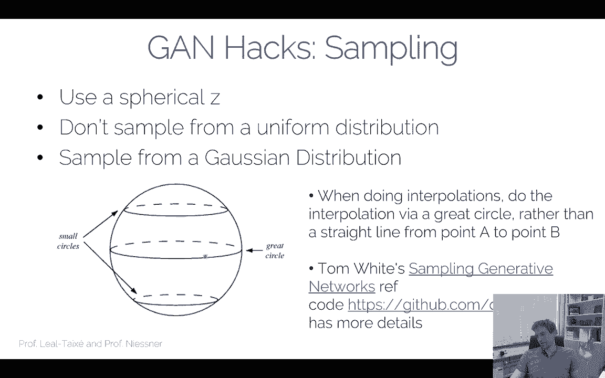

It depends a little bit on the problem。嗯。Bten norm is a fun thing This is a thing I would take with a bit of a caveat a lot of people say oh don't use batch norm anymore I would say depends but it it's one thing you can play around with at least sometimes your also just need a few options。

😊，WithWithout Pe arm， that's one thing。 typically people use Pe arm。

 that's what they recommend here too， it depends a little on the problem。

What you can do is you can construct different mini batches for real and fake。

Meaning that you can say one mini page contains either all real or all generated images。

So that helps to stabilize the training a lot。 The reason facing you're getting all gradients for real or all gradients for generate。

And that makes， especially for the discriminator， it makes it much easier to train。

 And that's the thing typically people do。 It depends a little bit on the batch size。

 I don't have an advice here。One problem is theres very this。

 we'll see this later in the next few lectures。There's the two state of the ArcG methods。

 one of them is the stylegan line from NviDdia and the other one is the Biggan I think it's from Google these two are probably leading groups like training crazy big G models for like weeks basically and try to get good results。

One of them uses small patches， one of them uses big patches。诶。Which is contradicting the settings。

 but they both get good results， but in between nothing works， so it's an interesting thing。

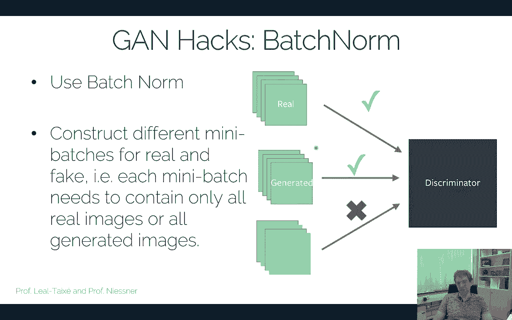

The optimizers， people typically use Adam for the generator， SG for the discriminator。

 that's the thing you can play around with。三。This was then a thing， I don't know。

You see this very quickly based on the training curves。 If， if the training curves don't look good。

 you can change stuff here。 That's the first thing I would always do。 Check your training curves。

 and you see this after a few minutes， basically。😊，One thing is one side of label smoothing。😊。

That's an easy one。 you can say in the discriminator right， like for the real samples。

You just penalize them part a little bit。So you have a Lada function here that makes the discriminator here a little bit weak in terms of the confidence。

😊，Gifts it like 0。9 or so。Yeah， this encourages a bit more extreme sampless， which is good。

 right It doesn't always try to be on the safe side。 So it makes this part a little weaker。

 so it reduces the confidence here of the discriminator which which is good by confidence right。

 obviously what you're getting now your score functions for the real images will just be a little bit lower。

 That's all you're doing。 This is this one sided labels moving。 The sum works reasonably well。

 can do it to extreme， of course，0。9 is a reasonable number here where people use seems plausible。😊。

Another thing people do is they use historically generator patches。

 so what you do is you have a discriminator network and a generator network right and what you can do is you can generate stuff over a history of iterations。

And you can just mix your your generated samples in the current batch。

 So your discriminator will see not just the results of one。Discriminator。

 so it will basically see discrimininate ass from multiple iterations， especially at the beginning。

 This is very important， oh it's not important。 it's a very good idea because you will actually stabilize the discriminator a little bit It's not so heavily overfitting to one type of generator。

 but it's spreading it a little bit。😊，So it's learning kind of a distribution not of a specific generator。

 but it's learning a distribution of all generators。

 well not all of them but the last n or something。😊，This is a relatively good idea。

 it's an easy implementation and it seems to help quite a bit at the beginning。😊。

Another thing is sparse gradients。Stipability of the gang game suffers from gradient and spars。

 that makes sense that's the same thing for every other neural network right if you have no good gradients you kind of screwed。

Licky reloos is a thing that people often used for both generators and discriminators。

I've always seen parametric res actually， looking really seems to be a good compromise of what people use。

Still high level advice just use use again to start and then once you get this one train then you can play around with these things this one will not make a break it right away if you have a broken architecture。

Down sampling use average pooling conscious strides， upsseble use decocon stride。And so on。

 there's things like pixel shuffle you can do helps a little bit。But yeah， I mean。

 this is something you can actually debug。 You can go ahead and。

Literally visualize your gradients right you can see how good the crians are if your gradients go crazy。

 then something went viral wrong， This is something you should be aware of。

But you can see that actually right， you can check U crinians if they go to crazy then it's a problem。

And you see this also relevant early on。Another idea is exponential averaging of weights。😊。

One problem is， well discriminator can be noy through STGD， which makes sense。

The problem is what you have at the very end of your training process。

You're gonna have a lot of impact from the last iteration。 right。 There's a lot of noise there。

So one thing people do is。They take basically an exponential average of the weights of the neural network。

 So what I'm going to do is I'm going to store。Let's say I'm going to run my network for new iterations。

And I'm going to take my network and take an average of the last 100 durations and just average the neural network weights。

And you can of course， not just do a simple average。

 you can do an exponential average and can compute this running average while you optim it。

Um and this is very good at the end because then you don't have these outlier samples anymore。

 these noisy things。😊，So you kind of want to avoid this bias towards the last iteration and this exponential average is easy to implement。

 you just keep a second vector of the weights around， you just have one update there。

 almost no cost helps a little bit。This year is not helping your training too much but it will help your overall results potentially a little bit it's not going to a major leap but it's still a good idea for your final deployment。

Okay so these other things you can play around with I give you a lot of options。

 there's no guarantee that one or the other will fixer will make or break it but at least you want to have a bunch of options what you can play around with what I could always recommend start very simple。

 type a simple architecture like these again， try it out and end this first。

 then go to cell of a play around with that and see how you again behave。

Now I still want to introduce a bunch of objective functions。Off the Gs。

There's a couple of actually as many objective function again， I'm not going to go all of them。😊，嗯。

With the caveat right now。That。Don't change the objectives too many times。

 typicallyypically just use the heuristic method。 That's a good idea。

I still want to show you the implications of changing loss functions。

 but most of the time your again will not just suddenly work because of a different loss。

I mentioned heuristics of standard that's the easiest way。

 it's not necessarily a standard for deployed networks， but it's something you can always start with。

I want to go over a couple of them， one is EBG， PganN， WKN and LSGN。

The loss function again alone one rigid work。嗯。I want to quickly go over these。

 I would encourage you Heath a read afterwards at these papers。

 I might go quickly over it and I' want to spend too much time on it。

But I think it's interesting when you read these papers what people thought about their insights。嗯。

Let's have a look at the EB G paper The EPGN paper paper is basically EB stands for energy based scan。

 The idea here is the reformulating the discriminator so basically they're saying my discriminator takes some sample X and the idea is I want to reconstruct this image perfectly This is just an autoencor formulation My discriminator says I want to have a good autoenr function。

嗯。This is what my discriminator is going to do and I want to basically for real images。

 I just want to say， well， I have good reconstruction， that's it or encoder。

 we want good reconstruction。😊，Now， what we're doing is we want to say if we are having a good reconstruction here。

And we pretrained this guy。Then if it's a good reconstruction， then it was a real image。

If we have a good discriminator train on real images here。

And we're feeding a new image in and it doesn't have a good reconstruction。

 then it's not a real image because it wasn't reconstructed well。 that's kind of the high level idea。

And the way you do this is you simply say well when' training the discriminator I'm feeding a real image and a fake image or a la code in there。

 well let's start with the generator first， generator gets la code。

 generates image is being fed into the discriminator right， going to optimize for that function。

 that this generator tries to make sure that in the same way the discriminator could reconstruct stuff in the same way you could reconstruct stuff with the generator right？

😊，Um that's what I'm saying， like there should be no difference in the reconstruction quality if it's a real or it's a fake image。

😊，The discriminator， however now says， well， I'm going to train the discriminator that's this part the first possible of the loss function。

 and now I'm going to say， I want to penalize the discriminator if the reconstruction error for generating image。

Drops below a certain value。 So I'm， I'm just going to penalize and say， well， okay， look， I wantna。

 I want to drive you apart。 I want to say you were a fake image。

 You should not be well reconstructed。But I'm only going to do this up to value n that's kind of what the EBN is doing right and I'm going to train these too jointly and hopefully I will drive these two apart。

 I will get a laymen coding for real， I will get a layden coding for fake and that is if I train both of them at the same time。

 my generator will figure out how to move them together and the disc scriminator tries to move them apart。

😊，So we're trying to get these lant spaces。Separated out or together。

 depending on whether you discriminate or the generated， it's a little bit reformulated。😊，B， again。

Has a similar idea on that。So B again is similar than E again。

 except now instead of reconstructing a loss。Or we measure the difference in the data distributions of the real and the generated imagess In other words。

 we're going to go ahead and we have a real distribution here。

 we have a fake distribution here and we're trying to measure the difference between those two。😊。

There's various ways of measuring these differences。😊。

A very common way with people doing is looking at。The vstein distance or the Earth move distance。

 same terminology。And this is this double you again， which is essentially it followss out of that。

 The idea is I have a distribution here。 there's a bunch of blocks and I want to reorder these blocks and move them from here to here。

 So I have a distribution P and I have a distribution Q and I want to figure out how different are these two distributions and this v time distance。

Tells me how different they are right and how different are they Well， I want to figure out how much。

 how many， how much work do you have to do to move this one from here to here。 This is。

I have to move this block from here to here six， moving this5 from here to here costs also some work right so everything you're moving from here。

 moving the earth from here to here costs you some effort。UmAnd。

That tells you how different if I have n samples here， I have n samples here。

 I can figure out how different are these two distributions。This works for discrete cases。

 you can formulate it on continuous cases too for the sake of the theoretical framework here were going to think about continuous distribution right but it measures the difference between these two different distributions。

😊，嗯。One like problem here is this is a very costly operator， right， computing faster distance very。

 very costly。😊，There's a few ways how to reformulate this problem， right， what you can do is。

You can say you have a function f of x。You want to figure out basically samples from one and samples from another distribution。

 and you to want to figure out what the difference here is and。The the E D， the earth of difference。

 can be formulated as the supreme of the difference between these two functions。

Sorry between these two different distributions。And。This one， however。

Only holds if this function F that be used for the sample X。Is one lipitz constant。

 It's a1 lip function。By the way if you call lipstitz means if you have the difference between the two functions between x so you found function f。

 you're feeding in x1 or x2， the difference between the function values is smaller or equal in the difference。

 the absolute difference between the parameter values you fit in right so it's an upper bound between the densities。

😊，I'm not going to go into detail how this one here is derived。 This takes a little bit more math。

 You just have to believe me right now， taking that estimate here， the sume will measure。

It's basically the dual of the Earth move distance。And this is something we want to look at。And。

The challenge what we need now is you need to find a function F here that fulfills the lips constraintstrain。

And。If in this case。Is a critic function。That tells us the quality of x basically the sample is from PR and the sample here is from PQ。

 and we want to figure out how far apart are these guys。And。

What would be nice if I had a critic that would tell me this right away。

If I had a critic that told me this for every sample of the distribution。

 and here I have a critic for every sample of the distribution。

And I'm getting the extended values of the difference here。😊。

Then I would know how close my distributions are。Now。

 the problem is this function is very hard to define because let's say I have a bunch of images。Well。

 who knows how close the distribution between these images are， can do this on a per pixel basis。

 but computing this earth move distance， as we know is very expensive。

 especially if you have a bunch of high resolution images。😊，So we do what we always do。

And when we don't know it， simply we learn this function F， so we're learning this credit function。

And。In this case。F is a neural network because we want to learn that function we don't know it right the only thing what we have to make sure now is we have to make sure we don't violate this onelipious constraint。

😊，So F needs to be a oneliperitz constraint。😊，And in the optimization process。

 we just have to make sure that this lips constraint is not being violated right。

 So what we do is we restrict the maximum weight value in F。嗯。

And the way we do this is the weights of the discriminator。

 we just control them by a hyperparmeter C and this is called bait clipping。

 so what we do is we just say oh my weights can get closer or smaller than minus C and plus C right so we just restrict the function values basically so we have eip estimate with C if I'm taking a bigger C。

😊，Well then then I'm more loose， if I have a smaller C。

 then I more tighter and we go into this a second but this means if you have a smaller and a larger sea。

Okay， so this is controlled by this hyper parameter C and the weights are still being updated off this cr function。

 Again， this is just for the critic here。 is for this F will become a critic function or is a critic function now that we model at the neural network。

 We want to optimize the parameters of the neural network by having RMS Pro。 we do clipping。😊，And。嗯。

What we're optimizing now isre optimizing both a generator and a critic。

And this is what's happening here。 So here we we have a generator。We have a critic。

And the critic is trying to measure the distribution。

 the distance of the distribution from the generator and from the real images。 So right， again。

 this is our function that we have the supre let be optimizing for again， quickly going back。

 that's what we're optimizing for。 So we're just taking a discrete number of samples。

 which is m samplesd here。We want to make sure the difference between these two。

It's going to be minimal。At the same time， we have to optimize for F。LikeBecause F doesn't exist yet。

 F is a neural network， I don't know the function， how to compute the earth move a distance between my samples。

So I have to jointly optimize for both the critic that tells me how close are the distributions and I have to minimize the distance between the two distributions。

 that's what Bastan G is doing。😊，嗯。Yeah， what we do here in practice is we have here。

 we have the function F， here's the real sample， we have the function F and here's the fake sample。

 right doing。Again， in order to optimize our generator。

 we are optimizing these two together we computing the gradients。Of F and G。

 right G has also weights and at the same time were trying to make sure that we getting a good credit function。

If you're comparing this to the standard GNs and the reason why I'm going over the Wasakhan Gs。

 theyre actually widely used in practice， if you're comparing this to the standard GNs。

 we have in here the GN formulation， the GN formulation we had here that the gradients here for the discriminator was the binary cross entropy。

 now what we have in the Wasakhangan for the discriminator is this critic that measures that uses a critic function tells me what is the difference between these two distributions。

😊，In the can formulation for the generator， well I had this negative local likelihood。

 I basically want to make sure my generator produces stuff that discriminator doesn't recognize。

 And here I have gradients that that that optimize for F meaning that。Yeah，'m。Sorry。

 I'm basically saying that my critic tells me， oh， it's a good distribution。Okay。

 if you're optimizing that， you will get something like that。😊，诶。Yeah， what do we get。

 have here we have here a loop let's say well we're not converged。😊。

And conversions will become a new meaning now because like here again。

 we're optimizing for this critic here。😊，嗯。And。Now what we do is be optimizing for the critic。

 we basically drawing samples from real data， we drawing samples。

 so we' generating samples with La vector Z， we are optimizing the critic here， right？

And we doing the red clipping。We do this a couple of times our estimates for our F gets better。

Then we sample from real and we're trying to make sure our gradient generate stuff that with this current function F cannot be distinguished。

From。But sorry， the critic says it's a good estimate。And then you go ahead and then you iterate。

These guys set critic to five， so this loop runs five times for critic optimization and then only one generate update。

Prety update， generate update。

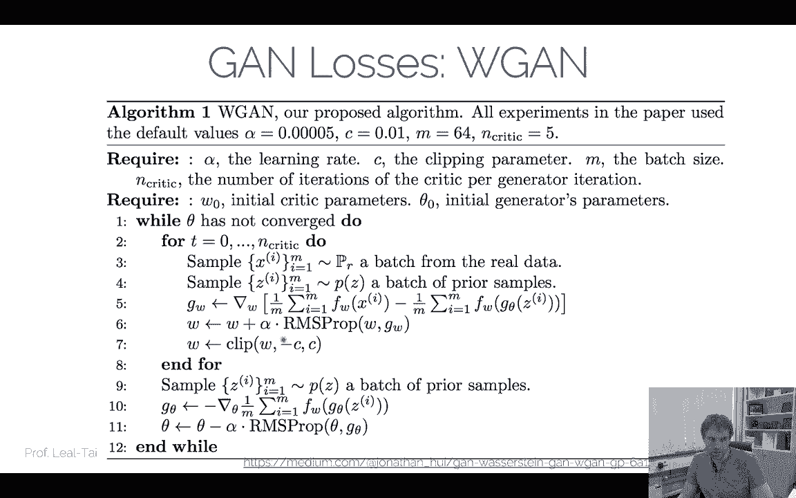

Okay。If you're looking at the G losses， remember we had ga losses that kind of stabilized like that and we had this issue that it didn't we didn't know when it converged the nice thing about the Vaachesteingans now is we getting curves to look like。

These， meaning that oh， it goes down actually right， and why does it go down。

 it just means that this estimate here for the critic is getting better and better。

If we having a good critic function F that can estimate the distribution between these two set of samples。

And this is being very small， this is our loss function by the way we ploting here。

If the Spstein estimate becomes good， then in principle， well。

 then my two distributions are the same。And that's very nice about the Wasstein laws is that it actually has a reasonable convergence plot。

So my images at the beginning look bad and then the actually look better and better again DC scan architecture here only replace v span loss。

I'm not saying here that v time produces necessarily better results， the may or may not this。

 a lot of discussion about that， but what I'm saying is it's very nice to look at the loss curve here because it actually goes down。

I mentioned this before。Vazashsteinzstein G is one of the things people do actually use a lot。Yeah。

 for。For Gs， so either heuristic ofstein， the other two maybe not。

 but this one is a very popular one。Yeah Pakistanakkistan again is great and now we see what we're doing so we have actual conversiongs。

 in theory it should mitigate more collapse。😊，You can argue about that。

 generator still learns when critic performs well right these two they are not necessarily competing。

 They are on the same side。嗯。One problem is this lips constraint is difficult。 W gl is a dirty。

 dirty heck。 This is not a good idea。 There's a couple of variations。

Of whatever grading penalty and stuff like this what people use。Baakely is not the best idea ever。

If it's too high， it takes a long time to reach the limit right Basically if you're allowing for for too much of a variation。

 this lipss estimate is not very good because it's too loose right That's what we we be doing。

 if it's too small。We often get vanish ingredients because we don't learn anymore。

 especially when you have picnic ropebs that's a big issue。😊。

Either one you don't train a lot if it's too small because my weights are being too small or my weight changes are being too small。

 or if it's too high， my then my v estimate is bad。I don't want these two a problem。

 so fixing the C parameter here is a problem， right？And there's a couple of variations now。

 but this is a challenging task。For the lessons。😊，There are a lot of variations of gain losses。

There's a high level understanding in。You know。There's the high level understanding in meta losses。

 training， stuff like that right， but the practical thing is that T provides the gradient right like these our learned loss were motivated at the beginning。

 these are learned loss that we used in orthorennche。But there's many variations of that， of course。

😊，My recommendation is always start very simple。 That's always my recommendation。

 Like always dividing conquer is key， right， we want to start simple， get simple stuff to work。

 and then we make things more complicated。😊，Always start simple if things don't converge。

Don't randomly shuffle the loss around。 This is what I've seen unfortunately many。

 many times changing loss is the last thing you should do。

 I would always start with the heuristic first that's the easiest one to get around maybe bus time but but that's about it。

 I've seen like people trying to do20 different losses。

 none of them worked and they spend a lot of time on it all start simple。If you doing Gs。

 I would always start simple， I would start with an auto encoder first without the G。

Get this architecture to work， use the variational orange encoder next。

And then use say simple wrist again， and then you can compare the results of the auto encoder with a variational all encoder and then with the reverse again。

 right？This way you have a direct comparison and the reason why I'm mentioning it this overhead is it's just very tricky。

To evaluate or to see whether the organ is working。Okay， yeah， I still have a few more slides。

 but I would like to yeah。😊，Roughly come to an end of this video because we already have an hour 38 minutes I hope this was an interesting first introduction I know a lot of people if you have already heard about GNs but I think it's still a good exercise to rethink all these kind of key ideas of the GNs and then in the next video in this lecture we will talk a little bit more about GN architectures and what we can actually do with them in practice。

Otherwise， stay safe， stay healthy， see you next time。

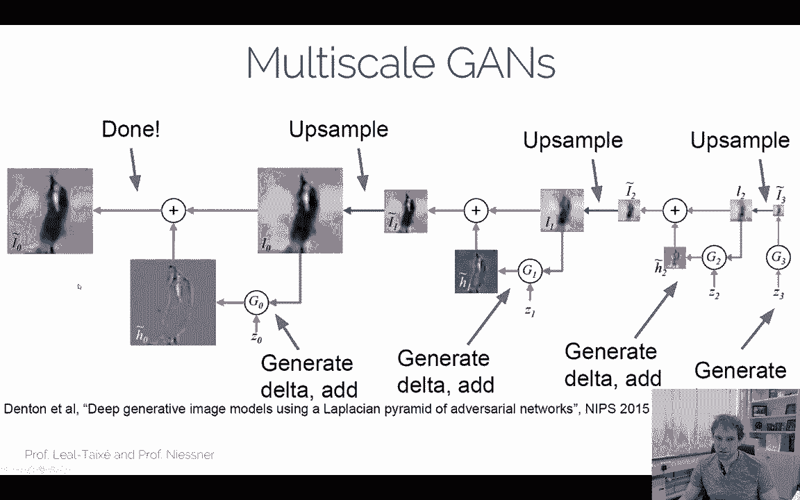