# P9：L9 - 神经网络图像与视频渲染 - ShowMeAI - BV1Tf4y1L7wg

Hello， welcome everybody to the advancedanced deep learninging Lecture。😊。

Today I wanted to follow up essentially what we have talked about in the previous lectures on generative models right so we have seen a lot of things on GNs we have seen autoaggressive models and we have also seen how we can use possibly GNs on videos and so on right today I want to talk a bit about rendering in general specifically leading into neural rendering and what that actually means I mean it's a term that has been come up very recently basically in the last year or so there have been very。

 very many research papers around that。And。First of all。

 I wanted to actually twist a step backwards now I want to go away from neural networks for a second and I wanted to explain quickly what rendering means actually and where this comes from so rendering is a thing that comes mostly from computer graphics。

😊，And that's essentially how we make videos。In movies or how we do video games and basically how we can go from a synthetic scene description and how we can create images out of these ones。

 So if you have taken some graphic courses， what you will learn first is you basically have a scene description and the scene description is a 3D description that tells you what is in your environment right so you basically have a bunch of objects here in the scene。

 you have a bunch of shapes， each of these shapes have different materials that defines their appearance。

 you have light， you have well， the geometry， of course， typically it's a triangle mesh。

 often you have animations， when you have people in it and so on。

 and all these kind of things they make up your 3D scene representation basically right so it defines what's in the scene。

😊，And now in order to take the scene representation and make an image out of it。

 you need to define the camera parameters and you have two types of camera parameters you have the intrinsic camera parameters that's basically how the projection matrix works right how do you go from a current viewpoint into a 2D image plane and that essentially defines like know things like depth the field would also be in here motion blur and stuff like this you would have here but in practice often you only have a focal length and you have a principle point that's what people using computer vision of so it's a bit of an oversimplified pinhole camera model of the real world。

And the second thing， in addition to the intrinsics are the camera extrinsics， the post。

 this is the camera viewpoint。 This is where do you want to place this camera here。😊。

In order to look at the scene， so it's basically changing the viewpoint right。

 in practice you have6 degrees of freedom， you have three for the rotation and three for the translation。

That's enough to define where to put the current camera location right and again if you're putting all of these three things here together right so we have the scene description here we have a camera viewpoint here so where do we look at the stuff and then we have the project goes from this thrust them here into this image plane here and that tells us basically how do we generate an image from the current 3D description right and this is a process that has been examined in computer graphics for decades and。

😊，There's various techniques， how to go， for instance， from this 3D scene then to the 2D image。

 you can do restoration， you can do rate racing。Various different ways in terms of how to define materials。

 there's different ways， how to define lighting， geometry and so on。 So all these kind of things。

They they all gonna be researched in graphics right and people have made a lot of progress。

 and most of these things what they do is they kind of they have this idea of photoistic image synthesis。

 here's a very popular paper from computer graphics。

 the rendering equation that essentially this integral here defines light transport in the scene。

 So if you have light from a source from a light source being emitted these light race。

 they all bounce around in the scene， they're gonna be reflected and refracted on the objects。

 And eventually that determines the appearance of the respective object。

 then you have a projection matrix and go to to the current image。😊。

Pracically you have like this is the 3D definition right， then you you get the。

The shape accordingly you texture it and you evaluate the lighting and you're going to get these kind of resolved images This is from avatar in this case right this is what people are doing all the time like again for entertainment purposes for video games。

😊，Movies and so on。I should say this process is very well understood。

 So if I'm going to give you a really good description in 3D and I know all the parameters I need for rendering with state of the art graphics methods。

 you can get actually pretty good looking images and these images are actually looking very realistic so they're going to be photo sure this is not a real character here。

 but if you're taking some things like cars and so on I can render them to a degree that they are basically indistinguishable from reality。

 So if you're looking at at the images of a news of like a photo magazine or so today most of these rendered images renderings and they're not real photos action。

😊，So this process works pretty well， but the big challenge you're going to have there is in computer graphics today is how do you get the need？

How do you get the 3D content So this 3 representation like I mean setting up a camera position is easy。

 but the 3D content that's the hard part in practice what you need is you need the geometry right that defines your scene you need textures that are met on top of this geometry and you're going to have lighting and material parameters。

And for these kind of things， what you typically see at the very end of either video game of a movie。

 you see in the credits， you see a lot of people who have done that。

 these are the content creation artists and this's typically for a Hollywood movie today everything you see cheap basically so you have like4 or5600 people creating this content for you and geometry could include a little bit more than just the environment here it could also be you have animation right you have facial animation parameters and stuff like that so all of these things are going to be actually in in the 3D geometry in the 3D content and this has to be manually created。

One of the motivations what people had from graphics in a while， they thought， well。

 maybe we can automatically generate this process and we can reconstruct all of the material lighting and texture and geometry parameters from real world images and this is what computer vision is basically trying to do writing computer vision you have the opposite problem。

 you have a 2D image and you're trying to get back to the 3D representation。

 3D understanding and stuff like that。😊，And this is a thing in computer vision。

 there has been a lot of work trying to do that， like trying to do 3D reconstruction， multi stereo。

 slamM methods， all these kind of things that that's what people have been working on。😊，And this was。

 for instance， a very， very important paper here was building room in a day。

Very famous paper in computer vision in 2009。 This was like you know， 10 years ago。

 this is structure from motion work with the bundle of chestster。

 And what they did is this is from Trovni。😊，They took a bunch of from the city of Tuborrovnik。

 they took a bunch of touristic images here and what they did is they they basically found features。

 they ran their bundle chester and they got these point clouds as a result of the structure of emotion process。

 right and。You can already see， well， you get the structure。

 you see here all these frost them at the bottom。 they're visualizing where the original images came from。

 you get a rough intuition what the 3D stuff looks like。

 but it doesn't look nearly as good as if you hired like a couple of hundred artists like in a video game or in a movie So that's still a challenge。

 So if you're talking about 3D digitizations this is often what what I'm trying to refer to the gap between graphics and vision。

 if I'm looking at computer graphics models they look like this。

 This is a rendered image from a car and it looks pretty perfect。 and on the other side。

 if I look at images in computer vision papers this is something I'm very excited about right now。

 but they don't look so great。 And the reason why they don't look so great is because this is this difficult inverse reconstruction process these are actually a bunch of Liar reconstructions from Kitty。

 it's a very famous data set in computer vision but you see there's a big visual discrepancy between those two things。

😊，And now the big challenges of course， how could we get from here。

 how can we make this stuff here look like that one and this is the big opportunity here that I would like to highlight with neural rendering right this is the key insight is maybe we can figure out how can we use a neural network to make this stuff here and look like that stuff we've already seen this a little bit in the last lecture。

 but this is what I want to follow up a little bit。😊，So， if you're talking about。

Traditional computer graphics。On one hand side。And on the other hand side we can talk about deep learning methods and specifically we talk about the generative models that we have seen in the previous and lectures。

 so obviously both of these things have very similar goals right what you're trying to do is you have some sort of description of an environment or of some sort of image and you want to generate an image or possibly a video as an output right。

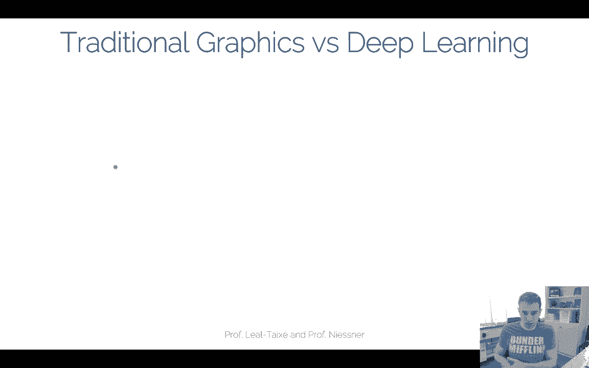

In computeruter graphics， I've just given you kind of a， you know。A 10 minute crash course。

 what you can do， you basically have these 3D models right you have the textures。

 the shading and then you synthesize you get a synthetic image out of it and this is like an example for instance from Star Wars where they had the actor being remodeled and then synthetically inserted into the movie this is kind of the decomposition here of the different layers in the lighting pipeline。

😊，And on the other hand。😊，And again， here we have like there's artists that created these models。

 there's a lot of many labor that went into this kind of stuff。😊。

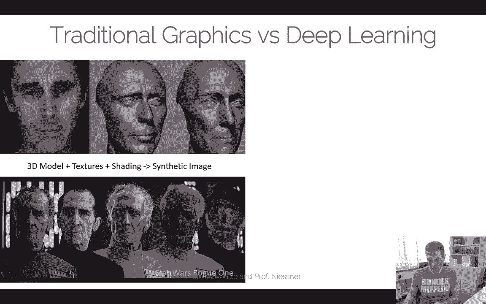

And on the other side， we have things like。The progressive game paper right where we have our discriminator。

 our generator right and we have this loss function that tells us is it in the distribution of real images and in this case we don't have a lot of control for this method here。

 but rather we have we have this la vector Z where we be taking this vector in and we generating the images output So these are very different paradigms here were purely learning from data we just want to mimic our data。

 we have very little control but we also don need a lot of manual effort right we just have a neural network。

 this neural network learns this distribution， I can synthesize new images whereas here's the opposite。

 I have all control I have a 3D model I can use the 3D model and yeah I can basically go ahead and yeah do whatever I want in the resolving output right but it costs me a lot of effort right So this is kind of the drawback。

😊，And the idea of neural rendering is essentially and this is a very broad definition what I'm making right now you will see like people innder a bit of different things with it one thing you could say about neural rendering is you want to do something like novel viewpoint synthesis so instead of having this explicit 3D content that I've just explained to you you could train a conditional G or a conditional generative network that takes as input a camera right。

😊，Position and implicitly in the neural network， it encodes all the entirety of the scene description。

 like the lighting materials， shading and all of these kind of informations。

 they could be all encoded in a black box neural network， right？😊，Yeah， then and then as output。

 you could basically get the novel fu and all you have to do is you have to change the6 degree of cameras。

 right？And it's kind of this idea of moral rendering， and now we kind of。

We're taking a conditional neural network， right， a conditional generative neural network and we conditioning it on the current camera pose and at test time we want to basically generate a video as output that is corresponding to the current camera pose that we're feeding。

 so instead having this graphics pipeline with the rate is the reststerizer we just having this black box network that gets us the respective output。

😊，Now。One way to do that is we already saw that actually is actually relatively straightforward with the techniques what we have already learned and we can do novel viewpoint synthesiss with Psto picks for instance right so psto picks is our conditional again and what we do is for the ground truth data for training what we need is we need images with the respective camera poses right so what we could do is we take a bunch of photos of the scene right and we know with some sort of structure for motion method we know the current camera pose and all we're doing right now is were training this conditional again the condition is the current camera position and then we have the re renderndering loss that tells us for this camera position you have to produce this kind of image right？

😊，And then the hope is， let's say we overfitting this network to one specific scene。

 So let's say for one scene， we have a couple of hundred thousands， maybe of images。

We train on this one scene now for testing you would still have the same scene so it is overfited to the scene。

 but we give the network of unseen pose to generate new images from these different poses right so you want to have like a camera check that goes around an object does so on。

😊，So this is still has to channelize， right， this， This network has to figure out how to extrapolate or interpolate between the current camera poses and。

As I mentioned， camera pose it's a6 degree free in vector right so we have a sixdial vector and it turns out six dimensions is actually pretty high already it's an untrial dimensionality。

 We have to deal with it。 So it's not such an easy problem but if we're doing this very not with Ps to picks。

 It's pretty straightforward right we just we just need to get this input data。

 We need the pose for it。😊，We canstrain the rewriting laws。

 and then we generate new images for new posts， right？By running the network with new conditions。

And let's say for simplicity we're doing this on synthetic data so were going ahead right we having in here we have the spinning cube and we used original graphics methods to create the ground truth data that makes it a bit easier we have ground truth poses we know the current like how this cube here is spinning and。

😊，We also we also you know， know that have the ground truth images that we rendered to begin with and now we we training this Ps to Ps network such that it's conditioned on that respective target。

 right？You see， it looks not perfect， but， you know。

 like it's pretty straightforward to train and you're getting results that look like these ones here。

 This is just a naive conditional ga that is conditioned on the current fuel point and it's kind of replacing this complicated。

😊，Oh complicatedlic， the graphics pipeline， right。😊。

And has an end to end neural network here that generates the respective output renderings。

And we have in fact seen other versions of this already， not just for novel viewpoints。

 novel viewpoints was now one example where the conditioning is only the camera pose。😊。

But you could go ahead and say， well， instead of the camera pose。

 be conditioning it on different things， such as。Faces which we have seen with the video pottery paper the video potterers is basically the conditioning here is the 2D image of the faces right the positions in the ice and then you have ps to picks that makes kind of a resulting output rendering out this or everybody dance now same thing right so we here a conditioning it on the human skeleton and picks to picks again out of this detected skeleton here at the bottom what do you see it makes a realistic image out of it again。

So you can do this as various different conditionings but you will see sometimes it works better。

 sometimes it works worse so this is like the basic idea of neural rendering right now so we're replacing this graphics pipeline with all the methodologies that we have seen now in the previous one。

 two， three lectures right so so far I haven't really told you anything new in terms of you know how to do neural rendering probably arem more or less just reformted the problem from a different perspective right so now we're looking at it from a graphics standpoint and we're trying to replace the standard graphics pipeline with our neural network to get the rendering done for us and this is what we call neural rendering。

😊，But I wanted to quickly go back to this example of the novel viewpoint synthesis and it turns out this is actually a pretty complicated setting here and in this case we have the spinning cube right and the spinning cube actually has text on it so it has very fine scale detail so the network has to actually learn how to go from the current camera pose to the respective target rendering。

😊，And this turns out to be pretty challenging， especially for these。Fine scale text builds here。

 right？And the reason why this is actually really challenging if you're going back to our neural network。

The big challenge is we have a 2D convolution in every layer a bunch of 2D convolutions。

 we have a series of 2D convolutions that make up that have to learn kind of this 3D space now right it's a pretty challenged thing。

 We have a 3D space but're kind of abusing a 2D network to try to learn it And as a result you see that you have these like swimming and flickering artifacts right it's not perfect it doesn't look perfect。

😊，And， and one idea to remedy this。 and this is a very recent trend in neural networks is to say。

 well， maybe these 2D convolutions， they are not so great。 Maybe we want to go。

To 3D and this is what what Dboxoxels is doing。 This is one of the yeah first tables that looks at this and。

The main idea is basically， it's very similar to。To picks to picks from a high level conditioning part。

 but the difference is why do we have to learn these 3D operators with 3D convolutions right why don't we do this directly in 3D so the network has a much easier time to handle that。

We know how 3D transformations work right if they have a camera post， it's a rotational translation。

 it's a six do vector， we know how to apply this to， let's say a voxel grid or a mesh or right。

And the idea is we can incorporate these operators directly into the architecture and as long as they are differentiable you can still learn the missing pieces and like this is what this deboxoxel paper is doing and this is an example application that also works for all little viewpoint synthesis so in this case again give me the rigid posts of the camera and then generate me a new viewpoint for that。

😊，So if were having a simplified pipeline of deboxs， it's still very similar than before。

 so the idea is at training time， what you have is a source image。

You have a 2D network that extracts features。The standard unit。

 you're taking this unit and you're protecting these features from 2D to 3D this is now a boxal grid in the middle here。

 The way I have to do that is I have to basically from this image I need to know the post。

 this is a no from the training data， this is this R&T， this is my training Richard post。

And I need to know how to project from 2D to 3D that when I know with the intrinsic parameters of the camera matrix right then I run a bunch of 3D convolutions in 3D。

 this is a standard it's pretty much a standard 3D unit。Architecture。

 there's nothing super special about it except that in pixels it runs and voxels now and then what you do is you reprojecting these three features to a new few So now for a respective target view。

 you have again a rotation translation for your camera post。

 you have a projection layer goes from 3D to 2D again。

 you know they're from the intrinsic you run a bunch of 2D convolutions and then you force this network or you constrain this network to produce this output again and this whole thing the idea is this can be trained end to end。

And what you're learning is basically you're learning the feature extractors from here， here to here。

😊，But you don't have to learn the 2 d 3D projections and you don't have to learn the rotations and the translations because they implicit they explicitly encoded into the network architectures already。

Now， this is already pretty interesting。 There's one small detail that I ignored here right now。

 This is a bit of a simplified version of this D box will work。

 And one problem that we gonna have later is we have to check。 We don't have the depth data here yet。

 So this is something there's a bit of more stuff missing。 So the。

 the whole pipeline would look something like this。😊，嗯。In this case。

 we have actually again the 2D part， we have the 2D network， we get 2D features。

 we're lifting these features to 3D。😊，We having some 3D operators here， basically the 3D unit。诶。

Then you're reproing to 2D now here's an occlusion network I'll explain to this in a second。

 this part actually enforces depth the depth prediction because you don't have the depth so this part here is actually not so straightforward because you don't know the depth how to project this and so you need to know whether the current voxel is visible in the current 2D point。

And then what you're doing is you're considering some output and you have a discriminator loss at the end of the day that tells you is this output in the distribution of this current object？

😊，And this whole thing is being used for training。 so so this part here is all the training in a testing you would only use that part and looks like this here in this case we have a test time。

 the whole scene or the whole object description is encoded。Into the network here。

 into these features。 And now what you can do is you feed in different rotations and translations to force the network to produce different target output results right this is how you test and and now that's pretty nice because you's starting from a 3D representation at test time and all you have to do is you have to change the respective camera viewpoint by explicitly feeding it it So network doesn't have to learn that complicated transformation anymore。

😊，And I'll show you in a second that this is actually working much。

 much better and the reason why it works better， you don't have to learn the 3D operator。

 you already have it implicitly encoded。😊，Okay， one thing I this occlusion network I mentioned we don't have the depth。

 The way this works is， let's say you have this feature grid in 3D here。

 you have the camera pulse here。So along this ray， you know which box will touch this ray。

And what you can do is you can think about this as canonical view。 So you just have this voxel。

 that voxel， that voxel， that voxel， that voxel along this ray， you just put it in an canonical grid。

 It's just the reordering of of the frames here， And now what you know is there's gonna be one value。

 which is the visible value， this is the visible reasoning。

 so to say right know what you need to know which pixel is the visible one basically right you don't know it。

 but you can learn it。 So all you're doing is you're running simply a softmax here that tells you which one is the right probability And this is basically a depth estimation network what's happening here。

 So this network implicitly estimates the depth by knowing that the reproion error needs to be needs to be good。

 So there's no explicit loss here that tells you what this occlusion network should be。

 The only thing it knows that oh this reproion needs to look like。

 whatever it is on the counterpart of the real examples right。😊，Okay。

So this one works surprisingly well。 If you're comparing this。

 you're getting results that look like these ones。 So again， here at the bottom。

 we see the Ps to pick baselines。😊，And here we see the Dboxoxels comparison like if you're looking at this first spinning cube here。

 you see that suddenly you can see the letters and everything else right so it looks significantly better than here And again。

 this is the same amount of training data roughly the same network size except now you have these explicit 3D operators encoded in that representation right that you don't need so much data if you know something already that's pretty good you can put this in the network and make it differentiable and then be more efficient So that's a very recent trend actually we will be seen a couple of times now that。

😊，Yeah， that that these these rendering networks and so on。

 you kind of have stuff you know how to do like some part of the rendering pipeline， you know。

 like3 the operators， like projections and so on。 You know them。

 you just make them differential and put them in a network。

 You don't have to learn them because you already know how these things work。

 Like if you want to add two numbers， right， you don't learn how to add two numbers。

 You just have an operator to add them。 But other things， you don't quite know how they work。

 like the shading， the lighting variation。 Sometimes this is hard to capture for construction purposes。

 And this part， you let the network take over。 And this is kind of this idea of neural rendering that you can mix these ideas。

 you have explicit representations and implicit representation。😊。

So here's another direct comparison against the very two data sets here。Pix to picks and deboxs。

 right， So it looks just much better。 If you're looking closely。

 you see it's also not perfect on the edges here。 So here it's a little bit chitery。😊。

And the problem there， basically is。That there's an explicit voxel size。

 This voxel size is this cube is only in a 32 cube volume。

 And you see the voxel representations here。 And that issue is something you can see in the final renderings。

😊，So if we had a higher out resolution， it would be better。

 but unfortunately there's going to be some limit in terms of what it can fit actually onto the GPU。

But that's a very cool insight here。 And the the voxel group。

 This lifting from 3D to 3D works really great。 Now， take care for like temporalfold coherency。

 You have the 3D operators implicitly encoded。 They need a bit differentiable。 Of course。

 But it works pretty well。 this was done for normal fewpoint synthesis。 In principle。

 you could also do this for like dynamics。 You could just move the v around， right。

 That's kind of the high level idea。 limitation right now here was that it was。

 it was limited due to the dense3D voxel grid。😊，So this was one of the methods I wanted to show you a bit in more detail。

 but now I want to go back。One level bag， right， one a little bit more high level。

 And this was done on boxels。 But in principle， you can do this for， for other things， too。

And they have been actually a couple of different papers that appeared， you can do this。

 so on Wuxel grids we've just seen that， right？😊，You can do multi multiplay images。

 you can do some compositing between the images， you can do it completely image based。

 you can use point cloud， there was a neural point based graphics paper。Very recently。

Very cool paper。 And I'll I'll show you references later。 You can look these ones up。

 I don't have time to go into all of them， but very similar idea。 instead of having voxels。

 you have points or you can actually do something more extreme。

 you can do completely implicit functions。 This is one thing that has been shown very recently to say。

 okay， well it's let's。😊，Use the 3D part for the supervision。

 but the network itself is just a fully connected layer basically it sounds pretty cool when you name it implicit functions but in practice that's just a fully connected layer and then theres different versions of renders like this one we've just seen volumetric graybased that's what this occlusion network was basically doing if you take multiple images decomose them that's like alpha compositioning restization for points you would use splitting and for implicit functions you can do stuff like like sphere tracing and so on right。

😊，So basically we have these two aspects we have on one hand we have the scene representation and we have the differentiable render and this is one thing that will come a little bit this term differentialiable render you will hear a couple of times now because basically what you have to do now is you have to train this whole pipeline end to end right and from going from these 3D feature voxels like in D voxels。

 you have to basically learn these features by this project matrix and this is essentially a differential render。

 it could be array based， it could be also restization based。😊。

There's a couple of pros and cons between these representations right I you doing this kind of stuff on images。

 you have very fast rendering high quality cons， you don't have so much flexibility。

 You only have a two yeah you have only 2。5 D size right that's a drawback。😊，The deboxoxels。

 it's true 3D。 That's great。 We have all the control。 We don't have to learn most of the things。

 but the memory grows very， very quickly。' that's the drawback right if you're doing the restorationization based well then it's high quality。

 I didn't go into too much detail here。 This is maybe something you should you should look up yourself。

 but it's it's in the same lines right So you also have to differentiate again through the restization process and then you can do these these kind of things and use like blending weights。

 how to combine different images。😊，Point clouds。Point clouds in principle are pretty good。😊。

Yeah they are high quality to some degree， but if you don't if you miss a bunch of points you're pretty screwed so you need good quality of the structure promotion motion to begin with if you're missing points you don't have it in the representation and the network can't just hallninate points where they aren't points that's a big problem of this。

😊，But there's a couple of really cool papers there was a group from Scalek and Samsung and I in Moscow they have done this a rural point based graphics paper。

 I would encourage you to look that one up， this is a really nice paper。Okay， implicit functions。

 that's something we haven't talked too much about。

 And this is what I wanted to talk a little bit right now。

 These ones are all explicit representations and a very new trend in neural rendering is to just get rid completely of the explicit representations。

😊，嗯。And yeah， the idea is basically， so you have a camera right。

 and you're shooting a ray and the network tells you how far can you shoot the ray。😊。

Until you find the surface point。Now， the way you would implement this is you take a scene representation that is literally just an MLP right it gets basically as input it checks where you are in the viewpoint。

😊，So this point here right now， this 3D point， it has a direction。

 it shoots this point in this direction， and it tells you how far can you step。

Before you find the surface point。And this is kind of like sphere tracing if you've heard of this。

 So sphere tracing means if you're in a distance field or so you can make a step equal to the distance and you're guaranteed it to not hit the surface before that。

 And this is kind of what this render here learns。😊。

And the idea is that eventually once you iterate this process。

 eventually you will hit the surface and this is completely encoded in this implicit network so there's going to be it's kind of like a query you' just shooting a array you're asking how far can I go before I go to the next thing。

 there's no explicit representation anymore you only have this iterative query point。😊，Right。

 and this actually can generalize。 So basically， once you have enough race， you're shooting。😊。

Then at some point， the network within a scene， it knows how to extrapolate and has some basic generalization how to look at different things。

And they had a couple of cool。 This was a nerve paper from last year so they had a couple of cool results so they basically can do stuff like reconstructions from a single image that looks like looks like this one so they have this image as input and now they can channelize and can hallucinate what the respective surface looks like right and this is kind of the normal field by getting it looks kind of cool it's a very interesting idea so basically they said。

 okay， let's not use an explicit representation， It's just use this implicit notation of a multilayer perceptron and query how far can I shoot the ray in order to hit a surface。

😊，And very， very recently， there's another follow up pay。

 I'm very excited about that one because they showed really good results。

 It's called Nerf neural Raance fields。 This is Pay from Berkeley and Google。

 And what these guys are doing is。😊，They're having a very similar idea， they also have a cameras。

 they have a new plane here， far plane here， this defines the frost them。

And they also have an implicit scene representation。 So what they're saying is basically， again。

 shouldnni array。😊，And then they have so in this case they have an MLP right。

 they have a positional encoding that tells you where it is。

 they have a few direction and then they're going to predict this radiance field along this ray what the color is basically so they go just from from r6 to from r6 to R3 and this is again all encoded in a multilayer perceptioncept。

 they have a couple of layers of course， but there's no explicit 3D structure。😊。

And what they have done is they have the renderer What it's doing is it's just take my current ray Well I have my camera point。

 I have my ray direction right that's this R6 here my few direction and then this network just predicts you along this few direction what is the current color going to look like but you need this positional encoding This is a bit of a detail I'm ignoring right now。

 but what I would like you to understand is this is just an implicit network that basically for giving ray tells you what the color along this ray is。

😊，What's interesting about this network is they don't aim to do any generalization。😊。

They only basically for every surface point in 3D， this network kind of memorizes the color right So if you have a array。

 you' learn this mapping from the rate to the surface point and from to the surface point it knows what the color should be。

 and they also do novel viewpoint synthesis。😊，And they have really impressive results。

 so what they do is they record also they took highcol images in fairness so that's why it looks pretty good。

 they took DSLR images of a couple of objects here and then they use the network to generate to basically interulate the view points it's only interlation network there's no generalization going on but the results look like this and it looks actually pretty decent。

😊，If you're comparing this to traditional computer vision methods。

 you're not getting a point lot anymore。 but in this case， you're getting actually。

Pretty good reconstructions。 And these images are not these viewpoints are not exactly in in the training set。

 right， It's a good question， Like how much can it extrapolate from the training views。

 But from a bunch of views， you can now move around the object in a free viewpoint notation。

 And this is kind of a nice thing。 So I really encourage you to have a look at this。

 This paper came out。😊，I don't know like two months ago so， and it's pretty interesting。

 I really enjoyed reading it。嗯。Yeah， so these implicit functions is kind of a new thing that is going in addition to that。

 in this case， we're going to have sphere tracing。😊。

Wwhich is kind of the renderer or some volumetric tracing right， It's super high super high quality。

 If you have good data as input， channelization is basically not happening right now。

 So you're not like doing something like completion it's still very， very very challenging。

 it's very expensive to train， takes forever basically shooting rate by rate right and for every rate you're giving is one training sample right It takes a while it takes also a volatile render because again。

 you have to evaluate for every pixel is one forward pass basically in the network。😊。

UmSo that's the cons， but it's this is very recent and if you're interested in research directions。

 I encourage you to have a closer look at this。😊，Yeah， I wanted to show you one final paper。

 and this is actually a paper from our group。This neural texture paper。

 you can basically do neural rendering when you encode the features not in a volume as well。

 you can encode it if you encode it in a texture。So if you have3 geometry that has been reconstructed with multiy stereo。

 looks like that， so you have a surface texture。That is embedded。Into intoto the geometry。

So you have a density V parameterization， but instead of having RGPE texture。

 what you have in this case is features that live on top of the mesh。

And that's pretty nice because basically every feature here is supposed to encode the local appearance of the mesh。

😊，And the way you train this is with a differential rendering step。 So you're taking the。

This 3D representation， you render it to a given view。

 so you're giving a 2D UV map and sample this texture。

Then you have a 2D unit that recreates a realistic image out of it again， right？

And the idea is that you're training this whole thing end to end。 So in other words。

 you're showing this network a couple of different output images for a set of given poses。 Again。

 the poses are explicitly given here。And what you're optimizing for is the neural texts。

 so that text these texture values， in this case， they could be like 8 to 16 dimensional。

 as well as the renderer， which is also the neural network that takes these texts again and makes a real image out of it again。

 right？😊，And again， this process can be trained and to end， which is very， very nice。😊。

And at test time what you would do is you would basically take only this part here right and what you do is you're simply changing the RNs here so you're changing the viewpoint and then you're getting new images that you can render as output。

so yeah， this is。

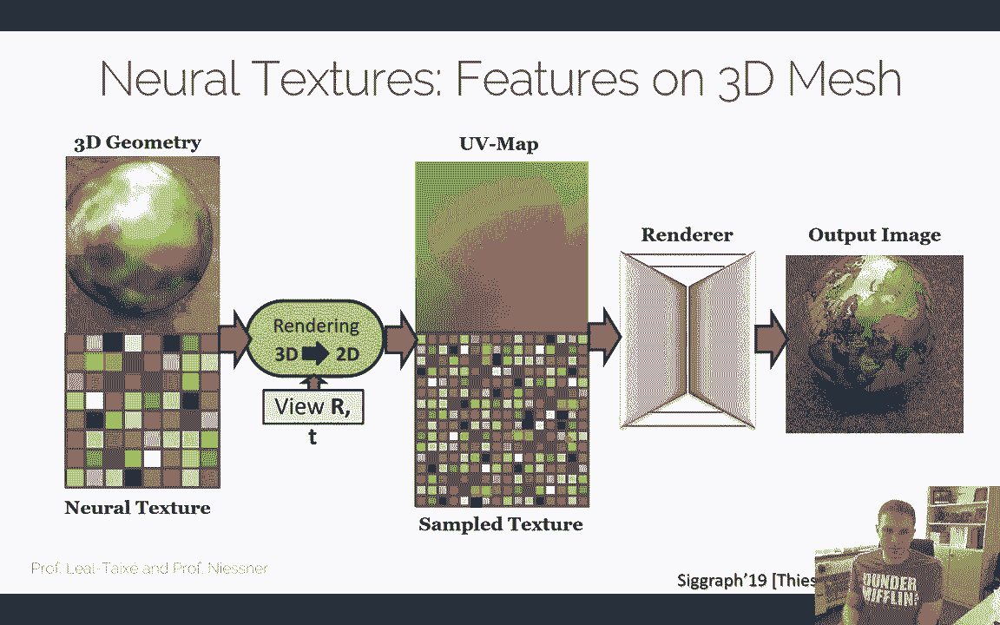

We call this paper deferred neural rendering if you've done graphics。

 you know what a deferred render is doing it first renders all the properties like material lighting UV and stuff like that into 2D image space and these handcrafted maps are then taken by the neural by the deferred renderer and the render is then applying the shading equation and stuff like that right and。

😊，The idea now is if youre having imperfect reconstructions， we simply learning these feature maps。

And we taking the deferinnal renderer to make an image out of it again。

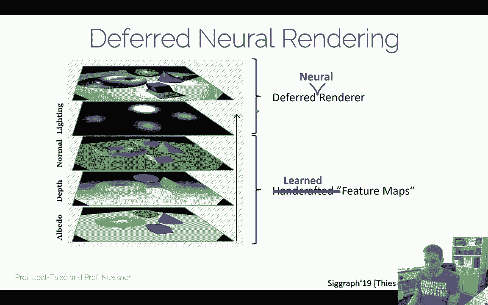

Yeah and this is then the final pipeline and the core idea now is why this is actually useful is the assumption is if I'm getting a lot of these images。

 I would love to reconstruct 3D geometry。😊，But this 3 geometry might not be perfect if I'm running a multiysterereo structure of motion pipeline。

 it will not be 100% perfect。 So instead of saying， oh。

 re solving computer vision and getting perfect3 reconstructions。

 we're saying we're getting O reconstructions and then changing the rendering pipeline with the neural renderer in order to get four realistic images。

 despite the fact that the 3D content was imperfect。😊。

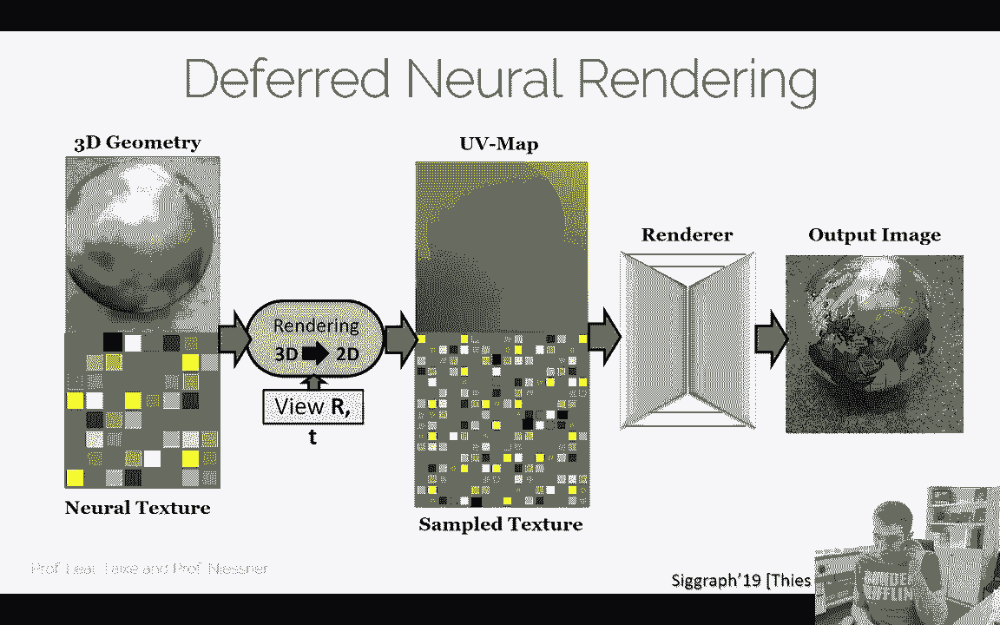

And you can apply these kind of things for a lot of different applications。

 you can do novel fieldborn synthesisesis weve already seen a couple of these。

 you can do scene editing。So you can simply copy paste objects with a neural appearance。

Or you can do animation and synthesis and stuff like that。

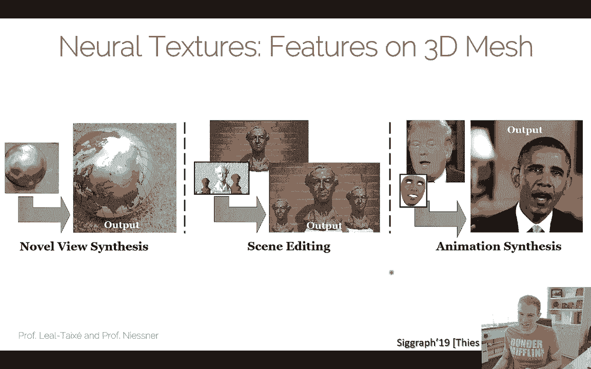

Yeah， I wanted to show you a few here first this is novel fewpoint synthesis this was actually one of the sequences I showed you earlier in this case we have the input U map right that is rendered so it's not the input this is like the rendered UV map that you're getting when you render this imperfect geometry of this sphere。

😊，And then you have the neural renderer that makes this one look like a real image again and if you're comparing this to Chme truth again these images are in the test not in the training set。

 these are test images and you see that whatever we are rendering here looks actually pretty damn close to whatever the real image would look like even though this image here was not seen during training so the channelizability here is pretty good because。

You have this 3D model and the neural render just has to make sure that it looks like a realistic image of that scenery。

 but the 3D part is all abstracted away with a coarse rough reconstruction。

Yeah you can do scene editing in a very same way， so we have here and input sequence we're running in this case call map multifuse stereo method you get in some reconstructed geometry and what you're doing is you optimizing again for the neural render as well as the features on the mesh so this part here is the statue that's actually it's actually here at UM this bust that we scanned and now what you can do is you can take a crop of this geometry and copy paste this geometry twice here。

😊，And as a result， you also copy paste the neural features here of this geometry， right？And now。

 if you're running the neural render on this imperfect 3D geometric representation。

 we can create novel viewpoint synthesis from the edited scene。 so you can do stuff like this。

 This was the original one。 This was edited with us， and this is the resulting output， right。😊。

So you can see these two busts here， they have been inserted。Can show it again。

And this is kind of the results you would get here。Okay。You see， it's not perfect。 actually。

 one thing youll see is missing。 This past here has a shadow and the smaller ones don't。

 And the reason why they don't is our differentiable renderer is just a forward renderer and doesn't deal with shadows。

 But this would be an obvious next step for research project to figure out how to get the shadows here。

 but we didn' really we didn't really bother too much。 This was kind of a nice to have application。

 in addition to Nova fewpoint synthesis。 what you can do now is if you simply Kobe paste some of the geometry around。

😊，Okay， you can do stuff for dynamic scenes in this case we have in here an Obama video from the original Obama video what we did is we reconstructed the face so we have here this phase template。

😊，And the neural textures are now embedded on the face template and what the goal is。

 the neural renderer should then figure out how to inpae this region here in the middle。

 and this on the right hand side is then the rendered respective target output。

In this case we're taking a source video here， this one is not contributing to the actual neural renderer。

 This one is only taking the poses that we're then projecting on the reconstructed phase from Obama and again this one is then a completely synthetically generated output video but's the same technique as before the no viewpoint synthesis。

 The only difference is now that the 3D model is parameterized by a source video that。

Tracks that is being tracked。 and based on these post parameters of the face model。

 you can then change the 3D model here of the face and the neural render will make sure this one gets in painteded again。

And yeah， this is actually a pretty high resolution now and compared to the othergan methods。

 these kind of things they can be trained in a few hours。

 so it's pretty fast to train and needs only a few hundred maybe a few thousand images to train。

 So it's pretty efficient and the reason why it's so efficient to get this for videos is because we have this hybrid representation right we have the network on one side and we have the 3D mesh on the other side。

 So we don't have to learn all the 3D stuff right thats kind of makes this middle rendering direction pretty nice。

😊，Okay， but I wanted to show you some results here， now this is the target again。

 this is completely synthetic。😊，And why， I would really say Clinton。

 probably I would have to say Clinton and why， there was a little spirit。 frankly。

 he would have been had。And I would but I see you can kind of get it and of course。

 you know we had a lot of fun with it， we tried our favorite target people， we thought yeah。

 these two will fit very well together， Bernie Sanders and Macron。😊。

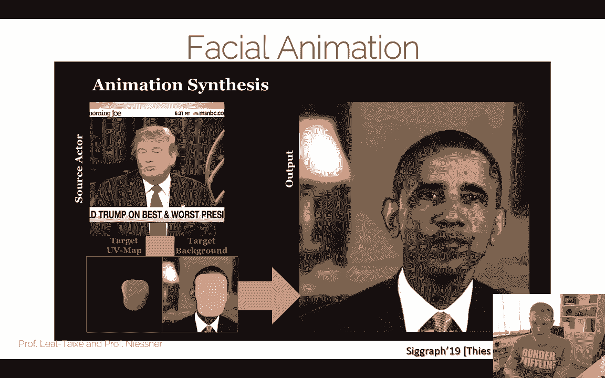

President Trump has stated tonight and over and over again in recent weeks that this country faces a national emergency。

Or our favorite tech companies。

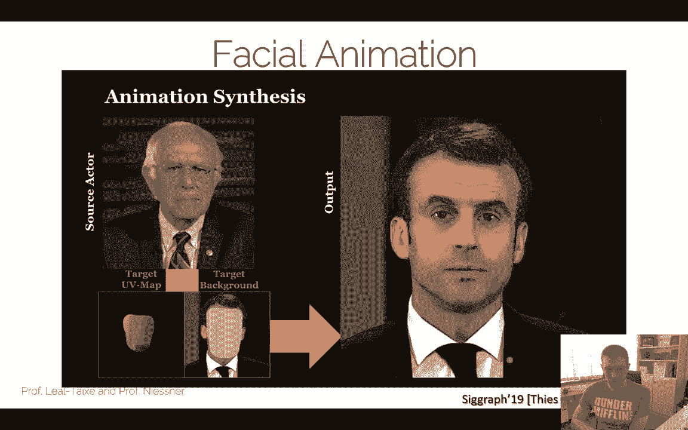

II joined Google 15 years ago。 and been privileged to serve as CEO for the past three years。 Yeah。

 you can look up these this video。 they're obviously all online。 But yeah， I think it's pretty cool。

 actually， can with this kind of stuff you can get very。

 very very nice renderings and the nice thing what you can do now is you can actually go ahead and say。

 well， instead of taking this source video， you can take any other input basically like the cool thing is we have this small render render produces kind of always good results。

 So we thought， well， why don't we use for instance。

 voices input right So you can animate this guy with taking voice or even text input。

 So this is a very recent project but also useless has been doing voice poetry the idea here is basically we want to feed in kind of we want to basically give virtual assistant a face right So you have like Siri and Alexa and these kind of virtual assistant。

 and we want to basically synthesize the respective video avatar to it。 But instead。😊。

Hiring an artist to model a video avatar for us， we just want to train a roll renderer to figure out。

How it should look like Yeah in practice we have some application that looks like that。

 So right we have here some text and from this text we want to synthesize the respective video。😊。

Hey， Siri， can you show me your face。SureSure。

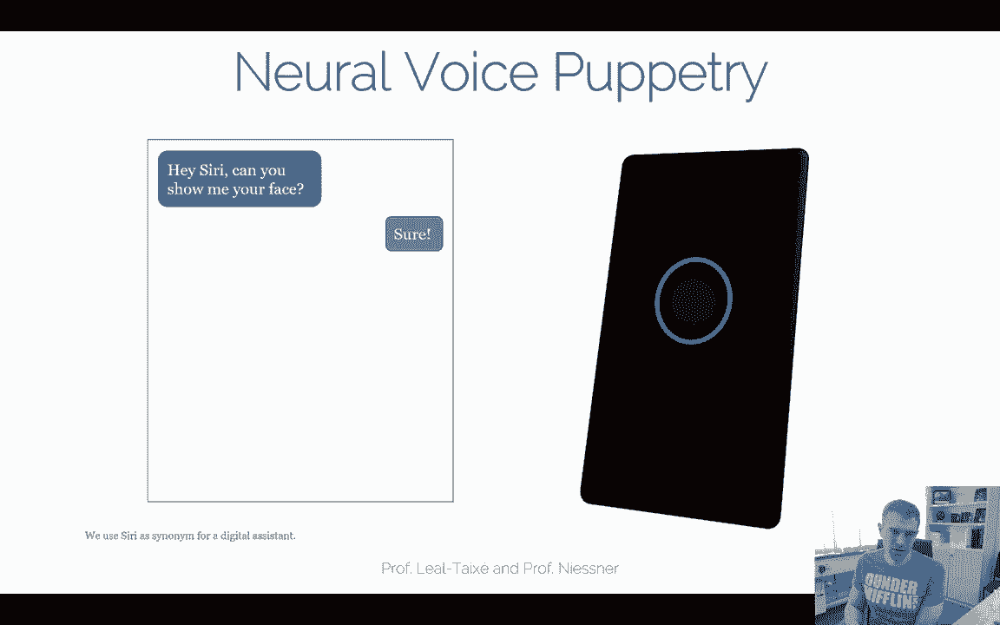

What about this one with neural voice puppetry。 I can have every face you like。

 You can also control different faces just with your voice。 Let's have a look at some results。😊。

This is all wrong。I shouldn't be up here。I should be back in school on the other side of the ocean。😮。

So a question is how does it work pipeline Well， most of the stuff I've already shown you。

The good thing is you can basically take only the text here as input。

And the idea here is before first taking some audio features， we just use deep speech。

 that's the state of the art audio network。😊，And the output of this network here from Deeppe is a set of features and these features from the audio here from Deeppe being。

We're feeding then into another linear layer basically that we're mapping to audio expressions that drive a facial 3D model。

 and then we have our standard neural rendering pipeline， we have a 3D facial model。

 we have a neural renderer that generates a respective image or video out of it。😊。

I'm not gonna go into all the details here， but the key part is here， basically。

 how do you translate audio features into the respective blend shapes。

 We didn't talk too much about the blend shapes here of the face。 But think about it this way。

 This is there's some animation control of the face that is being driven by。

By the audio then and this is learned。 So all you're doing right now is at training time you。

Taking a video， you're tracking the face of that video。

 you're correlating the audio to the T 3D phase model。

 and then what you do is you're using the deep speech features input here and you're figuring out how do the audio features see a map to the respective phase parameters。

 right？These ones， then。There are this is person specific。

 so this phase model here is being fitted specifically to this one video。

And the neural render is also optimized for this one video， but everything up to here。

 these audio features， these audio expression features， they are being channelized across everything。

 And the reason why it works so well is because we using in deep speech that's a very powerful。😊。

Audio network that is basically trained on speech to text or pre traineded on speech to text。

Okay so then we have audio expression training， that's what I've just explained the way you train this this channelized part in this case we took a bunch of videos from the German TV stations。

 we reconstruct the faces here， we have up to hundreds of commentators of available videos and all with the kind of neutral talking style right and neutral is important you didn't want to have too much variety that made it a little bit easier basically for us right。

😊。

Yeah， and then you're getting results like this isna for case basically this model here how does map to the respective3 So we can basically an model But now we have render in is taking this model here is input and then generates the respective video output。

😊。

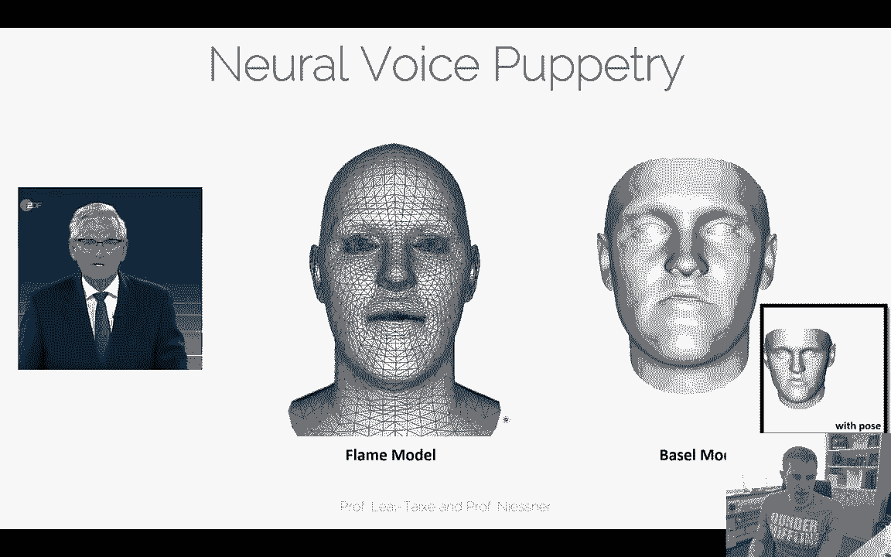

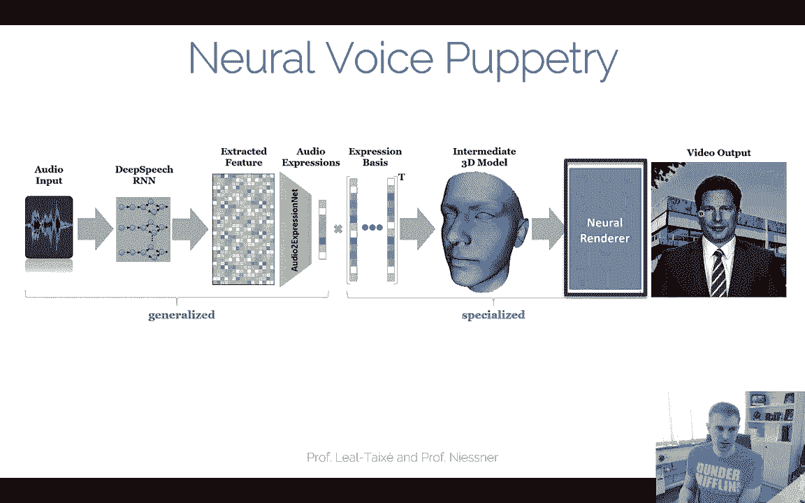

Okay yeah， and in this case we also blend it with a background。

 same thing as before right you have our target video frame。

 you having this face part that should be animated and then you have a compositing network that figures out how the respective target is this is the same thing what we had before pretty much and then you can animate the whole thing with the audio input right so here we have audio input and we then getting the respective video output。

😊。

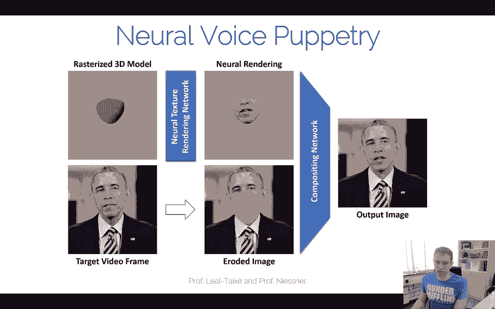

Science makes progress by steps。 Most of those steps are small， Some are slightly bigger。

Seen from the outside， sometimes people have the impression that oh。

 there's this big breakthrough breakthrough and journalists like to talk about breakthrough。

 breakthrough breakthrough breakthrough， but actually， science is very。

 very progressive because we gradually understand better the world。

Okay so one thing I didn't mention here。 Obviously this network needs audio input。

 but you can run it with text as well。 you simply run a text to speech method right there's a bunch of text to speech engines you can use taco droneone and stuff like that。

 I think Amazon Pol is one of them but there's a bunch of them and you can just take these ones。

 And since this audio model though is channelized it basically worked with any input。

 And because of that， this model is actually quite versatile。

 So we had a demo actually online from neural voice Puppetry but you can put in some text and then you can can control your favorite avatar。

 which was kind of interesting。 unfortunately， we had to take it down because people started using it a little bit。

 maybe we underestimated this whole thing a little bit what you can do with it。

 we were actually mainly hoping that you can do your virtual assistant。

 but obviously there's also some ethical concerns we should be considering。

 So the moment we disabled it but we will have to see whether we put it up again。😊，Okay， yeah。

 but getting back to neural rendering， I mean， the reason why I'm so excited about is kind of like all these problems in computer vision that are pretty difficult to do from a visual standpoint you can now do with neural render works very。

 very easily and and this hybrid of taking some 3D information from graphics。😊。

And then using the neural networks on top of it works surprisingly well for many， many things。

So there's of course still a lot of open challenges。

 I think this whole thing of like photoistic reconstruction is kind of cool right。

 How do you go from here to here This is indeed， of course still a very。

 very challenging problem and by no means yeah have we done with that So there there's still a lot of research to be done here I think the biggest challenge right now is basically。

😊。

If you're talking about traditional computer vision methods， right， they get us to hear。

And we're talking about the fine images that we want at the end of the day。

Let's say this kind of stuff here is being done with a neural network right now。

 with a neural renderer。The biggest challenge right now is。How much does the network do？

And how much How good does the reconstruction have to be。I mean， traditional speaking。

 the computer vision community has been trying to make this one here better right it's a tricky problem going from 2D back to the 3D representation because it's very。

 very under constrain， it requires a lot of priors and thought processes。😊。

Yeah so it's a challenging problem neural rendering has now enabled the idea of like okay。

 we just say， okay， it's still broken， we can deal with it。

 but we take a neural network and fix the rendering process。😊，So obviously these two things。

 there are some synergy right， like how much can the network do and how good does the reconstruction have to be at the very end of the day。

 And this is a very very fundamental question that I think is a very interesting open challenge。

 but I think ultimately these things they should go together right？😊。

Maybe you can do this end to end， you can have a differentiable3 reconstruction right and get better reconstructions based on the respective target appearances and so on。

We've tried a few funny experiments here。 This is when you're taking a box and this box is our 3D proxy that we're taking as the neural rendering input。

😊，In order to recreate this image of the weights， so obviously this UV map here or this 3D mesh here is pretty bad in terms of the approximation of the base。

The neural rendering network， the 2D part。Can actually figure out how to go from here to here。

Allright we're getting pretty close。 this 3D geometry is good enough to get us temporal coherence because the motion here and the motion here。

 they correlate pretty well， right You're rotating both around the z axis here。😊，However。

We see that it's pretty， pretty blury in the middle， so it's not perfect， of course。

 right it's a pretty tricky problem。 Eric has to basically figure out how to go from this box to this space。

😊，So it's not perfect。And。Yeah， that's， that's the question。 Al， right。 I mean。

 how much can I do from one to the other？ And one thing I can probably tell you already。

 if the tracking， if this motion here was inconsistent with that motion， it would horrendously break。

We've seen some of these examples for everybody dance now right this is a black box network。

 there's no 3D underlying context in architecture yet。嗯。In that case， if the tracking is not perfect。

 it's inconsistent。 You would have wrong mappings for wrong points。 But if you， if all。

 if you map wrong and you consistently map wrong。That's okay。 as long as it is consistent， right。嗯。

Yeah， so that's kind of interesting。And。Yeah， now the big challenge here is how much。

 how much can the I do and how good do I have to reconstruct。 And this is a， I mean。

 as you saw most of these paperss they have appeared basically a few months， maybe half a year ago。

 Most of this stuff is still super open research topic。 There's still a lot of stuff missing there。嗯。

いや、 so that's。It'sと。Up in the air right now。Okay， the other big challenge is。

3D operators， or even 40 operators in the networks， right？

 I'm mentioning here one example at the capsule network paper。

 This was a paper in 2017 from Cheinton H's team。 that was very popularized， it didn't work so well。

 But the idea was kind of cool。 They said， oh computer vision is inverse graphics。

 So we kind of need to learn fine transformations growing from 2D back to 3D and then have like capsules to understand what's going on there。

 And the idea was kind of if you have these capsules， you need significantly less training data。

 and they got a lot of good results for very small trivial tasks。

 but the scalability of the training was very challenging。 So didn't convert so well。 I mean。

 eventually the results didn't quite live up to the expectation。

 But I think that the idea behind it was really cool because they thought。

 well don't just use 2D convolutions and aggregate features with some pooling operator at the end。

 But rather learning underlying structures from an image back to。😊。

I like this is a fine transformation space。So I think channel is speaking。

 if you talk about neural networks， right， I mean， from a research side。

 like app a bunch of 20 layers， doing some neural architecture research， possibly that's a。

 wouldn't say done deal， but it's a research why it's pretty explored。 The question is more like now。

 well， how do we， how do we learn。3D operators， How do we embed 3D operators。

Differentiable nonop learning and stuff like that。 That's a thing that we should really consider into neural networks these days。

 But that's a， that's a very interesting。😊，Yeah， problem we have to address。Yeah， I would also。

I would also ask you to have a look。At the state of the art report， this is very recently。

 this was a eographics。 There's a lot of people involved them。

 including our team too between like Facebook， Google， Adobe。

 like all the people that do this kind of rendering So there's a lot of resources that you can look up and this goes basically yeah to a lot of different to a lot of different things from novel viewpoint synthesis to animation to facial retargeting text to video and stuff like that。

 So all of these kind of things are are covered here。 and a lot of the things I talked about today。

 a lot of the slides were actually from this course。

 they're going be there there's also another video up there for field to look that up you can check it out on or I think on my Twitter account So and these kind of things are pretty interesting。

 I think if youre interesting in research in these directions or even for the projects right now on this course I would highly recommend to look up these kind of things I'm very excited about it。

😊，A lot of new research coming up that's worthwhile looking at it。Okay。

 yeah I'm a little bit done early actually with a slide deck。

 I hope I didn't rush too quickly through it。 I still hope that a lot of these things are very interesting to you。

😊，And。We have basically one more lecture right now。 I wanted to talk a little bit about you know。

 high level of representations， point clouds，3D seen understanding。

 you've already seen a bit of 3D stuff today as part of the role rendering。

 But there's a little bit more coming coming to it right。

 So that's something I feel that is also still very interesting。 again。

 like 2 d deep learning has been a bit explored。 So we have to think about you know what's next like 3 d。

40 maybe Yeah， there's a couple of cool， interesting things coming up other than that。

 I hope you you're still enjoying your project。 keep pushing。

 This is your opportunity right now to realize your own deep learning project。 And otherwise。

 yeah see you in the next see you in the next lecture things a lot for the attention。😊。

