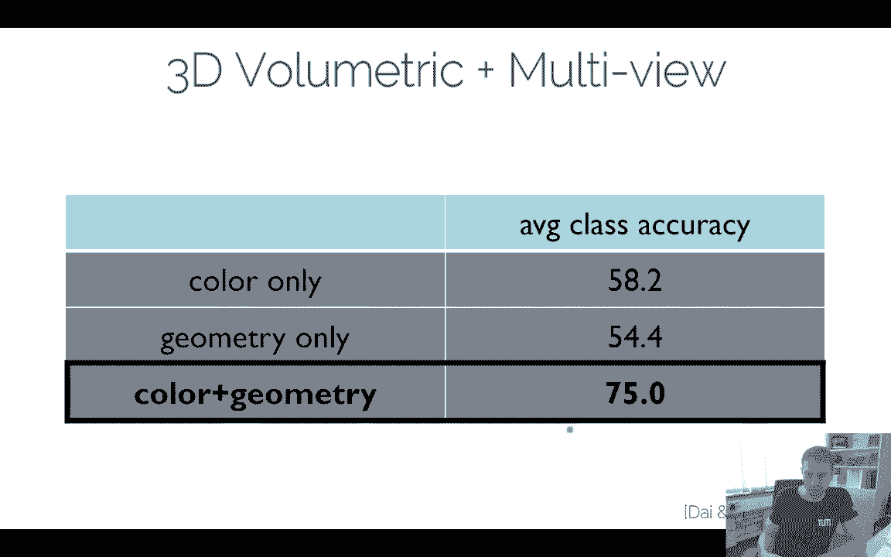

# 【双语字幕+资料下载】慕尼黑工大 ADL4CV ｜ 计算机视觉深度学习进阶课 (2020·全10讲) - P10：L10 - 高维数据深度学习 - ShowMeAI - BV1Tf4y1L7wg

Hello everyone to the advanced deep learning lecture in the recent lectures we've talked about generative models and very recently we've talked about neural rendering。

 one of the things weve already discussed in the context of neural rendering is like these hybrid neural network architectures where you have some elements being transferred to 3D and this is a thing I wanted to chat about today specifically how to do deep learning in higher dimensions。

RightSo obviously there's all kind of data signals， right？😊，Mainly in computer vision。

 we often look at 2D signals， like images， possibly 3D on videos。

 but most of the times we are looking at 2D conf operators and the reason why they work so well is because you can apply them on images and then they extract these features。

That it can then accumulate in order to get good classification results。Now。

There's of course many other things， one of them I mentioned last time we already had the discussions about neural rendering。

 but there's of course many more so if you're thinking about the 1D domain we have audio and speech。

We have images we mentioned that， but in one we also have things like point clouds when you're thinking about self driving cars。

 these have lidDR scanners and with these lidar scanners。

They capture point clouds and these point clouds can be used also in terms of map the environment。

 and then you want to do some sort of semantic scene understanding of。

The reason why points are actually1D is because every point in this case would have three dimensions and then you just stack them together to a linear vector right so it's a 1D conf you could in theory reply I'm not arguing that a conf in this case is a good operator but you could of course run a 1D convolution on that for audio speech is very clear right we have like samples for every audio signal that is being generated like I don't know something like 16 bit or so audio signals right。

It depends a little bit on the frequency there。 I think there's something between 16000 and 32000 is a standard thing what people store。

 and that is something you can do with a1D con for instance。

 with 3D convolutions we know we have videos right and you also have seen what I mentioned the rendering parts where you can transform thing to voxel grid and then do some 3D operators on 3D features and you can have things like 3 renets and all the things you have seen in 2D you can basically directly transfer to voxel grids and there's also things in 4D in principle。

 there's things like fluid simulation， dynamics dynamic videos basically So if you have a volume right。

 you have a 3D environment and then you have anything that is moving over time in principle that would be 4D con So in the literature。

 of course， we have seen mostly 2D con that's just you know what's very popular and there has been a lot of research recently on 3D。

And that's something I want to talk a little bit about more today， 4D cons， not too much。

 but there are a few ver and there are few ver around。How does it work in high dimensions， Well。

 if you're looking at at the convolutions， right， I mean， all you're doing here is basically。

We have in here our we having here our data right， so we have an input for instance。

 and then we have here our kernel and then we can simply do the sliding of the kernel here in 1D right it's pretty straightforward。

Maybe least slide this kernel and you know this kernel will be invariant towards being applied and what we're doing is we're learning the weights of this kernel so there's not a lot of surprises going on here in1D I'm sure you can figure out how to implement this is' not so difficult one of the very popular works I mentioned already in the context of autoaggressive methods was WaveNenet and Wavenet is basically they use 1D convolutions and they have this autoaggressive architecture so you know they sample literally every audio sample right and then they have convolutions over that one this is a paper that was actually done in 2016 by Aaron Fer。

It's a pretty cool paper because it was one of the first ones that showed that you can do things like auto aggressivegressive models on a very large number of samples。

 right， Like， again， if you're thinking about like thousands of samples per second and you have relatively long sequences。

 there's a lot of samples going on。 So auto aggressiveive models tend to work relatively well in these dependencies in practice。

 how wave networks works。😊，Is were gonna have some sort of input here right we're gonna have a bunch of hidden layers here and what you're doing is you're literally generating sample by sample as you can see here right So it's like sample by sample is generated and every sample that is being generated here is going to be one forward pass in our in our network So you can already imagine it's it's well it's pretty slow right you have to I think they have I don't know。

Like 90 minutes or something like this for a few seconds of video or so sorry for a few seconds of audio there's now versions that do this faster。

 there's parallel versions of WaveNe how to do the evaluation。

 how to cache this efficiently at runtime it's also relatively slow to train but there's better versions right now that can do this faster but in principle this idea of running one confs on the audio signal and having an autoaggressive model basically modeling the probabilities and predicting sample by sample by sample in the output stream is a pretty good idea and WaveNenet actually has made a lot of impact。

😊，Like variations of that are basically in the Google system it's not the original paper anymore there's some variations that you can see now on the Android phone right so text to speech systems would use architectures like that today again there's some combinations of that of course it's not exactly that anymore they got it also a lot faster which was very important and but the quality is actually pretty decent so you can have a look at it and you can see what waveveNet is generating。

😊，Okay， so this is something that people have been doing in WD。

 The reason why I'm mentioning it is you know， often when you want to do something like。

 I don't know， you want to train a network then generate some audio signal to a video。

 So you have to look at generative models basically for this。

 So when you want to do speech to text right， you would do a1D con on the audio samples and then。

And eventually going to get some features out of it。

 the deep speech is a very popular network you could look at here for feature extractions and audio。

Yeah， that's something that is also encouraging， I think it might be interesting for you to look at。

One of the things we do a lot actually in my group is we look at a lot of things in 3D like 3D shape or single classification。

 The idea is basically you have something like a K scan or you have a lidDAR scan in a self-driving car you're gonna have a bunch of 3D reconstructions here the idea is you're taking these 3D meshes。

 the meshes are a polygon soup of triangles and faces like faces right and these ones you can then convert into a voxel grid so this is the naive implementation here that you say oh。

 I'm going go and mark every vel either is being occupied or empty and then you can do some 3D cons over that one。

😊，嗯。I will probably motivate this a little bit more why 3D works so well。

And the reason is why we have 2D networks that are so big is because you have to learn the viewpoint invari。

 So in other words， if I'm taking an image of a car and then I take another image of a car from a different viewpoint right the 2D pixel values will change rapidly because my camera viewpoint changed but I want to train a network that gives me the same results want to get the same features in the same class vector at the end of the day and in 3D you don't have that and one of the advantages in 3D is then you don't need so much training data which is pretty interesting right so obviously we need a lot more memory because suddenly we have 3D cons but。

Yeah we don't need so much data anymore know the turning times are much lower which is interesting I'll talk about this one in a little bit more anyway。

 but the first thing we want to do in this case we want to take these 3D reconstructions of shapes and want to do 3D classification so in this case you have one model as input right and you're going to get a class label as output。

These are of course toy tasks in this case right you have to segment out the object first and figure out this is a bathtub line in practice you can do tasks like 3D semantic segmentation right here we have an example from scannet that's what we've done a while ago it's a relatively popular Indo data set it's recorded the structure sensor。

 it's similar to a K。

And what you have is。You're going to have semantic labels on top of these scans。And。

For every surface point， you know which object class it is right So this is a sofa chair right this is another chair。

 this is the floor， this is the wall and so on。 In this case you want to train a neural network right that you basically predict a class label for each of these surface points and this is what 3D semantic segmentation。

 same idea what you had in 2D you can then do in 3D and then you can go further and say you can do instant segmentation。

 object detection， all these kind of things they all work in 3D but now I wanted to talk a little bit about the volumetric grids。

 I wanted to talk about how do you do how do you feed the data into the network you know we've discussed already a little bit how convolutions work right I mean that's something you should probably know by now。

😊，The 3D operator and 3D on Vgri seems relatively straightforward。

 But there's actually a couple of different data structures you can use。

 One thing you can do is occup secrets。 That's what I mentioned before。 where you say， oh， for every。

 for every。😊。

Well， I guess I should quickly for those who don't know idea the volumet structures， the voxel grids。

 a voxel is the same as a pixel but in 3D right so we have a 3D array for every spatial location we have one associated so the simplest version of that is the occupancy grid so for every voxel where there's a surface。

Point youre just gonna say it's occupied right And if it's not occupied it's going to be zero so occupied it's one not occupied in zero right you can have an occupancy secret where you only model a surface。

 you can also have a solid velization where you say， oh。

 I'm going to vel everything inside the object so depends a little bit how you generate it。

Most of the time when we're talking about it right now， we're going to talk about only the hull。

 so only the surface will be modeled right not the interior because if you're having a 3D scanner。

 we can only scan the surface， but not what's behind it。

There's also things like turnary grids that gets a little bit more complicated。

 so for turnernary grids， what you do is you encode free space。😊。

An occupied space the same way as the occup secret。

 But you have a third state that tells you you don't know what it is。 So in other words。

 if I have a 3D scanner and I'm taking like， I have my hand here， right， and I'm looking right now。

 from my eyes， I'm looking to my hand， right， So I'm looking here。

 If I measure the distance from my hand to my eye。 And I know the depth value。

 I know that there's a surface point here on my hand。If。This hand moves this。

 this step value will change， right？ What I do know is I know that everything here in front of my hand is free space。

 right because。If。There was an object in front of my hand。 I would have not measured my hand。

 I would have measured whatever object is in front of my hand。But if I have observed a that value。

 I know。Well， there might be some uncertainty plus minus a few centimeters where this hand is。

But when I have the depth value here， I know there's nothing in front of it。

 So there's free space in front of my hand right now。 However， on the other hand。

 I do not know what is behind my hand。 If I only have my current， like if I basically have。

This piece of paper here， right， I only know what's in front of the piece of paper。

 but I don't know what's behind it。So everything in front of it， I know is free space。

 everything behind it， I have no idea there could be another object behind it。

 there could also be no object behind it。And this is what the turnary grids are encoding。

 So the turner grids say， is it a surface point， Yes and no。

 Is it free space or is it unknown space right？ And so you basically have three three states you can you can associate to a vable。

 And this helps you quite a bit， right， for instance。

 if you combining 3D scanning information from different views。

 like I have seen like this surface here again， from the front and from the back。

 then I know that all of it this free space。 and that's much more information that for instance。

 in networking leverage in order to do proper classification。😊，嗯。😊。

Yet then there's implicit functions， these are distance fields and sign distance fields。

So a distance field is also anchored in a voxel grid， but instead of just having a binary。Yes。

 and no answer， every vel is encoding how far is the closest surface。

So distance field in practice looks like that。 So look at this ship here， right。

 This ship is a 3D shape。 Everything on top of the surface here。Is going to be 0。

0 means there's a surface point， and if I'm going to deviate one voxle away from my surface。

 I will have a distance value of1。 If I go two voxes away from my surface。

 I will have a distance value of 2。And every voxel tells me basically how far am I away from the closest surface point。

 that means in a distance field， every voxel on the surface will be zero。

 and the further I go away from the surface， the higher the distance values go。嗯。Well。

 what does it help us with？If you took friends。T the gradient in this distance field。

 you would directly point to the surface basically then the gradient of the distance field tells you how to find the surface。

 So in this case， you're actually encoding quite some information which is much more than the occupant secret。

The next thing what you do is。It's not just the surface point is typically not exactly on a voxel center right so what you can do is this distance field gives you some sort of super resolution because you can do a trinary interpolation between the distance values on the voxel grid。

And that defines the surface that could be between two voxels so you get a higher solution with a distance field。

Often what people do， they say， well， the distance values are only relevant close to the surface so they say they store only distance values。

 I don't know within plus minus and three voxels of the surface and everything that is further way than three voxels will be clam to three in this case this would be a truncation So often people use truncated distance fields they say。

 well you know I have all the signal in my neighborhood of the surface that's where I care about that's where I want to for instance learn features from and even a further way it''s not so relevant like just ignore it or clam it to some max values so then would be a truncated distance field。

😊，So these are distance here， they are these implicit notations of a 3D shape and you basically look at the super resolution in this 3D voxal grid。

 right？😊，And。There's also signine distance fields and signine distance field is the analog what we had in the turnernary grids。

 so the sine value tells us whether it's in front or behind the surface。Which is， again。

 if I have this， this piece of paper here， everything here in front of it would have a positive distance value and everything behind it would have a negative distance value。

 right， So this is what a sign distance field is。 It's the same as the turner grid。 Now。

 the sign then means。Is it known free space or if it's negative， is it unknown space。

 which I don't really know， I only know how far it is behind the surface。

So the signine distance field in principles store the most information here because they tell you A you have the advantage of a continuous representation of the surface because it's a distance field。

 but in addition to that you also have the signine value that tells it whether it's non-fr space or whether it's unknown space behind the surface。

😊，Often for many scanning applications we use sign distance fields anyway for the surface reconstruction。

 there's papers like Kfusion， this very old paper from Curless and Levoy。

 if you're interested in it check out these works that it's very interesting how to accumulate different frames from different frames as how you accumulate the depth values from different frames and then surface reconstruction and the nice thing is you can actually do direct feature extraction with neural network in 3D on top of these reconstruction。

😊，Yeah I put some numbers here for shape completion so shape completion is one of the examples that you can do for instance as generative models here I don't want to talk too much about the numbers that maybe not so interesting but what's interesting is that you can have different resolutions so in this case you see if you're doing shape completion you're gonna get resolutions often for like 32 cube 128 cubed so it's not super high right and the reason why it's not super high is because。

😊，Of course， it needs a lot of memory right now to define the convolutions right。

 So convolutions now have three dimensions。 Well， it's actually three plus one。

 So it's three spatial dimensions plus one for the feature depth right。 So actually。

 that convolutions become 40 if I on a convolution in 2D。

 they are three dimensional because I'm going to have x and y and then the feature depth where that is dependent on the channels of the previous layer。

 Okay I already mentioned one of the tasks in addition to classification could be shape completion。

 The reason why I'm mentioning it， it's a relatively straightforward paper actually that uses an autoencor architecture。

 So you have， for instance， a distance field here。 plus an observed state。Essential。

 that's a sine value that's a sine distance function。 it's anchored in a 32q grid。😊。

What you do is you have a 3D encoder maps to Laden space， 3D decoder maps back to a distance field。

Again，32 cubed。Note。I don't want to talk about the classification network right now。

 I just want to look at these things。 This is an encode and the decoder。

 and you have some skip connections。 So this is basically a unit in 3D， right。

 Nothing special about it。 What's interesting， though。

 is this one takes us input a distance field plus observed state。 The distance field， again。

 is this embedding of 3D shape in the distance field is this known space versus unknown space。😊。

This one looks like this as input， this is the input to the network that is encode as a 32 cube grid in the sign distance field。

 and it's a partial of 3D scan and the goal is you want to predict a complete scan like this one。

And now the output is a distance field， so input sign distance field， output distance field。😊。

And the reason why I'm mentionagining this is so you can see what the sign means。

 the sign in this case means if it's negative， I don't know the answer if it's occupied or not of it's in front or behind the surface。

 but the top of the network is to force a prediction for every voxel。Here I have some partial scans。

 I don't know everything and the network is supposed to predict a value everywhere and this is what this distance field here is going to give you。

Yeah， there's a few more tricks now in this method。 This one is maybe not the most important one。

 you can combine。Completion features here。 This is from the encode decoder structure。

 it's unit with skip connections。You can also run a 3Dclassifier。

 append these features in the latest space and hope you get better results。嗯。

What's interesting about this this ifify actually didn't help too much。

 but the other way helped her a lot actually， if you're doing a completion network with an or encoder and using these features here。

😊，In addition to the classification features for classification。

 then the classifier gets a whole lot better， so the classifier benefit a whole lot from the completion。

 the other way around maybe not so much but。😊，It's quite an interesting argument because you can basically learn 3D structures and because you're learning 3D structures。

 you're getting better classification results。Now this is for shape completion。

 you can do the reason why this works is well， in this case， I have a 32 Q grid， right。

 and I'm feeding in。😊，嗯。I'm feeding in one single shape that is always anchored in this 32 cube grid。

Now， if I'm talking about 3D scenes。Like semantic segmentation in 3D。

 I will find a very interesting problem very quickly。And one problem is that my scenes at test time。

 also training time， they're going to have a different size every time。Which is confusing， right。

 because for standard convolutional networks what we have seen。嗯。

That an image is mostly the same if Im running every TT architecture。

 they always take the what is it to 224 squared images as of input， right？

So that is something that is in 3 d is very different in 3D。

 we're going to have basically an arbitrary scene size， an arbitrary scan size。

 like if I have a car going through a whole city and I want to do semantic segmentation for every point that my Li scanner is scan。

 I have a pretty big scenery。One thing what you can do is you can define things like semantic segmentation in 3D on chunks of the data。

 so what you could do is in this case I'm going to take as input a 62 times 31 times 31 vel grid right 62 is the height。

I don't know。 I think this was roughly。I don't know， like。3。

4 centimeters so such that it's basically2，3 me in height and this block is like 1。

5 m to2 m square or so in width and。And depth。 But the important thing is basically you can run a sub chunkunk of the data as input。

 So it's 62 times 31 times 31。 you run a 3D continent。

You're going to get a classification vector for the center voxel column。

 so were going to get for these 62 values in the middle of this chunk we're going to get results right now。

 so we're going to get 62 classification we're going to get classification scores for 62 voxels in this case we have 22 classes so each of these 62 voxels will get 22 class scores as upward。

And the way youve then run this whole thing is you slide it through right so for every middle column here of these chunks you're going to slide it through。

 I'll show this in a second how this looks like， but basically you just run the network many。

 many times at training time， test time and at training time you train it on separate chunks independently。

And in this case it's an occupancy grids input， it's a known unknown space。

 so it's this turnner grid what I mentioned， and the output is a 22 dimensional class vector per voxel and we have 32 sorry 62 voxels that we're predicting values for at the same time。

Okay。This is an arbitrary choice。 This is a bit of an older pa in practice。

 You would also use scientist distance field the day。 It just works a little bit better。

This slid window I mentioned in practice what we have is we have now a 3D scene， right？😊，Again。

 these are my different classes。 This is a valization of the scene。

 These are the bro thing of the walls， right， This is the floor。 This is a better thing。😊。

I think this is the table and so on right。This is a current chunk that we're cropping out right。

 the scenes are aligned with the x Y axis and now what you're doing is you're basically running this network for each location。

You do this a training and you do this a test time， right， At training time。

 you just randomly sample it in the test time， you would do it in a structure。And。Yeah。

 then you basically can get these kind of predictions that you're seeing here。And。The good thing is。

By running the sliding window version， this is。Actually independent of a size， right。

 You can run this for arbitrary large seams， but the downside is， of course。

 it's going to be very slow。The nice thing I should have a few things later to that。

 but the nice thing is you could this is a 2017 paper nowadays you would do this also fully combvolution now the nice thing is if you have convolutions。

 you could also do this in one shot similar ideas what other people had in 2D for semantic segmentation like the FCN paper from Berkeley you can do these kind of tricks in 3D as well you can do other things like not just 3D semantic segmentation you can actually also use these 3D networks for surface reconstruction very cool paper actually is surface net。

😊，Surface in the potato is they take images as input， this is an image， this is an image。

 and now what they're doing is they're projecting the color of this pixel value here。

To every voxel along this ray。This pixel to every， color of this pixel to these v along this ray。

 and then they're running a 3D confin on these spec projected color values in order to get the services output。

They're running it around 32q blocks， they're running in a relatively high resolution。

 meaning these 32q blocks are relatively small in terms of spatial extents。

 so it takes really a long time。 So this is maybe maybe not the best idea to do it。

 but it's a pretty cool paper actually I like this one a lot because they got really good reconstruction result。

 The only downside is it took a really long time。😊。

Now I mentioned this already the way to do this in practice is you would do this in a fully convolutional sense and this is one idea what you can do similar to this again this perkelay paper in 2D you can train in this case you just train on chunks so you have a partial chunk here and you're trying to force the shape completion of this chunk again this is also simple autoencoder network there's nothing special about it but youre training on these chunks of let's say。

 I don't know if you cube meters in size and then what you do is if this is fully convolutional。

 you can apply this to an entire scene at the same time and what this entire scene at the same time mean well these are convolutions convolutions are special invariant so we can run this on a single forward pass assuming you fit in the entire scene here as input。

😊。

And what's pretty funny is in this case of this work。

 this one fits on a GPU for most sceneries of a whole floor。

 so you can do shape completion or semantic segmentation on the whole floor in one shot。诶。Yeah。

 there's a few things to make the predictions here better。 It's not just a simple auto encoder。

 You can do things like autoaggressive models in 3D。 It's similar to a pixel CNN， but in 3D。

 the idea is you have these parallel auto aggressivegressive networks where you have like voxel group 1。

 voxel group 2， voxel group 3， voxel group 4 and so on。

 So basically what you're doing is you're predicting these voxel first。

 Then these voxels that are chasingten to a next condition on these ones。😊。

Then the next v group condition on the first two， then the fourth one condition on the first three and so on。

 So instead of in so this parallel auto aggressive stuff in 2D had four groups， right。

Now we havenova in 3D， we have to cluster the voxels into a set of eight distinct join sets where each of them doesn't have any neighbors in itself right。

 So this one has no chasing in neighbors but This one doesn't have any neighbors by itself and so on。

 So practically what you do is you're training eight networks。

 So you have these parallel auto regressiongressive networks in 3D。

 you can also do stuff like course to find predictions。 In this case。

 you can feed you can just train in lower resolution first， then taking these predictions。

 feeding these ones to the next level in。 you have a partial scene here again。

 you get the predictions of the next level。Again， feed this to the next level and so on。

 So in practice， in this case， we have three times 8 networks that we're training，1，2，3。

 full hierarchy levels，8。😊，For the auto aggressive blocks and then you can run this stuff on an entire scene in one shot so you get scenes that look like these ones as input。

 this is the partial scenes and you're getting predictions that roughly look like these ones here so and it's pretty nice and this runs in one shot and you get actually pretty decent 3D reconstructions that you can use here this method also does the semantic segmentation in parallelil and this has also been shown that basically if you do completion and segmentation at the same time。

 the completion helps the semantics the other way around not that much。嗯。

So if you're looking at the conclusions so far。I mean， it's very intuitive what we're doing here。

 right， We basically have volumetric grids。 They are relatively easy to understand。

 They can encode the free space very well。 They can be encoded with。

Where you can use distance fields， right in order to get super resolution of the voxels。😊。

But we're going to always run into issues like memory。

In memory in this case we're running both for its whole training data size because this stuff is really heavy right I mean you can get it right if you're feeling an 128 cubed voxel grid with a floating point number for each voxel that's quite a lot of memory。

😊，If we have like， I don't know a few million train samples。So it needs a lot of memory。😊。

It also needs a lot of processing time because you have to generate the vization and everything runs in 3D。

 Well， in the network， then it's in 3 plus one。 if you consider the feature depth as well。

 the good thing is you can use sliding windows of fully convolutional networks in practice。

 you would now always do fully convolutional network as long as you fit it into memory or test time。

 And that's pretty nice because then you。😊，Yeah， then you can basically try these kind of things。

On on arbitrary large scenes， so you can train on arbitrary chunks， right。

 but you can test sorry train on fixed sized chunks and then you can test on arbitrary scenes。Yeah。

 so if you're looking at the memory that's obviously going to be a big problem。

 one thing we will see very， very quickly here is if you're taking a3 shape and you're valilizing it。

 the higher the the higher the voxal resolution goes。😊。

The smaller the occupancy he gets。 In other words， I will have fewer boxes that will have for one and more boxess。

 relatively speaking， that will have a 0 and。😊，Of course。

 we want to have a higher resolution because we want to capture all the fine scale detail， right。

 we want to capture all these details here at the bottom。 It's not a higher resolution。

 but it's at least higher than this one。So we're going to 1 from 10% occupancycc here。

 I think this is。32 cubed。To 128 would be 2。1% right it's quite a difference actually。😊。

And this is actually the main issue in the memory right now。

 we are very inefficient in terms of encoding these shapes if you're talking about the volumetric encoding。

And one way you could think about it is。Well， we want to reduce the memory。

 so maybe we only want to reduce the memory。Oh we only want to store the voxels explicitly that are close to the surface。

 right at some， this becomes just much easier。 And wondering to do that。😊。

Is using volumetric cararchies。The idea is basically you want to have a high resolution when you're close to the surface and a low resolution when you're far enough away because when you're far enough away。

 you just want to store a high distance value or an empty block anyway。

And this is a couple of papers that did this， Onet OCNN popular examples of that。

 they did this for shape classification。So let's have a look at this one here first。

 if I'm having a dense confin， what I would have is this is my lower solution。

 I'm encoding my shape here， I subdivide it and I subdivide it again and basically I have a lot of vels here that are not related to the surface。

The idea of Onet is I have a volumetric hierarchy in this case in 2D it would be an tree sorry in 2 would be a quad tree and in 3D it would be an tree that's why it's called Onet So the idea is so the visualization is a quad tree of course right so you have the this is the original resolution right this is an8 cubed resolution。

😊，But now what you can do is you can say， well， here this one。

 you have only a very high resolution here when it's far away。And then when it's closer。

 you subdividide it once basically， right， or here you subdividide it twice or here you subdivid it three times。

 right？😊，And the idea is if I'm using a distance field， or if I use an occupancy grid。

 this whole v tells me that this whole space here is empty。And which is enough in this case。

 because it's far enough away from the surface that I know all of the stuff in there is empty。

 if there was a voxel in it。That is not empty， I would have to subdivide it right。

 but I would do this subdivision adaptively and because of that I'm saving a lot of memory。

In this case， I can do that for discrimininated tasks。

 it's relatively easy like classification because I do know the structure of my model。

 I know the 3D shape already in advance， right？😊，And because of that I know how to do the subdivision and this is why OCnet and OCNN We grow well for these tasks。

 right？And yeah， if you compare it here， you see like this is encoding the same surface down here。

 but you just need significantly， significantly less memory here， right？😊，Okay。

 so in terms of performance。Its it's relatively interesting。 I mean。

 this is what they decided in the paper。 I think in terms of performance， what they showed is， well。

 at some point， you plateau in terms of accuracy。 this is what they had as a baseline with a densenet。

 the Onet was a little bit better。 But essentially the image the import resolution， somebody Pauus。

 But at the beginning， if you have a very low resolution， you have。😊。

You have a penalty in terms of the classification accuracy you're having at the end。

So Onum basically shows that you get。Densenet and Onet get basically the same performance。

But the Onet needs significantly less memory。 I don't have the exact number here。

 but it's at least a factor of 10 or so， maybe more。

And that is pretty good because one of them grow cubically and the other one grows gratically。😊。

Kind of the nature of a cubic grid， right state of the art is a little bit higher。

 But that's mostly because of like different architectures and so on。

 And But the interesting thing about Onet is once you encode a network like that。

 if you're running at。😊，If you're running a lookup。

 you just check if you want to interlolate between this vel and that vel。

 you just interlo between those two。 so in this case from a surface it's an identical representation what Onet can encode。

However， there's one small difference， it's not so small。 the feature maps are also being reduced。

 so in other words， this feature map， I have less storage for this region of a feature map than I would have here。

 So in principle you could say maybe it is useful for the network to have valuable features stored in these vs here that here you don't have space for。

😊，So that one you can argue， but this one' doesn't make a big big performance hit for some stuff it is a little bit worse in terms of performance。

 but it just requires so much less memory that this is a relatively cool architecture。

You can do similar things for generative tasks In this case。

 we want to infer the structure so we have denses at the beginning right。

 and then we have two ay levels that basically。There's two of them， two of these papers appeared。

 One of them I really like is a generating networks。

 So here the idea is the train is actually end to end。 So what they do is。

The end method is basically saying for every voxel。

 you're gonna to predict is it fully empty or is it fully occupied or is it partially occupied if it's partially occupied in the process。

You will do a subdivision， and this is not predetermined。 So in this case。

 the network makes a determination at test time whether the voxla has to be subdivided and be allocated in more space。

😊，And this one can be trained into， so basically you have the dense version then you predict one ay level。

 next  ay level， next  ay level， and so on。😊，So this is pretty cool and this works for generative tasks I like itotman this is enter andtrain because basically then the fine scale structure will tell you how you have to subdivide the early levels here because you get gradients for it。

😊。

Okay， so the conclusion so on here， the hierarchies。😊，They're great at reducing memory in runtime。

 right， because you just need a fraction of the storage。

 And because that you can also make it faster。 It does come out a little bit of a performance hit。

 That's what I was mentioning is basically the feature maps are not stored everywhere anymore， right。

 so。😊，Yeah， you don't have the same amount of feature provocation what you would have in a tense grid。

It's a bit easier for discriminative tasks when you know the structure in advance。

 but it is possible for generative tasks too when you can formulate this as a classification right where you say。

 oh， do you have to subdte the v will， or is it partially occluded or not right？😊。

And then it works relatively well， I would say， so hierarchies are pretty interesting。😊，Yeah。

 this this one is is is quite funny。 One thing a lot of people at the time and these papers came all discussed was。

How much does the3D part actually help right and。One type of networks uses actually multife information。

 So they saying， well，2 networks on images are pretty good。

You have pre trained versions on image and and like that。And the idea code be。

 maybe we want to use these features and protect them to 3D and then do something in 3D。

Or we accumulate the features for multiple views。This is very similar what we've seen in neural rendering。

 except now this is not for image generation， but it's for classification tasks。😊。

And there was this one cool paper， this multi few confident paper for 3D shape recognition。

 these ones to multi few。😊，Shape classification。 So what you have is this is purely synthetic。

 There's still no real data right now。 you have a model here from Shapenett Shapenet is this model database that people use often for 3D learning。

 they do have a bunch of cameras here。 virtual cameras around this object。

 They render this object from these from these enfuse。😊，They get the render images。Now。

 what they do is they're running a 2D con for each of these images independently。

They're going to get a feature map for each of them。

But instead of doing the classification here on a per image basis for each of the renderings。

 they have a few pooling， so you have just the max pool basically you can do other pools。

 but they use the max pool this few pooling is nothing else but a max operator that selects the features from each of these maps and then you have another CNN that works on the concateninated features sorry on the max pool features。

😊，And then you get the classification scores。And this one can be trained at to end because the pooling is differential。

 right？😊，And。This works remarkably well and the reason why this works remarkably well is because these networks here。

 they all share are this is CNNnn1 here。 they all share the feature the same weights。

 These months work so well because they are pre-train on imagenet right so you can do your 2D pretraining and then you few pullinging and then you still aggregate information from multiple views at the same time。

 The other thing what this is a very nice network is there few pullinging is independent of the number of images here So I could train5 and then test on 10。

 So this is invari into the number of images you feeling here is inputted and this is pretty cool。😊。

And it gave at the time actually pretty good results from these shape net classification task benchmarks。

 this was at that time， Oh it probably still is one of the best papers。

 one disadvantage we have here， though， this is a toolD network on the renderings。

 And you're doing a few pooling of the feature maps。😊，At this point。

 you're using the spatial correlation right you don't know anymore like this pixel at the top here and this pixel at the top here。

 they will be pooled。Together， but they are totally different 3D positions。 right。

 This part in this part here is a different 3D location。

 even though they are the same intuitivetuity， because the viewpoint changed。

 they have the same intuitivetuity， but different 3D position， right。 So that's a big problem。😊，嗯。

Yeah， so at the end of the day， we're still going to get a classification vector and we're going to get。

😊，Yeah， we're going to get these results at the end of the day in this case。

 only is the rendered R toB here and no spatial correlation was taken。

There's a way though to still maintain the spatial information and this is what people have been doing actually it was the same group they did this for multi few networks for shape segmentation so in this case the goal is you want to have a 3D label for every surface point on this plane here in these are the wings right and so on so you have a bunch of a bunch of semantic labels for the object parts here。

😊，And the idea how this works is similar as before。So we're having a 3D shape。

 we're having a bunch of view points around for each of the few points we rendering an image。😊，嗯。

For each of these images we're running a 2D segmentation network in this case。

 FCN just because it's an easy network， for every pixel。

 you're going to get a confidence map for each semantic label。

 so these are the score functions for the classes basically for the semantic classes。

For every pixel its a twomantic segmentation network。 Now， what's being done is this。

Confidence maps are back projected again， to the surface。😊，On the surface points。Right。

And then there's a conditional random field that is being run in order to aggregate these features you could also run like a per surface point pooling or something like this it's in a way similar。

 but in this case they use it CRF and then they have a loss functions for the labels that is being predicted based on the combination of these per few object maps that are back projected to 3D and fed into this conditional random field and this CRF is actually differentiable so they can train this whole process all into end。

😊，And the nice thing here is right now， now we maintain the spatial structure。Right， so in this case。

Due to the spec protection steps， this point of the wing and this point of the wing will be met back to the same surface point。

And I try to end end， and I think this is cool， a pretty cool idea。😊，Yeah。

 there's a few things you can try。 One thing we realized at some point。

 we played around with this a little bit。😊，When you do multiy renderings。

 so you have a 3D shape here。You're going to get a three shape， you can vize it。

You can have different renderings， how to render this voxel grid。 You can render the mesh。

 You can render the voxel grid。 One thing we tried is we use a multi fupher rendering so you can render each v list a sphere。

 and this works surprisingly well。 You can also render these spheres with multiple resolutions。

 And at the time of this of this model at 40 benchmark。

 it's also another benchmark in this shape classification。😊。

These spheres work surprisingly better than everything else。 So apparently。

 the printer and image features were very good for this kind of combination。😊，So yeah。

 I think that's kind of cool。 So in this case though。

 none of these networks right now explicitly use the 3D information right away but they use a 2D rendering right。

 and then there's going to be some sort of feature agregation。😊，In the 2D domain。Right now again。

 I mentioned this this question what I raised before is now which one is better do we do it in 3D or do we do these like 2D renderings and kind of circumvent the problem that we do in 3D。

 Now the it is we can use hybrids between those。 We can use volumetric networks and we can use multife networks。

 and specifically for real 3D scans， This is very interesting。😊，Because in the real 3D scans。

 I'm going to have a geometric channel from the geo from a La scanner， for instance。

 so from a connect， but I also have RGB signal from an RGB camera。

And the first thing what you know what people renewable。

 so we tried that is it's a very simple experiment。

 so we try to do semantic segmentation in this case on scannet。😊。

And the idea was if youre only feeding in the geometry in a 3D continent。

 you're gonna get something like 504ish percent class accuracy。

 average class accuracy right it's not a supert your network。

 it performed reasonably well but it's 54。 there was kind of a baseline。

 And then we thought Now if were adding the color values。

 we should get a higher signal right for every voxel， we just gonna add add a color value， you know。

 And just in the 3 d voxels， we write one color value per vel。 So with geometry plus voxels。

 and this increased the number， but only very， very marginally。

 So we were disappointed when we saw that number， we thought like so color only helps you by like 1%。

 that's not so great。 We thought。😊，It would be nice if you combined it， we would get better results。

And the reason why this doesn't work better is because there's a U resolution in this much。😊。

In other words， when you have a depth sensor， typically the depth is a lower solution and the colors is at a higher solution。

Now， in this case， this network here learns at the same resolution because。

 you know we're feeding in one color value and one occupancy value per vxyyle in。

 and that's a big mismatch so then you can really take advantage of the color。

So the remedy to that is this hybrid network that I already hinted。

 so in this case you say we're going to have a 3D scan right with a geometry and this scan has also been the associated RTB images like these ones here。

😊。

And the hope is that we want to predict semantic levels for each of the surface points here right like this bed floor chairs。

 couchs on right and the idea is because we have the alignments of the images here to the skin we can actually we can actually design a hybrid network that leverages both at the same time and the idea is relatively easy so what you're doing is you have the color input here。

😊，And。With the color input。You extracting 2D features？

And these2D features are done with a 2D network independently。You be project these features to 3D。

And these backproed features to 3D are then thenproed to the voxs。

But the difference now is it's not ca values that are being back projected here。

It's actually voxels that get feature maps already。

 So because there's a 2D network that runs and extracts features on every image independently。

 this network can also be printed on imagenet。😊，They are better than just having。

 like the naive color resolution。B can already encode some information about the appearance in the local region。

 right？And the idea is you're backward checking features from a 2D network。

 so running a 2D network for every image first， getting 2D features， backward checking these to 3D。

 backward checking themoxel。😊，Now you're running a 3D conf on the Voxels， right？And。

And then what you can do is you also get a 3D feature map here for the voxels。For the geometry。

 we get a feature map here for the color and then what you do is you just concatenate these two。

 and then you get the class levels together。

So architectally speaking this look like that。 Let's start here。 We have either 3D geometry。

 we have a bunch of 3D cons， a bunch of more 3D cons。

 and for every vel we're going to predict se landing levels right So it's like depending on how many classes have that's how many core outputs we have per voxel。

😊，嗯。Now we have 2D images on the 2D images we run a 2D network we 2D features。

 and this case you have a 2D loss， it's a proxy loss that's just a segmentation in 2D。

 but instead of the 2D labels， the 2D features are being backproed。

From each of the 2D images to a 3D volume， and then there's a bunch of 3D cons。

But run on these back project features and color。 Then these are in the same space and the geometry。

 and they're being concateed with the geometry。 and then they're being run。

 There's one more caveatat。 sometimes you have。Voxels that are not seen by any 2D images。

 then you just sort out the features， Sometimes you have voxes that are seen by one image。

Then you just have this feature map that you back project。

 sometimes you also have multiple images that have seen one voxel in this case。

 you just do simple max pooling so it's invariant to how many images have seen that actually right。

So nice that's kind of a nice idea， actually。😊，Yeah。

 and the good thing is this whole thing can be trained into end。😊。

And now the big question remains if you're taking color only。

 so if you're only taking this party here at the bottom have 3D constant here。

 or we have the geometry only beginning these two results if you color it using color only you're getting 58% classification accuracy。

 geometry only， you're getting 54。4% accuracy。😊。

So what does it tell us， it tells us color and geometry work roughly the same。😊。

Color has a little bit of more signal in this case for this specific architecture。

 but that's not really my point。 This's like 4%。 It's not such a big difference。

But the interesting thing is what happens if we train them now both at the same time and then we're getting 75% accuracy so the assumption assumption here is that both color and geometry have complementary signals。

😊，That significantly help each other to get better results at the end of the output。Okay。

 you can also try this out with。

Yeah， different different views， you can have a varying number of views。

 the more views you using the better you get， but eventually you going to plateau。So in this case。

 the state of the office was like 75% accuracy or so。

Yeah this is the full ablation table here， this is when you only use one image then you get 27 if you had three images。

 only the images you get 44 if you're running the 3D columns afterwards only on the color still then you get 58 if you're running only the geometry you get 54 if you're running 3D geometry plus voxel colors you get 55。

9 almost the same color per voxels doesn't work， but now if you're adding the features in and more views then we're getting more and more better results。

😊，So feature is better than colors from 2D because then each feature is already encoding like a。

Reach and so to say， and we can use preter to the image。So these hybrid networks。

 theyre a really nice way to combine geometry and color information， and as we expected。

 or as we hoped， there's actually different signal in color and geometry。

 which is pretty nice right so this is a very nice thing。😊。

So this gives great performance。😊，It's the best so far for segmentation state of the art networks still use kind of similar things they might use a little bit different 3D architectures。

But this is still the best way to combine color geometry。

 right end to end helps less than be hoped for This one， if I go quickly back here。

 this one is when you're not training into end and when you' training into end only makes half a percent of difference So it's a bit disappointing。

 We thought this was better， but it is okay。 It could be a bit faster。

 you basically have one loop that goes around every image， but it's okay。

 you can do it relatively efficient still in like almost real time or interactively。😊。

Okay， so these so far。Volumeric networks that operate in voxelgris。Now， the alternative to that is。

 this is what。Many people do today， is use point clouds。

So point clouds is for every 3D point that you're capturing with a LiDR sensor instead of mapping into a unified voxel grid。

 you just store a linear list of 3D points right so a point is x y and z tells your spatial location and then you have I don't know。

 like1，00，20003，4000 points in a linear array。And you can do deep learning directly on the point clouds。

 I mentioned before this is a 1 T encoding。 you could use a convolution。

 but people tried that and it's not so great if you just naively do a convolution on the 1D array because you're convolving over spatially disjoined regions right so that's not so ideal。

😊。

A very popular paper， this is from Stanford's appointment。😊。

So pointnet is a paper for doing things like classification。

 part segmentation or semantic segmentation。On the point lots directly。

And the way this ro is basically they got rid of the convolutions， they basically use they use MLPs。

 they use fully connected layers and the idea is you have an input point cloud here that is n times 3 so if n points。

 every point has three locations x1 z that's what I said right the idea is you basically run an MLP here。

😊。

On this array。And you're going to get a bunch of features out of it while you're running this for a couple of layers。

 right？And eventually， after this series of fully connected layers on the points， youre gonna get。😊。

1024 feature vector for every point， so it's n times 1024。And。Now。The high level thought is。

 well this point cloud is unstructured。Right， so you have an unstructured point cloud。And。

What you would love to do is do some sort of sorting。But we don't know really how sorting words。

 so the only thing what we can do is we can run a max pool operator to select the most indicative features。

So what you can do now is you。Runnerax pool。Of the 1024。

Features that you would like to extract from this n times 1024 feature vectors。

 we get a global feature vector of 1024 length。And then you run simply another multilayer perceptron。

To get output scores so ignore the stuff here at the top at the bottom first like just look at the blue stuff this is a classification network so you get points input。

 you run MLlPs， eventually do max pooling to get a global vector this max pooling concates all the features from different regions basically right。

And then you run another LLP and you're going to get output scores for the shape classification and this thing can also be drain enter end of course。

 and this is the basic version of point。😊，Now。What he're doing here is you're losing when you do this next pool。

 you're losing the spatial correlations， of course， right， you're just getting features。

 you're aggregating the features， and then essentially you're kind of voting。

 so to say what to do with that。You're getting an output scores of that。

 The interesting thing is these global features。😊，They lose the spatial information right for classification。

 this is fine because we just want to always that a chairs the sofa is a couch。

 If we did semantic segmentation， then we would have a problem because we would have to map this back to the global to the global shape again。

 And this is what they did for the semantic segmentation network here。

 So you have here these n times 24。😊，You have 24 dimensional vectors here per point。

 you have n for every point right it's n n points Now what you do is you simply concatenate this the global feature vector to each of them。

 so this the very same 1024 feature dimensions that defines the entirety of the point cloud。😊。

It's being concateed to each point feature。And then you have another bunch of multilayer perments that operate on this point level。

 and then you get n times M outputs so at every point you're going to get M output scores where M is the number of。

Classes that you have， right？For semantic segmentation and this one now is spatially correlated because this one is for every n。

 you're getting m dimensional output scores， right？😊，嗯。Okay， well that's it。

 that's pointnet and it is this whole thing can also be trend into end of course。

 so you can do this for semantic segmentation and you can do this for shape classification。😊，嗯。

This was a very fundamental paper because this was the first one that showed that he can do these kind of things on points and don't need to go place like painful。

 painful process of converting everything to volume your grid。嗯。One drawback of pointing at。

 It's very dependent on the sampling of the points。

 If you have a lot of points in one region and very few points in another region。

 this is going to be an issue。 So that's why the same group。

Proposed group from Stanford， they proposed point plus plus。

Which is essentially addressing this issue of the sampling mismatch。

 So the idea is kind of they have various， they have kind of a multiscale grouping of point。

 They have very many pointnet locally speaking。 So they learn this hierarchical representation of a point cloud and then they apply multiple point nets at the different locations and scales。

 and then they aggregate this later on right So in each scale， they do furthest point sampling。

 they have some way of making this as uniform as possible。

 and then they have a multi scale multire grouping for sampling density of the robustness and。😊。

This one gives much better results， especially when you have larger scenes， right。

 when you have some sort of sampling mismatch。 you can often get these sampling mismatches because it depends on the locations of the。

Of the， of the points。So these two papers， point N and pointant plus plus are very popular architectures to do stuff in 3D。

 and they're very lightweight architectures， they don't have a lot of weights。

And they don't use convolutions， which is funny enough。 So people thought， well。

 maybe you can also use convolutions。And there's a couple of papers like these。

 there's point convolutions。嗯。What you can do for point convolutions is basically you transform the points。

To some sort of。Our three space representation like radial basis functions and stuff like that。

Then you canvol in this space。And you stick the results to the points and basically project it back。

So these kind of papers for points。Work to some degree。

And when I'm saying to some degree most of the time。

 these methods they didn't propose to use real data yet。And one challenge for real data is。

That if youre missing like a chair leg， you don't in the point cloud。

 you don't have an encoding that there's no information there。 You just don't have any points there。

But like the free space information that you would have in a volumeary grid is not in here。

 right you don't have a sign distance field here。So for real data， the convolutions are not so ideal。

 like they didn't seem to work so well。 And there's a few new versions of it。

 but practically speaking that's a bit of a problem。

 So but the conclusions so far of the point is they train very， very fast。

 they also super lightweight for testing。 So if you want to do something on a phone or so point cloud appointment versions are pretty good。

😊，They can cover very large spaces depending on the sampling density， of course。

 if you run like an 8 or 60 k points， you can cover basically a whole room and you run it in one shot and it's very very light right this is a very big advantage a big disadvantage is what I said is they cannot represent the free space。

 which is you're missing a bunch of information that the sensor would give you but you're not using as part of your network training。

😊，But explaining， you know， if you wanted to see that again， just go back in the video。

So the performance in practice is worse than the volumetric ones。😊。

Like this is still like we have to say that right I mean if you're looking at the state of their benchmarks。

 pointed versions are super lightweight to terrain， they're easy to use。

 there's a lot of cool code pages online if you want to get started I always recommend you something like that because it's easy to use but the overall performance is often a little bit worse so that that is often a bit。

That challenge， right？嗯。😊，There's still a lot of ongoing research going on。

 how to encode the points efficiently when you do convolutions locally and then you aggregate globally with point net and stuff like that。

So I added a couple of more references if you're interested in it。😊，Yeah， there's a point of course。

 point plus La， there's point CNN， that's also pretty interesting it's currently I think on an archive paper and these are global methods。

Meaning that you take the whole point cloud at some point and you aggregate into a global feature like then one way or another one well I think it's pretty cool if you have these point sets local and then do the aggregation globally right。

So there's there's a couple of things like tensionbased commvolutions。 It's a cool paper。

 I really like that。 There's near point neighbors。 you basically have a point。

 you check the local neighborhood。 and then you you run some operator first data to get some feature and then you run a point it afterwards so。

 So that's pretty interesting combinations in terms of doing something local first and then you're making global or vice versa。

 And I think that combination is kind of interesting also for future research。

 So if you're interested in this， I don't have the very recent one， this is like 2018 N。

 the Affs probably at 2019 paperss now， there's still a lot of ongoing work。

 This is not not solved at all。😊，So this is basically， in addition to volumes。

 we can do things on points。Another disadvantage of points is we don't represent the surface right if you're talking about 3D models from like computer graphics。

 you would think oh no， wait a second you only have vertices you don't have faces。

And that's indeed a disadvantage， so you have to have a sampling strategies or sampling all that determine the performance in this case。

One thing the remedy here is mesh based methods。So you can say， well。

 we're taking the surface points， but we're also going to go and have some triangles that are in values and stuff like that。

This is a very interesting area。 It's very tricky because you need a bit of understanding how measures work。

 a bit of differential with geometry， probably。 It also doesn't work so well， but in principle。

 he has a lot of potential。 And that's why I think it's really this would be cool for more research。

 there's a lot of cool work already by Michael Bnstein's group。

 He's a professor at Imerial in London。 and。😊，These guys， they define basically various ways。

 convolutions on a mesh。And。One idea what they can do is you can go into the lu spelld space。

 canigen can take the eigenfunction in that space and can do convolutions in that space Now for synthetic meshes like this data sets like I think what is it like Fal so some of these data sets。

 they all have synthetic data for synthetic data sets， this work great。😊，But in practice。

 it's challenging because。If you have partial data on a real scan。

 these local operators like a love plus Brami changes significantly so then the features will change and this is very difficult for the network to learn so this is like a very interesting ongoing research direction but it's not so clear how to solve it yet so if you interesting research why this is I think a cool direction Another thing what's pretty cool about the meshes is you can think about them as graphs again like microproduct group is doing a lot of cool stuff there like you can model it as faces and vertices and ets right and the idea is you can do operators on this connected graph and this is very interesting right because then you consider faces vertices and so on independently and there's gonna be a lot of interesting work coming up that does it on graphs directly there's message passing networks and so on。

😊，This is also， I think， a very interesting one。 So the conclusions here so far is that meshes and surfaces。

 they typically use some differential geometric approximationation。 You't even know that。

 And the conclusions is then in the space。 Most of the time。

 I haven't seen a lot of results in real data yet。😊。

Because they're very prone to noise and incomplete scans。

 and these local differentiable geometric actual excation don't work so well。😊，This is a thing。

 but it's I think this shouldn't prevent us as researchers to look into it because there's a lot of potential in it because ideally。

 if you represent the surface， you should be able to get pretty good results right like you should in principle。

 get better results than point it， but so far that doesn't seem to be the case， but again。😊。

I think making this one to work on real scans， this would be cool。Okay。

 I have one last category I want to talk about。😊，And yeah， if this was a bit too fast。

 maybe pause the video for a second， take a coffee and then continue but the last category I want to talk is about sparse commvolutions and this is going to send an alternative to well。

 it's kind of a combination of similar to points。😊，But it uses local convolutions。

 but only in the regions where we have actually a surface。😊。

So if we're visualizing this in 2D， we would get something like that。

 right if you are running a conf operator in 2D， we have a regular convolution here。

 we are starting now like this， running one conf， running another conf for another conf。

 so the surface of this circle here is kind of being dilated into the rest of the image right so every conf is spreading the features into the space。

😊，But what that means is we have at the beginning， we have a lot of zeros here on the outside and we only have active regions across the surface because there's features。

😊，So the set of active regions basically grows very quickly as soon。As we running comes。

This is similar to what we had with dense convolutions on the volumetric grids versus the operators that we had with the hierarchies。

 like Onet and so on， right？😊，Yeah， so there's two things here。

 so this takes a lot of memory because these active regions spread everywhere and of course。

 someone we have occupancies。😊，And the idea is。嗯。Yeah。

 the idea here is the sparse convolutions don't spread hit to nonactive regions。

 So the idea is if I'm having a sparse convolution here。

So if I have dens， right， we're running it， it spreads。If it's sparse。

 the idea is you're running a masked kernel and only taking the regions that are active。

 so only the green regions here are active and the red regions are masksed out again。

 green regions are active， red regions are masksed outed and so on and these kernels are learned。😊。

But the masking is depending on the data that is coming in。 so whenever you don't have data。

 you just mask it out。 but the nice thing is here。You can run these convolutions and after one layer。

 you still have the same active fri。 So whatever is green stays green。

 whatevers red stays red right and this is pretty nice。

 So you can have basically convolutions only around the surface so you don't have to even store this whole rest here you never have to allocate any memory for it and in practice it looks like that right So this kernel here is then being like used for the entirety。

 Of course this can be done in parallel too So the active set remains unchanged。😊。

Green remains green， and red remains red。嗯。And you might ask how do we get feature provocation， well。

 of course this kernel this is a three by three kernel here。

 but you have various size kernels this is called yeah this。

This paper is called submanifold sparse combvolution networks that did this。

 but the idea here is that of course if you have varying kernel sizes and so on。

 you're connecting disconnect disconnected pieces if the kernels are larger but at first you might not communicate so you need a couple of layers and so on right so eventually we'll have this by striding pooling constant and so on so you need to be careful how the kernel size and the strides and everything affects the rest olation possibly to。

😊，So yeah， these this is a bit of a drawback so you don't have features everywhere。

 but the nice thing is you can run this in a really， really， really high resolution， right？😊，And。

And in practice how this is actually implemented， I'm not sure if I have this here。😊。

Yeah， in practice， this is implemented with a hash function。

 So what you're doing basically is you just store every green voxel here or every green pixel。

 you store as an active entry in the linear array， you only store the stuff that is active。

 and then when you run the convolutions you know where you produce output that's just a copy of this green array and you know how to compute it。

 you just look up in a hash table。 What are the previous entries that contribute to this current region of the next layer。

 right So it's very efficient to do， there's one interactiondirect in the lookup。

 but I'm saving like whatever 90% of my memory so I can go to really， really high resolution。

 a performance actually is slower because I have this interaction than a dense conf but I can have basically significantly higher resolution And the reason why this stuff and I'll show you a few numbers later why this stuff works so well is because you can just go to higher resolutions。

 So higher resolutions just give you better results for most tasks right you can capture more signal。

😊。

Dis guy that this for a couple of things that did it in in 1 D in 2D for like land drawings and so on and for 3D where you have a。

Like semantic segmentation and so on。 So the conclusions here so far is I mentioned this this is implemented with a spatial hash function。

 If you enter look at the code， it's actually super easy to understand。

 So Facebook release this code。 they only have the features around the surface。

 It requires significantly less memory。😊，And so it also a higher solution gives you better features。

Better performance， but slower runtime because you have this indirection of the hash table lookup。

 which is it's still on the GPU， but it's slower than the dense cons。

So I wanted to look at a result here。😊，And this is the scan benchmark you see here at the top this sparse con paper I mentioned。

 this is semantic segmentation， the numbers mean you look at it here， this is average IOU。

 this is separated by classes， this number here is 0。

7 something which is a pretty high number so these sparse cons currently perform the best on this benchmark。

So。The reason why they perform best is。They just can operate at a higher resolution than ends convolutions。

 So the Mikovsky net is actually a very similar idea， also uses sparse convolutions。

 I think they did a bunch of hyperbromating。 I think Minkovsky is now in front of this。

 but theyre very similar in terms of the techniques。😊，嗯。

The idea is basically you have higher solution because of that you're getting better numbers they don't interestingly。

 they don't use any distance values。 you could do that。 we've tried this internally。

 it gave a bit better results still。😊，But it takes also a lot of effort to get there there's texture based versions like this is texturenet I think this was CPL payment we had a while ago。

 these methods they basically run textures on top of the mesh。There's dense volumetric ones。

 this is like the 3 d MV， that's what I showed you when you combine color and geometry in this case。

It' use dense convolutions if you use this one with sparse cons you actually hear at the top again。

 but color still helps。If you're comparing here quickly pointnet is roughly here。

 so pointed architectures don't work so well in the dense month that's roughly the same。

 there's one version that does dense and point jointly that works better。

 but this is a complicated architecture and yeah the sparse con is currently dominated all。

This is actually already a bit of an old version。 I didn't pull the very recent numbers。

 you can have a look at the benchmark。 You can see where we are roughly。

 but still very open research direction。 So this is currently on semantic segmentation。

 And then you can also look at the other things like。😊，Semantic instant segmentation and so on。

Okay I'm very excited about this area， this is also something I hope some of you do in the project。

 but also of course later if youre interested in research direction。

 this is something we're always looking for people to have a pass。😊。

So this is actually the last lecture right now with the content from the lectures。

 I'm sorry that'll be were a little bit late， we're all working on the nerve Stline right now。

 which is this week。😊，Of course have fun with the project I think this is a really unique opportunity for everyone Think about your research opportunities right think about all the cool things you you can do we try to make this course relatively the lectures relatively research oriented so we talked a lot about research papers a lot of the details of course we couldn't cover in all the lecture slides you have to look at the papers itself we try to give you a bunch of references I also appended a bunch of references to this slide deck yeah and I hope I hope I'm gonna to see we going to see some some really cool results in the project so yeah see you there and see in the presentations take care stay safe and healthy。

😊。

